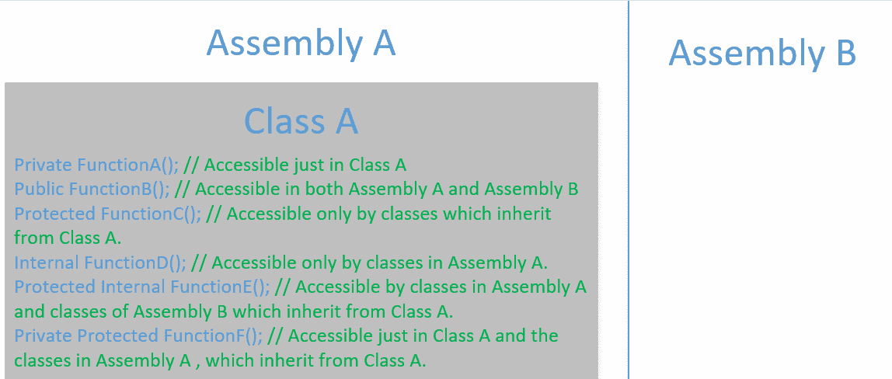
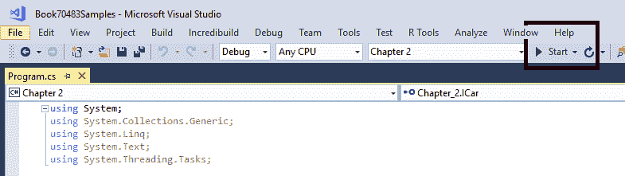
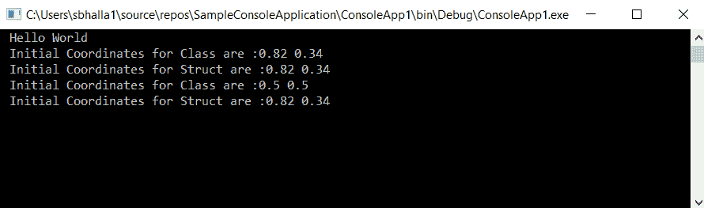
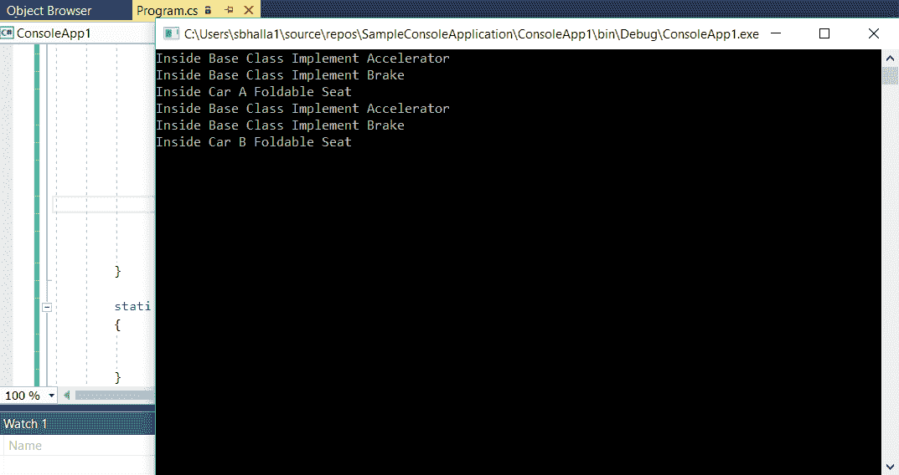
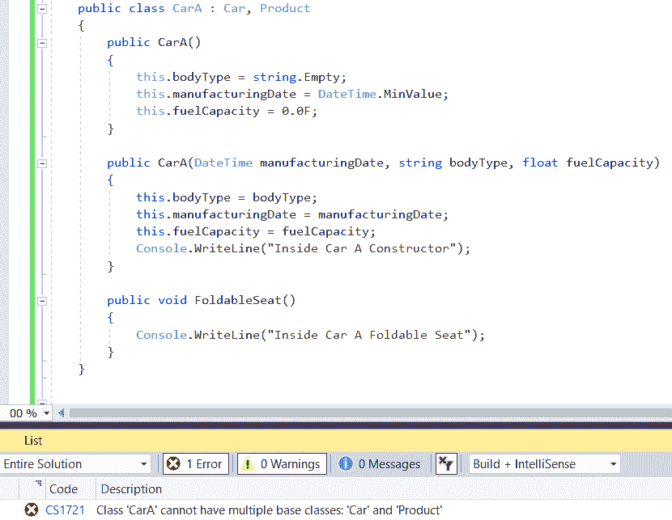
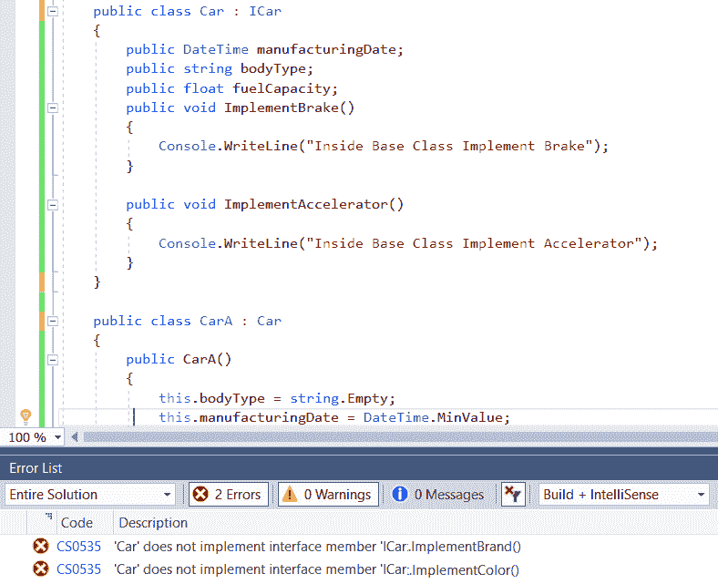

# 理解类、结构体和接口

在第一章“学习 C#基础知识”中，我们查看了一个 C#应用程序非常基本组件的概述。C#应用程序中的所有类都由属性和方法组成。使用命名空间和程序集，我们可以将相关的类捆绑在一起。

为了保持结构并减少复杂性，确保只暴露必要的类/功能在类的作用域之外是至关重要的。在 C#程序中，这是通过访问修饰符实现的。在定义类中的属性时，我们还需要清楚 C#中可用的不同变量数据类型。

通过对结构体和类的代码实现进行使用，我们将探讨在程序执行期间数据类型和引用类型变量在实现和行为上的差异。我们还将探讨一些良好的实践，以便为我们的变量选择正确的数据类型。

我们接下来将探讨接口和继承，以及它们在 C#应用程序中的实现方式。通过示例，我们将探讨在不同场景下应该使用它们的各种情况。

本章将涵盖以下主题：

+   C#中的不同访问修饰符类型

+   C#中的不同数据类型

+   理解类与结构体的区别

+   理解继承

+   理解接口及其与继承的不同之处

# 技术要求

与本书的前几章一样，本章中解释的程序将在 Visual Studio 2017 中开发。

本章的示例代码可以在 GitHub 上找到，地址为[`github.com/PacktPublishing/Programming-in-C-Exam-70-483-MCSD-Guide/tree/master/Book70483Samples`](https://github.com/PacktPublishing/Programming-in-C-Exam-70-483-MCSD-Guide/tree/master/Book70483Samples)。

# 访问修饰符

所有类，包括它们各自的属性和函数，都与一个访问修饰符相关联。访问修饰符基本上指示了相应元素在应用程序中的访问方式，包括其自身的程序集以及其他程序集。在应用程序中，属性和函数统称为类成员。

在 C#中，类及其类成员可以采用以下访问修饰符：

+   **公共**：声明为*公共*的类或类成员可以被同一程序集内的所有类以及应用程序中不同程序集的类访问。

+   **私有**：声明为*私有*的类成员只能在同一类中访问，不能在类外访问。

+   **受保护**：声明为*受保护*的类或类成员可以在类内部或由继承自该类的类访问。

+   **内部**：声明为*内部*的类或类成员只能被同一程序集内的类访问，但不能被外部程序集访问。

+   **受保护的内部（Protected internal）**: 声明为 *protected* *internal* 的类或类成员只能被同一程序集中的类或在外部程序集中继承自相应类的类访问。

+   **私有受保护的（Private protected）**: 声明为 *private protected* 的类或类成员只能在同一类或同一程序集中继承自相应类的类中访问。

让我们看一下以下图片来总结关于访问修饰符的知识。在以下示例中，我们在应用程序中有 **Assembly A** 和 **Assembly B**。**Assembly A** 中有 **Class A**，它有不同的函数，每个函数都有一个单独的访问修饰符。请参考每个函数旁边的注释，了解哪些类在哪些程序集下可以访问相应的函数：



根据我们希望嵌入的不同类成员的可访问级别和安全级别，我们可以选择之前提到的任何访问修饰符。为了保持一些结构并避免引入不必要的复杂性，建议只将类成员暴露给需要与相应类共享一些信息的类。

在下一节中，我们将探讨类成员可以获取的不同数据类型。

# C#中的数据类型

在 C# 中，一个变量可以获取以下类型之一：

+   值类型

+   引用类型

C# 在程序执行期间根据这些值在 **全局程序集缓存**（**GAC**）中的保存和维护方式来区分这两种类型。值类型变量保存在堆栈中，而引用类型变量保存在一个托管堆数据结构中。

有其他 **指针类型** 允许我们访问变量的内存位置中的值。在 第八章，*C# 中类型创建和使用*，我们将详细探讨这些数据类型。现在，让我们看看这两种数据类型，并详细探讨它们。

# 值类型变量

在值类型中，变量包含数据或变量的内容。这意味着如果对程序的不同作用域中的值类型变量进行了更改，则更改将不会在控制权转移到调用函数时反映回来。

以下是在 C# 中的不同值类型。

# 简单类型

以下是一系列简单类型：

+   `Int`: 例如 1, 2, 4 和 -100。它们可以是带符号的也可以是无符号的。带符号的 `int` 类型可以是正数也可以是负数。无符号的 `int` 类型不能是负数；它的最小值是 `0`。

+   `Float`: 例如，3.14。

+   `Long`: 与 32 位的 `Int` 不同，`Long` 是 64 位整数值。它也可以是带符号的或无符号的。

+   `Decimal`: 与 `Float` 类似，十进制数据类型也代表十进制数字，主要区别在于精度。对于 `Float` 数据成员，精度为 7；然而，在十进制数据类型的情况下，精度为 28 位数字。

+   `Char`: 表示单个字符序列。它可以获取诸如 `C`、`c` 或空白字符，任何特殊字符（如 % 和 #）以及数字（如 1）等值。

+   `bool`: 可以用来表示获取数字值（如真或假）的变量。

# 枚举类型

枚举类型用于表示可以获取一组常量值的属性，例如，`enum Day {Sat, Sun, Mon, Tues, Wed, Thurs, Fri}`。

默认情况下，声明中第一个枚举值的值从 0 开始。然后，它将后续枚举值的值增加 1。对于前面的例子，枚举值的值如下：

+   `Sat` – 0

+   `Sun` – 1

+   `Mon` – 2

+   `Tues` – 3

+   `Wed` – 4

+   `Thurs` – 5

+   `Fri` - 6

我们还可以通过在声明本身中显式定义值来覆盖枚举的默认值。例如，在前面的例子中，如果我们不希望枚举值从 0 开始，我们可以使用以下声明：

```cs
enum Day {Sat = 1, Sun, Mon, Tues, Wed, Thurs, Fri}
```

对于前面的声明，枚举值将获取以下值：

+   `Sat` – 1

+   `Sun` – 2

+   `Mon` – 3

+   `Tues` – 4

+   `Wed` – 5

+   `Thurs` – 6

+   `Fri` – 7

每个枚举属性都有一个底层数据类型，默认情况下是 `Int` 类型。如果需要，我们还可以将枚举值的类型更改为长或短。然而，它不能将 `char` 作为底层数据类型。参考以下 `enum` 声明，其中我们将枚举值类型设置为 `short`：

```cs
enum Day : short {Sat = 1, Sun, Mon, Tues, Wed, Thurs, Fri}
```

# 结构体类型

就像类一样，C# 中的结构体可以用来将相关数据组合在一起。像类一样，它们可以有构造函数、字段和方法。然而，结构体和类的实现之间有一些区别。以下是一些关键区别：

| **特性** | **结构体** | **类** |
| --- | --- | --- |
| 类型 | 结构体作为值类型变量进行管理。这意味着分配给它们的对象值不会在不同的程序作用域中持久化。 | 类作为引用类型变量进行管理。这意味着分配给它们的对象值将在不同的程序作用域中持久化。 |
| 构造函数 | 与类不同，C# 不管理默认构造函数。当我们进入 第八章，*在 C# 中创建和使用类型*，我们将详细探讨默认构造函数。 | 当声明一个类时，如果没有为类指定构造函数，C# 会自动为该类创建一个默认构造函数。 |
| 继承 | 结构体不能从另一个结构体继承。这意味着如果我们使用结构体，代码重用可能会成为一个挑战。 | 类可以从其他类继承。 |

作为值类型变量，当创建一个结构体对象时，整个对象——包括属性、方法等——都会保存在栈中。因此，从性能角度来看，结构体应该仅用于创建只有少数成员的轻量级对象。

在下一节中，我们将通过一个代码示例来展示结构体实现与类中类似实现的区别。

# 引用类型变量

在引用类型变量中，数据成员包含变量在内存中的确切地址。由于变量仅包含对内存地址的引用，两个独立的引用类型变量可以指向同一个内存地址。因此，如果对引用类型变量进行修改，修改将直接在变量的内存位置上进行。由于修改是直接在变量的内存位置上进行的，两个变量都将反映更新后的值。

以下是在 C#中可用的引用类型：

+   **类**: 如在第一章中讨论的，*学习 C#的基础知识*，类代表一组相关的属性和方法。

+   **接口**: 在 C#中，接口代表一组相关的属性、事件和方法，它只包含声明而没有定义。在本章的后续部分，我们将深入探讨接口，并了解它们在 C#中的实现方式。

+   **动态类型**: 动态类型变量避免了编译时的类型检查。例如，如果我们声明一个动态变量类型并将其分配给一个变量，那么它的类型将在运行时分配值时定义。

例如，在下面的代码片段中，我们创建了一个动态类型变量，将其分配给不同的变量，并在运行时评估其类型：

```cs
 dynamic typeVariable = 100;
 Console.WriteLine(typeVariable + " " + typeVariable.GetType().ToString());// Output 100 System.Int32
 typeVariable = "Hello";
 Console.WriteLine(typeVariable + " " + typeVariable.GetType().ToString());// Output Hello System.String
 typeVariable = true;
 Console.WriteLine(typeVariable + " " + typeVariable.GetType().ToString());// Output True System.Boolean
 Console.ReadLine();
```

+   **对象**: 当使用`new`关键字创建类的新的实例时，在内存中为该类创建一个对象。

+   **字符串**: `String`对象是一系列`Char`对象的序列，其值是不可变的或只读的。这基本上意味着，当我们修改类型为`String`的变量时，它会在内存中创建一个新的对象。

在下一节中，我们将通过一个代码示例来展示如何在 C#中实现引用类型变量（如`Class`）和值类型变量（如结构体），以及它们的行为差异。

# 结构体与类

在第一章中，我们创建了一个基本的`Hello World`程序。在本主题中，我们将扩展该程序并使用它来实现结构体和类。在这样做的时候，我们将分析引用类型变量和值类型变量的实现和使用之间的差异。如您所知，结构体是一个值类型变量，而类是一个引用类型变量：

1.  打开在 第一章，*学习 C# 基本结构* 中创建的 `Console` 项目，并声明一个具有 `x` 和 `y` 坐标两个成员属性的 `CoordinatePoint` 类。同时创建两个构造函数——一个不带参数，一个带两个参数。请参考以下代码实现：

```cs
class CoordinatePoint
{
    public float xCoordinate;
    public float yCoordinate;
    public CoordinatePoint()
    {
    }
    public CoordinatePoint(float x, float y)
    {
         this.xCoordinate = x; 
         this.yCoordinate = y;
    }
}
```

请注意，在前述代码中，使用 `this` 变量是可选的。它用于引用类的当前实例，并且可以在类成员和方法参数具有相同名称时用于区分它们。

1.  声明一个类似的结构体。注意，编译器会为默认构造函数报错：

```cs
struct CoordinatePointStruct
{
     public float xCoordinate;
     public float yCoordinate;
     public CoordinatePointStruct()
     {         
        // This default constructor will give an error. 
     }
     public CoordinatePointStruct(float x, float y)
     {
         this.xCoordinate = x;
         this.yCoordinate = y;
     }
 }
```

如前述代码所示，我们将在 `struct` 构造函数上看到一个红色标签。这是因为，与类不同，结构体不能有默认构造函数的实现。为了消除错误，我们需要删除默认构造函数。这样做之后，编译器错误就会消失。以下将是结构体的正确实现：

```cs
struct CoordinatePointStruct
{
     public float xCoordinate;
     public float yCoordinate;
     public CoordinatePointStruct(float x, float y)
     {
         this.xCoordinate = x;
         this.yCoordinate = y;
     }
 }
```

1.  在 `Main` 类中，我们现在将声明两个函数，分别对应于每个类和结构体。在这两个函数中，我们将通过名为 `obj` 的参数传递一个对象，该对象分别属于 `class` 和 `struct` 类型。在同一个函数中，我们将结构体和类中的 `x` 和 `y` 坐标变量值更改为默认值 `0.5F`。以下是该代码实现：

```cs
static void ChangeValuesClass(CoordinatePoint obj)
{
     obj.xCoordinate = .5F;
     obj.yCoordinate = .5F;
}
static void ChangeValuesStruct(CoordinatePointStruct obj)
{
     obj.xCoordinate = .5F;
     obj.yCoordinate = .5F;
}
```

1.  现在，在主函数中，声明类和结构体的对象。注意，在声明各自的对象时，我们在 `xCoordinate` 和 `yCoordinate` 成员属性中指定了相同的值。

为了解释说明，我们将编写将相应成员属性的值输出到控制台的语法。以下是该代码实现：

```cs
Console.WriteLine("Hello World");
CoordinatePoint classCoordinate = new CoordinatePoint(.82F, .34F);
CoordinatePointStruct structCoordinate = new CoordinatePointStruct(.82F, .34F);
Console.WriteLine("Initial Coordinates for Class are :" + classCoordinate.xCoordinate.ToString() + " " + classCoordinate.yCoordinate.ToString());
Console.WriteLine("Initial Coordinates for Struct are :" + structCoordinate.xCoordinate.ToString() + " " + structCoordinate.yCoordinate.ToString()); 
```

1.  现在编写语法来调用每个结构体和类的相应 `ChangeValues` 函数。在函数调用之后，再有一个语句来打印 `struct` 和 `class` 对象属性中的当前值。

有关此内容的代码实现，请参考以下代码：

```cs
ChangeValuesClass(classCoordinate);
ChangeValuesStruct(structCoordinate);
Console.WriteLine("Initial Coordinates for Class are :" + classCoordinate.xCoordinate.ToString() + " " + classCoordinate.yCoordinate.ToString());
Console.WriteLine("Initial Coordinates for Struct are :" + structCoordinate.xCoordinate.ToString() + " " + structCoordinate.yCoordinate.ToString()); 
```

1.  点击 Build | 构建解决方案，并确保没有编译时错误。

1.  点击 Debug | 开始调试。或者，用户也可以点击 *F5* 键或 Start 旁边的三角形图标来启动调试器。请参考以下截图：



注意，控制台显示了以下输出：



注意，在调用更改函数之后，`class` 对象的值会发生变化。然而，结构体中的值没有变化。

这是因为`struct`是一个值类型变量。因此，在函数作用域之外对对象的任何更改都没有影响，因为更改发生在内存中完全不同的对象上。

另一方面，`class`作为一个引用类型变量，也会受到函数作用域之外发生的更改的影响。因此，更改会传播回主对象。

总结来说，以下表格展示了`struct`和`class`类型变量之间的主要区别：

| **特性** | **类** | **结构体** |
| --- | --- | --- |
| 默认构造函数 | 如果一个类没有构造函数，那么每当为该类创建对象时，默认构造函数就会触发，并为类中存在的成员变量设置默认值。这些默认值是根据成员变量的类型默认值设置的。 | 与类不同，`struct`不能有任何默认构造函数。这意味着应用程序不会为`struct`的成员变量分配默认值。 |
| 内存实现 | 如前一个代码示例所示，类被实现为引用类型。这意味着类对象的值在程序执行的各个作用域中持续存在。 | 如前一个代码示例所示，`struct`被实现为值类型。这意味着它的值不会在程序执行的各个作用域中持续存在。 |
| 继承 | 我们将在本章以及下一章中详细探讨继承。然而，C#中的类可以继承自其他类。 | 与类不同，`struct`不能继承自其他`struct`或类。这意味着与类相比，在`struct`中代码重用稍微困难一些。 |

基于前面的差异，根据需求，开发者可以在`struct`和`class`之间选择合适的数据类型。

在下一节中，我们将探讨如何在 C#应用程序中实现接口。

# 接口和继承

接口是一组属性、方法和事件的集合，仅包含声明而没有定义。我们在编程中使用它们将必须实现的一组功能组合在一起，这些功能在理论上属于相同的基本类型。

让我们看看一个汽车的例子。在现实世界中，任何`Car`类的实现都必须实现某些常见的基本功能，如驾驶、停车和加速。除此之外，任何被归类为汽车的物体也将具有特定于汽车制造商的特征，如本田或尼桑。

在前面的例子中，一个接口可以帮助促进代码重用，并在所有类型的`Car`中维护结构。在这种情况下，我们可以将`Car`声明为一个接口，所有汽车派生类型，如尼桑或本田，都必须实现。

与接口类似，我们也可以在 C#应用程序中实现*继承*。在继承中，我们可以定义具有某些方法和属性的类，然后这些方法和属性可以在子类中继承。在接下来的小节中，我们将探讨如何在 C#应用程序中实现接口和继承。

继承是面向对象编程的主要支柱之一。在第三章《理解面向对象编程》中，我们将探讨与继承相关的高级特性，并了解它是如何工作的。

# 继承

继承是任何面向对象编程的主要原则之一。通过继承，我们可以在子类中定义可重用的属性和函数。简而言之，它帮助我们跨多个模块重用应用程序中编写的代码。让我们通过一个示例来了解继承是如何帮助我们的。

让我们考虑两辆车，`CarA`和`CarB`。从非常高级的角度来看，我们可以认为这两个类都将具有类似的功能，例如：

+   一个刹车函数

+   一个加速函数

+   一个车型；即柴油/汽油等

+   颜色

+   齿轮类型

如果我们需要在 C#应用程序中实现这一点，一种方法是将它们定义为两个独立的类：`CarA`和`CarB`。然而，这种方法的主要问题是这两个类都需要实现所列的共享功能。请参考以下代码，了解`CarA`在 C#中可能的实现方式：

```cs
public class CarA
{
     public DateTime manufacturingDate;
     public string bodyType;
     public float fuelCapacity;
     public void ImplementBrake()
     {
         Console.WriteLine("Inside Base Class Implement Brake");
     }
     public void ImplementAccelerator()
     {
         Console.WriteLine("Inside Base Class Implement Accelerator");
     }
     public void FoldableSeat()
     {
         Console.WriteLine("Inside Base Class Implement Accelerator");
     }
 }
```

类似地，请参考以下代码，了解`CarB`在 C#中可能的实现方式：

```cs
public class CarB
{
    public DateTime manufacturingDate;
    public string bodyType;
    public float fuelCapacity;
    public void ImplementBrake()
    {
        Console.WriteLine("Inside Base Class Implement Brake");
    }
    public void ImplementAccelerator()
    {
        Console.WriteLine("Inside Base Class Implement Accelerator");
    }
    public void RoofTopExtendable()
    {
         Console.WriteLine("Inside Car B Foldable Seat");
    }
 }
```

这种实现可能产生以下影响：

+   **没有代码复用**：正如您将从前面的示例中理解的那样，`CarA`和`CarB`都有一些共同的特征。然而，我们并没有分别维护这些共同特征，而是重复了代码，这可能会导致维护问题。

+   **可扩展性**：从商业/实施的角度来看，可能会有数百万种不同的车型。因此，对于每个新的`Car`或添加到`Car`实现中的新共同功能，我们可能会在应用程序中面临一些可扩展性的挑战。

如此清晰地展示，此类应用程序中的变更管理将是一场噩梦，并且执行起来非常困难。

现在，我们将使用继承的概念，看看如何以前更好的方式实现前面的场景。从实现的角度来看，我们将创建一个基类`Car`，它将包含所有跨不同`Car`实现中的共同成员变量。然后，我们将定义不同的`Car`类型，这些类型将继承自基类`Car`。让我们通过以下代码示例来更好地理解这一点：

1.  创建一个基类`Car`。该类将包含`CarA`和`CarB`中共同的成员属性：

```cs
public class Car
{
    public DateTime manufacturingDate;
    public string bodyType;
    public float fuelCapacity;
    public void ImplementBrake()
    {
        Console.WriteLine("Inside Base Class Implement Brake");
    }
    public void ImplementAccelerator()
    {
        Console.WriteLine("Inside Base Class Implement Accelerator");
    }
}
```

1.  创建一个类`CarA`，它将继承基类。在 C#中，我们使用`:`语法来定义继承：

```cs
public class CarA : Car
{
    public CarA()
    {
        this.bodyType = string.Empty;
        this.manufacturingDate = DateTime.MinValue;
        this.fuelCapacity = 0.0F;
    }
    public CarA(DateTime manufacturingDate, string bodyType, float fuelCapacity)
    {
        this.bodyType = bodyType;
        this.manufacturingDate = manufacturingDate;
        this.fuelCapacity = fuelCapacity;
        Console.WriteLine("Inside Car A Constructor"); 
    }
    public void FoldableSeat()
    {
        Console.WriteLine("Inside Car A Foldable Seat");
    }
}
```

如前所述，在父类内部声明的属性在派生类中自动可用。

请注意，基类中可用的属性取决于在基类中对应属性上使用的访问修饰符。

在我们的示例中，我们在基类中使用了`public`访问修饰符。如果它是`private`或`protected internal`，其在子类中的可访问性将不同。

让我们考虑一个场景，由于某种原因，我们还需要在`CarA`中声明一个同名的属性`bodyType`。在 C#中，我们可以通过使用`base`关键字来区分基类和派生类中存在的属性。请参考以下代码：

```cs
public class CarA : Car
{
     string bodyType;
     public CarA()
     {
         this.bodyType = string.Empty;
         base.bodyType = string.Empty;
         this.manufacturingDate = DateTime.MinValue;
         this.fuelCapacity = 0.0F;
     }
```

如果使用`base`，它指的是父类中的属性，如果使用`this`，它指的是子类中的属性。

1.  同样，为`CarB`声明一个类：

```cs
class CarB : Car
{
    public CarB()
    {
        this.bodyType = string.Empty;
        this.manufacturingDate = DateTime.MinValue;
        this.fuelCapacity = 0.0F;
    }
    public CarB(DateTime manufacturingDate, string bodyType, float fuelCapacity)
    {
        this.bodyType = bodyType;
        this.manufacturingDate = manufacturingDate;
        this.fuelCapacity = fuelCapacity;
        Console.WriteLine("Inside Car B Constructor");
    }
    public void RoofTopExtendable()
    {
        Console.WriteLine("Inside Car B Foldable Seat");
    }
}
```

请注意，在派生类中，我们也可以创建与基类无关的成员变量。如前述截图所示，`CarA`类有一个`FoldableSeat`的实现，这在基类中不存在。

同样，`CarB`类有一个`RoofTopExtendable`的实现，这在基类中不存在。

1.  在主方法中，声明`CarA`和`CarB`对象并调用相应的方法：

```cs
CarA carA = new CarA();
carA.ImplementAccelerator();
carA.ImplementBrake();
carA.FoldableSeat();

CarB carB = new CarB();
carB.ImplementAccelerator();
carB.ImplementBrake();
carB.RoofTopExtendable();
Console.ReadLine();
```

1.  点击“构建 | 构建解决方案”。注意，没有编译时错误。现在点击“调试 | 开始调试”。注意，以下输出出现在控制窗口中：



以下是对每个输出行项的简要分析：

+   我们首先调用的方法是`ImplementAccelerator`，它存在于基类中。正如预期的那样，它执行了基类中的方法。

+   同样，下一个我们调用的方法是`ImplementBrake`，它也存在于基类中。在这种情况下，基类中的方法也会被执行。

+   在下一次调用中，我们执行了仅存在于`CarA`中的方法。在这种情况下，控制执行该函数中的代码。

+   同样适用于 B。

因此，使用继承，我们可以提高代码的重用程度，同时使维护活动变得相当可扩展。

一旦我们进入第三章，*理解面向对象编程*，我们将介绍更多关于继承的功能，例如重写密封的、抽象的类等。然而，现在我们将介绍接口如何帮助我们进行 C#代码开发。

# C#中的接口

在前面的例子中，我们展示了如何声明一个具有一些成员变量的基类，并在派生类中继承它们。然而，在某些情况下，我们可能需要从一个类继承两个不同的类。此外，如果我们使用的是结构体，我们将无法从另一个结构体或类继承。

不幸的是，由于以下原因，使用继承，我们无法在 C#应用程序中实现这一点：

+   C#中不允许多重继承。

+   C#中的结构体数据类型不能从其他结构体或类类型继承。

在这种情况下，接口非常有用。接口定义了一组相关的方法和属性，每个实现接口的类都必须实现这些方法和属性。请注意，接口必须只有声明。

关于接口，声明指的是方法的规范及其签名——即输入和输出参数——而定义则指的是方法体中逻辑的实际实现。在讨论以下代码示例时，我们将进一步探讨这一点。

让我们看看我们用于继承的例子，看看我们如何在其中使用接口：

+   在前面的例子中，我们创建了`CarA`和`CarB`，我们可以推断出它肯定还有其他一些属性，例如颜色、重量、高度、品牌、标志、制造商等。

+   从数据模型的角度来看，我们可以将它们归类为任何*实用工具或产品*的通用属性，而不仅仅是汽车。

+   因此，当我们选择产品时，我们可以这样说，有一些操作，如`ImplementBrand`、`ImplementColor`等，将在所有产品实现中是通用的，而不仅仅是针对`CarA`和`CarB`。

+   因此，这意味着这两个类必须从`Car`和`Product`两个类继承才能正确运行。

让我们尝试创建另一个基类`Product`，并尝试为`CarA`实现多重继承。以下是`Product`类的代码实现：

```cs
public class Product
{
    public void ImplementBrand()
    {
        Console.WriteLine("Inside Base Class Implement Brake");
    }
    public void ImplementColor()
    {
        Console.WriteLine("Inside Base Class Implement Accelerator");
    }
}
```

然而，当我们尝试为`CarA`类实现多重继承时，编译器会给出错误。以下截图显示了编译器给出的错误：



一种解决方案是将`Car`和`Product`的实现合并在一起；然而，从数据模型的角度来看，这两个实体之间并没有直接关系。

为了克服上述困境，我们将使用接口。在声明接口时，我们需要遵守以下约定：

+   要声明接口，我们需要使用`interface`关键字。

+   接口不能为任何函数声明指定访问修饰符。

+   接口也必须只包含函数声明，而没有定义。

以下是`ICar`接口的代码语法，其中我们声明了接口中应该有的方法：

```cs
public interface ICar
{
     void ImplementBrake(); 
     void ImplementAccelerator();
     void ImplementBrand();
     void ImplementColor();
 }
```

请注意，在前面的例子中，我们只指定了接口中存在的方法应该获得的签名。这被称为声明。实现此接口的类——在我们的例子中是`Car`类，将负责为接口中存在的方法提供完整的实现。

要实现接口，我们可以使用类似于继承的语法。以下是这个语法的截图：



检查编译时错误。错误表明`Car`类必须实现接口中声明的所有函数。为了克服前面的错误，我们必须定义接口中的所有函数。类似于`ICar`，我们也可以为`IProduct`创建一个接口，然后`CarA`和`CarB`类可以分别实现它。

虽然继承和接口可以在类似场景中使用，但它们之间的一些差异如下：

| **特性** | **继承** | **接口** |
| --- | --- | --- |
| 多重继承 | 一个类只能从一个类继承。 | 一个类可以实现多个接口。 |
| 数据类型 | 一个类可以继承自另一个类。然而，一个结构不能从另一个类或结构继承。 | 类和结构都可以实现接口。 |
| 方法定义 | 在继承中，基类可以定义方法。 | 接口不能有针对方法的定义。 |
| 访问修饰符 | 基类及其成员属性可以采用不同的访问修饰符，例如`public`、`private`、`protected`、`protected internal`和`private protected`。 | 接口的访问修饰符始终是`public`。 |

基于这些差异，程序员可以决定他们应用程序的正确方法，并在创建接口或通过继承管理之间进行选择。

# 摘要

本章涵盖的是 C#语言编程的基础知识。通过使用访问修饰符，我们可以控制应用程序不同模块中不同属性和方法的可访问性。在编写代码时，人们常犯的一个非常常见的错误是将所有属性和方法声明为 public。这不是 C#编程中推荐的做法。我们必须对类中存在的每个属性和方法是否需要不同的访问修饰符进行逻辑评估。

同样，我们应该分析我们需要与类中使用的每个属性关联的数据类型。我们还必须分析我们是否需要一个引用数据类型变量，或者我们是否可以接受值类型变量，因为它们在编译器内存和功能上有所不同。我们还应该利用继承，因为它有助于我们重用代码并以非常精确的方式组织程序。

在下一章中，我们将介绍面向对象的概念，这些是任何高级编程语言（如 C#）的主要构建块。我们将讨论多态、抽象、封装和继承，并详细理解这些概念，同时也会通过一些代码示例来查看它们的实现。

# 问题

1.  在`Car`类中声明的以下哪个属性不是值类型变量？

    1.  `public Decimal fuelCapacity;`

    1.  `public Enum carColor;`

    1.  `public String registrationNumber;`

    1.  `public Int numberOfSeats`

1.  以下哪个不是引用类型变量？

    1.  类

    1.  字符串

    1.  结构体

    1.  接口

1.  在 C#中，一个子类可以继承自多个父类。这个陈述正确吗？

    1.  是

    1.  否

1.  以下关于接口和类的陈述哪个是不正确的？

    1.  一个类可以实现多个接口。

    1.  一个接口可以同时有函数声明和定义。

    1.  结构体数据变量不能从另一个结构体继承。

    1.  在继承中，如果基类和派生类都有一个同名函数，我们可以使用`*base*`关键字来隐式调用基类的函数。

1.  以下关于访问修饰符的陈述哪个是不正确的？

    1.  如果一个成员变量被声明为`public`，它可以在整个应用程序中被访问。

    1.  如果一个成员变量被声明为`private`，它只能在同一类中访问。

    1.  如果一个成员变量被声明为`protected`，它可以在整个命名空间中被访问。

    1.  如果一个成员变量被声明为`protected internal`，它可以在名称空间中的类以及从它派生的类中访问。

# 答案

1.  `public String registrationNumber;`。字符串是一个引用类型变量。所有其他都是值类型变量。

1.  **结构体**是一个值类型变量，与所有其他都是引用类型变量不同。

1.  **不**，在 C#中我们不能有多个继承。一个类只能从一个基类继承。

1.  在 C#中，一个接口必须只有函数声明而没有定义。所有其他陈述都是正确的。

1.  如果一个成员变量被声明为`protected`，它只能在继承自其基父类的类中访问。
