# 理解面向对象编程

当我们编写任何程序时，除了确保它满足所需的目的外，我们还必须确保考虑以下方面：

+   **代码重用**：我们必须尝试以这种方式实现程序流程，以便可以在多个模块中使用常见的功能。

+   **代码维护**：我们必须接受任何编写的程序代码都难免会有一些错误。然而，我们必须确保编写的代码清晰且结构化，以便易于理解和维护。

+   **设计模式**：设计模式允许我们以这样的方式编写程序，即存在一个通用的模板/结构/功能，可以在多个模块中使用。这确保了应用程序的性能不会受到影响，这是任何程序应用的关键方面。

在过程语言中实现所有这些方面都是困难的。然而，使用面向对象编程，这是任何高级编程语言的主要本质，我们可以实现上述目标。

在本章中，我们将涵盖以下主题：

+   理解面向对象编程

+   理解封装

+   理解抽象

+   理解继承

+   理解多态

我们还将通过代码示例来了解这些特性如何在 C#应用程序中实现。

# 技术要求

如本书前面的章节，我们将要涵盖的程序将在 Visual Studio 2017 中开发。

本章的示例代码可以在本书的 GitHub 仓库中找到：[`github.com/PacktPublishing/Programming-in-C-Exam-70-483-MCSD-Guide/tree/master/Book70483Samples`](https://github.com/PacktPublishing/Programming-in-C-Exam-70-483-MCSD-Guide/tree/master/Book70483Samples)。

# 理解面向对象编程

面向对象编程是一种基于对象的编程概念。对象是一组相关数据，如字段和过程，即方法。例如，一个对象可以是任何东西，从非常简单的对象，如铅笔，到非常复杂类型，如汽车。每个对象都将有其自己的属性集，即属性和在该对象中实现的方法或函数。例如，对于汽车对象，可能的属性可以是颜色、注册号、型号等。可能的功能可以是启动、停止和加速。

在面向对象编程出现之前，我们根据过程编程的原则进行编程。在过程语言中，应用程序被划分为一系列函数。程序中使用的数据存储在一组局部变量中，这些变量被函数使用。这构成了像 COBOL 和 BASIC 这样的传统编程语言的基础。

这种编程概念的主要缺点如下：

+   **没有代码重用**：由于整个应用程序被划分为一系列顺序函数，在这个编程概念中没有代码重用。

+   **维护和可扩展性**：以下图表只是展示了用过程式语言编写的典型程序运行方式的示意流程。在程序中，块表示不同的代码函数，它们相互连接并相互作用以完成任务：

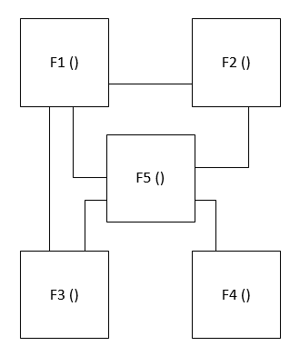

在这里，就像在用过程式语言编写的任何典型程序中一样，会有许多函数，它们传递参数并以概念方式执行。因此，对其中任何一个函数所做的任何更改或升级都有很大可能导致另一个函数的执行出现问题。因此，从维护和可扩展性的角度来看，用过程式语言编写的应用程序将面临挑战。

在面向对象编程中，每个应用程序都可以划分为具有自己属性和过程的多个对象。例如，让我们考虑我们在上一章中探讨的相同汽车场景。一辆车可以有以下属性和方法：

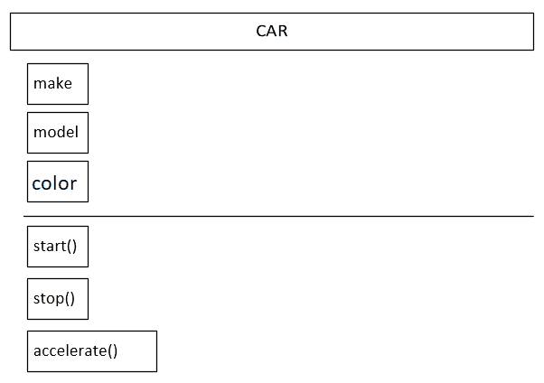

现在，在面向对象编程语言中，我们可以直接声明一个`car`对象，设置与属性相关的值，并调用相应的属性，例如启动。

由于对象与相应的属性分组，我们不需要为相应的属性传递任何数据。相反，在执行`start`、`stop`或`accelerate`等相应函数时，我们可以将这些属性作为函数参数列表传递数据。

因此，在这种情况下，如果我们未来更改`car`类的`start()`函数，我们就不需要麻烦所有其他调用它的地方。

与在过程式语言中按标准方式做事相比，这在应用的可维护性和可扩展性方面是一个重大升级。

现在，让我们深入探讨面向对象语言的四个支柱，并了解我们如何在 C#应用程序中使用它们。

# 理解封装

封装基本上涉及将所有相关的属性和方法以及访问它们的方式组合在一个对象中。在应用程序设计时，我们需要决定在其中定义多少个对象，以及它所拥有的相关属性和方法。

例如，在汽车示例中，我们有以下相关属性和方法：

+   `car`是一个对象。

+   `make`、`model`和`color`是对象中存在的不同属性。

+   `start`、`stop`和`accelerate`是对象中存在的不同方法。

封装使我们能够在任何应用程序中实现以下功能：

+   **安全性**：使用封装，我们可以以这种方式定义我们的属性，即不是所有对象的属性都暴露给整个应用程序。在第二章《理解类、结构和接口》中，我们使用了访问修饰符来控制类/命名空间/程序集以及整个应用程序中任何属性/方法的访问安全性。

+   **代码维护**：从函数的维护角度来看，总是希望函数具有尽可能少的属性。

使用封装，我们可以将函数所需的参数组织为类的属性，因此我们不需要在每次调用中明确传递它们。

在以下代码示例中，我们将通过 C#代码示例来了解如何实现这一点。

# 代码示例

让我们考虑一个银行应用程序的例子。在这个银行应用程序中，我们需要实现一个与开户相关的场景。

从类实现的角度来看，以下是在`Account`类中应该存在的可能属性。请注意，还将有一个额外的类`Customer`，以表示开设账户的人：

+   `openingDate`

+   `customer`

+   `float currentBalance`

以下是`Account`类中可能存在的一些方法：

+   `bool OpenAccount();`

+   `bool depositMoney(float deposit);`

+   `bool withdrawMoney(float withdrawalAmt);`

关于`Customer`类，我们现在将保持简单，并定义以下属性：

+   `string name`

+   `string customerId`

请参考以下代码，了解 C#程序中`Customer`类的声明。在这里，我们创建了一个`Customer`类，并在其中定义了两个属性，即客户的姓名和一个`CustomerID`字段，这将为客户提供一个唯一的字段。

在以下代码中，我们将声明两个变量，并使用它们来展示我们之前提到的运算符的示例：

```cs
using System;
using System.Collections.Generic;
using System.Linq;
using System.Text;
using System.Threading.Tasks;

namespace ConsoleApp1
{
    public class Customer
    {
        public string name;
        public string customerId;
    } 
}
```

请参考以下代码，了解 C#程序中`Account`类的声明：

```cs
public class Account
{
  public DateTime openingDate;
  public Customer customer;
  private float currentBalance;
  public bool OpenAccount(Customer customer)
  {
     this.openingDate = DateTime.Now.Date;
     this.currentBalance = 0.0f;
     this.customer = customer;
     return true;      
  }  
  public bool DepositMoney(float deposit)
  {
     if(deposit > 0.0f)
     {
         this.currentBalance = this.currentBalance + deposit;
         return true;
     }
     else
     {
         return false;
     }
  }
  public bool WithdrawMoney(float withdraw)
  {
     if(this.currentBalance >= withdraw)
     {
         this.currentBalance = this.currentBalance - withdraw;
         return true;
     }
     else
     {
         return false;
     } 
  }
}
}
```

以下是实现中的关键项目：

+   在`Account`类中，请注意`currentBalance`被标记为私有，因为客户可能不希望他们的余额暴露给整个应用程序。

+   在`Account`类中，在`OpenAccount`、`DepositMoney`和`WithdrawMoney`这些方法中，我们没有传递与客户、当前余额或开户日期相关的所有属性。这是因为所需的属性已经在`Account`类中分组在一起。

现在，让我们看看我们将如何调用这些类：

```cs
Customer customer = new Customer();
customer.name = "Sample Customer";
customer.customerId = "12345";

Account newAccount = new Account();
newAccount.OpenAccount(customer);
newAccount.DepositMoney(1000);
newAccount.WithdrawMoney(400);
```

如果你查看函数调用部分，你会理解，因为属性与`Account`类相关联，所以我们没有明确地将它们传递给函数。因此，如果函数的实现发生变化，从维护的角度来看，影响将会最小。

因此，始终使用封装原则并将应用程序划分为包含相关信息的类块是有益的。

# 理解抽象

抽象也是面向对象编程中的一个概念，意味着当我们编写代码时，我们应该隐藏实现的外部复杂性和细节。

换句话说，当我们编写一个程序，在接收输入后执行一系列复杂操作并返回输出时，我们应该隐藏程序内部操作的内层复杂性，以便外部应用程序只需关注它们发送给应用程序的输入以及从应用程序获得的输出。

例如，让我们考虑我们在上一个示例中处理过的相同的`Account`示例。如果我们考虑`OpenAccount`函数的示例，你会理解为客户开设账户不会那么简单。在我们最终为客户开设账户之前，需要执行几个子任务。例如，以下是一些可能的步骤：

+   核实客户的身份证明文件

+   链接和开设不同的银行账户，这些可能是`Salary`、`Current`和`Savings`

+   获取，即计算客户的初始存款金额

基本上，在现实生活中，我们上面所写的函数将看起来更接近以下代码片段。在`OpenAccount`函数中，我们传递了一个`Customer`对象。在为客户创建银行账户之前，我们执行了三个不同的任务：

1.  `VerifyCustomerIdentity()`: 在这个函数中，我们的想法是验证客户的身份，这是在开设账户之前的一个常见做法。

1.  `OpenAndLinkRelatedAccounts()`: 在这个函数中，我们的想法是为同一客户开设不同的账户，即`Savings`、`Current`和`Salaried`。

1.  `RetrieveAndCountDeposit()`: 在这个函数中，我们的想法是检索客户打算存入的金额，对其进行计数，并将其最终存入客户的账户：

```cs
public bool OpenAccount(Customer customer)
{
    this.openingDate = DateTime.Now.Date;
    this.currentBalance = 0.0f;
    this.customer = customer;
    if(VerifiyCustomerIdentity() && OpenAndLinkRelatedAccounts() && RetrieveAndCountDeposit())
      {
        return true;
      }
    else
    {
        return false;
    } 
}
private bool VerifiyCustomerIdentity()
{
    //This function will verify the customer documents.
    return true;
}
private bool OpenAndLinkRelatedAccounts()
{    
    //This function will open the related accounts of savings , current and salary and link them together.
    return true;
}
private bool RetrieveAndCountDeposit()
{
    //This function will fetch the deposit, count and verify the amount.
    return true;
}
public bool DepositMoney(float deposit)
{
     this.currentBalance = this.currentBalance + deposit;
     return true;
} 
```

请注意以下事项：

+   这三个函数，即`VerifyCustomerIdentity()`、`OpenAndLinkRelatedAccounts()`和`RetrieveAndCountDeposit()`，都具有`Private`作为访问修饰符。这将确保这三个函数中的复杂性不会被暴露在外。

+   这三个函数在`OpenAccount`函数内部被调用，因此调用应用程序不需要担心显式调用这些函数。

+   假设我们在内部私有函数中发现了某些问题。在这种情况下，我们可以轻松地对这些内部函数进行更改，而无需担心外部实现。

# 理解继承

如果你已经阅读了第二章，*理解类、结构和接口*，你将已经知道继承如何帮助我们实现代码重用和减少维护，以及它如何让我们对整个应用程序拥有更多的控制。

我们还查看了一些代码示例，了解了继承的工作原理以及它在 C#中的实现方式。现在，我们将探讨继承的一些高级特性，它们的使用方法以及如何在 C#中实现。

# 方法重写

方法重写是 C#中的一种技术，我们可以用它来调用从基类派生出来的类中定义的方法。在方法重写中，派生类实现了一个在基类中声明且具有相同签名的函数：

+   与基类中声明的函数相同的名称

+   函数中相同数量和类型的参数

+   与基类中声明的函数相同的返回类型

在 C#中，方法重写是通过以下两种方法实现的：

+   **虚方法**：虚方法是在基类中定义的，也可以在派生类中定义或重写的方法。请注意，当一个方法被声明为虚方法时，在基类中定义该方法的实现是可选的。如果已经定义了，那么派生类进一步重写它的可能性就更加可选了。一个方法通过使用`*virtual*`关键字被声明为虚方法。

+   **重写**：一旦在基类中将方法声明为`virtual`或`abstract`，那么通过使用`*override*`关键字，派生类可以重新定义方法以供自身使用。在本节中，我们将探讨`*virtual methods*`。在下一节`*抽象和密封类*`中，我们将深入探讨`*abstract*`方法。

让我们通过一个代码示例来了解方法重写是如何在 C#中实现的。假设我们有一个基类`Car`和两个从`Car`类继承的类`Ferrari`和`Suzuki`。为了解释方便，我们将保持简单，只为这三个类指定一个默认构造函数和一个共同的`Accelerate`方法。以下将是相同的代码实现：

```cs
public class Car
{
     public Car()
     {
         Console.WriteLine("Inside Car");
     }
     public void Accelerate()
     {
         Console.WriteLine("Inside Acceleration of Car");
     }     
}
public class Ferrari : Car
{
     public Ferrari()
     {
         Console.WriteLine("Inside Ferrari");
     }
     public void Accelerate()
     {
         Console.WriteLine("Inside Acceleration of Ferrari");
     }     
}
public class Suzuki : Car
{
     public Suzuki()
     {
         Console.WriteLine("Inside Suzuki");
     }
     public void Accelerate()
     {
         Console.WriteLine("Inside Acceleration of Suzuki");
     }     
 }
```

现在，让我们使用以下代码为这些类创建一些对象：

```cs
Car ferrari = new Ferrari();
ferrari.Accelerate();
Console.WriteLine("End of Ferrari Implementation");
Car suzuki = new Suzuki();
suzuki.Accelerate();
Console.WriteLine("End of Suzuki Implementation"); 
```

注意，在上述代码中，我们创建了一个`Ferrari`类的新对象，并将其分配给一个类型为`Car`的变量`ferrari`。同样，我们也创建了一个`Suzuki`类的新对象，并将其分配给一个类型为`Car`的变量`suzuki`。

当我们执行代码时，我们得到以下输出：

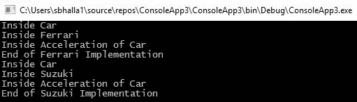

注意，尽管我们在父`Car`类和派生的`Ferrari`和`Suzuki`类中都有`Accelerate`方法，但当我们从`ferrari`对象调用`Accelerate`方法时，它调用的是父`Car`类中存在的`Accelerate`方法。这是由于变量的类型是`Car`，尽管它被实例化为`Ferrari`和`Suzuki`子类的对象，但基类中的方法尚未被重写。

现在让我们对实现进行轻微的修改，并在基类中将方法声明为`virtual`，将派生自该类的类中的方法声明为`override`：

```cs
public class Car
{
     public Car()
     {
         Console.WriteLine("Inside Car");
     }
     public virtual void Accelerate()
     {
         Console.WriteLine("Inside Acceleration of Car");
     }     
}
public class Ferrari : Car
{
     public Ferrari()
     {
         Console.WriteLine("Inside Ferrari");
     }
     public override void Accelerate()
     {
         Console.WriteLine("Inside Acceleration of Ferrari");
     }     
}
public class Suzuki : Car
{
     public Suzuki()
     {
         Console.WriteLine("Inside Suzuki");
     }
     public override void Accelerate()
     {
         Console.WriteLine("Inside Acceleration of Suzuki");
     }     
 }
```

现在，再次执行相同的代码，并回顾我们收到了以下输出：

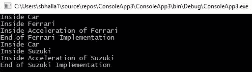

注意，现在，`Accelerate`方法执行的是`Ferrari`和`Suzuki`派生类中提到的代码，而不是`Car`父类中指定的代码。

在本章的后面部分，我们还将深入研究多态。有两种类型的多态：运行时多态和编译时多态。运行时多态是通过方法重写实现的。

在下一节中，我们将探讨`abstract`类，并探索在`abstract`类中使用`virtual`方法。

# 抽象类

C#中的`abstract`类是一个不能实例化的类，也就是说，程序执行不能创建此类对象。相反，这些类只能作为其他类继承的基类。

我们在需要所有派生类都实现基类中声明的特定函数的具体实现的情况下使用`abstract`类。以下是一些`abstract`类的属性：

+   就像所有其他类一样，一个`abstract`类可以同时拥有函数和属性。

+   `abstract`类可以同时拥有抽象和非抽象函数。

让我们看看一个程序来分析`abstract`类是如何工作的。我们将使用`abstract`关键字定义一个`Animal`类。现在，假设每种动物类型，如狗，说话的方式都不同，因此它们必须以自己的方式实现该函数。为了实现这一点，我们将我们的基`Animal`类声明为`abstract`，并在其中有一个`abstract`方法`Speak`。回顾一下，如果我们尝试实现`Speak`方法，编译器会抛出一个错误：

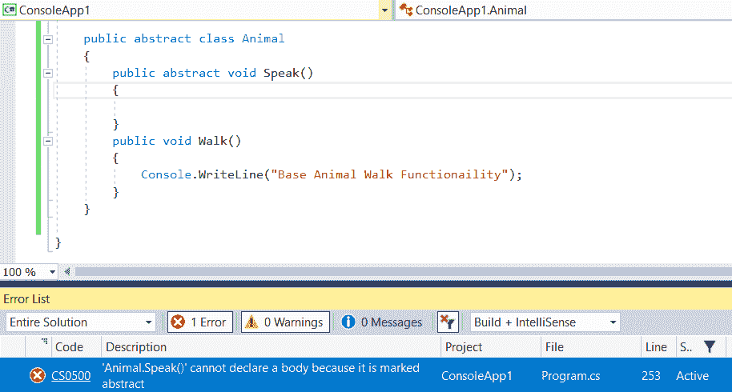

要移除这个错误，我们可以简单地移除`abstract`方法的声明：

```cs
public abstract class Animal
{
     public abstract void Speak();
     public void Walk()
     {
         Console.WriteLine("Base Animal Walk Functionality");
     }
}
```

现在，让我们创建一个继承自这个`Animal`基类的`Dog`类。注意，如果未实现`Speak`方法，编译器将抛出一个错误：

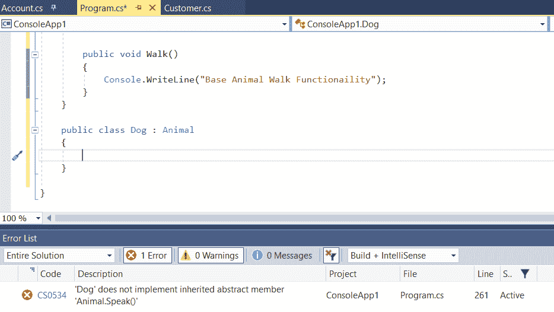

我们可以通过创建一个`Speak`函数的实现来克服这个错误：

```cs
public class Dog : Animal
{
     public override void Speak()
     {
         Console.WriteLine("A dog will bark");
     }
}
```

请注意，我们使用`override`关键字让编译器知道我们在派生类中重写了名为`Speak`的`abstract`函数的实现。

在下一节中，我们将探讨相同的例子，并了解`abstract`方法与`virtual`方法的区别。

# 抽象方法与虚拟方法

在前面的例子中，我们将`Speak`方法声明为`abstract`。这迫使我们的`Dog`类提供该方法的一个实现，否则我们会得到一个编译时错误。现在，如果我们不希望在代码中设置这种特定的限制，会怎样呢？

我们可以通过将`abstract`方法替换为`virtual`方法来实现这一点。以下是前面代码的更改实现：

```cs
public abstract class Animal
{
     public virtual void Speak()
     { 
     }
}
```

注意，当你编译代码时，没有错误。此外，仅为了实验，请在`Dog`类中注释掉`Speak`方法。

现在，编译程序。请注意，与前面的情况不同，当我们使用`abstract`方法时，不会出现编译时错误：

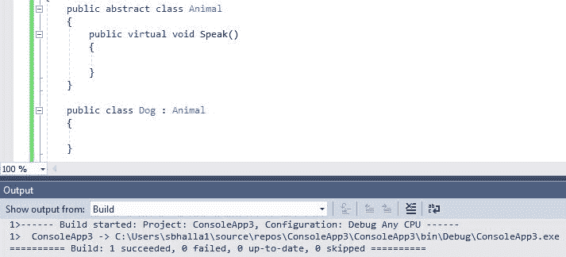

在下一节中，我们将探讨`sealed`类以及它们如何在 C#应用程序中实现。

# 密封类

C#中的`sealed`类是一个我们不希望任何派生类继承的类。一旦我们插入关键字`sealed`，如果派生类尝试从`sealed`类继承，编译器将给出一个编译时错误。以下是这个截图。为了解释的目的，我们将使用前面例子中使用的相同两个类：

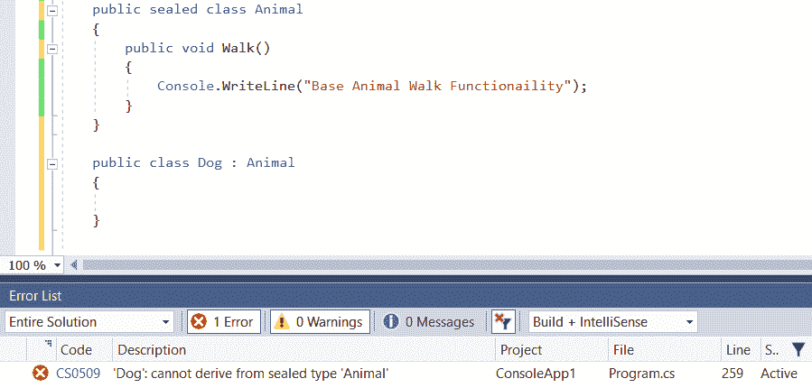

注意，`abstract`和`sealed`并不总是相辅相成的。`abstract`意味着该类永远不能被实例化，而`sealed`类表示该类永远不能被继承。因此，从后视镜来看，如果我们将`sealed`类声明为`abstract`，这就没有任何意义了。因此，如果我们尝试将`abstract`类声明为`sealed`，我们将得到一个编译时错误，如下所示：

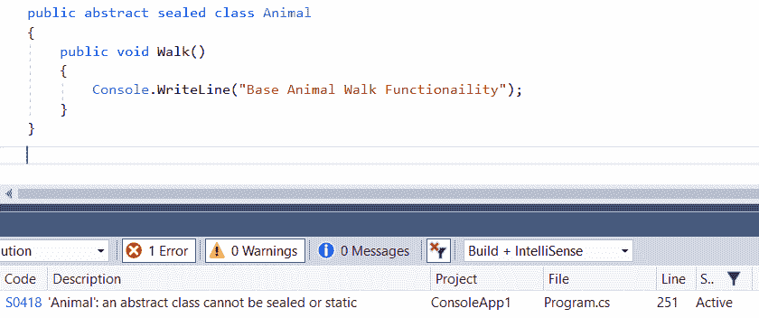

在下一节中，我们将探讨面向对象编程的另一个支柱，即*多态性*。

# 理解多态性

多态性是一个希腊词，其字面翻译为*多形态*。在编程术语中，它指的是一个接口具有多个功能。让我们通过以下图表来尝试理解多态性：

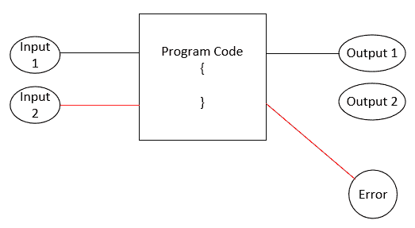

在前面的图表中，我们有一些在**输入 1**上运行的程序代码，并给出**输出 1**。现在，假设我们犯了一个错误，发送了错误的输入**输入 2**。在这种情况下，不幸的是，程序代码可能会出错并发送错误消息。在这种情况下，我们可以使用多态性。使用多态性，相同的例子将表示如下：

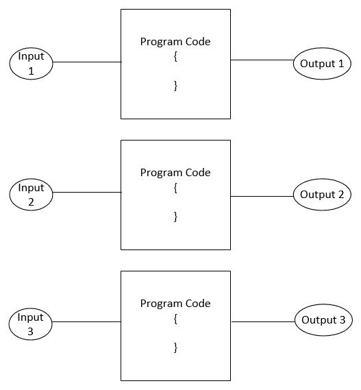

如我们所见，通过使用多态，我们将在内存中维护三份代码副本，并且根据接收到的输入类型，将加载和执行适当的程序代码副本。

在 C# 中可能存在两种多态类型：

+   静态/编译时多态，即方法重载或函数重载

+   执行时间多态，即方法重写或虚函数

让我们逐一介绍这些类型，并使用代码示例来了解它们是如何工作的。

# 静态/编译时多态

静态多态，也称为函数重载，涉及创建具有相同名称但参数数量或类型不同的函数。

编译器根据传入的输入加载适当的函数。让我们通过以下代码示例来了解它是如何工作的。在这里，我们将创建两个名为 `ADD` 的函数副本，这些副本在函数接受的参数数量方面有所不同：

```cs
static int AddNumber (int a, int b)
{
     Console.WriteLine("Accepting two inputs");
     return a + b;
}
static int AddNumber(int a, int b, int c)
{
     Console.WriteLine("Accepting three inputs");
     return a + b + c;
} 
```

现在，当调用函数时，根据传递的参数数量，将加载相应的函数：

```cs
int result = AddNumber(1, 2);
Console.WriteLine(result);
int result2 = AddNumber(1, 2, 3);
Console.WriteLine(result2);
Console.ReadLine();
```

程序执行后，我们将得到以下输出：

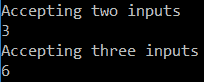

现在，让我们考虑另一个例子。在前面的例子中，我们根据参数数量实现了多态。在这个例子中，我们将根据参数类型实现多态。

1.  创建两个类，一个用于 `Dog`，另一个用于 `Cat`：

```cs
public class Dog 
{
}
public class Cat 
{
}
```

1.  创建两个具有相同名称的函数，一个接受 `Dog` 对象的输入，另一个接受 `Cat` 对象的输入：

```cs
static void AnimalImplementation(Dog dog)
{
    Console.WriteLine("The implementation is for a dog."); 
}
static void AnimalImplementation(Cat cat)
{
    Console.WriteLine("The implementation is for a cat.");
}
```

现在，当调用函数时，根据参数类型，将加载适当的函数：

```cs
Cat cat = new Cat();
Dog dog = new Dog();
AnimalImplementation(cat);
AnimalImplementation(dog);
Console.ReadLine();
```

当程序执行时，它将显示以下输出：

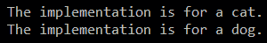

# 运行时多态

C# 中的运行时多态通过虚方法执行。在这种多态中，编译器通过在运行时识别其形式来执行代码。

在 *方法重写* 部分中，我们学习了虚方法，并看到了它们如何允许派生类覆盖基类中函数的实现。在运行时多态中，基类对象持有基类和派生类对象的引用。现在，根据基对象指向的对象，将加载适当的函数。

为了回顾我们对这一点的理解，让我们通过另一个代码示例。在这个例子中，我们将创建一个名为 `Animal` 的基类，它将被两个类 `Man` 和 `Dog` 继承。

以下是在 `Animal` 类中的实现：

```cs
public class Animal
{
     public int numOfHands;
     public int numOfLegs;
     public virtual void Speak()
     {
         Console.WriteLine("This is a base implementation in the base animal class");
     }
}
```

在 `Animal` 类中，我们声明了两个属性来表示 `Animal` 的 `numOfHands` 和 `numOfLegs`。我们还声明了一个名为 `Speak` 的函数，并将其标记为 `Virtual`，以便任何继承此类的类都可以提供自己的 `Speak` 功能实现。

我们将 `Speak` 函数声明为虚拟的，这意味着这个函数可以在派生类中被重写。

以下是在 `Dog` 类中的实现：

```cs
public class Dog : Animal
{
    public string breed;
    public Dog(string breed, int hands, int legs)
    {
        this.breed = breed;
        base.numOfHands = hands;
        base.numOfLegs = legs;
    }

    public override void Speak()
    {
        Console.WriteLine("A dog will bark , its breed is " + this.breed + " and number of legs and hands         are " + this.numOfLegs + " " + this.numOfHands);
    }
}
```

在这个实现中，我们创建了一个从 `Animal` 类继承的 `Dog` 类。`Dog` 类有一个名为 `Breed` 的属性和一个构造函数，该构造函数分别接受 `breed`、`hands` 和 `legs` 三个参数。我们还有一个 `Speak` 函数，以提供狗对象如何实现 `Speak` 功能的印象。

以下代码是另一个类 `Human` 的实现，它也将从 `Animal` 的基类继承：

```cs
public class Human : Animal
{
    public string countryOfCitizenship;
    public Human(string citizenship, int hands, int legs)
    {
         this.countryOfCitizenship = citizenship;
         base.numOfHands = hands;
         base.numOfLegs = legs;
    }
    public override void Speak()
    {
         Console.WriteLine("A man can speak multiple languages, its citizenship is " +                              this.countryOfCitizenship + " and number of legs and hands are " + this.numOfLegs + " " +                  this.numOfHands);
    }
}
```

在前面的代码中，我们做了以下操作：

+   我们从 `Animal` 的基类继承了 `Dog` 类。

+   我们在派生类中重写了 `Speak` 函数。

+   我们还在使用基类中声明的属性。

现在，让我们看看运行时多态是如何工作的。在下面的代码中，我们声明了一个基类 `Animal` 的对象，并将其指向派生类的对象：

```cs
Animal animal = new Animal();
animal.numOfHands = 2;
animal.numOfLegs = 4;
animal.Speak();

animal = new Dog("Labrador", 0, 4);
animal.Speak();

animal = new Human("India", 2, 2);
animal.Speak();
Console.ReadLine();
```

一旦我们执行这段代码，我们会注意到，根据基对象 `animal` 指向的类对象引用，将加载适当的 `Speak` 方法实现。这种加载是在运行时决定的，这就是为什么这被称为 **运行时多态**：

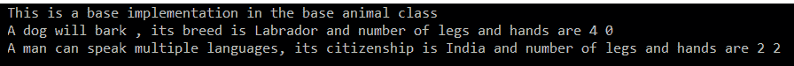

# 摘要

在这一章中，我们学习了面向对象编程，这是任何高级编程语言（包括 C#）的主要精髓。我们学习了 OOP 的四个支柱，即封装、抽象、多态和继承，并理解了它们如何帮助我们编写易于维护、可扩展且具有大量重用性的应用程序。

我们学习了封装如何通过将所有相关的属性和方法组合在一个类中来帮助我们保持代码的结构化。然后，我们学习了抽象如何帮助我们简化整个应用程序暴露的模块的复杂性。通过使用抽象，我们可以确保类的所有复杂性都不会暴露给外部类，这也帮助我们更好地维护应用程序。我们还学习了如何使用运行时和静态多态来实现可跨不同输入重用的相似功能，从而帮助我们在整个应用程序中重用代码。最后，我们学习了继承如何帮助我们更好地控制应用程序的实现。使用继承，我们可以确保相似的类实现一套它们共有的属性和方法。

在编写任何 C#程序时，我们高度重要的是要记住这些原则。一些 C#程序员现在犯的最大错误是他们没有利用面向对象编程的核心原则，相反，编写的程序更像是过程性语言程序。从维护的角度来看，这对我们非常有帮助，因为在某种程度上，它确保了一个模块中的错误修复不会影响整个应用程序。

在下一章中，我们将探讨在 C#编程中使用的不同运算符。我们将探讨如何使用运算符和不同的条件选择语句来管理程序流程。我们还将探讨不同的迭代语句，如 for 循环和 while 循环，这些语句有助于我们控制程序的流程。

# 问题

1.  以下哪个选项最好地描述了一个具有相同名称但参数数量和类型不同的多个函数的程序？

    1.  方法重载

    1.  方法覆盖

    1.  封装

    1.  抽象

1.  当派生类定义在基类中存在的函数的实现时，必须使用哪个关键字？

    1.  新

    1.  摘要

    1.  虚拟

    1.  覆盖

1.  我们可以使用哪个关键字来防止特定类的继承？

    1.  摘要

    1.  私有的

    1.  密封

    1.  受保护的

# 答案

1.  方法重载或函数重载是这样一个概念，即具有相同名称的不同函数实现被创建。根据参数的数量或参数的类型，加载适当的函数实现。

1.  覆盖关键字允许派生类实现基类中声明的抽象方法。

1.  密封。如果一个类被声明为密封的，它将防止在整个应用程序中继承基类。
