# 管理和实现多线程

当一个长时间运行程序在客户端计算机上开始执行时会发生什么？操作系统如何处理这样的长时间运行进程？操作系统会通知用户其进度吗？操作系统如何让用户知道这些进程已经完成？线程是操作系统处理程序响应性的方式，同时管理其他系统资源。这是通过使用多个执行线程实现的，这是保持应用程序响应性并使用处理器处理其他事件的最强大方式之一。

操作系统将每个运行中的应用程序组织为一个进程。每个进程可能包含一个或多个线程。线程允许操作系统根据需要分配处理器时间。每个线程都有调度优先级和一组系统用于暂停或执行线程的结构。这被称为**线程上下文**。换句话说，线程上下文包含系统无缝恢复执行所需的所有信息。正如我们之前提到的，一个进程可以包含多个线程，所有这些线程都共享进程的同一虚拟地址空间。

在本章中，我们将专注于创建和管理线程，同步线程间的数据，以及多线程。我们还将探讨操作系统如何使用这一概念来保持应用程序的响应性。

在本章中，我们将涵盖以下主题：

+   理解线程和线程过程

+   多线程中的数据同步

+   多线程

# 技术要求

本章的练习可以使用 Visual Studio 2012 或更高版本以及.NET Framework 2.0 或更高版本进行练习。然而，任何从 C# 7.0 及更高版本的新 C#功能都需要您安装 Visual Studio 2017。

如果您没有上述任何产品的许可证，您可以从[`visualstudio.microsoft.com/downloads/`](https://visualstudio.microsoft.com/downloads/)下载 Visual Studio 2017 的社区版。

本章的示例代码可以在 GitHub 上找到，地址为[`github.com/PacktPublishing/Programming-in-C-sharp-Exam-70-483-MCSD-Guide/tree/master/Chapter06`](https://github.com/PacktPublishing/Programming-in-C-sharp-Exam-70-483-MCSD-Guide/tree/master/Chapter06)。

# 理解线程和线程过程

每当启动.NET 程序时，都会启动一个主线程。这个主线程会创建额外的线程来并发或并行地执行应用程序登录。这些线程被称为**工作线程**。这些线程可以执行程序代码的任何部分，这可能包括由其他线程执行的部分。由于这些线程可以自由跨越应用程序边界，.NET Framework 提供了一种方法，通过应用程序域（在.NET Core 中不可用）在进程内隔离这些线程。

如果我们的程序可以并行执行多个操作，这将极大地减少总执行时间。这可以通过利用多处理器或多核环境中的多个线程来实现。当与.NET Framework 一起使用时，Windows 操作系统确保这些线程完成它们各自的任务。然而，管理这些任务确实有开销。操作系统为每个线程分配一定量的 CPU 时间，以便它们可以执行。在这段时间之后，发生线程切换，这被称为上下文切换。这个上下文在每次切换时都会被保存和恢复。为了做到这一点，Windows 使用 CPU 寄存器和状态数据。

在有多个处理器和多核系统可用的环境中，我们可以利用这些资源来提高应用程序的吞吐量。考虑一个 Windows 应用程序，其中一个线程（主线程）通过响应用户操作来处理用户界面，而其他线程（工作线程）执行需要更多时间和处理的操作。如果主线程完成了所有这些操作，用户界面将不会响应用户操作。

由于这种开销，我们需要仔细确定何时使用多线程。

在接下来的章节中，我们将关注如何创建和管理线程，了解不同的线程属性，如何创建和传递参数给线程，前台线程和后台线程之间的区别，如何销毁线程，以及更多内容。

# 线程管理

可以通过创建`System.Threading`线程类的新实例，并将你希望在新的线程上执行的方法名称传递给构造函数来创建线程。使用这个类给我们提供了更多的程序控制和配置；例如，你可以设置线程的优先级，以及它是否是一个长时间运行的线程，终止它，让它休眠，并实现高级配置选项。`Thread.Start`方法用于创建线程调用，而`Thread.Abort`方法用于终止线程的执行。当调用中止方法时，会引发`ThreadAbortException`。`Thread.Sleep`可以用来暂停线程的执行一段时间。最后，`Thread.Interrupt`方法用于中断一个阻塞的线程。

让我们通过几个示例来理解这些概念。

在下面的代码中，`ThreadSample`是主线程，它启动了工作线程。工作线程循环 10 次并向控制台写入，让进程知道它已经完成。在启动工作线程后，主线程循环 4 次。请注意，输出取决于你运行此程序的环境。尝试更改`thread.sleep`语句中的秒数并观察输出：

```cs
internal class ThreadingSamples
    {
        public static void ThreadSample()
        {
            Console.WriteLine("Primary thread: Starting a new worker thread.");
            Thread t = new Thread(new ThreadStart(ThreadOne));
            t.Start();
            //Thread.Sleep(1);
            for (int i = 0; i < 4; i++)
            {
                Console.WriteLine("Primary thread: Do something().");
                Thread.Sleep(1);

            }
            Console.WriteLine("Primary thread: Call Join(), to wait until ThreadOne ends.");
            t.Join();
            Console.WriteLine("Primary thread: ThreadOne.Join has returned.");
        }

        public static void ThreadOne()
        {
            for (int i = 0; i < 10; i++)
            {
                Console.WriteLine("ThreadOne running: {0}", i);
                Thread.Sleep(0);
            }
        }
    }
```

让我们检查我们程序的输出。`ThreadOne` 首先开始执行并启动 10 个不同的工作线程，然后执行主线程。如果你通过使用 sleep 延迟 `ThreadOne` 的执行，你会看到主线程会等待直到 `ThreadOne` 返回：

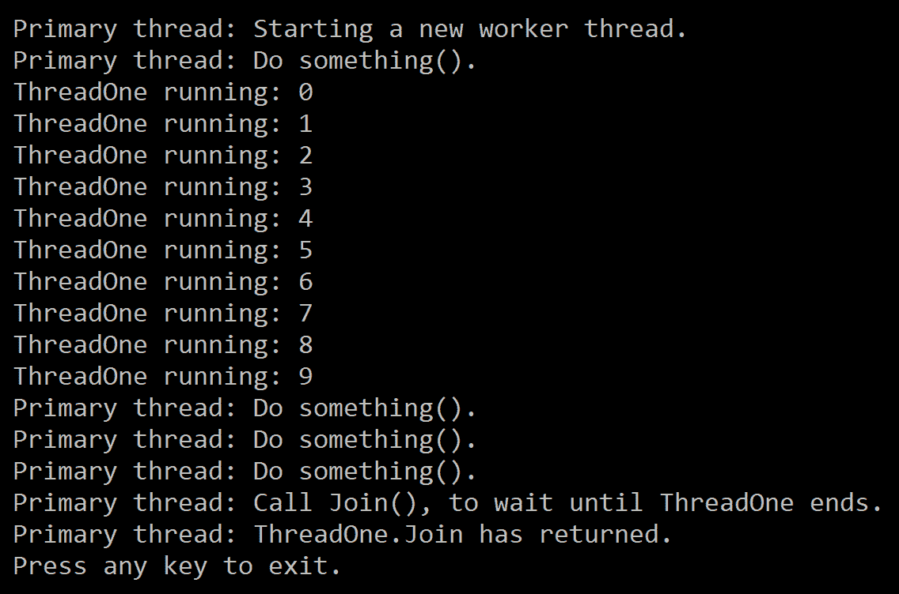

当程序执行时，会自动创建一个前台线程来执行代码。然后，这个主线程根据需要创建工作线程来执行来自同一进程的代码部分。正如你所看到的，线程在其构造函数中接受一个委托。

在前面的程序中，我们使用了 `thread.join`，这允许主线程等待直到所有工作线程完成它们的执行。此外，`Thread.Sleep(0)` 告诉 Windows 当前线程已经完成了它的执行，以便发生上下文切换，而不是 Windows 必须等待分配的时间。

# 线程属性

每个线程携带某些属性。以下表格详细说明了每一个：

| `IsAlive` | 如果线程处于已启动状态，则返回 `true`。 |
| --- | --- |
| `IsBackground` | 获取或设置此属性以让系统知道如何执行线程。 |
| `Name` | 线程的名称。 |
| `Priority` | 获取或设置线程优先级。默认为 `Normal`。 |
| `ThreadState` | 获取线程的当前状态。 |

在以下代码示例中，我们将调用一个方法来显示有关某些线程属性的信息。我们还将了解如何暂停线程并终止它：

```cs
public static void ThreadProperties()
{
     var th = new Thread(ThreadTwo);
     th.Start();
     Thread.Sleep(1000);
     Console.WriteLine("Primary thread ({0}) exiting...",Thread.CurrentThread.ManagedThreadId);
}

private static void ThreadTwo()
{
    var sw = Stopwatch.StartNew();
    Console.WriteLine("ThreadTwo Id: {0} Threadtwo state: {1}, Threadtwo Priority: {2}",
                              Thread.CurrentThread.ManagedThreadId,
                              Thread.CurrentThread.ThreadState,
                              Thread.CurrentThread.Priority);
    do
    {
        Console.WriteLine("Threadtwo Id: {0}, Threadtwo elapsed time {1:N2} seconds",
                                  Thread.CurrentThread.ManagedThreadId,
                                  sw.ElapsedMilliseconds / 1000.0);
        Thread.Sleep(500);
    } while (sw.ElapsedMilliseconds <= 3000);
        sw.Stop();
}
```

当你执行程序时，你会看到每个线程的属性。你也会观察到尽管主线程已经完成，但工作线程仍在执行：

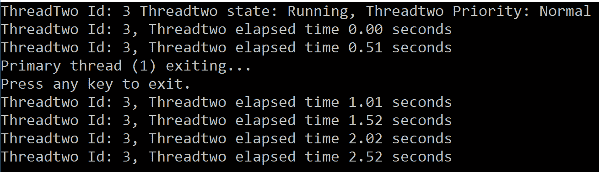

你可能已经注意到，一次只有一个线程写入控制台。这被称为 **同步**。在这种情况下，它由控制台类为我们处理。同步允许没有两个线程同时执行相同的代码块。

# 参数化线程

在这里，我们将探讨如何向 `ThreadStart` 方法传递参数。为了实现这一点，我们将在构造函数中使用 `ParameterizedThreadStart` 委托。此委托的签名如下：

```cs
public delegate void ParameterizedThreadStart(object obj)
```

当你将参数作为对象传递给 `ThreadStart` 方法时，它将参数转换为适当的数据类型。以下示例程序使用了我们之前使用的相同逻辑，除了我们通过 `ThreadStart` 方法传递间隔作为参数：

```cs
 public static void ParameterizedThread()
 {
     var th = new Thread(ThreadThree);
     th.Start(3000);
     Thread.Sleep(1000);
     Console.WriteLine("Primary thread ({0}) exiting...", Thread.CurrentThread.ManagedThreadId);
}

private static void ThreadThree(object obj)
{
    int interval = Convert.ToInt32(obj);
    var sw = Stopwatch.StartNew();
    Console.WriteLine("ThreadTwo Id: {0} ThreadThree state: {1}, ThreadThree Priority: {2}",
            Thread.CurrentThread.ManagedThreadId,
            Thread.CurrentThread.ThreadState,
            Thread.CurrentThread.Priority);
    do
    {
        Console.WriteLine("ThreadThree Id: {0}, ThreadThree elapsed time {1:N2} seconds",
            Thread.CurrentThread.ManagedThreadId,
            sw.ElapsedMilliseconds / 1000.0);
        Thread.Sleep(500);
    } while (sw.ElapsedMilliseconds <= interval);
    sw.Stop();
}
```

以下截图显示了前面代码的输出：

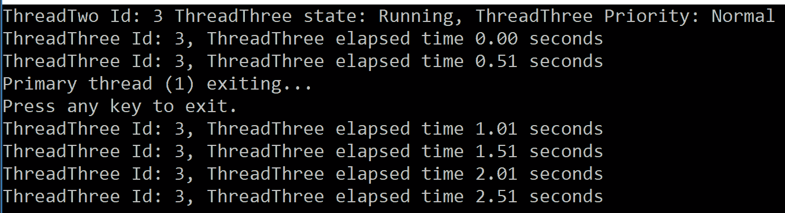

现在，让我们看看前台和后台线程。

# 前台和后台线程

默认情况下，当创建一个线程时，它会被创建为一个前台线程。你可以使用`IsBackground`属性将一个线程设置为后台线程。前台线程和后台线程的主要区别在于，如果所有前台线程都终止了，后台线程将不会运行。当前台线程停止时，运行时会终止所有后台线程。如果使用线程池创建线程，则这些线程将以后台线程的方式执行。请注意，当非托管线程进入托管执行环境时，它将以后台线程的方式执行。

让我们通过一个例子来了解前台线程和后台线程之间的区别：

```cs
public static void BackgroundThread()
{
    Console.WriteLine("Thread Id: {0}" + Environment.NewLine + "Thread State: {1}" + Environment.NewLine + "Priority {2}" + Environment.NewLine + "IsBackground: {3}",
                              Thread.CurrentThread.ManagedThreadId,
                              Thread.CurrentThread.ThreadState,
                              Thread.CurrentThread.Priority,
                              Thread.CurrentThread.IsBackground);
    var th = new Thread(ExecuteBackgroundThread);
    th.IsBackground = true;
    th.Start();
    Thread.Sleep(500);
    Console.WriteLine("Main thread ({0}) exiting...",Thread.CurrentThread.ManagedThreadId);
}
private static void ExecuteBackgroundThread()
{
    var sw = Stopwatch.StartNew();
    Console.WriteLine("Thread Id: {0}" + Environment.NewLine + "Thread State: {1}" +         Environment.NewLine + "Priority {2}" + Environment.NewLine + "IsBackground {3}",
                              Thread.CurrentThread.ManagedThreadId,
                              Thread.CurrentThread.ThreadState,
                              Thread.CurrentThread.Priority,
                              Thread.CurrentThread.IsBackground);
    do
    {
        Console.WriteLine("Thread {0}: Elapsed {1:N2} seconds",
                                  Thread.CurrentThread.ManagedThreadId,
                                  sw.ElapsedMilliseconds / 1000.0);
        Thread.Sleep(2000);
    } while (sw.ElapsedMilliseconds <= 5000);
    sw.Stop();
}
```

以下截图显示了前面代码的输出：

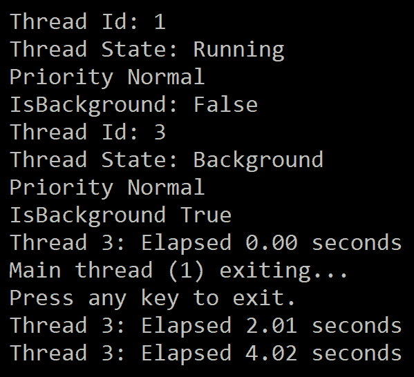

如你所见，主线程被创建为一个前台线程，而工作线程被创建为一个后台线程。当我们停止主线程时，它也停止了后台线程。这就是为什么在运行 5 秒（`while(sw.ElapsedMilliseconds <=5000)`）的循环中，没有显示经过的时间语句。

# 线程状态

当创建一个线程时，它将处于**未开始**状态，直到调用**Start**方法。线程始终处于至少一个状态，有时它可能同时处于多个状态。在以下图中，每个椭圆形代表一个状态。每行上的文本代表执行的动作：

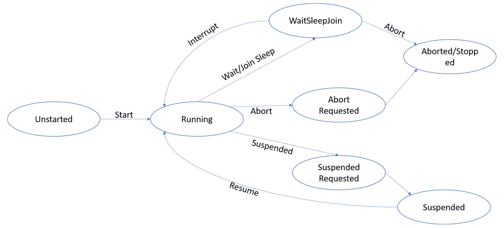

线程可以同时处于两种不同的状态。例如，如果一个线程处于等待状态，而另一个线程被终止，它可以同时处于**等待/加入睡眠**和**终止请求**状态。当线程返回到等待调用时，它将接收到一个`ThreadAbortException`。

# 销毁线程

`Thread.Abort`方法用于停止一个线程。一旦终止，它就不能重新启动。然而，当你调用`Thread.Abort`时，它不会立即终止线程，因为`Thread.Abort`语句抛出一个`ThreadAbortException`，这需要被捕获。然后，应该执行清理代码。如果你调用`Thread.Join`方法，这将确保线程等待直到其他线程的执行完成。`join`方法依赖于超时间隔，所以如果没有指定，等待是不确定的。

当你自己的代码终止一个线程，并且你不想重新抛出它时，请使用`ResetAbort`方法。你将在第七章，*实现异常处理*中了解更多关于如何重新抛出异常的信息。

# 线程池

线程池提供了一组线程，这些线程可以用作工作线程并由系统管理。这使我们能够专注于应用程序逻辑而不是管理线程。这是我们使用多线程的简单方法。从 .NET 框架 4 开始，使用线程池变得容易，因为它们允许我们创建任务并执行异步任务。**任务并行库**（**TPL**）和异步方法调用主要依赖于线程池。

从线程池创建的线程是后台线程。每个线程使用默认属性。当线程完成任务时，它将返回到等待线程的队列中，以便可以重用。反过来，这减少了为每个任务创建新线程的成本。每个进程可以有一个线程池。

.NET 框架允许我们为线程池设置和获取 `MaxThread`，尽管可以排队的线程数量受可用内存限制。一旦线程池中的线程忙碌，其他任务将排队，直到线程可用。

重要的是要理解，线程池中任何未处理的异常都将终止此进程。有关线程池的更多信息，请参阅[`docs.microsoft.com/en-us/dotnet/standard/threading/the-managed-thread-pool`](https://docs.microsoft.com/en-us/dotnet/standard/threading/the-managed-thread-pool)。

以下示例展示了我们如何使用线程池创建多个线程：

```cs
 public static void PoolOfThreads()
 {
     Console.WriteLine("Primary Thread Id: {0}" + Environment.NewLine + "Thread State: {1}" + Environment.NewLine + "Priority {2}" ,
                              Thread.CurrentThread.ManagedThreadId,
                              Thread.CurrentThread.ThreadState,
                              Thread.CurrentThread.Priority);
    PoolProcessmethod();
    //Thread.CurrentThread.Join();
 }
private static void PoolProcessmethod()
{
    for (int i = 0; i < 5; i++)
    {
        ThreadPool.QueueUserWorkItem(new WaitCallback(PoolMethod)); 
    }
}
private static void PoolMethod(object callback)
{
    Thread.Sleep(1000);
    Console.WriteLine("ThreadPool Thread Id: {0}" + Environment.NewLine + "Thread State: {1}" + Environment.NewLine + "Priority {2}" + Environment.NewLine + "IsBackground: {3}" +Environment.NewLine + "IsThreadPoolThread: {4}",
                              Thread.CurrentThread.ManagedThreadId,
                              Thread.CurrentThread.ThreadState,
                              Thread.CurrentThread.Priority,
                              Thread.CurrentThread.IsBackground,
                              Thread.CurrentThread.IsThreadPoolThread);

}
```

以下截图显示了运行前面代码的输出：

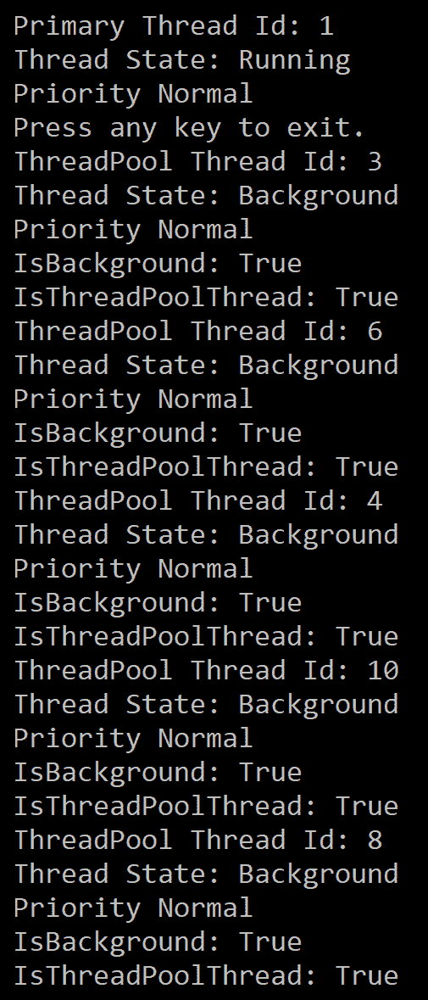

在这里，我们使用线程池创建了五个工作线程。如果你在前面代码中取消注释 `Thread.CurrentThread.Join`，主线程将不会退出，直到所有线程都已被处理。

# 线程存储

线程相关的静态字段和数据槽是我们存储线程和应用域唯一数据的两种方式。线程相关的静态字段在编译时定义，并提供最佳性能。另一个好处是它们在编译时进行类型检查。当事先明确需要存储哪种类型的数据时，使用这些字段。

可以使用 `ThreadStaticAttribute` 创建线程相关的静态字段。

在某些场景中，这些存储需求可能在运行时出现。在这种情况下，我们可以选择数据槽。这些比静态字段慢一些。由于它们是在运行时创建的，因此它们以对象类型存储信息。在使用它们之前，将对象转换为它们相应的类型对我们来说很重要。

.NET 框架允许我们创建两种类型的数据槽：命名数据槽和未命名数据槽。命名数据槽使用 `GetNamedDataSlot` 方法，这样我们就可以在需要时检索它。然而，`NamedDataslot` 的一个缺点是，当来自同一应用程序域的两个线程在两个不同的代码组件中使用相同的数据槽并在同一时间执行时，它们可能会互相破坏数据。

`ThreadLocal<T>` 可以用来创建局部数据存储。

这两种存储数据的方式可以被称为 **线程局部存储**（**TLS**）。管理 TLS 的几个好处如下：

+   在一个应用程序域内，一个线程不能修改另一个线程的数据，即使两个线程使用相同的字段或槽位。

+   当一个线程从多个应用程序域访问相同的字段或槽位时，每个应用程序域都维护一个单独的值。

现在，我们将进入一个示例，看看如何使用 `ThreadStatic` 属性。在下面的示例中，定义了一个静态变量，并用 `ThreadStatic` 属性进行了装饰。这确保了每个线程都有自己的变量副本。当你执行以下程序时，你会观察到 `_intvariable` 对每个线程都增加到 6：

```cs
[ThreadStatic]
public static int _intvariable;
public static void ThreadStaticSample()
{
    //Start three threads
    new Thread(() =>
    {
        for (int i = 0; i <= 5; i++)
        {
            _intvariable++;
            Console.WriteLine($"Thread Id:{Thread.CurrentThread.ManagedThreadId}, Int field Value:{_intvariable}");
        }
    }).Start();

    new Thread(() =>
    {
        for (int i = 0; i <= 5; i++)
        {
            _intvariable++;
            Console.WriteLine($"Thread Id:{Thread.CurrentThread.ManagedThreadId}, Int field Value:{_intvariable}");
        }
    }).Start();

    new Thread(() =>
    {
        for (int i = 0; i <= 5; i++)
        {
            _intvariable++;
            Console.WriteLine($"Thread Id:{Thread.CurrentThread.ManagedThreadId}, Int field Value:{_intvariable}");
        }
    }).Start();

}

```

以下截图显示了运行前面程序的结果。注释掉 `ThreadStatic` 属性并再次运行程序——你会发现 `_intvariable` 的值增加到 18，因为每个线程都会更新其值：


让我们看看如何使用 `ThreadLocal<T>` 来创建局部存储：

```cs
 public static ThreadLocal<string> _threadstring = new ThreadLocal<string>(() => {
    return "Thread " + Thread.CurrentThread.ManagedThreadId; });
public static void ThreadLocalSample()
{

    //Start three threads
    new Thread(() =>
    {
        for (int i = 0; i <= 5; i++)
        {
            Console.WriteLine($"First Thread string :{_threadstring}");
        }
    }).Start();

    new Thread(() =>
    {
        for (int i = 0; i <= 5; i++)
        {
            Console.WriteLine($"Second Thread string :{_threadstring}");
        }
    }).Start();

    new Thread(() =>
    {
        for (int i = 0; i <= 5; i++)
        {
            Console.WriteLine($"Third Thread string :{_threadstring}");
        }
    }).Start();

}
```

上述代码的输出如下：

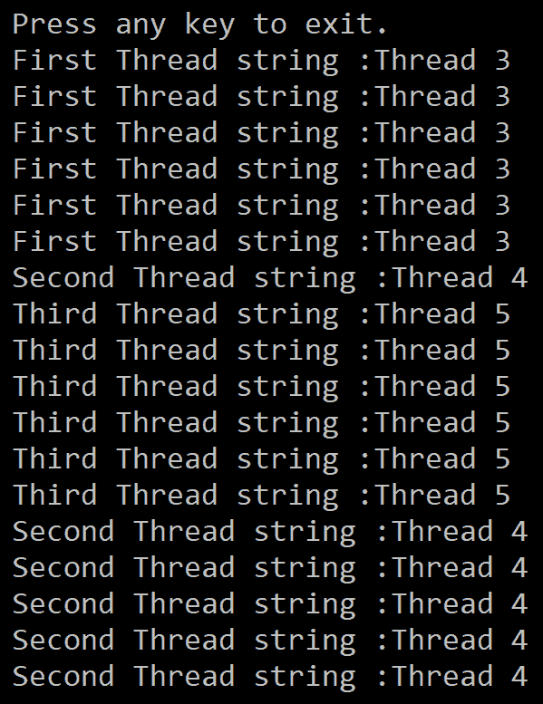

现在我们已经了解了如何管理线程，让我们看看如何在多线程中同步数据。

# 多线程中的数据同步

多个线程可以调用一个对象的方法或属性，这可能会使对象的状态无效。对同一对象进行两个或更多线程的冲突更改是可能的。这使得同步这些调用变得很重要，这将使我们能够避免此类问题。当一个类的成员受到冲突更改的保护时，它们被认为是 **线程安全的**。

CLR 提供了多种方式，我们可以通过这些方式同步对对象实例和静态成员的访问：

+   同步代码区域

+   手动同步

+   同步上下文

+   线程安全集合

默认情况下，对象没有同步，这意味着任何线程都可以在任何时候访问方法和属性。

同步代码区域允许我们同步代码块、方法和静态方法。然而，不支持同步静态字段。如果我们使用 `Monitor` 类或关键字，则可以进行同步。C# 支持使用 `lock` 关键字来标记需要同步的代码块。

当应用时，线程在执行代码时会尝试获取锁。如果另一个线程已经获取了此代码块的锁，则该线程会阻塞，直到锁可用。当线程执行代码块或以其他方式退出时，锁会被释放。

`MethodImplAttribute` 和 `MethodImplOptions.Synchronized` 与使用 `Monitor` 或关键字锁定代码块得到相同的结果。

让我们通过一个示例来了解使用任务进行锁定语句。在接下来的章节中，我们将了解更多关于任务的内容。

为了本例的目的，我们创建了一个 `Account` 类，通过将其锁定到实例来同步其私有字段余额。这确保了没有两个线程同时更新此字段：

```cs
 internal class BankAcc
    {
        private readonly object AcountBalLock = new object();
        private decimal balanceamount;
        public BankAcc(decimal iBal)
        {
            balanceamount = iBal;
        }
        public decimal Debit(decimal amt)
        {
            lock (AcountBalLock)
            {
                if (balanceamount >= amt)
                {
                    Console.WriteLine($"Balance before debit :{balanceamount,5}");
                    Console.WriteLine($"Amount to debit     :{amt,5}");
                    balanceamount = balanceamount - amt;
                    Console.WriteLine($"Balance after debit  :{balanceamount,5}");
                    return amt;
                }
                else
                {
                    return 0;
                }
            }
        }
        public void Credit(decimal amt)
        {
            lock (AcountBalLock)
            {
                Console.WriteLine($"Balance before credit:{balanceamount,5}");
                Console.WriteLine($"Amount to credit        :{amt,5}");
                balanceamount = balanceamount + amt;
                Console.WriteLine($"Balance after credit :{balanceamount,5}");
            }
        }
    }

```

`TestLockStatements( )` 方法如下所示：

```cs
//Create methods to test this Account class
public static void TestLockStatements()
{
    var account = new BankAcc(1000);
    var tasks = new Task[2];
    for (int i = 0; i < tasks.Length; i++)
    {
        tasks[i] = Task.Run(() => UpdateAccount(account));
    }
    Task.WaitAll(tasks);
}
private static void UpdateAccount(BankAcc account)
{
    var rnd = new Random();
    for (int i = 0; i < 10; i++)
    {
        var amount = rnd.Next(1, 1000);
        bool doCredit = rnd.NextDouble() < 0.5;
        if (doCredit)
        {
            account.Credit(amount);
        }
        else
        {
            account.Debit(amount);
        }
    }
}
```

我们创建了两个任务，每个任务都调用 `UpdateMethod`。此方法循环 10 次，并使用信用或借记方法更新账户余额。因为我们使用的是实例级别的 `lock(obj)` 字段，所以余额字段不会同时更新。

以下代码显示了所需的输出：

```cs
Balance before debit : 1000
Amount to debit : 972
Balance after debit : 28
Balance before credit: 28
Amount to credit : 922
Balance after credit : 950
Balance before credit: 950
Amount to credit : 99
Balance after credit : 1049
Balance before debit : 1049
Amount to debit : 719
Balance after debit : 330
Balance before credit: 330
Amount to credit : 865
Balance after credit : 1195
Balance before debit : 1195
Amount to debit : 962
Balance after debit : 233
Balance before credit: 233
Amount to credit : 882
Balance after credit : 1115
Balance before credit: 1115
Amount to credit : 649
Balance after credit : 1764
Balance before credit: 1764
Amount to credit : 594
Balance after credit : 2358
Balance before debit : 2358
Amount to debit : 696
Balance after debit : 1662
Balance before credit: 1662
Amount to credit : 922
Balance after credit : 2584
Balance before credit: 2584
Amount to credit : 99
Balance after credit : 2683
Balance before debit : 2683
Amount to debit : 719
Balance after debit : 1964
Balance before credit: 1964
Amount to credit : 865
Balance after credit : 2829
Balance before debit : 2829
Amount to debit : 962
Balance after debit : 1867
Balance before credit: 1867
Amount to credit : 882
Balance after credit : 2749
Balance before credit: 2749
Amount to credit : 649
Balance after credit : 3398
Balance before credit: 3398
Amount to credit : 594
Balance after credit : 3992
Balance before debit : 3992
Amount to debit : 696
Balance after debit : 3296
Press any key to exit.
```

在多个线程之间访问共享变量可能会导致数据完整性问题。这些问题可以通过使用同步原语来解决。这些原语由 `System.Threading.WaitHandle` 类派生。在执行手动同步时，原语可以保护对共享资源的访问。不同的同步原语实例用于保护对资源或某些代码访问部分的访问，这允许多个线程并发访问资源。

你可以在 [`docs.microsoft.com/en-us/dotnet/standard/threading/overview-of-synchronization-primitives`](https://docs.microsoft.com/en-us/dotnet/standard/threading/overview-of-synchronization-primitives) 上了解更多关于同步原语的信息。

`.NET Framework` 引入了 `System.Collections.Concurrent` 命名空间，可以在用户代码中无需额外同步的情况下使用。此命名空间包括几个线程安全和可扩展的集合类。这允许多个线程向这些集合添加或从中删除项目。

更多关于这些线程安全集合的信息可以在 [`docs.microsoft.com/en-us/dotnet/standard/collections/thread-safe/index`](https://docs.microsoft.com/en-us/dotnet/standard/collections/thread-safe/index) 上找到。

# 多线程

开发者可以在进程内创建多个线程，并在整个程序执行过程中管理它们。这使我们能够专注于应用程序逻辑，而不是管理线程。然而，从 .NET Framework 4 开始，我们可以使用以下方法创建多线程程序：

+   TPL

+   **并行语言集成查询**（**PLINQ**）

为了理解这两个功能，我们需要讨论并行编程。

# 并行编程

**并行编程**帮助开发者利用工作站上的硬件，这些工作站拥有多个 CPU 核心。它们允许多个线程并行执行。

在之前的版本中，并行化需要低级线程和锁的操作。从.NET Framework 4 开始，提供了对并行编程的增强支持，形式为运行时、类库类型和诊断工具。

下面的图示显示了并行编程的高级架构：

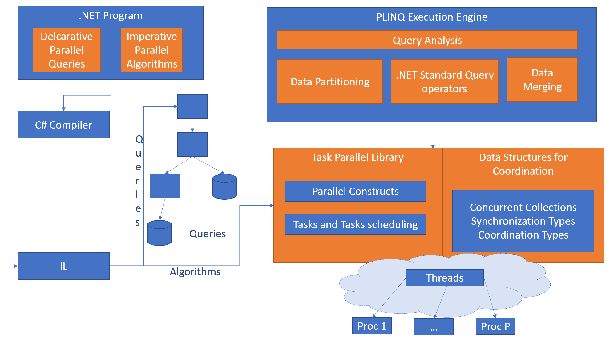

在接下来的章节中，我们将讨论前面架构图中列出的一些组件。

# TPL

TPL 通过创建并行和并发应用程序，使开发者更加高效。这些类型作为`System.Threading`和`System.Threading.Tasks`命名空间中的公共类型提供。TPL 允许我们在关注程序工作的同时，最大化代码性能。TPL 基于任务，代表一个线程或线程池。当一个或多个任务并发运行时，这被称为任务并行。任务有几个好处：可扩展性和效率，以及比线程更多的程序控制能力。

因为 TPL 处理工作的分割、调度、取消、状态和其他底层细节，它可以动态地调整并发程度，并使用可用的系统资源或处理器。

了解何时应用并行编程很重要，否则并行化的开销会降低代码执行速度。对线程概念如锁和死锁的基本理解很重要，这样我们才能有效地使用 TPL。

# 数据并行

当操作可以在源集合元素上并发执行时，这被称为数据并行。在这个过程中，源集合被分割成多个线程并行执行。.NET Framework 通过`System.Threading.Tasks.Parallel`类支持数据并行。`Parallel.For`和`Parallel.ForEach`等方法定义在这个类中。当你使用这些方法时，框架会为我们管理所有底层工作。

任务代表一个可能返回也可能不返回值的异步操作，并在`System.Threading.Tasks`类中定义。

# 使用任务

任务代表一个可能返回也可能不返回值的操作，并异步执行。由于它们是异步执行的，因此它们作为线程池中的工作线程而不是主线程来执行。这允许我们使用`isCanceled`和`IsCompleted`属性来了解任务的状态。您还可以使任务同步运行，这将执行在主线程或主要线程上。

任务可以实现`IAsyncResult`和`IDisposable`接口，如下所示：

```cs
public class Task : IAsyncResult, IDisposable
```

让我们通过一个示例来了解我们如何以不同的方式创建和启动任务。在这个例子中，我们将使用一个接受`object`类型参数的操作委托：

```cs
public static void Run()
{
    Action<object> action = (object obj) =>
    {
        Console.WriteLine("Task={0}, Milliseconds to sleep={1}, Thread={2}",Task.CurrentId, obj,
        Thread.CurrentThread.ManagedThreadId);
        int value = Convert.ToInt32(obj);
        Thread.Sleep(value);
    };

    Task t1 = new Task(action, 1000);
    Task t2 = Task.Factory.StartNew(action, 5000);
    t2.Wait();
    t1.Start();
    Console.WriteLine("t1 has been started. (Main Thread={0})",
                      Thread.CurrentThread.ManagedThreadId);
    t1.Wait();

    int taskData = 4000;
    Task t3 = Task.Run(() => {
        Console.WriteLine("Task={0}, Milliseconds to sleep={1}, Thread={2}",
                          Task.CurrentId, taskData,
                           Thread.CurrentThread.ManagedThreadId);
    });
    t3.Wait();

    Task t4 = new Task(action, 3000);
    t4.RunSynchronously();
    t4.Wait();
}
```

在这里，我们创建了四个不同的任务。对于第一个任务，我们使用了启动方法，而对于第二个任务，我们使用了`task.factory.startnew`方法。第三个任务使用`run(Action)`方法启动，而第四个任务使用同步运行方法在主线程上同步执行。在这里，任务 1、2 和 3 是使用线程池的工人线程，而任务 4 在主线程上执行。

以下截图显示了运行前面代码的输出：

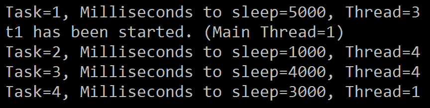

`Wait`方法类似于`Thread.Join`，它等待任务完成。这在同步调用线程和异步任务执行时很有用，因为我们可以等待一个或多个线程完成。`Wait`方法还接受某些参数，允许我们有条件地等待任务完成。

以下表格显示了线程在等待时可以使用的不同选项：

| `Wait` | 等待任务执行完成。 |
| --- | --- |
| `Wait(int32)` | 使任务在执行前等待指定数量的毫秒。 |
| `Wait(Timespan)` | 在指定的时间间隔内等待任务执行完成。 |
| `Wait(CancellationToken)` | 等待任务执行完成。如果`cancellationToken`在任务执行完成前发出，则等待终止。 |
| `Wait(Int32, CancellationToken)` | 等待任务执行完成。等待在超时或任务完成前发出取消令牌时终止。 |
| `WaitAll` | 等待所有提供的任务完成其执行。类似于`Wait`方法，`WaitAll`接受多个参数并相应地执行它们。 |
| `WaitAny` | 等待提供的任务完成其执行。类似于`Wait`方法，`WaitAny`接受多个参数并相应地执行它们。 |

任务支持另外两种方法：`WhenAll`和`WhenAny`。现在，`WhenAll`用于创建一个任务，当所有提供的任务都完成时，该任务将完成其执行。同样，`WhenAny`创建任务并在提供的任务完成其执行时完成。

任务也可以返回一个值。然而，读取任务的输出意味着等待其执行完成。在没有完成执行的情况下，无法使用结果对象。以下是一个示例：

```cs
public static void TaskReturnSample()
{
    Task<int> t = Task.Run(() => { return 30 + 40; });
    Console.WriteLine($"Result of 30+40: {t.Result}");
}
```

通过执行前面的代码，您将看到主线程会等待任务返回一个值。然后，它显示一个`按任意键退出`的消息：

```cs
Result of 30+40: 70
Press any key to exit.
```

还可以添加一个后续任务。.NET Framework 提供了一个名为`ContinueWith`的关键字，它允许你在前一个任务执行完毕后创建并执行一个新任务。在以下代码中，我们指示任务使用父任务的结果继续执行：

```cs
public static void TaskContinueWithSample()
{
    Task<int> t = Task.Run(() => 
        {
            return 30 + 40;
        }
    ).ContinueWith((t1) => 
    {
        return t1.Result * 10;
    });
    Console.WriteLine($"Result of two tasks: {t.Result}");
}
```

当任务`t`完成其执行时，结果被用于第二个任务`t1`，并显示最终结果：

```cs
Result of two tasks: 700
Press any key to exit.
```

`ContinueWith`有几个重载方法，允许我们配置后续任务何时执行，例如在任务取消或成功完成后。为了使此配置生效，我们将使用`TaskContinuationOptions`。更多可用的选项可以在[`docs.microsoft.com/en-us/dotnet/api/system.threading.tasks.taskcontinuationoptions?view=netframework-4.7.2`](https://docs.microsoft.com/en-us/dotnet/api/system.threading.tasks.taskcontinuationoptions?view=netframework-4.7.2)找到。

以下代码块展示了如何使用`continuationOptions`：

```cs
Task<int> t = Task.Run(() => 
{
    return 30 + 40;
}
).ContinueWith((t1) => 
{
    return t1.Result * 10;
},TaskContinuationOptions.OnlyOnRanToCompletion);
```

`TaskFactory`支持创建和调度任务。它还允许我们执行以下操作：

+   使用`StartNew`方法创建一个任务并立即启动它

+   通过调用`ContinueWhenAny`方法创建一个任务，该任务将在数组中的任何一个任务完成时启动

+   通过调用`ContinueWhenAll`方法创建一个任务，该任务将在数组中的所有任务完成时启动

更多关于`TaskFactory`的阅读资料可以在[`docs.microsoft.com/en-us/dotnet/api/system.threading.tasks.taskfactory?view=netframework-4.7.2`](https://docs.microsoft.com/en-us/dotnet/api/system.threading.tasks.taskfactory?view=netframework-4.7.2)找到。

# 使用 Parallel 类

`System.Threading`类中还有一个名为`Parallel`的类。这个类为`For`和`ForEach`循环提供了并行实现。它们的实现与顺序循环类似。当你使用`ParallelFor`或`ParallelForEach`时，系统会自动将过程分割成多个任务，并在需要时获取锁。所有这些底层工作都由 TPL 处理。

顺序循环可能看起来如下：

```cs
foreach (var item in sourceCollection) 
{     
    Process(item); 
} 
```

同样的循环可以使用`Parallel`表示如下：

```cs
Parallel.ForEach(sourceCollection, item => Process(item)); 
```

TPL 管理数据源并创建分区，以便循环可以并行操作多个部分。每个任务将由任务调度器根据系统资源和负载进行分区。然后，如果负载变得不平衡，任务调度器将通过多个线程和进程重新分配工作。

当你有大量并行工作要做时，并行编程可以提高性能。如果不是这种情况，它可能会变得成本高昂。

在给定的场景中理解并行工作方式非常重要。在以下示例中，我们将探讨如何使用`Parallel.For`，并在顺序循环和并行循环之间进行时间比较。

在这里，我们定义了一个整数数组，并计算数组中每个元素的求和和乘积。在主程序中，我们使用顺序和并行循环调用此方法，并计算每个循环完成过程所需的时间：

```cs
static int[] _values = Enumerable.Range(0, 1000).ToArray();

private static void SumAndProduct(int x)
{
    int sum = 0;
    int product = 1;
    foreach (var element in _values)
    {
        sum += element;
        product *= element;
    }
}

public static void CallSumAndProduct()
{
    const int max = 10;
    const int inner = 100000;
    var s1 = Stopwatch.StartNew();
    for (int i = 0; i < max; i++)
    {
        Parallel.For(0, inner, SumAndProduct);
    }
    s1.Stop();

    Console.WriteLine("Elapsed time in seconds for ParallelLoop: " + s1.Elapsed.Seconds);

    var s2 = Stopwatch.StartNew();
    for (int i = 0; i < max; i++)
    {
        for (int z = 0; z < inner; z++)
        {
            SumAndProduct(z);
        }
    }
    s2.Stop();

    Console.WriteLine("Elapsed time in seconds for Sequential Loop: " + s2.Elapsed.Seconds );
}
```

在前面的代码中，我们执行了两个循环：一个使用并行循环，另一个使用顺序循环。结果显示了每个操作所花费的时间：

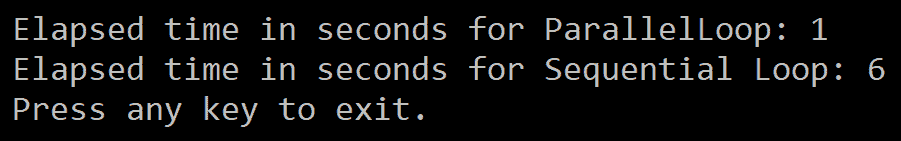

`System.Threading.Tasks.Parallel` 包含多个辅助类，例如 `ParallelLoopResult`、`ParallelLoopState` 和 `ParallelOptions`。

`ParallelLoopResult` 提供并行循环的完成状态，如下所示：

```cs
ParallelLoopResult result = Parallel.For(int i, ParallelLoopState loopstate) =>{});
```

`ParallelLoopState` 允许并行循环的迭代与其他迭代交互。最后，`LoopState` 允许您识别迭代中的任何异常，从迭代中退出，停止迭代，识别是否有任何迭代调用了退出或停止，以及退出长时间运行的迭代。

# PLINQ

**语言集成查询** (**LINQ**) 在 .NET Framework 3.5 中引入。它允许我们对内存中的集合，如 `List<T>` 进行查询。您将在第十五章 使用 LINQ 查询中了解更多关于 LINQ 的信息。然而，如果您想早点了解更多，更多信息可以在 [`docs.microsoft.com/en-us/dotnet/csharp/programming-guide/concepts/linq/index`](https://docs.microsoft.com/en-us/dotnet/csharp/programming-guide/concepts/linq/index) 找到。

PLINQ 是 LINQ 模式的并行实现。它们类似于 LINQ 查询，并操作任何内存中的集合，但在执行方面有所不同。PLINQ 使用系统中的所有可用处理器。然而，处理器限制在 64 位。这是通过将数据源分区成更小的任务，并在多个处理器的单独工作线程上执行每个任务来实现的。

大多数标准查询运算符都实现在 `System.Linq.ParallelEnumerable` 类中。以下表格列出了各种并行执行特定的方法：

| `AsParallel` | 当您希望系统在可枚举集合上执行并行执行时，可以向系统提供 `AsParallel` 指令。 |
| --- | --- |
| `AsSequential` | 使用 `AsSequential` 指示系统顺序运行。 |
| `AsOrdered` | 要在结果集中保持顺序，请使用 `AsOrdered`。 |
| `AsUnordered` | 要在结果集中不保持顺序，请使用 `AsUnordered`。 |
| `WithCancellation` | 取消标记携带用户的取消执行请求。这必须被监控，以便可以在任何时候取消执行。 |
| `WithDegreeofParallelism` | 控制并行查询中使用的处理器数量。 |
| `WithMergeOptions` | 提供选项，以便我们可以将结果合并到父任务/线程/结果集中。 |
| `WithExecutionMode` | 强制运行时使用并行或顺序模式。 |
| `ForAll` | 允许通过不合并到父线程来并行处理结果。 |
| `Aggregate` | 一个独特的 PLINQ 重载，用于在线程局部分区上启用中间聚合。同时允许我们将最终聚合合并以组合所有分区的结果。 |

让我们尝试使用其中一些方法，以便我们可以更详细地理解它们。`AsParallel`扩展方法将`where`和`select`等查询运算符绑定到`parallelEnumerable`实现。通过简单地指定`AsParallel`，我们告诉编译器并行执行查询：

```cs
public static void PrintEvenNumbers()
{
    var numbers = Enumerable.Range(1, 20);
    var pResult = numbers.AsParallel().Where(i => i % 2 == 0).ToArray();

    foreach (int e in pResult)
    {
        Console.WriteLine(e);
    }

}
```

当执行时，前面的代码块识别所有偶数并在屏幕上打印它们：

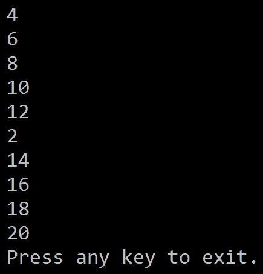

如您所见，偶数并没有按顺序打印。关于并行处理，有一点需要记住的是，它不保证任何特定的顺序。尝试多次执行代码块并观察输出。由于它基于执行时的处理器数量，所以每次都会有所不同。

通过使用`AsOrdered`运算符，代码块接受 1 到 20 之间的数字范围。然而，使用`AsOrdered`将排序数字：

```cs
public static void PrintEvenNumbersOrdered()
{
    var numbers = Enumerable.Range(1, 20);
    var pResult = numbers.AsParallel().AsOrdered()
        .Where(i => i % 2 == 0).ToArray();

    foreach (int e in pResult)
    {
        Console.WriteLine(e);
    }

}
```

此示例展示了我们如何在使用`Parallel`时保持结果集的顺序：

```cs
2
4
6
8
10
12
14
16
18
20
Press any key to exit.
```

当您使用 PLINQ 执行代码块时，运行时会分析查询是否可以并行化。如果是，它会将查询分区成任务然后并发运行。如果不安全并行化查询，它会以顺序模式执行查询。在性能方面，使用顺序算法比使用并行算法更好，因此默认情况下，PLINQ 选择顺序算法。使用`ExecutionMode`将允许我们指示 PLINQ 选择并行算法。

以下代码块展示了我们如何使用`ExecutionMode`：

```cs
public static void PrintEvenNumbersExecutionMode()
{
    var numbers = Enumerable.Range(1, 20);
    var pResult = numbers.AsParallel().WithExecutionMode(ParallelExecutionMode.ForceParallelism)
        .Where(i => i % 2 == 0).ToArray();

    foreach (int e in pResult)
    {
        Console.WriteLine(e);
    }
}
```

如我们之前提到的，PLINQ 默认使用所有处理器。然而，通过使用`WithDegreeofParallelism`方法，我们可以控制要使用的处理器数量：

```cs
public static void PrintEvenNumbersDegreeOfParallel()
{
    var numbers = Enumerable.Range(1, 20);
    var pResult = numbers.AsParallel().WithDegreeOfParallelism(3)
        .Where(i => i % 2 == 0).ToArray();

    foreach (int e in pResult)
    {
        Console.WriteLine(e);
    }

}
```

通过更改处理器数量来执行前面的代码块并观察输出。在第一种情况下，我们让系统使用可用的核心/处理器，但在第二种情况下，我们指示系统使用三个核心。您将看到性能差异取决于您的系统配置。

PLINQ 还提供了一个名为`AsSequential`的方法。这是用来指示 PLINQ 在调用`AsParallel`之前以顺序方式执行查询。

`forEach`可以用来遍历 PLINQ 查询的所有结果并将每个任务的输出合并到父线程。在先前的示例中，我们使用`forEach`来显示偶数。

可以使用 `forEach` 来保留 PLINQ 查询结果的顺序。因此，当不需要保留顺序并且我们想要实现更快的查询执行时，我们可以使用 `ForAll` 方法。`ForAll` 不执行最终的合并步骤；相反，它并行化处理结果。以下代码块正在使用 `ForAll` 将输出打印到屏幕上：

```cs
public static void PrintEvenNumbersForAll()
{
    var numbers = Enumerable.Range(1, 20);
    var pResult = numbers.AsParallel().Where(i => i % 2 == 0);

    pResult.ForAll(e => Console.WriteLine(e));
}
```

在这种情况下，I/O 正被多个任务使用，因此数字将以随机顺序出现：

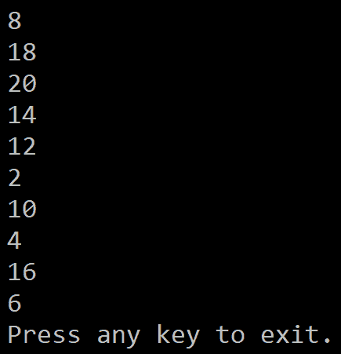

当 PLINQ 在多个线程中执行时，随着代码的运行，应用程序逻辑可能在一个或多个线程中失败。PLINQ 使用 `Aggregate` 异常来封装查询抛出的所有异常，并将它们发送回调用线程。在这样做的时候，你需要在调用线程上有一个 `try..catch` 块。当你从查询中获取结果时，开发者可以遍历 `AggregatedException` 中封装的所有异常：

```cs
public static void PrintEvenNumbersExceptions()
{
    var numbers = Enumerable.Range(1, 20);
    try
    {
        var pResult = numbers.AsParallel().Where(i => IsDivisibleBy2(i));

        pResult.ForAll(e => Console.WriteLine(e));
    }
    catch (AggregateException ex)
    {
        Console.WriteLine("There were {0} exceptions", ex.InnerExceptions.Count);
        foreach (Exception e in ex.InnerExceptions)
        {
            Console.WriteLine("Exception Type: {0} and Exception Message: {1}", e.GetType().Name,e.Message);
        }
    }
}

private static bool IsDivisibleBy2(int num)
{
    if (num % 3 == 0) throw new ArgumentException(string.Format("The number {0} is divisible by 3", num));
   return num % 2 == 0;
}
```

上述代码块正在从 PLINQ 中抛出的异常中写入所有详细信息。在这里，我们正在遍历并展示所有六个异常：

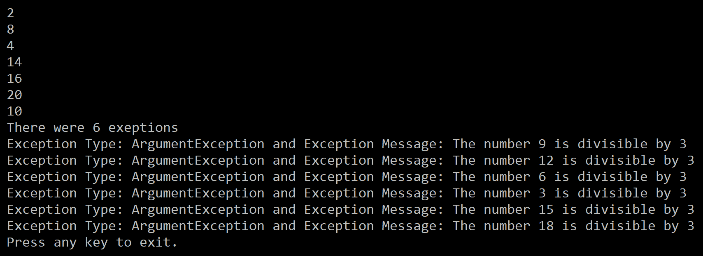

你可以通过遍历 `InnerExceptions` 属性并采取必要的行动。我们将在 第七章 中更详细地探讨内部异常，*实现异常处理*。然而，在这种情况下，当 PLINQ 执行时，它不会在异常上终止执行，而是会运行所有迭代并提供最终结果。

# 使用 async 和 await 进行异步编程

**异步编程**可以帮助你提高应用程序的响应性和性能。在传统方法中，编写和维护异步代码比较困难。然而，C# 5 引入了两个新的关键字，简化了异步编程：`async` 和 `await`。当遇到这些关键字时，C# 编译器会为你完成所有困难的工作。它类似于同步代码。`Task` 和 `Task<T>` 是异步编程的核心。

任何 I/O 密集型或 CPU 密集型代码都可以利用异步编程。在 I/O 密集型代码的情况下，当你想从 `async` 方法返回一个任务时，我们使用 `await` 操作，而在 CPU 密集型代码中，我们使用 `Task.Run` 等待启动后台线程的操作。

当使用 `await` 关键字时，它将控制权返回给调用方法，从而允许 UI 保持响应。

在内部，当编译器遇到 `async` 关键字时，它会将方法分割成任务，并且每个任务都会被标记上 `await` 关键字。`await` 关键字生成代码，用于检查异步操作是否已经完成；也就是说，C# 编译器将代码转换成一个状态机，它跟踪与每个任务/线程相关的元数据，以便在后台任务执行完毕后恢复执行：

```cs
private readonly HttpClient _httpClient = new HttpClient();

public async Task<int> GetDotNetCountAsync()
{
    var html = await _httpClient.GetStringAsync("https://dotnetfoundation.org");

    return Regex.Matches(html, @"\.NET").Count;
}

public void TestAsyncMethods()
{
    Console.WriteLine("Invoking GetDotNetCountAsync method");
    int count = GetDotNetCountAsync().Result;
    Console.WriteLine($"Number of times .NET keyword displayed is {count}");
}
```

在前面的代码块中，我们正在尝试找出一个特定单词在网站上被使用了多少次。前一个代码的输出如下：

```cs
Invoking GetDotNetCountAsync method
Number of times .NET keyword displayed is 22
Press any key to exit.
```

在这里，我们在 `GetDotnetCountAsync` 方法上使用了 `async` 关键字。尽管方法是以同步方式执行的，但 `await` 关键字允许我们返回到调用方法并等待直到 `async` 方法完成执行，此时它返回结果。

重要的是要理解，异步方法体应该始终包含一个 `await`，否则此方法永远不会释放。编译器也不会引发错误。

当编写异步方法时，你应该始终使用 `async` 作为后缀。请注意，`async` 必须用于事件处理器。这是唯一允许 `async` 事件处理器像事件一样工作的方法，因为事件没有返回类型。

你可以从 MSDN 在 [`docs.microsoft.com/en-us/dotnet/standard/asynchronous-programming-patterns/task-based-asynchronous-pattern-tap`](https://docs.microsoft.com/en-us/dotnet/standard/asynchronous-programming-patterns/task-based-asynchronous-pattern-tap) 上了解更多关于**基于任务的异步模式**（**TAP**）的信息。

# 摘要

在本章中，我们探讨了线程、它们的属性、如何使用参数化线程，以及通过详细示例说明了前台线程和后台线程之间的区别。我们还学习了线程状态以及线程如何在多个线程之间存储和共享数据。这就是我们讨论不同同步方法的地方。我们重点介绍了并行编程、任务以及使用任务的异步编程，如何使用并行类，以及 PLINQ。

在下一章中，我们将探讨 C# 中的异常处理。异常处理帮助我们处理程序执行过程中出现的任何意外或异常情况。异常处理使用 `try`、`catch` 和 `finally` 块。这些块分别帮助开发者尝试可能成功或失败的操作，处理如果发生失败的情况，以及清理不需要的资源。

# 问题

1.  默认情况下，你的代码块的主方法以以下哪种方式运行？

    1.  工作线程

    1.  主线程

    1.  后台线程

    1.  以上皆非

1.  当线程被暂停时，需要执行什么操作才能将其移动到运行状态？

    1.  中断

    1.  恢复

    1.  中断

    1.  暂停

1.  在编写同步代码区域时，应该使用哪个正确的关键字？

    1.  锁

    1.  释放

    1.  获取锁

    1.  解锁

1.  一个任务可能返回或不返回值。

    1.  真

    1.  假

1.  当使用 PLINQ 时，结果将按顺序返回。

    1.  真

    1.  假

# 答案

1.  **主线程**

1.  **恢复**

1.  **锁**

1.  **真**

1.  **假**

# 进一步阅读

在本章中，我们讨论了 .NET Framework 提供的许多功能，这些功能我们可以用于我们的应用程序。然而，我们没有详细涵盖这个主题。因此，你可能需要阅读几篇 MSDN 文章，以便更好地理解这些概念。查看以下链接：

+   更多关于应用程序域的信息可以在[`docs.microsoft.com/en-us/dotnet/framework/app-domains/application-domains#application-domains-and-threads`](https://docs.microsoft.com/en-us/dotnet/framework/app-domains/application-domains#application-domains-and-threads)找到。

+   更多关于线程和进程的信息可以在[`docs.microsoft.com/en-us/windows/desktop/procthread/processes-and-threads`](https://docs.microsoft.com/en-us/windows/desktop/procthread/processes-and-threads)找到。

+   以下关于并行编程的文档将帮助你理解本章未涉及的一些主题：[`docs.microsoft.com/en-us/dotnet/standard/parallel-programming/for-further-reading-parallel-programming`](https://docs.microsoft.com/en-us/dotnet/standard/parallel-programming/for-further-reading-parallel-programming).

+   在处理任务时，你需要理解的一个概念是任务调度器：[`docs.microsoft.com/en-us/dotnet/api/system.threading.tasks.taskscheduler?view=netframework-4.7.2`](https://docs.microsoft.com/en-us/dotnet/api/system.threading.tasks/taskscheduler?view=netframework-4.7.2).

+   以下关于异步的文章提供了更多关于在执行异步操作时使用的所有移动部件的信息：[`docs.microsoft.com/en-us/dotnet/standard/async-in-depth`](https://docs.microsoft.com/en-us/dotnet/standard/async-in-depth).
