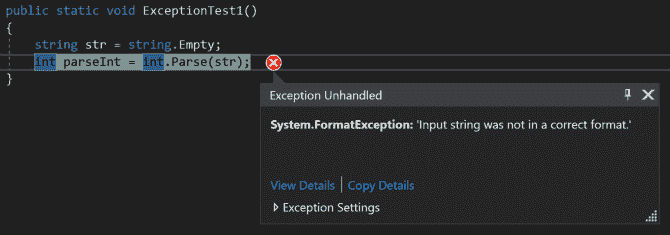
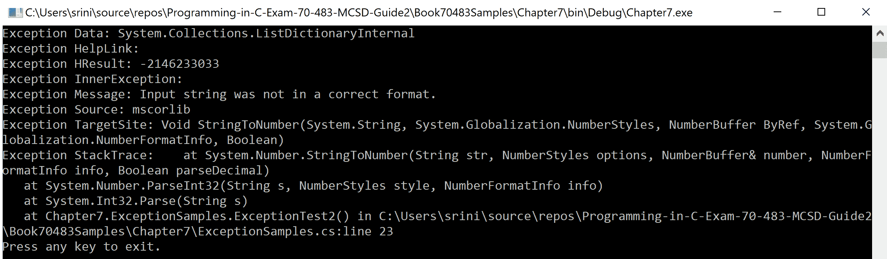
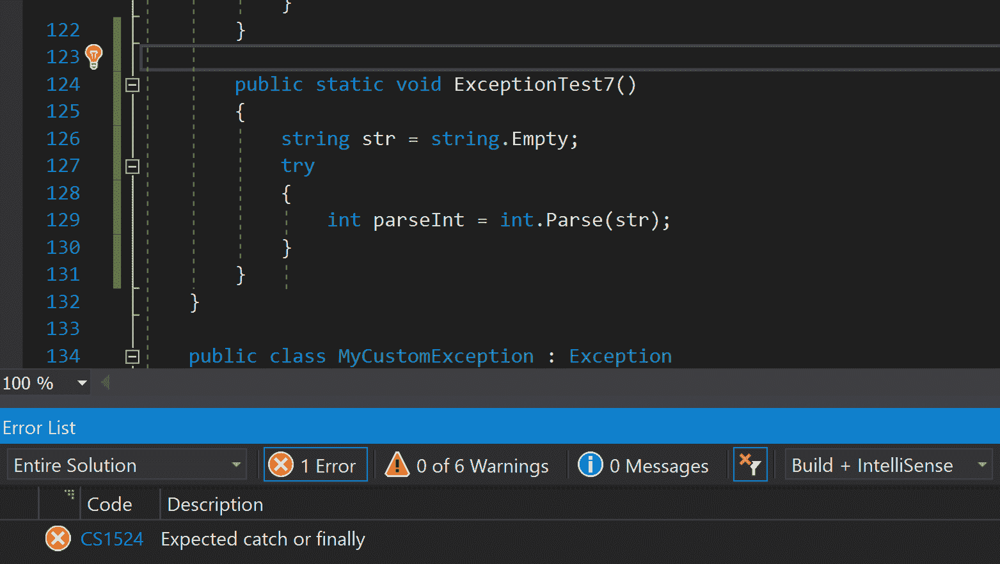
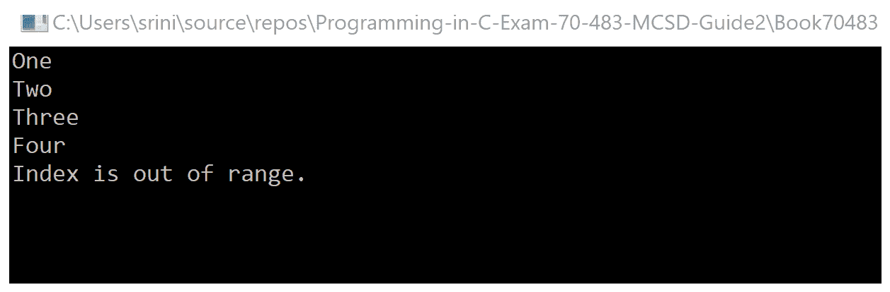
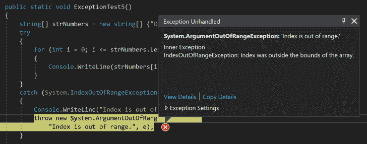

# 实现异常处理

异常处理帮助开发者以有助于处理预期和意外情况的方式构建他们的程序。通常，应用程序逻辑可能会抛出某种未处理的异常，例如，尝试向一个系统中的文件写入代码块，最终导致文件使用异常。如果设置了适当的异常处理，这些场景是可以处理的。

异常处理使用`try`、`catch`和`finally`关键字，使我们能够编写可能不会成功且在需要时可以处理的代码，以及帮助我们清理`try`块执行后的资源。这些异常可以由 CLR、.NET Framework 或您代码中使用的任何外部库抛出。

在本章中，我们将通过查看以下主题来尝试理解我们如何使用、创建和抛出异常：

+   代码中的异常及其处理

+   编译器生成的异常

+   自定义异常

阅读本章后，您将能够构建应用程序程序并处理应用程序逻辑可能抛出的所有类型的异常。

# 技术要求

本章的练习可以使用 Visual Studio 2012 或更高版本以及.NET Framework 2.0 或更高版本进行练习。然而，任何从 C# 7.0 及更高版本的新特性都需要您拥有 Visual Studio 2017。

如果您没有上述任何产品的许可证，您可以下载 Visual Studio 2017 的社区版本，链接为[`visualstudio.microsoft.com/downloads/`](https://visualstudio.microsoft.com/downloads/).

本章的相同代码可以在 GitHub 上找到，链接为[`github.com/PacktPublishing/Programming-in-C-sharp-Exam-70-483-MCSD-Guide/tree/master/Chapter07`](https://github.com/PacktPublishing/Programming-in-C-sharp-Exam-70-483-MCSD-Guide/tree/master/Chapter07)。

# 代码中的异常及其处理

异常是派生自`System.Exception`类的类型。我们使用`try`块包围可能抛出异常的语句。当发生异常时，控制权跳转到`catch`语句，在那里 CLR 收集所有必要的堆栈跟踪信息，然后终止程序并向用户显示消息。如果没有进行异常处理，程序将带错误终止。在处理异常时，重要的是要理解，如果我们无法处理异常，我们就不应该捕获它。这确保了应用程序将处于已知状态。当您定义一个`catch`块时，您定义一个异常变量，可以用来获取更多信息，例如异常的来源、代码中的哪一行抛出了这个异常、异常的类型等等。

程序员可以使用 `throw` 关键字从应用程序逻辑中创建和抛出异常。每个 `try` 块可以定义也可以不定义 `finally` 块，无论是否抛出异常，该块都将执行。这个块帮助我们释放代码块中使用的资源。或者，如果您希望一段代码在所有情况下都执行，则可以将其放在 `finally` 块中。

在接下来的章节中，我们将探讨如何使用异常、`try`-`catch`-`finally` 块的语法、使用 `finally` 块、何时可以销毁未使用的对象、不同类型的系统异常以及创建我们自己的异常。

# 使用异常

如我们之前提到的，C# 程序中的错误是通过异常在运行时传播的。当应用程序代码遇到错误时，它会抛出一个异常，然后由另一个代码块捕获，该代码块收集有关异常的所有信息并将其推送到调用方法，其中提供了 `catch` 块。如果您使用的是通用异常处理程序，系统将显示一个对话框来显示任何未捕获的异常。

在以下示例中，我们尝试将一个空字符串解析为 `int` 变量：

```cs
public static void ExceptionTest1()
{
    string str = string.Empty;
    int parseInt = int.Parse(str);
}
```

当执行时，运行时会抛出一个格式异常，其消息指出输入字符串格式不正确。由于这个异常没有被捕获，我们可以看到通用处理程序在对话框中显示这个错误消息：



下面是异常的详细信息：

```cs
System.FormatException occurred
  HResult=0x80131537
  Message=Input string was not in a correct format.
  Source=<Cannot evaluate the exception source>
  StackTrace:
   at System.Number.StringToNumber(String str, NumberStyles options, NumberBuffer& number, NumberFormatInfo info, Boolean parseDecimal)
   at System.Number.ParseInt32(String s, NumberStyles style, NumberFormatInfo info)
   at System.Int32.Parse(String s)
   at Chapter7.ExceptionSamples.ExceptionTest1() in C:\Users\srini\source\repos\Programming-in-C-Exam-70-483-MCSD-Guide2\Book70483Samples\Chapter7\ExceptionSamples.cs:line 14
   at Chapter7.Program.Main(String[] args) in C:\Users\srini\source\repos\Programming-in-C-Exam-70-483-MCSD-Guide2\Book70483Samples\Chapter7\Program.cs:line 13
```

每个 `catch` 块定义了一个异常变量，它为我们提供了更多关于正在抛出的异常的信息。`exception` 类定义了多个属性，所有这些属性都包含以下额外信息：

| **属性** | **描述** |
| --- | --- |
| `Data` | 获取关于异常的自定义详细信息，以键/值对集合的形式。 |
| `HelpLink` | 获取或设置与异常相关的帮助链接。 |
| `HResult` | 获取或设置与异常关联的 `HRESULT`，这是一个数值。 |
| `InnerException` | 获取触发异常的异常实例。 |
| `Message` | 从异常中获取详细信息。 |
| `Source` | 获取或设置导致错误的程序/实例名称或对象/变量。 |
| `StackTrace` | 以字符串格式获取调用堆栈。 |
| `TargetSite` | 获取触发异常的方法。 |

现在，我们将尝试处理格式异常，并查看每个属性将提供给我们什么。在以下示例中，我们有一个 `try` 块，其中字符串被解析为整数，以及一个用于捕获格式异常的 `catch` 块。在 `catch` 块中，我们显示了我们捕获的异常的所有属性：

```cs
public static void ExceptionTest2()
{
    string str = string.Empty;
    try
    {
        int parseInt = int.Parse(str);
    }
    catch (FormatException e)
    {
        Console.WriteLine($"Exception Data: {e.Data}");
        Console.WriteLine($"Exception HelpLink: {e.HelpLink}");
        Console.WriteLine($"Exception HResult: {e.HResult}");
        Console.WriteLine($"Exception InnerException: 
                          {e.InnerException}");
        Console.WriteLine($"Exception Message: {e.Message}");
        Console.WriteLine($"Exception Source: {e.Source}");
        Console.WriteLine($"Exception TargetSite: {e.TargetSite}");
        Console.WriteLine($"Exception StackTrace: {e.StackTrace}");
    }
}
```

我们试图将一个字符串解析为整数变量。然而，这是不允许的，因此系统抛出异常。当我们捕获异常时，我们正在显示异常的每个属性以观察它存储的内容：



每个异常都是继承自`System.Exception`基类，它定义了异常的类型并详细说明了所有提供更多异常信息的属性。当你需要抛出异常时，你需要创建异常类的实例，设置所有或部分这些属性，并使用`throw`关键字抛出它们。

对于一个`try`块，你可以有多个`catch`块。在执行过程中，当抛出异常时，首先执行处理该异常的特定`catch`语句，而任何其他通用的`catch`语句都将被忽略。因此，按照从最具体到最不具体的顺序组织`catch`块是很重要的：

```cs
public static void ExceptionTest3()
{
    string str = string.Empty;
    try
    {
        int parseInt = int.Parse(str);
    }
    catch (ArgumentException ex)
    {
        Console.WriteLine("Argument Exception caught");
    }
    catch (FormatException e)
    {
        Console.WriteLine("Format Exception caught");

    }
    catch (Exception ex1)
    {
        Console.WriteLine("Generic Exception caught");
    }
}
```

当程序执行时，尽管存在多个`catch`块，系统会识别一个合适的`catch`块并消耗异常。因此，你会在输出中看到“捕获到格式异常”的消息：

```cs
Format Exception caught
Press any key to exit.
```

在调用`catch`块之前会检查`finally`块。当在`try-catch`块中使用资源时，这些资源可能会移动到一个模糊的状态，并且只有在框架的垃圾回收器被调用时才会被收集。程序员可以通过使用`finally`块来清理这些资源：

```cs
public static void ExceptionTest4()
{
    string str = string.Empty;
    try
    {
        int parseInt = int.Parse(str);
    }
    catch (ArgumentException ex)
    {
        Console.WriteLine("Argument Exception caught");
    }
    catch (FormatException e)
    {
        Console.WriteLine("Format Exception caught");

    }
    catch (Exception ex1)
    {
        Console.WriteLine("Generic Exception caught");
    }
    finally
    {
        Console.WriteLine("Finally block executed");
    }
}
```

如您所见，`finally`块被执行，但在抛出并捕获异常之前：

```cs
Format Exception caught
Finally block executed
Press any key to exit.
```

尽管我们有三不同的`catch`块，格式异常被执行，并且之后执行了`finally`块。

# 异常处理

程序员将可能抛出异常的应用逻辑分区到`try`块中，随后是处理这些异常的`catch`块。如果存在，可选的`finally`块将执行，无论`try`块是否抛出异常。你不能只有一个`try`块——它必须由一个`catch`块或一个`finally`块伴随。

在本节中，我们将查看不同的代码块，以便了解`try-catch`语句、`try-finally`语句和`try-catch-finally`语句的用法。

你可以这样使用没有`finally`块的`try-catch`语句：

```cs
try
{
    //code block which might trigger exceptions
}
catch (SpecificException ex)
{
   //exception handling code block

}
```

系统还允许你使用带有`finally`块的`try`块——不需要捕获异常。这在下述代码中显示：

```cs
try
{
    // code block which might trigger exceptions
}
finally
{
    // Dispose resources here.
    //Block you want to execute all times irrespective of try block is executed or not.
}
```

最后但同样重要的是，有`try-catch-finally`块：

```cs
try
{
    // Code that you expect to throw exceptions goes here.
}
catch (SpecificException ex)
{
    // exception handling code block
}
finally
{
    // code block that you want to run in all scenarios
}
```

如果运行时在`try`块中识别到不正确的语法，则会抛出一个编译时错误；例如，在代码编译期间没有`catch`或`finally`块的`try`块。当你没有提供`catch`或`finally`块时，编译器会在`try`块的闭合括号旁边放置一个红色标记，并抛出一个错误，如下面的截图中的错误列表窗口所示：



异常过滤器是一种用于在`catch`块中捕获的异常类型。`System.Exception`是任何异常类型类的基类。作为基类，它可以持有代码中的任何异常。我们使用它在我们有处理每个异常的代码或在我们调用`method()`时抛出异常时。

我们已经讨论过，一个`try`块可以有多个带有不同异常过滤器的`catch`块。当运行时评估`catch`块时，它采取自上而下的方法，并执行最适合已捕获异常的最具体的`catch`块。如果`catch`块中的`exception`过滤器与已抛出的异常匹配，或者与已抛出异常的基类匹配，则执行它。作为一个考试提示，始终记住将最具体的`catch`语句放在顶部，将通用的放在底部。

理解异常处理的重要性有助于你编写能够处理所有可能场景并执行而不会出现意外行为的正确代码。例如，假设你的程序正在尝试打开并写入一个文件，而你收到了一个如`文件未找到`或`文件正在使用中`的异常。异常处理使我们能够处理这些场景。在第一种情况下，提示会要求用户提供正确的文件名，而在第二种情况下，提示会检查是否可以创建一个新文件。

在下面的示例中，一个`for`循环抛出了一个索引超出范围的异常：

```cs
public static void ExceptionTest5()
{
     string[] strNumbers = new string[] {"One","Two","Three","Four" };
     try
     {
         for (int i = 0; i <= strNumbers.Length; i++)
         {
             Console.WriteLine(strNumbers[i]);
         }
     }
     catch (System.IndexOutOfRangeException e)
     {
         Console.WriteLine("Index is out of range.");
         throw new System.ArgumentOutOfRangeException(
                     "Index is out of range.", e);
     }
 }
```

代码处理它，并在抛出之前在屏幕上显示一条消息，以便调用方法可以处理它，如下所示：



然而，我们的主程序不处理异常系统。相反，它使用默认设置并显示一个对话框：



`finally`块释放了在`try`块中创建的任何变量或对象。此块最后执行，如果存在则始终运行：

```cs
public static void ExceptionTest6()
{
    FileStream inputfile= null;
    FileInfo finfo = new FileInfo("Dummyfile.txt");
    try
    {
        inputfile = finfo .OpenWrite();
        inputfile.WriteByte(0xH);
    }
    finally
    {
        // Check for null because OpenWrite() method might return null.
        if (inputfile!= null)
        {
            inputfile.Close();
        }
    }
}
```

在前面的示例中，我们在`try`块中创建了一个文件对象，并尝试向其中写入一些字节。当运行时完成`try`块的执行后，它执行一个`finally`块并释放了在`try`块中创建的`file`对象。

# 编译器生成的异常

让我们回顾一下.NET Framework 支持的几个运行时生成的异常。框架在执行有效语句时使用这些异常。然后，根据它们的类型，从以下表格中抛出相应的异常。例如，如果编译器尝试执行除法操作，并且如果除数为零，则会抛出`DividebyZeroException`异常：

| **Exception** | **描述** |
| --- | --- |
| `ArithmeticException` | 在执行算术操作时触发的异常可以被捕获。 |
| `ArrayTypeMismatchException` | 当数组的值和类型不匹配时，将抛出此异常。 |
| `DivideByZeroException` | 当尝试将整数值除以零时，将抛出此异常。 |
| `IndexOutOfRangeException` | 当使用超出其边界的索引访问数组时，将抛出此异常。 |
| `InvalidCastException` | 在运行时将基类型转换为接口或派生类型将导致此异常。 |
| `NullReferenceException` | 当你尝试访问一个`null`对象时，将抛出此异常。 |
| `OutOfMemoryException` | 当 CLR 可用内存被利用时，新操作符会抛出此类异常。 |
| `OverflowException` | 在执行除法操作时，例如，如果输出是长整型并且你尝试将其推送到`int`，则会抛出此异常。 |
| `StackOverflowException` | 递归调用通常会导致此类异常，并指示非常深的或无限递归。 |
| `TypeInitializationException` | 如果你尝试实例化一个抽象类，例如，将抛出此异常。 |

现在我们已经了解了编译器生成的异常，让我们看看自定义异常。

# 自定义异常

所有异常都源自.NET Framework 中的`System.Exception`类。因此，在这些预定义异常不符合我们的需求的情况下，框架允许我们通过从`Exception`类派生我们的异常类来创建自己的异常。

在以下示例中，我们正在创建一个自定义异常，并从`Exception`类继承。我们可以为它使用不同的构造函数：

```cs
public class MyCustomException : Exception
{
    public MyCustomException():base("This is my custom exception")
    {

    }

    public MyCustomException(string message) 
           : base($"This is from the method : {message}")
    {

    }

    public MyCustomException(string message, Exception innerException) 
       : base($"Message: {message}, InnerException: {innerException}")
    {
    } 
}
```

当你创建自己的异常类时，从`System.Exception`类派生，并实现基类，你将获得四个构造函数；实现这三个是最佳实践。在第一种情况下，基类消息属性默认初始化并显示一条消息。然而，在第二种和第三种情况下，抛出此自定义异常的方法需要传递这些值。

# 摘要

在本章中，我们探讨了如何在程序中使用异常类，如何创建自定义异常以满足我们的需求，以及不同类型的异常。我们还了解了有关如何在应用程序中规划和实现异常的行业标准。

在下一章中，我们将了解类型以及如何创建和消费类型。

# 问题

1.  C# 支持使用 `try` 块而不带 `catch` 和 `finally` 块。

    1.  真的

    1.  假的

1.  `catch` 块需要按照从最通用到最通用的模式使用。

    1.  真的

    1.  假的

1.  如果存在，`finally` 块总是会执行。

    1.  真的

    1.  假的

# 答案

1.  **假的**

1.  **假的**

1.  **真的**

# 进一步阅读

在实现应用程序代码中的异常处理时，理解行业标准非常重要。请查看以下链接以了解这些最佳实践：[`docs.microsoft.com/en-us/dotnet/standard/exceptions/best-practices-for-exceptions`](https://docs.microsoft.com/en-us/dotnet/standard/exceptions/best-practices-for-exceptions)。
