# 在 C# 中创建和使用类型

类型是 C# 程序的构建块。即使在编写基本的 C# 程序时，我们也必须在创建程序时使用正确的类型。在第二章“理解类、结构和接口”中，我们学习了 C# 程序中类型的基础知识。我们学习了 C# 程序中存在的值类型和引用类型变量。

除了了解不同的类型外，我们还应该理解，在尽可能好的情况下或情境中使用每种类型对我们来说非常重要。我们还应该了解有关创建和使用这些类型的最佳实践。我们将在本章中介绍这一点。

我们将在本章中探讨以下主题：

+   创建类型

+   消费类型

+   如何使用属性来强制封装

+   使用可选和命名参数

+   创建索引属性

+   C# 中与字符串操作相关的不同操作

我们将对**反射**有一个概述，并尝试了解它如何帮助我们查找、执行和创建运行时类型。在第十章“使用反射查找、执行和创建运行时类型”中，我们将深入探讨反射。

# 技术要求

与本书中前面章节所涵盖的章节一样，本书中解释的程序将在 Visual Studio 2017 中开发。

本章的示例代码可以在 GitHub 上找到：[`github.com/PacktPublishing/Programming-in-C-Exam-70-483-MCSD-Guide/tree/master/Book70483Samples`](https://github.com/PacktPublishing/Programming-in-C-Exam-70-483-MCSD-Guide/tree/master/Book70483Samples)。

# 创建类型

当我们在 C# 中创建一个变量时，它为我们提供了许多选项来选择变量的适当类型。例如，我们可以选择以下：

+   如果我们希望变量获取一组定义的变量，我们可以选择 `enum` 类型。例如，如果我们定义 `Day` 为 `enum` 类型，它可以获取 `Monday`、`Tuesday`、`Wednesday`、`Thursday`、`Friday`、`Saturday` 和 `Sunday` 等值。

+   同样，如果我们选择 `int` 类型，我们告诉**公共语言运行时**（**CLR**）它不能有十进制数字。

因此，在为任何变量定义类型时，我们必须逻辑地分析变量的使用情况，然后在 C# 中声明其类型。在下一节中，我们只需简要回顾一下我们在第二章“理解类、结构和接口”中的“C# 数据类型”部分所涵盖的不同类型。

# C# 中的类型

在第二章“理解类、结构和接口”中，我们了解到变量可以获取以下类型的值：

+   **值类型**：在值类型中，变量包含变量的实际值。这基本上意味着，如果在程序的不同作用域中对值类型变量进行更改，更改在控制权转移到调用函数后不会反映回来。

+   **引用类型**：数据成员包含变量在内存中的确切地址。由于变量仅包含对内存地址的引用，两个单独的引用类型变量可以指向相同的内存地址。因此，如果对引用类型变量进行更改，更改将直接在变量的内存位置进行，因此会传播到程序执行中的不同作用域。

+   **指针类型**：指针是 C# 中可能存在的另一种变量类型。指针类型用于保存变量的内存地址，使我们能够执行涉及变量内存位置的任何操作。

在下一节中，我们将深入研究指针，并了解它们在我们应用程序中使用时的影响和好处。

# 不安全代码和指针类型的使用

在 C 或 C++ 等语言中，开发者具有创建 *指针* 或 `*` 的功能，这是一个存储另一个变量内存地址的对象。该对象允许应用程序对内存进行非常低级别的访问。然而，由于存在 *悬垂指针* 的可能性，应用程序的性能会大大降低。悬垂指针是 C 中可能存在的一种潜在情况，即指针对象仍然指向应用程序中不再分配的内存位置。请参考以下图表：

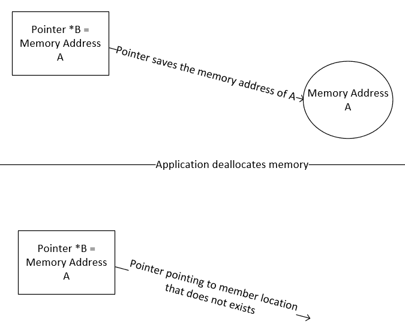

在图中，我们有一个运行在 C 或 C++ 中的应用程序，它声明了指针 B 并将其指向变量 A 的内存地址。指针保存了变量的内存地址。换句话说，指针 B 不会包含变量 A 的内存地址。现在，在程序运行期间某个时刻，应用程序释放了内存位置 A。尽管内存已被释放，但可能存在我们未明确清除包含相应内存地址的指针内容的情形。由于这个错误或疏忽，指针 B 没有更新以指向新的内存块或将其指向 null。因此，该指针仍然引用着应用程序中不再存在的内存位置。这种情况被称为 **悬垂指针**。

C# 通过明确不允许使用指针来消除悬垂指针的可能性。相反，它鼓励人们使用 *引用类型*。引用类型的内存管理由垃圾回收器管理。

在 第九章，*管理对象生命周期* 中，我们将进一步探讨垃圾回收器在 .NET 中的工作原理。

然而，在某些情况下，开发者仍然觉得需要在他们的 C# 应用程序中使用指针。这在需要与底层操作系统（如 Windows 或 Linux）进行某些操作的场景中很有用，在这些操作中应用程序正在运行。在这种情况下，我们将需要指针。为了适应这些场景，C# 有一个名为 `unsafe` 的 *代码* 概念，它允许开发者在代码中使用指针。使用指针的代码必须明确地用 `unsafe` 标识符进行分类。这个关键字向 **公共语言运行时**（**CLR**）传达信息，即代码块是不受管理的或是不安全的——换句话说，已经使用了指针。让我们通过一个代码示例来看看我们如何在 C# 中使用指针类型。

在代码示例中，我们创建了一个函数块，在其中我们使用指针变量。我们将保存 `int` 类型地址的 `int` 指针类型变量。请参考以下截图。请注意，当用户尝试编译程序时，他们会得到一个错误：

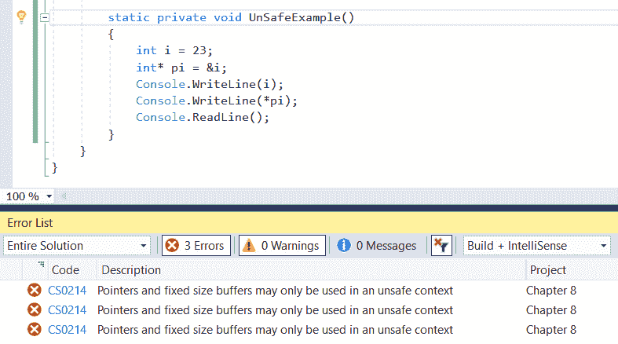

原因是，默认情况下，C# 编译器不会允许任何包含指针或 `unsafe` 代码块的代码执行。我们可以通过在函数块中使用 `unsafe` 关键字来覆盖 C# 的这种行为：

```cs
class Program
 {
     static void Main(string[] args)
     {
         UnSafeExample();
     }
     unsafe static private void UnSafeExample()
     {
         int i = 23;
         int* pi = &i;
         Console.WriteLine(i);
         Console.WriteLine(*pi);
         Console.ReadLine();
     }
 }
```

要允许编译 `unsafe` 代码，我们需要更改 Visual Studio 的构建设置。要更新设置，我们需要右键单击项目并单击属性。现在，导航到构建部分。请参考以下截图，它突出显示了我们需要指定的 Visual Studio 设置，以允许编译 `unsafe` 代码：

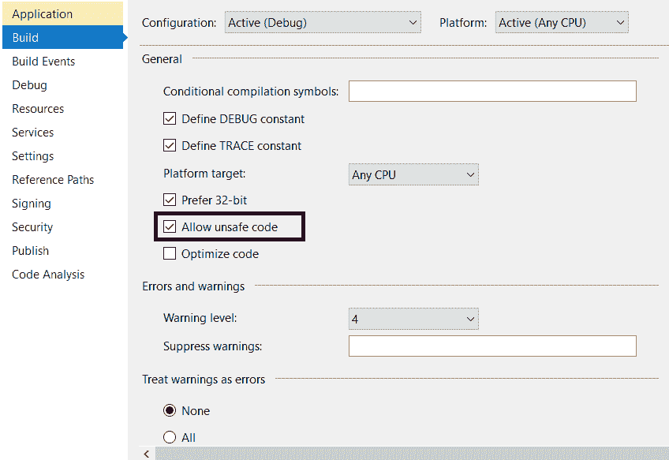

现在我们已经回顾了 C# 中可能的不同类型。下一节将解释帮助我们选择特定变量类型而不是其他类型的指导原则。

# 选择变量类型

在 第二章 的 *理解类、结构和接口* 部分，在 *C# 中的数据类型* 部分中，我们看到了值类型和引用类型可能的不同数据类型。我们还进行了代码实现，以查看 `Struct`（值类型）和 `Class`（引用类型）的行为差异。在本节中，我们将深入探讨这种行为差异，以及它如何帮助我们为变量选择正确的类型。

让我们分析以下代码语句中的值类型和引用类型，看看它们在实现上的差异：

```cs
// Value Type
int x = 10;
int y = x 

// Reference Type
Car c = new Car();
Car c2 = c;
```

在前面的代码中，我们声明了值类型变量 `x` 和 `y`。在声明时，`x` 变量已被赋予一个值。在下一步中，我们将 `x` 赋予 `y`。同样，我们有一个名为 `Class` 的类，我们创建了 `c` 的对象。在下一个语句中，我们声明了同一类的另一个对象，并将 `c` 赋予 `c2`。

请参考以下图表，它显示了这些类型如何在内存中实现和管理：

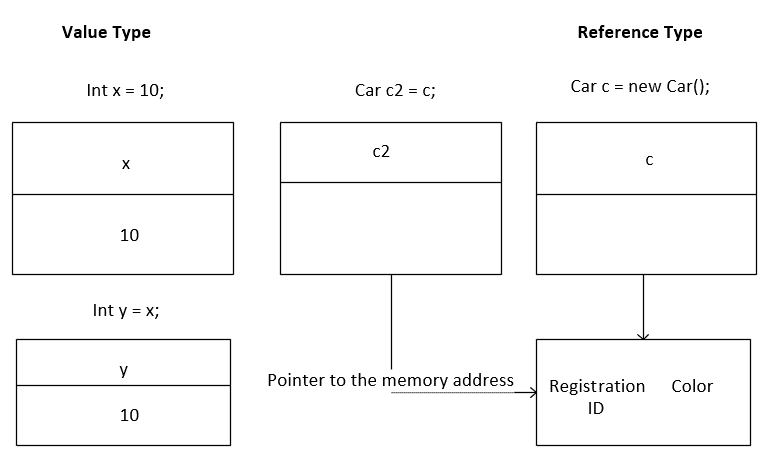

在前面的图表中，我们已将变量`x`声明为`int`数据类型，将`c`声明为`Car`类的对象。现在，我们知道`int`是值类型，而`Class`是引用类型。所以让我们尝试分析为什么两者的行为不同：

+   对于`x`，在第一个语句中，即`int x = 10`，应用程序为其保留了一块内存。声明下方的矩形块表示这一点。

+   现在，当我们执行`int y = x`语句时，我们正在声明另一个变量`y`，并将其分配给`x`当前值。它内部所做的就是为`y`在内存中分配另一块内存。因此，由于`x`和`y`不指向相同的内存位置，它们将持有不同的值。

+   另一方面，如果我们看看`Car`类，我们刚刚在其中声明了两个属性：注册号和颜色。现在，当我们使用`new`语句时，它所做的就是为该类创建一个对象并为其分配内存。然而，与值类型实现相反，它不会在对象中保存值。相反，在对象中，它只保存对分配的内存块的引用。在前面的矩形图中，您将看到，一旦为`Car`类创建了`c`对象，就会在创建的对象中保存一个指针。

+   现在，当我们执行`Car c2 = c;`语句时，内部会创建一个新的对象`c2`，但不会为该对象分配新的内存块。相反，它只是保存了对与对象`c`共享的内存位置的引用。

如前所述的实现所示，每当声明一个新的值类型变量时，应用程序都会为其保留一块新的内存，这与引用类型变量不同。

因此，用更简单的术语来说，以下因素可以帮助我们选择值类型和引用类型：

+   **值类型变量的逻辑不可变性**：用非常简单的话来说，这意味着在每次声明值类型时，应用程序都会为其保留一块新的内存。由于它们是不同的内存分配，这意味着如果我们对某个内存位置执行任何操作，该变化不会传递到另一个内存位置。

+   **对象的数量**：如果应用程序中创建了大量的对象，那么最好不将它们作为值类型创建，因为这会指数级增加应用程序的内存需求。

+   **对象的大小**：如果对象很小，那么将它们作为值类型变量可能是有意义的。然而，如果我们认为对象可能有很多属性，那么引用类型变量将更有意义。

+   **内存管理**：值类型变量在栈上管理，而引用类型变量在堆上管理。当我们进入第九章 Chapter 9，*管理对象生命周期*时，我们将进一步探讨内存管理以及垃圾回收器的工作原理。

现在我们对如何在 C#应用程序中创建和消费不同数据类型有了相当的了解，我们将探讨一些 C#的特性，这些特性帮助我们为应用程序中使用的不同类型设置正确的行为。在下一节中，我们将探讨静态变量以及它们在 C#中的实现方式。

# 静态变量

当我们讨论值类型与引用类型时，我们了解到在 C#中创建的所有对象在程序执行中都有确定的范围。然而，在某些情况下，我们可能希望变量获取一个在所有对象实例中一致的常量值。我们可以使用`Static`关键字来实现这一点。在 C#中，`Static`关键字作为修饰符确保只创建一个变量的实例，并且其作用域是整个程序的运行。我们可以使用`Static`变量针对类、其成员变量、其成员方法和构造函数。

现在我们来看一些涉及`Static`关键字的代码示例。

# 静态成员变量

在本节中，我们将探讨如何使用`Static`关键字针对类及其成员变量。在下面的代码示例中，我们创建了一个名为`Configuration`的`Static`类。仅为了解释，我们不会在其中的成员变量上使用`Static`关键字：

```cs
internal static class Configuration
{
     public string ConnectionString;
}
```

让我们尝试编译程序。我们得到一个错误，指出`ConnectionString`成员变量也必须声明为`static`：

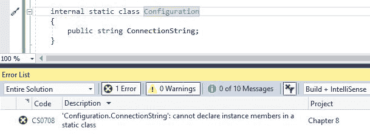

一旦我们将`static`关键字应用于`ConnectionString`成员变量，错误就会消失。这是类的正确表示：

```cs
internal static class Configuration
{
    public static string ConnectionString;
}
```

如果我们需要在成员变量中使用`Set`/`Get`值，我们可以通过使用类的名称直接访问它。以下是这个代码片段：

```cs
Configuration.ConnectionString = "Sample Connection String";
```

在前面的代码示例中，我们有一个名为`Configuration`的`Static`类，其中所有成员变量和属性都必须有`static`修饰符。然而，在某些情况下，我们可能不希望整个类都是静态的，而只是其中的某个成员变量。

我们可以通过在 C#中使用`static`修饰符而不是类来达到这一点，而是针对特定的成员变量。如果我们需要在前面代码中使用它，以下将是更新的代码：

```cs
internal class Configuration
{
    public static string ConnectionString;
}
```

然而，访问这个属性的方式将不会改变。我们仍然可以通过使用类的名称来完成。

# 静态方法

在 C#中，一个类可以有两种类型的方法：静态方法和非静态方法。静态方法在类的不同实例对象之间共享，而非静态方法对每个实例都是唯一的。就像静态成员变量一样，我们可以使用`static`关键字声明一个方法为静态，并通过直接使用类名来访问它们。

以下代码示例表明我们如何在类中创建一个`static`方法：

```cs
internal class Configuration
{
    public static string ConnectionString;
    public static void CreateConnectionString()
    {      
    }
}
```

要执行静态方法，我们可以使用以下代码片段：

```cs
Configuration.CreateConnectionPath(); 
```

在下一节中，我们将探讨构造函数及其在 C#中的实现。

# 构造函数

每当为`class`或`struct`类型创建对象时都会调用构造函数。它们可以帮助我们在这些类型中设置一些默认值。

在第二章“理解类、结构和接口”中，当我们理解`class`和`struct`类型之间的区别时，提到与类不同，结构体现在没有默认构造函数。在编程术语中，这个构造函数被称为**无参构造函数**。如果一个程序员没有为类指定任何构造函数，那么每当创建类的对象时，默认构造函数就会触发，并为类中存在的成员变量设置默认值。这些默认值是根据这些成员变量的类型默认值设置的。

在语法方面，构造函数只是名称与其相应类型相同的函数。在方法签名中，它有一个参数列表，可以映射到类型中存在的成员变量。它没有返回类型。

请注意，一个类或结构体可以有多种构造函数，每种构造函数的参数列表都不同。

让我们看看一个代码示例，我们将在这个示例中实现构造函数：

```cs
public class Animal
{
     public string Name;
     public string Type;

     public Animal(string Name, string Type)
     {
         this.Name = Name;
         this.Type = Type;
     }
 }
```

在前面的代码示例中，我们声明了一个具有两个成员变量`Name`和`Type`的`Animal`类。我们还声明了一个接受`Name`和`Type`作为字符串参数的两个参数构造函数。然后，我们使用`this`运算符将传递给成员变量的值赋给类中存在的成员变量。

我们可以使用以下代码实现来调用这个构造函数：

```cs
Animal animal = new Animal("Bingo", "Dog"); 
```

在下一节中，我们将探讨如何在 C#中实现命名参数。

# 命名参数

命名参数是在 C# 4.0 中引入的，它允许我们使用参数名而不是参数传递的顺序将参数传递给方法/构造函数/委托/索引器。

使用命名参数，开发者不再需要担心传递参数的顺序。只要他们将与传递的值关联正确的参数名称，顺序就无关紧要。参数名称将与方法定义中参数的名称进行比较。让我们通过以下代码示例来了解它是如何工作的：

```cs
internal Double CalculateCompoundInterest(Double principle, Double interestRate, int noOfYears)
{
     Double simpleInterest = (principle) * Math.Pow((1 + 
      (interestRate)/100), noOfYears);
     return simpleInterest;
}
```

在前面的代码示例中，我们通过传递本金、利率和金额存入银行的时间长度来计算复利。

如果我们不使用命名参数来调用方法，我们将使用以下代码片段：

```cs
Double interest = CalculateCompoundInterest(500.5F, 10.5F, 1);            
```

如果我们仔细观察前面的示例，在调用函数时，开发者需要完全清楚本金和利率参数的顺序。这是因为如果开发者在调用函数时出错，结果输出将是不正确的。

使用命名参数，我们可以使用以下语法调用方法：

```cs
Double namedInterest = CalculateCompoundInterest(interestRate: 10.5F, noOfYears: 1, principle: 500.5F); 
```

注意，在前面的代码中，我们不是按照方法中定义的顺序传递参数值，而是使用参数名称将传递的值与方法中声明的参数进行映射。在下一节中，我们将探讨 C# 4.0 中引入的另一个特性，即 *可选参数*，它与命名参数一起引入。

# 可选参数

C# 中的可选参数允许我们以这种方式定义方法，即某些参数是可选的。换句话说，在定义可选参数的函数时，我们指定了一个默认值。

如果在调用方法时未为可选参数传递值，它将假定一个默认值。让我们通过一个代码示例来了解 C# 中可选参数的工作方式：

```cs
static float MultiplyNumbers(int num1, int num2 = 2, float num3 = 0.4f)
{
     return num1 * num2 * num3;
}
```

在前面的代码示例中，我们定义了一个具有三个参数的 `MultiplyNumbers` 方法，分别是 `num1`、`num2` 和 `num3`。`num1` 参数是必需的，而其他两个参数 `num2` 和 `num3` 是可选的。

请注意，在定义函数时，如果存在可选参数，则必须将它们放在所有必需参数之后指定。

如果我们需要执行前面的方法，我们可以使用以下任何代码片段：

```cs
float result = MultiplyNumbers(2); // output = 1.6f
float result1 = MultiplyNumbers(2, 5); // output = 4f
float result2 = MultiplyNumbers(2, 4, 5); // output = 40f

```

注意，如果没有传递任何可选参数，编译器将不会出现错误，并且如果未传递任何可选参数，则将使用函数声明中定义的默认值。在下一节中，我们将探讨泛型类型在 C# 中的实现方式。

# 泛型类型

泛型允许我们设计不涉及数据类型概念的类和方法。换句话说，当我们谈论方法时，泛型允许我们定义方法而不指定输入变量的类型。

让我们通过以下代码实现来了解它如何帮助我们。在以下示例中，我们创建了一个函数，用于比较两个 `int` 变量 `A` 和 `B` 之间的值。如果值相同，它返回 `true`；如果值不同，它返回 `false`：

```cs
static private bool IsEqual(int A, int B)
{
     if(A== B)
     {
         return true;
     }
     else
     {
         return false;
     }
 }
```

现在，假设我们尝试传递一个不是 `int` 类型的变量。在以下屏幕截图中，我们尝试传递 `string` 而不是 `int`，编译器给出错误：

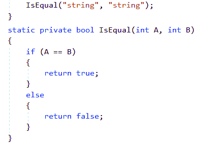

如以下屏幕截图所示，它将给出以下错误：

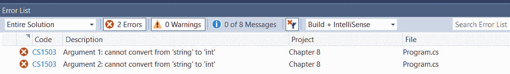

如前一个屏幕截图所示，`IsEqual` 函数接受 `int` 类型的输入。然而，在调用函数时，我们传递的是 `string` 类型的变量。由于类型不匹配，编译器显示错误。

为了纠正这个错误，我们需要将 `IsEqual` 函数泛型化。我们可以通过修改函数，使其不再接受 `int` 类型的输入变量，而是接受 `object` 类型的输入变量。

请注意，C# 中的所有变量都继承自 `object`。

在此代码示例中，我们两次调用 `IsEqual` 函数并传递不同的输入参数。在第一次调用中，我们传递 `string`；然而，在第二次调用中，我们传递 `int`。请注意，当我们编译项目时，没有检索到编译时错误，并且函数比较传递的变量，而不考虑类型：

```cs
static void Main(string[] args)
{
     UnSafeExample();
     IsEqual("string", "string");
     IsEqual(10, 10);
}

static private bool IsEqual(object A, object B)
{
     if (A == B)
     {
         return true;
     }
     else
     {
         return false;
     }
 }
```

尽管前面的代码实现对所有数据类型都是泛型的，但它会导致以下问题：

+   **性能下降**：在 `IsEqual` 函数定义中，变量的数据类型是 `object`。由于这个原因，对于所有调用此函数的情况，变量都需要从其原始类型（即 `int` 或 `string`）转换为 `object`。这种转换将给应用程序增加额外的负担，从而导致性能下降。在编程术语中，这种转换被称为 **装箱和拆箱**，我们将在本章稍后讨论。

+   **类型不安全**：这种方法不会导致类型不安全。例如，我将通过传递以下变量来调用该函数：

```cs
IsEqual(10, "string");
```

如果我这样做，编译器不会给出任何错误，尽管我们知道这个调用没有意义。为了避免这些问题，同时仍然提供给我们进行泛型调用的能力，C# 提供了使用 *泛型类型* 的工具。

使用泛型类型，我们可以避免指定函数输入变量的任何数据类型。因此，`IsEqual` 的实现将如下所示：

```cs
static private bool IsEqual<T>(T A, T B)
{
     if (A.Equals(B))
     {
         return true;
     }
     else
     {
         return false;
     }
 }
```

在前面的代码示例中，请注意，我们使用 `T` 来表示数据类型，因此使其对所有数据类型都是泛型的。

由于我们没有使用 `object`，因此不会有变量的装箱和拆箱。如果我们仍然尝试向此函数传递错误的数据类型，如以下截图所示，编译器将给出错误：

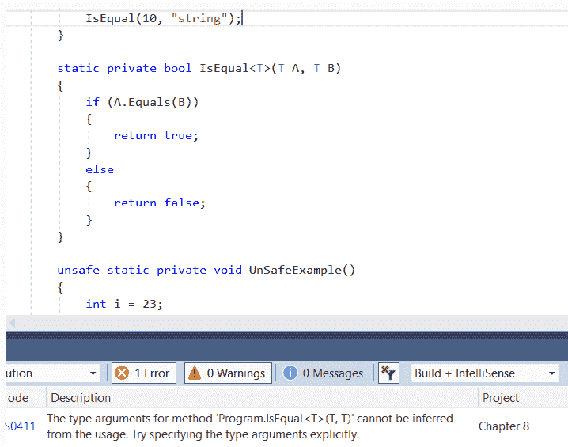

在下一个主题中，我们不会介绍 C# 使用来处理数据变量类型的不同概念。我们将介绍如何在 C# 中使用装箱和拆箱将一种数据类型转换为另一种类型，以及我们在消费不同类型的变量时应注意的不同事项。

# C# 中的数据类型消费

C# 是一种强类型语言。这基本上意味着，当我们声明一个特定数据类型的变量时，如以下示例所示，我们不能再次声明 `x` 变量：

```cs
int x = 5;
```

此外，我们无法将任何非整数值赋给此 `x` 变量。因此，以下语句将给出错误：

```cs
x = "Hello";
```

为了克服这种强类型特性，C# 在我们消费类型时提供了一些功能。这包括值类型变量的装箱和拆箱、使用动态关键字以及将一个数据类型的变量隐式或显式转换为另一个数据类型的变量。让我们逐一了解这些概念，并理解它们在 C# 中的工作原理。

# 装箱和拆箱

在 C# 中，装箱意味着将值类型变量转换为引用类型变量。拆箱是装箱的相反操作。它指的是将引用类型变量转换为值类型变量。装箱和拆箱对应用程序的性能有害，因为它们是编译器的开销。作为开发者，我们应该尽可能地避免它们；然而，这并不总是可能的，我们在编程过程中会遇到一些情况，迫使我们使用这个概念。

让我们通过以下示例来了解装箱和拆箱是如何工作的：

```cs
static private void BoxAndUnBox()
{
     int i = 3;
     // Boxing conversion from value to reference type
     object obj = i;
     // Unboxing conversion from reference type to value type
     i = (int)obj;
 }
```

在代码实现中，我们可以看到以下内容：

+   我们已声明一个 `i` 变量，其类型为 `int`，并已赋予它 `3` 的值。现在我们知道，作为 `int`，这是一个值类型的引用。

+   接下来，我们声明一个 `obj` 变量，其类型为 `object`，并将其赋值为 `i` 中的值。我们知道 `object` 是一个引用类型变量。因此，在内部，CLR 将执行装箱，并将 `i` 变量中的值转换为引用类型变量。

+   接下来，在第三条语句中，我们正在进行相反的操作。我们试图将一个引用类型变量中的值，即 `obj`，赋给一个值类型变量，`i`。在这个阶段，CLR 将执行拆箱操作。

请注意，在进行装箱操作时，我们不需要显式地将值类型转换为引用类型。然而，当我们进行拆箱操作时，我们需要显式指定要转换到的变量类型。这种显式指定要转换到的变量类型的方法被称为类型转换。要进行类型转换，我们可以使用以下语法：

```cs
i = (int)obj;
```

它基本上意味着这种转换可能导致`InvalidCastException`类型的异常。例如，在上面的例子中，我们知道`obj`中的值是`10`。然而，如果它获取一个无法转换为`int`值的值，例如`string`，编译器将给出运行时错误。

现在，在下一节中，我们将探讨 C#为我们提供用于在数据类型之间进行转换的不同技术。

# C#中的类型转换

C#中的类型转换基本上意味着将变量从一个数据类型转换为另一个数据类型。现在我们将探讨 C#中可用的不同类型转换。

# 隐式转换

隐式转换是由编译器自动完成的。编译器在没有任何开发者干预或命令的情况下执行隐式类型转换。编译器执行隐式类型转换必须满足以下两个条件：

+   **无数据丢失**：编译器必须确定如果它隐式执行转换，将不会发生数据丢失。在第二章，“理解类、结构和接口”，在“数据类型”部分，我们看到了每种数据类型都会在内存中占用空间。因此，如果我们尝试将一个类型为`float`的变量（占用 32 字节内存）赋值给一个类型为`double`的变量（占用 64 字节内存），我们可以确信在转换过程中不会发生数据丢失。

+   **无转换异常的可能性**：编译器必须确定在将值从一种数据类型转换为另一种数据类型的过程中不会发生异常。例如，如果我们尝试将一个`string`值设置到一个`float`变量中，编译器将不会执行隐式转换，因为这将会是一个无效的转换。

现在，让我们看一下以下代码实现，以了解 C#中隐式转换是如何工作的：

```cs
 int i = 100;
 float f = i;
```

在前面的代码示例中，我们声明了一个`int`类型的变量`i`，并给它赋值为`100`。在下一个语句中，我们声明了一个`float`类型的变量`f`，并将其值赋给`i`。

现在，编译器会确定隐式转换所需的两个条件都已满足，即`float`占用的内存比`int`多，并且不存在无效转换异常的可能性——`int`值也是`float`变量中的一个有效值。因此，编译器不会报错，并执行隐式转换。

然而，如果我们进行反向操作，即尝试将 `float` 值赋给 `int`，编译器将确定条件未满足，并将给出编译时错误。请参考以下截图：

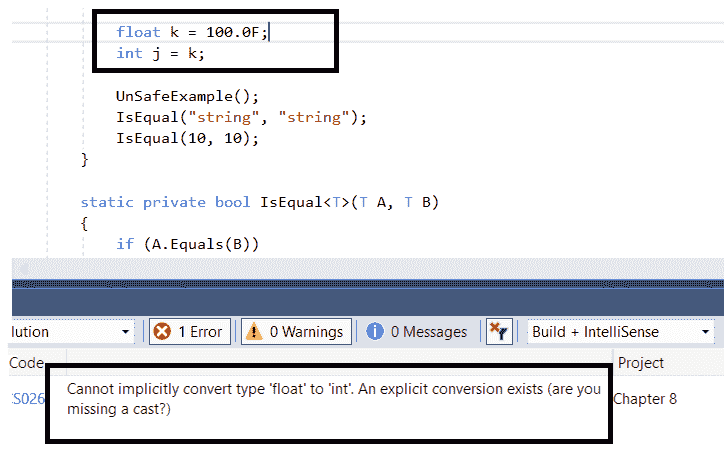

然而，在某些情况下，即使有可能数据丢失，我们仍然希望进行这些转换。C# 提供了 *显式转换*，允许我们明确指示编译器让转换发生。让我们看看 *显式转换* 是如何进行的。

# 显式转换

当编译器无法隐式更改变量的类型，但我们仍然希望进行转换时，我们需要明确指示编译器进行转换。这被称为*显式转换*。

在 C# 中，有两种进行显式转换的方法：

+   **使用类型转换操作**：在这种情况下，我们使用基本数据类型来指示编译器进行显式转换。例如，对于前面示例中尝试的代码实现，以下将是语法：

```cs
float k = 100.0F;
int j = (int)k;
```

在前面的代码中，我们通过在浮点变量之前使用 `int` 类转换来明确告诉编译器进行类型转换。

+   **使用 `Convert` 类**：C# 提供了 `Convert` 类，我们可以使用它来进行多种数据类型之间的类型转换。如果我们使用 `Convert` 类而不是 `int` 关键字，以下将是语法：

```cs
float k = 100.0F;
int j = Convert.ToInt32(k);
```

`Convert` 类可用于不同数据类型之间的类型转换。请参考以下截图以了解 `Convert` 类中可用的不同选项。根据使用情况，我们可以使用 `Convert` 类中的适当方法：

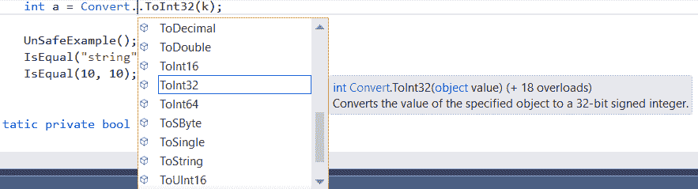

因此，程序的总体实现将如下所示：

```cs
float k = 100.67F;
int j = (int)k;
int a = Convert.ToInt32(k);
Console.WriteLine(j);
Console.WriteLine(a);
Console.ReadLine();

```

现在，让我们尝试运行这个程序来看看它给出的输出：

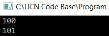

这意味着当我们使用类型转换关键字，即 `(int)k`，编译器尝试从 `float` 变量 `k` 中提取整数部分，结果为 `100`。

另一方面，当我们使用 `Convert` 类，即 `Convert.ToInt32(k)`，它会尝试提取与浮点变量 `k` 最接近的整数，结果为 `101`。这是开发者在决定使用类型转换和 `Convert` 类之间需要了解的关键区别之一。

当我们查看显式类型转换时，我们需要注意两个辅助方法，这些方法帮助我们进行转换：

+   `Parse`

+   `TryParse`

`Parse` 和 `TryParse` 方法都用于将 `string` 转换为不同的数据类型。然而，在处理无效情况异常的方式上存在细微差别。让我们通过以下示例来看看它们是如何工作的以及它们之间的区别：

```cs
string number = "100";
int num = int.Parse(number); 
```

在前面的例子中，我们声明了一个字符串对象，并给它赋值为`100`。现在，我们正在尝试使用`Parse`方法将这个值转换为整数。当我们运行程序时，我们看到以下输出：

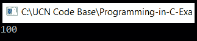

这意味着解析方法将字符串转换为它的整数等价物，并将值赋给另一个变量，`num`。

现在，假设数字中的值是`100wer`。现在很明显，`number`字符串中的值不能转换为`int`，因为它包含一些无法归类到整数对象中的字符。当我们运行这个程序时，我们得到以下异常：

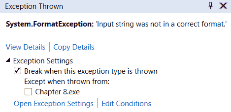

为了避免这种情况，我们使用`TryParse`。在`TryParse`中，CLR 尝试将字符串对象转换为指定的数据类型。然而，如果转换返回错误，`TryParse`返回`false`，换句话说，*转换失败*。在其他情况下，它返回`true`。因此，如果我们用`TryParse`编写相同的实现，我们会这样做：

```cs
 string number = "100wer"; 
 int num;
 bool parse = int.TryParse(number, out num);
 if(parse)
 {
     Console.WriteLine(num);
 }
 else
 {
     Console.WriteLine("Some error in doing conversion");
 }
 Console.ReadLine(); 
```

在前面的程序中，我们声明了一个`string`类型的变量，并使用`TryParse`将其值转换为`int`类型的变量。我们正在检查转换是否成功。如果成功，我们打印出数字；在其他情况下，我们打印一条语句来显示在类型转换过程中出现了错误。当我们运行程序时，我们得到以下输出：


从输出中我们可以看到，编译器告诉我们`TryParse`操作出现了错误；然而，与在相同场景下抛出无效案例异常的`Parse`方法不同，它并没有在应用程序中抛出异常。

在下一节中，我们将快速回顾封装的概念，这是我们已经在第三章《理解面向对象编程》中讨论过的，我们将看到如何为类的成员变量对象实现属性，这样我们就可以在不用担心隐藏复杂性的情况下消费它们。

# 强制封装

在之前，我们在第二章《理解类、结构和接口》和第三章《理解面向对象编程》中讨论了以下概念：

+   访问修饰符及其如何帮助我们控制同一类、同一程序集和派生类中方法和字段的访问。

+   封装及其如何帮助我们将在同一对象中相关联的字段和方法组合在一起。

然而，封装中还有一个叫做属性的概念，它确保没有人可以直接访问类外的数据字段。这有助于我们确保我们对数据字段的修改有控制权。

属性与类的字段非常相似。就像类的字段一样，它有一个类型、名称和访问修饰符。然而，使其不同的地方在于存在访问器。访问器是允许我们从字段设置和检索值的`get`和`set`关键字。

属性的语法如下：

```cs
class SampleProperty
{ 
     private string name;
     public string Name
     {
         set { if(value != null)
                 {
                     this.name = value;
                 }
               else
                 {
                     throw new ArgumentException();
                 }    
             }
         get { return this.name; }
     }
 }
```

在前面的代码中，请注意以下几点：

+   对于`SampleProperty`类，我们已声明了一个`name`字段和一个`Name`属性。

+   `name`字段已被标记为`private`，因此它不会在`SampleProperty`类外部被访问。

+   `Name`属性已被标记为`public`，并具有`get`和`set`访问器。

+   在`set`方法中，我们正在检查传递的值是否为 null。如果是 null，我们将引发一个参数异常。因此，我们在`name`字段上可以设置的值周围设置了规则。

以这种方式，属性帮助我们消费类的字段。

# 字符串操作

字符串是 C#中一个非常重要的数据类型。字符串数据类型用于保存文本为`string`。在编程术语中，它是一系列字符。字符串是一个引用类型变量，与其他基本数据类型变量（如`int`、`float`和`double`，它们是值类型变量）不同。此外，字符串在本质上是不变的，也就是说，它们中存在的值不能改变。在本节中，我们将探讨与该数据类型相关的不同操作。

因此，请看以下代码示例：

```cs
string s = "Hello";
s = "world";
```

当我们将`Test`值分配给已声明的`string`对象时，CLR 内部会为修改后的`string`对象分配一个新的内存块。因此，对于我们在字符串上进行的每个操作，而不是修改相同的`string`对象，CLR 会声明一个新的`string`对象。由于这个原因，我们在对字符串进行操作时需要非常小心，例如，如果我们在一个字符串对象上执行以下循环操作：

```cs
string s = String.Empty;
for(int z = 0; z < 100; z++)
{
    s = + "a";
}
```

在前面的代码中，我们在循环中将字符串对象`s`与一个字符`a`连接起来。这个循环将运行`100`次。因此，CLR 将不断为`string`对象分配更多的内存。因此，由于内存使用，从性能角度来看，前面的操作并不好。

为了帮助改进`string`中的这个特性，C#为我们提供了两个内置类，`Stringbuilder`和`StringWriter`，我们将在下一节中讨论它们。我们还将查看 C#中可用于执行字符串搜索的一些功能。

# `StringBuilder`

`Stringbuilder` 是 C# 提供的一个内部类，它帮助我们改进 `string` 操作函数。为了解释这个想法，我们将执行一个从 `0` 到 `100` 的 `for` 循环，并在每个循环中将结果输出与字母 `a` 连接起来。内部，字符串构建器使用缓冲区来修改字符串值，而不是在每次字符串操作时分配内存。以下代码示例展示了我们如何使用字符串构建器进行字符串操作：

```cs
StringBuilder sb = new StringBuilder(string.Empty);
for (int z = 0; z < 100; z++)
{
     sb.Append("a"); 
}
```

在前面的代码中，我们声明了一个 `StringBuilder` 对象 `sb`，并在循环中将其值与 `a` 连接。内部，`StringBuilder` 将使用内部缓冲区来管理这些操作。

# 字符串读取器和字符串写入器

`StringReader` 和 `StringWriter` 类分别从 `TextReader` 和 `TextWriter` 类派生。`TextReader` 和 `TextWriter` 用于处理诸如从 XML 文件读取、生成 XML 文件或从文件读取等 API。

我们将在第十四章 执行 I/O 操作中更详细地研究 `TextReader` 和 `TextWriter` 类。

使用 `StringReader` 和 `StringWriter` 类，我们可以通过操作字符串和字符串构建器的对象来与这些 I/O 操作进行交互。

让我们通过以下示例来更好地理解这些方法。在以下示例中，我们使用 `StringWriter` 首先创建一个 XML 文件的摘录，然后我们将结果 XML 表示传递给 `StringReader`，它将尝试读取其中的元素。

在以下代码示例中，我们使用 `XMLWriter` 创建一个以 `Student` 为起始元素并具有 `Name` 属性的 XML 文件。我们使用 `StringWriter` 保存 XML 文件的字符串表示：

```cs
static private string CreateXMLFile()
{
     string xmlOutput = string.Empty;
     var stringWriter = new StringWriter();
     using (XmlWriter writer = XmlWriter.Create(stringWriter))
     {
         writer.WriteStartElement("Student");
         writer.WriteElementString("Name", "Rob");
         writer.WriteEndElement();
         writer.Flush();
     }
     xmlOutput = stringWriter.ToString();
     return xmlOutput;
}
```

假设我们打印程序的输出；我们将得到以下结果：

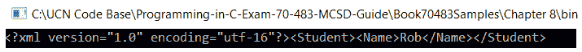

现在，在以下代码片段中，我们将使用 `StringReader` 来读取这个 XML 文件：

```cs
static private void ReadXMLFile(string xml)
{
     var stringReader = new StringReader(xml);
     using (XmlReader reader = XmlReader.Create(stringReader))
     {
         reader.ReadToFollowing("Name");
         string studentName = reader.ReadInnerXml();
         Console.WriteLine(studentName);
     }
 }
```

请注意，我们向函数传递了一个字符串参数，该参数首先被转换为 `StringReader` 对象。从那个 `StringBuilder` 对象，我们创建了一个 `XmlReader` 对象。

`ReadToFollowing` 函数读取 XML 文件，直到找到具有相应名称的元素，该名称作为参数传递给函数。在前面的代码示例中，我们将 `Name` 参数传递给 `XmlReader` 对象。根据我们传递给它的 XML 文件，它将带我们到 `Rob` 元素。为了读取元素的文本表示，我们可以使用 `reader` 对象上的 `ReadInnerXml` 函数。因此，在前面的示例中，`studentName` 变量将被分配 `Rob` 的值。如果我们执行代码片段，我们将得到以下输出：


在下一节中，我们将介绍一些我们可以用来在字符串对象中搜索特定字符的函数。

# 字符串搜索

如其名所示，字符串搜索涉及在另一个字符串中搜索特定字母或字符串的存在。C# 提供了多种方法来完成这项工作。

请注意，C# 是一种区分大小写的语言。因此，搜索字符，比如 *C*，与在字符串中搜索字符 *c* 是不同的。

请参考以下使用 `string` 对象可以进行的不同类型的搜索：

+   `Contains`: 当我们想要检查一个特定字符是否存在于字符串中时，我们使用 `Contains` 函数。以下示例检查字符 `z` 是否存在于字符串对象中。如果存在，它返回 `true`；否则，返回 `false`。

让我们看看以下示例：

```cs
string s = "hello australia";
var contains = s.Contains("z");
if(contains)
{
   Console.WriteLine(" z is present in it.");
}
else
{
   Console.WriteLine(" z is not present");
}  
```

在前面的代码中，使用 `Contains` 函数，我们正在检查 `z` 是否出现在我们调用函数的字符串中。由于我们为具有值 `hello australia` 的变量调用它，因此它将返回 `false` 值，因为 `z` 不在字符串中出现。因此，当代码执行时，我们得到以下输出：

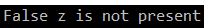

+   `IndexOf`: 如果我们想要找出字符串中特定字符出现的位置，我们会使用这个函数。

例如，在下面的代码示例中，我们正在寻找字符串 `hello australia` 中字符 `a` 的首次和末次出现的位置：

```cs
 string s = "hello australia";
 var firstIndexOfA = s.IndexOf("a");
 Console.WriteLine(firstIndexOfA);
 var lastIndexOfA = s.LastIndexOf("a");
 Console.WriteLine(lastIndexOfA);
```

当我们执行程序时，我们将得到首次出现的位置为 6，末次出现的位置为 14。`IndexOf` 函数检索字符或字符串在字符串中首次出现的位置，请注意，它不会忽略空格。因此，空白也被计为一个字符。同样，`LastIndexOf` 函数检索相应字符或字符串出现的最后一个索引：

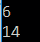

请注意，在 C# 中，对于任何数组或字符串，第一个字符的索引为零。

+   `StartsWith`/`EndsWith`: 如果我们想要检查一个字符串是否以特定的字符开始或结束，我们会使用这个函数。

以下代码示例显示了一个场景，其中我们正在检查之前使用的相同字符串对象是否以 `h` 开始和结束。在以下代码中，在第一个语句中，我们正在检查 `s` 字符串变量是否以 `h` 开始。根据评估结果，我们在控制台窗口中打印输出。同样，在下一个语句中，我们正在检查相同的字符串变量是否以 `h` 结束。根据评估结果，我们再次在控制台窗口中打印输出：

```cs
if(s.StartsWith("h"))
{
     Console.WriteLine("It Starts with h.");
}
else
{
     Console.WriteLine("It does not starts with h.");
}

if (s.EndsWith("h"))
{
     Console.WriteLine("It ends with h.");
}
else
{
     Console.WriteLine("It does not ends with h.");
}
```

请参考以下输出以了解前面的代码示例：

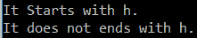

+   `Substring`：如果我们想从一个特定的字符串对象中提取子字符串，我们将使用此函数。在 C# 中，可能的子字符串有两种变体。在一个中，我们只指定起始索引并从该特定索引提取子字符串。在另一个变体中，我们指定起始和结束索引，并提取该子字符串中的字符。

下面是这个代码示例：

```cs
 string subString = s.Substring(3, 6);
 string subString2 = s.Substring(3);
 Console.WriteLine(subString);
 Console.WriteLine(subString2);
```

在前面的代码示例中，我们正在寻找字符串对象 `hello australia` 的两个子字符串。

在第一个子字符串中，我们传递了起始索引为 3，结束索引为 6。因此，子字符串将返回值，`lo aus`。

在第二个子字符串中，我们只传递了起始索引，3。因此，它将从该索引返回整个字符串。以下是此执行输出的截图：


这些是 C# 中可用的不同字符串操作函数。在下一节中，我们将概述反射，并了解它是如何帮助我们从程序集获取结构——换句话说，类及其方法和属性。

# 反射概述

在 C# 中，反射意味着在运行时检查程序集的内容。它返回程序集中每个类的元数据——因此，它返回以下内容：

+   类的名称

+   类中存在的所有属性

+   所有方法及其返回类型和函数参数

+   类中存在的所有属性

在 第十章，*使用反射在运行时查找、执行和创建类型*，我们将深入探讨反射；然而，在本章中，我们只会通过一个代码示例来展示如何在 C# 中实现反射，以解码程序集中存在的所有元数据。

要使用反射，我们需要包含 `System.Reflection` 命名空间，它帮助我们使用所需的类，例如 `Assembly`。请参考以下函数，该函数根据其路径读取特定的程序集，并读取程序集中存在的所有类、方法和参数：

```cs
static private void ReadAssembly()
{
     string path = @"C:\UCN Code Base\Programming-in-C-Exam-70-483-
      MCSD-Guide\Book70483Samples\Chapter8\bin\Debug\ABC.dll";
     Assembly assembly = Assembly.LoadFile(path);
     Type[] types = assembly.GetTypes();
     foreach(var type in types)
     {
         Console.WriteLine("Class : " + type.Name);
         MethodInfo[] methods = type.GetMethods();
         foreach(var method in methods)
         {
             Console.WriteLine("--Method: " + method.Name);
             ParameterInfo[] parameters = method.GetParameters();
             foreach (var param in parameters)
             {
                 Console.WriteLine("--- Parameter: " + param.Name + " : 
                  " + param.ParameterType); 
             }
         }
     }
    Console.ReadLine();
}
```

在前面的代码库中，我们已声明了一个 C# 中程序集的完全限定路径。接下来，我们已声明了一个 `Assembly` 类的对象，并检索了程序集中所有 `Types` 的数组。然后，我们正在遍历每个类型，并找出这些类型中的方法。一旦我们为每个类型获取了方法列表，我们就检索该方法中存在的参数列表及其参数类型。

# 摘要

在本章中，我们学习了如何在 C#中管理类型。我们对 C#中可用的不同数据类型进行了回顾。我们深入探讨了值类型和引用类型。我们还回顾了指针数据类型，并学习了它是如何工作的。我们还查看了一些用户可以选择变量类型的实践。我们还查看了一般类型，并学习了它们如何帮助我们提高系统的性能。

然后，我们探讨了我们在 C#中声明类型时使用的不同技术。我们学习了 C#中的装箱和拆箱是如何工作的。然后，我们查看如何消费这些数据类型。我们还探讨了类型转换，包括隐式和显式转换，并学习了它们如何帮助我们转换一种数据类型到另一种数据类型。

然后，我们查看了一下`Properties`以及它是如何帮助我们更好地控制从类的字段属性设置和检索值的。然后，我们研究了字符串以及它们是如何工作的。我们探讨了字符串的不可变特性。我们探讨了使用`StringBuilder`、`StringWriter`和`StringReader`，这些工具帮助我们提高使用字符串的性能。然后，我们查看 C#中帮助我们在字符串上执行不同操作函数的不同函数。最后，我们对反射进行了高级回顾，并通过代码示例学习了我们如何检索程序集中的元数据。

在下一章中，我们将探讨 C#中垃圾回收是如何执行的。我们将探讨 CLR 如何在 C#中管理不同数据类型的内存。我们将探讨 C#如何允许我们管理“非托管资源”或本章中我们看到的“指针类型”。我们还将探讨我们如何实现`IDisposable`接口来管理非托管资源。

# 问题

1.  在使用指针声明时，我们在程序函数中使用的关键字是什么？

    1.  密封

    1.  安全

    1.  内部受保护

    1.  不安全

1.  以下代码片段的输出会是什么？

```cs
 float f = 100.23f;
 int i = f;
 Console.WriteLine(i);
```

+   1.  100

    1.  编译时错误

    1.  101

    1.  运行时错误

1.  以下代码片段的输出会是什么？

```cs
string s = "hello australia";
var contains = s.Contains("A");
if(contains)
{
     Console.WriteLine("it's present");
}
else
{
     Console.WriteLine("it's not present");
}
```

1.  它存在

1.  它不存在

# 答案

1.  **不安全**

1.  **编译时错误**

1.  **它不存在**
