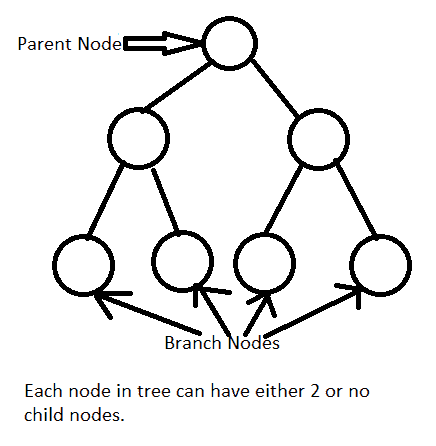
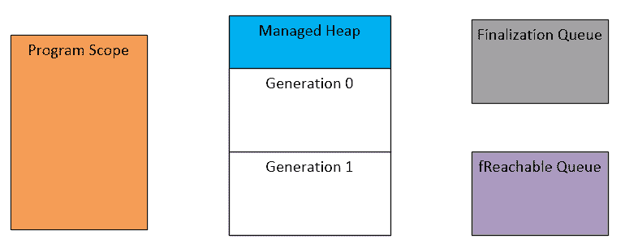
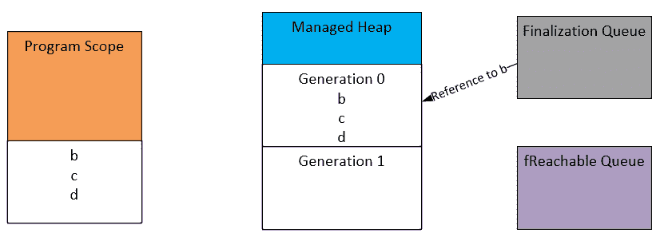
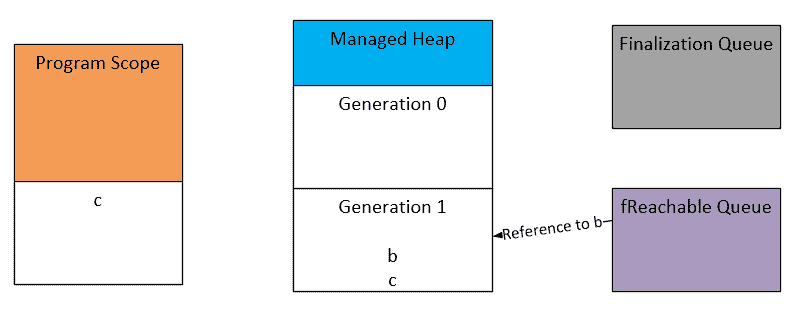

# 第九章：管理对象生命周期

C#是一种托管语言。与需要显式管理内存清理的其他语言，如 C++不同，在 C#中我们不需要担心这一点。.NET Framework 中的垃圾回收器为我们管理内存的分配和释放。

垃圾回收器确保只要我们使用托管类型，即值类型和引用类型变量，我们就不需要显式销毁对象来释放其内存。然而，正如我们在第八章，*在 C#中创建和使用类型*中发现的，C#也赋予我们利用指针对象类型的能力。在 C#中，我们必须声明使用不安全语法的代码。除此之外，对于在不安全代码中声明的变量，我们还需要管理内存的释放。

在本章中，除了探讨非托管代码的内存管理外，我们还将深入研究以下主题：

+   C#中托管代码和非托管代码的区别

+   C#中垃圾回收的工作原理

+   如何在应用程序执行期间，垃圾回收器使用托管堆为对象分配内存

+   理解垃圾回收器使用的标记-压缩算法

+   如何在 C#中管理非托管资源

+   理解终结和终结方法的使用对性能的影响

+   理解`IDisposable`接口以及它如何帮助克服终结方法的不足

+   理解如何将`Dispose`方法与终结方法结合使用，以确保我们应用程序的最佳性能

+   理解使用`using`块为所有实现`IDisposable`接口的类

# 技术要求

与本书中前面的章节一样，这里解释的程序将在 VS 2017 中开发。

本章的示例代码可以在 GitHub 上找到，地址为[`github.com/PacktPublishing/Programming-in-C-Sharp-Exam-70-483-MCSD-Guide/tree/master/Book70483Samples`](https://github.com/PacktPublishing/Programming-in-C-Sharp-Exam-70-483-MCSD-Guide/tree/master/Book70483Samples)。

# 托管代码与非托管代码的比较

在本节中，我们将了解托管代码和非托管代码之间的区别。回想一下，我们也在第一章，*学习 C#基础知识*中学习了这一点。因此，为了快速回顾，我们只需复习那里覆盖的概念。

这些概念不仅适用于 C#语言，也适用于所有在.NET Framework 中编写的语言。以下是一些托管代码和非托管代码之间的区别：

+   托管代码由**公共语言运行时**（**CLR**）执行。因此，代码与底层操作系统独立。另一方面，非托管代码是直接由操作系统执行的代码。

+   在管理代码的情况下，代码与底层框架或操作系统是独立的。CLR 将代码编译成中间语言（**IL**）代码，然后将其编译成机器代码。IL 代码由程序正在执行的底层系统或操作系统组成。另一方面，在非管理代码的情况下，代码直接编译成底层机器代码。

+   由于管理代码是由 CLR 执行的，.NET 框架提供了几个内置功能，如垃圾回收和类型检查异常。然而，对于非管理代码，正如我们将在本章中学习的，程序员需要显式管理内存清理活动，否则这些活动将由垃圾回收器执行。

现在，在我们学习程序员如何管理非管理代码的内存之前，让我们首先了解 C# 中的垃圾回收是如何工作的以及它有多有用。

# 垃圾回收

垃圾回收是 .NET 中由 CLR 提供的一种功能，它帮助我们清理由管理对象占用的内存。这是一个在 .NET 框架中执行的线程，并且定期检查应用程序中是否有任何未使用的内存。如果它确实找到了内存，那么它将回收该内存并销毁底层对象。

假设我们已经使用 C# 实现了一个 .NET 网络应用程序。现在，让我们假设在任何时间间隔内，都有多个人试图访问这个 .NET 应用程序。以下是一个特定的场景，它将给我们一个关于为什么垃圾回收是 C# 或任何 .NET 应用程序非常重要的部分的启示：

+   当用户浏览应用程序时，他们可以执行许多功能，例如访问他们的个人资料或执行操作（例如创建、更新和删除信息）。

+   此信息可以存储在不同的来源中，例如 SQL、Oracle 或更多。

+   为了访问此信息和执行这些操作，应用程序将在应用程序运行时需要创建不同的对象。

+   假设一个场景，其中内存正在分配给不同的对象，但没有被清理，随着时间的推移，我们将最终得到一个拥有过多未使用内存的系统。当内存中声明的对象不再需要时，内存清理是逻辑的。例如，假设用户在应用程序中执行了预期的操作后注销。在这种情况下，为该特定用户的操作分配的内存不再需要。因此，可以回收该内存。

+   如果分配给应用程序的内存有限，这将在一段时间后导致性能下降。

.NET 框架中的垃圾回收确保了管理代码不会出现此类情况。此线程在应用程序的背景中运行，并在设定的时间间隔内回收内存。

请注意，垃圾回收只能回收托管代码的未使用内存。对于稍后我们将学习的非托管代码，我们需要显式编写代码以确保应用程序中不会发生内存泄漏。

.NET 中的垃圾回收器在应用程序中执行以下任务：

+   **内存分配**：在.NET 上运行的每个应用程序都在托管堆中维护一个执行所需的内存块。垃圾回收管理从该堆结构到程序中使用的对象的内存分配。在接下来的章节中，我们将了解更多关于托管堆的内容。

+   **内存释放**：垃圾回收器在应用程序运行时以设定的时间间隔运行，寻找应用程序不再需要的对象。然后销毁这些对象，并为未来的使用回收内存。

    当程序执行期间出现以下三种条件之一时，垃圾回收器会回收内存：

    +   **应用程序内存不足**：在.NET 上运行的每个应用程序都需要内存以成功执行。如果 CLR 确定应用程序从操作系统获得空闲的内存，它会告诉垃圾回收器释放任何未使用的内存。

    +   **内存重定位**：C#中的垃圾回收基于代。代只是应用程序使用的托管堆中的划分。在 C#中，我们可以有三个代：0 代、1 代和 2 代。在接下来的章节中，我们将学习如何对代进行分类。垃圾回收器试图通过将应用程序中使用的对象分类到托管堆的三个代中，来优化系统的性能。在 0 代中，它将新创建的对象保留在应用程序运行中。相比之下，在后续运行中，它识别出在应用程序执行中被使用时间较长的对象。它将它们分类为 1 代和 2 代，然后比 0 代更少地遍历这些代。因此，这导致了更好的性能。

    +   **当调用** **Collect** **方法时**：作为程序员，我们几乎不需要显式调用垃圾回收方法，因为.NET 足够智能，能够确保垃圾回收定期发生。然而，在某些情况下，我们可能需要显式调用此方法。在这种情况下，我们可以通过调用`GC.Collect`方法来实现。在本章中，我们将查看一个程序实现示例，其中我们就是这样做的。

现在，让我们看一下垃圾回收在 C#中与之协同工作的基本结构。我们将从托管堆开始，我们将在下一节中对其进行探索。

# **托管堆**

当应用程序在.NET 框架中执行时，垃圾回收器为存储和管理应用程序执行期间声明的对象分配一段内存。

这部分内存被称为托管堆。它被称为“托管”，因为它用于保存托管变量。以下图表展示了典型的堆结构：



上述图表是典型的堆结构示例。在结构的最顶部，我们有一个根节点。每个节点可以有多个子节点。子节点的地址被保存在父节点本身中。

垃圾收集器在这个托管堆上分配和释放内存。这个堆被称为托管堆。当应用程序中分配一个对象时，该对象被存储在堆中。然后对象保存对堆中下一个对象的引用。

在分配内存时，CLR 会检查堆中是否有可用的空闲内存。如果有内存可用，它就会从堆中分配。然而，垃圾收集器会不时地对托管堆中所有对象进行检查，以确定对象是否在应用程序中被使用。垃圾收集器遍历堆，找出那些与应用程序根不相关以及在任何地方都没有被引用的对象。这些对象被归类为死亡对象。然后，垃圾收集器将这些死亡对象从堆中移除。

在我们开始理解垃圾收集器工作的各个阶段之前，让我们先了解垃圾收集器是如何将托管堆划分为不同的部分，这些部分被称为**代**。

# 代

垃圾收集器将托管堆划分为三个部分或代：

+   代 0

+   代 1

+   代 2

这个想法是通过在内存中分别处理长寿命和短寿命对象来优化应用程序。例如，如果我们确定对象`a`是在应用程序执行期间使用的长期对象，那么理想情况下，垃圾收集器就不希望在每次检查时都查看这个对象是否仍然有效。

相反，垃圾收集器将短期对象归类到代 0，将长期对象归类到代 1 或 2。只有在每次垃圾收集运行时，才会检查存在于代 0 中的对象。

另一方面，高代中的对象不会被频繁检查。因此，这避免了不必要的检查，提高了整体应用程序的性能。

代 0 是最年轻的代，所有新的对象都分配到代 0。代 1 的对象包含寿命较长的对象。同样，代 2 由应用程序执行中最长寿的对象组成。让我们通过以下示例来看看代是如何帮助优化应用程序性能的。

假设我们有一个应用程序，*A*，它在执行过程中声明了不同的对象。方括号表示垃圾收集器维护的不同分区或代。以下每个步骤都表示应用程序执行过程中的一个特定阶段。

请注意，以下示例仅用于说明目的。垃圾收集调用将取决于不同的因素，并不一定基于函数执行的范围。

让我们看一下以下代码示例，看看它是如何工作的。在代码示例中，我们声明了一个私有的`ReturnResult`函数，该函数没有输入参数，并返回一个`object`类型的输出参数。在这个函数中，仅为了说明，我们声明了一些变量，并将一个变量`a`返回给调用函数。现在，让我们按照以下方式执行代码：

```cs
static void Main(string[] args)
{
    object a = ReturnResult();
}

static private object ReturnResult()
{
    object a = new object();
    object b = new object();
    object c = new object();
    object d = new object();
    object e = new object();
    return a;    
}
```

当应用程序执行开始时，应用程序调用`ReturnResult`函数。然后，在函数中，当执行遇到`new`关键字时，垃圾收集器被触发。由于所有变量都是新创建的变量，因此这些变量将被添加到第 0 代：


现在，假设在下一个语句中，我们将执行权返回到主函数，并传递对象`a`。通过这样做，程序执行转移到主操作。然而，因为我们只是返回`a`，所以其他所有`b`、`c`、`d`和`e`对象在应用程序中就不再需要了。

此外，我们还在主程序中声明了新的对象`f`、`g`和`h`。

如果在这个时候调用垃圾收集器，它将确定对象`a`在程序执行中仍然需要，但所有其他对象都可以释放。因此，垃圾收集器将回收变量`b`、`c`、`d`和`e`中的内存。新的对象`f`、`g`和`h`将被添加到第 0 代。对于对象`a`，垃圾收集器将假设它是一个长期存在的对象，这将移动到第 1 代分区。

现在这些代看起来是这样的：


现在，让我们假设，再次，主程序调用另一个`ReturnResultFinal`函数，传递对象`a`。新添加的程序不返回任何内容。以下是这个功能的代码实现：

```cs
static void Main(string[] args)
{
     object a = ReturnResult();
     ReturnResultFinal(a);
}
static private object ReturnResult()
{
     object a = new object();
     object b = new object();
     object c = new object();
     object d = new object();
     object e = new object();
     return a;
}
static private void ReturnResultFinal(object a)
{ 
}
```

在这个阶段，垃圾收集器可以确定除了`a`之外的所有其他变量都可以从内存中移除。在此期间，它还可以确定此对象可以被提升到第 2 代。现在，这些代看起来是这样的：


在我们继续下一个主题之前，让我们简要地回顾一下垃圾收集器使用的标记-压缩算法。

# 标记-压缩算法

标记紧凑算法被垃圾收集器用于维护内存。本质上，它可以分为三个阶段：

+   **标记阶段**：在标记阶段，垃圾收集器遍历堆中的不同对象，并识别出被根项引用的对象。根项可以是程序执行的起点或特定的函数。如果元素被引用，它就会标记该对象。然后，所有未被引用的其他对象被分类为**死亡**对象。

+   **重定位阶段**：在重定位阶段，垃圾收集器将所有被引用的对象移动，将它们分组，然后更新内存堆中每个后续对象的内存地址。

    此外，垃圾收集器还将应用程序中正在使用的对象分类到不同的代中。

+   **压缩阶段**：在压缩阶段，垃圾收集器销毁上一阶段分类的死亡对象，并回收它们的内存。

垃圾收集器所执行的全部过程可能会对应用程序的性能产生影响。这是因为，在程序执行期间，垃圾收集器需要确保在运行过程中堆中的引用没有被更改。这意味着在运行过程中，应用程序的所有其他线程都会暂停。

幸运的是，这种情况并不常见，因为垃圾收集器仅在应用程序执行可用的内存较低时开始清理。因此，当内存较高时，收集算法不会启动。此外，正如我们在讨论代时解释的那样，当垃圾收集开始时，它首先检查 0 代堆对象。如果它们在清理过程中幸存，它们将被提升到下一代。对于更高代的对象，垃圾收集器假设这些对象将在应用程序中使用更长时间。

在下一节中，我们将探讨如何在 C#中显式调用垃圾收集方法。

# 调用垃圾收集

虽然不推荐这样做，我们也几乎找不到任何理由或情况，在程序执行期间很少需要显式调用垃圾收集器，但我们可以使用以下语法来执行垃圾收集中的`Collect`方法。以下是对此的代码实现：

```cs
GC.Collect();
GC.WaitForPendingFinalizers();
```

`GC`存在于系统命名空间中。`Collect`方法执行我们在上一节中讨论的标记紧凑算法。`WaitForPendingFinalizers`方法暂停或挂起当前线程，直到垃圾收集器完成其执行。

现在我们已经对 C#中的垃圾收集工作原理有了相当的了解，我们将探讨如何对非托管对象或非托管代码进行内存管理。

# 管理非托管资源

当我们处理托管对象时，.NET Framework 提供的垃圾回收器已经足够好了。然而，有几个情况下我们需要在我们的代码中使用非托管资源。以下是一些这样的实例：

+   当我们需要使用指针访问操作系统内存时

+   当我们进行与文件对象相关的 I/O 操作时

在这些情况下，垃圾回收器不会明确释放内存。我们需要明确管理这些资源的释放。如果我们不释放这些资源，我们可能会遇到与内存泄漏相关的应用程序问题、操作系统文件上的锁定、连接数据库等资源的连接线程泄漏等问题。

为了避免这些情况，C# 提供了终结器。终结器允许我们在垃圾回收器被调用之前在类中清理非托管代码。

请注意，当使用终结器时，我们无法控制指定的终结代码何时被调用。这取决于垃圾回收器来决定对象何时不再需要。然而，我们可以确定的是，终结代码将在对象被垃圾回收器清理之前被调用。

在类中声明终结器，我们使用 `~` 语法。以下是我们用于在 C# 中为特定类声明终结器的代码实现：

```cs
public class SampleFinalizerClass
{
     ~SampleFinalizerClass()
     {

     }
}
```

在前面的代码示例中，我们声明了 `SampleFinalizerClass` 语法。为了在类中清理非托管资源，我们声明了一个终结器。终结器的名称与类名相同，但后面附加了一个 `~`。

在终结器中，我们可以执行诸如销毁指针对象、释放文件连接、释放连接数据库的线程等操作。

现在，尽管使用 `Finalizer` 关键字可以在对象被垃圾回收器销毁之前清理非托管代码，但它确实为垃圾回收器引入了一些额外的开销。让我们通过以下示例来了解这种开销背后的原因。

# 终结机制

在本节中，我们将了解垃圾回收器如何在 .NET Framework 中执行终结操作。为了执行终结操作，它在系统中维护两个队列：

+   **终结器队列**：终结器队列是由垃圾回收器维护的数据结构，它包含了对所有在托管堆中实现了终结方法的对象的引用。使用这个队列，垃圾回收器本质上识别出所有需要调用终结方法的对象，以便在对象本身被销毁之前清理非托管代码。

+   **f 可达队列**: `fReachable`队列是垃圾回收器维护的数据结构。它包含托管堆中所有对象的引用，尽管它们与应用程序根没有任何引用，但可以被删除。然而，在删除之前，它必须调用终结方法来清理未管理的代码。

让我们通过以下示例来尝试理解这一点。假设我们有一个应用程序，其中我们声明了一个具有终结方法的对象类`A`，而其他所有对象都没有终结方法。

请参考以下垃圾回收器中可能存在的不同结构的表示图：



这些结构可以描述如下：

+   **程序作用域**: 这代表可能存在于应用程序根作用域中的不同对象，换句话说，是在程序的特定块中被使用的。

+   **托管堆**: 这代表由垃圾回收器维护的堆内存结构，用于为程序作用域中存在的对象分配内存。托管堆中有两个部分。一个是**0 代**，用于存放新创建的短生命周期对象，另一个是**1 代**，用于存放长生命周期对象。

+   **终结队列**: 如前所述，这将包含托管堆中所有实现了终结方法的对象的引用。

+   **f 可达队列**: 如前所述，这将包含托管堆中所有对象的引用，尽管它们在程序作用域中未被使用，但在回收其内存之前，垃圾回收器需要调用终结方法。

看看以下步骤：

1.  声明以下两个类：`SampleFinalizeClass`和`SampleNoFinalizeClass`。请注意，`SampleFinalizeClass`类有一个终结方法：

```cs
public class SampleFinalizerClass
{
     ~SampleFinalizerClass()
     {
     }
}
public class SampleNoFinalizeClass
{
}
```

1.  创建三个对象；一个用于`SampleFinalizerClass`，两个用于`SampleNoFinalizerClass`：

```cs
SampleFinalizerClass b = new SampleFinalizerClass();
SampleNoFinalizeClass c = new SampleNoFinalizeClass();
SampleNoFinalizeClass d = new SampleNoFinalizeClass();
```

由于对象`b`、`c`和`d`是新创建的对象，它们将被添加到托管堆的 0 代。在此过程中，垃圾回收器还将认识到对象`b`需要在清除之前进行额外的终结方法调用。它将通过向终结队列添加对象`b`的引用来创建这个条目。以下图表显示了这会是什么样子：



1.  通过将对象`c`传递给另一个函数来传递执行权。以下是这个操作的代码片段：

```cs
GarbageCollectorFinalize(c);
// Please note that in the example cs file, these two lines will be in the different blocks of the program
static private void GarbageCollectorFinalize(SampleNoFinalizeClass a)
{
}
```

现在，假设在程序执行过程中，当控制位于 `GarbageCollectorFinalize` 函数时，垃圾收集器被调用。垃圾收集器将识别出对象 `d` 已不再需要，因此其内存可以被回收。然而，对象 `c` 仍然被引用。因此，它将假设这可能是一个长期存在的对象，并将该对象提升到第 1 代。

对于对象 `b`，它将识别出它现在没有被引用；然而，它确实有一个终结方法，因此不能被清理。因此，它目前将对象 `b` 保留在内存中。但是，它从 **终结队列** 中移除了条目，并在 **f 可达队列** 中添加了一个条目，以便稍后可以清除变量。

对象 `b`，由于不能像对象 `c` 那样从内存中移除，也将被提升到 **第 1 代**。以下显示了这一点：



这说明了以下内容：

+   即使对象 `b` 可能不再需要，它也将在内存中持续更长时间。

+   如前例所示，垃圾收集器需要执行另一个迭代，以便从内存中清除这些对象。

+   实现了终结器的未使用对象可能被移动到更高的代。

由于这些原因，我们强烈建议，每次我们需要声明具有终结方法的对象时，我们必须实现 `IDisposable` 接口。

在我们继续查看 `IDisposable` 接口之前，让我们看看以下代码实现，它说明了在 C# 中 `Finalizer` 函数是如何工作的：

1.  考虑以下代码实现，其中我们声明一个 `Finalizer` 类，并向其中添加一个 `Finalizer` 函数：

```cs
public class Finalizer
{
     public Finalizer()
     {
         Console.WriteLine("Creating object of Finalizer");
     }
     ~Finalizer()
     {
         Console.WriteLine("Inside the finalizer of class Finalizer");
     }
 }
```

注意，我们在 `Finalizer` 类构造函数和 `Finalizer` 方法中都添加了文本。

1.  使用以下代码片段创建此类的对象。此外，请注意，我们已经将对象的值设置为 `null`。设置 `null` 值表示对象在应用程序中不再需要：

```cs
Finalizer f = new Finalizer();
f = null;
Console.ReadLine(); 
```

注意，通过使用 `Console.ReadLine()` 语法，我们正在防止应用程序终止。我们这样做是为了分析程序输出的内容。当我们执行 `.exe` 时，我们得到以下输出：


在前面的输出中，我们只从 `Finalizer` 类的构造函数中获取消息。尽管对象已被设置为 `null`，但对象 `f` 的终结器尚未执行。

这是因为我们无法指定垃圾收集器何时启动。现在，在 `.exe` 执行中按 *Enter*。注意，程序停止执行；然而，在终止之前，终结器被调用以回收对象 `f` 的内存：


这证明了我们关于终结器的观点是正确的，我们之前在本节中讨论过。即使对象 `f` 在应用程序中不再需要，它仍然保留在托管堆内存中，直到垃圾回收器执行 `Finalizer` 方法。

1.  现在，添加以下代码以隐式调用垃圾回收器，并注意终结方法立即被调用：

```cs
Finalizer f = new Finalizer();
f = null;
GC.Collect();
Console.ReadLine();
```

如果我们现在执行程序，我们将看到来自 `Finalizer` 类终结器的输出，这表明垃圾回收器立即回收了内存：


当我们调用 `GC.Collect()` 方法时，内部会调用所有不再需要的对象的终结器。因此我们得到消息，类 Finalizer 的终结器内部。

在前面的代码示例中，我们发现如果我们使用 `Finalizer`，我们可能在程序中遇到一些性能影响。虽然我们可以使用 `GC.Collect()` 命令隐式调用垃圾回收器，但这也可能导致程序中出现一些延迟。为了克服这些问题，C# 能够在这种情况下使用 `IDisposable` 接口。在下一节中，我们将了解如何实现此接口以及它如何帮助我们实现更好的性能。

# `IDisposable` 接口

我们在前一节中检查的终结方法对系统有一些性能影响。使用 `Finalizer` 方法，即使对象不再需要，我们也不确定垃圾回收器何时会回收内存。这意味着有可能会发生未使用的内存比期望的时间更长地保留在托管堆中。

通过 `IDisposable` 接口，我们可以假设控制应用程序中非托管资源何时被回收的内存。C# 中的 `IDisposable` 接口只有一个方法，即 `Dispose()`。

在这个方法中，我们可以执行与 `Finalizer` 方法中相同的清理非托管资源。以下是实现 `IDisposable` 接口的代码实现：

```cs
public class DisposeImplementation : IDisposable
{
     public DisposeImplementation()
     {
         Console.WriteLine("Creating object of DisposeImplementation");
     }
     ~DisposeImplementation()
     {
         Console.WriteLine("Inside the finalizer of class 
                            DisposeImplementation");
     }
     public void Dispose()
     {
     }
 }
```

注意，在前面的示例中，我们声明了一个 `DisposeImplementation` 类，并在该类中实现了 `IDisposable` 接口。

在我们实现 `IDisposable` 接口时，我们在同一个类中定义了一个 `Dispose` 函数。

通过 `Dispose` 方法，我们需要清理这个类中使用的所有非托管资源。虽然这种方法在资源将被回收的时间方面是可靠的，但还有一些要点我们需要理解：

+   确保调用 `Dispose` 方法以回收内存是程序员的职责。

+   如果程序员遗漏了调用 `Dispose` 方法，那么非托管资源可能不会被清理。

因此，作为一个好的编程实践，我们应该在任何与未托管资源相关的实现中使用`Finalize`和`Dispose`方法。这将确保如果程序员遗漏了调用`Dispose`方法，那么`Finalize`方法将始终存在以回收未托管资源的内存。

此外，为了确保我们不会在`Finalize`和`Dispose`中重复工作，我们可以使用以下示例中说明的方法。

对于前面实现中使用的相同类，我们将声明一个`isDisposed`字段。该字段的值设置为`false`。在`Dispose`方法中，我们将将其值重置为`true`，以指示已对非托管资源进行了清理。

现在，为了确保我们不会对资源进行第二次清理，我们将在`Finalize`方法中检查这个属性的值。如果`Dispose`属性设置为`true`，表示清理已经发生，那么将不会发生任何操作。如果`Dispose`属性设置为`false`，表示清理尚未发生，那么`finalize`将像以前一样对资源进行清理。以下是这个功能的代码实现：

```cs
public class DisposeImplementation : IDisposable
{
     private bool isDisposed = false;
     public DisposeImplementation()
     {
         Console.WriteLine("Creating object of DisposeImplementation");
     }
     ~DisposeImplementation()
     {
         if(!isDisposed)
         {
             Console.WriteLine("Inside the finalizer of class 
                                DisposeImplementation");
             this.Dispose();
         }
     }
     public void Dispose()
     {
         isDisposed = true;
         Console.WriteLine("Inside the dispose of class 
                            DisposeImplementation");
         /// Reclaim memory of unmanaged resources
     }
 }
```

现在，我们将以两种方式演示这些类。首先，我们将在调用`GC.Collect()`方法之前调用`Dispose`方法。

按如下方式调用`Dispose`方法：

```cs
DisposeImplementation d = new DisposeImplementation();
d.Dispose();
d = null;
GC.Collect();
Console.ReadLine(); 
```

在前面的代码中，我们在`Dispose`方法中将标志的值设置为`true`。除了设置标志外，我们还将从非托管资源中回收内存。因此，当我们调用`finalize`方法时，由于标志的值已经设置为`true`，`finalize`方法内部的代码块将不会执行。

以下输出结果：


现在，让我们考虑另一种场景，即程序员忘记显式调用`Dispose`方法。以下是这个场景的代码片段：

```cs
DisposeImplementation d = new DisposeImplementation();
//d.Dispose();
d = null;
GC.Collect();
Console.ReadLine();
```

在前面的代码中，我们没有调用`Dispose`方法，因此标志的值被设置为`false`。因此，当垃圾回收器在对象`d`上执行`finalize`方法时，它也会执行代码块来显式调用同一对象的`Dispose`方法。

以下是这个的输出结果：


我们还可以使用一个属性来在`Dispose`方法中抑制调用`finalize`方法。当我们确定不需要在`finalize`方法中验证资源时，我们可以使用这个属性。以下是我们可以使用来抑制调用`finalize`方法的语法：

```cs
public void Dispose()
{
     isDisposed = true;
     GC.SuppressFinalize(this);
     Console.WriteLine("Inside the dispose of class 
                        DisposeImplementation");
     /// Reclaim memory of unmanaged resources
}
```

在前面的代码块中，我们为当前对象使用了`GC.SupressFinalize()`。这将移除最终化队列中的引用，确保`finalize`方法永远不会为当前对象触发。因此，如果我们执行相同的输入，我们将得到以下输出：


使用这种模式，我们可以确保在不影响应用程序性能的情况下，从内存中释放非托管资源。

在下一节中，我们将探讨如何将`using`代码块作为处理实现`IDisposable`接口的任何类时的良好实践。

# 使用代码块

任何程序都难免会有错误。可能会有一些不可预见的情况，我们的编写逻辑会抛出异常。

如果我们使用非托管资源，未处理的异常可能会非常有害。它们可能导致悬空内存、文件对象未关闭的连接等问题。

例如，考虑先前的例子，我们编写了一个`Dispose`方法来释放内存。假设我们在调用`Dispose`方法之前，应用程序抛出了一个异常。在这种情况下，应用程序将永远不会有机会回收由非托管资源占用的内存。

为了避免此类情况，C# 允许我们在代码中使用`using`代码块。当我们使用`using`代码块时，无论`using`代码块内部发生什么，`Dispose`方法总是会调用。让我们通过以下代码实现来理解这一点：

```cs
using (DisposeImplementation d = new DisposeImplementation())
{

}
Console.ReadLine();
GC.Collect();
Console.ReadLine();
```

注意，在先前的代码块中，我们使用了相同的`DisposeImplementation`类，但它是放在`using`代码块内部的。我们没有显式地将`d`对象置为 null，以向垃圾回收器指示它不再需要。此外，我们也没有显式调用`Dispose`方法来释放非托管资源。然而，当我们运行程序时，我们得到以下输出：


`using`代码块会自动处理它。`using`代码块确保一旦控制权离开`using`代码块，它就会为该对象调用`Dispose`方法。

现在，让我们考虑一个在`using`代码块中发生错误的场景。为了解释，我们将手动引入一个错误，通过抛出异常。

以下是这个代码片段：

```cs
using (DisposeImplementation d = new DisposeImplementation())
{
     throw new Exception("in here");
}
```

如果我们执行代码，我们会得到以下结果：


现在，在代码中，我们抛出了一个未处理的异常。然而，即使如此，在应用程序由于异常而出错之前，`DisposeImplementation`对象的`Dispose`方法仍然会被调用。如果我们不使用`using`代码块，这种情况就不会发生。为了说明这一点，请从应用程序中移除`using`代码块，并抛出相同的异常。以下是这个实现的代码：

```cs
DisposeImplementation d = new DisposeImplementation();
throw new Exception("in here");
```

在前面的代码块中，我们移除了`using`语句，并在对象创建后在对象后面抛出一个未处理的异常。如果我们执行代码，我们会得到以下输出：


如前一个屏幕截图所示，在程序执行过程中，`Dispose`方法从未为`DisposeImplementation`对象调用。这说明了作为一个最佳实践，我们必须始终为实现`IDisposable`接口的类使用`using`块。

# 摘要

在本章中，我们学习了 C#中非托管资源的内存管理。我们复习了 C#中托管代码和非托管代码之间的区别。然后我们探讨了垃圾回收器及其工作原理。我们学习了托管堆的内存存储结构，它是程序执行期间创建的不同对象分配内存时使用的。我们学习了垃圾回收器内部使用的代数划分，这有助于提高系统的性能。我们还学习了垃圾回收器使用的标记-压缩算法。然后我们探讨了如何隐式调用垃圾回收。

在此之后，我们继续了解关于非托管对象内存管理的概念。我们学习了`Finalize`方法及其如何促进非托管对象的内存管理。我们学习了使用`Finalize`方法时的性能影响，然后我们继续了解`IDisposable`接口如何帮助克服其缺点。我们学习了如何在类中实现`IDisposable`接口，以及如何结合`Dispose`和`Finalize`方法来提高系统的性能。最后，我们学习了为实现`IDisposable`接口的类使用`using`块。

在下一章中，我们将探讨 C#中反射的工作原理。

# 问题

1.  垃圾回收器可以回收 C#代码中使用的非托管资源的内存。

    1.  True

    1.  False

1.  以下哪个可以用来确保不调用`Finalize`方法？

    1.  `GC.Collect();`

    1.  `GC.SupressFinalize(this);`

    1.  `GC.WaitForPendingFinalizers();`

    1.  无

3. 以下哪个陈述是不正确的？

+   1.  `Finalize`可能导致性能影响，因为对象在内存中保留的时间比所需的时间更长。

    1.  0 代用于保存短生命周期的对象。

    1.  即使使用`IDisposable`接口，我们也不能抑制垃圾回收器执行`Finalize`方法时进行的调用。

    1.  使用`using`块确保垃圾回收器自动调用`Dispose`方法。

# 答案

1.  **b**

1.  **b**

1.  **c, 使用 SupressFinalize 方法，我们能够从终结队列中移除引用，因此终结方法将不会执行。**
