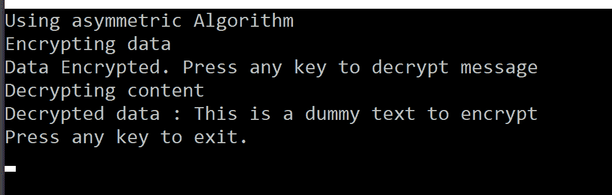

# 第十二章：执行对称和不对称加密

在开发分布式应用程序时，保持信息的安全非常重要，特别是在电子商务应用程序的情况下，用户数据，如您的个人和信用卡相关信息，被收集并通过互联网传输。密码学使我们能够加密和解密明文。简单来说，假设我们的应用程序中有明文，可以通过向文本中的每个字符添加一个静态值来转换它，从而使它变得不可读。这个过程称为**加密**。相反，解密是将这种不可读文本转换回可读文本的过程。

当您加密文本时，它看起来像随机的字节，被称为**密文**。

阅读本章后，您将能够理解如何加密和解密文本，执行这些加密和解密操作的不同算法，以及.NET Framework 在将它们应用于实际项目方面提供的选项。

本章将涵盖以下主题：

+   密码学

+   对称加密

+   非对称加密

+   数字签名

+   哈希值

# 技术要求

本章的练习可以使用支持.NET Framework 2.0 或更高版本的 Visual Studio 2012 或更高版本进行练习。然而，任何从 C# 7.0 及更高版本开始的新 C#功能都需要 Visual Studio 2017。

如果您没有任何产品的许可证，您可以从[`visualstudio.microsoft.com/downloads/`](https://visualstudio.microsoft.com/downloads/)下载 Visual Studio 2017 的社区版本。

本章的示例代码可以在 GitHub 上找到，地址为[`github.com/PacktPublishing/Programming-in-C-sharp-Exam-70-483-MCSD-Guide/tree/master/Book70483Samples/Chapter12`](https://github.com/PacktPublishing/Programming-in-C-sharp-Exam-70-483-MCSD-Guide/tree/master/Book70483Samples/Chapter12)。

# 密码学

当您与涉及创建和管理可通过互联网访问的 Web 应用程序的公共网络一起工作时，您的应用程序面临被未经授权的第三方拦截和修改的高风险。密码学使我们能够保护数据免受此类未经授权的第三方查看或修改。密码学还提供了保护我们的数据并帮助在网络上安全传输数据的方法。要执行此类操作，我们可以使用加密算法在传输之前创建密文。当被未经授权的第三方拦截时，他们很难解密以读取或修改这些数据。

要执行此类操作，.NET 框架提供了`System.Secure.Cryptography`命名空间，其中包含许多算法，包括以下内容：

+   秘密密钥加密

+   公钥加密

+   数字签名

+   哈希值

让我们来看一个关于加密可以用于哪些方面的例子。假设，作为一个客户，我正在尝试通过互联网订购一台笔记本电脑。为此，我正在与公司的代表聊天。一旦我对报价、提供的折扣和下订单的条款和条件感到满意，我然后需要通过这个渠道提供个人信息和信用卡信息。

那么，我们如何确保以下方面的内容呢？

+   对任何窃听我们对话的人来说，这些信息是不清晰的

+   信息传输没有未经授权的访问

+   收到的信息来自公司的代表

所有这些都可以通过实现加密算法来实现。这些算法促进了保密性、数据完整性、身份验证和非否认性。

保密性保护用户的身份，数据完整性保护数据免受更改，身份验证确保数据来自已验证的实体，非否认性防止任何一方否认发送了消息。

.NET 框架提供了不同的算法，如前所述。尽管这些很多，但我们将限制本章的讨论到四个主要算法。

密钥加密，也称为对称加密，使用单个共享密钥来加密和解密数据。然而，在这种情况下，保护秘密信息免受未经授权的访问非常重要，因为任何拥有这个密钥的人都可以访问数据并滥用它。因为它使用相同的密钥进行加密和解密，所以这更快，适合大量数据。有不同类型的算法可用，例如**DES**（代表**数据加密标准**），三重 DES 和**AES**（代表**高级加密标准**）。这些算法同时加密数据块，因此它们也被称为分组密码。DES 和三重 DES 使用 8 字节作为块，而 AES 使用 16 字节作为块，但也支持 24 和 32 字节。

公钥加密，也称为非对称加密，使用公钥/私钥来加密和解密数据。在这两个密钥中，私钥必须保密，防止未经授权的访问，因为任何拥有私钥的人都可以访问你的数据。在这种加密技术中，公钥和私钥在数学上是相关的，并使用固定缓冲区大小。与密钥加密相比，这些更慢，适用于加密少量数据。使用公钥加密的任何数据只能使用私钥解密。此外，如果你使用私钥签名数据，它只能使用公钥验证。

数字签名使用该方独有的数字签名。如公开密钥加密中提到的，一方可以使用私钥签名数据，当另一方收到信息并且发送方的公钥被信任时，你可以识别谁发送了消息，从而维护数据的完整性。

由于发送方的公钥是公开的，任何拥有公钥的人都可以处理消息，这意味着您的消息不是秘密的。为了保持其秘密性，您还需要加密消息。

哈希值将任意长度的数据映射到固定长度的字节序列。当你有一段文本并在重新哈希之前更改它时，它将产生一个新的哈希。这样，我们可以在传输过程中保持数据完整性。

然而，正如在讨论其他加密方法时提到的，这种方法并不验证消息的发送者。

# 对称加密

对称加密使用单个密钥，并在文本块上工作。这种方法比其他方法更快。在使用此方法时，保持密钥的机密性非常重要，发送者和接收者应使用相同的密钥，这是此方法的缺点。

让我们看看一个例子，了解我们如何加密消息或文本块：

1.  这里，我们使用加密方法，从文件中读取一段文本，使用对称算法对其进行加密，并将加密内容写入不同的文件。

1.  加密方法接受一个`SymmetricAlgorithm`实例，该实例通过传递密钥和初始向量创建一个`ICryptoTransform`实例。系统允许您生成自己的密钥或使用它生成的密钥。

1.  然后，我们创建一个内存流来存储运行时的缓冲区：

```cs
public static void EncryptSymmetric(SymmetricAlgorithm sem)
{
    //Read content from file
    string filecontent = File.ReadAllText("..\\..\\inputfile.txt");
    //Create encryptor using key and vector
    ICryptoTransform encryptor = sem.CreateEncryptor(sem.Key, sem.IV);
    //create memory stream used at runtime to store data
    using (MemoryStream outputstream = new MemoryStream())
    {
        //Create crypto stream in write mode
        using (CryptoStream encStream = new CryptoStream(outputstream, encryptor, CryptoStreamMode.Write))
        {
            //use streamwrite 
            using (StreamWriter writer = new StreamWriter(encStream))
            {
                // Write the text in the stream writer 
                writer.Write(filecontent);
            }
        }
        // Get the result as a byte array from the memory stream 
        byte[] encryptedDataFromMemory = outputstream.ToArray();
        // Write the data to a file 
        File.WriteAllBytes("..\\..\\Outputfile.txt", encryptedDataFromMemory);
    }
}
```

使用内存流、`ICryptoTransform`以及写入模式创建了一个 cryptostream。cryptostream 用于写入内存，然后可以将其转换为数组并写入输出文件。

1.  执行加密方法后，现在您可以打开解决方案中的输出文件并检查结果。

1.  现在，我们将从输出文件中读取数据并将其解密为纯文本：

```cs
public static string DecryptSymmetric(SymmetricAlgorithm sem)
{
    string result = string.Empty;
    //Create decryptor
    ICryptoTransform decryptor = sem.CreateDecryptor(sem.Key, sem.IV);
    //read file content
    byte[] filecontent = File.ReadAllBytes("..\\..\\Outputfile.txt");
    //read file content to memory stream
    using (MemoryStream outputstream = new MemoryStream(filecontent))
    {
        //create decrypt stream
        using (CryptoStream decryptStream = new CryptoStream(outputstream, decryptor, CryptoStreamMode.Read))
        {
            using (StreamReader reader = new StreamReader(decryptStream))
            {
                //read content of stream till end
                result = reader.ReadToEnd();
            }
        }
    }
    return result;

}
```

解密方法与加密方法具有相同的签名。然而，我们不是创建一个`encryptor`类，而是创建一个`decryptor`类，该类实现了`ICryptoTransform`接口。

以下是我们创建的 main 程序，其中我们创建`AESManaged`实例类型的`SymmetricAlgorithm`，然后将其传递给加密和解密方法：

```cs
 static void Main(string[] args)
 {
     Console.WriteLine("Using AES symmetric Algorithm");
     SymmetricAlgorithm sem = new AesManaged();
     Console.WriteLine("Encrypting data from inputfile");
     EncryptDecryptHelper.EncryptSymmetric(sem);
     Console.WriteLine("Data Encrypted. You can check in outputfile. Press any key to decrypt message");
     System.Console.ReadKey();
     Console.WriteLine("Decrypting content form outputfile");
     string message = EncryptDecryptHelper.DecryptSymmetric(sem);
     Console.WriteLine($"Decrypted data : {message}");
     // Keep the console window open in debug mode.
     System.Console.WriteLine("Press any key to exit.");
     System.Console.ReadKey();
 }
```

在执行程序之前，请检查解决方案中的输入文件，您可以在其中更改内容并执行它。加密后，可以验证解决方案中的输出文件中的加密内容：


当你练习这个示例时，确保所有辅助方法在一个类中，主方法在另一个类中，如 GitHub 上的示例代码所指定。现在你有了所有方法，当你执行它们时，你会看到前面的输出。

你的加密方法使用 AES 算法。它从输入文件读取数据，使用 AES 算法加密数据，然后在屏幕上写一条消息。一旦你按下任意键，你的解密方法就会被启动，解密消息并将其写入输出文件。相同的信息会在屏幕上显示。

在实时场景中，当你想通过文件传输执行安全交易时，这是其中一种方法。因为你将使用对称算法，所以加密或解密内容将很容易。

发送者加密文件的内容并发送给接收者。接收者解密文件内容并对其进行处理。在此方法中，发送者和接收者都应该知道所使用的密钥。

# 非对称加密

非对称加密使用两个密钥——一个公钥和一个私钥。正因为如此，它的运行速度较慢。此外，必须始终确保私钥的安全。除非你有私钥，否则你不能解密消息。

现在，让我们进入一个示例，尝试了解这是如何完成的。在这个场景中，我们将使用`RSACryptoServiceProvider`。此算法为我们提供了可用于加密和解密消息的公钥和私钥。加密方法接受一个公钥和要加密的文本，然后我们将文本转换为字节数组，因为加密方法接受字节数组。然后，我们为算法设置公钥并调用加密方法：

```cs
public static byte[] EncryptAsymmetric(string publicKey, string texttoEncrypt)
{
    byte[] result;
    UnicodeEncoding uc = new UnicodeEncoding();
    byte[] databytes = uc.GetBytes(texttoEncrypt);
    using (RSACryptoServiceProvider rsa = new RSACryptoServiceProvider())
    {
        rsa.FromXmlString(publicKey);
        result = rsa.Encrypt(databytes, true);
    }
    return result;
}
```

在解密方法中，我们传递需要解密的字节数组以及一个私钥。一旦使用公钥加密了一条消息，它只能使用对应的私钥进行解密：

```cs
public static string DecryptAsymmetric(string privateKey, byte[] bytestoDecrypt)
{
    byte[] result;
    using (RSACryptoServiceProvider rsa = new RSACryptoServiceProvider())
    {
        rsa.FromXmlString(privateKey);
        result = rsa.Decrypt(bytestoDecrypt, true);
    }
    UnicodeEncoding uc = new UnicodeEncoding();
    string resultText = uc.GetString(result);
    return resultText;
}
```

以下为主要方法，其中我们创建`RSACryptoproviderservice`类以获取公钥和私钥。`rsa.ToXmlString(false)`提供公钥，将其设置为`true`将给我们私钥。我们将使用这些密钥来加密和解密消息：

```cs
static void Main(string[] args)
{
    #region asymmetric Encryption
    Console.WriteLine("Using asymmetric Algorithm");
    RSACryptoServiceProvider rsa = new RSACryptoServiceProvider();
 string publicKey = rsa.ToXmlString(false);
 string privateKey = rsa.ToXmlString(true);
    Console.WriteLine("Encrypting data ");
    byte[] resultbytes = EncryptDecryptHelper.EncryptAsymmetric(publicKey,"This is a dummy text to encrypt");
    Console.WriteLine("Data Encrypted. Press any key to decrypt message");
    System.Console.ReadKey();
    Console.WriteLine("Decrypting content");
    string resultText = EncryptDecryptHelper.DecryptAsymmetric(pricateKey, resultbytes);
    Console.WriteLine($"Decrypted data : {resultText}");
    #endregion

    // Keep the console window open in debug mode.
    System.Console.WriteLine("Press any key to exit.");
    System.Console.ReadKey();
}
```

通过更改输入文本来执行程序，或者你可以尝试更改算法。然而，当你更改算法时，你可能需要应用程序运行和工作所需的任何语法更改：



当你执行程序时，你会看到前面的输出。在示例中，你正在使用非对称算法加密内容。随着控制流通过代码，它显示消息。一旦消息被加密，它将要求你按任意键。按下任意键后，程序将解密消息并在屏幕上显示。

在我们讨论的对称算法场景中，如果您想在两个当事人之间进行安全交易，您可以使用公私钥组合。

接收者使用私钥进行加密，并将文件或文本块发送给接收者，在那里使用公钥来解密内容。如果公钥和私钥不匹配，您将无法读取或验证数据。这是验证输入数据的一种方式。

# 数字签名

数字签名可以用来签名消息，从而验证发送者。然而，签名消息并不能防止第三方读取消息。为了实现这一点，我们需要加密消息并对其进行签名。

在以下示例中，我们使用公钥和私钥（非对称算法）。我们使用发送者的私钥对消息进行签名，并使用接收者的公钥加密消息。如果您观察代码，我们在这个示例中也使用了哈希计算。在加密消息后，我们再次对消息进行哈希处理。

我们将使用`RSACryptoServiceProvider`，以及`RSAPKCS1SignatureFormatter`，它将被用来创建签名。

在以下程序中，我们使用`UnicodeEncoding`类将文本转换为字节数组，使用接收者的公钥和我们在前几节中学到的对称或非对称算法加密消息，计算内容的哈希值，然后对消息进行数字签名。一旦所有这些过程都得到实现，我们就将数据传输过去，在那里我们重新计算哈希值，验证签名，然后使用密钥解密消息。

在以下示例中，我们使用公私钥进行加密。如前所述，仅仅签名消息并不能保证消息内容的安全。相反，它将允许您验证发送者：

```cs
public static void DigitalSignatureSample(string senderPrivatekey, string receiverspublickey, string texttoEncrypt)
{
 UnicodeEncoding uc = new UnicodeEncoding();
 Console.WriteLine("Converting to bytes from text");
 //get bytearray from the message
 byte[] databytes = uc.GetBytes(texttoEncrypt);
 Console.WriteLine("Creating cryptoclass instance");
 //Creating instance for RSACryptoservice provider as we are using for sender and receiver
 RSACryptoServiceProvider rsasender = new RSACryptoServiceProvider();
 RSACryptoServiceProvider rsareceiver = new RSACryptoServiceProvider();
 //getting private and public key
 rsasender.FromXmlString(senderPrivatekey);
 rsareceiver.FromXmlString(receiverspublickey);
 Console.WriteLine("Creating signature formatter instance");
 //GEt signature from RSA
 RSAPKCS1SignatureFormatter signatureFormatter = new RSAPKCS1SignatureFormatter(rsasender);
 //set hashalgorithm
 signatureFormatter.SetHashAlgorithm("SHA1");
 //encrypt message
 Console.WriteLine("encrypting message");
 byte[] encryptedBytes = rsareceiver.Encrypt(databytes, false);
 //compute hash
 byte[] computedhash = new SHA1Managed().ComputeHash(encryptedBytes);
 Console.WriteLine("Creating signature");
 //create signature for the message
 byte[] signature = signatureFormatter.CreateSignature(computedhash);
 Console.WriteLine("Signature: " + Convert.ToBase64String(signature));
 Console.WriteLine("Press any key to continue...");
 Console.ReadKey();
 //receive message then recompute hash
 Console.WriteLine("recomputing hash");
 byte[] recomputedHash = new SHA1Managed().ComputeHash(encryptedBytes);
 //signature deformatter
 Console.WriteLine("Creating signature dformatter instance");
 RSAPKCS1SignatureDeformatter signatureDFormatter = new RSAPKCS1SignatureDeformatter(rsareceiver);
 signatureDFormatter.SetHashAlgorithm("SHA1");
 //verify signature
 Console.WriteLine("verifying signature");
 if (!signatureDFormatter.VerifySignature(recomputedHash, signature))
 {
  Console.WriteLine("Signature did not match from sender");
 }
 Console.WriteLine("decrypting message");
 //decrypt message
 byte[] decryptedText = rsasender.Decrypt(encryptedBytes, false);
 Console.WriteLine(Encoding.UTF8.GetString(decryptedText));
}
```

以下为主要程序，其中我们创建`RSACryptoServiceProvider`类的实例并收集公钥和私钥。然而，由于我们在同一方法中加密和解密消息，因此使用了同一套公钥和私钥。

作为本示例的一部分，我们执行了加密和解密。我们可以创建多个 RSA 提供者，并使用它们的公私钥作为发送者和接收者。您可以创建不同的控制台应用程序，一个作为发送者，另一个作为接收者，并模拟现实世界场景。为了简化起见，我使用了一对公私钥来执行操作：

```cs
static void Main(string[] args)
{
    #region Digital Signatures
    RSACryptoServiceProvider rsa = new RSACryptoServiceProvider();
    string publicKey = rsa.ToXmlString(false);
    string pricateKey = rsa.ToXmlString(true);
    EncryptDecryptHelper.DigitalSignatureSample(pricateKey, publicKey,"This is a sample text for Digital signatures");
    #endregion

    // Keep the console window open in debug mode.
    System.Console.WriteLine("Press any key to exit.");
    System.Console.ReadKey();
}
```

通过更改输入消息和算法来检查输出。然而，如前所述，在执行之前，您可能需要注意任何语法上的变化：


在现实世界的场景中，假设两个实体通过实现数字签名的 Web 服务进行通信。发送者将有一组公钥和私钥，接收者也将有一组公钥和私钥。双方应交换各自的公钥以促进应用程序通信。

# 哈希值

计算哈希从字节数组创建一个固定长度的数值。哈希将可变长度的二进制字符串映射到固定长度的二进制字符串。哈希不能用于双向转换。当你应用哈希算法时，每个字符都会被哈希到一个不同的二进制字符串。

在以下示例中，我们使用`SHA1Managed`算法来计算哈希。我们计算哈希两次以检查结果是否相同。如前所述，此方法用于维护数据完整性。

在以下代码中，我们使用`UnicodeEncoding`类将文本转换为字节数组，并使用`SHA1Managed`算法计算字节数组的哈希。一旦转换，我们将在屏幕上显示每个哈希字节。为了验证哈希，我们重新计算字符串的哈希并比较哈希值。这是验证输入数据的一种方法：

```cs
public static void HashvalueSample(string texttoEncrypt)
{
    UnicodeEncoding uc = new UnicodeEncoding();
    Console.WriteLine("Converting to bytes from text");
    byte[] databytes = uc.GetBytes(texttoEncrypt);
    byte[] computedhash = new SHA1Managed().ComputeHash(databytes);
    foreach (byte b in computedhash)
    {
        Console.Write("{0} ", b);
    }
    Console.WriteLine("Press any key to continue...");
    byte[] reComputedhash = new SHA1Managed().ComputeHash(databytes);
    bool result = true;
    for (int x = 0; x < computedhash.Length; x++)
    {
        if (computedhash[x] != reComputedhash[x])
        {
            result = false;
        }
        else
        {
            result = true;
        }
    }

    if (result)
    {
        Console.WriteLine("Hash value is same");
    }
    else
    {
        Console.WriteLine("Hash value is not same");
    }
}
```

调用哈希值示例的主要方法如下。在这里，我们只是调用一个辅助方法，它对提供的文本执行哈希计算：

```cs
static void Main(string[] args)
{ 
    #region Hashvalue
    EncryptDecryptHelper.HashvalueSample("This a sample text for hashvalue sample");
    #endregion

    // Keep the console window open in debug mode.
    System.Console.WriteLine("Press any key to exit.");
    System.Console.ReadKey();
}
```

当我们计算哈希时，我们显示结果，然后我们进行对比以查看两次调用的结果是否相同：


前面的截图显示了计算哈希并显示哈希数组的程序。此外，当程序重新计算哈希并进行比较时，你会看到相同的哈希值消息。

# 摘要

在本章中，我们专注于理解密码学以及我们如何使用对称和非对称算法。我们还关注了如何使用这些算法来验证发送者、接收者和消息内容。我们可以利用本章学到的技术来验证输入数据，并在处理安全交易时执行类似操作。我们还探讨了如何使用数字签名来签名消息，以及如何使用哈希值来维护数据完整性。

在下一章中，我们将关注.NET 程序集，我们将如何管理它们，以及我们将如何调试 C#应用程序。

# 问题

1.  在本章讨论的四种方法中，哪两种可以用来验证发送者？

    1.  对称算法

    1.  非对称算法

    1.  哈希值

    1.  数字签名

1.  当两个实体需要使用非对称算法进行通信时，他们需要共享哪个密钥？

    1.  私钥

    1.  公钥

    1.  两者

    1.  无

1.  哪种类型的算法用于加密大量数据？

    1.  对称

    1.  非对称

    1.  两者

    1.  无

# 答案

1.  **数字签名**

1.  **公钥**

1.  **对称**
