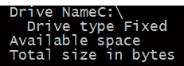
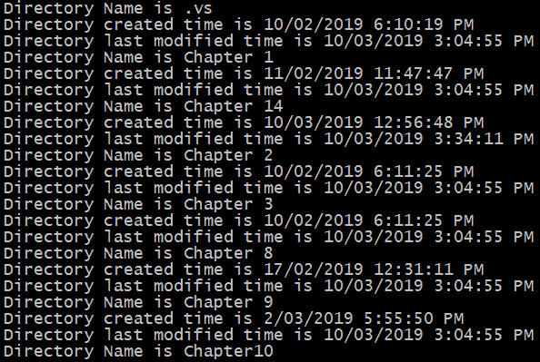
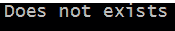
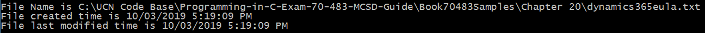
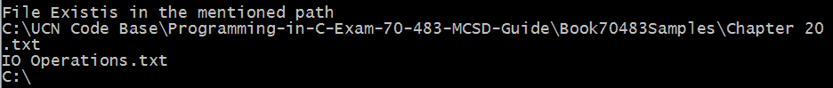

# 第十四章：执行 I/O 操作

在任何编程语言中，所有应用程序都依赖于某种类型的数据。这些应用程序相互交互，传递存在于不同来源中的数据，如文件对象和外部 Web 服务。

在本章中，我们将探讨 C#提供的不同功能，以访问和利用文件对象和外部 Web 服务中的数据。

在本章中，我们将涵盖以下主题：

+   在文件对象上执行 I/O 操作

+   `System.Net`命名空间中可用的不同辅助类，帮助我们进行 I/O 操作

# 技术要求

与本书前面章节中介绍的内容类似，本章中解释的程序将在 Visual Studio 2017 中开发。

本章的示例代码可以在 GitHub 上找到，链接为[`github.com/PacktPublishing/Programming-in-C-sharp-Exam-70-483-MCSD-Guide/tree/master/Chapter14`](https://github.com/PacktPublishing/Programming-in-C-sharp-Exam-70-483-MCSD-Guide/tree/master/Chapter14)。

# 文件 I/O 操作

**文件**是一个非常粗略的术语，表示存储在特定目录路径上的数据集合。在编写 C#应用程序时，我们会在几个场合需要使用文件对象：

+   将数据存储在应用程序中或将其传递给另一个应用程序

+   访问应用程序执行所需的配置设置

+   访问目录路径中存在的文件

这些操作被称为 I/O 操作。C#提供了一个名为`System.IO`的命名空间，其中包含一些辅助类。这些辅助类帮助我们执行文件对象上的 I/O 操作。在本节中，我们将探讨 C#中的这些辅助类。

# 使用 System.IO 辅助类

`System.IO`命名空间包含一系列类，允许我们在 C#中进行文件操作。它包括允许我们执行以下操作的类：

+   从文件中读取数据

+   将数据写入文件

+   创建/删除新文件

在本章的不同部分，通过代码示例，我们将查看我们可以在文件上执行的所有这些 I/O 操作。然而，在我们开始查看这些示例之前，我们需要理解一个非常重要的概念，即基于 I/O 操作的基础概念*流*。

流表示在 I/O 操作期间应用程序之间交换的字节序列。在 C#中，它由一个名为`System.IO.Stream`的抽象类表示。它提供了一个包装类来传输字节，所有需要从任何来源读取/写入字节的类都必须从这个特定的类继承。

在我们学习更多关于流以及如何在 C#中处理它们之前，让我们首先看看我们如何处理驱动器、目录以及文件的一些其他基本操作。

# 驱动器和目录

驱动器代表文件系统的存储介质。它可以是硬盘驱动器、CD 或任何其他存储类型。在.NET Framework 中，我们在`System.IO`命名空间中有一个`DriveInfo`类，它帮助我们访问驱动器上的文件系统信息。它提供了可以帮助我们访问诸如名称、大小和驱动器上的可用空间等信息的方法。请参考以下代码实现，其中我们正在遍历驱动器上可用的所有文件：

```cs
DriveInfo[] allDrives = DriveInfo.GetDrives();
foreach (DriveInfo d in allDrives)
{
     Console.WriteLine("Drive Name" + d.Name);
     Console.WriteLine(" Drive type " + d.DriveType);
     if (d.IsReady == true)
     {
         Console.WriteLine("Available space ", d.AvailableFreeSpace);
         Console.WriteLine("Total size in bytes ", d.TotalSize);
     }
}
Console.ReadLine();
```

在前面的代码片段中，我们正在遍历文件系统上所有可用的驱动器（即 C、D、E 等），并发布与以下相关的信息：

+   驱动器的名称

+   驱动器的类型，即固定、RAM、CD ROM、可移动的等等

+   驱动器上的总可用内存大小

+   驱动器上可用的总空闲内存

如果我们执行此代码，执行将循环遍历文件系统中的所有驱动器。一旦检索到驱动器，执行将检索有关驱动器的某些属性，例如可用空间、总大小和驱动器类型。因此，当我们执行程序时，我们将得到以下输出。请注意，我们可能不会得到所有信息，因为这还取决于目录的安全权限：



在我们执行此程序的系统中，我们只有一个 C 驱动器。因此，当程序执行时，我们正在显示 C 驱动器的属性。

`driveinfo`对象上还有其他属性。如果我们点击`DriveInfo`类的“转到定义”，我们可以看到类的属性。请访问以下链接获取更多信息：[`docs.microsoft.com/en-us/dotnet/api/system.io.driveinfo?view=netframework-4.7.2`](https://docs.microsoft.com/en-us/dotnet/api/system.io.driveinfo?view=netframework-4.7.2)。

文件系统中的每个驱动器都包含目录和文件。一个目录本身可以包含多个子目录和文件。如果我们需要对特定目录进行操作，我们使用 C#中的`DirectoryInfo`类来完成。在下面的代码片段中，我们正在创建一个`DirectoryInfo`类的对象，传递特定目录路径的位置：

```cs
DirectoryInfo directoryInfo = new DirectoryInfo("C:\\UCN Code Base\\Programming-in-C-Exam-70-483-MCSD-Guide\\Book70483Samples");
foreach (DirectoryInfo f in directoryInfo.GetDirectories())
{
     Console.WriteLine("Directory Name is" + f.Name);
     Console.WriteLine("Directory created time is " + f.CreationTime);
     Console.WriteLine("Directory last modified time is " + f.LastAccessTime);
}
```

对于`directoryInfo`对象，我们接下来将遍历所有子目录，并显示以下相关信息：

+   目录的名称

+   目录创建的时间

+   目录最后修改的时间

当我们执行前面的程序时，我们是在 `C:\\UCN Code Base\\Programming-in-C-Exam-70-483-MCSD-Guide\\Book70483Samples` 文件路径上执行的。请注意，这是我们放置本书中所有章节代码库的地方。因此，当我们执行此程序时，它将遍历所有这些章节的子文件夹，并将获取诸如“目录名称”、“目录创建时间”和“目录最后修改时间”等信息。以下是我们将获得的程序输出：



使用 `DirectoryInfo` 对象还有其他可用操作。

# 检查目录是否存在

使用特定的目录路径，我们可以确定在文件系统中是否存在具有该路径的目录。在代码实现中，我们创建一个 `DirectoryInfo` 对象，然后使用 `Exists` 属性来检查目录是否存在于文件系统中：

```cs
DirectoryInfo directoryInfoExists = new DirectoryInfo("C:\\UCN Code Base\\Programming-in-C-Exam-70-483-MCSD-Guide\\Book70483Samples\\Chapter 20");
if (directoryInfoExists.Exists)
{
     Console.WriteLine("It exists");
}
else
{
     Directory.CreateDirectory("Does not exist");
}
```

如果我们使用在创建 `DirectoryInfo` 对象时提到的路径执行代码，程序执行将确定在指定路径的文件系统中是否存在目录。因此，当程序执行时，由于我们目前在 `Book70483Samples` 基础文件夹中没有名为 `Chapter 20` 的子文件夹，我们将在控制台输出窗口中看到“不存在”。以下是在控制台窗口中的全局相关输出：



在下一节中，我们将探讨如何使用 C# 在文件系统中创建目录。

# 创建目录

使用 `DirectoryInfo` 类，我们还可以在文件系统中创建新目录。以下代码演示了如何创建系统中的新目录：

```cs
Directory.CreateDirectory("C:\\UCN Code Base\\Programming-in-C-Exam-70-483-MCSD-Guide\\Book70483Samples\\Chapter 20"); 

```

如果执行前面的代码，它将在根文件夹中创建一个名为 `Chapter 20` 的子目录。

在前面的代码中，我们传递了一个绝对路径来创建目录。然而，如果我们需要在特定目录中创建子目录，我们只需执行以下代码：

```cs
DirectoryInfo subDirectory = parentDirectory.CreateSubdirectory("NameChildDirectory");
```

在前面的代码中，`parentDirectory` 是我们想要在其中创建子目录的父目录。`NameChildDirectory` 是我们想要给子目录取的名字。

# 遍历文件

使用 `DirectoryInfo` 类，我们还可以遍历目录中的文件。以下代码展示了我们如何遍历文件并访问它们的属性：

```cs
DirectoryInfo chapter20 = new DirectoryInfo("C:\\UCN Code Base\\Programming-in-C-Exam-70-483-MCSD-Guide\\Book70483Samples\\Chapter 20");
foreach (FileInfo f in chapter20.GetFiles())
{
     Console.WriteLine("File Name is " + f.FullName);
     Console.WriteLine("Directory created time is " + f.CreationTime);
     Console.WriteLine("Directory last modified time is " + f.LastAccessTime);
}
```

在前面的代码片段中，我们正在遍历 `Chapter 20` 目录中的文件，并显示其中的信息。在 `Chapter 20` 文件夹中，我们只有一个文件：`dynamics365eula.txt`。因此，当程序执行时，它将选择该文件并读取其中的文件信息。为了说明这一点，我们显示了文件名、文件的创建时间和最后访问时间。因此，当代码执行时，我们将获得以下输出：



现在我们对驱动器和 `DirectoryInfo` 有了一些了解，我们将探索一些辅助类，这些类允许我们对文件进行操作。

# 文件操作

在本节中，我们将介绍允许我们对目录中存在的文件进行操作的辅助类。C# 提供了 `File` 和 `FileInfo` 辅助类来对文件进行操作。在查看以下代码片段时，我们将查看一些我们可以使用文件对象执行的典型操作。

# 检查文件是否存在

这基本上涉及检查给定路径是否存在文件。这可以帮助我们编写容错代码，以便仅在确认文件存在于给定路径后读取文件：

```cs
string file = "C:\\UCN Code Base\\Programming-in-C-Exam-70-483-MCSD-Guide\\Book70483Samples\\Chapter 20\\IO Operations.txt";
if(File.Exists(file))
{
     Console.WriteLine("File Exists in the mentioned path");
}
else
{
     Console.WriteLine("File does not exists in the mentioned path");
}
```

`File` 是在 `System.IO` 命名空间中可用的静态类。此类提供了我们可以用来执行与文件访问相关的功能的操作。在前面的代码中，我们已声明了一个文件路径，并使用静态的 `File` 类检查文件是否确实存在于给定的路径中。

# 将文件从一个位置移动到另一个位置

在这个操作中，我们基本上是将文件从一个位置剪切到另一个位置。以下代码片段显示了如何执行此操作：

```cs
string sourceFileLocation = "C:\\UCN Code Base\\Programming-in-C-Exam-70-483-MCSD-Guide\\Book70483Samples\\Chapter 20\\IO Operations.txt";
 string targetFileLocation = "C:\\UCN Code Base\\Programming-in-C-Exam-70-483-MCSD-Guide\\Book70483Samples\\Chapter 21\\New File.txt";
if (File.Exists(sourceFileLocation))
{
     File.Move(sourceFileLocation, targetFileLocation); 
}
else
{
     Console.WriteLine("File does not exists in the mentioned path");
}
```

在前面的代码片段中，我们首先检查文件是否存在于特定位置。如果文件存在于该位置，我们将将其复制到另一个位置。

当代码执行时，我们会注意到文件是从源位置剪切到目标位置的。

# 从一个位置复制文件到另一个位置

在这个操作中，我们基本上是将文件从一个位置复制到另一个位置。请注意，`Move` 操作将删除源文件夹中存在的文件。然而，`Copy` 操作将把源文件夹中存在的文件复制到目标文件夹。以下代码片段显示了如何执行此操作：

```cs
if (File.Exists(targetFileLocation))
{
     File.Copy(targetFileLocation, sourceFileLocation);
}
else
{
     Console.WriteLine("File does not exists in the mentioned path");
}
```

当代码执行时，我们会看到文件是从源文件位置复制到目标文件位置路径的。

# 删除文件

在这个操作中，我们将删除指定位置存在的文件：

```cs
File.Delete(sourceFileLocation);
```

当代码执行时，我们会看到文件已从源文件位置删除。一旦代码执行，我们会看到在 `sourceFileLocation` 路径中指定的文件已被删除。

请注意，与 `File` 类一起工作的操作与 `FileInfo` 类以相同的方式工作。我们可以通过 `FileInfo` 类执行与 `File` 类相同的实现。

在所有前面的示例中，我们一直在硬编码文件的路径属性。这不是一种推荐的做法，因为它容易出错。例如，如果你查看任何文件的实际路径并将其与我们需要在程序中提供的路径进行比较，你会注意到一个差异：

+   实际路径：`C:\File Location\Chapter 20\Sample.txt`

+   在程序中需要指定的路径：`C:\\File Location\\Chapter 20\\Sample.txt`

我们需要在路径中提供一些额外的斜杠。此外，当我们组合文件夹路径和文件路径时，我们需要使用额外的`\`将它们连接起来。出于这些原因，硬编码路径不是一种推荐的做法。更好的方法是使用`Path`辅助类。以下代码展示了如何使用它：

```cs
string sourceFileLocation = @"C:\UCN Code Base\Programming-in-C-Exam-70-483-MCSD-Guide\Book70483Samples\Chapter 20";
string fileName = @"IO Operations.txt";
string properFilePath = Path.Combine(sourceFileLocation, fileName);
Console.WriteLine(Path.GetDirectoryName(properFilePath));
Console.WriteLine(Path.GetExtension(properFilePath));
Console.WriteLine(Path.GetFileName(properFilePath));
Console.WriteLine(Path.GetPathRoot(properFilePath));
```

在前面的代码实现中，我们声明了一个文件夹路径。请注意在文件名前使用`&`。这是一个转义字符，允许我们不在文件夹路径结构中指定额外的`\`。我们还声明了一个文件名，现在我们正在使用辅助静态类`Path`将它们组合在一起。一旦我们组合了它们，我们就检索结果文件路径中的属性。如果代码执行，我们将得到以下输出：



让我们看看输出：

+   `Path.GetDirectoryName`：这个方法返回组合路径文件的目录名。请注意，它包含完整的绝对目录路径。

+   `Path.GetExtension`：这个方法返回组合路径文件的文件扩展名。在这种情况下，它是一个`.txt`文件。

+   `Path.GetFileName`：这个方法返回文件名。

+   `Path.GetPathRoot`：这个方法返回文件路径的根。在这种情况下，它是`C:`，因此在输出中提到。

既然我们已经了解了文件的基本操作，我们将看看如何访问和修改文件的内容。为此，我们将查看`FileStream`中可用的操作。

# 流对象

文件的主要操作与读取、写入、检索和更新文件中的文本有关。在.NET 中，这些操作是通过 I/O 操作中的字节交换来执行的。这个字节序列是流，在.NET 中，它使用抽象的`Stream`类来表示。这个类是.NET 中所有 I/O 操作（如`FileStream`和`MemoryStream`）的基础。

在.NET 中，我们可以使用流执行以下操作：

+   在流对象中读取数据

+   将数据写入流对象

+   在流对象中搜索或查找相关信息

让我们看看使用流对象实现的不同操作。在下一节中，我们将通过`FileStream`对象，它有助于对文件对象进行操作。

# `FileStream`

使用`FileStream`对象，我们可以将信息读取并写回到目录中的文件。这是通过使用我们在本章前一部分讨论的`File`和`FileInfo`对象来完成的。

让我们通过以下代码示例来了解如何将信息写入文件：

```cs
string sourceFileLocation = @"C:\UCN Code Base\Programming-in-C-Exam-70-483-MCSD-Guide\Book70483Samples\Chapter 20\Sample.txt";
using (FileStream fileStream = File.Create(sourceFileLocation))
{
    string myValue = "MyValue";
    byte[] data = Encoding.UTF8.GetBytes(myValue);
    fileStream.Write(data, 0, data.Length);
}
```

在前面的代码实现中，我们正在执行以下操作：

+   打开位于指定位置的`Sample.txt`文件

+   从它创建一个`File`对象，然后将文件中的数据转换为`FileStream`对象

+   使用 `FileStream` 对象中可用的 `Write` 操作将数据写入文件

请注意，我们正在使用 `using` 块来处理 `FileStream` 对象。因此，`Dispose` 方法将自动为 `FileStream` 对象调用。因此，非托管资源中的内存将自动回收。

请注意，在前面的实现中，我们在将数据写入 `FileStream` 对象之前对字符串值进行了编码。

处理相同功能的另一种方法是使用 `StreamWriter` 辅助类。以下代码实现展示了如何使用 `StreamWriter` 辅助类来处理：

```cs
string sourceFileLocation = @"C:\UCN Code Base\Programming-in-C-Exam-70-483-MCSD-Guide\Book70483Samples\Chapter 20\Sample.txt";
using (StreamWriter streamWriter = File.CreateText(sourceFileLocation))
{
    string myValue = "MyValue";
    streamWriter.Write(myValue);
} 
```

在选择两个辅助类之间，我们需要考虑我们正在处理的数据。`FileStream` 对象处理字节数组。然而，`StreamWriter` 类实现了 `TextWriter` 接口。它只处理字符串数据，并自动将其编码为字节，这样我们就不必显式地执行此操作。然而，在当我们使用 `FileStream` 类时，我们必须对字节进行编码和解码，以将数据转换为字符串表示形式。

在下一节中，我们将探讨一些与文件 I/O 操作相关的最佳实践。

# 异常处理

在任何实际场景中，可能有多个人同时处理同一个文件。在 C# 中使用线程，我们可以在对资源执行特定操作时锁定对象。然而，在文件系统中，文件上的锁定不可用。

因此，完全有可能程序正在访问的文件已经被另一个应用程序或用户移动或完全删除。C# 提供了一些异常处理机制，我们可以用它们更好地处理这类情况。请参考以下代码实现，其中我们处理了一个异常：

```cs
private static string ReadFileText()
{
    string path =@"C:\UCN Code Base\Programming-in-C-Exam-70-483-MCSD-          Guide\Book70483Samples\Chapter 20\Sample.txt";
     if (File.Exists(path))
     {
         try
         {
             return File.ReadAllText(path);
         }
         catch (DirectoryNotFoundException) 
         {
             return string.Empty; 
         }
         catch (FileNotFoundException) 
         {
             return string.Empty; 
         }
     }
     return string.Empty;
}

```

从功能角度来看，在前面的代码中，我们正在读取给定位置中的文件。我们检索文件中的所有文本，并将其传递回调用函数。请注意，在代码实现中我们还使用了以下最佳实践： 

+   在代码中，我们首先使用 `Exists` 方法检查文件是否存在于目录位置。如果文件存在，我们继续从文件中提取数据。

+   尽管我们在继续之前已经检查了文件是否存在，但在代码移动到下一个块之后，仍然有一些情况下文件被移除、删除或变得不可访问。为了处理这些情况，我们捕获了 `DirectoryNotFoundException` 和 `FileNotFoundException` 异常。当路径中指定的目录不再存在时，会抛出 `DirectoryNotFoundException`。当路径中指定的文件不再存在时，会抛出 `FileNotFoundException`。

现在我们已经对如何在文件上执行 I/O 操作有了相当的了解，我们将查看调用外部 Web 服务并从它们获取响应的示例。

# 从网络读取数据

在开发 .NET Framework 应用程序时，我们会遇到需要调用外部 API 获取所需数据的多种场景。.NET Framework 提供了一个 `System.Net` 命名空间，它包含大量辅助类，使我们能够执行这些操作。

在本节中，我们将通过一个示例来了解如何使用 `WebRequest` 和 `WebResponse` 类调用外部 API 并处理它们的响应。我们将调用一个外部页面，并处理我们从调用中获得的响应。我们还将查看代码示例，了解如何对外部 Web 服务器进行异步调用。

# WebRequest 和 WebResponse

`WebRequest` 是由 .NET Framework 提供的一个抽象基类，用于从互联网访问数据。使用这个类，我们可以向特定的 URL 发送请求，例如 `www.google.com`。

另一方面，`WebResponse` 是一个抽象类，它提供了 `WebRequest` 类调用的 URL 的响应。

`WebRequest` 对象是通过调用静态的 `Create` 方法创建的。在方法中，我们传递要请求的地址 URL。请求检查我们传递给它的地址，并选择一个协议实现，例如 HTTP 或 FTP。根据传递的 Web 地址，当创建 `WebRequest` 对象时，返回适当的派生类实例，例如 `HttpWebRequest` 用于 HTTP 或 `FtpWebRequest` 用于 FTP。`WebRequest` 类还允许我们指定一些其他属性，例如身份验证和内容类型。让我们通过以下代码实现来了解这个类：

```cs
WebRequest request = null;
HttpWebResponse response = null;
Stream dataStream = null;
StreamReader reader = null;
try
{
    request = WebRequest.Create("http://www.google.com/search?q=c#");
    request.Method = "GET";
    response = (HttpWebResponse)request.GetResponse();
    dataStream = response.GetResponseStream();
    reader = new StreamReader(dataStream);
    Console.WriteLine(reader.ReadToEnd());
}
catch(Exception ex)
{
    Console.WriteLine(ex.ToString());
}
finally
{
    reader.Close();
    dataStream.Close();
    response.Close();
}
```

在前面的代码实现中，我们为 `http://google.com` 创建了一个 `WebRequest` 对象。我们在 `HTTP` 请求中使用 `GET` 方法，并通过 URL 本身嵌入的参数传递。由于协议是 `HTTP`，我们将 `WebResponse` 对象转换为 `httpWebResponse`。

一旦我们捕获了响应，我们将从 `google.com` 获取的字节流检索到 `Stream` 对象中，然后使用 `StreamReader` 对象从 `google.com` 获取响应。

这里需要注意的一个非常重要的事情是，在 `finally` 块中，我们正在关闭在 `try`...`catch` 块中创建的所有响应、流和读取器对象。这是至关重要的：因为我们正在处理非托管资源，为了更好的性能，回收内存是很重要的。

为了进一步阅读，请参考以下来自微软的博客，其中讨论了我们在调用 `WebRequest` 对象时可以设置的不同参数：[`docs.microsoft.com/en-us/dotnet/api/system.net.webrequest?view=netframework-4.7.2`](https://docs.microsoft.com/en-us/dotnet/api/system.net.webrequest?view=netframework-4.7.2)。

在前述代码中，我们正在对外部 Web 服务进行同步调用并等待响应。然而，在实际场景中，这可能不是理想的实现。

我们调用的外部服务器可能需要一些时间来发送响应。因此，如果我们的应用程序在等待响应期间继续等待，那么应用程序的响应性将受到挑战。为了避免此类场景，我们可以使 I/O 调用异步。在下一节中，我们将学习为什么我们需要考虑进行异步 I/O 调用以及它们如何在代码中实现。

# 异步 I/O 操作

当我们正在学习 `WebRequest` 和 `WebResponse` 部分时，我们编写了一个程序，在其中我们调用了 `google.com`。用非常粗略的话来说，当请求被发送时，它会被 Google 服务器接收，然后分配一个线程来处理这个请求。该线程然后将响应发送给调用机器。

理论上，然而，总是存在服务器上可用的空闲线程较少的可能性。此外，还有可能服务器可能需要很长时间来完成请求并发送响应给调用者。

这里的挑战是我们必须设计调用者和服务器之间的通信方式，以确保应用程序的性能和响应性不受影响。我们通过使调用异步来实现这一点。

如果我们使这些操作异步，我们可以确信，当服务器正在处理请求并发送响应时，我们的应用程序保持响应，用户可以继续使用应用程序。我们通过使用 `async`/`await` 关键字来实现这一点。

任何用 C# 编写的异步方法都必须具有以下特征：

+   方法定义必须包含 `async` 关键字，以指示该方法以异步方式执行。

+   方法必须具有以下返回类型之一：

    +   `Task`：如果函数没有返回语句

    +   `Task<TResult>`：如果函数有一个返回语句，返回的对象是类型 `TResult`

    +   `Void`：如果函数是一个事件处理器

+   在函数中，我们执行对外部 Web 服务器的异步调用。

+   函数可能包含一个 `await` 语句。`await` 语句基本上告诉编译器，应用程序必须等待该语句，直到外部 Web 服务器执行异步过程完成。

让我们通过以下代码实现来逐一分析这些点：

```cs
async Task<int> ExecuteOperationAsync()
{
    using (HttpClient client = new HttpClient())
    {
           Task<string> getStringTask = client.GetStringAsync("http://google.com");
           ExecuteParallelWork();
           string urlContents = await getStringTask;
           return urlContents.Length;
    } 
}
```

请参考以下前述代码：

+   我们定义了一个名为`ExecuteOperationAsync`的函数。为了表明函数的异步行为，我们在函数定义中使用了`async`关键字。

+   我们将函数的返回类型声明为`Task<int>`，这表示函数将返回一个类型为`int`的对象。

+   我们声明了一个`HttpClient`辅助类的对象，并对其进行了`http://google.com`的调用。我们正在异步地发出请求调用。

+   为了确保应用程序继续执行其他工作，我们调用了`ExecuteParallelWork`函数，这样，直到响应到达，应用程序不会停止处理。

+   我们已经使用了一个`await`语句，这样编译器会在那个点停止并等待异步请求调用的响应。一旦收到响应，它会检查响应字符串的长度并将结果返回给调用函数。

现在我们对 I/O 操作中异步调用的工作原理有了相当的了解，我们将探讨如何在 I/O 操作中使用它们。

在下一节中，我们将探讨如何使用这个关键字使不同的 I/O 操作异步化。

# 文件上的异步操作

在本节中，我们将学习如何异步地对文件执行 I/O 操作。当我们要写入文件的数据量很大时，这可能会很有帮助。

以下代码实现展示了如何异步地将数据写入文件。请注意，我们必须使用`FileStream`对象来执行异步文件 I/O 操作：

```cs
public async Task CreateFile()
{
   string path =@"C:\UCN Code Base\Programming-in-C-Exam-70-483-MCSD-              Guide\Book70483Samples\Chapter 20\New.txt";
   using (FileStream stream = new FileStream(path,FileMode.Create,
   FileAccess.Write, FileShare.None, 4096, true))
   {
       byte[] data = new byte[100000];
       new Random().NextBytes(data);
       await stream.WriteAsync(data, 0, data.Length);
   }
}
```

在前面的代码实现中，我们正在创建一个给定目录位置的新文件。调用函数不需要返回值，因此我们已将返回类型设置为`Task`。为了创建文件并向其写入数据，我们使用了`FileStream`对象。有关类构造函数中传入的属性详细分析的更多信息，请参阅以下链接：[`docs.microsoft.com/en-us/dotnet/api/system.io.filestream?view=netframework-4.7.2`](https://docs.microsoft.com/en-us/dotnet/api/system.io.filestream?view=netframework-4.7.2)。

创建对象后，我们生成一个随机字节序列，然后将其异步写入`FileStream`对象。

对于与异步调用 Web 请求相关的代码实现，我们可以参考上一个示例中的实现，其中我们创建了一个名为`HttpClient`的对象并进行了异步调用。

在下一节中，我们将学习如何异步且并行地执行多个 I/O 操作。

在应用程序必须等待并行执行的不同函数完成的情况下，这非常有用。

# 使用`await`语句进行并行异步调用

在编写程序时，我们经常遇到必须等待来自不同异步调用结果的情况。当处理依赖于来自外部介质（如 Web 服务）的多个响应时，这是必需的。让我们看看以下代码示例：

```cs
public async Task ExecuteMultipleRequestsInParallel()
{
    HttpClient client = new HttpClient();
    Task google = client.GetStringAsync("http://www.google.com");
    Task bing = client.GetStringAsync("http://www.bing.com");
    Task yahoo = client.GetStringAsync("http://yahoo.com/");
    await Task.WhenAll(google, bing, yahoo);
}
```

在前面的代码中，我们正在执行对不同服务器的异步调用。假设我们必须等待所有这些的输出，我们才能继续；我们可以使用 `WhenAll` 语句。`WhenAll` 语句将确保在处理可以继续之前，执行将等待来自所有三个异步调用的响应。

# 摘要

在本章中，我们学习了如何在 C# 中执行与文件和网络相关的 I/O 操作。我们回顾了提供执行 I/O 操作辅助类的命名空间。我们从可以在驱动器和目录上执行的基本操作开始。我们查看了一些代码示例，这些代码示例可以用来遍历目录中的文件。

然后我们查看了一些辅助类，这些类帮助我们进行文件 I/O 操作。我们查看了一些 `File` 和 `FileInfo` 类，这些类帮助我们创建、复制、移动和删除文件。我们查看了一些处理目录和文件路径的最佳实践。然后我们查看了一些 *stream*，即字节序列，它允许我们编辑文件中存在的信息。然后我们查看了一些文件异常处理的最佳实践。

之后，我们查看了一些处理网络 I/O 操作的辅助类。我们查看了一个代码示例，其中我们在互联网上进行了 HTTP 调用。然后我们查看了一个代码实现示例，其中我们进行了异步 I/O 调用。在可能的情况下，始终使用异步操作是有益的，因为它对应用程序的整体性能更有利。我们回顾了在 I/O 和互联网上执行异步操作的代码示例。

在下一章中，我们将探讨如何在 C# 中使用 LINQ 查询来高效地查询不同的数据源，例如 XML 和 SQL。通过代码示例，我们将探索 LINQ 的不同组件，以及在使用 LINQ 查询时可以使用的不同运算符。

# 问题

1.  我们应该使用哪种语法来向文件追加文本？

    1.  `File.CreateText`

    1.  `FileInfo.Create`

    1.  `File.Create`

    1.  `File.AppendText`

1.  如果应用程序需要等待来自多个来源的异步调用，我们应该使用哪种语法？

    1.  `async`

    1.  `await`

    1.  `Task`

    1.  `Task.WhenAll`

1.  以下哪个语句是不正确的？

    1.  `StreamWriter` 只与文本一起工作；然而，`FileStream` 与字节一起工作。

    1.  我们可以在 .NET 中锁定文件。

    1.  如果我们有一个异步函数，它可以有三种返回类型：`Task`、`Task<TResult>` 和 `Void`。

    1.  当文件路径中的目录不再可用时，会抛出 `DirectoryNotFoundException`。

# 答案

1.  **File.AppendText.**

1.  **Task.WhenAll.**

1.  **除了“B”之外，即我们可以锁定文件，所有其他语句都是正确的。**
