# 序列化、反序列化和集合

当 .NET 应用程序与外部网络交互时，交换的数据必须转换为平面或二进制格式。同样，当从外部应用程序检索数据时，需要将二进制数据格式化为对象，以便可以在其上操作。这是通过使用不同方法对数据进行序列化和反序列化来完成的。将对象转换为二进制格式的过程称为序列化。反序列化是序列化的逆过程。它涉及将二进制数据转换为对象表示，以便可以在应用程序中使用。

在本章中，我们将探讨 .NET 框架中可用的不同序列化和反序列化方法。我们将研究 XML 序列化、JSON 序列化和二进制序列化。我们还将探讨如何在 Web 服务中定义数据合同，以通知消费应用程序不同应用程序之间交换的数据格式。

我们将接着探讨如何使用不同的集合对象，如数组、列表、字典、队列和栈，以及我们将学习它们如何用于存储和消费数据。最后，我们将探讨在处理 .NET 应用程序时，帮助我们选择集合对象的不同因素。

在本章中，我们将涵盖以下主题：

+   序列化和反序列化

+   处理集合

+   选择集合

# 技术要求

本书所解释的程序将在 Visual Studio 2017 中开发。本章的示例代码可以在 GitHub 上找到，链接为 [`github.com/PacktPublishing/Programming-in-C-Sharp-Exam-70-483-MCSD-Guide/tree/master/Book70483Samples`](https://github.com/PacktPublishing/Programming-in-C-Sharp-Exam-70-483-MCSD-Guide/tree/master/Book70483Samples)。

# 序列化和反序列化

在处理对象时，我们经常发现需要将它们保存到不同的介质中，如数据库或文件，或者在某些情况下，通过网络将它们传输到其他应用程序。为此，我们必须首先将对象转换为字节流——这个过程被称为**序列化**。

反序列化是将从外部应用程序接收到的字节转换为可以在应用程序内部使用的对象的过程。通过序列化，我们可以将对象转换为字节，并将与其状态、属性、程序集版本等相关信息保存到外部介质中，如数据库，或者在网络中将它们交换到外部应用程序。在此需要注意的是，我们只能对对象及其属性应用序列化，而不能对它们的方法应用序列化。

.NET Framework 为我们提供了`System.Runtime.Serialization`命名空间，其中包含帮助类，帮助我们序列化和反序列化数据。.NET 提供了三种实现此目的的机制：XML 序列化、JSON 序列化和数据合同序列化。

在下一节中，我们将学习如何使用`XMLSerializer`进行序列化。

# XmlSerializer

在`XMLSerialization`中，我们将数据转换为 XML 文档的格式，这样就可以轻松地在网络上传输。

在反序列化过程中，我们可以从相同的 XML 文档格式中渲染一个对象。`XMLSerializer`基于**简单对象访问协议**（**SOAP**），这是一种与 Web 服务交换信息的协议。

当使用`XmLSerlializer`时，我们必须使用`Serializable`标记标记我们的类，以通知编译器这个类是可序列化的。请参考以下代码实现，其中我们使用此标记来通知编译器我们的类是`Serializable`的：

```cs
[Serializable]
public class Student
{
     public string FirstName { get; set; }
     public string LastName { get; set; }
     public int ID { get; set; }
     public Student()
     {            
     }
     public Student(string firstName, string lastName, int Id)
     {
         this.FirstName = firstName;
         this.LastName = lastName;
         this.ID = Id;     
     }
}
```

在前面的代码实现中，我们声明了一个`Student`类，并使用`FirstName`、`LastName`和`ID`属性对其进行指定。为了通知编译器该类是可序列化的，我们在类上使用了`Serializable`标记。

有时，我们需要选择我们希望序列化的属性。在这些情况下，我们可以在属性上使用`NonSerialized`标记，并通知编译器该属性将不可序列化。以下是为此提供的代码实现：

```cs
[Serializable]
public class Student
{
     public string FirstName { get; set; } 
     public string LastName { get; set; }
     [NonSerialized()]
     public int ID;
}
```

我们在类名上使用了`Serializable`标记，但使用了`NonSerialized`标记来表示`ID`属性不能被序列化。

让我们通过一个代码实现场景来了解，我们将查看一个代码库，在这个代码库中，我们将使用`XmlSerializer`序列化一个类对象，并将文件保存到文件系统中。然后，该文件可以跨网络传输：

```cs
XmlSerializer serializer = new XmlSerializer(typeof(Student));
string fileName = "StudentData";
using (TextWriter writer = new StreamWriter(fileName))
{
     Student stu = new Student("Jacob", "Almeida", 78);  
     serializer.Serialize(writer, stu);
}
```

在前面的代码示例中，我们使用了与上一个示例中相同的`Student`类。我们创建了一个虚拟的`Student`对象，然后将对象序列化为字节。然后，使用`TextWriter`对象将这些字节转换为文件。

一旦执行前面的代码，系统将创建一个名为`StudentData`的文件：

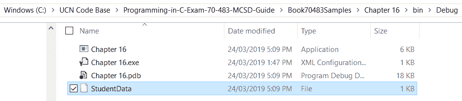

如果我们在 Internet Explorer 中打开该文件，我们将以 XML 格式看到学生数据：

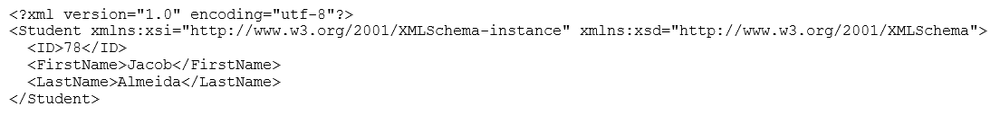

在前面的代码示例中，数据没有层次结构。所有数据都表示为 XML 文件中的一个元素。然而，在大多数情况下，我们需要表示遵循某种层次结构的数据。使用前面的例子，让我们尝试表示每个学生的课程分数。假设有五门课程：英语、数学、物理、化学和计算机。现在，让我们尝试使用以下代码实现来表示每个学生每门课程的分数：

```cs
[Serializable]
public class Student
{
 public string FirstName { get; set; }
 public string LastName { get; set; }
 public int ID;
 [XmlIgnore]
 public string Feedback { get; set; }
 [XmlArray("CourseScores")]
 [XmlArrayItem("Course")]
 public List<CourseScore> CoursePerformance { get; set; } 
 public void CreateCoursePerformance()
 {
        Course phy = new Course { Name = "Physics", Description = 
                                  "Physics Subject" };
        CourseScore phyScore = new CourseScore { Course = phy, 
                                                 Score = 80 };
        List<CourseScore> scores = new List<CourseScore>();
        scores.Add(phyScore);
        this.CoursePerformance = scores;
 }
}
[Serializable]
public class CourseScore
{
 [XmlElement("Course")]
 public Course Course;
 [XmlAttribute]
 public int Score;
}
[Serializable]
public class Course
{
 [XmlAttribute]
 public string Name;
 public string Description;
}
```

上一段完整代码可以在本章的 GitHub 仓库中找到。

在前面的代码实现中，我们声明了三个类：

+   `Course`: 用于表示科目及其描述

+   `CourseScore`: 用于表示学生在该特定课程中获得的分数

+   `Student`: 包含`CourseScore`列表，用于表示学生在每个科目中获得的分数

请注意我们在课程中使用的以下标签：

+   `XmlIgnore`: 我们使用此标签针对我们不想在生成的 XML 类中保存的属性。在上面的类示例中，我们对`Feedback`类使用了`XmlIgnore`。这将确保`Feedback`属性不会出现在生成的 XML 文件中。

+   `XmlElement`: 如果我们想在生成的 XML 中表示一个元素，可以使用这个标签。该元素可以具有属性。在上面的例子中，我们使用了`XmlElement`标签来表示`Course`属性。这将使我们能够在生成的 XML 文件中添加`Course Name`和`Course Description`属性。

+   `XMLArray`: 当此元素可以有多个子记录时，我们使用此标签。在上面的例子中，我们使用了`XMLArray`标签来表示`CourseScores`属性，以指示这是一个可以具有多个子记录的 XML 元素。

+   `XMLArrayItem`: 我们使用此标签来表示`XMLArray`记录中的单个子记录。在上面的例子中，我们使用了`XMLArrayItem`标签来表示列表集合变量`CourseScores`中的单个记录。

如果我们需要使用`XMLSerialization`序列化数据，我们可以使用以下代码。一旦代码执行，它将根据前面类声明中使用的数据结构和标签生成一个 XML 文件：

```cs
XmlSerializer serializer = new XmlSerializer(typeof(Student));
string fileName = "StudentDataWithScores";
using (TextWriter writer = new StreamWriter(fileName))
{
       Student stu = new Student("Jacob", "Almeida", 78, "Passed");
       stu.CreateCoursePerformance();
       serializer.Serialize(writer, stu);
       writer.Close();
 }
```

程序生成后，请注意生成了一个 XML 文件，名为`StudentDataWithScores`。现在，打开 XML 文件并查看以下内容：

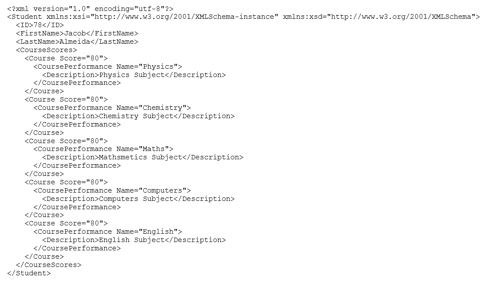

请注意生成的 XML 文件结构中的以下要点：

+   在 XML 文件中，没有`Feedback`节点，因为它在`Student`类文件中被标记为`XmlIgnore`标签。

+   在`Student`节点中，有一个与我们在`CourseScore`列表集合中使用的`XmlArray`标签一致的`CourseScores`元素节点。

+   在元素节点`CourseScores`中，我们有一个与`XmlArrayItem`一致的单独节点元素`Course`，这是我们为`CourseScores`集合中的每个元素声明的。

每个子项节点都有一个`Score`属性。它与用于`CoursePerformance`的标签`XmlElement`一致；请注意，XML 还显示了课程的名称和描述。

尽管我们使用`XMLSerialization`，我们可以生成易于阅读的数据，但关于`XmlSerialization`存在某些问题：

+   它消耗更多的空间。如果我们共享 XML 文件，它们最终会在文件系统中节省空间，这可能不是理想的。

+   此外，如果我们用`private`访问修饰符声明一个属性，它将不会被 XML 序列化选中。例如，如果我们设置前面示例中`LastName`属性的访问修饰符，我们将看到生成的 XML 文件将没有这个属性。

以下代码是`Student`类中属性的更新访问修饰符集：

```cs
public string FirstName { get; set; }
private string LastName { get; set; }
public int ID;
[XmlIgnore]
public string Feedback { get; set; }
[XmlArray("CourseScores")]
[XmlArrayItem("Course")]
public List<CourseScore> CoursePerformance { get; set; }
```

`LastName`属性的访问修饰符已从`public`更改为`private`。如果我们执行项目并打开 XML 文件，我们将观察到`LastName`属性不再存在于生成的 XML 文件中：

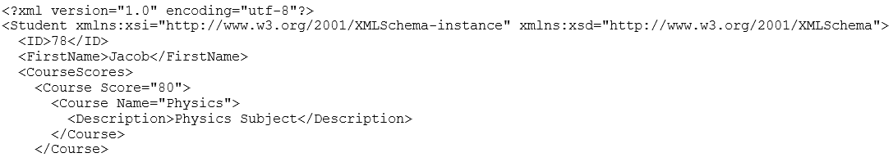

在下一节中，我们将通过 C#中的二进制序列化方法进行介绍。

# 二进制序列化

在`XmlSerialization`中，序列化的输出是一个可以轻松用记事本打开的 XML 文件。然而，正如之前解释的那样，创建文件会增加应用程序所需的总体存储空间，这在所有情况下可能都不是所希望的。

我们还观察到，如果我们用`private`访问修饰符标记任何属性，它不会被复制到生成的 XML 文件中。这在许多情况下也可能是一个问题。

在本节中，我们将探讨一种替代方法，我们将数据序列化到一个字节流中。这些数据将无法像 XML 文件一样查看，但将节省空间，并且以更好的方式处理`private`属性。

.NET Framework 为我们提供了`System.Runtime.Serialization`和`System.Runtime.Serialization.Formatters.Binary`命名空间，它们为我们提供了处理二进制序列化的辅助类。

为了理解二进制序列化是如何工作的，让我们看看以下示例。我们将使用`Student`类，这与我们在处理 XML 序列化时创建的类类似：

```cs
[Serializable]
public class StudentBinary
{
     public string FirstName;
     public string LastName;
     public int ID;
     public string Feedback;

     public StudentBinary(string firstName, string lastName, int Id, string feedback)
     {
         this.FirstName = firstName;
         this.LastName = lastName;
         this.ID = Id;
         this.Feedback = feedback;
     }
 }
```

请注意，在类声明中，就像在`XmlSerialization`中一样，我们在`StudentBinary`类的声明中使用了`Serializable`标签。这向编译器指示`StudentBinary`类可以被序列化。

我们可以使用以下代码来序列化和反序列化此类的一个对象：

```cs
StudentBinary stu = new StudentBinary("Jacob", "Almeida", 78, "Passed");            
IFormatter formatter = new BinaryFormatter();
using (Stream stream = new FileStream("StudentBinaryData.bin", FileMode.Create))
{
     formatter.Serialize(stream, stu);
}

using (Stream stream = new FileStream("StudentBinaryData.bin", FileMode.Open))
{
     StudentBinary studeseria = (StudentBinary)formatter.Deserialize(stream);
}
```

在代码示例中，我们创建了一个`StudentBinary`类的对象，然后使用一个辅助类`BinaryFormatter`将数据序列化为二进制数据。一旦数据被序列化，使用`FileStream`辅助类，我们将这些二进制数据保存到一个二进制文件中，名为`StudentBinaryData.bin`。

在下一步中，我们打开上一步中创建的文件，并将其反序列化回`StudentBinary`类。如果我们尝试调试应用程序并对`studeseria`变量进行快速查看，我们将看到以下输出：

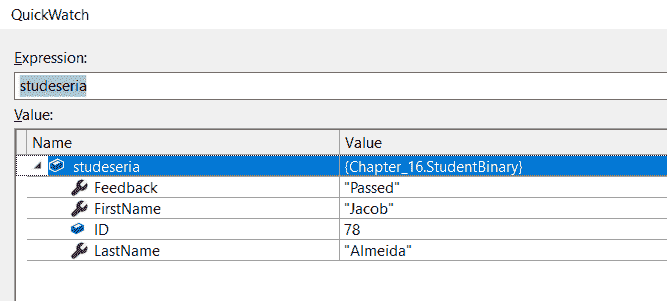

现在让我们对前面的类进行一个更改：将`LastName`属性标记为`private`。当我们使用`XmlSerialization`时，我们看到了任何标记为`private`访问修饰符的属性都被排除在外。让我们用二进制序列化做同样的事情，并观察差异：

```cs
[Serializable]
public class StudentBinary
{
     public string FirstName;
     private string LastName;
     public int ID;
     public string Feedback;
     public StudentBinary(string firstName, string lastName, int Id, string feedback)
     {
         this.FirstName = firstName;
         this.LastName = lastName;
         this.ID = Id;
         this.Feedback = feedback;
     }
 }
```

如果我们现在尝试调试一个应用程序并对`studeseria`变量进行快速查看，我们将得到以下输出：

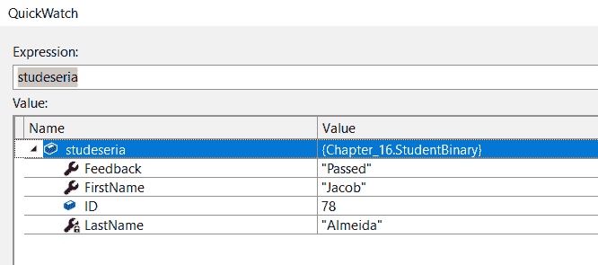

注意，尽管我们将`LastName`设置为`private`，但这并没有对输出产生影响。这说明了二进制序列化相对于`XmlSerialization`的优势。

仅使用`XmlSerialization`，我们也可以为属性设置标签，以确保在序列化过程中忽略该属性。我们可以使用`NonSerialized`标签来实现。在以下代码实现中，我们正在使用此标签为`Feedback`属性：

```cs
[Serializable]
public class StudentBinary
{
    public string FirstName;
    private string LastName;
    public int ID;
    [NonSerialized]
    public string Feedback;

    public StudentBinary(string firstName, string lastName, int Id, string feedback)
    {
        this.FirstName = firstName;
        this.LastName = lastName;
        this.ID = Id;
        this.Feedback = feedback;
    }
}
```

尽管二进制序列化使我们能够克服任何标记为`private`访问修饰符的属性的约束，但在某些情况下，我们仍然可能故意想要限制某些数据的交换，特别是那些敏感且我们无论如何都想限制的属性。我们可以通过使用`ISerializable`接口来实现这一点。

在以下实现的代码中，我们使用了一个类似的类`StudentBinaryInterface`，并在其中实现了`ISerializable`接口。作为此接口的一部分，我们必须在这个类中实现一个`GetObjectData`方法。当类被序列化时，将调用此方法。在这个方法中，我们将进行封装，并且不会将任何敏感属性添加到序列化的流中。让我们看看如何做到这一点：

```cs
[Serializable]
public class StudentBinary:ISerializable
{
     public string FirstName;
     private string LastName;
     public int ID;
     public string Feedback;
     protected StudentBinary(SerializationInfo info, 
                             StreamingContext context)
     {
         FirstName = info.GetString("Value1");
         Feedback = info.GetString("Value2");
         ID = info.GetInt32("Value3");
     }
     public StudentBinary(string firstName, string lastName, 
                          int Id, string feedback)
     {
         this.FirstName = firstName;
         this.LastName = lastName;
         this.ID = Id;
         this.Feedback = feedback;
     }
     [System.Security.Permissions.SecurityPermission(
          SecurityAction.Demand, SerializationFormatter = true)]
     public void GetObjectData(SerializationInfo info, 
                               StreamingContext context)
     {
         info.AddValue("Value1", FirstName);
         info.AddValue("Value2", Feedback);
         info.AddValue("Value3", ID);
     }
 }
```

在前面的代码示例中，我们将`LastName`属性声明为`private`。通过这段代码，我们将尝试排除此属性以进行序列化。

在这个类中有两个重要的函数：

+   `GetObjectData`: 如前所述，当类被序列化时，将调用此函数。在这个方法中，我们将序列化`Firstname`、`Feedback`和`ID`中存在的数据。请注意，`LastName`不包含在这个中。这是为了确保`LastName`属性中的数据不会被添加到流中。

+   构造函数：由于类实现了 `ISerializable` 接口，它必须实现以下带有 `SerializationInfo` 和 `StreamingContext` 参数的构造函数：

```cs
StudentBinary(SerializationInfo info, StreamingContext context)
```

当数据被反序列化到这个类对象时，将调用此构造函数。注意，在构造函数中，我们正在访问 `Value1`、`Value2` 和 `Value3` 属性的值，并将它们转换为相应的映射属性：

```cs
StudentBinary stu = new StudentBinary("Jacob", "Almeida", 78, "Passed");
IFormatter formatter = new BinaryFormatter();
using (Stream stream = new FileStream("StudentBinaryData.bin", FileMode.Create))
{
     formatter.Serialize(stream, stu);
}
using (Stream stream = new FileStream("StudentBinaryData.bin", FileMode.Open))
{
     StudentBinary studeseria = (StudentBinary)formatter.Deserialize(stream);
}
```

如果我们调试此代码并对 `studeseria` 变量进行快速监视，我们将得到以下输出：

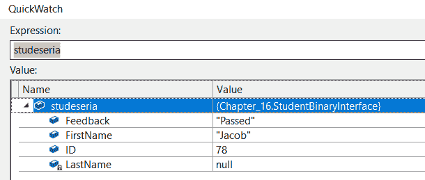

注意，`LastName` 属性中没有值。在下一节中，我们将学习如何处理集合。

# 操作集合

在 .NET 中，集合定义了一组相关的数据或元素。元素可以是简单数据类型的变量，如 `int`、`float` 或 `String`，也可以是复杂的数据变量，如类或结构。在处理 .NET 应用程序时，我们经常需要处理这样的集合。我们可以执行如下操作：

+   创建集合

+   向集合中添加元素

+   读取集合中的元素

+   从集合中删除元素

在本节中，我们将了解 .NET 中可用的不同类型的集合以及程序员如何对它们执行操作。

# 数组

数组是 .NET Framework 中可用的最基本集合变量。数组用于存储一组数据变量，这些变量的类型与 `int`、`String` 等相同。

让我们通过一个代码实现来创建一个 `int` 变量的数组集合，然后遍历它们：

```cs
public static void CollectionOperations()
{
     int[] arrayOfInt = new int[10];
     for (int x = 0; x < arrayOfInt.Length; x++)
     {
         arrayOfInt[x] = x;
     }
     foreach (int i in arrayOfInt)
     {
         Console.Write(i); 
     }
 }
```

请注意代码实现中的以下内容：

+   数组通过在数据类型之后使用 `[]` 语法来声明。在实现的代码中，我们声明了一个 `int` 类型的数组。

+   在声明数组集合时，我们必须定义数组的长度。在代码中，我们声明数组的长度为 `10`。这基本上意味着数组可以包含 `10` 个 `int` 类型的元素。

+   数组的索引从 `0` 开始。这意味着，在前面的例子中，第一个元素将从索引 `0` 开始，并结束于索引 `9`。如果我们需要引用数组中第 *i* 个索引的元素，我们可以使用 `array[i]` 表达式。

+   每个数组都有一个 `length` 属性。这个属性指示数组中可以存在的最大元素数量。在代码中，我们执行了一个从 `0` 到 `9` 的 `for` 循环，长度为 -1，并设置每个索引处的元素值。

+   数组实现了 `IEnumerable` 接口。因此，我们可以使用 `foreach` 循环遍历数组。

执行前面的代码后，我们得到以下输出：


在代码中，我们在数组的每个索引处设置值——与索引本身相同的值。在我们继续前进并查看代码示例之前，我们需要了解关于数组的重要的两个概念：

+   多维数组：这些是存储在具有行和列的矩阵结构中的元素数组。例如，我们可以使用以下代码来声明一个多维数组：

```cs
int[,] arrayInt = new int[3,2] { { 1, 2 }, { 3, 4 }, { 5, 6 } };
```

+   在数组声明期间使用单个`,`标记表示这是一个二维数组。在二维数组的情况下，第一个维度表示数组的行数，而第二个维度表示数组中的列数。此外，请注意，通过使用`3,2`，我们实际上是在指示数组的行数应该是`3`，而列数应该是`2`。

正如在普通数组中一样，在多维数组中，两个维度的索引都是从`0`开始的。因此，第一个元素将存在于索引`{0,0}`处，而最后一个元素将存在于索引`{2,1}`处。

让我们看看以下代码实现，我们将查看代码以遍历这个多维数组并读取数组中存在的每个数字：

```cs
int[,] arrayInt = new int[3,2] { { 1, 2 }, { 3, 4 }, { 5, 6 } };
for (int i=0; i < 3; i++)
{
     for (int j = 0; j < 2; j++)
     {
         Console.WriteLine(arrayInt[i, j]);
     }     
}
```

在前面的代码实现中，我们执行了两个嵌套循环。在第一个循环中，我们遍历多维数组中存在的行数。在第二个循环中，我们遍历多维数组中存在的列数。使用`arrayInt[i, j]`语法，我们打印出数组中该行和列组合的元素。

当我们执行代码时，我们得到以下结果。由于我们必须使用嵌套循环遍历二维数组，在每一步中，我们将访问位置`{i, j}`的元素。对于`i`变量的每次迭代，`j`变量将从`0`迭代到`1`。因此，它将从`{0,0}`开始，这是`1`，并将结束于`{2,1}`，这是`6`，从而生成以下输出：

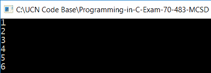

在下一节中，我们将查看另一种集合类型：列表。

# 列表

在处理数组时，我们了解到在声明数组时必须指定数组的长度。此外，我们无法增加数组集合的长度。

为了克服这些问题，我们可以使用列表集合。列表为我们提供了几个辅助方法，帮助我们向列表中添加和删除项目，对列表进行排序，在列表中进行搜索等等。列表集合是通过以下索引声明的：

```cs
 List<int> vs = new List<int>();
```

如果我们查看列表的定义，我们会意识到，在内部，它实现了许多接口，例如`IEnumerable`、`ICollection`和`IList`。由于这些不同的接口，列表集合非常强大，并提供了不同的操作。以下截图显示了在.NET 中列表集合的定义看起来是什么样子：

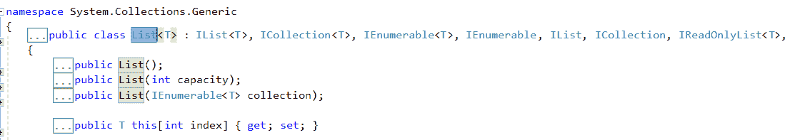

`IEnumerable`接口允许我们像处理数组一样使用`foreach`循环遍历列表集合。`ICollection`接口允许我们执行计数长度、添加新元素和删除元素等操作。

让我们看看以下代码实现，我们将对列表执行所有这些操作：

```cs
public static void ListCollectionOperations()
{
     List<int> vs = new List<int> { 1, 2, 3, 4, 5, 6 };
     for (int x = 0; x < vs.Count; x++)
     Console.Write(vs[x]); 
     vs.Remove(1);
     Console.WriteLine(vs[0]); 
     vs.Add(7);
     Console.WriteLine(vs.Count); 
     bool doesExist = vs.Contains(4);
     Console.WriteLine(doesExist); 
}
```

让我们看看在先前的代码中我们做了什么：

+   我们创建了一个`int`类型的列表并添加了元素 1-6。

+   我们正在使用`for`循环遍历列表，并打印其中的值。为了找到列表的长度或元素数量，我们使用`Count`属性。

+   要从特定索引删除元素，我们可以使用`Remove`方法。在先前的代码实现中，我们正在删除索引`1`处的元素。

+   要在列表中添加新元素，我们使用`Add`方法。在先前的代码实现中，我们正在向列表中添加一个元素，`7`。

+   要检查一个元素是否在列表中，我们使用`Contains`方法。在先前的代码实现中，我们正在检查列表中是否存在`4`这个元素。

如果我们执行这个操作，我们会得到以下输出：

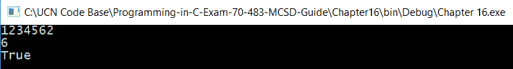

列表集合的一个潜在问题是我们可以有重复的值。例如，在先前的例子中，列表中可能有两个元素具有与`1`相同的值。

由于这个问题，我们不能在必须确保值唯一性的场景中使用列表集合。在下一节中，我们将探讨另一个集合字典，它克服了列表对象的这个问题。

# 字典

当我们需要在保存的值中保持唯一性时，可以使用字典集合。字典集合由两部分组成：键和值。在.NET 中，它们一起被称为键值对。当创建字典集合时，它确保键值是唯一的，并且集合中不存在重复的键。检索也是基于键进行的，这使得操作非常快速。以下索引声明了字典集合：

```cs
Dictionary<int, int> vs = new Dictionary<int, int>();
```

在先前的代码实现中，我们声明了一个字典集合，其中键和值都是`int`格式。

让我们右键单击`Dictionary`类并点击转到定义。这样做后，我们将被带到字典的定义。这样做后，我们会意识到它实现了多个接口，例如`IEnumerable`、`ICollection<KeyValuePair<Tkey`和`TValue>>`。请参考以下`Dictionary`类的定义：

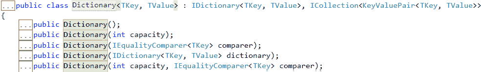

由于基于`KeyValuePair`实现了`ICollection`接口，它确保了基于键的唯一性。

在代码实现中，我们将查看一个代码示例，其中我们将实现`Dictionary`对象上的操作：

```cs
public static void DictionaryCollectionOperations()
{
     Dictionary<int, int> vs = new Dictionary<int, int>();
     for (int x = 0; x < 5; x++)
     {
         KeyValuePair<int, int> pair = new KeyValuePair<int, int>(x, x * 100);
     }

     foreach(KeyValuePair<int, int> keyValue in vs)
     {
         Console.WriteLine(keyValue.Key + " " + keyValue.Value);
     }
     vs.Remove(1);
     Console.WriteLine(vs[0]);
     vs.Add(5, 500);
     Console.WriteLine(vs.Count);
     bool hasKey = vs.ContainsKey(4);
     bool hasValue = vs.ContainsValue(900);
     Console.WriteLine(hasKey);
     Console.WriteLine(hasValue);
 }
```

请注意以下前述代码实现中的要点：

+   我们已声明一个字典集合变量。我们实现了一个运行五次的`for`循环。在循环中，我们创建`KeyValuePair`并将其添加到字典对象中。

+   在我们将元素添加到字典对象之后，我们正在遍历字典。我们是通过在字典中存在的`KeyValuePair`上使用`foreach`循环来实现的。

+   要从字典中删除特定元素，我们可以使用`Remove`方法。该方法接受一个键作为输入，并根据键删除字典中存在的相应`KeyValuePair`。

+   要在字典中添加特定元素，我们可以使用`Add`方法。该方法有两个参数，一个是键，另一个是值。

+   要检查特定键是否存在于字典中，我们可以使用`ContainsKey`方法。该方法返回给定键是否存在于字典中。如果键存在，它返回`true`，在其他情况下返回`false`。

+   要检查特定值是否存在于字典中，我们可以使用`ContainsValue`方法。该方法返回给定值是否存在于字典中。如果值存在，它返回`true`，在其他情况下返回`false`。

如果执行前面的代码，我们将得到以下输出：

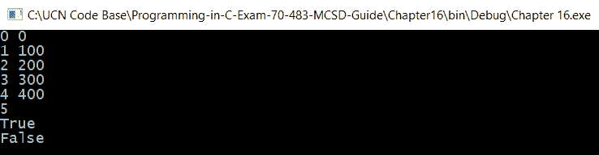

请注意以下代码输出的要点：

+   值（`0`, `0`）、（`1`, `100`）、（`2`, `200`）、（`3`, `300`）和（`4`, `400`）表示在字典中添加的关键值对。

+   `5`表示字典中元素的数量或长度。

+   `True`表示字典包含键为`4`的`KeyValuePair`。

+   `False`表示字典不包含值为`900`的`KeyValuePair`。

在我们进入下一节之前，让我们尝试一下如果我们尝试在键已存在于字典中的相同字典中添加`KeyValuePair`会发生什么。为了举例，我们将添加`KeyValue`为`(1, 1000)`。请注意，键`1`已经在字典中。当代码执行时，我们得到以下异常。异常表明，如果我们尝试在字典中添加具有相同键的值，它将抛出错误：

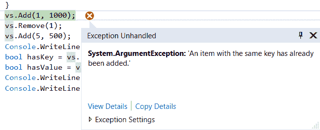

在下一节中，我们将介绍另一组集合对象：队列和栈。

# 队列和栈

队列和栈是允许我们在程序执行期间临时保存数据的集合项。这些集合与其他集合（如列表）非常相似，主要区别在于元素如何添加和从集合中删除。

队列是一种先进先出（FIFO）类型的集合。这基本上意味着元素是按照它们添加到集合中的相同顺序访问的。当访问项目时，它们也可以在同一个操作中移除。队列有三个主要操作：

+   向队列中添加新元素：这是通过`Enqueue`方法执行的。

+   从队列中移除现有元素：这是通过`Dequeue`方法执行的。

+   查看或检索队列中元素的值：这是通过`Peek`方法执行的。

此图显示了队列的工作原理：


在前述图中，方块表示队列集合。在集合中，我们添加了五个元素：元素 A、元素 B、元素 C、元素 D 和元素 E。元素 E 是第一个添加到队列中的元素，它位于队列的前端。元素 A 是最后一个添加到队列中的元素，它位于队列的末尾。

绿色箭头表示队列中不同操作将发生的索引。新元素的添加总是在队列的末尾进行。元素的移除总是在队列的前端进行。

让我们通过代码实现来展示它是如何以编程方式完成的。在以下代码中，我们创建了一个队列集合对象。然后我们将元素添加到对象中，并对其执行不同的操作：

```cs
public static void QueueOperations()
{
    Queue<string> que = new Queue<string>();
    que.Enqueue("E");
    que.Enqueue("D");
    que.Enqueue("C");
    que.Enqueue("B");
    que.Enqueue("A");
    int index = 0;
    foreach(string s in que)
    {
        Console.WriteLine("Queue Element at index " + index + " is " + s);
        index++;
    }
    Console.WriteLine("Queue Element at top of the queue is " 
                       + que.Peek());
    que.Dequeue();
    index = 0;
    foreach (string s in que)
    {
         Console.WriteLine("Queue Element at index " + index + " is " + s);
         index++;
    }
 }
```

当执行前述代码时，我们得到以下输出：

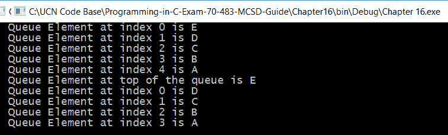

如队列图所示，当我们向队列中添加元素时，它们总是添加到队列的末尾。因此，当我们以相同的顺序添加`E`、`D`、`C`、`B`和`A`元素时，`A`将始终位于队列的末尾，而`E`将位于队列的前端。前述输出中的索引表示每个相应元素在队列中的位置。

队列中的查看操作总是在前端索引上执行，即队列的`0`索引。队列中的移除操作总是在前端索引上执行，即队列的`0`索引。因此，在前述输出中，这两个操作都是在元素`E`上执行的。

一旦完成这些操作并且我们再次遍历队列，我们会发现，由于移除操作，元素`E`不再存在于队列中。现在我们已经了解了队列的工作原理，让我们看看.NET Framework 中栈是如何工作的。

就像队列一样，栈也提供临时存储，唯一的区别在于在栈上执行操作的方式。栈遵循后进先出（LIFO）模型，这意味着最后添加到栈中的元素将是第一个被移除的。以下是我们可以在栈上执行的三种主要操作：

+   向栈中添加新元素。这是通过`Push`方法执行的。

+   从栈中移除现有元素。这是通过`Pop`方法执行的。

+   通过`Peek`方法检索栈中元素的值。这是通过`Peek`方法执行的。

以下图表显示了栈的工作原理：


在图表中，方块表示一个栈集合。在集合中，我们添加了五个元素：元素 A、元素 B、元素 C、元素 D 和元素 E。元素 E 是第一个添加到栈中的元素，它在栈的前端。元素 A 是最后添加到栈中的元素，它在栈的后端。

绿色箭头表示不同操作将在栈中的哪些索引处进行。新元素的添加总是发生在栈的底部。元素的移除将发生在栈的顶部。

让我们通过代码实现来展示它是如何程序化完成的。在下面的代码中，我们创建了一个栈集合对象。然后我们将向对象中添加元素并对其执行不同的操作：

```cs
public static void StackOperations()
{
     Stack<string> sta = new Stack<string>();
     sta.Push("E");
     sta.Push("D");
     sta.Push("C");
     sta.Push("B");
     sta.Push("A");
     int index = 0;
     foreach (string s in sta)
     {
         Console.WriteLine("Stack Element at index " + index + " is " + s);
         index++;
     }
     Console.WriteLine("Stack Element at top of the stack is " 
                        + sta.Peek());
     sta.Pop();
     index = 0;
     foreach (string s in sta)
     {
         Console.WriteLine("Stack Element at index " + index + " is " + s);
         index++;
     }
 }
```

当执行前面的代码时，我们得到以下输出：

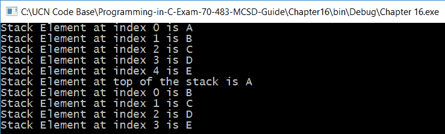

在栈上执行`Peek`操作总是针对最后添加到栈上的元素。元素`A`是最后添加到栈上的元素。因此，当在栈上执行`Peek`操作时，它给出输出`A`。同样，当在栈上执行`Pop`操作时，它移除了元素`A`。

通过这种方式，我们已经了解了.NET 中可用的不同集合。每个这些集合项都有一些属性，使它们在某些场景中可用，而在其他场景中不可用。当我们试图选择要使用的集合项时，需要评估这些标准。

在下一节中，我们将探讨一些有助于我们为每个场景选择正确集合项的标准。

# 选择集合

在选择集合类型时，我们必须分析我们想要在应用程序中使用的场景。这些集合类型之间的主要区别在于我们访问它们元素的方式：

+   在声明数组集合时，它需要有一个确定的大小或长度。另一方面，所有其他集合类型都可以动态地增加其大小。此外，数组支持对数据的随机访问。这基本上意味着只要元素存在于数组中指定的索引处，我们就可以访问该元素，而无需遍历整个数组。

+   队列和栈允许我们以确定的方式访问元素。当队列以 FIFO（先进先出）方式工作时，栈以 LIFO（后进先出）方式工作。

+   另一方面，列表和字典集合类型允许我们配置对元素的随机访问。请注意，从概念上讲，列表不支持随机访问；然而，在 C#中，列表被维护为一个数组。因此，它支持随机访问。

+   列表和字典之间的重要区别在于它们保存数据的方式以及性能。在字典集合中，我们使用 `KeyValuePair` 保存数据。这允许我们保持字典中存在的键的唯一性。另一方面，列表不提供这项功能。

# 摘要

在本章中，我们学习了如何在通过网络交换数据时进行序列化和反序列化。我们探讨了序列化和反序列化的不同技术。我们从 `XmlSerialization` 开始，看到了如何将数据序列化到 XML 文件中。我们还探讨了不同的属性标签，如 `XmlArray`、`XmlArrayItem` 和 `XmlIgnore`，我们可以在将类对象转换为 XML 文件时放置这些标签。然后，我们探讨了二进制序列化，并学习了它相对于 `XmlSerialization` 的优势。我们还探讨了 `ISerializable` 接口，并学习了它在通过网络交换数据时如何提供安全性。

我们随后探讨了 C# 中可用的不同集合类型以及我们应该在什么情况下使用它们。我们探讨了数组及其在数组声明时必须声明的长度或大小的限制。然后，我们探讨了其他一些复杂的集合类型，例如列表和字典。这两个集合项都允许我们在执行过程中增加集合大小，但它们在访问数据的方式上有所不同。字典将数据保存在 `KeyValuePair` 中，并强制集合类型中键的唯一性。

然后，我们探讨了队列和栈集合类型。与允许随机访问数据的列表和字典不同，栈和队列允许我们以特定顺序访问数据。队列遵循 FIFO 模型，而栈遵循 FILO 模型。

# 问题

1.  以下哪个陈述是正确的？

    1.  在序列化过程中，`XmlSerialization` 会自动将私有属性包含在生成的 XML 类中。

    1.  在 `XmlSerialization` 中，可以使用 `XmlIgnore` 标签来排除我们不想包含在生成的 XML 类中的任何属性。

    1.  在二进制序列化中，标记为私有的属性不会被序列化。

    1.  使用 `ISerializable` 接口，我们可以选择在序列化中要包含的属性及其标签。

1.  以下哪个陈述是正确的？

    1.  我们可以在程序执行期间增加数组集合类型的大小。

    1.  队列遵循 LIFO 模型来访问元素。

    1.  字典在 `KeyValuePair` 中保存数据，确保了集合项中键值对的唯一性。

    1.  列表和字典都允许随机访问数据元素。

1.  你正在处理一组大量的 `student` 对象。你需要移除所有重复项，然后按 `studentid` 对它们进行分组。我们应该使用哪些集合？

    1.  列表

    1.  栈

    1.  字典

    1.  队列

# 答案

1.  **b 和 d**

1.  **c 和 d**

1.  **c**
