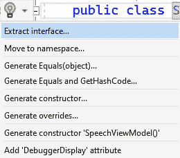

# 1

# 技术债务、代码异味和重构

新软件项目一开始都是干净和乐观的，但很快就会在复杂性和维护难度上增长，直到代码难以理解、脆弱且难以测试。

如果你从事过任何一段时间的代码工作，那么你很可能遇到过这样的代码。事实上，如果你在开发领域工作过一段时间，那么你很可能*编写过*你现在后悔的代码。

可能是代码难以阅读或理解。也许代码效率低下或容易出错。也许代码是在某些业务假设下构建的，而这些假设后来发生了变化。也许代码简单地不再符合你和你的团队同意的标准。无论原因如何，糟糕的代码似乎在任何一个规模或年龄较大的代码库中无处不在。

这种代码充斥着我们的软件项目，降低了我们的开发速度，导致我们引入错误，并通常使我们的软件工程师感到不那么快乐和高效。

在这本书中，我们将讨论技术债务是如何产生的，以及我们如何通过重构的过程来处理它，这个过程由测试和代码分析引导。

在本章中，我们将涵盖以下主要主题：

+   理解技术债务和遗留代码

+   识别代码异味

+   介绍重构

# 理解技术债务和遗留代码

虽然计算机科学教育、书籍、教程和在线课程都侧重于从头开始创建新项目，但现实是，你几乎所有的开发工作都将围绕理解、维护和扩展可能不符合你当前标准的现有代码。

这预先存在的代码被称为**遗留代码**。当你加入一个新项目时，你几乎总是继承了一定量的遗留代码。这可能是一大块现有项目的代码，或者是一组你必须与之协同工作的较小库。

对于术语“遗留代码”有许多不同的定义。在我阅读过的定义中，让我印象深刻的是迈克尔·C·费瑟在《与遗留代码有效工作》一书中提出的定义，即遗留代码是*没有测试的代码*。

虽然我喜欢迈克尔·C·费瑟的定义，并认为测试至关重要，但正如我们在本书的*第二部分*中将要看到的，我个人将遗留代码定义为以下内容：

*遗留代码是指任何如果今天重写将会显著不同的预先存在的代码*。

遗留代码的一个关键因素是它是*你目前不完全理解的代码*，因此，它的存在引起了一定程度的不安和焦虑。

当你维护旧系统时感到的这种焦虑是被称为**技术债务**的典型症状。

简而言之，技术债务是*遗留代码对未来* *开发努力*的负面影响。

换句话说，遗留代码在修改时存在一定的内在*风险*，即可能会发生一些不好的事情。这些不好的事情可能是由于现有代码的脆弱性（或我们对它的理解不足）而引入的 bug，或者开发速度变慢，甚至可能是由于过时的安全实践或已弃用的依赖项而导致的严重问题，如关键 bug 或安全漏洞。

更糟糕的是，技术债务会随着时间的推移而增长——尤其是如果得不到控制的话。

## 技术债务的来源

在我们继续之前，我想谈谈我在组织中看到的一个常见的混淆点：技术债务与技术不良代码不是一回事。

当然，我们系统中的一些技术债务可能仅仅是低质量的代码。可能是一个经验不足的开发者编写的，并且没有从其他开发者的代码审查中获得适当的益处。有时，项目处于匆忙之中，团队一开始就没有时间正确编写代码，而且从未有机会回去清理它。

有时，为了原型而编写的“快速且粗糙”的代码会在“可丢弃原型”匆忙升级为实际生产应用时进入生产环境，正如我们将在*第十五章**：沟通* *技术债务* 中探讨的那样。

当然，技术债务还有其他原因。

有时，开发团队会误以为他们正在构建软件来完成特定的任务，但随着业务需求的变化和新信息的发现，这个任务会发生变化。在这些情况下，团队通常不会从他们正在编写的代码重新开始。他们只是将旧代码演变以适应手头的新的任务。结果是代码可以工作，但并不理想地适合新的任务。

这种需求的变化在软件开发环境中是正常的，甚至是可以预期的。现代软件开发以敏捷的方式进行，需求和计划会随着时间的推移自然演变，而提前理解它们几乎是不可能的。

即使开发团队完美理解需求并编写了完美的代码，由于软件工程的不断变化，这些代码最终也会成为一种形式的技术债务。

在软件开发中，工具和库会随着时间的推移而变化。在撰写本文时，**.NET 8** 和 **C# 12** 是运行 C#代码的最新方式，但这些技术将在未来的某个时刻停止支持，然后被更新的版本所取代。

甚至关于软件的思考方式也可以改变。在过去二十年里，组织从拥有自己的本地服务器转变为使用**Azure**、**AWS**或**Google Cloud**的云托管。随着技术，包括容器化技术如**Docker**、**平台即服务**（**PaaS**）提供如**Azure App Services**，以及无服务器计算提供如**Azure Functions**和**AWS Lambda**，服务器的本质也发生了变化。

现在，像**ChatGPT**和**GitHub Copilot Chat**这样的新 AI 技术正准备改变软件开发者甚至意味着什么，这进一步强调了持续变化是软件工程行业核心的重要性。

软件项目的变更

在软件开发中，变化是持续的，可能是不可预测和突然的。所有这些变化导致曾经被认为是完美的代码后来被认为是业务持续成功的重大风险。

换句话说，技术债务在某种程度上是软件开发不可避免的一部分。幸运的是，你可以采取一些措施来减少其积累的速度（我们将在本书的*第二部分*中讨论）。幸运的是，我们可以通过其症状或“异味”来检测技术债务。

# 识别代码异味

那么，你怎么知道你的代码是否有问题？

你怎么知道食物是否变质，衣服是否需要清洗，或者尿布是否需要更换？结果是它闻起来很糟糕。

有一些关于“好”代码和“坏”代码构成的指标，我们将在*第十二章*：Visual Studio 中的代码分析*和*第十六章*：采用代码标准*中探讨。有异味的代码在某种程度上可能是主观的。编写了代码段或经常修改该部分的开发者可能会发现代码更易忍受，而首次遇到该代码的开发者可能不会这样认为。

虽然并非所有技术债务都是相同的，但许多遗留代码共享一组常见的症状。

这些症状通常被称为“代码异味”，可能包括以下内容：

+   很难理解它做什么或*为什么*这样做

+   你或你的团队成员避免与之合作

+   它的修改速度比其他区域慢，或者修改时容易出错

+   很难测试或调试

新代码一开始是良好且纯净的，但在商业环境中实际存在的代码会随着时间的推移而演变，因为需要更多的功能，并引入了额外的特性和修复。在这个过程中，曾经整洁的代码开始积累代码“异味”。

并非所有代码都是平等的，也并非所有代码都能像其他代码一样持久。当然，我们可以做一些事情来使我们的代码更具弹性（正如我们将在*第八章**：使用 SOLID 避免代码反模式*）中看到）。然而，在某个时候，你那漂亮的新代码将开始变得令人不快，需要通过称为重构的过程来清理。

# 引入重构

**重构**是那些对新手程序员来说意义不大的词汇之一，但这里有一个简单的定义：

**重构是改变代码的形状或形式而不改变其功能或行为的行为**。

这里有两个关键概念：

+   第一个概念是，重构是为了提高现有代码的可维护性而努力。有时，重构意味着引入新的变量、方法或类。有时，重构只是改变了单个代码行的排列方式或使用了哪些语言特性。甚至像重命名变量这样的简单操作也可以被视为一个小型的重构行为。

+   这个定义中的第二个概念是，重构不会改变代码的*行为*。重构是为了在不改变代码现有行为的情况下，对代码结构进行的一种结构性改变，以引入某些技术优势。如果你重构前一个方法通常返回某个值，而现在返回了不同的值，那么这是一个*变化*，而不是重构。

重构还应该为工程团队提供一些好处。重构后的代码应该更容易理解，在更改时更不容易出错，并且比原始代码具有更少的技术债务和代码异味。

开发团队产生的每一行代码都应该具有商业价值。重构也不例外，除了它产生的商业价值应该是更易于维护的代码，减少了由于它的存在而产生的问题和延迟。

有时候，我们试图通过重构来改进我们的代码，却意外地引入了新的行为——通常是新的错误。这使得我们的重构变成了软件中的无意变化，可能导致紧急修复以恢复代码的正常状态。

在重构过程中打断代码可能是一个关键问题，并且是未来允许执行重构代码的重大障碍，这反过来又可能让技术债务得以滋生。

在本书的*第二部分*中，我们将探讨安全重构代码的方法，以避免意外引入错误，而在*第四部分*中，我们将讨论获得组织对重构代码的支持，以及当缺陷确实出现在重构努力中时应该做什么。

## Visual Studio 中的重构工具

幸运的是，现在所有版本的**Visual Studio**都内置了重构工具，允许您以可靠和可重复的方式快速执行一系列常见的重构操作。

在*第二章**：重构简介*以及第一部分剩余的章节中，我们将看到许多重构的实际操作。以下是 Visual Studio 为用户提供的一些重构选项的预览：

图 1.1 – Visual Studio 快速操作上下文菜单显示一组重构操作

工具辅助的重构，如这些，有几个原因使其非常出色：

+   它们是快速和高效的

+   它们是可靠和可重复的

+   它们*很少*引入缺陷

警告

注意，我在谈论由重构工具引入的缺陷时使用了“很少”这个词。在少数情况下，在不考虑其操作的情况下使用内置的重构工具可能会将缺陷引入您的应用程序。我们将在后续章节中遇到这些情况时具体讨论这些领域。

在第一部分的剩余部分，我们将探讨如何快速有效地使用这些工具来重构您的 C#应用程序，并讨论您可能使用每个工具的场景类型。

尽管我们的工具功能强大，但重要的是要记住，这些工具只是重构代码的一种方式。通常，最有效的移除代码异味的方法是结合自己编写代码和使用内置的重构工具。

重构的关键价值是组织的长期健康，但许多重构的障碍可能来自组织本身。为了帮助说明在真实组织中进行重构的实际方面，每一章都将包含一个虚构组织的案例研究。有些章节将完全专注于案例研究中的代码，而其他章节，例如本章，将以专门的案例研究部分结束。这些案例研究部分展示了章节概念应用于虚构组织。

让我们来看看我们的第一个案例研究部分，看看技术债务和遗留代码如何影响一家典型的公司。

# 案例研究 – Cloudy Skies Airlines

本书剩余部分将遵循名为**Cloudy Skies Airlines**的航空公司的代码示例，或简称**Cloudy Skies**。通过这些示例，我们应该能够看到技术债务和重构如何应用于一个“真实”的组织及其软件。

注意

Cloudy Skies 是一家虚构的航空公司，仅为此书的教学目的而创建。任何与任何真实公司的相似之处纯属巧合。此外，我从未在航空业工作过，因此书中提供的代码示例可能与行业实际使用的软件系统有显著差异。

Cloudy Skies 是一家存在了 50 年的航空公司，目前在其机队中运营着超过 500 架喷气式飞机，为其所在地区的约 70 个城市提供服务。

二十年前，航空公司做出了重大举措，开始用其开发团队构建的定制内部应用程序替换其老化的软件系统。Cloudy Skies 选择使用 .NET 和 C#。初始系统表现良好，并导致开发人员生产力和高性能软件应用程序的增加，因此 Cloudy Skies 继续将其应用程序迁移到 .NET。

随着时间的推移，航空公司及其系统不断增长。Cloudy Skies 的工程团队曾经是组织的骄傲和喜悦，也是其未来的关键。

然而，在过去几年中，管理层对其工程团队有些许挫败感。其中一些关键投诉包括以下内容：

+   产品经理们对于对现有系统看似简单的更改所需的大量估计感到沮丧，以及由于实施时间过长和大量错误而导致的软件发布之间的时间不断增加。

+   质量保证部门被软件中日益增长的错误所淹没，同一事物反复出现故障的趋势，以及当应用程序的其他部分发生变化时，似乎无关的区域出现错误。

对于工程团队来说，他们感到正在处理的代码让他们感到压力重重。战略举措多年来一直被搁置，而组织让团队专注于紧急更改或新发布的紧迫截止日期。因此，没有人有时间解决团队面临日益增长的技术债务。

Cloudy Skies 的代码库不断增长，以适应系统添加的每个新功能或“特殊情况”。这种复杂性反过来又使得应用程序更难测试、理解和修改，这导致了新开发人员入职困难和一些经验丰富的开发人员离开组织。

在经历了几次严重的延误和备受瞩目的错误之后，Cloudy Skies 引进了一位新的工程经理，并赋予团队权力进行变革，以确保航空公司在未来几年中能够保持高效和有效。

这位工程经理确定，这些问题的根本原因是技术债务，并且对整个应用程序套件中最关键区域的针对性重构可以显著降低风险并提高团队未来的效率。

值得赞扬的是，管理层表示同意，并允许团队分配资源来偿还技术债务并通过重构提高代码的可维护性。

在本书的其余部分，我们将跟随这个虚构团队偿还技术债务和通过重构铺就通往更好未来的道路的历程。

# 摘要

历史代码是软件开发项目中时间力量和持续变化的不可避免的结果。这种历史代码成为技术债务的滋生地，这威胁到我们作为开发者的生产力和我们软件的质量。

尽管技术债务可能由于许多原因而产生，但重构是治疗方法。重构将现有代码重构为更易于维护和风险更低的形态，减少我们的技术债务，并帮助我们控制我们的遗留代码。

你对代码中技术债务的原因和影响了解得越多，你发现自己就越能更好地向组织中的其他人解释技术债务，倡导重构，并避免导致代码随时间推移而降低有效性的因素。

在下一章中，我们将通过一系列有针对性的更改来更深入地探讨重构，以改进 Cloudy Skies Airlines 代码库中的一个示例代码片段。

# 问题

1.  技术债务和遗留代码之间的区别是什么？

1.  技术债务有哪些原因？

1.  技术债务有哪些影响？

1.  是否可以避免技术债务？

1.  是否有可能达到一个点，你的代码不能再进一步重构？

# 进一步阅读

你可以在以下网址找到有关技术债务、遗留代码和重构的更多信息：

+   *定义技术债务*：[`killalldefects.com/2019/12/23/defining-technical-debt/`](https://killalldefects.com/2019/12/23/defining-technical-debt/)

+   *识别技术债务*：[`learn.microsoft.com/en-us/training/modules/identify-technical-debt/`](https://learn.microsoft.com/en-us/training/modules/identify-technical-debt/)

+   *技术债务的真实成本*：[`killalldefects.com/2019/11/09/the-true-cost-of-technical-debt/`](https://killalldefects.com/2019/11/09/the-true-cost-of-technical-debt/)

+   *代码重构*：[`en.wikipedia.org/wiki/Code_refactoring`](https://en.wikipedia.org/wiki/Code_refactoring)
