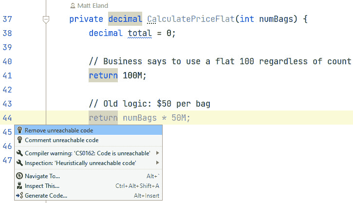

# 重构简介

学习重构的最佳方式是查看示例。在本章中，我们将使用 C#和 Visual Studio 探索一个示例重构场景，并亲眼看到重构如何在不改变其功能的情况下改变代码的可维护性。

在本章中，我们将介绍以下主要内容：

+   重新整理行李价格计算器

+   在其他编辑器中进行重构

在此过程中，我们将介绍引入局部变量、常量和参数、提取方法和删除不可达/未使用代码的重构，以及讨论在重构工作中的测试的重要性。

# 技术要求

如果您想跟随本章，可以从 GitHub 克隆本书的代码：[`github.com/PacktPublishing/Refactoring-with-CSharp`](https://github.com/PacktPublishing/Refactoring-with-CSharp)。

本章的起始代码可以在克隆存储库后，在`Chapter02/Ch2BeginningCode`文件夹中找到。

# 重新整理行李价格计算器

我们将首先检查 Cloudy Skies 航空公司工作人员在行李检查时使用的行李价格计算器，以确定单个客户必须支付的金额。

行李定价规则如下：

+   所有托运行李每件费用为 30 美元

+   乘客检查的第一个行李费用为 40 美元

+   每件随后的托运行李费用为 50 美元

+   如果旅行发生在假期期间，将应用 10%的附加费

此代码位于一个 C# `BaggageCalculator`类中，我们将在接下来的几个代码块中对其进行审查，从类定义、字段和完整属性开始：

BaggageCalculator.cs：

```cs
public class BaggageCalculator {
  private decimal holidayFeePercent = 0.1M;
  public decimal HolidayFeePercent {
    get { return holidayFeePercent; }
    set { holidayFeePercent = value; }
  }
```

这是一个简单的类，使用较旧的属性定义样式将`holidayFeePercent`设置为`decimal`值（由`M`后缀标识）为`0.1`或 10%。

该类还包含一个`CalculatePrice`方法，该方法返回一个表示行李费用总金额的`decimal`值：

```cs
  public decimal CalculatePrice(int bags,
    int carryOn, int passengers, DateTime travelTime) {
    decimal total = 0;
    if (carryOn > 0) {
      Console.WriteLine($"Carry-on: {carryOn * 30M}");
      total += carryOn * 30M;
    }
    if (bags > 0) {
      if (bags <= passengers) {
        Console.WriteLine($"Checked: {bags * 40M}");
        total += bags * 40M;
      } else {
        decimal checkedFee = (passengers * 40M) +
          ((bags - passengers) * 50M);
        Console.WriteLine($"Checked: {checkedFee}");
        total += checkedFee;
      }
    }
    if (travelTime.Month >= 11 || travelTime.Month <= 2) {
      Console.WriteLine("Holiday Fee: " +
        (total * HolidayFeePercent));
      total += total * HolidayFeePercent;
    }
    return total;
  }
```

该逻辑有些复杂，但它与之前描述的业务规则相匹配。

最后，该类以一个`CalculatePriceFlat`方法结束，该方法是在应用程序的早期版本中引入的，现在不再使用（我们将在后面讨论）：

```cs
  private decimal CalculatePriceFlat(int numBags) {
    decimal total = 0;
    return 100M;
    return numBags * 50M;
  }
}
```

尽管这段代码在世界上并不是最糟糕的，但这是一个随着新规则添加到应用程序中而逐渐增加复杂性、变得难以理解和维护的类。

幸运的是，这个类由一系列通过单元测试支持，并且所有用户都普遍认为它能够正确计算金额。

在本章中，我们将应用一系列有针对性的重构来改进此代码，以防止其在未来成为问题。

## 将属性转换为自动属性

类的声明从以下`HolidayFeePercent`属性开始，如下所示：

```cs
private decimal holidayFeePercent = 0.1M;
public decimal HolidayFeePercent {
  get { return holidayFeePercent; }
  set { holidayFeePercent = value; }
}
```

这段代码是好的，没有任何问题。然而，C#是一种不断发展的语言，开发者通常在可以选择的情况下更喜欢编写和维持更少的代码行。

因此，Microsoft 给了我们编写*自动实现属性*（通常称为**自动属性**）的能力，当代码编译时，它会自动生成自己的字段以及获取器和设置器。

当我们可能删除属性及其字段并重新声明时，存在一种可能性，即我们可能会在这样做时犯拼写或大小写错误。相反，让我们看看 Visual Studio 如何能自动为我们完成这项工作。

在 Visual Studio 中，如果你通过使用箭头键或点击属性名称将输入光标移到属性名称上，你会在边缘看到一个轻 bulb，如图*图 2.1*所示：


图 2.1 – 轻 bulb 快速操作图标

如果你点击这个轻 bulb（或默认按*Ctrl* + *.*），将出现**快速操作**菜单，并列出几个重构选项。

重构选择是上下文相关的，因此只有 Visual Studio 认为与你当前选择的代码相关的那些才会出现。

在这种情况下，第一个选项，**使用自动属性**，是我们想要的重构操作。见图*图 2.2*：


图 2.2 – 预览使用自动属性的重构

当选择此选项时，右侧面板将显示此更改将如何影响你的代码的预览。这里列出了它将用红色删除的行和用绿色添加的行。

点击**使用自动属性**或在键盘上按*Enter*键将接受建议，并用自动属性版本替换你的代码：

```cs
public decimal HolidayFeePercent { get; set; } = 0.1M;
```

虽然这只是一个简单的重构，但我想要强调重构过程中的几个要点：

+   Visual Studio 负责进行更改，并以自动化方式完成，这种方式避免了人类可能犯的潜在错误或拼写错误。

+   如果你不知道可以将整个属性移动到自动属性中，这个**快速操作**帮助你发现了这一点。实际上，这些**快速操作**可以*教会*你很多关于 C#编程语言的知识，因为它每年都在不断发展和变化。

在 Visual Studio 的重构机制处理完毕后，让我们探索一些额外的重构。

## 引入局部变量

`CalculatePrice`方法存在的问题之一是，有几个表达式，如`carryOn * 30M`和`bags * 40M`，在方法中多次出现。

这些都是小问题，但可能导致可维护性问题。如果表达式的性质发生了变化，我们就需要修改代码中的多个地方。

通常，你可能想要重构代码的一个原因是你发现自己经常需要修改多个地方以进行单一更改。例如，如果定价结构发生变化，我们应该修改多行代码以支持新的定价模型。我们应该修改的每一行都可能是我们可能未能进行更改的地方。这种遗漏的更改通常会导致错误。

即使我们没有错过任何需要修改的代码，大多数开发者也更愿意在一个地方而不是多个地方进行修改。

**引入局部**重构可以通过引入包含表达式结果的局部变量来帮助你。

要使用此重构，选择如*图 2.3*所示的重复表达式：


图 2.3 – 在 Visual Studio 中选择重复的表达式

接下来，通过按 *Ctrl* + .* 或点击螺丝刀图标来使用**快速操作**按钮。

关于快速操作图标的说明

**快速操作**按钮有时显示为灯泡，有时显示为螺丝刀，这取决于你的代码分析规则以及一行所面临的确切问题。它们实际上是相同的选项，但灯泡告诉你存在一个建议的重构，而螺丝刀则表示一个不太关键的考虑重构选项。

一旦上下文菜单打开，使用箭头键导航菜单，通过展开**引入局部**旁边的右箭头。这将让你查看更多详细选项。


图 2.4 – 深入了解引入局部重构的特殊形式

这里它为你提供了仅为你所选的表达式引入局部变量的能力，或者为该表达式的**所有出现**这样做。我通常建议使用**所有出现**选项，但这将取决于你试图改进的上下文。

一旦选择**引入局部**选项，Visual Studio 将提示你为变量命名（见*图 2.5*）：


图 2.5 – 为你的新局部变量命名

输入你想要的名字，然后按 *Enter* 键使框消失。

在我的情况下，我将变量命名为 `fee` 并在两行中替换了它，如下所示：

```cs
if (carryOn > 0) {
  decimal fee = carryOn * 30M;
  Console.WriteLine($"Carry-on: {fee}");
  total += fee;
}
```

虽然这确实使行李费用逻辑更清晰，但在托运行李逻辑中仍然有一个重复的 `bags * 40M` 表达式，以及一个重复的 `total * HolidayFeePercent` 表达式。

你可以使用**引入局部**重构通过将一些逻辑从密集的行中拉出来到它们自己的较小行，使复杂的行更容易理解。

在整个方法中应用**引入局部变量**的重构会导致方法更长，但更容易理解：

```cs
public decimal CalculatePrice(int bags,
  int carryOn, int passengers, DateTime travelTime) {
  decimal total = 0;
  if (carryOn > 0) {
    decimal fee = carryOn * 30M;
    Console.WriteLine($"Carry-on: {fee}");
    total += fee;
  }
  if (bags > 0) {
    if (bags <= passengers) {
      decimal firstBagFee = bags * 40M;
      Console.WriteLine($"Checked: {firstBagFee}");
      total += firstBagFee;
    } else {
      decimal firstBagFee = passengers * 40M;
      decimal extraBagFee = (bags - passengers) * 50M;
      decimal checkedFee = firstBagFee + extraBagFee;
      Console.WriteLine($"Checked: {checkedFee}");
      total += checkedFee;
    }
  }
  if (travelTime.Month >= 11 || travelTime.Month <= 2) {
    decimal holidayFee = total * HolidayFeePercent;
    Console.WriteLine("Holiday Fee: " + holidayFee);
    total += holidayFee;
  }
  return total;
}
```

作为一名编程讲师，我看到了许多学生错误地认为实现某事的最短方式总是最好的。

相反，最好的代码往往是那些随着时间的推移更容易维护、更不容易出错、在开发任务中更容易思考的代码。

代码越少往往越容易思考，但当代码过于简洁或过于复杂时，维护起来可能很困难。在简洁性和可读性之间找到一个平衡点，记住很多时候，程序员只是快速浏览代码以寻找特定的部分。

## 引入常量

在程序运行期间永远不会改变的`const`值。

然而，**引入常量**通常用于与**引入局部变量**不同的目的。虽然**引入局部变量**倾向于用于减少重复或简化复杂的代码行，但**引入常量**通常用于从代码中消除**魔法数字**或**魔法字符串**。

在编程中，魔法数字是在代码中存在但没有解释其含义或为什么存在的数字。这是不好的，因为后来维护你代码的人不明白为什么选择了这个数字。

`CalculatePrice`方法有三个魔法数字：`30M`、`40M`和`50M`，代表各种行李费用金额。

为这些引入一个常量与引入一个局部变量相同。只需突出显示数字并打开**快速操作**菜单，然后选择**引入常量**，然后在子菜单中选择**为所有出现引入常量**，如图所示：


图 2.6 – 为所有出现的 40M 十进制字面量引入一个常量

将我们应用程序中的各种魔法数字这样做，并选择合适的名称，结果在类的顶部得到以下新的常量：

```cs
private const decimal CarryOnFee = 30M;
private const decimal FirstBagFee = 40M;
private const decimal ExtraBagFee = 50M;
```

引入这些常量还有一个额外的优点，就是把我们的价格规则集中在一个地方，使新加入团队的开发者更容易发现。

这也使得我们的代码更容易阅读：

```cs
if (carryOn > 0) {
    decimal fee = carryOn * CarryOnFee;
    Console.WriteLine($"Carry-on: {fee}");
    total += fee;
}
```

程序员在阅读代码上花费的时间不成比例地多于编写代码。优化代码以保持可维护性是一个关键习惯，这将帮助你的应用程序随着时间的推移抵抗技术债务。

## 引入参数

我希望看到更多人使用的重构技术之一是**引入** **参数**重构。

这种重构将方法中的表达式或变量移除，并将其完全从方法中删除，而是将其值作为新的参数添加到方法中。

例如，现在`CalculatePrice`方法内部有逻辑来确定哪些旅行日期应被视为假日旅行：

```cs
if (travelTime.Month >= 11 || travelTime.Month <= 2) {
  decimal holidayFee = total * HolidayFeePercent;
  Console.WriteLine("Holiday Fee: " + holidayFee);
  total += holidayFee;
}
```

当添加更多假期并考虑不同国家的假期时，这种逻辑可能会变得更加复杂。按照现在的代码编写方式，额外的复杂性需要放入这个`if`语句中。

相反，为`isHoliday`引入一个参数，让这个方法的调用者负责告诉这个方法是否是假日旅行。这最终使我们能够让这个方法专注于为客户定价行李，并意识到假期，但它不负责确定什么是假期，什么不是假期。

通过选择你希望移动到参数中的变量或表达式，然后触发**快速** **操作**菜单，可以引入参数：


图 2.7 – 使用快速操作菜单引入参数

在引入参数时，有多种选择。选择**直接更新调用点**通常是不错的选择——前提是你审查了它生成的代码。

一旦我们引入参数并适当地命名它，假期费用逻辑就变得更容易阅读：

```cs
if (isHoliday) {
  decimal holidayFee = total * HolidayFeePercent;
  Console.WriteLine("Holiday Fee: " + holidayFee);
  total += holidayFee;
}
```

引入参数还改变了方法签名行，添加了一个布尔`isHoliday`参数：

```cs
public decimal CalculatePrice(int bags, int carryOn,
  int passengers, DateTime travelTime, bool isHoliday) {
```

由于这次重构，现在调用`CalculatePrice`方法的任何代码现在都会计算并传递一个`isHoliday`的值给该方法。

我发现**引入参数**特别有助于让一个方法只关注几块关键逻辑。

在你有很多类似的方法来做类似的事情，但只有几个关键细节不同的情况下，这也可以非常有帮助。有时，可以将许多不同的方法合并成一种方法，该方法接受一些细节作为参数。

例如，以下代码可能对不同操作进行日志记录：

Fee.cs

```cs
public void ChargeCarryOnBaggageFee(decimal fee) {
    Console.WriteLine($"Carry-on Fee: {fee}");
    Total += fee;
}
public void ChargeCheckedBaggageFee(decimal fee) {
    Console.WriteLine($"Checked Fee: {fee}");
    Total += fee;
}
```

这两个方法都接受一个数值费用，并将收费名称和收费金额写入控制台。实际上，它们唯一的区别就是收费名称。

通过引入参数，可以将这段代码合并成一个单一的方法：

```cs
public void ChargeFee(decimal fee, string chargeName) {
    Console.WriteLine($"{chargeName}: {fee}");
    Total += fee;
}
```

永远不要低估通过让外部代码提供额外细节来使方法更加通用的价值。

在很大程度上改进了收费逻辑后，让我们继续到最后一个方法，这个方法有几个相关的警告。

## 移除不可达和未使用的代码

如果你打开了本章的初始代码在 Visual Studio 中，你可能会注意到`CalculatePriceFlat`和其中的一些变量以灰色显示，并带有许多波浪下划线建议，如图*图 2.8*所示。


图 2.8 – 带灰色文本的多行代码的 CalculatePriceFlat 方法

Visual Studio 有时可以检测到变量、参数甚至方法没有被使用。如果它这样做，Visual Studio 通常会以更暗淡的色调渲染这些标识符，并经常包括调查或删除这些项目的建议。

在这种情况下，没有任何东西调用`CalculatePriceFlat`方法，也没有任何东西引用`numBags`参数。`total`变量被声明并赋予了一个值，但从那以后再也没有被读取过，并且由于上面的返回行，最后的`return`语句是不可达的。

这些问题可以通过*删除未使用成员*、*删除未使用变量*或*删除不可达代码*重构来解决。

所有这些重构都做了你期望的事情：它们删除了有问题的代码。

由于没有任何东西调用该方法，整个方法都可以被删除。

### 删除未使用参数

还有一段早期的代码可以被删除：`CalculatePrice`方法有一个`travelTime`参数，在我们引入`isHoliday`参数之后就不再使用了。

在撰写本文时，Visual Studio 中没有*删除未使用参数*的功能，但你可以使用我们将在下一章讨论的一些方法级别的重构安全地删除它。

要执行此重构，请选择`travelTime`参数，然后选择如图所示**更改签名…**：


图 2.9 – 修改方法签名

点击**更改签名…**将显示**更改签名**对话框。

选择`travelTime`参数并点击**删除**。参数将在对话框中显示为被划掉：


图 2.10 – 移除 travelTime 后的更改签名对话框

点击**确定**，对话框将关闭，参数将被删除。

任何引用你的方法的代码也将更新它们的签名，不再为`travelTime`参数传递任何内容。

### 删除代码时的陷阱

关于删除代码的一个注意事项：在删除代码时，特别小心删除`public`成员。有时 Visual Studio 没有意识到所有使用代码的地方。这尤其适用于序列化/反序列化逻辑、用于数据绑定的属性以及使用反射访问的成员。

此外，如果你的代码作为**NuGet 包**或其他方式在其他项目中共享，可能存在代码之外的部分依赖于某个方法或参数，你的更改可能导致它们的代码无法编译。

测试提醒

测试你做出的任何重构并确保它们不会导致程序行为出现意外的变化，这是你的责任。

这可能听起来很可怕，但不要让这些边缘情况阻止你删除死代码。

我知道许多开发者犹豫不决，担心他们以后可能需要代码。相反，这些开发者要么保留代码不变，要么将整个代码块注释掉。

注释掉死代码的问题在于，它增加了文件中分散注意力且无用的注释的数量。这减少了开发者对现有注释重要性的重视，并增加了开发者必须滚动的次数。

删除死代码。你的代码应该已经在源代码控制中，所以如果你真的需要稍后找到代码，你可以查看历史记录来恢复它——当然，前提是你一开始就将其提交到源代码控制。

## 提取方法

我们现在的代码看起来相当整洁，但`CalculatePrice`方法中包含了很多用于行李托运价格计算的逻辑。

这段逻辑足够复杂，我们可以只为这段逻辑提取一个方法，并从现有代码中调用该方法。

要这样做，选择代表你想要提取的方法的代码行。请注意你选择的各个`{}`实例，因为你的选择必须作为与 Visual Studio 相关的代码块有意义。请参阅以下截图。


图 2.11 – 从代码块中提取方法

一旦选择了代码块，打开**快速操作**菜单，选择**提取方法**，然后在提示中命名方法，按下 *Enter* 键确认您的名称。


图 2.12 – 命名提取的方法

这将在你的代码中添加一个新的方法：

```cs
private static decimal ApplyCheckedBagFee(int bags,
  int passengers, decimal total) {
  if (bags <= passengers) {
    decimal firstBagFee = bags * FirstBagFee;
    Console.WriteLine($"Checked: {firstBagFee}");
    total += firstBagFee;
  } else {
    decimal firstBagFee = passengers * FirstBagFee;
    decimal extraBagFee = (bags - passengers)* ExtraBagFee;
    decimal checkedFee = firstBagFee + extraBagFee;
    Console.WriteLine($"Checked: {checkedFee}");
    total += checkedFee;
  }
  return total;
}
```

注意，Visual Studio 默认会将方法设置为`private`，如果方法不访问类上的实例成员，它还会将方法标记为`static`。

我通常更喜欢`private`方法，但你对`static`的偏好可能会根据你正在处理的方法以及该方法最终是否应该为`static`而有所不同。

提取方法重构还会从原始方法中删除代码，并用对新方法的调用替换它：

```cs
public decimal CalculatePrice(int bags, int carryOn,
  int passengers, DateTime travelTime, bool isHoliday) {
  decimal total = 0;
  if (carryOn > 0) {
    decimal fee = carryOn * CarryOnFee;
    Console.WriteLine($"Carry-on: {fee}");
    total += fee;
  }
  if (bags > 0) {
    total = ApplyCheckedBagFee(bags, passengers, total);
  }
  if (isHoliday) {
    decimal holidayFee = total * HolidayFeePercent;
    Console.WriteLine("Holiday Fee: " + holidayFee);
    total += holidayFee;
  }
  return total;
}
```

这使得**CalculatePrice 方法**更加简洁易读，并使得思考方法所做的一切变得更加容易。这种降低的复杂性大大提高了方法的长期质量，因为它帮助开发者完全理解该方法，并避免了在维护复杂代码块时可能出现的昂贵错误。

## 手动重构

到目前为止，我们已经执行了 Visual Studio 支持的许多重构操作。鉴于我们使用的工具质量，这些操作相当安全，但内置工具有一些事情是做不到的。

Visual Studio 功能强大，但它不能像人类一样思考代码（尽管我们将在*第十一章* *使用 GitHub 的 AI 辅助重构与 Copilot Chat*中讨论的令人兴奋的新 AI 功能）。

有时会有机会改进代码，而内置的重构工具无法为你完成。在这些点上，你必须手动进行更改。

我们之前提取的`ApplyCheckedBagFee`方法是一个好的方法，但还有一些事情可以改进。

首先，该方法接收一个总数，将其增加费用，然后返回这个新总数。如果方法返回费用而不是调整后的总数，其他人更容易理解该方法。

其次，该方法执行了两次相同的`Console.WriteLine`操作。此外，类中所有其他的`WriteLine`语句都在`CalculatePrice`方法中，这使得用户界面稍微难以完全追踪。

让我们修改该方法，使其只返回费用，不需要`total`参数，并且不记录任何内容：

```cs
private static decimal ApplyCheckedBagFee(int bags,
  int passengers) {
  if (bags <= passengers) {
    decimal firstBagFee = bags * FirstBagFee;
    return firstBagFee;
  } else {
    decimal firstBagFee = passengers * FirstBagFee;
    decimal extraBagFee = (bags-passengers) * ExtraBagFee;
    decimal checkedFee = firstBagFee + extraBagFee;
    return checkedFee;
  }
}
```

接下来，我们需要更新调用此方法的代码：

```cs
if (bags > 0) {
  decimal bagFee = ApplyCheckedBagFee(bags, passengers);
  Console.WriteLine($"Checked: {bagFee}");
  total += bagFee;
}
```

注意，结果存储在`bagFee`变量中，`total`不再传递给`ApplyCheckedBagFee`，并且`Console.WriteLine`现在出现在这个方法中。

此外，`ApplyCheckedBagFee`的名称可能不再适用，因为该方法不再实际应用费用，而是计算它。在这种情况下，应用**重命名方法**重构将有助于最终代码有一个更合适的名称。

## 测试重构后的代码

正如我之前提到的，确保你的重构工作没有改变系统的基本行为，这是**你的责任**。

在我们的情况下，这意味着`BaggageCalculator`应该仍然为任何有效的输入集计算与之前相同的价格。

我们用来确定代码是否仍然满足我们需求的许多工具之一是运行**单元测试**。

我们将在*第六章* *单元测试*中更多地讨论单元测试，但现在，要知道单元测试是验证其他代码按预期工作的代码。

`BaggageCalculator`有五个可以通过点击**测试**菜单然后选择**运行所有测试**来运行的测试。

**测试资源管理器**窗口应显示所有测试都通过，带有绿色的勾选标记：


图 2.13 – 测试资源管理器中的五个通过测试

如果一个测试现在失败了，而之前没有失败，这是一个好事，因为这意味着测试发现了你在代码行为中引起的问题。调查失败的测试，然后在继续之前解决问题。

我们将在本书的**第二部分**中更详细地探讨测试，但就目前而言，看起来我们的重构是成功的。

最终代码

本章的最终重构代码可在 [`github.com/PacktPublishing/Refactoring-with-CSharp`](https://github.com/PacktPublishing/Refactoring-with-CSharp) 仓库的 `Chapter02/Ch2FinalCode` 文件夹中找到。

本章中我们产生的代码简单、易读、易于维护。当然，还有一些可以改进的地方，但随着代码复杂性的增加，未来出现问题的可能性较小。

# 其他编辑器中的重构

在我们结束本章之前，让我们来谈谈除了 Visual Studio 之外的其他编辑器中的重构。

本书主要关注 Visual Studio 中的重构，因为它是当前 .NET 开发者的主要开发环境。然而，还有一些其他编辑器和扩展经常用于 .NET 开发，并提供重构支持：

+   **Visual** **Studio Code**

+   **JetBrains Rider**

+   **JetBrains ReSharper** (Visual Studio 扩展)

由于 Visual Studio 是主要的编辑体验，这些工具将不会在本书余下的示例中展示。然而，本书余下部分展示的大部分内容也可以使用这些工具实现。

## 使用 C# 开发工具包在 VS Code 中进行重构

**Visual Studio Code** (**VS Code**) 通过其 C# 扩展，正迅速成为 .NET 项目的强大编辑环境。

VS Code 在使用较新的 **C# 开发工具包** 时真正发挥其优势，它提供了几乎与 Visual Studio 相同的编辑体验，包括解决方案资源管理器。C# 开发工具包与其他 C# 扩展集成，提供与 Visual Studio 中相同的风格的光泡图标，以提供代码建议和重构 **快速操作**。


图 2.14 – 在 VS Code 中使用 C# 开发工具包进行重构

VS Code 不会提供 Visual Studio 当前所拥有的全部重构选项，但它支持跨平台，可以在 Mac 和 Linux 上运行。

许可证说明

VS Code 是免费的，但 C# 开发工具包扩展需要付费的 Visual Studio 许可证密钥。

我预计，随着 C# 开发工具包的改进以及 VS Code 的跨平台能力，以及它通过 **GitHub Codespaces** 在一定程度上在浏览器中运行的能力，VS Code 将在 .NET 开发中更加突出地展示。

## JetBrains Rider 中的重构

JetBrains Rider 是一个独立的编辑器，它使用的是与流行的 **IntelliJ** Java 编辑器相同的编辑软件集。

Rider 与大多数 .NET 项目兼容，并内置了一套出色的重构功能。这些功能通常与本书中提到的类似，但具体的命名和用户体验会有所不同。



图 2.15 – JetBrains Rider 中的重构

与 VS Code 一样，Rider 相比 Visual Studio 的一个主要优势是它是完全跨平台的，可以在 macOS 或 Linux 上运行。

## 使用 ReSharper 在 Visual Studio 中进行重构

如果你喜欢使用 Visual Studio，但又想获得 Rider 提供的同样丰富的重构功能，JetBrains 还提供了一款名为**ReSharper**的 Visual Studio 扩展。

ReSharper 用增强版本替换了 Visual Studio 的许多功能，包括 Visual Studio 的代码分析和重构工具。


图 2.16 – 在 Visual Studio 中使用 ReSharper 进行重构

现在，Visual Studio 往往拥有 ReSharper 和 Rider 提供的绝大多数重构功能，但 ReSharper 和 Rider 的功能有时可能更先进一些。

# 摘要

在本章中，我们通过选择一个稍微有些复杂性的类，并应用有针对性的重构来使其更容易阅读、维护和扩展，来探讨了重构。

我们通过遵循一系列可重复的动作，将代码从一种形式转换为另一种形式，而不改变其整体行为或结果，从相对复杂的类转变为相对简单的类。

虽然 Visual Studio 支持非常强大的重构工具，但作为经验丰富的开发者，你需要根据你代码的当前复杂程度和观察到的代码异味来决定何时应用每个单独的重构。

在接下来的三章中，我们将通过探索与方法、类和单个代码行相关的重构来更深入地探讨内置的重构。

# 问题

1.  有哪些方法可以触发代码块中的快速操作？

1.  Visual Studio 是否曾表明可以进行或推荐重构？

1.  在执行之前，你如何知道快速操作会做什么？

1.  Visual Studio 快速操作是否是重构代码的唯一方式？

# 进一步阅读

你可以在以下网址找到有关 Visual Studio 和其他环境中重构的更多信息：

+   *快速操作* 概述：[`learn.microsoft.com/en-us/visualstudio/ide/quick-actions`](https://learn.microsoft.com/en-us/visualstudio/ide/quick-actions)

+   *JetBrains Rider 与 Visual Studio（带和不带* *ReSharper* *）比较*：[`www.jetbrains.com/rider/compare/rider-vs-visual-studio/`](https://www.jetbrains.com/rider/compare/rider-vs-visual-studio/)

+   *宣布 Visual Studio Code 的 C#开发工具包*：[`devblogs.microsoft.com/visualstudio/announcing-csharp-dev-kit-for-visual-studio-code/`](https://devblogs.microsoft.com/visualstudio/announcing-csharp-dev-kit-for-visual-studio-code/)
