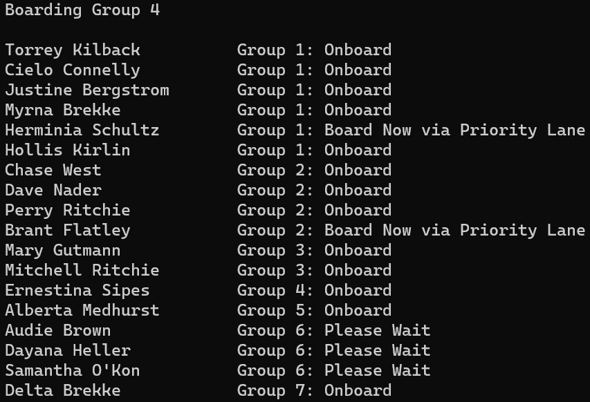
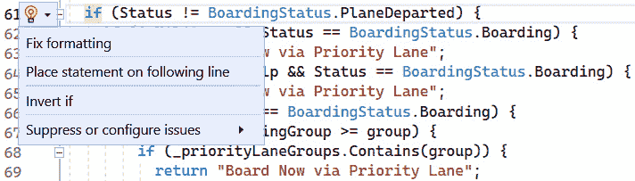
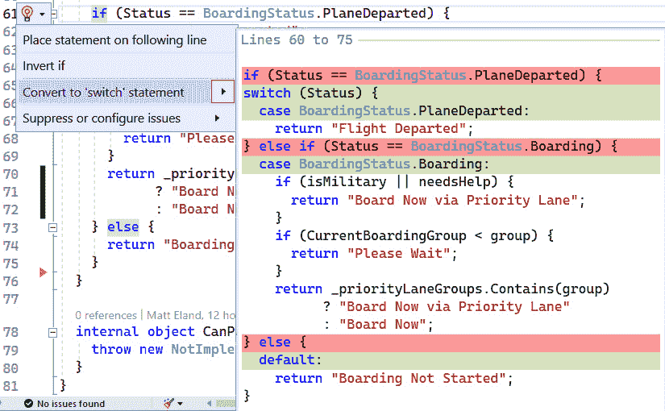
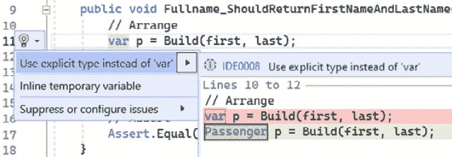
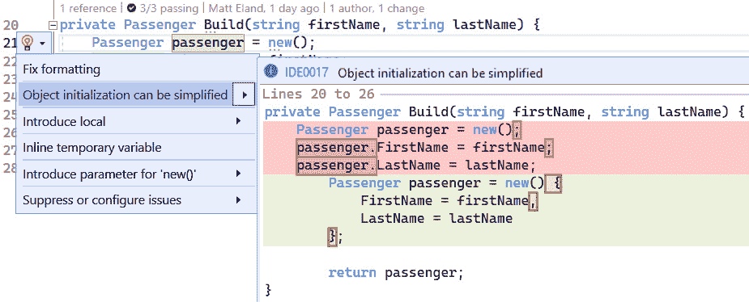
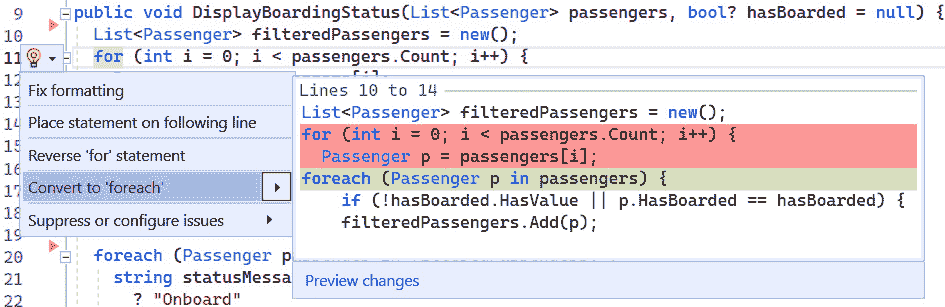
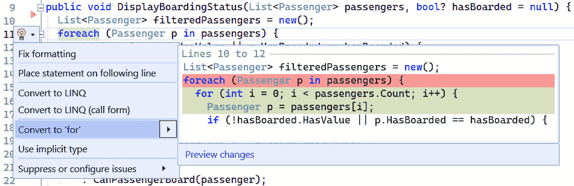
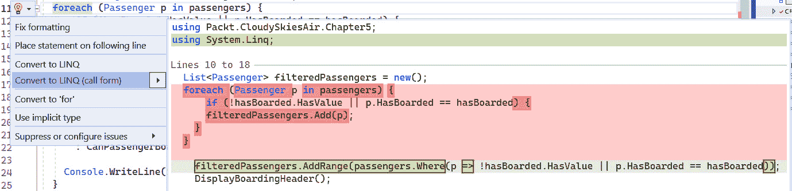
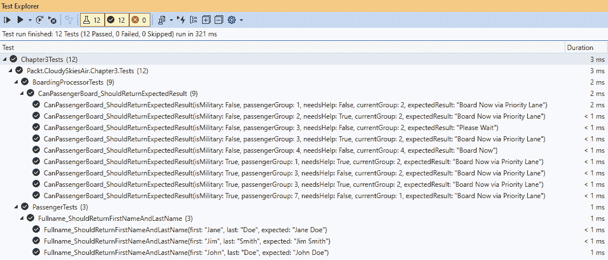

# 代码流和迭代的重构

虽然第一部分的其他章节专注于可以应用于整个方法或类的重构，但本章专注于提高单个代码行的可读性和效率。

开发者大部分时间都在阅读单个代码行，而只有一小部分时间在修改代码。因此，使我们的代码尽可能易于维护是很重要的。

在本章中，我们将探讨与改进代码小片段相关的一些主题：

+   控制程序流程

+   实例化对象

+   遍历集合

+   重构 LINQ 语句

+   审查和测试重构后的代码

# 技术要求

本章的起始代码可在 GitHub 的[`github.com/PacktPublishing/Refactoring-with-CSharp`](https://github.com/PacktPublishing/Refactoring-with-CSharp)的`Chapter03/Ch3BeginningCode`文件夹中找到。

# 重构登机应用程序

本章的代码专注于 Cloudy Skies Airline 的成对应用程序：

+   一个**登机状态显示应用程序**，根据当前登机组和乘客的机票、军事状态以及他们是否需要帮助通过登机桥，告诉用户是否是登机时间。

+   一个允许航空公司员工查看即将登机的乘客并获取每位乘客登机信息的**登机亭应用程序**。**图 3.1**.1 展示了应用程序的实际运行情况：



图 3.1 – 登机亭应用程序

由于我们正在探索的不是单一的应用程序，而是两个应用程序，因此我们将随着本章的进展逐步遇到应用程序代码。然而，如果您想先熟悉一下，请随时在 GitHub 上自行查看。

随着我们进入本章，我们将查看其现有的功能代码，并看看通过使用各种 C#语言特性的小重构步骤如何提高代码的可维护性。

我们将首先看看重构如何改进代码的整体流程。

# 控制程序流程

新的开发者学习到最基本的事情之一是程序如何按顺序执行代码行，以及**if 语句**和其他语言特性如何控制接下来执行哪些语句。

在本节中，我们将重点关注`BoardingProcessor`类的`CanPassengerBoard`方法。该方法开始得很简单：

```cs
public string CanPassengerBoard(Passenger passenger) {
  bool isMilitary = passenger.IsMilitary;
  bool needsHelp = passenger.NeedsHelp;
  int group = passenger.BoardingGroup;
```

在这里，`CanPassengerBoard`接受一个`Passenger`对象并返回一个字符串。该方法还声明了一些局部变量，用于存储从传入的对象中获取的数据片段。

这些变量不是必需的，可以通过执行内联变量重构来移除，我们将在本章后面讨论。然而，由于它们提高了后续代码的可读性，它们的存在在很大程度上是有帮助的。这也是我们有时引入局部变量的原因之一，正如我们在*第二章*中讨论的那样。

如此逻辑的后续部分会变得难以阅读，如下所示：

```cs
 if (Status != BoardingStatus.PlaneDeparted) {
   if (isMilitary && Status == BoardingStatus.Boarding) {
      return "Board Now via Priority Lane";
   } else if (needsHelp&&Status==BoardingStatus.Boarding) {
      return "Board Now via Priority Lane";
   } else if (Status == BoardingStatus.Boarding) {
      if (CurrentBoardingGroup >= group) {
         if (_priorityLaneGroups.Contains(group)) {
            return "Board Now via Priority Lane";
         } else {
           return "Board Now";
         }
      } else {
         return "Please Wait";
      }
   } else {
      return "Boarding Not Started";
   }
 } else {
   return "Flight Departed";
 }
}
```

此方法主要使用`if`/`else`语句，还有一些散布的变量声明和定期的返回语句。这些是计算机编程的基本结构，但需要一点时间才能理解这段代码真正做了什么。

对于那些不想整理逻辑的人来说，此代码遵循以下规则：

+   如果飞机已经起飞，则返回`"``Flight Departed"`

+   如果飞机尚未开始登机，则返回`"Boarding` `Not Started"`

+   如果飞机正在登机且乘客需要帮助或为现役军人，则返回`"Board Now via` `Priority Lane"`

+   如果飞机正在登机而乘客的组尚未登机，则返回`"``请等待"`

+   如果乘客的组可以登机，告诉他们通过正常通道登机，或者如果他们的登机组是优先组之一，则通过优先通道登机

然而，代码足够复杂，弄清楚这些规则可能需要一些时间，而复杂性导致了不确定性，使得其他人难以完全理解这些规则。

如果你打算维护代码，理解这些规则是很重要的。因此，提高代码的可读性对于代码的长期成功至关重要。

## 反转 if 语句

简化涉及嵌套`if`语句的复杂逻辑的最快技巧之一可能是反转`if`语句并提前返回。

目前，我们的高级逻辑看起来是这样的：

```cs
if (Status != BoardingStatus.PlaneDeparted) {
  // 17 lines of additional if statements and conditions
} else {
  return "Flight Departed";
}
```

当我们回到与飞机起飞检查相关的`else`语句时，读者已经忘记了最初的`if`语句是什么了！

在这里，由于`else`分支非常简单且易于理解，通过以下操作反转`if`语句是有帮助的：

1.  交换`if`块和`else`块的内容。

1.  在`if`语句中反转布尔表达式。当反转`==`时，它变为`!=`，反之亦然。在执行`>`或`<`检查的情况下，您会翻转操作数并切换是否包含相等性。根据这些规则，`>=`变为`<`，而`<=`变为`>`。

在我们的情况下，我们检查`Status != BoardingStatus.PlaneDeparted`。在这种情况下，我们将`!=`改为`==`并得到以下结果：

```cs
Status == BoardingStatus.PlaneDeparted
```

这些步骤保留了程序现有的行为，但改变了代码中语句的顺序。这可以提高我们源代码的可读性。

如果这听起来很复杂，不要担心，因为 Visual Studio 有一个名为**反转 if**的**快速重构**操作，如图*图 3**.2*所示：



图 3.2 – 反转 if 快速重构操作

在这里执行重构实际上将我们的逻辑更改为以下内容：

```cs
if (Status == BoardingStatus.PlaneDeparted) {
  return "Flight Departed";
} else {
  // 17 lines of additional if statements and conditions
}
```

由于读者不再需要记住`if`语句甚至 17 行后的内容，所以这更容易阅读，但代码还可以进一步改进。

## 在返回语句之后省略 else 语句

由于`return`语句总是立即退出方法，所以在`return`语句之后你永远不会显式地需要`else`语句，因为你知道如果你到达了`return`语句，`if`块之后的逻辑不会执行。

这让我们可以删除`else`关键字及其大括号。然后，我们可以缩进之前在`else`块中的代码。

结果代码保留了`if`语句：

```cs
if (Status == BoardingStatus.PlaneDeparted) {
  return "Flight Departed";
}
```

在这个语句之后，接下来的代码现在与原始的`if`语句处于相同的缩进级别，更容易阅读和理解：

```cs
if (isMilitary && Status == BoardingStatus.Boarding) {
  return "Board Now via Priority Lane";
} else if (needsHelp&&Status == BoardingStatus.Boarding) {
  return "Board Now via Priority Lane";
} else if (Status == BoardingStatus.Boarding) {
  if (CurrentBoardingGroup >= group) {
     if (_priorityLaneGroups.Contains(group)) {
        return "Board Now via Priority Lane";
     } else {
        return "Board Now";
     }
  } else {
     return "Please Wait";
  }
} else {
  return "Boarding Not Started";
}
```

如果我们想的话，我们可以重复这个重构几次，因为代码中还有几个`if`/`return`/`else`序列。

我会暂时留下这些，因为还有另一个重构我想展示，可以帮助我们处理这里看到的问题。

## 重新结构化`if`语句

看看之前的代码，一些逻辑显得重复：

```cs
if (isMilitary && Status == BoardingStatus.Boarding) {
  return "Board Now via Priority Lane";
} else if (needsHelp&&Status == BoardingStatus.Boarding) {
  return "Board Now via Priority Lane";
} else if (Status == BoardingStatus.Boarding) {
  // Code omitted for brevity
} else {
  return "Boarding Not Started";
}
```

在这里，我们有一个`if`/`else`链，其中三个不同的事物正在检查航班是否正在登机。尽管这三个`if`语句各不相同，但它们之间有足够的重叠，这让我质疑我们是否可以减少重复。

我们可以考虑的第一个选项可能是一个简单的*引入局部变量*重构，就像我们在*第二章*中看到的那样：

```cs
bool isBoarding = Status == BoardingStatus.Boarding;
if (isMilitary && isBoarding) {
  return "Board Now via Priority Lane";
} else if (needsHelp && isBoarding) {
  return "Board Now via Priority Lane";
} else if (isBoarding) {
  // Code omitted for brevity
} else {
  return "Boarding Not Started";
}
```

我认为这个代码更容易阅读，尽管我们因为新的局部变量而多了一行。然而，让我们采取一个稍微不同的方法。

而不是引入一个变量，我们可以重新排列我们的`if`语句以增加一个嵌套层：

```cs
if (Status == BoardingStatus.Boarding) {
  if (isMilitary) {
     return "Board Now via Priority Lane";
  } else if (needsHelp) {
     return "Board Now via Priority Lane";
  } else {
     // Code omitted for brevity
  }
} else {
  return "Boarding Not Started";
}
```

在这里，从一组`if`语句中提取一个公共条件到外部的`if`语句有助于澄清这些`if`语句，尽管这样做是以牺牲额外的嵌套级别为代价的。

然而，这种简化有助于发现一些其他的重构机会，例如将`isMilitary`和`needsHelp`检查合并，因为如果其中任何一个为真，它们会返回相同的值：

```cs
if (isMilitary || needsHelp) {
  return "Board Now via Priority Lane";
}
```

我们还可以在`if`/`return`代码之后删除`else`语句，以便进一步缩进代码，只留下登机组逻辑：

```cs
if (CurrentBoardingGroup >= group) {
  if (_priorityLaneGroups.Contains(group)) {
     return "Board Now via Priority Lane";
  } else {
     return "Board Now";
  }
} else {
  return "Please Wait";
}
```

这看起来像是我们可以反转`if`并删除`else`语句以进一步简化代码的另一个地方。记住，我们必须将`>=`改为`<`才能做到这一点：

```cs
if (CurrentBoardingGroup < group) {
  return "Please Wait";
}
if (_priorityLaneGroups.Contains(group)) {
  return "Board Now via Priority Lane";
} else {
  return "Board Now";
}
```

如你所见，随着我们简化代码，代码的可读性显著提高。

让我们退一步，看看这些重构之后的条件逻辑：

```cs
if (Status == BoardingStatus.PlaneDeparted) {
  return "Flight Departed";
}
if (Status == BoardingStatus.Boarding) {
  if (isMilitary || needsHelp) {
     return "Board Now via Priority Lane";
  }
  if (CurrentBoardingGroup < group) {
     return "Please Wait";
  }
  if (_priorityLaneGroups.Contains(group)) {
     return "Board Now via Priority Lane";
  } else {
     return "Board Now";
  }
} else {
  return "Boarding Not Started";
}
```

代码现在更容易阅读，也更难误解。我们可以反转登机状态检查以提前返回，但在这里我们会做其他的事情。

让我们看看如何通过更分化的语言特性：三元运算符，进一步减少我们的行数。

## 使用三元运算符

如果你喜欢三元运算符，你可能会注意到在重构过程中我们可以使用它的机会。

对于那些不熟悉或不完全熟悉三元条件运算符的人来说，可以将其视为一种“如果我的条件为真使用这个值，否则使用另一个值”类型的运算符。

三元运算符的语法是`boolExpression ? trueValue : falseValue;`。

换句话说，你可以像这样编写没有三元运算符的代码：

```cs
int value;
if (someCondition) {
  value = 1;
} else {
  value = 2;
}
```

然而，相同的代码可以使用单行中的三元运算符来编写：

```cs
int value = someCondition ? 1 : 2;
```

如您所见，三元运算符让我们将六行代码压缩成一行。这种简洁性是那些喜欢在代码中使用三元运算符的人的关键因素。

不太喜欢三元运算符的人经常指出，三元运算符难以阅读——尤其是在快速阅读代码时。换句话说，虽然它们使代码更加简洁，但这种简洁性可能会在长期内减慢你的速度，因为代码的可维护性降低了。

让我们看看我们代码的一小部分，看看三元运算符是如何应用的：

```cs
  if (CurrentBoardingGroup < group) {
     return "Please Wait";
  }
  if (_priorityLaneGroups.Contains(group)) {
     return "Board Now via Priority Lane";
  } else {
     return "Board Now";
  }
```

在这里，我们正在检查当前登机组是否是优先组，然后根据`Contains`调用的结果告诉用户使用优先通道登机或正常登机。

由于我们是根据布尔表达式的结果返回单个值，我们可以用以下方式重写代码：

```cs
if (CurrentBoardingGroup < group) {
  return "Please Wait";
}
return _priorityLaneGroups.Contains(group)
        ? "Board Now via Priority Lane"
        : "Board Now";
```

这样可以将五行代码缩减到三行，或者如果你想在布尔表达式的同一行上放置`?`和`:`部分，则可以缩减到一行代码。

你可能已经注意到，这次重构现在将整个代码块置于一个位置，你可以根据登机组引入另一个三元运算符，`return "Please Wait"`，如果该表达式为真，如果表达式为假，则返回早期三元运算符表达式的结果：

```cs
return (CurrentBoardingGroup < group)
  ? "Please Wait"
  : _priorityLaneGroups.Contains(group)
     ? "Board Now via Priority Lane"
     : "Board Now";
```

虽然这是有效的 C#代码，但我可以证实，如果同事在代码审查时向我展示这样的代码，我可能会忍不住说出一些不太礼貌的话！

小贴士

记住：代码行数少并不总是等于更高的可维护性。

在个人层面，我倾向于在很多地方避免使用三元运算符，并且始终避免将三元运算符链式使用。然而，有时当我感觉某个代码片段适合使用三元运算符时，我也会使用它。

例如，有时一个方法非常简单，如果你使用三元运算符，就可以将其压缩成一行代码。这个特定的更改让你可以使用表达式主体成员功能，我们将在*第四章*中讨论。

当我使用三元运算符时，我会像之前展示的那样，将三元运算符表达式格式化为三行，第一行包含布尔表达式。第二行将包含`?`运算符和如果表达式为真时使用的值，第三行将包含`:`运算符和如果表达式为假时使用的值：

```cs
var myVar = booleanExpression
                    ? valueIfTrue
                    : valueIfFalse;
```

我发现这种方法在三元运算符的代码更简洁的优点和三元运算符使代码难以快速和准确地阅读的缺点之间找到了一个平衡点。

## 将 if 语句转换为 switch 语句

这种方法的逻辑现在更容易理解了，简化到这个层面突显了，根据当前的登机状态，我们正在做三件事情之一：

+   如果其状态是`PlaneDeparted`，则通知用户航班已起飞

+   检查军事状态、是否需要帮助登机以及`Boarding`状态的登机组

+   通知用户其他状态（`NotStarted`是目前唯一的其他状态）的登机尚未开始

当与枚举值一起工作时，这种分支逻辑很常见。

在我们的情况下，我们的`enum`值只有三种状态：

BoardingStatus.cs

```cs
public enum BoardingStatus {
  NotStarted = 0,
  Boarding = 1,
  PlaneDeparted = 2,
}
```

在你发现自己正在检查不同值相同的变量时，你通常可以将它们重写为使用**switch** **语句**。

`switch`语句本质上是一系列简化的`if`/`else` `if`/`else`类型的检查，它们都检查相同的值，就像我们的代码检查`Status`一样。我们很快就会看到一个`switch`语句的例子，但如果你不熟悉它们，你可以将它们视为编写一系列相关`if`/`else` `if`语句的另一种方式。

这可以手动完成，或者如果你的代码是`if`/`else` `if`/`else`类型的结构，你可以使用 Visual Studio 中内置的特定重构，如下面的代码所示：

```cs
if (Status == BoardingStatus.PlaneDeparted) {
  return "Flight Departed";
} else if (Status == BoardingStatus.Boarding) {
  if (isMilitary || needsHelp) {
     return "Board Now via Priority Lane";
  }
  if (CurrentBoardingGroup < group) {
     return "Please Wait";
  }
  return _priorityLaneGroups.Contains(group)
           ? "Board Now via Priority Lane"
           : "Board Now";
} else {
  return "Boarding Not Started";
}
```

注意，我在之前的代码中确实添加了`else`关键字（在上一个代码片段中加粗），以便进入那个`if`/`else` `if`/`else`结构，这使得 Visual Studio 能够识别我们即将使用的重构。

一旦我们有了这种模式的代码，选择了`if`语句，如图*图 3.3*所示：



图 3.3 – 转换为“switch”语句的重构选项

这种重构使我们的基于状态的逻辑更加明显：

```cs
switch (Status) {
  case BoardingStatus.PlaneDeparted:
     return "Flight Departed";
  case BoardingStatus.Boarding:
     if (isMilitary || needsHelp) {
        return "Board Now via Priority Lane";
     }
     if (CurrentBoardingGroup < group) {
        return "Please Wait";
     }
     return _priorityLaneGroups.Contains(group)
              ? "Board Now via Priority Lane"
              : "Board Now";
  default:
     return "Boarding Not Started";
}
```

作为阅读此代码的人，我发现与`if`/`else if`/`else`链相比，这种方法更容易扫描和解释，尽管逻辑功能相同。使用`if`/`else` `if`/`else`语句时，我*可能*会注意到逻辑正在多次比较相同的值，而`switch`语句则使这一点明确。

使用`switch`语句的另一个好处是，当你的`switch`比较一个`enum`值（例如`BoardingStatus`）并且你缺少一个或多个`enum`值的 case 时，它会解锁一个内置的重构选项。

这个选项在`switch`语句的**快速操作**菜单中显示为**添加缺失的 case**，如图*图 3.4*所示：


图 3.4 – 快速操作菜单中的“添加缺失情况”重构选项

警告

我想指出的是，`NotStarted` 状态应该通过 `break` 语句跳出 `switch`，而不是像之前那样通过 `default` 关键字返回值。

在此情况下，C# 编译器会为我们标记这个错误，因为该方法不会为这个路径返回值，但在 `switch` 语句中存在 `default` 情况时添加缺失的情况通常会导致行为发生变化。

在我们的情况下，我们可以将 `NotStarted` 状态与默认情况合并，得到一个更明确的选项列表：

```cs
switch (Status) {
  case BoardingStatus.PlaneDeparted:
     return "Flight Departed";
  case BoardingStatus.Boarding:
     if (isMilitary || needsHelp) {
        return "Board Now via Priority Lane";
     }
     if (CurrentBoardingGroup < group) {
        return "Please Wait";
     }
     return _priorityLaneGroups.Contains(group)
              ? "Board Now via Priority Lane"
              : "Board Now";
  case BoardingStatus.NotStarted:
  default:
     return "Boarding Not Started";
}
```

这段代码现在比之前更容易阅读，并且通过状态逻辑的流程现在一目了然。

在实际应用中，我可能会将默认情况改为抛出异常，明确告诉我特定的 `Status` 不支持此逻辑。这看起来可能像以下逻辑：

```cs
case BoardingStatus.NotStarted:
  return "Boarding Not Started";
default:
 throw new NotSupportedException($"Unsupported: {Status}");
```

我还可能想要执行 *提取方法* 重构——正如我们在 *第二章* 中所看到的——将处理登机状态的逻辑移动到它自己的方法中。然而，我将推迟这样做，以展示 `switch` 表达式。

## 转换为 `switch` 表达式

**Switch 表达式** 是对 `switch` 语句的一种进化，它依赖于 **模式匹配** 表达式来简化并扩展 `switch` 语句内部可能实现的功能。

`switch` 表达式是 C# 中相对较新的功能，于 2019 年作为 C# 8 的一部分发布。尽管在撰写本文时已经过去几年了，但我仍然觉得 `switch` 表达式足够新，以至于许多 C# 开发者对它们不熟悉或不熟练。

一个简单的 `switch` 表达式看起来很像 `switch` 语句：

```cs
return Status switch {
  BoardingStatus.PlaneDeparted => "Flight Departed",
  BoardingStatus.NotStarted => "Boarding Not Started",
  BoardingStatus.Boarding => "Board Now",
  _ => "Some other status",
};
```

这些 `switch` 表达式看起来与 `switch` 语句非常相似，除了以下方面：

+   它们以你想要评估的值开始，后面跟着 `switch` 关键字，而不是以 `switch (value)` 开始

+   我们不使用 `case` 或 `break` 关键字

+   单个情况有一些条件，可能在左侧为真，然后是一个箭头符号 (`=>`)，以及如果左侧的条件为真，则在右侧使用的值。

+   我们没有使用 `default` 关键字，而是用 `_` 表示任何其他匹配项。

`switch` 表达式的一个优点是它们非常简洁，同时仍然具有一定的可读性。然而，`switch` 表达式的功能远不止我之前所展示的。

你可能已经注意到我之前引入的示例 `switch` 表达式没有充分处理登机逻辑。具体来说，我们为现役军人、需要登机帮助的人、登机组和优先通道制定了规则，而这些都没有在前面的代码块中表示出来。

让我们看看一个处理这些情况的 `switch` 表达式：

```cs
return Status switch {
  BoardingStatus.PlaneDeparted => "Flight Departed",
  BoardingStatus.NotStarted => "Boarding Not Started",
  BoardingStatus.Boarding when isMilitary || needsHelp
     => "Board Now via Priority Lane",
  BoardingStatus.Boarding when CurrentBoardingGroup < group
     => "Please Wait",
  BoardingStatus.Boarding when
   _priorityLaneGroups.Contains(group)
     => "Board Now via Priority Lane",
  BoardingStatus.Boarding => "Board Now",
  _ => "Some other status",
};
```

这段代码与我们在上一节中看到的 `switch` 表达式略有不同。在这里，`Boarding` 状态重复了四次，有时还伴随着 `when` 关键字。

这段代码所做的是使用模式匹配来检查不仅 `Status` 是 `Boarding`，而且其他条件也成立。实际上，我们能够检查状态，并在 `when` 关键字之后可选地检查另一个布尔表达式。

如果两个条件都不成立，`switch` 表达式将按顺序评估下一行。这使得 `switch` 表达式成为一组匹配规则，确保第一条规则评估为真。

模式匹配

模式匹配是一种较新的 C# 语法，允许您简洁地检查对象和变量的不同属性和方面。我们将在*第十章*“防御性编码技术”中更深入地探讨模式匹配语法，但本节将作为对其一些功能的良好介绍。

换句话说，这个 `switch` 表达式检查以下规则，并对第一个为真的规则做出反应：

1.  飞机已经起飞。

1.  登机尚未开始。

1.  登机已经开始，乘客是现役军人或需要帮助。

1.  乘客的登机组尚未被召唤。

1.  乘客的登机组正在登机，并且是优先通道组。

1.  乘客的登机组正在登机，但他们不在优先登机通道。

1.  其他任何状态

`switch` 表达式简洁，允许您将 `switch` 语句的结构化清晰性与模式匹配和 `when` 关键字的力量结合起来，使非常易读的有序逻辑明显。

就像您编程工具箱中的任何工具一样，`switch` 表达式并不是解决每个问题的方案，您和您的团队可能不会像我一样喜欢阅读 `switch` 表达式。然而，它们仍然是您工具箱中一个宝贵的工具，可以帮助简化代码，同时保持其易于阅读、维护和扩展。

我们将在*第十章*中回顾一些模式匹配语法，但让我们继续看看我们可以如何改进处理对象集合的工作。

# 实例化对象

现在我们已经足够改进了 `CanPassengerBoard` 方法，让我们看看我们如何创建对象，并看看您可以进行的一些简单改进，这将简化代码中的对象**实例化**。

术语说明

新的开发者经常被一些开发者常用的短语所困扰。例如，在本节中，我们将讨论实例化对象。这是开发者常用的说法，但这仅仅意味着使用 `new` 关键字创建类的特定*实例*的过程。当您看到术语实例化时，您可以简单地将其视为创建某个特定实例的过程。

这部分的代码可能来自任何地方，但我们将关注本章附带测试项目中 `PassengerTests.cs` 文件中找到的一对方法中的代码。

## 将 `var` 替换为显式类型

我想要关注的代码第一行来自我们的一些单元测试：

PassengerTests.cs

```cs
var p = Build(first, last);
```

在这里，我故意省略了代码周围的上下文，以强调一个观点，这个观点是：花点时间，尝试确定 `p` 变量的数据类型。

`p` 存储了 `Build` 的结果，`Build` 接受一个名为 `first` 和 `last` 的参数对，但仅从这一行我们无法自信地断定 `p` 包含的数据类型。

这是因为 `p` 是用 `var` 关键字声明的。`var` 关键字是一种简写方式，意思是“嘿，编译器，当你编译这段代码时，我希望你确定这个数据类型，并在编译后的代码中将 `var` 关键字替换为实际的数据类型。”

换句话说，`var` 通常是为了不输入数据类型的完整名称而简化的快捷方式。然而，它带来一个小小的代价，那就是它使得阅读变量包含的数据类型变得更困难。

这对于具有复杂数据类型（如 `IDictionary<Guid, HashSet<string>>`）的情况是有意义的，但对于短类型名（如 `int`）可能会有些荒谬。

`var` 的其他用法

`var` 关键字确实有其他用途，超出了我这里所描述的。例如，它可以在大多数代码库中轻松存储 `var`。

Visual Studio 允许你悬停在变量声明上，并查看实际使用的类型。在这种情况下，`p` 代表一个 `Passenger` 对象，但这仍然会减慢你的阅读速度。

相反，我建议你利用内置的 **使用显式类型代替 'var'** 重构功能。参见 *图 3.5*：



图 3.5 – 使用显式类型

这使得你的代码更容易阅读：

```cs
Passenger p = Build(first, last);
```

当然，`var` 存在是有原因的，它被引入是为了解决某些问题，包括赋值语句中的冗余。接下来，我们将看看 **目标类型的新** 关键字，它为解决这个问题提供了不同的解决方案。

## 使用目标类型的新简化创建

`var` 关键字被构建来帮助处理如下变量实例化之类的行：

```cs
private Passenger Build(string firstName, string lastName){
     Passenger passenger = new Passenger();
     passenger.FirstName = firstName;
     passenger.LastName = lastName;
     return passenger;
}
```

当我们实例化一个新的 `Passenger` 对象并将其分配给新的乘客变量时，我们在赋值操作符（`=`）的左右两侧稍微重复了 `Passenger` 类的名称。

`var` 关键字允许我们将创建此对象的简化到仍然可读的语法 `var passenger = new Passenger();`。在这里，`var` 允许我们通过缩写用于新变量的类型来简化赋值语句的左侧。

C# 9 引入了**目标类型的新**关键字，它允许我们通过有效地说明我们正在实例化的类的类型与作为赋值运算符目标的作用变量相同，从而简化赋值运算符右侧的语法。

换句话说，目标类型的新语法是告诉 C# 创建与我们将要存储值的变量相同类型的对象的一种方式。这允许我们避免使用 `var` 并避免重复：

```cs
Passenger passenger = new();
```

我非常喜欢这种语法，并且倾向于在我的所有代码中使用它。第一次看到这个特性时，它可能会让其他开发者感到一些困惑，但这只是一个微不足道的单次代价，因为它同时保持了代码的简洁和可读性。

小贴士

Visual Studio 在**快速操作**菜单中提供了一个**使用‘new(…)’**选项，这将允许你将传统的对象实例化转换为目标类型的新语法。

当我们谈论创建对象时，让我们看看**对象初始化器**如何在创建对象时帮助设置属性。

## 使用对象初始化器

让我们再次看看上一个示例中的 `Build` 方法，同时关注配置创建的乘客对象：

```cs
private Passenger Build(string firstName, string lastName){
     Passenger passenger = new();
     passenger.FirstName = firstName;
passenger.LastName = lastName;
     return passenger;
}
```

这段代码本身并不差，但它确实有点重复。

具体来说，代码通过在每行将 `passenger.` 放在属性前面，然后在分配值之前为该属性赋值，重复了它配置的对象的信息。

这对于只有两个属性来说非常简洁。但想象一下，如果你有一个具有 10 个或更多属性的大型对象需要配置，这段代码会变得非常重复，甚至可能会分散对正在配置的属性名称的注意力。

虽然使用接受表示属性值的参数的构造函数是一种解决方案（我们将在下一章中探讨），另一种解决方案是使用**对象初始化器**。正如你可能猜到的，Visual Studio 为此提供了一个**快速操作**重构，尽管名称**对象初始化可以简化**（如图 3.6 所示）有些不寻常：



图 3.6 – 简化对象初始化

使用这种重构可以将我们的代码转换成更简洁的格式：

```cs
private Passenger Build(string firstName, string lastName){
     Passenger passenger = new() {
           FirstName = firstName,
LastName = lastName
     };
     return passenger;
}
```

我非常喜欢这种语法，并且它与 `init` 和 `required` 属性配合得非常好，我们将在*第十章*“防御性编码技术”中探讨这些属性。然而，使用对象初始化器也有一个缺点：堆栈跟踪。

当你有一个设置对象多个不同属性的初始化器，并且发生异常来计算要存储的值时，异常不会指出错误发生在哪一行代码或哪个属性即将被更新，而只是表明它在初始化器中的某个地方发生了。

另一方面，如果你使用多行设置单个属性，异常详细信息将标识有问题的行。当然，这可能是一个避免在可能产生异常的初始化器中进行计算的论据。

当我们讨论`init`、`required`和`with`表达式时，我们将在*第十章*中更详细地回顾初始化器，但就目前而言，让我们继续讨论集合。

# 遍历集合

要开始探索集合，让我们回到`BoardingProcessor`类，看看它的`DisplayPassengerBoardingStatus`方法。我们将一次探索这个方法的一部分，从它的方法签名开始：

```cs
public void DisplayBoardingStatus(
  List<Passenger> passengers, bool? hasBoarded = null) {
```

在这里，我们可以看到该方法接受一个`Passenger`对象列表，以及一个可选的可空布尔参数`hasBoarded`，它可以存储`true`、`false`或`null`。这个`hasBoarded`参数用于根据其值可选地过滤我们的乘客列表：

+   `true`：仅包括已经登机的乘客

+   `false`：仅包括尚未登机的乘客

+   `null`：不按登机状态过滤（默认选项）

在构建搜索方法时，我经常看到这种可空的过滤参数，我们将在*第五章* *面向对象重构*中更深入地探讨它。

`DisplayBoardingStatus`中的下一部分代码处理过滤逻辑：

```cs
  List<Passenger> filteredPassengers = new();
  for (int i = 0; i < passengers.Count; i++) {
     Passenger p = passengers[i];
     if (!hasBoarded.HasValue || p.HasBoarded==hasBoarded) {
        filteredPassengers.Add(p);
     }
  }
```

这是我们将在本节剩余部分重点关注的代码部分。它通过遍历`passengers`中的乘客并条件性地将其添加到我们的新乘客名单中，构建了一个与用户选择的过滤选项相匹配的新乘客名单。

术语说明

**迭代**某个东西是另一个让新开发者感到困惑的术语。它仅仅意味着遍历集合中的每个项目。

该方法剩余部分专注于在登机柜台向代理人显示乘客：

```cs
  DisplayBoardingHeader();
  foreach (Passenger passenger in filteredPassengers) {
     string statusMessage = passenger.HasBoarded
        ? "Onboard"
        : CanPassengerBoard(passenger);
     Console.WriteLine($"{passenger.FullName,-23} Group         {passenger.BoardingGroup}: {statusMessage}");
  }
}
```

实际上，对于我们要显示的每一位乘客，我们都会写出他们的名字、登机组和他们在登机应用上看到的消息，或者如果他们已经登机，则是`"Onboard"`。

总体而言，这个方法很简单，代码行数不到 20 行，这往往会导致易于维护的代码。

话虽如此，让我们看看我们可以如何改进这段代码。

## 介绍 foreach

再看看代码，将乘客名单过滤到一个新的乘客名单中：

```cs
List<Passenger> filteredPassengers = new();
for (int i = 0; i < passengers.Count; i++) {
  Passenger p = passengers[i];
  if (!hasBoarded.HasValue || p.HasBoarded == hasBoarded) {
     filteredPassengers.Add(p);
  }
}
```

虽然这段代码并不复杂，但让我印象深刻的一点是我们正在使用`for`循环来枚举乘客。在这个循环内部，我们除了通过索引从列表中获取乘客之外，并没有对索引变量`i`做任何事情。

当你有一个像这样的`for`循环，它没有做任何复杂的事情（例如，从列表的任何地方开始，反向循环，或者跳过每隔一个项目），你通常可以用`foreach`循环来替换这个循环。

要将 `for` 循环转换为 `foreach` 循环，您可以选中 `for` 循环，然后使用 Visual Studio 中内置的 **转换为`foreach`** 重构功能（*图 3**.7*）：



图 3.7 – 快速操作菜单中的“转换为‘foreach’”重构选项

这将转换为 `foreach` 循环，并完全消除了变量声明：

```cs
List<Passenger> filteredPassengers = new();
foreach (Passenger p in passengers) {
  if (!hasBoarded.HasValue || p.HasBoarded == hasBoarded) {
     filteredPassengers.Add(p);
  }
}
```

我在可能的地方都使用 `foreach`，因为它不仅消除了变量声明和使用索引器的需要，而且使整体代码更容易阅读。

*几乎所有* 的 `for` 循环都是从 0 开始，逐个元素地循环到集合的末尾，但并非每个 `for` 循环都是这样。因此，每次我阅读一个 `for` 循环时，我都需要检查它是否是一个标准的 `for` 循环，或者它是否有特殊之处。使用 `foreach` 循环时，我不需要这样做，因为语法不支持它。这增加了阅读的舒适度和速度，并通过简洁性提高了代码的可维护性。

此外，`foreach` 循环可以与实现 `IEnumerable` 的任何东西一起使用，而 `for` 循环要求它们循环的集合具有索引器。这意味着 `foreach` 循环可以循环比 `for` 循环更多的集合类型。

集合接口

.NET 提供了几个集合接口，包括 `IEnumerable`、`ICollection`、`IList`、`IReadOnlyList` 和 `IReadOnlyCollection`。了解这些集合类型有助于阅读本书，但不是必需的。请参阅本章末尾的 *进一步阅读* 部分，以获取有关这些接口的更多信息，但就现在而言，要知道 `IEnumerable` 接口只是指可以在 `foreach` 循环中循环的某种东西的一种更复杂的方式。

## 转换为 for 循环

虽然 `foreach` 循环很棒，并且在我的大多数情况下是默认循环，但有时你可能想要有一个 `for` 循环以获得更多控制。如果你需要以非标准方式循环集合，或者需要使用索引变量进行除读取集合变量之外的其他操作，你通常将想要使用 `for` 循环。

Visual Studio 为我们提供了将 `foreach` 循环转换为 `for` 循环的功能。参见 *图 3**.8*：



图 3.8 – 将 foreach 循环转换回 for 循环

我并不经常使用这种重构，但当你需要时它很方便。

现在，让我们暂时将代码留在 `foreach` 循环中，看看 LINQ 如何帮助我们改进它。

## 转换为 LINQ

你可能已经注意到，在 *图 3**.8* 中，有一对建议将 `foreach` 循环转换为 LINQ。

`IEnumerable`。这允许你使用箭头函数对该集合执行快速聚合、转换和过滤操作。

箭头函数

箭头函数（也称为 Lambda 表达式）使用“胖箭头”(`=>`)语法以缩略格式表示小方法。本书假设你对箭头函数有基本了解。如果你需要更多信息或想要复习箭头函数的工作方式，请参阅本章的*进一步阅读*部分。

让我们看看当我们使用 `foreach` 循环的**快速操作**菜单时，我们的 `foreach` 循环会发生什么变化：



图 3.9 – 将 foreach 循环转换为使用 LINQ

此重构将我们的 `foreach` 循环转换成极小的一部分代码：

```cs
List<Passenger> filteredPassengers = new();
filteredPassengers.AddRange(passengers.Where(p => !hasBoarded.HasValue || p.HasBoarded == hasBoarded));
```

此代码获取我们的 `passengers` 集合并调用 `Where` 扩展方法。`Where` 方法将创建并返回一个新的 `IEnumerable` 序列，其中只包含 `passengers`，其中箭头函数 `p => !hasBoarded.HasValue || p.HasBoarded == hasBoarded` 对该乘客返回值为 `true`。

扩展方法

扩展方法是在静态类中定义的静态方法，允许你构建看起来像为现有类型添加新方法的语法。LINQ 严重依赖于附加到各种接口的扩展方法。我们将在*第四章*中探讨创建扩展方法。

这不会修改我们的原始集合，而是创建一个新的 `Passenger` 对象集合，然后将其传递到 `filteredPassengers.AddRange` 方法中。

虽然这段代码已经很简洁了，但我们可以通过利用泛型 `List` 类的构造函数来进一步改进它。

`List<T>` 类有一个构造函数，它接受一个 `IEnumerable<T>` 接口，并允许你围绕一系列元素高效地创建一个新的列表。这将使我们避免需要 `AddRange` 调用，并有助于将我们的代码简化到单条语句：

```cs
List<Passenger> filteredPassengers =
  new(passengers.Where(p => !hasBoarded.HasValue ||
      p.HasBoarded == hasBoarded));
```

如果我们愿意，我们也可以完全删除 `filteredPassengers` 变量，通过过滤乘客并将其重新赋值回自身：

```cs
passengers = passengers.Where(p=>!hasBoarded.HasValue ||
      p.HasBoarded==hasBoarded).ToList();
```

在这里，我们执行 `Where` 调用来生成包含我们的乘客的 `IEnumerable<Passenger>` 接口，然后在该 `IEnumerable` 接口上调用 `ToList` 方法，将其转换回 `List` 方法，以便它可以存储在 `passengers` 参数中。

此外，注意之前使用 `filteredPassengers` 的任何地方都需要更新为使用 `passengers`：

```cs
foreach (Passenger passenger in passengers) {
  string statusMessage = passenger.HasBoarded
     ? "Onboard"
     : CanPassengerBoard(passenger);
  Console.WriteLine($"{passenger.FullName,-23} Group 
     {passenger.BoardingGroup}: {statusMessage}");
}
```

我喜欢 LINQ，并认为它对于创建简单且可维护的应用程序非常有价值，但如果你不熟悉 LINQ 或不习惯阅读箭头函数（`=>`）的表示法，它可能需要一些习惯。

话虽如此，我确实在 LINQ 代码中看到了一些常见的错误。因此，在我们结束这一章之前，让我们看看其中的一些。

# 重构 LINQ 语句

在本章的最后部分，我们将通过关注大多数使用 LINQ 的代码库都将从中受益的一些常见改进，来回顾一些 LINQ 代码中更常见的优化。

## 选择正确的 LINQ 方法

LINQ 有几种不同的方法来在集合中查找特定的项。

如果你有一个名为`people`的`IEnumerable<Passenger>`接口，并且想通过他们的名字找到某人，你可能会编写如下代码：

LinqExamples.cs

```cs
PassengerGenerator generator = new();
List<Passenger> people = generator.GeneratePassengers(50);
Passenger me =
  people.FirstOrDefault(p => p.FullName == "Matt Eland");
Console.WriteLine($"Matt is in group {me.BoardingGroup}");
```

这段代码使用了 LINQ 的`FirstOrDefault`方法，该方法搜索集合直到找到箭头函数评估为`true`的第一个值。在这个例子中，它会找到第一个`FullName`设置为`"Matt Eland"`的人，从`FirstOrDefault`方法返回该值，并将其存储在名为`matt`的`Passenger`变量中。

然而，如果箭头函数没有返回任何`true`的项，`FirstOrDefault`将使用`Passenger`类型的默认值，对于像类这样的引用类型，这将是一个空值。

默认值

在.NET 中，`bool`类型的默认值是`false`，数值类型如`int`和`float`默认为`0`，而引用类型包括`string`、`List`和其他类默认为`null`。

换句话说，这个`FirstOrDefault`调用将会找到如果 Matt 存在于乘客中，则返回他；如果他没有，则返回`null`。

这个问题在于紧接着的下一行尝试读取`matt.BoardingGroup`的值。如果我们找到了元素，这没问题，但如果我们没有找到，这段代码在尝试访问`BoardingGroup`时将引发`NullReferenceException`错误，这很可能不是其作者的意图。

注意，我们如何修复这段代码取决于我们的期望是什么。

使用 LINQ，当你在一个集合中查找元素时，你需要决定两件事：

+   我是否可以接受多于一个项匹配我的箭头函数，或者我需要确保最多只有一个项返回`true`？

+   我是否可以接受我寻找的项目根本不存在？

第一个决定决定了你是否调用`First`或`Single`。使用`First`，逻辑将找到与查询匹配的第一个元素并返回它。然而，使用`Single`，逻辑将超出第一个匹配项，以确定集合中的任何其他元素是否也匹配该表达式。如果有一个匹配该表达式，将抛出一个`InvalidOperationException`错误，告诉你序列包含多个匹配元素。

大多数开发者不喜欢在运行代码时看到异常。然而，有时你需要知道你的查询是否有多于一个匹配项。一般来说，尽早失败比在更混乱的地方失败要好，那里隐藏着程序最初偏离轨道的地方。

当你在集合中查找元素时，你做出的第二个决定是接受不匹配查询的对象。如果这没问题，那么你通常会调用`FirstOrDefault`或`SingleOrDefault`（根据你之前是否允许多个匹配的决定）。然而，如果永远不能接受没有匹配项，那么你将使用`First`或`Single`而不是`FirstOrDefault`或`SingleOrDefault`。

如果序列中没有匹配的元素，`First`和`Single`都会抛出`InvalidOperationException`错误。如果你使用`First`或`Single`，并且集合中没有元素返回箭头函数的`true`，则会抛出异常。这使得无法处理`First`或`Single`的结果中的`null`值，这对于简化代码非常有帮助。

小贴士

当你的代码在遇到问题时抛出`InvalidOperationException`错误，这通常比在代码中 30 行后遇到`NullReferenceException`错误并需要找出值是如何到达预期位置的要有用得多。

防止出现`NullReferenceException`错误。我们将在*第十章*中更深入地探讨这个问题。

让我们继续讨论组合 LINQ 方法的方法。

## 组合 LINQ 方法

LINQ 的一个优点是它允许你通过在另一个 LINQ 方法的结果上调用 LINQ 方法来“链式连接”不同的方法。这让你可以做诸如使用`Where`过滤到项目子集、使用`OrderBy`重新排序结果以及通过`Select`将它们转换成新对象等事情。

然而，随着.NET 的发展，LINQ 为其现有方法增加了一些更专业的重载，这使得一些链式连接的方法变得不必要，甚至效率低下。

以以下代码块为例：

```cs
bool anyBoarded =
  people.Where(p => p.HasBoarded).Any();
int numBoarded =
  people.Where(p => p.HasBoarded).Count();
Passenger firstBoarded =
  people.Where(p => p.HasBoarded).First();
```

初看，这段代码看起来没问题。这三个变量赋值都是过滤然后查看过滤结果。当然，有引入局部变量`people.Where(p => p.HasBoarded)`的机会，但除此之外，代码在表面上看起来通常没问题。

然而，LINQ 提供了`Any`、`Count`、`First`和其他一些方法的重载版本，这些方法接受一个**谓词**（这只是一个箭头函数的华丽说法）。

这些重载版本允许你将`Where`方法和其他方法组合成一个更简洁的格式：

```cs
bool anyBoarded = people.Any(p => p.HasBoarded);
int numBoarded = people.Count(p => p.HasBoarded);
Passenger firstBoarded = people.First(p => p.HasBoarded);
```

这种写法不仅更简洁，而且在某些情况下可能更高效。

例如，在此之前，当我们执行`people.Where(p => p.HasBoarded).Any()`时，此代码从左到右进行评估，将大量项目过滤成一个更小的项目列表。一旦整个列表被过滤，就会调用`Any`方法，如果结果列表中至少有一个项目，则返回`true`。

将其与`people.Any(p => p.HasBoarded)`版本进行对比。这个方法遍历项目，一旦它看到任何从箭头函数返回`true`的元素，它就知道它可以停止评估，因为它的最终结果将是 true。

总是寻找使用这些专用 LINQ 重载的机会，因为它们可以产生非常简洁甚至更高效的代码。

## 使用 Select 进行转换

假设你想要创建一个列表，列出所有尚未登机的乘客的字符串。对于每个名字，你想要将其格式化为乘客的名字和登机组。因此，一个示例条目可能是`"Priya Gupta-7"`。

你可以像这样编写此代码：

```cs
List<string> names = new();
foreach (Passenger p in people) {
  if (!p.HasBoarded) {
     names.Add($"{p.FullName}-{p.BoardingGroup}");
  }
}
```

然而，LINQ 有一个名为`Select`的方法，允许你将项目从一种形式转换为另一种形式，这对于这种情况来说非常完美。

小贴士

对于那些有 JavaScript 背景的人来说，`Select`函数与`Map`函数类似。

这个`Select`版本看起来是这样的：

```cs
List<string> names =
        people.Where(p => !p.HasBoarded)
                 .Select(p => $"{p.FullName}-{p.BoardingGroup}")
                 .ToList();
```

在这里，`Where`调用将结果过滤到未登机的乘客，而`Select`调用将那些对象从`Passenger`对象转换为字符串。

`Select`不仅限于字符串。你可以选择对你相关的任何数据类型，包括整数、其他对象、列表，甚至是**匿名类型**或**元组**。

最终，无论你有一个形状的对象集合，并且你需要这些相同的对象但以不同的形式，`Select`都是一个值得考虑的好方法。

# 审查和测试重构后的代码

虽然我们在这章中没有修改很多代码，但我们修改的代码在尺寸上缩小了，因此在阅读、理解和修改过程中变得更加容易。

这就是为什么我们要重构。重构应该积极地提高我们应用程序的可维护性，并偿还那些可能在未来引入错误和延迟的战略性技术债务。

重构后的代码

本章最终的重构代码可在[`github.com/PacktPublishing/Refactoring-with-Csharp`](https://github.com/PacktPublishing/Refactoring-with-Csharp)仓库中的`Chapter03/Ch3RefactoredCode`文件夹中找到。

由于重构的艺术在于在不改变其功能的情况下改变代码的形式，我们必须在继续之前测试应用程序。

我们将在*第六章*中更多地讨论手动和自动测试，但到目前为止，通过在 Visual Studio 顶部选择**测试**菜单，然后点击**运行****所有测试**来运行测试。

这将显示**测试资源管理器**和一大片绿色勾号，如图*图 3.10*所示。



图 3.10 – 通过测试本章的代码

现在，让我们总结一下本章学到的内容。

# 摘要

在本章中，我们探讨了重构技术，以帮助更好地控制程序流程、实例化对象、遍历集合，并通过 LINQ 编写更高效的代码。

我们所讨论的每种重构技术都是你工具箱中的一个工具，它可能在适当的情境下提高你代码的可读性和可维护性。随着你不断练习重构，你会了解更多关于何时应用哪种重构来改进你正在工作的代码。

在下一章中，我们将从改进单个代码行转向一个更大的视角，当我们努力重构整个 C# 代码的方法时。

# 问题

回答以下问题以测试你对本章知识的掌握：

1.  简洁的代码和可读的代码哪个更重要？

1.  在你正在工作的项目中浏览代码文件。你注意到你的代码中的 `if` 语句有什么特点？

1.  嵌套的 `if` 语句使用频率如何？

1.  你的 `if` 语句的条件中是否有任何逻辑被频繁重复？

1.  你是否看到任何可以通过反转 `if` 语句或切换到 `switch` 语句或 `switch` 表达式来改进的地方？

1.  你认为你的团队在处理集合时是否已经充分利用了 LINQ 的潜力？你看到了哪些改进的机会？

# 进一步阅读

你可以通过阅读以下资源来找到更多关于本章讨论的材料的信息：

+   *Switch 表达式*：[`learn.microsoft.com/en-US/dotnet/csharp/language-reference/operators/switch-expression`](https://learn.microsoft.com/en-US/dotnet/csharp/language-reference/operators/switch-expression)

+   *.NET 集合接口之间的差异*：[`newdevsguide.com/2022/10/09/understanding-dotnet-collection-interfaces/`](https://newdevsguide.com/2022/10/09/understanding-dotnet-collection-interfaces/)

+   *LINQ 中的查询语法和方法语法*：[`learn.microsoft.com/en-us/dotnet/csharp/programming-guide/concepts/linq/query-syntax-and-method-syntax-in-linq`](https://learn.microsoft.com/en-us/dotnet/csharp/programming-guide/concepts/linq/query-syntax-and-method-syntax-in-linq)

+   *探索数据范围*：[`learn.microsoft.com/en-us/dotnet/csharp/tutorials/ranges-indexes`](https://learn.microsoft.com/en-us/dotnet/csharp/tutorials/ranges-indexes)

+   *箭头函数和 Lambda 操作符*：[`learn.microsoft.com/en-us/dotnet/csharp/language-reference/operators/lambda-operator`](https://learn.microsoft.com/en-us/dotnet/csharp/language-reference/operators/lambda-operator)
