# 面向对象重构

在上一章中，我们看到了重构如何帮助改进类及其方法。在本章中，我们将通过创造性使用 **面向对象编程** (**OOP**) 来探索更大的图景，将一系列类重构为更易于维护的形式。这些工具将帮助您执行更大、更有影响力的重构，并在改进您的代码方面产生更大的影响。

本章我们将涵盖以下主题：

+   通过重构组织类

+   重构与继承

+   使用抽象控制继承

+   为了更好的封装进行重构

+   使用接口和多态改进类

# 技术要求

本章的起始代码可在 GitHub 的 [`github.com/PacktPublishing/Refactoring-with-CSharp`](https://github.com/PacktPublishing/Refactoring-with-CSharp) 上的 `Chapter05/Ch5BeginningCode` 文件夹中找到。

# 重构航班搜索系统

本章的代码专注于云天航空公司的航班调度系统。

航班调度系统是一个简单的系统，它通过 `FlightScheduler` 类跟踪所有活跃的航班，并允许外部调用者搜索感兴趣的航班。这个类反过来通过 `IFlightInfo` 实例集合跟踪航班，这些实例可能是 `PassengerFlightInfo` 或 `FreightFlightInfo` 实例，具体取决于航班是否载有乘客或货物。

这些类的高级交互可以在 *图 5**.1* 中看到：

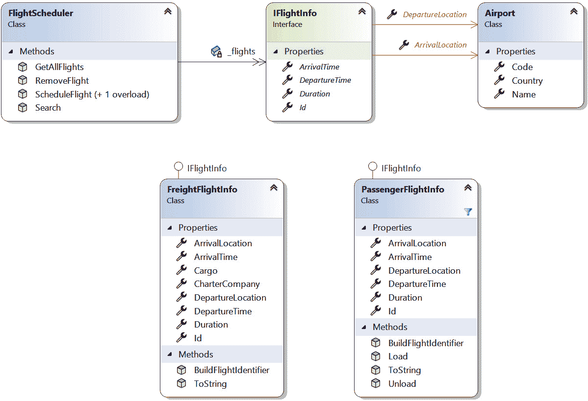

图 5.1 – 云天航空公司航班调度系统涉及的类

代码目前运行正常，甚至有效地使用了多态来跟踪各种不同的航班。话虽如此，还有一些改进的机会，我们将在后面看到。在本章中，我们将进行有针对性的改进，同时展示使用面向对象编程时存在的重构可能性。

# 通过重构组织类

解决方案存在组织挑战，如文件命名不当或类型存在于错误的文件或命名空间中，这种情况并不少见。

这些问题可能看起来很小，但它们可能会使开发者更难找到他们正在寻找的代码——尤其是在刚加入项目时。

让我们看看几个有助于开发者更容易地导航代码的重构示例。

## 将类移动到单独的文件中

我看到的一个常见错误是团队将多个类型放在同一个文件中。通常，一个文件从一个类或接口开始，然后开发者决定添加一个相关类型。而不是将新类型放在自己的文件中，类被添加到现有的文件中。一旦这种情况发生在几个小类上，之后往往会像滚雪球一样，随着时间的发展，开发者继续向文件中添加新的类型。

类型

如果你不太熟悉 .NET 世界中“类型”一词的使用，类型是一个通用术语，指代任何由 **公共类型系统**（**CTS**）支持的实体。本质上，如果你可以用它来声明一个变量，那么它很可能是一个类型。类型的例子包括类、接口、结构体、枚举以及各种记录类型变体。

飞行调度系统中的 `IFlightInfo.cs` 文件定义了几个不同的类型：

```cs
public interface IFlightInfo {
  // Details omitted....
}
public class PassengerFlightInfo : IFlightInfo {
  // Details omitted...
}
public class FreightFlightInfo : IFlightInfo {
  // Details omitted...
}
```

虽然这个例子可能看起来不太严重，但一个文件中有多个类型确实会导致一些问题：

1.  寻找特定类型的初学者在没有使用搜索功能的情况下很难找到包含该类型的文件。

1.  版本控制系统，如 git，跟踪每个文件的更改。当团队必须合并代码或确定任何给定软件版本中发生了什么更改时，这可能会增加混淆。

解决这个问题的方法是将每个类型移动到其专用的文件中。这可以通过访问名称与文件名不匹配的类型的 **快速操作** 菜单来完成。接下来，选择如 *图 5.2* 所示的 **将类型移动到 [新文件名].cs** 选项：

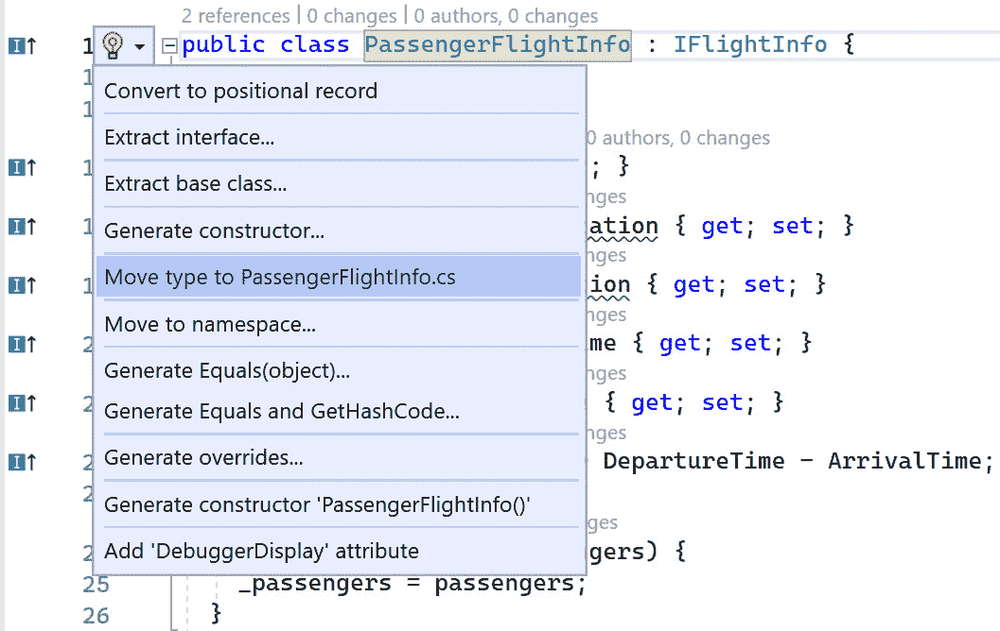

图 5.2 – 将类型移动到自己的文件

选择此选项将从原始文件中移除类型，并创建一个只包含你选择的类型的新的文件。

你需要为 Visual Studio 中每个名称与文件不匹配的类型重复此操作。ReSharper 和 Rider 提供的一些额外重构工具允许你为文件、文件夹或解决方案中的每个类型执行此重构。如果你遇到一个包含数百个类型的单个文件，这会特别方便。

## 重命名文件和类

有时，你会遇到文件和其中包含的类型名称不匹配的情况。这通常发生在开发者创建了一个新类，然后决定稍后重命名它，但没有使用 Visual Studio 内置的重命名重构功能。

`AirportInfo.cs` 文件及其 `Airport` 类是这种情况的一个例子：

```cs
namespace Packt.CloudySkiesAir.Chapter5.AirTravel;
public class Airport {
  public string Country { get; set; }
  public string Code { get; set; }
  public string Name { get; set; }
}
```

通常，解决这个问题是将文件重命名为与类型名称匹配（尽管偶尔你会确定文件名称是正确的），并且类应该重命名为与文件名称匹配。

无论是哪种选择，打开相关类型的 **快速操作** 菜单，选择 **重命名文件** 或 **重命名类型**，以确保文件和类型名称匹配。请参见以下图示：

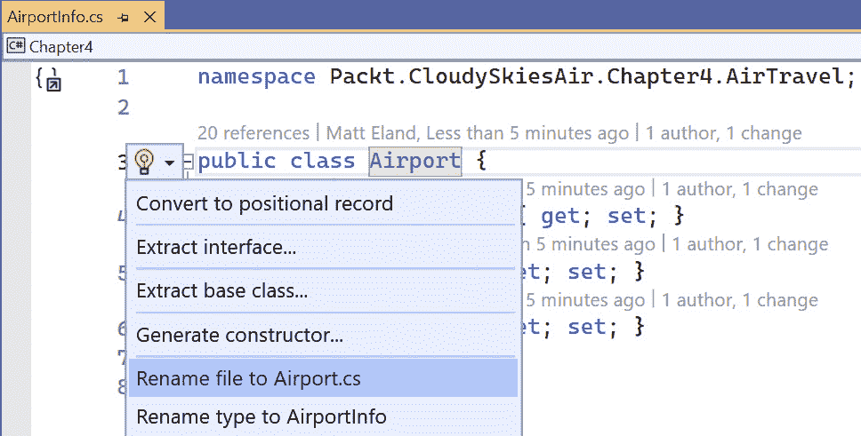

图 5.3 – 重命名文件或重命名类型的选项

我选择将文件重命名为 `Airport.cs`，因为任一选项都能确保文件和类型名称相同。这种命名一致性虽是小小的改进，但有助于开发者随着时间的推移更轻松地导航你的项目。

## 更改命名空间

.NET 使用 **命名空间** 将类型组织成层次结构。按照惯例，这些命名空间应与 **解决方案资源管理器** 中的项目文件夹相匹配。

项目将以一个命名空间开始，例如 `Packt.CloudySkiesAir.Chapter5`，并且项目内部嵌套的每个文件夹都会添加到这个命名空间中。例如，该项目中的 `Filters` 文件夹应使用 `Packt.CloudySkiesAir.Chapter5.Filters` 命名空间。

当类没有使用预期的命名空间时，可能会导致混淆。

作为实际示例，让我们看看 `Chapter5` 项目根目录下的 `Airport.cs` 文件，如图 *图 5**.4* 所示：

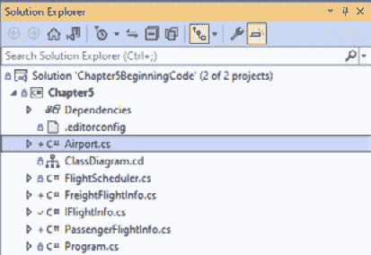

图 5.4 – Airport 类直接嵌套在项目中的项目

在这个场景中，你可能会期望 `Airport` 类位于 `Packt.CloudySkiesAir.Chapter5` 命名空间中。然而，该文件使用了不同的命名空间，如下面的代码所示：

```cs
namespace Packt.CloudySkiesAir.Chapter5.AirTravel;
public class Airport {
  public string Country { get; set; }
  public string Code { get; set; }
  public string Name { get; set; }
}
```

这种差异可以通过手动编辑命名空间声明或使用 **快速操作** 重构中的 **更改命名空间以匹配文件夹结构** 来修复，如图 *图 5**.5* 所示：

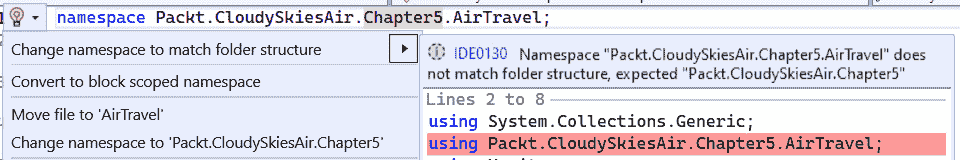

图 5.5 – 将命名空间更改为与文件夹结构匹配

我个人建议根据需要使用 `using` 语句来支持命名空间更改。

## 避免部分类和区域

在我们继续讨论重构和继承之前，我想谈谈我在处理大型类时在 C# 代码中看到的两个相关的 **反模式**。

当开发者拥有包含许多不同代码块的大类时，他们可能会倾向于使用多种语言特性来简化文件的组织。

许多开发者使用 `#region` 预处理器指令来创建可以展开和折叠的代码区域。

例如，你可以使用一个如 `#region Stuff I don't want to look at right now` 的语句，后面跟着一个单独的 `#endregion` 语句。这将创建一个可折叠的代码区域，如图 *5**.6* 中的折叠区域从第 33-84 行所示：

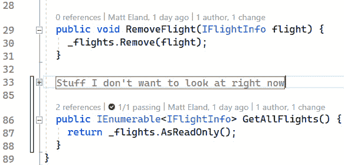

图 5.6 – 代码折叠区域

`#region` 被视为代码组织中的一个坏习惯；它会导致极其庞大的类，而不是将代码重构为更可维护的模式。

那么，为什么它存在呢？

`#region` 指令被引入是为了帮助隐藏通常嵌入到旧版 .NET 应用程序中的自动生成代码。这是开发者不期望与之交互的代码，并且通常鼓励不要修改，以免破坏其他东西。

最终，.NET 引入了 **部分类** 来帮助处理之前在区域中使用的情况。

部分类是在 *同一项目* 内的 *多个文件* 中定义的类。这将允许你拥有 `FlightScheduler.ItemManagement.cs` 和 `FlightScheduler.Search.cs` 文件，每个文件都包含较大类的一部分。这让你可以在多个文件中定义一个大型类：

```cs
public partial class FlightScheduler {
  // Details omitted...
}
```

与区域指令一样，部分类旨在支持自动生成的代码。虽然我个人更喜欢部分类而不是 `#region` 指令，但我认为当它们用于减少大型类带来的痛苦时，两者都是反模式。

通常，当你的类足够大，以至于你想考虑 `#region` 或部分类时，你正在违反单一职责原则，你的类应该被拆分成多个更小的类，这些类彼此之间明显不同。

我们将在 *第八章*，*使用 SOLID 避免代码反模式* 中讨论单一职责原则和其他设计原则。

# 重构与继承

现在我们已经介绍了一些重构可以帮助组织代码的方法，让我们深入了解与继承相关的重构。这是一组重构，涉及重写方法、引入继承或修改就地继承关系，以提高代码的可维护性。

## 重写 ToString

`ToString` 是任何 .NET 对象都保证拥有的四个方法之一，这是由于 `System.Object` 上 `ToString` 的 `virtual` 定义。此方法在对象转换为字符串时使用，并且对于日志记录和调试目的特别有用。

有时重写 `ToString` 可以以意想不到的方式简化你的代码。

让我们来看看 `FreightFlightInfo.cs` 中的 `BuildFlightIdentifier` 方法。此方法依赖于类型为 `Airport` 的 `DepartureLocation` 和 `ArrivalLocation` 属性来生成一个字符串：

FreightFlightInfo.cs

```cs
public string BuildFlightIdentifier() =>
  $"{Id} {DepartureLocation.Code}-" +
  $"{ArrivalLocation.Code} carrying " +
  $"{Cargo} for {CharterCompany}";
```

需要深入到这些位置属性中才能到达它们的 `Code` 属性，这很烦人。

如果 `Airport` 重写了 `ToString` 方法并返回机场代码，我们就能简化我们代码的可读性：

```cs
public string BuildFlightIdentifier() =>
  $"{Id} {DepartureLocation}-{ArrivalLocation} " +
  $"carrying {Cargo} for {CharterCompany}";
```

要做到这一点，你可以直接进入 `Airport.cs` 并手动添加重写，或者使用内置的重构选项通过 **生成重写...** 重构（见 *图 5.7*）：

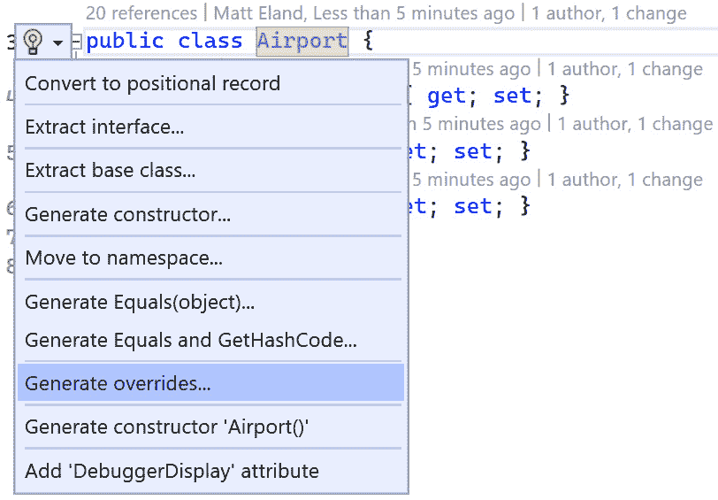

图 5.7 – 在类上生成重写

从那里，你需要指定你想要重写的方法或属性。如图所示，你从继承的类中继承的任何抽象或虚拟成员都将可用：

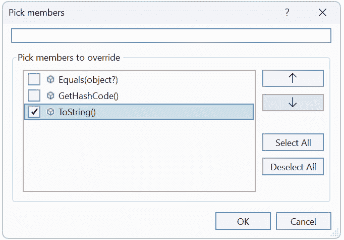

图 5.8 – 选择要重写的成员

选择 `ToString()` 并点击 **确定** 会生成一个占位符方法，可以快速替换为实际实现。

在这个类中，`ToString` 方法应该返回机场代码：

```cs
public class Airport {
  public string Country { get; set; }
  public string Code { get; set; }
  public string Name { get; set; }
  public override string? ToString() => Code;
}
```

在此覆盖到位后，现有代码仍然可以使用 `Code` 属性而不会出现问题。然而，任何之前尝试将 `Airport` 对象写入控制台中的代码现在将看到其代码而不是类的命名空间和名称。

注意

.NET 中 `ToString` 的默认实现是返回一个包含命名空间和类型名称的字符串。在这种情况下，它将是 `Packt.CloudySkiesAir.Chapter5.AirTravel.Airport`。

接下来，我们应该查看 `Code` 属性当前正在被读取的所有地方，看看是否更易于阅读，可以依赖 `ToString` 覆盖。

您可以在任何版本的 Visual Studio 2022 中通过右键单击 `Code` 属性声明并选择 **查找所有引用** 来执行此操作，如图 *图 5**.9* 所示：

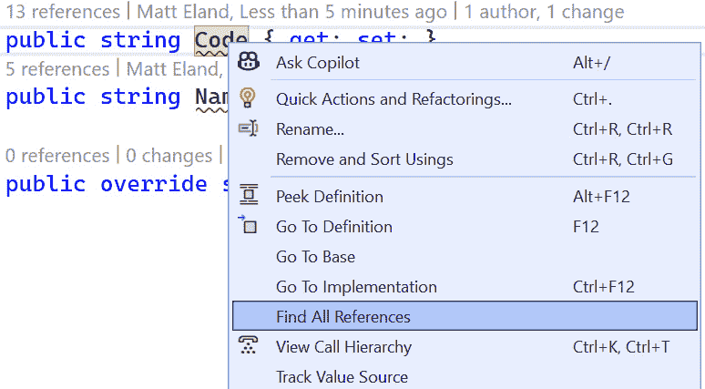

图 5.9 – 查找所有引用的上下文菜单选项

这将打开一个新的面板，其中突出显示了该属性的 所有引用：

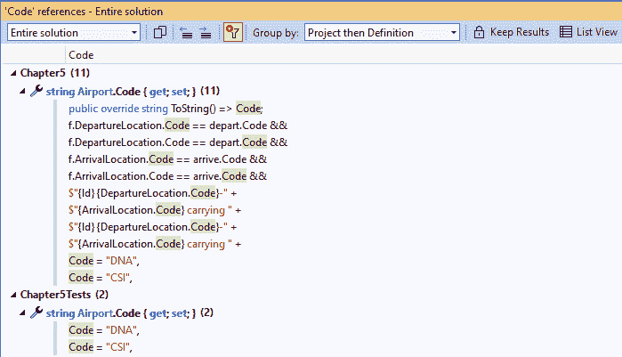

图 5.10 – 查找所有引用的结果

然后，您可以修改这些区域以在适当的地方使用 `ToString`，例如在以下对 `PassengerFlightInfo` 的修改中：

```cs
public string BuildFlightIdentifier() =>
  $"{Id} {DepartureLocation}-{ArrivalLocation} " +
  $"carrying {_passengers} people";
```

在您的对象中覆盖 `ToString` 的一个额外好处是当在 Visual Studio 调试器中查看时，类的显示会得到改进：


图 5.11 – 在调试工具中显示的 `ToString` 覆盖

我们将在 *第十章**：防御性编码技术* 中进一步探讨调试。

## 生成等价方法

在 C# 中，引用类型的等价性（如类）是通过 **引用等价性** 来实现的 – 确定两个对象是否位于堆中的相同位置。

有时候比较两个对象的不同属性以查看它们的值是否等效会更方便，即使这两个对象代表堆上的两个不同的位置。

以下来自 `FlightScheduler` 类的代码展示了其 `Search` 方法是如何检查确保您正在搜索的机场具有相同的机场代码和国家。注意在确定两个机场等效时的重复逻辑：

```cs
if (depart != null) {
  results = results.Where(f =>
    f.DepartureLocation.Code == depart.Code &&
    f.DepartureLocation.Country == depart.Country
  );
}
if (arrive != null) {
  results = results.Where(f =>
    f.ArrivalLocation.Code == arrive.Code &&
    f.ArrivalLocation.Country == arrive.Country
  );
}
```

通过用我们自己的定制实现覆盖等价成员，可以简化此代码。

等价成员

.NET 提供了两种确定等价性的方法：`Equals` 和 `GetHashCode`。`Equals` 方法确定两个对象是否等效，而 `GetHashCode` 用于确定对象在 `Dictionary` 和 `HashSet` 中排序到的哪个主要“桶”。

您永远不应该只覆盖这两个方法中的一个；每当您覆盖 `Equals` 时，您还需要覆盖 `GetHashCode`。此外，您还想要确保您使用的是一个良好的 `GetHashCode` 实现，该实现可以均匀且一致地将对象分布到您类中的不同哈希值中。

.NET 还提供了一个 `IEquatable<T>` 接口，你可以实现它来进行强类型相等性比较，这可以提高性能。在重写相等性成员时，通常推荐实现 `IEquatable<T>`，但本书中并未详细说明。更多信息请参阅 *进一步阅读* 部分。

相等性和哈希码可能会变得非常复杂，但幸运的是，我们在 Visual Studio 中有一些非常好的工具来生成相等性成员。只需选择你的类，然后从 **快速操作** 菜单中选择 **生成 Equals 和 GetHashCode…**，如图 *图 5.12* 所示：

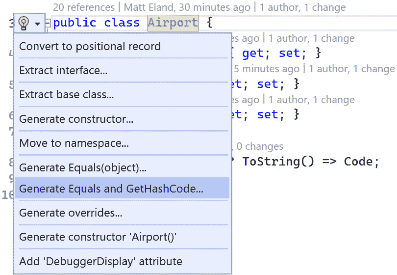

图 5.12 – 生成相等性成员重写

一旦选择此选项，Visual Studio 将询问哪些成员应参与相等性和哈希码检查，如图 *图 5.13* 所示：

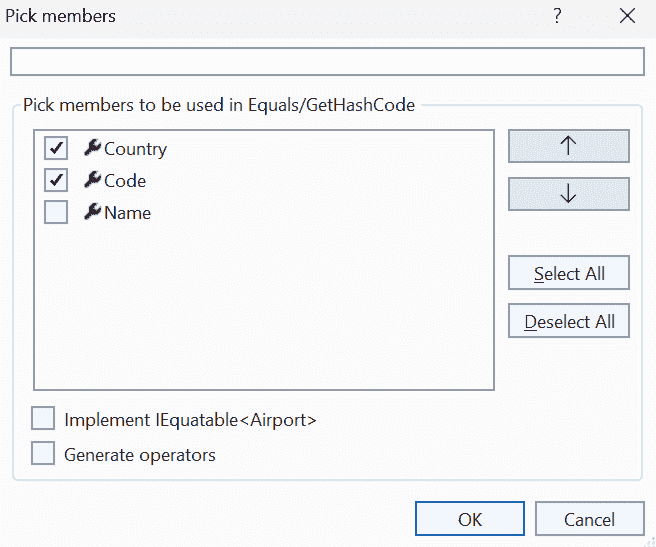

图 5.13 – 选择相等性成员

选择必须相等的成员并点击 **确定** 以生成重写：

Airport.cs

```cs
public class Airport {
  public string Country { get; set; }
  public string Code { get; set; }
  public string Name { get; set; }
  public override bool Equals(object? obj) {
    return obj is Airport airport &&
           Country == airport.Country &&
           Code == airport.Code;
}
  public override int GetHashCode() {
    return HashCode.Combine(Country, Code);
  }
  public override string? ToString() => Code;
}
```

在这里，Visual Studio 生成了一个与 `Equals` 实现匹配的模式，比较相关属性。此外，`GetHashCode` 实现使用较新的 `HashCode.Combine` 方法来安全地简化你的哈希码生成过程。

更新相等性成员

如果你为你的类添加了新的属性，这些属性应该影响相等性检查，请确保更新 `Equals` 和 `GetHashCode` 以包括这些属性。

在放置了自定义相等性成员之后，之前检查机场 `Code` 和 `Country` 的代码可以简化为使用相等运算符 (`==`)：

FlightScheduler.cs – 搜索

```cs
if (depart != null) {
  results=results.Where(f=> f.DepartureLocation == depart);
}
if (arrive != null) {
  results=results.Where(f=> f.ArrivalLocation == arrive);
}
```

重写相等性成员在你有很多在堆上具有相同值的相似对象时非常有用。这可能在处理 **Web 服务** 或其他发生 **反序列化** 的地方发生。

相等性和记录

你并不总是需要重写相等性成员来获得基于值的相等性。在 *第十章*：**防御性编码技术* 中，我们将探讨 `record` 关键字在控制相等性方面的战略使用。事实上，每当我发现自己正在考虑重写相等性成员时，我通常会决定将我的类做成记录。

## 提取基类

有时你可能会遇到类之间有高度重复的情况。这些类在概念上是相关的，并且不仅共享相似的成员签名，还共享这些成员的相同实现。

在这些情况下，引入一个定义公共共享代码的基类通常是有意义的。**继承**然后允许我们从系统中的多个类中移除公共代码，并在集中位置维护它。

在我们的航班调度示例（见图 *图 5.14*），乘客和货运航班类有几个共享属性：

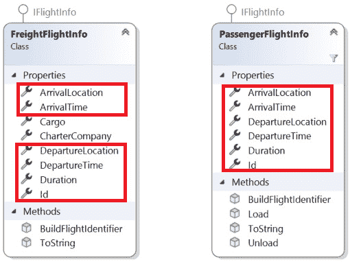

图 5.14 – 货运和客运航班之间的共享成员

为了解决这个问题，请进入任意一个类，并从**快速操作**菜单中选择**提取基类...**：

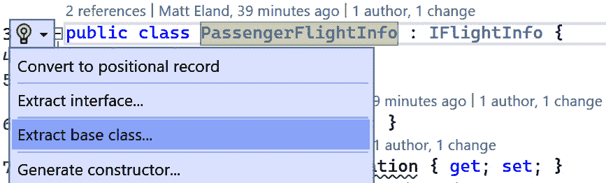

图 5.15 – 提取基类

接下来，为新类命名，并选择你想要移动到其中的成员，如图*图 5.16*所示。你也可以决定是否将其中任何成员声明为抽象的，但请注意，这将使你的类也成为抽象类。

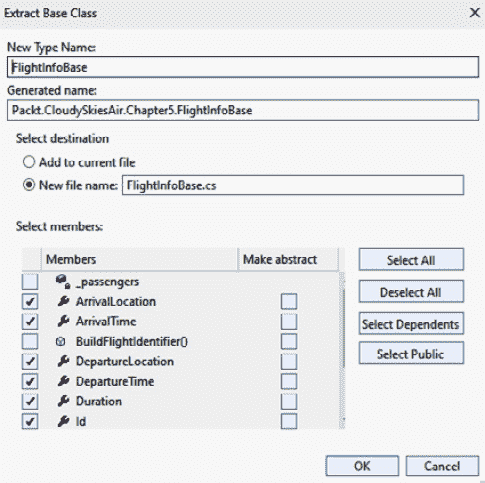

图 5.16 – 配置新的基类

一旦你点击**确定**，新类将被创建：

FlightInfoBase.cs

```cs
public class FlightInfoBase {
  public Airport ArrivalLocation { get; set; }
  public DateTime ArrivalTime { get; set; }
  public Airport DepartureLocation { get; set; }
  public DateTime DepartureTime { get; set; }
  public TimeSpan Duration => DepartureTime - ArrivalTime;
  public string Id { get; set; }
}
```

你开始时的类现在继承自这个新类，而你选择的非抽象成员已从文件中移除：

PassengerFlightInfo.cs

```cs
public class PassengerFlightInfo : FlightInfoBase,
                                   IFlightInfo {
  private int _passengers;
  public void Load(int passengers) =>
    _passengers = passengers;
  public void Unload() =>
    _passengers = 0;
  public string BuildFlightIdentifier() =>
    $"{Id} {DepartureLocation}-{ArrivalLocation} carrying"
    + $" {_passengers} people";
  public override string ToString() =>
    BuildFlightIdentifier();
}
```

提取基类对于促进代码复用非常有帮助，但这只是重构工作的一半；提取基类并没有修改你的其他类。

如果你希望相关的航班类也继承自新类，你必须手动进行更改，指定基类并移除任何被“提升”到该类的成员：

FreightFlightInfo.cs

```cs
public class FreightFlightInfo : FlightInfoBase,
                                 IFlightInfo {
  public string CharterCompany { get; set; }
  public string Cargo { get; set; }
  public string BuildFlightIdentifier() =>
    $"{Id} {DepartureLocation}-{ArrivalLocation} " +
    $"carrying {Cargo} for {CharterCompany}";
  public override string ToString() =>
    BuildFlightIdentifier();
}
```

结果是，我们的两个航班类现在专注于它们各自独特的事物。此外，如果需要为每个航班添加新的逻辑，现在可以将其添加到基类中，所有继承的类都将接收它。

## 将接口实现向上移动到继承树

你可能在最后两个代码示例中注意到一个奇怪的现象，即尽管`FreightFlightInfo`和`PassengerFlightInfo`现在都继承自`FlightInfoBase`，但它们都分别实现了`IFlightInfo`接口，如图*图 5.17*所示：

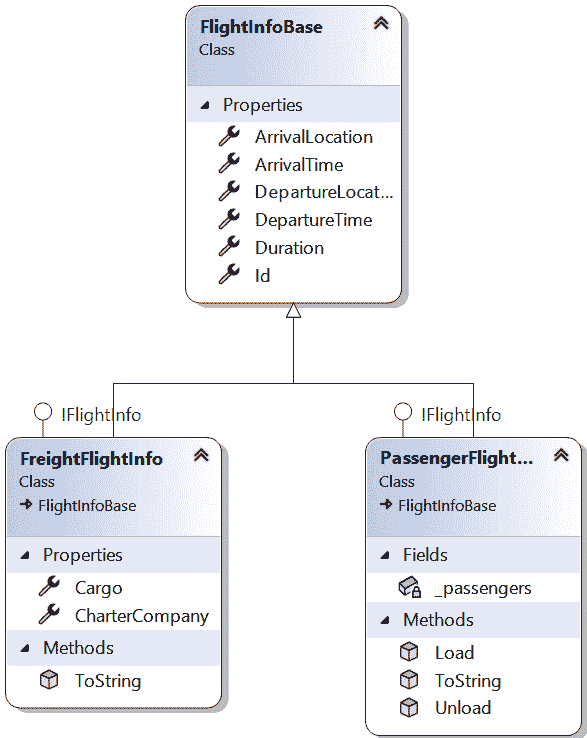

图 5.17 – 客运和货运航班分别实现 IFlightInfo

当每个继承自基类的类都实现了一个接口时，通常有很好的机会将接口实现向上移动到基类本身。

在这种情况下，`FlightInfoBase`类已经通过`IFlightInfo`接口定义了所有必需的成员。因此，实现该接口是有意义的，如下所示：

FlightInfoBase.cs

```cs
public class FlightInfoBase : IFlightInfo {
  public Airport ArrivalLocation { get; set; }
  public DateTime ArrivalTime { get; set; }
  public Airport DepartureLocation { get; set; }
  public DateTime DepartureTime { get; set; }
  public TimeSpan Duration => DepartureTime – ArrivalTime;
  public string Id { get; set; }
}
```

在进行更改后，我们可以从`PassengerFlightInfo`和`FreightFlightInfo`中移除`IFlightInfo`实现。这简化了类定义，同时仍然继承了接口实现，如图所示：

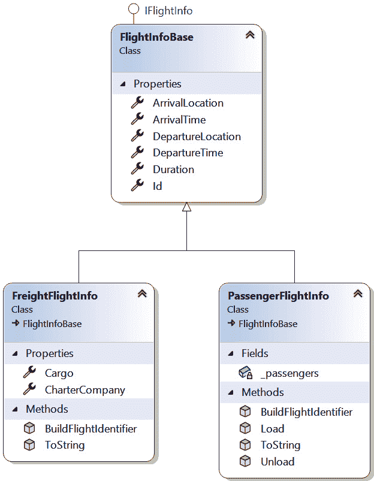

图 5.18 – 将 IFlightInfo 接口实现“提升”到 FlightInfoBase 中

通过将接口拉入基类，我们现在**保证**任何从该类继承的类也将实现`IFlightInfo`接口。

# 使用抽象控制继承

现在我们已经介绍了一些关于继承的重构模式，让我们看看如何使用**抽象类**和其他 C#特性来限制我们的类，并确保它们被适当使用。

## 使用抽象传达意图

我们当前设计的一个特点是，可以通过编写以下代码简单地实例化一个新的`FlightInfoBase`实例：

```cs
FlightInfoBase flight = new FlightInfoBase();
```

虽然这可能对你来说没有意义——因为存在一种既不是客运也不是货运的航班，因为`FlightInfoBase`类没有被标记为抽象类——但这并不阻止任何人实例化它。

要将一个类标记为抽象，请将其签名中的`abstract`关键字添加：

FlightInfoBase.cs

```cs
public abstract class FlightInfoBase : IFlightInfo {
  public Airport ArrivalLocation { get; set; }
  public DateTime ArrivalTime { get; set; }
  public Airport DepartureLocation { get; set; }
  public DateTime DepartureTime { get; set; }
  public TimeSpan Duration => DepartureTime - ArrivalTime;
  public string Id { get; set; }
}
```

当你不希望任何人实例化类时，将其标记为抽象可以完成几件事情：

+   它传达了该类不打算被实例化的意图

+   编译器现在阻止其他人实例化你的类

+   如我们接下来将看到的，它允许你向你的类添加抽象成员

## 引入抽象成员

现在，由于`FlightInfoBase`是抽象的，它为重构打开了新的可能性。

例如，`FreightFlightInfo`和`PassengerFlightInfo`都有`BuildFlightIdentifier`方法和`ToString`覆盖。

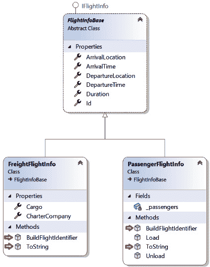

图 5.19 – 飞行信息类中的重复成员

虽然`BuildFlightIdentifier`方法的实现细节不同，但`ToString`方法覆盖了`BuildFlightIdentifier`的结果返回。

我们可以通过使用**拉取[成员名称]**向上...，如图*图 5**.20*所示，利用这些共同点将两个方法都拉入基类：

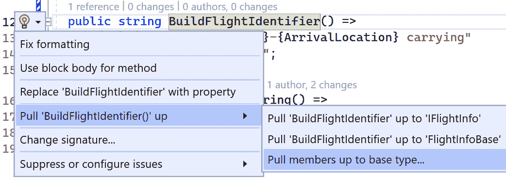

图 5.20 – 将成员拉到基类型

接下来，选择你想要拉入父类的成员，确保为任何你想要将其*定义*拉入而不将其*实现*拉入的成员勾选**标记为抽象**复选框。

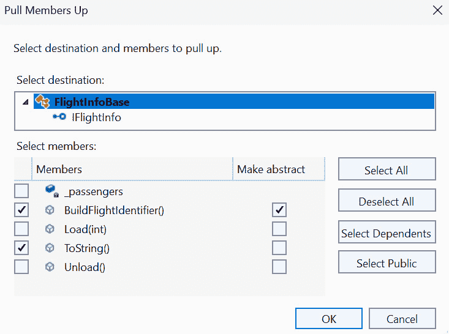

图 5.21 – 选择目的地和将成员抽象化

结果是，`FlightInfoBase`现在有了`ToString`覆盖以及`BuildFlightIdentifier`的抽象定义：

FlightInfoBase.cs

```cs
public abstract class FlightInfoBase : IFlightInfo {
  // Other members omitted...
public abstract string BuildFlightIdentifier();
  public override string ToString() =>
    BuildFlightIdentifier();
}
```

由于`BuildFlightIdentifier`是抽象的，我们的原始方法调用仍然保留，但现在被标记为覆盖：

PassengerFlightInfo.cs

```cs
public class PassengerFlightInfo : FlightInfoBase {
  // Other members omitted...
  public override string BuildFlightIdentifier() =>
    $"{Id} {DepartureLocation}-{ArrivalLocation} carrying"
    + $" {_passengers} people";
}
```

不幸的是，**拉取成员向上**重构不会修改从同一基类继承的其他类，因此你现在必须手动在其他航班类中添加覆盖：

```cs
public class FreightFlightInfo : FlightInfoBase {
  // Other members omitted...
  public override string BuildFlightIdentifier() =>
    $"{Id} {DepartureLocation}-{ArrivalLocation} " +
    $"carrying {Cargo} for {CharterCompany}";
}
```

进行这次重构简化了我们的代码：单个航班类不再需要重写 `ToString`。更重要的是，如果我们以后添加新的航班类型，编译器将强制它通过 `BuildFlightIdentifier` 重写提供一个有效的航班标识符。

密封方法和类

当我们谈论抽象、虚拟和重写方法时，我们应该提及 `sealed`。`sealed` 关键字几乎有相反的效果。当一个类被标记为 `sealed` 时，它不能被继承。当一个 *方法* 被标记为 `sealed` 时，该方法在继承类中不能进一步重写。`sealed` 关键字的这两种用法都是为了保护类所做的操作免受外部修改。此外，将成员标记为 `sealed` 还可能带来一些性能优势。

## 将抽象方法转换为虚拟方法

有时，你会将一个方法标记为抽象的，后来意识到这个方法许多重写有相似的实现。当这种情况发生时，将方法从 `abstract` 移动到 `virtual` 以提供一个其他人可以选择重写的基实现是有意义的。

我们的 `FlightInfoBase` 类将 `BuildFlightIdentifier` 定义为抽象：

```cs
public abstract string BuildFlightIdentifier();
```

这意味着这个方法的每个实现都应该与其他的不同。然而，让我们看看这个实际的实现：

+   PassengerFlightInfo.cs

    ```cs
    public override string BuildFlightIdentifier() =>
    ```

    ```cs
      $"{Id} {DepartureLocation}-{ArrivalLocation}
    ```

    ```cs
        carrying " +
    ```

    ```cs
      $"{_passengers} people";
    ```

+   FreightFlightInfo.cs

    ```cs
    public override string BuildFlightIdentifier() =>
    ```

    ```cs
      $"{Id} {DepartureLocation}-{ArrivalLocation}
    ```

    ```cs
        carrying " +
    ```

    ```cs
      $"{Cargo} for {CharterCompany}";
    ```

虽然两个方法字符串都构建了，但它们都以航班标识符、出发机场和到达机场开始。

如果我们想要改变所有航班显示这些基本信息的方式，我们需要更改从 `FlightInfoBase` 继承的所有类。

相反，我们可以修改 `FlightInfoBase` 以提供一个包含共享信息的良好起点：

```cs
public virtual string BuildFlightIdentifier() =>
  $"{Id} {DepartureLocation}-{ArrivalLocation}";
```

这次更改导致了两件事发生：

+   新的航班类不再 *需要* 重写 `BuildFlightIdentifier`

+   现有的重写可以调用 `base.BuildFlightIdentifier()` 来获取基本航班信息的通用格式

在我们的情况下，继续重写这个方法是有意义的，但现在我们可以修改代码以利用基级别的通用格式化：

+   `PassengerFlightInfo.cs`

    ```cs
    public override string BuildFlightIdentifier() =>
    ```

    ```cs
      base.BuildFlightIdentifier() +
    ```

    ```cs
      $" carrying {_passengers} people";
    ```

+   `FreightFlightInfo.cs`

    ```cs
    public override string BuildFlightIdentifier() =>
    ```

    ```cs
      base.BuildFlightIdentifier() +
    ```

    ```cs
      $" carrying {Cargo} for {CharterCompany}";
    ```

将我们的抽象类与虚拟方法结合起来，使我们能够将航班格式化逻辑集中在一个地方，同时仍然保持扩展类和修改其行为的自由。

# 为了更好的封装进行重构

面向对象编程的另一个核心原则是 **封装**。通过封装，你声明对类中数据的控制，并确保其他人以合理的方式与数据交互，无论是立即还是随着时间的推移。

以下重构处理了组成类的各种数据以及作为参数传递给方法的参数。

## 封装字段

最简单的封装重构允许你将字段的全部使用封装到一个属性中。

在下面的代码示例中，`PassengerFlightInfo`类有一个`_passengers`字段，用于存储航班上的乘客数量，并且当在类中引用乘客数量时，该字段被整个类使用：

```cs
public class PassengerFlightInfo : FlightInfoBase {
  private int _passengers;
  public void Load(int passengers) =>
    _passengers = passengers;
  public void Unload() =>
    _passengers = 0;
  public override string BuildFlightIdentifier() =>
    base.BuildFlightIdentifier() +
    $" carrying {_passengers} people";
}
```

这段代码并不糟糕，我会在生产应用程序中接受这种逻辑。然而，它确实有几个潜在的缺点：

+   类外部无法读取航班乘客数量。

+   有几个地方修改了`_passengers`字段。如果我们想在值每次更改时添加验证或执行某些操作，我们就必须修改几个不同的方法。

将`_passengers`字段的全部使用封装到属性中，可以帮助我们提供一个集中位置来执行验证，并为类外部的读取提供一个属性。

你可以使用**封装字段**重构功能在**快速操作**菜单中快速将现有字段包装成属性：

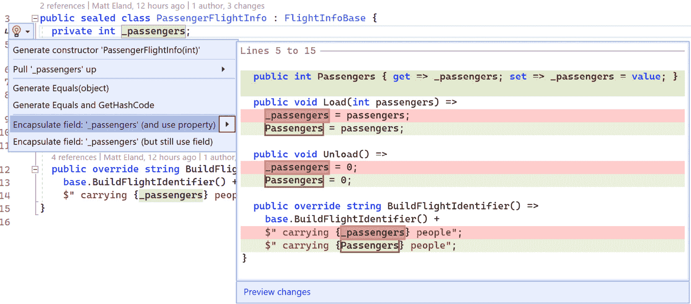

图 5.22 – 将乘客字段封装为属性

这为你的类添加了一个属性，可以在集中位置读取和修改值：

```cs
public sealed class PassengerFlightInfo : FlightInfoBase {
  private int _passengers;
  public int Passengers {
    get => _passengers;
    set => _passengers = value;
  }
  public void Load(int passengers) =>
    Passengers = passengers;
  public void Unload() =>
    Passengers = 0;
  public override string BuildFlightIdentifier() =>
    base.BuildFlightIdentifier() +
    $" carrying {Passengers} people";
}
```

请记住，这种重构默认会将设置器公开，这将允许类外部的代码修改`passengers`值。如果你不希望这样，你可以将属性标记为具有`private`或`protected`设置。

## 将参数封装到类中

随着软件系统的增长，会添加更多功能以及支持它们的代码。这可能导致曾经简单的方法变得非常复杂，并且它们需要的信息也越来越多。

在项目早期需要三个参数的方法，在经过大量开发后，突然发现自己需要七个或八个参数才能正常工作，这种情况并不少见。

`FlightScheduler`的搜索方法就是这样一个例子，因为有很多因素会影响航班搜索：

FlightScheduler.cs

```cs
public IEnumerable<IFlightInfo> Search(
  Airport? depart, Airport? arrive,
  DateTime? minDepartTime, DateTime? maxDepartTime,
  DateTime? minArriveTime, DateTime? maxArriveTime,
  TimeSpan? minLength, TimeSpan? maxLength) {
```

此方法目前接受八种不同的信息，这使得对方法的调用非常难以阅读：

```cs
IEnumerable<IflightInfo> flights = scheduler.Search(cmh,
  dfw, new DateTime(2024,3,1), new DateTime(2024,3,5),
  new DateTime(2024,3,10), new DateTime(2024,3,13),
  TimeSpan.FromHours(2.5), TimeSpan.FromHours(4.5));
```

虽然我故意让这个例子读起来有点困难，但根据我的经验，在现实世界中确实存在复杂的方法签名。这些复杂的方法可能会导致由于在阅读参数列表时对传递给哪个参数的值感到困惑而出现微妙的错误。

看着这段代码，很容易想象到有人可能想要搜索与航班相关的新事物，包括低和高价格、机上饮料服务、免费 Wi-Fi 以及所飞行的飞机类型。这些新的搜索功能将进一步扩展方法定义和调用该方法的所有调用者。

解决这个问题的常见方法是将相关信息封装到一个新的类中。在我们的情况下，我们可以定义一个新的`FlightSearch`类来封装与搜索航班相关的一切：

FlightSearch.cs

```cs
public class FlightSearch {
  public Airport? Depart { get; set; }
  public Airport? Arrive { get; set; }
  public DateTime? MinArrive { get; set; }
  public DateTime? MaxArrive { get; set; }
  public DateTime? MinDepart { get; set; }
  public DateTime? MaxDepart { get; set; }
  public TimeSpan? MinLength { get; set; }
  public TimeSpan? MaxLength { get; set; }
}
```

这个新类允许我们在一个集中的地方跟踪搜索信息，并显著改进了搜索方法的签名：

FlightScheduler.cs

```cs
public IEnumerable<IFlightInfo> Search(FlightSearch s) {
  IEnumerable<IFlightInfo> results = _flights;
  if (s.Depart != null) {
    results =
      results.Where(f => f.DepartureLocation == s.Depart);
  }
  // Other filters omitted for brevity...
  return results;
}
```

添加 `FlightSearch` 类将方法签名从八个参数缩减为一个。此外，如果未来需要添加新的搜索逻辑，这些信息可以添加到 `FlightSearch` 对象中，而无需进一步修改 `Search` 方法的签名。

不幸的是，更改搜索方法的签名会中断直到它们更新为使用新搜索对象的方法调用者。为了解决这个问题，你有几个选择：

+   将所有对 `Search` 方法的调用更新为传递一个 `FlightSearch` 对象

+   创建一个临时的 `Search` 方法重载，将 `FlightSearch` 对象传递给新方法。

第一个选项有些不言自明，所以让我们看看第二个选项。

在这里，我们将创建一个 `Search` 方法的重载，它接受八个旧参数，创建一个 `FlightSearch` 对象，并将其传递给新方法：

```cs
[Obsolete("Use the overload that takes a FlightSearch")]
public IEnumerable<IFlightInfo> Search(
  Airport? depart, Airport? arrive,
  DateTime? minDepartTime, DateTime? maxDepartTime,
  DateTime? minArriveTime, DateTime? maxArriveTime,
  TimeSpan? minLength, TimeSpan? maxLength) {
  FlightSearch searchParams = new() {
    Arrive = arrive,
    MinArrive = minArriveTime,
    MaxArrive = maxArriveTime,
    Depart = depart,
    MinDepart = minDepartTime,
    MaxDepart = maxDepartTime,
    MinLength = minLength,
    MaxLength = maxLength
  };
  return Search(searchParams);
}
```

注意，我们已将此方法标记为已过时。这将警告试图使用它的程序员，并告诉他们应该使用哪个方法（见 *图 5**.23*）。使用 `Obsolete` 属性标记事物有助于引导开发者使用更近期的版本。通常，一个方法会被标记为已过时，然后稍后从项目中删除。

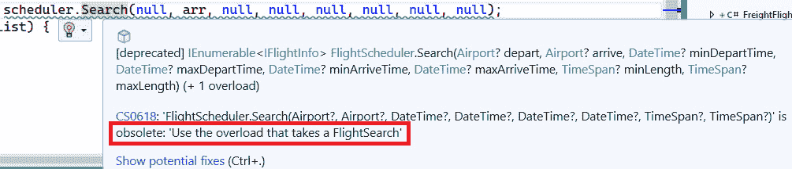

图 5.23 – 一个过时的警告，告诉开发者使用哪个方法代替

通过引入一个类，我们能够简化我们的方法，并为随着时间的推移需要增长的数据提供了一个安全的地方：

为常见的参数集引入类可以显著加快团队的开发时间，尤其是当这些相同的对象在整个系统中传递时。

## 将属性封装到类中

有时你会找到具有相互关联的属性集的类。例如，`FlightInfoBase` 类需要跟踪飞机起飞或到达的机场以及该事件的日期和时间：

FlightInfoBase.cs

```cs
public abstract class FlightInfoBase : IFlightInfo {
  public Airport ArrivalLocation { get; set; }
  public DateTime ArrivalTime { get; set; }
  public Airport DepartureLocation { get; set; }
  public DateTime DepartureTime { get; set; }
  // Other members omitted ...
}
```

在这种情况下，关于到达和出发的信息都需要它们的 `Airport` 和相关的 `DateTime` 才有意义。如果我们未来需要跟踪航站楼、登机口或跑道，我们需要为到达和出发都添加属性。

因为这些属性集是相互增长的，所以将它们封装在自己的 `AirportEvent` 类中是有意义的：

```cs
public class AirportEvent {
  public Airport Location { get; set; }
  public DateTime Time { get; set; }
}
```

现在，如果我们需要扩展我们对每个航段跟踪的信息，我们可以将其添加到这个类中，它将对到达和出发都可用。

当然，为了使这完全工作，我们需要修改 `FlightInfoBase` 以使用新类而不是单独跟踪其属性：

FlightInfoBase.cs

```cs
public abstract class FlightInfoBase : IFlightInfo {
  public AirportEvent Arrival { get; set; }
  public AirportEvent Departure { get; set; }
  public TimeSpan Duration => Departure.Time-Arrival.Time;
  public string Id { get; set; }
  public virtual string BuildFlightIdentifier() =>
    $"{Id} {Departure.Location}-{Arrival.Location}";
  public sealed override string ToString() =>
    BuildFlightIdentifier();
}
```

然而，直到我们更新`IFlightInfo`接口以匹配我们的新签名，这种变化本身还不够：

IFlightInfo.cs

```cs
public interface IFlightInfo {
  string Id { get; }
  AirportEvent Arrival { get; set; }
  AirportEvent Departure { get; set; }
  TimeSpan Duration { get; }
}
```

通过这个变化，编译器现在对我们的航班类感到满意，但现在在`FlightScheduler`的`ScheduleFlight`方法中出现了编译错误：

FlightScheduler.cs

```cs
PassengerFlightInfo flight = new() {
  Id = id,
  ArrivalLocation = arrive,
  ArrivalTime = arriveTime,
  DepartureLocation = depart,
  DepartureTime = departTime,
};
```

这种方法仍在尝试设置旧属性，因此需要更新以使用`AirportEvent`对象：

```cs
PassengerFlightInfo flight = new() {
  Id = id,
  Arrival = new AirportEvent {
    Location = arrive,
    Time = arriveTime,
  },
  Departure = new AirportEvent {
    Location = depart,
    Time = departTime,
  },
};
```

`FlightScheduler`在搜索方法中由于使用了旧属性，也出现了一些编译错误：

```cs
if (s.Depart != null) {
  results =
    results.Where(f => f.DepartureLocation == s.Depart);
}
```

这些代码片段需要引用新的属性：

```cs
if (s.Depart != null) {
  results =
    results.Where(f => f.Departure.Location == s.Depart);
}
```

你可能已经注意到，为了将属性组合成一个新的对象进行这个简单的更改，我们不得不做出许多更改才能使代码再次编译。

在进行这种结构变更时，这很正常，但编译器通过确保你的代码在变更过程中保持结构上的合理性来支持你的重构之旅。实际上，如果没有编译器的帮助，我可能不敢做出一些这些变更。我鼓励你将编译器视为重构之旅中的盟友。

## 优先使用组合而非继承

让我们通过探讨“优先使用组合而非继承”的指令来结束我们对封装的讨论。这是我职业生涯早期经常听到的一句话，尽管我花了一些时间才理解它的含义和影响。

通过优先使用组合而非继承，我们做出了一个有意识的决策，即类应该“拥有”某些东西，而不是“成为”某些东西。如果一个类可以将其责任转交给另一个对象，而不是依赖继承来使类更加特殊并能够处理特定场景，那么这个类就有东西。

让我们看看航班调度系统，例如。

Cloudy Skies Airlines 已经决定它想要提供包机服务。这些小型航班既载客又载货，由不同的公司支付费用。在这种情况下，包机既不是客运航班也不是货运航班，而是两者兼而有之。

使用继承直接实现这个功能可能看起来像这样：

```cs
public class CharterFlightInfo : FlightInfoBase {
  public string CharterCompany { get; set; }
  public string Cargo { get; set; }
  public int Passengers { get; set; }
  public override string BuildFlightIdentifier() =>
    base.BuildFlightIdentifier() +
    $" carrying {Cargo} for {CharterCompany}" +
    $" and {Passengers} passengers";
}
```

注意，这里一个类既有货物也有乘客。

单独来看，这并不糟糕，但如果我们想让我们的包机携带多件货物呢？我们现在需要有一个包含货物字符串及其包机公司的集合（这些公司可能各不相同）。

对此货物或其显示方式的任何定制都需要对这个类进行额外的定制，或者创建一个单独但相关的类，这个类也继承自`FlightInfoBase`。想象这个系统产生一系列相关类，如`BulkCargoFlightInfo`、`ExpressFlightInfo`、`MedicalFlightInfo`、`HazardousCargoFlightInfo`等，并不太难。

虽然这种基于继承的方法可以工作，但使用**组合**将导致更易于维护的代码和更少的类。

组合允许我们说一个单独的航班是由*组合*的货物项组成的。货物项可以使用简单的`CargoItem`类来定义：

```cs
public class CargoItem {
  public string ItemType { get; set; }
  public int Quantity { get; set; }
  public override string ToString() =>
    $"{Quantity} {ItemType}";
}
```

这种简单的方法存储了项目类型及其数量，并提供了这两个的字符串表示。

然后，我们可以将此方法纳入`CharterFlightInfo`的替代版本中：

```cs
public class CharterFlightInfo : FlightInfoBase {
  public List<CargoItem> Cargo { get; } = new();
  public override string BuildFlightIdentifier() {
    StringBuilder sb = new(base.BuildFlightIdentifier());
    if (Cargo.Count != 0) {
      sb.Append(" carrying ");
      foreach (var cargo in Cargo) {
        sb.Append($"{cargo}, ");
      }
    }
    return sb.ToString();
  }
}
```

这种方法允许包机航班由不同的货物项组成。然后，每个项目都使用其`ToString`方法在`BuildFlightIdentifier`方法中显示。请参阅以下图表：

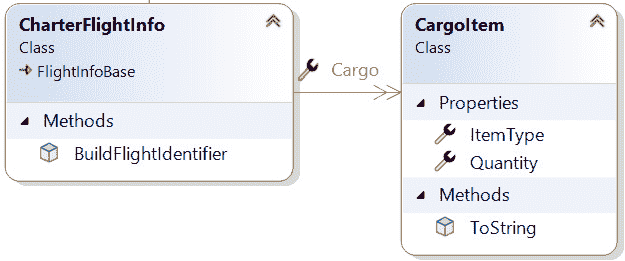

图 5.24 – CharterFlightInfo 由 CargoItems 组成

使用`CargoItems`组合我们的包机航班提供了额外的灵活性。不仅这种组合模式允许包机航班拥有多个货物项，而且它还允许这样做，而无需为不同的货物负载声明不同的类。

# 使用接口和多态改进类

我们几乎完成了关于面向对象重构的章节。然而，在我们结束这一章之前，让我们讨论一下在哪些地方引入接口和多态可以帮助进一步改进我们的代码。

## 提取接口

目前，我们的`CharterFlightInfo`类存储了一个表示其货物的`CargoItem`s 列表：

```cs
public class CharterFlightInfo : FlightInfoBase {
  public List<CargoItem> Cargo { get; } = new();
  // Other members omitted...
}
```

包机航班包含的每个货物项都必须是`CargoItem`或从它继承的某个东西。例如，如果我们创建上节中讨论的`HazardousCargoItem`并尝试将其存储在货物集合中，它*必须*从`CargoItem`继承才能编译。

在许多系统中，你不想强迫人们从你的类继承，如果他们想要自定义系统的行为。在这些地方，引入一个接口可能会有所帮助。

让我们通过选择`CargoItem`类，然后从**快速操作**菜单中选择**提取接口…**来用我们的`CargoItem`类做这件事。

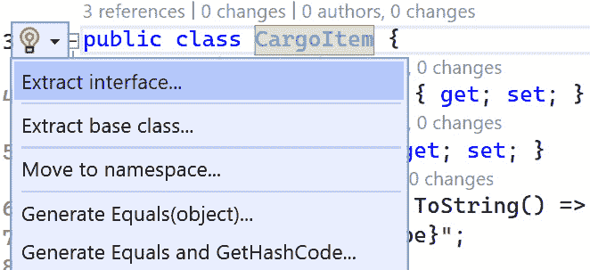

图 5.25 – 提取接口

一旦你做了这件事，如图*图 5**.25*所示，你现在需要指定哪些类的成员应该包含在接口中，以及接口应该叫什么名字：

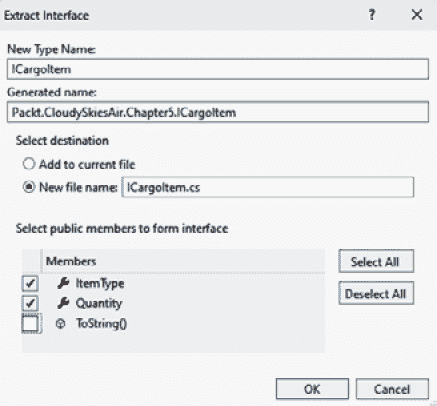

图 5.26 – 定制提取的接口

将你的接口命名为`ICargoItem`，选择`ItemType`和`Quantity`，然后在新文件中点击`ICargoItem`接口：

```cs
public interface ICargoItem {
  string ItemType { get; set; }
  int Quantity { get; set; }
}
```

这也将修改`CargoItem`以实现此接口：

```cs
public class CargoItem : ICargoItem {
  public string ItemType { get; set; }
  public int Quantity { get; set; }
  public override string ToString() =>
    $"{Quantity} {ItemType}";
}
```

注意，默认情况下，提取接口会在属性上引入获取器和设置器。如果你不希望你的接口暴露修改属性的方式，你可以在接口中从属性定义中移除`set`：

```cs
public interface ICargoItem {
  string ItemType { get; }
  int Quantity { get; }
}
```

移除设置器*不会阻止你*在`CargoItem`的属性上有一个设置器；它只是意味着你*不需要*在属性上有一个设置器。

我们有了新的接口，让我们进入并修改`CharterFlightInfo`以存储`ICargoItem`而不是`CargoItem`：

```cs
public class CharterFlightInfo : FlightInfoBase {
  public List<ICargoItem> Cargo { get; } = new();
  // Other members omitted...
}
```

这个变化使我们能够存储实现该接口的任何内容，并提高了`CharterFlightInfo`可以存储的内容的灵活性。然而，这也向你的代码中引入了另一个接口，这略微增加了复杂性，并可能在长期内减缓开发时间。

在引入接口时要小心。仅仅为了增加抽象而存在的接口最终会对你的应用程序造成更多的伤害而不是好处。然而，被多个类实现或旨在给另一组开发者提供更大自由度或灵活性的接口最终可以在软件系统中带来很多好处。

当我们探索 SOLID 时，我们将更详细地讨论接口的适当位置*第十章*。现在，让我们继续探讨 C#接口中的新功能。

## 提供默认接口实现

当我们在探索接口时，让我们看看**默认接口实现**如何简化实现接口的体验。

默认接口实现允许你在接口内部提供默认实现。当一个类选择实现此接口时，它不是*被迫*提供具有默认实现的方法的实现。

让我们通过向`ICargoItem`添加一个具有默认获取器的`ManifestText`属性和一个具有默认实现的`LogManifest`方法来了解这意味着什么：

```cs
public interface ICargoItem {
  string ItemType { get; }
  int Quantity { get; }
  string ManifestText => $"{ItemType} {Quantity}";
  void LogManifest() {
    Console.WriteLine(ManifestText);
  }
}
```

通过将这些新成员添加到接口中，我们通常会破坏实现该接口的任何内容，例如`CargoItem`类，除非它具有这些成员。然而，因为我们提供了这两个属性的*默认实现*，所以`CargoItem`不再*必须*提供实现。相反，它实际上继承了这些默认实现。

我们仍然可以提供这些新成员的版本。如果我们这样做，那么这个版本将用于替代默认实现：

CargoItem.cs

```cs
public class CargoItem : ICargoItem {
  public string ItemType { get; set; }
  public int Quantity { get; set; }
  public void LogManifest() {
    Console.WriteLine($"Customized: {ToString()}");
  }
  public override string ToString() =>
    $"{Quantity} {ItemType}";
}
```

我不太喜欢默认接口实现，因为它们混淆了接口与提供某些成员的契约的概念。

然而，我必须承认，当向接口添加简单成员时，有时添加默认实现是有意义的，这样你就不需要更改接口的现有实现。这可以让你在整个解决方案中避免在接口的多个实现中添加相同的代码。此外，默认接口实现通过提供默认实现减少了尝试实现接口的类所需的工作量。

## 引入多态

每当你使用接口时，你故意在应用程序中支持**多态**。这是根据对象的相似性而不是它们的差异来处理不同对象的能力。

之前介绍的与包机航班相关的`ICargoItem`方法是一个多态的例子。包机航班不关心它有什么类型的货物，只要货物实现了接口即可。这意味着我们可以装满不同类型货物的包机航班，并且这个类与它们一起工作得很好。

本章的代码中还有另一个地方可以从多态中受益：`FlightScheduler`的`Search`方法：

```cs
public IEnumerable<IFlightInfo> Search(FlightSearch s) {
  IEnumerable<IFlightInfo> results = _flights;
  if (s.Depart != null) {
    results =
      results.Where(f => f.Departure.Location == s.Depart);
  }
  // Many filters omitted...
if (s.MaxLength != null) {
    results =
      results.Where(f => f.Duration <= s.MaxLength);
  }
  return results;
}
```

此方法包含一些非常重复的代码（其中大部分被省略），用于检查搜索对象是否指定了属性。如果指定了属性，潜在的结果将被过滤，仅包括匹配过滤器的那些。

搜索方法使用这种方法根据以下条件进行过滤：

+   出发和到达地点

+   最小/最大出发时间

+   最小/最大到达时间

+   最小/最大飞行时长

想象一下我们可能需要过滤的新事物并不难，例如航班价格、航班是否有饮料服务，甚至是飞机的类型。

另一种方法是接受一个过滤器对象的集合。这些过滤器对象将通过一个共同的`FlightFilterBase`类和一个`ShouldInclude`方法来确定每架航班是否应该包含在结果中：

```cs
public abstract class FlightFilterBase {
  public abstract bool ShouldInclude(IFlightInfo flight);
}
```

通过这个改动，`Search`可以被修改为遍历所有过滤器，并且只包括通过所有提供过滤器的结果：

```cs
List<IFlightInfo> Search(List<FlightFilterBase> rules) =>
  _flights.Where(f => rules.All(r => r.ShouldInclude(f)))
          .ToList();
```

通过多态，这种方法将`Search`方法从超过 40 行代码缩短到只有 3 行代码。

替代实现

接口也可以很好地替代抽象基类。

通过遵循这个设计，我们可以创建一系列继承自`FlightFilterBase`的类，以提供特定的过滤功能：

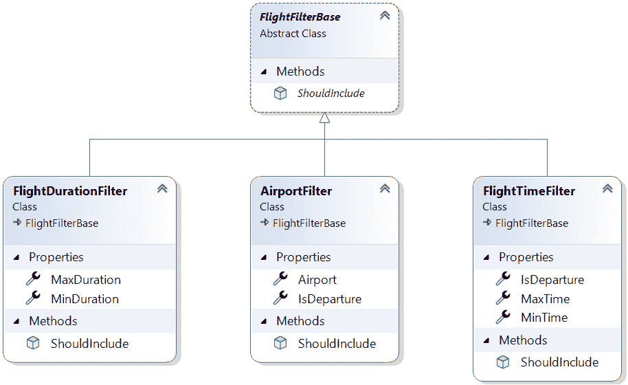

图 5.27 – 不同的过滤器类，有助于简化我们的搜索代码

现在我们有了专门的过滤器，可以过滤掉不符合特定标准的航班。例如，`AirportFilter`会过滤掉未指定机场的航班：

```cs
public class AirportFilter : FlightFilterBase {
  public bool IsDeparture { get; set; }
  public Airport Airport { get; set; }
  public override bool ShouldInclude(IFlightInfo flight) {
    if (IsDeparture) {
      return flight.Departure.Location == Airport;
    }
    return flight.Arrival.Location == Airport;
  }
}
```

每个单独的过滤器类都很小，易于理解、维护和测试。

此外，如果我们想在将来添加新的过滤航班的方式，我们只需要添加一个新的继承自`FlightFilterBase`的类。不需要对`Search`方法进行修改以支持这一点，因为所有方法需要的是一个过滤器集合。`Search`方法不需要知道涉及哪些过滤器 - 它只需要调用`ShouldInclude`方法并解释结果。

我发现多态解决方案非常美丽，并且发现我的编程风格在多年中发生了变化，以寻找更多利用继承或接口实现多态的机会。

# 审查和测试我们重构的代码

在做出这些更改后，让我们退后一步，看看结果。

我们对一个航班搜索系统进行了重构，通过以下方式使用面向对象编程技术来提高其灵活性和可维护性：

+   将代码重新组织到适当的文件和命名空间中

+   在飞行信息中引入基类并提高代码重用性

+   通过将参数移动到新类中来控制大量参数

+   引入一个新的类来管理关于机场事件的常见信息，包括机场和时间组件

+   添加一个包机航班类，并配备灵活的货物跟踪系统

+   引入一种多态的航班搜索方式，这将随着时间的推移变得更加灵活和易于维护

重构代码

本章的最终重构代码可在[`github.com/PacktPublishing/Refactoring-with-CSharp`](https://github.com/PacktPublishing/Refactoring-with-CSharp)存储库中的`Chapter05/Ch5RefactoredCode`文件夹中找到。

像往常一样，重构代码之前应该先测试代码，以确保重构过程中没有引入新的缺陷。运行解决方案中提供的测试（见*图 5.28*）显示所有测试都通过，这目前足够了，直到我们到达*第二部分*并更深入地探讨测试。


图 5.28 – 测试资源管理器显示所有测试通过

# 摘要

在本章中，我们探讨了如何使用面向对象编程技术，如继承、封装和多态，将代码重构为更易于维护的形式。

重构可能是一项复杂的任务，但许多面向对象编程的基本概念可以结合起来，构建出优雅、灵活且易于维护的解决方案。

这本书的*第一部分*到此结束。在书的下一部分，我们将探讨测试如何为你提供安全感和自由度，让你可以安全地重构代码，并充满信心地继续前进，相信你的更改已经改进了应用程序而没有破坏任何东西。

# 问题

1.  你的代码是否遵循一个结构良好且一致的命名空间层次结构，每个命名空间中的类数量既不太多也不太少？

1.  你的代码中是否有任何部分可以通过使用继承来提高代码重用性而得到改进？

1.  你能想到任何可能从多态中受益的重复规则或其他结构吗？

# 进一步阅读

你可以在以下 URL 中找到有关本章讨论的材料更多信息：

+   *C#中的继承：* [`learn.microsoft.com/en-us/dotnet/csharp/fundamentals/tutorials/inheritance`](https://learn.microsoft.com/en-us/dotnet/csharp/fundamentals/tutorials/inheritance)

+   *密封* *修饰符*：[`learn.microsoft.com/en-us/dotnet/csharp/language-reference/keywords/sealed`](https://learn.microsoft.com/en-us/dotnet/csharp/language-reference/keywords/sealed)

+   *IEquatable<T>*：[`learn.microsoft.com/en-us/dotnet/api/system.iequatable-1`](https://learn.microsoft.com/en-us/dotnet/api/system.iequatable-1)

# 第二部分：安全重构

在本书的第二部分，我们将介绍诸如单元测试之类的编码技术，这些技术有助于确保您的重构工作不会导致意外的更改。

本章重点介绍各种测试框架和标准测试实践，然后讨论编程最佳实践和编写 SOLID 代码。

本部分最后两章专注于更高级的测试策略以及 C#语言如何帮助您检测和防止错误传递给用户。

本部分包含以下章节：

+   *第六章**，单元测试*

+   *第七章**，测试驱动开发*

+   *第八章**，使用 SOLID 避免代码反模式* 

+   *第九章**，高级单元测试*

+   *第十章**，防御性编码技术*
