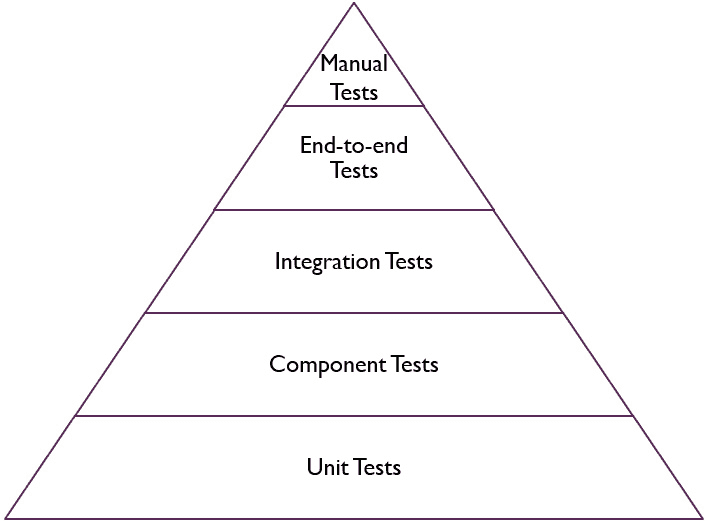
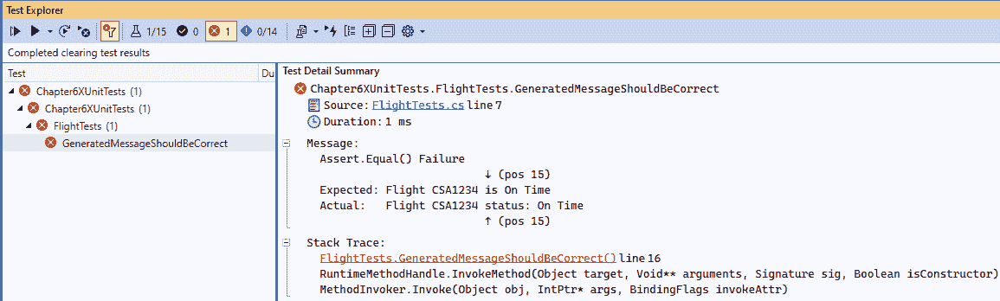
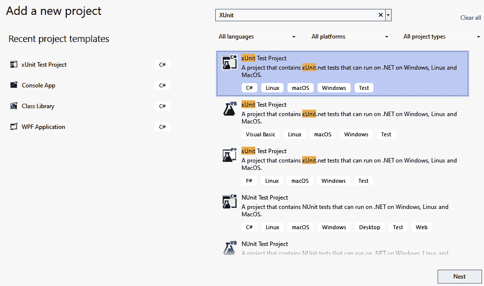
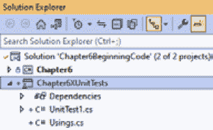
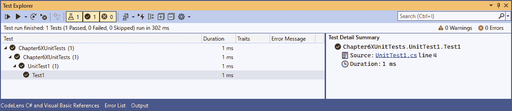
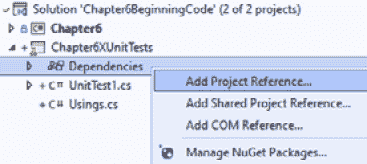
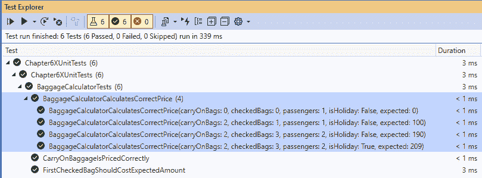
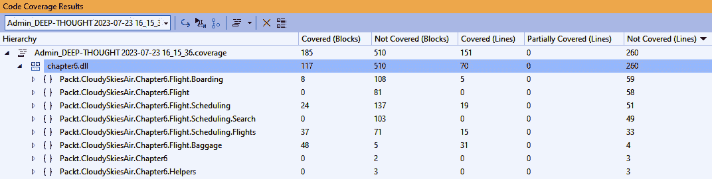
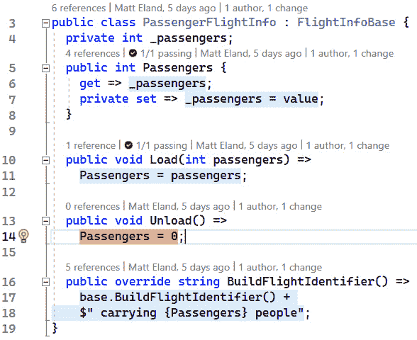

# 6

# 单元测试

在本书的第一部分，我们介绍了重构的过程和一些更常见的重构技术。现在，是我们退一步，提醒自己重构是什么：*重构是改变代码形式或形状的过程，而不改变其行为*。

换句话说，我们可以使我们的代码尽可能干净和易于维护，但如果这些更改引入了错误，那么这不算重构，因为重构是关于在不改变其行为的情况下改变代码的形式。为了在不引入错误的情况下改进我们的代码，我们需要一个安全网：**单元测试**。

在本章中，我们将探讨单元测试，并涵盖以下主要主题：

+   理解测试和单元测试

+   使用 xUnit 测试代码

+   重构单元测试

+   探索其他测试框架

+   采用测试思维

# 技术要求

本章的起始代码可以从 GitHub 的[`github.com/PacktPublishing/Refactoring-with-CSharp`](https://github.com/PacktPublishing/Refactoring-with-CSharp)在`Chapter06/Ch6BeginningCode`文件夹中获取。

# 理解测试和单元测试

每当我管理或指导其他开发者，他们想要对系统进行更改时，我会问他们一个问题：*“你如何确保你的更改不会* *破坏事物？”*

这个问题可能看起来很简单，但每个答案都归结为一个单一的概念：测试。

我将**测试**定义为*验证软件功能并检测程序行为中不希望的变化的过程*。

这种测试可以由人类执行，例如开发人员或质量保证分析师，或者可以通过软件执行，具体取决于所涉及的测试类型。

## 测试类型和测试金字塔

测试是一个广泛的领域，包括许多不同类型的活动，如下所示：

+   **手动测试**，涉及人员手动执行某些活动并验证结果。

+   **探索性测试**，这是手动测试的一个子集，专注于探索系统对事物的反应，以发现新的错误类型。

+   **单元测试**，在这种测试中，软件系统的小部分被单独测试。

+   **组件测试**，其中测试系统的较大组件。

+   **集成测试**，涉及两个组件，如 API 和数据库，它们一起被测试。

+   **端到端测试**，在这种测试中，整个系统路径都会被测试。这通常涉及多个组件按顺序交互。

这些活动中的大多数都是自动化测试，其中计算机代码与系统交互以验证其行为。我们将在本章末尾更多地讨论构成良好测试的因素。

自动化测试确实有一些缺点。首先，自动化测试需要时间来创建。通常，必须有人编写代码或使用某些工具来编写测试脚本。其次，这些测试通常需要持续维护，以保持与软件系统变化的关联。最后，这些测试可能会提供一种虚假的安全感。例如，假设一个开发者编写了一个测试来导航到“预订航班”网页并验证是否有空座位显示为可用。即使网页上有明显的错误和不匹配，这个测试也可能通过，仅仅是因为测试只编码了检查网页一小部分。

另一方面，人工测试人员是聪明的。他们有自由意志和主动性，可以对软件做出客观的判断，这是机器无法做到的。他们可以找到没有人想过要为它们编写测试的问题，并且可以提供关于您产品功能的有价值反馈。然而，人们通常比自动化测试慢得多，一旦某个功能准备好测试，质量保证分析师可能需要一些时间来测试它。

自动化和手动测试都有优点和缺点。一个并不比另一个更好；相反，它们结合起来为软件项目中的质量问题的有效解决方案。

软件质量中的一个流行概念是 **测试金字塔** 的想法。测试金字塔显示了组织可能执行的各种测试类型。此外，如图 *图 6.1* 所示，金字塔每个部分的宽度表示该类型测试的数量：



图 6.1 – 测试金字塔的一个示例

在一个测试金字塔中，例如这个，底部的项目应该是数量最多的，而金字塔顶部的项目应该是最稀少的。几乎每个测试金字塔的图表在金字塔中列出的测试类型上都有所不同，但它们都同意最常见的形式应该是单元测试，而最不常见的是手动测试。

许多组织在软件开发成熟度早期就犯了错误。当这种情况发生时，他们有很多手动测试，很少的单元测试，通常没有端到端、集成或组件测试。结果，金字塔看起来可能有点像 *图 6.2*：


图 6.2 – 具有许多手动测试、少量单元测试和没有其他测试的测试金字塔

这个金字塔 *应该* 看起来很荒谬，因为几乎总是缺乏测试自动化是缓慢过程、延迟发布和软件错误进入生产环境的配方！

您的系统越大，手动测试就越不切实际，手动发现错误的时间就越长。

解决这个问题的方法是 **自动化测试**，尤其是自动化单元测试。

## 单元测试

单元测试是代码中的小方法，用于测试系统中其他方法，以验证这些方法在特定场景下是否正确执行。

*更简洁地说，单元测试是测试其他代码的代码*。

已经熟悉测试了吗？

如果你经常使用单元测试，你可能已经熟悉单元测试了。如果是这样，你可能想快速浏览本章的其余部分，然后继续下一章。

为了说明单元测试的概念，让我们看看一个简单的生成航班状态信息的方法：

```cs
public class Flight {
  public string BuildMessage(string id, string status){
    return $"Flight {id} is {status}";
  }
}
```

虽然这个方法非常简单，但让我们考虑一下我们需要采取哪些步骤来验证它是否正确工作：

1.  实例化 `Flight` 类并将该对象存储在变量中。

1.  声明一对表示 `id` 和 `status` 的字符串变量。

1.  从 *步骤 1* 中调用我们的航班对象的 `BuildMessage` 方法。

1.  将 *步骤 3* 的结果存储在一个新的字符串变量中。

1.  验证我们刚刚存储的字符串是否与预期相符。

这基本上就是一个单元测试会做的事情。它会实例化你的类，*安排*它需要的变量，*执行*单元测试试图验证的方法，并最终 *断言* 方法的结果是否符合预期。我们称这种模式为 **安排/执行/断言** 模式，我们将在本章后面进一步讨论。

为了帮助说明这个概念，这里有一个 `BuildMessage` 方法的示例测试：

```cs
public class FlightTests {
  [Fact]
  public void GeneratedMessageShouldBeCorrect() {
// Arrange
    Flight flight = new();
    string id = "CSA1234";
    string status = "On Time";
    // Act
    string message = flight.BuildMessage(id, status);
    // Assert
    Assert.Equal("Flight CSA1234 is On Time", message);
  }
}
```

不要担心这里的特定语法，因为我们很快就会涉及到这一点。现在，理解 `GeneratedMessageShouldBeCorrect` 方法是测试一小段代码以验证特定功能的单元测试的例子。

具体来说，此方法验证 `Flight` 类的 `BuildMessage` 方法根据它接收的 `id` 和 `status` 参数计算并返回准确的状态信息。

此测试可以快速与解决方案中的所有其他测试一起运行，如果 `BuildMessage` 方法按预期工作，则通过；如果 `BuildMessage` 的结果有任何变化，则失败，如图 *6**.3* 所示：



图 6.3 – 一个失败的单元测试

像这样的测试失败是有帮助的，因为它们突出了开发者可能在没有失败的测试标记潜在问题的前提下发布到生产环境中的错误。

在下一节中，我们将通过介绍最流行的单元测试框架：**xUnit**，来更深入地探讨单元测试。

# 使用 xUnit 测试代码

xUnit.net，通常简称为 xUnit，是目前 .NET 中最受欢迎的单元测试库，其次是 `Attributes`，你可以使用它来标识你的测试代码，我们很快就会看到。使用这些属性可以让测试运行器，如 Visual Studio 的 **测试资源管理器**，识别你的方法为单元测试并运行它们。

本章的代码从到目前为止的章节中的大多数类开始，组织在 `Chapter6` 的 `Chapter6BeginningCode` **解决方案** 内的各种命名空间中。

解决方案和项目

在 .NET 中，一个项目代表一个具有特定目的的 .NET 代码的独立程序集。不同的项目有不同的类型，从桌面应用程序到 Web 服务器，再到类库和测试项目。另一方面，解决方案将所有这些项目组合成一个相互关联的项目集合。

在本章的剩余部分，我们将为前几章中的几个类编写测试。由于 xUnit 目前是最受欢迎的测试库，让我们首先向解决方案中添加一个新的 xUnit 测试项目。

## 创建 xUnit 测试项目

要向解决方案添加新项目，请右键单击 **解决方案资源管理器** 顶部的解决方案名称，位于搜索栏下方，然后选择 **添加**，接着选择 **新建项目…**

接下来，搜索 `xUnit` 并选择带有 C# 标签的 **xUnit 测试项目** 结果，如图 *图 6.4* 所示。请注意，还有使用其他语言（如 VB 或 F#）的此测试项目的版本：



图 6.4 – 选择 xUnit 测试项目选项

点击 `Chapter6XUnitTests`，然后再次点击 **下一步**。

在此之后，您需要选择要使用的 .NET 版本。由于本书中的代码使用 **.NET 8**，您可以选中该选项并点击 **创建**。

这应该在您的编辑器中打开一个新文件，其中包含一些基本的测试代码：

UnitTest1.cs

```cs
namespace Chapter6XUnitTests {
    public class UnitTest1 {
        [Fact]
        public void Test1() {
        }
    }
}
```

此外，一个新的项目已添加到您的解决方案中，现在在 **解决方案资源管理器** 中可见，如图 *图 6.5* 所示：



图 6.5 – 解决方案资源管理器中的测试项目

我们还需要执行几个步骤来测试其他项目中的代码。但在我们这样做之前，可能会让您惊讶的是，xUnit 创建的代码已经是一个可运行的单元测试。

点击 `Test1` 单元测试，一旦测试运行，它将变成绿色勾选标记，如图 *图 6.6* 所示：



图 6.6 – 测试资源管理器，测试展开到 Test1 可见的位置

故障排除

如果在运行测试后看不到 **测试资源管理器**，请点击 **视图** 菜单，然后选择 **测试资源管理器**。您可能还需要在运行测试成为选项之前构建解决方案。

注意，我们当前的测试并不算是一个真正的测试，我们还没有涵盖代码或它是如何工作的。我们很快就会到达那里，但首先，让我们完成设置测试的最后一步，并将我们的测试项目连接到 `Chapter6` 项目。

## 将 xUnit 测试项目连接到主项目

在.NET 中，项目可以依赖于其他项目中的代码。这允许你在一个项目中定义一个类，另一个项目可以使用该类。为了能够从我们的单元测试项目中测试代码，我们需要能够做到这一点。因此，我们需要从测试项目设置一个项目依赖到`Chapter6`项目。

在**解决方案资源管理器**中，在测试项目内的**依赖项**节点上右键单击，并选择**添加项目引用…**，如图*图 6**.7*所示：



图 6.7 – 向我们的测试项目添加项目引用

然后，点击“解决方案资源管理器”中测试项目内的“依赖项”节点旁边的复选标记，并点击`Chapter6`项目，以便测试项目现在可以引用其他项目中定义的类。

在所有这些准备就绪后，我们就可以编写我们的第一个真正的测试了。

## 编写你的第一个单元测试

我们的第一批测试将测试我们在*第二章*中构建的`BaggageCalculator`类。

`BaggageCalculator`有一个名为`CalculatePrice`的方法，其方法签名如下：

```cs
public decimal CalculatePrice(int bags, int carryOn,
  int passengers, bool isHoliday)
```

我们还知道这个方法的一些规则：

+   所有手提行李每件费用为 30 美元

+   乘客托运的第一个行李箱的费用为 40 美元

+   每个后续托运的行李箱费用为 50 美元

+   如果旅行发生在假日期间，将应用 10%的附加费

我们无法在单个测试中测试所有这些逻辑，而且我们也不应该尝试这样做。单元测试应该是小的，并且与一个特定的逻辑相关。如果测试失败，这个失败应该告诉你很多关于系统错误的信息。如果单元测试试图做太多，它们就变得难以理解，失败时告诉你更少关于错误的信息。

让我们从将我们的`UnitTest1`类重命名为`BaggageCalculatorTests`开始，使用我们在*第二章*中介绍的重命名重构功能。测试通常以它们测试的类的名称命名。由于我们的类测试`BaggageCalculator`，让我们将其重命名为`BaggageCalculatorTests`。

接下来，我们将重命名`Test1`方法，以反映我们试图验证的内容。这个测试的名称将出现在测试失败中。因此，我的一个基本原则是，如果收到一个测试失败的提醒，其名称本身就应该告诉我出了什么问题。

在我们的案例中，我们试图验证手提行李的定价是否正确。因此，让我们将`Test1`重命名为类似`CarryOnBaggageIsPricedCorrectly`的名称。

我们现在的代码如下所示：

```cs
namespace Chapter6XUnitTests {
  public class BaggageCalculatorTests {
    [Fact]
    public void CarryOnBaggageIsPricedCorrectly() {
    }
  }
}
```

在我们编写测试代码之前，让我们强调几个关键点：

+   首先，我们的方法应用了`Fact`属性。这允许 xUnit 告诉测试运行器关于我们的测试的信息，并有效地为潜在的执行注册测试。

+   接下来，`CarryOnBaggageIsPricedCorrectly`方法返回`void`且不接受任何参数。使用`Fact`属性的测试方法不能接受参数，必须返回`void`或`Task`以进行异步测试。我们将在本章后面讨论`Theory`和`InlineData`，因为它们允许你向单元测试传递参数。

+   最后，类和方法都是`public`的。为了单元测试出现在测试运行器中，两者都必须是`public`。

现在我们已经介绍了一些单元测试的基本机制，让我们遵循*arrange*/*act*/*assert*模式来构建我们的测试。

## 使用 Arrange/Act/Assert 组织测试

**arrange/act/assert 模式**是一个结构化模式，用于编写测试。遵循*arrange*/*act*/*assert*时，你执行以下步骤：

1.  通过声明变量**安排**你需要用于测试的事情。

1.  **执行**你试图测试的具体事情。

1.  **断言**你的操作产生了预期的结果。

让我们从整理代码开始。由于我们要在`BaggageCalculator`类上测试`CalculatePrice`方法，我们需要实例化一个行李计算器的实例。

我们还知道我们需要传递已检查的和托运行李的数量，以及乘客数量以及旅行是否在假日季节。这些值应该是我们认为最相关或最具代表性的测试值，因此它们取决于我们的判断。

用变量声明填充我们的*arrange*部分会产生以下代码：

```cs
[Fact]
public void CarryOnBaggageIsPricedCorrectly() {
    // Arrange
    BaggageCalculator calculator = new();
    int carryOnBags = 2;
    int checkedBags = 0;
    int passengers = 1;
    bool isHoliday = false;
```

在这里，我们正在设置执行*act*阶段所需的一切。此外，请注意，我包含了一个`// Arrange`注释来将相关代码分组。这是我和许多其他我知道的开发者在测试代码中做的事情，以帮助组织测试。

现在我们已经设置了变量，我们可以对我们要测试的代码：`CalculatePrice`方法进行操作。为此，我们必须调用该方法，并存储它返回的`decimal`值：

```cs
// Act
decimal result = calculator.CalculatePrice(checkedBags,
  carryOnBags, passengers, isHoliday);
```

与*arrange*部分不同，*act*部分非常简短，通常只有一行长。这是因为*act*部分专注于你试图测试的事情。我们调用之前实例化的计算器对象上的测试方法，并传递它执行工作所需的参数。

被测试的系统

在我们的例子中，`calculator`变量存储了我们正在测试的类的实例。这通常被称为即将测试的对象的`sut`变量名。

这里有趣的是：从我们的测试角度来看，我们不在乎它是如何完成工作的。我们只关心我们给方法一组输入，并期望得到特定的输出。

我们在*assert*部分通过断言一些事情是真实的来验证这种行为。如果这些事情最终*不是*真实的，我们的测试将失败。如果所有这些事情最终都是真实的，测试将通过。

断言通常使用`Assert`类来验证值是否与其预期值匹配。在我们的案例中，场景有 2 个托运行李，没有其他行李。每个托运行李 30 美元，这应该总计 60 美元，所以我们的测试代码如下：

```cs
// Assert
Assert.Equal(60m, result);
```

`Equal`方法的第一参数是预期值。这是你期望你的结果应该是的值。你不应该在代码中计算这个值；否则，你可能会在测试你正在测试的代码时重复相同的潜在不良逻辑！

第二个参数是实际值，这几乎总是你在*act*部分调用你的方法的结果。

通常，对测试新手来说，他们期望第一个参数是实际值，第二个参数是预期值。然而，这是不正确的，会导致测试失败时值被颠倒的困惑测试。

例如，如果结果是 50，并且我们像之前那样正确地用`Assert.Equal(60m, result);`验证了它，你会看到这样的失败：

```cs
  Assert.Equal() Failure
  Expected: 60
  Actual:   50
```

这很有帮助，并告诉开发者出了什么问题。

如果你混淆了两个参数并编写了`Assert.Equal(result, 60m);`，你会得到这样一个更令人困惑的消息：

```cs
  Assert.Equal() Failure
  Expected: 50
  Actual:   60
```

这个错误在过去给我带来了很多困惑和头发脱落。请自己帮个忙，记住第一个参数总是你期望结果为的值。

在*第九章* *高级单元测试*中，我们将介绍使用**Shouldly**和**FluentAssertions**库编写断言的更简洁方法。现在，请记住预期的值先写，实际的值后写。

其他 Assert 方法

`Assert`类除了`Assert.Equal`之外还有更多方法。你还可以使用`Assert.True`和`Assert.False`来验证布尔条件是否为真或假。`Assert.Null`和`Assert.NotNull`可以帮助验证某个东西是否为 null。`Assert.Contains`和`Assert.DoesNotContain`将验证集合中元素的存在或不存在。这些只是通过`Assert`类可用的方法中的一部分。对于这些消息中的每一个，你还可以提供一个自定义的失败消息，当断言导致你的测试失败时使用。

现在我们已经添加了第一个单元测试，让我们具体谈谈什么使测试通过，什么使测试失败。

## 理解测试和异常

每次运行的单元测试都会通过——除非它遇到了让它失败的东西。

那个失败可能是`Assert`语句与预期值不匹配，或者可能是你的程序或测试抛出了异常而没有捕获它。

当你调查`Assert`方法的实现时，你会发现当它们的条件不满足时，它们都会抛出异常。当这些异常被抛出时，测试运行器会捕获它们并使测试失败，适当地显示失败信息和堆栈跟踪。

这就是为什么一个空的测试即使没有任何`Assert`语句也会通过，这也是为什么你通常永远不会在单元测试中编写`try`/`catch`块，除非你明确地试图验证某种异常处理逻辑。

带着对导致测试失败的因素的理解，让我们编写第二个测试。

## 添加额外的测试方法

就像类可以在其中包含多个方法一样，测试类也可以在其中包含多个测试方法。这是因为从每个意义上说，单元测试只是代码。单元测试存在于每个方面都很普通的类中，除了它们存在于一个特殊的项目类型中，并且单个单元测试方法在声明方法之前有`[Fact]`。

让我们通过添加一个针对下一个场景的测试来举例说明：*第一个托运行李费用为 40 美元*。这个测试看起来是这样的：

```cs
[Fact]
public void FirstCheckedBagShouldCostExpectedAmount() {
  // Arrange
  BaggageCalculator calculator = new();
  int carryOnBags = 0;
  int checkedBags = 1;
  int passengers = 1;
  bool isHoliday = false;
  // Act
  decimal result = calculator.CalculatePrice(checkedBags,
carryOnBags, passengers, isHoliday);
  // Assert
  Assert.Equal(40m, result);
}
```

这个测试与之前的测试有很多相似之处，但关键的区别在于携带行李和托运行李的数量已更改，以匹配我们正在测试的新场景，并且预期的总价现在是 40 美元而不是 60 美元。

你编写的每个测试都应该不同。然而，如果你开始注意到测试之间存在很多共性，那么可能就是时候重构你的单元测试了。

# 重构单元测试

单元测试是代码，就像其他类型的代码一样，如果得不到适当的尊重和主动重构，它们的质量可能会随着时间的推移而下降。

因此，当你看到代码中存在诸如在大多数测试中出现的重复代码这样的代码异味时，这是一个迹象，表明你的测试需要重构。

在本节中，我们将探讨几种重构测试代码的方法。

## 使用`Theory`和`InlineData`参数化测试

当我们考虑两个测试之间的相似性时，它们只基于传递给我们要测试的方法的值以及我们期望的结果值而有所不同。

考虑到我们的测试方法，这是一个很明显的例子，如果能有一个参数可以输入到一个测试方法中，就能代表多个单元测试，每个测试都略有不同，但代码相似，那就太好了。

如您可能从之前的内容中回忆起来，使用`Fact`的单元测试不能有任何参数。然而，xUnit 给了我们另一个属性叫做`Theory`，它允许我们将数据作为参数传递给单元测试。

有多种不同的方式向这些参数提供数据，但最常见的方式是使用`InlineData`属性在方法旁边提供测试参数数据。

以下是一个使用`Theory`和`InlineData`来测试围绕行李定价的四个不同场景的示例，使用相同的测试代码：

```cs
[Theory]
[InlineData(0, 0, 1, false, 0)]
[InlineData(2, 3, 2, false, 190)]
[InlineData(2, 1, 1, false, 100)]
[InlineData(2, 3, 2, true, 209)]
public void BaggageCalculatorCalculatesCorrectPrice(
  int carryOnBags, int checkedBags, int passengers,
  bool isHoliday, decimal expected) {
    // Arrange
    BaggageCalculator calculator = new();
    // Act
    decimal result = calculator.CalculatePrice        (checkedBags, carryOnBags, passengers, isHoliday);
    // Assert
    Assert.Equal(expected, result);
}
```

虽然这只是一个单一的方法，但每个`InlineData`行代表一个独特的单元测试，如图*图 6.8*所示，它将作为单独的测试出现在测试运行器中：



图 6.8 – 测试资源管理器中基于理论的四个测试被单个测试分组

尽管使用 `理论` 而不是 `事实` 可能一开始更难阅读，但可维护性的优势是巨大的。首先，参数化测试减少了代码重复。其次，如果你以后需要更新测试，你只需要更新一个方法，而不是使用 `事实` 编写相同测试时需要更新的许多单独的方法。

## 使用构造函数和字段初始化测试代码

`理论` 并不是提高测试代码的唯一方法。如果你发现你的测试做了很多可以共享的工作，你可以引入私有方法来帮助组织你的测试代码。

例如，假设你想测试来自 *第五章* 的 `FlightScheduler` 类，并且你想从测试通过 `ScheduleFlight` 将航班添加到计划中，并在调用 `GetAllFlights` 时显示该航班开始。

要做到这一点，你已经创建了一个 `FlightSchedulerTests` 类，并且正在编写一个 `ScheduleFlightShouldAddFlight` 单元测试。

当你开始编写测试时，你会注意到 `ScheduleFlight` 方法需要一个 `IFlightInfo` 实例，而这个实例反过来又需要几个 `AirportEvent` 对象。这些 `AirportEvent` 对象需要它们自己的 `Airport` 实例。

这些依赖关系导致你编写了大量 *安排* 代码来为测试设置：

```cs
[Fact]
public void ScheduleFlightShouldAddFlight() {
  // Arrange
  Airport airport1 = new() {
    Code = "DNA",
    Country = "United States",
    Name = "Dotnet Airport"
  };
  Airport airport2 = new() {
    Code = "CSI",
    Country = "United Kingdom",
    Name = "C# International Airport"
  };
  FlightScheduler scheduler = new();
  PassengerFlightInfo flight = new() {
    Id = "CS2024",
    Status = FlightStatus.OnTime,
    Departure = new AirportEvent() {
        Location = airport1,
        Time = DateTime.Now,
    },
    Arrival = new AirportEvent() {
        Location = airport2,
        Time = DateTime.Now.AddHours(2)
    }
  };
```

这大量的代码并不一定是 *坏* 的，但它确实分散了测试方法的其他部分，该部分执行调度并验证航班是否已添加：

```cs
  // Act
  scheduler.ScheduleFlight(flight);
  // Assert
  IEnumerable<IFlightInfo> result =
    scheduler.GetAllFlights();
  Assert.NotNull(result);
  Assert.Contains(flight, result);
}
```

虽然 `安排` 部分很长并不是世界末日，但其他测试可能需要创建自己的 `PassengerFlightInfo`、`Airport` 或 `AirportEvent`，这会导致测试之间出现非常相似的代码。

为了帮助提高我们安排方法的可读性，我们可以引入两个机场的字段，并在构造函数中设置它们：

```cs
public class FlightSchedulerTests {
  private readonly Airport _airport1;
  private readonly Airport _airport2;
  public FlightSchedulerTests() {
    _airport1 = new() {
        Code = "DNA",
        Country = "United States",
        Name = "Dotnet Airport"
    };
    _airport2 = new() {
        Code = "CSI",
        Country = "United Kingdom",
        Name = "C# International Airport"
    };
  }
```

当 xUnit 运行你的测试代码时，它将为该类中的每个单元测试实例化一次 `FlightSchedulerTests` 类。这意味着构造函数或字段初始化器中的任何逻辑都会在运行该类中的任何测试时运行。

这让我们可以显著简化测试的 `安排` 部分：

```cs
// Arrange
FlightScheduler scheduler = new();
PassengerFlightInfo flight = new() {
    Id = "CS2024",
    Status = FlightStatus.OnTime,
    Departure = new AirportEvent() {
        Location = _airport1,
        Time = DateTime.Now
    },
    Arrival = new AirportEvent() {
        Location = _airport2,
        Time = DateTime.Now.AddHours(2)
    }
};
```

这个过程可以根据需要重复。例如，如果你想在不同测试之间重用相同的 `PassengerFlightInfo`，你可以在构造函数中添加一个 `_flight` 字段并初始化它。

重构过程不是关于最小化 *安排* 部分的大小；它是关于在保持代码重复低的同时，让其他阅读你代码的开发者能够看到测试的重要方面。

## 使用方法共享测试代码

你可以使用另一种技术来保持你的代码集中，那就是从你的测试代码中提取可重用方法，以帮助完成常见的 *安排* 任务。

例如，如果你想测试移除航班是否正确地从调度器中移除航班，你需要一个与刚才我们讨论的测试非常相似的测试。

当你这么想的时候，这两个测试并不太关心被添加的航班的详细信息——它们关心的是，当航班被安排时，它应该出现在航班列表中，而当航班被移除时，它应该不再被包含。

为了实现这一点，我们可以提取一个方法来创建我们的`Flight`对象。这个方法可以接受一个航班标识符并返回创建的航班，如下所示：

```cs
private PassengerFlightInfo CreateFlight(string id)
  => new() {
    Status = FlightStatus.OnTime,
    Id = id,
    Departure = new AirportEvent() {
      Location = _airport1,
      Time = DateTime.Now
    },
    Arrival = new AirportEvent() {
      Location = _airport2,
      Time = DateTime.Now.AddHours(2)
    }
  };
```

我们之前的测试现在可以调用这个方法来创建其航班：

```cs
[Fact]
public void ScheduleFlightShouldAddFlight() {
  // Arrange
  FlightScheduler scheduler = new();
  PassengerFlightInfo flight = CreateFlight("CS2024");
  // Act
  scheduler.ScheduleFlight(flight);
  // Assert
  IEnumerable<IFlightInfo> result =
    scheduler.GetAllFlights();
  Assert.NotNull(result);
  Assert.Contains(flight, result);
}
```

你觉得这个方法有多专注？你可以快速阅读它，并了解测试的意图，而无需关注创建航班的所有必要机制。

测试`void`方法

我经常遇到的一个问题是“如何测试`void`方法，因为它们不返回任何内容？”大多数时候，当你编写测试时，你会测试方法的返回值，但针对`void`方法，你测试的是该方法的副作用。这个`ScheduleFlight`测试就是一个例子，说明了如何测试`void`方法。在我们的案例中，安排航班的副作用应该是当我们从调度器获取所有航班时，航班会出现在列表中。

现在，让我们看看航班移除测试，它使用了相同的方法：

```cs
[Fact]
public void RemoveShouldRemoveFlight() {
  // Arrange
  FlightScheduler scheduler = new();
  PassengerFlightInfo flight = CreateFlight("CS2024");
  scheduler.ScheduleFlight(flight);
  // Act
  scheduler.RemoveFlight(flight);
  // Assert
  IEnumerable<IFlightInfo> result =
    scheduler.GetAllFlights();
  Assert.NotNull(result);
  Assert.DoesNotContain(flight, result);
}
```

这个方法专注于安排航班然后移除它，并验证航班不再出现在航班列表中。如果添加和移除航班没有从航班列表中移除它，那将是一个错误，测试将失败。

在测试类之间共享方法

如果你发现许多测试类都会从相同的“辅助”方法中受益，例如`CreateFlight`，你可能想要考虑将这些辅助方法移动到测试项目的静态类中。这种模式有时被称为**ObjectMother**或 Builder 模式，在*进一步阅读*部分有更详细的描述。

或者，你可以引入一个基测试类，将你的共享方法移动到那个类中，然后让测试从那个类继承。测试类和测试项目就像正常代码一样，本书第一部分中使用的许多重构技巧也可以帮助你改进测试。

在我们结束本章关于采用测试思维的讨论之前，让我们简要地看看另一对流行的 C#测试框架。

# 探索其他测试框架

除了 xUnit 之外，最受欢迎的测试框架是**NUnit**和**MSTest**。

这两个框架与 xUnit 的操作方式非常相似，但在声明单元测试时使用的语法略有不同。

我有机会在专业和休闲方面使用所有三个主要的测试框架，我可以告诉你，这些差异在很大程度上是表面的。话虽如此，你会发现某些框架具有某些特定功能，这些功能可能不在其他框架中。

## 使用 NUnit 进行测试

在这三个测试框架中，NUnit 的语法是我最喜欢的，因为它使用 `Test` 名称来表示既不需要参数的单元测试（相当于 xUnit 的 `Fact`），也需要参数的单元测试（相当于 xUnit 的 `Theory`）。

这里有一个参数化测试，用于验证 `PassengerFlightInfo` 上的 `Load` 方法：

```cs
public class PassengerFlightTests {
    [TestCase(6)]
    public void AddPassengerShouldAdd(int passengers) {
        // Arrange
        PassengerFlightInfo flight = new();
        // Act
        flight.Load(passengers);
        // Assert
        int actual = flight.Passengers;
        Assert.AreEqual(passengers, actual);
        Assert.That(actual, Is.EqualTo(passengers));
    }
}
```

在 `NUnit` 中，Test 和 `TestCase` 替代了 Theory 和 `InlineData`。如果这个测试不是参数化的，`TestCase` 将变为 `Test`。

这个测试的断言部分有一点不同。首先要注意的是，NUnit 的断言方法是 `Assert.AreEqual` 而不是 `Assert.Equal`。虽然这只是细微的差别，但我发现代码读起来更好。

在 `Assert.AreEqual` 行下面是 `Assert.That` 行。这是 NUnit 的较新的单元测试约束模型；它读起来更流畅，并减少了在断言中混淆预期值和实际值等参数的可能性。两种编写 NUnit 测试的方式都是有效的，并且运行良好。

最后一点需要注意：在 NUnit 中，测试类中的所有测试共享同一个类实例。这意味着存储在测试的字段或属性中的值将被该测试类中的所有测试共享。这与为每个运行的测试创建新测试类实例的 xUnit 不同。

在探索了 NUnit 之后，让我们来看看 MSTest。

## 使用 MSTest 进行测试

MSTest 的官方名称是 **Visual Studio 单元测试框架**，但该框架在社区中以及微软内部文档中都被广泛称为 **MSTest**。

MSTest V2

由于 MSTest 与 NUnit 和 xUnit 之间缺乏功能一致性，MSTest 几乎十年来的声誉都很差。但在 2016 年，微软对 MSTest 进行了修订，称之为 **MSTest V2**，并将许多改进引入到框架中，使其现在与竞争对手处于同一水平。

与 NUnit 一样，MSTest 使用单个 `TestMethod` 属性来标记参数化和非参数化的单元测试。然而，与 NUnit 和 xUnit 不同，MSTest 还需要在类本身上使用 `TestClass` 属性来使单个测试可发现。这是在编写 MSTest 测试时需要注意的事情，因为它是你可能会错过以使测试不在测试运行器中显示的另一个因素。

让我们看看 MSTest 中一个示例参数化测试，该测试验证了 `BoardingProcessor` 类中的 `Passenger` 类的 `FullName` 属性：

```cs
[TestClass]
public class PassengerTests {
  [TestMethod]
[DataRow("Calvin", "Allen", "Calvin Allen")]
  [DataRow("Matthew", "Groves", "Matthew Groves")]
  [DataRow("Sam", "Gomez", "Sam Gomez")]
  [DataRow("Brad", "Knowles", "Brad Knowles")]
  public void PassengerNameShouldBeCorrect(string first,
    string last, string expected) {
    // Arrange
    Passenger passenger = new() {
      FirstName = first,
      LastName = last,
    };
    // Act
    string fullName = passenger.FullName;
    // Assert
    Assert.AreEqual(expected, fullName);
  }
}
```

在这里，这个参数化测试评估了本书每位技术审查者的姓名，从 `DataRow` 中获取，就像 xUnit 中的 `InlineData` 或 NUnit 中的 `TestCase` 一样。

虽然 MSTest 的语法不同，但它与其他测试框架之间有许多相似之处。

MSTest 与 NUnit 之间的主要区别在于包含`TestClass`属性以及分别使用`TestMethod`和`DataRow`名称代替`Test`和`TestCase`。甚至在两个框架中`Assert.AreEqual`方法的命名也是相同的。

最终，这三个测试框架都非常相似，并在实现高质量软件的目标中发挥着强大的作用。我发现我可以在这三个框架中的任何一个框架中有效地工作。虽然我倾向于更喜欢 NUnit 的语法，但我使用 xUnit 来处理新项目，因为 xUnit 在很大程度上已经成为社区标准。

我的建议是选择你最喜欢的语法库，并将其用于你的项目，并将你的精力集中在编写良好的测试和采取测试心态上。

# 采取测试心态

让我们退一步，谈谈为什么一本关于重构的书会围绕测试展开整整一系列章节。原因是需要重构的代码通常更加易变，在更改时更容易出错。由于重构的艺术在于在不改变软件行为的情况下改变其形式，因此在重构时引入错误是不受欢迎且不可接受的。

这就是测试发挥作用的地方。测试为你和你团队提供所需的信心，以便能够改进代码。你的遗留代码可能已经或尚未包含测试，因此在进行任何测试工作之前，确保存在良好测试的责任和必要性落在你的身上。

这需要你采取测试心态。这个短语指的是在开发过程的**开始**就将测试视为软件开发和重构的一个关键组成部分，而不是事后考虑。

尽管我们将在下一章详细探讨这个概念，当我们讨论**测试驱动开发**时，让我们简要提及一些有助于你在组织中成功进行测试并采取测试心态的考虑因素。

## 将测试融入工作流程

测试应该是软件工程师日常生活中的一个标准部分。

这意味着每当你对系统进行任何更改时，都应该考虑进行测试，无论这些更改是新增功能、修复错误还是通过重构来偿还技术债务。

这需要从将测试视为繁琐或应该做的事情的心态转变为将测试视为对代码库甚至对整个组织具有内在价值的思维。这是因为测试通过充当代码库的“活文档”、提供对未来某些类型错误的防护网以及增强你和你团队对所编写代码的信心来提供价值。

当然，你可能会遇到一些测试起来非常困难的软件片段。这些可能是与用户界面一起工作的代码片段，或者可能是与其他系统有非常强依赖关系的代码片段。

我们将在本节稍后和*第八章*和*第九章*中再次讨论依赖关系，但通常使用专门的工具和库进行用户界面测试，并且根据你是在测试 Web、桌面还是移动应用程序而有所不同。因此，用户界面测试超出了本书的范围。然而，隔离依赖通常是这个过程的一个重要部分。

## 隔离依赖

当我们谈论隔离依赖时，这意味着当我们测试一段代码时，测试它不应该改变其他任何东西。

例如，当我们试图验证安排航班会将航班添加到系统中的航班列表时，我们不希望每次运行我们的单元测试时系统都发送带有航班确认的电子邮件！

这样的例子可能看起来像这样：

```cs
public class FlightScheduler {
  private readonly EmailClient _email = new();
  public void ScheduleFlight(Flight flight) {
     // other logic omitted...
     _email.SendMessage($"Flight {flight.Id} confirmed");
  }
}
```

在这里，`FlightScheduler`有一个`EmailClient`类，每次安排航班时都会在客户端上调用`SendMessage`。这是`FlightScheduler`对`EmailClient`类的强依赖，会导致在测试此代码时发送电子邮件的不希望出现的副作用。

发送电子邮件或与文件系统或数据库交互等副作用通常在单元测试中是不希望的，我们将在稍后讨论。

虽然让系统能够执行这些操作是好事，但我们希望在不产生我们不喜欢的副作用的情况下，单独测试我们的代码单元。我们可以通过一种称为**依赖注入**的过程来解决这个问题，在这个过程中，一个类不再负责创建它需要的依赖，而是从其他地方获取它们。

`FlightScheduler`的一个更可测试的版本可能看起来像这样：

```cs
public class FlightScheduler {
  private readonly IEmailClient _email;
  public FlightScheduler(IEmailClient email) {
    _email = email;
  }
  public void ScheduleFlight(Flight flight) {
     // other logic omitted...
     _email.SendMessage($"Flight {flight.Id} confirmed");
  }
}
```

在这里，对`EmailClient`类的依赖是通过构造函数注入到这个类中的，并使用一个新的`IEmailClient`接口，这样我们就可以为测试使用这个接口的不同实现。这个针对测试的版本不会产生发送电子邮件的负面副作用，使其更可接受。

依赖注入及其相关术语，**控制反转**和**依赖倒置**，是复杂的话题，需要一些时间来掌握。因此，我们将在*第八章*中重新讨论它们，*使用 SOLID 避免代码反模式*。此外，经验丰富的测试人员可能会大声疾呼，一个模拟框架，如 Moq 或 NSubstitute，可以帮助解决一些这些问题。我们将在*第七章*中介绍这些库。

现在，让我们继续讨论构成良好和不良测试的其他因素。

## 评估良好和不良测试

良好的单元测试应该是这样的：

+   **运行速度快**：如果测试需要几分钟才能运行，开发者就不会运行它们。

+   **可靠和可重复**：测试不应该随机失败或通过或失败，这取决于星期几、一天中的时间或之前运行了哪些其他测试。

+   **相互独立**：一个测试永远不应该影响另一个测试的通过或失败，并且测试不需要按特定顺序运行。

+   **隔离性**：它们应该与数据库、磁盘上的文件、云资源或外部 API 等依赖项保持独立。这些事情不仅会减慢你的测试速度，而且如果我们正在测试这些交互，那么那是一个**集成测试**，而不是单元测试。

+   **可读性**：测试作为如何与你的类交互的示例。此外，当测试失败时，其失败应该容易理解。

+   **便携性**：测试不应该需要显著的机器设置，并且应该在任何开发者的机器上或在**持续集成/持续交付**（**CI/CD**）管道中的另一台机器上可运行。

相比之下，糟糕的测试需要时间来运行，是“不可靠的”并且随机失败，不能并行运行或按顺序运行，在理解它们测试的内容或为什么测试它们方面很困难，并且需要大量手动配置才能可靠地运行。

通常，你希望优先考虑许多小型单元测试，这些测试运行速度快、易于理解且可靠，而不是更雄心勃勃的测试，这些测试一次测试太多东西，导致测试缓慢，且测试失败不明确、不可靠。

## 关于代码覆盖率

我不能不介绍**代码覆盖率**就谈论单元测试。代码覆盖率是作为任何单元测试一部分运行的代码行。如果一个测试导致代码行运行，它被认为是已覆盖的；否则，它被认为是未覆盖的。

几种工具可以计算代码覆盖率，包括 Visual Studio Enterprise 和 JetBrains ReSharper，我们简要讨论了*第二章*。如果你有 Visual Studio Enterprise，你可以通过选择**测试**菜单然后**分析所有测试的代码覆盖率**来计算代码覆盖率。这将显示被单元测试覆盖和未覆盖的代码行，如图*图 6.9*所示：



图 6.9 – Visual Studio Enterprise 中代码覆盖率结果的概述

这些覆盖率结果将突出显示任何未由单元测试覆盖的行，例如`PassengerFlightInfo`中的`Unload`方法的代码，如图*图 6.10*所示：



图 6.10 – 覆盖的行以蓝色突出显示，而未测试的行以红色突出显示（行 14）

代码覆盖率是那些可能引起分歧的话题之一。一方面，代码覆盖率为你提供了一个指标，显示了你的代码有多少部分被任何测试执行。这为你提供了一个有意义的衡量单元测试安全网范围的方法。

然而，代码覆盖率可能会产生误导。仅仅运行一行代码并不意味着该行的效果已被单元测试验证。这可能导致您对单元测试产生错误的安全感。

此外，当组织优先考虑提高代码覆盖率百分比或要求新工作必须达到一定最低代码覆盖率的工作时，这可能导致测试集中在软件系统风险较低的部分。例如，您需要编写一个单元测试来验证当将 null 值传递给方法时抛出 `ArgumentNullException` 错误的代码，还是您的时间花在其他地方更好？

通常，应用程序中最关键的区域可能已经出现在代码覆盖率指标中，但没有测试验证这些行是否正确工作。

我个人的感觉是，代码覆盖率是许多有用的指标之一，但不应被用来显著影响开发团队的行为。

请参阅 *进一步阅读* 部分，了解更多关于代码覆盖率和如何开始计算它的信息。

我们将在 *第十二章* 中探索其他指标，*Visual Studio 中的代码分析*，但在此，让我们以一些关于单元测试的总结来结束本章。

# 摘要

单元测试是验证重构代码不会引入错误、记录类文档以及防止未来出现错误的有效方式。

单元测试是测试其他代码的代码。在 .NET 中，项目单元测试通常使用 xUnit、NUnit 或 MSTest 来执行。每个测试框架都提供断言，用于验证代码是否正确行为，或者在实际值与预期值不匹配时失败测试。

当我们编写单元测试时，我们通常按照 *arrange*/*act*/*assert* 模式来组织我们的测试，在 *arrange* 步骤中设置要测试的对象，在 *act* 步骤中执行单个操作，并在 *assert* 步骤中验证操作结果的正确性。

在下一章中，我们将通过测试驱动开发来探索更多的测试。

# 问题

回答以下问题以测试您对本章知识的了解：

1.  您最喜欢哪种单元测试框架的语法？

1.  您的应用程序中最复杂的部分是什么？它们被测试了吗？

1.  您会如何测试一个计算申请者信用评分的方法？

1.  您如何测试一个 `void` 方法？

1.  您可以做些什么来帮助测试代码保持整洁和可读性？

# 进一步阅读

您可以通过查看以下资源来找到有关本章讨论的材料更多信息：

+   *测试类型*: [`learn.microsoft.com/en-us/dotnet/core/testing/`](https://learn.microsoft.com/en-us/dotnet/core/testing/)

+   *Visual Studio Test Explorer*: [`learn.microsoft.com/en-us/visualstudio/test/run-unit-tests-with-test-explorer`](https://learn.microsoft.com/en-us/visualstudio/test/run-unit-tests-with-test-explorer)

+   *xUnit*: [`xunit.net/`](https://xunit.net/)

+   *NUnit*：[`nunit.org/`](https://nunit.org/)

+   *MSTest*：[`learn.microsoft.com/en-us/dotnet/core/testing/unit-testing-with-mstest`](https://learn.microsoft.com/en-us/dotnet/core/testing/unit-testing-with-mstest)

+   *对象母体* 模式：[`www.martinfowler.com/bliki/ObjectMother.html`](https://www.martinfowler.com/bliki/ObjectMother.html)

+   *代码覆盖率*：[`learn.microsoft.com/en-us/visualstudio/test/using-code-coverage-to-determine-how-much-code-is-being-tested`](https://learn.microsoft.com/en-us/visualstudio/test/using-code-coverage-to-determine-how-much-code-is-being-tested)
