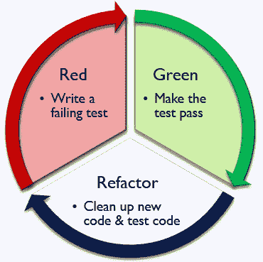
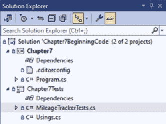
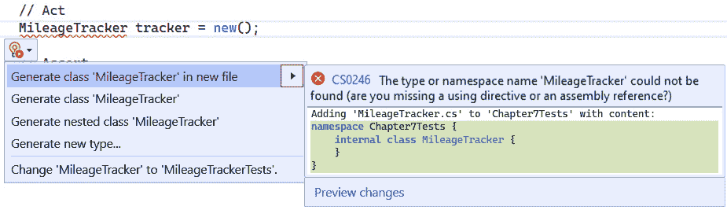
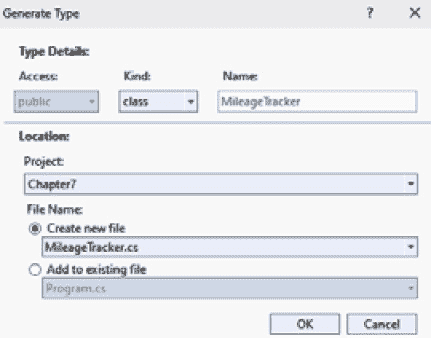
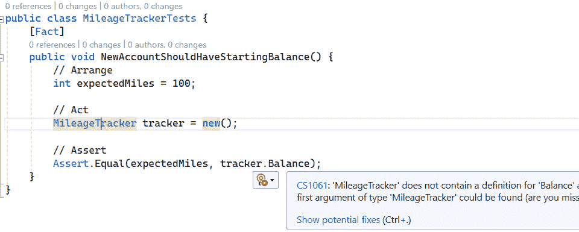
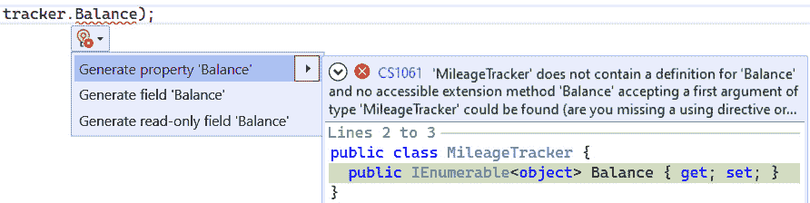
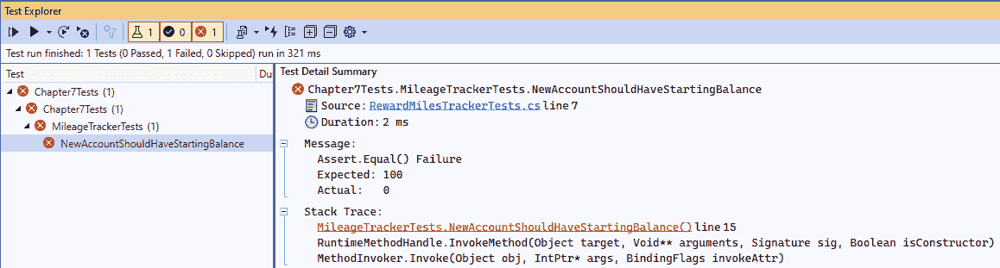
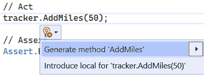
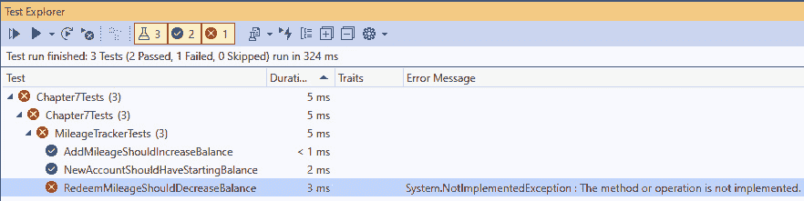
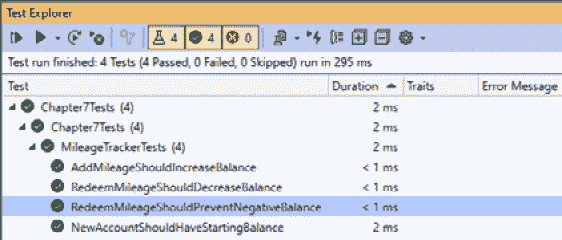

# 第七章：测试驱动开发

让我们通过深入探讨测试驱动开发来继续我们的讨论，以确保我们软件过程的质量。

虽然这是一本关于重构和测试驱动开发的书籍，主要目的是为了未来的开发和修复 bug，但它有一些关键的教训要教给我们关于软件质量，并且 Visual Studio 提供的支持测试驱动开发的工具在重构过程中也能极大地帮助。

在本章中，我们将涵盖以下主要主题：

+   什么是测试驱动开发？

+   使用 Visual Studio 进行测试驱动开发

+   何时使用测试驱动开发

# 技术要求

本章的起始代码可以从 GitHub 的[`github.com/PacktPublishing/Refactoring-with-CSharp`](https://github.com/PacktPublishing/Refactoring-with-CSharp)在`Chapter07/Ch7BeginningCode`文件夹中获取。

# 什么是测试驱动开发？

**测试驱动开发**（**TDD**）是指在编写新功能或实施新修复的代码之前，先编写测试的过程。

在 TDD 下，你首先为你要实现的功能或为重现你即将修复的 bug 编写一个测试。你以最理想的方式做这件事，这甚至可能涉及到测试开始时还不存在的类或方法。

接下来，你进行最小的工作量，使你的代码能够成功编译。这并不是说它运行得完美或者完成了它试图做的事情，实际上，你试图从一个红色的失败测试开始，这表明你的功能或修复不起作用。

考虑到这一点，你还没有实现新功能或对代码进行修复。所以，测试*应该*是一个失败的测试。

接下来，你编写最小的代码，使你的测试通过。在这个步骤中，你正在做你需要做的事情来满足你试图解决的具体要求。一旦完成，你的测试应该变成绿色的通过测试。

之后，你重构你添加的代码以实现你的功能或修复，同时也要重构你的测试代码；注意继续运行你的单元测试，以确保你没有破坏任何东西。

一旦你对你的新代码和测试的状态感到满意，你就可以查看当前工作项上的下一个要求，为那个要求编写一个测试，然后重复这个过程，直到你满足了所有要求。这个过程在*图 7.1*中得到了说明：



图 7.1 – 测试驱动开发周期

因为你是从一个失败的红色测试开始的，然后过渡到绿色的通过测试，然后在你开始新的要求之前重构你的代码，所以 TDD 有时被称为**红/绿/** **重构**。

这个过程有几个关键的好处：

+   你可以通过从测试开始来确信你的代码解决了问题。

+   以这种方式编写的代码保证会被你的测试覆盖。

+   当你从其他人如何调用你的代码开始时，往往会引导出更直观的类设计，供其他人以后使用。

这个过程及其结果，通过一个实际例子会更有意义。所以，让我们跳入一些代码，为 Cloudy Skies Airlines 实现一个新功能。

# 使用 Visual Studio 进行测试驱动开发

我们将以一个几乎空的控制台项目和已经链接到主项目的支持 xUnit 测试项目开始这一章，如图 *第六章* 所示。这个项目的结构可以在 *图 7**.2* 中看到：



图 7.2 – 仅显示几个文件的解决方案资源管理器

在本节剩余的部分，我们将为 Cloudy Skies Airlines 添加一个新的类来跟踪常旅客里程。

我们将要解决的要求（按顺序）是：

+   当创建一个新的常旅客账户时，它应该从 100 英里起始余额开始。

+   你应该能够向常旅客账户添加里程。

+   只要这不会导致余额为负，你应该能够标记里程为已兑换。

这些要求并不复杂，但它们应该作为简要探索 TDD 的起点。

我们将从起始余额要求开始。

## 设置起始余额

我们的第一个要求涉及账户从已经注册的 100 英里开始。

在 TDD 的指导下，我们应该从一个失败的测试开始。幸运的是，我们已经有了一个 `MilesTrackerTests.cs` 文件，这为我们提供了一个良好的起点。

然而，我们在 `Chapter7` 项目中没有类来表示里程追踪器，这在我们编写第一个测试的安排部分时给我们带来了问题。

虽然现在创建类可能会有点“作弊”的诱惑，但让我们遵循严格的 TDD 方法，并按照我们希望与类交互的方式编写测试代码，知道这个类还不存在，这将在不久的将来给我们带来一些编译错误。

这样的测试可能看起来像这样：

```cs
[Fact]
public void NewAccountShouldHaveStartingBalance() {
  // Arrange
  int expectedMiles = 100;
  // Act
  MileageTracker tracker = new();
  // Assert
  Assert.Equal(expectedMiles, tracker.Balance);
}
```

这个测试设置了一个预期的起始里程变量，尝试实例化一个 `MileageTracker`，然后断言这个新追踪器的 `Balance` 属性应该是预期的金额。

这是一个简单、简洁且易于阅读的测试，但存在一些小问题：`MileageTracker` 和其 `Balance` 属性在我们的代码中尚不存在，这意味着我们的代码无法编译。

### 生成类

在 TDD 编码时创建新类和新属性时出现的编译问题是很正常的，也是可以预料的。幸运的是，Visual Studio 为我们提供了一个快速操作重构功能。

在你的操作部分选择 `MileageTracker` 并打开快速操作菜单。从那里注意各种选项来生成此类型，如图 *图 7**.2* 所示：



图 7.3 – 快速操作以生成新的类型

这些选项，如图所示，非常好，但其中大多数都会在测试项目中创建新的类，这不是我们想要的。由于我们想要自定义正在创建的新类型，请选择 **生成** **新类型…**

这将打开 **生成类型** 对话框，允许您选择新生成类型的类型、名称和位置。将 **项目** 更改为 *Chapter7* 并选择创建一个新文件，如图 *图 7.4* 所示：



图 7.4 – 在 Chapter7 项目中生成新的类

接下来，点击 `MileageTracker.cs` 文件到主项目。

目前这个类里面什么都没有，很无聊，但当我们处理下一个编译错误时，我们会很快添加内容。

### 生成成员

回到我们的测试中，现在 *操作* 部分没有问题，但我们仍然在 *断言* 部分对 `Balance` 的引用上有编译错误，如图 *图 7.5* 所示：



图 7.5 – C# 编译器指出 MileageTracker 有 Balance 属性

幸运的是，Visual Studio 给我们提供了生成属性的工具。现在让我们这样做，这样我们的代码至少可以编译。

选择 **Balance**，然后打开 **快速操作** 菜单，选择 **生成属性‘Balance’**，如图 *图 7.6* 所示：



图 7.6 – 生成新的属性

这样做会导致 Balance 被定义。如果您按住 *Ctrl* 并单击 `Balance`，它将带您导航到 `MileageTracker.cs`，我们将看到类是如何定义的：

```cs
public class MileageTracker {
  public IEnumerable<object> Balance { get; set; }
}
```

在这里，Visual Studio 必须猜测 `Balance` 属性的类型，并且猜测得非常糟糕。由于这否则会导致编译错误，将 `Balance` 改为 `int`：

```cs
public class MileageTracker {
  public int Balance { get; set; }
}
```

随着这个更改，代码现在应该可以编译，但在我们运行测试之前，让我们再做一个更改。

记住，TDD 要求我们编写最少的代码来完成我们想要做的事情吗？技术上讲，Visual Studio 通过为我们的 Balance 属性生成获取器和设置器违反了这一原则。在这个测试中，我们只需要获取 `Balance`，而不需要通过这个属性来设置它。所以，让我们通过移除设置器来保护这个 `Balance`：

```cs
public class MileageTracker {
  public int Balance { get; }
}
```

在有了这段额外的封装并代码编译无误后，让我们运行我们的测试。当你这样做时，你应该会看到测试失败，指出它期望 `Balance` 为 100，但实际上是 0，如图 *图 7.7* 所示：



图 7.7 – 我们的第一个失败的测试

在 TDD 下，这正是我们想要的。我们做了最少的努力来得到一个理想的测试编译，而这个测试失败了，因为我们还没有完全实现这个功能。

### 从红色变为绿色，并进行重构

让我们现在实现这个功能。

虽然我们知道我们的 `MileageTracker` 将需要一些额外的功能，但让我们通过编写尽可能少的代码来实现这个功能：

```cs
public class MileageTracker {
  public int Balance { get; } = 100;
}
```

现在默认将新的 `MileageTracker` 实例的起始余额设置为 100，这符合我们的需求，并在重新运行测试时使测试变为绿色并通过。

在绿色测试之后，我们现在寻找重构的机会。虽然我们的测试代码是最小的，但 `MileageTracker` 中确实有一个 **魔法数字**。魔法数字是代表某种未记录的业务或技术需求的 **代码异味**。

让我们通过引入一个常量来修复它：

```cs
public class MileageTracker {
    private const int SignUpBonus = 100;
    public int Balance { get; } = SignUpBonus;
}
```

这段代码现在更容易被其他人理解，消除了代码异味。

命名

在软件工程中给事物命名是困难的。可能您对这个类或我引入的 `SignUpBonus` `const` 的名字与我选择的名称不同。这没关系。一个名字最重要的地方是它能向其他开发者传达意图，并且不会与系统中的其他事物混淆。虽然 `StartingBalance` 这个名字对我这个常量来说已经足够好了，但我选择了 `SignUpBonus`，因为它更清楚地记录了起始余额的业务案例。

再次运行测试后，结果再次是一个绿色的通过测试，并且没有其他明显的重构目标，所以我们继续到下一个需求。

## 添加里程和生成方法

我们下一个需求是 *您应该能够向常旅客账户添加里程*。

让我们回到我们的测试中，为这个需求添加一个新的测试。这里我们再次选择最直观的语法，然后稍后使代码编译并通过测试：

```cs
[Fact]
public void AddMileageShouldIncreaseBalance() {
  // Arrange
  MileageTracker tracker = new();
  // Act
  tracker.AddMiles(50);
  // Assert
  Assert.Equal(150, tracker.Balance);
}
```

这个测试实例化了一个 `MileageTracker`，然后尝试使用尚未创建的 `AddMiles` 方法添加 50 英里，并在验证余额为 150（100 英里起始里程加上我们刚刚添加的 50 英里）之前进行。

当然，在 `MileageTracker` 中没有 `AddMiles` 方法。让我们通过选择 `AddMiles` 并从 **快速操作** 菜单中选择 **生成方法`AddMiles`** 来添加一个，如图 *图 7.8* 所示：



图 7.8 – 添加新方法

添加此方法会导致它以以下实现被创建：

```cs
public void AddMiles(int v) {
  throw new NotImplementedException();
}
```

显然，这不是该方法应该做的事情。然而，让我们遵循严格的 TDD，一步一步地完成这些动作。

由于我们的代码现在可以编译，我们可以运行测试并验证它是否按预期失败。

一旦我们确信我们有一个可以检测到我们编写的失败代码的测试，我们就只编写使测试通过所需的最少代码。这确保了我们的测试足以在以后找到代码的实际问题。

`AddMiles` 的一个通过实现可能看起来像这样：

```cs
public class MileageTracker {
    private const int SignUpBonus = 100;
    public int Balance { get; set; } = SignUpBonus;
    public void AddMiles(int miles) {
      Balance += miles;
    }
  }
}
```

如您所见，代码现在可以编译，并导致绿色测试。这意味着我们应该继续根据需要重构我们的代码。

测试代码仍然干净，我看到的唯一重构可能是使用我们在*第四章*中介绍的表达式-bodied 成员。然而，我将保留代码的当前形式，因为类仍然非常简单。

那个需求完成之后，让我们继续到最后一个关于兑换里程的需求。

## 兑换里程和重构测试

我们最终的需求是*你应该能够在不会导致负余额的情况下标记里程数为已兑换*。这个需求比上一个需求复杂一些，因为它附带了一个条件。

如同之前，让我们先编写一个测试用例：

```cs
[Fact]
public void RedeemMileageShouldDecreaseBalance() {
    // Arrange
    MileageTracker tracker = new();
    tracker.AddMiles(900);
    // Act
    tracker.RedeemMiles(250);
    // Assert
    Assert.Equal(750, tracker.Balance);
}
```

这个测试应该看起来非常类似于我们之前的`AddMiles`测试，除了它调用了一个新的`RedeemMiles`方法。

让我们使用前面展示的*生成方法*重构来生成那个空的`RedeemMiles`方法，并允许代码编译。

这应该会导致如*图 7.9*所示的红色失败测试，因为该方法中默认的`throw new NotImplementedException`行：



图 7.9 – 移除里程测试因抛出异常而失败

然而，通过镜像我们对`AddMiles`所做的操作，从红色变为绿色在这里又是微不足道的：

```cs
public class MileageTracker {
    private const int SignUpBonus = 100;
    public int Balance { get; set; } = SignUpBonus;
    public void AddMiles(int miles) {
      Balance += miles;
    }
    public void RedeemMiles(int miles) {
      Balance -= miles;
    }
  }
}
```

这样我们的测试就通过了，因此我们继续寻找重构选项。这段代码并不差，所以我们继续寻找下一个需求。

在这种情况下，我们没有完全满足我们试图解决的问题的需求，因为我们没有涵盖尝试提取比账户中更多的里程数的情况。让我们为那种情况编写一个新的测试用例：

```cs
[Fact]
public void RedeemMileageShouldPreventNegativeBalance() {
    // Arrange
    MileageTracker tracker = new();
    int startingBalance = tracker.Balance;
    // Act
    tracker.RedeemMiles(2500);
    // Assert
    Assert.Equal(startingBalance, tracker.Balance);
}
```

此测试创建一个账户并记录其初始余额。然后，测试尝试提取比账户初始余额更多的里程数，并验证最终余额是否等于初始余额。

这不依赖于跟踪器中的任何新方法。因此，我们的代码无需更改即可编译。然而，运行此测试会导致失败，指出预期余额为 100，但实际为-2400。

拿着红色的测试用例，让我们修改`RedeemMiles`方法，使其测试变为绿色：

```cs
public void RedeemMiles(int miles) {
  if (Balance >= miles) {
    Balance -= miles;
  }
}
```

现在，我们检查是否有足够的里程来满足请求，并且只有在该条件满足的情况下才减少里程。

再次运行测试，结果是一组全部通过测试，如*图 7.10*所示：



图 7.10 – 四个关于里程的通过测试

拿着通过测试用例，我们现在来看重构。由于`MileageTracker`简洁明了，我们将继续查看我们的测试。

关于异常怎么办？

目前，如果你请求比预期更多的里程，`RedeemMiles`将静默失败，这可能会让你作为开发者感到一些警觉。在现实世界的应用中，你可能希望这个方法要么返回一个布尔值来指示兑换是否成功，要么在兑换不可能时抛出一个异常。这两种情况都可以在 TDD（测试驱动开发）中作为额外的实现要求来处理，例如，“如果我们尝试兑换比可能的更多的里程，应该抛出`InvalidOperationException`”。

观察我们的测试，我们可以看到`RemoveMileageShouldDecreaseBalance`和`RemoveMileageShouldPreventNegativeBalance`确实做了类似的事情。

由于测试之间的重复，我们应该将这些测试合并为一个`Theory`，其中`InlineData`行代表单个测试用例。这看起来可能如下所示：

```cs
[Theory]
[InlineData(900, 250, 750)]
[InlineData(0, 2500, 100)]
public void RedeemMileageShouldResultInCorrectBalance(
  int addAmount, int redeemAmount, int expectedBalance) {
    // Arrange
    MileageTracker tracker = new();
    tracker.AddMiles(addAmount);
    // Act
    tracker.RedeemMiles(redeemAmount);
    // Assert
    Assert.Equal(expectedBalance, tracker.Balance);
}
```

此表单允许许多测试向余额添加一个初始金额，兑换一定数量的里程，然后验证结果是否与预期余额相符。这也让我们能够轻松地添加新场景，一旦我们识别出它们。

然而，方法的名称不如我们为单个`Fact`测试使用的更具体名称有意义。

通过测试和重构完成，我们现在可以继续进行这个功能中的下一个需求，或者继续处理我们队列中的下一个工作项。让我们通过讨论在项目中的高级 TDD（测试驱动开发）及其适用时机来结束这一章节。

# 何时使用测试驱动开发

TDD（测试驱动开发）并不总是适合每个任务。有些任务，如高度可视的用户界面设计可能不太适合 TDD（测试驱动开发）的工作流程，而其他任务，如修复在生产中观察到的错误或向计算中添加新的特殊情况，几乎非常适合 TDD（测试驱动开发）。

使用 TDD（测试驱动开发）的结果是代码通常更容易理解，测试覆盖率完美或接近完美，并且鼓励在开发过程中进行重构。

许多开发者遵循 TDD（测试驱动开发），但并不像本章所述那样严格。例如，他们可能不会仅仅生成一个方法，而是会继续实现该方法并编写额外的参数验证代码，而这些代码并不是他们特定测试所必需的。

这种对 TDD（测试驱动开发）的偏离很常见，通常也是可接受的，尽管这通常会导致添加一些没有支持测试的代码。

最终，这取决于你和你团队决定什么最适合你们的工作，但我可以告诉你，我在其中使用 TDD（测试驱动开发）的项目往往能迅速达到更高的质量水平，鼓励更多的重构，并且有更好的长期成功。

# 摘要

在本章中，我们介绍了测试驱动开发（TDD）并展示了其过程，即只编写最少的代码来达到一个失败的测试——用最少的代码使测试通过——然后，在继续下一个需求或工作项之前，根据需要重构所有代码。

我们也看到了 Visual Studio 中的快速操作功能，这些功能允许你生成类型、属性和方法，并支持你遵循 TDD 的努力。

在下一章中，我们将讨论可能导致代码难以维护的反模式和有助于使你的代码健壮且易于维护的 SOLID 原则。

# 问题

1.  你代码的哪些领域适合使用 TDD？

1.  哪些领域可能更难应用 TDD？

# 进一步阅读

你可以在以下网址找到关于本章讨论的材料更多信息：

+   *测试驱动开发（TDD）入门指南*：[`learn.microsoft.com/en-us/visualstudio/test/quick-start-test-driven-development-with-test-explorer`](https://learn.microsoft.com/en-us/visualstudio/test/quick-start-test-driven-development-with-test-explorer)

+   *TDD 是否已死？*：[`martinfowler.com/articles/is-tdd-dead/`](https://martinfowler.com/articles/is-tdd-dead/)
