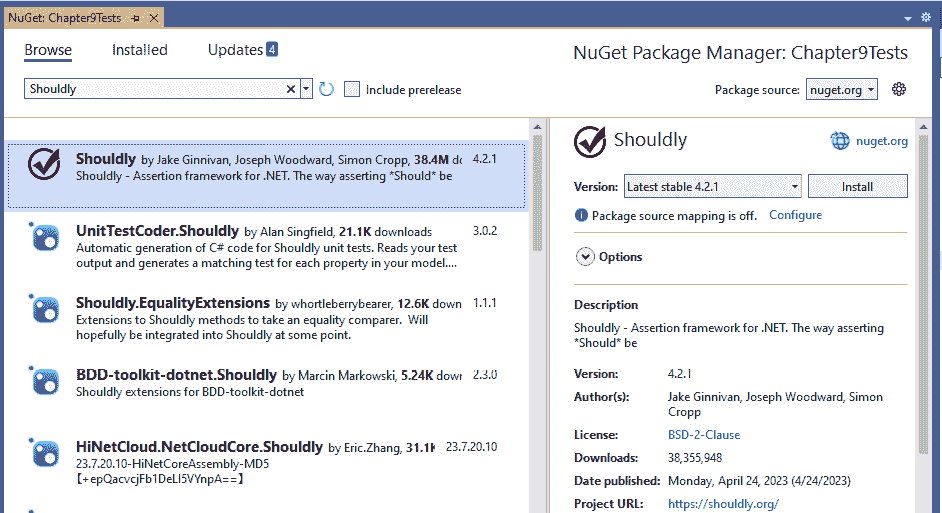
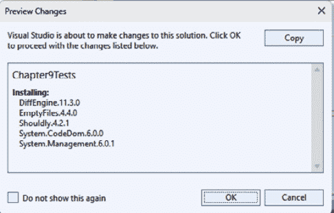
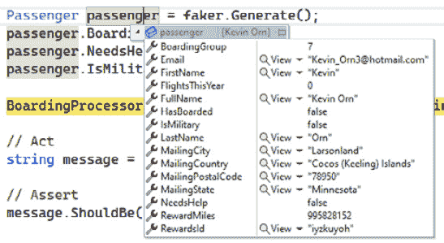
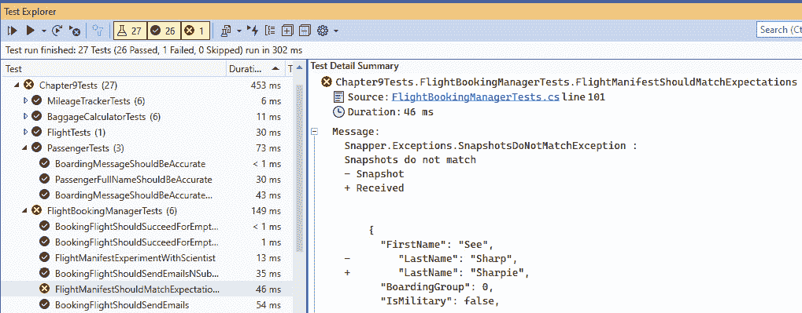
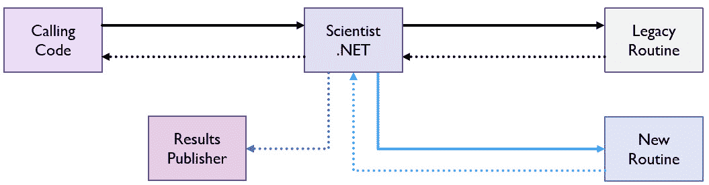

# 高级单元测试

正如我们所见，测试非常强大，可以给你在相对安全的情况下有效地重构代码的自由。有时，代码的编写方式使得测试变得困难，你需要一些额外的工具。在本章中，我们将探讨一些流行的.NET 库，这些库可以提高你测试的可读性，并为你提供更多的测试代码选项——包括那些具有复杂数据或依赖关系的棘手类。

本章我们将探讨以下主题：

+   使用 Shouldly 创建可读性强的测试

+   使用 Bogus 生成测试数据

+   使用 Moq 和 NSubstitute 模拟依赖项

+   使用 Snapper 固定测试

+   Scientist .NET 的实验

# 技术要求

本章的代码可以从 GitHub 的`Chapter09`文件夹中获取，链接为 https://github.com/PacktPublishing/Refactoring-with-CSharp。

库会随着新版本的发布而发生变化，其中一些变化可能会影响本章中的代码。因此，以下是本章编写时使用的库的确切名称和版本：

+   **Bogus 34.0.2**

+   **FluentAssertions 6.11.0**

+   **Moq 4.20.2**

+   **NSubstitute 5.0.0**

+   **Scientist 2.0.0**

+   **Shouldly 4.2.1**

+   **Snapper 2.4.0**

# 使用 Shouldly 创建可读性强的测试

在*第六章*中，我们看到了如何使用`Assert`类通过如下代码来验证现有类的行为：

```cs
Assert.Equal(35, passengerCount);
```

这段代码验证`passengerCount`是否等于`35`，如果不同则测试失败。

不幸的是，这段代码有两个问题：

+   断言方法首先接受预期值，然后是实际值。这与大多数人思考事物的方式不同，可能会导致令人困惑的测试失败消息，正如我们在*第六章*中看到的。

+   这段代码用英语读起来并不十分流畅，这可能会在你阅读测试时减慢你的速度。

几个开源库通过引入一系列扩展方法，为编写单元测试中的断言提供替代语法，来解决这一问题。

其中最受欢迎的库是 FluentAssertions 和 Shouldly。虽然 FluentAssertions 是迄今为止最受欢迎的库，但我发现 Shouldly 的阅读起来更自然，所以我们将从它开始。

在查看 FluentAssertions 的类似示例之前，让我们先看看如何安装 Shouldly 以及如何开始使用其语法。

## 安装 Shouldly NuGet 包

Shouldly 不是 Visual Studio 中任何项目模板默认包含的库。因此，我们需要将其添加到我们的项目中。

在 Visual Studio 中，我们使用名为**NuGet 包管理器**的**包管理器**来从包源（如[nuget.org](http://nuget.org)）安装外部依赖项。

如果你曾经使用过 JavaScript 进行编程，那么这个概念与 JavaScript 包管理器如 Yarn 或 NPM 非常相似。虽然其他包管理器会下载代码并让你进行编译，但 NuGet 会下载 *编译* 版本的代码，并允许你的代码引用那些项目中定义的内容，而不会减慢你的构建过程。

要安装一个包，在 **解决方案资源管理器** 中右键点击 `Chapter9Tests` 项目，然后选择 **管理** **NuGet 包**。

接下来，在搜索栏中点击 `Shouldly`。你的搜索结果应该类似于 *图 9**.1* 中的那些：



图 9.1 – 显示 Shouldly 结果的 NuGet 包管理器

你应该在左侧的列表中看到一个名为 Shouldly 的条目，作者是 Jake Ginnivan 等。通过点击它来选择它。右侧的详细信息将列出有关此包的信息，包括其许可条款和依赖项。

小贴士

总是检查你正在寻找的作者和包的确切名称，因为许多包有类似的名字。

使用右侧详细信息区域的 **Version** 下拉菜单，你可以选择要安装的库的特定版本。通常，保持为最新稳定版本是没问题的，但偶尔你可能需要为了兼容性选择一个早期版本。

当你点击 **安装** 时，Shouldly 及其依赖项将自动下载并安装到你的项目中。在安装包时，可能会打开一个窗口显示各种许可条款或依赖项，如 *图 9**.2* 所示。请仔细阅读这些内容，特别是如果你在办公场所使用库的话：



图 9.2 – 安装 Shouldly 所需的依赖项

现在我们已经安装了 Shouldly，让我们学习如何使用它。

## 使用 Shouldly 编写可读的断言

在 `PassengerTests.cs` 文件中，有一个现有的 `PassengerFullNameShouldBeAccurate` 测试，它会实例化一个 `Passenger` 对象，从对象的 `FullName` 字段中获取值，并确保生成的名称与预期值匹配，如下面的代码所示：

```cs
[Fact]
public void PassengerFullNameShouldBeAccurate() {
    // Arrange
    Passenger passenger = new() {
        FirstName = "Dot",
        LastName = "Nette",
    };
    // Act
    string name = passenger.FullName;
    // Assert
    Assert.Equal("Dot Nette", name);
}
```

使用 Shouldly，我们可以使这个断言变得更加易读。

首先，让我们通过在该文件的末尾添加一个 `using` 语句来添加一个 `Usings.cs` 文件：

```cs
global using Xunit;
global using Shouldly;
```

这 `global using` 指令允许你在 `Chapter9Tests` 项目的任何地方使用 Shouldly 命名空间中的内容。换句话说，它等同于在项目的每个文件顶部都有一个 `using Shouldly;` 语句。

现在我们已经安装了 Shouldly 并导入了其命名空间，我们可以通过使用 Shouldly 提供的许多扩展方法之一来重写之前的断言，如下所示：

```cs
[Fact]
public void PassengerFullNameShouldBeAccurate() {
    // Arrange
    Passenger passenger = new() {
        FirstName = "Dot",
        LastName = "Nette",
    };
    // Act
    string name = passenger.FullName;
    // Assert
    name.ShouldBe("Dot Nette");
}
```

在这里，Shouldly 为 `string` 类型添加了一个 `ShouldBe` 扩展方法，使我们能够以非常可读的方式调用此方法。此代码在功能上等同于 `Assert.Equal`，但可读性显著更高。此外，使用这种方式处理问题时，你混淆预期值和实际值的可能性要小得多。

Shouldly 提供了各种扩展方法，包括 `ShouldBe`、`ShouldNotBe`、`ShouldBeGreaterThan`/`ShouldBeLessThan`、`ShouldContain`、`ShouldNotBeNull`/`ShouldBeNull`、`ShouldStartWith`/`ShouldEndWith` 等。

为了说明这一点，让我们看看一个没有使用 Shouldly 编写的更复杂的测试：

```cs
[Fact]
public void ScheduleFlightShouldAddFlight() {
    // Arrange
    FlightScheduler scheduler = new();
    PassengerFlightInfo flight = _flightFaker.Generate();
    // Act
    scheduler.ScheduleFlight(flight);
    // Assert
    var result = scheduler.GetAllFlights();
    Assert.NotNull(result);
    Assert.Equal(1, result.Count());
    Assert.Contains(flight, result);
}
```

此代码使用 `FlightScheduler` 和 Bogus 库（我们将在本章后面讨论）来安排航班。一旦航班被安排，代码将获取所有航班，并通过 `Should().Be(60m)` 语法断言结果集合不为空，只有一个项目，并且我们安排的航班在该集合中。

这段代码并不糟糕，但我仍然更喜欢 Shouldly 版本：

```cs
[Fact]
public void ScheduleFlightShouldAddFlight() {
    // Arrange
    FlightScheduler scheduler = new();
    PassengerFlightInfo flight = _flightFaker.Generate();
    // Act
    scheduler.ScheduleFlight(flight);
    // Assert
    var result = scheduler.GetAllFlights();
    result.ShouldNotBeNull();
    result.Count().ShouldBe(1);
    result.ShouldContain(flight);
}
```

通常，我发现 Shouldly 库具有更一致的参数排序，并导致更可读的测试。正因为如此，我在尽可能的地方使用 Shouldly，这使我更加高效。

练习

作为一项练习，我鼓励你使用本章的起始代码，将各种测试转换为使用 Shouldly 而不是标准断言。在实验过程中，你可以自由地尝试其他断言。本章的最终代码使用 Shouldly，如果你想要检查你的答案。

在我们了解 Shouldly 还能做什么之前，让我们看看 FluentAssertions，这是一个流行的库，它在功能上与 Shouldly 类似。

## 使用 FluentAssertions 编写可读性强的断言

FluentAssertions 做的是 Shouldly 做的事情，但其语法的处理方式不太倾向于调用单个方法，如 Shouldly 的 `ShouldContain`。相反，FluentAssertions 更倾向于将多个方法调用链式连接起来以产生类似的结果。

让我们通过一个行李定价系统的测试来举例说明：

```cs
[Fact]
public void CarryOnBaggageIsPricedCorrectly() {
    // Arrange
    BaggageCalculator calculator = new();
    int carryOnBags = 2;
    int checkedBags = 0;
    int passengers = 1;
    bool isHoliday = false;
    // Act
    decimal result = calculator.CalculatePrice(checkedBags,
        carryOnBags, passengers, isHoliday);
    // Assert
    result.Should().Be(60m);
}
```

此代码创建了 `BaggageCalculator`，然后向该计算器的 `CalculatePrice` 方法发送一系列因素，在通过 `Should().Be(60m)` 语法进行断言之前执行。

在我们深入探讨这个话题之前，我应该指出，与 Shouldly 一样，FluentAssertions 也不是预安装的。你需要使用 NuGet 包管理器安装 FluentAssertions，就像你之前安装 Shouldly 一样。你还需要在你的代码文件中添加一个 `using FluentAssertions;` 语句，以便看到 FluentAssertions 扩展方法。

现在我们已经了解了如何开始使用 FluentAssertions，让我们更仔细地看看那个 `result.Should().Be(60m)` 语法。

FluentAssertions 中的大多数操作都源于 `Should` 方法。请注意，FluentAssertions 中有多个 `Should` 方法，每个方法都与你可能处理的一种特定类型的数据相关。

这些`Should`方法返回一个强类型对象，例如在计算器断言的情况下是`NumericAssertions<decimal>`。这些断言对象包含各种约束方法，允许你进行有针对性的断言，如`Be`、`NotBe`、`BeLessThan`、`BePositive`、`BeOneOf`等。

FluentAssertions 方法有几个优点：

+   由于它们都通过`Should()`进行，因此更容易找到断言方法。

+   约束方法允许你组合断言，例如`result.Should().BePositive().And.BeInRange(50, 70)`。

不幸的是，FluentAssertions 的学习曲线略高，并且比 Shouldly 更冗长，这可能会导致测试的可读性略低。

最终，选择哪种风格取决于你和你所在的团队，但 Shouldly 和 FluentAssertions 都可以显著提高你测试的可读性以及编写测试体验的愉悦感。

在我们介绍下一个新库之前，让我们再谈一谈 Shouldly 可能有所帮助的另一个功能。

## 使用 Shouldly 测试性能

人们发现自己需要重构代码的一个原因是为了寻找提高已知运行缓慢的代码性能的方法。

想象一下，你正在遵循**测试驱动开发**（**TDD**），正在调查一个迭代列表项所需时间过长的不接受代码。

TDD 的第一步是编写一个失败的测试，所以你现在需要编写一个测试，如果方法的性能太慢，这个测试就会失败。

我们将在稍后讨论为什么你可能不想围绕性能编写测试的原因，但首先让我们探讨如何进行性能测试。

为了使涉及执行过慢代码的测试失败，你需要能够测量该代码运行所需的时间。为此，你可以创建一个`Stopwatch`对象，启动它，停止它，然后验证该计时器的持续时间，如下所示：

```cs
[Fact]
public void ScheduleFlightShouldNotBeSlow() {
    // Arrange
    FlightScheduler scheduler = new();
    PassengerFlightInfo flight = _flightFaker.Generate();
    int maxTime = 100;
    Stopwatch stopwatch = new();
    // Act
    stopwatch.Start();
    scheduler.ScheduleFlight(flight);
    stopwatch.Stop();
    long milliSeconds = stopwatch.ElapsedMilliseconds;
    // Assert
    milliSeconds.ShouldBeLessThanOrEqualTo(maxTime);
}
```

如果`ScheduleFlight`的运行时间超过 100 毫秒（0.1 秒），这段代码将会失败，但这种方法有几个缺点：

+   这种方法需要大量的设置代码。在这种情况下，测试方法中超过一半的代码都是关于`Stopwatch`的。

+   测试在方法完成之前等待方法，如果方法需要 10 秒才能完成，测试将等待整个时间。这是低效的，因为一旦超过 100 毫秒的阈值，测试将永远不会通过。

Shouldly 提供了一个更紧凑的`Should.CompleteIn`方法，它解决了这两个问题：

```cs
[Fact]
public void ScheduleFlightShouldNotBeSlow() {
  // Arrange
  FlightScheduler scheduler = new();
  PassengerFlightInfo flight = _flightFaker.Generate();
  TimeSpan maxTime = TimeSpan.FromMilliseconds(100);
  // Act
  Action testAction = () => scheduler.ScheduleFlight(flight);
  // Assert
  Should.CompleteIn(testAction, maxTime);
}
```

这段代码创建了一个动作来安排航班，Shouldly 将在测试过程中调用这个动作。这个动作只有在传递给`Should.CompleteIn`方法时才会被调用，这个方法还要求允许方法运行的最大时间量。

当 Shouldly 运行你的操作时，它会内部跟踪经过的时间，一旦达到那个阈值，就会取消你的操作并使测试失败。这导致测试代码更加紧凑，不会超过最大允许的时间。

因此，现在我们已经知道了如何使用 Shouldly 或普通的.NET 和`Stopwatch`编写简单的性能测试，让我们谈谈为什么你可能不想这样做。

好的测试应该是快速的，并产生可重复的结果。测试将在各种不同的机器和不同的情况下运行，例如当处理器相对较少的工作要做或当处理器完全超载时。测试也可能在隔离或并行的情况下运行，与其他测试一起。此外，在使用.NET 时，看到性能的运行间变化是正常的。

所有这些意味着性能测试可能会比你想象的更加混乱，最大允许的持续时间是你应该仔细考虑的事情。如果你的测试是在**持续集成/持续交付**（**CI/CD**）管道中运行的（它们应该如此，正如我们在本书的*第四部分*中将要讨论的），那么构建机器的 CPU 和内存特性可能根本不像开发工作站的。为了应对这种情况，你可能需要选择一个比平时显著更高的数字，以避免由于缓慢的测试环境导致的随机失败。另一方面，如果你将超时设置得太长，你将无法检测到真正的性能问题。

我的总体立场是，由于性能指标的不确定性和可能运行测试的机器种类繁多，性能测试很少应该被编码到单元测试中。相反，我倾向于更喜欢定期使用像**Visual Studio Enterprise**或**JetBrains dotTrace**这样的专用工具对那些真正对性能至关重要的区域进行性能分析。

话虽如此，性能测试确实有其价值，但你可能会花费比你预期的更多时间来找到一个好的最大测试持续时间数字。

让我们继续介绍另一个使测试更容易的库：**Bogus**。

# 使用 Bogus 生成测试数据

在*第六章*中，我提到测试是一种文档形式，它解释了你的系统应该如何工作。

考虑到这一点，看看以下测试，它测试了`Passenger`和`BoardingProcessor`类之间的交互：

```cs
[Fact]
public void BoardingMessageShouldBeAccurate() {
  // Arrange
  Passenger passenger = new() {
    BoardingGroup = 7,
    FirstName = "Dot",
    LastName = "Nette",
    MailingCity = "Columbus",
    MailingStateOrProvince = "Ohio",
    MailingCountry = "United States",
    MailingPostalCode = "43081",
    Email = "noreply@packt.com",
    RewardsId = "CSA88121",
    RewardMiles = 360,
    IsMilitary = false,
    NeedsHelp = false,
  };
  BoardingProcessor boarding =
    new(BoardingStatus.Boarding, group:3);
  // Act
  string message = boarding.BuildMessage(passenger);
  // Assert
  message.ShouldBe("Please Wait");
}
```

在调用`BuildMessage`之前，在*安排*阶段需要大量的设置。但哪些设置方面是重要的？`Passenger`对象的哪些部分有助于这个人被允许登机，而不是被告知等待？

虽然创建看起来准确的测试对象很重要，但将无关紧要的属性与重要属性混合在一起可能会导致难以解释测试数据的重要性或为什么测试应该通过而不是失败。

Bogus 是一个生成不同类型真实随机数据的库。Bogus 通过为你提供一种生成对象中不那么关键部分随机数据的好方法来解决此问题。

这同时具有两个好处：一方面，它将你的注意力集中在测试的更关键部分，另一方面，它生成随机数据来测试你的断言，即其他属性的值真正无关紧要。

与本章中的其他库一样，Bogus 必须通过 NuGet 安装，然后在`using` `Bogus;`语句中引用。

让我们看看之前测试中 Bogus 的*Arrange*部分：

```cs
// Arrange
Faker<Passenger> faker = new();
faker.RuleFor(p => p.FirstName, f => f.Person.FirstName)
 .RuleFor(p => p.LastName, f => f.Person.LastName)
 .RuleFor(p => p.Email, f => f.Person.Email)
 .RuleFor(p => p.MailingCity, f => f.Address.City())
 .RuleFor(p => p.MailingCountry, f => f.Address.Country())
 .RuleFor(p => p.MailingState, f =>f.Address.State())
 .RuleFor(p => p.MailingPostalCode, f=>f.Address.ZipCode())
 .RuleFor(p => p.RewardsId, f => f.Random.String2(8))
 .RuleFor(p => p.RewardMiles,
          f => f.Random.Number(int.MaxValue));
Passenger passenger = faker.Generate();
passenger.BoardingGroup = 7;
passenger.NeedsHelp = false;
passenger.IsMilitary = false;
```

如你很可能注意到的，这段代码与之前的代码有很大不同。它使用 Bogus 中的`Faker<Passenger>`对象，每次调用`Generate()`方法时都会生成一个不同的随机`Passenger`对象。

这些`Passenger`对象将使用 Bogus 的随机数据库生成合理的测试数据，如图*9**.3*所示：



图 9.3 – 一个具有某种现实值的随机乘客

这种工作方式是，你可以设置规则，当`Faker`使用`RuleFor`方法看到某个特定的属性时，将遵循这些规则。

使用`RuleFor`，你可以在第一个参数中指定想要编程响应的属性，然后在第二个参数中指定一个函数来获取值。

例如，`RuleFor(p => p.Email, f => f.Person.Email)`这一行有两个函数参数。第一个参数使用`p`来表示`Passenger`对象，并关注该对象的`Email`属性。第二个参数接收一个`Faker`实例作为`f`，函数可以选择使用它来生成`Faker`在生成人物时将使用的数据。

`Faker`包含许多不同类型的数据，从虚假的公司名称到 ZIP 代码，再到产品名称、IP 地址，甚至包括黑客语言和“狂言”如评论等荒谬事物。

现在，如果你仔细查看`Faker`生成的数据，它并不总是有道理。例如，*图 9**.3*中列出的人居住在明尼苏达州的 Larsonland，邮政编码为 78950，国家为“科科斯（基林）群岛”。单独来看，这些信息都是合理的，但这些不同的属性之间存在着极大的冲突。

如果你需要你的数据有意义，你需要编写更细致的规则来描述这些属性之间的交互。尽管存在这些限制，Bogus 仍然为你提供了一个很好的方法，为那些无关紧要的数据添加随机性。

通常，当使用 Bogus 时，你会在单独的方法或测试构造函数中创建你的`Faker`实例，这显著简化了你的代码：

```cs
[Fact]
public void BoardingMessageShouldBeAccurate() {
  Faker<Passenger> faker = BuildPersonFaker();
  Passenger passenger = faker.Generate();
  passenger.BoardingGroup = 7;
  passenger.NeedsHelp = false;
  passenger.IsMilitary = false;
  BoardingProcessor boarding =
    new(BoardingStatus.Boarding, group: 3);
  // Act
  string message = boarding.BuildMessage(passenger);
  // Assert
  message.ShouldBe("Please Wait");
}
```

注意这种方法如何最小化 Bogus 在其中的作用，并关注随机生成的人如何进一步配置。这有助于你看到，对于尚未登机的人来说，重要的因素如下：

+   他们比当前组有更高的登机优先级

+   它们不是军事人员

+   他们不需要帮助登机

Bogus 不仅仅用于测试。例如，我已经成功地使用 Bogus 进行用户界面原型设计和为小型游戏项目生成数据。然而，Bogus 是您测试工具箱中的一个宝贵补充。

让我们继续探讨使用成对模拟库来隔离依赖的方法。

# 使用 Moq 和 NSubstitute 进行模拟依赖

到目前为止，我们已经查看了一些可以提高测试可读性的库。在本节中，我们将探讨**模拟框架**，并看看库如何帮助您更有效地测试代码。

## 理解模拟库的需求

让我们通过回顾上一章中讨论依赖注入时引入的`FlightBookingManager`示例来讨论为什么需要模拟框架：

```cs
public class FlightBookingManager {
  private readonly IEmailClient _email;
  public FlightBookingManager(IEmailClient email) {
    _email = email;
  }
  public bool BookFlight(Passenger passenger,
    FlightInfo flight, string seat) {
    if (!flight.IsSeatAvailable(seat)) {
      return false;
    }
    flight.AssignSeat(passenger, seat);
    string message = "Your seat is confirmed";
    return _email.SendMessage(passenger.Email, message);
  }
}
```

在这里，这个类在创建`FlightBookingManager`时需要`IEmailClient`。客户端随后存储在`_email`字段中，并在预订航班时使用它来发送消息。将`IEmailClient`作为构造函数的参数传递是依赖注入的一个例子，它允许我们的类与实现`IEmailClient`接口的任何东西一起工作。

不幸的是，这也意味着为了测试这个类，我们必须提供一个`IEmailClient`的实现，即使我们并没有明确测试与电子邮件相关的内容。

由于我们通常在单元测试代码时不想发送电子邮件，这意味着我们需要一个`IEmailClient`的单独实现。我们可以通过声明一个类并使用最小实现来实现`IEmailClient`接口来创建一个。

假设`IEmailClient`被定义为以下内容：

```cs
public interface IEmailClient {
  bool SendMessage(string email, string message);
}
```

你可以创建一个满足这个要求的`TestEmailClient`：

```cs
public class TestEmailClient : IEmailClient {
  public bool SendMessage(string email, string message)
    => true;
}
```

在这里，测试客户端的实现非常简单，只做了编译代码所需的最小工作，在这种情况下是返回 true，表示消息已成功发送。这种类型的类有时被称为**测试替身**、**测试存根**，或者简单地称为**模拟对象**。这些名称是因为这些类看起来像是用于测试目的的真实实现，但没有全部的功能。在本章中，我将把这些称为模拟对象，因为这有助于使模拟框架在以后更有意义。

这让我们能够使用我们创建的`TestEmailClient`模拟对象来编写测试：

```cs
[Fact]
public void BookingFlightShouldSucceedForEmptyFlight() {
  // Arrange
  TestEmailClient emailClient = new();
  FlightBookingManager manager = new(emailClient);
  Passenger passenger = GenerateTestPassenger();
  FlightInfo flight = GenerateEmptyFlight("Paris",
    "Toronto");
  // Act
  bool booked = manager.BookFlight(passenger, flight,"2B");
  // Assert
  booked.ShouldBeTrue();
}
```

在这里，我们可以通过提供`TestEmailClient`而不是真实的电子邮件客户端来安全地测试航班而不发送电子邮件。

不幸的是，模拟对象有其缺点。假设我们想要编写另一个测试来验证尝试预订已被占用的座位不会发送电子邮件。在这种情况下，我们需要创建另一个具有不同实现的模拟对象。

在这种情况下，如果`SendMessage`方法被调用，我们希望测试失败，因此该方法应该抛出异常或使用`Assert.Fail`方法来导致测试失败，如下所示：

```cs
public class SendingNotAllowedEmailClient : IEmailClient {
  public bool SendMessage(string email, string message) {
    Assert.Fail("You should not have sent an email");
    return false;
  }
}
```

让我们考虑一个更复杂的情况。假设你想要验证`BookFlight`方法只调用一次其`IEmailClient`上的`SendMessage`方法。

我们可以通过构建一个具有调用次数计数器的专用模拟对象来测试这一点，但这会增加我们测试代码的复杂性，而我们不一定需要。如果`IEmailClient`的定义有任何变化，实现该接口的所有模拟对象也需要更新。

由于许多测试都需要模拟对象，并且每个测试都测试了略有不同的事情，因此手动编写和维护模拟对象可能会非常繁琐。这正是模拟库存在要解决的问题。

虽然在.NET 中存在几个流行的模拟库，但多年来最受欢迎的库是 Moq。在查看替代方案之前，我们将探索 Moq。

## 使用 Moq 创建模拟对象

Moq，根据其创造者的说法，发音为“Mock”或“Mock-you”，是一个围绕使用 LINQ 创建、配置和验证模拟对象行为的模拟库。

就像本章中的其他库一样，你需要从 NuGet 包管理器安装 Moq，并通过`using Moq;`语句将其导入到你的文件中。

使用 Moq，你不需要自己创建模拟对象；相反，你告诉 Moq 你想要实现或继承的接口或类，Moq 会自动创建一个满足这些要求的对象。

让我们回顾一下本章前面使用 Moq 的航班预订测试：

```cs
[Fact]
public void BookingFlightShouldSucceedForEmptyFlight() {
  // Arrange
  Mock<IEmailClient> clientMock = new();
  IEmailClient emailClient = clientMock.Object;
  FlightBookingManager manager = new(emailClient);
  Passenger passenger = GenerateTestPassenger();
  FlightInfo flight = GenerateEmptyFlight("Hamburg",
    "Cairo");
  // Act
  bool booked = manager.BookFlight(passenger, flight,"2B");
  // Assert
  booked.ShouldBeTrue();
}
```

在这里，我们实例化一个名为`clientMock`的`Mock`实例，它将以`IEmailClient`的形式创建一个新的模拟对象。然后我们调用`clientMock`上的`Object`属性，Moq 库会自动生成一个以最简单的方式实现`IEmailClient`的对象。

在本例中，由于我们不关心电子邮件客户端的工作原理，所以我们只需要做这些来生成一个简单的模拟对象，我们可以将其传递给`FlightBookingManager`。这不仅代码更少，而且我们可以在定义我们的模拟对象的同时保持测试方法，并且如果`IEmailClient`的定义有任何变化，我们不需要更新模拟对象，因为 Moq 会为我们处理这些。

当然，Moq 可以做很多事情，所以让我们看看如何使用它来配置模拟对象的行为。

## 编程 Moq 返回值

默认情况下，Moq 模拟对象上的方法将返回该类型的默认值。例如，返回`bool`对象的方法将返回`false`，而返回`int`对象的方法将返回`0`。

有时，你需要 Moq 返回不同的值。在这些情况下，你可以通过调用 Moq 的 `Setup` 方法来设置你的模拟对象。例如，如果你需要 `SendMessage` 方法对于传入的任何值都返回 `true` 而不是 `false`，你可以编写以下代码：

```cs
Mock<IEmailClient> mockClient = new();
mockClient.Setup(c => c.SendMessage(It.IsAny<string>(),
                                    It.IsAny<string>())
                 ).Returns(true);
IEmailClient emailClient = mockClient.Object;
```

在这里，`Setup` 方法要求你告诉它你正在配置的方法或属性。由于我们正在配置 `SendMessage` 方法，我们在箭头函数中指定它。

接下来，Moq 需要知道何时应用这条规则。你可以编程你的模拟对象根据不同的参数返回不同的响应，因此你可以为同一方法的不同参数值设置一个 `Setup` 调用。

在我们的案例中，我们希望该方法始终返回 `true`，无论传入什么，所以我们使用 Moq 的 `It.IsAny` 语法来指定。

在我们完成对 Moq 的讨论之前，我们将查看一个最终的例子，并教你如何验证给定方法在模拟对象上被调用的次数。

## 验证 Moq 调用

有时，你想测试一个方法的行为，并验证调用一个方法导致它调用另一个对象上的某个方法。Moq 允许你通过验证一个方法被调用特定次数来实现这一点。

这可能包括验证一个方法没有被调用，这在确保在无法预订座位的情况下不发送电子邮件的例子中可能很有帮助。

为了实现这一点，我们可以调用 Moq 的 `Verify` 方法，如下所示，这验证了在预订航班时电子邮件只发送了一次：

```cs
[Fact]
public void BookingFlightShouldSendEmails() {
    // Arrange
    Mock<IEmailClient> mockClient = new();
    mockClient.Setup(c => c.SendMessage(It.IsAny<string>(),
        It.IsAny<string>())).Returns(true);
    IEmailClient emailClient = mockClient.Object;
    FlightBookingManager manager = new(emailClient);
    Passenger passenger = GenerateTestPassenger();
    FlightInfo flight = GenerateEmptyFlight("Sydney","LA");
    // Act
    bool result= manager.BookFlight(passenger,flight,"2C");
    // Assert
    result.ShouldBeTrue();
    mockClient.Verify(c => c.SendMessage(passenger.Email,
        It.IsAny<string>()), Times.Once);
    mockClient.VerifyNoOtherCalls();
}
```

在这里，我们在我们的 `Mock` 实例上调用 `Verify` 来验证 `SendMessage` 方法恰好被调用一次，并且带有乘客的电子邮件地址和任何电子邮件正文。如果该方法没有被调用或被多次调用，这将使我们的测试失败。

换句话说，这一行 `Verify` 保护我们免受系统在应该发送电子邮件时没有发送，以及可能发送过多电子邮件的情况。

接下来，代码调用 `VerifyNoOtherCalls`。如果我们的 `IEmailClient` 上的某个其他方法被调用，而这个方法没有被之前的 `Verify` 语句验证，这个方法将使测试失败。这可以方便地确保代码不会对你提供的对象执行意外操作。

关于验证行为的说明

开发者社区在历史上一直对在单元测试中验证调用代码是否调用你的代码中的其他部分是否是良好实践存在分歧。反对验证测试行为的人认为，如果方法产生了正确的结果，那么方法如何实现某事并不重要。反对方则认为，有时，你方法期望的结果是调用外部代码，例如我们这里的代码，它调用了 `SendMessage` 调用。你和你的团队将需要决定何时在测试中使用 `Verify`。

Moq 在一开始使用时可能看起来比较复杂，但你不需要使用它的所有功能就能从中受益。正如我们之前看到的，只需使用 Moq 生成简单的模拟对象，就能在维护随着时间的增长而不断增加的手动创建的模拟对象时节省大量工作。

你并不总是需要使用 Moq 的 `Setup` 或 `Verify` 方法，但当你需要时，它们非常有帮助。

几年来，Moq 一直是 .NET 中的主流模拟库，但最近，NSubstitute 正在逐渐流行起来。这导致你可能在工作中更可能遇到它作为 Moq 的替代品。让我们简要地探讨 NSubstitute 并看看它是如何使用不同的语法实现与 Moq 相似的功能的。

## 使用 NSubstitute 进行模拟

NSubstitute 是与 Moq 类似的模拟库，但其方法是在可能的情况下避免箭头函数，并优先选择看起来更像标准方法调用的代码。

与本章中的其他库一样，你需要通过 NuGet 包管理器安装 NSubstitute，然后通过 `using NSubstitute;` 语句导入它。

一旦安装并导入 NSubstitute，你就可以在代码中使用它，如下所示：

```cs
[Fact]
public void BookingFlightShouldSendEmailsNSubstitute() {
  // Arrange
  IEmailClient emailClient= Substitute.For<IEmailClient>();
  emailClient.SendMessage(Arg.Any<string>(),
                          Arg.Any<string>()
                         ).Returns(true);
  FlightBookingManager manager = new(emailClient);
  Passenger passenger = GenerateTestPassenger();
  FlightInfo flight = GenerateEmptyFlight("Sydney","LA");
  // Act
  bool result = manager.BookFlight(passenger, flight,"2C");
  // Assert
  result.ShouldBeTrue();
  emailClient.Received()
             .SendMessage(passenger.Email,
                          Arg.Any<string>());
}
```

注意 NSubstitute 的 `Substitute.For` 方法返回你正在创建的对象，而不是像 Moq 中的 `Mock<IEmailClient>` 那样创建一个对象。这个变化使得你的代码稍微简单一些，但也意味着你现在需要调用 `Received()` 和 `DidNotReceive()` 等方法来访问验证方法。

通常，NSubsitute 与 Moq 非常相似，但语法更简单。这种简单性有其优点，尤其是在代码可读性和降低新开发者的学习曲线方面。不幸的是，这有时是以 NSubstitute 没有与 Moq 相同的全套功能为代价的。

现在我们已经探讨了模拟库，让我们转向完全不同类型的单元测试。

# 使用 Snapper 进行测试桩

假设你继承了一些复杂的遗留代码，这些代码返回一个具有许多属性的对象。其中一些属性可能反过来又包含其他具有自己嵌套属性的自定义对象。你刚开始与这段代码一起工作，需要做出一些更改，但现在还没有测试，甚至不确定哪些属性是重要的验证点。

我已经看到过这种场景几次，可以证明一个名为 Snapper 的特殊测试库是解决这个问题的绝佳方案。

Snapper 所做的是创建一个对象的快照并将其存储到磁盘上的 JSON 文件中。当 Snapper 下次运行时，它会生成另一个快照，并将其与之前存储的快照进行比较。如果快照有任何不同，Snapper 将会失败测试并提醒你这个问题。

Snapper 和 Jest

对于那些有 JavaScript 背景的人来说，Snapper 是受到 JavaScript 的 Jest 测试库中发现的快照测试功能的启发。

让我们看看 Snapper 的一个示例测试是什么样的。

如往常一样，首先，我们通过 NuGet 安装 Snapper 并添加一个 `using Snapper;` 语句。

之后，我们将针对一个复杂对象 `FlightManifest` 编写测试：

```cs
[Fact]
public void FlightManifestShouldMatchExpectations() {
  // Arrange
  FlightInfo flight = GenerateEmptyFlight("Alta", "Laos");
  Passenger p1 = new("Dot", "Netta");
  Passenger p2 = new("See", "Sharp");
  flight.AssignSeat(p1, "1A");
  flight.AssignSeat(p2, "1B");
  LegacyManifestGenerator generator = new();
  // Act
  FlightManifest manifest = generator.Build(flight);
  // Assert
  manifest.ShouldMatchSnapshot();
}
```

在这里，我们调用 `ShouldMatchSnapshot` 来验证对象是否与当前快照匹配。

这将首次生成快照，但随后的运行将比较对象的快照与存储的快照。如果生成的快照不同，你将看到测试失败，并显示差异的详细信息，例如当乘客姓名更改时发生的差异，如 *图 9.4* 所示。4*：



图 9.4 – 一个失败的快照测试，显示了两个属性之间的差异

有时候，你会添加新的属性或者意识到存储的快照是基于有问题的数据，你将想要更新你的快照。你可以通过临时添加一个 `UpdateSnapshots` 属性到你的测试方法中来实现，如下所示：

```cs
[Fact]
[UpdateSnapshots]
public void FlightManifestShouldMatchExpectations() {
```

之后，重新运行你的测试以更新存储的快照，然后移除 `UpdateSnapshots` 属性。这一步很重要，因为包含 `UpdateSnapshots` 的测试永远不会使快照测试失败，而是每次都替换快照。

快照测试并非适用于每个项目和每个团队。它是一个非常有用的广泛安全网，你可以将其作为复杂返回值的第一个测试，但它作为记录系统行为的测试则远没有那么有用。此外，快照测试可能非常脆弱，会导致测试因一些微不足道的事情（例如，两个本质上相同的数据集的修改日期不同）而失败。

尽管如此，我发现 Snapper 和快照测试在尝试将测试引入遗留系统的特别复杂区域时，可以是一个合适的开局。

现在，让我们以一个类似的库来结束这一章，这个库可以帮助你比较几个不同的实现之间的差异。

# Scientist .NET 的实验

Scientist .NET 是 GitHub 构建的一个库，用于科学地重构应用程序的关键部分。

假设你有一个对业务至关重要的应用程序部分，但它有大量的技术债务。你想重构它，但又害怕破坏任何东西，你现有的测试不足以解决这些担忧，但你又不确定需要添加哪些测试。在你的估计中，唯一能让你对你的新代码感到满意的事情是看到它在生产中的表现。

这正是 Scientist .NET 帮助的地方。Scientist .NET 允许你将新代码与它希望替换的遗留代码一起部署，并比较这两段代码的结果。或者，Scientist .NET 可以用于单元测试，以验证组件的旧版本和新版本是否达到相同的结果。

这个概念在下一刻可能会更加清晰。让我们来看一个具体的例子，这个例子是关于用`RewrittenManifestGenerator`替换`LegacyManifestGenerator`。

和之前一样，我们需要从 NuGet 安装 Scientist 包，然后在我们的文件顶部添加一个`using GitHub;`语句。

接下来，让我们看看比较两个清单生成器的科学实验：

```cs
[Fact]
public void FlightManifestExperimentWithScientist() {
  FlightInfo flight = GenerateEmptyFlight("Alta", "Laos");
  Passenger p1 = new("Dot", "Netta");
  Passenger p2 = new("See", "Sharp");
  Scientist.Science<FlightManifest>("Manifest", exp => {
    exp.Use(() => {
      LegacyManifestGenerator generator = new();
      return generator.Build(flight);
    });
    exp.Try(() => {
      RewrittenManifestGenerator generator = new();
      return generator.Build(flight);
    });
    exp.Compare((a, b)=> a.Arrival == b.Arrival &&
                         a.Departure == b.Departure &&
                         a.PassengerCount==b.PassengerCount
               );
    exp.ThrowOnMismatches = true;
  });
}
```

这段代码很多，所以让我们一点一点地解开这里的一切。

首先，`Scientist.Science<FlightManifest>`这一行告诉科学家你正在启动一个新的实验，该实验将返回`FlightManifest`。在这个例子中，我们忽略了这个结果值，但在生产场景中，你可能会将结果分配给一个变量，并在调用科学家之后处理它。

科学家要求你在`Science`调用的第一个参数中命名每个实验，因为你可能正在进行多个实验。这个实验简单地命名为“Manifest”。

接下来，科学家要求你配置你即将进行的实验。你可能需要配置一些东西，但在这里，我们指定了四个我们将依次讨论的不同事项。

首先，我们调用`Use`方法来告诉实验将使用什么作为`Scientist.Science`调用的结果。这应该是你想要替换的系统中的旧实现。

接下来，我们需要给科学家提供一到多个备选实现，以便与旧系统中的“控制”版本进行比较。我们通过一个看起来非常类似于`Use`方法的`Try`方法来完成这个操作，但它代表的是实验版本。

科学家对这两个版本所做的是调用两个实现，比较两个结果，并将指标发送到称为结果发布者的地方。这个过程在*图 9.5*中得到了说明：



图 9.5 – Scientist .NET 执行实验

科学家总是返回在`Use`期间定义的旧版本的版本，所以你的新实现不会影响现有的逻辑，你将能够识别出新旧实现不匹配的情况。这允许你在不冒任何逻辑错误影响最终用户的风险下验证你新逻辑的行为。

一旦你满意你的新实现没有问题，你就可以从你的代码中移除 Scientist 和旧实现，并用新实现来替换它们。

为了让科学家知道两个结果是否等效，它需要知道如何比较它们。你可以通过`Compare`方法来配置这一点，该方法接受一个函数，该函数将返回一个`bool`对象，指示两个对象是否应被视为等效。

最后，我们的代码将 `ThrowOnMismatches` 设置为 `true`。您可以在 Scientist 中设置此属性，以便在实验和控制对于给定输入不匹配时抛出异常。这仅适用于像我们这里的单元测试这样的场景，并且不适用于在生产应用程序中使用 Scientist。

相反，您将实现 Scientist 的 `IResultPublisher` 接口，并将 `Scientist.ResultPublisher` 设置为您的自定义结果发布者。这将允许您将不匹配报告到数据库、Azure 上的 App Insights 或您可能考虑用于捕获这些不匹配的其他机制。关于结果发布者的内容超出了本书的范围，但请参阅本章的 *进一步阅读* 部分，以获取更多资源。

Scientist .NET 是一个您不会经常使用的复杂解决方案，但它允许您比较两种不同的算法实现如何针对各种输入进行性能比较，无论是在单元测试场景中还是在生产应用程序中。我亲眼看到 Scientist .NET 使团队能够收集他们需要的资料，成功重构高度复杂的代码，而不会影响最终用户。

警告

重要的是要注意，当您在 Scientist 中运行实验时，您的 `Use` 语句中的原始版本以及您在 `Try` 调用中定义的任何实验都将被调用。这意味着如果您的代码有任何副作用，例如向数据库插入或发送电子邮件，这些操作将发生两次。这可能会导致数据库中插入重复行或发送重复的电子邮件。

您可以通过提供实验版本的模拟对象作为其依赖项来避免这种缺点，而不是提供数据库客户端或电子邮件提供者的真实版本。

# 摘要

在本章中，我们看到了几个不同的开源库，这些库可以提高您测试的可读性和功能。

+   Shouldly 和 FluentAssertions 为您提供了编写断言的可读性语法。

+   Bogus 允许您为不重要的值生成随机测试数据。

+   Moq 和 NSubstitute 帮助您隔离依赖并提供用于测试的替代实现。

+   Snapper 和 Scientist .NET 有助于捕捉复杂对象以微妙方式发生变化的问题。

并非每个项目都能从这些库中的每一个都受益。然而，了解您可用的工具将帮助您在重构和维护代码以及扩展测试时。

虽然在不使用这些库的情况下可以完成本章中的所有事情，但所有这些库都代表了致力于解决特定技术问题的成熟社区项目。

在下一章中，我们将通过讨论使用现代 C# 的防御性编码实践来结束本书的这一部分。

# 问题

1.  您的测试代码的哪些领域可以更具可读性？本章中是否有任何库可能有所帮助？

1.  模拟库如 Moq 和 NSubstitute 如何帮助进行测试？

1.  你是否在你的代码中看到了任何复杂度足够高，以至于 Snapper 或 Scientist .NET 可能能够帮助的区域？

# 进一步阅读

你可以在以下网址找到关于本章讨论的库的更多信息：

+   *Shouldly*: [`github.com/shouldly/shouldly`](https://github.com/shouldly/shouldly)

+   *FluentAssertions*: [`fluentassertions.com/`](https://fluentassertions.com/)

+   *Bogus*: [`github.com/bchavez/Bogus`](https://github.com/bchavez/Bogus)

+   *Moq*: [`github.com/moq/moq`](https://github.com/moq/moq)

+   *NSubstitute*: [`nsubstitute.github.io/`](https://nsubstitute.github.io/)

+   *Snapper*: [`github.com/theramis/Snapper`](https://github.com/theramis/Snapper)

+   *Scientist .NET*: [`github.com/scientistproject/Scientist.net`](https://github.com/scientistproject/Scientist.net)
