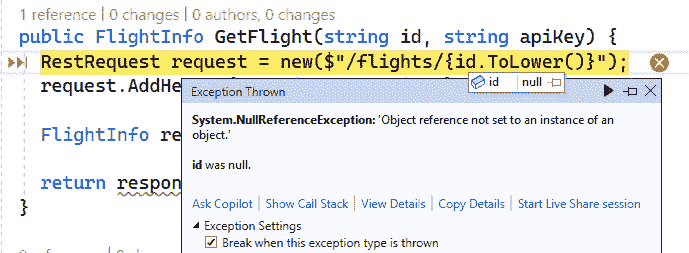
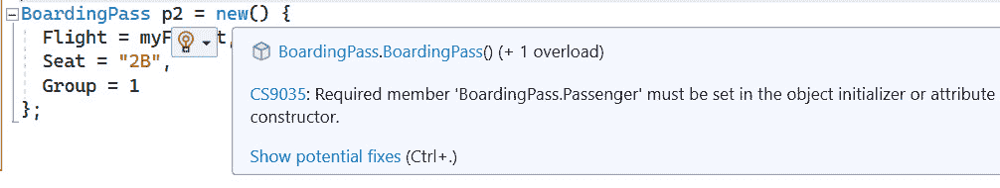

# 防御性编码技术

代码几乎是有机的，在其生命周期中随着新功能的添加、修复的实施以及定期发生的重构而演变。随着代码的变化和开发者的加入与离开，有些变化可能会引入错误。

在本书的**第二部分**中，我们讨论了在这些问题达到生产之前检测这些错误的测试策略。在本章中，我们将讨论一些额外的技术，这些技术有助于开发者在开发过程中捕获和解决错误。在这个过程中，我们还将探讨 C#的一些新功能及其在保持代码稳定和健康中的作用。

在本章中，我们将涵盖以下主题：

+   验证输入

+   防止空值

+   超越类

+   高级类型使用

# 技术要求

本章的起始代码可以从 GitHub 的[`github.com/PacktPublishing/Refactoring-with-CSharp`](https://github.com/PacktPublishing/Refactoring-with-CSharp)中的`Chapter10/Ch10BeginningCode`文件夹获取。

本章中的代码与 REST API 通信，这将需要一个活跃的互联网连接。

# 介绍多云天空 API

我们虚构的示例组织“多云天空”已经存在一套以公共**REST API**形式存在的网络服务。这个 API 旨在允许感兴趣的机构通过 API 获取关于多云天空航班的详细信息。然而，大量的支持工单证明，组织在使用 API 和以批准的方式使用它时遇到了困难。

作为回应，多云天空构建了一个.NET 库，以帮助其他人更容易地使用 API。

这个库的早期测试很有希望，但一些开发者仍然遇到一些令人困惑的错误，最终似乎与传递给库的数据有关。

开发团队决定，通过提前验证公共方法的参数，可以帮助他们更快地发现并解决问题，从而提高他们库的采用率。我们将在下一节中探讨这个变化。

# 验证输入

**输入验证**是在执行请求的工作之前验证代码的任何输入（如参数或当前属性值）是否正确的行为。我们通过验证公共方法来早期检测潜在问题。

为了说明这一点的重要性，让我们看看一个没有验证其输入的方法：

```cs
public FlightInfo? GetFlight(string id, string apiKey) {
  RestRequest request = new($"/flights/{id.ToLower()}");
  request.AddHeader("x-api-key", apiKey);
  LogApiCall(request.Resource);
  return _client.Get<FlightInfo?>(request);
}
```

`GetFlight`方法接受一个`id`参数，表示航班号，例如“CSA1234”，而`apiKey`参数代表一个必须提供的令牌，用于与 API 交互并获取响应。将令牌想象成多云天空向希望与其 API 交互的感兴趣机构发放的数字钥匙卡。每个发送到多云天空 API 的请求都必须包含一个令牌以进行身份验证并获取结果。

`id`参数很重要，因为它用于识别我们感兴趣的航班。此参数通过使用 RestSharp 库向 URL 添加，该库是现代.NET 中与 Web 服务交互的许多方式之一，用于向代码执行 HTTP GET 请求。

不要慌张！

如果任何 Web 服务代码或身份验证令牌的处理超出了你的舒适区，不要担心。虽然这些是在你成长过程中应该学习的概念，但 Web API 的实际机制对于本章来说并不重要。相反，我们专注于参数验证。

既然我们已经确定了这个方法的作用，让我们谈谈它如何可以做得更好。

首先，对于字符串的任何值都是有效的，无论是`id`还是`apiKey`。这包括 null、空或空白字符串等值。虽然你可能认为开发者不会尝试这些参数的值，但我可以想到一些合理的理由，某人可能会尝试其中一个：

+   有些人可能会尝试为`id`参数传递 null，认为这将获取下一班航班、所有航班，甚至可能是随机航班。

+   没有 API 密钥的开发者可能会认为 API 密钥仅适用于修改服务器上数据的请求，或者在没有 API 密钥的情况下以低量与 API 交互。

虽然这两个假设对于这个 API 都是不正确的，但我可以想象一个不了解系统的人会尝试其中任何一个。在 Cloudy Skies 的情况下，不提供有效的 API 密钥将导致服务器返回 401 未授权错误。

另一方面，不提供`id`参数会导致代码在尝试将`id`转换为小写时出现`NullReferenceException`错误，如图*图 10.1*所示：



图 10.1 – 当调用 ToLower 时，由于 id 为 null 导致的 NullReferenceException 错误

这两个错误都是试图与该代码交互的开发者可能会遇到的问题，而且这两个错误都没有充分地告诉开发者他们在传递的参数中犯了错误。让我们通过验证来修复这个问题。

## 执行基本验证

验证的目标是在早期检测到不良输入，并在不良数据进一步进入我们的系统之前明确指出这些问题。在构建库时，这意味着我们希望在代码中尽可能早地验证发送给我们的参数，最好是在其他开发人员将与之交互的公共方法中。

这里是`GetFlight`的一个版本，它执行了一些额外的验证步骤：

```cs
public FlightInfo? GetFlight(string id, string apiKey) {
  if (string.IsNullOrEmpty(apiKey)) {
    throw new ArgumentNullException("apiKey");
  }
  if (string.IsNullOrEmpty(id)) {
    throw new ArgumentNullException("id");
  }
  if (!id.StartsWith("CSA",
                     StringComparison.OrdinalIgnoreCase)) {
    throw new ArgumentOutOfRangeException("id", "Cannot
        lookup non-CSA flights");
  }
  RestRequest request = new($"/flights/{id.ToLower()}");
  request.AddHeader("x-api-key", apiKey);
  LogApiCall(request.Resource);
  return _client.Get<FlightInfo?>(request);
}
```

在这里，我们检查`apiKey`或`id`是否为 null 或空字符串。如果是这样，我们抛出一个`ArgumentNullException`错误，告诉调用此方法的任何人他们没有为特定参数提供有效的值。

我们还检查 `id` 是否指向带有 Cloudy Skies Airline 前缀的航班。如果不是，由于系统没有跟踪这个航班，这个航班将永远不会被找到。在这种情况下，使用 `ArgumentOutOfRangeException` 错误来提醒调用者是有意义的。这种异常类型也常与超出方法可接受范围的数字或日期一起使用。

我们真的应该在这里抛出异常吗？

许多新开发者认为异常是坏事。大多数开发者都讨厌遇到异常，抛出异常确实可能相对较慢。考虑到这些因素，当你得到无效值时，有时，最佳选择是抛出一个突出问题的特定异常。这有助于快速捕获错误，并防止无效值进一步进入系统。

你可能已经注意到，修改后的代码与该方法中的其他逻辑相比有很多验证。有几种方法可以改进这一点，我们将在接下来的章节中看到，但让我们逐步实现这个目标。我们将从查看引用不良参数值的好方法开始。

## 使用 nameof 关键字

目前，代码使用如下方式验证参数并抛出异常：

```cs
throw new ArgumentNullException("apiKey");
```

在这个例子中，`"apiKey"` 指的是参数的名称，这有助于开发者识别异常所抱怨的参数。

现在，如果有人后来将那个参数重命名为 `apiToken`，会发生什么？这个更改不会导致编译器错误，异常仍然可以抛出。不幸的是，异常将引用不再存在的旧 `apiKey` 参数名称，这可能会让遇到错误的开发者感到困惑。

为了帮助解决这个问题，C# 提供了 `nameof` 关键字，其语法如下：

```cs
public FlightInfo? GetFlight(string id, string apiKey) {
  if (string.IsNullOrEmpty(apiKey)) {
    throw new ArgumentNullException(nameof(apiKey));
  }
```

当你的代码编译时，`nameof` 关键字会评估它所使用的参数、方法或类的名称。然后，包含该 `nameof` 评估结果的字符串将被包含在编译后的代码中。换句话说，它与之前的代码相同——只不过如果参数被重命名，我们的代码将无法编译，直到 `nameof` 关键字更新为引用重命名的参数。

这允许我们依赖编译器来帮助我们确保我们的参数验证使用了正确的参数名称，即使这些参数在未来被重命名。

让我们介绍一种更简洁的抛出异常的方法。

## 使用守卫子句进行验证

目前，我们的验证逻辑由一个 `if` 语句和一个条件 `throw` 语句组成。这种验证非常常见，当验证复杂时，它可能会占用很多代码行。因此，.NET 现在以 **守卫子句** 的形式提供了一种更简洁的与之交互的方式。

我们可以通过调用 `ArgumentException.ThrowIfNullOrEmpty` 将验证简化为单行代码，如下所示：

```cs
public FlightInfo? GetFlight(string id, string apiKey) {
  ArgumentException.ThrowIfNullOrEmpty(id, nameof(id));
```

此方法将检查传入参数的值，如果值为空，则抛出`ArgumentNullException`错误；如果值为空字符串，则抛出`ArgumentException`错误。

目前.NET 中内置的这些验证并不多，但如果你喜欢这个想法，并且想要对负值或数字或日期范围等进行验证，你将喜欢 Steve Smith 的优秀的**GuardClauses 库**。

## 使用 GuardClauses 库的保护子句

为了帮助增强内置的保护子句，Steve Smith 创建了**Ardalis.GuardClauses**库。

要使用 GuardClauses 库，通过 NuGet 包管理器安装 Ardallis.GuardClauses 的最新版本，就像我们在前面的章节中所做的那样。

接下来，将`using Ardalis.GuardClauses;`添加到你的`.cs`文件顶部。

一旦安装并引用，你将能够使用保护语法，如下面的代码所示：

```cs
public Flights GetFlightsByMiles(int maxMiles,
  string apiKey) {
  Guard.Against.NegativeOrZero(maxMiles);
  Guard.Against.NullOrWhiteSpace(apiKey);
  // Other logic omitted…
}
```

在这里，GuardClauses 库在`Guard.Against`语法内部提供了各种静态方法，允许你验证许多事物。

如果验证条件满足——例如，当调用`NegativeOrZero`时`maxMiles`为`4`——程序将正常继续。然而，如果条件不满足，将抛出一个包含违反条件参数名称的`ArgumentException`错误。

我发现这个库易于编写和阅读，它还导致了高效且有效的保护子句，这些子句需要最少的努力。

GuardClauses 库的完整范围超出了本书的范围，但你可以安装它并查看可用的方法，或者查看本章末尾*进一步阅读*部分中引用的文档。

但等等——还有更多！

本书出色的技术审稿人正确地指出了流行的**FluentValidation 库**，该库提供了一组丰富的验证规则，可以应用于你的类。你可以在*进一步阅读*部分了解更多关于这个库的信息。

在我们继续之前，我想指出`Ardalis.GuardClauses`库的一个你可能没有注意到的方面。

假设你使用`Guard.Against.Null(apiKey);`调用保护子句。

如果这个验证规则失败，它将抛出一个`ArgumentException`错误。这个异常将有一个`ParamName`属性，其值为`apiKey`。此外，生成的消息将按名称提及`apiKey`参数，*即使你在调用* *保护子句*时没有提供该名称。

这是因为库使用了`CallerArgumentExpression`属性，我们将在下一节中探讨。

## 使用 CallerMemberInformation 属性

`nameof`关键字在消除后来被重命名的字符串引用方面取得了如此成功，以至于 C#发展出了四个独立的属性，可以告诉你关于任何给定方法的信息。

这些属性都应用于方法参数。像 `nameof` 关键字一样，这些属性在编译时进行评估，并在最终编译代码中用 `string` 或 `int` 类型替换。

可用的四个调用者成员属性如下：

+   **CallerFilePath** 包含一个字符串，包含在编译代码的机器上调用方法的代码文件的名称和路径

+   `int` 类型的行号用于方法调用

+   **CallerMemberName** 包含发生方法调用时的方法或属性名称

+   **CallerArgumentExpression** 在评估表达式之前，将传递给方法的表达式转换为字符串

让我们以 `LogApiCall` 为例来展示这一点：

```cs
public static void LogApiCall(string url,
  [CallerFilePath] string file = "",
  [CallerLineNumber] int line = 0,
  [CallerMemberName] string name = "",
  [CallerArgumentExpression(nameof(url))] string expr = "")
{
  Console.WriteLine($"Making API Call to {url}");
  Console.WriteLine("Called in:");
  Console.WriteLine($"{file}:{line} at {name}");
  Console.WriteLine($"Url expression: {expr}");
}
```

此方法接受五个参数，其中第一个是标准字符串参数，其余四个使用各种调用者成员信息属性。注意这些属性都指定了默认值。当未指定这些参数的值时，编译器将用它在编译期间检测到的值替换每个参数。

让我们看看一个示例调用：

```cs
public IEnumerable<FlightInfo> GetFlightsByMiles(
  int maxMiles, string apiKey) {
  // Validation omitted...
  string url = $"/flights/uptodistance/{maxMiles}";
  RestRequest request = new(url);
  request.AddHeader("x-api-key", apiKey);
  LogApiCall(request.Resource);
  IEnumerable<FlightInfo>? response =
    _client.Get<IEnumerable<FlightInfo>>(request);
  return response ?? Enumerable.Empty<FlightInfo>();
}
```

注意当 `LogApiCall` 被调用时，只指定了字符串参数。其余参数由于每个参数上的属性，在编译期间提供了值。

此外，请注意用于获取该字符串的表达式是 `request.Resource`。这个表达式是 `CallerArgumentExpression` 属性用来生成其字符串的原因，因为 `CallerArgumentExpression` 属性需要另一个参数的名称。在这种情况下，我们指定了 `[CallerArgumentExpression(nameof(url))]`，以便它查看传递给 `url` 参数的表达式——方法是接受的第一个参数。

当此代码运行时，我们将在控制台中看到以下消息记录：

```cs
Making API Call to /flights/uptodistance/500
Called in:
C:\RefactorBook\Chapter10\CloudySkiesFlightProvider.cs:51
  at GetFlightsByMiles
Url expression: request.Resource
```

如您所见，它记录了我硬盘上文件的完整路径，以及 `LogApiCall` 方法调用的行号。

`request.Resource` 的表达式是用于调用该方法的精确代码字符串，如下所示：

```cs
LogApiCall(request.Resource);
```

调用者成员信息属性对于某些类型的事情非常有用，例如日志记录和验证，或者某些特定的场景，例如在 **Windows Presentation Foundation** （**WPF**）应用程序中引发 `INotifyProperty` 改变。

现在我们已经充分探讨了与我们的方法参数一起工作，让我们看看现代 C# 如何让我们安全地处理空值。

# 防止空值

英国计算机科学家托尼·霍尔（Tony Hoare）通常被认为是编程中空引用的发明者。2008 年，他因它而著名地道歉，称其为他的“十亿美元的错误”。这是由于在多种编程语言中，当代码尝试与当前持有空值的变量交互时，发生了无数的错误和崩溃。虽然我不能责怪托尼·霍尔，但空引用确实可能很危险。

在 .NET 中，这以 `NullReferenceException` 错误的形式出现，正如我们在本章前面所看到的。每次尝试调用包含 null 值的变量的方法或评估其属性时，都会出现 `NullReferenceException` 错误。

在 C# 8 之前，开发者需要明确意识到任何引用类型都可能包含 null 值，并编写条件逻辑，如下面的代码所示：

```cs
if (flight != null) {
 Console.WriteLine($"Flight {flight.Id}: {flight.Status}");
}
```

这种检查可空性然后条件性采取行动的模式在 C# 中变得普遍，因为当它没有这样做时，开发者会遇到 `NullReferenceException` 错误。不幸的是，这导致了代码中到处都有 null 检查，包括许多永远不会遇到 null 的地方。

在 C# 8 中，引入了可空引用类型，这有助于开发者了解何时何地可能会遇到 null 值，以便他们会有积极的提醒来防止在这些地方出现 null 值。此外，这些改进使得在预期不会出现 null 的地方移除不必要的 null 检查变得更加容易。

在 C# 8 及更高版本中，当启用可空性分析时，您可以通过在类型指示符后添加 `?` 来指示任何引用类型可能是 null，就像这里对 `FlightInfo` 所示的那样：

```cs
public FlightInfo? GetFlight(string id, string apiKey) {
  ArgumentException.ThrowIfNullOrEmpty(id);
  ArgumentException.ThrowIfNullOrEmpty(apiKey);
  RestRequest request = new($"/flights/{id.ToLower()}");
  request.AddHeader("x-Api-key", apiKey);
  LogApiCall(request.Resource);
  return client.Get<FlightInfo?>(request);
}
```

在这种情况下，这表示 `GetFlight` 方法将返回一个 `FlightInfo` 实例或一个 null 值。此外，这也表示 `id` 和 `apiKey` 参数将始终有一个非 null 的字符串。如果这些参数接受 null 值，它们将被声明为 `string? Id, string? apiKey`。

重要提示

C# 中的可空性分析不会阻止您将 null 传递给声明不接受 null 值的对象，也不会阻止您从声明返回非 null 返回类型的方法中返回 null 值。相反，可空性分析将这些情况标记为警告，这将帮助您解决这些问题。我们将在 *第十二章* 中更多地讨论代码分析警告。

如果我们想表示 `GetFlight` 永远不会返回 null，我们需要从 `FlightInfo` 返回类型中移除 `?` 并验证 API 的结果不是 null：

```cs
public FlightInfo GetFlight(string id, string apiKey) {
  ArgumentException.ThrowIfNullOrEmpty(id);
  ArgumentException.ThrowIfNullOrEmpty(apiKey);
  RestRequest request = new($"/flights/{id.ToLower()}");
  request.AddHeader("x-api-key", apiKey);
  LogApiCall(request.Resource);
  FlightInfo? flightInfo=_client.Get<FlightInfo?>(request);
  if (flightInfo == null) {
string message = $"Could not find flight {id}";
    throw new InvalidOperationException(message);
  }
  return flightInfo;
}
```

通过 `_client.Get` 对 API 的请求仍然可能返回一个可空值，因此代码现在必须检查 null，并在遇到 null 值时条件性地抛出异常。然而，这保证了代码只返回非 null 值，这是在启用可空性分析时 `FlightInfo` 返回类型所指示的。

让我们看看如何在 Visual Studio 中启用和禁用可空性分析。

## 在 C# 中启用可空性分析

自 .NET 6 以来，新的项目默认启用可空引用类型。

然而，您可以通过在项目的 `.csproj` 文件中添加 `<Nullable>enable</Nullable>` 节点来在任何使用 C# 8 或更高版本的项目中启用可空引用类型：

```cs
<Project Sdk="Microsoft.NET.Sdk">
  <PropertyGroup>
    <OutputType>Library</OutputType>
    <TargetFramework>net8.0</TargetFramework>
    <ImplicitUsings>enable</ImplicitUsings>
    <Nullable>enable</Nullable>
    <RootNamespace>Packt.CloudySkiesAir</RootNamespace>
  </PropertyGroup>
</Project>
```

您可以使用文本编辑器（如记事本）或双击**解决方案资源管理器**中的项目节点来在 Visual Studio 内部编辑此文件。

如果您不希望在整个项目中启用空值分析，您可以使用预处理语句如`#nullable enable`和`#nullable disable`来启用和禁用空值分析。例如，以下代码暂时禁用了类定义的空值分析：

```cs
#nullable disable
public class FlightInfo {
    public string Id { get; set; }
    public FlightStatus Status { get; set; }
    public string Origin { get; set; }
    public string Destination { get; set; }
    public DateTime DepartureTime { get; set; }
    public DateTime ArrivalTime { get; set; }
    public int Miles { get; set; }
    public override string ToString() =>
      $"{Id} from {Origin} to {Destination} " +
      $"on {DepartureTime}. Status: {Status}";
}
#nullable restore
```

我鼓励您使用项目级别的空值分析，并在可能的情况下避免使用`#nullable`。我认识很多开发者每次看到预处理语句都会感到恶心。我的观点是，`#nullable`应该保留在您将大型项目迁移到使用空值分析，但尚未准备好在整个项目中启用它的情况下使用。

## 使用空值运算符

之前，我们讨论了`?`如何表示一个类型可能包含 null 值，但在 C#中还有几个与空值相关的运算符您应该了解。

首先，`!`非空断言运算符告诉 C#某个值不会是 null，并忽略该值的空值警告。

我常用这个功能是在处理`Console.ReadLine()`时。此方法指示它可能返回 null 值，但在实际操作中，在正常操作中它永远不会返回 null。这可以通过`!`来抑制，如下所示：

```cs
Console.WriteLine("Enter a flight #: ");
string id = Console.ReadLine()!;
```

在这里，我们将`ReadLine`（定义为具有`string?`结果并将其存储在`string`中）作为例子。`!`运算符表示`string?`结果应被视为`string`。

其他空值运算符包括以下内容：

+   `?`运算符仅在对象不是 null 时才条件性地调用方法。例如，`_conn?.Dispose()`仅在`_conn`不是 null 时调用`Dispose`方法。

+   `??`运算符在某个值可能为 null 的情况下使用备份值。例如，`int miles = flight?.Miles ?? 0;`使用空条件运算符和空合并运算符安全地从航班中获取`Miles`，或者在不存在航班时使用`0`。

+   `??=`运算符仅在变量已经是 null 时才将值赋给变量。例如，`message ??= "An unexpected error has occurred";`仅在`message`是 null 时才设置新的错误消息。这允许我们有效地用备份值替换 null 值。

空值分析和空值运算符的组合帮助我们以简洁的方式就 null 值做出明智的决策。这使我们的代码保持高效和专注，同时引导我们围绕处理代码中的 null 值制定一致的战略。

让我们更广泛地看看我们可以在类级别进行哪些更改，以帮助设计更健壮的应用程序。

# 超越类

在 C# 9 及更高版本中，微软通过记录类型、只读属性、主构造函数等方式，为开发者提供了更多与类一起工作的选项。

在本节中，我们将探讨这些新的 C#结构如何改进你的类的设计。

## 倾向于使用不可变类

近年来，不可变类越来越受欢迎。这种不可变性指的是在对象创建后无法更改对象的能力。

这意味着一旦对象存在，你无法修改其状态，而是只能创建新的对象，这些新对象与原始对象类似。如果你熟悉在.NET 中使用字符串和 DateTime 对象，你已经在字符串的`ToLower`方法和 DateTime 的`AddDays`方法上看到了这个概念，这些方法返回一个新对象而不是修改原始对象。

让我们看看一个小类，它代表一个当前可变的登机牌，然后将其转换为不可变类：

```cs
public class BoardingPass {
  public FlightInfo Flight { get; set; }
  public string Passenger { get; set; }
  public int Group { get; set; }
  public string Seat { get; set; }
}
```

这是一个“普通的 C#对象”，具有具有获取器和设置器的属性。从逻辑上考虑这个类，有几个问题：

+   没有任何东西阻止`Flight`、`Passenger`或`Seat`具有空值。

+   一旦创建了一个登机牌，属性如`passenger`、`boarding group`、`seat`甚至`flight`都可以被更改。在航空业务中，这并不合理，因为需要发放新的登机牌来更改这些信息。

我们可以通过移除设置器并添加一个带有验证的构造函数来改变这个对象，使其不可变并要求这些参数有有效的值：

```cs
public BoardingPass(FlightInfo flight, string passenger,
  string seat, int group) {
  ArgumentNullException.ThrowIfNull(flight);
  ArgumentException.ThrowIfNullOrEmpty(passenger);
  ArgumentException.ThrowIfNullOrEmpty(seat);
  if (group < 1 || group > 8) {
    throw new ArgumentOutOfRangeException(nameof(group));
  }
  Flight = flight;
  Passenger = passenger;
  Seat = seat;
  Group = group;
}
```

现在这个构造函数要求在对象创建时所有属性都存在有效值。同时，属性设置器的移除确保了类保持有效且不能被更改。

如果需要，我们可以在`BoardingPass`类中添加新方法，以类似各种字符串和 DateTime 方法的方式创建并返回一个具有与原始对象类似特征的新`BoardingPass`对象。然而，“with 表达式”给我们提供了一个更有趣的方式来做到这一点，正如我们将在本章后面看到的。

虽然一开始使用不可变性可能看起来比有益更不方便，但使用不可变类有几个关键优势：

+   不可变类可以在创建时进行验证，并确保它们处于有效状态。一旦创建，这种有效状态就不会改变。

+   当对象可以在你的代码的任何地方被修改时，这会使追踪一个对象何时被多个其他类引用变得更加困难。不可变对象防止这种情况发生。

+   有些概念作为不可变对象更有意义，例如文档的早期版本或机场乘客的登机牌。

+   由于不可变对象不会改变，它们可以在多线程应用程序中可靠地使用。如果没有不可变性，你需要依赖使用`Interlocked`、`lock`关键字或线程安全集合来避免错误。

当然，对于具有许多属性的类，必须在构造函数中指定所有属性可能会很繁琐。此外，你的项目中的每个类都不需要是不可变的。对于那些将受益于不可变性的类，C# 的必需关键字和只读属性有助于减轻这种负担。

## 使用必需和只读属性

将每个属性作为参数添加到类构造函数中的缺点是，你的构造函数可能会变得比你想要的更大。此外，创建需要许多构造函数参数的对象既繁琐又容易出错，并且创建单个对象可能会很繁琐和令人困惑，尤其是当需要许多构造函数参数时。

另一方面，对象初始化器可能更易读，但直到最近，它们还没有一种确保属性存在的方法。

看看创建 `BoardingPass` 对象的两种方式，看看哪一种对你来说更易读：

```cs
BoardingPass p1 = new(myFlight, "Amleth Hamlet", "2B", 1);
BoardingPass p2 = {
  Flight = myFlight,
  Passenger = "Amleth Hamlet",
  Seat = "2B",
  Group = 1
};
```

在 `p2` 中使用的对象初始化器版本更易读且易于维护，尤其是随着你想要在类中设置的属性数量随着时间的推移而增长。

这种方法的传统缺点是，使用对象初始化器的开发者可能会忘记设置重要的必需属性。C# 11 引入了 `required` 关键字，如果在对象初始化或构造函数中省略了 `Passenger` 属性时没有显式初始化必需属性，则编译将失败，如 *图 10.2* 所示。2*:



图 10.2 – 由于未设置 Passenger 属性导致的编译错误

为了实现这一点，我们可以在类中添加 `required` 到任何我们想要确保在对象初始化器完成时显式设置的属性定义。以下版本的 `BoardingPass` 特性具有必需属性：

```cs
public class BoardingPass {
  public required FlightInfo Flight { get; init; }
  public required string Passenger { get; init; }
  public required int Group { get; init; }
  public required string Seat { get; init; }
}
```

你可能也注意到，这个类定义将这些属性定义为 `{get; init;}` 而不是 `{get;}` 或 `{get; set;}`。虽然传统的 `get; set;` 组合允许在任意时间更改属性，但这违反了不可变性。`get;` 版本移除了在除构造函数之外的地方设置属性的能力，这意味着定义为 `get;` 的属性不能在对象初始化器中设置。

在 C# 9 中添加的新 `get; init;` 组合允许在构造函数或初始化器中设置属性，但不再允许在对象初始化后设置。这有助于我们支持我们的不可变类设计，同时不限制用户使用构造函数。

我认为对象初始化器是 .NET 的未来，如今在设计用于不可变性的类时，往往更倾向于使用 `get; init;` 的必需属性。

说到未来，让我们看看 C# 12 中的一个全新的特性：引用类型的主构造函数。

## 主构造函数

**主构造函数**是必须调用来初始化类并提供在类中自动创建字段的方法的构造函数。我们稍后会详细讨论“必须调用”这个短语的含义，但让我们先来看一个简单的例子：

```cs
public class BoardingPass(string Passenger) {
  public required FlightInfo Flight { get; init; }
  public required int Group { get; init; }
  public required string Seat { get; init; }
  public override string ToString() =>
    $"{Passenger} in group {Group} " +
    $"for seat {Seat} of {Flight.Id}";
}
```

这个版本的`BoardingPass`在类声明后立即有括号和参数列表。这是类的首选构造函数。

在主构造函数中声明的任何参数都可以作为只读属性使用。这使得主构造函数大致等同于以下 C#代码：

```cs
public class BoardingPass {
  public BoardingPass(string passenger) {
    this.Passenger = passenger;
  }
  public string Passenger {get; init; }
  // Other members omitted for brevity...
}
```

主构造函数的优势在于它们非常简洁，不需要你定义构造函数或字段定义。

主构造函数可以与其他构造函数一起使用，尽管你声明的任何其他构造函数都必须使用`this`关键字调用主构造函数，如下所示：

```cs
public class BoardingPass(string Passenger) {
  public BoardingPass(FlightInfo flight, string passenger)
: this(passenger) {
    Flight = flight;
  }
  // other members omitted for brevity...
}
```

实际上，你的主构造函数必须始终被调用——要么单独调用，要么通过`this`关键字从另一个构造函数中调用。

主构造函数不仅限于类，从 C# 9 开始，也存在于记录中。

## 将类转换为记录类

在整本书中，我多次提到了**记录类**，但没有定义它们，也没有详细说明为什么你想使用一个。

要理解记录类，让我们简要谈谈类中的相等性。默认情况下，如果两个对象都位于堆中的相同内存地址，则认为它们相等。

这意味着默认情况下，具有相同属性的两个单独对象不相等。例如，以下代码将这两个登机牌评估为彼此不同：

```cs
BoardingPass pass1 = new("Amleth Hamlet") {
    Flight = nextFlight,
    Seat = "2B",
    Group = 2
};
BoardingPass pass2 = new("Amleth Hamlet") {
    Flight = nextFlight,
    Seat = "2B",
    Group = 2
};
Console.WriteLine(pass1 == pass2); // false
```

你可以通过在`BoardingPass`类上重写`Equals`和`GetHashCode`来改变这种行为，就像我们在*第五章*中所做的那样。然而，记录类型为我们提供了一种更简单的方式来管理这一点。

记录类类似于正常的 C#类，除了相等性是通过比较所有属性来实现的。换句话说，记录类就像是重写了`Equals`和`GetHashCode`的正常 C#类。

让我们重新声明登机牌为一个记录类：

```cs
public record class BoardingPass(string Passenger) {
  public required FlightInfo Flight { get; init; }
  public required int Group { get; init; }
  public required string Seat { get; init; }
  public override string ToString() =>
    $"{Passenger} in group {Group} " +
    $"for seat {Seat} of {Flight.Id}";
}
```

现在，我们只需使用它们的值就可以成功比较两个登机牌：

```cs
BoardingPass pass1 = new("Amleth Hamlet") {
    Flight = nextFlight,
    Seat = "2B",
    Group = 2
};
BoardingPass pass2 = new("Amleth Hamlet") {
    Flight = nextFlight,
    Seat = "2B",
    Group = 2
};
Console.WriteLine(pass1 == pass2); // true
```

这两个类被认为是相等的，因为它们携带相同的值。请注意，`Flight`属性引用一个`FlightInfo`对象，它仍然是一个标准的 C#类，并使用传统的引用相等性。这意味着登机牌必须指向内存中的相同`FlightInfo`对象；否则，它们将不被视为相等。这可以通过将`FlightInfo`也改为记录类来改变。

我建议使用记录类来比较小型对象。它们也可能对那些可能频繁实例化的类有所帮助，例如来自数据库或外部 API 调用的对象。

让我们继续谈谈我最喜欢的创建对象的新方法：`with`表达式。

## 使用`with`表达式克隆对象

`with`表达式与不可变记录配合得非常好，它允许您在不修改原始记录的情况下克隆并稍微调整源记录。

假设哈姆雷特在航班上 2B 座的登机牌需要更改。系统可以使用以下代码实例化一个新的登机牌，它与原始登机牌完全一样，只是座位是 2C：

```cs
BoardingPass pass = new("Amleth Hamlet") {
    Flight = nextFlight,
    Seat = "2B",
    Group = 2
};
BoardingPass newPass = pass with { Seat = "3B" };
```

这将基于原始登机牌创建一个新的登机牌，但有一个属性略有不同。

如果我们想将哈姆雷特移动到新的座位但更早的登机组，我们也可以通过列出额外的属性来实现，如下所示：

```cs
BoardingPass newPass2 = pass with {Seat = "3B", Group = 1};
```

我认为`with`表达式是使用 C#中的记录类工作时最令人兴奋的事情之一，我非常喜欢语言在简化对象创建方面的方向。

这种引用属性值的方式并不仅限于`with`表达式，正如我们将在下一节中通过模式匹配看到的那样。

# 高级类型使用

在本章的最后一节中，我们将看到新旧语言特性如何帮助您构建更好的类型。

## 探索模式匹配

结果表明，我们可以使用之前在表达式中使用的相同语法风格，通过模式匹配有条件地匹配不同的对象。

为了解释我的意思，让我们从一个遍历不同登机牌的例子开始：

```cs
List<BoardingPass> passes = PassGenerator.Generate();
foreach (BoardingPass pass in passes) {
  if (pass is { Group: 1 or 2 or 3,
                Flight.Status: FlightStatus.Pending
}) {
    Console.WriteLine($"{pass.Passenger} board now");
  } else if (pass is { Flight.Status: FlightStatus.Active
                       or FlightStatus.Completed
                     }) {
    Console.WriteLine($"{pass.Passenger} flight missed");
  } else {
    Console.WriteLine($"{pass.Passenger} please wait");
  }
}
```

此代码遍历一组登机牌，并执行以下三种操作之一：

+   如果航班状态是`Pending`且乘客在 1、2 或 3 组，我们会告诉他们登机。

如果航班状态是`Active`或`Completed`，我们会告诉乘客他们错过了航班。

如果这两种情况都不成立，则航班状态必须是`Pending`，但乘客的组没有登机，因此我们会告诉他们等待。

代码有点随意，尤其是在处理登机组方面，但它展示了模式匹配的一些功能。

使用模式匹配，您可以在`if`语句中评估对象的一个或多个属性，以简洁地同时检查多个事项。

虽然您可以在`if`语句中使用模式匹配，但它们也常用于`switch`表达式，正如我们在第三章中看到的。我们可以将之前的代码重写为`switch`表达式，如下所示：

```cs
List<BoardingPass> passes = PassGenerator.Generate();
foreach (BoardingPass pass in passes) {
string message = pass switch {
    { Flight.Status: FlightStatus.Pending,
      Group: 1 or 2 or 3 }
      => $"{pass.passenger} board now",
    { Flight.Status: not FlightStatus.Pending }
      => $"{pass.passenger} flight missed",
      _ => $"{pass.passenger} please wait",
  };
  Console.WriteLine(message);
}
```

在这里，我们可以看到`switch`表达式概念与模式匹配的强大功能相结合，以设置`message`变量中的字符串。请注意，为了简洁和说明`not`关键字在否定或反转模式匹配表达式中的用法，代码使用`not FlightStatus.Pending`而不是`FlightStatus.Active or FlightStatus.Completed`。

虽然这段代码需要一些调整才能学会阅读，但在这个语法中几乎没有“浪费”。几乎每一行代码都是围绕必须为真的条件或当它们为真时要使用的值来组织的。此外，这种语法比正常的 C#逻辑更容易处理更复杂的场景，例如或和不是语句。

当然，就像任何新的 C#语言特性一样，如果你和你团队的可读性成本太高，你可以自由地完全避免 switch 表达式和模式匹配。

现在我们已经看到了模式匹配和 switch 表达式在 C#最新版本中的协同工作方式，让我们来看看 C#最早期的增强功能之一：泛型。

## 使用泛型来减少重复

**泛型**是每个.NET 开发者每天都会遇到并与之工作的一个概念。

当你与`List<string>`（发音为“字符串列表”）一起工作时，你正在使用一个泛型`List`对象，它可以持有特定类型的对象——在这种情况下，字符串。

泛型通过指定至少一个类型参数来实现，该参数进入类或方法中，并允许类或方法围绕该类型进行结构化。

为了说明泛型的优势，让我们看看一个非常简单的`FlightDictionary`类，它使用字典存储通过其标识符的`FlightInfo`对象，并包含一些简单的控制台日志记录：

```cs
public class FlightDictionary {
  private readonly Dictionary<string, FlightInfo> _items =
    new();
  public bool Contains(string identifier)
    => _items.ContainsKey(identifier);
  public void AddItem(string id, FlightInfo item) {
    Console.WriteLine($"Adding {id}");
    _items[id] = item;
  }
  public FlightInfo? GetItem(string id) {
    if (Contains(id)) {
      Console.WriteLine($"Found {id}");
      return _items[id];
    }
    Console.WriteLine($"Could not find {id}");
    return null;
  }
}
```

这个类是新的集合类的一个起点，就像.NET 提供的`Dictionary`类一样。它允许外部调用者通过字符串标识符添加、检索和检查`FlightInfo`。

虽然这段代码非常简单，并且缺少了我期望从真实集合类中看到的一些功能，但它足以说明通过提出以下问题来体现泛型的必要性：如果我们非常喜欢这个类来处理`FlightInfo`对象，那么我们是否希望用它来处理`BoardingPass`对象？

经常会出现这样的情况，有人会复制粘贴`FlightDictionary`类来创建一个新的`BoardingPassDictionary`类，如下所示：

```cs
public class BoardingPassDictionary {
  private readonly Dictionary<string, BoardingPass> _items
    = new();
  public bool Contains(string identifier)
    => _items.ContainsKey(identifier);
  public void AddItem(string id, BoardingPass item) {
    Console.WriteLine($"Adding {id}");
    _items[id] = item;
  }
  public BoardingPass? GetItem(string id) {
    if (Contains(id)) {
      Console.WriteLine($"Found {id}");
      return _items[id];
    }
    Console.WriteLine($"Could not find {id}");
    return null;
  }
}
```

这两个类之间的唯一区别是存储的项目类型。

泛型让我们能够声明一个类，它接受用于不同操作的类型的参数。

现在，让我们看看这个类的更可重用版本，它接受用于每个项目键的类型以及用于值的泛型类型参数：

```cs
public class LoggingDictionary<TKey, TValue> {
  private readonly Dictionary<TKey, TValue> _items
    = new();
  public bool Contains(TKey identifier)
    => _items.ContainsKey(identifier);
  public void AddItem(TKey id, TValue item) {
    Console.WriteLine($"Adding {id}");
    _items[id] = item;
  }
  public TValue? GetItem(TKey id) {
    if (Contains(id)) {
      Console.WriteLine($"Found {id}");
      return _items[id];
    }
    Console.WriteLine($"Could not find {id}");
    return default(TValue);
  }
}
```

这个类的实现依赖于两个泛型类型参数：`TKey`和`TValue`。这些参数可以是任何你想要的名字，但惯例是使用`T`。

使用这个类，可以创建一个新的`LoggingDictionary`，以支持你可能想要支持的任何类型，语法如下：

```cs
LoggingDictionary<string, BoardingPass> passDict = new();
LoggingDictionary<string, FlightInfo> flightDict = new();
```

泛型是自.NET Framework 2.0 以来就存在的东西，但今天它仍然为类添加可重用性提供了价值。

让我们以对 C# 12 的一个新功能：**类型别名**的简要概述来结束这一章。

## 使用 using 指令引入类型别名

假设你正在开发一个系统，你需要处理一组不确定的类型，并且可能在未来需要更改这些类型。或者，你可能有一个常规需求，需要一些看起来很糟糕的类型，例如在整个类中处理 `List<string, Dictionary<Passenger, List<FlightInfo>>>`。

对于后一个问题的一个方法可能是将你的类引入以隐藏一些这种复杂性，但在 C# 12 中有一个新的选项是使用 `using` 语句。

让我们看看如何简化 `CloudySkiesFlightProvider.cs` 中的某些代码，以减少 `IEnumerable<FlightInfo>` 出现的地方。我们将使用 `GetFlightsByMiles` 方法作为示例：

```cs
public IEnumerable<FlightInfo> GetFlightsByMiles(
  int maxMiles, string apiKey) {
  RestRequest request =
    new($"/flights/uptodistance/{maxMiles}");
  request.AddHeader("x-api-key", apiKey);
  LogApiCall(request.Resource);
  IEnumerable<FlightInfo>? response =
    _client.Get<IEnumerable<FlightInfo>>(request);
  return response ?? Enumerable.Empty<FlightInfo>();
}
```

这段代码并不差，但想象一下，如果你非常强烈地不喜欢在所有地方看到 `IEnumerable<FlightInfo>`，你更愿意为这个定义一个自定义类型。

使用 C# 12，你可以在文件的 `using` 语句中添加以下行：

```cs
using Flights = System.Collections.Generic.IEnumerable<
Packt.CloudySkiesAir.Chapter10.FlightInfo>;
```

通过这一变化，你现在可以将你的方法更改为使用你的新类型别名：

```cs
public Flights GetFlightsByMiles(int maxMiles,
  string apiKey) {
  RestRequest request =
    new($"/flights/uptodistance/{maxMiles}");
  request.AddHeader("x-api-key", apiKey);
  LogApiCall(request.Resource);
  Flights? response = _client.Get<Flights>(request);
  return response ?? Enumerable.Empty<FlightInfo>();
}
```

这段代码并没有改变你在该方法中处理 `IEnumerable<FlightInfo>`，但它确实减少了你需要输入的代码量，并简化了读取代码。

此外，如果你想要在这些地方更改到不同的类型，你现在只需要修改 `using` 语句来使用不同的类型。

我不确定隐藏底层类型是否比潜在的混淆更有益，但我可以想象一些可能有所帮助的地方，尤其是在处理复杂的泛型类型或与元组（多个值的集合）一起工作时。

时间将证明类型别名的效果以及它们最佳的使用位置，但我很高兴我们现在有了这个选项。

# 摘要

在本章中，我们探讨了确保你的类通过诸如参数验证、调用者成员信息、可空性分析以及使用现代 C# 功能（如记录类、主构造函数、模式匹配和带有 `required` 和 `init` 关键字的增强属性）等手段安全且可重用的各种方法。

这些语言特性帮助你更早地检测问题，更有效地处理对象，并总体上减少代码行数。

这本书的 *第二部分* 结束了。在 *第三部分* 中，我们将探讨人工智能和代码分析工具如何帮助你和你团队可持续地构建更好的软件。

# 问题

回答以下问题以测试你对本章知识的了解：

1.  抛出异常如何对你的代码有益？

1.  你可以用哪些不同的方式在 C# 中声明一个属性？

1.  你可以用哪些不同的方式在 C# 中实例化一个对象？

1.  类和记录类之间的区别是什么？

# 进一步阅读

你可以在以下 URL 中找到有关本章讨论的功能的更多信息：

+   *守卫子句* 库：[`github.com/ardalis/GuardClauses`](https://github.com/ardalis/GuardClauses)

+   *Fluent Validation* *库*: [`github.com/FluentValidation/FluentValidation`](https://github.com/FluentValidation/FluentValidation)

+   *调用成员* *信息*: [`learn.microsoft.com/en-us/dotnet/csharp/language-reference/attributes/caller-information`](https://learn.microsoft.com/en-us/dotnet/csharp/language-reference/attributes/caller-information)

+   *主构造函数和别名使用*: [`devblogs.microsoft.com/dotnet/check-out-csharp-12-preview/`](https://devblogs.microsoft.com/dotnet/check-out-csharp-12-preview/)

+   *现代* *C#中的安全空值*: [`newdevsguide.com/2023/02/25/csharp-nullability/`](https://newdevsguide.com/2023/02/25/csharp-nullability/)

+   *C#中的类、结构和记录*: [`learn.microsoft.com/en-us/dotnet/csharp/fundamentals/object-oriented/`](https://learn.microsoft.com/en-us/dotnet/csharp/fundamentals/object-oriented/)

+   *选择异常或* *验证*: [`ardalis.com/guard-clauses-and-exceptions-or-validation/`](https://ardalis.com/guard-clauses-and-exceptions-or-validation/)

# 第三部分：使用 AI 和代码分析的高级重构

本书第三部分专注于使用人工智能和 Visual Studio 内置的现代代码分析功能的高级重构技术。

本章介绍了 GitHub Copilot Chat 作为重构、生成、检查、文档化和测试代码的方法。

我们接着通过介绍代码分析工具和规则集以及一些可以帮助捕获额外问题的第三方工具，广泛地覆盖了 Visual Studio 的代码分析功能。最后，我们探讨了 Visual Studio 的代码分析如何基于 Roslyn 分析器，通过构建和部署我们自己的 Roslyn 分析器作为 Visual Studio 扩展和 NuGet 包来展开。

本章将深入理解代码分析问题，以及新的生产力工具，帮助检测和解决代码中的问题。

本部分包含以下章节：

+   *第十一章**，使用 GitHub Copilot 进行 AI 辅助重构*

+   *第十二章**，Visual Studio 中的代码分析*

+   *第十三章**，创建 Roslyn 分析器*

+   *第十四章**，使用 Roslyn 分析器重构代码*
