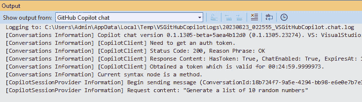
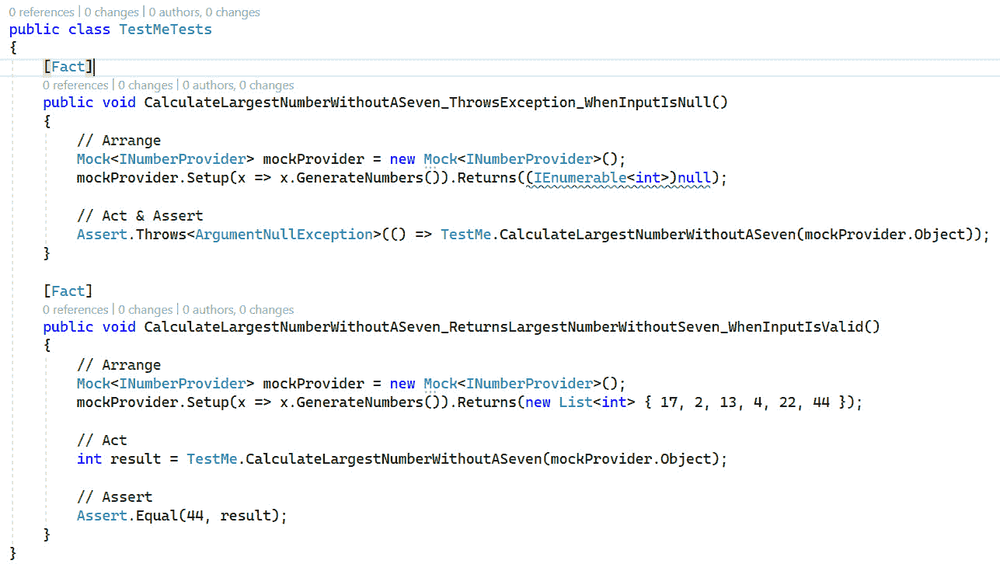

# 11

# 使用 GitHub Copilot 进行 AI 辅助重构

变化是技术的常态，这在 .NET 生态系统中尤为如此。每年，Microsoft 都会发布一个新的 .NET 和 C# 版本，其中包含新功能，以保持语言在技术变化中的兴奋、有用和相关性。但过去两年中，对 .NET 开发影响最大的变化可能并非来自主要语言版本，而是来自人工智能领域，例如 GitHub Copilot 和 ChatGPT 这样的 AI 代理。

在本章中，我们将探讨 GitHub Copilot 如何集成到 Visual Studio 中，并将类似 ChatGPT 的对话式 AI 带入您的编辑器。我们还将探讨这一技术带来的有趣可能性，以及考虑是否将这项新技术纳入我们的工具集时必须注意的一些事项。

本章将涵盖以下主题：

+   介绍 GitHub Copilot

+   在 Visual Studio 中开始使用 GitHub Copilot

+   使用 GitHub Copilot Chat 进行重构

+   使用 GitHub Copilot Chat 撰写文档

+   使用 GitHub Copilot Chat 生成测试想法

+   理解 GitHub Copilot 的局限性

# 技术要求

本章的起始代码可在 GitHub 的 [`github.com/PacktPublishing/Refactoring-with-CSharp`](https://github.com/PacktPublishing/Refactoring-with-CSharp) 上的 `Chapter11/Ch11BeginningCode` 文件夹中找到。

# 介绍 GitHub Copilot

2021 年，GitHub 宣布了一款名为 **GitHub Copilot** 的新人工智能工具。GitHub Copilot 是一个编辑器扩展，可以集成到不同的编辑器中，包括 JetBrains Rider、VS Code 和 Visual Studio 2022 的所有版本。

GitHub Copilot 所做的是查看您刚刚输入的代码，并为它认为您即将输入的代码生成预测。如果它有一个预测，并且您当前没有在输入，GitHub Copilot 会以灰色文本的形式在您的光标前显示预测，供您评估并可能添加到您的代码中，如图 *图 11**.1* 所示：


图 11.1 – GitHub Copilot 在开发者输入代码时建议添加的代码

Copilot 通过使用一个经过各种不同编程语言（包括 C#、F#、JavaScript 和 SQL）中的代码片段训练的预测机器学习模型来实现这一点。

## 理解 GitHub 的预测模型

如果这听起来很熟悉，那是因为 GitHub Copilot 的模型是一个围绕一种名为 **transformers** 的新颖模型训练技术构建的专用机器学习模型。

2017 年在一篇名为 *Attention is All You Need* 的论文中引入的 Transformer，允许机器学习模型在保留不同文本片段之间关系上下文的情况下，在更大的文本体上进行训练。（[`research.google/pubs/pub46201/`](https://research.google/pubs/pub46201/)）

这项创新导致了诸如 Google BERT（为 Google 搜索预测提供动力的技术）、MidJourney 和 DALL-E（可以从文本提示生成艺术）等技术的出现，以及 OpenAI 的极为流行的 ChatGPT，它可以模仿与人类的对话。

基于转换器的模型现在通常被称为**大型语言模型**（**LLMs**）。它们的超级能力是记住文本中的模式，并生成模仿其模型内部吸收的模式的新文本。

你是否曾想过 GPT 代表什么？

GPT 缩写（在 ChatGPT、GPT-4 和类似系统中找到）代表**生成预训练转换器**。换句话说，这是一个基于转换器的模型，用于生成新内容，并且该模型是在大量数据上训练的。

这些 LLM 接受文本提示并生成某种形式的输出。在聊天 LLM 中，提示可能是一个问题，例如“什么是.NET？”输出可能是对.NET 的简短描述，如图 11.2 中 Bing Chat 的交互所示（[`www.bing.com/`](https://www.bing.com/))）：


图 11.2 – Bing Chat 在接收到简短提示后描述.NET

LLM 中并没有内置智能理解。这些模型不会思考或有自己的想法，而是使用数学来识别它们收到的文本与模型训练时所接触的大量文本之间的相似性。

虽然 LLM 系统在某些时候可能看起来非常智能，但这是因为它们正在模仿它们所训练的各种书籍、博客文章、推文和其他材料作者的智能。

GitHub Copilot 使用一个名为**Codex**的 LLM。Codex 模型由 OpenAI 生产，并且不是在博客文章或推文上训练，而是在开源软件仓库上训练。

这意味着当你将某些内容输入到你的编辑器时，你输入的文本可以用作提示来预测你可能输入的下一条代码。这与 Google 搜索预测搜索词中的下几个单词或 ChatGPT 生成文本回复的方式非常相似。

我们将在本章末尾更详细地讨论 GitHub Copilot 中开源代码的使用以及是否在职场项目中使用 GitHub Copilot 是合适的。现在，让我们继续探讨 GitHub Copilot 的一些新特性。

## 用 GitHub Copilot Chat 开始对话

GitHub 通过引入**GitHub Copilot Chat**扩展了 Copilot 的代码生成功能。GitHub Copilot Chat 让你能够直接在编辑器中与 ChatGPT 这样的对话式 AI 代理进行交互。

这意味着你可以在 Visual Studio 中与 LLM 聊天，并执行以下操作：

+   让它解释一段代码

+   使用文本提示生成新代码

+   向 Copilot 询问提高代码质量的方法

+   让 Copilot 为方法草拟单元测试或文档

我甚至使用 Copilot 生成故意混乱的代码来练习重构。

与 GitHub Copilot Chat 的典型交互涉及用户选择一些代码，然后按 *Alt* + */* 以开始对话。例如，*图 11**.3* 显示了用户在 GitHub Copilot Chat 中输入文本提示，并选择了一小段代码：


图 11.3 – 向 GitHub Copilot Chat 提问

从那里，GitHub Copilot Chat 生成一个文本响应，并将其显示给用户，如图 *图 11**.4* 所示：


图 11.4 – GitHub Copilot 生成代码块的说明

如果你觉得自己对 C# 经验丰富，无法充分利用这个功能，我想向你保证，它不仅限于基本的编程。有时在维护代码时，你会遇到没有意义且你没有任何文档可以告诉你开发者试图做什么的奇怪方法调用。当这种情况发生时，Chat 的意见在理解编写代码的开发者的意图方面非常有价值。

当然，Chat 可以用来生成代码，正如我们将在下一节中看到的。

对我来说，底线是使用 GitHub Copilot Chat 编程不仅能增强我作为开发者的能力，还能帮助我保持专注，因为我没有太多理由去查看文档或离开我的编辑器。Chat LLM 内置的自动化能力加上这种额外的专注力，GitHub Copilot Chat 对我的生产力和能力有着显著的提升。

我怀疑你也会喜欢 GitHub Copilot Chat，那么让我们看看如何开始使用它。

# 在 Visual Studio 中开始使用 GitHub Copilot

为了使用 GitHub Copilot，你需要有一个 GitHub 账户。如果你还没有，你可以在 [`github.com/signup`](https://github.com/signup) 注册一个免费的 GitHub 账户。

GitHub Copilot 还要求你使用 Visual Studio 2022 版本 17.4.4 或更高版本。如果你还没有安装 Visual Studio，你可以在 [`visualstudio.microsoft.com/downloads/`](https://visualstudio.microsoft.com/downloads/) 下载一个副本。

如果你需要更新或检查你的 Visual Studio 版本，一个快速完成任务的方法是从 Windows 菜单启动 **Visual Studio 安装程序**。这将让你看到当前版本，并可选择更新你的 Visual Studio 版本，如图 *图 11**.5* 所示：


图 11.5 – 从 Visual Studio 安装程序更新 Visual Studio

一旦你有了 GitHub 账户和最新的 Visual Studio 版本，你就可以安装 GitHub Copilot 扩展了。

## 安装和激活 GitHub Copilot

要安装 GitHub Copilot，启动 Visual Studio，选择 **扩展** 菜单，然后选择 **管理扩展**。接下来，搜索 **GitHub Copilot** 并下载并安装扩展程序，如图 *图 11**.6* 所示：


图 11.6 – 在 Visual Studio 中安装 GitHub Copilot

接下来，您需要在 Visual Studio 中登录 GitHub，以将扩展程序链接到您的 GitHub 账户。请按照[`docs.github.com/en/copilot/getting-started-with-github-copilot?tool=visualstudio`](https://docs.github.com/en/copilot/getting-started-with-github-copilot?tool=visualstudio)中的说明进行操作，以获取最新的操作指南。

GitHub Copilot Chat 目前是 GitHub Copilot 的一个独立扩展。如果您想尝试 Chat，我建议您单独安装 Copilot 并确保它首先正常工作。完成此操作后，重复安装 Chat 扩展程序的过程。

一些 GitHub Copilot 功能，如 Chat，可能需要启用或进行额外配置。您可以通过转到 **工具** 菜单并选择 **选项…** 来这样做，然后在列表中找到 **GitHub** 节点。

## 获取 GitHub Copilot 访问权限

虽然 GitHub 本身是免费的，但 GitHub Copilot 是一个高级功能，需要您拥有 GitHub Premium 许可证或成为 GitHub Copilot for Business 账户的一部分。我们将在本章末尾更多地讨论 Copilot for Business 的好处。

在撰写本文时，GitHub 对个人用户收取 10 美元/月费用，对 Copilot for Business 账户的每个用户收取 19 美元/月费用。与任何新兴技术一样，定价和可用性可能会随时间变化。

现在我们已经介绍了如何安装和获取对 Copilot 的访问权限，让我们看看它是如何工作的。

## 使用 GitHub Copilot 生成建议

在本章代码的 `Program.cs` 文件中，输入一条注释，例如 `// 填充一个随机数字列表`，然后移动到下一行。

接下来，输入字母 `Ra` 并等待片刻再继续。如果一切配置正确，您应该会看到类似于我在 *图 11**.7* 中遇到的建议。


图 11.7 – GitHub Copilot 在随机帮助

在这里，GitHub Copilot 根据其在该区域观察到的上下文提出了一些代码建议。以我的情况为例，它的建议是 `Random rand = new Random();`，这是一段有效的 C# 代码。

在您的情况下，它可能会提出不同的建议，包括可能甚至没有意义或无法编译的建议。

请记住，GitHub Copilot 等大型语言模型并不智能，但它们会记住训练数据中的模式和趋势。有时这些趋势是有效的，而有时它们看起来合理，但参考了根本不存在的属性或功能。

由于 GitHub Copilot 和类似系统是在旧代码上训练的，您有时会注意到 Copilot 生成过时代码或使用过时 API 的代码。Copilot 生成带有错误、安全漏洞、性能问题或其他不良内容的代码也是完全可能的。作为程序员，您有责任识别好代码和坏代码。

现在我们已经了解了与 Copilot 一起工作的基础知识，让我们看看这与通过 GitHub Copilot Chat 进行重构有什么关系。

## 与 GitHub Copilot Chat 交互

在安装并配置了 GitHub Copilot Chat 之后，让我们再次尝试使用随机数字列表进行实验。

删除在填充随机数字列表注释之后添加的任何代码。然后，将您的输入光标移动到注释下面的行，就像您即将在那里开始输入一行代码一样。

从这里，让我们通过选择**视图**然后选择**GitHub Copilot Chat**来显示 GitHub Copilot Chat 窗口。您应该会看到**GitHub Copilot Chat**窗格，如图 *图 11.8* 所示：


图 11.8 – GitHub Copilot Chat 窗格

在文本框中输入 `生成一个包含 10 个随机数字的列表` 并按 *Enter*。如果有任何运气，您应该会看到类似于 *图 11.9* 的内容：


图 11.9 – GitHub Copilot Chat 的代码建议

如果您曾经与 ChatGPT 或类似的对话式 AI 代理交互过，这应该与那种体验非常相似。在这种情况下，Copilot Chat 生成了一些代码，我们可以通过点击第一个按钮来复制代码，或者点击**插入**按钮将其直接添加到编辑器中。

在点击 `Main` 方法后。点击**接受**，代码将被插入。

小贴士

如果您不喜欢使用 GitHub Copilot Chat 窗格，您可以通过 *Alt* + */* 键盘快捷键在任何时候调出 GitHub Copilot Chat 建议。

如果 GitHub Copilot Chat 似乎不起作用，请打开**输出**视图并选择**显示来自：GitHub Copilot Chat**，如图 *图 11.10* 所示：



图 11.10 – GitHub Copilot Chat 的诊断信息

这项诊断信息帮助我找到了几个问题，但同样经常的解决方案是简单地重新打开 Visual Studio。幸运的是，这种诊断信息很少需要，但知道在哪里找到它总是好的。

现在我们已经看到了 Copilot 的工作，让我们用它来重构一些代码。

# 使用 GitHub Copilot Chat 进行重构

由于 GitHub Copilot Chat 是在开源存储库上训练的，它已经接触到了很多人关于代码的写作。正因为如此，它提供有用见解的可能性很高。

为了看到这一点，我们将重构名为 `RefactorMe.cs` 的文件，其外观如下：

```cs
namespace Packt.CloudySkiesAir.Chapter11;
public class RefactorMe {
  public void DisplayRandomNumbers() {
    List<int> numbers = new List<int>();
    for (int i = 1; i <= 10; i++) {
      Random rand = new Random();
      int n = rand.Next(1, 101);
      numbers.Add(n);
    }
    String output = string.Join(", ", numbers.ToArray());
    Console.WriteLine(output);
  }
}
```

这段代码存在一些故意的低效之处，甚至有时我会遇到一个与`Random`相关的潜在危险错误。我会给你几段代码，让你看看是否能找出问题所在，但让我们也看看 GitHub Copilot Chat 是否能发现这个问题。

选择 `DisplayRandomNumbers` 方法，然后按 *Alt* + */* 组合键打开聊天提示。接下来，询问 Copilot “你将如何改进`this code`？”

当我询问 Copilot 时，我得到了几个建议，如图*图 11*所示：


图 11.11 – GitHub Copilot Chat 作为代码审查员

检视我遇到的建议（可能与你在进行相同实验后看到的建议不同），我可以将其总结为以下几点：

+   为了性能原因，将`Random`声明在循环外部

+   由于你知道列表的大小，请将其声明为`new List<int>(10)`

+   使用 `foreach` 和 `Enumerable.Range` 而不是 `for` 循环

不仅 GitHub Copilot Chat 产生了改进的想法，甚至还建议了以下代码来满足其建议：

```cs
public void DisplayRandomNumbers() {
  List<int> numbers = new List<int>(10);
  Random rand = new Random();
  foreach (int i in Enumerable.Range(0, 10)) {
    int n = rand.Next(1, 101);
    numbers.Add(n);
  }
  string output = string.Join(", ", numbers);
  Console.WriteLine(output);
}
```

在这里，Copilot 建议了一些我正在考虑的改进，例如将 Random 移出循环之外，以及一些我没有考虑的，例如使用`Enumerable.Range`。

出了什么 bug？

如果你对提到的潜在错误感到好奇，它与在循环中实例化`Random`有关。每次你运行`new Random()`，它都会使用当前系统时间作为随机种子来生成新的数字。如果你在快速循环中这样做，时钟保持不变，导致每次迭代都产生相同的“随机”数字序列。

查看推荐的代码，我发现了一些改进的机会，例如将`n`变量重命名为更有意义的名称，使用目标类型`new`来实例化对象，以及使用`_`运算符丢弃未使用的`i`变量。

在 GitHub 和我自己之间，我们为此方法编写的最终代码如下：

```cs
  public void DisplayRandomNumbers() {
    List<int> numbers = new(10);
    Random rand = new();
    foreach (int _ in Enumerable.Range(0, 10)) {
      int number = rand.Next(1, 101);
      numbers.Add(number);
    }
    string output = string.Join(", ", numbers);
    Console.WriteLine(output);
  }
```

由此产生的代码更加简洁，在列表分配方面略为高效，最终对于一小段代码来说，代表了一个更好的结果。

本节的目的并非向您展示如何生成随机数，而是让您看到聊天作为一位“无脑”编程伙伴所能提供的潜在价值。这位伙伴可以审查您的代码并提出建议。这些建议并不总是有道理，甚至可能无法编译，但它们可以在同事不在场时为您提供快速的外部视角。

## GitHub Copilot Chat 作为代码审查员

GitHub Copilot Chat 在重构方面的价值并不仅限于代码生成。你还可以向 GitHub Copilot Chat 提出如下问题：

+   你能否像一位资深工程师一样审查这段代码？

+   该方法可以进行哪些性能优化？

+   这种方法会在哪里遇到错误？

+   有没有减少或合并行数的方法，而不会损害整体的可读性？

当然，重要的是要记住，你实际上是在从本质上是一个被美化的自动完成/句子预测引擎的 LLM 那里获得建议，而不是一个具有智能或原创思想的实体。

有趣的是，我注意到多次向 GitHub Copilot Chat 询问关于方法的意见可以产生不同的结果。这些结果甚至可以改变 Copilot 最初提供的原始建议的意见！尽管如此，这仍然可以提供多种观点。

在我们继续之前，让我们看看另一个重构代码的例子。

## GitHub Copilot Chat 的目标重构

这个重构示例主要关注`BaggageCalculator.cs`文件。这个文件包含了从*第二章*结尾的`BaggageCalculator`类的最终版本。

作为快速提醒，这个类有一个`CalculatePrice`方法，它根据已登记的和随身携带的行李数量以及他们是否在假日旅行来计算和显示客户的行李费用。

支持公共`CalculatePrice`方法的是私有的静态`ApplyCheckedBagFee`方法，它计算已登记行李的费用。

我们将主要关注`CalculatePrice`方法，它看起来有点重复：

```cs
public decimal CalculatePrice(int bags, int carryOn,
  int passengers, bool isHoliday) {
  decimal total = 0;
  if (carryOn > 0) {
    decimal fee = carryOn * CarryOnFee;
    Console.WriteLine($"Carry-on: {fee}");
    total += fee;
  }
  if (bags > 0) {
    decimal bagFee = ApplyCheckedBagFee(bags, passengers);
    Console.WriteLine($"Checked: {bagFee}");
    total += bagFee;
  }
  if (isHoliday) {
    decimal holidayFee = total * HolidayFeePercent;
    Console.WriteLine("Holiday Fee: " + holidayFee);
    total += holidayFee;
  }
  return total;
}
```

看着这段代码，我们看到有三个类似的块，它们检查一个条件，计算费用，显示该费用，然后将其添加到`total`中。

这段代码的重复性让我觉得这是一个可能得到改进的代码异味。一个解决方案是为这三个块中的每一个提取一个方法，但这些方法之间仍然非常相似。

相反，我自然会想，是否有一个可能涉及`Action`或`Func`的解决方案，但我并不立即确定这样的解决方案可能是什么样子。

幸运的是，我们可以通过选择整个方法并告诉 GitHub Copilot Chat“重构这个方法，使用一个写入费用并将其添加到总金额的 Action，这样三个块就”`不那么重复`“来询问 Copilot。

对我来说，这导致了以下方法：

```cs
public decimal CalculatePrice(int bags, int carryOn,
  int passengers, bool isHoliday) {
  decimal total = 0;
  Action<decimal> addFeeToTotal = fee => {
Console.WriteLine($"Fee: {fee}");
    total += fee;
  };
  if (carryOn > 0) {
    decimal fee = carryOn * CarryOnFee;
    addFeeToTotal(fee);
  }
  if (bags > 0) {
    decimal bagFee = ApplyCheckedBagFee(bags, passengers);
    addFeeToTotal(bagFee);
  }
  if (isHoliday) {
    decimal holidayFee = total * HolidayFeePercent;
    Console.WriteLine("Holiday Fee: " + holidayFee);
    addFeeToTotal(holidayFee);
  }
  return total;
}
```

在这里，Copilot 引入了一个局部`addFeeToTotal`变量，它存储一个将`fee`写入控制台并增加`total`的`Action`。然后它从三个分支中的每一个调用这个`Action`。

然而，这个重构在几个方面是不正确的。首先，现在显示的消息现在以`Fee`开头，而不是适当的费用名称。其次，重构没有删除假日费用的`WriteLine`，所以`fee`会被显示两次。

然而，重构确实给了我们一个关于代码如何改进的想法。稍加整理，你最终会得到一个更正确的方法：

```cs
public decimal CalculatePrice(int bags, int carryOn,
  int passengers, bool isHoliday) {
  decimal total = 0;
  Action<string, decimal> addFeeToTotal = (name, fee) => {
    Console.WriteLine($"{name}: {fee}");
    total += fee;
  };
  if (carryOn > 0) {
    decimal fee = carryOn * CarryOnFee;
    addFeeToTotal("Carry-on", fee);
  }
  if (bags > 0) {
    decimal bagFee = ApplyCheckedBagFee(bags, passengers);
    addFeeToTotal("Checked", bagFee);
  }
  if (isHoliday) {
    decimal holidayFee = total * HolidayFeePercent;
    addFeeToTotal("Holiday Fee", holidayFee);
  }
  return total;
}
```

这段代码现在工作正常并减少了重复。在这种情况下，Copilot 能够提出一个前进的方向，但准确实现它而不引入错误超出了它当前的能力。

这个限制强调了测试的需求以及 Copilot 作为人类程序员的 *伙伴* 而不是 *替代者* 的角色。

提醒

记住，GitHub Copilot Chat、ChatGPT 以及基于大型语言模型的其他生成式 AI 系统只是预测机器，它们生成遵循其训练数据模式文本。没有任何保证这些生成的值是正确的、最优的或无错误的。

现在我们已经讨论了几种重构场景，让我们看看我们还能用 GitHub Copilot Chat 做些什么。

# 使用 GitHub Copilot Chat 起草文档

这些年来，我了解到开发者并不总是喜欢为他们的代码编写文档。虽然有些代码确实像开发者所声称的那样具有自文档性，但其他区域则需要适当的文档。

在 C# 中，我们使用 XML 文档来记录公共方法，例如 `DisplayRandomNumbers` 方法的示例注释：

```cs
/// <summary>
/// Displays a sequence of 10 random numbers.
/// </summary>
public void DisplayRandomNumbers() {
```

这条特殊格式的注释被 Visual Studio 解释为在编辑器中显示额外的帮助。当你尝试调用你的方法时，这些额外信息会出现在编辑器中，如图 *图 11.12* 所示：


图 11.12 – Visual Studio 显示包含方法注释的工具提示

尽管我们刚才看到的示例文档相对简单，但当涉及到返回值和参数时，文档会变得稍微复杂一些。

让我们使用 GitHub Copilot Chat 来记录一个方法。我们将从 `DocumentMe.cs` 中的 `AddEvenNumbers` 方法开始：

```cs
public int AddEvenNumbers(int[]? numbers, int total = 0) {
  if (numbers == null || numbers.Length == 0) {
    string message = "There must be at least 1 element";
    throw new ArgumentException(message, nameof(numbers));
  }
  return total + numbers.Where(n => n % 2 == 0).Sum();
}
```

此方法接受一个数字数组，以及可选地添加到结果总和中的数字。如果至少提供了一个数字，则方法返回该数组中所有偶数的总和，加上可选的 `total` 参数。如果没有提供元素，则将抛出 `ArgumentException`。

现在你已经阅读了我的描述，让我们看看 GitHub Copilot 如何描述它。按 *Alt* + */* 打开聊天界面，然后告诉 Copilot `Document AddEvenNumbers`。Copilot 应该建议如 *图 11.12* 预览中所示的文档更改：


图 11.13 – GitHub Copilot 建议的文档

点击 **接受**，评论将被添加到你的方法中。

对于我来说，生成的文档相当不错：

```cs
/// <summary>
/// Adds up even numbers in an array. Throws an
/// ArgumentException if the array is null or empty.
/// </summary>
/// <param name="numbers">
/// The array of numbers to add.
/// </param>
/// <param name="total">
/// The starting total to add to. Defaults to 0.
/// </param>
/// <returns>
/// The total of all even numbers in the array.
/// </returns>
```

这是一份非常准确的文档。我唯一会做的修改是添加以下行 XML 文档来记录潜在的异常：

```cs
/// <exception cref="ArgumentException">Thrown when the array is null or empty.</exception>
```

这会将异常添加到方法提示中显示的列表中，如图 *图 11.13* 所示：


图 11.14 – Visual Studio 中的异常文档

传达异常允许其他代码以适当的方式捕获它们。

人类生成的文档通常会比 AI 生成的文档更好，但当人类和 AI 可以一起工作时，它可以是一个巨大的生产力提升。

在下一节中，我们将看到这些生产力提升如何应用于测试。

# 使用 GitHub Copilot 聊天生成测试存根

在本章的最后技术部分，让我们看看一个方法，该方法可以在一个数字序列中找到最大的数字，前提是这个数字在某处不包含“7”，例如 71 或 17。这个方法位于`TestMe.cs`内部：

```cs
public static class TestMe {
  public static int CalculateLargestNumberWithoutASeven(
    INumberProvider provider) {
    IEnumerable<int> numbers = provider.GenerateNumbers();
    return numbers.Where(x => !x.ToString().Contains("7"))
                  .Max();
  }
}
```

这个`CalculateLargestNumberWithoutASeven`方法接受一个`INumberProvider`，允许我们调用`GenerateNumbers`并获取一系列整数。

接下来，方法查看生成的序列，找到字符串表示中不包含“7”的数字，然后返回最大的数字。

依赖注入

作为简要的复习，我们的方法实际上是通过外部参数将`INumberProvider`的依赖注入其中。这意味着代码可以与实现该接口的任何东西一起工作，而无需了解其细节。

虽然这个方法看起来在现实世界中似乎毫无用处，但请思考一下你将如何测试这个方法。具体来说，你会如何调用这个方法？你会给它什么作为`INumberProvider`？你期望它返回什么值？

当你在思考这个问题的时候，让我们看看 GitHub Copilot 会如何处理，通过打开 GitHub Copilot 聊天窗格并输入`Generate tests` `for CalculateLargestNumberWithoutASeven.`。

注意

虽然我通常更喜欢使用*Alt* + */*方法与 Copilot 交互，但如果您想让 Copilot 生成新文件，您应该使用 GitHub Copilot 聊天窗格以获得最佳效果。

对于我来说，Copilot 生成了一个用于新测试类的 C#代码。我很快就会分享这段代码，但对我来说，代码生成中最有趣的是推荐底部三个按钮，如图 11.14 所示：


图 11.15 – GitHub Copilot 提供创建新文件的功能

这三个按钮分别允许您将新代码复制到剪贴板、创建新文件以及在当前编辑器中插入代码。

由于我们希望测试生活在测试项目中，请点击**创建** **新文件**。

这将在您的测试项目中创建一个新文件，其中包含 Copilot 生成的任何测试。对我来说，它生成了两个测试，如图 11.16 所示：



图 11.16 – GitHub Copilot 聊天生成的 XUnit 测试对

测试在这里并不是最重要的，所以我不想专注于代码，除了对 Copilot 在请求测试时的策略做一些观察：

+   Copilot 使用 xUnit 和 Moq 生成了成对的测试，这两个测试已经安装在了测试项目中。这些测试编译并通过。

+   第一次测试确保了当提供 null 输入时，方法会抛出异常。

+   第二次测试提供了一系列随机数字，并断言该方法返回了没有七的最大数字。

+   两个测试都使用了 Moq 来创建一个假的`INumberProvider`，该提供器被编程为生成所需的数字序列。

那么，我们是否发现了允许我们忘记编写测试的银弹？可能不是。

虽然这两个测试都验证了某些合法的内容，但它们的可读性可以更好。此外，测试没有考虑所有应该测试的路径。例如，它没有测试空序列的元素，只有一个数字，一个数字中包含七，只有负数，或者最大数字中包含七的情况。这些都是合法的情况，一个人类测试员可能会考虑。

因此，GitHub Copilot 不会免除你测试代码（以及思考你的测试）的责任，但它也不是完全没有价值的。

GitHub Copilot 在识别测试用例和考虑测试特别难以测试的类的新方法方面具有很多价值。我已经把它看作是一个催化剂——或者说是一个同伴——它帮助你在编写自己的测试时获得动力。

既然我们已经看到了 GitHub Copilot 提供的价值，让我们来谈谈它的局限性。

# 理解 GitHub Copilot 的局限性

到这一章的这个阶段，许多读者可能都在想：“这很好，但我真的能在我的工作中使用它吗？”这是一个合理的问题，所以让我们来谈谈两个常见的反对意见：源代码的隐私和公共代码的许可问题。

## 数据隐私与 GitHub Copilot

许多考虑 GitHub Copilot 的组织担心，将 AI 工具集成到他们的代码编辑器中意味着将他们的代码暴露给 GitHub。有些人还提出了这样的可能性：GitHub 可能会在未来使用组织的私有代码来生成新的大型语言模型，这些新模型可能会根据组织的专有逻辑生成代码。

这些都是合理的担忧，具体取决于你使用的 GitHub Copilot 版本，它们可能有一定的依据。

在**GitHub Copilot for Individuals**中，你发送给 GitHub Copilot 的提示，包括周围的代码和 Copilot 的建议代码，可能会被保留以供分析，除非你在设置中禁用了代码片段收集。

可以通过取消选中**允许 GitHub 使用我的代码片段进行产品改进**复选框来在[`github.com/settings/copilot`](https://github.com/settings/copilot)中禁用此设置，如图*图 11.17*所示。


图 11.17 – GitHub Copilot 设置

虽然 GitHub Copilot for Individuals 默认存在一些数据隐私问题，但如果您正在处理敏感代码，这些问题可以轻松选择退出。

还应注意的是，GitHub Copilot for Individuals 还会收集有关 GitHub Copilot 使用情况的遥测数据，以检测该服务被使用的频率并检测和解决错误。

另一方面，**GitHub Copilot for Business** 默认为私有，还提供了额外的组织范围策略设置，企业可以配置这些设置以全局启用或禁用 Copilot。这些功能还可以用于防止 Copilot 为您组织中的每个人生成与已知公共代码匹配的代码。

根据 **GitHub Copilot Trust Center**，*“GitHub Copilot [for business] 不使用提示或建议来训练 AI 模型。这些输入不会被保留或用于 GitHub Copilot 的 AI 模型训练过程中。”* 这意味着您发送给 GitHub Copilot 的代码以及它为您生成的建议对人类来说是私有的，并且不会用于让他人了解您的代码库。

免责声明

本书旨在帮助您了解 GitHub Copilot 的基础知识，并基于对早期技术的最佳理解编写。与任何技术一样，GitHub Copilot 不断发展和成长。随着其发展，隐私政策、数据保留政策以及定价模式可能会随着时间的推移而变化。读者在做出任何使用决策之前，应鼓励核实本章中的信息与 GitHub 提供的当前信息。

GitHub 隐私部门负责人 Glory Francke 表示：“我们只处理您的代码以提供服务。代码不会被保留，人类眼睛看不到它，并且不会被用于任何 AI 模型改进”（GitHub Copilot Trust Center – [`resources.github.com/copilot-trust-center/`](https://resources.github.com/copilot-trust-center/))。

通常，我发现 GitHub Copilot Trust Center 是解决企业对工具安全性、隐私和可访问性担忧的一个非常有用的工具。您可以在本章的 *进一步阅读* 部分了解更多关于信任中心的信息，但就目前而言，让我们更多地讨论 GitHub Copilot 和公共代码。

## 关于 GitHub Copilot 和公共代码的担忧

大多数开源代码都附有许可证，规定了开发者在使用源代码时必须遵守的条款。开发者可以选择几种常见的许可证，例如 MIT 许可证、Apache 许可证、GNU 通用公共许可证等。

虽然许多这些许可证非常宽松，但其中一些包含要求采取额外行动的条款，例如归因于源代码、使您组织的代码开源，或者不能在商业软件项目中使用该代码。

由于这种限制，以及 GitHub Copilot 是在开源软件代码上训练的，因此存在 GitHub Copilot 可能会意外生成与公共存储库中代码相同的小概率。

由于这个担忧，GitHub Copilot 现在允许个人和企业阻止生成与已知公共代码相同的代码。此外，GitHub 目前正在推出一个名为 GitHub Copilot 代码引用的新功能，该功能允许您检测 Copilot 是否建议了公共代码。此功能让您能够释放 Copilot 的全部创造力，同时让您看到代码所在的存储库以及这些存储库的许可证。

在撰写本章时，此功能尚未对 GitHub Copilot for Visual Studio 可用，但很可能在本书出版后不久，此功能将添加到 Visual Studio 中。

让我们以一个关于我们虚构的航空公司 GitHub Copilot Chat 的案例研究来结束这一章节。

# 案例研究：Cloudy Skies Airlines

在 Cloudy Skies Airlines，AI 的使用最初是从个别开发者开始的，这在新技术和生产力工具中很常见。詹姆斯是团队中一个热心的年轻开发者，他与同事分享了他是如何尝试使用 GitHub Copilot 的，感觉更有能力，更有动力，甚至学到了新东西。他的同事都很兴奋，但他的经理 Mya 有一些顾虑。

邀请首席技术官（CTO）Mya 和詹姆斯展示了该工具的功能，并讨论了它是如何工作的。CTO 担心法律合规性和公司知识产权的安全性。因此，在团队调查这项技术的含义期间，Copilot 和其他 AI 工具的使用被暂时暂停。

经过一些研究和 GitHub Copilot 信任中心的帮助，Cloudy Skies Airlines 团队同意了一个多阶段计划：

1.  **试点程序**：包括詹姆斯在内的一小群开发者将尝试使用 GitHub Copilot，且在两周内禁用代码片段收集功能。

1.  **审查**：团队将评估试点计划对生产力、代码质量和一般开发者反馈的影响，并决定是否采用该工具。

1.  **推广**：如果 GitHub Copilot 被发现是有益的，它将根据技术审查的结果，要么在组织范围内允许个人使用并制定指南，要么通过 GitHub Copilot for Business 账户进行管理。

试点计划中的开发者报告称，他们更容易专注于代码，采用有助于加快“无聊”编程方面的实践，并从 Copilot 生成的代码中学习了一些新的实践和概念。

因此，Cloudy Skies Airlines 拥抱了 GitHub Copilot，并开通了 GitHub Copilot for Business 账户，以确保禁用了代码片段收集，并在组织层面设置了关于公共代码源等事项的适当政策。

# 摘要

在本章中，我们看到了 GitHub Copilot 和 GitHub Copilot Chat 如何帮助开发者理解、重构、文档化甚至测试他们的代码。

我们讨论了 GitHub Copilot 并非一个智能 AI 统治者，而是一个围绕开源存储库中发现的文本模式构建的预测模型。因此，它生成的代码可能甚至无法编译，并可能包含安全漏洞、错误、性能问题或其他不良影响。

我们在本章结束时讨论了组织在安全和合规方面必须关注的隐私和开源许可问题，以及 GitHub Copilot 如何帮助组织满足这些需求。

在下一章中，我们将探讨 Visual Studio 中的代码分析，并看看代码分析如何帮助您检测代码中的潜在问题和重构目标。

# 问题

1.  GitHub Copilot 和 GitHub Copilot Chat 是如何工作的？

1.  您如何解决与 Copilot 相关的数据隐私和合规性问题？

# 进一步阅读

您可以在以下网址找到有关 GitHub Copilot 的更多信息：

+   关于 GitHub Copilot Visual Studio 扩展：[`learn.microsoft.com/en-us/visualstudio/ide/visual-studio-github-copilot-extension`](https://learn.microsoft.com/en-us/visualstudio/ide/visual-studio-github-copilot-extension)

+   GitHub Copilot 信任中心：[`resources.github.com/copilot-trust-center/`](https://resources.github.com/copilot-trust-center/)

+   *GitHub Copilot* *Chat*: [`docs.github.com/en/copilot/github-copilot-chat/about-github-copilot-chat`](https://docs.github.com/en/copilot/github-copilot-chat/about-github-copilot-chat)
