# Visual Studio 中的代码分析

到目前为止，我们已经介绍了如何以安全、有效、可靠和高效的方式重构我们的代码。

在本章中，我们将使用代码度量工具和代码分析工具确定可能需要重构的代码区域。在这个过程中，我们将涵盖以下主题：

+   在 Visual Studio 中计算代码度量

+   在 Visual Studio 中执行代码分析

+   探索高级代码分析工具

# 技术要求

本章的起始代码可在 GitHub 上找到，地址为 [`github.com/PacktPublishing/Refactoring-with-CSharp`](https://github.com/PacktPublishing/Refactoring-with-CSharp)，位于 `Chapter12/Ch12BeginningCode` 文件夹中。

# 在 Visual Studio 中计算代码度量

我曾经工作过的每个代码库都有一两个可维护性热点。这些区域经常更改，比代码的其他区域具有更高的复杂度，并且对软件项目代表严重的质量风险。

这些区域通常是重构中最关键的，并且它们通常很容易通过**代码度量**发现。

代码度量计算了关于您 C# 代码中每个文件、类、方法和属性的几个有用的统计数据。这使您能够发现代码中的热点，这些热点的复杂度显著高于其他部分，或者可维护性较低。代码度量甚至可以帮助您找到太大且可能违反我们讨论过的单一职责原则（SRP）的类*第八章*。

要计算代码度量，请在 Visual Studio 中打开您的解决方案，然后点击**分析**菜单，接着点击**计算代码度量**，然后点击**针对解决方案**，如图 *图 12*.1* 所示：

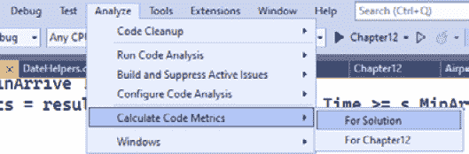

图 12.1 – 计算代码度量

这将打开**代码度量结果**面板，如图 *图 12*.2* 所示：

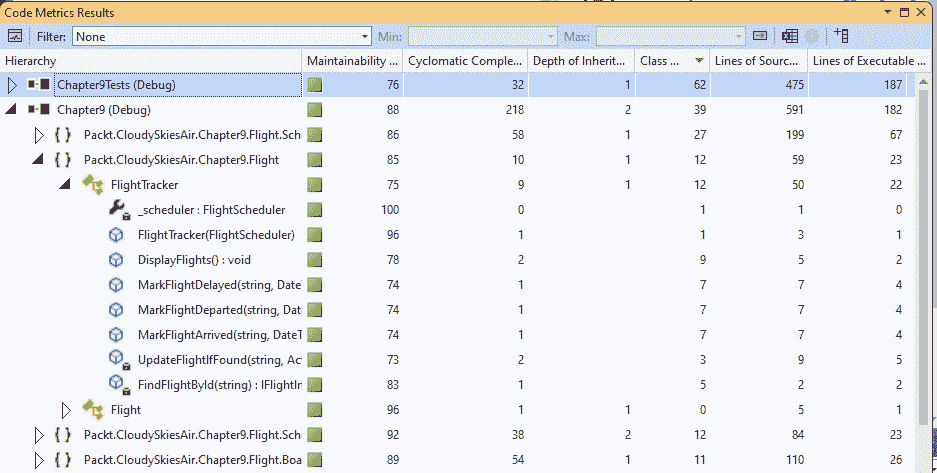

图 12.2 – 代码度量结果

此面板显示了解决方案的层次结构视图，以及以下六个度量：

+   **源代码行数**：类或方法的代码行数。

+   **可执行代码行数**：忽略空白行和注释的源代码行数。

+   `if` 语句、循环、switch 语句和类似类型的分支指令会使此值增加 1。

+   **可维护性指数**：基于循环复杂度、代码行数和方法中执行的操作数计算得出的值。此值范围从 0 到 100，表示您的代码的可维护性。0 到 9 的值是坏的，10 到 20 是警告区域，21 及以上是值得关注区域。

+   `System.Object`，所有类最终都从中继承。

+   **类耦合**：您的代码所依赖的其他类的数量。

这些度量中的每一个都是单独有用的，但结合起来，它们描绘了一个更全面的图景。

维护性指数为你提供了一个代码区域的快速指标。与其他列不同，这些列汇总了类、命名空间或项目中的所有代码的值，而维护性指数则作为一个平均值，可以帮助你快速钻入问题区域。

圈复杂度可以识别出难以测试或难以理解的地方，因为它确定了通过方法的不同路径数。*图 12*.*3*展示了`CalculatePrice`方法的圈复杂度：

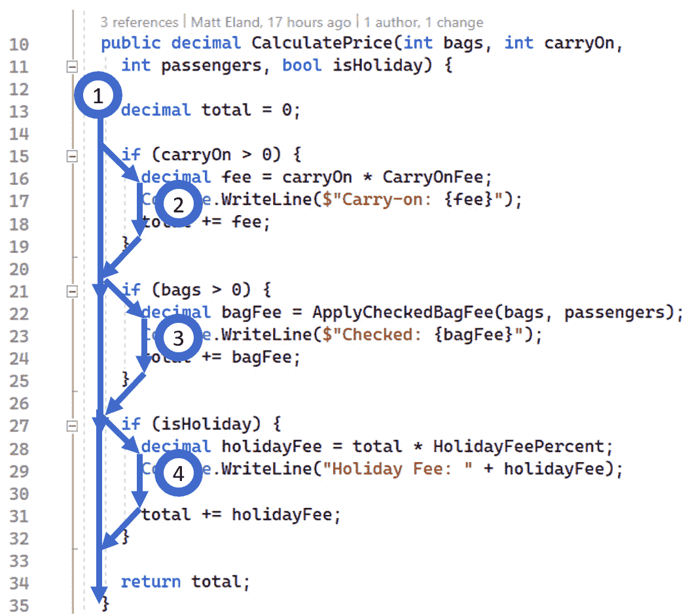

图 12.3 – 计算圈复杂度

在这里，`CalculatePrice`方法的圈复杂度为 4。所有方法都以 1 的圈复杂度开始，代表方法中的单一路径。每个分支语句，如这里的`if`语句，都会将圈复杂度增加 1，从而总共达到 4。

我发现圈复杂度通常很有用，并试图将其保持在尽可能低。请记住，圈复杂度对使用`switch`语句的方法有偏见，因为每个`case`语句都会增加复杂性。只有一行或两行代码的简单`switch`语句通常不难维护，所以将圈复杂度视为代码质量的一个指标。微软建议每个方法的最大圈复杂度为 10，但根据我的经验，我通常对 7 或更低的圈复杂度感到最满意。

继承深度和类耦合可以帮助你识别出你可能过度使用继承或与其他类耦合度过高的地方，正如我们在*第八章*中讨论的那样。微软鼓励最大继承深度为 6，最大类耦合度为 9。

代码行数指标非常有用。我发现，一个类中有很多行代码通常是它违反单一职责原则（SRP）并需要重构的最明显迹象之一。同样，如果一个方法太大，通常很难理解、维护和测试。

我试图将类的代码行数控制在 200 行以下，方法控制在 20 行或更少。在这两种情况下，我都会寻找可以从中提取到方法或类中的内容，并且除非我能够先从代码中提取逻辑，否则我会犹豫是否要使用新逻辑扩展已经很大的类或方法。

请记住，这些都是我发现通常有效的通用指南。这些不是你必须始终遵循的具体规则。

我鼓励你花些时间查看本章示例代码或你维护的代码的代码指标。就本章的代码而言，我最关心以下方法：

+   `Flight.Baggage`命名空间中的`BaggageCalculator.CalculatePrice`具有 58 的维护性指数、4 的圈复杂度和 26 行源代码

+   `FlightScheduler.Search`，该函数接收`Flight.Scheduling`命名空间中的`FlightSearch`对象，其可维护性指数为 48，循环复杂度为 9，类耦合度为 11，源代码行数为 37

这两种方法都因具有多个`if`语句而被指标标记，但它们本身并不复杂。但如果其中任何一个需要显著增长，我希望看到像我们在*第五章*中应用的那种重构，将复杂性从这些方法移至其他对象。

现在我们已经讨论了代码指标，让我们看看代码分析如何为我们提供另一种看待代码的方式。

# 在 Visual Studio 中执行代码分析

微软知道，随着 C#和.NET 的变化，跟上这种广泛且不断变化的语言的演变标准可能非常困难。

为了解决这个问题，微软为我们提供了代码指标之外的工具，即分析器，这些分析器会检查我们的 C#代码中的问题。这些分析器检查我们的代码，标记潜在的问题和优化。这有助于确保我们的代码符合标准，并且是安全、可靠和可维护的。

## 使用默认规则集分析您的解决方案

要查看分析器的实际效果，请在 Visual Studio 中构建本章的解决方案，并注意**输出**窗格中出现的三个警告，如图*图 12.4*所示：

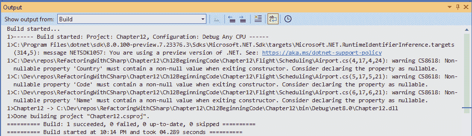

图 12.4 – 显示警告的构建结果概述

这三条线代表与 CS8618 代码分析规则相关的单独编译器警告，我们将在稍后查看。

在我们这样做之前，点击**视图**菜单，然后选择**错误列表**。你应该会看到以更易读的格式格式化的相同警告，如图*图 12.5*所示：

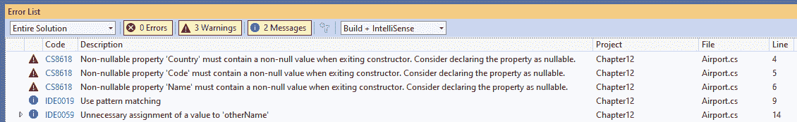

图 12.5 – 错误列表中编译警告的概述

如果这些警告没有显示，请确保**错误**、**警告**和**消息**按钮被选中，如图*图 12.5*所示。

由于这些警告都与`Airport.cs`相关，让我们回顾一下它的代码：

```cs
public class Airport {
  public string Country { get; set; }
  public string Code { get; set; }
  public string Name { get; set; }
  // Non-relevant code omitted...
}
```

当你在 Visual Studio 中查看此代码时，你会在这三个属性下面看到“绿色波浪线”。如图*图 12.6*所示，将鼠标悬停在任何一个“波浪线”上会显示警告或建议的详细信息：

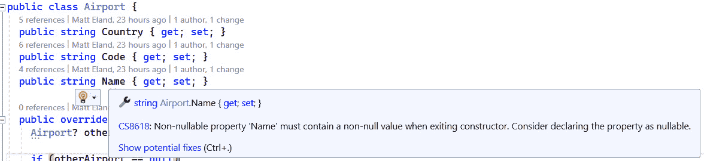

图 12.6 – 与 Name 属性相关的 CS8618 编译器警告

在这种情况下，警告告诉我们这三个属性是非可空的，这意味着它们被声明为`string`而不是`string?`，正如我们在*第十章*中讨论可空性分析时提到的。

由于 .NET 中任何 `string` 属性的默认值都是 null，并且 `Airport` 类没有初始化这些三个属性的任何逻辑，编译器警告告诉我们，当创建 `Airport` 实例时，它们将在我们告诉它不能为 null 的属性中具有 null 值！

.NET 中的可空性分析

记住，尽管字符串是引用类型并且可以是 null，但 C# 中的可空性分析表明属性是否在任何时间点预期具有 null 值。在这里，`string` 类型指示符表示我们从不期望这些属性具有 null 值。另一方面，`string?` 类型指示符将表示我们可能期望 null 值。参见 *第十章* 了解有关 C# 中可空性分析的更多信息。

解决此编译器警告有几种方法：

+   将这些属性的默认值设置为空字符串

+   将这些属性更改为 `string?` 而不是 `string`

+   添加一个构造函数来设置这些属性的非 null 值

+   将这些属性标记为 `required` 以确保它们在创建时必须设置

如此所示，最简单的修复方法是将这些属性标记为 `required`：

```cs
public class Airport {
  public required string Country { get; set; }
  public required string Code { get; set; }
  public required string Name { get; set; }
  // Non-relevant code omitted...
}
```

这解决了三个代码分析警告，留下了两个不那么严重的建议供我们调查，这两个建议都与 `Airport` 的 `Equals` 方法有关：

```cs
public override bool Equals(object? obj) {
  Airport? otherAirport = obj as Airport;
  if (otherAirport == null)
    return false;
  string otherName = otherAirport.Name;
  string otherCountry = otherAirport.Country;
  string otherCode = otherAirport.Code;
  return Country == otherCountry &&
          Code == otherCode;
}
```

第一个警告是 IDE0019，建议在声明 `otherAirport` 时使用模式匹配。幸运的是，这个 analyzer 提供了一个 `Airport?` 类型，揭示了 **使用模式匹配** **快速操作**，如图 *图 12.7* 所示：

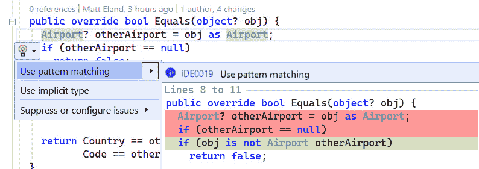

图 12.7 – 应用 Use pattern matching 重构

应用此重构解决了建议并使我们的代码更加简洁：

```cs
if (obj is not Airport otherAirport)
      return false;
```

最后剩下的警告是 *IDE0059: 对`otherName`的不必要赋值*。这表明我们已声明了一个变量并给该变量赋值，但从那时起再也没有使用过该变量，如下面的 `otherName` 所示：

```cs
string otherName = otherAirport.Name;
string otherCountry = otherAirport.Country;
string otherCode = otherAirport.Code;
return Country == otherCountry &&
        Code == otherCode;
```

看着这段代码，很难确定 `otherName` 是否应该包含在等价检查中，或者变量是否根本不需要。在这种情况下，你可能会询问业务利益相关者机场是否可能具有多个名称但仍然是同一个机场。如果你得到“是”的回答，那么修复方法将是删除 `otherName` 变量，而“否”则表明应在 `return` 语句中添加 `Name` 检查。

在没有收集更多关于你正在建模的业务领域信息的情况下，修复代码问题并不总是显而易见的。

## 配置代码分析规则集

.NET 中有大量且不断增长的 analyzers，并非每个 analyzer 都具有相同的重要性水平。因此，Microsoft 提供了不同的 analyzers 集合，以便你可以从最有用的 analyzers 的小子集开始，随着成熟度的增长逐渐扩展到额外的 analyzers 集合。

让我们通过在**解决方案资源管理器**中右键单击**Chapter12**项目并选择**属性**来查看`Chapter12`项目的代码分析设置。

这将打开项目的属性视图。此视图列出了与项目关联的所有可配置属性，可以从顶部到底部滚动或使用左侧的导航窗格进行导航。

在导航窗格中单击**代码分析**；您应该看到项目的代码分析设置，如图*图 12.8*所示：

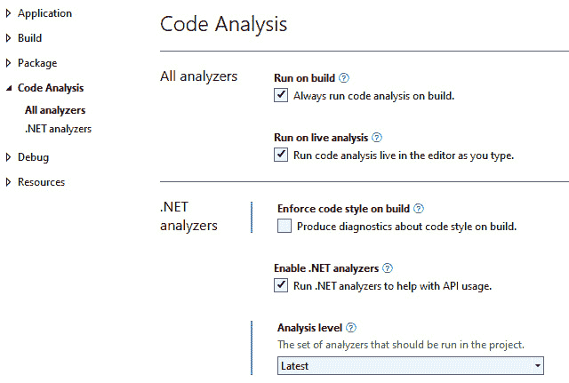

图 12.8 – 项目的代码分析设置

如您从**运行构建**设置中看到的那样，编译器会在每次构建项目时分析代码。

使用的确切分析器集由**分析级别**设置控制，对于新项目默认为**最新**。

Visual Studio 支持多种分析规则集，但让我们关注以“最新”开头的四个规则集，因为这些是最新可用的规则集，这些规则集中的模式将帮助您了解其他规则选项。这些选项如下：

+   **最新**：默认的规则集。这是一个旨在适用于任何类型项目的规则集。

+   **最新最小**：**最新**中的所有内容加上额外的规则。这代表 Microsoft 推荐在项目中使用的最小规则集。

+   **最新推荐**：**最新最小**中的所有内容加上一些额外的规则。这包含一套旨在帮助您维护在任何地区安全可靠运行的业务应用的健壮规则集。

+   **最新全部**：启用所有可用规则。并非每个规则都可能适用于您试图构建的应用程序，但它最大化了构建健壮和可靠应用程序的机会。

让我们看看当我们把我们的项目从**最新**更改为**最新推荐**然后构建会发生什么。

## 响应代码分析规则

在将项目更改为使用**最新推荐**规则集后，将出现三个新的警告，如图*图 12.9*所示：

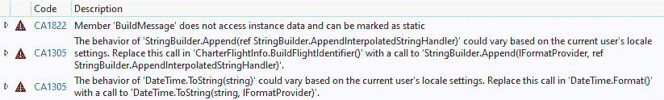

图 12.9 – 移动到更严格的规则集后的新编译器警告

让我们从第一个警告开始。这对应于`Flight`类，目前仅在几行代码中定义：

```cs
public class Flight {
  public string BuildMessage(string id, string status) {
    return $"Flight {id} is {status}";
  }
}
```

CA1822 警告告诉我们*成员‘BuildMessage’不访问实例数据，可以被标记* *为静态*。

这个分析器建议我们将`BuildMessage`方法设置为`static`，因为它不处理`Flight`类的任何特定信息。

在这种情况下，将方法设置为`static`可能会使其更容易测试，并允许编译器进行一些性能优化。

我们可以通过执行我们在 *第四章* 中提到的 *将方法设为静态* 重构来解决这个问题，但相反，让我们来探讨如何抑制特定的警告。

在这个例子中，让我们假设我们打算在未来的某个时刻让 `BuildMessage` 处理实例特定的属性，但我们还没有做到这一点。正因为如此，我们希望警告消失，而不需要将方法设为静态。

使用 `BuildMessage` 方法，然后选择 **抑制或配置问题** 子菜单。从那里，选择 **抑制 CA1822**。这将显示抑制问题的三种不同选项，如图 *图 12.10* 所示：

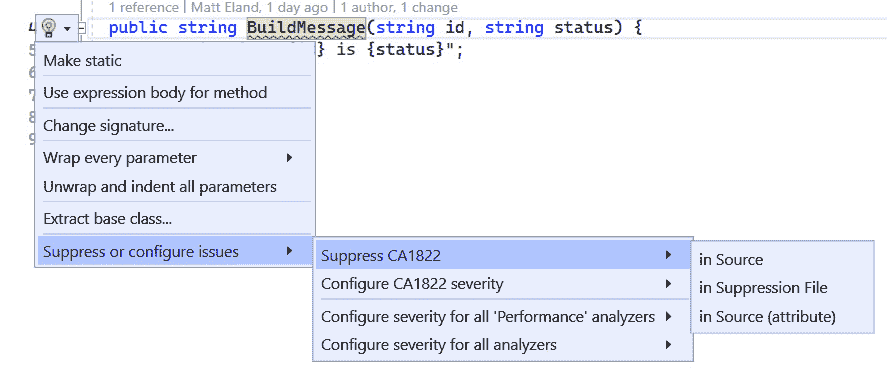

图 12.10 – 抑制代码分析警告的选项

这些选项如下：

+   在你的代码上方和下方使用 `#pragma` 语句来临时禁用代码分析警告

+   **在抑制文件中**：这会创建一个包含代码的单独文件，告诉代码分析不要关心这个特定方法的具体问题

+   在方法上方使用的 `SuppressMessageAttribute` 抑制代码分析问题

这三种方法都可以抑制问题，但它们以不同的方式做到这一点。我通常更喜欢避免预处理指令，如 `#pragma`，以获得更干净、更易于维护的代码。这留下了抑制文件和属性方法。

抑制文件的优点是代码分析抑制不会使你的源代码杂乱，而是存在于一个单独的文件中。然而，这也是它们的缺点。通过将抑制隐藏在另一个文件中，你减少了在未来解决它们的可能性，因为它们是“眼不见，心不烦”。

使用 `using` 语句对 `System.Diagnostic.CodeAnalysis` 进行操作会产生以下文件：

```cs
using System.Diagnostics.CodeAnalysis;
namespace Packt.CloudySkiesAir.Chapter12.Flight;
public class Flight {
  [SuppressMessage("Performance",
    "CA1822:Mark members as static",
    Justification = "Intend to work with instance data in future        release")]
  public string BuildMessage(string id, string status) {
    return $"Flight {id} is {status}";
  }
}
```

在方法上方使用的 `SuppressMessage` 属性将代码分析问题的类别标记为“性能”。接下来，它命名了被抑制的个别分析规则，然后提供了一个理由。

这种解释是一个字符串，用于向你的同事（以及未来的你）说明你为什么认为代码分析规则现在不应被处理，并且应从代码分析结果列表中排除。

我绝不会在没有提供有效抑制理由的情况下抑制代码分析警告。如果一个规则重要到有人为其提供分析器，那么它应该被解决，或者我应该有一个有效的理由来解释我选择忽略它的原因。如果你在想，“我不想处理它”不是一个有效的理由。

在解决了第一个警告之后，让我们一起看看其他两个相关的警告。

第一个警告是 CA1305，它与 `DateHelpers` 类相关，如下所示：

```cs
public static class DateHelpers {
  public static string Format(this DateTime time) {
    return time.ToString("ddd MMM dd HH:mm tt");
  }
}
```

这个警告指出，`ToString`调用可能会根据用户的区域设置和语言设置产生不同的结果。我的设置，作为一个在美国说英语的人，可能不同于使用相同代码但以法语为主要区域设置的人。

下一个警告是在`CharterFlightInfo`中的`BuildFlightIdentifier`：

```cs
public class CharterFlightInfo : FlightInfoBase {
  public List<ICargoItem> Cargo { get; } = new();
  public override string BuildFlightIdentifier() {
    StringBuilder sb = new(base.BuildFlightIdentifier());
    if (Cargo.Count != 0) {
      sb.Append(" carrying ");
      foreach (var cargo in Cargo) {
        sb.Append($"{cargo}, ");
      }
    }
    return sb.ToString();
  }
}
```

这个警告抱怨一个类似本地化问题，指出`StringBuilder.Append`的行为可能会根据用户的区域设置而有所不同。

推荐规则与最小和默认规则

这些格式化规则是规则示例，这些规则并非对所有项目都相关。出于这个原因，这些规则在默认或最小规则集中没有启用：您创建的并非所有应用程序都需要在运行时保持一致。如果您正在构建一个爱好应用程序或仅在单个服务器或办公室运行的应用程序，这个规则可能对您来说并不重要。然而，如果您正在构建分布在全球范围内、面向所有文化背景的客户的应用程序，这将是一个您关心的规则。

解决这两个警告的方法是提供一个显式的文化，您希望用于格式化字符串。这改变了我们的追加代码到以下行：

```cs
sb.Append(CultureInfo.InvariantCulture, $"{cargo}, ");
```

我们的日期格式化代码以类似的方式改变：

```cs
CultureInfo culture = CultureInfo.InvariantCulture;
return time.ToString("ddd MMM dd HH:mm tt", culture);
```

经过这些更改，我们现在不再有代码分析警告。让我们通过查看一种确保我们保持无警告的方法来完成本节。

## 将警告视为错误

我遇到过很多开发者，他们对待警告就像开车时对待速度限制一样：他们忽略它们，以不安全的车速驶过。

确保开发者确保他们的代码没有警告的几种方法。也许最容易的方法就是告诉 C#编译器将任何警告视为编译器错误。

您可以通过右键单击项目并选择**属性**来让 C#编译器将所有警告视为错误，就像我们之前做的那样。从那里，在导航窗格中展开**构建**，然后单击**错误和警告**。一旦这样做，您应该会看到类似*图 12.11*的内容：

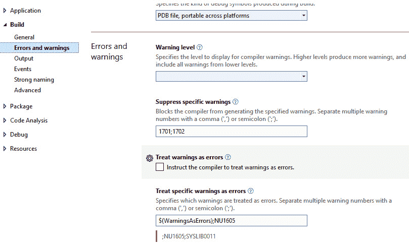

图 12.11 – 配置项目的错误和警告

您可以选择**将警告视为错误**，以便所有警告都导致错误。

由于开发者会关注那些完全阻止代码运行的问题，因此任何警告如果阻止他们构建代码肯定会引起他们的注意！在使用时请小心，因为他们可能不会对这种中断的严重性感到高兴。

一个不那么极端的选择是配置**将特定警告视为错误**设置，并包括您认为应该始终解决的特定警告标识符。

例如，如果我们想强制开发人员对将方法 `static`（CA1822）的建议做出响应，您可以通过设置 `$(WarningsAsErrors);NU1605;CA1822` 来实现，这样做，任何发生警告且未被抑制的地方都会导致编译器错误。

现在我们已经介绍了 Visual Studio 的代码分析功能，让我们来看看另外一对与 C# 代码配合良好的第三方工具选项。

# 探索高级代码分析工具

内置的代码分析和代码度量工具对于想要定位不良代码并确保代码遵循 .NET 项目的最佳实践工程师来说非常好，但它们缺少一些企业级功能。

在本节中，我们将探讨两款不同的商业分析工具，我发现它们为 .NET 项目提供了额外的价值：**SonarCloud** 和 **NDepend**。

我不会介绍如何设置这些工具，因为这两个工具都有全面的文档，我在本章末尾的 *进一步阅读* 部分提供了链接。相反，我们将专注于专门的代码分析工具可以提供的洞察力，这些洞察力超出了 Visual Studio 中可用的内容。

## 使用 SonarCloud 和 SonarQube 跟踪代码度量

SonarCloud 和 SonarQube 是由 SonarSource 提供的一对商业代码分析工具。这两个产品都会查看包含各种流行编程语言代码的 Git 仓库，并生成一系列建议。

SonarCloud 和 SonarQube 之间的主要区别在于，SonarCloud 是由 SonarSource 维护的服务器上托管和分析的，而 SonarQube 是你可以安装在你服务器上的软件。

这两款软件都可以分析 Git 仓库中的代码，并在可靠性、可维护性、安全性和代码重复方面的问题区域提供热图。这些视图为你提供了一个简单的图形表示，有助于轻松标记问题区域，如图 *图 12.12* 所示：

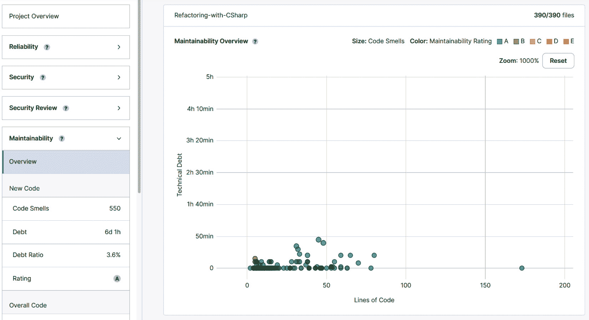


这些工具内置了分析器，可以分析您的代码，并标记出需要修复的可靠性、安全性和性能问题。

一旦问题被标记，您可以使用图 *图 12.13* 中显示的网页用户界面将其分配给团队成员，添加注释，或将其标记为已解决或忽略：

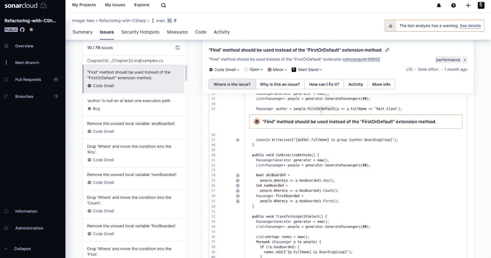


对我来说，SonarCloud 和 SonarQube 有几个主要的卖点：

+   它们以一种非常用户友好的方式帮助非开发人员暴露技术债务。工程经理或首席技术官可以在他们的网络浏览器中查看项目，并了解薄弱区域，而无需安装 Visual Studio。这有助于使技术债务透明化。

+   由 SonarCloud 和 SonarQube 标记的项目往往值得调查，甚至可能比由 Visual Studio 代码分析器标记的项目更值得。

+   使用这些工具，您通常会获得良好的结果，无需额外配置，尽管配置可供您自定义。

SonarCloud 和 SonarQube 是基于项目代码行数定价的商业产品。SonarCloud 还可以免费用于任何公共 GitHub 仓库。

由于本书中的代码在 GitHub 上是公开的，您可以在 [`sonarcloud.io/summary/overall?id=IntegerMan_Refactoring-with-CSharp`](https://sonarcloud.io/summary/overall?id=IntegerMan_Refactoring-with-CSharp) 上查看其代码分析结果。我还强烈建议您创建一个账户，并让 SonarCloud 分析您编写或熟悉的开源代码，以便熟悉设置和分析过程，并查看它给出的建议。

虽然 SonarCloud 和 SonarQube 不是特定于 .NET 的工具，但我确实发现它们与 .NET 项目配合得很好，这就是为什么它们在这本书中被突出显示。

接下来，让我们看看一个专门为 .NET 和 C# 项目构建的工具：NDepend。

## 使用 NDepend 进行深入的 .NET 分析

NDepend 是一款专为帮助架构师和软件工程师从他们的 C# 项目中获得最大效益而设计的强大工具。

NDepend 可以作为 Visual Studio 扩展（如 GitHub Copilot Chat）、独立应用程序或集成到 Azure DevOps 构建管道中的构建代理运行。

当 NDepend 运行其分析时，它会生成一个 HTML 报告（如图 12.14 所示）并在 Visual Studio 的仪表板视图中填充相同的信息：

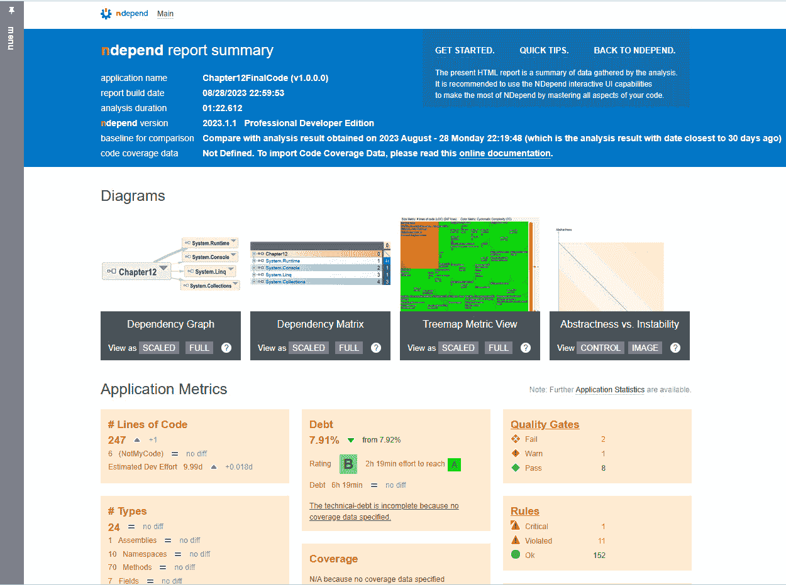

图 12.14 – NDepend 报告显示代码分析结果

本报告突出了项目违反的代码分析规则数量、当前的单元测试代码覆盖率百分比以及指标随时间的变化情况。

尝试一下

您可以在本书的 GitHub 仓库中的 [Chapter12/Ch12FinalCode/NDependOut/NDependReport.html](http://Chapter12/Ch12FinalCode/NDependOut/NDependReport.html) 文件中查看本章的 NDepend 报告样本。

如果您和您的工程团队正在尝试回答诸如“我们是在变得更好还是更差？”，“我们面临的主要问题是什么？”，或“哪些领域需要最迫切地修复？”等问题，NDepend 将帮助您。

与 SonarCloud 类似，NDepend 在一系列称为“规则”的分析器上运行。这些规则使用 LINQ 对代表您源代码的模型进行编写。默认规则包含其源代码并提供自定义，以满足您团队的需求。您还可以编写自己的规则——就像我们在下一章中将要编写的 Roslyn 分析器一样。

这些规则还允许您比较自上次基准以来代码的变化情况，并估计解决它们所代表的技术债务所需的时间。

NDepend 的优势不仅限于其主要报告、规则列表和规则违规列表。NDepend 的真正优势在于其数据可视化。

依赖矩阵是 NDepend 最初为人所知的功能，它允许您看到不同命名空间和类型的二维矩阵，如图 *12.15* 所示：

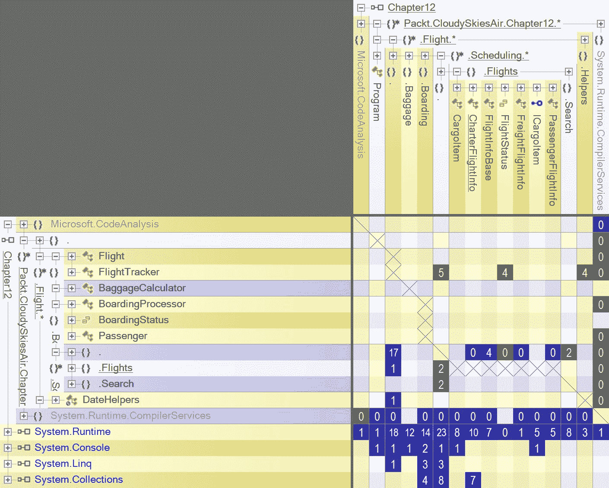

图 12.15 – NDepend 依赖矩阵

这个矩阵有助于您检测相互依赖的命名空间或类型。当不同类型或命名空间相互依赖时，这通常表示软件架构划分不当，并且当存在违规时，NDepend 会使其高度可见。

然而，NDepend 的可视化并不止于此。我最喜欢的 NDepend 内置可视化是它的热视图，它允许您以分层树的形式查看项目中的类型或方法，其中不同的矩形代表不同的类型或方法。

这种视图类似于数据可视化工具中的树图，但每个矩形都是根据 NDepend 计算的各种指标着色和定制的。这些指标远远超出了 Visual Studio 自身计算的指标，包括代码行数、圈复杂度、单元测试覆盖率百分比，甚至文件中的注释数量。

如 *图 12.16* 所示的此热图是我找到的帮我聚焦潜在问题代码的最直观方式——并且能够将问题区域直观地传达给关键利益相关者：

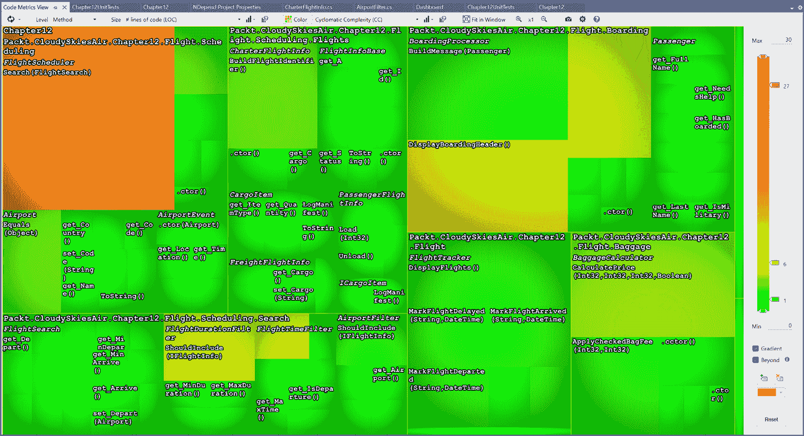

图 12.16 – NDepend 热图显示代码行数和圈复杂度

NDepend 还提供依赖关系图视图。此图允许您看到程序集、命名空间、类型、方法、属性、事件以及甚至字段如何丰富和交互式地相互交互，如图 *12.17* 所示：

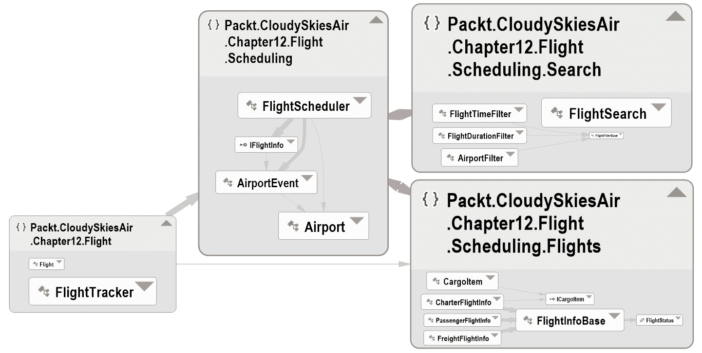

图 12.17 – Chapter12 项目中的命名空间和类型交互

这使您能够可视化您的软件架构，并将该架构传达给团队中的其他成员。这在欢迎新开发者加入时尤其方便。

图形视图还允许您发现问题区域，例如过度依赖其他类型的类型、相互依赖的不同命名空间，以及可能违反 SRP 的类。

根据我的经验，NDepend 需要一些额外的时间来配置和调查，但它代表了一种非常有效的可视化、沟通和导航代码中问题区域的方法。

让我们通过探索我们虚构组织中的代码分析来结束本章。

# 案例研究 – Cloudy Skies Airline

Cloudy Skies Airlines 知道他们有很多技术债务和代码问题，但不确定应该优先考虑哪些区域。每个工程师对什么最重要都有自己的看法。正如您所料，这些看法通常受每个工程师最近工作的内容的影响。

为了解决这个问题，工程领导转向数据。他们开始分析 Visual Studio 中可用的代码指标，并编制出大多数代码分析警告似乎所在的位置。

工程管理随后将问题区域与过去 3 个月内发生变化的区域以及组织预期将需要改变以支持团队即将推出的计划的区域进行了比较。这种方法帮助工程管理优先考虑战略区域的技术债务解决方案，这些区域支持业务目标。

为了解决警告积压，开发人员被赋予了新的命令：您提交的每个提交都不应增加活动代码分析警告的数量。警告数量的减少或保持不变是可以接受的，但在代码审查中增加是不被接受的。

这项政策增加了对代码分析警告的认识，警告随着时间的推移逐渐减少。一旦团队习惯了关注警告，他们就转向了一个更大的代码分析规则集。这导致了一系列新的警告出现，但这些警告有助于识别潜在或实际的问题，以及应用程序的优化。

为了帮助提供代码健康状况的洞察，该组织目前正在评估 SonarCloud 和 NDepend，为团队提供一个质量仪表板，帮助他们关注关键区域并确保质量持续保持高水平。

# 摘要

在本章中，我们看到了代码指标和代码分析工具如何帮助您发现代码中的问题区域，遵循最佳实践，并优先考虑技术债务的区域。这将帮助您了解您和您的团队所面临的挑战。一旦您知道了您所面临的挑战区域，您就可以专注于未来的修复工作。这也有助于您优先考虑技术债务的区域，并将这些区域传达给其他人。

这些内置分析器非常实用，实际上您还可以自己构建一些。在接下来的两个章节中，我们将这样做，因为我们将构建自己的代码分析器，它可以检测并自动修复问题。

# 问题

回答以下问题以测试您对本章知识的掌握：

1.  您认为哪些区域是您代码中最有问题的地方？

1.  代码指标对这些问题区域说了些什么？

1.  循环复杂度是什么？它是如何计算的？

1.  在选择代码分析规则集时，您应该考虑哪些因素？

# 进一步阅读

您可以在以下 URL 中找到有关代码分析的更多信息：

+   *代码度量值*：[`learn.microsoft.com/en-us/visualstudio/code-quality/code-metrics-values`](https://learn.microsoft.com/en-us/visualstudio/code-quality/code-metrics-values)

+   *.NET 源代码分析概述*：[`learn.microsoft.com/en-us/dotnet/fundamentals/code-analysis/overview`](https://learn.microsoft.com/en-us/dotnet/fundamentals/code-analysis/overview)

+   *SonarCloud*：[`www.sonarsource.com/products/sonarcloud/`](https://www.sonarsource.com/products/sonarcloud/)

+   *NDepend*：[`www.ndepend.com/`](https://www.ndepend.com/)
