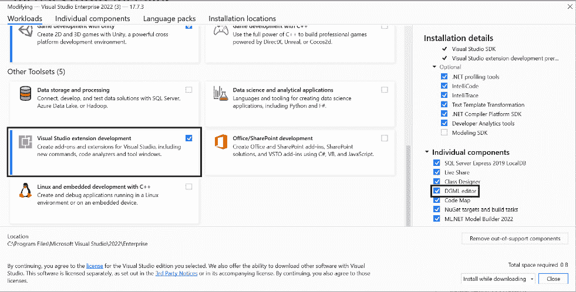

# 13

# 创建 Roslyn 分析器

在上一章中，我们介绍了使用代码分析器来检测代码中的问题。但是，当你的团队存在任何现有分析规则都无法检测到的常见问题时，会发生什么呢？

事实上，现代 C#提供了一种通过称为**Roslyn 分析器**的方式来构建自定义分析器的方法。在本章中，我们将通过构建自己的分析器来了解 Roslyn 分析器是如何实际工作的。

本章涵盖了以下主题：

+   理解 Roslyn 分析器

+   创建 Roslyn 分析器

+   使用`RoslynTestKit`测试 Roslyn 分析器

+   将分析器作为 Visual Studio 扩展共享

# 技术要求

与其他章节不同，我们不会从示例代码开始。相反，我们将从一个空白解决方案开始，并逐渐向该解决方案中添加新的项目。

本章的起始空解决方案和最终代码可在 GitHub 的[`github.com/PacktPublishing/Refactoring-with-CSharp`](https://github.com/PacktPublishing/Refactoring-with-CSharp)的`Chapter13`文件夹中找到。

# 理解 Roslyn 分析器

在我们深入探讨 Roslyn 分析器是什么之前，让我们先谈谈 Roslyn。

**Roslyn**是重新构想后的**.NET 编译平台**的代号，该平台与 Visual Studio 2015 一同发布。由于“.NET 编译平台”这个名字太长，大多数人将其称为 Roslyn 编译器或简称 Roslyn。

在 Roslyn 之前，如果某个工具想要理解 C#、VB 或 F#源代码，开发者需要为这些代码文件编写自己的语言解析器。这需要大量的时间和复杂性，并且每次这些编程语言发生变化时，都需要重复这项工作。这导致工具支持新语言特性的速度较慢，生产力下降，并出现错误。

Roslyn 编译器的一个明确目标是以标准化的方式提供代码结构的可见性。这样，插件就可以使用 Roslyn API 与代码工作，获取有关代码的实时信息，而无需编写自己的解析器。

为了做到这一点，项目可以创建**Roslyn 分析器**，这些分析器集成到代码分析和编译过程中。这让你可以做以下事情：

+   当代码中存在反模式时提供警告和错误

+   集成到**快速操作**菜单中，允许开发者使用既定解决方案自动修复已知问题

+   提供重构功能，从而提高开发者的生产力

你一直都在使用 Roslyn 分析器，通过各种在 Visual Studio 中看到的代码警告、建议和**快速操作**重构。

你可以通过访问**解决方案资源管理器**，然后展开一个项目的**依赖项**节点，接着展开其**分析器**节点和特定的分析器程序集，来探索项目中的内置分析器，如图*13.1*所示：


图 13.1 – 解决方案资源管理器中的代码分析器

在本章的剩余部分，我们将创建我们自己的 Roslyn 分析器，但在我们这样做之前，让我们谈谈 Roslyn 是如何看待 C#代码的。

## 安装扩展开发工作负载和 DGML 编辑器

当您使用 Roslyn 分析器进行开发时，Visual Studio 的两个新增功能将帮助您创建和调试自己的分析器。让我们通过从 Windows 开始菜单启动**Visual Studio 安装程序**来安装这些功能。接下来，选择您的 Visual Studio 安装并点击**修改**。

这将弹出一个包含可用工作负载和功能的列表。这些功能会随时间变化，但您需要确保在**工作负载**选项卡中勾选了**Visual Studio 扩展开发**工作负载，如图*图 13.2*所示：



图 13.2 – 安装 Visual Studio 扩展开发和工作负载 DGML 编辑器

接下来，在**单个组件**选项卡中找到**DGML 编辑器**，并在点击**修改**以安装附加组件之前也勾选它。

当您尝试为 Visual Studio 创建 VSIX 扩展项目时，Visual Studio 扩展开发工作负载非常有用。此类项目允许您向 Visual Studio 添加自定义用户界面元素、分析器和新功能。我们将在本章的其余部分和下一章中定期讨论 VSIX 扩展。

DGML 编辑器使用**有向图标记语言**（**DGML**）与 Visual Studio 一起显示交互式可视化。它还安装了一个非常有用的视图，将帮助我们更好地理解 Roslyn：**语法可视化器**。

## 介绍语法可视化器

**语法可视化器**是 Visual Studio 中的一个视图，它允许您从 Roslyn API 的角度查看源代码的结构。

要查看此功能，请在您的编辑器中打开一个 C#文件，然后通过点击**视图**菜单，接着是**其他窗口**，然后是**语法可视化器**来打开**语法可视化器**。

这应该显示与您编辑器中的代码相对应的各种节点层次结构，如图*图 13.3*所示：


图 13.3 – 语法可视化器与当前代码选择同步

在您的代码中点击各种关键字、变量、方法和值，并观察**语法可视化器**如何根据您的选择进行更改。

这是一种非常好的理解 Roslyn API 中代码结构的方式，但该工具在您不确定 Roslyn API 中的哪个类引用了您想要与之工作的代码元素类型时也非常有用。

现在我们对 Roslyn API 有了一定的了解，让我们创建我们的第一个 Roslyn 分析器。

# 创建 Roslyn 分析器

当人们遇到现有分析器无法解决的代码中的常见问题时，他们会创建自定义的 Roslyn 分析器。这些自定义分析器有助于强制执行特定组织或团队认为有用的规则。然而，这些特定组织的规则通常对更大的 .NET 社区来说不太相关。

这里有一些例子，说明你可能想要构建自定义分析器的情况：

+   你的团队遇到了太多来自 `int.Parse` 等操作导致的 `FormatException` 错误，并希望将 `int.TryParse` 作为他们的标准。

+   由于文件很大且内存有限，你的团队希望避免使用 `File.ReadAllText` 方法，而改用基于流的方案。

+   你的团队要求所有类都必须重写 `ToString` 方法，以改善调试和日志记录体验。

注意，这些方法都与样式或语法无关。相反，这些分析器处理的是团队特定的关于如何最佳使用 .NET 的决策。我们将在 *第十六章* *采用* *代码标准* 中探讨强制执行样式和语法选择的方法。

假设 Cloudy Skies Airlines 在调试和代码故障排除上花费了大量的时间，并怀疑在更多地方重写 `ToString` 将会为他们的团队带来更好的开发者体验。

注意

在所有类中重写 `ToString` 并非一个既定的最佳实践。这样做可能存在一些性能上的缺点，但在这个章节中，我们将假设这个规则对 Cloudy Skies 团队来说是合理的。

在本章的剩余部分，我们将从空白解决方案开始创建这个分析器。

## 将分析器项目添加到我们的解决方案中

虽然 Visual Studio 中内置了创建 Roslyn 分析器的模板，但这些模板比较老旧，并且隐藏了一些实现细节。相反，我们将通过从空白解决方案开始创建和部署 Roslyn 分析器的步骤进行讲解。

我们将首先添加一个包含我们的分析器的类库。类库是一种特殊的项目类型，它为其他项目提供代码，但不能独立运行。

从 `Chapter13BeginningCode` 解决方案开始，我们在 **解决方案资源管理器** 中右键单击解决方案，然后选择 **添加**，接着选择 **新建项目…**。

从那里，我们将选择我们想要创建的项目类型，选择使用 C# 语言创建的 **类库** 项目，如图 *图 13**.4* 所示，然后点击 **下一步**：


图 13.4 – 将 C# 类库项目添加到我们的解决方案中

警告

有多个不同语言的类库项目，名称都为 Class Library。在列表中寻找绿色的 C# 图标和 C# 标签。

接下来，我们需要为我们的类库提供一个名称。这个库将包含我们本章创建的代码分析器，所以让我们称它为 `Packt.Analyzers`，因为项目的名称将成为项目的默认命名空间。

在此之后，你将被要求选择项目应使用的框架。选择 **.NET Standard 2.0** 并点击 **创建**。新项目将被添加到你的解决方案中。

为什么选择 .NET Standard？

与本书中的其他项目不同，我们在这里使用 .NET Standard。这是一个专为在多种不同的 .NET 运行时上运行而设计的 .NET 特殊版本。这使得 .NET Standard 成为当你不知道你的代码将在哪个版本的 .NET 上运行时的一个很好的选择。更多信息请参阅 *进一步阅读* 部分。

要创建 Roslyn 分析器，我们需要向我们的类库添加几个 NuGet 包。为此，在 **解决方案资源管理器** 中右键单击类库，然后选择 **管理** **NuGet 包…**。

一旦你进入 `Microsoft.CodeAnalysis` 包，如图 *图 13.5* 所示：


图 13.5 – 安装 Microsoft.CodeAnalysis 的 4.0.1 版本

注意，版本 4.0.1 并不是这个包的最新版本。这个特定版本是为了避免与我们将要使用的测试库发生冲突而选择的。

现在包已经安装，我们就可以开始创建我们的 Roslyn 分析器了。

## 定义代码分析规则

让我们首先将 `Class1.cs` 文件重命名为 `ToStringAnalyzer.cs` 并用以下内容替换其内容：

```cs
using System;
using System.Linq;
using System.Collections.Immutable;
using Microsoft.CodeAnalysis;
using Microsoft.CodeAnalysis.Diagnostics;
namespace Packt.Analyzers {
  [DiagnosticAnalyzer(LanguageNames.CSharp)]
  public class ToStringAnalyzer : DiagnosticAnalyzer {
  }
}
```

这是我们需要的最基本的编译分析器。让我们来看看这里有什么。

首先，`ToStringAnalyzer` 类从 `DiagnosticAnalyzer` 继承，这是所有提供警告给用户的 Roslyn 分析器的基类。

该类有一个 `DiagnosticAnalyzer` 属性，表示分析器适用于用 C# 编写的代码。

注意

可以编写适用于 C#、F#、Visual Basic 或这些语言的组合的分析器。

从抽象的 `DiagnosticAnalyzers` 类继承强制我们重写 `SupportedDiagnostics` 属性和 `Initialize` 方法。现在让我们以最简单的方式来做这件事：

```cs
public override ImmutableArray<DiagnosticDescriptor>
  SupportedDiagnostics => null;
public override void Initialize(AnalysisContext con) {
}
```

`SupportedDiagnostics` 属性返回 `ImmutableArray`，它包含分析器提供给编辑器的所有诊断规则。在我们的情况下，我们希望它返回用户可能会看到的警告，如果规则被违反。

让我们添加一个新属性并更新我们的 `SupportedDiagnostics` 属性，如图所示：

```cs
public static readonly DiagnosticDescriptor Rule =
  new DiagnosticDescriptor(
    id: "CSA1001",
    title: "Override ToString()",
    messageFormat: "Override ToString on {0}",
    category: "Maintainability",
    defaultSeverity: DiagnosticSeverity.Info,
    isEnabledByDefault: true,
    description: "Override ToString to help debugging.");
public override ImmutableArray<DiagnosticDescriptor>
  SupportedDiagnostics => ImmutableArray.Create(Rule);
```

在这里，我们添加了一个静态的 `Rule` 属性，它定义了定义我们规则的 `DiagnosticDescriptor` 对象。然后这个规则被包含在 `SupportedDiagnostics` 属性中。

本地化说明

`DiagnosticDescriptor`对象可以使用原始字符串创建，就像我们在这里使用的那样，或者通过使用`LocalizableString`参数。`LocalizableString`在不同语言中表现更好，所以如果你试图创建一个打算在全球范围内使用的 Roslyn 分析器，你将想要使用它。

如果规则被违反，此代码定义的`DiagnosticDescriptor`对象将显示在**错误列表**窗格和构建输出中。规则需要以下部分：

+   `CSA`代表 Cloudy Skies Airlines。

+   **标题**：代码分析警告的简称。这是当规则被违反时在工具提示中显示的内容。

+   **消息格式**：一个可格式化的字符串，它将在 Visual Studio 工具提示中显示。

+   `命名`、`性能`、`可维护性`、`安全性`、`可靠性`、`设计`和`使用`。

+   `隐藏`、`信息`、`警告`或`错误`。

+   **默认启用**：规则是否以启用状态开始。

+   **描述**：规则的详细描述以及为什么它很重要。当规则违反被展开时，这将在**错误列表**窗格中显示。

当其他代码需要引用你的确切规则定义时，将你的规则定义为单独的属性是有帮助的。

现在我们已经定义了规则，让我们编写检测规则被违反的代码。

## 使用我们的 Roslyn 分析器分析符号

让我们先从构建我们的`Initialize`方法开始：

```cs
public override void Initialize(AnalysisContext con) {
  con.ConfigureGeneratedCodeAnalysis(
    GeneratedCodeAnalysisFlags.None);
  con.EnableConcurrentExecution();
  con.RegisterSymbolAction(Analyze, SymbolKind.NamedType);
}
```

这种方法现在还增加了几个额外的功能：

+   首先，我们配置分析器在分析目的上忽略任何自动生成的代码。这些是用户没有编写的文件，而是由各种工具生成的，因此分析它们没有意义。

+   其次，我们告诉 Roslyn，同时评估多个代码片段使用这个规则是可以的。从性能的角度来看，这始终是首选选项。

最后，我们告诉分析器，在代码分析过程中遇到任何命名的`Type`时，我们都希望了解它。具体来说，代码应该为检测到的每个`Type`调用一个新的`Analyze`方法。

我们还没有编写那个`Analyze`方法，所以现在让我们来编写它：

```cs
private static void Analyze(
  SymbolAnalysisContext con) {
  INamedTypeSymbol sym = (INamedTypeSymbol)con.Symbol;
  IMethodSymbol toString =
    sym.GetMembers()
       .OfType<IMethodSymbol>()
       .FirstOrDefault(m => m.Name == "ToString"
                         && m.IsOverride
                         && m.Parameters.Length == 0);
  if (toString == null) {
    Diagnostic diagnostic = Diagnostic.Create(
      Rule, sym.Locations[0], sym.Name);
    con.ReportDiagnostic(diagnostic);
  }
}
```

这段代码不易编写或阅读，所以在讨论如何编写分析器代码之前，我们先来了解一下。

首先，因为我们知道这个方法是在命名类型上被调用的，所以我们可以将 Roslyn 给出的符号强制转换为`INamedTypeSymbol`，这让我们可以进一步查询。

使用这个符号，我们可以使用`GetMembers`请求所有成员，例如属性和方法。接下来，我们可以使用 LINQ 将这些过滤到仅包含方法的那些。一旦我们有了这些，我们可以使用`FirstOrDefault`来查看是否有名为`ToString`的方法，它接受零个参数并且是重写的。

为什么不检查返回类型？

我们可以检查返回类型是否为字符串，但 C#编译器不允许有相同参数但返回类型不同的多个方法。我们还知道所有对象都有`string ToString()`，所以返回类型将是`string`。

如果我们没有找到`ToString`的重写，我们的分析器应该将其标记为违反规则。它通过创建一个引用我们之前定义的`Rule`属性、符号的名称和位置的`Diagnostic`对象来实现。在这里，符号将是一个没有重写`ToString`的`Type`定义。

在我们开始验证分析器是否工作之前，让我们谈谈编写分析器代码。

## 编写 Roslyn Analyzers 的技巧

根据我的经验，Roslyn Analyzers 是编写代码中较为困难的部分。使用 Roslyn，您将以完全不同的方式看待您的 C#代码。

您编写的每个分析器都可能分析的内容与上一个完全不同，这使得讨论 Roslyn 中可用的选项范围变得困难。

我发现两个关键点对于编写 Roslyn Analyzers 非常有帮助：

+   **查看其他 Roslyn Analyzers**：有很多其他的 Roslyn Analyzers（包括内置在.NET 中的），大多数都是开源的。这意味着您可以找到一个与您感兴趣的内容相似的现有分析器，然后查看其源代码并做类似的事情。

    在本章的*进一步阅读*部分，您可以找到一些流行的 Roslyn Analyzers 集合。

+   使用`Analyze`方法，您可以给 Copilot 一个提示，例如“我想找到这个类型中包含的所有方法”或“我如何检查这个类型是否被标记为公共的？”

    您仍然需要提供高级指导，但根据我的经验，Copilot 在帮助您编写复杂和不熟悉的分析器代码方面可以非常有效。

现在我们已经构建了我们的 Roslyn Analyzer，让我们看看如何确保它能够正常工作。

# 使用 RoslynTestKit 测试 Roslyn Analyzers

在本章的末尾，我们将展示如何在您的项目中使用 Roslyn Analyzers，但我们将首先围绕现有的分析器编写单元测试。

从高层次来看，我们希望使用我们的分析器测试两件事：

+   分析器不会对违反其规则的代码进行触发。

+   分析器正确地标记了它应该标记的代码。

我们将通过在新的单元测试项目中进行的两个单元测试来完成这项工作。

## 添加 Roslyn Analyzer 测试项目

我们的测试可以使用**MSTest**、**xUnit**或**NUnit**编写。我们将使用 xUnit 以确保一致性。

我们首先通过右键点击解决方案并选择**添加**然后**新建项目…**来向解决方案中添加一个新的 xUnit 项目，就像我们之前做的那样。

然后，选择`Packt.Analyzers.Tests`的 C#版本并点击**下一步**。当提示框架时，选择**.NET 8.0**并点击**创建**。

一旦项目创建完成，通过右键点击`Packt.Analyzers.Tests`项目并选择**添加项目引用…**来添加对`Packt.Analyzers`的引用，如图*图 13.6*所示。6*：


图 13.6 – 添加项目引用…

在`Packt.Analyzers`旁边勾选复选框，然后点击**确定**。这将允许您从测试项目中引用您的分析器。

接下来，我们需要添加对**RoslynTestKit** NuGet 包的引用。这是一个测试框架无关的库，它允许我们通过扩展某些测试固定类来对 Roslyn 分析器进行单元测试，正如我们稍后将会看到的。

右键点击`Packt.Analyzers.Tests`并点击`SmartAnalyzers.RoslynTestKit`。

故障排除安装问题

你可能会遇到`Microsoft.CodeAnalysis`和`SmartAnalyzers.RoslynTestKit`最新版本之间的冲突。请参阅本章节 GitHub 上的最终代码，以获取解决此问题的推荐 NuGet 包版本。

在项目设置完成后，让我们创建我们的测试固定器。

## 创建 AnalyzerTestFixture

我们首先将`UnitTest1.cs`重命名为`ToStringAnalyzerTests.cs`，并用以下代码替换其内容：

```cs
using Microsoft.CodeAnalysis;
using Microsoft.CodeAnalysis.Diagnostics;
using RoslynTestKit;
namespace Packt.Analyzers.Tests;
public class ToStringAnalyzerTests : AnalyzerTestFixture {
  protected override string LanguageName
    => LanguageNames.CSharp;
  protected override DiagnosticAnalyzer CreateAnalyzer()
    => new ToStringAnalyzer();
}
```

这个类从`RoslynTestKit`中的`AnalyzerTestFixture`继承。这迫使类提供它所使用的语言以及创建我们想要测试的分析器的方法。由于我们使用 C#，我们返回`LanguageNames.CSharp`作为语言。在`CreateAnalyzer`中，我们从`Packt.Analyzers`项目实例化并返回我们的`ToStringAnalyzer`实例。

这让`RoslynTestKit`知道如何创建我们的分析器以及我们正在使用的语言，但我们还没有定义一个测试。现在让我们编写我们的第一个测试。

## 验证我们的 Roslyn 分析器不会标记好的代码

我们的第一项测试将是确保不违反我们的分析器的代码不会被标记为规则违规。我们将通过定义一个包含有效代码的字符串来测试这一点，并验证分析器没有发现任何问题。

我们如下声明“好的”代码：

```cs
public const string GoodCode = @"
using System;
public class Flight
{
  public string Id {get; set;}
  public string DepartAirport {get; set;}
  public string ArriveAirport {get; set;}
  public override string ToString() => Id;
}";
```

这个多行字符串定义了 C#的一个简单类声明，其中包含对`ToString`方法的覆盖。因为`ToString`被覆盖，我们的规则不应该在这个类定义中找到问题。

我们可以用以下代码来验证这一点：

```cs
[Fact]
public void AnalyzerShouldNotFlagGoodCode() {
  NoDiagnostic(GoodCode, ToStringAnalyzer.Rule.Id);
}
```

在这里，我们使用`RoslynTestKit's AnalyzerTestFixture`类中的`NoDiagnostic`方法来检查代码没有违反我们的规则。

`RoslynTestKit`需要知道我们正在检查的规则的 ID，因此我们使用我们在`ToStringAnalyzer`上之前定义的`Rule`属性来提供其`id`值。

现在我们的测试没有问题通过，让我们继续进行第二个测试。

## 验证我们的 Roslyn 分析器会标记坏代码

为了验证不良代码会触发分析器规则，我们将使用类似的方法：我们将传递已知的坏代码并确保规则被触发。

这稍微复杂一些，因为我们想确保规则在代码中的正确符号上被触发。因此，当我们定义我们的坏代码时，我们需要添加`[|`和`|]`标记来表示应该标记哪个符号，如下所示：

```cs
public const string BadCode = @"
using System;
public class [|Flight|]
{
  public string Id {get; set;}
  public string DepartAirport {get; set;}
  public string ArriveAirport {get; set;}
}";
```

这段代码没有重写 `ToString` 方法，所以 `Flight` 类应该被标记为规则违规。我们可以使用 `HasDiagnostic` 方法来验证这一点：

```cs
[Fact]
public void AnalyzerShouldFlagViolations() {
  HasDiagnostic(BadCode, ToStringAnalyzer.Rule.Id);
}
```

这段代码与我们验证良好代码的方法非常相似，如果规则没有被触发或者没有明确为 `Flight` 符号触发，它将会失败。

我们可以继续通过添加额外的示例和反例来扩展我们的测试，但让我们简要地谈谈调试我们的 Roslyn 分析器。

## 调试 Roslyn 分析器

当你编写 Roslyn 分析器时，你很可能不会第一次就写对。

单元测试有助于检测分析器中的失败，但让我们谈谈如何调试 Roslyn 分析器。

我推荐的 Roslyn 分析器方法是遵循本章的方法：*创建一个包含你的分析器和测试项目的类库*。

如果你的分析器没有正确触发某些代码，你可以在分析器代码中设置断点，并通过右键单击特定测试用例并选择 **调试** 来逐步执行特定实例，如图 *图 13**.7* 所示：


图 13.7 – 调试特定测试用例

我发现这种方法在分析特定测试用例时非常有帮助。在这些情况下，我可以看到分析器从测试场景中遇到的精确对象。从那里，我编写了足够的代码，使分析器能够处理该场景。一旦分析器处理了该测试用例，我通常就准备好在更广泛的代码范围内尝试分析器了，我们将在下一节讨论。

# 将分析器作为 Visual Studio 扩展共享

一旦你准备好在更多代码上尝试分析器或与你的同事共享它，就有几种选项可供选择：

+   将分析器作为 NuGet 包部署，我们将在下一章讨论

+   创建一个 **Visual Studio 安装程序** (**VSIX**) 来本地安装分析器

+   创建一个新的项目，并通过编辑 `.csproj` 文件并添加一个 `Analyzer` 节来显式引用分析器，如图所示：

```cs
<ItemGroup>
  <Analyzer Include="..\some\path\Your.Analyzer.dll" />
</ItemGroup>
```

如果你有一个大型解决方案并且希望你的分析器只应用于该解决方案中的其他项目，你可能考虑采用这种方法。然而，我发现这种方法存在错误，并且需要频繁重新加载 Visual Studio 以使分析器更改生效，所以我们将在本章结束时使用 VSIX 方法。

## 为你的 Roslyn 分析器创建一个 Visual Studio 扩展 (VSIX)

Visual Studio 扩展项目 (VSIX 项目) 允许你将各种功能打包成一个扩展，然后可以将其安装到 Visual Studio 中。

让我们创建一个新的 VSIX 项目，将我们的分析器添加到其中，然后在 Visual Studio 的新实例中使用它。

我们将像往常一样开始：在 **解决方案资源管理器** 中右键单击解决方案，选择 **添加**，然后选择 **新建项目…**。

接下来，选择 `Packt.Analyzers.Installer` 并点击 **创建**。

这个空项目包含一个单独的 `source.extension.vsixmanifest` 文件，我们将称之为清单。这是我们需要唯一的一个文件。双击它以打开设计器，如图 13.8* 所示：


图 13.8 – 设计视图中的清单

这将打开元数据视图，其中包含你可以配置的不同设置。我们将忽略这些设置，并点击左侧侧边栏上的 **资产** 选项卡。

**资产** 选项卡指定了扩展中包含的不同组件。我们希望包含我们的分析器，因此点击 **新建** 以打开 **添加新资产** 对话框。

接下来，指定 `Packt.Analyzers` 项目，如图 13.9* 所示：


图 13.9 – 将 Roslyn 分析器作为资产添加到你的 VSIX 项目中

点击 **确定**；你的分析器现在应该出现在资产列表中。

通过这个更改，我们的 VSIX 项目现在已准备好使用。要测试此项目，请右键单击 `Packt.Analyzers.Installer` 项目并选择 **设置为启动项目**。接下来，运行你的项目 – 将打开一个新的实验性 Visual Studio 实例。

注意

在运行项目后，Visual Studio 打开可能需要几分钟时间。打开的 Visual Studio 版本是专门为开发扩展而构建的，需要额外的时间来启动。不建议使用此版本的 Visual Studio 进行实际开发。相反，使用它来测试你的扩展，然后关闭它。

几分钟后，将打开一个新的 Visual Studio 实例，其中已安装你的 VSIX 项目。使用此实例的 Visual Studio，你可以打开任何其他项目，本章中构建的 Roslyn 分析器将处于活动状态。

具体来说，我们的分析器将在没有重写 `ToString` 的类上显示建议，例如图 13.10* 中的 `SkillController` 类：


图 13.10 – 我们的 Roslyn 分析器建议重写 ToString

你的分析器的警告也会显示在错误列表中，尽管如果你已经将它们标记为具有严重性，如我们在本章中所做的那样，你需要确保消息显示在这些结果中。请参阅图 13.10* 中突出显示的消息过滤器按钮。

DebuggerDisplay 属性与 ToString 重写之间的比较

本章以 `ToString` 为例，重写 `ToString` 方法可以帮助改善调试器的体验。另一种方法是，在你的类定义上方添加 `[DebuggerDisplay]` 属性来描述它在调试器中的显示方式，而无需重写 `ToString`。

一旦你对测试结果满意，请关闭 Visual Studio 的新实例。

构建和测试您的安装程序将在您的扩展项目 `bin/Debug` 文件夹中创建一个 `Packt.Analyzers.Installer.vsix` 文件。这个 `.vsix` 文件将允许其他人安装您的自定义扩展并在他们的项目中使用您的分析器。

注意

您还可以在 Visual Studio 市场中分发您的安装程序。这将使扩展公开可用，并使其他人更容易找到和下载。

每次您更新您的分析器时，您都需要分享扩展的新版本，并且您的团队需要升级。这使得通过 `.vsix` 文件管理 Roslyn 分析器具有挑战性。

幸运的是，NuGet 包提供了一种更好的方式来共享 Roslyn 分析器，我们将在下一章中看到。

# 摘要

在本章中，我们创建了我们的第一个 Roslyn 分析器，使用 `RoslynTestKit` 进行测试，并构建了一个 VSIX 扩展以将其集成到 Visual Studio 中。

我们看到了 Roslyn 分析器如何驱动我们在 Visual Studio 中交互的所有警告，以及您和您的团队如何创建新的 Roslyn 分析器来检测和标记对您的团队及其代码库独特的问题。

在下一章中，我们将看到如何使用 Roslyn 分析器来修复它们发现的问题，并帮助安全地重构您的代码。

# 问题

1.  Roslyn 分析器是如何工作的？

1.  您何时想创建自己的 Roslyn 分析器？

1.  您如何验证 Roslyn 分析器是否正确工作？

# 进一步阅读

您可以在以下网址找到关于本章所涵盖主题的更多信息：

+   *Roslyn* *分析器*: [`learn.microsoft.com/en-us/visualstudio/code-quality/roslyn-analyzers-overview`](https://learn.microsoft.com/en-us/visualstudio/code-quality/roslyn-analyzers-overview)

+   *安装第三方* *分析器*: [`learn.microsoft.com/en-us/visualstudio/code-quality/install-roslyn-analyzers`](https://learn.microsoft.com/en-us/visualstudio/code-quality/install-roslyn-analyzers)

+   *Awesome* *Roslyn*: [`github.com/ironcev/awesome-roslyn`](https://github.com/ironcev/awesome-roslyn)

+   .*NET* *标准*: [`learn.microsoft.com/en-us/dotnet/standard/net-standard`](https://learn.microsoft.com/en-us/dotnet/standard/net-standard)

这里有一些在 GitHub 上流行的开源 Roslyn 分析器：

+   *Roslyn* *分析器*: *https://github.com/dotnet/roslyn-analyzers*

+   *StyleCop*: [`github.com/DotNetAnalyzers/StyleCopAnalyzers`](https://github.com/DotNetAnalyzers/StyleCopAnalyzers)
