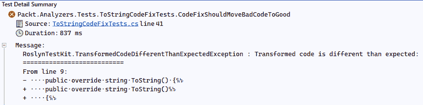
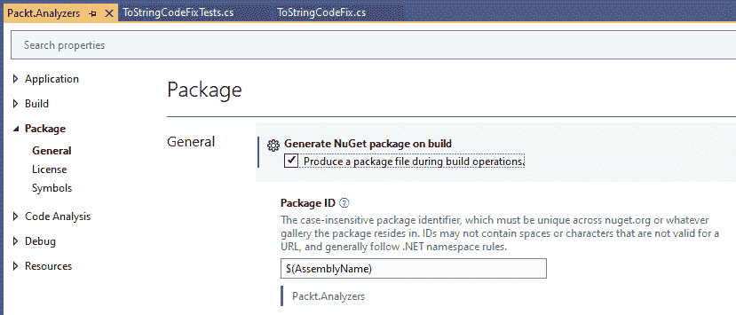
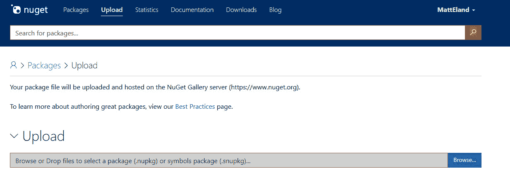
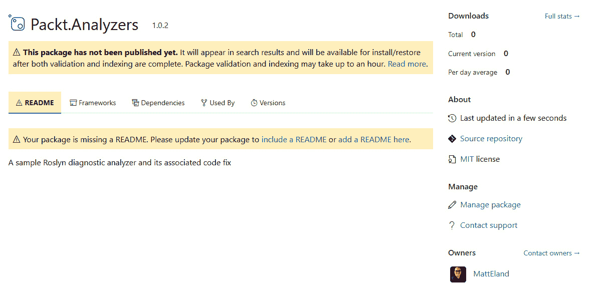
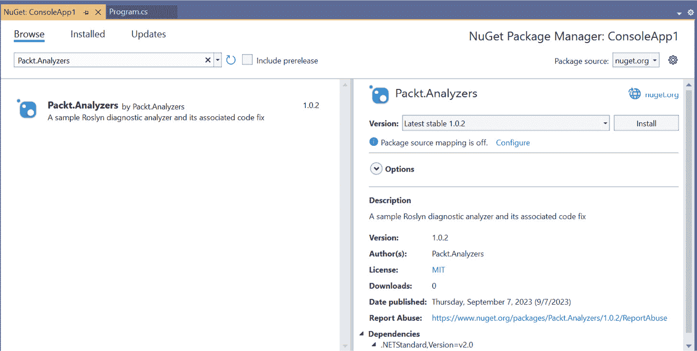
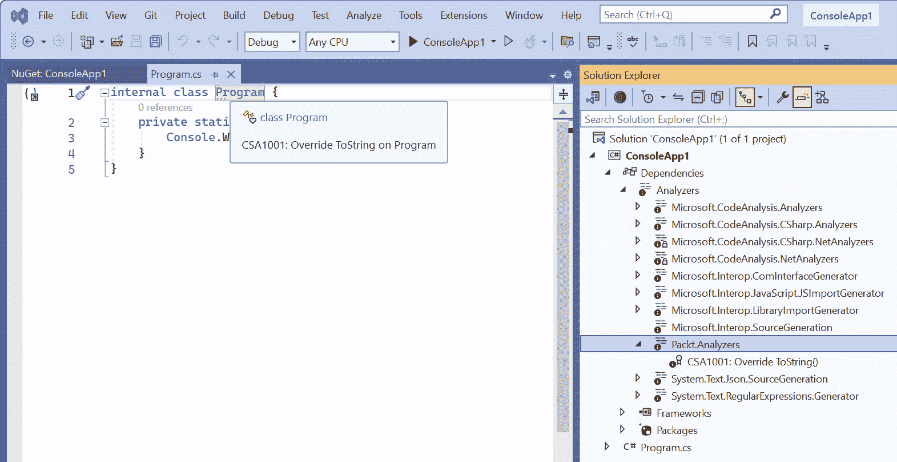
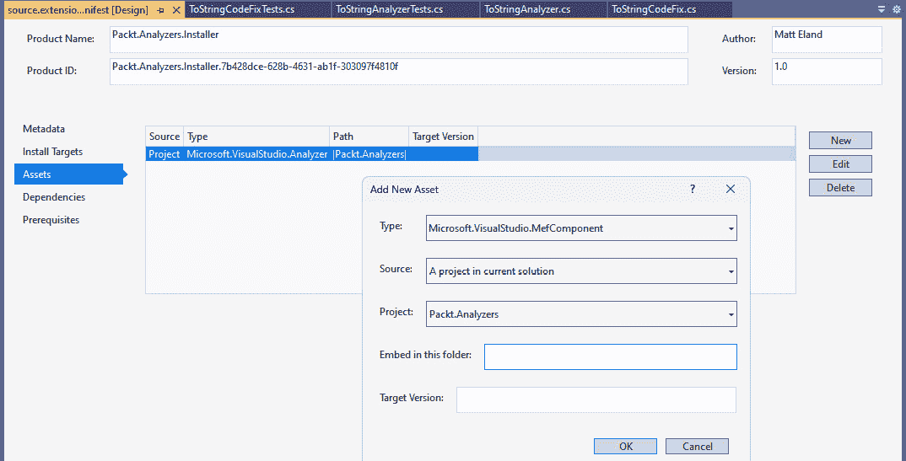

# 14

# 使用 Roslyn 分析器重构代码

在上一章中，我们看到了如何构建 Roslyn 分析器来标记代码中的问题。在本章中，我们将通过提供用户可以调用的**快速操作**来修复代码问题，从而改进我们的分析器，让它们能够修复代码问题。我们还将讨论一些额外的部署 Roslyn 分析器的方法，这些方法可以提高您为团队成员提供一致体验的能力。

本章涵盖了以下内容：

+   构建 Roslyn 分析器代码修复

+   使用 RoslynTestKit 测试代码修复

+   将 Roslyn 分析器作为 NuGet 包发布

# 技术要求

在本章中，我们将从*第十三章*结束的地方开始。

本章的起始代码可以从 GitHub 的[`github.com/PacktPublishing/Refactoring-with-CSharp`](https://github.com/PacktPublishing/Refactoring-with-CSharp)中的`Chapter14/Ch14BeginningCode`文件夹获取。

# 案例研究 – Cloudy Skies Airlines

在*第十三章*中，我们构建了一个`ToStringAnalyzer`，它可以检测没有重写`ToString`方法的类。这导致 Visual Studio 编辑器中的建议和在错误列表中的消息。

Cloudy Skies Airlines 已内部部署此工具并发现它通常很有帮助，但还有一些需要改进的地方：

+   尽管分析器标记了`ToString`重写规则的违规行为，但并非每个开发者都在解决这个问题。在内部讨论时，一些开发者表示他们不想花时间解决这个问题。此外，一些新开发者没有完全理解这个规则或修复它的样子会是什么样子。

+   每当创建一个新的分析器或解决现有分析器中的错误时，必须创建一个新的 VSIX 文件。然后开发者需要下载并安装它以获取更新版本。正因为如此，团队很难知道哪些开发者安装了分析器，或者每个开发者使用的是哪个版本。

在本章中，我们将解决这些问题。我们将探讨创建和测试一个能够自动解决检测到的问题的代码修复提供者。之后，我们将探索通过**NuGet 包**发布分析器，并展示它们如何帮助您的团队能够获得一致的分析器体验。

# 构建 Roslyn 分析器代码修复

Roslyn 分析器允许你为用户提供选项，自动修复分析器在代码中检测到的问题。他们通过称为**代码修复提供者**的东西来完成这项工作，它可以以自动化的方式修改你的文档，以解决诊断警告。

想象一下：诊断分析器，就像我们的`OverrideToStringAnalyzer`，帮助*检测*团队代码中的问题。另一方面，代码修复提供者为你提供了一种*修复*这些问题的方法。

并非所有诊断分析器都会有代码修复提供者，但根据我的经验，那些也提供代码修复提供者的分析器往往会被更早和更一致地解决。

让我们看看它是如何工作的。

## 创建一个 CodeFixProvider

首先，我们将在 `Packt.Analyzers` 类库中添加一个新的类。我们将把这个类命名为 `ToStringCodeFix`。用以下代码替换其内容以实现基本的代码修复：

```cs
using Microsoft.CodeAnalysis;
using Microsoft.CodeAnalysis.CodeActions;
using Microsoft.CodeAnalysis.CodeFixes;
using Microsoft.CodeAnalysis.CSharp;
using Microsoft.CodeAnalysis.CSharp.Syntax;
using Microsoft.CodeAnalysis.Text;
using System.Collections.Immutable;
using System.Composition;
using System.Linq;
using System.Threading.Tasks;
namespace Packt.Analyzers {
  [Shared]
  [ExportCodeFixProvider(LanguageNames.CSharp,
    Name = nameof(ToStringCodeFix))]
  public class ToStringCodeFix : CodeFixProvider {
    public override ImmutableArray<string>
      FixableDiagnosticIds =>
        ImmutableArray.Create(ToStringAnalyzer.Rule.Id);
    public override FixAllProvider GetFixAllProvider()
      => WellKnownFixAllProviders.BatchFixer;
    public async override Task RegisterCodeFixesAsync(
      CodeFixContext context) {
      throw new NotImplementedException();
    }
  }
}
```

这是我们需要的最小代码量，以便有一个可编译的代码修复提供者。在我们构建这个类的其余部分之前，让我们看看这里已经有什么了。

首先，我们声明一个继承自 `CodeFixProvider` 的 `ToStringCodeFix` 类。`CodeFixProvider` 是用于为一个或多个诊断提供修复的抽象类。

注意，我们给代码修复命名为 `ToStringCodeFix`，以与它提供的代码修复的 `ToStringAnalyzer` 类相匹配。这是一个我喜欢遵循的约定，以帮助清楚地关联分析器和它们的代码修复。

该类有两个属性被分配给它：

+   `ExportCodeFixProviderAttribute` 告诉 Roslyn，该类代表一个代码修复，代码修复的名称以及代码修复应用到的语言。

+   `SharedAttribute` 本身不做任何事情，但它是为了让 Roslyn 在 Visual Studio 中舒适地注册你的代码修复所必需的。

这两个属性应该出现在你创建的每一个代码修复中。未能使用它们将导致你的代码修复提供者对某些用户不可见（别问我怎么知道的）。

`ToStringCodeFix` 类目前有三个成员：

+   `ToStringAnalyzer` 规则，这意味着它表示它可以修复该问题。

+   `WellKnownFixAllProviders.BatchFixer`，我们告诉 Visual Studio 允许用户尝试修复文件、项目或甚至解决方案中该类型的所有问题。

+   **RegisterCodeFixesAsync**：这是我们注册代码修复并告诉 Visual Studio 如果用户选择应用它应该做什么的地方。

我们的大部分逻辑将在 `RegisterCodeFixesAsync` 中，所以现在让我们实现这个方法。

## 注册代码修复

`RegisterCodeFixesAsync` 的任务是解释违反我们设置的诊断规则的代码，并注册一个让用户可以修复它的操作。

实现这一点的代码相当复杂，所以让我们分部分来看。第一部分与解释诊断违规发生在文档中的哪个位置有关：

```cs
public async override Task RegisterCodeFixesAsync(
  CodeFixContext context) {
  Diagnostic diagnostic = context.Diagnostics.First();
  TextSpan span = diagnostic.Location.SourceSpan;
  Document doc = context.Document;
```

这里，我们得到一个包含有关代码分析诊断违规信息的 `CodeFixContext` 对象。

这些 `Diagnostic` 对象包含有关触发规则的文档中确切文本范围的信息。在我们的情况下，这应该是没有重写 `ToString` 的类的名称文本。

接下来，我们获取包含违规的`Document`的引用。将`Document`想象成你解决方案中某个地方的源代码文件。分析器和代码修复可以查看整个解决方案，所以这个`Document`有助于缩小范围到包含违规代码的文件。

使用这个`Document`，我们可以访问语法树及其`type`声明：

```cs
  SyntaxNode root = await doc
    .GetSyntaxRootAsync(context.CancellationToken)
    .ConfigureAwait(false);
  TypeDeclarationSyntax typeDec =
    root.FindToken(span.Start)
        .Parent
        .AncestorsAndSelf()
        .OfType<TypeDeclarationSyntax>()
        .First();
```

在这里，我们正在获取表示我们文档基础的`SyntaxRoot`元素，然后根据文档中该文本 span 的位置找到类的声明。

这使我们能够从我们在 span 中拥有的原始文本跳转到表示`Type`声明的对象。拥有这个对象允许我们进行更改并提供修复。

方法末尾部分注册了修复问题的代码操作：

```cs
  CodeAction fix = CodeAction.Create(
    title: "Override ToString",
    createChangedDocument: c => FixAsync(doc, typeDec)
  );
  context.RegisterCodeFix(fix, diagnostic);
}
```

此代码创建一个`CodeAction`并将其注册为对诊断规则的修复。此修复有一个标题，表示用户将在我们尚未看到的`FixAsync`方法中看到的文本。

其他选项

`CodeAction.Create`有几个重载和可选参数，允许您更改整个解决方案而不是单个文档，或者在多个代码修复具有相同标题时解决冲突。

现在我们已经注册了我们的代码修复，让我们看看修复操作是如何工作的。

## 使用代码修复修改文档

实现我们的代码修复的最终步骤是`FixAsync`方法。此方法的工作是修改`Document`，使其不再违反诊断规则。

在我们的情况下，修复将生成如下代码：

```cs
public override string ToString()
{
  throw new NotImplementedException();
}
```

很遗憾，在这里直接编写原始 C#代码比使用 Roslyn API 构建它要容易得多。

要使用 Roslyn 添加此功能，我们将遵循以下步骤：

1.  创建一个抛出`NotImplementedException`的方法体。

1.  创建与方法（`public`和`override`）一起使用的修饰符列表。

1.  使用适当的名称和返回类型创建一个方法声明，并确保这个方法有修饰符列表和方法体。

1.  创建一个具有新方法的`Type`声明版本。

1.  在`Document`中找到`Type`声明并将其替换为我们新的声明。

让我们看看这是如何工作的，从声明新方法体的代码开始：

```cs
private Task<Document> FixAsync(Document doc,
  TypeDeclarationSyntax typeDec) {
  const string exType = "NotImplementedException";
  IdentifierNameSyntax exId =
    SyntaxFactory.IdentifierName(exType);
  BlockSyntax methodBody = SyntaxFactory.Block(
    SyntaxFactory.ThrowStatement(
      SyntaxFactory.ObjectCreationExpression(exId)
        .WithArgumentList(SyntaxFactory.ArgumentList())
    )
  );
```

如您所见，在 Roslyn 中声明任何内容的代码可能会变得有点密集。然而，当你退一步看时，这段代码只是在声明一个方法块，该块实例化并抛出`NotImplementedException`。

接下来，我们将定义使用此方法体的方法定义：

```cs
  SyntaxToken[] modifiers = new SyntaxToken[] {
    SyntaxFactory.Token(SyntaxKind.PublicKeyword),
    SyntaxFactory.Token(SyntaxKind.OverrideKeyword)
  };
  SyntaxToken returnType =
    SyntaxFactory.Token(SyntaxKind.StringKeyword);
  MethodDeclarationSyntax newMethod =
    SyntaxFactory.MethodDeclaration(
      SyntaxFactory.PredefinedType(returnType),
      SyntaxFactory.Identifier("ToString")
    )
    .WithModifiers(SyntaxFactory.TokenList(modifiers))
    .WithBody(methodBody);
```

这段代码与上一个块几乎一样密集，但它实际上只是声明了方法。此方法结合了`string`返回类型、名为`ToString`的名称、`public`和`override`修饰符以及我们在上一个块中声明的主体。

修复的最终步骤是修改编辑器的代码以使用我们的代码修复。我们使用以下代码来完成此操作：

```cs
  TypeDeclarationSyntax newType =
    typeDec.AddMembers(newMethod);
  SyntaxNode root = typeDec.SyntaxTree.GetRoot();
  SyntaxNode newRoot = root.ReplaceNode(typeDec, newType);
  Document newDoc = doc.WithSyntaxRoot(newRoot);
  return Task.FromResult(newDoc);
}
```

这段代码创建了一个新的`Type`声明版本，其中包含我们的新方法。然后我们在`Document`中找到旧的`Type`声明，并用新的一个替换它。这创建了一个新的`Document`，然后我们从我们的代码修复中返回它，Visual Studio 相应地更新我们的代码。

这样，我们现在有一个工作的代码修复。我们如何知道它正在工作？我们测试它！

# 使用 RoslynTestKit 测试代码修复

在*第十三章*中，我们看到了`RoslynTestKit`库如何帮助您的诊断分析器适当地标记代码问题。在本章中，我们将重新访问该库以验证我们新的代码修复。

我们将首先在我们的测试项目中创建一个名为`ToStringCodeFixTests`的新类，这是由于我们的常见命名约定。

这个类将首先声明一个测试固定装置，就像它对分析器所做的那样：

```cs
using Microsoft.CodeAnalysis;
using Microsoft.CodeAnalysis.CodeFixes;
using Microsoft.CodeAnalysis.Diagnostics;
using RoslynTestKit;
namespace Packt.Analyzers.Tests;
public class ToStringCodeFixTests : CodeFixTestFixture {
 protected override string LanguageName
   => LanguageNames.CSharp;
 protected override CodeFixProvider CreateProvider()
   => new ToStringCodeFix();
 protected override IReadOnlyCollection<DiagnosticAnalyzer>
   CreateAdditionalAnalyzers()
   => new[] { new ToStringAnalyzer() };
```

与以前一样，我们的测试类继承自测试固定装置，但这次它是`CodeFixTestFixture`，因为我们正在测试一个代码修复。

同样，我们还需要指定我们的代码修复会影响 C#编程语言，并通过`CreateProvider`方法提供对我们类的引用。

与以前不同，我们还需要通过`CreateAdditionalAnalyzers`方法提供我们正在测试的代码分析器。编译器允许您不重写此方法，但如果您忘记这样做，您的分析器在接下来的步骤中永远不会触发，所以请确保在这里包含您的分析器。

接下来，我们通过提供一个坏代码块和一个好代码块来测试我们的代码修复，并验证代码修复是否成功地将坏代码转换为好代码：

```cs
  public const string BadCode = @"
using System;
public class [|Flight|]
{
    public string Id {get; set;}
    public string DepartAirport {get; set;}
    public string ArriveAirport {get; set;}
}";
  public const string GoodCode = @"
using System;
public class Flight
{
    public string Id {get; set;}
    public string DepartAirport {get; set;}
    public string ArriveAirport {get; set;}
    public override string ToString()
    {
        throw new NotImplementedException();
    }
}";
  [Fact]
  public void CodeFixShouldMoveBadCodeToGood() {
    string ruleId = ToStringAnalyzer.Rule.Id;
    TestCodeFix(BadCode, GoodCode, ruleId);
  }
}
```

这段代码与上一章中的代码有些相似。就像分析器一样，我们需要使用`[|`和`|]`标记来表示触发修复的位置，就像我们在`[|Flight|]`中看到的那样。

实际的验证步骤是通过`TestCodeFix`方法调用来进行的。此方法调用将使用代码修复将您的坏代码转换为新的形式，然后将其与预期的良好代码进行比较。

这个比较非常敏感，任何额外的空格、换行符或任何差异都将导致测试失败，并在两个字符串之间突出显示观察到的差异，如图*图 14**.1*所示：



图 14.1 – 由于样式选择导致的字符串差异的测试失败

假设您的格式是一致的，您的测试现在应该通过了，这证明了您有一个好的代码修复。

如果您愿意，现在可以启动您的 VSIX 扩展项目，并在 Visual Studio 中验证代码修复。之后，您可以与同事或.NET 社区的人分享 VSIX 文件，他们就可以访问您的分析器和其修复。

然而，正如我们很快就会看到的，VSIX 部署有一些缺点。让我们通过查看使用 NuGet 包以更受控的方式共享您的代码修复来结束这一章。

# 将 Roslyn 分析器作为 NuGet 包发布

使用 VSIX 文件共享代码分析器是可行的，但并不是一个理想的解决方案。

由于 VSIX 文件必须手动安装和更新，这意味着在软件工程师团队中，您永远无法确定谁安装了扩展，或者谁使用的是哪个版本的扩展。

因为每个开发者都必须自己安装并保持 VSIX 更新，这使得吸纳新团队成员、发布新的分析器或代码修复，或为现有分析器中发现的问题发布补丁变得更加困难。

幸运的是，有一个更好的选择：*NuGet* *包部署*。

## 理解 NuGet 包部署

分析器和代码修复可以被打包成 NuGet 包并部署到 NuGet 源，这样其他人就可以找到它们。一旦进入 NuGet 源，团队中的任何开发者都可以将包安装到一个或多个项目中。

一旦安装了 NuGet 包，任何打开项目的开发者都会自动通过几乎不可见的 NuGet 包还原步骤下载该包。如果您安装了一个 NuGet 包，然后添加、提交并推送更改，其他开发者会在他们拉取您的更改并在 Visual Studio 中打开项目时自动看到已安装的包。

这意味着您的团队中只需要一个开发者安装任何 NuGet 包，包括包含 Roslyn 分析器的包。此外，如果您需要更新包以包含新的分析器，团队中的任何开发者都可以更新已安装包的版本。

通过使用 Roslyn 分析器的 NuGet 包部署，您的分析器将变为：

+   容易安装

+   容易更新

+   在团队所有开发者中一致可用

+   故意与项目关联

最后一点很有趣。使用 VSIX 部署，分析器适用于开发者在他们的机器上打开的任何代码。分析器与您团队源代码之间没有正式的联系，但如果开发者安装了 VSIX 分析器，他们会看到其建议。

使用 NuGet 包，您明确指定了哪些分析器应该分析哪些项目，因为您通过 NuGet 安装过程明确地将它们关联起来。这意味着您可以在解决方案中的任何项目中查看，并了解所有项目开发者应该应用哪些分析器规则，这是通过 VSIX 部署很难实现的。

由于这些原因，我强烈建议将您的分析器和代码修复作为 NuGet 包部署。

让我们看看这是如何操作的。

## 构建 NuGet 包

Visual Studio 为您提供了一种轻松打包大多数.NET 项目的方法：只需在**解决方案资源管理器**中右键单击一个项目，选择**属性**，然后在导航器中的**包**下找到**常规**选项卡。从那里，您可以选择**在构建操作期间生成包文件**复选框，如图*图 14.2*所示：



图 14.2 – 在 Visual Studio 中启用 NuGet 包创建

当这个复选框被勾选时，构建后你应该能在你的构建输出中看到以下内容：

```cs
1>Successfully created package 'C:\PacktBook\Chapter14\Ch14BeginningCode\Packt.Analyzers\bin\Debug\Packt.Analyzers.1.0.0.nupkg'.
1>Done building project "Packt.Analyzers.csproj".
```

通用刀片还允许你配置与包关联的许多元数据部分。这让你可以指定一个自述文件或一个徽标，输入你需要任何法律信息，等等。这些信息将在用户考虑安装你的包时可见。

配置用于向公众发布 NuGet 包时需要考虑的许多事情超出了本书的范围，但额外的资源列在本章末尾的*进一步阅读*部分。

不幸的是，当为 Roslyn 分析器构建包时，你需要自定义比 Visual Studio 在属性用户界面中提供的更多的内容。

双击`.csproj`文件中的`Packt.Analyzers`，并将其替换为以下内容：

```cs
<Project Sdk="Microsoft.NET.Sdk">
 <PropertyGroup>
   <TargetFramework>netstandard2.0</TargetFramework>
   <GeneratePackageOnBuild>True</GeneratePackageOnBuild>
   <IncludeBuildOutput>false</IncludeBuildOutput>
   <Authors>YourName</Authors>
   <Company>YourCompany</Company>
   <PackageId>YourCompany.Analyzers</PackageId>
   <PackageVersion>1.0.0</PackageVersion>
   <PackageLicenseExpression>MIT</PackageLicenseExpression>
   <Description>
      Sample analyzer with fix from "Refactoring with C#"
      by Matt Eland via Packt Publishing.
   </Description>
   <PackageProjectUrl>
https://github.com/PacktPublishing/Refactoring-with-CSharp
   </PackageProjectUrl>
   <RepositoryUrl>https://github.com/PacktPublishing/
Refactoring-with-CSharp</RepositoryUrl>
 </PropertyGroup>
 <ItemGroup>
   <PackageReference Include="Microsoft.CodeAnalysis"
                     Version="4.0.1" />
<None Include="$(OutputPath)\Packt.Analyzers.dll"
         Pack="true"
         PackagePath="analyzers/dotnet/cs"
         Visible="false" />
 </ItemGroup>
</Project>
```

这些额外的元数据部分自定义了你的包将被如何安装。让我们分别讨论每个相关更改：

+   **GeneratePackageOnBuild**与在属性页上勾选复选框以在构建时构建包相同。

+   `ItemGroup`部分。

+   `Packt.Analyzers`，我建议使用你的名字，而不是`Packt`，以避免在发布时发生冲突。

+   **PackageVersion**是包的发布版本号。包的最新版本通常是人们使用 NuGet 安装的版本。

+   **PackageLicenseExpression**是可选的，但它允许你告诉其他人，如果你的包有任何开源许可，那么适用于包的使用。各种许可类型及其法律影响超出了本书的范围。

+   **描述**是对包所做之事以及为什么有人可能想要安装它的简短、友好的描述。

+   **RepositoryUrl**是可选的，它告诉其他人包代码在哪里可用。

这个文件真正关键的部分是`ItemGroup`中的`None`元素。这一步告诉打包过程将分析器项目的编译 DLL 放入 NuGet 包的`analyzers/dotnet/cs`目录中。

这个目录是一个特殊的目录，当.NET 从各种来源加载 Roslyn 分析器时会查看它。如果它在那里看不到你的分析器，那么这些分析器将不会被加载。

配置这些步骤并保存文件后，重新构建项目，你应该能在你的`Packt.Analyzers`项目的`bin\Debug`或`bin\Release`目录中看到创建的 NuGet 包。

调试与发布构建

当发布软件时，你将想要使用`Release`配置而不是`Debug`配置。`Debug`配置抑制了某些编译器优化，并添加了额外的构建副产品，这些副产品有助于你调试应用程序。`Release`构建通常更小、更快，并且通常推荐使用。你可以使用 Visual Studio 的主工具栏更改哪个配置是活动的。

一旦创建了 `.nupkg` 文件，你就可以将其发布供他人使用。

## 部署 NuGet 包

现在我们有了 `.nupkg` 文件，我们可以将其部署到任何 NuGet 资源库。这可以是你自己在你组织内设置的资源库，GitHub 上的私有 NuGet 注册表，或者像 `NuGet.org` 上的公共 NuGet 资源库。

由于 `NuGet.org` 是共享开源代码包的标准场所，我们将在本章中探索此路径。如果你的代码是专有的，并且你只想在组织内部共享，它不应该上传到 `NuGet.org`。

NuGet 托管选项

如果你想在 `NuGet.org` 之外托管你的 NuGet 包，你有几种选择，包括设置私有 NuGet 服务器或使用 GitHub 提供的团队共享 NuGet 存储库服务。有关更多信息，请参阅 *进一步阅读* 部分。

要开始，导航到 [NuGet.org](http://NuGet.org)，创建一个用户，然后以该用户身份登录。

一旦你完成认证，点击 **上传** 选项卡开始上传 NuGet 包的过程。这将允许你拖放或点击 **浏览…** 来找到你的 NuGet 包，如图 *图 14**.3* 所示：



图 14.3 – 上传 NuGet 包

如果你需要帮助找到你的 `.nupkg` 文件，它应该位于 `\bin\Debug` 文件夹或 `\bin\Release` 文件夹中，具体取决于你是否以 `Debug` 或 `Release` 模式构建项目。

小贴士

当与他人共享代码时，始终最好发布 `Release` 版本。

一旦你选择了你的 NuGet 包，页面将更新为它检测到的关于你的包的信息。这包括版本号、许可文件、readme 文件和其他信息。虽然最好在 Visual Studio 中配置这些值，但某些内容，如 readme 文件，可以在发布前在此处进行自定义。

如果某些内容看起来不正确，你可以创建一个新的 `.nupkg` 文件并上传该文件。

一旦你对预览屏幕上的信息满意，点击 `NuGet.org` 将开始检查你的文件是否有任何有害内容，并对包进行索引以便他人可以导入。

此过程通常需要 5 到 15 分钟，但可能会有所不同。如果你想检查包的状态，可以刷新 *图 14**.4* 中找到的包详细信息页面来检查状态。



图 14.4 – NuGet.org 检查和索引包

一旦此过程完成，你就可以在 Visual Studio 中引用该包了。

## 引用 NuGet 包

一旦你的包在 `NuGet.org` 上发布，你就可以在任何兼容的 .NET 项目中引用它。

为了证明这一点，打开前一章的解决方案或创建一个新的控制台应用程序。接下来，在 **解决方案资源管理器** 中选择该项目的 **管理 NuGet 包…**。

一旦 **NuGet 包管理器** 出现，转到 **浏览** 选项卡，通过名称搜索你的包。假设名称正确且你的包已完成索引，你应该能在 *图 14*.5* 中看到该包：



图 14.5 – 在 NuGet 包管理器中引用你的包

点击 **安装** 以安装你包的最新发布版本，并注意根据你创建 NuGet 包时的选择出现的依赖项和许可条款。

一旦你的包安装完成，你的分析器现在将保持活跃状态，并将在 **解决方案资源管理器** 中项目 **依赖项** 节点的 **分析器** 节点内显示，如图 *图 14*.6* 所示：



图 14.6 – 我们的分析器包已安装并在项目中激活

分析器也将对项目中的任何类都保持活跃状态，并提供建议和代码修复。

一旦你提交并推送你的更改到项目，团队中的其他人将拉取对新 NuGet 依赖项的引用。Visual Studio 然后将恢复你的 NuGet 包并在本地安装分析器供你的同事使用。

如果你需要更新你的 NuGet 包，你可以创建包的新版本并将其上传到 `NuGet.org`。一旦新版本被索引，你将能够通过 NuGet 包管理器更新已安装的包版本。

NuGet 部署过程使得在你的项目中安装和更新包变得容易，这些包随后可供团队中的每个开发者使用。这就是为什么这个流程是我推荐与你的团队共享 Roslyn 分析器的默认方法。

## 将 CodeFixProvider 打包为扩展

如果你想要将你的代码修复打包为 VSIX 扩展，你可以像我们在 *第十三章* 中做的那样进行，只需进行一个额外的更改。

要使你的 `CodeFixProvider` 在扩展中工作，你需要在安装程序的清单中添加一个 **托管扩展性框架 (MEF)** 资产。

要这样做，转到安装程序项目清单的 **资产** 面板并点击 **新建**。

接下来，选择 **Microsoft.VisualStudio.MefComponent** 作为类型，指定源为 **当前解决方案中的项目**，并指定你的分析器项目作为项目（见 *图 14*.7* 中的示例）。



图 14.7 – 将 MEF 组件资产添加到安装程序清单中

此更改将确保安装程序正确注册你的代码修复。

根据我的经验，通常通过 NuGet 包而不是 VSIX 安装程序来维护分析器更容易，但两种部署模型都有其优点。选择最适合你的安装、更新和安全需求的方法。

# 摘要

在本章中，我们看到了如何扩展 Roslyn Analyzers 以提供代码修复，以及它们已经提供的诊断信息。

代码修复通过解释您的代码的树结构并对该结构进行修改来实现，从而生成新的文档或解决方案。Visual Studio 然后通过更新源代码对这些更改做出反应。

这意味着代码修复可以自动对您的代码进行预配置的修改，以可重复且安全的方式解决已知问题。

我们还讨论了如何通过 NuGet 包部署将您的 Roslyn Analyzers 封装成包并与其他开发者共享——无论是您团队中的其他开发者还是全球的开发者。

这本书的第三部分到此结束。在本书的最后一部分，我们将探讨在现实世界组织和团队中重构代码时遇到的独特挑战和机遇。

# 问题

1.  `DiagnosticAnalyzer` 和 `CodeFixProvider` 之间有什么关系？

1.  如何测试代码修复？

1.  与 VSIX 部署相比，NuGet 部署有哪些优势？

# 进一步阅读

您可以在以下网址找到有关本章材料的更多信息：

+   *开始使用语法* *转换*：[`learn.microsoft.com/en-us/dotnet/csharp/roslyn-sdk/get-started/syntax-transformation`](https://learn.microsoft.com/en-us/dotnet/csharp/roslyn-sdk/get-started/syntax-transformation)

+   *配置和发布 NuGet* *包*：[`learn.microsoft.com/en-us/nuget/quickstart/create-and-publish-a-package-using-visual-studio?tabs=netcore-cli`](https://learn.microsoft.com/en-us/nuget/quickstart/create-and-publish-a-package-using-visual-studio?tabs=netcore-cli)

+   *托管自己的 NuGet* *源*：[`learn.microsoft.com/en-us/nuget/hosting-packages/overview`](https://learn.microsoft.com/en-us/nuget/hosting-packages/overview)

+   *在 GitHub 上使用 NuGet*：[`docs.github.com/en/packages/working-with-a-github-packages-registry/working-with-the-nuget-registry`](https://docs.github.com/en/packages/working-with-a-github-packages-registry/working-with-the-nuget-registry)

# 第四部分：企业级重构

在本书的第四和最后一部分，我们关注重构的社会方面：向他人传达技术债务、作为工程组织采用代码标准，以及在敏捷环境中进行重构。

说服一个大型团队或组织认识到重构的重要性可能是一场关键的战斗，因此本部分探讨了软件工程师如何与业务领导者合作。这些章节包含确保重构真正发生以及首先重构正确技术债务区域的关键技巧和窍门。

我们特别关注敏捷环境中的重构，以及如何处理那些感觉需要完全重写的大型重构场景。

本部分包含以下章节：

+   *第十五章**，沟通技术债务*

+   *第十六章**，采纳代码标准*

+   *第十七章**，敏捷重构*
