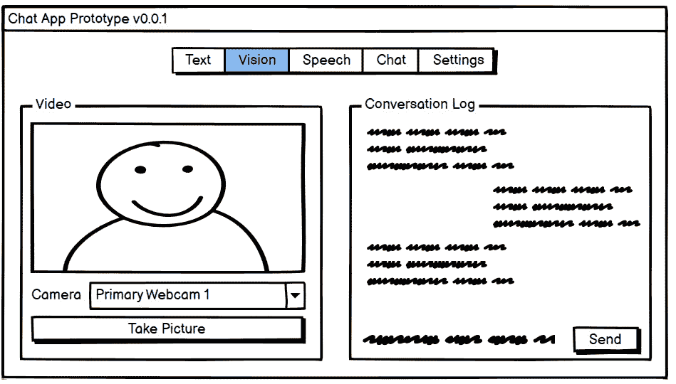
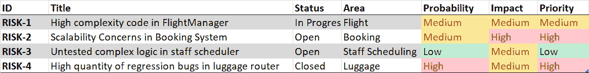
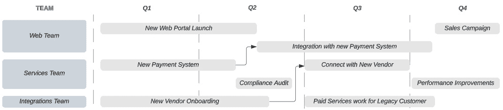
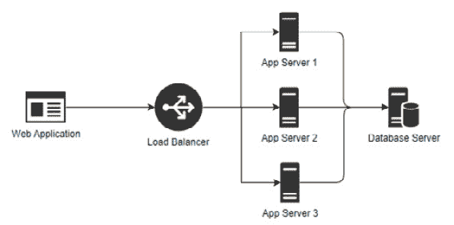
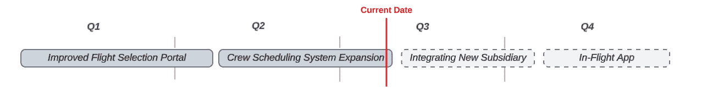
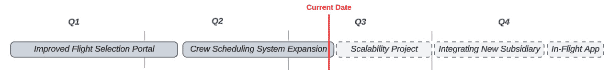

# 第十五章：沟通技术债务

大多数开发者都曾在无法偿还技术债务的环境中工作过，这不是因为任务的难度，而是因为组织优先级、恐惧、紧急截止日期以及对技术债务对其软件的全面影响的缺乏清晰理解。

在本章中，我们将探讨一些可能阻止你和你的团队解决技术债务的因素，并介绍一些帮助组织理解和重视重构过程的方法。

我们将涵盖以下主要主题：

+   克服重构的障碍

+   沟通技术债务

+   优先考虑技术债务

+   获得组织支持

# 克服重构的障碍

当我与技术社区的开发者交谈时，几乎每个人都有一段故事，讲述他们被告知不允许花时间重构他们的代码。

有时这项命令来自高层管理，有时来自产品管理或参与敏捷流程的人。然而，同样经常的是，指示来自工程领导，如团队领导或工程经理。

这种情况的原因可能因组织和你正在工作的项目而异，但一些常见的原因包括以下内容：

+   有一个紧急截止日期，团队必须专注于实现它

+   重构代码被认为不会提供任何商业价值

+   变更将涉及应用程序中技术债务很高的风险区域，存在引入错误的风险

+   开发者被告知“不要担心代码的质量；这只是一个原型，不会投入生产”（通常会的）

+   团队得到保证“不要担心代码的质量；我们将完全重写这个应用程序”（你通常不会）

让我们讨论一些这些反对意见。

## 紧急截止日期

“我们面临截止日期”的反对意见是许多团队非常常见的一个。有时，团队确实面临一个不能错过的关键截止日期。在这些时候，常常是“全员出动”，人们在高压环境下工作，通常还要加班。在这种情况下，花时间解决技术债务可能会对团队及其按时完成任务的机会造成干扰。

换句话说，*有时，这种反对意见是合理的，在特定和有限的时间内对业务是有意义的*。

然而，这些高度紧急的时间段会导致技术债务以非常高的速度积累，因为开发者没有时间以正确的方式做事。虽然团队可能在短时间内完成一些惊人的事情，但这些事情很少以能够经受时间考验的、可维护的代码的方式完成。

此外，许多组织从紧急截止日期到紧急截止日期，导致团队在无法偿还的情况下以惊人的速度积累技术债务。

有时候，截止日期无法改变或避免，例如财政年度结束、交易会或其他会议的截止日期。为了在特定日期之前完成关键的商业目标，短期内积累技术债务也可能具有战略上的好处。

然而，作为软件工程师或工程领导者，你有责任清晰、简洁、定期地向管理层沟通技术债务及其影响。一旦管理层充分理解了障碍，你必须与他们合作，制定长期补救措施和工作安排。

我们将在本章后面更详细地讨论这个补救过程。

## “不要触碰高风险代码”

当你想到某些代码部分过于脆弱，以至于不需要触碰时，这种反对意见是可笑的。毕竟，如果代码已经退化到连尝试改进都感到害怕的地步，那么重构的需求可能已经被推迟了一段时间。

虽然这段代码触碰起来很危险，但不重构它，当团队最终被迫对其进行更改时，可能会导致灾难性的后果。让我们来分析一下反对重构这段代码的论点。

在这种情况下，核心担忧通常是以下恐惧的组合：

+   触碰这段代码很可能会引入错误

+   我们不明白这段代码*应该如何*工作

+   没有任何测试能够捕捉到可能引入的缺陷

我发现，这种反对意见通常发生在关键人物离开团队，而没有人了解那些个人维护的复杂领域之后。相关的代码通常几乎没有文档，单元测试也非常少，如果有的话。

这些担忧并不意味着你不能成功改进或替换相关的代码。事实上，我们在本书*第二部分*中讨论的一些关于测试代码的策略，可以显著帮助解决这种反对意见背后的恐惧。

首先，在做出任何更改之前，你可以围绕你要更改的代码编写单元测试。我们曾在*第九章*中探讨的一些高级测试工具，如 Snapper 和 Scientist .NET，可以帮助你完成这项工作。

以分阶段推出或提供回滚选项的方式部署软件也可以帮助缓解一些担忧，正如我们在*第十七章**敏捷重构*中将要看到的，当我们讨论诸如功能标志和蓝绿部署等内容时。

## “这段代码即将被废弃，不要在上面浪费时间”

通常在软件项目的*开始*、原型阶段，或者在确定是否必须替换或退役整个应用程序的*结束*阶段，会提出特定的代码是临时的，你不必担心其质量的反对意见。

这通常发生在团队想要通过构建一个快速的“废弃”原型来测试一个概念，这个原型可以探索一个概念或证明一个行动方案是可行的。

不幸的是，许多“废弃”原型幸存下来，成为未来应用程序的基础，尽管它们是为了快速证明一个概念而构建的，并且有意设计成不必担心性能、安全或可靠性。

一个好的原型可以让人对项目如此兴奋，以至于以下情况可能发生：

+   他们忘记了他们处理的不“是真实”的软件，原型只是为了临时“废弃”。

+   他们认为原型中提供的功能已经完成。

+   项目有一个紧急的截止日期

虽然确实有合理的论点认为将废弃的原型提升为真实应用程序是管理不善的症状，但让我们谈谈开发团队成员可以做的关于这件事的有益事情。

首先，了解你的“废弃”原型有很大机会被视为可以工作的软件。一些团队使用粗略的样式或草图风格的用户界面，例如*图 15.1*，来帮助其他人记住应用程序只是一个原型：



图 15.1 – 一个用户界面线框图

第二，你可以将所有代码视为需要重构、测试和文档的生产代码，相应地降低原型设计速度，这在一定程度上违背了快速构建原型的想法。

第三，如果废弃的原型被提升为可操作的软件，首先的工作应该是根据需要重构原型，使其成为应用程序未来发展的基础。

## 生命终结的应用程序

另一个代码被视为非永久性的情况是，你正在开发的应用程序要么是其生命周期的结束，即将退役，或者人们决定当前的技术债务需要完全重写。

在真正是生命周期的结束，并且不会维护很长时间的应用程序的情况下，技术债务可能不是一个关键问题——假设应用程序实际上在不久的将来会下线。在这种情况下，团队应该大致知道应用程序何时会下线，并且这个日期应该定期确认。

小贴士

定期与管理层检查应用程序的停用状态非常重要。如果停用日期被推迟或完全退役应用程序的决定似乎不太确定，你可以改变你的立场，在重构工作中更加积极。

如果你有一个技术债务如此之高，以至于你认为没有重写就无法解决的应用程序，请务必小心。我见过许多团队认为他们的应用程序将被退役并由继任者取代，结果重写被推迟得越来越远，甚至完全取消。

如果你依赖重写来结束你的技术债务，我强烈建议你有一个重写开始和旧项目退役的估计日期。虽然软件估计可能具有挑战性（正如许多关于该主题的书籍所证明的那样），但没有一个可信的替代方案上线的时间表而不改进现有的代码库是不负责任的。

在过去 20 年里，作为一名软件工程师，我见证了数十个软件项目。在这段时间里，我只看到两个项目被完全重写。其中一个项目是由于技术必要性，因为其技术将在某个日期后不再起作用，另一个项目涉及一位主要工程师的非凡努力，他因维护旧版本的应用程序而感到沮丧。

如果你和你的团队假设不会发生完全重写，而是专注于逐步偿还技术债务，你们会更好。

我们将在*第十七章**，*《敏捷重构》*中更多地讨论逐步更新和替换应用程序的策略。

## “只做最基本的工作”

有时你会听到类似这样的话：“你为什么花这么多时间重构或测试？只需完成完成任务所需的工作。”

这些陈述可能由几个不同的原因引起：

+   项目进度落后

+   由于过去的延误而对开发团队缺乏信任

+   对重构重要性的缺乏理解

每当我遇到这种反对意见时，我会想起我之前听到的一个露营类比。

当你去露营时，人们期望你离开营地时，营地状况与你发现时一样好，甚至更好。在营地，你被期望不要随意丢弃垃圾，尽管这样做比花时间清理自己更快捷。这有时被称为**童子军规则**。

其次，如果你去露营发现你的营地很乱，花些时间清理营地而不是在垃圾堆上搭帐篷是完全合理的！

将这个类比应用到开发中，当你去进行变更时，你可能需要修改一些不符合当前标准的代码区域，或者需要测试或总体上需要清理的区域。对文件进行变更时包括修复其他无关的工作内容是合理的。

假设你正在对影响应用程序中多个地方的一小部分变更进行工作。你发现其中一个地方有相当多的技术债务，并且可能需要几天的时间来清理以满足当前标准。在这种情况下，适当的做法是在该区域实施小变更，并在下一次站立会议中讨论所需的额外重构。通常，团队会为这个更大的重构工作创建一个新的单独的工作项。

敏捷重构

我们将在本章后面更详细地讨论跟踪技术债务，以及敏捷环境中的重构*第十七章**，*敏捷重构*。

虽然清理代码很重要，但尽量保持你正在进行的清理工作与你要处理的工作项规模成比例。

## “重构不提供商业价值”

我遇到的最危险的反对重构的论点之一就是假设重构对开发团队之外没有任何价值。

也就是说，通常有一个隐含的假设，即只有当开发者添加功能或修复错误时，他们才为组织提供价值。在这种心态下，诸如单元测试、重构和文档等事情都是开发者所做的*浪费活动*，但它们并没有为组织提供有意义的价值。

这是一个危险的假设，因为管理者通常因最小化浪费和最大化对组织可能的价值而获得奖励。当重构和测试不被领导层重视时，组织就会用短期内的提升（如交付新功能）来换取技术债务的积累。这会导致长期后果，因为技术债务会迅速蔓延，开发速度放缓，并且几乎每次变更都会引入错误。

导致重构工作贬值的一个原因是新功能对管理层来说是可见的，并且通常是可以理解的，而技术债务是他们只听说但看不到的东西。

作为开发者或工程领导者，你可以做任何事情来帮助管理层理解技术债务的范围和影响，这将有助于解决这个异议。

在下一节中，我们将探讨帮助提高非开发者对技术债务可见性的方法。

# 沟通技术债务

向非开发者解释**技术债务**可能具有挑战性。即使管理层信任开发团队，经理们也难以理解工程师们处理的问题或技术债务如何减慢软件工程过程，并在应用程序更改时引入巨大的质量风险。

## 技术债务作为风险

在我的职业生涯中，我了解到虽然管理层难以理解技术债务，但他们对某些事情的理解要好得多：*风险*。

这可能听起来很奇怪，但我发现帮助管理层理解技术债务的最佳方式是以风险管理术语来呈现它。

您系统中的每个技术债务方面都有**概率**和**影响**。

技术债务的**概率**是指该部分技术债务在开发过程中或应用程序在生产环境中运行时影响开发团队的可能性。

**影响**是指如果它确实影响了开发者或部署的应用程序，技术债务会对事物造成多大的伤害。

例如，一个具有中等复杂性的关键区域中的代码，如果缺乏测试，可能产生问题的概率较低或中等，但如果这些问题出现，将产生关键影响。也就是说，代码目前没有造成问题，但我们认为它将来可能会以某种方式更改，从而引入我们由于系统复杂性而无法捕获的漏洞。如果这种情况发生，我们相信对最终用户的影响将是严重的。

当您可以用影响和概率来表示代码库中的每个风险时，这允许管理层开始理解当前技术债务所代表的风险水平。

## 创建风险登记册

这些风险条目应排列成电子表格或其他一系列跟踪项（如系统中的工作项），称为**风险登记册**。风险登记册成为管理者和开发领导者审查软件工程项目中当前风险的中心位置。

您的风险登记册可能从包括以下信息中受益：

+   **ID** – 风险的唯一标识符

+   `FlightManager` 的 `ScheduleFlight` 方法”

+   **状态** – 风险是否处于开放状态、正在修复过程中或已关闭

+   **概率** – 风险影响未来开发或系统用户的可能性

+   **影响** – 风险实现时的严重程度

+   **优先级** – 根据风险的概率和影响确定的风险优先级

Cloudy Skies Airlines 的一个示例风险登记册可能看起来如下：



图 15.2 – 一个示例风险登记册

你的登记册不必仅限于这些列。风险分配给的人员、风险所在的区域或组件以及解决它的估计工作量都是你可能想要考虑添加的字段，具体取决于你的需求。

当延迟或生产问题不可避免地发生时，你可以指向风险登记册中现有的风险。这应该有助于管理层理解风险已经转化为**问题**。

风险与问题

在风险管理术语中，风险是可能在问题发生时出现的事情，而问题则是已经通过实际发生而显现出来的风险。

这有助于抵制责怪参与变更的工程师的诱惑，并有助于将对话集中在现有技术债务中存在的风险上。

通过与管理层共同建立风险登记册，你可以让他们积极参与管理和技术债务的解决过程。这是一个持续的过程，包括定期的风险审查会议，团队必须积极维护登记册，以便在发现新的风险或对现有风险的可能影响或概率的看法发生变化时。

在这些风险审查会议中，小组应审查当前的风险登记册，并讨论自上个月以来发生的变化。

## 风险登记册的替代方案

我理解并非每个开发者、工程领导者甚至高级管理层成员都愿意使用正式的风险登记册。

如果你更喜欢一个更简单的流程，你可以通过尝试以下任何一项来获得相似的价值：

+   在 Word 文档中有一个简单的项目符号列表——可能按主要项目或区域组织

+   在工作项跟踪软件中创建一个新的*技术风险*类型的项目，例如**Jira**或**Azure DevOps**

+   定期向开发者和业务利益相关者发送包含“最想得到的 10 项技术债务”的简报

风险登记册的格式并不是过程最重要的部分。过程的重要部分是，你的团队在发现技术债务时积极列出，并定期与管理层审查，以让他们参与解决过程。

# 优先考虑技术债务

跟踪和沟通技术债务是偿还债务过程中的关键部分。然而，这只是过程中的一个步骤。

当相关代码被修改时，重构代码作为偿还技术债务的策略可能是可行的，但这种方法不适用于解决较大的技术债务或与软件整体设计相关的债务。

在*第十七章*“敏捷重构”中，我们将更详细地讨论如何在敏捷环境中管理这些较大的工作部分，但就目前而言，让我们看看你是如何确定哪些技术债务应该优先考虑的。

你应该优先处理最有可能发生并且一旦发生会造成最大伤害的项目。换句话说，如果你有一个高概率的风险，你应该优先考虑它。此外，你还应该优先处理那些影响大的技术债务。

## 使用风险评分计算风险优先级

我看到一些组织根据他们跟踪的每个技术风险的影響和概率创建了一个**风险评分**。这个风险评分是一个数学方程，其中技术债务发生的概率用 0 到 1 之间的数字表示，1 表示 100%肯定会发生，0 表示永远不会发生。

这导致了一个公式，你可以通过将技术债务的概率乘以其影响来计算其优先级。这个公式如下：

```cs
risk = impact * probability
```

例如，一个高概率、低影响的技术债务项目可能有一个 0.9 的概率评分和 3 的影响评分，从而得到 2.7 的风险评分。

单位和风险评分

2.7 是什么意思？嗯，除非你选择用小时或美元来表示影响，否则我们实际上并没有测量任何有形的东西，所以我把这个数字简单地称为“风险评分”，代表业务预期由于技术债务项目存在而产生的整体预期负面影响。这对于比较两个风险是很有用的。

让我们看看一个具有高影响、低概率的技术债务项目的不同场景，其概率评分为 0.15，影响评分为 21，从而得到 3.15 的风险评分。

在这里，组织通常会关注第二个项目，因为它的整体风险评分 3.15 高于第一个项目的 2.7 风险评分，这意味着它对组织的威胁更大。

对这种方法进行进一步的细化可能还会考虑解决一项技术债务所需估计的小时数，因此可以优先处理那些可以更快解决的项，而不是那些需要更长时间才能解决的等效项。

## “直觉”方法

用精确的数值来量化事物可能很困难，有时估计可能更像是一种愿望，而不是科学的预测。我确实认为对风险进行一些粗略的量化是有价值的，但通常，团队成员会对某些项目的规模相对于其他项目有更深的“直觉”。

我的立场是，数值指南可能会有所帮助，但你的大脑可以指出其他重要但难以衡量的事情。

小贴士

我的经验法则是你应该专注于修复让你最害怕的事情。如果你的代码中有一个区域让你夜不能寐，那么通常从那里开始是一个好主意。

这并不是说你应该停止所有新的开发直到技术债务得到解决（尽管在某些严重情况下这可能是必要的）。我的意思是，当你可以选择解决什么时，你应该选择你团队认为对组织成功构成最大威胁的领域。一旦你解决了最大的问题，继续解决下一个，然后是下一个，同时继续支持业务的需求。

# 获得组织支持

我们已经看到我们可以如何跟踪和优先处理技术债务，我们也看到让管理层参与跟踪技术风险的过程可以帮助建立信任和理解，但让我们谈谈那些开发领导必须向管理层“推销”重大重构工作的场景。

这些对话可能会很有压力，并且代表了软件项目中的一个关键转折点。在这些高风险的对话中，你的目标是简洁、尊重地传达以下内容：

+   团队面临的问题及其未解决的影响

+   提出的解决方案（或一系列供考虑的解决方案）

+   重构工作在开发者时间上的成本

+   重构工作的进度表

+   你希望管理层做什么

注意，你的目标在这里*不是*让他们同意你提出的建议。你的目标是让他们理解问题，并与你一起确定何时以及如何解决它。

当你的焦点是无论如何都要达成自己的目标时，这可能会导致信任的丧失，开发和管理层之间敌意的增长，以及开发者无法从商业需求的角度思考的感觉。

相反，如果你认为管理层合作伙伴有合法的见解和可以为组织增加价值，对话可以变得不同——这是一个工程和管理层为了业务长期和短期需求而共同努力的伙伴关系。

## 安排对话

在你甚至可以就问题进行对话之前，你需要能够有效地传达问题及其潜在解决方案的范围。

这需要一些考虑和规划。你不需要为这个项目制定详细的项目计划，但你确实需要思考项目的范围、需要改变的部分以及需要参与的人。

你还需要考虑你团队当前的项目以及你打算涉及的这些人目前正在做什么，或者即将做什么。

记住，为了你的组织能够对你的重构工作说“是”，他们需要在重构工作期间对其他事情说“不”。

一旦你对问题的范围及其解决方案有了足够的理解，你应该将其带给管理层。这可以是工程领导和管理层之间定期检查会议的一部分，或者作为单独的会议。

你如何处理会议邀请将取决于你要接触的人。

一些领导者可能愿意你到他们的办公室或直接给他们发消息，说些类似于“我对项目有一些担忧。你有没有 30 分钟的时间可以详细谈谈这个问题？”的话。

另一方面，其他领导者可能希望一提到话题就进行对话。因此，我建议你为对话做好准备，并找到一个他们日程上看起来空闲的时间。

## 预测问题和反对意见

当你向管理层展示你的担忧和选项时，你应该考虑到他们可能会提出的问题或反对意见。准备好深入探讨当前问题的技术细节以及你提出的解决方案。

管理层通常还希望了解项目的时间表细节。这不仅可以包括你预计重构工作需要多长时间，还可以包括*项目可以等待多长时间* *才开始*。

记住，大多数组织都计划在至少下一个季度进行一些主要项目。进行重构工作通常需要重新安排其他领域的当前和计划中的工作。例如，查看*图 15.3*，这是关于网络、服务和集成团队按季度划分的主要项目的样本分解：



图 15.3 – 按团队和季度分解的项目路线图

虽然集成团队可能希望在第二季度花时间解决一些技术债务，但这样做可能会风险服务团队计划中的与新的供应商连接的工作，并可能延迟集成团队自己计划在第三季度开始的服务工作。

对于你团队面临的问题的紧迫性要诚实。有时答案是它可以等待，但延迟的时间越长，团队面临的惩罚就越大。在其他时候，重构工作可能需要解决团队在当前系统中遇到的紧迫和已经紧迫的问题。

此外，还要考虑到你正在与之交谈的人的背景以及他们交谈的人。如果你正在和一个非常注重安全的人交谈，而你还没有考虑过你变更的安全影响，那么这次对话可能不会顺利。

你不需要对每个问题都有答案，说“我不知道；让我调查一下然后告诉你”是可以接受的。

核心问题是，项目进度的任何变动都是严肃的事情，如果你看起来没有花时间去思考最明显的问题，这不会在管理层中赢得信任。

## 不同的领导有不同的方法

我在管理层遇到了很多不同的人，令人惊讶的是，两位有技能的领导者之间可以有多么不同。

一些领导者非常注重分析，并且非常以数据为导向，他们喜欢仔细研究报告和电子表格。其他人则更注重人际关系，他们不是那么受原始数字的影响，而是受*具体故事*的影响，这些故事说明了某件事如何影响特定个人。

对于专注于整体数据的领导者，我通常会展示关键指标并突出有趣的发现。我经常提供所有相关数据供他们进一步分析，无论是主动提供还是应要求提供。

一个可能的指标可能是我们在过去 3 个冲刺中花了 15 个小时来处理这个问题，或者上季度的 15%的 bug 可以追溯到这个区域。

在分享具体故事方面，我通常会准备两三个例子来说明问题如何影响开发者、最终用户或其他相关利益相关者。这可能是“上一次冲刺，Priya 试图开发我们认为只需几个小时的新功能，但由于这种架构方式，实际上她花了 3 天时间”，或者“Garret 是一位非常称职的开发者，但他试图修改这个代码区域，结果由于代码缺乏可维护性，最终导致了这个关键的生产错误”。

一种对某个人有效的方法可能对另一个人影响甚微。因此，我发现，在就重大重构努力进行这些关键对话时，准备一些有趣的指标和一些相关的场景是最好的。

## 沟通的重要性

我希望你在本章中学到的一点是，虽然你想要解决技术债务，但你的目标是组织的短期和长期成功。

这意味着关于技术债务的任何对话都应该是双向对话，双方都能倾听对方并让自己的声音被听到。

有时，企业合法的短期需求是尽可能快地交付产品或与外部合作伙伴或机构达成截止日期。

作为一名工程领导者，你的目标是确保管理层理解技术债务所代表的影响、紧迫性和风险，以及小型和大型重构努力的重要性。然而，你的关注点通常集中在代码上，而管理层的关注点则集中在战略举措上，甚至仅仅是维持业务的运营和保持灯亮。这两个角色及其视角对于一个健康组织来说都至关重要。

最后，你真正追求的是工程和管理层之间开放而诚实的沟通，管理层能够欣赏技术债务的风险和影响，而工程团队能够理解组织面临的压力。

这份沟通从信任开始，尊重管理层在引导整个组织朝着目标前进、平衡相互竞争的优先事项和需求方面做出的贡献。

# 案例研究 – Cloudy Skies Airlines

在我们结束这一章之前，让我们看看我们从 Cloudy Skies Airlines 的案例研究中得出的结论。

主开发人员布莱恩一直在调查应用预订和支付处理部分日益增多的问题。

这些问题最初被认为是孤立的，但似乎在高峰使用时段发生，当时许多客户正在尝试预订航班或修改现有的航班预订。

经过调查，布莱恩和他的团队发现这些问题与系统的当前设计和架构有关。虽然系统可以处理旧的用户数量，但它由于当前的低效率，根本无法适当地扩展以处理高峰工作量。

通常，这样的系统可以扩展到有多个服务器并行运行，负载均衡器在它们之间分配流量（参见*图 15.4*）：



图 15.4 – 负载均衡器将请求分配到不同的应用服务器

然而，系统并未设计为在不进行大量重工作的情况下支持同时运行多个应用副本。

虽然团队能够对短期性能和稳定性进行一些改进以解决当前问题，但他们明白，随着业务的增长，这些问题将再次浮现——尤其是在高峰旅行季节。

经过仔细考虑，团队制定了一个计划，允许系统并行运行多个副本，但需要进行大量的重工作。

其中一位工程师还建议可能从服务器完成所有工作并向用户返回成功响应的模型，转变为快速验证请求并将其放入队列进行处理的模型。这种方法将处理传入请求的峰值，但需要改变当前请求处理的方式。

带着这些想法以及对当前问题范围和可能解决方案的知识，布莱恩安排了与首席技术官玛迪的会议。

在会议期间，布莱恩概述了性能问题、团队为恢复服务所采取的最近步骤，以及随着业务增长和旺季临近，它再次发生的可能性。

一旦布莱恩确信玛迪理解了问题的基本原理，他就概述了两种可能的补救计划，以及他个人建议坚持相对简单的更改，允许应用服务器并行支持多个副本。

玛迪就扩展性提出了几个技术问题，特别是关于为什么当前系统无法同时运行多个副本的原因。在布莱恩解释了可能导致这些问题之后，玛迪理解了推理和补救的需要，对话转向了安排会议。

团队接下来的重点是整合一家新收购的子公司航空公司到 Cloudy Skies 系统中，如图*15.5*所示：



图 15.5 – 显示按季度划分的主要项目和当前日期的计划进度表

在审查问题后，Maddie 和 Brian 都认为，在即将到来的高峰旅行季节，实施长期解决方案以解决可扩展性问题更为重要。

Maddie 将其他高管带入关于计划具体细节的讨论中，Brian 回答了他们的问题，同时团队开始规划所需的架构变更和应用程序如何根据需要扩展以处理额外的流量负载的技术细节。

经过短暂的延迟，项目得到了批准，Brian 团队的大多数成员被分配到这项工作中，理解到之前计划的工作将比原定计划晚开始，以便为新可扩展性项目腾出空间，如图*15.6*所示：



图 15.6 – 近期添加可扩展性项目的调整后的进度表

Brian 和 Maddie 继续检查工作的进展，并在高峰旅行时间到来之前解决了可扩展性问题。

同时，一些团队成员能够在新子公司集成到 Cloudy Skies 系统中取得进展。随着工程师完成对可扩展性问题的处理，他们转而投入到那个项目中，导致该项目最初计划交付日期只有轻微延迟。

最后，业务得到了一个更稳定和可扩展的系统，以及他们计划中的新子公司集成，此外，管理层和软件工程团队之间的沟通渠道也得到了改善。

# 摘要

在本章中，我们探讨了重构代码和偿还技术债务的常见反对意见以及一些原因和补救措施。

我们还讨论了向管理层传达技术债务的问题，特别是将技术债务视为对组织系统和生产力的风险的观点。我们还介绍了使用风险登记册来跟踪技术债务随时间变化并提高非开发者对技术债务可见性的想法。

我们以讨论优先处理技术债务、从管理层获得对更大重构项目的许可，以及在修复工作中建立管理层信任、沟通和伙伴关系的重要性结束会议。

在下一章中，我们将探讨代码标准在长期最小化技术债务的价值以及如何选择现有的标准或建立自己的标准。

# 问题

1.  你目前在争取时间优先处理技术债务方面遇到了哪些障碍？

1.  如果管理层理解了你正在处理的问题，他们如何在时间、资源或组织支持方面帮助你？

1.  你和你的团队可以采取哪些措施来建立与管理的协作关系？

1.  管理层对技术债务及其风险的理解程度如何？

1.  对于你来说，正式跟踪技术债务作为风险是否有意义？

# 进一步阅读

你可以在以下网址找到更多关于将技术债务视为风险、与工程领导层沟通以及一般风险管理的技术债务思考：

+   *将技术债务视为* *风险*：[`killalldefects.com/2019/12/24/technical-debt-as-risks/`](https://killalldefects.com/2019/12/24/technical-debt-as-risks/)

+   *逃离技术债务的黑洞*：[`www.atlassian.com/agile/software-development/technical-debt`](https://www.atlassian.com/agile/software-development/technical-debt)

+   *如何使用技术债务* *登记册*：[`blog.logrocket.com/product-management/how-to-use-technical-debt-register/`](https://blog.logrocket.com/product-management/how-to-use-technical-debt-register/)

+   *与技术债务沟通管理*：[`devops.com/communicating-with-management-about-technical-debt/`](https://devops.com/communicating-with-management-about-technical-debt/)
