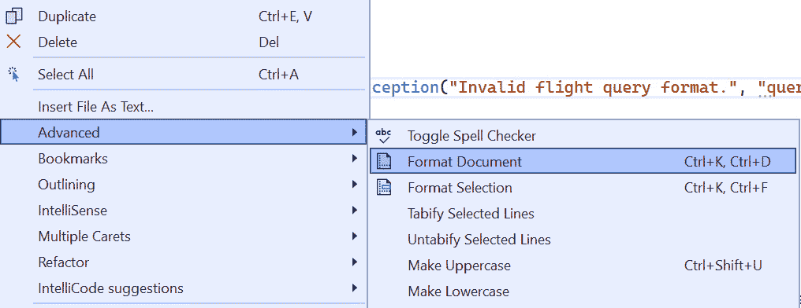
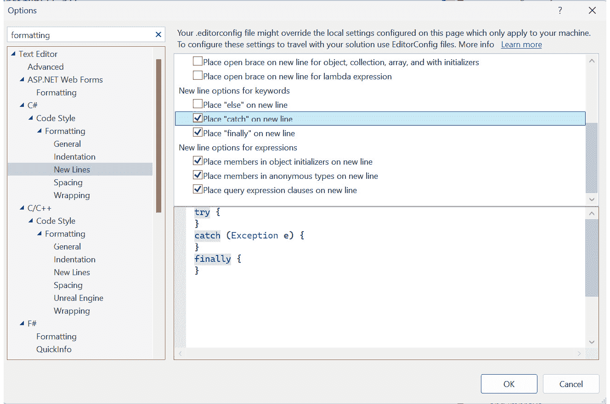
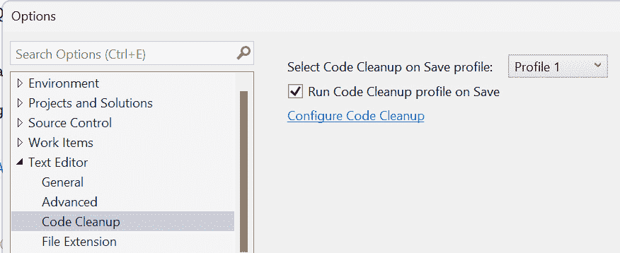
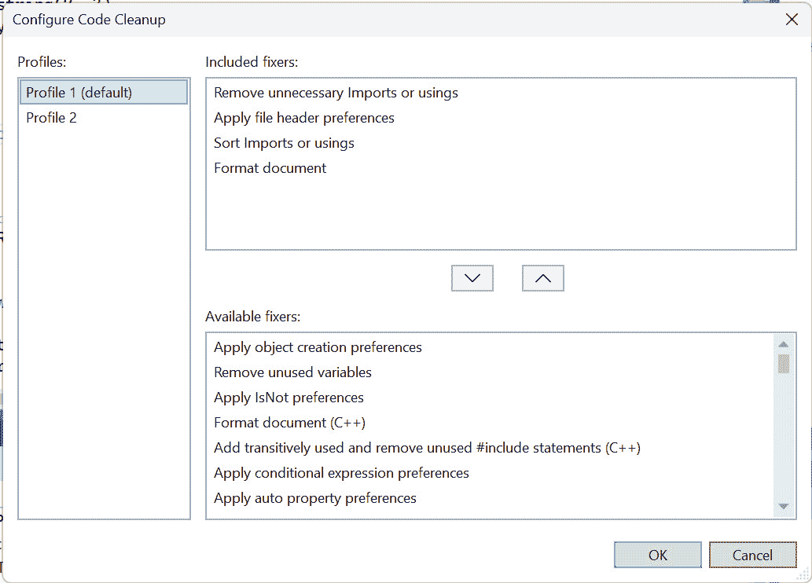
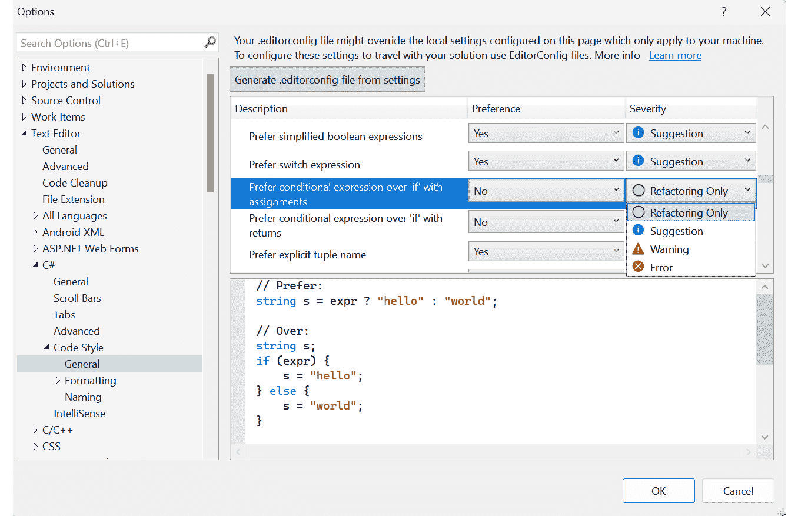
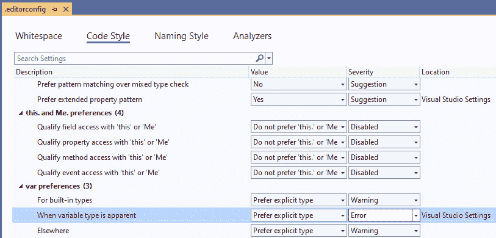
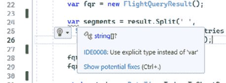
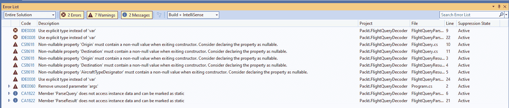

# 采用代码规范

在本章中，我们将讨论建立具有适当灵活性的清晰**代码规范**的重要性。我们还将介绍 Visual Studio 中的一些内置工具，这些工具将帮助您的团队采用一致的编码规范。这反过来又可以帮助您在代码审查期间专注于正确的事情。

本章涵盖了以下主题：

+   理解代码规范

+   建立代码规范

+   Visual Studio 中的格式化和代码清理

+   使用`EditorConfig`应用代码规范

# 技术要求

本章的起始代码可在 GitHub 上找到，地址为[`github.com/PacktPublishing/Refactoring-with-CSharp`](https://github.com/PacktPublishing/Refactoring-with-CSharp)，在`Chapter16/Ch16BeginningCode`文件夹中。

# 理解代码规范

在本章中，我们将探讨代码规范的概念。

代码规范是团队一致决定应用于团队创建的任何新代码的规范集。

这些标准在解决争议、关注真正重要的领域、减少团队自然积累的技术债务以及帮助偿还现有技术债务方面发挥着重要作用。

### 代码规范的重要性

作为一名开发者，我经历过的最令人沮丧的事情之一是，当我将经过深思熟虑的更改发送给另一位开发者进行审查时，我听到了以下这样的评论：

+   *我不喜欢你那种花括号格式*

+   *你的缩进不符合我的。我使用空格而不是制表符*

+   *我希望你能使用* `var` *而不是* *类型*

在这些情况下，相关的开发者忽略了更改的**实质**，而是专注于更改的**风格**——特别是当风格与他们的偏好不同时。

解决这个问题的方法是采用一套您和您的团队一致同意的代码规范。这些规范确立了团队对未来新代码的关注点。这些标准还可能包含团队风格和代码偏好的理由。

以下是一些可能包含的代码规范决策示例：

+   我们使用文件作用域的命名空间，因为它们导致较少的嵌套

+   单元测试类应该以它们测试的类命名

+   我们更喜欢在实例化对象时使用目标类型`new`

+   类定义应该清晰组织，并从字段开始，然后是构造函数、属性，最后是方法

这些规范不必过于僵化，以至于开发者没有做出任何决定，或者生活在不断违反它们的恐惧中。

您的代码规范应该足够具体，以解决主要的争议和困惑点。这有助于您以最大化向组织提供价值的方式创建和维护代码。

### 代码规范如何影响重构

当你和你的团队就一套明确的、达成共识的标准进行讨论时，它为重构打开了大门。

没有一套标准，当你谈论旧代码时，你可能会说“我非常不喜欢这一点”，或者“这不是我会写的样子”，或者“这看起来组织得很差”。

这些事情可能是真的，但它们并不是重构的强有力论据。

相反，当你可以说“这个类在这些方面违反了我们的代码标准”时，对话就会变得更加高效。这尤其在你能够确定一些标准是关键的同时，其他标准虽然重要但不太关键时。

我认为代码标准中的一些方面是至关重要的，值得深入修改以使代码符合新的标准。对我来说，这些领域通常围绕着对`IDisposable`资源的处理和采用适当的异常管理实践。

无论你和你的团队达成什么共识，这都是至关重要的。这些标准将影响你的优先级和你在维护代码时所做的决策。违反标准的问题可能会被分配给人们去修复，而无需其他理由去修改相关的代码。我们将在本书的最后一章中进一步讨论这一点。

### 将代码标准应用于现有代码

非关键标准用于指导开发者每天的工作。所有代码更改都应遵守这些代码标准。通常，这些标准鼓励开发者更新附近不符合标准的现有代码。

例如，你的团队可能有一个代码标准，即当你能帮助时不要使用`var`关键字（或者如果你喜欢，始终优先选择`var`）。团队的期望是，随着开发者编写新代码，新代码将遵守这一规则。

当标准被定义时，团队有时会期望你更改的代码附近的代码也会更新以符合标准。这尤其适用于同一方法中的代码。毕竟，你已经投入了努力测试你的新代码以验证所做的更改。这种测试工作可以帮助捕捉到重构其余方法时引入的问题。

随着时间的推移，这些代码标准将有助于降低团队积累技术债务的速度。对现有代码的持续改进也将有助于减少经常变更区域的技术债务。

# 建立代码标准

因此，既然我已经说服你代码标准如何减少团队冲突、聚焦代码审查和指导重构工作，那么让我们来谈谈这些标准从何而来以及我们如何在团队中采用它们。

### 集体代码标准

每个软件开发团队都已经有了代码标准。

我这么说是因为每个软件开发团队根据定义至少有一个开发者。每个开发者，无论他们是否意识到这一点，都有自己的内部化代码标准。

他们可能没有考虑过他们的偏好或无法列出它们，但如果你单独查看你团队中的每个开发者和他们编写的代码，将会发现其中存在一定程度的连贯性。

团队遇到的问题不是他们没有标准，而是他们有太多的标准。每个开发者都根据自己的内部标准和偏好进行操作，而团队现在必须聚集在一起，相互交流和互动各自独特的风格和偏好。

通常，团队会倾向于某些风格，因为开发者往往会模仿代码文件中现有的风格。随着时间的推移和团队的增长，通常会在某些选择上产生冲突。当这种情况发生时，你的团队将需要决定，没有定义任何集体标准的创造性自由是否值得由这些不同的偏好引起的摩擦和干扰。

最终，大多数团队会围绕那些真正对团队重要的事情正式化一套标准。让我们来谈谈应该把哪些内容列入清单。

### 选择什么重要

编程是一项创造性工作，所以我们不希望对开发者编写代码的方式施加过多的限制。另一方面，当规则太少时，可能会导致某些代码区域显得有些杂乱无章，这些区域适合某个开发者的偏好，但不适合更大的团队。

那么，一个开发团队如何确定其标准中应该包含什么内容呢？

我喜欢从确保团队安全的标准开始。这些涉及遵循既定的最佳实践，例如在 .NET 的 **框架设计指南**（见 *进一步阅读* 获取更多信息）中定义的。这些实践较少围绕个人意见。这使得它们具有高影响力，同时相对较少地涉及戏剧性。

接下来，看看你的团队在代码审查中遇到的主要难题。如果你厌倦了关于制表符与空格的讨论——无论是 `{` 是否应该单独占一行，还是 `var` 的使用——这些都是需要考虑添加到团队标准中的事项。

如果这些领域是分歧的主要来源，你有几个选择：

+   在争议领域选择立场并将其作为团队采用

+   将对这一主题没有官方立场作为你团队的官方立场

选择立场并将其作为团队采用可能会引起暂时的争论和伤害感情。从长远来看，采用立场通常会带来好处，因为你的团队可以以一致的风格运作。虽然开发者可能会觉得自己的地位或价值被低估，但大多数人随着时间的推移会自然地接受新的风格，尽管在某些情况下，当开发者对某个话题有强烈的感受或认为他们的意见没有被考虑时，这可能会导致人员流动。

你可能认为明确表示你的团队对代码的一个方面没有立场不会带来很大好处。然而，我见过这种方法对团队之间的对话产生了巨大影响。通过明确对主题没有政策，有争议的话题现在变成了可以迅速解决的问题。

而不是争论`var`是否应该出现在你的代码中，团队可以指出其标准，说明个人开发者可以在这个问题上做出自己的选择。这使你的团队超越了有争议的领域，转向更富有成效的话题。主要的缺点是整体代码的一致性会降低。

一致性的价值

遵循一致的风格和设计决策的代码感觉更加专业，使开发者更容易在之前未工作过的领域工作，并使开发者保持高效和专注于代码的功能而不是其形式。

确保在创建代码标准和确定这些标准中包含工程团队。这可以通过让整个团队参与或选择代表组织中工程师各种经验和偏好的子集来实现。此外，如果你有可能会对新的风格反应特别强烈的人，确保他们的担忧得到充分听取，并在可能的情况下让他们参与这个过程。

### 代码标准的来源

有时候，制定自己的标准可能过于困难或具有争议性，或者你可能发现自己在创建代码标准时不知道从何开始。

当这种情况发生时，我建议从一套既定的代码标准开始，并根据需要对其进行定制。

在*第十二章*中，我们介绍了内置的代码分析规则集以及如何逐步将你的规则集从最新规则集移动到最新最低规则集，然后是最新推荐规则集，最后是所有最新规则集。这些代码分析规则可以帮助强制执行最佳实践。

如果你希望事情更加正式，微软已经记录了 C#编码约定和框架设计指南，这些为你的团队提供了一个良好的起点。这两个文档在本章的*进一步阅读*部分有引用，并且是关于.NET 和 C#的宝贵、常青的智慧来源。

### 代码标准的演变

我提到“常青”，因为 C#不是一种停滞的语言。每年 11 月，微软都会发布新的 C#版本，其中包含基于前一年改进的新语言特性。这使得 C#语言在随时间演变的过程中感觉更加自然。

此外，我们编程的上下文随着时间的推移而变化。当 .NET 首次推出时，它本质上是为主要进行 Windows 桌面开发的开发者提供生产力提升的工具。从那时起，我们看到了 .NET 变得开源和跨平台。同时，许多组织已经从本地数据中心迁移，因为基于 Azure 和 AWS 等平台的云计算已经成为常态。

在 C# 的原始时代被认为是最佳实践的事情，随着新语言特性的出现和 .NET 平台的增长而逐渐失去了人气。

我从 .NET 的开始就一直在使用它，并在我的编码风格中感受到了这一点。在这本书中，我讨论了 `var`，因为它是一个容易讨论的语言特性，但它也是一个很好的例子，说明了 C# 随着时间的推移是如何变化的。

在 `var` 之前，您会这样声明一个 `Guid` 键和 `int` 值的字典：

```cs
Dictionary<Guid, int> data = new Dictionary<Guid, int>();
```

当 `var` 被引入时，标准转向使用 `var` 来简化您的声明，因为类型是明显的：

```cs
var data = new Dictionary<Guid, int>();
```

这导致了更少的重复语法并提高了开发者的生产力，同时仍然保持了类型明显。

随着最近添加的目标类型 `new`，我的偏好变成了如下使用：

```cs
Dictionary<Guid, int> data = new();
```

我在这里分享我自己的个人标准之路，因为它是一个缩影，展示了工程团队将会经历的过程。

您将适应标准，然后 C# 将随着时间的推移而变化，您将调整标准以保持同步。您现在可能认为的“最佳实践”可能在实施几个月后可能并不适用。面对团队面临的障碍发生变化也是自然的。当这种情况发生时，这迫使您和您的团队采用新的策略来克服这些障碍。

随着时间的推移改变您的标准是正常的。这是语言不断发展和我们日常编程工作上下文不断变化的标志。

### 将标准整合到您的流程中

代码标准会影响软件开发中的几个不同地方，从您如何构建新功能到维护代码的方式。

您的代码标准应该清晰地记录并存储在中央位置，例如团队维基或共享文档。这些标准应该传达给新加入团队的开发者，以帮助他们熟悉团队对代码标准的期望。

在讨论了代码变更实质的所有其他问题之后，代码标准也应该在代码审查过程中得到加强。这些问题应该在代码获得批准和工作项完成之前得到解决，但不应以惩罚的方式进行。

重要的是要理解，对于团队中的新开发者来说，内化代码标准需要一些时间。在您的开发者开始以团队标准为标准思考之前，通常需要几个月的时间。

有助于这一点的做法是将工具集成到流程中，使您的团队能够在代码提交同行评审之前轻松验证其代码是否符合标准。代码分析规则和 Roslyn 分析器可以帮助做到这一点，但 Visual Studio 还提供了一些额外的工具，可以在代码达到人工评审之前帮助标准化代码：代码格式化和`.``editorconfig`文件。

# Visual Studio 中的格式化和代码清理

结果表明，Visual Studio 可以通过内置功能自动排列甚至以一致的方式清理您的代码。

### 格式化文档

实现这一点的最简单方法之一是使用**格式文档**功能，可以通过按*Ctrl* + *K*然后*Ctrl* + *D*，或者通过打开**编辑**菜单，然后转到**高级**并选择**格式文档**，如图*图 16.1*所示。1*：



图 16.1 – 格式化活动编辑器文档

这将更改您当前文件中的代码，以匹配您在 Visual Studio 中配置的首选项。

这些设置可以通过打开**工具**菜单然后选择**选项…**进行配置。从那里，展开**文本编辑器**、**C#**、**代码样式**和**格式化**节点，直到您看到关于缩进、新行、间距和换行的各种首选项。

这些设置选项卡允许您配置 Visual Studio 的格式化首选项并预览格式选择，如图*图 16.2*所示。2*：



图 16.2 – 更改 Visual Studio 格式化捕获语句的方式

一旦您自定义了设置，这些设置将在您使用**格式** **文档**功能时使用。

许多开发者早期就学会了使用*Ctrl* + *K*和*Ctrl* + *D*快捷键来格式化文档，并习惯性地使用它们，但实际上您可以让 Visual Studio 自动应用代码清理。

### 自动格式化文档

Visual Studio 有一个**代码清理**功能，允许您在文件保存时手动或自动格式化代码。

这是通过`using`语句完成的，将您类中的成员按更一致的方式排序，并将您的代码格式首选项应用到文件中。

要配置代码清理配置文件，请再次转到**选项**对话框，这次在**文本编辑器**节点中找到**代码清理**，如图*图 16.3*所示。3*：



图 16.3 – 保存文件时启用代码清理

从这里，您可以选择**在保存时运行代码清理配置文件**，以自动应用您的清理配置文件。

我还建议您点击**配置代码清理**来查看您的清理配置文件。

这显示了每个配置文件中将应用哪些修复程序，如图*图 16.4*所示，并允许您配置代码清理操作中包含和不包含的内容：



图 16.4 – 配置代码清理配置文件

在保存时自动清理代码可能会有所帮助，但它也有一些缺点。如果您的代码一段时间内没有清理，您的清理操作可能会在文件中创建许多更改。当多个作者试图修改同一文件或查看更改时，这可能会在 git 中造成混淆。

### 配置代码样式设置

信不信由你，当我们之前介绍了 C#的新行和缩进设置时，这并不是 Visual Studio 能做的极限。

Visual Studio 提供了一个**代码样式**设置部分，允许您配置围绕 C#中找到的大多数语言功能的个人偏好。

这些设置可以在**选项**对话框的**文本编辑器**、**C#**、**代码样式**和**常规**下找到，如图*图 16.5*所示：



图 16.5 – 在 Visual Studio 中配置代码样式规则

在这个用户界面中，您可以配置您关心的规则，每个规则上的偏好，以及您对每个规则的关心程度。注意**从设置生成.editorconfig 文件**按钮，我们稍后会详细讨论。

对于每条规则，您可以选择规则是否仅作为重构选项出现，Visual Studio 是否通过标识符上的绿色下划线微妙地建议该规则，或者 Visual Studio 是否应该更加激进，例如使用编译器警告或编译器错误来处理违反标准的行为。

有很多这样的设置，但它们允许您微调您对 C#功能的首选以及您希望它们如何格式化的个人偏好。

然而，这些是您**个人**的设置，它们将应用于您在自己的机器上工作的代码。在下一节中，我们将讨论如何使这些设置适用于您的整个团队。

# 使用 EditorConfig 应用代码标准

让我们看看您如何将选项对话框中找到的相同的代码样式设置通过一个`.editorconfig`文件附加到一个项目上。

包含应用于您项目中的样式和语言使用规则的`.editorconfig`文件。任何违反您的`EditorConfig`规则的行为都将导致 Visual Studio 编辑器中的编译器警告和建议。

Visual Studio 之外的 EditorConfig 文件

在撰写本文时，`.editorconfig`文件在 Visual Studio 和 JetBrains Rider 中原生支持。在 VS Code 中，只要您安装了 C#开发工具包和 EditorConfig for VS Code 扩展，EditorConfig 文件就受到支持。有关在 VS Code 和 JetBrains Rider 中启用这些功能的说明，请参阅*进一步阅读*部分。

`EditorConfig` 文件的关键好处是，它允许所有参与项目开发的人员使用一致的一组格式和样式首选项进行工作。

## 检查我们的起始代码

我们将要格式化的代码位于我们的 *第十六章* 解决方案中，该方案包含一个 `FlightQueryDecoder` 控制台应用程序和一个相关的 `xUnit` 测试项目。这段代码在本章中是最小的，并且围绕 `FlightQueryParser` 类展开。

让我们从 `FlightQueryParser` 的前半部分开始，它将航班搜索字符串，例如 `AD08FEBDENLHR`，解析为 `FlightQuery` 对象：

```cs
namespace Packt.FlightQueryDecoder;
public class FlightQueryParser
{
  public FlightQuery ParseQuery(string query) {
    if (query.StartsWith("AD") && query.Length == 13)
    {
      var flightQuery = new FlightQuery {
        Date = DateTime.Parse(query.Substring(2, 5)),
        Origin = query.Substring(7, 3),
        Destination = query.Substring(10, 3)
      };
      return flightQuery;
    }
    else {
      throw new ArgumentException("Invalid query format");
    }
  }
```

实际逻辑不是重点。我想向你强调的是代码在块内格式化的不一致性。

让我们看看文件的一半，它将一个航班搜索结果字符串，例如 `DEN LHR 05:50P 09:40A E0/789 8:50`，转换为 `FlightQueryResult`：

```cs
  public FlightQueryResult ParseResult(string result)
  {
    var fqr = new FlightQueryResult();
    var segments = result.Split(' ',
      StringSplitOptions.RemoveEmptyEntries
      | StringSplitOptions.TrimEntries);
    fqr.Origin = segments[0];
    fqr.Destination = segments[1];
    string today = DateTime.Today.ToShortDateString();
    fqr.DepartureTime = DateTime.Parse(
      today + " "+segments[2] + 'M');
    string seg3 = segments[3];
    fqr.ArrivalTime = DateTime.Parse($"{today} {seg3}M");
    fqr.AircraftTypeDesignator = segments[4];
    fqr.FlightDuration = TimeSpan.Parse(segments[5]);
    return fqr;
  }
}
```

虽然这段代码故意写得不好，格式也不一致，以作为示例，但我相信你在现实世界中已经看到过很多同样格式不一致的大文件。

现在我们已经介绍了这段代码及其不同的样式选择，让我们将 `.editorconfig` 文件添加到项目中，看看它如何有助于强制执行样式。

## 添加 EditorConfig

要添加 `.editorconfig` 文件，请右键单击 `Packt.FlightQueryDecoder` 项目，然后选择 **添加**，然后选择 **新建 EditorConfig** 或 **新建 EditorConfig (IntelliCode)**。

什么是 EditorConfig (IntelliCode)？

默认选项的 `.editorconfig` 文件与 IntelliCode 选项有所不同，后者分析你的项目，并从你在当前代码中观察到的约定生成 `.editorconfig` 文件。两者都是为你的项目创建起点的好选择。

根据你选择的选项，你可能需要选择 `.editorconfig` 文件应该位于哪个文件夹中。如果你被提示，请选择 `Packt.FlightQueryDecoder` 文件夹的默认选项。

一旦完成，你应该会在 **解决方案资源管理器** 中看到一个新的 `.editorconfig` 文件。

在我们继续使用这个 `.editorconfig` 文件之前，值得指出的是，基于你当前的代码样式选择创建的 `.editorconfig` 文件。这允许你自定义你的样式，然后从这些选择中创建一个 `.editorconfig` 文件。

现在我们有了 `.editorconfig` 文件，让我们来自定义它。

## 自定义 EditorConfigs

双击 `.editorconfig` 文件以打开其属性视图。

你将看到一个带有标签的编辑器，允许你自定义与空白、代码样式、命名样式和 Roslyn 分析器相关的各种属性。

这里有许多选项，所以我们将专注于其中几个非常具体的选项。

前往 **代码样式** 选项卡，然后向下滚动到底部，找到 **var** **首选项** 组。

从这里，你可以声明你团队的偏好以及违反这些偏好的严重性。例如，如果你的团队想避免使用 `var`，你可以将所有三个 `var` 规则设置为**首选显式类型**，并将严重性提高到**警告**或**错误**，如图 *图 16**.6* 所示：



图 16.6 – 定制项目中的 var 偏好

保存此文件并返回到 `FlightQueryParser.cs`，你应该现在会在你的编辑器中看到违反这些规则的警告和错误，如图 *图 16**.7* 所示：



图 16.7 – 基于代码样式规则对使用 var 的 Visual Studio 警告

这些规则违规不会导致你的代码无法编译，但它们会出现在 **错误列表** 视图中，如图 *图 16**.8* 所示：



图 16.8 – 出现在错误列表中的代码违规

由于 `.editorconfig` 文件在提交代码时被添加到源控制中，你的团队中的其他开发者将拉取该文件并看到与你机器上完全相同的样式首选项和警告。

这使得代码标准在开发过程中变得明显，并减少了重要代码更改的同行评审陷入关于开括号的适当位置或使用 `var` 的讨论的可能性。

# 摘要

代码标准对于帮助你的团队专注于生产性事物并确保源代码可以被团队中的所有开发者轻松维护非常重要。

虽然代码标准不需要包括一切，但将关于常见争议事项或团队希望确保每个更改都遵循的最佳实践进行编码化可能是有帮助的。

Visual Studio 提供了许多功能，可以帮助确保代码库的一致性和高质量，包括代码格式化、代码清理配置文件、保存时格式化、代码分析警告配置文件、编辑器级别的代码样式以及 EditorConfigs 来配置编辑器内的代码样式。

在本书的最后一章中，我们将讨论作为更大组织的一部分以及作为敏捷软件开发团队的一部分进行代码重构。

# 问题

1.  你如何确定你的团队应该采用哪些代码标准？

1.  你有哪些方法可以处理关于样式规则的争议？

1.  有哪些选项可以配置 Visual Studio 代码的格式化方式？

1.  **新 EditorConfig (IntelliCode)** 选项做什么？

# 进一步阅读

你可以在以下网址找到关于本章材料的更多信息：

+   *框架设计* **指南**：[`learn.microsoft.com/en-us/dotnet/standard/design-guidelines/`](https://learn.microsoft.com/en-us/dotnet/standard/design-guidelines/)

+   *.NET 编码风格* 指南: [`learn.microsoft.com/en-us/dotnet/csharp/fundamentals/coding-style/coding-conventions`](https://learn.microsoft.com/en-us/dotnet/csharp/fundamentals/coding-style/coding-conventions)

+   *使用 EditorConfig 创建可移植的、自定义的编辑器设置*: [`learn.microsoft.com/en-us/visualstudio/ide/create-portable-custom-editor-options`](https://learn.microsoft.com/en-us/visualstudio/ide/create-portable-custom-editor-options)

+   *适合初学者的 EditorConfig* 设置: [`newdevsguide.com/2022/11/22/beginner-friendly-csharp/`](https://newdevsguide.com/2022/11/22/beginner-friendly-csharp/)

+   *在 VS Code 中使用 C# 开发套件支持 EditorConfig*: [`code.visualstudio.com/docs/csharp/formatting-linting#_how-to-support-editorconfig-with-c-dev-kit`](https://code.visualstudio.com/docs/csharp/formatting-linting#_how-to-support-editorconfig-with-c-dev-kit)

+   *在 JetBrains Rider 中使用 EditorConfig*: [`www.jetbrains.com/help/rider/Using_EditorConfig.html`](https://www.jetbrains.com/help/rider/Using_EditorConfig.html)
