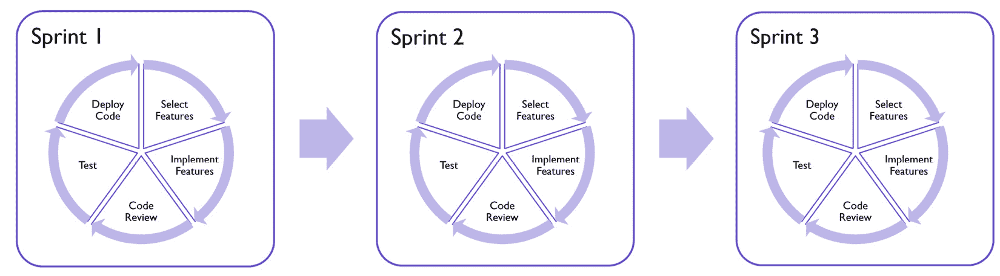
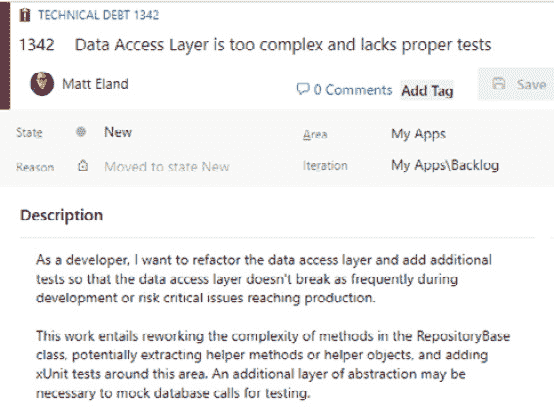
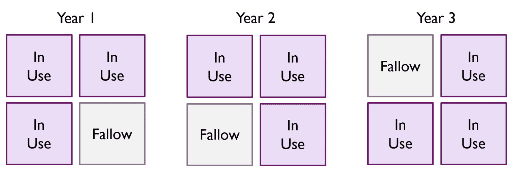
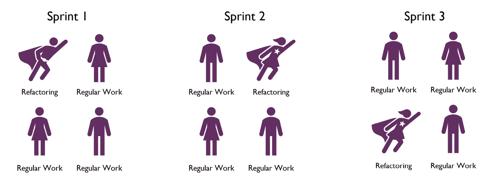
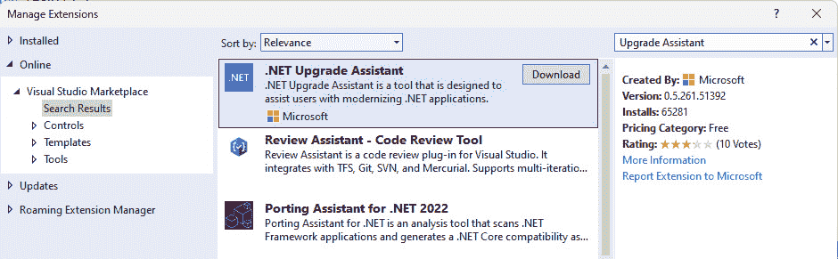
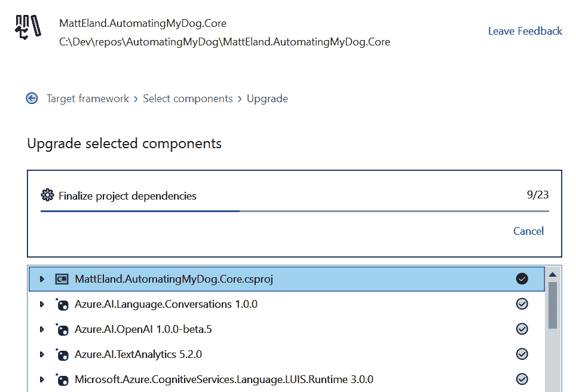
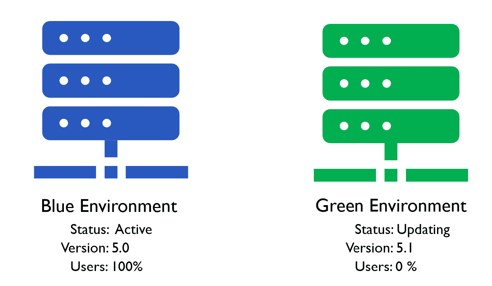
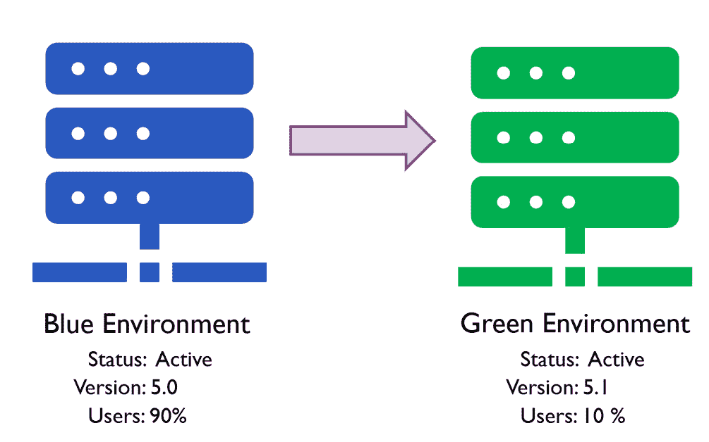
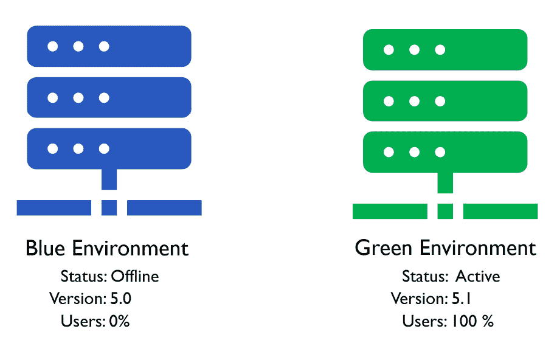

# 敏捷重构

在本章的最后部分，我们将讨论重构作为敏捷团队的一部分，成功进行大规模的重构工作，在事情出错时进行恢复，并纳入部署策略以确保它们不会再次出错。

虽然可以通过处理小块有问题的代码赢得许多小的重构战役，但如果你无法解决大规模的设计问题，你可能会输掉整体的“战争”。本章探讨了如何从冲刺到冲刺，继续与你的代码进行小的重构战役并取得胜利。我们还将涵盖确保你的应用程序具有正确设计的大规模战略战役——并在它不正确时将其纠正为更好的设计。

本章涵盖了以下主题：

+   敏捷环境中的重构

+   通过敏捷重构策略取得成功

+   完成大规模重构

+   重构出错时的恢复

+   部署大规模重构

# 敏捷环境中的重构

几乎我合作的所有开发团队都使用某种形式的**敏捷软件开发**来管理以短期冲刺形式进行的工作，包括任何重构工作。

在本节中，我们将介绍敏捷工作流程的基本知识以及重构如何适应这种环境。这很重要，因为如果重构工作无法适应敏捷工作流程，那么重构就不会发生。

## 敏捷团队的关键要素

敏捷软件开发在**敏捷软件开发宣言**（通常称为**敏捷宣言**）中正式编纂，并源于以下核心偏好：

+   **个人和交互** 胜过流程和工具

+   **工作软件** 胜过详尽的文档

+   **客户协作** 胜过合同谈判

+   **响应变化** 胜过遵循计划

遵循这些指导原则，敏捷的确切“风味”因团队而异，但大多数团队采用以下关键组件：

+   **冲刺**：在固定时间段的冲刺期间进行工作。这些冲刺的时间从 1 到 4 周不等，但通常为 2 周。

+   **用户故事**：工作以工作项或用户故事的形式跟踪。许多团队要求任何代码更改至少与一个工作项相关联。

+   **待办事项**：每个冲刺的工作来自团队之前审查和细化的优先级待办事项中的用户故事。

具体的细节、角色和名称可能因组织而异，但这些真理通常适用。

这个过程创建了一个迭代和循环的过程，其中团队在一个冲刺中处理业务认为最重要的工作项，同时优先考虑和细化下一个冲刺的项目，如图 *图 17.1* 所示：

图 17.1 – 敏捷软件开发周期

敏捷开发目前是我们发现的最佳企业级软件开发方法论，但它确实在重构方面带来了一些独特的挑战。请参阅本章末尾的*进一步阅读*部分，以获取有关敏捷的更多资源。

## 理解重构的障碍

敏捷开发有利于团队专注于对业务重要的事项，并处理优先级较高的待办事项列表。不幸的是，敏捷可能不是主动重构工作的最佳开发模式。

大多数组织要求所有代码更改至少与一个用户故事相关联，并且当开发者有额外容量时，预期他们正在处理用户故事。

这让工程师陷入了两难境地，他们知道需要重构的代码区域，并且拥有重构它们的技术技能和知识，但在他们团队的边界内，主动改进代码是不被接受的。

这会导致技术债务累积，并最终通过减缓工作项来降低团队的速度。这也导致引入了更多的错误，因为团队没有被允许积极管理其遗留代码中固有的风险。

这并不是说敏捷不好。敏捷是我们迄今为止发现的最佳软件工程团队管理工作流程；然而，它有一些限制，必须解决这些问题，以帮助组织实现短期和长期的成功。

# 成功实施敏捷重构策略

在敏捷环境中，持续的重构很重要，所以让我们谈谈确保代码定期重构的一些方法。

## 专门的工作项用于重构努力

记住，你和你的团队编写的每一行代码都应该带来商业价值，包括你的重构努力。

重构专注于通过解决已知的技术风险和改善团队在未来相关领域工作中实现的速度来为业务带来价值。

考虑到这些事实，将重构努力表示为冲刺中的用户故事是有意义的。就像一个开发者可能会得到一个关于与合作伙伴的新外部系统集成的故事一样，另一个开发者可能会得到一个重构和围绕数据访问层建立额外测试的故事。

在*第十五章*中，我们讨论了在风险登记册中跟踪技术债务。在那个章节中，我没有明确指出，但你可以使用跟踪你的用户故事的相同系统来跟踪你的已知技术风险，作为一种特殊类型的用户故事，如图*17.2*所示：

图 17.2 – Azure DevOps 中的技术债务项

这些技术债务用户故事应该看起来就像普通用户故事，并且具有相同的打磨和精炼程度。然而，这些用户故事应该有不同的类型或属性，具有不同的值，以便您可以在您的待办事项和冲刺中识别技术债务项。

此外，编写这些技术债务项的责任应该由团队的开发者承担，而不是产品负责人，尽管团队仍然需要向产品负责人解释这个项目是什么，修复它所需的粗略工作量，以及这个变化试图解决的风险。

健康的敏捷团队应该采取短期和长期项目的混合，技术债务项目通常属于长期项目。

可能会有时候你只能做短期工作，也可能会有时候你与一个不理解你技术债务风险的产品负责人合作。*第十五章*中的建议可能有助于解决这个问题，但有时可能没有简单的答案。

在这些时候，你可能需要转向重构任何变化代码的策略。

## 随着代码变化重构代码

在我的职业生涯中，我处理的大部分技术债务都来自于有意识地决定重构我接触到的任何代码。

这种重构变化代码的方法有几个关键优势：

+   它确保最频繁更改的区域得到重构。

+   由于我正在那个区域工作，我知道我将测试相关的代码。这意味着这些测试工作将有助于捕捉到作为重构一部分可能解决的问题。

+   这不需要为小型、琐碎的重构工作创建单独的用户故事。

在我的经验中，将清理和测试你接触到的区域的代码作为你的政策，随着时间的推移将导致代码库变得更加干净。

这种方法有其局限性：当你在一个代码区域进行微小更改且代码需要严肃的重构努力时，通常是不负责任地将你的工作范围扩展到一定程度之外。

此外，一些重构工作无法在单个冲刺的背景下完成，需要更多的战略思考和规划。

## 重构冲刺

我曾经一两次遇到过一种**重构冲刺**的概念。重构冲刺遵循农业中轮作的心态。

我不是农民，但我对轮作的理解是，你可以使用一个田地几个季节，但时间久了，那个田地开始失去土壤中的养分价值，随着时间的推移变得不那么肥沃。

为了应对这种情况，农民学会了让这些田地休耕，并在一段时间内不种植任何作物，如图*图 17.3*所示：

图 17.3 – 多年轮作作物

在敏捷开发中，你可能会花几个冲刺的时间处理正常的工作项，但在几个冲刺之后，你引入一个重构冲刺，团队的努力将集中在最关心代码区域的重构上。

在重构冲刺中，开发团队能够承担比标准冲刺中可能尝试的更大规模的工作。

这也有助于重新激发开发者的活力，并为他们准备围绕关键长期业务目标的下一系列冲刺。

在实际操作中，我不确定这些冲刺是否能够定期有效地工作，但我看到在特殊情况下，团队从这些冲刺中获得了巨大的益处。这些重构冲刺可以用来解决更大的问题，或者在完成一项重大举措后作为团队充电的方式。我也看到这些冲刺被用作在假日季节保持团队参与度的手段。

## 重构休假

我合作过的多数团队都无法承担所有开发者主要专注于重构工作，即使只是一个冲刺。

这样的团队可能希望将重构冲刺的想法缩小规模，使其仅适用于单个团队成员。

我把这个概念称为**重构休假**，其中开发者实际上在短时间内从团队中分离出来，专注于重构项目，然后在下一个冲刺中重新加入更大的团队。

在未来的冲刺中，另一位开发者有机会花一个冲刺的时间来处理重构工作，而其他人则处理传统的工作项，如图 17.4 所示：

图 17.4 – 在几个冲刺中轮换的开发者休假

在这个模型下，开发者想要承担的重构工作应该事先获得批准，并由团队中的其他开发者进行审查和测试。

在“休假”期间的开发者仍然应该能够回答问题并处理紧急事项。唯一的主要变化是他们在一个冲刺中的工作将自我导向，以实现已知的重构目标。

这与重构冲刺的一些相同的士气提升效果相似，但规模较小。这也帮助团队避免过度依赖团队中的任何一个人，因为人们经常轮流进入和退出休假。

虽然这个模型在小规模和中等规模的重构中可能取得成功，但在大规模重构中效果较差。我们将在下一节讨论成功进行大规模重构的方法。

# 完成大规模重构

根据我的经验，成功执行大规模重构是软件工程中最具挑战性的任务之一。

我将大规模重构定义为替换应用程序或应用程序的主要架构层。将应用程序从一个数据库技术迁移到另一个，用 gRPC API 替换 REST API，从 Web 表单升级到 Blazor，或替换整个服务层都是这种类型的例子。

## 为什么大规模重构如此困难

这些项目具有挑战性，因为它们通常需要比单个冲刺更长的时间才能完成，并且必须与多年来开发的软件保持功能对等。

此外，软件工程项目因其难以准确估计而臭名昭著，这也是开发者更喜欢敏捷软件开发而不是更传统的项目管理方法（如**瀑布**）的原因之一。软件开发项目的延误可能难以预测，并以意外技术障碍的形式出现，例如其他组件或平台之前未知的限制或缓慢开发进程中的微妙错误。

由于这些因素，大规模重构比中等重构更难实现。

一旦完成，这些努力的成果在转移到生产环境时可能会令人畏惧，因为它们代表了如此大的变化。在本章的后面部分，我们将讨论几种降低这种风险的方法，但决定替换或升级应用程序的主要部分并不是没有质量风险的。

当团队选择完全重写或替换软件项目而不是重构它们时，这个问题变得更加明显。

## 重写陷阱

重写将大型重构努力的全部问题放大了至少 10 倍。

在这种情况下，你正在替换一个已经使用了一段时间的应用程序，通常拥有大量的活跃用户和既定功能。

在保持生产中的错误和其他必须发生以保持业务顺利运行的短期工作的同时，重新实现多年的功能可能是一场斗争。

当一个团队正在积极地进行重写时，他们通常认为对当前正在替换的系统进行有针对性的重构价值很小。这意味着如果重写被取消或搁置，团队将无法从他们的投资中获得任何价值，并且仍然需要支持一个遗留系统。

由于软件项目难以估计和管理，重写通常比预期的要花费更长的时间。在这段时间里，你的工程师主要在从事重写工作，这从其他倡议中夺取了资源。

记住，重写通常在它活跃在生产环境并且人们实际使用它之前不会给业务或用户带来任何内在价值。这就是为什么如此少的重写项目能够成功。

你可以通过提供部分重写的早期预览来解决这个问题，但这并不总是可能的，如果重写中还没有重要功能，这可能不是最佳的用户体验。

## 提修斯之船的教训

有一个关于希腊英雄提修斯的思想实验与重构软件相关。

在这个思想实验中，我们的英雄提修斯的**提修斯之船**，提修斯本人，通过海上长途航行开始了漫长的旅程。在整个漫长的航行中，船员逐渐用备用材料以及他们在航行中制作或找到的材料替换了船上的部分部件。这种情况持续了一段时间，直到他回家时，他的船上没有一块原始船的部件。

这个思想实验提出了一个问题：回家的船是否还是同一艘，如果不是，它是在什么时候停止成为那艘船的？

虽然这些问题很有趣，但这个概念与软件工程相关。

使用重构，我们可以在技术债务在各个领域占据主导地位时，替换我们虚拟“船”的“板”。随着我们逐渐重构最需要重构的组件，我们不断演进我们的软件，以保持其随时间的相关性。

这就是为什么我认为在编写代码时重构代码是软件工程中一个至关重要的实践。技术债务是软件的一个不可避免的现实，你必须每次更改时都牢记在心，通过尽可能防止其占据主导地位，并通过重构偿还现有债务区域。

注意

渐进式重构只能走这么远。渐进式重构可能有助于保持你的虚拟“船”浮在水面上，但不会把一艘划船变成一艘游轮或潜艇。

更明确地说，重构不能帮助你从一个过时的技术过渡到一个更现代的技术。让我们看看可能有助于这一点的工具。

## 使用.NET 升级助手升级项目

随着新的.NET 版本推出和.NET 生态系统内新技术的出现，跟上这些变化可能是一个挑战。

为了解决这个问题，微软推出了**.NET 升级助手**，它可以帮助你安全地升级和现代化你的应用程序。在撰写本文时，这个工具对以下技术编写的项目很有用：

+   **ASP.NET**

+   **通用 Windows 平台**（**UWP**）

+   **Windows 通信基础**（**WCF**）

+   **Windows 窗体**

+   **Windows 表现层基础**（**WPF**）

.NET 升级助手可以像*图 17.5*所示那样作为全局工具或 Visual Studio 扩展安装：

图 17.5 – 在 Visual Studio 中安装.NET 升级助手

一旦安装了扩展，你将能够在**解决方案资源管理器**中右键单击一个项目，并选择**升级**。

从那里，你将能够配置项目的一组选项，这些选项将根据你使用的不同技术而有所不同。你还可以配置升级尝试的范围，并包括或排除你选择的文件。

一旦升级运行，你将看到更新了的项目和文件列表，并在日志中看到详细信息，如图 17.6 所示：

图 17.6 – .NET 升级助手正在运行

在尝试升级之前，你应该确保你的项目已经正确备份并置于源控制中，你可能需要自己解决某些问题，但这个工具对于以自动化方式开始升级非常有用。

对于无法使用.NET 升级助手轻松升级的应用程序，你可能需要一些更具创造性的策略，我们将在下一节中讨论。

## 重构与绞杀榕模式

2004 年，马丁·福勒在一篇题为*StranglerFigApplication*的帖子中，将**绞杀榕模式**介绍给了软件社区。

在这篇帖子中，马丁·福勒描述了某些无花果树，如*图 17.7*中所示，如何围绕其他树木缠绕并逐渐替换其他树木的结构：

图 17.7 – 安基特·巴特拉杰拍摄的无花果树照片

随着时间的推移，这个绞杀榕逐渐承担了越来越多的树的结构，它实际上变成了一棵全新的树。

在这个比喻中，树代表你试图替换的遗留应用程序，而绞杀榕的各种藤蔓则代表你的重写工作。

在这个模型下，你并不是试图重写整个应用程序并用全新重写的应用程序来替换它。

相反，你只需取应用程序的一个**垂直切片**，包括一组核心特性和行为，并在新技术中实现它们的新版本。这可能是一个网页或一组 API 端点，具体取决于你正在编写的内容。

一旦你在新技术中重写了这个功能，你将重定向该区域的流量从旧应用程序到新应用程序。这允许你逐步向用户发布新应用程序的部分，在生产环境中验证这些内容，然后承担应用程序的另一个垂直切片。

技术细节

有几种技术可以帮助实现替换应用程序垂直切片的目标。Azure API 管理可以帮助将网络流量引导到 API 管理中的适当端点。我也看到有人使用**另一个反向代理**（**YARP**）在这些工作中取得了成功。这两个链接可以在*进一步阅读*部分找到。

随着你重写工作的扩展和验证其有效性，你可以移除原始应用程序的部分，这样你就不需要维护它们了。

对于您的新应用程序尚未支持的区域，您可以将其链接回旧应用程序上的现有区域。

与全面重写相比，**Strangler fig**方法有一些关键优势：

+   它允许您分阶段迭代地交付您的重写

+   它在敏捷环境中工作得更好

+   它有助于在等待全面重写之前早期验证风险区域

+   如果您愿意，它允许您从原始代码中删除替换的代码

+   它可以与原始版本并行推出作为预览

也许这个模式的最大好处是，它的成功概率比尝试全面重写要高得多。

让我们谈谈当重构不太成功时应该做什么。

# 当重构出错时的恢复

有时，尽管您尽了最大努力，重构工作仍会失败。这可能是由于测试中的差距或对新技术的错误假设，但您重构尝试中的一部分将会失败。

## 失败的重构的影响

失败的重构既令人沮丧，也是对未来重构工作的严重挑战。毕竟，重构的一个重大障碍是认为遗留代码如此脆弱，以至于触摸它就会将其破坏。当您更改代码并使其崩溃时，您会使得未来更改代码变得更加困难。

当重构失败时，您有时可以快速修补以解决您引入的问题。在这种情况下，代码被重构，服务得到恢复，但您已经失去了一些团队的信任。

有时，重构失败会导致代码回滚到您重构之前的版本。有时，您将有机会进行更改，添加额外的测试，并重试此重构，而有时，团队将决定重构太危险了，无法再次尝试，您将失去一段时间内改进代码的机会。

最终，这次对话归结为业务对您不犯错误的信任程度。

软件开发中的错误会发生，因为人们是不完美的，会犯错误，没有意识到就做出假设，并且不知道一切。

## 在敏捷环境中建立安全性

作为技术人员，您想做的事情是创建一个环境，在那里错误很少见，并且可以在它们达到生产环境之前轻松且安全地捕捉到。

您可以做一些事情来降低重构时破坏软件的概率：

+   **测试**：单元测试、手动测试以及让您的同事在不同的环境中测试您的代码可以帮助您捕捉到许多错误和一些假设。

+   **代码审查**：在将更改发布到集成和生产环境之前进行审查的团队可以捕捉到错误的假设、错误和糟糕的编码实践。代码审查也是团队分享知识和技巧的机会，以及在整个开发团队中共享代码库知识。

+   **代码分析**：使用我们在本书的*第三部分*中讨论的.NET 中记录的最佳实践，并遵守你团队的标准，可以防止团队之前遇到的问题再次发生。

+   **自动化测试**：测试非常重要，我把它放在这里两次，但这次我要强调的是，任何要合并到发布分支的变化都需要运行自动化测试并通过，然后才能继续。这确保了测试可以可靠和重复地运行。

+   **主动监控**：定期监控错误和警告日志可以帮助你在生产环境和预发布环境中早期发现问题。

当问题发生时，要诚实和透明，并遵循以下步骤：

1.  确认问题确实存在。

1.  对问题有足够的了解以解决它。

1.  解决问题并恢复服务。

1.  确定你是如何防止问题发生的。

当你将绕过你的防御性实践视为改进流程和识别差距的方法时，它就成为了你团队的学习机会。

不幸的是，这些学习机会确实伴随着由于问题而失去他人信任的代价。

我发现，公开和诚实地沟通以下事情有助于促进理解并一定程度上恢复失去的信任：

+   你的团队在发布前验证项目不会引起问题的步骤。

+   缺陷的本质以及它是如何绕过你的团队的。

+   你为解决问题和恢复服务所做的工作。

+   你正在做些什么来确保类似的事情在未来不会成为问题。

这种方法尊重每个人，分享理解，提供提问和建议的机会，并确保他们知道应用程序的质量对你和你的团队来说非常重要。

在我们关闭这一章节以及整本书之前，让我们讨论一些你可能希望在部署软件时考虑的有用实践。

# 部署大规模重构。

让我们讨论一些部署代码的方法，这些方法可以帮助你捕捉到任何在成为大问题之前滑过的缺陷。

## 使用功能标志。

**功能标志**是控制功能是否激活的配置设置。

当你推送包含新功能的代码时，该代码不必立即可用。你可以像往常一样部署，但在配置中禁用新功能区域。

一旦你确信软件的其他部分按预期工作，你就可以启用新功能。如果该功能最终出现问题，你可以通过将功能标志切换回非活动状态来快速禁用它。

当你在发布实际功能时，功能标志很有帮助，但你也可以在主要重构工作中使用它们。例如，一个功能标志可能控制系统使用`LegacyBookingSystem`还是`RevisedBookingSystem`。

小贴士

功能标志库与 A/B 测试库如 Scientist .NET 配合得很好，我们已在 *第九章* 中介绍过。

流行的功能标志工具包括 **Azure App Configuration** 和 **Launchdarkly**，但微软还提供了一个名为 **.NET 功能管理** 的开源功能管理库。

.NET 功能管理功能强大，可以直接集成到你的 .NET 应用程序中，尽管它缺少一些商业软件产品可能具有的网页监控功能。

功能标志增加了你的应用程序的复杂性，但为你提供了在功能上线时的选择。这让你可以启用一个功能，在生产环境中评估其正确性，然后要么禁用它，修复观察到的任何问题，或者保持开启状态。

## 分阶段发布和蓝绿部署

**分阶段发布** 或 **蓝绿部署** 将功能标志的概念提升到了一个新的层次。在这个模型中，你有不同的服务器集合，通常被称为蓝色和绿色环境。

在蓝绿部署中，你可能开始时让 100%的用户使用一个环境。在这段时间里，你用新的更新修补另一个服务器，并验证它看起来运行正确，如图 *图 17.8* 所示：

图 17.8 – 在绿色环境更新时，用户正在使用蓝色环境

一旦你确认新服务器运行正常且没有问题，你就可以开始将一部分用户转移到新服务器上。

这个用户子集代表了真实的生产流量，可以用它来监控你的新版本在少量用户中的行为，如图 *图 17.9* 所示：

图 17.9 – 蓝色环境运行大多数用户，而一小部分用户在绿色环境中

如果新环境开始出现问题，你可以快速将用户从该服务器转移到旧服务器，然后关闭新环境进行维护，直到你解决了问题并准备好再次尝试。

警告

当迁移到新版本然后回滚到旧版本时，你必须特别注意确保任何数据库迁移仍然能够适当工作。例如，Entity Framework 的上下文脚本工具可以帮助你完成这项工作。

如果新环境运行没有问题，你可以逐渐将用户从旧环境“排空”到新环境。最终，你的旧环境将变为空，可以关闭直到下一次部署，如图 *图 17.10* 所示。10*：

图 17.10 – 绿色环境处理所有流量，蓝色环境关闭

下次部署发生时，角色将颠倒，一旦蓝色环境更新到下一个版本，用户将从绿色环境转移到蓝色环境。

这听起来很复杂，在某种程度上确实如此，但很多这种复杂性可以通过自动化并由您的云提供商管理。例如，Azure 在其许多服务中提供了蓝/绿部署，如*进一步阅读*部分所述。

一旦您迁移到蓝/绿部署模型，复杂性就变得在很大程度上无关紧要，相反，蓝/绿部署成为您质量工具箱中的另一个工具。

## 持续集成和持续交付的价值

所有这些以部署和功能管理形式增加的复杂性一开始可能显得令人畏惧，但这种成熟度有助于团队在非常高的水平上表现，并减少任何失败对最终用户的影响。

这种复杂性可能是一个问题，但幸运的是，**持续集成和持续交付**（**CI/CD**）可以帮助管理它。

**CI** 是指在软件更改时验证其正确性。这意味着在即将将更改合并到集成分支时，运行代码分析、单元测试和任何其他必要的检查。

**CD** 专注于以可重复和可靠的方式自动化软件应用的部署。而不是从一位专业开发者的机器上执行部署，部署是通过通常在云环境中运行的自动化脚本来完成的。持续交付允许您以可重复和可靠的方式将软件部署到您想要的任何环境。

CI/CD 的一些解释还包括通过 **基础设施即代码**（**IaC**）工具，如 **Terraform** 或 **Bicep**。IaC 用于根据 IaC 脚本配置具有相同资源、安全权限和配置设置的云环境。这意味着部署可以用来创建缺失的云资源并保护资源，通常使您的团队能够一致地创建新环境变得更容易。

当你将这些工具和流程结合起来时，你将得到一个定义明确且自动化的管道，该管道检查新代码的正确性，运行测试以确保更改不会破坏任何东西，并且可以将更改部署到您想要的任何环境——所有这些都不存在人为错误的可能性。

一旦你拥有足够广泛的单元和集成测试库，CI/CD 就允许你以你感到舒适的任何速度进行部署，这也是一些团队如果愿意的话，每天可以部署数百次的原因。

这种程度的流程成熟度给团队提供了快速创新的自由。这些额外的质量检查和自动化安全网进一步支持重构工作，通过消除对进行保持软件清洁和健康所需更改的恐惧。

# 案例研究 – Cloudy Skies Airlines

在我们结束本书之际，让我们最后回顾一下我们的案例研究公司：Cloudy Skies 航空公司。

Cloudy Skies 从他们害怕触及的难以维护的系统开始，担心引入关键错误。他们对代码库中的技术债务以及团队在过去一年中遇到的质量问题进行了系统性的审查。

因此，团队能够优先处理技术债务的关键领域列表，并确定缺乏单元测试的关键区域。Cloudy Skies 进行了几次重构冲刺，首先解决最关键的区域，并高度重视扩展他们的单元测试。

一旦解决了大部分质量热点问题，Cloudy Skies 就回归到标准的敏捷开发节奏，但每个冲刺将大约 30%的工作分配给偿还技术债务。

Cloudy Skies 使用的许多系统都已过时，但 Cloudy Skies 能够使用.NET 升级助手快速现代化其中大部分。

对于难以升级的应用程序，开发团队开始遵循绞杀榕模式来构建新的应用程序，以覆盖旧应用程序的垂直切片，并在可能的情况下使用 YARP 等工具将流量路由到新应用程序。

所有这些都得到了信任和透明度文化的支持，以及通过功能标志和 CI/CD 的现代应用程序管理流程。

虽然开发者们还需要一段时间才能完全为自己的代码感到自豪，但 Cloudy Skies 正朝着正确的方向前进。团队重新赢得了更大组织的尊重，增加的稳定性和敏捷性正帮助业务驶向晴朗的远方。

# 摘要

在本章中，我们探讨了在敏捷环境中重构的独特挑战以及如何在敏捷冲刺中包含重构工作的策略。

我们还探讨了实现大规模重构的方法以及当事情没有按计划进行时的应对策略。

本章还涉及了一些部署和自动化流程，这些流程可以减少问题对最终用户的影响，并通过功能标志、蓝绿部署和 CI/CD 实践最小化人为错误的风险。

# 向更可持续的软件迈进

本书带您从技术债务的本质到重构流程的探讨。我们讨论了如何安全地测试和构建您的软件，以及如何评估代码以遵循最佳实践、优先级排序和沟通技术债务。

我们还讨论了 C#语言和 Visual Studio 的功能如何支持您在这条通往更可持续软件开发的道路上。

每年，随着微软在年初公布新的 C#预览功能并在年底发布它们，我们的世界都会发生一点变化。

这些能力为我们提供了广泛的能力来解决今天和明天的开发问题，但现实是软件开发仍在不断变化。

软件和软件开发每年都在变得更加复杂。与此同时，许多团队陷入了维护昨天代码的困境。

不必是这样的。你可以使你的软件现代化，并且你可以以敏捷和负责任的方式做到这一点，同时满足你业务及其客户的需求。

我现在以某种形式编写软件已经超过 35 年了。新开发者认为经验越多，错误越少。虽然这有些道理，但我个人发现，我越有经验，就越不相信自己不会犯错误的能力。

为自己和其他人留出犯错的空间。错误会发生，bug 也会进入生产环境，但当他们发生时，你需要从中学习。

我衷心希望你能从每一章中学到新的东西。此外，我希望你从这本书中带着希望离开——希望你的代码能成为你快乐的源泉，或者至少让你不那么害怕改变。

通过本书中概述的实践，我相信你和你团队可以通过成功重构 C# 来达到更好的地方。

# 问题

1.  在敏捷环境中如何减少技术债务？

1.  为什么大规模的重写很难？有哪些流程可以帮助解决这个问题？

1.  你现在在部署和测试软件方面看到了哪些差异？

# 进一步阅读

您可以在以下网址找到有关本章材料的更多信息：

+   *敏捷软件开发宣言* *StranglerFigApplication* *帖子*：[`martinfowler.com/bliki/StranglerFigApplication.html`](https://martinfowler.com/bliki/StranglerFigApplication.html)

+   *YARP*: [`github.com/microsoft/reverse-proxy`](https://github.com/microsoft/reverse-proxy)

+   *Azure API* *管理*: [`learn.microsoft.com/en-us/azure/api-management/api-management-key-concepts`](https://learn.microsoft.com/en-us/azure/api-management/api-management-key-concepts)

+   *.NET 升级* *助手*：[`learn.microsoft.com/en-us/dotnet/core/porting/upgrade-assistant-overview`](https://learn.microsoft.com/en-us/dotnet/core/porting/upgrade-assistant-overview)

+   *.NET 功能* *管理*: [`github.com/microsoft/FeatureManagement-Dotnet`](https://github.com/microsoft/FeatureManagement-Dotnet)

+   *Azure 容器应用中的蓝绿部署*：[`learn.microsoft.com/en-us/azure/container-apps/blue-green-deployment`](https://learn.microsoft.com/en-us/azure/container-apps/blue-green-deployment)

+   *垂直* *切片*：[`deviq.com/practices/vertical-slices`](https://deviq.com/practices/vertical-slices)
