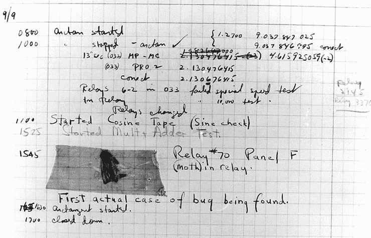

# 1

# 您的意大利面盘上有一大团泥巴

欢迎来到可能是您在岗位上最后一天。您的项目即将被取消。您的客户很生气。您的老板快要疯了。您的老板的老板正在安提瓜，但当她下周回来时，可能有人要丢官帽。没有方法可以美化这个事实。您可能想要更新您的简历，并复习一下您的算法，以便为即将到来的求职做好准备。

我们是如何走到这一步的？我们本来有一个计划。硬件架构很简单。最初的几版发布都进行得非常顺利，我们的用户都很满意。我们的客户甚至提出了一整套新的功能请求，并签署了合同延期。我们是如何发现自己站在必然且突然的灾难边缘的？

我们发现自己所处的这种情况远非独特。根据许多学术报告，六分之五的软件项目都被取消了。其他项目由于进度落后或超支而失败。软件项目很难。没有所谓的*简单*程序。实际上没有哪个项目可以在一周内完成，然后发货，就结束了。事情不是这样运作的。这种现象是软件行业特有的。设计桥梁的结构工程师在桥梁对公众开放交通时基本上就完成了。电气工程师在面包板上设计和测试电路，然后将这些设计转交给他人进行制造。像我的祖父这样的航空工程师，他们为比奇飞机设计动力装置（即发动机），通常设计并原型化发动机，但并没有做太多。其他人负责制造发动机，将其安装在飞机上，其他人负责维护发动机。

相比之下，软件工程师必须在持续交付环境中设计、构建、测试，并且经常维护他们开发的系统。许多项目永远不会“完成”。我过去 9 年一直在同一个软件项目上工作。我们当然没有构建一个具有完美架构的完美项目，但项目已经持续了下来。新的功能被开发出来，并且发现了错误并得到了修复。

什么使得那些持续运行多年的项目与大量被取消的项目有所不同？虽然这种情况可能以许多方式发生，但我们将专注于我们软件的设计和架构。我将从它经常出错的地方开始。遵循本书的标题，我们将在本章中花一些时间讨论一系列的反模式。虽然我还没有直接介绍模式的概念，但我怀疑您可以对它们以及它们的对立面做出有根据的猜测。**模式**，目前来说，是一个正式解释的、抽象的、最佳实践解决方案，用于解决常见的开发需求。**反模式**是一个正式的例子，说明了您不应该做什么。模式可以说是好的。反模式无疑是坏的。

本章将介绍一些最常见的反模式，包括以下内容：

+   煤气管系统

+   大泥球

+   金锤

一旦我们了解了一些反模式，在后面的章节中，我们将重点关注旨在对抗和纠正反模式已经或可能很快占据主导地位的情况的原则和模式。在 *第二章* 中，*为 C#中模式在现实世界中的应用做准备*，我将为你与模式的工作做好准备。软件开发是一个奇怪的行业，我们每个人都有不同的道路来到这里。我本人是自学成才的。我 12 岁时就开始了。关于计算机编程的唯一书籍可以在 Radio Shack 购买。大约有十几本。我们没有像 **Packt Publishing** 这样在市场上用关于软件开发各个方面的迷人而有用的书籍来吸引人的资源。1991 年，我大学毕业那年，计算机科学学位将专注于使用 FORTRAN 为主机开发软件，这与我现在的工作相去甚远。我在 1987 年上的主机编程课程是最后一个使用穿孔卡的课程。如果你不确定它们是什么，去查查。我会等你。你回来了吗？你害怕了吗？我也是。重点是，像我这样的人还有很多，他们出于必要性学习编程，而且是非正式地学习的。

现在有很多受过大学教育的软件开发者，但并非所有软件开发课程都是一样的。计算机科学课程侧重于数学理论和算法开发等元素，但只教授很少的实践内容。软件工程课程、训练营和贸易学校则更侧重于工程，在那里你学习如何构建软件，而较少关注理论。无论你从哪里开始，*第二章* 的目标是确保你理解在运用模式时所需的最重要形式化工程概念。模式是通过一系列规则创建的，*第二章* 讲述了这些规则。

在 *第三章*、*第四章* 和 *第五章* 中，我们将使用故事格式认真介绍模式。我这样做是为了创造一种与我自己阅读的一些更严厉的学术设计模式处理方式截然不同的学习体验。我为这本书选定的模式来自可能是软件行业模式的开创性工作，即 Eric Gamma、Richard Helm、Ralph Johnson 和 John Vlissides 所著的 *Design Patterns: Elements of Reusable Object-Oriented Software*。这四位作者共同被称为 **四人帮** (**GoF**)，他们所写的书通常被称为 *The GoF book* 或简称为 *GoF*。*The GoF book* 包含 23 个模式，分为三个类别：

+   **创建模式**处理对象的创建，而不仅仅是使用 new 关键字。

+   **结构模式**处理你如何结构化你的类以最大化灵活性、减少紧密耦合并帮助你关注可重用性。

+   **行为模式**处理对象之间如何交互。

我将在*第三章*中涵盖以下创建模式：

+   **简单工厂**（技术上不是一个模式）

+   **工厂方法模式**

+   **抽象工厂模式**

+   **建造者模式**

+   **对象池模式**

+   **单例模式**

在结构模式的领域内，在*第四章*中，我将涵盖以下内容：

+   **装饰者模式**

+   **外观模式**

+   **组合模式**

+   **桥接模式**

实际的模式覆盖将在*第五章*中通过这一组行为模式结束：

+   **命令模式**

+   **迭代器模式**

+   **观察者模式**

+   **策略模式**

再次指出，这本书的设计是为了关注现实世界的软件开发。在现实世界中，我们并不总是完美地遵循在*第二章*中提出的规则。许多书籍展示了一个完美的体验。专家作者总是将他们的所有示例第一次尝试就展示为完美的。我不会这样做，因为这不符合现实。当我们进入*第三章*、*第四章*和*第五章*时，我们会发现自己面临实际实践中会遇到的“陷阱”。没有回避的办法。即使你完美地执行这些章节中的模式和策略，也没有人能预测未来。在*第六章*中，我们的故事中出现了一个转折，我们有机会重新思考我们之前所做的一切。在*第六章*中，我们将基于我们迄今为止学到的模式设计一个新的系统。*第六章*完全是关于创建设计和计划。在*第七章*中，我们实施这个计划。

我不会涵盖 GoF 所涵盖的所有模式。相反，我将专注于你作为在现实世界中工作的 C# .NET 软件开发者最可能需要的模式。我已经根据流行度、有用性和复杂性选择了我的模式列表。那些在野外不常看到且复杂的模式已被从正文的主文中省略。话虽如此，我在*第八章*中回顾了那些我没有涵盖的模式，并给出了通常的建议，告诉你接下来该怎么做。

本书假设您有几年使用 C#的经验。除了我的日常工作外，我在过去 25 年里一直在大学教授软件开发。我现在在南方卫理公会大学的全栈代码训练营教授。我教授的一些课程侧重于 C#，而其他课程则不是。在 SMU，我们教授 JavaScript。如果您没有最近的 C#经验，或者可能完全没有，我在书的末尾添加了*附录 1*。它旨在为您提供足够的 C#语言导向，以便使本书的其余部分有用。关于模式的真实情况是它们是语言无关的。它们适用于任何面向对象的语言，我甚至看到一些模式被强行应用到非面向对象的语言中，并且有争议的成功程度。

# 技术要求

本章提供了一些代码示例。大多数书籍总是提供一些示例代码，这些代码对于你在创建项目时遵循是有意义的。本章中的代码故意很糟糕。您不一定需要通过创建项目来跟随，但如果您愿意，欢迎这样做。

如果是这样，您将需要以下内容：

+   运行 Windows 操作系统的计算机。我使用的是 Windows 10。由于项目是简单的命令行项目，我相当确信这里的一切也应在 Mac 或 Linux 上工作，但我还没有在这些操作系统上测试过这些项目。

+   一个受支持的 IDE，例如 Visual Studio、JetBrains Rider 或带有 C#扩展的 Visual Studio Code。我使用的是 Rider 2021.3.3。

+   一些版本的.NET SDK。再次强调，项目足够简单，我们的代码不应该依赖于任何特定版本。我恰好使用的是.NET Core 6 SDK，我的代码的语法可能反映了这一点。

+   一个 SQL Server 实例和基本的 SQL 知识。我想重申，本章中的代码旨在成为可丢弃代码的现实示例。C#和 SQL Server 就像花生酱和果酱一样搭配，这增加了现实感。一些读者可能不习惯在 SQL Server 中工作，尤其是没有使用**Entity Framework**（**EF**）进行展示的情况下。这本书中唯一提到数据库的地方就是这里。如果您没有数据库经验，请不要担心。示例的真正目的是阅读而不是尝试。如果您想尝试，任何版本的 SQL Server 都应该可以工作。我将使用 SQL Server 2019。

您可以在 GitHub 上找到本章的代码文件，链接为[`github.com/Kpackt/Real-World-Implementation-of-C-Design-Patterns/tree/main/chapter-1/`](https://github.com/Kpackt/Real-World-Implementation-of-C-Design-Patterns/tree/main/chapter-1/)。

# 没有战斗计划能在与敌人首次接触后幸存

有句老话：“如果你没有计划，你就是在计划失败”。只有最业余的人才会在没有至少考虑项目应该如何结构的情况下，首先使用项目 IDE 进行项目。典型的第一步可能包括草拟一个包和对象结构，或者设计一个将持久化我们软件所使用数据的**关系数据库**的结构。那些有过几个项目经验的人甚至可能会用**统一建模语言**（**UML**）绘制一些图表。

我们首先从一组用户故事开始，将我们的代码塑造成表面上满足我们面前要求的样子。很快，我们就进入了敏捷的节奏。我们实现了速度！我们创建了一个功能，向客户展示，获取反馈，修改，并持续交付。通常，麻烦就是这样开始的。

我们遇到的第一大反模式，即烟囱系统，来源于该主题的开创性书籍，布朗等人所著的《反模式》（*AntiPatterns*），我在本章末尾将其列为推荐阅读。

## 烟囱系统

从前，在几乎任何工业化社会中，人们使用铸铁的*大肚子*炉子来供暖和烹饪。这些炉子以煤或木材为燃料。随着时间的推移，炉子的排气口，即烟囱，因为它是从炉子中伸出的管道，会积累腐蚀性沉积物，导致烟囱泄漏。在狭小的封闭空间内，燃烧炉子的烟雾可能具有致命的风险。

这里展示的是真正的烟囱的样子：


图 1.1 – 带有烟囱的炉子。

烟囱需要持续的维护以防止窒息。这通常由炉子的所有者来完成，他们不太可能是炉子维修专业人士。炉子的维修使用的是随手可得的工具和材料。这导致了非常随意的修补工作，而不是使用**原始设备制造商**（**OEM**）级材料和适当的工具完成的干净、经过深思熟虑的维修。

现在，想想这如何与一个软件项目相关。初始发布是精心设计的，实现与设计完美匹配。在软件维护期间，自然趋势是快速修复问题，并尽快发布修补版本。就像我们业余的炉子维修一样，我们对软件设计和实现的漏洞的分析是草率的和不完整的。有压力要快速解决这个问题。每个人都看着你。应用程序每分钟“宕机”都会给公司造成损失，你还有可能失去“本月员工”的停车位。

这发生在每个人身上，而且每个人通常都会屈服于人性的弱点。然后，你实施你能想到的最快、最简单的事情——它完成了，补丁已经发布出去。危机结束了。

或者是吗？咚咚咚！小型临时修复随着时间的推移会产生负面的累积效应，这被称为技术债务，就像管道上的腐蚀性沉积物一样。你如何判断你正在工作的系统是否是管道式系统？让我们探讨以下内容：

+   管道式系统由于其本质上是单一的。很难将数据输入或输出到这种系统中，并且将这种方式的软件集成到更大的企业架构中既繁琐又不可能。

+   管道式系统非常脆弱。当你对这些小型的临时修复进行操作时，通常会发现修复会破坏应用程序的其他部分。通常，这种破坏直到修复后的版本发布后才会被发现。

+   随着新的业务需求的产生，管道式系统难以轻松扩展。当项目开始时，你会得到一组需求。你构建满足这些需求的软件。发布后，会要求添加一个你无法预见的全新功能。你意识到，没有重新设计整个应用程序就无法实现这个功能。任何时候你都有可能因为想要把“洗澡水连同婴儿一起倒掉”而从头开始，那么你就是在处理一个管道式系统。

+   基于组件架构构建的管道式系统通常无法与其他企业应用程序共享这些组件。项目之间的代码复用程度非常低。

+   管道式系统通常出现在人员流动率高的项目中。这很合理。你开始一份新工作，取代了最后一位开发者，你感到压力要快速让某物工作以向你的新老板证明雇佣你不是一个大错误。你尽力拼凑一些东西来解决问题。你对现有的架构或过去尝试过（可能失败）的东西一无所知。现在考虑一下，在每次新员工开始日期之间有几个月的时间，进行两三次进一步的重新人员配备。

+   当开发团队使用新的或陌生的技术、技术栈或语言时，通常会指示管道式系统。鉴于存在快速生产东西的压力，同时团队还必须使用他们以前从未使用过的工具和语言，这会导致相同的模式：只是让某物工作并发布。你也会在初创公司、企业收购和合并中遇到管道式系统，原因相同。

这听起来熟悉吗？当然，我们不是在谈论你曾经编写过的任何东西！这难道不是让你想起了你看到别人编写的代码吗？也许是你的竞争对手？也许是你的学生？即使你承认编写过烟囱系统，也不要自责。这现在是软件开发中最流行的模式。有时，烟囱系统是可以接受的。记住，并非每个物理建筑都需要由有凹槽的象牙柱支撑，而且关于将软件推向市场并在以后再处理其他问题的论点是很有道理的。然而，如果你的目标是构建 10 年或更长时间后仍然有用和有利可图的软件，请继续阅读。我们将很快用功能性强、模块化、结构良好的系统替换这些烟囱系统。

# 《大泥球》

大概在同一时间，布朗等人正在撰写关于反模式的书籍时，另一支研究团队也在进行类似的工作。他们工作的成果被命名为《大泥球》，由福特和约德（1997 年）所著，我在本章末尾的“进一步阅读”部分列出了这本书。正是他们的工作启发了本章的标题。

《大泥球》反模式与我们关于烟囱系统的概述惊人地相似。然而，作者们更深入地探讨了这些系统是如何合理地形成的。

它们通常从**废弃代码**开始。我认为这很容易理解。这是你花几个小时甚至几周时间敲出来的代码，作为粗糙的原型。它向你和可能的项目利益相关者证明，你面前的问题是可以解决的。它甚至可能足够好，可以向客户展示。这就是陷阱出现的地方。原型足够好可以发布，所以，在你老板的要求下，你发布了它。我们将在本章的“废弃代码示例”部分通过故意构建一个足够好可以发货但不足以扩展的原型来模拟这一点。这个粗糙的原型将完成我们所要求的一切。在这个虚构的软件项目发布第一个版本后，我们就会发现自己面临构建大泥球时的第二个因素：**零散增长**。项目经理可能会贬义地称之为“范围蔓延”。我曾是一名咨询软件工程师和公司软件工程师。我可以告诉你，从项目管理角度来看，将范围蔓延视为负面的事情是错误的。虽然从计划和计费的角度来看，初始发布后出现的新需求是令人沮丧的，但新需求的出现是成功系统的标志。我最强烈的建议是，你开始每个项目时都要有它将非常成功的想法。这听起来可能过于乐观，但实际上，如果你发布了废弃代码，这是最坏的情况。

零散的增长导致了一种被称为**保持运行**的策略。再次强调，这不需要太多解释。当发现错误和新功能时，你只需修复有问题的部分，使程序满足新的需求集。顺便说一句，我们下周就需要完成这项工作。

在第二次发布之后，**保持运行**变成了你的日常工作描述。如果你的程序真的非常成功，你将开始雇佣人来帮助你**保持运行**，这自然会放大问题和技术债务，因为项目继续增长。

再次强调，这听起来与我们阐述的管道系统非常相似。福特和约德更详细地考虑了导致我们不幸混乱状况的力量。力量，就像自然界一样，是外部因素，你很少能控制。这些力量包括以下内容：

+   时间

+   成本

+   经验

+   技能

+   可见性

+   复杂性

+   变化

+   规模

让我们更详细地谈谈每个方面。

## 时间

你可能没有足够的时间来认真考虑你目前所做的架构选择的长期影响。时间也限制了你的项目，限制了你可以用分配的资源完成的事情。大多数开发人员和项目经理试图通过增加他们的估计来解决这个问题。在我的经验中，帕金森定律是正确的：那些时间估计被增加，甚至翻倍的项目，通常会扩展到填满或超过分配的时间。

## 成本

大多数项目没有无限的预算。那些有无限预算的是开源项目，它们根本没有任何货币预算，而是用志愿者的时间来代替，这本身也是一种成本。架构很昂贵。拥有知识和经验来开发良好架构的人很少，尽管由于你正在阅读这本书，他们稍微不那么难以接触。他们倾向于获得更高的薪水，而创建和维护适当架构的努力所涉及的成本在利益相关者、老板或客户的心中并不立即得到回报。

良好的架构需要时间，不仅需要开发人员和架构师的时间，还需要了解软件背后业务领域的领域专家的时间。领域专家很少致力于软件开发工作。他们有常规的工作，有真实的需求和项目外的截止日期。聘请每小时收费 250 美元的商业顾问正在消耗本可以收费的时间，但你诚实地讲，没有这种访问，你无法完成项目。

## 经验

软件开发者是软件开发方面的专家。他们很少在构建解决方案的业务领域拥有专业知识。例如，构建引用保险政策的系统的人很少曾是精算师，甚至调整员。在业务领域的经验不足使得软件建模成为一项试错的过程，这自然会影响到程序的架构。

## 技能

并非所有软件开发者都拥有相同水平的技能。有些人刚进入这个领域。有些人学习速度比其他人慢。有些人学会了使用一些“黄金锤子”（稍后会更详细地讨论）并且拒绝进一步提升技能。而且，在项目中总有一个超级明星，让其他人感觉自己像是在装模作样。

## 可视性

你无法看到正在运行程序内部。当然，你可以启动调试器，但普通人无法像检查一座办公楼等物理结构的架构那样检查你的代码架构。因此，架构常常被忽视。你的老板不太可能因为你惊人的抽象和接口结构给你一个丰厚的奖金。然而，他们会奖励你早点交付。这导致了一种非常人性化的、漫不经心的态度，对待你的代码结构。

## 复杂性

复杂的问题领域会产生混乱的架构。想象一下建模一组现代灯泡。这很简单。如瓦数、光输出（以流明为单位）和输入电压等属性会跃然纸上，仿佛它们是第二本能。现在，想象一下在 1878 年建模一个灯泡。你进入了未知领域。托马斯·爱迪生在 1879 年获得了他的第一个灯泡的专利，并且著名地引用说，他已经发现了两千种不制造灯泡的方法。如果领域复杂或未探索，你应该预期你的架构将面临坎坷。

## 变化

变化是唯一始终如一的事情。福特和约德写道，当我们设计架构时，它完全基于一个假设：一套关于未来的假设，我们期望对那个架构的更改和扩展仅限于我们迄今为止考虑的可能性领域。这听起来很好，但不可避免地会出现另一个真理：没有战斗计划能在与敌人首次接触后幸存。变更请求将以最不方便的形式出现，在最不方便的时间，而你的工作就是处理这些请求。对利益相关者来说，最容易的方法总是最令人愉悦的，但它正是导致大泥球（Big Ball of Mud）的原因。

## 规模

创建一个供 100 人使用的系统与创建一个每秒可以处理 10,000 个请求的系统是非常不同的问题。你编写代码的风格也不同。在一个小系统中，你高度依赖高性能算法的情况很少见，但在一个大型系统中，这是至关重要的。很少有项目从谷歌或亚马逊通常考虑的规模开始。成功的项目必须能够根据其成功程度进行扩展。

# 黄金锤子

另一个你应该学会识别的重要反模式通常是一些营销组织或你公司外部销售人员的产品。这种情况发生在某个杀手级应用、框架、基础设施组件或工具被展示为解决你所有软件开发问题的万能药。它切片，它切块，它制作法式炸薯条，并在加速代码执行的同时自动重构自己。

这种反模式被描述为**金锤**。请看 *图 1.2* 中的完整渲染的 CGI 表示：


图 1.2 – 当你有一把金锤时，一切都是钉子。

硅谷油销售员会拜访你，带你到一些高档的地方，并试图说服你，他们出售的数据库工具、平台或**任何作为服务**（**WaaS**）可以成为你公司软件的全部基础。考虑一下微软的 SQL Server。在最基本的情况下，SQL Server 是一个关系型数据库。它将你的数据存储在你可以查询的表中。相关数据表可以连接和筛选，允许理解 **结构化查询语言**（**SQL**）的开发者以任何格式或配置生成报告数据。这是每个关系型数据库工具都具备的常见功能，从 *Microsoft Access* 和 *SQLite* 到 *Oracle* 和 *Microsoft SQL Server*。由于 SQL 是一种标准化的语言，提供这种基本功能不过是 *桌面赌注*。仅为了我们相互理解，所有的双关语都是有意为之。

那么，微软怎么能期望为那些在开源产品如 *MySQL* 和 *PostgreSQL* 中可以免费获得的东西收费呢？当然，SQL Server 在市场上竞争对手较少的时候就已经开始发展了，但 SQL Server 仍然是今天最受欢迎的数据管理平台之一。这是因为 SQL Server 的价值贡献不仅仅局限于表格数据存储。随着产品多年的发展，新增了许多功能和辅助工具。您可以使用 *SQL Server Analysis Services* 以新颖和复杂的方式加载数据和分析数据。*SQL Server Reporting Services* 允许您使用 SQL 创建报告，然后将这些报告以图形方式呈现给可能需要它们的人，通过发送 PDF 格式的报告电子邮件。它还允许用户在服务器上访问报告，并可以无需了解 SQL 或访问底层代码的情况下对数据进行操作。

有支持的工作流程用于使用 R 和 Python 处理 AI 和机器学习项目，你可以用 C#编写一些代码，这些代码在数据库中处理，例如本地的存储过程。*SQL Server Integration Services* 允许你将数据导入并发布到各种不同的数据库、软件服务和行业格式。这导致你能够将你的软件和服务与你的商业伙伴和客户集成。

简而言之，如果你足够努力，你可能会写出一个相当大的应用程序，如果不是整个应用程序，仅使用 SQL Server 的生态系统。SQL Server 是金锤。现在每个问题看起来都像是可以用 SQL Server 解决的问题。我想指出的是，我并不是在诋毁 SQL Server。它是一套可靠且经济的工具集。我会在聚会上不遗余力地推荐它，我的建议总是受到欢迎。提醒自己：找到更好的聚会。我之所以挑剔 SQL Server，是因为我看到了这个特定工具发生的事情。如果你花太多时间阅读 SQL Server 的市场营销材料，你很容易得出同样的结论：SQL Server 是你所需要的所有东西。也许它确实是，但你应该在了解金锤反模式之后才做出这个决定，以免你最终陷入技术困境。

当一个开发者了解到他们之前不知道的一些技术时，金锤也会出现。他们使用了这项技术，他们喜欢它。他们因为快速或新颖的解决方案而得到了奖励。由于效果如此之好，并且他们已经努力将一项新技能添加到他们的技能集中，他们试图使用这个工具或技术来解决他们遇到的每一个问题。

曾经，我接管了一个陷入困境的项目。一个小团队的主程序员被解雇了，在他被替换后不久，他的大部分团队成员也离开了。抛开人际冲突不谈，我通过审查现有的代码库来了解新的项目和业务领域。

我四处询问，结果发现这个项目的原始团队成员都在一家咨询公司。该公司派了几位顶尖的开发者过来会面并收集需求。在看到客户自己用**Visual Basic for Applications**（**VBA**）在 Excel 中制作的原型后，顾问们得出结论，他们可以用**真正的语言**编写**真正的代码**，并在一个月内完成一个完全转换的程序。

两年过去了，没有可用的交付成果。顶尖的开发者要么大大低估了他们正在工作的原型，要么高估了自己的能力。我认为两者都有。大多数开发者都看不起 VBA。我必须承认，尽管我写过相当多的 VBA 代码，我以前也这样认为。顾问错误地认为 VBA 是简单的。他们认为用 VBA 编写的任何东西都只需要微不足道的努力就可以转换为像 C# 这样强大的语言，由同样强大的 .NET 框架和 SQL Server 支持。

几个月几乎没有进展后，咨询公司撤回了顶尖的开发者去从事其他工作，项目完全由初级开发者组成。

考虑到我们迄今为止已经讨论的反模式，你现在已经可以看到这个故事将走向何方。我在两年半没有可行的发布之后继承了这段代码。在我审查现有代码的过程中，我能够看到初级开发者遇到了某些工具或技术。这就像我正在观察树上的年轮：

.jpg)

图 1.3 – 新开发者发现黄金锤子的影响与他们的代码中的年轮相似。

你可以确切地知道他们是在哪里了解到在 SQL Server 中可以使用存储过程，因为从那时起，业务逻辑突然从代码中移出，进入了数据库。这通常是一个坏主意。这样做通常是因为你可以在不编译和发布新可执行文件的情况下更改业务规则，允许你进行小的或大的调整。这大约相当于在飞机以 1,261 节（约 1,453 英里/小时或 2,336 公里/小时）的速度在 30,000 英尺（9,144 米）高空飞行时对其引擎进行工作。

在其他地方，你可以看出他们读过一本关于模式的书籍，因为代码发生了变化。突然之间，一切都有了接口，并使用了工厂模式，我们将在第三章中稍后讨论。其中一些是好的。我可以看出他们在进步。然而，很多都是有人捡起新的锤子，用它来敲打周围的一切，使其变得有用。这主要因为从未给他们机会回过头来重构早期的工作。他们在不同时间使用了不同的技术。他们并不总是使用最适合工作的工具，但他们受到了我们之前讨论的力量的驱动。他们尽其所能，就像我们的烟囱修理工作一样。

# 一个废弃的代码示例

让我们看看一些临时代码。记住，临时代码是快速编写的，对架构的考虑很少。它足够用于发布，但不足以应对扩展。考虑一个旨在从流行的网络服务器中获取日志数据、随后分析和以 HTML 报告形式呈现关键信息的程序。您将分析来自 NGINX（发音为‘engine-ex’）的日志，它是目前使用最广泛的网络服务器程序之一。我通常在问题跟踪器中编写用户故事，但这次我将用 Markdown 文件代替，并将其包含在我的项目中，以便我有记录我的需求的记录：

```cs
As an IT administrator, I would like to be able to easily review weblog traffic by running a command that takes in the location on my computer of a log file from a server running NGINX. I would also like to store the data in a relational database table for future analysis.
GIVEN: I have a log file from NGINX on my computer at c:\temp\nginx-sample.log AND
GIVEN: I have opened a PowerShell terminal window in Windows 10 or later AND
GIVEN: The WebLogReporter program is listed within my computer's PATH environment variable.
THEN: I can run the WebLogReporter command, pass the location of the weblog and the path for the output HTML file.
GIVEN: The program runs without errors.
THEN: I am able to view the output HTML file in my favorite browser.
Acceptance Criteria:
* It's done when I can run the WebLogReporter program with no arguments and receive instructions.
* It's done when I can run the WebLogReporter program with two arguments, consisting of the first being a full path to the NGINX log file I wish to analyze and the second being the full path to the output HTML file I would like the program to produce, and I am able to view the output HTML file within my browser.
* It's done when all the log data are stored in a relational database table so I can query and analyze the data later.
```

您的团队决定使用 C# 和 SQL Server 来读取、解析和存储用于分析的数据。他们决定，尽管市面上有几种不错的模板系统，但团队中没有人使用过任何一种。时间紧迫，HTML 简单，所以我们只需编写自己的代码来将 SQL 语句的结果表示的结果转换为我们的结果。让我们开始吧！需求规定了一个控制台应用程序，因此我在我的 IDE 中创建项目时使用了这种项目类型。我不会向您展示如何创建项目。我假设您知道如何使用 Visual Studio 中的新项目选项创建控制台应用程序。

来自 NGINX 日志的输入数据如下所示：

```cs
127.0.0.1 - - [16/Jan/2022:04:09:51 +0000] "GET /api/get_pricing_info/B641F364-DB29-4241-A45B-7AF6146BC HTTP/1.1" 200 5442 "-" "python-requests/2.25.0"
127.0.0.1 - - [16/Jan/2022:04:09:52 +0000] "GET /api/get_inventory/B641F364-DB29-4241-A45B-7AF6146BC HTTP/1.1" 200 3007 "-" "python-requests/2.25.0"
127.0.0.1 - - [16/Jan/2022:04:09:52 +0000] "GET /api/get_product_details/B641F364-DB29-4241-A45B-7AF6146BC HTTP/1.1" 200 3572 "-" "python-requests/2.25.0"
```

当您在 Visual Studio 中创建控制台应用程序项目时，它会创建一个名为 `Program.cs` 的文件。我们目前不会对 `Program.cs` 做任何事情。我将首先创建一个新的类文件来表示日志条目。我将称它为 `NginxLogEntry`。我在我的样本数据中可以看到有一个日期字段，所以我将需要国际化，因为渲染日期需要文化信息。因此，让我们通过全球化包的 `using` 语句、命名空间和类来设置基本设置。Visual Studio 喜欢使用内部访问修饰符标记类。叫我老派吧。我总是将它们更改为 `public`，假设这是合适的，在这种情况下，确实如此：

```cs
using System.Globalization;
namespace WebLogReporter
{
  public class NginxLogEntry
  {
     //TODO:  the rest of the code will go here
  }
}
```

基本设置完成之后，让我们设置我们的成员变量。除了几个构造函数之外，这基本上就是我们所需要的，因为这个类的设计是为了表示日志中的行条目。

我们感兴趣的字段在先前的数据样本中可以直观识别：

+   `ServerIPAddress` 表示从其中获取日志的网络服务器的 IP 地址。

+   `RequestDateTime` 表示日志中每个请求的日期和时间。

+   `Verb` 表示 HTTP 的 `verb` 或 `request` 方法。我们将支持四种，尽管还有更多可用。

+   `Route` 表示请求的路径。我们的样本来自 RESTful API。

+   `ResponseCode` 表示请求的 HTTP 响应代码。成功的代码在 200 和 300 范围内。不成功的代码在 400 和 500 范围内。

+   `SizeInBytes` 表示请求返回的数据的大小。

+   `RequestingAgent`代表用于发起请求的 HTTP 代理。这通常是指使用的网络浏览器，但在我们样本中的所有情况下，它都是用 Python 3 编写的客户端，使用了流行的`requests`库。

除了我们的字段外，我还将从一个`enum`开始，用于存储 HTTP 方法的四个可接受值，我将其称为`HTTPVerbs`。其余的用简单的自动属性表示：

```cs
    public enum HTTPVerbs { GET, POST, PUT, DELETE }
    public string ServerIPAddress { get; set; }
    public DateTime RequestDateTime { get; set; }
    public HTTPVerbs Verb { get; set; }
    public string Route { get; set; }
    public int ResponseCode { get; set; }
    public int SizeInBytes { get; set; }
    public string RequestingAgent { get; set; }
```

现在我已经设置了枚举和属性，我将创建几个构造函数。我希望有一个构造函数允许我传入一个日志行。构造函数将解析该行，并返回一个包含日志行的完整类。以下是第一个构造函数的顶部代码：

```cs
    public NginxLogEntry(String LogLine)
    {
```

首先，我会使用`.Split()`方法将传入的日志行分割成一个字符串数组，这是`string`类的一部分：

```cs
      var parts = LogLine.Split(' ');
```

在开发过程中，我遇到了一些边缘情况。有时，日志行没有 12 个字段，正如我所预期的。为了解决这个问题，我添加了一个条件，用于检测包含少于 12 个部分的日志行。这种情况很少发生，但一旦发生，我希望将它们发送到控制台，以便我可以看到发生了什么。这类事情你可能想要移除。在这里，我正在拥抱我内心的管道开发者，所以我会保留它：

```cs
      if(parts.Length < 12)
      {
        Console.WriteLine(LogLine);
      }
```

现在，让我们根据分割来拆分这一行。从分割数组中挑选出服务器 IP 地址作为第一个元素很容易：

```cs
      ServerIPAddress = parts[0];
```

我们不关心位置 1 和 2 上的那两个破折号。我们可以在第三个位置看到日期。处理日期总是比平均的根管手术更有趣。想想看，为了将日期格式化并解析成我们知道最终可以与数据库代码一起工作的格式，需要做多少工作。幸运的是，C#处理这个问题得心应手。我们提取日期部分，并使用自定义日期格式解析器。我并不关心用地区格式表达日期，所以我会使用`InvariantCulture`作为日期解析的第二个参数：

```cs
      var rawDateTime = parts[3].Split(' ')[0].Substring(1).Trim();
      RequestDateTime = DateTime.ParseExact(rawDateTime, "dd/MMM/yyyy:HH:mm:ss", CultureInfo.InvariantCulture);
```

接下来，我们开始解析 HTTP 动词。它需要符合我们在类顶部定义的`enum`。我开始提取相关的单词，并通过快速修剪确保它是干净的。然后，我将它转换为枚举类型。我可能应该使用`tryParse()`，但我没有。如果没有这样做，它仍然可以与输入样本一起工作，这就是那种让我们最终陷入管道监狱的思考方式：

```cs
      var rawVerb = parts[5].Trim().Substring(1); 
      Verb = (HTTPVerbs)Enum.Parse(typeof(HTTPVerbs), rawVerb); 
```

`Route`值、`ResponseCode`值和`SizeInBytes`值只是根据它们的位位置获取的。在后两种情况下，我使用了`int.parse()`将它们转换为整数：

```cs
      Route = parts[6].Trim();
      ResponseCode = int.Parse(parts[8].Trim());
      SizeInBytes = int.Parse(parts[9].Trim());
```

最后，我需要`RequestingAgent`。样本数据有一些讨厌的双引号，我不想捕获它们，所以我将使用`string.replace()`方法将它们替换为`null`，从而有效地去除它们：

```cs
      RequestingAgent = parts[11].Replace("\"", null);
    }
```

我现在有一个非常有用的构造函数，它可以自动为我解析行。太棒了！

我的第二个构造函数更符合标准。我想通过简单地传递所有相关数据元素来创建`NginxLogEntry`：

```cs
    public NginxLogEntry(string serverIPAddress, DateTime 
    requestDateTime, string verb, string route, int 
    responseCode, int sizeInBytes, string requestingAgent)
    {
      RequestDateTime = requestDateTime;
      Verb = (HTTPVerbs)Enum.Parse(typeof(HTTPVerbs), 
              verb);
      Route = route;
      ResponseCode = responseCode;
      SizeInBytes = sizeInBytes;
      RequestingAgent = requestingAgent;
    }
  }
}
```

这个类开始时，就像所有类一样——从属性定义开始。我们有一个要求将日志数据存储在 SQL Server 中。为此，我在运行 SQL Server 2019 的笔记本电脑上创建了一个数据库。如果你没有 SQL Server 的经验，不用担心。这是唯一提到它的地方。你不需要 SQL 知识来处理这本书中的模式。我创建了一个名为`WebLogEntries`的新数据库，然后创建了一个与我的对象结构相匹配的表。创建表的**数据定义语言**（**DDL**）如下所示：

```cs
CREATE TABLE [dbo].WebLogEntries NOT NULL,
    [ServerIPAddress] varchar NULL,
    [RequestDateTime] [datetime] NULL,
    [Verb] varchar NULL,
    [Route] varchar NULL,
    [ResponseCode] [int] NULL,
    [SizeInBytes] [int] NULL,
    [RequestingAgent] varchar NULL,
    [DateEntered] [datetime] NOT NULL,
    CONSTRAINT [PK_WebLogEntries] PRIMARY KEY CLUSTERED 
(
    [id] ASC
)WITH (PAD_INDEX = OFF, STATISTICS_NORECOMPUTE = OFF, 
      IGNORE_DUP_KEY = OFF, ALLOW_ROW_LOCKS = ON, 
      ALLOW_PAGE_LOCKS = ON, OPTIMIZE_FOR_SEQUENTIAL_KEY = 
      OFF) ON [PRIMARY]
) ON [PRIMARY]
```

如你所见，我添加了一个无处不在的自增主键字段，简单地称为`id`。我还添加了一个字段来跟踪记录何时被输入，并将其默认值设置为 SQL Server 的`GETDATE()`函数，该函数返回服务器上的当前日期。

让我们继续编写使用 SQL Server 读取和写入数据的代码。我认为大多数人会使用`SQLServerStorage`。如果你在跟着做，别忘了通过**NuGet**添加`Systems.Data`包。

和之前一样，我会从依赖项开始：

```cs
using System;
using System.Collections.Generic;
using System.Text;
using System.Data.SqlClient;
```

接下来，我将设置这个类：

```cs
namespace WebLogReporter
{
  public class SQLServerStorage
  {
      //TODO:  the rest of the code goes here
  }
}
```

与我们之前创建的数据类不同，这个类完全是关于方法的。我将创建的第一个方法将使用直接连接将数据存储在数据库中。如果你只使用过 EF，并且理解 SQL（你应该理解），我强烈建议你尝试这种风格，并测试它与你的常规 EF 驱动代码的速度。你将看到巨大的差异，尤其是在规模上。我现在要从我的比喻肥皂箱上下来，回到创建`StoreLogLine`方法。它接受我们刚刚编写的`NginxLogEntry`类作为其唯一输入：

```cs
    public void StoreLogLine(NginxLogEntry entry)
    {
```

接下来，让我们连接到数据库。我使用`using`语法来做这件事。如果你之前没有使用过它（看看我做了什么？），它非常方便，因为它会处理你创建的任何东西的及时关闭和销毁。在这种情况下，我正在创建一个数据库连接。即使在临时代码中，也有一些事情你绝对不应该做，比如打开一个资源连接却未能关闭它。这真是太无礼了！这一行设置了我的连接。我还建议设置一个强大的数据库密码。像往常一样，我可以以临时代码为借口。到目前为止，我可能已经重复了比当地政府告诉你们戴口罩的次数还要多。而且就像你的当地政府一样，这可能不是你最后一次听到它：

```cs
      using (SqlConnection con = new 
             SqlConnection("Server=Localhost;Database=
                           WebLogReporter;User 
                           Id=SA;Password=P@ssw0rd;"))
      {
```

接下来，我将构建我的`StringBuilder`类，它是`System.Text`的一部分：

```cs
       var sql = new StringBuilder("INSERT INTO 
                [dbo].[WebLogEntries] (ServerIPAddress, 
                RequestDateTime, Verb, Route, ResponseCode, 
                SizeInBytes, RequestingAgent) VALUES (");
        sql.Append("'" + entry.ServerIPAddress + "',");
        sql.Append("'" + entry.RequestDateTime + "', ");
        sql.Append("'" + entry.Verb + "', ");
        sql.Append("'" + entry.Route + "', ");
        sql.Append(entry.ResponseCode.ToString() + ", ");
        sql.Append(entry.SizeInBytes.ToString() + ", ");
        sql.Append("'" + entry.RequestingAgent + "')");
```

接下来，让我们打开连接，然后执行我们的 SQL 语句：

```cs
        con.Open();

        using(SqlCommand cmd = con.CreateCommand())
        {
          cmd.CommandText = sql.ToString();
          cmd.CommandType = System.Data.CommandType.Text;
          cmd.ExecuteNonQuery();
        }

      }
    }
```

太棒了！既然我们现在正在写入数据，那么也应该读取它。否则，我们的类将非常糟糕。或者，也许它不会这么糟糕？在我输入下一个方法签名的同时，我会让你思考这个问题：

```cs
    public List<NginxLogEntry> RetrieveLogLines()
    {
```

`read` 方法将返回一个 `NginxLogEntry` 实例的列表。这就是为什么我们在 `NginxLogEntry` 类中提前创建了第二个构造函数。我将首先实例化一个空列表，用作返回值。之后，我将创建一个非常简单的 SQL 语句，从数据库中读取所有记录：

```cs
      var logLines = new List<NginxLogEntry>();
      var sql = "SELECT * FROM WebLogEntries";
```

使用之前相同的 `using` 语法，我将打开一个连接并读取记录：

```cs
      using (SqlConnection con = new 
            SqlConnection("Server=Localhost;Database=
            WebLogReporter;User Id=SA;Password=P@ssw0rd;"))
      {
        SqlCommand cmd = new SqlCommand(sql, con);
        con.Open();
        SqlDataReader reader = cmd.ExecuteReader();
```

执行了 `select` 语句后，我将使用一个读取器逐行获取数据，并为每条记录实例化一个 `NginxLogEntry` 类。由于它应该是原型代码，我依赖于数据集中的位置来检索数据。这并不罕见，但它相当脆弱。表的重构将使这段代码在以后失效。但这是废弃代码！看到了吗？我告诉过你会再听到它：

```cs
        while (reader.Read())
        {
          var serverIPAddress = reader.GetString(1);
          var requestDateTime = reader.GetDateTime(2);
          var verb = reader.GetString(3);
          var route = reader.GetString(4);
          var responseCode = reader.GetInt32(5);
          var sizeInBytes = reader.GetInt32(6);
          var requestingAgent = reader.GetString(7);
          var line = new NginxLogEntry(serverIPAddress, 
                     requestDateTime, verb, route, 
                     responseCode, sizeInBytes, 
                     requestingAgent);
```

现在我已经使用表中的数据构建了对象，我将它添加到我的 `logLines` 列表中，并返回这个列表。`using` 语句处理了我创建的所有数据库资源的关闭：

```cs
          logLines.Add(line);
        }
      }
      return logLines;
    }
  }
}
```

总结一下，这个类有两个方法。第一个，`StoreLogLine`，接受 `NginxLogEntry` 类的一个实例，并将数据转换为与我们的表结构兼容的 SQL 语句。然后我们执行 `insert` 操作。由于我使用了 `using` 语法来打开数据库连接，当我们离开方法的作用域时，该连接会自动关闭。

第二个操作是相反的。`RetrieveLogLines` 执行一个选择语句，从表中检索所有数据，并将其转换为 `NginxLogEntry` 对象的列表。方法结束时返回这个列表。

最后一个组件是输出组件。这个类叫做 `Report`。它的任务是将数据库请求的记录转换为 HTML 表格，然后写入文件。

我将设置类依赖关系，并以通常的方式开始类设置：

```cs
using System;
using System.Collections.Generic;
using System.Linq;
using System.Text;
using System.Threading.Tasks;
namespace WebLogReporter
{
  public class Report
  {
      //TODO: the rest of your code goes here
  }
```

接下来，我将添加生成报告的方法：

```cs
    public void GenerateReport(string OutputPath)
    {
```

现在，我将使用我们之前创建的 `SQLServerStorage` 类：

```cs
var database = new SQLServerStorage();
var logLines = database.RetrieveLogLines();
```

我有数据。现在，我将使用另一个 `StringBuilder` 生成 HTML。这是表格代码，因为这本书绝对不是关于前端设计的：

```cs
      var output = new 
                   StringBuilder("<html><head><title>Web 
                   Log Report</title></head><body>");
      output.Append("<table><tr><th>Request 
                     Date</th><th>Verb</th><th>Route</th>
                     <th>Code</th><th>Size</th><th>Agent
                     </th></tr>");
      foreach (var logLine in logLines)
      {
        output.Append("<tr>");
        output.Append("<td>" + 
            logLine.RequestDateTime.ToString() + "</td>");
        output.Append("<td>" + logLine.Verb + "</td>");
        output.Append("<td>" + logLine.Route + "</td>");
        output.Append("<td>" + 
            logLine.ResponseCode.ToString() + "</td>");
        output.Append("<td>" + 
            logLine.SizeInBytes.ToString() + "</td>");
        output.Append("<td>" + 
            logLine.RequestingAgent.ToString() + "</td>");
        output.Append("</tr>");
      }
      output.Append("</table></body></html>");
```

最后，我们有一个美妙的 C# 单行代码来输出文件，以便在您最喜欢的浏览器中查看：

```cs
     File.WriteAllText(OutputPath, output.ToString());
    }
  }
}
```

它可能看起来很丑，但它确实有效。我再说一遍，因为我可以。这是废弃代码！我在编写废弃代码时提倡的一个技巧是让它变得如此丑陋，以至于任何正常人都不会把自己的名字放在上面。我想我已经做到了。我只是使用字符串构建器创建我的 HTML。没有空格或格式。它基本上是一个压缩的 HTML 文件，当然，这是一个预期特性，绝不是因为懒惰。

在我们将这个宝贝放好之前，还有最后一件事要做。我们需要编辑 Visual Studio 为项目入口点创建的`Program.cs`文件。这个文件将所有其他部分粘合在一起。大多数 C# IDE 的最新版本在`Program.cs`文件中生成控制台应用程序的入口点。这不是什么新鲜事。新鲜的是这个文件的格式。新的格式缺少我们迄今为止在从头创建的类中看到的常规构造函数和类设置。在幕后，编译器正在为我们生成这些定义，但这使得`Program.cs`看起来与其他所有内容都不同。它不是展示所有常规样板，而是直接进入正题。

我们将首先使用我们刚刚创建的`WebLogReporter`类：

```cs
using WebLogReporter;
```

我们将进行一次例行且最小的测试，以确保从命令行传递了正确的参数数量。我们需要日志文件的路径和输出路径。如果您没有传递正确的参数数量，我们将给出一些命令行提示，然后以非零代码退出，以防这是自动化序列的一部分。我知道，这是废弃的代码，但我也不是野蛮人：

```cs
if (args.Length < 2)
{
  Console.WriteLine("You must supply a path to the log file 
    you want to parse as well as a path for the output.");
  Console.WriteLine(@"For example: WebLogReporter 
    c:\temp\nginx-sample.log c:\temp\report.xhtml");
  Environment.Exit(1);
}
```

现在，我们检查日志输入文件是否存在。如果不存在，我们向用户表达我们的失望，并再次以非零代码退出：

```cs
if (!File.Exists(args[0]))
{
  Console.WriteLine("The path " + args[0] + " is not a 
    valid log file.");
  Environment.Exit(1);
}
```

如果他们能走到这一步，我们假设一切顺利，我们可以开始工作了：

```cs
var logFileName = args[0];
var outputFile = args[1];
Console.WriteLine("Processing log: " + logFileName);
int lineCounter = 0;
```

我们实例化`SQLServerStorageClass`，这样我们就可以在读取记录时将其存储：

```cs
var database = new SQLServerStorage();
```

现在，我们打开输入日志文件，使用`foreach`循环逐行读取，并使用`NginxLogEntry`中的解析构造函数创建一个`NginxLogEntry`对象。然后我们将它传递给我们的数据库类。如果我们遇到有问题的一行，我们将输出一条消息，说明问题发生的位置，以便我们稍后可以审查：

```cs
foreach(string line in 
        System.IO.File.ReadLines(logFileName))
{
  lineCounter++;
  try
  {
    var logLine = new NginxLogEntry(line);
    database.StoreLogLine(logLine);
  }
  catch 
  { 
    Console.WriteLine("Problem on line " + lineCounter); 
  }
}
```

我们已经解析了日志数据并将其写入数据库。剩下要做的就是使用`Report`类来输出我们的 HTML：

```cs
var report = new Report();
report.GenerateReport(outputFile);
Console.WriteLine("Processed " + lineCounter + " log 
                  lines.");
```

总结一下，`Program.cs`文件包含主程序。当前的 C#版本允许我们省略项目主文件中的常规类定义。

首先，我们检查用户是否输入了两个参数。这几乎不是一个坚不可摧的检查，但对于演示来说已经足够好了。

接下来，在确保输入日志文件是合法路径之后，我们打开文件，逐行读取，并将每一行保存到数据库中。

一旦我们读取了所有行，我们就从数据库中读取数据，并使用报告对象将其转换为 HTML。

您的程序已经完成；您向客户演示了它，他们非常高兴！一周后，客户的老板和您的老板共进午餐，然后出现了一个新的需求，表示客户现在希望支持两种其他 Web 服务器日志格式：Apache 和 IIS。他们还希望从以下几种不同的格式中选择输出：

+   HTML（我们已交付）

+   Adobe **PDFs**

+   Markdown

+   **JavaScript 对象表示法** (**JSON**)

最后一种格式 JSON 的目的在于它允许外部客户端将数据摄入其他系统进行进一步分析，例如捕捉随时间变化的趋势数据。

虽然这些对需求的简洁描述在我们构建程序的实际扩展时几乎不是我们想要的，但它们足以让你开始思考。

你会怎么做？

我们是否建立了一个烟囱系统？如果不是，它有可能演变成一个吗？在继续阅读之前，请暂停一下，思考这个问题。

我认为我们已经建立了一个烟囱系统。原因如下：

+   我们的所有类都是单功能的，并且直接与网络服务器日志格式耦合

+   我们的软件直接与 SQL Server 耦合

+   我们的输出到 HTML 是唯一可能的输出，因为我们没有创建一个接口或结构来抽象输出操作和格式

你可能认为，在我们创建第一个版本时，第二套需求是未知的。这是准确的。你还可以进一步捍卫你的观点，声称你不是先知，没有方法你能知道你需要根据第二套需求扩展程序。你是对的。没有人是先知的。但尽管如此，你知道，至少因为你已经阅读了这一章，任何成功的程序都必须支持扩展。这是因为你知道你的第一次迭代现在已经产生了对第二次迭代的要求，而这总是意味着需求的变化和增加。我们永远不知道需求会如何变化，但我们确实知道它们会变化。

# 模式如何帮助？

这些因素无疑是你们现在职业生活的一部分。也许只有其中的一小部分在起作用。如果你在软件开发领域待的时间足够长，你无疑会在某个时候遇到它们所有。记住，我们迄今为止所讨论的一切都是反模式。所有这些负面能量都需要一个平衡。你甚至可能想说是需要平衡力量。而不是成为一个黑暗的绝地武士，也许一些不那么激进的方法会更好。你可以学会使用模式来平衡，最终战胜反模式和创造并使他们得以存在的力量。

我认为现在是时候正式引入我迄今为止留给你们想象的概念了。我可以提供自己对模式的定义，但我更愿意站在巨人的肩膀上。从 1947 年 Grace Hopper 在哈佛大学的 Mark II 上记录下第一个错误以来（见*图 1.4*），程序员和计算机科学家一直在反复面对同样的问题。我们每次都会变得稍微聪明一点，并将我们所做的事情记录下来。如果你从七十年间通过艰苦的试验和错误所获得的提炼经验和知识来看，从早期的战争先驱到最近的毕业生，你最终会得到一套模式，这些模式是对反复出现的问题的解决方案的描述。



图 1.4 – 首个计算机故障实际上是一只（蛾）爬进了哈佛大学 Mark II 计算机的继电器中

模式的想法起源于建筑领域，即传统建筑，与建筑的设计和创造有关。1977 年，克里斯托弗·亚历山大记录了一种模式语言，旨在为城镇建设的最佳实践奠定基础。这本书描述了 253 个模式，作为建筑设计的典范。这本书将一切分解为对象。我发现，即使将建筑模式的经典著作改编为软件模式的解释，语言也没有发生变化。我将这本书描述为描述现实世界中对象的语言及其如何塑造空间和对象以实现和谐的合成。正如电视剧和电影系列《星际迷航》中 Vulcans 的格言一样，模式语言的目标是*无限多样性，通过无限组合表达*。亚历山大本人将模式描述为对经常出现的问题的解决方案，每个从业者都可能认识它们。然后他以一种不直接关联任何实现的方式描述解决方案。以这种方式保持灵活性，相同的解决方案可以在数百万个项目中以及数百万种略有不同的方式中使用。

让我们将焦点从建筑世界转移到软件架构领域。我们回顾了著名的 GoF。他们将设计模式定义为对重复出现的问题的抽象，它指出了设计结构的主要元素，专注于创建可重用面向对象软件的思想。

模式将成为我们用来克服那些在最高级的公司机构和中小企业中最神圣的殿堂中盛行的反模式和黑暗力量的武器。

你准备好与黑暗作战了吗？卷起袖子，让我们开始工作吧！

# 摘要

本章通过定义反模式开始了我们对模式的讨论。

我们了解到，如果我们只从满足需求的角度设计软件，我们将构建一个难以扩展的系统。这些系统被称为*烟囱系统*，因为随着时间的推移，它们在结构上会像烧煤炉的排气孔一样退化。你不可避免地会达到一个点，在这个点上，维护和扩展这样的系统是不切实际的。没有人愿意成为告诉老板你需要六个月没有新发布，以便你可以重建公司现金牛产品的那个人的角色。使用模式进行设计将帮助你避免这些类型的陷阱。

我们还了解了一个类似的反模式，称为*大泥球*。福特和约德描述了我们都在日常工作中认识到的普遍力量：时间、成本、经验、技能、可见性、复杂性、变化和规模。这些力量阻碍了我们最初编写好代码的能力。即使我们可以在第一个版本中编写出好代码，这些力量也会随着时间的推移侵蚀系统，就像一条小溪最终形成大峡谷一样。

我们看到了一个废弃代码的例子，这就是大多数项目诞生的过程。我们现在知道，仅仅清理废弃代码然后发货是一种不良的做法。花时间正确地设计项目并假设最坏的情况：你的软件会取得巨大的成功。如果是这样，你可以绝对地依赖那些你甚至在编写废弃原型时都没有想象到的功能请求和新需求。

模式可以被看作是一种定义常见软件设计元素的“语言”，结合了一个可以以许多不同方式实现的抽象解决方案。它们并不依赖于特定的语言或技术栈。随着你学习使用模式，你的软件将因为更坚实的基础而变得更加健壮。你的项目将通过提供未来功能和扩展的途径来支持你不可避免的成功，这些途径是你开始项目时无法想象的。

在下一章中，我将使用 C#编程语言为你准备模式之旅。我将涵盖一些与面向对象编程相关的一些流行惯用和做法。特别是，请注意 SOLID 方法论的展示，因为它是成功模式实施的基础。

如果你是一个新手，或者可能是在使用过其他面向对象语言后返回 C#，我想要你参考书末的*附录 1*。我为那些对学习模式感兴趣但专注于其他语言（如 JavaScript 或 Python）的学生和同事写了这个附录。模式是语言无关的。在不考虑语言的情况下学习这些模式是可能的。然而，我相信我们都是通过实践来学习的，这意味着你需要一种实现语言。编程语言的好处是它们基本上都是一样的。它们都使用变量、对象、方法、集合和循环。

在*附录 1*中，我将介绍 C#语言的面向对象特性。我暗示了我的想法，即该领域的较新手开发者最有可能在合理掌握语言的同时，却仍然坚持使用“黄金锤子”并用 C#来制作烟囱式软件。我有许多学生从我这学习 JavaScript，并且在我的强烈鼓励下，他们希望通过学习 C#来继续他们的旅程。鉴于两种语言在继承和常见结构（如对象和类）之间的不同工作方式，你无疑会察觉到我的包容性愿望。我最初写这个附录是为了成为*第二章*，但我不想承担 C#群体大喊“无聊”的费用。即使你是 C#的老手，我也鼓励你浏览这一章。你可能会发现我解释事物的方式与其他许多作者略有不同，当然与学术教科书相比更是如此。

# 问题

1.  用你自己的话来说，什么是模式？什么是反模式？

1.  你在自己的工作中见过哪些反模式？

1.  什么是烟囱式系统？你能从你自己的作品中指出一个例子吗？别担心，我不会说的。

1.  你能想到一个你使用“黄金锤子”的时刻吗？这把锤子是什么，你认为是钉子的是什么？

# 进一步阅读

+   Alexander, C. (1977). 《模式语言：城镇、建筑、建造》。牛津大学出版社

+   Brown, W. H., Malveau, R. C., McCormick, H.W. S., & Mowbray, T. J. (1998). 《反模式：危机中的软件、架构和项目的重构》。John Wiley & Sons, Inc.

+   Foote, B., & Yoder, J. (1997). *大泥球*. 程序设计模式语言，第 4 卷，第 654–692 页。来自[`www.laputan.org/pub/foote/mud.pdf`](http://www.laputan.org/pub/foote/mud.pdf)

+   Gamma, E., Helm, R., Johnson, R., Vlissides, J., & Patterns, D. (1995). 《可重用面向对象软件元素》（第 99 卷）. 马萨诸塞州雷丁：Addison-Wesley

+   Johnson, J. (1995). 《创造混沌》。美国程序员，1995 年 7 月

+   Nazeer, H. (2020). *《模式语言：城镇、建筑、建造（评论）》*. 建筑与规划研究杂志，第 29 卷，第二期
