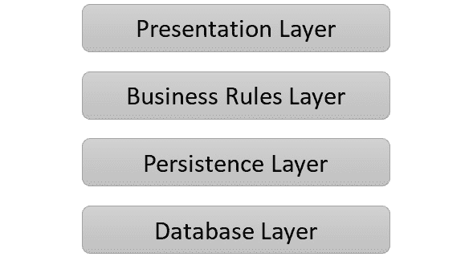
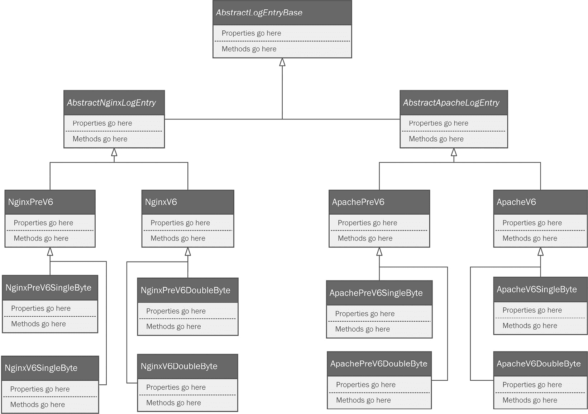
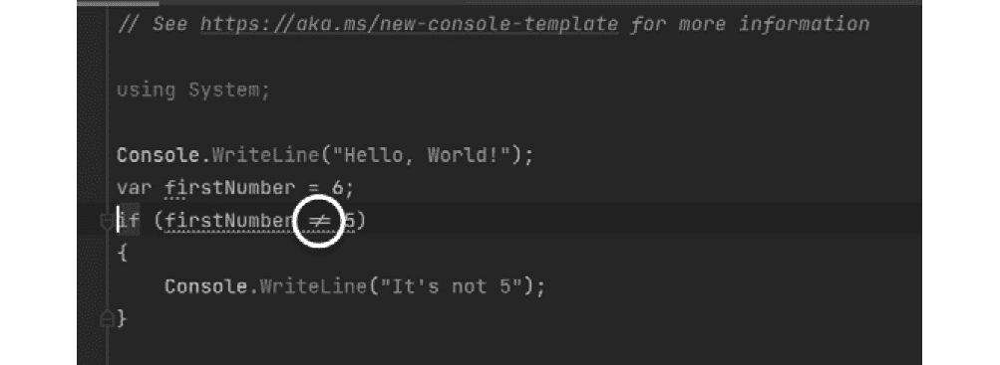
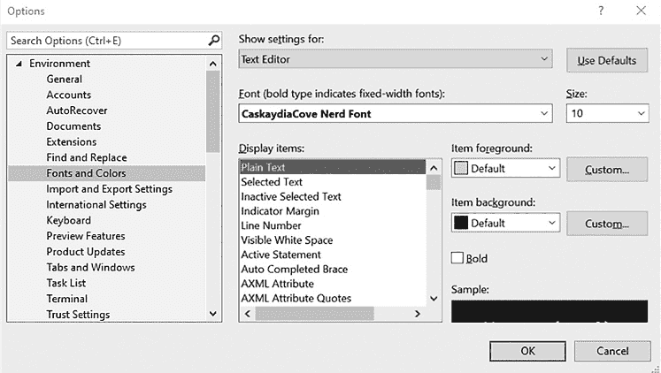
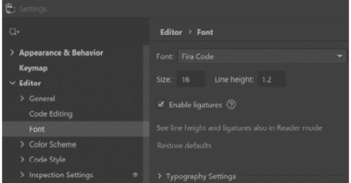

# 为 C#中模式的实际现实世界应用做准备

# 成为预备者

你可能会想，因为我出生在俄克拉荷马州，住在德克萨斯州，我可能是那些在树林里四处奔跑，为即将到来的世界末日做准备的那些疯狂的人之一。嘿，让我们尽量把我的个人生活排除在外！然而，当我告诉你我想让你成为一个预备者时，这和阴谋论或末日言论无关。相反，这与你职业生活中可能发生的根本性转变有关。与大多数现实世界预备者所关心的激进政治转变不同，我们希望的是完全有益的转变，目的是让我们在技艺上更加出色。本章旨在为你准备使用模式。如果你正在处理的代码不符合以下条件，那么依赖模式来改进你的代码是没有意义的：

+   具有高度的组织性

+   以最小风险进行结构化修改

+   可测试性

+   可衡量性

因此，你需要做好准备。想象一下，你正在打磨一块木头上的粗糙部分，然后再上漆。模式就是油漆；如果你在上漆之前打磨，所有的粗糙部分都会突出出来。

将本章视为解释你公司代码现状的原因。如果你在微软、谷歌、苹果、Meta、推特或亚马逊工作，你的代码可能状况良好。你需要明白，高质量的代码库不是偶然出现的，它也并非对困扰物理宇宙的相同混乱力量免疫。熵并不仅限于遥远星云中热力学的关注。它一直在你的代码中发生，你必须学会识别它，并勤奋地修复或抵御它。

如果你在世界其他 99.99%的公司中工作，这些公司通常将软件开发作为业务的一部分，可能存在一些未被认识到的改进机会。让我们看看本章我们将涵盖的内容：

+   意大利面比千层面更比意大利肉丸——用意大利面解释软件演变

+   基本原则——编写干净的代码

+   使用 SOLID 原则创建可维护的系统

+   衡量质量

当你读到本章的结尾时，你将能够做到以下几件事情：

+   识别一些拙劣构建的代码的常见隐喻，以及典范代码。

+   阐述良好的基本编码习惯作为你项目成功和代码应用的关键。模式可以使你的代码变得更好，但前提是它是干净的代码。

+   将 SOLID 原则应用于你的代码和设计过程。

+   识别最常见的软件度量标准，以便我们了解何时我们的代码更有可能是好的而不是坏的。

# 技术要求

本章将展示一些代码示例。它们旨在展示我们将要讨论的一些概念。我不确定它们是否足够吸引人，让你想要自己重新创建项目，但欢迎你这样做。如果你决定尝试任何这些内容，你需要以下这些：

+   运行 Windows 操作系统的计算机。我正在使用 Windows 10。

+   支持的 IDE，例如带有 C# 扩展的 Visual Studio 2022、JetBrains Rider 或 Visual Studio Code。

+   .NET Core 6 SDK.

# 意大利面 < 千层面 < 饺子 – 用意大利面解释软件演化

任何准备之旅的第一部分涉及确保你的食物供应。现实世界的准备者喜欢意大利面，因为它便于携带且无需冷藏。所以，让我们从意大利面开始。

*第一章* 的标题是 *为什么你的意大利面盘上有一个大泥球？* 我从未提到过意大利面。我不需要。它是一个如此明显的描述性隐喻，用来形容混乱的混乱，可能不需要进一步的讨论。实际上，意大利面代码在 *Big Ball of Mud* 反模式的原版出版物中就有提及。许多开发者没有看到的是，意大利面代码是一个症状，而不是疾病本身。真正的疾病是反模式。你的身体可能同时受到多种感染的侵袭。同样，你的代码也可能同时受到多种反模式的侵害。你可以通过决定你的代码在意大利面谱系中的位置来衡量你代码的健康状况。

## 意大利面代码

意大利面代码被描述为混乱、组织不良、难以跟随和难以维护。意大利面越多，情况越糟糕。一旦出现意大利面代码，它往往会迅速扩散。我们也在上一章中将代码架构与物理建筑的架构进行了比较。犯罪学领域有一个著名的原理，称为*破碎窗户理论*。该理论假设犯罪的外在迹象、反社会行为、公民不服从或明显的城市衰败会鼓励进一步的犯罪，尤其是破坏行为。一栋有一扇破碎窗户的建筑很快就会所有窗户都破碎，因为很明显你可以扔石头而不受任何后果。谁不喜欢打破窗户呢？微软经常这样做。

你的代码也是如此。如果你允许一扇破碎的窗户，你的代码就不再干净。你需要立即纠正这种情况，否则不久你的代码库中就只剩下你盘上的大泥球了。

可能到目前为止，快速行动已经得到了回报。可能它让你能够将软件提前推向市场，领先于任何竞争对手。可能你的老板和利益相关者对你的初始发布速度和短周期周转时间印象深刻。所有这些都感觉很好。实际上发生的是，你正在因为砸自己的窗户而得到奖励。你正在牺牲长期利润以换取短期收益。

你需要完全退出意大利面生产业务。

## 千层面代码

从意大利面代码到千层面代码的逻辑步骤。大多数对千层面代码的描述都说它是意大利面的面向对象版本。我并不完全同意。千层面本身由许多与意大利面相同的成分组成。它仍然是面条、番茄酱、香料，通常还有肉类或蔬菜。区别在于它的组织方式。千层面不是通过在勺子上旋转来驯服的数百个相互交织的混乱面条结构，而是使用大面条作为离散层之间的边界。许多层由与其他层相同的东西组成。

在软件领域，分层代码将意大利面式的代码整理成许多小的类。将千层面作为软件的隐喻出现在 1982 年左右，当时行业正开始转向新的硬件架构。我们正从大型铁块式的单体主机转向所谓的**客户端-服务器**架构。当时的单体主机需要类似于几个小型欧洲国家 GDP 总和的财务投入。另一方面，对于资金合理充足的小型企业来说，客户端-服务器系统是负担得起的。这些系统由一个强大的服务器组成，为多个客户端提供服务，其形式是较不强大的计算机。这听起来熟悉吗？这正是互联网所使用的相同模式。不同之处在于，网络技术现在已经普及，指数级地更好、更快、更可靠。剧透一下：**云计算**不是一个新概念。它只是对在他人计算机上完成的工作的一种营销术语。

值得注意的是，20 世纪 80 年代还带给我们对面向对象编程的首次尝试。我怀疑当时詹姆斯·高斯林甚至还没有想到 Java，C#的发明者安德斯·海尔斯伯格当时还在上大学。然而，Bjarne Stroustrup 在 1979 年，在 AT&T 贝尔实验室工作时，开始研究**C++**。C++基于 C 语言。C 是一种严格的过程式语言，旨在控制电信交换网络。Stroustrup 通过将面向对象通过类的方式附加到这种语言上，重新构想了这个语言。

C++在 1985 年由斯特劳斯特普发布了一本关于该语言的书后，向世界发布。那些当时还没有出生的人现在明白，80 年代带给我们的不仅仅是发带、麦当娜的模仿者、《功夫小子》和山谷女孩。它带来了一种全新的思考软件和设计软件的方式。我们在做的时候看起来很棒，这仅仅是一个巧合。

向客户端-服务器硬件转移的需要促使软件设计实践发生变化，因为我们考虑哪些部分应该在服务器上运行，哪些应该在客户端运行。我们开始看到我们现在称之为**关注点分离**的东西。当做得好的时候，关注点分离是一个非常不错的想法。当做得不好的时候，它会产生类似千层面的问题。

千层面通常不会一开始就是千层面。一位软件开发者深思熟虑地设计了一个分层架构，将整个系统的组件分离成称为**层**的层级。以下是一个常见的四层架构设计示例：



图 2.1 – 常见的四层架构

这正是我们在现代移动应用中看到的这种架构。表示层是您从应用商店下载的应用程序，它在您的手机上运行，而其余的层级则在云中无形地运行。

由于分离存在于硬件级别，因此考虑以一组层来构建软件，这些层反映了运行程序的系统，是有意义的。表示层是**视图**，或与用户交互的程序部分。业务规则层实现了驱动表示层显示的逻辑。它从负责存储和检索数据的持久层获取信息。其中一些可能以文件形式存储或在内存中，但无疑一些数据将在数据库的最低级别。层与层之间的所有通信都应该通过它上面的每一层或下面的每一层进行，具体取决于数据流的方向。随着这些层变得越来越复杂，功能开始从预期的层渗出到其他层是很常见的事情。

假设你需要快速修复 UI 中显示方式的问题。也许你想要以某种方式向管理员用户显示某些内容，而以另一种方式向普通用户显示。实现这种更改的正确方式可能是更改业务规则层中的一个规则，但直接将某些内容直接粘贴到 UI 中更容易、更快。你刚刚打破了一个窗户。这没什么大不了的；你告诉自己你以后会修复它。

在其他情况下，千层面可能是由过度修正造成的。以一个在 C 这样的过程式语言中编写意大利面代码的程序员为例，然后给他们提供一个面向对象的编程语言，如 C++或 C#。现在，再加上一本关于模式的书。程序员的自然倾向可能与你第一次意识到可以在*PowerPoint*中使用不同字体时的倾向相同！一个字体很好；因此，你电脑上的所有 25 个字体都必须更好！自然地，你开始创建尽可能使用尽可能多字体的演示文稿。模式是一个惊人的工具。它们旨在引导你走向干净的架构，就像字体，如果使用得当，应该为演示文稿增添强调、清晰度和美学。模式并不是为了成为监狱。

拉斯 agna 问题不仅限于大型、多服务程序。你也会在较小的程序中看到它，以继承层的形式出现。继承是面向对象编程的基础特性。如果一个语言不支持继承，它就不在俱乐部里，而且它不能自称是面向对象的。考虑一下项目在*第一章*，“你的意大利面盘上有一个大泥球”，在几次需求收集、编码和发布迭代后可能看起来像什么。我在这里提出的用例是纯粹的虚构，实际上并不与 NGINX 日志结构的发布历史相关。我需要一个可信的复杂系列来帮助使我的例子有效。

假设*第一章*中的代码代表第一次发布。客户非常高兴，并开始提出新的需求，因为软件在现实世界的不同商业用户中得到了应用。以下可能是一些新的需求清单：

+   一些使用该程序的专业 IT 人员指出，虽然它与最新的网络服务器软件版本配合得很好，但在与较旧版本一起工作时会出现问题，因为日志结构在过去几年中已经改变了几次。我们需要支持最后主要修订版的日志格式，以及最新的格式。

+   基于亚洲的用户指出，他们的日志文件中的文本格式不受支持，因为他们的文本文件使用双字节格式编码。我们需要支持国际文本格式。

+   另一个重要的 IT 团队甚至不能使用你的软件，因为他们并不完全使用 NGINX。他们也使用 Apache，并且他们指出他们也有相同的限制。日志格式随着时间的推移而改变，所以他们需要考虑几种格式，并且他们也需要对单字节和双字节文本实现的支持。

让我重申我之前的免责声明。虽然我对网络服务器日志有所了解，但绝对不是网络服务器日志爱好者。作为提醒，这是一个虚构的警示故事。我们需求的任何与实际软件需求相似之处纯属巧合。我进一步承诺，根据伪证罪的法律责任，不会在同样虚构的生产过程中伤害任何可爱而蓬松的动物。我的律师想让我添加更多内容，但我的编辑想让我继续前进，而且我早就知道我的编辑总是对的。

接下来，假设原始代码中没有使用任何继承，这可能是因为我们刚开始接触 C#，并没有完全理解如何使用继承。现在，假设我们从除了 Packt 以外的出版社买了一本书。这本书是由一位从未在商业环境中发布过软件的大学教授所写。这是很常见的。他们从未听到过一位像神一样拥有对他们生计绝对控制力的秃头老板告诉他们清理原型并在下周发货。他们从未面临过由营销部门不合理规定的截止日期。简而言之，这本书将由一位不从事实际软件开发工作的作者所写。

这种作者可能会展示一个关于 C#继承模型的模糊、过于学术的画面，以及结构化代码的学术上完美的方式。他们基于可用的学术文献综述进行估计，这些综述也是由从未在实地工作过的大学教授所写。你年轻、敏锐、灵活，但容易受影响，可能会被作者的所有学术资历说服，做出以下类似的东西：



图 2.2 – 垃圾桶火灾旁边火车出轨的 UML 等效图（这是过度继承的一个例子）

这是一条用**统一建模语言**（**UML**）表示的构建不良的继承链。如果你之前从未见过 UML 类图，你应该跳转到书的末尾的*附录 2*。那里有如何绘制和解释这些图的概述。

图中表示的继承链比必要的更深，可以通过使用接口等工具和组合等技术更干净地实现设计目标。你也在目睹类膨胀的开始。

当你需要添加越来越多的类来支持新的需求时，就会发生类膨胀。这使我们陷入了经典的烟囱式设计。

过多的继承层，尤其是当属于一个类的功能随着时间的推移慢慢渗入其他类时，会产生千层面。

如果我们还有另一个美味且令人满意的意面隐喻，但对我们所创造的东西的维护者来说不那么有害于工作与生活的平衡，那会怎么样呢……

## Ravioli – 意面代码的极致

虽然每个人都喜欢意大利面和千层面，但你不想它们出现在你的代码中。另一方面，Ravioli 是我们向往的东西。

当我们制作 Ravioli 时，它仍然由制作意大利面和千层面所用的相同成分组成。再次强调，区别在于材料的配置。现在面条形成了一个围绕美味内部的完整边界。面条内的肉或奶酪被完全封装，内容只有在被消费时才会暴露。可能还有美味的酱汁在外面，将整个菜肴融合成一个既不混乱也不过于密集的整体。

值得注意的是，塑造和填充面条所需的努力远远超过简单地煮一撮直面条。制作 Ravioli，就像编写优秀的面向对象代码一样，需要耐心和努力。如果你还记得之前用来描述面向对象设计的基石，Ravioli 的理念是意面面向对象设计的典范：

+   封装用于限制对对象状态的访问。

+   抽象指的是一个类仅用软件所需的细节级别来模拟现实世界中的对象。如果我们编写需要 `Person` 类来模拟人的软件，`Person` 类在病历应用中的建模方式将与电话簿应用中的建模方式不同。

+   继承允许在父类中共享类之间的公共结构，从而消除了在类之间重复复制相同代码的需要。

+   多态允许类设计者将抽象的细节推迟到具体类中实现。例如，一个抽象的 `Vehicle` 类可能有一个 `Go()` 方法。对于具体的类，如汽车、船、滑板、潜艇或飞机，`Go()` 方法的工作方式会有很大不同。多态允许我们在具体级别创建适当的实现，但在抽象级别定义它。

我们需要就封装进行更多讨论，特别是针对 C#。在设计良好的面向对象代码中，对象是封装的。这意味着对象的状态受到严密保护。只有实例应该被允许改变其自身的内部状态。

相比之下，结构不良的代码允许对象直接改变其他对象的状态。在 C#中，自动实现的属性使得这一点变得非常容易，因为属性并不比字段更好。如果每个属性都是公共的，并且没有任何规则，就像自动实现的属性那样，任何对象都可以改变任何其他对象的状态。我们可以通过一个长的继承链来加剧这个问题，其中每一层的每个属性都是公共的、内部的或受保护的。在这种情况下，任何层的任何对象都可以在继承链的上下方向施加状态变化。这使得跟踪每个对象状态的变化及其发生的条件变得困难。层与层之间状态变化的泄露正是 lasagna 的定义。

如果你的代码类似于 ravioli，每个对象的每个实例都是一个完全封装的类，具有有限的继承。它是自己状态的主宰，并且细致入微地完全控制着那个状态。由于这些对象都具有这些特征，你可以轻松利用组合来构建复杂对象，而不是仅仅依赖继承来定义对象的行为。

组合是一种将对象构建成其他对象的技术。当我们使用接口来定义这些对象如何组合在一起时，组合效果最佳。接口定义了对象的结构。把它想象成一个机械插座，比如灯座。只要它适合，你可以把任何灯泡插入那个插座。使其适合的是插座尺寸的定义。C#中的接口可以定义一组属性和方法，对象预期应该具有这些属性和方法。任何符合规格的对象都可以像灯泡插入插座一样被使用。

想象一组设计用来模拟汽车的类。有很多不同种类的汽车。有跑车、家庭轿车、微型面包车，以及我个人的最爱，吉普车。所有这些汽车都非常不同。我们试图提出一个继承链来将它们全部联系在一起，形成一个家族等级。但我怀疑，如果你将设计限制在严格的继承上，你最终会得到数百个类。结果代码将是一盘混乱、泥泞的意大利面。

一个更好的想法是使用组合。我们可以保留我们的抽象汽车模型，但不是创建子类，而是可以添加接口来定义汽车的特征。例如，我们可以为每个组件创建一个定义汽车的接口。例如，我们可以创建一个定义发动机的接口。

我们也可以创建一个定义传输的接口。家庭轿车、高端跑车和 4x4 越野车的传输之间存在着巨大的差异。然而，我们可以定义一组通用的属性和方法。只要遵循所需的接口，我可以建模的任何传输对象都可以适配到我的汽车对象中。

如果我必须用一句话总结面向对象开发者的工作，并且只允许我说一句话，我会说我们的工作始终确保没有任何对象应该被允许进入一个无效状态。我将在下一节中扩展这个想法。

# 基本原则——编写干净代码

本章介绍主题的主要目的是设定一个边界。你可以掌握这本书中的所有模式以及更多，但如果你的软件编写得不好，过于聪明，结构混乱，或者难以维护，那么世界上所有的模式都无法帮助你。让我们设定一些边界。我将提出一些创建“干净代码”的指导方针。你可以就细节进行争论。只要你有自己疯狂风格的方法，我们对于制表符与空格的看法不同，我一点也不介意。让我们画一些大家都可能同意的大致轮廓。

干净代码具有以下特点：

+   对认知负荷有限的人类易于阅读

+   风格一致

+   以适当的注释进行文档化

## 你应该编写人类可读的代码

我觉得这并不像它应该的那样明显。我们编写代码是为了让机器编译和执行，这些机器并不关心我们编写代码时所使用的表达性。编写代码就是编写语言。人类语言是富有表现力的，人类也是。我们可以用我们的书面语言创建一封关于库存短缺的商业电子邮件，一份关于皮肤肌炎诊断后潜在患者结果的医学报告，一篇关于分子生物学的硕士论文，一部长篇浪漫小说，甚至是一首俳句。你的计算机语言也是有限的词汇量中的富有表现力的。C# 有 79 个关键字。凭借这 79 个关键字，你可以创建从下载电子邮件的简短程序到整个操作系统的任何东西。它是一种强大且富有表现力的语言。只要你的代码对其他人来说是可读的，你就需要集中精力。我一直相信黄金法则在这里适用：*己所不欲，勿施于人.*你应该以你希望别人如何对待你的同样的尊重来对待每个人。你应该编写其他人扫描和理解所需努力最少的代码。

这从你命名类、变量、方法和用于创建你的软件的其他元素的方式开始。如果这些名称代表了这些元素的使用意图，你就朝着创建更易读和更易于维护的代码迈出了一步。以下是一些最佳实践的基本要素：

+   为你的元素命名，使其使用目的直观。`this.pn` 并不直观。你可能能想到它可能代表的一打事物。如果我们使用了 `this.phoneNumber`，你就不需要猜测了。

+   创建可搜索的名称。将 `MAX_FILES_PER_UPLOAD` 定义为常量，使得在代码中查找它变得容易，尤其是如果你使用的是索引你的代码的 IDE。

+   将过时的编码留给老一辈的人。除非你非常（我们如何优雅地说这个？）经验丰富，否则你很可能不会做这样的事情。很久以前，在这个星系中，我们学会了使用编码来创建变量名。我说的不是编程代码；我是指匈牙利命名法中的编码。那是在我们还没有类型检查 IDE 的时候。这让我想起了加里森·凯勒的 *Lake Wobegon* 播客，他在那里讲述了一个更简单时代的传说。我们使用简单的控制台编辑器，如 *vi* 和 *emacs*，并且我们喜欢这种方式。我们甚至可以像手被绑在一起一样使用 *Notepad*。当时，我们没有 *Roslyn* 在我们身后监督并指出我们的错误。我们需要一种方法来告诉我们变量中使用了哪种数据类型，所以我们可能会将变量命名为 `intAge` 或 `iAge`。正如我说的，你可能不再这样做，除非你是这样被教导的。如果你是这样被教导的，请停止这样做。谢谢。

+   不要使用成员前缀或后缀。过去，通常会在成员变量前加上前缀 `m_`，例如。与编码一样，这类事情并不需要，因为我们有好的集成开发环境（IDE），而且你的类应该短小且功能明确，这样就不需要前缀。此外，过了一段时间后，人们在浏览你的代码时往往会忽略它们，因为它们不再具有意义。我见过大学教授长时间这样教。我可能就是其中之一。我不为此感到自豪，但那已经是很久以前的事情了，自从那时起我就已经有所进步。我仍然观察到的例外是，通常用初始下划线命名私有字段。我认为大多数人这样做是为了让他们能够给字段起一个明显的名字，以匹配他们打算公开的字段名。

+   在你的代码中使用词性。你的对象是名词。它们代表人、地点和事物。按照这样的方式命名它们。`Person` 是一个很好的抽象类名称，它可能会在 `Student` 和 `Professor` 中扩展。包含动词作为名称一部分的类名，例如名为 `ParseLogLines` 的类，作为类名来说会让人困惑。将类命名为 `LogLineParser` 更清晰，因为它听起来像是一个事物而不是一个动作。在类内部，方法是动词，所以按照这种方式命名它们。`ParseLogLines` 完全可以作为方法名。如果你注意这些细节，你的代码最终会像正常句子一样阅读，尽管带有一些奇怪但可以理解的标点符号。

+   **不要重复自己**（**DRY**）。我的意思是不要重复编写相同的代码。也不要重复任何东西，永远不要重复你已经写过的内容。真是抱歉，我经常看到人们在匆忙中这样做。他们可能在另一个项目或当前项目的另一部分中有一些代码，但编写的方式不利于重用，所以他们将其复制粘贴到不同的程序或同一程序的不同部分。这是一个破损的窗户。很快，你的代码将不再遵循 DRY 原则；它将比章鱼肚脐眼还要湿，而且这种事情会无处不在。

+   移除死代码。这是我的一大烦恼。有一次，我作为一名 Java 开发者工作。我知道，我那时年轻，需要钱。我对这份工作相当陌生，我们有一个数据库函数没有按预期写入数据库。我修改了方法并运行了测试。结果相同。最终，我决定做一个愚蠢、荒谬的大改动。没有任何变化。我正在处理一个名为`WriteInventoryPartToDatabase`的方法。好吧，这个名字听起来很合适。它似乎是一个寻找问题的明显地方。大约一个小时后，我意识到我正在处理的是*旧代码*，而我真正需要的方法已经被移动到另一个类中。移动方法的开发者保留了旧方法以备不时之需，但后来从未清理过。好吧，人们。这就是版本控制系统存在的原因。你可以随时回退。不要偷懒。如果你删除或移除了某些内容，不要只是更改调用方法中的内容。移除死代码部分，否则其他人可能会在一条死胡同上浪费大量时间。

+   格式化你的代码以便人类阅读。以下这种代码应该让你感到厌恶：

    ```cs
    var l = 1;
    var O = 0;
    if (O == l) {
      O++;
    } else {
      l = O * (l + 1);
    }
    ```

我们的 IDE 已经非常擅长默认使用帮助我们检测零和 O 大写字母、小写 L 和大写 1 之间差异的字体。开启字体连字符等选项可以提供更多帮助。连字符字体是改进后的字体，可以显示一组更具表现力的字符。例如，看看 *CaskaydiaCove Nerd* 字体中`!=`的渲染方式来自[nerfonts.com](http://nerfonts.com)。它显示为`≠`，这是你高中数学老师展示的方式：



图 2.3 – 开启字体连字符的 IDE 显示!=

你可以在你的集成开发环境（IDE）中开启这些功能。在 Visual Studio 中，你只需将字体设置为支持连字符的字体：



图 2.4 – 在 Visual Studio 中，只需在“选项”窗口中将字体设置为支持连字符的字体，例如 CaskaydiaCove Nerd Font Mono，你可以在 nerdfonts.com 免费找到它

在 *JetBrains Rider* 中，你有一个实际的设置：



图 2.5 – JetBrains Rider IDE 字体设置允许您特别开启和关闭连字符

如果你更喜欢 *Visual Studio Code*，你需要编辑你的 `settings.json` 文件：

```cs
"editor.fontFamily": "CaskaydiaCove Nerd Font, monospace",
"editor.fontLigatures": true,
```

IDE 的常规配色也有帮助，除非你在阅读以灰度打印的书本 😊。

之前的要点是编写供人类消费的代码的指南。这些提示将帮助我们在进入下一节时。

## 建立和执行风格和一致性

你应该使用一套约定来一致地命名代码元素，以及应用一致的编码风格。如果你做得好，你将无法分辨出你的代码在哪里结束，别人的代码在哪里开始。我不会花时间去推荐编码约定，因为这些在业界已经确立。一些这样的约定已经内置到 IDE 中，例如花括号总是换行，对于其他部分，你可以使用自动化工具，如 JetBrains 的 *ReSharper*，*Prettier* 用于 *Visual Studio Code*，或者开源项目 *StyleCop*。所有这些都有工具允许你在 IDE 中添加风格强制，以及在你将代码提交到 **持续集成** (**CI**) 服务器时运行检查。那些没有使用适当样式的马大哈会失败构建，给团队中的其他人一个机会帮助他们看到错误。

## 限制认知负荷

问题不在于编写糟糕的代码难以理解。问题在于它难以阅读。多年来，我注意到遗憾的是，我不再阅读整段散文了。当然，我很少读完全没有代码的书。多年来，我的大脑已经适应了阅读代码，所以我扫描。如果你也阅读代码有一段时间了，你可能也在这样做，即使你没有意识到。记住这一点，努力使你的代码易于阅读。如果你只需看一眼就能想“好的，明白了。下一个？”，那么它就很容易阅读和理解。相反，你必须盯着一些代码几秒钟或几分钟，才能在你的大脑中解码它。弄清楚它的含义和作用需要明显且不舒服的时间。心理学家将这称为**认知负荷**。

尝试这样做：

```cs
var lastIndexedValue = 1;
var oldValue = 0;
if(oldValue == lastIndexedValue)
{
  oldValue++;
} 
else 
{
 lastIndexedValue = oldValue * (lastIndexedValue++);
}
```

这样更好。不再需要思考。保留它，等你真正需要的时候再用。

## 简洁是更糟的

说到认知负荷，我知道很多开发者喜欢简洁的语法。让我给你举个例子。我在 Stack Overflow 上找到了一个完美的例子，在 [`stackoverflow.com/questions/7103979/nested-ternary-operators/7104091#7104091`](https://stackoverflow.com/questions/7103979/nested-ternary-operators/7104091#7104091)：

```cs
_viewModel.PhoneDefault = user == null ? "" :
  (string.IsNullOrEmpty(user.PhoneDay) ?
    (string.IsNullOrEmpty(user.PhoneEvening) ?
      (string.IsNullOrEmpty(user.Mobile) ? "" : 
        user.Mobile) :
      user.PhoneEvening) :
     user.PhoneDay);
```

它如此简短，以至于无法扫描。你可能需要坐下来几分钟才能弄清楚它做什么。一些开发者认为以这种方式编写代码使他们看起来比其他人聪明。事实并非如此。这就像一个英语作家过分谄媚和顺从地使用长词。你明白了吗，或者你的眼睛是不是扫了几次这句话？我可以说，“*这就像一个英语作家故意迎合过度使用长词的倾向。*”优秀的作家可以写出让受过大学教育的人群理解的文章，也就是说，他们的同行。伟大的作家可以用同样的内容让一群有才华的六年级学生理解。这需要与简洁写作一样多的集中精力，但你可以用你的代码做到这一点，所有负责维护的人都会为此感谢你。

让我们重构它：

```cs
if(user == null)
{
  _viewModel.PhoneDefault = string.Empty;
}
if(!string.IsNullOrEmpty(user.PhoneDay))
{
  _viewModel.PhoneDefault = user.PhoneDay;
}
if(!string.IsNullOrEmpty(user.PhoneEvening))
{
  _viewModel.PhoneDefault = user.PhoneEvening;
}
if(!string.IsNullOrEmpty(user.Mobile))
{
  _viewModel.PhoneDefault = user.Mobile;
}
```

嘭！欢迎来到最不吸引人的代码。如果你把它发到 Reddit 上，你最好的希望是在一长串恶评中偶尔得到一个“嗯”的评论，而这些评论并不局限于你的代码。话虽如此，现在你可以扫描它了，管理设置默认电话号码的规则相当明显。这是因为虽然代码简短是坏事，但我们至少使用了明显的对象和属性名称来表示正确的意图。

## 注释，但不要过度

注释你的代码是好的。我读过一些学术论文，它们提出了多达三分之一的代码行用于注释的坚实论据。问题是这种做法危险地接近编写文档，而程序员最讨厌的事情莫过于直接与用户互动。好消息是——如果你使用我之前强调的想法编写干净代码，你可以减少注释，因为你的代码本身已经很容易阅读。

我认为一个合适的平衡点是通过注释简要重申需求来实现的。如果你的需求已经按照应有的方式记录在在线系统中，你甚至可以链接到该需求。

我还会对任何不明显的东西进行注释，比如我为什么以某种方式编写某段代码的动机。这是一个有用的注释：*我这样做是因为我们的供应商要求数据以这种格式存储。* 这样，我的团队在我之后进来，看到他们认为需要重构的东西，但最终破坏了符合客户要求的代码。

当注释过多时，注释就会变得糟糕。除非你正在写一本书，或者教授初学者阅读代码，否则逐行注释是愚蠢的。

# 使用 SOLID 原则创建可维护的系统

SOLID 是指面向对象设计（OOD）的前五个原则：

+   单一职责原则

+   开放-封闭原则

+   Liskov 替换原则

+   接口隔离原则

+   依赖倒置原则

遵循这些原则将允许你创建健壮、可扩展和可维护的系统。遵守这些原则为你使用模式做好了充分的准备，因为许多模式都是基于或引用这些原则的。

## 单一职责原则

每个方法都应该只做一件事。每个类都应该代表一件事。我们称这个想法为**单一职责原则**（**SRP**）。如果你在对象内部有一个方法做了很多事，而没有调用外部方法，那么你的方法就做得太多了，存在变成被称为*神函数*的反模式例子的风险。这些都是大杂烩，难以消化的意大利面。有一次，我收到一位同事的绝望短信。她的程序崩溃了。她不知道为什么。我检查了一下。整个程序都在一个文件里，打印出来超过 20 页长。整个程序有九个函数。我关闭了项目，推迟了审查，等到我可以坐下来认真处理的时候再进行。我高度怀疑她忽略了 SRP。

让我们看看一个过度设计的例子：

```cs
public void doesTooMuch()
    {
      StreamReader sr = new StreamReader("C:\\Sample.txt");
      var line = sr.ReadLine();
```

我们开始了一个明显会做很多事的功能。我们首先在我们的电脑硬盘上打开一个文本文件，并读取第一行。接下来，让我们逐行读取文件中的每一行，并将每一行文本发送到一个虚构的在线服务，该服务将文本翻译成另一种语言。

为了有效，句子需要文本被修剪，全部大写，并且其中不能有分号，因为服务的作者曾经被 SQL 注入攻击过一次，他发誓再也不这样做了：

```cs
      while (line != null)
      {
        Console.WriteLine(line);
        var processedLine = line.Trim();
        processedLine = line.ToUpper();
        processedLine.Replace(";", ""); // no sql injection
```

好的，文本准备好了。让我们发送它：

```cs
        var url = "https://fake-translation-
            service.com/translate";
        var httpRequest = 
            (HttpWebRequest)WebRequest.Create(url);
        httpRequest.Method = "POST";
        var data = "{\"input\":\"" + processedLine + "\"}";
        using (var streamWriter = new 
        StreamWriter(httpRequest.GetRequestStream()))
        {
          streamWriter.Write(data);
        }
```

我们已经传输了数据；让我们解析响应并将其打印到控制台：

```cs
        var httpResponse = 
            (HttpWebResponse)httpRequest.GetResponse();
        using (var streamReader = new 
        StreamReader(httpResponse.GetResponseStream()))
        {
          var result = streamReader.ReadToEnd();
          Console.WriteLine("Translates to " + result);
        }

```

读取下一行，清洗，重复，直到我们到达文件的末尾：

```cs
        line = sr.ReadLine();
      }
```

如果你打开了它，你应该关闭它，所以让我们清理一下：

```cs
      sr.Close();
    }
```

你能在这里看到问题吗？我们有一个方法执行了多项操作：

1.  我们打开一个文件。

1.  我们处理每一行。

1.  我们将信息传输到服务端。

1.  我们处理结果。

这些都应该被分离到它们自己的方法中。当你这样做时，你可以在其他上下文中重用这些方法来解决其他问题。读取文件是通用的。这是你经常要做的事情。同样，清理你的输入字符串也是。同样，向`RESTful`端点发送也是。你不能重用`doesTooMuch()`方法。它太具体于一个实现点。在*第三章*，“用创建型模式发挥创意”中，我们将摘掉训练轮子，开始学习模式。模式与这种类型的神函数完全不相容。

## 开放封闭原则

类应该对扩展开放，但对修改封闭。这被称为**开放封闭原则**（**OCP**）。这对于已经投入生产的软件尤其如此。你已经有一组编写良好、完全测试的生产类。乱动连接会引入破坏东西的风险。当新代码可以作为现有代码的扩展来编写时，风险就限制在扩展上了。

让我们通过查看违反 OCP 的代码示例来分析一下。我们将创建一个简单的实用工具，用于计算一组几何形状的面积总和。对于我们的初始版本，我们将支持圆形和正方形。我将这样表示`Circle`库：

```cs
  public class Circle
  {
    public double Area { get; }
    public Circle(double radius)
    {
      Area = Math.PI * (radius * radius);
    }
  }
```

我已经设置了一个只读的`Area`属性。没有理由允许某人直接设置该属性。相反，我使用构造函数强制你在实例化时定义圆的半径。这防止了你将`Area`设置为任何你想要的东西，这可能会导致对象进入无效状态。

当你实例化时，你传入半径，这是我们找到圆面积所需的所有信息。古老的*π•r²*，或者常数π乘以半径的平方。面积会自动设置。

我们可以用类似的方法处理正方形。我们只需要知道一边的长度：

```cs
  public class Square
  {
    public double Area { get; }
    public Square(double lengthOfOneSide)
    {
      Area = lengthOfOneSide * lengthOfOneSide;
    }
  }
```

如前所述，我们将`area`属性作为只读属性提供，并使用构造函数在实例化时自动设置面积，通过将`lengthOfOneSide`参数自乘来实现。

现在，我有两个类来表示我的形状，每个类在实例化时都会自动设置`area`属性。我需要的只是一个将它们粘合在一起的类：

```cs
public class AreaCalculator
  {
    private double _area { get; set; }
    public double Area { get { return _area; } }
    public void AddShape(Square square)
    {
      _area += square.Area;
    }
    public void AddShape(Circle circle)
    {
      _area += circle.Area;
    }
}
```

这里，我们有一个名为`AreaCalculator`的类，它有一个`area`属性。在这个例子中，我选择创建一个后端变量，以便更容易地保持运行总账。每次使用两次重载的`AddShape`方法添加正方形或圆形时，它都会将实例化时计算的面积添加到总和中。

我可以用以下代码测试其功能：

```cs
var areaCalculator1 = new AreaCalculator();
areaCalculator1.AddShape(new Square(5d));
areaCalculator1.AddShape(new Square(25.3452d));
areaCalculator1.AddShape(new Circle(2342.093d));
Console.WriteLine("The total area of the shapes is " + areaCalculator1.Area);
```

这看起来相当不错！现在就发货吧！一切顺利，直到我们高兴的客户回来要求支持更多形状。这难道不难吗？也许他们只是想要一个矩形。我需要做的就是创建一个`Rectangle`类，然后修改`AreaCalculator`类以添加另一个构造函数。

如果我这样做，我就违反了 OCP，因为每次我们得到新的形状要求时，都必须直接更改`AreaCalculator`类。我应该设计它，以便你可以传递任何具有`area`属性的任何东西，这样我就永远不需要再次更改`AreaCalculator`了。让我们修复它。

我将创建一个接口来定义我对`Area`属性的要求：

```cs
public interface IShapeWithArea
{
  public double Area { get; }
}
```

现在，让我们修改形状类以实现接口。这很简单，因为它们都已经以符合接口要求的方式公开了`area`属性。

首先，让我们看看圆形：

```cs
public class OCPCircle : IShapeWithArea
  {
    public double Area { get; }
    public OCPCircle(double radius)
    {
      Area = Math.PI * (radius * radius);
    }
  }
```

我将类名重命名为 `OCPCircle`，这样我就不会弄混它们了。现在，让我们来做正方形：

```cs
public class OCPSquare : IShapeWithArea
  {
    public double Area { get; }
    public OCPSquare(double lengthOfSide) { Area = 
        lengthOfSide * lengthOfSide; }
  }
```

接下来，我将修改 `AreaCalculator` 类，使其在 `AddShape` 方法上使用接口作为其类型：

```cs
public class OCPAreaCalculator
  {
    private double _area { get; set; }
    public double Area { get { return _area; } }
    public void AddShape(IShapeWithArea shape)
    {
      _area += shape.Area;
    }
  }
```

太棒了！现在，我们再也不需要修改这个类中的这个方法了。它是可扩展的，但不可修改。为了满足任何新形状的要求，我只需要添加一个新的类来实现 `IShapeWithArea` 接口。

我将添加一个实现相同 `IShapeWithArea` 接口的矩形类：

```cs
public class OCPRectangle : IShapeWithArea
  {
    public double Area { get; }
    public OCPRectangle(double width, double height)
    {
      Area = width * height;
    }
  }
```

无论如何客户接下来会提出什么要求，添加对六边形、菱形或十二边形的支持只是简单地通过谷歌搜索该形状的面积公式，然后创建一个新的类来实现我们的接口。

## 利斯科夫替换原则

在 1988 年，芭芭拉·利斯科夫在一场名为 *数据抽象和层次结构* 的会议上发表了主题演讲，其中她介绍了后来被称为 **利斯科夫替换原则**（**LSP**）的概念。

这个原则指出，任何子类的对象都应该是一个合适的、可以工作的其超类替代品。这实际上更多地依赖于继承。使用我刚刚展示的策略，即更多地依赖接口而不是继承，你不太可能违反 LSP。到现在，你无疑已经推测出我喜欢打破规则（问问任何人），所以让我们打破这个规则。

我正在努力实现的需求与上一个例子相似，但并不完全相同。在这里，我有一个计算矩形面积的要求——仅仅是矩形。为了使这可行，假设我没有在上一个例子中展示出最佳解决方案：

```cs
public class Rectangle
{
  public double Width { get; set; }
  public double Height { get; set; }
  public double Area { get { return Width * Height; } }
}
```

我这次稍微不那么谨慎了。我使用了正常的自动实现属性来设置宽度和高度，而不是构造函数。如果我正在违反规则，我干脆完全放松。`Area` 属性得到了适当的封装，所以你在这里不会做出什么太过分的事情。

现在，让我们创建一个类来处理以与上一个例子中处理 OCP 的方式非常相似的方式来计算矩形的面积：

```cs
public class RectangleAreaCalculator
{
  public double Area { get; set; }
  public void AddShape(Rectangle rectangle)
  {
    Area += rectangle.Area;
  }
}
```

这相当直接。在你创建这个类不到一个小时后，那位无处不在的爱出风头的老板告诉你有需求变更。你需要支持正方形。

你可能会想，没问题。正方形是矩形的一种。显然，我们可以通过继承来实现这一点。也许我们根本不需要做任何改变，但那位爱出风头的老板必须得到安抚。我之前已经强调了“是”这个术语，因为这个短语描述了继承，而且确实如此。正方形是矩形的一种。我们创建了这个类。由于我们正在使用继承，我们需要快速修改一下 `Rectangle` 类，以便它能够支持继承。我们将属性设置为虚拟的，这样我们就可以在子类中覆盖它们，如果需要的话：

```cs
public class Rectangle
  {
    public virtual double Width { get; set; }
    public virtual double Height { get; set; }
    public virtual double Area { get { return Width * Height; } }
  }
```

关于正方形的事情是，它实际上是矩形的，但我们只需要一边的长度来计算面积。父类`Rectangle`需要两边的长度。突然，事情开始看起来有点难看。让我们在打字的同时思考：

```cs
public class Square : Rectangle
{
  private double _lengthOfSide;
  public override double Width { 
    get { return _lengthOfSide; } 
    set { _lengthOfSide = value; } 
  }
  public override double Height { 
    get { return _lengthOfSide; } 
    set { _lengthOfSide = value; } 
  }
  public override double Area { 
    get { return Width * Height; } 
  }
}
```

我有一个很棒的想法！我们可以修复它，以便我们有一个后备变量。每次你修改宽度或高度时，`accessor`方法只是简单地改变后备变量，该变量由`Area`属性的 getter 引用。由于宽度和高度都设置为相同的东西，乘以宽度乘以高度将给出正方形的面积。它不会弄乱整个矩形类需要两个值。现在，我想让你访问 YouTube 并搜索*Guinness 啤酒商业广告精彩*。挑选任何看起来滑稽的视频。我会等着。太棒了！这需要庆祝，也许甚至需要一杯饮料。它会起作用吗？当然会的。我今天会发货，感觉特别特别，就像我因为聪明而逃脱了什么淘气的事情一样。事实上，现在可能是一个去交税的好时机。

同时，在完全不同的部门，最近被尖头老板雇佣的新手开发者正在与一个类似的要求作斗争。自然，我们想要尽可能多地重用代码。新手拿走了你的代码，但做了完全出乎意料的事情。要求必须更改宽度和高度的数字。不管为什么。你知道上一个质疑尖头老板技术方向的真实性的新手发生了什么事吗？他们在某个又热又潮湿的地方的一个地下室隔间里，没有空调，正在尝试使用 Z80 汇编语言在穿孔卡片上加快冒泡排序算法。他们的休息室里没有咖啡机。他们甚至没有赫曼·米勒椅子。这简直是野蛮。你不想成为那样的人，对吧？

这里是新手的代码：

```cs
public class LiskovAreaCalculator
{
  public double Area { get; set; }
  public void AddShape(Rectangle rectangle)
  {
    rectangle.Width = 10;
    rectangle.Height = 20;
    if (rectangle.Area != 200)
    {
      throw new Exception("Bad area!");
    } 
    else
    {
      Area = rectangle.Width * rectangle.Height;
    }
  }
}
```

棒吗？也许吧，但可能不是。某些要求迫使新手在超类中独立更改宽度和高度的值。对于设计用于此类事情的`Rectangle`超类来说，这不是问题。然而，当你尝试用正方形替换矩形时，这绝对会破坏正方形的实现，尽管正方形和矩形之间有明显的“是”关系。

如果你熟悉达尔文奖，你就会知道，每个获奖者在开始他们获得奖项的事情之前都会说出同样的话。在德克萨斯州，或者几乎任何南方州，事情是这样的：*嘿，大家？拿着我的啤酒，看着这个*。

我将给你展示一个 Liskov 替换的例子。

```cs
var test1 = new LiskovAreaCalculator();
var testRectangle = new Rectangle();
testRectangle.Width = 5d;
testRectangle.Height = 6d;
test1.AddShape(testRectangle);
// Don't forget the answer won't be 30 on purpose. 
//It prints 200.
// That's not the problem.
Console.WriteLine("Area of test rectangle is " + testRectangle.Area);
```

到目前为止，一切顺利。一切正常工作。接下来的这部分是它开始出错的地方：

```cs
var testSquare = new Square();
testSquare.Width = 5d;
test1.AddShape(testSquare);
Console.WriteLine("Area of test square is " + testRectangle.Area);
```

如果我们将一个正方形传递给`AddShape`，我们得到的答案不是 200。它变成了 400，这导致抛出了错误。

由于我们勇敢的新手需要更改`base`类以独立修改值，我们打破了 LSP（Liskov 替换原则），它指出我们必须能够用子类`Square`替换父类`Rectangle`。虽然我们在`Square`类中的巧妙覆盖看起来很聪明，但这并不适用于所有情况。你可能会说我们试图将方钉塞入圆孔。然后，你可能会重新考虑，要求找回那杯啤酒，并赞赏地凝视着早期 OCP（开闭原则）解决方案的简洁性，该解决方案可能是解决这个问题的最佳方案。

你现在看到了一个违反 Liskov 替换原则的例子。毫无疑问，你想要看到它被正确地实现。我很乐意在后面的章节中满足你的愿望，这些章节充满了对 LSP 的引用。

## 接口隔离原则

没有类应该被迫实现它不使用的接口，也不应该依赖于它不使用的方法。你不讨厌这种情况吗？你被迫使用你不需要或想要的东西？毫无疑问，新手在 Liskov 替换问题上的失败就是这种感觉。然而，我们是程序员，不是心理学家，所以让我们继续前进，并扩展通过**接口隔离原则**（**ISP**）反对被迫使用我们不需要的东西的想法。

假设我们得到了一个新的需求，需要我们处理二维和三维形状，我们需要二维形状的面积和三维形状的体积。自然地，我们希望坚持使用有效的方法，并且 OCP（开闭原则）部分中提到的接口想法似乎效果很好，这也证明了它在 Liskov 场景中的有用性。

这次，秃头老板没有给我们一个新手，而是给我们一个经验丰富的老兵。不幸的是，这位经验丰富的老兵患有由“不是我自己发明的”综合症引起的心理性失明。也就是说，当他看到任何他个人没有发明的解决方案时，他会立刻认为该解决方案有缺陷，并使用从海事专业人士那里常听到的一些色彩丰富的语言来表达他对该解决方案的蔑视。简而言之，当他描述他未编写的代码时，就像一个水手在诅咒，尽管编写该代码的人可能就在几个隔间之外。鉴于这个人对尴尬一无所知，因为他是最聪明的人，他决定我们之前写的任何东西他都不需要，于是他独自一人开始了自己的行动。

他很匆忙，而且这项工作对他来说太简单了。他想回到同时解决旅行商问题和多体问题，并且运行时间为 O(log n)。你的愚蠢项目挡了他的路。他半心半意地输入以下内容：

```cs
public interface IPollutedShape
{
  public double Width { get; set; }
  public double Height { get; set; }
  public double Depth { get; set; }
}
```

好吧，他不会称之为`IPollutedShape`。我为你取了这个名字。我在技术预销售领域工作了 3 年，我学到了一些让我印象深刻的东西。永远不要让真相或任何现实主义阻碍一个好故事。

你可以在不查看实现的情况下看到问题，对吧？如果我创建了一个扩展此接口的`cube`或`cuboid`类，那就没问题。它们都是三维形状，我们需要三个维度来计算体积。

然而，如果我们使用与二维形状相同的接口，我们就被迫有一个`Depth`属性，这在这样一个类中是没有位置的：

```cs
public class PollutedSquare : IPollutedShape
{
  public double Width { get; set; }
  public double Height { get; set; }
  public double Depth { get; set; } //this is useless!
  public double getArea()
  {
    return Width * Height;
  }
}
```

哎呀！我们得到了这个额外的属性，它在那里什么也没做！这让我想起了那次我的阿姨琳达嘴里有菠菜。不管怎样，我们只制作了一个接口就节省了时间。我们的自大的超级程序员可以回去填补艾萨克·牛顿的空白。

我们现在违反了 ISP，因为我们强制使用了一个我们不需要的属性或方法。那个家伙没有注意到。有人问卡内基梅隆大学的研究生生活是怎样的，他最喜欢谈论的是他读研究生时的时光，当时他简化了自己的最佳作品，以便教授们能理解他的作业。这太完美了。趁他没注意，让我们来修复它。

显然，我们需要两个接口。与只能有一个超类的情况不同，你可以在一个类上实现多个接口。在 C#中，有一个更干净的方法。让我们为二维形状制作接口：

```cs
public interface ITwoDeeShape
{
  public double Width { get; set; }
  public double Height { get; set; }
}
```

然后，我们这样做：

```cs
public class SquareISP : ITwoDeeShape
{
  public double Width { get; set; }
  public double Height { get; set; }
  public double getArea() { return Width * Height; }
}
```

这很简单。一个三维形状使用与二维形状相同的部件，但增加了深度。让我们来做这件事：

```cs
public interface IThreeDeeShape : ITwoDeeShape
{
  public double Depth { get; set; }
}
```

C#允许在接口中使用继承。我使用了接口中定义的二维形状的属性，并将其扩展为需要表示深度的属性。现在，让我们输入`cube`类以获胜：

```cs
public class CubeISP : IThreeDeeShape
{
  public double Width { get; set; }
  public double Height { get; set; }
  public double Depth { get; set; }
  public double getVolume()
  {
    return Width * Height * Depth;
  }
}
```

哇！我们通过只强制执行所需的内容而没有更多内容来遵守 ISP。如果你喜欢，堆叠多个接口没有问题。你还可以在你的接口中使用继承，就像我这样做的一样。

## 依赖倒置原则

当你第一次学习如何设计继承层次结构时，你会知道高级对象建立基础，而低级对象则在这个基础上形成依赖。**依赖倒置原则**（**DIP**）将这种关系颠倒过来，并形成了一种非常重要的实践——**解耦**的基础。我们在之前的 OCP 示例中看到了解耦的力量。我们学习了如何使用接口来防止两个具体类之间的强耦合。

我要提出一个警告。表面上看，依赖反转听起来与**依赖注入**（**DI**）相似。它也听起来与**控制反转**（**IoC**）相似。这些概念并不相同。鉴于我们刚刚讨论了 Liskov 替换，你应该明白它们是不可互换的。原因微妙但确实存在。我不想离题太远，所以我在本章末尾的*进一步阅读*部分留给你一个链接，在那里 Martin Fowler 解释了这三个看似同义的词之间的微妙差异。让我们将我们的焦点重新回到 DIP 上。这个原则指出两点：

*A. 高层类或模块不应该依赖于低层类或模块，两者都应依赖于抽象。*

*B. 抽象不应该依赖于实现细节，而细节应该依赖于抽象。*

对于我来说，这听起来就像武侠电影中少林僧人在脱掉上衣，平静地进入生死搏斗之前可能会说的话。让我们看看我们是否能够将其带到现实生活中。考虑一下你可能会如何使用面向对象原则来设计一个灯。一种可能的方式如下：

```cs
public class CoupledLamp
{
  public bool IsLit { get; set; } = false;
}
```

有一个灯。我们需要一个按钮来开关它：

```cs
public class CoupledButton
{
  public CoupledLamp Lamp { get; set; }
  public void ToggleLamp()
  {
    if (Lamp.IsLit)
    {
      Console.WriteLine("The lamp is off");
    }
    else
    {
      Console.WriteLine("The lamp is on");
    }
    Lamp.IsLit = !Lamp.IsLit;
  }
}
```

这个灯会工作。当你触发按钮内的`ToggleLamp`方法时，灯会按预期打开或关闭。然而，它违反了 DIP。灯是一个高级对象，而按钮是一个低级对象的想法感觉直观。但是，将灯放在按钮里似乎有些不对劲。你可能会认为它应该是相反的，就像现实生活中一样。你在这里的直觉导致违反了 DIP 的两个原则。高层对象在低层对象内部，而且一切都是具体的类，没有抽象的概念。我们该如何解决这个问题呢？

我们可以使用组合。记住，组合意味着从组件对象中构建或组合一个对象。这可能类似于以下内容：

```cs
public class ComposedButton
{
  private bool _isOn = false;
  public bool Toggle()
  {
    _isOn = !_isOn;
    return _isOn;
  }
}
```

这里是我们的按钮，里面没有灯。相反，按钮应该包含在灯中。换句话说，我们应该使用按钮来组合一个灯：

```cs
public class ComposedLamp
{
  private bool _isLit;
  public ComposedButton Button { get; }
  public ComposedLamp(ComposedButton button)
  {
    Button = button;
  }
  public void ToggleLamp()
  {
    _isLit = Button.Toggle();
    if (_isLit)
    {
      Console.WriteLine("The lamp is on");
    }
    else
    {
      Console.WriteLine("The lamp is off");
    }
  }
}
```

我们反转了依赖关系。按钮在灯内部，低级对象直接依赖于高级对象。我们已经满足了 DIP 的第一个原则。在我们达到少林级大师之前，我们还有更多的工作要做。按钮和灯仍然通过具体的对象实现紧密耦合。如果我们想用除了按钮以外的其他东西来打开灯呢？也许是一个运动探测器。也许是一些大家都在谈论的**物联网（IoT）**微控制器。实际上，这仍然是一个按钮，但它要复杂得多，其对象表示会比我们的按钮更复杂。我们需要一个关于按钮的抽象，它允许我们插入任何可以作为按钮工作的对象。让我们创建一个描述灯需要的接口：

```cs
public interface IToggleServer
{
  bool ToggleOnOff();
}
```

然后，我们让按钮扩展接口：

```cs
public class DIPButton : IToggleServer
{
  private bool _enabled = false;
  public bool Enabled { get { return _enabled; } }  
  public bool ToggleOnOff() 
  {
    _enabled = !_enabled;
    return _enabled;
  }
}
```

现在，我们重新布线灯：

```cs
public class DIPLamp
{
  public IToggleServer DipoleSwitch { get; set; }
  public DIPLamp(IToggleServer dipoleSwitch) 
    { DipoleSwitch = dipoleSwitch; }
  public void ToggleLamp()
  {
    if (DipoleSwitch.ToggleOnOff())
    {
      Console.WriteLine("The lamp is on");
    }
    else
    {
      Console.WriteLine("The lamp is off");
    }
  }
}
```

如往常一样，我稍微改变了一些名称，以便我们可以保持我们的例子一致。我将之前持有我们具体按钮的成员变量改名为更通用的`DipoleSwitch`，我认为它可以描述几乎任何实现二进制开/关功能的任何事物。

我们现在有一个灯，其中包含高级和低级对象，并且它们处于正确的方向。我们可以争论说，它们现在是正确的，而且我们最初是以错误的方式倒置的。有点像在美国南部，当有人给你提供加糖茶或不加糖茶时。根本就没有不加糖的茶。这并不是说你在里面加了糖然后再把它取出来。它在制作时就未加糖。措辞很奇怪，但我们仍然那样说。这就是我们的灯在按钮类内部开始时的样子。它工作得很好，每个人都知道你的意思，但这仍然是错误的。

我们还移除了具体的按钮对象，并用接口替换了它。我们本可以使用抽象类来满足第二个原则，但我仍然认为我们应该倾向于接口，因为它们更灵活。

在学习 DIP 的过程中，我们了解了解耦的含义。解耦是一种策略而不是一种模式，它可以在你的软件项目的许多不同层面上有许多用途。

# 超越开发组织衡量质量

在本章中，我们花了很多时间从软件工程的角度讨论质量代码。软件永远不会在真空中开发。它总是与致力于解决业务问题的商业专业人士一起开发。这意味着你的项目中的许多人可能不是开发者或工程师。到目前为止，我们所有的讨论都是围绕特定的工程实践展开的。然而，你需要意识到，这些观点不会得到你的以业务为导向的同事的认同。

对他们来说，“质量”通常被定义为“符合要求”。这意味着高质量代码是满足其要求的代码。我认为这是一个过于基本的定义。20 世纪 80 年代和 90 年代的 corporate quality movements，如 Deming 提倡的精益制造和零缺陷理念，已被有良心的管理者引入我们的领域。他们希望将 100%的精力集中在客户身上。他们很难与我们联系，因为他们对软件的了解仅限于用户看到的表面层。你的非工程师同事在谈论质量时会遇到困难，因为你正在使用不同的语言。

为了让大家达成共识，让我们考虑一些问题：

+   “高质量代码”这个术语对你来说意味着什么？

+   对你的老板来说，它意味着什么？

+   对你的老板的老板来说，它意味着什么？

+   对你的最终用户来说，它意味着什么？

+   对于你的供应商来说，这意味着什么，即那些提供驱动你工作的原始过程输入的商业专业人士？

在完成这个练习后，你很可能已经探索了广泛的视角。

## 代码审查

在一个期望一切都能立即获得的时代，强调重构作为一种常规练习变得越来越困难。尽快解决一个错误报告很容易，草率地做些事情，然后继续处理下一个错误。跑步者有“跑步者的快感”，指的是在跑步过程中某个时刻内啡肽的释放。我个人不知道。我只在被迫时才跑步。我认为程序员在将问题从“进行中”移至“完成”时对多巴胺的依赖有相似之处。同样，如果你有一个向上级报告的项目经理，总是以处理的问题数量来展示进度，而不是使用实际的质量指标并关注代码库的健康状况，这很诱人。

最佳实践是进行代码审查。

代码审查可能是维护健康代码库的最重要实践，这导致开发者快乐。在组织为了在激烈竞争中保留其开发人才而投入大量精力的时候，你将经历更少的已发布错误、更少的停机时间和更高的保留率。代码审查是投资个人贡献者的一种简单且成本效益高的方式。接受审查的开发者，通常由资深团队成员进行，将学会更好的技术和更多模式。资深开发者可以帮助他们的初级同事识别他们可能从培训中受益的领域，在课程开始时，通过分配一本关于模式的优秀书籍。希望你现在能处于推荐一本书籍的位置。

本书对你在软件开发领域的经验水平假设非常少。遵循这一原则，你可能现在正在想代码审查是什么。一个糟糕的代码审查是有人匆匆浏览你的代码，一两分钟后说，“*嗯。看起来不错*。”然后他们签字并回到他们之前的工作。代码审查需要像会议一样安排。如果代码审查是打扰了别人的工作，它将不会产生结果，也不会有效。

在进行代码审查时，有两个关键领域需要考虑：整体设计和功能。

## 整体设计

这本书最终是为了帮助你提高你对软件设计的理解和实践。从逻辑上讲，我会在审查中提到这一点。我不可避免地会问以下问题：

+   新代码如何融入生产代码的整体架构？

+   代码是否遵循 SOLID 原则、领域驱动设计、行为驱动设计或其他团队遵循的范式？

+   是否遵守了格式和风格约定？事物的名称是否遵循我们之前制定的指南？它们是否合理？是否易于阅读？是否具有自描述性？

+   代码是否符合本章前半部分的阅读性要求？

+   使用了哪些模式，它们是否合适？

+   代码是否在正确的位置？我们不希望有千层面！

+   新代码是否可以在其他地方重用？这可能需要将其移动。

+   新代码能否替换我们已有的东西？如果你的添加有 100 行代码可以替换 1000 行，那将是一个巨大的胜利！

+   现在我们有了这个新添加的功能，我能从当前代码中移除什么？当我能够移除代码时，我认为这是一件大事。如果这也能应用到美国税法上就好了！

+   代码是否过于巧妙？巧妙的代码需要通过理解它所需的认知负荷来付出努力。寻找使你的代码可扫描的机会。

+   除了可读性外，它是否充满了未被请求或指定的功能？它是否充满了非常不可能被需要的用例的代码？这被称为**你不会需要它**（**YAGNI**）。

使用“ ain't”这个词可能会激怒我的编辑、我的妻子、我的老板、我的牧师和我的六年级英语老师，但就是这样。大家处理好，好吧。在审查了整体设计之后，审查可以转向功能。

## 功能性

审查的重点应该是确保代码做了它应该做的事情。它还应该询问关于我们如何知道代码已经完成的问题，而不仅仅是当我们从*进行中*状态更改问题时所感受到的温暖感觉：

+   来自不知道代码的其他组的人能否查看这段代码并理解它？

+   自动单元和回归测试是否始终通过？什么？你没有测试？你需要测试！

+   对于新功能是否有文档？最终用户将如何知道如何使用这些新功能，或者甚至知道它们的存在？

+   异常是否得到了充分的沟通，以便向技术团队提供完整的错误报告，而不责怪或无谓地混淆用户？

+   这段新代码是否在你的安全中引入了漏洞？

+   你的行业是否有任何违反监管约束的情况？

+   你是否对性能进行了基准测试？我们能加快任何事情吗？

+   现在将此推向生产是否涉及任何风险？

你还没有想到什么？

这件事很难。你不能自己完成。你需要与其他开发者的代码审查。虽然这不是一个详尽的清单，但这些问题应该能帮助你朝着正确的方向前进。

# 摘要

这一章的全部内容都是关于准备你改变工作方式和思考创建软件的方式。学习模式是一件大事。它们通常鼓励对项目质量和可维护性进行重大改变。

我们从一些常见的隐喻开始，描述了软件项目典型的退化，即意大利面代码和千层面代码。意大利面代码代表一种混乱的结构。千层面代码代表一种分层结构，层与层之间存在泄漏的状态和功能。意大利馄饨代码代表最好的代码，因为它使用了意大利面和千层面相同的原料，但意大利馄饨的内容是完全封装的。

我们介绍了一些通常占据整本书的主题。SOLID 原则是大多数严肃编码组织的指南星，但我很少看到它们被教授。初学者和中级程序员通常过于专注于语言和语法，以至于没有发展出规划和管理架构所需的肌肉。

如果这是你的情况，SOLID 设计原则的五个原则是一个极好的起点，并且在深入研究模式之前应该理解。

我们以一些关于执行代码审查的要点结束。

你现在准备好开始一段冒险了。你已经准备好了所有的预备装备，并且准备好应对我可能向你抛出的任何挑战。在下一章中，我们将开始学习模式，从创建模式开始。

# 进一步阅读

+   Martin, R. C., & Martin, M. (2006.) *敏捷原则、模式和 C# 实践* (Robert C. Martin.) Prentice Hall PTR.

+   Martin, R. C. (2009.) *Clean code: a handbook of agile software craftsmanship.* Pearson Education.

+   Schubert, B (2013.) *DIP in the Wild [博客文章].* 从 [`martinfowler.com/articles/dipInTheWild.xhtml#YouMeanDependencyInversionRight.`](https://martinfowler.com/articles/dipInTheWild.xhtml#YouMeanDependencyInversionRight.) 获取。


# 第二部分：你需要现实世界中的模式

这些章节解释了四人帮（Gang of Four）创建的最有用和最受欢迎的模式。我们严格关注那些在现实世界项目中经常出现的模式——这些模式你绝对应该知道，以便将你的技艺和职业生涯提升到下一个层次。在每种情况下，我们将提供一个通用的 UML 图，然后是实际应用。通用模式图将被重新绘制以适应问题，然后我们将根据图示编写代码解决方案。

本部分涵盖了以下章节：

+   *第三章*, *用创建型模式激发创造力*

+   *第四章*, *用结构型模式加固你的代码*

+   *第五章*, *通过应用行为模式整理问题代码*
