# 3

# 创造性使用创建型模式

创建型模式处理对象的创建，这个过程我们称之为*实例化*。记住，对象是一个已经被实例化的类。对象只存在于运行程序中。它们是由称为*类*的蓝图构建的。由于 C#是一种静态语言，一旦对象被实例化，通常无法更改其结构，这意味着你应该使用最佳策略来创建你的对象。这就是我们将在本章讨论的内容。

即使你是 C#软件开发的`new`手（这可能是书中第一个仅依靠格式来搞笑的双关语），你也已经知道从类中实例化对象的最简单方法。你只需使用`new`关键字并调用类的构造函数：

```cs
var myConcreteClass = new ConcreteObjectThingy();
```

这就是实例化。你正在创建一个类的实例，这个类作为类转变为对象的点。在 C#中，像许多语言一样，我们使用`new`关键字与构造函数一起使用。构造函数是一个方法，其名称与类的名称匹配。它的唯一任务是创建并返回一个类的实例作为新对象。这就是为什么`CreateObjectThingy()`的末尾有一个括号的原因。

我们为什么还需要其他东西呢？记住这本书前面我们讨论的基础原则。我们不希望有一个由我们无法构建的许多对象类组成的管道系统，因为它们太具体、太具体，或者彼此之间耦合得太紧密。根据定义，`new`关键字创建一个具体对象。我们的类应该易于扩展但不易于修改。然而，在管道软件中，它们并不是管道软件，它们不是。遵循模式将帮助我们避免这些情况，并为我们提供一种创建复杂对象并易于理解和扩展的清晰方式。

在本章中，我们将涵盖以下主题：

+   初始设计

+   没有模式实现

+   简单工厂模式

+   工厂方法模式

+   构建者模式

+   对象池模式

+   单例模式

这些模式将通过简单的 C#命令行项目来展示，以保持象征性的信号与噪声比低。有许多书籍独立于任何编程语言教授模式。我认为这是一个错误。大多数人通过实践来学习，而要“实践”模式，你需要一个实现语言。没有那个，你只是在学习学术概念。我们专注于现实世界，我们使用 C#，但你在本书中学到的知识是 100%可移植的。当你了解这些模式时，请记住，它们不是语言特定的。你可以使用在这里获得的知识并将其应用于 Java、Python 或任何其他面向对象的语言。

# 技术要求

在整本书中，我假设你知道如何在你的首选**集成开发环境**（**IDE**）中创建新的 C#项目，所以我不会在设置和运行项目的机制上花费任何时间。如果你决定尝试这些，你需要以下内容：

+   运行 Windows 操作系统的计算机。我使用的是 Windows 10。由于项目是简单的命令行项目，我相当确信这里的一切也都可以在 Mac 或 Linux 上运行，但我还没有在这些操作系统上测试过这些项目。

+   支持的 IDE，如 Visual Studio、JetBrains Rider 或带有 C#扩展的 Visual Studio Code。我使用的是 Rider 2021.3.3。

+   .NET SDK 的某个版本。再次强调，项目足够简单，我们的代码不应该依赖于任何特定的版本。我恰好使用的是.NET Core 6 SDK。

+   你可以在 GitHub 上找到本章的完成项目文件，网址为[`github.com/Kpackt/Real-World-Implementation-of-C-Design-Patterns/tree/main/chapter-3`](https://github.com/Kpackt/Real-World-Implementation-of-C-Design-Patterns/tree/main/chapter-3)。

# 以下故事是虚构的

与任何在世或已故的人物的相似之处纯属巧合。

来认识凯蒂和菲比——这对出生于德克萨斯州的姐妹，她们都对骑自行车有着共同的热爱。菲比在德克萨斯州达拉斯的南方卫理公会大学学习工程学，这是姐妹俩的家乡。德克萨斯州是美国最南部的几个州之一。凯蒂在德克萨斯州西部的 Sul Ross 大学学习工业设计。纯粹是命运的安排，她们俩都在 MegaBikeCorp 获得了暑期实习机会，这是一家大型跨国自行车制造公司：

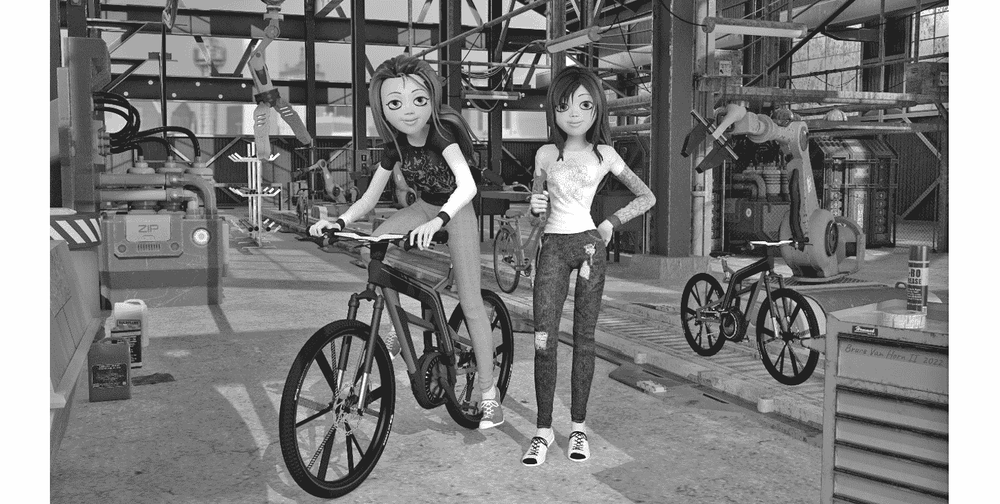

图 3.1：凯蒂（左）和菲比（右）在他们的机器人工厂中完全建造的创新自行车原型前摆姿势。

在 MegaBikeCorp 工作期间，姐妹俩有机会尝试几种不同类型的自行车。菲比住在大城市，偏爱公路自行车。公路自行车使用菱形车架，两个大而细的轮子，光滑的轮胎，以及丰富的变速器来帮助骑行者应对他们在许多城市经常遇到的陡峭的山丘：

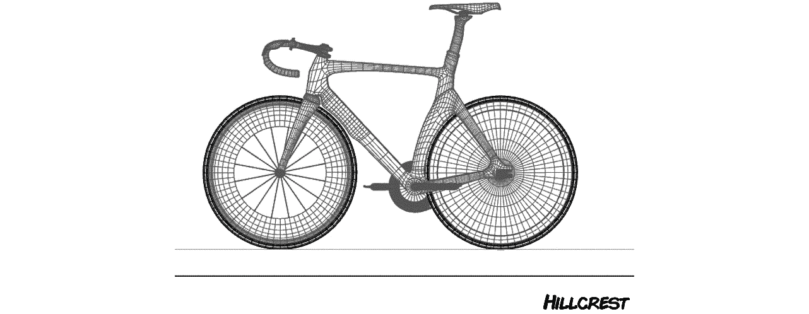

图 3.2 – 凯蒂为她称为 Hillcrest 的公路自行车所做的 CAD 设计

骑行在公路自行车上的骑行者会向前倾斜，身体靠在低矮的车把上。这使得这些自行车速度很快，每年，来自世界各地的数百名骑行者都会参加一项名为*环法自行车赛*的著名赛事。在比赛中，选手们竞争，看谁是世界最快的。基蒂和菲比回忆起，她们的母亲，一个狂热的自行车爱好者，不允许在电视播放比赛时家里任何人说话。菲比也喜欢环法自行车赛，当她骑着她的公路自行车穿越达拉斯的街道时，她经常会渴望骑得更快。这需要一辆不同的自行车。

当菲比需要满足她对速度的需求时，她会骑躺式自行车。躺式自行车具有一个舒适的座椅，看起来更像带轮子的躺椅，你可以看到基蒂的设计在下图中：

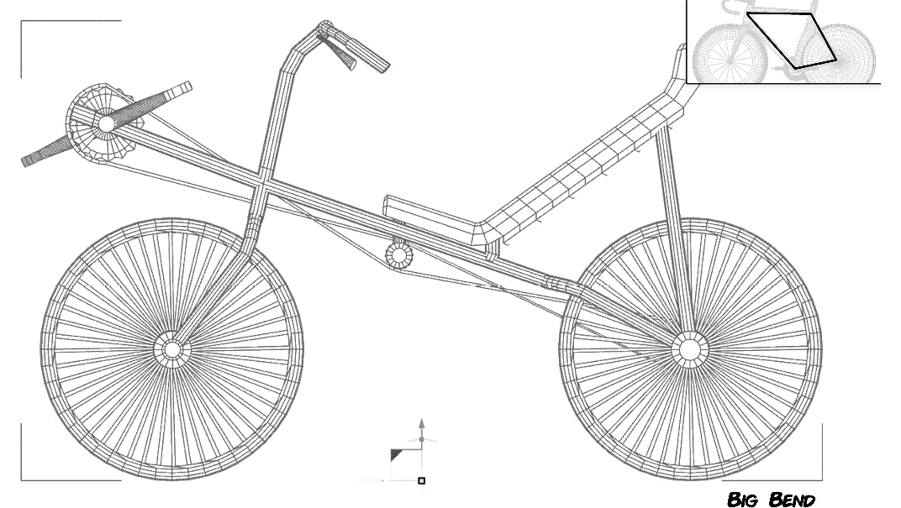

图 3.3 – 基蒂为躺式自行车设计的 CAD 图。注意，车架的形状与大多数其他自行车（如插入图中所示的 Hillcrest）所使用的菱形形状不同。这些是制造过的最快的自行车之一。

骑行者会向后倾斜，并非常低地坐在自行车上。座椅被拉长，位于菲比下方。脚踏板被提升到前轮上方，以捕捉骑行者腿部完全伸展时的力量。这些自行车比传统的赛车更快，而且骑行长途时非常舒适。然而，由于全球范围内认可的赛车规则，它们从未被用于如*环法自行车赛*等赛事中。

相反，基蒂喜欢骑山地自行车，这种自行车设计用于越野骑行，就像吉普车一样。山地自行车，就像公路自行车一样，使用菱形车架，但它们有大的、多孔的轮胎和适合泥地的碟刹。骑行者坐得更直，这样他们可以观察并应对任何越野障碍。标准山地自行车通常在前轮有复杂的减震器，而更昂贵的自行车在后轮上有一个独立的减震器，以及前轮的减震器：

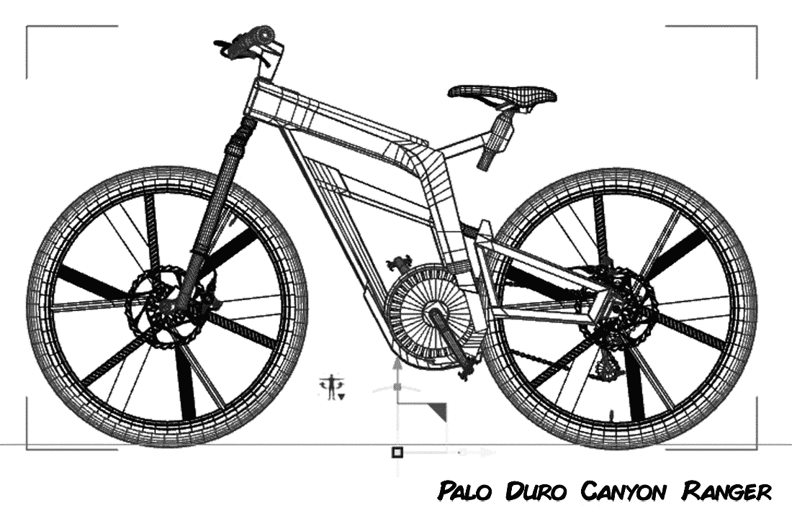

图 3.4 – 基蒂为她称为“Palo Duro Canyon Ranger”的创新山地自行车设计的 CAD 图。

契蒂也喜欢在镇上骑自行车，但她不喜欢公路自行车的难受骑行姿势。躺式自行车因为离地面太低，所以骑起来太危险，在德克萨斯州非常流行的那些驾驶大型卡车的牛仔们是看不到她的。相反，契蒂喜欢骑舒适的巡航车，有时也被称为*老奶奶自行车*。它们非常适合在镇上骑行。由于弯曲把手的设计，它们让她能够完全直立地坐在一个舒适的位置：

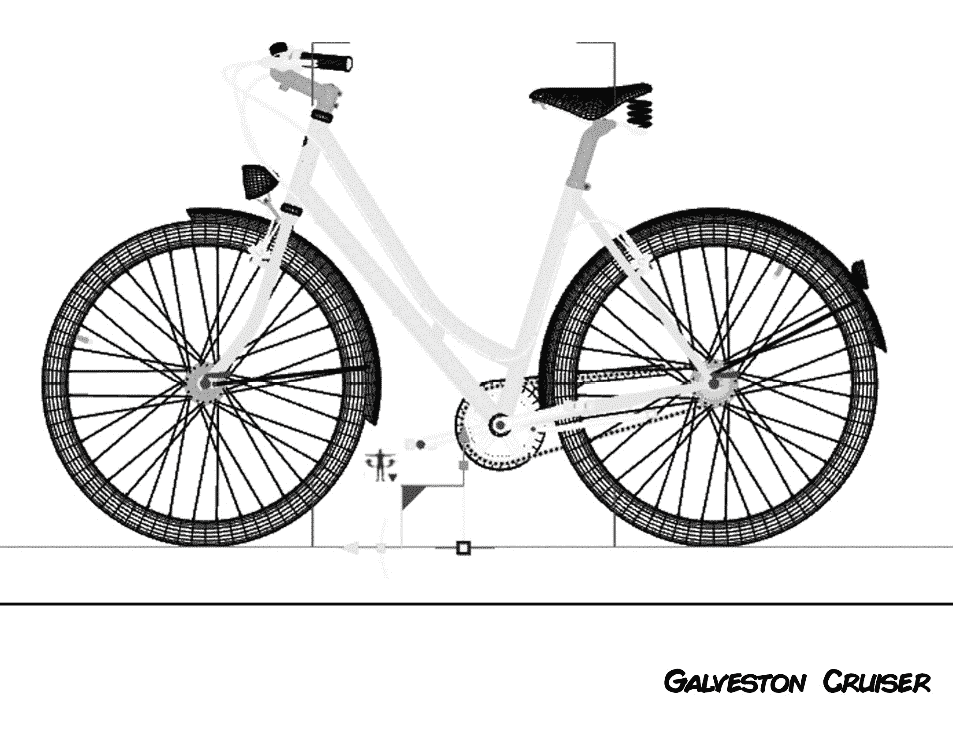

图 3.5 – 契蒂设计的舒适巡航自行车，有时也被称为老奶奶自行车。这些自行车非常适合在镇上通勤和需要舒适出行的游客。

巡航车配备了厚轮胎以增加稳定性，并且有链条防护罩和封闭式齿轮系统，以防止你的左腿裤子被链条磨坏，这通常会发生。这些自行车的设计是为了舒适而不是速度或越野能力。

两位姐妹骑遍了 MegaBikeCorp 生产的每一种自行车型号。菲比觉得 MegaBikeCorp 的工程创新水平令人鼓舞。契蒂觉得 MegaBike 的设计已经过时了。“*他们已经生产了同样的四种自行车 30 年了*，”契蒂说。姐妹俩决定她们可以做得更好，并决定制定一个行动计划。经过许多漫长的夜晚，大量的玉米卷饼，在线协作会议，自行车骑行，以及一些擦伤的膝盖，她们提出了四种自行车设计。但姐妹俩并没有止步于自行车设计。她们还提出了一个机器人制造系统的计划，该系统能够完全自动化自行车生产过程。她们一起成立了一家名为*Bumble Bikes Incorporated*的初创公司，这个名字来源于菲比最喜欢的童年玩具：一只她命名为*Bumbles*的填充大黄蜂。她们计划开设两个制造地点：一个在姐妹们的家乡德克萨斯州的达拉斯，另一个在契蒂的大学城阿尔派恩，德克萨斯州。这两个地区在地理上非常不同。

北德克萨斯州，尤其是达拉斯，是城市化和高度发达的地区。骑自行车对于许多北德克萨斯人来说是一种流行的运动和爱好。达拉斯地区的骑行者主要购买传统的公路自行车。令人惊讶的是，躺式自行车也非常受欢迎，尤其是在大型工程学院附近。你甚至可以在德克萨斯仪器公司 7 百万平方英尺（6.5 亿平方米）的校园里看到躺式自行车，德克萨斯仪器公司是一家位于达拉斯的大型半导体制造商。女孩们决定在达拉斯的工厂建造她们的公路自行车和躺式自行车设计。

在西德克萨斯州，阿尔派市是比格本国家公园以北的最后一块文明堡垒。极限山地自行车在奇索斯山脉盆地以及横穿沙漠的旧采矿和牛车路非常流行。阿尔派是一个小镇，没有也不需要任何大众交通服务。凯蒂的研究表明，市场上需要舒适型“巡航”自行车，这种自行车非常适合在镇上四处走动。凯蒂决定在阿尔派制造山地自行车和巡航车型。手握初步计划，菲比和凯蒂开始着手工作。

菲比负责研究用于制造自行车的机器人技术。凯蒂坐在她最喜欢的 C#集成开发环境中，开始编写将最终控制菲比机器人的控制软件。她知道她的设计，连同菲比的工程，将生产出行业有史以来最好的自行车。凯蒂计划他们的公司和运行的软件将取得巨大的成功，正如我们在*第一章*中学习的，“你的意大利面盘上有一大团泥巴”，这是最坏的情况。

凯蒂编写机器人控制软件代码的起点将是为非常通用的自行车对象建模基本类结构。这种建模将成为她整个公司未来的基础。第一次就很好地建模类将使凯蒂和菲比骑上通往成功的自行车之路！

让我们跟随姐妹俩凯蒂和菲比的冒险，她们着手构建自动化工厂的机器人控制系统。我们将关注创建型模式，正如其名称所示：控制对象实例化的模式。

# 初始设计

凯蒂知道她想要为她的软件建模自行车，并且她希望以最大化每个类别的灵活性来设计她的模型。创业计划是开发四种自行车，未来将扩展以包括异国情调的自行车和定制构建。

凯蒂打开她的 IDE，创建一个类库项目来存放她的类，因为她知道她可能会在几个不同的程序中使用这些类。她将类库命名为`BumbleBikesLibrary`，你可以在本章的示例代码中找到它。

她决定从一个抽象类开始，并使用继承来定义她打算最初设计和制造的四种自行车模型。*图 3.6*展示了她努力的结果。这组属性可以用来定义几乎任何类型的自行车：

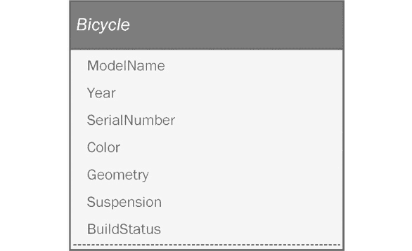

图 3.6 – 抽象自行车模型。

让我们更详细地看看这些属性：

+   `ModelName`：模型在公司网站上的名称。

+   `Year`：自行车的型号年份。所有自行车设计应每两年更新一次，以防止设计像 MegaBikeCorp 的那样过时。

+   `SerialNumber`：每辆从生产线下来的自行车的唯一标识符。

+   `Color`：自行车的颜色。为了保持初始成本较低，Kitty 将为每个型号定义一个具有有限颜色集合的枚举。

+   `Geometry`：这指的是自行车的车架配置。所有初始制造运行的自行车都是直立或躺式几何形状。这也可以被移动到枚举中。

+   `Suspension`：这指的是自行车上使用的减震器类型。减震器在山地自行车上最为重要，但您也可以在公路自行车、躺式自行车和一些巡航车上找到它们。可以争论说，这个属性只适用于山地自行车子类，但 Kitty 了解“分析瘫痪”。她决定现在将其放入超类中，而不是试图在第一次尝试时就使模型完美。她可以在事情变得更加具体或如果她闻到有问题的代码结构时，稍后总是可以重构它。

+   `BuildStatus`：Kitty 知道她的机器人控制系统需要了解自行车制造过程的当前状态，因此她决定包括一个枚举属性来保存此信息。

几个属性可以表示为枚举，它是一个固定的集合。在过去的岁月里，我们使用“魔法数字”来表示有限列表。程序员会为每个值分配一个整数。例如，为了表示悬挂类型的有限列表，我们可能会倾向于将它们编号为 0 到 3，因为总共有四种可能性。这使得维护变得困难，因为每个人都需要记住每个数字的含义。0 是全悬挂吗？硬尾的代码是什么？后来，我们变得聪明起来，为所有事物定义了常量：

```cs
const int FULLSUSPENSION = 0; 
const int FRONTSUSPENSION = 1; 
const int SEATPOSTSUSPENSION = 2; 
const int HARDTAIL = 3;
```

这更好，但它并不非常面向对象。您最终会得到数十行大写字母的丑陋常量定义。您可能会倾向于使用整数类型来模拟它们，因为您有机会分配一个任意的整数值。什么会阻止某人将其设置为 100，当潜在值应该是从 0 到 3 时？我们可以编写封装逻辑来强制我们的范围是 0 到 3。这都很好，但每次我们向阵容中添加一个新的悬挂时，我们都需要不断修改访问器逻辑。幸运的是，在 C# 中，我们在框的顶部有 `<<Enumeration>>` 标签。我们的自行车类使用四个枚举，如下所示：

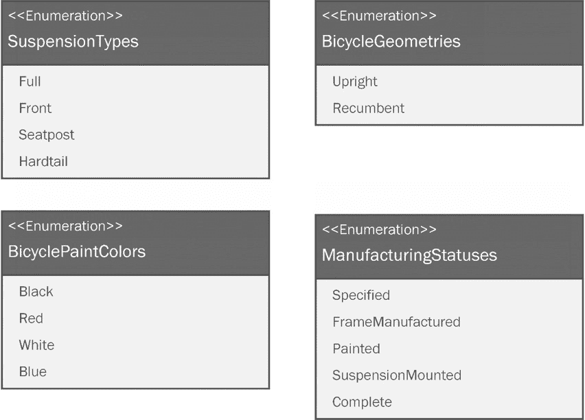

*图 3.7* – 定义了四个枚举来限制我们抽象自行车的几何形状、减震、颜色和当前制造状态的选项。枚举帮助我们保持对象状态干净、有效且易于阅读。

在进入模式之前，让我们先创建到目前为止所绘制的图形。首先，Kitty 将进行四个枚举：

+   `SuspensionTypes`

+   `BicycleGeometries`

+   `BicyclePaintColors`

+   `ManufacturingStatus`

这里是 `BicycleGeometries` 枚举：

```cs
public enum BicycleGeometries 
{ 
  Upright, Recumbent 
}
```

然后，她创建了一个用于减震类型的 `enum`：

```cs
public enum SuspensionTypes 
{ 
  Full, Front, Hardtail  
}
```

接下来是油漆颜色：

```cs
public enum BicyclePaintColors 
{ 
  Black, Red, White, Blue 
}
```

最后，Kitty 创建了一个用于制造状态代码的 `enum`：

```cs
public enum ManufacturingStatus 
{ 
  Specified, FrameManufactured, Painted, SuspensionMounted,
   Complete 
}
```

在处理完这些之后，让我们看看 `Bicycle` 基类是什么样的：

```cs
public abstract class Bicycle 
{ 
  protected string ModelName { get; init; } 
  private int Year { get; set; } 
  private string SerialNumber { get; } 
  protected BicyclePaintColors Color { get; init; } 
  protected BicycleGeometries Geometry { get; init; } 
  protected SuspensionTypes Suspension { get; init; } 
  private ManufacturingStatus BuildStatus { get; set; }
```

Kitty 创建了一个名为 `Bicycle` 的抽象类，就像她在 UML 模型中所做的那样。注意，*图 3.6* 中的类名被*斜体*标注，表示它是抽象的。接下来，她添加了属性。UML 模型故意省略了访问修饰符和类型，将这些留作程序员确定的实现细节。在这种情况下，就像许多初创项目一样，架构师和开发者是同一个人。

Kitty 将一些属性定义为受保护的，因为她打算从子类中操作它们。一些属性被标记为 `private`，因为适当地在更高层次上操作这些属性是合适的。

接下来，她转向构造函数，这是使用 `new` 关键字进行实例化时运行的函数：

```cs
  public Bicycle() 
  { 
    ModelName = string.Empty; 
    SerialNumber = Guid.NewGuid().ToString(); 
    Year = DateTime.Now.Year; 
    BuildStatus = ManufacturingStatus.Specified; 
  }
```

Kitty 在构造函数中为每个属性设置了默认值。目前，车型名称为空。她将在子类中更改它。序列号属性是一个生成的 GUID，这是一个保证始终唯一的字符串。`Year` 属性设置为当前年份，`BuildStatus` 设置为枚举中的第一个状态。

最后一步是添加 `Build` 方法。目前，`Build` 方法只是打印到控制台以显示逻辑是否正确工作。最终，这可以替换为 Phoebe 机器人系统的更复杂控制逻辑：

```cs
  public void Build() 
  { 
    Console.WriteLine($"Manufacturing a {Geometry.ToString()} frame..."); 
    BuildStatus = ManufacturingStatus.FrameManufactured; 
    PrintBuildStatus(); 

    Console.WriteLine($"Painting the frame {Color.ToString()}"); 
    BuildStatus = ManufacturingStatus.Painted; 
    PrintBuildStatus(); 

    if (Suspension != SuspensionTypes.Hardtail) 
    { 
      Console.WriteLine($"Mounting the {Suspension.ToString()} suspension."); 
      BuildStatus = ManufacturingStatus.SuspensionMounted; 
      PrintBuildStatus(); 
    } 
    Console.WriteLine("{0} {1} Bicycle serial number {2} manufacturing complete!", Year, ModelName, SerialNumber); 
    BuildStatus = ManufacturingStatus.Complete; 
    PrintBuildStatus(); 
  }
```

抽象类已经完成！接下来，Kitty 需要创建他们打算制造的自行车的具体子类：

+   `RoadBike`

+   `MountainBike`

+   `Recumbent`

+   `Cruiser`

首先，她创建了 `RoadBike` 类：

```cs
public class RoadBike : Bicycle 
{ 
  public RoadBike() 
  { 
    ModelName = "Hillcrest"; 
    Suspension = SuspensionTypes.Hardtail; 
    Color = BicyclePaintColors.Blue; 
    Geometry = BicycleGeometries.Upright; 

  }   
}
```

`RoadBike` 类从 `Bicycle` 类继承，构造函数设置了类的默认值。车型名为 `Hillcrest`，这个名字来自 Phoebe 大学校园西边的街道。公路自行车通常没有减震器，所以她将减震类型定义为 `Hardtail`。初始型号只有一种颜色，这款是蓝色的。由于这不是一款躺式自行车，所以几何形状设置为 `Upright`。

在处理完 Phoebe 最喜欢的公路自行车之后，Kitty 开始建模她最喜欢的——山地自行车：

```cs
public class MountainBike : Bicycle 
{ 
  public MountainBike() 
  { 
    ModelName = "Palo Duro Canyon Ranger"; 
    Suspension = SuspensionTypes.Full; 
    Color = BicyclePaintColors.Black; 
    Geometry = BicycleGeometries.Upright; 
  } 

}
```

奇蒂以德克萨斯州潘哈德尔的帕洛杜罗峡谷命名山地自行车。很少有人知道帕洛杜罗峡谷是美国第二大峡谷，仅次于大峡谷。帕洛杜罗峡谷是德克萨斯州一些最好的山地自行车骑行地。她希望设计有侵略性的外观，因此选择了`黑色`作为颜色。自然地，她不是一个会节省开支的人，因此她设计了全悬挂式设计——自行车前后都有减震器，以应对小径上可能出现的任何障碍。如前所述，由于它不是躺式，其几何形状被定义为`直立`。

现在，需要创建`躺式`自行车的类别：

```cs
public class Recumbent : Bicycle 
{ 
  public Recumbent() 
  { 
    ModelName = "Big Bend"; 
    Suspension = SuspensionTypes.Front; 
    Color = BicyclePaintColors.White; 
    Geometry = BicycleGeometries.Recumbent; 
  }   
}
```

奇蒂决定将这辆自行车命名为*大弯*。大弯地区是一个沙漠，有一个山脉，那里有许多山地自行车骑行机会。然而，有很长一段铺砌和不铺砌的道路，大致上是直的。躺式自行车在这些环境中表现良好，因为它们的设计允许骑行者更快、更远地骑行而不会感到疲劳。躺式自行车在拖曳拖车方面也相当不错。一个想要露营的人可以携带足够的水和补给。由于自行车的名字来源于铺砌和不铺砌的道路，奇蒂选择了前悬挂。躺式自行车已经有一个很好的座椅，所以后悬挂不会增加很多好处，而且会使自行车更贵。自然地，几何形状被设置为`躺式`。

最后一种自行车是休闲车：

```cs
public class Cruiser : Bicycle
{
    public Cruiser()
    {
        ModelName = "Galveston Cruiser";
        Suspension = SuspensionTypes.Hardtail;
        Color = BicyclePaintColors.Red;
        Geometry = BicycleGeometries.Upright;
    }
}
```

奇蒂以她与家人在海边度假的美好回忆为名，将这辆自行车命名为*加尔维斯顿休闲车*。加尔维斯顿是墨西哥湾的一个中等城市。加尔维斯顿有海滩、商业和度假游轮的码头，以及一个充满活力的历史区，称为*斯特兰德*。斯特兰德充满了独一无二的商店、咖啡馆、酒吧、博物馆和为游客提供的娱乐活动。在斯特兰德的停车费用昂贵，而且往往很难找到停车位。除了阿尔派因不太为人所知的街道外，加尔维斯顿的斯特兰德是骑休闲车的完美场所。

# 没有模式实现

奇蒂正在一路高歌猛进！你知道那是怎么回事。她在一小时内就完成了枚举、基类和子类的编写。她真的在快速前进，而且她不想失去速度。奇蒂屈服于诱惑，为程序的最终实现编写了主入口点的代码：

```cs
using BumbleBikesLibrary; 
const string errorText = "You must pass in mountainbike, cruiser, recumbent, or roadbike"; 
```

我们从命令行程序中获取一个参数，并使用它来确定要创建什么。如果传递了一个字符串，`args`的长度将大于零，我们可以做我们的事情。否则，我们可以责备我们愚蠢的用户，因为他们认为我们的软件能读懂他们的心思：

```cs
if(args.Length > 0) 
{ 
```

剪切和规范化命令行输入是个好主意。这意味着我们忽略参数前后多余的空格。我们通过强制将所有内容转换为上档或小写来忽略大小写的情况，以便我们可以将输入与我们的预期值进行比较。比较无论用户输入的是 *mountainbike*、*MOUNTAINBIKE* 还是甚至 *mOuNtAiNbIkE* 都能正常工作：

```cs
  var bicycleType = args[0].Trim().ToLower(); 
  Bicycle bikeToBuild; 
```

接下来是一个基于输入的 `switch` 语句。输入确定要构建的内容，并返回相应的类实例：

```cs
  switch (bicycleType) 
  { 
    case "mountainbike": 
      bikeToBuild = new MountainBike(); 
      break; 
    case "cruiser": 
      bikeToBuild = new Cruiser(); 
      break; 
    case "recumbent": 
      bikeToBuild = new Recumbent(); 
      break; 
    case "roadbike": 
      bikeToBuild = new RoadBike(); 
      break; 
```

如果用户传递了一个我们在 `switch` 中没有考虑到的参数，比如 `MotorCycle` 或 `PeanutButter`，我们编写并抛出一个异常：

```cs
    default: 
      Console.WriteLine(errorText); 
      throw new Exception("Unknown bicycle type: " +       bicycleType); 
  } 

  bikeToBuild.Build(); 
}  
```

如果没有将参数传递到命令行程序中，我们显示一个错误消息，指示用户提供所需的参数：

```cs
else 
{ 
  Console.WriteLine(errorText); 
}
```

实际上，基蒂正在使用命令行参数，并使用软件的主入口点 `Program.cs` 作为将实例化正确自行车类型的类。她试了一下，结果成功了！基蒂巧妙地利用了 Liskov 替换原则，通过使用抽象基类作为 `bikeToBuild` 变量的类型，这使得她可以根据她想要构建的自行车类型实例化适当的子类。如果她在 MegaBikeCorp 工作，她将无法做到这一点。她可能有一个爱挑剔的老板会告诉她清理代码并发货。幸运的是，她是个个体户，她内心深处的一个声音在抱怨，“*你可以做得更好。*”

基蒂的第一个实现可以在本章示例源代码中的 `NoPattern` 项目中找到。

# 简单工厂模式

基蒂决定对模式进行一些研究。她在大学时并没有计算机科学专业，只是在她的编码课程中听说过模式。基蒂四处寻找，并找到了一些关于称为 **简单工厂模式** 的内容的博客文章。太好了，她心想。这是她大学以来的第一个编码项目，而且她对自己的代码寄予厚望（看我在这里做了什么？），她决定以名字中的 *simple* 为起点。

根据博客文章，她只需要将实例化逻辑移动到自己的类中，这个类被称为 **工厂类**。文章中说，这样做是为了将实例化逻辑与主程序解耦。这应该让她更接近遵循开闭原则，并使她的代码更加灵活。

她回到她的集成开发环境（IDE），并添加了一个名为 `SimpleBicycleFactory` 的类，并将实例化逻辑移动到那里。逻辑与之前展示的相同：

```cs
public class SimpleBicycleFactory 
{ 
  public Bicycle CreateBicycle(string bicycleType) 
  { 
    Bicycle bikeToBuild; 
    switch (bicycleType) 
    { 
      case "mountainbike": 
        bikeToBuild = new MountainBike(); 
        break; 
      case "cruiser": 
        bikeToBuild = new Cruiser(); 
        break; 
      case "recumbent": 
        bikeToBuild = new Recumbent(); 
        break; 
      case "roadbike": 
        bikeToBuild = new RoadBike(); 
        break; 
      default: 
        throw new Exception("Unknown bicycle type: " +         bicycleType); 
    } 
    return bikeToBuild; 
  } 
} 
```

然后，基蒂重构了她的 `Program.cs` 文件以使用简单工厂：

```cs
using SimpleFactoryExample; 

const string errorText = "You must pass in mountainbike, cruiser, recumbent, or roadbike"; 

if (args.Length > 0) 
{ 
  var bicycleType = args[0].Trim().ToLower(); 
```

这里是不同的部分——基蒂使用 `SimpleBicycleFactory` 类而不是直接运行一个 `switch` 语句：

```cs
  var bicycleFactory = new SimpleBicycleFactory(); 
  var bikeToBuild = bicycleFactory.CreateBicycle(bicycleType); 
  bikeToBuild.Build(); 
} 
else 
{ 
  Console.WriteLine(errorText); 
}
```

根据定义，重构意味着你在不引入任何新功能的情况下改进代码的结构或性能。Kitty 通过使她的代码更加优雅实现了这一点。

当逻辑在`Program.cs`文件中是自由范围的，它就被锁定只能用于那个程序。Kitty 明智地意识到她和，毫无疑问，Phoebe 将想要创建其他可以使用创建逻辑的程序。将逻辑封装到类中是一个明显的改进。

在晚上关闭笔记本电脑之前，Kitty 注意到了社交媒体上她编程教授的一条帖子。她询问他最近怎么样，在聊天中，她提到了她的代码项目。教授说他很乐意看看，于是她给他发了一个 GitHub 链接。

Kitty 的教授将要审查的代码可以在本章示例源代码中的`SimpleFactoryPattern`项目中找到。

# 工厂方法模式

Kitty 的旧教授看了看代码，告诉她这个更新的代码是一个改进，但她没有使用任何模式。简单工厂被归类为**编程习语**。习语就像模式一样，它们经常出现。当你看到它们时，你会认出它们，但它们并没有完全解决常见问题。也许最著名的编程习语是 Kernighan 和 Ritchie 所著的《C 程序设计语言》一书中创造的，也被称为*The K&R book*。正是在这本书中，我们看到了我们的第一个*Hello, World*程序。*Hello, World*是一个习语。它通常是你学习新语言时尝试的前几行代码。它通过鼓励灵活性和代码重用，并没有解决任何工业级问题。

Kitty 意识到她曾在她选择的 C# IDE 中看到过这个习语，那就是 JetBrains *Rider*。当你创建一个控制台应用程序，就像她一直在做的那样，你首先看到的是这段代码，这是 IDE 作为项目起点的生成代码：

```cs
Console.WriteLine("Hello, World!");
```

我包括了一个`Hello,` `World`程序的例子。你可以在章节源代码中的`HelloWorld`项目中找到它。是的，我确实包括了一个`Hello, World`程序，因为我非常注重细节。现在，回到故事中。

第二天，Kitty 决定全面研究创建型模式。她想要正确地做这件事。阅读了一些资料后，Kitty 发现了几种被称为工厂模式的模式：

+   简单工厂，我们已经确定它不是一个模式，但它经常被误认为是。

+   工厂模式，它是对简单工厂的一个轻微改进。

+   工厂方法模式，它真正抽象了当你需要实例化多种对象类型时的创建过程。

+   抽象工厂模式，它目前似乎比必要的更复杂，因为它涉及到创建对象组。

凯蒂确定了她认为适合她问题的完美模式：**工厂方法模式**。她也认为讽刺的是，她的软件设计的起点是使用工厂模式，因为她正在模拟一个将来将成为物理工厂的东西。工厂模式之所以被称为工厂模式，是因为它们接受一组输入并产生一个具体的对象作为输出。简单的工厂在表面上完成了这个任务，但依赖于这种习语而不是真实模式有一些问题。习语不如它可能的那样灵活。Bumble Bikes Inc. 将有两个工厂地点制造不同类型的自行车。简单工厂可以创建任何自行车，但与此同时，它被锁定在制造所有四种。将这一点与真实工厂联系起来，你可以看到要求工厂制造每种类型的自行车可能是浪费的，而不是它将要制造的两种。

在我们的软件设计中，工厂不应了解它将要创建的内容。它应该足够灵活，可以制造任何类型的自行车。我们可以这样构建，以便我们可以创建一个能够生产所有子类子集的工厂。子类决定什么可以和应该被具体化。我们可以这样表示通用的工厂方法模式：


图 3.8 – 工厂方法模式的通用图。

基于数字，让我们回顾一下图中的每一部分：

1.  工厂方法模式从定义公共行为或一组行为的接口开始。一般来说，使用接口比使用基类更灵活，因为在 C 中，你不受继承规则的限制。也就是说，在 C# 中，任何子类可能只有一个父类。不支持多重类继承。在接口的情况下，任何类都可以实现所需的不同接口。

1.  当我们讨论工厂方法模式时，我们称工厂创建的对象为 `products`。这些是工厂将要生产的具体产品。它们都将实现公共产品接口。在实践中，你不需要坚持使用与前面图示相同的名称。

1.  工厂方法有一个包含工厂方法的 `Creator` 类。工厂方法被编码为返回 `Product` 接口，以便它可以返回实现该接口的任何产品。它不依赖于特定的抽象基类，正如凯蒂最初的重构那样。这些创建者都是抽象的，并意味着在具体的创建者子类中被覆盖。这就是我们自行车工厂所需的灵活性所在。

1.  具体创建者提供实际的 concrete 类。所有你的创建逻辑都将在这里。

让我们记住凯蒂和菲比的计划细节。这个计划需要两个工厂——一个在达拉斯制造公路自行车和休闲自行车，另一个在阿尔卑斯山制造山地自行车和巡航自行车。凯蒂走向她的白板，并绘制了她版本的先前图表：

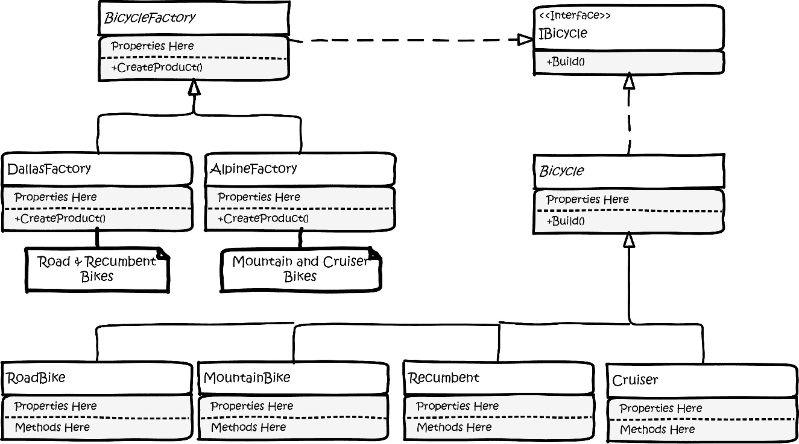

图 3.9 – 凯蒂的工厂方法设计理念的白色板草图。

这看起来相当不错！凯蒂决定将她抽象自行车类中的大部分内容移动到一个她称为 `IBicycle` 的接口中。这并不意味着她应该丢弃抽象类，但抽象类实现接口很容易。一旦她这样做，她就可以传递接口，这比使用基类更灵活。

抽象自行车基类除了实现 `IBicycle` 接口外不会改变。所有的自行车子类都不会有任何变化。

她确实需要添加一些创建类。她将需要创建一个抽象的 `BicycleCreator` 类，这个类将被她可能需要的尽可能多的具体创建类所继承。

这符合设计问题，因为我们需要模拟两个实际的工厂。一个被称为 `DallasCreator`，将制造公路自行车和休闲自行车，另一个被称为 `AlpineCreator`，将生产山地自行车和巡航自行车。

我们的设计对修改是封闭的。我们再也不需要与基类和接口打交道了。然而，设计对扩展也是开放的。随着产品线的未来扩展，我们可以继续添加工厂，每个工厂可以专门生产任何一组产品。只需创建 `Bicycle` 的新子类即可添加新自行车。

剩下的只有打字了。

凯蒂将 `IBicycle` 接口添加到她的 `class` 库中：

```cs
public interface IBicycle 
{ 
  public string ModelName { get; set; } 
  public int Year { get; } 
  public string SerialNumber { get; } 
  public BicycleGeometries Geometry { get; set; } 
  public BicyclePaintColors Color { get; set; } 
  public SuspensionTypes Suspension { get; set; } 
  public ManufacturingStatus BuildStatus { get; set; } 
  public void Build(); 
}
```

然后，她修改了 `Bicycle` 基类。在接口中定义非公共成员是不可能的。C# 通常要求接口中定义的属性和方法是 `public`。接口中的非公共成员没有意义。它们将容纳实现细节，而不是供公众消费的东西，这是接口的目的。底线是，如果我们想在 `Bicycle` 基类上要求任何东西，我们需要将访问修饰符更改为 `public`。我们通常希望避免在生产中发布后更改类。在这个阶段，我们还没有这样做。我们可以更改访问修饰符，或者避免在接口中定义这些元素，只保留 `build` 函数。凯蒂决定采用她已输入的更完整的接口版本：

```cs
public abstract class Bicycle : IBicycle 
{ 
  protected Bicycle() 
  { 
    ModelName = string.Empty; // will be filled in subclass                               // constructor 
    SerialNumber = new Guid().ToString(); 
    Year = DateTime.Now.Year; 
    BuildStatus = ManufacturingStatus.Specified; 
  } 

  public string ModelName { get; set; } 
  public int Year { get; } 
  public string SerialNumber { get; } 
  public BicyclePaintColors Color { get; set; } 
  public BicycleGeometries Geometry { get; set; } 
  public SuspensionTypes Suspension { get; set; } 
  public ManufacturingStatus BuildStatus { get; set; }
```

接下来，我们需要我们的创建类。凯蒂从抽象类开始，她将称之为 `BicycleCreator`：

```cs
using BumbleBikesLibrary;
namespace FactoryMethodExample;
public abstract class BicycleCreator
{
    public abstract IBicycle CreateProduct(string modelName);
}
```

接下来是两个具体的创建类，从 `DallasCreator` 开始：

```cs
using BumbleBikesLibrary;
namespace FactoryMethodExample;
public class DallasCreator : BicycleCreator
{
    public override IBicycle CreateProduct(string modelName)
    {
        return modelName.ToLower() switch
        {
            "hillcrest" => new RoadBike(),
            "big bend" => new Recumbent(),
            _ => throw new Exception("Invalid bicycle model")
        };
    }
}
```

紧接着是 `AlpineCreator` 类：

```cs
using BumbleBikesLibrary;
namespace FactoryMethodExample;
public class AlpineCreator : BicycleCreator
{
    public override IBicycle CreateProduct(string modelName)
    {
        return modelName.ToLower() switch
        {
            "palo duro canyon ranger" => new MountainBike(),
            "galveston cruiser" => new Cruiser(),
            _ => throw new Exception("Invalid bicycle model")
        };
    }
}
```

凯蒂需要一个快速测试，所以她将此代码添加到 `Program.cs` 中：

```cs
using FactoryMethodExample;
Console.WriteLine("Let's make some bicycles"); 

var dallasBicycleFactory = new DallasCreator();
var phoebesBike = dallasBicycleFactory.CreateProduct("HILLCREST"); 
phoebesBike.Build(); 

var alpineBicycleFactory = new AlpineCreator(); 
var kittysBike = alpineBicycleFactory.CreateProduct("PALO DURO CANYON RANGER"); 
kittysBike.Build();
```

现在是检验真伪的时刻。Kitty 在 IDE 中点击运行按钮，并坐到椅子的边缘，随着代码编译：

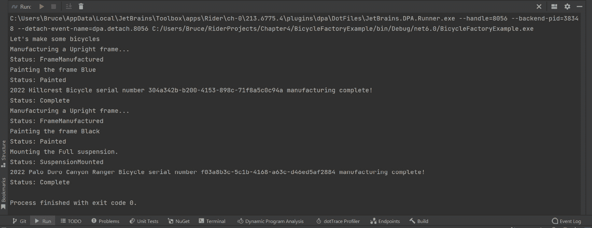

图 3.10 – 哇！它工作了！工厂方法模式正在 Kitty 的代码中运行！

Kitty 提交并推动了她的代码，你可以在本章源代码中的 `FactoryMethodExample` 项目中查看。别忘了 `IBicycle` 接口已被添加到 `BumbleBikesLibrary` 项目中。

# 抽象工厂模式

在 Kitty 使用工厂方法完成初步设计后，Phoebe 在 GitHub 上检查了 Kitty 的工作。Phoebe 已经完成了创建车架的工具，她正在努力完成其他一些制造自行车的部件。

“*Kitty！*，” Phoebe 说，“*这段代码将允许我们创建自行车对象，但这有点太抽象了。自行车由许多不同的部件组成。*” 经过长时间的讨论，两人决定专注于制造每种自行车类型的自行车框架和把手。其他部件，如轮子、轮胎、刹车和齿轮，可以在自行车初始生产中外包。

Phoebe 想到这些部件可以按系列制造。公路自行车使用下弯把手，而山地自行车使用平面把手设计。你不应该互换这些部件。公路自行车上的平面把手会创造一个新的自行车类别，称为 *砾石自行车* 或 *混合型*。我们目前不感兴趣改变我们的产品线。山地自行车上的下弯把手完全没有意义，而且很危险。对于物理自行车工厂来说，模仿软件模式是有意义的。姐妹们得出结论，更好的选择可能是使用 **抽象工厂模式**。

这是一个很多人做错的模式。一个常见的误解是抽象工厂模式仅仅涉及使你的工厂类抽象化。不是这样！抽象工厂模式旨在创建相关对象，并将这些对象从客户端对具体类型的依赖中解耦。

我们的设计包括四种自行车系列：

+   路自行车（希尔克里斯特）

+   山地自行车（帕洛杜罗峡谷管理员）

+   休闲自行车（大弯）

+   巡游自行车（加尔维斯顿巡游）

每种类型都有特定的车架类型，以及不同的把手设计。我们可以说我们将制造四种 *系列* 的自行车组件。当你遇到涉及相关对象系列的问题时，你应该自动考虑抽象工厂模式。

抽象工厂模式的第二个好处是它解耦了客户端对任何特定具体对象的依赖。让我们看看以下图表：

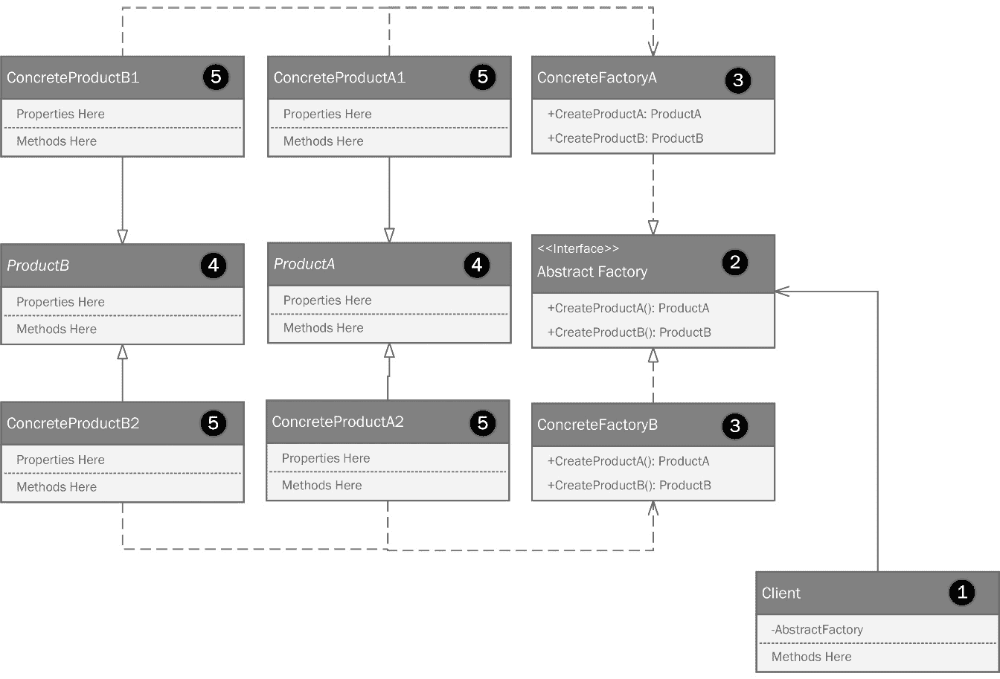

图 3.12 – 抽象工厂模式。

我从右到左绘制了这些部分，从客户端开始：

1.  客户端是任何消耗由抽象工厂创建的对象的代码。在这里，我展示了一个客户端对象上的私有引用，指向一个抽象工厂作为属性。

1.  客户端依赖于 `AbstractFactory` 接口。此接口定义了两个方法。通常，我不在 UML 中放置返回类型，但在这个情况下，这确实非常重要。接口将引用一对抽象类。也许你现在开始看到这要去哪里了。由抽象工厂创建的最终产品将是一个继承自这些抽象类之一的具体类。

1.  对于每种产品系列，都展示了两个具体的工厂。我们的需求有四个产品系列，但这个图仅展示了两个以保持简单。你可以根据需要添加任意多的具体工厂。

1.  使用两个抽象类来定义两种类型的对象，这些对象独立于具体对象的家庭。

1.  最终的具体产品继承自抽象产品。菲比和凯蒂可以在他们的过程中添加更多具体细节，因为他们不仅仅在制作自行车——他们还在制作把手。每个物理工厂都应该制作所需的框架和把手。

姐妹俩走向白板，并绘制出抽象工厂模式的设计。为了保持简单，她们将只绘制公路自行车和山地自行车：

![图 3.13 – 菲比和凯蒂使用抽象工厂模式的白板设计。(img/B18605_Figure_4.12.jpg)]

图 3.13 – 菲比和凯蒂使用抽象工厂模式的白板设计。

在这个程序中，客户端只是当你创建一个命令行项目时，你的 IDE 创建的 `Program.cs` 文件。

图表显示 `Program.cs` 并依赖于由 `IBicycleFactory` 创建的对象。注意箭头的不同。这些在 UML 中很重要。实线上的封闭箭头表示继承。虚线上的封闭箭头表示接口的实现。封闭线上的开放箭头表示关联。客户端依赖于 `IBicycleFactory` 后面的某个东西。`Program.cs` 类有一个私有字段来保存实现此接口的对象的实例，这可以是 `RoadBicycleFactory` 或 `MountainBicycleFactory`，如前图所示。

这里值得注意，菲比将 `IBicycleFactory` 绘制为一个字面接口。对接口的代码级理解可能是一个字面接口或一个抽象类，因为它们都可以用来定义对象必须采取的结构。

我们有实现`IBicycleFactory`接口的具体系列类，分别称为`RoadBicycleFactory`和`MountainBicycleFactory`。每个具体工厂负责创建一个对象家族。在我们的例子中，家族是`Road`和`Mountain`。`RoadBicycleFactory`可以根据依赖关系创建`RoadBicycleFrame`和`RoadBicycleHandlebars`，但你可以看到`RoadBicycleFrame`和`RoadBicycleHandlebars`分别继承自`BicycleFrame`和`BicycleHandlebars`抽象类。

当客户端请求自行车车架和一组把手时，它可以引用抽象类。由于 Liskov 替换原则，客户端不需要严格耦合到任何具体类。这使得我们的客户端非常灵活。随着我们的自行车家族阵容的变化，我们不需要修改客户端，因为客户端不知道工厂返回的是什么。客户端只知道它有名为`CreateBicycleFrame`和`CreateBicycleHandlebars`的方法。

Phoebe 在仓库中创建了一个分支。她知道你应该始终在分支上工作，于是开始编写代码。她从`IBicycleFactory`接口开始。

```cs
using BumbleBikesLibrary.BicycleComponents.BicycleFrame;
using BumbleBikesLibrary.BicycleComponents.Handlebars;

namespace BicycleAbstractFactoryExample;

public interface IBicycleFactory
{
  public IFrame CreateBicycleFrame();
  public IHandlebars CreateBicycleHandleBars();
}
```

注意前两个`using`语句。由于我们开始将自行车分解成组件，Kitty 和 Phoebe 决定将这些组件重构到`BumbleBikesLibrary`中的`BicycleComponents`命名空间内。这次重构与模式无关，只是为了让代码更加有序。你可以在 GitHub 仓库中找到本章的 BumbleBikesLibrary 中的组件。

姐妹俩按照书中的方法进行编码。所有内容都输入到接口中以保持灵活性。我们正在添加处理创建车架和把手的方法，这两个由接口指定的相关类。自然，我们可以添加更多。`BicycleComponents`命名空间中还有更多组件类。我们在这里只保留两个以保持简单。如果你想练习，看看你是否可以将其他组件，如座椅、传动系统和刹车，添加到模式代码中。

接下来，Kitty 和 Phoebe 需要在具体的工厂中工作。这些类只在这个项目中使用，所以你可以在 GitHub 上书籍示例源代码的`BicycleAbstractFactoryExample`项目中找到它们。记住，*抽象*可以指接口或*抽象类*。在这种情况下，*抽象工厂*的抽象部分就是这个接口。Kitty 根据`IBicycleFactory`接口编写了`MountainBicycleFactory`：

```cs
using BumbleBikesLibrary.BicycleComponents.BicycleFrame;
using BumbleBikesLibrary.BicycleComponents.Handlebars;

namespace BicycleAbstractFactoryExample;

public class MountainBicycleFactory : IBicycleFactory
{
  public IFrame CreateBicycleFrame()
  {
    return new MountainBikeFrame();
  }

  public IHandlebars CreateBicycleHandleBars()
  {
    return new MountainBikeHandlebars();
  }
}
```

具体工厂负责创建相对于我们创建的对象家族所需的具体对象。在这种情况下，Kitty 正在制作山地自行车的部件，所以所有返回的部件都是针对该家族的。可以添加更多的产品家族，而不需要修改抽象工厂。

下面是 Phoebe 为`RoadBicycleFactory`类编写的代码，它也扩展了`IBicycleFactory`接口：

```cs
using BumbleBikesLibrary.BicycleComponents.BicycleFrame;
using BumbleBikesLibrary.BicycleComponents.Handlebars;
namespace BicycleAbstractFactoryExample;
public class RoadBicycleFactory : IBicycleFactory
{
  public IFrame CreateBicycleFrame()
  {
    return new RoadBikeFrame();
  }

  public IHandlebars CreateBicycleHandleBars()
  {
    return new RoadBikeHandlebars();
  }
}
```

我们现在已经实现了抽象工厂模式，制造出两种可能的产品组件，属于两种可能的产品系列。让我们看看客户。菲比写道：

```cs
using BicycleAbstractFactoryExample;

Console.WriteLine("Let's make some bicycles!");

IBicycleFactory roadBikeFactory = new RoadBicycleFactory();

var frame = roadBikeFactory.CreateBicycleFrame();
var handlebars = roadBikeFactory.CreateBicycleHandleBars();

Console.WriteLine("We just made a road bike!");
Console.WriteLine(frame.ToString());
Console.WriteLine(handlebars.ToString());
```

我们使用`RoadBikeFactory`制造了一辆公路自行车！这里的关键是使用接口作为工厂类型。这样编码可以使更改工厂而不直接依赖于具体的工厂类成为可能。你可以看到控制台输出显示了操作的结果。菲比继续编写代码，使用`MountainBikeFactory`生成一辆山地自行车：

```cs
IBicycleFactory mountainBikeFactory = new MountainBicycleFactory();
frame = mountainBikeFactory.CreateBicycleFrame();
handlebars = mountainBikeFactory.CreateBicycleHandleBars();
Console.WriteLine("We just made a mountain bike!");
Console.WriteLine(frame.ToString());
Console.WriteLine(handlebars.ToString());
```

对于菲比和凯蒂可能梦想制造的任何新型自行车，都可以重复同样的过程。

# 建造者模式

菲比完成了抽象工厂的实现，然后回到设计自行车工厂的机器人部分。你有多少次认为某个工作或项目很简单，结果发现一旦你开始着手做，事情比你所意识到的要复杂得多？

菲比和凯蒂对工程、设计和软件开发都是新手。菲比对围绕建造自动化工厂的设计问题的独特理解随着时间的推移而巩固。她意识到制造自行车比她最初想象的要复杂。姐妹俩手工制作了原型。他们能够使用木材制作车架，并使用现成的部件制作其他部分。他们现在致力于使用轻质铝合金自行制作车架和把手。

菲比意识到车架是难点。其他组件，如车轮、刹车、传动系统以及把手，可以很容易地作为自动化过程的一部分内部制造。

自然，这增加了机器及其软件的复杂性。菲比给凯蒂打电话。

“*嘿，妹妹，抽象工厂模式对你怎么样？*”凯蒂问。

“*这没问题，但我一直在想，*”菲比回答说。

“*哎呀。每次你这么做，爸爸的信用卡就会受到考验。你有什么想法？*”凯蒂问。

菲比向凯蒂讲述了她用同一种铝合金制造所有部件的想法。“*有些部件需要加固，但结果将是一辆比我们最初想象的更轻、更便宜的自行车，*”菲比说。凯蒂喜欢这个主意。姐妹俩之前很兴奋，但现在更加激动。菲比说：“*我会用爸爸的信用卡购买制造前几辆自行车所需的铝合金。*”凯蒂回答说：“*太好了。当你这么做的时候，我会把你的想法融入到控制软件中。你把分支合并到主分支上了，对吧？*”

凯蒂从 *GitHub* 拉取了最新的代码并开始了一个新的分支。她开始认真思考如何完成编写一个过程，这个过程可以根据客户可能有的任何规格来构建一辆完整的自行车。姐妹们有一套四辆自行车，第一版有有限的选项。凯蒂不想把自己的思考和软件设计锁定在只构建那四辆自行车上。那会使其成为一个烟囱系统。凯蒂走向白板。她意识到她可能不得不放弃到目前为止在抽象工厂模式中取得的进展。不同的模式可能不仅仅是他们迄今为止所做工作的直接演变。她知道基本结构将保持不变。自行车总是需要车架、座椅、把手、轮子、刹车和传动系统。

新问题涉及到创建一个复杂对象。构建将需要多个步骤，而不是像早期设计中那样简单的 `BuildBicycle` 方法，该方法创建车架和把手。

沉思中，她的幻想被手机响亮的嗡嗡声打断。手机放在她的金属工作台上，震动表明她收到了一条短信，几乎把一小堆螺丝和一些工具从桌边弹了出去：


图 3.15 – 她检查屏幕。有一条来自她父亲的信息。

哎呀。凯蒂决定撕下那个众所周知的创可贴，给她的父亲打电话。也许她对最新进展的兴奋可以减轻打击。“*爸爸会理解的*，”她低声对自己说，好像她正在大声试图说服自己。

凯蒂和菲比的父亲是一位软件工程师。他几年前因为总是在社交媒体上谈论疯狂的阴谋论而失去了工作。他决定退休，在与他的大家庭发生争执后，凯蒂和菲比的父母搬到了美国南部俄克拉荷马州的一个小镇，这个小镇位于德克萨斯州边境以北，那里的道路没有铺路，互联网接入也不存在。这正是他喜欢的方式。凯蒂拨打了电话。

当他接电话时，他父亲的语言，我们可以说是丰富多彩的。这不是菲比第一次欠下账单。她曾经一天之内就欠下了超过一千美元。大多数少女都是因为旅行或购物而欠下账单。菲比的账单来自几家知名的工业供应商，一个模具车间和一个花生酱工厂。她从未坦白她在做什么，但不久之后，她进入了工程学院，那件事几乎被遗忘。

契蒂安抚了他的怒气，并告诉他正在发生的事情。“*你应该看看* **建造者模式**，”他说。“*是的，我曾经写过一本关于模式的书籍，我记得这个。它用于使用一系列灵活的步骤来创建复杂对象。听起来这好像是你需要的。哦，还有，你们得还我人情！我想在公司里得到股份，还有你们两个建造的第一辆自行车。””

“*当然，爸爸，*”契蒂用她最甜美的声音说，这通常是当她想要冰淇淋但已经被告诉“*不*”时才会使用的。她决定不责备他没有告诉她他写过一本关于模式的书籍。当菲比 11 岁、契蒂 12 岁时，她的父亲就教她们编程。他多年来出版了许多书籍和视频。当然，他也写过一本关于模式的。在那个时刻，契蒂的电话变得静默。很难听到任何声音。她的父亲还在和她说话，但她只听到了几个词。关于平行时空和时间递归的事情。“*他有时会说些很傻的话。他可能又重新看了《神秘博士》的老剧集，*”她心想。电话挂断了。

契蒂耸了耸肩，开始研究建造者模式。她父亲的书籍已经绝版多年，但它却是一本国际畅销书，因此她能够在引用他的许多更近期的书籍中找到一些图表：

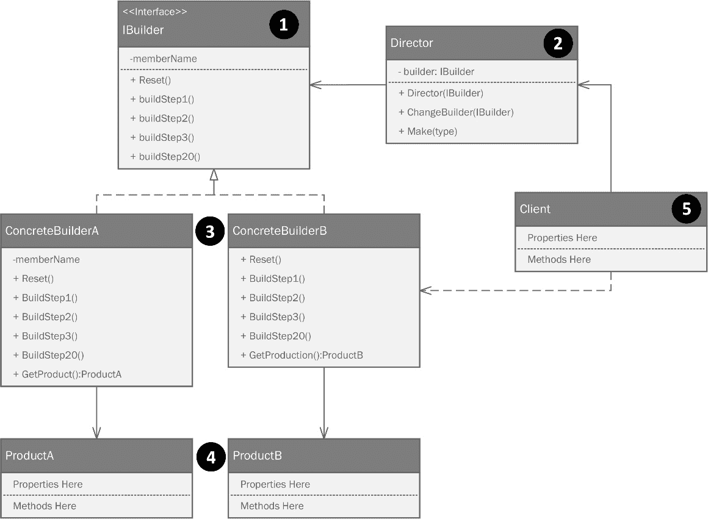

图 3.16 – 建造者模式由一个建造者接口、一个控制创建过程的导演和一个基于建造者接口的具体建造者来产生特定产品组成

让我们更详细地看看这个图表：

1.  建造者模式有两个重要的部分。第一个是 IB。记住，这可以是一个字面接口或一个抽象类。我将坚持使用真正的接口以保持灵活性。`Builder`接口定义了将在一组具体建造类中出现的所有方法。建造者模式中你总会找到的第二个部分是`Director`类。

1.  创建了一个`Director 类`，其中包含以逐步方式定义创建过程的逻辑。

1.  一组具体建造类定义了可以创建的每种对象类型。

1.  根据导演中包含的逻辑，不同的产品会从具体建造类中产生。

契蒂带着这些新知识回到她的白板上：

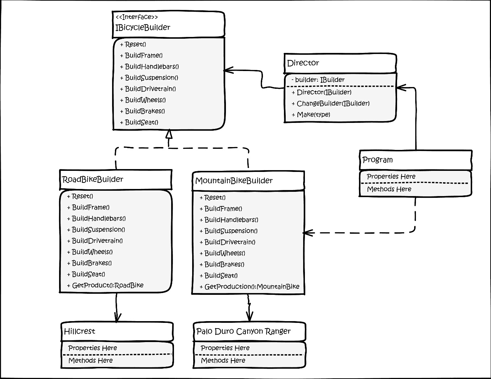

图 3.17 – 契蒂在白板上实现的建造者模式。

基蒂对这一款很兴奋。经过尝试了几种不同的模式后，她觉得这一款最能代表姐妹们想要达成的目标。你可以在本章 GitHub 仓库中的`BicycleBuilderExample`项目中找到这段代码。

基蒂首先为建造者将要生产的内容创建了一个抽象——即产品。她创建了一个名为`IBicycleProduct`的接口：

```cs
public interface IBicycleProduct
{
  public IFrame Frame { get; set; }
  public ISuspension Suspension { get; set; }
  public IHandlebars Handlebars { get; set; }
  public IDrivetrain Drivetrain { get; set; }
  public ISeat Seat { get; set; }
  public IBrakes Brakes { get; set; }
}
```

接口包含了制作完整自行车所需的一切。在这里，我们有一些设计上的奢侈。所有自行车都遵循相同的接口。我们不再需要考虑公路车或山地车。公路车只是一个部件的集合：

+   路车车架

+   硬尾悬挂（即完全没有悬挂）

+   路车把手（即下弯的曲线把手）

+   公路车传动系统（即正常长度的链条和一套 3 个前齿轮和 8 个后齿轮，总共 24 速）

+   刹车卡钳

+   标准的、便宜的、非常不舒服的座椅

菲比和基蒂在实习期间学习了有关座椅的知识。自行车制造商知道座椅是一个非常个人化的选择，如果给骑手选择，没有人会挑选相同的座椅。他们都会销售配备便宜、不舒服座椅的自行车，并提供单独的产品来升级座椅以满足骑手的偏好。这降低了自行车的制造成本，并让他们的经销商有机会加价，同时提供座椅安装服务。

基蒂为建造者编写了一个通用的自行车对象，称为`BicycleProduct`：

```cs
public class BicycleProduct : IBicycleProduct
{
  public IFrame Frame { get; set; }
  public ISuspension Suspension { get; set; }
  public IHandlebars Handlebars { get; set; }
  public IDrivetrain Drivetrain { get; set; }
  public ISeat Seat { get; set; }
  public IBrakes Brakes { get; set; }

  public override string ToString()
  {
    var fullDescription = new StringBuilder("Here's your new bicycle:");
    fullDescription.AppendLine(Frame.ToString());
    fullDescription.AppendLine(Suspension.ToString());
    fullDescription.AppendLine(Handlebars.ToString());
    fullDescription.AppendLine(Drivetrain.ToString());
    fullDescription.AppendLine(Seat.ToString());
    fullDescription.AppendLine(Brakes.ToString());

    return fullDescription.ToString();
  }
}
```

这个类只是接口的一个实现，加上一个大的`ToString()`重写，我们将其用作示例代码的主体。

接下来，基蒂创建了`IBicycleBuilder`接口，它将定义自行车型号的各个建造者：

```cs
namespace BicycleBuilderExample;

public interface IBicycleBuilder
{
  public void Reset();
  public void BuildFrame();
  public void BuildHandleBars();

  public void BuildSeat();
  public void BuildSuspension();
  public void BuildDriveTrain();
  public void BuildBrakes();

  public IBicycleProduct GetProduct();
}
```

接口定义了`builder`类中必须包含的内容。拼图中的下一部分是`Director`类。`Builder`模式的经典实现总会有这样一个类。在我们的例子中，我们可以跳过这一部分，因为我们的所有自行车都符合相同的接口。导演可以创建任何东西，只要有一个建造者。导演的职责是根据所需的业务逻辑调用建造者的方法，并返回由建造者创建的产品。在我们的例子中，每个产品都有相同的属性集，建造者都有相同的方法。只需意识到，如果你的建造者没有遵循相同的接口，导演中可以有更多的逻辑来决定如何处理它们。导演的目的是以正确的顺序运行建造者的构建方法。有时，这需要比我们这里更多的逻辑：

```cs
public class Director
{
  public Director(IBicycleBuilder builder)
  {
    Builder = builder;
  }
  private IBicycleBuilder Builder { get; set; }
```

Kitty 从一个私有字段开始，用来存储她将要与之工作的构建器引用。你可以传递任何扩展 `IBicycleBuilder` 接口的对象。构造函数设置了实际传递的构建器对象。接下来，她创建了一个允许我们更改构建器而不直接暴露它的方法：

```cs
  public void ChangeBuilder(IBicycleBuilder builder)
  {
    Builder = builder;
  }
```

最后，她根据她的 UML 图创建了一个 `Make` 方法。`Make` 方法的任务是按正确的顺序运行构建步骤。Kitty 让这个方法遵循机器人将使用的相同流程。他们将从车架开始，然后添加部件。没有人会想到从座椅或齿轮开始构建自行车。在这里，我们可以看到自行车的一个逻辑构建过程，它从更大、更重要的部件开始，然后是附加到较大部件上的较小部件：

```cs
  public IBicycleProduct Make()
  {
    Builder.BuildFrame();
    Builder.BuildHandleBars();
    Builder.BuildSeat();
    Builder.BuildSuspension();
    Builder.BuildDriveTrain();
    Builder.BuildBrakes();

    return Builder.GetProduct();
  }
}
```

接下来，Kitty 为山地自行车和公路自行车创建了具体的构建器。自然地，她也创建了其他自行车类型的代码，但在这里，我们将保持简短，这样你就不必在大量的代码中寻找模式。以下是基于 `IBicycleBuilder` 类的 `RoadBikeBuilder` 类：

```cs
public class RoadBikeBuilder : IBicycleBuilder
{
  private BicycleProduct _bicycle;

  public RoadBikeBuilder()
  {
    Reset();
  }

  public void Reset()
  {
    _bicycle = new BicycleProduct();
  }
```

Kitty 创建了一个名为 `_bicycle` 的私有字段来存储由 `Director` 类构建的产品。我们有一个公共构造函数和一个 `Reset()` 方法，该方法将 `_bicycle` 字段设置为基于 `BicycleProduct` 类的新自行车：

```cs
  public void BuildFrame()
  {
    _bicycle.Frame = new RoadBikeFrame();
  }
  public void BuildHandleBars()
  {
    _bicycle.Handlebars = new RoadBikeHandlebars();
  }
  public void BuildSeat()
  {
    _bicycle.Seat = new GenericSeat();
  }
  public void BuildSuspension()
  {
    _bicycle.Suspension = new HardTailSuspension();
  }
  public void BuildDriveTrain()
  {
    _bicycle.Drivetrain = new RoadDrivetrain();
  }
  public void BuildBrakes()
  {
    _bicycle.Brakes = new CaliperBrakes();
  }
  public IBicycleProduct GetProduct()
  {
    return _bicycle;
  }
}
```

同样的构建器可以用于山地车、躺式自行车和休闲自行车。它们看起来一样，但自然地，它们使用适当的部件。构建器步骤（方法）了解构建所需的部件，而导演了解调用步骤（方法）所需的顺序。

用于调用这些构建器的客户端代码看起来像这样：

```cs
using BicycleBuilderExample;

Console.WriteLine("Let's make some bikes with the builder pattern!");
```

这里是所有辛勤工作的回报。你可以用三行代码构建任何自行车。首先，创建构建器。然后，如果你还没有，创建一个导演，并将你刚刚创建的构建器传递给它。然后，调用 `Make()` 方法。结果是完美构建的产品：

```cs
var roadBikeBuilder = new RoadBikeBuilder();
var director = new Director(roadBikeBuilder);

var roadBike = director.Make();
Console.WriteLine(roadBike.ToString());
```

你更愿意拥有一辆山地自行车吗？这很简单！

```cs
var mountainBikeBuilder = new MountainBikeBuilder();
director.ChangeBuilder(mountainBikeBuilder);

var mountainBike = director.Make();
Console.WriteLine(mountainBike.ToString());
```

我们可以同样容易地制作躺式自行车和休闲自行车，但为了节约树木，我将留给你的想象力。如果你像我一样想象力较弱，本章的示例代码包含了创建所有四种类型的构建器。

Kitty 对事情的结果感到非常高兴。她有一个对修改封闭但对扩展开放的软件架构。她明智地利用了接口和抽象类，因此 Kitty 准备迎接世界机器人自行车制造领域可能对她提出的下一个挑战。

# 对象池模式

回到工厂，菲比在机器人技术方面取得了进展。她开发了一种移动式机器人臂，用于在制造过程中处理焊接工作。她原本希望制造 30 个这样的臂，以实现最大化的工厂产量，但她的父亲的信用卡神秘地停止工作了。这让菲比感到困惑。难道她的姐姐告发了她，导致父亲阻止了卡片的进一步购买？“*她不会那么做的!*”菲比想，但当她这么说的时候，她立刻意识到这正是发生的事情。她考虑过指责她的姐姐，但最终决定专注于她父亲的话：

“*一个优秀的工程师是在时间、材料、人力和预算的限制下，尽可能少抱怨地制造出最佳产品的那个人。*”

最后这部分是最难的。大多数工程师会抱怨，“*如果我有预算，我会要求……*”或者“*如果我有另一年的时间……*”这是一件关于自尊的事情。菲比吞下了她的抱怨，决定她必须想出如何仅用她能建造的 10 个机器人臂来解决问题。她的臂设计看起来有点像这样：

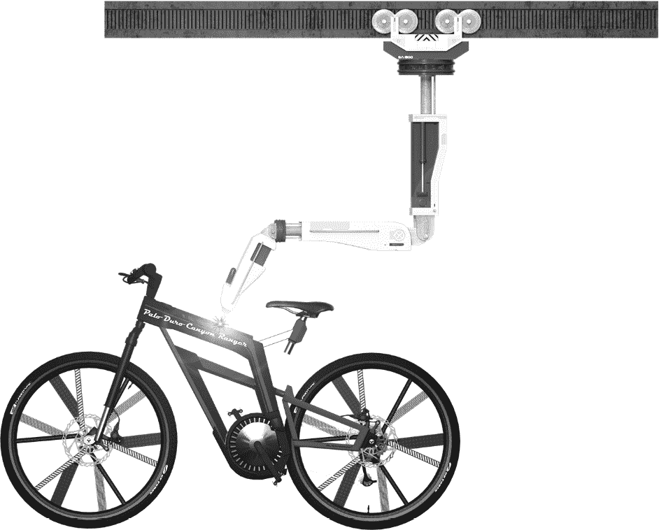

图 3.18 – 菲比为处理自行车车架焊接的机器人臂设计。

由于臂是移动的，菲比决定可以在需要时让臂在焊接项目之间移动。当自行车通过生产线时，只有少数几辆在任何时候都需要焊接。菲比想，“*拥有 30 个臂会很不错，但说实话，它们大部分时间都会处于闲置状态。这样会更好。我被迫更加高效。*”

10 个臂的池子位于轨道上，它们可以随时移动到任何装配线。当需要焊接时，基蒂的软件会将臂移动到所需的位置。焊接完成后，臂可以返回池中等待下一次需要。如果需要在不同项目上使用多个焊接工，一个臂会从池中取出并完成工作，然后返回。只要我们一次不需要超过 10 个臂，我们就没问题。如果我们需要，第 11 个任务将不得不等待直到有一个臂可用。菲比对此感到高兴，因为创建臂的成本很高，而且她已经发现，她只需要几个。随着业务的扩张，她可以添加更多的臂到池中。

菲比无意中发现了**对象池模式**。这种模式用于创建计算成本高昂的对象，因此它们往往会将软件性能降低到极慢。最明显的例子是与关系数据库一起工作。这是每个软件开发者在某个时候都会做的事情，对我们中的许多人来说，这是一项我们每天都要依赖的技能。

实例化和连接到数据库在计算上代价高昂且耗时。当然，这可能只需要 100 毫秒，但大多数关系型数据库都是设计来每小时处理数百万次事务的。当你的软件在规模负载下运行时，100 毫秒就是一段很长的时间。每个具有商业可行性的数据库都有一个驱动程序，它会为你处理连接池。驱动程序创建了一个数据库连接池。就像机器人手臂一样，你的软件从池中获取连接，执行查询，然后当连接关闭时（这应该尽可能快地完成）而不是真正关闭，开放的连接会被返回到池中，并可供程序中的另一个进程使用。查看以下通用图示：

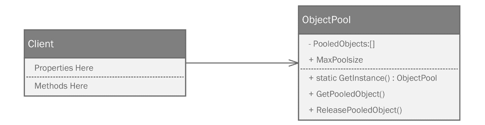

图 3.19 – 对象池模式创建了一个管理其他对象集合的对象。客户端从池中请求对象以使用它们，完成后释放它们。

有一个名为`PooledObjects`的私有集合，用于存储池中的对象。客户端在获得对对象池的访问权限后，可以使用`GetPooledObject`方法从池中请求对象。一旦完成，借用的对象就会被返回到池中。如果池为空，后续对`GetInstance`的请求将创建一个新对象，如果可能的话。如果不可能，实现通常会等待直到对象返回到池中。

菲比决定添加一个池来控制对她的有限数量机器人手臂的访问：

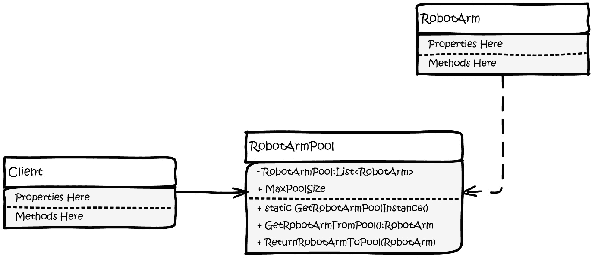

图 3.20 – 菲比为她装配线上的有限数量可用机器人手臂设计的对象池。

菲比为该图编写代码：

```cs
public class WeldingArmPool
{
  private int _maxSize = 10;
```

菲比只有 10 台机器人手臂可用，但她知道将来会有更多。在这里她创建了一个私有变量并将其初始化为`10`。接下来，她创建了一个构造函数，但通常，构造函数只会处理创建初始化对象。UML 图包含一个`Reset()`方法的条目，它执行相同的功能。她将稍后编写它，但将其放在构造函数中。IDE 提出了抗议，但她知道当她完成时一切都会顺利：

```cs
  public WeldingArmPool()
  {
    Reset();
  }
```

对象池最重要的部分是某种类型的集合来存储池中的对象。菲比选择了`WeldingArm`对象的`List`。这将在我们之前提到的`Reset()`方法中初始化，尽管菲比还没有创建它：

```cs
  private List<WeldingArm> Pool { get; set; }
```

菲比希望能够改变池的最大大小，这样她就能构建更多的机器人手臂。她可以增加池的大小，甚至在手臂因维护而离开池时减少它：

```cs
  public int MaxSize
  {
    get => _maxSize;
    set
    {
      _maxSize = value;
      Reset();
    }
  }
```

菲比决定有一个方法来查看池中有多少手臂会很好：

```cs
  public int ArmsAvailable => Pool.Count;
```

最后，我们期待已久的`Reset()`方法。这看起来像是你会在构造函数中放入的代码。菲比想要一种在需要时重置池的方法。由于 DRY（Don't Repeat Yourself）是一个好习惯，而且使用除`new`关键字之外的任何内容调用构造函数看起来都很奇怪且不自然，菲比将事情反过来，将逻辑放在这里，然后在需要的地方调用它，包括构造函数。这让我的人工智能开发环境（IDE）疯狂。它认为我有一个永不初始化的非空列表。这不是真的，但 IDE 的自动化功能还不够聪明，看不出来。代码本身初始化列表，然后根据`MaxSize`属性指示的数量填充它：

```cs
  public void Reset()
  {
    Pool = new List<WeldingArm>();
    for (var i = 0; i < MaxSize; i++) Pool.Add(new WeldingArm());
  }
```

我们需要一种从池中获取手臂的方法。以下方法检查是否有可用的手臂，如果有，则检索池中的第一个手臂。如果没有手臂，我们抛出一个错误：

```cs
public WeldingArm GetArmFromPool()
  {
    if (ArmsAvailable > 0)
    {
      var returnArm = Pool[0];
      Pool.RemoveAt(0);
      return returnArm;
    }

    throw new Exception("You are out of arms. Return some to                        the pool and try again.");
  }
```

在一个真实程序中，你可能只是返回一个新的对象，并承担性能损失。在这种情况下，我们实际上受到限制。我们可以实现一些并发代码，监视当手臂空闲时是否有可用的手臂，这指向一个新的工作，但这已经超出了模式演示的范围。菲比需要一种方法将她的手臂返回到池中。手臂存储其最后焊接的位置。为了避免混淆，菲比决定将其重置为零。这将表明手臂没有在工作，它位于池中，准备分配：

```cs
  public void ReturnArmToPool(WeldingArm arm)
  {
    arm.CurrentPosition = 0; //not at any station
    Pool.Add(arm);
  }
}
```

总结一下，菲比在`Program.cs`中编写了一个小的测试程序：

```cs
Console.WriteLine("Here's a program that controls some welding                  robots from a pool of 10.");

var armPool = new WeldingArmPool
{
  MaxSize = 10
};

var arm01 = armPool.GetArmFromPool();
arm01.MoveToStation(1);
if (arm01.DoWeld()) armPool.ReturnArmToPool(arm01);
```

作为一种工具，对象池可以极大地加快大多数软件的速度，因为通常，你只有在对象创建需要大量时间或资源时才会想到使用它。池预先创建对象，并希望以后不再需要。

“*但是*！”菲比大声对自己说，“*这似乎最好能保证一次只有一个池在使用。*”她是对的。关于机器人手臂，软件简单地创建更多实例是不合适的。从逻辑上讲，控制软件最终应该是多线程的。你不能有多个线程创建它们自己的池。在现实世界中，实例化额外的池不能神奇地生成更多资源。“*如果只有一种方法可以确保对象池在程序运行期间只实例化一次，*”菲比想。她本可以继续工作，但今天是玉米卷之夜，所以她关闭了笔记本电脑，准备晚餐。你可以在这个章节的源代码中的`ObjectPoolExample`项目中找到菲比对对象池模式的源代码。

# 单例模式

那天晚上，或许是被她的对象池奇点问题所启发，或许是受到玉米卷的影响，或许两者兼而有之，菲比做了一个奇怪的梦。她是一个穿着长流苏黑色法袍的法官，坐在法庭的高台上。一个审判正在进行。被告是辛·埃尔顿。他是一位穿着得体的中年绅士，安静地坐在他律师旁边的一个大而精致雕刻的橡木桌后。

法庭书记员清了清嗓子，对着麦克风平静地说，“*被告辛·埃尔顿被指控模仿一个有益的设计模式，实际上却是一个反模式。*”

陪审团中有一半人发出了集体吸气声。这声音来自法庭的后方，菲比这时才注意到。房间里充满了软件开发者，他们都穿着工装短裤、Birkenstock 凉鞋和 300 美元的复古*金属乐队*T 恤复制品。菲比敲响法槌，大声喊道，“*法庭秩序！*”她曾在电影中看到过这一幕，一直想这么做。随着陪审团安静下来，书记员没有抬头，继续从电脑屏幕上发言。“*这些是非常严重的指控，埃尔顿先生；你将如何答辩？*”

埃尔顿的律师，一个瘦弱的紧张男人，穿着廉价的蓝色西装，站起来，用尖锐的声音说，“*无罪！*”

书记员记录了答辩，审判开始了。检察官站起来发表开场白，他的南方口音缓慢而拖沓，让人联想到牛仔西部电影。他说，“*尊敬的法官，我们打算证明，辛·埃尔顿并非像他自己所宣称的那样是一个模式，而是一个反模式。他公然是名为“金锤”的非法编码组织的成员。*”检察官坐下，露出一个带有太多牙齿的狡猾微笑，这让人怀疑他是否是人类。你知道为什么鲨鱼从不攻击律师吗？职业礼节。

辩护方叫埃尔顿先生出庭作证，在审问他时，辩护方能够确立几个关键前提，旨在证明辛·埃尔顿是一个模式。

首先，这是一个广泛使用、受欢迎的模式，它被收录在*四人帮*这本书中。这本书被许多人视为不可动摇的，因为它被认为是软件设计模式的奠基之作。

“*反对！*”检察官大声喊道，同时用拳头猛击桌子。“*尊敬的法官，受欢迎程度或被收录在单一书籍中并不足以证明这是一个模式。*”

菲比轻轻地在法官台上敲了敲她的法槌，说道，“*维持原判。辩护将继续进行，但你的立场很脆弱，律师。要成为一个模式，辛·埃尔顿必须解决许多软件开发者面临的一个共同问题。这不是一场受欢迎的竞赛。你必须做得更好。*”

“*是的，尊敬的法官。*”律师脸红，显得有些慌乱，好像他希望这个案件能基于这个开场白被驳回。他继续审问埃尔顿先生。

“*你能向法庭准确说明你解决了哪些问题吗？*”

“*有时候，*”埃尔顿先生开始说，“*你需要确保在程序运行期间任何时候只有一个类的实例。例如，你可能需要访问数据库，可能通过对象池，或者你可能需要访问文件或配置服务。在这些情况下，你应该只有一个实例来处理这些。该实例对程序的所有部分都是可用的，这让你能够紧密控制全局状态。这些问题我可以解决，而且我是在一个类中的一个地方解决的，而不是分散在代码的各个部分。*”

在审判过程中某个时刻，法警带来了一块大白板，并要求埃尔顿先生画一幅自己的图。它看起来如下：

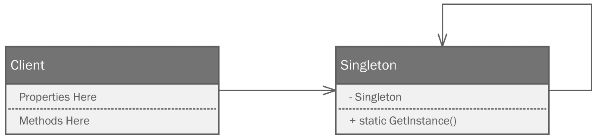

图 3.21 – 单例模式使用一个私有的构造函数（未显示）来创建一个对象（它自己）的实例，该实例存储在一个私有字段中。对该类调用 new 时，会检查是否已存在实例。如果存在，则返回现有对象。

辩护方继续并这样总结了其论点：

+   您的应用程序使用的共享资源，无论是数据库、文件、远程服务还是机械臂，都保证只有一个访问点。

+   程序的全局状态受到保护，因为只有一个访问点。

+   单例模式只初始化一次，因此只有在单例初始化时才会产生性能影响。

辩护律师以“*辩护结束。*”作为结论。

几乎无声的法庭突然爆发出一阵响亮的慢速高尔夫掌声。检察官站起来，整理了一下领带，贪婪地盯着陪审团。你能感觉到从他身上散发出的自信。那是一种电击般的感觉。当他说话时，几乎听起来就像他的南方口音故意更加明显。

“*尊敬的法官，陪审团成员们，让我告诉你们为什么辩护方刚才说的每一件事都是一大堆胡言乱语！*” “胡言乱语”这个词是法官菲比说的，她看到了事情的发展方向，用力敲击了法槌。她只做了几分钟的法官，可能再也不会做了，所以她绝对不允许那种语言出现在她的法庭上。女孩得有自己的标准。在警告了检察官后，这让书记员和辩护律师感到困惑，检察官叫了几位证人，他们提供了关于 Sing Elton 是一个反模式和黄金锤子的轶事证据。

一位软件工程经理作证说，辛·埃尔顿肯定是一个黄金锤子，因为在每一次他主持的面试中，应聘者总是声称他们研究过设计模式。当经理要求提供一个模式的例子时，唯一能被提到的模式就是单例模式。现在有很多类（你可能会认为只有一个例子）其实不需要实现为单例。每个人都使用它，因为它是最容易理解和记住的模式。

一家专注于窗户破碎修复的软件公司的一名软件工程师指出了最令人信服的论点：

+   根据广泛接受的原理，每个类都应该有一个职责；它应该只解决一个问题。讽刺的是，单例模式解决了两个问题。它确保只有一个类的实例存在，并且提供了一个访问某些共享或受限资源的单一入口点。

+   单例模式闻起来非常像全局变量。它不仅仅是一个变量，而是一个完整的类。在程序员的世界里，全局变量普遍受到谴责，因为它们被认为是不安全的。运行程序中任何给定对象的任何方法都可以修改全局状态，这通常会导致软件不稳定。对于设计用于线程或并发的软件，这有更严重的后果。

+   单例模式被认为促进了类之间的紧密耦合。你真的无法避免这一点，因为没有抽象单例这种东西。

+   单例的实现很难进行有效的单元测试。除了我们之前提到的紧密耦合问题，这本身就是测试的大忌，你无法模拟单例类。它是密封的，没有父类，因此使用 Liskov 替换作为测试工具是不可能的。单元测试应该是可隔离的，一个测试的效果不应该影响其他测试。有了单例的参与，它们很可能会受到影响。

检察官总结道：“*所以，尊敬的法官，陪审团的女士们和先生们，辛·埃尔顿不过是一个卑鄙无耻的骗子。他没有任何模式，应该被剥夺这个头衔。*”

画廊里爆发出一阵不满的哼声。菲比微笑，因为那是她再次敲响法槌的信号。她可以习惯这种生活。她重重地敲击了长凳，以至于产生的声音将她从梦中惊醒。这就像每个人至少做过一次的梦——那个你梦见自己在坠落，当你即将触地时突然醒来的梦。

“*我再也不会吃玉米卷了！*”菲比昏昏欲睡地喊道。她知道她在撒谎。她吃了一顿非玉米卷的早餐，然后回去工作了。她梦中的细节有一些合理的观点，但她觉得这是一个她真正需要单例模式的案例，考虑到实际存在的非常真实的限制。

菲比使用单例模式来模拟一个对象池，用单例来代表她在控制软件中受限的共享机器人手臂集合：

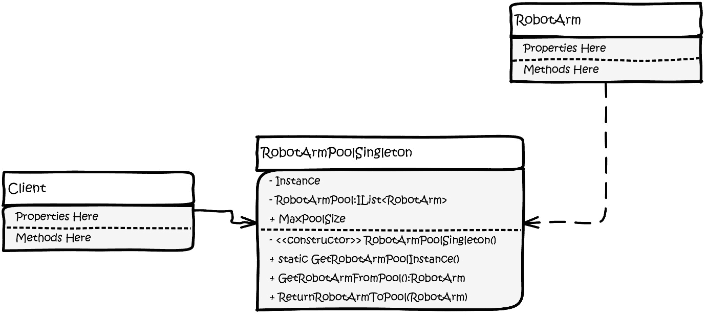

图 3.22 – 菲比已经将她的对象池重构为单例。现在，在她的运行程序中任何时候只能存在一个机器人臂池。

菲比转向她的 IDE，开始将她的机器人臂对象池重构为单例。这是一项相当简单的工作。首先，她重命名了类并将其密封，这样它就不能被扩展。如果类能够被扩展，它就会失去模式提供的保护。你可以开始看到为什么人们讨厌单例模式。它打破了我们一直钦佩的许多关于保持事物可扩展性的规则：

```cs
public sealed class WeldingArmPoolSingleton
{
```

为了使单例模式工作，它需要一个私有静态方法来持有单例实例。实际上，这是一个有自我引用的类，这有点奇怪。关键是只能有一个这样的实例，这就是为什么我们需要将字段设置为静态：

```cs
  private static WeldingArmPoolSingleton _instance;
  private int _maxSize = 10;
```

下一个你不太常见的怪癖是私有构造函数。没有公共的构造函数。就在这个时候，如果你的 IDE 配备了静态分析工具，它将开始抱怨。它会告诉你无法实例化对象。这是好事。这正是我们想要的。菲比保留了她的`Reset()`逻辑。她所做的只是将构造函数重命名，使其与类名匹配，并将访问修饰符更改为私有：

```cs
  private WeldingArmPoolSingleton()
  {
    Reset();
  }
```

单例模式最后一块拼图是一个静态方法，用于访问我们最初开始的实例属性。菲比使用 C#的属性语法来暴露它。当客户端程序第一次引用`Instance`属性时，获取器会检查是否已经存在一个实例。如果没有，它会创建一个并设置后备字段的`_instance`。如果`_instance`不是`null`，这意味着它已经被调用过一次，所以它只是返回已经存在的实例。由于它是一个静态字段，所有引用都指向内存中的同一位置。就这样——你得到了一个无法实例化两次的类：

```cs
  public static WeldingArmPoolSingleton Instance
  {
    get
    {
      if (_instance == null) _instance = new       WeldingArmPoolSingleton();
      return _instance;
    }
  }
```

菲比的其余代码保持不变。你可以在本章源代码的`SingletonExample`项目中找到完整的重构。

# 摘要

在本章中，我们介绍了一个惯用方法，即简单工厂，以及四个模式——工厂方法模式、抽象工厂模式、对象池模式和单例模式。

所有这些模式都被归类为创建型模式。这意味着它们通过封装创建逻辑在一个比使用严格的具体对象和`new`关键字更灵活的结构中来控制对象的创建。

工厂方法模式是当人们听到“工厂模式”时首先想到的。使用它意味着将创建逻辑抽象成一个称为创建者的工厂类。创建者对象由一个接口定义以最大化灵活性。我们还为工厂生产的对象创建了一个接口。我们称之为产品。每个工厂创建者类负责程序中所有产品的一个子集。

抽象工厂模式涉及创建一系列自然搭配的对象。使用它意味着为多个创建者类创建一个抽象定义。每个创建者负责一个具体对象。

当您需要使用一系列复杂步骤来创建对象时，会使用建造者模式。使用它类似于抽象工厂模式，但您的建造者类由一个接口定义。建造者中的每个方法代表构建过程的一个步骤。可能会诱使您在每个建造者类中放置一个单独的方法来按顺序调用这些步骤。然而，这通常委托给一个`Director`类。建造者包含构建对象的函数，但`Director`类包含调用这些方法的顺序背后的逻辑。

对象池模式旨在帮助您管理那些由于实际约束而受限的对象，例如我们的机器人手臂，或者那些创建成本高昂的对象，例如数据库、网络服务或文件连接。其理念是在程序运行期间一次性支付创建成本，创建一个包含这些对象的列表，这些对象在程序运行期间保持可用。当需要其中一个对象时，它从池中取出，不再需要时再返回。这允许其他进程稍后使用它，而无需经历正常的实例化过程。

对象池模式可以有效地与单例模式结合使用。单例模式是有争议的，通常被认为是一个反模式，因为它不能扩展，并且它促进了紧密耦合。菲比能够将其与她的机器人手臂池结合使用，以确保她不会意外地创建多个机器人手臂池。她只有 10 个物理手臂可以工作，因此复制池可能会带来问题。

这些模式被展示为一种渐进。姐妹们从简单的工厂开始，迭代地工作到建造者模式。这并非有意为之——这只是事情发展的结果。您不应将这种渐进视为建造者模式比工厂方法或抽象工厂更好的指示。每个模式都有其位置，并且通常，模式可以像美酒和好牛排一样搭配使用。

在下一章中，我们将探讨结构模式，这些模式旨在优化您构建类层次结构的方式，以实现最大灵活性和完全实现开闭原则。

# 问题

回答以下问题以测试你对本章知识的掌握：

1.  编程惯用法是什么，它们与模式有何不同？

1.  除了 `Hello, World` 之外，还有一些流行的编程惯用法吗？

1.  依赖于简单工厂惯用法有什么缺点？

1.  单例模式是一个模式还是一个反模式？为什么？

1.  当你处理创建一系列相关对象时，你应该使用哪种模式？

1.  对于具有复杂构建过程的对象，你应该使用哪种模式？

1.  建造者模式中哪个类负责以正确的顺序控制构建步骤的执行？

# 进一步阅读

要了解更多关于本章所涉及的主题，请查看以下资源：

+   Ritchie, D. M., Kernighan, B. W., & Lesk, M. E. (1988). 《C 程序设计语言》。Englewood Cliffs: Prentice Hall.

+   [`sites.google.com/site/steveyegge2/singleton-considered-stupid`](https://sites.google.com/site/steveyegge2/singleton-considered-stupid)
