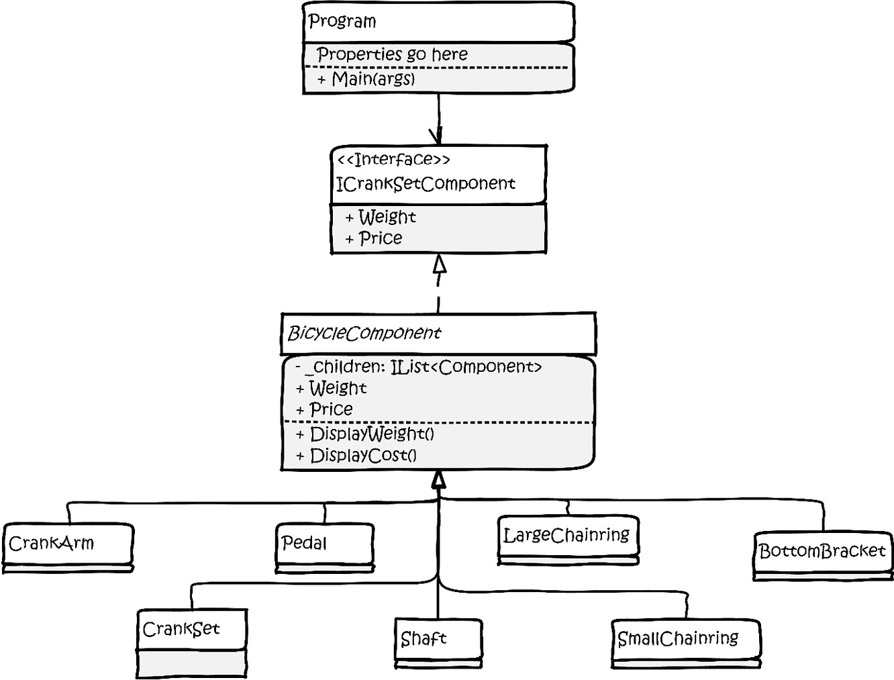
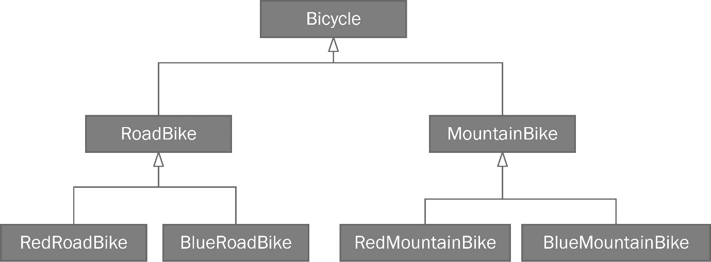
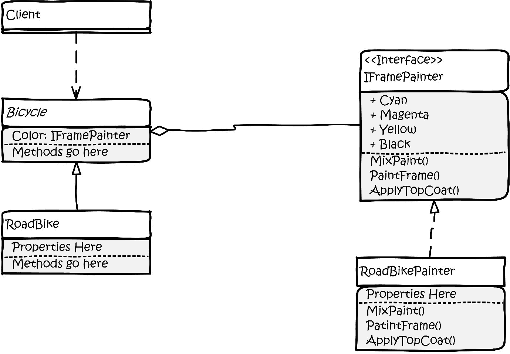

# 用结构型模式加固您的代码

最近，我的妻子问了一个应该很容易回答的问题：“你小时候（比如 9 岁或 10 岁）有什么娱乐活动？”我不得不思考。当我 9 岁或 10 岁的时候，家里不可能有电脑，除非你住在有稳定高电压连续正弦波电源的军事掩体里。掩体还需要几千平方英尺的架空地板、工业级空调和稳定的清洁水源来用于 CPU 冷却。这并不是我们大多数朋友 9 岁或 10 岁时正常的居住环境。这个问题很难回答，因为当我 12 岁的时候，我就得到了我的第一台电脑。它是 Radio Shack TRS-80，配备了一个级别 1 的 8 位 Z-80 处理器，4K（即 4,000 字节——只是字节，不是千字节、兆字节或吉字节）的内存，一个分辨率为 128×48 像素的单色显示器，以及一个磁带机用于加载和存储程序和数据。这台新电脑占据了我醒着的每一刻，从那时起，我可能比愿意承认的更多地将我的生命奉献给了屏幕时间。然而，问题是：在我有电脑之前，我有什么娱乐活动？经过一分钟思考，我想起了我建造模型火箭。

就在我长大的那所房子附近，有一个爱好店，出售模型火箭套件以及引擎和发射器。在周六早上，我会翻遍妈妈的包，凑够 5 美元，然后走到店里买一个套件。一开始，它们是简单的“级别 1”套件，你可以在几小时内组装和发射。随着我越来越熟练，模型变得越来越复杂，比如降落伞，当火箭耗尽燃料并达到最高点时会展开。甚至有一枚火箭配备了一个单次使用的相机，可以在返回地球的路上拍摄空中照片。这些花哨的套件中的火箭看起来像《星球大战》电影中的宇宙飞船（当时只有一部），以及《银河战舰》。

火箭通常具有相似的结构。然而，随着它们变得更加复杂，组装它们并安全发射所需的指令也越来越多。这让我想起了我们接下来要介绍的模式集合。

结构型模式旨在帮助您将对象组装成更大、更复杂的结构，从而避免我们逐渐厌恶的管道式单体结构。结构型模式对于大型系统的作用，类似于创建型模式对于单个对象实例的作用。结构型模式帮助我们保持灵活性和效率。已经有许多结构型模式被记录下来，但本章重点介绍四个最重要的模式：

+   **装饰者模式**

+   **外观模式**

+   **组合模式**

+   **桥接模式**

与前几章一样，这些结构模式将在简单的命令行程序的环境中演示。这将限制您在更复杂（尽管可能更有趣）的桌面、Web 或游戏项目中遇到的噪音量。

本章假设您了解**统一建模语言**（**UML**）的基础知识。本书中所有模式都使用 UML 类图进行图示。如果您对 UML 是一个新概念，请参阅本书的*附录 2*。您不需要理解 UML 的 14 种图示类型中的所有内容。我只使用类图，因为这是我们模式工作所需的所有内容。

# 技术要求

在整本书中，我假设您知道如何在您喜欢的**集成开发环境**（**IDE**）中创建新的 C#项目。我在本章中不花时间讲解设置和运行项目的机制。然而，如果您需要有关 IDE 或如何设置项目的教程，请参阅本书的*附录 1*。如果您决定与我一起编写代码，您将需要以下内容：

+   运行 Windows 操作系统的计算机。我使用的是 Windows 10。由于项目是简单的命令行项目，我相当确信这些内容在 Mac 或 Linux 上也能工作，但我还没有在这些操作系统上测试过这些项目。

+   支持的 IDE，如 Visual Studio、JetBrains Rider 或带有 C#扩展的 Visual Studio Code。我使用的是 Rider 2021.3.3。

+   .NET SDK 的某个版本。再次强调，项目足够简单，我们的代码不应该依赖于任何特定版本。我正在使用.NET Core 6 SDK。

如果您需要代码，您可以在 GitHub 上找到本章的完整项目文件，网址为[`github.com/Kpackt/Real-World-Implementation-of-C-Design-Patterns/tree/main/chapter-4`](https://github.com/Kpackt/Real-World-Implementation-of-C-Design-Patterns/tree/main/chapter-4)。

# B2B（回到自行车）

在我们上一集中，姐妹 Kitty 和 Phoebe 决定开设自己的自行车工厂：Bumble Bikes。她们打算利用 Kitty 的专业知识，设计路上最创新的自行车。Phoebe 通过设计和构建机器人来利用她自己的工程技能。尽管姐妹俩都不是受过专业训练的软件开发人员，但她们的父亲，一位退休的时间旅行软件工程师，在她们很小的时候就教她们编程。姐妹们熟悉 IDE 的使用，但她们刚刚开始学习模式。因此，当前的编码任务是编写将运行自动化工厂的机器人控制软件。

机器人制造系统将`Bicycle`类的实例转换为实物自行车。女孩们已经掌握了创建型模式，并且决定使用 Builder 模式。Builder 模式将被用来创建所需的任何类型的自行车组件，并将这些组件组装成成品自行车。

# 装饰者模式

对于基蒂和菲比来说，周一早上是个忙碌的开始。周末，基蒂在她家附近的西德克萨斯州岩石沙漠的一些小径上骑了一辆原型山地自行车。她想要一个有挑战性的测试，所以她选择了美国国家公园大弯的 Black Gap Road。大弯的名字来源于里奥格兰德河的一个大弯，它形成了公园的边界，以及美国与墨西哥的南部边界。Black Gap Road 因其具有挑战性的小径而闻名。它有冲刷地、浅溪流和实际的缺口（道路因此得名）。缺口由火山岩形成的大山之间的狭窄通道组成。在缺口中间是一个约 3 英尺（约 1 米）高的悬崖，悬崖下方是下一部分。基蒂曾多次驾驶她的吉普车越过悬崖，但从未骑自行车。她误判了落差，结果背部着地。在喘过气来后，她重新骑上自行车完成了小径。菲比在起点等待基蒂用吉普车来接她。

周一早上，他们的电话开始响起。菲比花了一小时的时间在电话里和一个原材料供应商交谈。根据女孩们预测的原材料数量，供应商告诉她们需要在该供应商的外部网络（这是一个仅对大客户开放的私有网络）上设置账户。Bumble Bikes 可以在原材料上获得优惠价格。然而，为了利用这个价格优势，Bumble Bikes 必须承诺在其机器人制造系统和供应商的库存控制系统之间创建一个接口。菲比认为这是一个积极的信号，因为它意味着在短期内，她可以利用供应商的库存控制系统，而不必自己创建这个系统。唯一的缺点是菲比需要修改她的软件，特别是`Bicycle`类，以便向供应商的 API 提供通知。`Bicycle`类已经内部发布并投入使用。为了添加供应商所需的通知器而打开这个类将迫使她违反开放封闭原则，该原则指出：你不应该通过更改类来修改正在生产的代码。相反，她应该找到一种方法来扩展这个类。

同时，凯蒂正在用手机和一个拥有美国大量自行车经销商的公司总裁通话。这家公司希望成为美国 Bumble Bikes 的独家经销商。姐妹俩原本设想直接向客户销售，并与小型当地自行车店建立协议。她们对大型连锁店对其新兴产品线感兴趣感到惊讶。在与总裁长时间讨论后，凯蒂了解到与经销商做生意的一个要求是，每辆订购的自行车都需要一份车主手册，并且必须带有散布在手册中的每个经销商的详细信息。经销商所属的公司将提供大规模印刷系统，因此女孩们不需要为任何设备筹集资金。

命运就是这样，两人在各自通话的同一时间挂断了电话。

“你不会相信这个！”菲比惊呼。

“不，你不会相信这个！”凯蒂反驳道。

当他们讨论所发生的事情时，两人都很兴奋。周五，他们是一家小型自行车初创公司。到了下周一早上，他们已经定位为美国自行车市场的一个严肃的竞争对手。他们的梦想比他们想象的实现得更快。他们所需要做的只是对他们的代码进行一些修改。

“很简单！”菲比说，“我们只需更改 *Bicycle 类，并添加新的属性和方法以满足我们的新要求。”*

“别这么快，”凯蒂回答说，然后她继续说，“自行车类已经投入生产。改变它们与开闭原则相冲突。此外，并非每个自行车对象都需要新的手动打印行为。如果我们强迫每个子类都具有这种行为，我们就是在违反接口隔离原则。我们将会违反两个 SOLID 原则！”

“哦，是的，”菲比沮丧地说。两人进行了一些研究，发现了一个似乎可行的想法。如果他们能够创建一个包装或装饰 `Bicycle` 类的类，他们就可以创建一个具有新行为但不会破坏现有实现的扩展类。

装饰者模式允许你在不接触原始类的同时，向类添加属性和方法，同时仍然尊重任何具体实现。你可以在 *图 4.1* 中看到装饰者模式的通用绘图：


图 4.1：装饰者模式。

模式的各个部分在此进行了分类和解释：

1.  `IComponent` 是定义我们要包装的行为的接口。

1.  `ConcreteComponent` 是原始实现。在迄今为止提供的示例中，这将是从微控制器供应商的 API。

1.  `Decorator` 是一个抽象类，它通过接口持有对具体组件的引用。

1.  `ConcreteDecorator1`是一个扩展装饰器类的具体类，但它添加了一些额外的状态定义，以属性或字段的形式出现。

1.  `ConcreteDecorator2`通过添加额外的操作扩展了装饰器。

Kitty 和 Phoebe 需要向他们的`Bicycle`类添加两种不同的行为。一种行为将与原材料供应商的库存控制系统接口。另一种行为将允许在工厂打印定制的手册，并与自行车一起运送到美国各地的数百个经销商处。理想情况下，还应该有一种方法可以将这两种行为添加到他们的`Bicycle`对象中。换句话说，他们真的希望他们的装饰器可以堆叠。堆叠将允许他们潜在地修改所有`Bicycle`类以与原材料供应商的系统协同工作，但只需处理通过他们的经销商协议销售的自行车的打印手册。他们应该能够根据需要添加或省略这些行为。Kitty 走到白板前，最终确定了*图 4.2*中所示的结构：


图 4.2：Kitty 对装饰器模式的实现。

让我们来看看图中的类：

1.  这是我们创建的*第三章*“使用创建型模式进行创意”，用来表示我们的自行车界面。这里没有任何变化。

1.  这是实现接口的抽象`Bicycle`类。这里也没有任何变化。实际上，接口和抽象类都没有变化。

1.  这是抽象装饰器类。严格来说，类名中不一定需要包含单词*装饰器*。这里是为了清晰起见。请注意，它使用组合来包含一个`protected`属性，该属性包含对实现`IBicycle`的类的引用。此对象由构造函数设置，同时实现`IBicycle`接口。乍一看，这似乎不太符合 DRY 原则。正如你将看到的，它会。当你看到代码时，这会变得有意义。

1.  装饰器类。这里有两个：`DocumentedBicycle`和`NotifyingBicycle`。你可以根据需要创建任意多个。你可以在实现中堆叠它们，使得可以有一个既带有手动打印机又带有通知器，或者两者都有或都没有的`Bicycle`对象。随着 Bumble Bikes 的扩展和新业务需求的实现，我们有可能添加并选择性地堆叠更多的装饰器，而不会干扰原始的自行车类本身。

1.  `IDocumentor`和`INotifier`接口定义了装饰行为。将它们作为接口可以防止装饰器与具体实现紧密耦合。

装饰器用于在不修改原始类的情况下向对象添加新的属性和方法（或者如果你更喜欢，行为）。这允许你通过巧妙地扩展类来遵守开闭原则。在这种情况下，我们通过包装类来扩展类，而不是仅仅通过继承来扩展。

装饰一个类涉及三个步骤：

1.  创建一个包含要装饰的类的 `private` 成员的类。在我们的例子中，我们将装饰 `AbstractBicycle` 类。我们需要一个包含 `IBicycle` 类型的 `private` 属性的类，以及一个允许我们设置此属性的构造函数。

1.  我们需要实现 `IBicycle` 接口中已经存在的所有属性和方法。当我们为装饰器实现获取器、设置器和常规方法时，我们将它们传递给私有实例。实际上，我们已经包装了类，装饰器执行得与原始类完全一样。

1.  我们添加装饰属性和方法。如果你打算堆叠装饰器，有一个可以链接它们的公共方法是很重要的。我们将使用 `Build()` 方法。

让我们看看 Kitty 的代码实现。我们将从底部开始，从两个接口开始。她添加了 `IDocumentor` 接口。这允许在构建自行车时打印定制的经销商手册：

```cs
public interface IDocumentor
{
  public void PrintManual();
}
```

然后她添加了 `INotifier` 接口，该接口定义了一个与原材料供应商的库存控制系统通信的功能：

```cs
public interface INotifier
{
  public void Notify();
}
```

接下来，让我们看看 `AbstractBicycleDecorator` 类：

```cs
public abstract class AbstractBicycleDecorator : IBicycle 
{
  protected readonly IBicycle UndecoratedBicycle;
```

在这里，保存原始 `IBicyle` 对象的 `protected` 字段至关重要。这是我们将要装饰的原始、未装饰的对象实例：

```cs
  protected AbstractBicycleDecorator(IBicycle bicycle)
  {
    UndecoratedBicycle = bicycle;
  }
```

接下来，我们需要在装饰类中实现 `IBicycle` 接口。我们通过将一切传递给构造函数设置的私有未装饰对象来完成此操作。对装饰器类的每次调用都将传递给未装饰的实例：

```cs
  public string ModelName
  {
    get => UndecoratedBicycle.ModelName;
    set => UndecoratedBicycle.ModelName = value;
  }
  public int Year => UndecoratedBicycle.Year;
  public string SerialNumber => 
    UndecoratedBicycle.SerialNumber;
  public BicycleGeometries Geometry
  {
    get => UndecoratedBicycle.Geometry;
    set => UndecoratedBicycle.Geometry = value;
  }
  public BicyclePaintColors Color
  {
    get => UndecoratedBicycle.Color; 
    set => UndecoratedBicycle.Color = value; 
  }
  public SuspensionTypes Suspension { 
    get => UndecoratedBicycle.Suspension;
    set => UndecoratedBicycle.Suspension = value;
  }
  public ManufacturingStatus BuildStatus { 
    get => UndecoratedBicycle.BuildStatus;
    set => UndecoratedBicycle.BuildStatus = value;
  }
```

最后，我们将 `Build()` 函数实现为抽象的。在我们的原始 `Bicycle` 类中，这个类也是抽象的，我们在类中实现了这个方法。这是因为我们实际上正在改变自行车的构建方式。正如你将看到的，这个方法提供了堆叠我们的装饰器的方法：

```cs
 public abstract void Build();
}
```

最后，让我们进入两个装饰器类。首先考虑 Kitty 打印手册的需求，因为她是大姐。至少，她总是这样争辩。在这里，`DocumentedBicycle` 类扩展了 `AbstractBicycleDecorator`：

```cs
public class DocumentedBicycle : AbstractBicycleDecorator
{
```

有一个 `private` 字段来保存 `IDocumentor` 对象：

```cs
  private IDocumentor _documentor;
  public DocumentedBicycle(IBicycle bicycle, ManualPrinter 
                           printer) : base(bicycle)
  {
    _documentor = printer;
  }
```

这里是实际的装饰。在构造函数中传递给任何对象的 `Build()` 方法被调用。然后，调用额外的装饰行为——在这种情况下是在装饰上调用 `PrintManual()` 方法：

```cs
  public override void Build()
  {
    UndecoratedBicycle.Build();
    _documentor.PrintManual();
  }
}
```

Phoebe 要求通知供应商的库存控制系统是在其自己的装饰器类中实现的：

```cs
public class NotifyingBicycle : AbstractBicycleDecorator
{
  private readonly INotifier _notifier;
  public NotifyingBicycle(IBicycle bicycle, INotifier 
                         notifier) : base(bicycle)
  {
    _notifier = notifier;
  }
  public override void Build()
  {
    UndecoratedBicycle.Build();
    _notifier.Notify();
  }
}
```

结构是相同的，当然，除了装饰部分。这次，我们传入了一个符合 `INotifier` 接口的对象。当调用原始未装饰对象的 `Build()` 方法时，我们调用相应的方法。

现在，我们需要一些具体的类来满足 `INotifier` 和 `IDocumentor` 接口。我们将保持这些类简单。`IDocumentor` 接口通过一个名为 `ManualPrinter` 的类来实现：

```cs
public class ManualPrinter : IDocumentor
{
  public void PrintManual()
  {
    Console.ForegroundColor = ConsoleColor.Cyan;
    Console.WriteLine("The manual is printing!");
    Console.ResetColor();
  }
}
```

`PrintManual()` 方法是我们添加的行为。对于这个示例来说，它所做的只是打印出 `The manual is printing!` 这一行。由于我们的控制台中有大量的文本，我选择让装饰器的输出为青色，以便更容易辨认。`INotifier` 接口的一个实现可能如下所示：

```cs
public class MaterialsInventoryNotifier : INotifier
{
  public void Notify()
  {
    Console.ForegroundColor = ConsoleColor.Yellow;
    Console.WriteLine("The materials inventory control 
      system has been notified regarding the manufacture of 
        this bicycle.");
    Console.ResetColor();
  }
}
```

再次，我在输出中添加了一些颜色，以便更容易辨认。这次，它是黄色。我已经很久没有开玩笑，让我们用一些使用我们的装饰器类的代码来结束这个话题！

这些是示例项目文件中 `Program.cs` 文件的内容：

```cs
var regularRoadBike = new RoadBike();  //no decorators.
regularRoadBike.Build();
Console.WriteLine("+++++++++++++++++++++++++++++++++++++");
```

这是一个普通的、未装饰的 `RoadBike` 对象。无聊！我们之前见过这个！让我们用打印自定义手册的能力来装饰它：

```cs
var bikeManualPrinter = new ManualPrinter();
var documentedBike = new DocumentedBicycle(new RoadBike(), 
                                          bikeManualPrinter);
documentedBike.Build();
```

这次，我们实例化了 `DocumentedBicycle`，这是我们的装饰器。它需要一个未装饰的 `RoadBike` 和一个 `ManualPrinter`。当我们调用构建方法时，`DocumentedBicycle` 类调用 `RoadBike` 类的 `Build()` 方法。然后，它调用自己的 `Build()` 方法，添加新的打印手册行为。

如果你没有注意到，我在这里添加了一些分隔符，这样当我们运行示例时，就可以轻松地看到每个运行部分：

```cs
Console.WriteLine("+++++++++++++++++++++++++++++++++++++");
```

这真是一次愉快的经历！让我们再来一次！这次，让我们尝试 `NotifyingBicycle` 装饰器。它的工作方式相同。首先，我们创建一个 `MaterialsInventoryNotifier` 的实例，它体现了装饰器要添加到 `RoadBike` 中的新行为：

```cs
var manufacturingInventoryNotifier = new MaterialsInventory
    Notifier();
```

接下来，我们实例化 `NotifyingBicycle` 类，传入一个新的 `RoadBike` 对象用于装饰，以及 `manufacturingInventoryNotifier`：

```cs
var notifierBike = new NotifyingBicycle(new RoadBike(), 
    manufacturingInventoryNotifier);
```

现在，我们调用装饰器的 `Build()` 方法：

```cs
notifierBike.Build();
Console.WriteLine("+++++++++++++++++++++++++++++++++++++");
```

记住这个工作原理：装饰器（`NotifyingBicycle`）有一个 `Build()` 方法。被装饰的 `RoadBike` 类也有一个 `Build()` 方法。装饰器调用 `RoadBike` 的 `Build()` 方法，生成一个 `RoadBike` 对象。然后，装饰器调用自己的 `Build()` 方法，添加通知行为。

装饰器的酷之处在于它们可以堆叠。对于压轴之作，我们将同时将两个装饰器放在 `RoadBike` 对象上：

```cs
var notifyingDocumentedBike = new NotifyingBicycle(new 
    DocumentedBicycle(new RoadBike(), bikeManualPrinter), 
        manufacturingInventoryNotifier);
notifyingDocumentedBike.Build();
```

哎呀！这太难读了。让我们把它拆分开来。在中间，你会找到一个新的未装饰的 `RoadBike` 类：

```cs
var notifyingDocumentedBike = new NotifyingBicycle(new 
    DocumentedBicycle(new RoadBike(), bikeManualPrinter), 
        manufacturingInventoryNotifier);
notifyingDocumentedBike.Build();
```

现在，从这里向外移动，你会找到我们使用这个新的 `RoadBike` 创建 `DocumentedBicycle` 的地方：

```cs
var notifyingDocumentedBike = new NotifyingBicycle(new 
    DocumentedBicycle(new RoadBike(), bikeManualPrinter),
manufacturingInventoryNotifier);
notifyingDocumentedBike.Build();
```

我们传递了 `bikeManualPrinter`。在现实生活中，小心以这种方式重复使用你的实例。我们之前使用了 `bikeManualPrinter`，现在我们将其传递给第二辆自行车。这些是通过引用传递的，这意味着如果你在 `bikeManualPrinter` 上更改任何属性，它将影响早期示例中的 `documentedBike` 的值以及我们现在构建的 `notifyingDocumentedBike`。

现在，让我们一直移动到最外层的构造器：

```cs
var notifyingDocumentedBike = new NotifyingBicycle(new 
    DocumentedBicycle(new RoadBike(), bikeManualPrinter), 
        manufacturingInventoryNotifier);
notifyingDocumentedBike.Build();
```

最外层的构造器使用新的 `DocumentedBicycle` 创建了一个 `NotifyingBicycle` 的实例，而 `DocumentedBicycle` 又使用了新的 `RoadBike`。在每一层，我们都传递了一个装饰行为。

用另一种方式来说，`notifyingDocumentedBike` 是使用新的 `DocumentedBicycle` 和 `ManualPrinter` 创建的。`DocumentedBicycle` 是使用新的 `RoadBike` 创建的。

你可以看到程序运行的输出。*图 4.3* 显示了 `DocumentedBicycle` 装饰器的运行，接着是 `NotifyingBicycle` 装饰器。最后的运行显示了在同一对象上成功运行的两个装饰器。代码指示了输出结果的彩色编码，但这本书并没有彩色印刷。或者也许它是有彩色的，你需要做一次眼科检查：


图 4.3：DecoratorExample 项目的 Program.cs 运行的输出结果（为了节省空间，未装饰的 RoadBike 的输出未显示）。

你可以理解为什么装饰模式是开发者中的热门选择。当你需要在不破坏现有实现的情况下向对象添加行为时，你可以使用它。装饰器可以用来创建可以按需堆叠或组合的业务逻辑层。例如，只有通过经销商网络销售的自行车需要 `DocumentedBicycle` 装饰器，但所有使用我们供应商的原始材料的自行车都需要 `NotifyingBicycle` 装饰器。如果我们使用来自另一个来源的原始材料制作自行车，而这些自行车不会通过经销商网络销售，那么我们就不需要任何装饰器。

你还可以使用装饰器来扩展那些难以或无法通过常规继承扩展的类。考虑一个密封的类，这意味着它不能通过继承来扩展。你仍然可以使用装饰器来扩展它！这可能会让你感觉自己像是一个亡命之徒。这是正常的，可能会让你得到一顶黑色牛仔帽，并学会演唱约翰尼·卡什创作的每一首歌。你已经得到了警告。

# 外观模式

*“呃！”* 菲比惊呼。现在时间是凌晨 4 点，在菲比的工坊里。她原本白色的实验服已被油污覆盖，她正踩着由工业车床散落的铝屑。她正在尝试制作她的一只机器人手臂。她有几个不同的设计，但这个是一个重型的模型，固定在了地板上。手臂有三种不同的型号。一只手臂装备了焊接机，用于焊接铝合金自行车框架，另一只装备了抛光机，用于在自行车喷漆后进行抛光处理，最后一只装备了夹具，用于在组装过程中固定自行车。菲比想要制作每种型号的手臂。由于预算限制，她只能负担起制作 10 只手臂。她决定手臂的最佳组合是三个焊接机、三个抛光机和四个夹具。在白板规划了这个流程后，她意识到她的工厂将无法满足姐妹们出色的营销活动带来的需求。仅 Kickstarter 项目就已经产生了数百个订单，而工厂甚至还没有开始运营！菲比正苦于想出让这个工厂运转的方法。

她的妹妹基蒂一直在做控制软件。在创建机器人之前，两人就软件的工作方式达成了共识，因为有时在硬件之前制作软件是实用的。软件设计灵活且易于更改。它可以驱动硬件设计，而硬件设计则不那么灵活，更改成本也更高。这是一个这样的例子。一时兴起，菲比打开了基蒂的 GitHub 仓库，切换到了基蒂为控制手臂设计对象结构的分支。

菲比发现了基蒂对装饰者模式的实现，这给了她一个灵感。她可以把机器人手臂的附件看作装饰者！这样她就可以制作 10 只手臂，但通过切换装饰者，手臂可以执行所需的任何动作。为了明确，菲比并不是在创建软件。她是从装饰者模式中汲取灵感，制作了一个带有可互换附件的机器人手臂，这样基本手臂就可以根据需要执行许多功能，而无需为每个任务构建新的手臂。


图 4.4：菲比从装饰者模式中获得了灵感。

这太棒了！然而，还有一个问题。每个附件将由不同供应商的组件制成，并且每个都将有不同的 API 来控制手臂的附件。

几周前，Kitty 离开了德克萨斯州阿尔卑斯小镇，她在 Sul Ross 大学完成工业设计学位。她驾驶着她明亮的黄色吉普 Wrangler 向东北方向开了八个小时，到达德克萨斯州的达拉斯，她的妹妹 Phoebe 正在南方卫理公会大学完成她的工程学学业。Kitty 来访的目的，除了达拉斯优越的大学夜生活外，是为了研究和寻找他们工厂机器人的潜在部件。他们已经能够获得一些基本的自行车制造需求。在他们父亲职业生涯的某个时刻，他在德克萨斯州沃斯堡的一家直升机工厂工作了几年。沃斯堡与达拉斯相邻，居民们将这个地区称为达拉斯-沃斯堡都会区。在他们父亲在直升机工厂的时期，他结识了许多可以帮助女孩们实现目标的联系人。他们需要的从机床到先进的计算机控制激光切割和制造的一切，只需一个电话即可获得。然而，电子设备却是一个不同的情况。女孩们决定使用现成的 **商业现货** (**COTS**) 组件来开发机器人技术。

伺服电机是允许精确控制角或线性定位、速度和加速度的电动机。它们在开发机器人和人控制的工业机械中得到广泛应用。Bumble Bikes 的目标是拥有一个自动化的工厂。Kitty 开始研究微控制器。微控制器是小型计算机，允许 **应用程序编程接口**-(**API**-) 级别的交互来控制任何东西，包括伺服电机。伺服电机可能通过引脚连接器连接到计算机，有时被称为“帽子”，它们安装在微控制器的印制电路板上。达拉斯当地的电脑店在他们的超市大小的设施中有一个专门的区域，专门用于销售微控制器、伺服电机以及所有相关的电子设备。

一周后，他们已经制作了一份包含 Libre Office Calc 电子表格的机器人手臂及其三个不同附件的物料清单。将这些部件组装成一个电气的机器人手臂是基础性的。最难的部分是编写软件。女孩们为每个手臂附件找到了三个不同的微控制器和三个不同的 API：一个用于抓取器，一个用于焊接机，另一个用于缓冲器。

一个简单的解决方案是编写一个烟囱式应用程序，根据制造过程需要的任何逻辑直接调用 API。姐妹们最近在工厂模式上的经验使她们对这种策略持谨慎态度。快速简单的解决方案在长期内既不可持续也不可维护，而且他们正在考虑长期。他们希望一次就构建好机器人，而这些机器人如果得到良好的维护，理论上可以永远运行。

Kitty 的一位教授，查尔斯·德克斯特·沃德教授，曾教授一门名为《智能产品设计导论》的课程。这是一整个学期都在解决女孩们面临的问题：如何使用传感器和微控制器设计高效的自动化系统。沃德博士曾警告 Kitty 和她的学术同事们关于供应商锁定。Kitty 和 Phoebe 正在通过将一个激情项目转变为可以传给他们的孩子和孙子的企业来开始创业。现在购买的微控制器及其相关的 API 在长期或未来几年内保持不变是没有意义的。通过直接紧密耦合到当前的 API 上，姐妹们将信任他们今天使用的 API 开发者将像 Bumble Bikes 一样继续经营。这也假设 API 将继续根据其应用需求进行演变和维护。自然，这将会是一个非常天真的假设。

更安全的赌注是，每过几年市场上就会引入新的微控制器 API，并且来自不同的公司。方法签名以及 API 本身的调用方式将不同于今天。回想一下 20 年前远程 API 调用的常见技术。**通用对象请求代理**架构（**CORBA**）被**简单对象访问协议**（**SOAP**）所取代。SOAP 反过来又完全被**表示状态转移**（**REST**）所取代，这在网络开发和**物联网**（**IoT**）行业中很常见，但在 2022 年仍然处于起步阶段。我敢打赌，许多受过良好训练的软件开发者阅读这本书时，对 CORBA 或 SOAP 的了解很少，甚至没有，就像你的后代同事可能对 REST 有非常不同的看法。任何紧密耦合到任何 API 的系统，其寿命等于其紧密耦合组件中最短寿命。Kitty 已经深刻地吸取了这个教训。在软件中，Kitty 使用一个实现了执行抽象操作的机器人手臂的接口来表示控制臂。这些可以映射到 API 上。她正在使用**外观模式**。

在普通英语中，或者在这个案例中，法语中，“门面”意味着“面孔”。在建筑学（指有建筑物的，而不是软件）中，它指的是建筑物的正面。门面通常是华丽的，代表着设计师所说的*吸引力*。我能想到的最著名的门面之一是佛罗里达州奥兰多迪士尼世界的城堡，如图 4.5 所示。顺便说一句：亲爱的美国国税局，请接受我修改后的申报表，我的扣除项标记为“迪士尼研究之旅”。我向你保证，这纯粹是业务。


图 4.5：佛罗里达州奥兰多迪士尼世界城堡的前门面向外界呈现了一种华丽的外观。

在软件架构中，门面模式是相反的。它不是面向对象或 API 的华丽外观，而是一个简化的访问点。这个巧妙的模式可以通过将自己置于代码和所调用的 API 之间来隔离你的程序，从而避免供应商锁定。作为额外的奖励，门面还允许你简化 API 的接口，甚至通过仅公开重要的部分来简化多个 API 的接口。

在 Bumble Bikes 的情况下，Phoebe 和 Kitty 只需要允许机器人手臂附件移动以及调用允许焊接、抛光和抓取的特定 API 例程的基本功能。这些 API 之间可能有数千个公开的对象、方法和属性，但我们只需要其中的一小部分。同样，可能有十几个这样的 API，但从我们的代码角度来看，我们只调用一个库。API 甚至可以通过非明显的方式调用，例如 CORBA（希望不是），REST 或直接作为导入的组件依赖。门面将无缝地处理所有这些。当 API 在未来版本中更改或被不同供应商的不同 API 替换时，你只需要替换门面。底层代码保持不变。如果你使用了一个与数据库的**对象关系映射器**（**ORM**），那么它就相当于一个门面，因为它为你提供了简化对数据库的访问。这通常允许你更换数据库，比如从 Oracle 更改为 SQL Server，而无需更改你的代码。

这就是 Kitty 在软件中解决 API 问题的方法。她创建了一个接口，定义了机器人臂的行为。然后，她创建了一个装饰器，这是实现接口的代码。接着，她包装了 API 调用，成功地将抽象定义的行为映射到具体的 API 调用。通过以这种方式设计软件，Kitty 打破了对外部 API 的依赖，并由此防止了供应商锁定。任何 API 都可以按照 Kitty 的行为接口进行装饰或包装。当下一代微控制器 API 可用时，Kitty 只需要为新 API 编写一个包装器，使其符合她软件中封装的接口要求。机器人控制软件保持封闭状态，不进行修改。如果她将软件紧密耦合到微控制器的 API 上，情况就不会是这样。如果她那样做，API 的任何修订都需要部分重写，以及 Kitty 整个软件套件的严重测试和验证工作。你遇到过多少次，甚至执行过修复软件某一部分而影响到其他地方的情况？你是否曾说过，“那是不可能的！改变库 A 中的任何东西都不可能影响库 B 的操作！”？这表明程序是基于紧密耦合的操作构建的。改变任何东西都可能产生级联效应。系统越复杂，级联的某个阶段对整体系统产生有害影响的可能性就越大。这是通过使用 Façade 模式来避免的。虽然 Kitty 的程序对修改是封闭的，但她可以轻松地添加遵循她软件接口的新包装器。她只需要开发和测试新的软件，而不需要整个控制程序。整个程序通过解耦免受连锁失败的波及。Kitty 的工程笔记本使用 *图 4.6* 记录了她对这个模式的实现：


图 4.6：Kitty 的工程笔记本中关于她 Facade 模式实现的示意图。

模式实现的各个部分可以通过以下数字进行解释：

1.  客户端使用 `RobotArmFacade` 类代替对三个第三方 API 的直接引用，这些 API 分别由数字 `SomeOtherSubSystemOperation300()`、`SomeOtherSubsystemOperation400()` 和 `SomeOtherSubSystemOperation99()` 表示。这是我的巧妙提示，表明这些第三方 API 是庞大的，而不需要绘制一个填满整个页面的想象中的 API 方法图。我们的应用程序只需要这些方法中的一小部分，因此在门面中只暴露了我们需要的那些。

1.  `WelderAttachmentAPI` 代表一个第三方库，可能是一个 NuGet 包，用于控制 Phoebe 机器人臂上的焊接臂附件。

1.  `BuffingAPI` 代表一个第三方库，可能是一个 NuGet 包，用于控制抛光附件。

1.  `GrabbingAPI` 代表一个第三方库，可能是一个 NuGet 包，用于控制抓取附件。

注意，三个第三方类中的许多方法都是相似的。

`WelderAttachmentAPI` 提供了 `MoveTo(int, int, int)` 方法，允许控制软件在三维空间中定位焊接附件。`BuffingAPI` 使用 `Quaternion`，这是一个结合了角旋转的三维坐标。如果你曾经使用过使用 C# 作为其旗舰编程语言的 Unity3D 游戏引擎，你会了解并喜爱四元数，尽管它们的数学性质非常复杂。幸运的是，有了外观模式，你不需要完全理解内部工作原理，例如欧拉角和陀螺仪锁定概念，就可以使用它们。`GrabbingAPI` 提供了 `SetLocation(int, int)` 方法，使用两个坐标，因为该附件只需要在两个维度上移动。

所有三个 API 都有一个共同的功能，即移动机械臂到位置，但它们在实现或调用方式上并不相同。每个都有不同的方法签名。这是一个完美的外观模式用例，因为你可以公开一个单一的方法来控制移动，并根据使用的机械臂附件选择性地调用正确的 API 方法。

类似地，每个 API 都有一些激活其主要功能的方法：分别是 `Weld()`、`Buff()` 和 `Grab()`。再次强调，外观模式可以隐藏调用多个方法的复杂性。虽然它们似乎实现不同的目标，但我们可以在一个方法后面隐藏这种复杂性，这个方法根据所使用的附件类型调用正确的 API 方法。

让我们看看 `RobotArmFaçade` 类中的代码。首先，我们有一个 `enum` 定义了附件：

```cs
public enum ArmAttachments { Welder, Buffer, Grabber }
```

接下来是类本身及其组成部分变量：

```cs
public class RobotArmFacade
{
  private readonly WelderAttachmentApi _welder;
  private readonly BuffingApi _buffer;
  private readonly GrabbingApi _grabber;
  public ArmAttachments ActiveAttachment;
```

你可能会在这里注意到与装饰器模式的相似之处。我们在外观本身中有三个 API 的私有实例。外观类的任务将是将指令传递到正确的 API，并使用正确的格式。私有成员通过构造函数初始化：

```cs
public RobotArmFacade(WelderAttachmentApi welder, 
    BuffingApi buffer, GrabbingApi grabber)
  {
    _welder = welder;
    _buffer = buffer;
    _grabber = grabber;
    ActiveAttachment = ArmAttachments.Welder;
  }
```

`ActiveAttachment` 成员被任意设置为默认的焊接器。接下来，我们的外观将公开激活当前活动附件的方法。如果是焊接器，它将焊接；如果是抓取器，它将抓取；如果是抛光器，它将抛光，但按名称公开这些方法没有意义。外观使事情变得更简单。Kitty 选择调用外观方法 `Actuate()`，这个方法确定幕后实际调用的是什么：

```cs
public void Actuate()
  {
    switch (ActiveAttachment)
    {
      case ArmAttachments.Buffer:
        _buffer.Buff();
        break;
      case ArmAttachments.Grabber:
        _grabber.Grab();
        break;
      case ArmAttachments.Welder:
        _welder.Weld();
        break;
      default:
        throw new ArgumentOutOfRangeException();
    }
  }
```

最后，我们需要提供一个简单的方法来移动手臂和定位附件。这需要更多的思考，因为每个 API 方法都有不同的方法签名。凯蒂决定最明显的解决方案是选择最复杂的要求，即`Quaternion`。根据文档，四元数是.NET `System.Numerics`库的一部分。这个结构体包含四个值，W、X、Y 和 Z，每个都是`Single`类型。由于它是最复杂的要求，可以通过忽略我们不需要的四元数部分来使其为更简单的方法签名提供服务：

```cs
public void MoveTo(Quaternion quaternion)
  {
    var roundX = (int)Math.Round(quaternion.X, 0);
    var roundY = (int)Math.Round(quaternion.Y, 0);
    var roundZ = (int)Math.Round(quaternion.Z, 0);
```

两个 API，`WelderAttachmentAPI`和`GrabbingAPI`需要整数。首先，我们将四元数中的单个数字四舍五入为整数，如前述代码所示。然后，根据活动附件调用适当的 API：

```cs
    switch (ActiveAttachment)
    {
      case ArmAttachments.Buffer:
        _buffer.Position(quaternion);
        break;
      case ArmAttachments.Welder:
        _welder.MoveTo(roundX, roundY, roundZ);
        break;
      case ArmAttachments.Grabber:
        _grabber.SetLocation(roundX, roundY);
        break;
      default:
        throw new ArgumentOutOfRangeException();
    }
  }
```

缓冲区附件需要一个四元数，所以我们的代码只是传递原始参数。X、Y 和 Z 坐标可以通过四舍五入与另外两个方法签名兼容，忽略四元数中不需要的部分。

菲比决定她的装配线应该非常简单。机器人通常只需要担心它们在装配线上的位置，所以她的控制程序将在每种情况下都改变 X 坐标。作为进一步的控制措施，菲比决定创建一个控制程序，该程序精确知道她装配线每个站点的 X 坐标。

她的控制程序由以下代码组成：

```cs
const int numberOfAssemblyStations = 20;
const float consistentY = 52.0f;
const float consistentZ = 128.0f;
const float consistentW = 90.0f;
```

首先，我们看到一组常量。由于菲比的材料和财务限制，我们最多有十个机器人手臂。由于手臂可以组成一个团队工作，菲比发现她可以通过系统地移动机器人从站点到站点，并在需要时更换手臂附件，来供电 20 个站点。她仔细校准了她的设备，并找到了理想的 Y 和 Z 坐标。她将它们设置为常量，以及默认的旋转角度 90 度，这对于她的所有过程都适用。

接下来，菲比创建了一个数组来存储她 20 个站点的坐标，作为四元数：

```cs
var assemblyStations = new Quaternion
    [numberOfAssemblyStations];
```

由于装配线实际上是一条直线，因此很容易沿着线的 X 轴均匀地间隔 25 英尺设置各个站点。然后，一个简单的循环可以预先填充表示装配线工作站的四元数数组：

```cs
for (var i = 0; i < numberOfAssemblyStations; i++)
{
  var xPosition = i * 25.0f;
  assemblyStations[i] = new Quaternion(xPosition, 
      consistentY, consistentZ, consistentW);
}
```

我们现在准备启动机器人舞蹈。

让我们实例化我们的`RobotArmFacade`，将附件设置为焊接机，并将其移动到站点零，这是四元数数组中的第一个位置。一旦到达那里，我们将告诉它使用外观上的`Actuate()`方法进行焊接：

```cs
Console.WriteLine("RobotArm 0: Robotic arm control system 
    activated!");
var robotArm0 = new RobotArmFacade(new 
    WelderAttachmentApi(), new BuffingApi(), new 
        GrabbingApi());
Console.WriteLine("Initializing welder function in arm 0");
robotArm0.ActiveAttachment = ArmAttachments.Welder;
robotArm0.MoveTo(assemblyStations[0]);
robotArm0.Actuate();
```

接下来，让我们将手臂移动到站点`3`，在那里我们需要一个缓冲区来平滑自行车框架上的金属挤出物。一旦手臂到位，我们将使用`Actuate()`方法进行抛光：

```cs
Console.WriteLine("Initializing buffer function in arm 0");
robotArm0.ActiveAttachment = ArmAttachments.Buffer;
robotArm0.MoveTo(assemblyStations[3]);
robotArm0.Actuate();
```

太棒了！现在需要手臂去抓取一个部件并在站点`7`上将其固定以进行喷漆：

```cs
Console.WriteLine("Initializing grabber function 
    in arm 0");
robotArm0.ActiveAttachment = ArmAttachments.Grabber;
robotArm0.MoveTo(assemblyStations[7]);
robotArm0.Actuate();
```

最初，我们需要处理来自三个不同供应商的三个不同的 API，以与三套不同的硬件协同工作。通过使用外观模式，我们能够处理所有三个 API 的共同接口，这使我们的大部分代码免受 API 更改的影响。当 API 发生变化时，我们可能需要更改外观，但不需要更改其他任何东西。

# 组合模式

菲比继续工作在电子设备上。然而，契蒂开始担心她设计中的一些基本考虑因素。最初，女孩们同意使用商业可用的组件，但菲比意识到他们可以自己制造所有需要的部件。这样，假设 Bumble Bikes 能够获得所有原材料，如铝合金、塑料和橡胶，他们就能更紧密地控制最终产品的成本、耐用性和重量。这些因素影响着从 Bumble Bikes 如何获取原材料到最终销售价格的一切。最终销售价格是通过加上商品销售成本来计算的，在这种情况下，就是制造、包装和交付自行车的成本。契蒂在她的 iPad 上有一些初步的电子表格。虽然很复杂，但她真的很想摆脱电子表格展示的二维思维，并找到一种更好的方式来表示制造自行车的成本。

契蒂打开她的背包，她的心沉了下去。她的 iPad，或者说它剩下的部分，散落在了工作台上，形成了一堆破碎的玻璃和锋利的塑料碎片。她想起了上周末在 Big Bend 的意外。她在 Black Gap Road 上 3 英尺（1 米）高的悬崖上判断失误，翻过了前轮把手，背部着地。装有 iPad 的背包帮她缓冲了落地时的冲击。所有东西都在那个 iPad 上！幸运的是，她的父亲已经将第一条家规深深地刻在了她的脑海中。“**永远保护你的装备**！”他会说。“**我们用平板电脑和笔记本电脑谋生。其他人用它们玩游戏和看电影。这没什么不好，但我们用它们来还房贷，所以照顾好你的装备**！”他通常会在一大早，当他不可避免地踩到某人遗忘在地板上的平板电脑、手机或电脑时，大声说出这个咒语。当他睡眼惺忪地沿着他每天早上带着咖啡因去厨房的路上，他会踩到这些东西。正因为这明智的智慧，平板电脑才得到了备份。当契蒂在达拉斯她最喜欢的电脑店购买它时，她选择了额外 99 美元的更换保证，涵盖了所有内容，包括意外损坏。新的 iPad 第二天就通过邮件寄到了，契蒂作为一个工业设计的学生，对她的新数字伙伴的拆箱感到非常兴奋。

尽管她对苹果产品有很多批评，比如无法升级或维修，但有一件事没有人能否认。它们是科技行业中任何产品中最酷的包装。这个包装本身就是一件工业艺术品：从比必要的纸板厚度更重的纸板到所有包装件如何配合以尽可能少地占用空间。

当凯蒂等待她的云备份恢复所有数据和应用程序时，一个闪电般的想法闪过她的脑海。苹果公司已经解决了她正在考虑的问题。这些包装件如何相互配合，其中一些位于其他包装件内部，这让她想起了树状结构。与平板电脑一起发货的还有充电器、USB-C 风格的电缆，以及一个包含精美印刷说明书的小盒子，而每个人都会把它扔掉。还有一个保修卡和一些其他宣传苹果对环境负责立场的印刷卡片，以及苹果自己的服务计划 AppleCare 的广告。iPad 本身被放置在一个涂层的纸板插套中，所有包装件中的部件都精确地组合在一起。充电器和电缆被放置在一个凹槽中，这个凹槽是为 iPad 本身挖出的。所有东西都涂上了塑料，这样在运输过程中就不会有任何损坏或划痕。这个复杂的包装，如*图 4.7*所示，以一种不会让我被起诉的方式，包含了与实际电子产品一样多的小型纸盒和纸板部件。自然，苹果公司的一名产品设计师可以精确地知道任何较小的盒子或包装件中包装的组件在任何时候的重量，以及每个复杂的模切纸板组件的制造成本。那位设计师可能为了寻找削减包装材料成本几分钱的方法而痛苦了数月，就像 iPad 的设计师们对重量、功率和热量问题感到担忧一样：


*图 4.7*：凯蒂的新平板电脑被精心包装。她意识到它可以被建模为树状结构，也许自行车的部件也可以用同样的方式建模。

到目前为止，Kitty 已经成功地为高级自行车组件，如车架，创建了类模型。她和 Phoebe 致力于自己制造所有自行车的想法，包括曲柄组。曲柄组由所有使你在踩踏板时推动自行车移动的部件组成。Bumble Bikes 打算在市场上将自己定位为比大型百货商店更高的水平，就其制造质量而言。这意味着每一克都会被经过训练的、习惯于购买自行车、丢弃大部分随车组件并替换为更好、更轻组件的复杂客户仔细检查。对于许多骑行者来说，曲柄组的重量和成本之间总是有一个完美的平衡。赛车社区愿意为轻几克的部件支付溢价，而休闲骑行者则希望购买更便宜的产品，并且不介意额外的重量。

就像盒子一样，曲柄组可以被建模为树，正如我们很快就会看到的。如果你不熟悉组成曲柄组的自行车部件，并且对此感到好奇，请参阅 Kitty 在*图 4.8*中的 CAD 图纸，她很友好地为我们图解了其中大部分：


图 4.8：典型自行车的曲柄组涉及可以嵌套在树状结构中的组件，以解决我们关于成本和重量的即时问题。

当你面对建模一个可以符合通用接口的对象树状结构时，你应该立刻想到组合模式。组合模式允许你组合一个对象树，然后像处理单个对象一样与该结构一起工作。树由容器和叶子组成。叶子是一个没有子元素的树元素。容器是一个包含其他叶子和容器在内的树元素。从图形上看，这类似于你电脑上的文件文件夹结构。文件是叶子，文件夹是容器：


图 4.9：你的电脑硬盘的文件结构被表示为一个由叶子（文件）和容器（文件夹）组成的树。

我们也可以用这种方式来模拟我们小组的一部分。对于那些对机械感兴趣的读者，我并不一定是在建议这些部分在物理世界中真的可以相互嵌套。我是在建议它们可以用这种方式来模拟，以解决关于重量和成本的问题。在这个模型中，曲柄组由底座组成，底座基本上是自行车框架底部的一个大洞，并装有轴承，一个轴穿过底座。轴连接到一组链轮。大多数自行车根据类型的不同，有一个、两个或三个链轮。公路自行车通常有两个：一个大链轮用于一般骑行，一个小链轮用于爬坡。在我们的模型中，小链轮被处理为叶子，而到目前为止所有其他组件都是容器。

链轮连接到曲柄臂，尽管它们可能看起来是两个独立的臂，但实际上它们是一个大部件。臂连接到左右踏板，踏板是叶子，也是我们树结构的末端。

组合模式允许你通过充分利用递归和多态性优雅地处理复杂的树结构。只是要小心，确保你处理的是具有非常通用接口的类。如果你必须强行将一大堆实际上并不搭配的类放在一起，你可能会引入代码异味。这个模式与已经使用的 Builder 模式配合得很好，因为 Builder 可以被用来组装树结构。组合模式的基本结构在 *图 4.10* 中显示：


图 4.10：组合模式。

让我们详细理解这个图：

1.  `Component` 类将实现一些接口，包含访问整体功能所需的方法。这里，我们称之为 `Run()`。组件可以包含叶子和其他组件。

1.  `Leaf` 类代表树中不能包含其他内容的节点。

1.  `Composite` 对象允许使用组件和叶子创建和维护树结构。

1.  客户端程序在需要时访问组合树，并且可以像对待简单和复杂对象一样对待它们。

我要重申，我们 *不是* 试图模拟自行车的物理结构。这个模型是一个成本模型，定义了组件组内的关系，而不是物理组装的顺序。我们感兴趣的领域是成本和重量，这些字段将形成一个接口，描述任何自行车组件的通用属性，无论其形式、构造或用途。

Kitty 的版本在 *图 4.11* 中如下所示：



图 4.11：Kitty 将图 4.x 中找到的基本模式的结构改变以适应她的需求。注意，这不是整个层次结构的图，只是模式的结构

这个模式的实现只需要一个抽象类和基于该抽象类的一群具体类。以下是在 Kitty 的抽象`BicycleComponent`类中的内容，它形成了模式所需的关键通用接口。我们需要两个私有属性来保存组件的`weight`和`cost`值：

```cs
public abstract class BicycleComponent
{
  private float Weight { get; set; }
  private float Cost { get; set; }
```

接下来，我们需要一个列表来持有任何子组件。Kitty 指定了一个接口来表示类型，而不是直接耦合到`List<>`类：

```cs
  public IList<BicycleComponent> SubComponents;
```

这三个属性在构造函数中初始化，我们传递`weight`和`cost`作为浮点数。`SubComponents`列表初始化为一个空列表：

```cs
  protected BicycleComponent(float weight, float cost)
  {
    SubComponents = new List<BicycleComponent>();
    Weight = weight;
    Cost = cost;
  }
```

接下来，我们需要两个方法来显示组件及其任何子组件的重量和成本。这些方法可以利用递归来打印出整个树，这对于 Kitty 的成本分析很有用。我们只需要在容器上做这件事，而不是在叶子上，因为叶子会与其容器一起打印。我们通过检查`SubComponents.Count`来确定我们是否在处理叶子。如果它是零，我们就是在处理叶子，我们只需简单地返回。否则，我们循环并打印子组件的重量和成本：

```cs
  public void DisplayWeight()
  {
    if (SubComponents.Count <= 0) return;
    foreach (var component in SubComponents)
    {
      Console.WriteLine(component.GetType().Name + " weighs 
          " + component.Weight);
      component.DisplayWeight();
    }
  }
```

在这里，我们用同样的方式处理成本：

```cs
  public void DisplayCost()
  {
    if (SubComponents.Count <= 0) return;
    foreach (var component in SubComponents)
    {
      Console.WriteLine(component.GetType().Name + " costs 
          $" + component.Cost + " USD");
      component.DisplayCost();
    }
  }
}
```

组合模式的具体代码通常非常重复，您很快就会看到。事实上，Kitty 在这里做了一件在其他地方没有做过的事情。她创建了一个包含许多类的文件。她将文件命名为`CompositeParticipants.cs`，下面是代码的局部内容。她这样做是因为实际上它是一个继承自基类的非常简单的具体类的集合。如果您想看到整个类，请查阅章节示例代码项目中的 Kitty 的代码：

```cs
public class Pedal : BicycleComponent
{
  public Pedal(float weight, float cost) : base(weight, 
    cost)
  {
  }
}
public class CrankArm : BicycleComponent
{
  public CrankArm(float weight, float cost) : base(weight, 
    cost)
  {
  }
}
public class LargeChainRing : BicycleComponent
{
  public LargeChainRing(float weight, float cost) : 
    base(weight, cost)
  {
  }
}
```

如您所见，这并不是什么火箭科学。每个部分都简单地被建模为抽象类的具体实现。我在这里展示了三个类。总共有七个类，除了类名不同，它们看起来都一样。

乍一看，这可能会显得有些奇怪，直到你看到客户端代码中`Program.cs`文件内如何构建组合的树。在该文件中，Kitty 从下往上构建树。这不是一个要求，但它确实使理解变得容易。树的底部的叶子是花瓣或踏板：

```cs
var leftPedal = new Pedal(234.14f, 11.32f);
var rightPedal = new Pedal(234.14f, 11.32f);
```

踏板连接到曲柄臂。我突然想起了那首老歌《Dem Bones》，其中脚趾骨连接到脚骨。脚骨连接到跟骨。歌曲继续到头骨，然后是歌曲创作者的召唤。在这里，踏板骨连接到曲柄臂骨，但它们并不是骨头：

```cs
var crankArm = new CrankArm(432.93f, 34.32f);
crankArm.SubComponents.Add(leftPedal);
crankArm.SubComponents.Add(rightPedal);
```

我们创建`CrankArm`的实例，然后将踏板添加到其`SubComponents`列表中。`crankArm`连接到`largeChainRing`。同样，`smallChainRing`也连接到它，它本身成为一个叶节点：

```cs
var largeChainRing = new LargeChainRing(57.0983f, 13.53f);
var smallChainRing = new SmallChainRing(52.57f, 11.33f);
largeChainRing.SubComponents.Add(smallChainRing);
largeChainRing.SubComponents.Add(crankArm);
```

大飞轮连接到轴上：

```cs
var shaft = new Shaft(82.03f, 19.55f); // can you dig it?
shaft.SubComponents.Add(largeChainRing);
```

轴穿过下轴杯：

```cs
var bottomBracket = new BottomBracket(284.834f, 11.51f);
bottomBracket.SubComponents.Add(shaft);
```

那是我们的曲柄组，但我会添加一个`CrankSet`的顶层实例，并将成本和重量设为零，因为曲柄组本身由其子组件组成：

```cs
var crankSet = new CrankSet(0f, 0f); 
crankSet.SubComponents.Add(bottomBracket);
```

现在我们展示的神奇部分。我们将调用两个方法，并获取整个结构的递归细节：

```cs
Console.WriteLine(" ---------- Weights -----------------");
crankSet.DisplayWeight();
Console.WriteLine(" ------------ Cost ------------------");
crankSet.DisplayCost();
```

运行结果如图 4.12 所示：


图 4.12：我们的组合模式项目的运行结果。

组合模式用于您需要将层次结构作为树来处理时。该模式有效的主要要求是树中的每个节点都必须符合一个公共接口。如果这一点可以管理，您就可以使用这种模式以任何您可能需要的任何方式处理树。只要它们符合公共接口，您就可以向您的树中添加新的类类型。使用这种模式，您可以在遵守开闭原则的同时创建新的处理能力。递归和多态可以用来加速您的处理。客户端代码将节点和容器同等对待，因为它们具有公共结构，这实际上是难点所在。您必须找到一种方法使树中的所有内容都符合公共接口，这并不总是容易的。

# 桥接模式

**桥接模式**是一种结构型设计模式，它允许您将一个大类或一组密切相关的大类拆分为两个独立的层次：抽象和实现。Kitty 和 Phoebe 创建了一个 Kickstarter 页面来推广 Bumble Bikes 并衡量市场上的兴趣。支持者可以预览并预购 Bumble Bike 的旗舰山地车设计——*Palo Duro Canyon Ranger*。该项目受到了好评，但 Kickstarter 的支持者对自行车上颜色选择的缺乏表示不满。在原始设计中，女孩们故意限制了颜色选择，因为她们几乎在所有事情上都使用了继承。使用继承的问题正在成为一个明显的主题：它可能导致类的大量无序膨胀，如图 4.13 所示。你能想象支持每个自行车模型 20 种颜色，并扩展到 20 种自行车模型吗？那会有很多子类！



图 4.13：类膨胀听起来可能像是一个马克思主义政治概念，但当过度使用继承时（我们显然需要一个更好的方法来表示我们自行车支持的有限颜色集）就会成为一个问题。

解决这个问题的最简单方法可能是简单地在你基自行车类上创建一个属性来保存颜色。也许可以存储一个常见的颜色结构，如**红绿蓝**（**RGB**）或**青色品红色黄色黑色**（**CMYK**），这是打印机使用的颜色模型。如果你完全在软件中处理，并且需要在你用户的显卡或打印机支持的色域内表示颜色，这工作得很好。

在自行车制造等行业中，这种方法是不可行的，因为我们不仅仅要表示任何可能的光或漆的颜色。我们需要表示一组有限的油漆，这些油漆需要通过机器混合和涂装。这个现实层面的维度意味着颜色系统的工作有局限性。女孩们必须保持基础颜色和清漆的库存，并且必须考虑到他们涂装机械的安装和清洁成本。将每辆自行车限制为一种可用的颜色可以很好地处理所有这些问题，而不会出现任何设计问题。实际上，他们依靠通过将单一颜色作为业务需求来控制他们软件中的一个变量。结果证明，市场无法承受这种约束。竞争对手可以提供一系列颜色。菲比自己记得当她 9 岁时，她新自行车的最重要的方面就是它是粉红色的。她不在乎它来自哪里，或者车架上是否有花哨的标签。它必须是粉红色的。

当我们在本章早期讨论装饰者模式时，遇到的问题类似。我们添加了外部特性，例如铃铛和灯光，这些特性也可以用指数增长的子类树来表示。那么，为什么不用装饰者呢？也许，你可以把喷漆工作想象成一个装饰者。然而，装饰者被设计成可以堆叠的。我们可以在对象层次结构中堆叠铃铛、前大灯、尾灯、挡泥板、镜子，甚至自行车防盗警报器，以构建一个完美的自行车，而不需要修改抽象的自行车基类。将喷漆工作堆叠，甚至将铃铛或灯光堆叠在喷漆工作上，在概念上似乎不太合适。喷漆，从概念上讲，更多的是车身的一部分，而不是装饰它的东西。当学习到一个模式后，要小心不要把它当作金锤来使用。装饰者在这里并不适用，尽管不使用该模式也有类似的副作用。

当你在 GoF 书中阅读关于桥接模式的内容时，我总是鼓励你在可能的情况下查阅原始的学术来源，你会发现它用非常学术性的语言来描述。他们谈论的是抽象与其实现之间的桥梁。我们可以通过保持两者分离来独立地改变它们。我们有一个新的维度业务需求，它是我们自行车框架的组成部分，我们需要独立于抽象自行车来改变这个维度。当你想要独立地改变两个或更多维度，同时避免子类数量组合增加时，你需要桥接模式。

你可以在*图 4.14*中看到桥接模式的表示。我可能在视觉上玩了一点小花样，但这确实使得理解为什么这个模式被称为*桥接*变得容易：


图 4.14：桥接模式允许你独立于两个不同的维度，独立地改变你的对象结构两边的属性。

让我们通过数字来回顾我们图中桥接模式的元素：

1.  这是访问抽象中功能性的客户端。

1.  这是桥接模式中的抽象方面。这通常是你在开始时使用的类结构，以及直到你意识到你需要对额外的维度进行建模之前工作良好的结构。

1.  对抽象的细化是具有意义且不会导致多维类结构失控的子类。我们通过四种不同类型的自行车来继承抽象自行车类，有几种细化方式。

1.  实现接口位于桥的另一侧。这是你建模将独立于抽象变化的维度的位置。注意，连接这两个维度的桥本身是一个组合关系。抽象具有第二维度的实现。

1.  这是基于接口的第二维度的具体实现。

1.  那是一条鲨鱼。研究表明，如果你不使用桥接模式来解耦你的复杂类，你被鲨鱼攻击的可能性会增加 68.342%。即使你住在内陆，这也无关紧要。没有人知道为什么。这是科学！不要争论。

让我们看看凯蒂在*图 4.15*中应用的桥接模式图，它用于自行车涂装问题：



图 4.15：凯蒂对她的绘画问题应用桥接模式的白板演示。

*“哇，哇，哇！等一下，别急！”* 菲比一边跺着脚，一边大声说道。*“你不能这么做！让这一切运作的唯一方法就是打破开闭原则！我们一直把这条规则视为神圣不可侵犯！”* 基蒂茫然地看着黑板。菲比是对的。她通常都是对的，尤其是在她跺脚的时候，这是她从母亲那里继承来的一个特点。

*“我们在抽象的自行车类中已经有了颜色属性，”* 基蒂观察到。*“但因为它是一个讨厌的枚举，我们无法扩展它，也无法子类化它，”* 菲比补充道。*“装饰器怎么样？”* 基蒂问道。*“也许吧，但看起来我们可能会得到比仅仅改变原始设计更多的代码和复杂性，”* 菲比说。他们都不想放弃。接下来的几个小时里，他们翻阅了其他可能帮助他们解决问题的模式的文章。这里的问题是原始模型使用枚举来定义颜色。C#语言的限制是枚举不能被扩展。

如果他们子类化或装饰原始的`IBicycle`接口或抽象的`Bicycle`类，他们需要添加`PaintJob`属性，但他们将不得不保留现有的`Color`属性。继承不能给我们隐藏或删除过时代码的方法。用外观来掩盖它也不觉得合适。即使你用外观掩盖了未使用的成员，它也会改变你用来与自行车类交互的接口。

*“天哪！我们* *得改变自行车基类中的类型了！”* 菲比愤怒地说。“天哪”是菲比训练自己用来代替不那么社会可接受的话的一个词，比如大多数人当脚趾被重重地踢到时说的那些话。他们像辩护律师试图为被指控犯有死刑的无辜者辩护一样，对这一认识进行了激烈的反驳。他们翻阅了软件工程书籍和关于模式的书籍。所有这些书籍的共同主题是，所有作者从未犯过设计错误。他们要么提供了诸如形状、圆形和正方形这样的简单示例，要么以过于假设的方式展示了模式——`ClassA`从`ClassB`继承，等等。这些示例不太有用，但它们在示例方面非常安全。GoF 书籍通过一个面向 Unix 用户的窗口软件项目展示了现实世界的用例，该项目主要针对使用 SmallTalk 的 Unix 用户，而 SmallTalk 在政府和非学术圈外并不广泛使用。

在一个深夜，姐妹们找到了一直逃避他们的清晰。在敏捷开发模式的世界中，两本最重要的书籍是 Robert Martin 所著的《敏捷软件开发：原则、模式与实践》，以及为 C#开发者重写的《敏捷软件开发：原则、模式与实践（C#版）》。GoF 书籍向世界介绍了正式的软件模式，但 Uncle Bob 的书籍向世界介绍了 SOLID 和敏捷原则，以及与之相结合的模式。别担心，它们并不是紧密耦合的。那将是一个可怕的递归噩梦。

如果你正在阅读这本书的电子书版本（假设有），请在接下来的三句话中拿出你的电子高亮笔。在纸质书上可以使用模拟高亮笔。

Uncle Bob 提醒我们，事先预见每一个设计考虑是不可能的。没有人是先知，这是我们在这本书的第一章中提到的一个观点。缺乏先见会导致通常用烟囱式解决方案解决的问题设计问题。

可能看起来我们正在放弃我们的开闭原则。你永远不应该放弃 SOLID 原则。但有时你必须为了更大的利益而打破它们。Martin 的书籍将此描述为承受一枪并意识到从错误中学习的机会。他还为你推理出，你应该考虑代码中可以以相同方式重构的每个元素，希望你只需要承受一枪。在现实世界中，随着软件的增长，你需要遵守良好的原则，但你不能被它们束缚。

模式可以帮助你避免需要更改基类，但有时你需要改变设计，因为不改变它会使一切变得更糟。同样重要的是，从软件中移除死代码的练习。这也需要打破 SOLID 原则。从教条的角度来看，移除死代码远比留下它要好。

在这个特定的情况下，改变我们实现属性的方式，使我们能够以符合 SOLID 原则精神的方式灵活地满足业务需求，而不受其束缚。这是一个你很少会做出的决定。将接口更改为使用新的`IPaintJob`接口，为整体设计增加了显著的业务价值。

我们现在有了建模自行车的途径，这是我们一直拥有的，以及一种商业敏感的建模喷漆工作方式。Kitty 和 Phoebe 现在可以向他们的客户提供各种颜色的自行车。我们已经从限制客户只能选择每辆自行车的一种颜色，转变为仅受油漆色域限制的选择。我们已经从软件对业务的限制转变为现实世界化学和机械的限制。我个人一直认为，业务应该定义软件，而不是反过来。

桥接模式将 `Bicycle` 类与一个同样复杂的模型紧密耦合的情况隔离开来。毫无疑问，随着时间的推移，涂装模型和自行车模型将继续变得更加复杂，但现在它们是在隔离的情况下发展的。

让我们看看桥接模式的代码。对于本书的示例代码，我将保留我们迄今为止所写的所有代码。在现实生活中，我会不情愿地修改 `IBicycle` 接口。为了本书的连贯性，我将把 Kitty 和 Phoebe 的代码放入一个稍微不同的格式。Phoebe 强烈反对，但编辑介入后，她最终屈服了。

我将首先创建一个新的接口来替代 `IBicycle`。在这里我所要做的就是移除那个令人讨厌的 `Color` 属性：

```cs
public interface ISimplifiedBicycle
{
  public string ModelName { get; set; }
  public int Year { get; }
  public string SerialNumber { get; }
  public BicycleGeometries Geometry { get; set; }
  public SuspensionTypes Suspension { get; set; }
  public ManufacturingStatus BuildStatus { get; set; }
  public void Build();
}
```

我们正在构建的桥梁有两个方面。自行车方面由这个新的 `ISimplifiedBicycle` 接口表示，而实现方面用于独立地建模一个复杂对象，该对象描述了自行车可能被涂装的方式。

由于描述涂装工作的类和接口可能会被用于多个不同的项目中，Kitty 为她在 *第三章* 中创建的 `BumbleBikesLibrary` 添加了一个新的命名空间。她添加了一个名为 `PaintableBicycle` 的新文件夹。本章中展示的其余代码可以在 `chapter-3/BumbleBikesLibrary/PaintableBicycle` 中的库项目中找到。

对于后者，Phoebe 设计了一个她认为可以描述任何她的机器人可以涂装的东西的接口：

```cs
public interface IPaintJob
{
  public string Name { get; set; }
  public int Cyan { get; set; }
  public int Magenta { get; set; }
  public int Yellow { get; set; }
  public int Black { get; set; }
  public IPrimer Primer { get; set; }
  public IPaintTopCoat TopCoat { get; set; }
  public void ApplyPrimer();
  public void ApplyPaint();
  public void ApplyTopCoat();
}
```

系统中创建的每个涂装工作都将有一个可销售的名字，该名字存储在 `Name` 属性中。Kitty 想要使用的涂装系统基于传统印刷所使用的相同的 CMYK 颜色空间。她还打算使用一种她称之为 `TopCoat` 的涂装效果。由于这也可能稍后会被重用，它属于 Kitty 在 *第三章* 中创建的库。你可以在本书的示例代码中的 `chapter-3/BumbleBikesLibrary/PaintableBicycle` 找到它。这种涂装效果会使自行车的涂装呈现出美丽的亮光光泽，并保护涂装免受划痕和阳光照射。下面是一个描述涂装效果的接口：

```cs
public enum PaintTopCoatTypes { TopCoatClear, GlamorClear, 
    TurboClear, HigherSolidClear }
public interface IPaintTopCoat
{
  public string Name { get; set; }
  public PaintTopCoatTypes Type { get; set; }
}
```

*“等等，Kitty！”* 菲比大声说道。*“我们为什么要使用另一个枚举？上次那只是麻烦的开始！”*

Kitty 通过说，“我们短视地认为我们可以通过每辆自行车一种颜色来解决问题。但当涉及到底漆和油漆表面处理时，每种都有很少改变的分类。底漆的代码可能会被重用，所以 Kitty 把代码放在她创建的库中*第三章*。你可以在 `chapter-3/BumbleBikesLibrary/PaintableBicycle` 中找到它。`PaintTopCoatTypes` 枚举包含了几十年一直在使用的相同集合。制造商改进了产品的化学成分，但他们从未引入任何革命性的东西。底漆也是如此。”Kitty 提出了她的 `Primer` 接口：

```cs
public enum PrimerColors { Gray, White, Black }
public enum PrimerTypes {Epoxy, Urethane, Polyester, 
    AcidEtch, Enamel, Lacquer, MoistureCure}
public interface IPrimer
{
  public string ManufacturerStockKeepingUnit { get; set; }
  public PrimerTypes Type { get; set; }
  public bool IsLowVoc { get; set; }
}
```

自然地，一个好的油漆工作从好的底漆开始。为了扩展 Kitty 的观点，这些底漆已经存在很长时间了。Kitty 在枚举中添加了比她可能使用的更多的内容，只是为了谨慎起见。女孩们找到了一些可能会使用的底漆，但大部分情况下，用于汽车喷漆的古老灰色底漆似乎效果最好。她有制造商的 `isLovVoc` 字段，这告诉她油漆是否被认为是低 `false`，我们希望在喷漆设备周围戴上呼吸器。

油漆工作模型的结构正在形成。与简单的颜色术语相比，它相对复杂。正如你所见，桥接模式确实帮了我们。桥接模式的主要目标是允许两个复杂对象结构独立于彼此开发和维护。自行车模型通过名称进行了许多交互，并成为越来越健壮的模型。现在，我们有了这个复杂的油漆工作模型。这两个需要一起使用，但有一天，自行车模型或油漆模型可能需要进行剧烈的变化。桥接，就像我们迄今为止研究的大多数模式一样，隔离了代码的一部分，同时使所有代码灵活且可重用。

为了处理我们针对桥接模式的用例，我将创建另一个从 `ISimplifiedBicycle` 继承的接口，称为 `IPaintableBicycle`。我们这样做是为了尽可能保持最大的灵活性：

```cs
public interface IPaintableBicycle : ISimplifiedBicycle
{
 IPaintJob PaintJob { get; set; } 
}
```

Kitty 和 Phoebe 有四种自行车设计需要实现这个接口。设置一个抽象类来实现这个接口是有意义的：

```cs
public abstract class PaintableBicycle : IPaintableBicycle
{
  public string ModelName { get; set; }
  public int Year { get; }
  public string SerialNumber { get; }
  public BicycleGeometries Geometry { get; set; }
  public SuspensionTypes Suspension { get; set; }
  public ManufacturingStatus BuildStatus { get; set; }
  public IPaintJob PaintJob { get; set; }
```

`Build()` 方法也需要更新。`Bicycle` 类有一行打印自行车的颜色。我们仍然需要这样做，但不是从枚举中派生出来，我们将与油漆工作的名称一起工作：

```cs
 public void Build()
  {
    Console.WriteLine($"Manufacturing a 
        {Geometry.ToString()} frame...");
    BuildStatus = ManufacturingStatus.FrameManufactured;
    PrintBuildStatus();

    Console.WriteLine($"Painting the frame 
                     {PaintJob.Name}");
```

我们还需要应用油漆工作的其他部分：

```cs
    PaintJob.ApplyPrimer();
    PaintJob.ApplyPaint();
    PaintJob.ApplyTopCoat();
    BuildStatus = ManufacturingStatus.Painted;
    PrintBuildStatus();
```

类的其余部分可以保持不变。你可以在 GitHub 上找到该章节的完整代码。

新的喷漆系统超出了 Kickstarter 支持者的预期。Bumble Bikes 不仅能够支持每辆自行车的定制颜色，还能支持定制渐变喷漆工作。这在自行车行业中很少见，除了那些专门从事定制喷漆和组装的商店。

当你有两个或更多复杂且需要一起使用的类层次结构时，可以实施桥接模式。在核心上，桥接模式不过是组合。它之所以被认可为一个模式，是因为它成为了一种深思熟虑的解耦练习。它通常出现在设计阶段。你从一个类开始，随着设计的深入，它变得越来越复杂。理想情况下，当你建模这个类时，你会发现这种复杂性的增长，并在它变成代码之前将其解耦。在现实世界中，这种情况可能在项目进行了几次迭代甚至几年之后才会出现，你需要记住这种情况已经发生过。它还会再次发生。最终，它可能发生在你身上。有一个解决方案，那就是软件开发模式的核心和灵魂。

# 摘要

奇蒂和菲比对自行车产品和自动化制造过程及设备的建模正变得越来越复杂，随着他们学习和发明新的业务，这种情况也在不断发生。这就是它的运作方式，从外面看进去，我认为他们做得非常出色。对于一个软件开发者来说，成为软件设计和开发的专家是很正常的，但在理解他们被分配去解决的问题的业务问题上，却远没有那么精通。软件项目实际上是一个涉及开发者对业务及其客户和利益相关者需求的理解的演变过程。

在本章中，我们学习了几个结构模式，这些模式允许我们继续使我们的软件更加复杂，同时保持简单易维护和扩展。你也注意到了一个共同的主题：面向对象编程语言提供的继承和组合的基本工具，本身并不足以构建健壮的软件。这些结构模式允许我们最大限度地利用组合和继承的工具，而不会将我们的设计困入像意大利面一样的对象层次结构的泥潭中。

装饰器模式允许我们通过装饰或围绕原始类添加新功能来扩展现有类。装饰器可以像俄罗斯套娃一样堆叠，其中一个娃娃嵌套在另一个娃娃里面。


图 4.16：俄罗斯套娃（每个娃娃都嵌套在更大的一个里面，就像装饰器围绕基类或堆叠在其他装饰器周围一样）。

菲比掌握了外观模式（Façade pattern），该模式允许我们抽象并隔离我们的软件，使其免受复杂依赖的影响。该模式允许你通过统一暴露操作，即使它们在底层并不统一，也能将一个简单的界面放在复杂的 API 上。你也可以使用外观模式仅暴露复杂 API 或结构中对你实现重要的元素。如果将来第三方 API 发生重大变化，你可以在代码中无需紧密耦合的 API 调用的情况下替换外观。

凯蒂能够以树状结构对自行车的组集进行建模，这使她能够轻松地使用递归来找到组件的成本和重量，或者它们的组合。任何需要处理树的时候，你应该像凯蒂那样，考虑使用组合模式（Composite pattern）。

在解决了成本和重量分析问题后，女孩们联手应对 Bumble Bikes 系列中市场对更广泛颜色选择的需求。最初，凯蒂和菲比决定限制颜色选择，以使自行车建模工作更容易。然而，他们的 Kickstarter 活动显示了对更多颜色选择的强烈需求。当凯蒂试图使用继承来解决问题时，她发现自己面临着大量子类。对于每种自行车型号和每种颜色，类的数量失控增长。凯蒂通过使用桥接模式（Bridge pattern）独立地对自行车和油漆颜色这两个维度进行建模，解决了这个问题。他们甚至能够创建一个能够进行定制渐变油漆工作的系统，这让他们在 Kickstarter 的支持者中非常受欢迎。应用了桥接模式后，自行车和油漆系统可以独立增长，同时通过组合保持相关。

到目前为止，我们已经涵盖了三组模式中的两组。创建型模式帮助我们处理对象实例化。结构型模式帮助我们以比简单使用继承和组合更复杂的方式思考构建复杂对象的新方法。最后一组模式，将在下一章中介绍，是一组帮助您使用行为模式设计“表现良好”的类的模式。

# 问题

1.  为什么装饰器模式有时被称为包装器？

1.  你如何使用装饰器来扩展一个密封的类？

1.  哪种模式最有效地解耦复杂对象结构，使它们能够分别成熟？

1.  何时是考虑使用外观模式（Façade pattern）的最佳时机？

1.  哪种模式允许你利用递归和多态性以及树状结构？

1.  你是否遇到过必须违反 SOLID 原则的情况？你能想到任何避免在应用桥接模式时凯蒂和菲比解决方案的方法吗？

# 进一步阅读

+   马丁，罗伯特·C·，詹姆斯·纽柯克，和罗伯特·S·科斯。*敏捷软件开发：原则、模式和惯例*。第 2 卷。新泽西州上萨德尔河：普伦蒂斯·霍尔，2003 年。

+   Martin, Robert C., 和 Micah Martin. 《敏捷原则、模式和 C#实践（Robert C. Martin）》. Prentice Hall PTR, 2006.

+   本书配套网站为 [`www.csharppatterns.dev`](https://www.csharppatterns.dev)。请访问查看最新动态。
