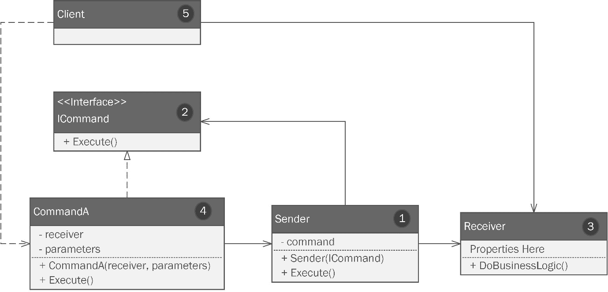
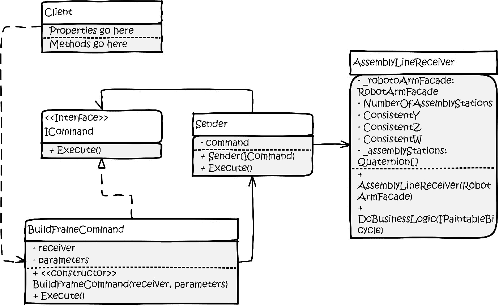
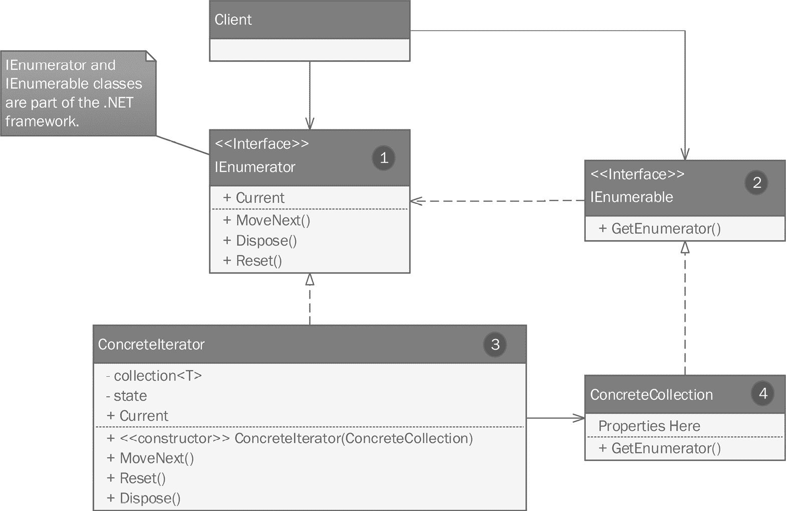
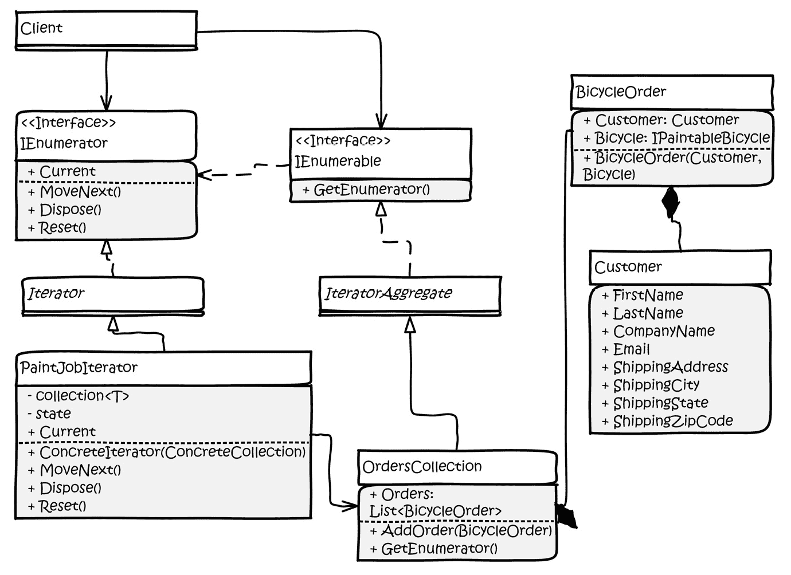
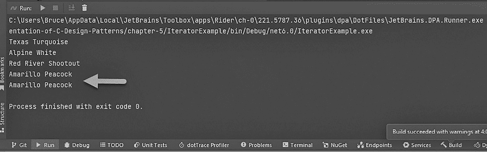
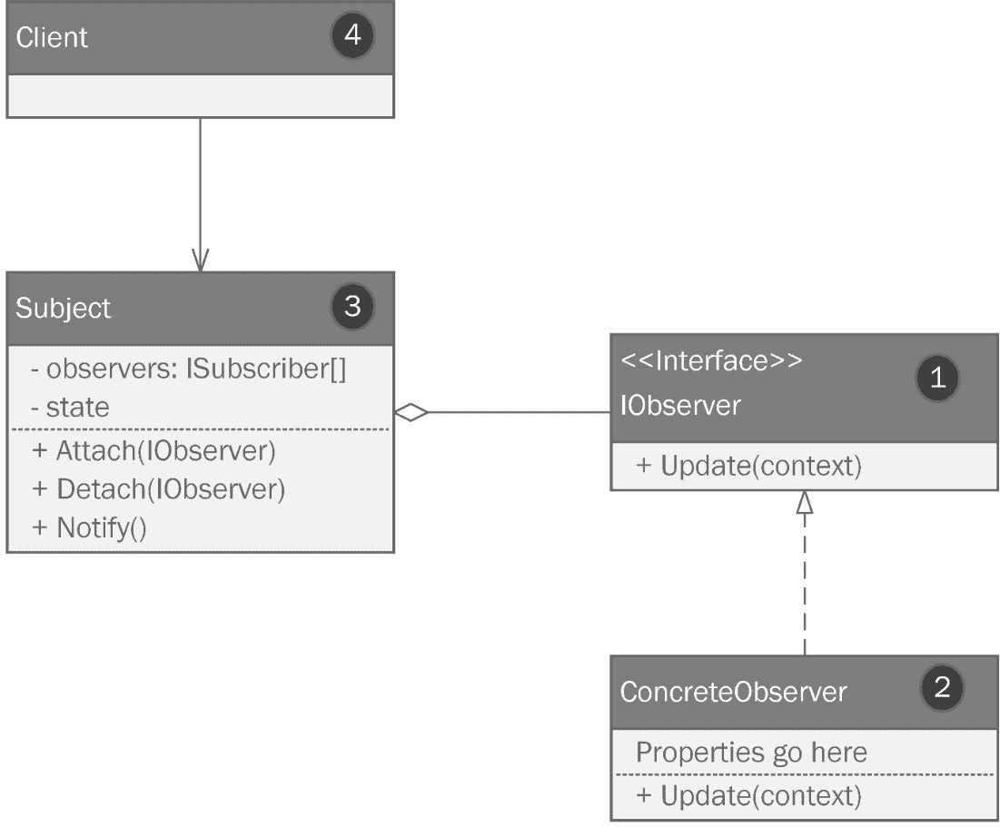
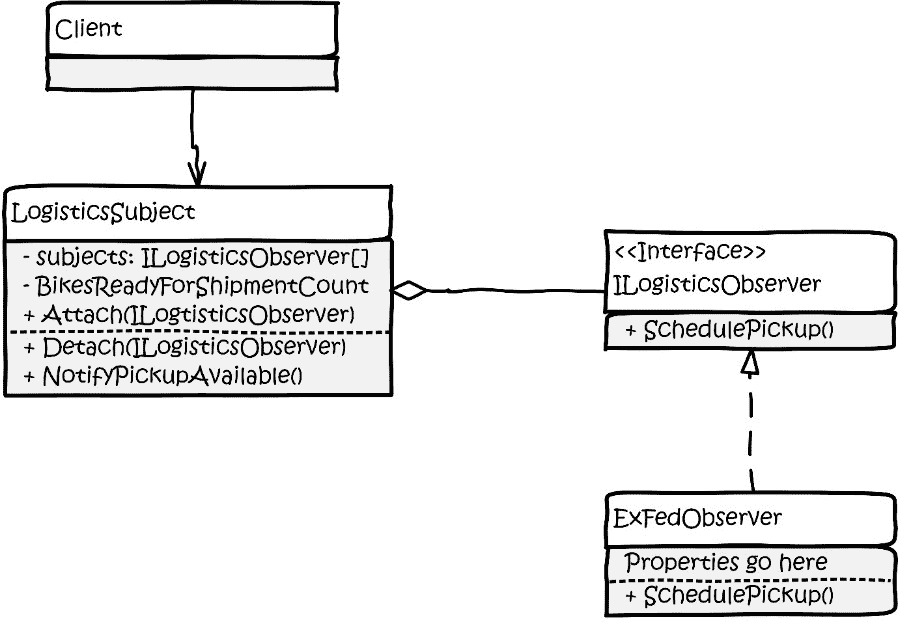
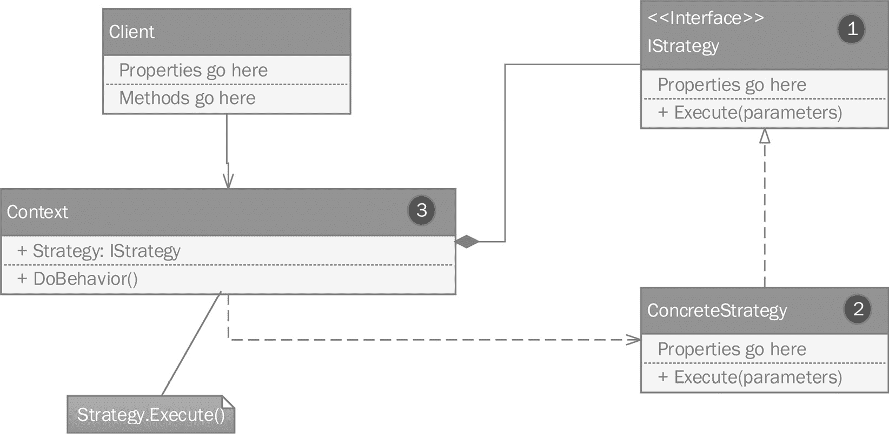
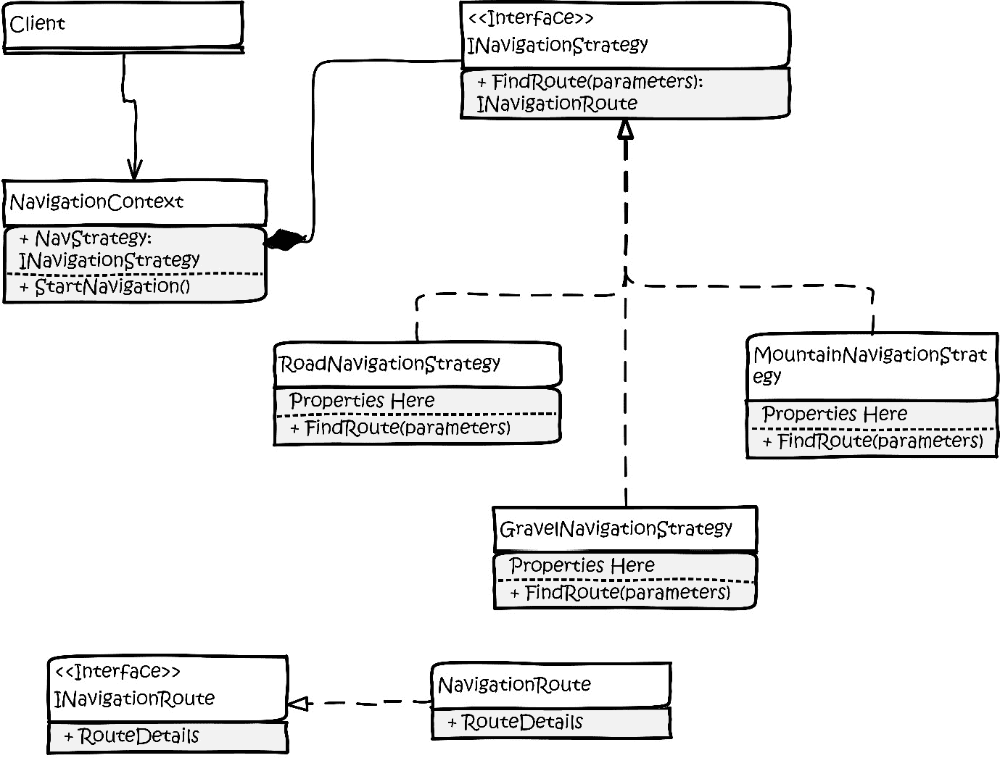

# 通过应用行为模式整理问题代码

你想找点不涉及代码的乐子吗？下次当你发现自己在一座高楼里，有电梯的时候，和三四个朋友一起坐电梯到顶层。这里有趣的部分是：让你们小组的每个人都面朝电梯的后方。当其他人上电梯时，他们几乎总是会跟随你的领导，面朝后方。这是因为人类行为遵循模式！有整个研究领域致力于这一事实，包括心理学、社会学，以及市场营销和人际关系应用的领域。

软件是人类发明，所以软件也可以被设计成遵循行为模式也就不足为奇了。行为模式是处理你类中实现的算法以及这些类如何交互和共享执行这些算法的责任的模式。

随着故事的发展，Kitty 和 Phoebe 将面临需要他们学习和实现四种最受欢迎的行为模式的挑战：

+   **命令模式**

+   **迭代器模式**

+   **观察者模式**

+   **策略模式**

在你跟随他们的旅程中，你将学习如何使用 **C#** 语言绘制和实现四种最受欢迎的行为模式。

# 技术要求

在这本书的整个过程中，我假设你知道如何在你的首选 **集成开发环境**（**IDE**）中创建新的 C#项目，所以我在章节本身中不会花费时间在设置和运行项目的机制上。这本书的附录 1 中有关于三个最受欢迎的 IDE 的简短教程。如果你决定跟随，你需要以下内容：

+   运行 **Windows** 操作系统的计算机。我使用的是 **Windows 10**。由于项目是简单的命令行项目，我相当确信这些内容在 **Mac** 或 **Linux** 上也能工作，但我还没有在这些操作系统上测试过这些项目。

+   一个支持的开发环境，例如 **Visual Studio**、**JetBrains Rider** 或 **Visual Studio Code** 并带有 C#扩展。我使用的是 **Rider 2021.3.3**。

+   一些版本的 **.NET SDK**。同样，项目足够简单，我们的代码不应该依赖于任何特定版本。我恰好使用的是 **.NET Core 6 SDK**，我的代码的语法可能反映了这一点。

您可以在 GitHub 上找到本章的完整项目文件，地址为[`github.com/Kpackt/Real-World-Implementation-of-C-Design-Patterns/tree/main/chapter-5`](https://github.com/Kpackt/Real-World-Implementation-of-C-Design-Patterns/tree/main/chapter-5)。

# 同时，回到自行车工厂

“W00t！”菲比惊呼。基蒂吓了一跳，感到惊讶。她的妹妹不知怎么的，竟然用一种充满兴奋的方式发出了黑客俚语词汇，基蒂甚至能听到双-o 的音节被零所取代。“什么？”基蒂问道。菲比没有立即回答，于是基蒂抬头看，发现菲比正在围圈跳舞。穿着脏兮兮的工作服，把头发扎成马尾辫的菲比跳舞的样子并不罕见。基蒂意识到地板上有一排 10 个机器人手臂。这些手臂尽力模仿菲比的舞步。

这群没有编排的机械舞手臂，按照瓦加诺娃学院的标准来看并不令人印象深刻。然而，在这个由两名大四学生在废弃仓库里手工建造的机器人工厂的背景下，这却是一项惊人的成就。“太棒了！”基蒂笑着说道。姐妹俩手拉手围圈跳舞，几乎造成了一次大碰撞，因为机器人试图模仿她们的舞步。她们停止了跳舞，又笑了起来。“所以，我们完成了？”基蒂问道。“不，现在它们只是模仿它们看到的，”菲比回答道。“你说的‘看到’是什么意思？视觉从未是我们规格的一部分，”基蒂指出。“我知道，”菲比说。“我在楼上的一箱子里找到了布默的旧 Xbox。它上面连接了一个 Kinect，所以我把它清理干净，并将其连接到我们的测试客户端程序上。”布默是基蒂和菲比的表兄。他比基蒂大一岁，去年从拉斯维加斯大学毕业。他凭借电子竞技奖学金上大学，现在是一名职业选手。自然，他总是拥有最好的游戏装备。

基蒂记得 Kinect 是微软多年前作为其 Xbox 游戏平台的一部分出售的摄像头系统。它提供了一个基本的计算机视觉系统，能够识别人体形状。有一些游戏基于这样的想法：你可以站在摄像头前，游戏中的角色会根据他们“看到”你的移动方式来行动。自然，作为微软的技术，C#的 SDKs 很容易获得。

“真是个不错的主意！”凯蒂惊叹道。菲比喘着气继续说，“所以，我们从创世模式的工作中得到了一个良好的对象结构，也因为我们的结构模式，我们已经有一个工作系统的框架。”凯蒂反驳道，“确实如此，但我们还没有真正处理过驱动机器人的实际命令和控制系统。机器人可以凭借我们的测试程序独立运行。它们甚至可以自己制作自行车零件。”菲比以只有姐妹才能做到的方式完成了凯蒂的想法：“它们做不到的是一起工作！我昨晚又读了一些东西。结果发现有一整套模式可以使机器人协同工作。它们被称为行为模式！我认为我们可以用它们来控制我们的大多数系统，并编排机器人，使它们能够协同工作。”菲比走到白板前，解释了编写必要机器人控制系统的下一步步骤。

# 命令模式

到目前为止，菲比已经设计了两种不同的机器人臂模型。一套臂是大型并固定在地面上的。这些臂是固定的。第二套臂安装在轨道上，可以移动。这些臂主要用于将零件、材料和部分完成的自行车移动到不同的站点。一旦到达站点，较大的臂就会做大部分实际工作。

钉在地面的较大机械臂具有可互换的附件，这使得它们能够执行不同的任务。菲比根据装饰者模式设计了这种行为。记住，装饰者允许你在不直接修改现有类的情况下向其添加新行为。这是通过创建一个围绕原始类结构的新类来完成的，然后添加额外的行为。在这种情况下，装饰者是物理硬件。菲比对模式感到惊奇。她理解了与模式一起工作可能被视为一种设计哲学，就像是一种软件工程实践一样。菲比记得，模式是在软件工程仅由科学家在绝密军事实验室中进行的时候，由物理世界的建筑师设计的。

每个大型的固定式机械臂都可以安装不同的附件，用于焊接或用于抛光和打磨。每个机械臂都可以编程，以接收由较小的、可移动的轨道式机器人带来的材料。

菲比画出了她为凯蒂的想法，解释了她如何能够以灵活的方式模拟必要的机器人命令。

“凯蒂，你就这么想，”菲比开始说。“当我们在线订购衣服和鞋子时，我们挑选出我们想要购买的衣物。我们决定想要哪些连衣裙，以及它们的颜色和尺码。然后，我们告诉商店我们希望将衣物寄送到哪里。最后，我们向零售商提供付款详情，以及如果出现问题或疑问时如何联系我们的方式。订单是一个包含所有这些信息的结构。这正是我想做的。我想有一个可以发送命令的模式。命令应该包含机器人完成工作所需的所有信息。命令不应该与机器人的控制 API 紧密耦合。实际上，我应该能够向任何我们拥有的硬件发送命令。它并不特定于任何一台机器人，甚至不是它当时使用的附件。”

“我明白了，”凯蒂说。“所以，包含我们想要购买的衣物所有信息的订单可以同样容易地发送到世界上的任何一家商店。我们是命令的发送者。我们编译信息并发送给接收者。接收者并不特定于某一家商店，而且这个接收者可以是任何能够接收我们命令的设备。我们打包完成订单或命令所需的一切，然后由接收者来执行。”

“你明白了，妹妹！”菲比兴奋地说。她们都迫不及待地想要开始。菲比拿出了一张她在网上找到的图表，展示了模式的通用形式，如下所示：



图 5.1 – 命令模式。

让我们回顾一下模式的各个部分，它们已经适当编号：

1.  `Sender` 对象负责调用请求。例如，当菲比在线订购连衣裙时，网站正在收集必要的信息，并负责发送订单。

1.  `ICommand` 接口定义了一个用于执行命令的单个方法。发送者不创建命令。相反，它在构造函数中接收它，或者它可以作为一个属性设置。

1.  `Receiver` 类包含业务逻辑并执行实际工作。当菲比在线订购时，接收订单的商店就是接收者。业务逻辑可能因商店而异。每个商店可能都有不同的订单挑选、提取、结算和发货流程。逻辑由接收者决定。它接收包含它需要独立于发送者执行逻辑的命令。

1.  具体的命令类实现了 `ICommand` 接口，但同时也包含了一个指向接收器的引用，该接收器将执行命令，以及执行命令所需的任何属性或参数。

1.  客户实例化具体的命令类（**4**）并传入或设置命令所需的任何参数或属性，包括接收器的一个实例。

## 应用命令模式

菲比在适应从通用示例中学到的内容时绘制了她的模式想法。以下是她绘制的图案：



图 5.2 – 菲比绘制的命令模式图。

基蒂研究了这张图几分钟。菲比密切地观察着她。基蒂在想法突然闪现之前，脸上总是会有一种表情。一分钟过后，她说道：“我明白了！”当她走到仓库的角落并开始工作时，她已经开始工作了。几个小时后，她完成了命令模式的实现。你可以在本章代码的 `CommandExample` 项目中查看这个实现，该项目位于本书的 GitHub 仓库中。

## 编写命令模式

基蒂首先创建了 `ICommand` 接口：

```cs
public interface ICommand
{
    public void Execute();
}
```

接下来，她创建了一个具体命令，该命令实现了这个接口：

```cs
public class BuildFrameCommand : ICommand
{
    private AssemblyLineReceiver _assemblyLineReceiver;
```

记住，命令对象拥有接收器执行意图所需的一切，除了业务逻辑。如果你还记得菲比的解释，它甚至包括一个 `private` 字段来保存接收器本身。命令是自包含的。除了接收器，它还需要关于它负责构建的自行车的信息。基蒂添加了对 `BumbleBikesLibrary` 的项目引用，我们在 *第三章**，用创建型模式进行创新* 中讨论过。我们扩展了库以包括使用桥接模式在 *第三章**，用创建型模式进行创新* 中创建的 `IPaintableBicycle` 接口。作为提醒，尽可能使用接口。具体对象应该尽可能晚地发挥作用。这使你的设计更加灵活，并尊重 **SOLID** 原则：

```cs
    private IPaintableBicycle _bicycle;
```

接下来是一个构造函数，我们传递接收器和 `IPaintableBicycle`：

```cs
    public BuildFrameCommand(AssemblyLineReceiver 
        assemblyLineReceiver, IPaintableBicycle bicycle)
    {
        _assemblyLineReceiver = assemblyLineReceiver;
        _bicycle = bicycle;
    }
```

最后，我们有 `Execute()` 方法，这是 `ICommand` 接口所要求的。它所做的只是运行接收器内包含的业务逻辑：

```cs
    public void Execute()
    {
        _assemblyLineReceiver.DoBusinessLogic(_bicycle);
    }
}
```

`BuildFrameCommand` 类已经完成。现在，我们需要一个发送者。如前所述，发送者中并没有太多的事情发生。它只需要一个命令，基蒂指定为 `ICommand`，以及一个执行命令的方法，基蒂指定为 `DoCommand()`。`DoCommand()` 方法执行命令。这看起来有点反直觉；你可能会认为接收器执行命令。确实如此，但不是直接执行。如果你直接编写代码来执行，你很可能会将发送者、接收器和命令逻辑紧密耦合在一起，这正是我们想要避免的：

```cs
public class Sender
{
    private ICommand _command;
    public Sender(ICommand command)
    {
        _command = command;
    }
    public void DoCommand()
    {
        _command.Execute();
    }
}
```

基蒂完成了接收器的部分，她称之为 `AssemblyLineReceiver`。这个类背后的想法是它作为整个装配线的总控制。这是女孩们试图实现的整体编排的一部分。

`AssemblyLineReceiver` 类需要一个项目引用，指向我们在 *第三章* *《创意使用创建型模式》* 中使用外观模式所做的工程。如您所回忆的那样，外观模式允许我们将众多复杂的 API 呈现为一个单一、易于使用的接触点。在这种情况下，机器人的 API 来自不同的制造商。不同机器人手臂附件（焊接机、缓冲器和抓取器）的微控制器都来自不同的制造商，具有不同的 API。在 *第三章* *《创意使用创建型模式》* 中，Kitty 和 Phoebe 编写了一个外观模式，使其更容易使用，并隔离它们免受第三方代码未来变更带来的影响，这些变更将独立于 Bumble Bike 制造流程的业务需求而发展。

外观模式还包含了对地面安装的机器人线应该如何工作的封装。女孩们选择使用游戏行业通用的 `struct` 来表示装配线的空间布局。四元数 `struct` 可以在.NET 框架的 `System.Numerics` 库中找到。

`AssemblyLineReceiver` 类的第一部分只是设置了我们需要用于外观的内容：

```cs
public class AssemblyLineReceiver
{
    private readonly RobotArmFacade _robotArmFacade;
    private const int NumberOfAssemblyStations = 20;
    private const float ConsistentY = 52.0f;
    private const float ConsistentZ = 128.0f;
    private const float ConsistentW = 90.0f;
    private readonly Quaternion[] _assemblyStations;
```

四元数是一个复杂的概念。我并不是低估您的智慧；我只是在转述 Unity 3D 的文档，这是一个流行的 C#编写的视频游戏框架。在 Unity 的视频游戏工作中，你几乎无处不在都会遇到四元数。虚拟猫的位置和角度将使用四元数来定义。Unity 文档直接告诉你四元数是一个高级数学概念。简而言之，四元数是空间中三个点（用 *X*、*Y* 和 *Z* 表示）的组合，以及一个旋转向量（用 *W* 表示）。由于我们不需要在关于模式的书中深入研究四元数的内部结构，我们通过决定将其视为一条直线来简化了装配线的布局。因此，四元数中只有一个坐标在各个站点之间不同，对我们来说，那就是 *X* 坐标。其余的可以在工厂地面的标准高度（*Y*）和标准深度（*Z*）内保持不变。我们还将旋转保持为 90 度，以简化问题。总结来说，为了表示机器人在装配线上的位置，我们有四个坐标（*X*、*Y*、*Z* 和 *W*），但我们保持其中三个不变。只有 *X* 随着你在装配线一端到另一端移动而变化。

每个站点的装配位置都存储在一个四元数数组中。10 个手臂可以为 20 个站点提供服务。在接收器的构造函数中，我们通过用 20 个四元数填充 `_assemblyStations` 数组来设置我们的外观，以及每个站点的位置：

```cs
    public AssemblyLineReceiver(RobotArmFacade 
        robotArmFacade)
    {
        _robotArmFacade = robotArmFacade;
        _assemblyStations = new Quaternion
            [NumberOfAssemblyStations];

        for (var i = 0; i < NumberOfAssemblyStations; i++)
        {
            var xPosition = i * 25.0f;
            _assemblyStations[i] = new Quaternion
                (xPosition, ConsistentY, ConsistentZ, 
                    ConsistentW);
        }
    }
```

这需要很多设置，但也是一个很好的例子，说明了模式如何结合使用。它们都是更大谜题的一部分。接下来，我们将看看有趣的部分：执行业务逻辑的代码。这看起来会很熟悉。

女孩们将这段代码放在了测试`Program.cs`文件中，这是我们在*第四章**，使用结构化模式强化代码*中看到的`FacadeExample`代码。逻辑本身并不重要。在这种情况下，它是一系列步骤，将自行车框架从工作站移动到工作站，在组装和喷漆过程中进行。关键点是这里实际的业务逻辑所在。它被独立于发送者。在我们之前的例子中，店主不希望 Phoebe 告诉他们如何最好地挑选、包装和运送她选择的连衣裙。业务逻辑不是由发送者驱动的。同样，我们也不希望在命令本身中包含逻辑。命令代表执行逻辑所需的一切。它是订单，而不是店员在执行订单。

在 Kitty 的程序中，`DoBusinessLogic`方法接收`IPaintableBicycle`对象（本质上是对自行车的订单）并使用外观来操控机器人制造自行车：

```cs
    public void DoBusinessLogic(IPaintableBicycle bicycle)
    {
        // Now let's follow an abbreviated imaginary 
        // assembly of a bicycle frame by controlling a robot 
        // arm.
        // grabber gets the frame parts and takes them to 
        // station 1
        _robotArmFacade.ActiveAttachment = 
            ArmAttachments.Grabber;
        _robotArmFacade.MoveTo(_assemblyStations[0]);
        _robotArmFacade.Actuate();
        _robotArmFacade.MoveTo(_assemblyStations[1]);
… see the rest in the sample code.
```

让我们继续到最后一部分，即客户端。

## 测试命令模式的代码

我不会展示 Kitty 的所有客户端代码，因为它们既广泛又复杂，而是只展示她为`Program.cs`中的逻辑编写的简单测试程序。

记住，创建命令是客户端的职责。在这个例子中，作为顾客，Phoebe 的任务是在网上挑选一件连衣裙，指定其颜色，并提供她的支付和运输详情。在这里，客户端指定要建造的自行车类型，并利用桥接模式。它还可以指定喷漆工作。在这里，我们选择了一种简单的黑色喷漆，这是我们山地自行车的标准喷漆：

```cs
var blackPaintJob = new BlackPaintJob();
var standardMountainBike = new PaintableMountainBike
    (blackPaintJob);
```

我们需要访问机器人手臂外观的控制逻辑：

```cs
var robotArmFacade = new RobotArmFacade(new 
    WelderAttachmentApi(), new BuffingApi(), new 
        GrabbingApi());
```

我们必须创建一个命令，并传入完成命令所需的数据：

```cs
var cmd = new BuildFrameCommand(new AssemblyLineReceiver
    (robotArmFacade), standardMountainBike);
```

最后，我们必须创建一个发送者对象，并通过在发送者上调用`DoCommand`方法来启动一切。正如承诺的那样，发送者启动了动作，但它本身并不执行任何操作。当 Phoebe 在网上选择一件连衣裙时，她提交订单。是接收者来完成工作：

```cs
var sender = new Sender(cmd);
sender.DoCommand();
```

命令模式是我们将要讨论的所有模式中最有用和最受欢迎的模式之一。《设计模式：可复用面向对象软件的基础》（GoF）一书以及其他许多书籍都讨论了它如何应用于桌面或 Web 应用程序的用户界面层。UI 中的命令可以从 UI 的几个不同部分创建并发送到程序的其它部分。一个简单的例子是在保存文件时——你通常在程序中有一个**文件**菜单选项。你可能还有一个带有**保存**按钮的菜单栏，以及一个如*Ctrl*/*Command* + *S*这样的快捷键组合。这些都是发送者。命令模式允许你将接收器逻辑封装在一个地方。

当你需要执行一个动作且希望将其与可能调用该逻辑的任何紧密耦合的事物隔离时，你可以使用命令模式。在现实世界中，命令的给予、接收和执行是一个任何当过父母并下达命令、孩子执行命令的人都会熟悉的模式。命令由发送者发起，由接收者执行。事件链代表了一种我们都能理解和识别的行为模式。

实际上，一个完整的自行车订单将包含许多这些命令。在这里，我们已经搭建了车架并对其进行了喷漆。凯蒂将使用命令构建控制组装过程的其余逻辑，所以我们让她去做这件事，而我们则探索更多的模式。

接下来，我们将讨论 C#中的另一个基本概念：集合。在讨论集合时，我们将关注一个你可能多次使用过，甚至可能不知道它是一个模式的模式：迭代器模式。

# 迭代器模式

凯蒂在控制系统中工作进展顺利，她大量使用了命令模式。然后，她遇到了一些障碍。凯蒂的命令接收器逻辑只是从客户订单系统（如直接销售和经销商）接收自行车订单，请求按照接收的顺序进行处理。因此，凯蒂和菲比注意到了速度的下降。尽管`AssemblyLineReceiver`中的算法已经优化，可以高效地生产自行车，但凯蒂没有考虑到喷漆过程。

从时间和金钱的角度来看，喷漆过程中最昂贵的部分是设置一切以便喷漆自行车。在每种自行车只能喷一种颜色的时候，这很容易。现在，Bumble Bikes 支持定制喷漆。由于在放置定制订单时必须彻底清洁和重置喷漆设备，姐妹们因定制工作而浪费了时间和金钱。喷漆系统必须混合所需的颜色，将其应用于定制订单，然后重置为更常见的颜色，如红色或黑色。这每天会发生多次，因此当收到定制工作请求时，它会阻碍其后的所有其他自行车。Phoebe 指出，在她父亲多年前做印刷工作时，他会根据墨水颜色要求分组他的工作，以最大限度地减少他必须清洁和重新上墨印刷机次数。姐妹们需要按喷漆工作类型分组订单，这样她们就可以批量完成所有定制工作，并且每天只需要清洁和重置一次。她们可以调整客户对定制喷漆请求的交货日期的期望，但这并不是不正常的零售情况。Kitty 需要找出如何高效灵活地分组喷漆订单。

Kitty 的第一个想法是采用`foreach`循环。虽然这样做很整洁，但在她希望她的软件可能有一天需要扩展的规模上可能会出现问题。

在 C#的工作中，`foreach`循环针对集合，并允许您遍历其元素——也就是说，您可以逐个处理集合中的每个项目。C#中的集合是强类型的，这意味着集合中的每个对象，例如一个`List`，都是同一类型。自行车的订单订单被存储在数据库中，并在一天中分批加载到`List<BicycleOrder>`中。`BicycleOrder`类的代码如下：

```cs
public class BicycleOrder
{
    public Customer Customer { get; set; }
    public IPaintableBicycle Bicycle { get; set; }
    public BicycleOrder(Customer customer, 
        IPaintableBicycle bicycle)
    {
        Customer = customer;
        Bicycle = bicycle;
    }
}
```

C#在`foreach`循环中使用的标准迭代器是按添加顺序返回订单的。也就是说，它们操作`foreach`循环处理。Kitty 需要的是一个先返回所有常规喷漆订单，然后是定制喷漆订单的迭代器。简而言之，她需要一个自定义迭代器。C#中的迭代器遵循迭代器模式。这应该不会令人惊讶，尽管你可能不知道这是一个模式。以下图示使用 UML 展示了迭代器模式：



图 5.3 – 一个自定义迭代器遵循迭代器模式，其中 C#已经为您部分实现了。

让我们回顾一下模式的各个部分，它们已经被适当地编号：

1.  `IEnumerator` 接口是 .NET 框架的一部分，因此这次你不需要从头开始创建它。该接口需要一个名为 `Current` 的属性，它返回迭代中的当前元素。所需的 `MoveNext()` 方法是用于将迭代推进到下一个元素的机制。

1.  `IEnumerable` 是 C# 中另一个接口，因此，你同样不需要自己创建它。它需要一个名为 `GetEnumerator()` 的方法，这个方法提供了我们自定义枚举器的实例。

1.  实现 `IEnumerator` 接口的具体迭代器将在类的 `private` 字段中拥有集合。集合，以及通过扩展迭代器，使用泛型工作，如 `<T>` 所示。这意味着它们可以适应任何类型，包括你创建的任何类。该类有一个构造函数，它接受一个具体集合。通过这种方式，我们指的是在 `ConcreteCollection` 中实现的打算迭代的集合。

1.  一个具体集合。

如所述，标准迭代器只是提供了一个遍历集合的方法。C# 中的每个集合——而且有很多——都有一个通用的迭代器，它按顺序遍历集合。任何时候你的业务逻辑需要你的迭代不是 FIFO（先进先出）时，最好将算法封装在自定义迭代器中。我们已达到这样的时刻。也许你的迭代器将具有在集合中移动的独创算法。一个虚构的例子可能是一个只迭代集合中奇数或偶数元素的迭代器。也许你需要一个按字母顺序迭代字符串的迭代器。Kitty 的问题是现实世界的问题——她需要在正常迭代之前根据油漆要求过滤和排序集合。

## 应用迭代器模式

让我们看看 Kitty 如何应用这个模式，如下面的图所示。请注意，`IEnumerable` 和 `IEnumerator` 是 .NET 框架的一部分，不需要实际实现：



图 5.4 – Kitty 实现的迭代器模式。

迭代器总是具有相同的部分。我们的具体集合称为 `OrderCollection`，它最终通过一个名为 `IteratorAggregate` 的抽象类实现了 C# 的 `IEnumerable` 接口。具体的迭代器是一个名为 `PaintJobIterator` 的类，它继承自一个将实现接口要求的抽象基类。`PaintJobIterator` 类包含根据油漆作业类型对集合进行排序的逻辑。自定义作业将最后完成，这样我们就可以立即发货标准订单自行车。我们的客户对等待额外一天以完成定制油漆作业是可以接受的，因此这些作业最后完成。

`OrderCollection`和`PaintJobIterator`类分别从`IteratorAggregate`和`Iterator`基类继承。这些类只是实现相应接口的抽象类。如果你打算在项目中创建多个自定义迭代器，它们是有用的。

## 编写迭代器模式

我们已经看到了`BicycleOrder`类的代码。这个类包含对另一个名为`Customer`的类的引用，这基本上是你所期望的。Kitty 使用了`System.Net.Mail`中的`MailAddress`类。其余的都是字符串：

```cs
public class Customer
{
    public string FirstName { get; set; }
    public string LastName { get; set; }
    public string CompanyName { get; set; }
    public MailAddress Email { get; set; }
    public string ShippingAddress { get; set; }
    public string ShippingCity { get; set; }
    public string ShippingState { get; set; }
    public string ShippingZipCode { get; set; }

}
```

记住，`IEnumerator`和`IEnumerable`接口是.NET 框架中`System.Collections`的一部分，所以我们不需要编写这些代码。然而，Kitty 选择为它们创建抽象类。第一个在`Iterator.cs`文件中：

```cs
public abstract class Iterator : IEnumerator
{
    object IEnumerator.Current => Current();
    public abstract int Key();
    public abstract bool MoveNext();
    public abstract void Reset();
    protected abstract object Current();
}
```

这是一个实现`IEnumerator`接口的抽象类。Kitty 在`IteratorAggregate.cs`文件中为`IEnumerable`接口创建了另一个。需要实现一个方法来符合该接口：

```cs
public abstract class IteratorAggregate : IEnumerable
{
    public abstract IEnumerator GetEnumerator();
}
```

到目前为止，这只是一些样板代码。现在，让我们继续到好的部分。第一部分是 Kitty 自定义的集合，称为`OrdersCollection`。这只是一个`List<BicycleOrder>`的包装：

```cs
public class OrdersCollection : IteratorAggregate
{
    public List<BicycleOrder> Orders { get; set; }
```

一个无参数的构造函数确保我们从空列表开始：

```cs
    public OrdersCollection()
    {
        Orders = new List<BicycleOrder>();
    }
```

在这里，我们有一个简单的传递到`List`的`Add`方法。小测验：这看起来像我们已经覆盖过的另一个模式吗？可能是装饰者模式？

```cs
    public void AddOrder(BicycleOrder order)
    {
        Orders.Add(order);
    }
```

这里是神奇的部分。当我们实现我们的集合时，我们需要`GetEnumerator`方法返回我们的自定义迭代器，我们还没有编写它。我们正在覆盖前面提到的抽象`IteratorAggregate`类中的抽象方法，并且我们返回`PaintOrderIterator`，如下所示：

```cs
    public override IEnumerator GetEnumerator()
    {
        return new PaintOrderIterator(this);
    }
}
```

最后，我们有了这个模式的核心——实际的迭代器本身：

```cs
public class PaintOrderIterator : Iterator
{
```

这个类的大部分内容是实现`IEnumerator`接口中表达的要求，我们在前面看到的抽象`Iterator`类中表达这些要求。首先，我们可以看到一个`private`字段，它持有我们刚刚看到的`OrdersCollection`类的引用：

```cs
    private readonly OrdersCollection _orders;
```

当迭代器在集合中移动时，我们需要跟踪其位置：

```cs
    private int _position;
```

构造函数接受`OrdersCollection`并设置`private`字段，以及初始位置。初始位置从`-1`开始，因为我们还没有开始迭代，如果我们将其设置为`0`，我们将指示集合中的实际位置：

```cs
    public PaintOrderIterator(OrdersCollection orders)
    {
        _orders = SeparateCustomPaintJobOrders(orders);
        _position = -1;
    }
```

我们可能需要一种方法来获取私有`_position`字段。我们将使用只读的`Key()`方法来完成此操作：

```cs
    public override int Key()
    {
        return _position;
    }
```

迭代器通过`foreach`循环被调用，该循环调用`MoveNext()`方法将迭代向前移动，直到达到集合的末尾：

```cs
    public override bool MoveNext()
    {
        var updatedPosition = _position + 1;
        if (updatedPosition < 0 || updatedPosition >= 
            _orders.Orders.Count) return false;
        _position = updatedPosition;
        return true;
    }
```

接口要求必须有一种方法可以将迭代器位置重置到集合的开始位置：

```cs
    public override void Reset()
    {
        _position = 0;
    }
```

`Current()` 给我们集合中当前迭代的对象。不要与一分钟前我们看到的 `Key()` 方法混淆。`Key()` 给你数字索引或位置，而 `Current()` 给你键的位置的内容：

```cs
    protected override object Current()
    {
        return _orders.Orders[_position];
    }
```

这是我们的定制。我们在这里所做的只是迭代开始之前重新排序集合。Kitty 制作了两个列表。一个将包含 `BicycleOrder` 对象，其中 `PaintJob` 属性中的类是标准喷漆工作，而另一个将包含定制喷漆订单。当我们将它们分开后，简单地重新组合带有定制工作的列表即可：

```cs
    private OrdersCollection SeparateCustomPaintJobOrders 
        (OrdersCollection orders)
    {
        var customPaintJobOrders = new List
            <BicycleOrder>();
        var standardPaintJobOrders = new List
            <BicycleOrder>();
        foreach (var order in orders.Orders)
        {
            var paintJob = order.Bicycle.PaintJob;
```

如果你还记得我们在桥接模式覆盖期间构建这个类的时候，标准单色喷漆工作是用 `IPaintJob` 接口表示的。同样，定制喷漆工作也是。我们的定制喷漆工作是在 `CustomGradientPaintJob` 类中定义的，它是 `IPaintJob` 的不同实现。Kitty 在 `IPaintJob` 接口和实际实现之间使用了一个抽象类。这个中间类被称为 `CustomGradientPaintJob`，这意味着我们可以检测喷漆工作的基类并根据情况采取行动：

```cs
            bool isCustom = paintJob.GetType().IsSubclassOf
                (typeof(CustomGradientPaintJob));
            if(isCustom)
            {
                customPaintJobOrders.Add(order);
            }
            else
            {
                standardPaintJobOrders.Add(order);
            }
        }
```

现在我们有了常规喷漆订单列表和定制喷漆订单列表，我们可以替换原始 `orders` 列表的内容：

```cs
        orders.Orders.Clear();
```

然后，我们可以将标准订单重新添加进去：

```cs
        orders.Orders.AddRange(standardPaintJobOrders);
```

这后面跟着定制喷漆订单：

```cs
        orders.Orders.AddRange(customPaintJobOrders);
        return orders;
    }
}
```

完成！现在，Kitty 需要一个快速程序来在 `Program.cs` 中进行测试。当我说是“快速”的时候，它只有几行长，因为我们需要在测试程序中创建所有部分，包括客户、自行车、订单列表以及通过 `foreach` 循环创建的自定义迭代器。记住，我们正在从不同的包中引入一些类。`Customer` 类使用 `System.Net.Mail`，它是 .NET 框架的一部分。自行车将来自 `BumbleBikesLibrary.PaintableBicycles`，而喷漆工作将来自 `BumbleBikesLibrary.PaintableBicycle.CommonPaintJobs`：

```cs
using System.Net.Mail;
using BumbleBikesLibrary.PaintableBicycle;
using BumbleBikesLibrary.PaintableBicycle.CommonPaintJobs;
using IteratorExample;
```

迭代器需要一些可以迭代的内容，所以让我们创建一个空的 `OrdersCollection` 类：

```cs
var orders = new OrdersCollection();
```

现在，我们需要一个客户。在现实生活中，可能会有几个，但为了我们的示例，我们只使用一个：

```cs
var dealership = new Customer
{
    FirstName = "John",
    LastName = "Galt",
    CompanyName = "Atlas Cycling",
    Email = new MailAddress("johngalt@whois.com"),
    ShippingAddress = "123 Singleton Drive",
    ShippingCity = "Dallas",
    ShippingState = "Tx",
    ShippingZipCode = "75248"
};
```

现在，我们需要自行车来放入订单。让我们不要浪费时间，制作一辆带有定制喷漆工作的自行车！这样，我们知道列表前面有一辆。当迭代器重新排序列表时，所有这些都应该在最后：

```cs
var amarilloPeacockPaintjob = new 
     AmarilloPeacockPaintJob();
var bicycle0 = new PaintableMountainBike
    (amarilloPeacockPaintjob);
```

一旦你有一辆带有喷漆和客户的自行车，你就可以创建一个订单并将其添加到 `orders` 列表中：

```cs
var order0 = new BicycleOrder(dealership, bicycle0);
orders.AddOrder(order0);
```

接下来，让我们对一些标准喷漆工作做同样的事情，当我们在迭代时，这些工作将出现在列表的前面。首先，让我们添加一辆青绿色巡航自行车：

```cs
var turquoisePaintJob = new BluePaintJob();
var bicycle1 = new PaintableCruiser(turquoisePaintJob);
var order1 = new BicycleOrder(dealership, bicycle1);
orders.AddOrder(order1);
```

那么一辆白色公路自行车呢？

```cs
var whitePaintJob = new WhitePaintJob();
var bicycle2 = new PaintableRoadBike(whitePaintJob);
var order2 = new BicycleOrder(dealership, bicycle2);
orders.AddOrder(order2);
```

为了保持有趣，让我们再添加一辆定制自行车。这次，我们将添加一辆带有定制渐变喷漆的躺式自行车：

```cs
var bicycle3 = new PaintableRecumbent
    (amarilloPeacockPaintjob);
var order3 = new BicycleOrder(dealership, bicycle3);
orders.AddOrder(order3);
```

这是一个标准的红色公路自行车：

```cs
var redPaintJob = new RedPaintJob();
var bicycle4 = new PaintableRoadBike(redPaintJob);
var order4 = new BicycleOrder(dealership, bicycle4);
orders.AddOrder(order4);
```

这应该足够进行有意义的测试。

## 尝试新的迭代器

现在，让我们尝试我们的迭代器。如果一切顺利，这应该看起来就像你在 C#中看到的任何迭代一样：

```cs
foreach (BicycleOrder order in orders)
{
    Console.WriteLine(order.Bicycle.PaintJob.Name);
}
```

`foreach`循环几乎没有什么悬念，不是吗？这就是我们知道我们做得好的原因。你无法分辨出我们的自定义迭代器与 C#或.NET 中提供的任何常见迭代器有何不同。常规的`foreach`循环包含了提取我们的自定义迭代器并使用它通过`MoveNext()`和`Current`方法（我们具体类中拥有的方法）在集合中移动的机制。当 Kitty 运行测试程序时，她可以看到我们希望看到的结果：



图 5.5 – Kitty 对她自定义迭代器的测试运行。

就像 Kitty 学到的，迭代器模式是我们日常工作中最重要的模式之一。尽管有几个不同的部分，但它并不复杂。当你需要以不同于标准 FIFO 处理顺序的方式处理任何类型的集合时，你都可以使用这个模式。

你应该总是寻找机会使用这种模式。*寻找*…嘿，这让我想起了我们下一个模式！

# 观察者模式

我们最大的恐惧变成了现实。Bumble Bikes 变得如此受欢迎，以至于 Kitty 和 Phoebe 开始遇到物流问题。“别误会我，”Phoebe 说。“这是一个好问题。如果我们能优化我们的运输成本，我们可能会更有利可图。最难的部分是第一英里。我们如何能更有效地把自行车运到全国货运站的仓库呢？”Kitty 安排了一个**Zoom**会议，与提供包装和运输支持作为服务的**ExFed**的小企业主进行了交流。Cathy 是位于达拉斯的**ExFed**代表，John 是位于 Kitty 工厂所在地的 Alpine 的代表，他们仔细听取了 Bumble Bikes 的困境。

“良好的物流工作流程的关键，”Cathy 说，“是确保每次卡车离开你的工厂时，它都装满了自行车。当卡车回来时，它应该装满了为下一批自行车准备的原料。”女孩们还没有考虑到 Cathy 解释的第二部分。John 表示同意。在 Phoebe 解释了她的自动化工厂是如何工作之后，四个人在电话中商讨了一些细节。

“你已经向原材料供应商发出了一个信号，告诉他们何时消耗材料来制作自行车，”John 指出。Cathy 接过了他的思路并完成了它。“对——我们需要的只是得到一个信号，让我们知道何时有一车自行车供我们取货。我们的卡车可以把自行车运到全国货运站的仓库，就像其他任何货运一样。”

菲比说：“没问题！我们只需在我们的自行车对象中添加另一个装饰器类。”约翰和凯西茫然地看着他们各自的摄像头。“菲比！他们说的不是我们说的*极客话*！”凯蒂责备道。“而且，那不会起作用。每辆自行车的原材料使用情况都会报告。我们不想为每辆自行车发送取货信号。那会效率低下。”

“如果那样做，你会，”约翰说，“我们可能会带着半满的卡车离开。根据你的包装尺寸，我们需要每批至少有 10 辆自行车才能使我们的服务具有成本效益。”

“我们需要的是，”凯蒂开始说，“当至少有 10 辆自行车准备好被取走时，能够发送信号的某种东西。”

“好吧，”凯西说，“你需要有人在装配线的末端数自行车，当它们达到 10 辆时，在我们的网站上点击一个按钮。之后，大约需要 30 分钟才能把卡车开到你的码头。”

菲比不露痕迹地翻了个白眼。她的妹妹轻蔑地笑了笑。想想世界上所有那些不会说“极客话”且不理解软件自动化的“普通人”，他们过着多么艰难和未满足的生活！菲比和凯蒂知道他们一定会找到一种自动化他们的供应请求的方法。

“但是在这段时间里，”菲比继续说，“我们可能又制造了 5 到 10 辆自行车。这有问题吗？”

“不，”约翰说，“我们只需要至少 10 辆。”

约翰和凯西挂断了电话，列出了待办事项清单，并通过虚拟握手达成了一项处理 Bumble Bikes 首公里物流的协议。凯蒂和菲比继续在 Zoom 上进行头脑风暴。“凯西说我们需要有人在自行车从装配线下来时进行计数。我不想付钱给某人只是坐着观察。”

“就这样了！凯蒂，你真是个天才！”菲比大声说道。凯蒂带着疑惑的笑容。她不确定自己做了什么值得这种罕见的姐妹赞扬。

菲比意识到这种情况需要的是**观察者模式**。凯西设想了一个人在自行车计数达到至少 10 辆时观察过程并做出反应。为了自动化这个过程，女孩们将不得不编写能够**观察**生产过程并在达到所需的自行车库存时向物流公司发出信号的软件。观察者模式的通用图示如下：



图 5.6 – 观察者模式

观察者模式有两个基本部分——一个**主题**和一个或多个**观察者**。让我们回顾一下模式的各个部分，它们已经被适当地编号：

1.  接口描述了观察者的方法要求。该接口定义了一个公共的 `Update()` 方法。每当观察者“看到”它所观察的对象中发生有趣的事情时，就会调用 `Update()` 方法。

1.  我们的观察者具体实现逻辑包含了当观察者“看到”主题状态中的一些有趣变化时发生的行为。

1.  主题在进行一些有用的工作并保持其状态的同时，观察者在等待。请注意，观察者包含在主题内的一个集合中。另外，请注意`state`属性是`private`的。我们需要一种方式让观察者知道发生了有趣的事情。为此，我们有一个名为`Notify()`的函数。当触发条件发生时，`Notify()`方法可以遍历每个附加的观察者并调用其`Update()`方法。

1.  整个过程由我们称之为“客户端”的更大程序调用。

## 应用观察者模式

凯蒂打开 Zoom 的白板，他们合作实现了观察者模式，以解决以下图表所示的问题：



图 5.7 – 菲比和凯蒂实现的观察者模式，该模式可以发出信号让 ExFed 的卡车取走一批自行车。

这个很简单——我们需要一个主题和一个观察者。女孩们使用了一个接口，`ILogisticsObserver`，以防止`LogisticsSubject`类和名为`ExFedObserver`的具体观察者类之间的紧密耦合。

一旦他们画出了图表，他们各自打开了他们最喜欢的 IDE，该 IDE 包含协作编码功能。这意味着女孩们可以像坐在彼此旁边一样一起编码。

## 编码观察者模式

菲比轻松处理了`ILogisticsObserver`接口：

```cs
public interface ILogisticsObserver
{
    public void SchedulePickup();
}
```

凯蒂随后添加了一个具体观察者，该观察者消费了菲比的接口：

```cs
public class ExFedObserver : ILogisticsObserver
{
    public void SchedulePickup()
    {
        Console.WriteLine("ExFed has been notified that a 
            shipment is ready for pick up.");
    }
}
```

我省略了实际的 API 调用，因为凯蒂和菲比担心我可能会不小心泄露他们的 API 密钥。众所周知，只有业余爱好者会将 API 密钥提交到 GitHub，没有它代码将无法工作，所以我将其放在一个`Console.WriteLine`语句中作为替代。

`LogisticsSubject`类是真正的行动所在。它稍微长一些，所以女孩们一起工作：

```cs
public class LogisticsSubject
{
```

凯蒂添加了一个`List<ILogisticsObserver>`字段来存储所有观察者。然后她跟着一个典型的构造函数，初始化该字段：

```cs
    private readonly List<ILogisticsObserver> 
        _logisticsObservers;
    public LogisticsSubject()
    {
        _logisticsObservers = new 
            List<ILogisticsObserver>();
    }
```

菲比添加了一个`Attach`方法，允许我们添加一个或多个观察者，这些观察者是符合`ILogisticObserver`接口的对象：

```cs
    public void Attach(ILogisticsObserver observer)
    {
        _logisticsObservers.Add(observer);
        PrintObserversCount();
    }
```

同样，她还添加了一个可以从列表中删除观察者的方法：

```cs
    public void Detach(ILogisticsObserver observer)
    {
        _logisticsObservers.Remove(observer);
        PrintObserversCount();
    }
```

凯蒂意识到，如果他们有一种方法可以看到列表中的观察者，测试将会更容易。因此，她添加了一个快速方法来为初始运行提供一些输出。该方法简单地打印出存储在私有`_logisticsObservers`字段中的观察者数量：

```cs
    private void PrintObserversCount()
    {
        switch (_logisticsObservers.Count)
        {
            case < 1:
                Console.WriteLine("There are no 
                    observers.");
                break;
            case 1:
                Console.WriteLine("There is 1 observer");
                break;
            default:
                Console.WriteLine("There are " + 
                    _logisticsObservers.Count + " 
                        observers.");
                break;
        }
    }
```

最后，我们需要通知我们的观察者。通用的 UML 图指定了一个`Notify()`方法。我们称之为`NotifyPickupAvailable()`。它简单地遍历观察者，并在列表中的每个观察者上调用`SchedulePickup()`方法：

```cs
    public void NotifyPickupAvailable()
    {
        foreach (var observer in _logisticsObservers)
        {
            observer.SchedulePickup();
        }
    }
}
```

沿着姐姐的榜样，菲比在`Program.cs`中编写了测试程序。首先，她创建了一个`LogisticsSubject`的实例：

```cs
var logisticsSubject = new LogisticsSubject();
```

然后，她创建了观察者并将其附加到主题上：

```cs
var exFed = new ExFedObserver();
logisticsObserver.Attach(exFed);
```

接下来，让我们模拟制造 100 辆自行车。每次我们有 10 辆，我们就会发送一个通知：

```cs
var pickupOrder = new List<Bicycle>();
for (var i = 0; i < 99; i++)
{
    var bike = new MountainBike();
```

在这里，菲比只是在模拟时间的流逝，试图保持这是一个真实的模拟。她希望她的机器人能在 3 秒内制造出一辆自行车。在延迟之后，她使用`ToString`方法写出了自行车，并将其添加到`pickupOrder`列表中：

```cs
    Thread.Sleep(3000);
    Console.WriteLine(bike.ToString());
    pickupOrder.Add(bike);
```

我们的观察者逻辑检查我们是否有足够的自行车。如果有，它就会触发`NotifyPickupAvailable()`方法，该方法遍历所有观察者，并调用它们各自的`SchedulePickup()`方法：

```cs
    if (pickupOrder.Count > 9)
    {
        logisticsSubject.NotifyPickupAvailable();
```

在现实世界中，30 分钟后，一辆卡车才会到达 Bumble Bikes 取走他们的库存。然而，没有人想模拟这个过程，所以我们只是假装我们完成了，并清除了订单：

```cs
        pickupOrder.Clear();
    }
}
```

当我们完成一天的自行车制造后，我们可以断开连接。菲比理解工作与生活平衡对她工厂机器人的重要性：

```cs
logisticsSubject.Detach(exFed);
```

随着女孩们的软件操作使用中发现了越来越多的模式，需要解决的问题数量迅速减少。他们进入了每个软件项目都会经历的阶段，工作从开发新代码转向维护它。通常，在这个时候，高级开发者开始感到无聊，因为所有的大问题都已经被解决了。这些开发者必须做出选择：继续留在项目中，还是寻找另一个有新挑战的项目。这就是大多数软件公司发生的事情。当然，菲比作为一家自行车制造初创公司的杰出老板，绝不会屈服于单调乏味的诱惑？

# 策略模式

*“我无聊死了！”* 菲比对着房间另一边的姐姐大喊。凯蒂从阿尔卑斯山下来和 Lexi 一起审查一些电子表格，Lexi 是 Bumble Bikes 的会计主管。菲比和 Lexi 已经相识多年，所以当菲比有机会招募她时，她毫不犹豫地接受了。Lexi 习惯了菲比的古怪，对凯蒂笑了笑，合上笔记本电脑，说，*“我明天会帮你完成这件事。”*

当莱克西离开办公室时，菲比倒扣在沙发上，关掉电视声音，翻看着频道。她最终调到了第 52,381 频道，也就是*自行车频道*。Bumble Bikes 在这个频道上做了大量广告，此时，一个评论员正在评论自行车电脑。一个**自行车电脑**是一种报告你的速度和行驶距离的电子设备。高级型号可以追踪你的踏频，即你踩踏的节奏。一些甚至可以追踪你的心率以及骑手对踏板施加的力的电功率。

菲的脸开始变红。她倒扣的时间太长了，血液涌到了头部。她完全翻过来，露出了当她有一个价值百万美元的想法时的那个表情。

她的妹妹甚至不用看她就能看出她的想法。*“什么？”* 基蒂问。

菲比盯着天花板看了更长一段时间，她的眼睛来回移动。她在心里发明着什么。基蒂抬头看，能看到菲比头脑中的齿轮在转动。

*“自行车电脑！”* 菲比最后大喊道。*“它们为什么这么无聊？我是说真的！它们所做的只是告诉那些自行车爱好者他们有多棒。谁需要电脑来做这个？”* 这句话有点奇怪，但出自菲比之口，在 1 到 10 的评分中最多只有 4 分，1 分可能是像订购披萨这样的小事，10 分可能是她私下里已经放弃的工程问题的非连续性完成。

*“如果一辆自行车电脑能做一些酷炫的事情，就像我们汽车电脑那样？当然，它可能会追踪速度、距离、功率，以及那些自行车爱好者愿意为自行车电脑支付的一切。但它还会提供导航路线、小径和路况。这是骑手们想要了解和拥有的信息，以便他们能够完成下一次史诗般的骑行，”* 菲比脱口而出。这通常是菲比跑到她的实验室，订购一摞披萨和汽水的时候。然后，她会消失几天。姐妹俩最近的成功让她们有能力将实验室搬到各自的工厂。菲比的实验室里有一个浴室和一张从远墙到看起来像范德格拉夫发生器的床。*“她为什么需要那个？”* 基蒂默默地想。她早已放弃大声询问。那张床，铺满了之前工程冒险中的披萨盒子，看起来似乎从未有人睡过。

基蒂没有回应她姐姐关于自行车电脑用途的问题。她知道这是一个不应该被回答的问题。当基蒂第二天早上进来时，她注意到办公室里到处都是丢弃的披萨盒子和空汽水瓶。一个黑色的小盒子被安装在了菲比工作台上的把手组件上。菲比在她的实验室里睡着了。

好奇的小猫摆弄着盒子表面的按钮。菲比制作了一个带有一些传感器的迷你电脑。小猫能够找到吸引菲比想象力的导航功能。设计得很简陋，但功能齐全。*“嘿，姐姐，”*菲比含糊地咕哝着。*“它还没工作。我卡在导航上了。”*菲比的头又重重地倒在枕头上。小猫继续摆弄导航。她发现了问题：导航界面上允许你选择几种不同的地形。你可以搜索铺砌道路、砾石小径或山地小径的路线。然而，搜索结果始终只显示铺砌道路。原因很容易理解。

菲比正在利用知名的 GPS API 来计算她的路线。自然，这些 API 倾向于推荐铺砌的道路。菲比能够创建一个 API 的伪装和一个装饰器，稍微改变了默认行为，使得 API 不会推荐繁忙的高速公路，即使它们是最直接的路线。

在接下来的几个小时里，小猫研究了替代的地图 API，这些 API 更关注那些少有人走的道路，并优先考虑那些汽车无法到达的地方。她发现，每次她添加不同的 API 和路径查找算法，她的代码就开始变得复杂。她很容易看到在她不断增长的意大利面盘上，一个巨大的泥球正在形成。

经过一番重构和思考，她确定了一个应该可行的策略。剧透一下：*策略*就是她使用的模式的名字。这个模式很容易解释，因为模式的意思和英文中*pattern*这个词的意思是一样的。如果你试图实现一个复杂的目标，你就可以制定一个策略。在软件工程中，策略模式指的是灵活且可互换地处理一组算法。*算法*简单来说就是一组你可以遵循的步骤，用以在合理的时间内解决问题，并给出一致的结果。如果你要创建一个制作花生酱果酱三明治的算法，步骤将会很简单：

1.  在盘子上放两片面包。

1.  打开花生酱。

1.  用一把钝刀，在一片面包的一侧涂上花生酱。

1.  关闭花生酱罐。

1.  打开果酱。

1.  用另一把钝刀（你不喜欢别人用同一把刀，结果果酱弄到了你的果酱上吧？），在第二片面包的另一侧涂上一些果酱。

1.  关闭果酱罐。

1.  把第一片面包放在第二片面包上，让花生酱和果酱在面包片之间相遇。

那是一个算法。如果你遵循这个算法，我可以保证你最终会得到一个花生酱果酱三明治。这个算法可以在几分钟内完成，对我来说，这是一个合理的时间。我可以轻松地制作第二个算法来制作火鸡三明治，再制作一个来制作奶酪三明治。如果我用一个公共接口封装每个算法，我就可以根据我想要的哪种三明治来选择三明治制作策略。

Kitty 有一个需要算法从 A 点到 B 点的情况。她需要三种不同的策略，这些策略被编码为三个不同的算法。第一个算法将在铺砌的道路上找到一条路径。第二个将尝试使用砾石或未铺砌的道路。第三个将找到一条完全没有道路但可以用自行车通行的路径。她需要从 A 到 B 的这些路线遵循一个公共接口，并且她需要算法本身遵循一个公共接口，这样她就可以根据需要交换它们。

我们可以用 UML 来表示，如下面的图表所示：



图 5.8 – 策略模式。

让我们回顾一下模式的各个部分，它们已经被适当编号：

1.  `IStrategy`接口定义了一个实现你的算法的方法。在我们的例子中，它将被命名为`Run`，我们可以传递算法可能需要的任何数据，例如起始和结束位置的地理坐标。

1.  一个具体的策略对象，实现了`IStrategy`接口，将实现你的算法。

1.  一个上下文对象持有策略并可以使用某种方法执行它。我们称之为`DoBehavior()`。

关键在于所有算法都遵循`IStrategy`接口。这意味着我可以传递任何包含`Run`方法的策略对象中的算法来调用算法。在这个时候，算法是可以互换的。

## 应用策略模式

Kitty 为她自己的实现提出了一个图表，如下所示：



图 5.9 – Kitty 对策略模式实现的绘图。

Kitty 看了看正在深度睡眠中的 Phoebe。也许通过策略模式，她可以在她醒来之前修复这个软件。

## 编码策略模式

Phoebe 已经在图表的底部有了数据结构。她输入了`INavigationRoute`：

```cs
public interface INavigationRoute
{
    public string RouteDetails { get; set; }
}
```

她还有一个具体的`NavigationRoute`类。不幸的是，代表 Bumble Bikes 的律师 Karina 不允许我展示这部分代码。没关系。我们在这里是为了模式。接口和类都不是模式的一部分。它们只是实现中使用的结构。代替 Kitty 高度专有的数据结构，我将给你一个简单的字符串：

```cs
public class NavigationRoute : INavigationRoute
{
    public string RouteDetails { get; set; }
}
```

让我们继续到策略的一部分代码。我们将从`INavigationStrategy`接口开始。此接口用于使你的算法符合一个通用结构，以便它们可以互换：

```cs
public interface InavigationStrategy
{
    public InavigationRoute FindRoute(string parameters);
}
```

如前所述，Kitty 需要三个具体实现。第一个是用于在铺砌道路上寻找路线。Phoebe 已经实现了这个功能，所以 Kitty 只是重构了它以适应接口：

```cs
public class RoadNavigationStrategy : INavigationStrategy
{
    public INavigationRoute FindRoute(string parameters)
    {
        // This is where your amazing algorithm goes.  But 
        // since this is a book on patterns and not 
        // algorithms...
        return new NavigationRoute
        {
            RouteDetails = "I'm a road route."
        };
    }
}
```

然后，Kitty 创建了一个算法来寻找砾石道路路线：

```cs
public class GravelNavigationStrategy : INavigationStrategy
{
    public INavigationRoute FindRoute(string parameters)
    {
        // This is where your amazing algorithm goes.  But 
        // since this is a book on patterns and not 
        // algorithms...
        return new NavigationRoute
        {
            RouteDetails = "I'm a gravel route."
        };
    }
}
```

到目前为止，我预测你不会对第三个实现感到惊讶：

```cs
public class MountainNavigationStrategy : 
    INavigationStrategy
{
    public INavigationRoute FindRoute(string parameters)
    {
        // This is where your amazing algorithm goes.  But 
        // since this is a book on patterns and not 
        // algorithms...
        return new NavigationRoute
        {
            RouteDetails = "I'm a mountain route."
        };
    }

}
```

剩下的就是`NavigationContext`类：

```cs
public class NavigationContext
{
```

Kitty 使用一个简单的属性来保存她的导航策略。自然地，她声明了接口，而不是一个具体对象：

```cs
    public INavigationStrategy NavigationStrategy { get; 
        set; }
```

接下来是一个标准的构造函数。她将默认值设置为道路导航策略，因为这是 Phoebe 设备的默认设置：

```cs
    public NavigationContext()
    {
        NavigationStrategy = new RoadNavigationStrategy();
    }
```

最后，我们有一个方法来根据`NavigationStrategy`属性中的当前策略启动寻找我们正在寻找的路径的算法：

```cs
    public void StartNavigation()
    {
```

这里有很多酷的业务逻辑。最终，Kitty 使用策略生成路线：

```cs
        var route = NavigationStrategy.FindRoute
            ("parameters go here");
        Console.WriteLine(route.RouteDetails);
    }
}
```

实话实说，这是我见过的最具创新性的算法集。遗憾的是律师介入了。然而，我们确实看到了这个模式，它最终证明与一些更复杂的模式相比非常简单。

当你需要从一组相关算法中选择，这些算法都旨在实现一个共同目标时，就会使用策略模式。无论是制作三明治还是设计一套可互换的地理空间路径查找算法，使用策略模式将有助于保持你的代码可维护和易于阅读。Kitty 可以轻松地添加更多算法，而不会破坏任何现有的策略。

# 摘要

行为模式以保持软件可管理的方式与算法协同工作。在本章中，我们探讨了四种非常有用且流行的模式，这些模式可以用于解决各种设计问题。

命令模式可以用来隔离指令与执行它们的对象。这是我们在*第一章*，“你的意大利面盘上有一个大泥球”中讨论的反模式之一。将逻辑与具体结构紧密耦合会导致软件脆弱且易于复杂化。命令模式将帮助你避免这个陷阱。

迭代器模式在需要以某种方式迭代集合，而这种方式不是由标准的.NET 迭代器处理时使用。这个模式与一个集合一起工作，从第一个项目开始，然后直线迭代到最后一个项目。这可能是在处理之前操纵集合，或者可能是一种新颖的移动方式以满足业务需求。这个模式的一些基本构建块已经内置到.NET 框架的`System.Collections`命名空间中。在构建迭代器之前，你应该检查是否已经存在一个。

观察者模式由一个主题和一个或多个观察者组成。主题通知观察者主题状态中的特定触发条件。观察者模式广泛应用于众多应用中。许多使用过事件监听器的软件开发者都见识过并理解了这种技术的力量。

我们最后发现的模式是策略模式。当我们有一组具有共同目的的算法时，我们使用策略模式。策略模式通过将算法符合一个共同的接口来实现，该接口被注入到上下文中。然后，根据业务需求，算法可以互换使用。

在下一章中，一系列命运多舛的事件将迫使 Kitty 和 Phoebe 寻求一个陌生人的帮助。Bumble Bikes 最初是一个激情项目，后来变成了一项商业冒险，但它很快将变成一项人道主义援助。太多的软件开发者、工程师和架构师没有意识到他们拥有可以改变世界的超能力。赌注很高，Kitty 和 Phoebe 的压力太大。他们需要一个理解 SOLID 原则和模式的人来领导一个非常重要的项目。这个低调的陌生人能够胜任这项任务吗？你会吗？

# 问题

回答以下问题以测试你对本章知识的掌握：

1.  在一个上下文中，哪种模式用于使具有共同目的的算法可互换？

1.  哪种模式用于封装并发送指令到接收者，同时避免执行指令所需的数据和执行指令的逻辑之间的紧密耦合？

1.  哪种模式涉及一个*主题*和一个*观察者*？请注意，如果你错过这个问题，它将记录在你的永久记录中。

1.  哪种模式用于以非 FIFO 的方式处理集合？

1.  在实现迭代器模式时，.NET 框架中有哪两个接口是有用的？


# 第三部分：使用模式设计新项目

在学习了某些模式之后，让我们来看看设计过程。到目前为止，我们一直是在走一步看一步。如果我们首先退一步，用模式和 UML 来设计我们的项目，而不是直接进入代码，事情会变得多么容易，我们又能避免多少问题？本节将从这一角度探讨一个新的项目。我们首先将在*第六章*，*在编码前使用模式进行设计！远离 IDE*中，将新项目纯粹地设计成一系列图表。然后，我们将在*第七章*，*除了打字外别无他物：实现轮椅项目*中实现这个项目。最后一章总结了全书内容，旨在向您展示还有更多模式存在。实际上，它们无处不在！除了常见的四人帮集合之外，还有更多的发展模式，甚至还有更多超出了**面向对象编程**（**OOP**）的领域。你甚至还将学习创建和发布你自己的模式的文档过程！为了以防你是 C#、OOP 或 UML 的新手，我在最后附上了一个附录来回顾基本概念。

本部分涵盖了以下章节：

+   *第六章*, *在编码前使用模式进行设计！远离 IDE*

+   *第七章*, *除了打字外别无他物：实现轮椅项目*

+   *第八章*, *你现在知道了一些模式。接下来是什么？*

+   *附录 1*, *C#中面向对象原则的简要回顾*

+   *附录 2*, *统一建模语言入门*
