# 第六章：离开 IDE！在编码之前使用模式进行设计

这本书的主要重点是学习最流行和最广泛使用的 **Gang of Four (GoF) 模式**。这本书的次要重点是考虑在实际应用中使用这些模式，考虑到现实和不断变化的企业需求。太多关于复杂主题（如模式）的书充满了抽象、虚构或微不足道的例子。你已经学习了一些流行的模式，但如果你不能应用它们，它们就不会从你的编码中获得好处。多年来，我开发了一套对我有效的方法，并希望它对你也有效。我的方法会逐步引导你考虑新的设计，并逐步引入模式。

这可能是一个令人不安的发现，但本章不会提供任何代码示例。我们将遵循在编写代码之前先绘制代码图的做法。

本章我们将涵盖以下主题：

+   我们将观察 Bumble Bikes 的新软件架构师如何使用两步法为新项目创建 UML 设计。

+   新架构师将通过绘制项目的类和基本结构进行第一次审查。

+   然后，建筑师将进行第二次审查，在此期间，他们将识别适当的模式并根据需要更新图。

本章将继续讲述两位姐妹的故事。Bumble Bikes 的业务需求将发生巨大变化。我们将看到如何使用模式适应和克服这些变化带来的固有障碍。

# 技术要求

由于本章包含的是图表而不是代码，我关于**集成开发环境**（**IDEs**）的常规说法不适用。这次，我们需要一套不同的工具。有许多用于绘制 UML 图的工具。在现实世界中，绘图练习通常在白板上进行。在本章的几个地方，我会停下来挑战你进行绘图练习。

如果你想接受挑战，你需要一种创建和使用 UML 图的方法。如果你之前从未绘制过 UML 类图，这本书的*附录 2*中有简短的教程。白板适合绘制临时草图，但在这本书中，我的图需要更加持久，所以这里是我使用的方法：

+   运行 **Windows** 操作系统的计算机。我使用 **Windows 10**。说实话，这并不重要，因为所有操作系统的绘图工具都很丰富，而且有很多可以在浏览器中工作。

+   一个绘图工具。我使用 **Microsoft Visio**。市场上有很多 UML 工具。以下是我多年来使用的一些工具的简要列表：

+   **Microsoft Visio**

+   **StarUML**

+   **Altova UModel**

+   **Dia**

+   **Umbrello**

+   **UMLet**

+   **OmniGraffle**（仅限**Mac**）

你可以在 GitHub 上找到本章的完整项目文件，链接为[`github.com/Kpackt/Real-World-Implementation-of-C-Design-Patterns/tree/main/chapter-6`](https://github.com/Kpackt/Real-World-Implementation-of-C-Design-Patterns/tree/main/chapter-6)。

随着故事的发展，我们看到一个曲线球威胁要破坏姐妹们所完成的所有工作。在现实世界中，业务需求总是不断变化。有时这些变化很小，并不会真正影响项目。而有时，变化是激进的。姐妹们即将面临个人危机。她们应该如何应对？是选择捷径，随意修补一些问题，还是我们应该已经学到的，修补只会导致一大团混乱？然而，如果我们采取严谨和周到的态度，我们或许能够避免这种退化。

让我们看看会发生什么。

# 机构里的一天糟糕透顶

周五下午 3:58，汤姆在机构的电话响了。电话放在他的桌子上，他刚刚在和另一个隔间里的同事交谈。他们的开发团队一直在为一个客户的项目工作。前几轮发布都没有出现任何问题，客户非常满意。客户如此高兴，甚至送来了一大堆新的功能请求，并签署了合同延期。就在合同延期之后，事情开始变得糟糕。汤姆的开发团队远远落后于进度。实施最后一轮功能请求使得他们的客户产品变得不稳定，经常崩溃。汤姆目前正在参加代码审查会议。小组得出结论，项目的代码处于极度困境。他们的管理层为了迅速取得胜利并给新客户留下深刻印象，命令团队交付第一个原型。接下来的几轮发布来得很快。客户对机构的印象是他们完全由奇迹工作者组成。然而，在这层表象之下（这次不是模式），他们发现很难在不进行全面重写的情况下扩展和修复代码。他们发现他们已经创造了一大团混乱。

汤姆花了整整一分钟才将轮椅在隔间里转来转去，回到自己的办公桌前接听响起的电话。电话是他的上司的上司，斯蒂芬妮。“*这真奇怪，她从不给我打电话，*”汤姆想。“而且，她不是在安提瓜度假吗？”她本应下周才回来。

感到困惑，汤姆接起电话，斯蒂芬妮带着浓重的口音立刻开始说话。“汤姆！我们得谈谈。”这是一次简短的对话。它突然结束，汤姆在机构的雇佣关系也随之结束。他被解雇了。他感到震惊。一切原本都进行得很好，直到突然之间，一切都变了。斯蒂芬妮以喜怒无常著称，一旦她的主管团队中有人对她有任何不满的迹象，她就会惩罚她的员工。她正快速晋升到高层，她不会让一群书呆子破坏她的轨迹。

汤姆记得有一次，在一个不同的项目上，他想出了一个方法，通过自动化一个困难和易出错的流程来节省生产和时间。这成功了。项目通过了**质量保证**（**QA**）并一直进行到生产阶段。客户对这次发布没有投诉，汤姆的新方法将为未来的项目节省大量时间，从而使得这些项目更有利可图。直到在一次管理层聚餐中听到汤姆关于流程变更的消息，斯蒂芬妮才对汤姆的工作表现出兴趣。她非常愤怒。她如此讨厌这些变化，以至于她责备汤姆，并让他重新做整个项目。她撤回了生产中的发布，并在公司所有者面前将发布延迟归咎于汤姆。

汤姆希望当前项目的成功让他重新回到管理层的良好关系中。显然，并非如此。汤姆在那里愣了几分钟，然后他听到特拉维斯的电话响了。特拉维斯是一位热门的 C#开发者，他的隔间在汤姆旁边。特拉维斯非常讨厌斯蒂芬妮，以至于他在手机上为她设置了铃声。这是乐队 Electric Light Orchestra（ELO）的歌曲《Evil Woman》的副歌。当他听到这首歌标志性的吉他独奏时，他知道发生了什么。这不仅仅是汤姆被解雇，而是整个团队。一个接一个的电话响起，经过短暂而令人沮丧的单方面对话后，一种沉重的尴尬感像浓雾一样笼罩下来。

突然，团队的工作区被机构的安保团队淹没，他们要求开发者打包他们的个人物品。开发者被命令不要触摸电脑，甚至键盘。特拉维斯帮助汤姆打包，当他把箱子装进汤姆特别配置的丰田赛纳车后部时，汤姆正在帮忙。汤姆已经把货车改装成特殊设备，这让他能够自己驾驶，这是他的医生告诉他他永远无法独自做到的事情。转向机制是他自己的设计。汤姆想知道现在他失业了，他将如何继续支付货车的款项。

在接下来的几天里，汤姆在所有的招聘网站上四处寻找，希望能找到一份新工作。他的残疾使这变得很困难。他被困在轮椅上，手的使用有限。汤姆用脚打字编写代码，使用一个特殊的键盘。键盘安装在轮椅平台上，就在他的脚踝下方。汤姆还有语言障碍，这使得他很难被理解。特拉维斯和他的其他同事已经适应了他的声音，对他们来说，这并不是问题。他们理解他就像没有任何问题一样。汤姆意识到无论他去哪里，他都将不得不从头开始，而且这不会容易。当汤姆思考这个问题时，他意识到他错过了他的志愿者班次。每个月一次，汤姆会访问达拉斯医院最近受伤无法行走的患者。他帮助他们适应，并展示了非常实用的轮椅使用技巧。汤姆微笑着。也许当他寻找新工作时，他可以在慈善工作中投入更多的时间。

# Bumble Bikes 工厂 - 德克萨斯州达拉斯

那是一个黑暗且暴风雨的午夜。菲比清醒着。虽然她白天睡觉了，但她的妹妹契蒂完成了菲比革命性的自行车电脑的代码。当菲比看到她妹妹成功实现策略模式的结果时，她感到既嫉妒又自豪。现在轮到契蒂崩溃了。她在 Bumble Bikes 的休息室沙发上伸展开来。菲比的手机响了。是她母亲打来的。她母亲深夜打电话并不罕见。菲比拿起电话，她的表情变得僵硬。“契蒂，醒醒！爸爸住院了！”她对她的妹妹喊道。

契蒂半梦半醒，让她的妹妹驾驶吉普车去医院。她没有意识到这辆车能达到如此速度。当他们完成前往医院的高速公路 75 号州际公路的短途旅行时，契蒂从紧张恐惧中惊醒，她的手都攥白了。

他们发现母亲卡瑞娜在医院的病房外。“医生现在和他在一起，”她解释道。“发生了什么事？”菲比问道。她们能听到母亲声音中的恐惧。她们的父亲很坚强。他很少生病，而且他从不会抱怨那些每个人时不时都会有的普通疼痛。三位女性都没有想过她们会需要把他送到医院。

“他最近几天都很累。这个周末，他骑了你的一辆新公路自行车去参加*Cow Creek Classic*，”卡瑞娜解释道。女孩们知道这是一个由附近小镇当地扶轮社支持的慈善自行车拉力赛。“他还抱怨头上有个疹子。我们以为是感染了蜱虫咬伤或其他什么。今天早上当他醒来时，他无法抬起头离开枕头。他无法坐起来，而且他非常痛苦。他开始哭泣，停不下来。我打电话叫了救护车，他们把我们带来了。”

几个小时过去了。各种医生和护士进入房间又离开。有些人带着设备，而有些人则带着装有血液的试管离开房间。最后，主治医师从房间里走了出来。他身材高大，苗条，说话带有浓重的东欧口音，他穿着一件黑色皮夹克，而不是人们通常期望的实验室白大褂。菲比忍不住想，他让她想起了在电影中见过的每一个邦德反派。当他与卡瑞娜交谈时，他的英语说得又快又含糊，但他的话在效果上却非常精确。“你的丈夫患有皮肌炎。这是一种罕见的自身免疫性疾病，通常由病毒引起。我们需要一位外科医生来对他的腿进行活检以确认我的诊断。”基蒂问道，“那是什么意思？”

医生继续解释说，这种疾病的症状始于病毒。“身体会产生一种针对病毒的免疫反应。然而，一旦病毒消失，免疫反应就会错误地将健康组织误认为是感染并摧毁它。在皮肌炎的情况下，疾病攻击的是毛细血管，这些血管是细小的毛发状血管。每次你呼吸时，你的肺部都会将氧气添加到你的血液中。这种血液通过动脉携带营养输送到你身体的各个部位，包括你的肌肉。你的肌肉使用氧气和营养，然后通过静脉将废物材料排出，这些废物材料通过肝脏和肾脏被带走。在那里，细胞中的废物被过滤出来，血液返回心脏，然后到肺部，这个过程重新开始。皮肌炎攻击的是微小的毛细血管，这切断了你的肌肉与整个循环系统的联系。基本上，你的肌肉开始死亡。当这种情况发生时，身体会启动一种炎症反应，这会导致极大的痛苦。这就是为什么你父亲无法停止哭泣。”医生继续说。“想想你最糟糕的肌肉疼痛。我们可以通过检测一种叫做肌酸激酶（CK）的化学物质来测量这种疼痛。在你艰苦训练后的第一天或第二天，你的 CK 水平达到 150 单位是正常的。如果你是达拉斯牛仔橄榄球队在训练营的球员，他们的 CK 水平可能会高达 300 单位。你父亲的 CK 水平是 10,000 单位。我们已经给他开了类固醇和止痛药，让他感到舒适。”

“*治疗是什么*？”菲比问道。医生严肃地回答：“*硬皮病没有治愈方法**。我们可以尝试化疗来减少正在伤害他并破坏他肌肉的免疫反应。””凯蒂的脸色变得沉重，她几乎要哭出来了。这就是总是领先两步的思维方式的麻烦。“*如果它影响到他的心脏或他用来呼吸的肌肉怎么办*？”她问道。医生的表情坚定。“*疾病不会影响他的心脏，因为它是用不同类型的肌肉组织制成的。但他的横膈膜* *是个问题。这需要相当长的时间才会开始发生。让我们做一些测试并尝试一些治疗方法来减缓肌肉退化。我们需要为疾病争取时间。疾病进入缓解是可能的，”医生回答说。

“*你说没有治愈方法！*”菲比生气地说。她并不是生医生的气。她生气的是她不习惯感到无助。“*没有，”医生说。“但有时疾病会停止并进入休眠状态。他将永远拥有它，但如果他的身体能够找到平衡，他的肌肉可能会恢复正常。我不想给你任何虚假的希望。这种疾病非常罕见，所有患者对治疗的反应都不同。你父亲的病例非常严重。昨天他还能走路。今天，他不能了。他可能永远无法恢复，或者他明年可能完全没事。没有办法预测。现在，我们必须控制那些 CK 水平，并停止对你父亲肌肉的损害。”医生把手放在卡丽娜的胳膊上，专业而安慰地走开了，消失在尽管是深夜但仍然挤满实验室外套和手术服的人群中。

下个月对整个家庭来说都很艰难。他们不断地往返于化疗、物理治疗和无数次的检查。随着疾病的进展，女孩们的父亲失去了说话的能力，有一天，他再也无法吞咽。医生在他的胃壁上植入了一根橡胶喂食管，奇怪的新生活就这样继续了。他们四个人总是坚持医生关于缓解的想法。这可能会在任何一天发生，也可能永远不会发生。他们都选择了坚持“任何一天”。

他们的母亲，卡丽娜，与医疗保险公司在几周内进行了斗争。他们拒绝了一切关于他们父亲的医疗索赔，因为硬皮病非常罕见，美国食品药品监督管理局没有为其指定治疗方法。这意味着医生尝试的所有救命治疗方法都被拒绝，因为这些治疗方法被归类为实验性的。

另一场保险之战是关于一辆轮椅。显然，他们的父亲，由于他的胳膊和腿几乎无法使用，需要一辆电动轮椅，但他们没有 1 万美元来购买他们物理治疗团队推荐的那一辆。经过几个月的医院和门诊治疗，这个家庭负债大约 100 万美元，已经耗尽了他们的所有储蓄、股票和退休账户。这使得他们无法通过贷款购买轮椅。他们的父亲是一个骄傲的人，拒绝让女孩们卖 Bumble Bikes 来支付他的疾病费用。事实上，Bumble Bikes 的利润正在维持这个家庭的生计。在他们的母亲与保险公司多次交涉后，菲比脸上露出了她在工厂电视前倒立时的那种表情。似乎即将发生什么。一件激进的事情。

菲比的实验室门锁了 3 天。连披萨盒或汽水都不进出。在菲比电脑下方门缝的诡异光芒中，几个有机发光二极管显示器投下了奇怪的影子。第三天，她像天使一样滚开一块大石头。她左臂下夹着一个大尺寸打印机的卷筒。看起来像某种蓝图。菲比召集工厂里的每个人都来参加一个大型会议。阿尔卑斯山的工厂通过 Zoom 加入。好奇的凯蒂坐在会议室桌子头部的位置。在接下来的一个小时内，菲比揭示了她的计划。Bumble Bikes 现在将开始制造轮椅！凯蒂很兴奋，但在会议结束后，她提出了一个很大的问题。他们俩已经因为经营自行车业务和照顾他们的父亲而筋疲力尽。工厂必须保持开放以支付抵押贷款。他们需要帮助。他们需要一个人，这个人懂得软件编码和架构，最好是有人有与残疾人一起工作的经验，他们是他们的目标客户。他们希望这个人能将他们的新使命变成个人使命。

# 一家物理康复诊所 - 德克萨斯州达拉斯

“*你必须用床把自己弹到椅子上，*”汤姆说。他的话含糊不清且声音洪亮，但他的新病人理解了。病人被诊断出患有汤姆以前从未听说过的某种疾病：“*皮肤病什么什么*。”他正在教病人如何从床上到轮椅上。新病人没有足够的肌肉力量站起来和坐下，因此他不能轻易地从床到轮椅移动。他的医生们正在考虑在他能够掌握从床到椅子的移动后让他回家；另一种选择是被送到养老院。

病人决心不去养老院，尽管他在精细运动控制方面有所欠缺，但他可以通过大幅度的动作来弥补。汤姆有了让病人将身体向上推的想法，当他下来时，床上的弹簧会将他弹得足够高，以便像蹦床一样跳进轮椅。病人用尽全身力气向上跳。他弹了起来。他没跳进去，由于没有能力抓住自己，重重地摔在了冰冷的地板上。汤姆没有帮他站起来。病人知道他必须学会自己这样做。这很难看，但却是必要的。

“*现在就帮他站起来！*”一个妇女从门口大声喊道。汤姆对这巨大的噪音和两个令人惊艳的美丽女人故意朝病人走来的不寻常景象感到震惊。显然，当菲比发出命令时，并没有考虑到后勤问题。毕竟，汤姆不可能轻易地抱起一个 200 磅重的男人，把他放回椅子上。“*不，不要！*”女孩们的父亲虚弱地说。他理解。即使需要一分钟或几个小时，他都必须自己努力站起来。“*在外面等着*，”他们的父亲说。所有人都明白了，包括汤姆，他们被解除了。

小组在医院房间外等待，并进行了自我介绍。女孩们来告诉她们的父亲她们的计划，即为他，以及任何需要的人，制作一辆高质量的轮椅，即使他们无法支付。Bumble Bikes 一夜之间变成了一个慈善机构。当汤姆听到这些计划时，他的脸色变了，身体也僵硬了。他不知道，但那天早上离开家时，这将是他新工作的第一天。他一直梦想着在一家热门初创公司担任软件架构师。他知道他使用从一开始就使用的模式来设计新软件项目的经验将会很有价值。他找到了他的梦想工作。

# 使用模式进行设计

回到达拉斯工厂，凯蒂和菲比花了几天时间向汤姆介绍 Bumble Bikes 的所有细节。他得到了工厂的亲密参观（物理意义上的，不是图案上的）并了解了其运作和功能。他还研究了菲比和凯蒂设计的先进机器人系统。他的工作将是设计一个类似的系统来制造任何人见过的最好的轮椅。

汤姆和菲比一起工作，设计轮椅。设计有三个不同的型号。第一个，旗舰型号，是菲比对终极动力轮椅的想法。它被称为*德克萨斯坦克*，将会舒适且功能强大。这把椅子将能够通过使用类似于坦克或推土机的轨道设计，将它的主人带到任何地方。楼梯、越野地形，甚至冰都不是问题。你可以在这里看到**计算机辅助设计**（**CAD**）设计：

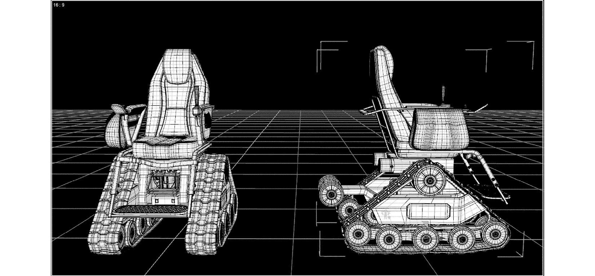

图 6.1：德克萨斯坦克将是电动轮椅的终极设计

汤姆又提出了第二个想法。他计划为那些不能使用腿但其他方面非常强壮的人制作一把椅子。他计划制作一个轻便快速，可能用于竞技运动，如篮球的椅子。菲比带着这个目标，设计了一款带有弧形轮子和较短的腰部支撑的轮椅，以允许更大的运动范围。她称之为 *Maverick*，这是一个按自己规则行事的牛仔。您可以在下面看到这个设计：

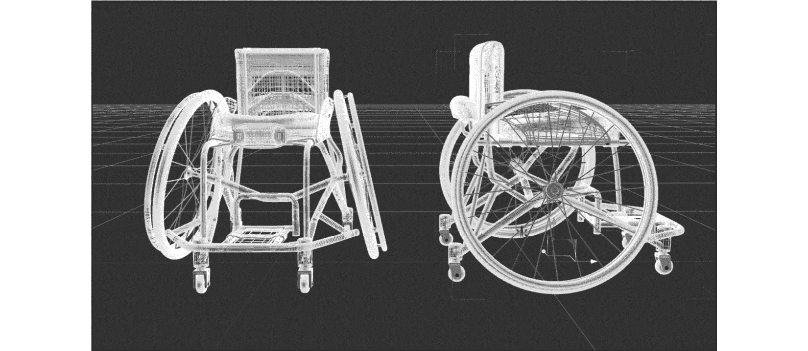

图 6.2：Maverick

最后一个模型是菲比戏称的 *平面轮椅*。“你知道的，它只是一个普通的轮椅，”菲比说。到目前为止，Bumble Bikes 的所有产品都是以与德克萨斯州相关的事物命名的。德克萨斯州的普兰诺市为这个双关语提供了名字。它轻便、紧凑、实用，能把你带到你需要去的地方。“也许它只是临时使用，或者通过升级座椅，也许你会永远使用它，”菲比解释道。您可以在下面看到 *平面轮椅* 的设计：

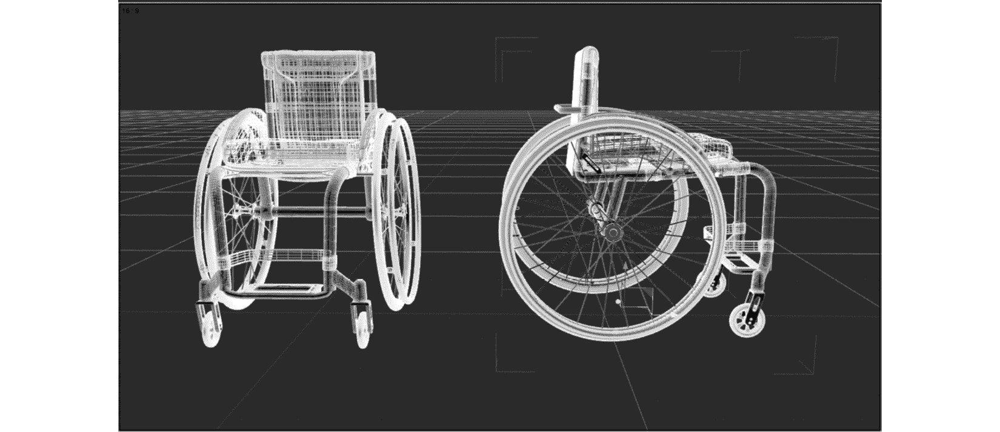

图 6.3：平面轮椅，因为它只是一个普通的轮椅

菲比和汤姆向基蒂展示了他们的设计。她非常喜欢。菲比说：“当我们制作自行车工厂和软件时，我们是边做边建的。我们并不真正知道我们在做什么。我们需要什么模式就学习什么。我们希望利用我们的经验加上你的经验，比上次更快地完成这项工作。”

“而且希望错误更少，”基蒂插话道。菲比翻了个白眼。“一切不都正常吗？”菲比反驳道。

的确如此。它并不完美，但在 *Bumble Bikes* 工作的所有人都知道，“完美”是完成工作的敌人。你不能等待你的软件变得完美。没有一辆自行车是无法改进的。无论是软件、自行车还是其他任何东西，设计和编码都不会带来收入，这是大多数公司的首要目标。这些活动是必要的，但只有基于设计和代码的产品才能带来利润。如果你编码或设计得太久，你的公司就会破产。

“我在开始编码之前需要用 UML 把所有东西都画成图表，”汤姆说。每天和汤姆在一起的姐妹们都能更容易地理解他结巴的说话。菲比只是盯着他看了一分钟。只有凯蒂能理解她脸上的那种非言语的“那是谁做的？”表情。汤姆解释说，在打开 IDE 之前用 UML 设计将有助于项目更快地推进。你将能更快地看到你的设计错误，而且通常重构图表比重构代码要容易。你的图表也是你提前识别模式的地方，而不是在你试图重构已经投入生产的某个东西时反应性地做。

对于姐妹们来说，学会信任这个合格的局外人很重要。这是他的项目，女孩们知道不微观管理汤姆的价值。菲比为汤姆配备了最好的笔记本电脑，这是汤姆坚持作为他雇佣条件的一部分。凯蒂和菲比毫不犹豫地接受了这个条件。他们把他带到了自己的实验室，这是女孩们在达拉斯仓库的一个角落里匆忙但熟练地用钉子、绝缘材料和干墙搭建的。他们粉刷了房间，并从菲比自己实验室里储存的一些额外家具和设备中为汤姆买了一个盆景树，这是从附近街角的一个临时摊位上买的。办公室的家具是使用菲比在她自己的实验室里储存的一些额外家具和设备布置的。“在 IT 工作的第一条规则……，”她说，“永远不要把任何东西还回去！”这很有趣，因为她公司的一半股份，负责 IT。有趣，但却是真的。

# 第一次尝试

在任何面向对象的设计练习中，低垂的果实是决定对象的基本结构。汤姆知道这很可能是他会使用创建型模式的地方，尽管他并没有太在意他会使用哪一种。经验告诉他，当开发者开始使用模式时，分析瘫痪是一个真正的问题。你可以整天盯着一个空白的白板，试图决定是使用抽象工厂还是工厂方法。也许两者可以某种方式结合起来？也许我们还可以在那里放一个命令或单例呢？

汤姆开始画类，根本不考虑模式。模式通常是从混乱中产生的，所以不要害怕先创造混乱。既然我们只是在画图表，尖头发的老板不可能告诉你“周一清理并发货。”汤姆的新老板们永远不会给他这样的命令。菲比和凯蒂都没有尖头发，他们也不太可能把一个 Etch A Sketch 误认为是高质量的平板电脑；这是女孩们在两年前与 MegaBike Corp 的 IT 高管一起工作时分享的一个内部笑话的主题。

汤姆认为轮椅和自行车类似，但并不那么相似，以至于在基类中会有任何重用。话虽如此，项目可以以类似的方式组织。汤姆开始创建一组接口和类，这些接口和类将代表 Bumble Bikes 的新系列电动和手动轮椅。

我希望你能停下来，看看你是否能创建一个 UML 图来描述汤姆和菲比所描述的电动和手动椅子。当你完成你的图表后，看看你的工作与汤姆的有多接近。

汤姆首先绘制了`Wheelchair`类，如下所示：

图 6.4：汤姆的初始 Wheelchair 类

起初，`Wheelchair`类上什么都有。但随着他进一步考虑，他决定将椅子分为两个家族：**电动**和**非电动**。请看以下图表：

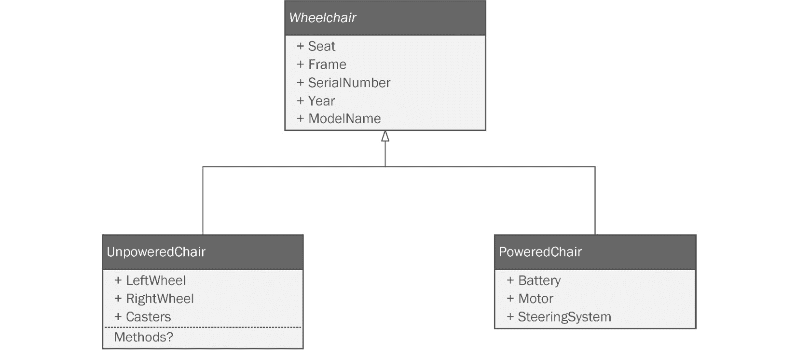

图 6.5：汤姆将设计分为两种主要的轮椅类型

他考虑了这些家族将有哪些共同属性，例如`ModelName`、`Year`和`SerialNumber`。他将这些定义提升到接口和抽象基类中。他可能只需要其中一个，但由于他的整个设计都将围绕这个图表来构建，他决定采用包容性的方法。

非电动椅子有常规的轮子和万向节。另一方面，**德克萨斯坦克**是一个全新的设计，它使用轨道而不是轮子。电动椅子还需要电源、电机和转向系统。这些可以单独绘制，但汤姆意识到，由于电动椅子的轨道设计非常奇特，他可能需要围绕这一事实进行设计。他创建了一个抽象的`PoweredChair`类，封装了市场上 99.9%的电动椅子。他有一天可能被要求在他的代码中表示这样的椅子，这是可以想象的。

整个图表最终看起来是这样的：

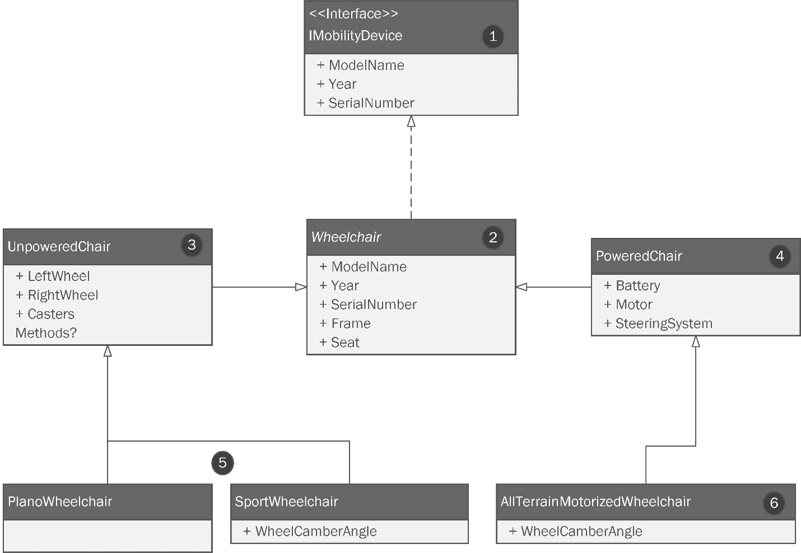

图 6.6：汤姆的初始设计

让我们按数字来分析，如下所示：

1.  汤姆认为在这个结构的最顶部定义一个接口是有意义的，因为将来我们需要能够传递类似轮椅的对象。这是对未来进行防备的一种尝试。这种设计策略通常有效，但事实上，并没有真正的“防未来”。

1.  当子类之间有一些共享方法实现时，需要一个接口的抽象实现。在`Bicycle`类中，我们有一个类似的情况，即`Build()`方法，如下所示：

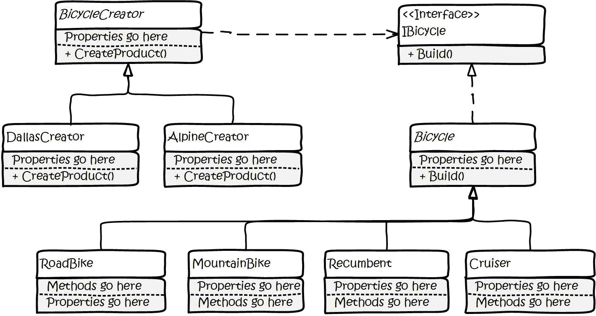

图 6.7：第三章中 Bicycle 工厂方法模式的实现。

1.  与`Bicycle`类一样，这个类有两个计算属性：`Year`和`SerialNumber`。这些属性就像方法一样工作。在这个阶段，我们可以以 DRY（不要重复自己）的原则来合理化使用额外的抽象类。关于**不要重复自己**（DRY）的解释，请参阅*第二章*，*为 C#中模式在实际现实世界应用做准备*。

1.  `UnpoweredChair`类继承自`Wheelchair`。汤姆知道轮椅上的左右轮子可能看起来相同。在这第一张图（*图 6.4*）中，他将所有轮子都放在一个数组中。轮椅上的轮子并不相同，汤姆明白他不能如此具体地思考。他不是将轮子建模为椅子的一部分。他在建模轮子的插槽，这些插槽在某些层面上应该是可互换的。大多数轮椅有两个大轮子作为主要支撑，以及一套较小的轮子或万向轮，以平衡整体结构。

1.  `PoweredChair`类也继承自`Wheelchair`。它被建模来代表市场上最常见的电动轮椅。由于汤姆在他 36 年的生命中一直骑着电动轮椅，他对设计非常了解。他的类在这里继承了基类的一些常见属性——一些是计算属性。一般而言，电动轮椅的独特元素也被表示出来。每个电动轮椅，包括*德克萨斯坦克*，都需要电源、转向和电机。这又是一次对未来进行保障的尝试。很容易预测，有一天，Bumble Bikes 将为电动轮椅设计出更常见的款式。虽然*德克萨斯坦克*很棒，但菲比设计它是因为她知道如果缓解永远不会成为现实，她的父亲会喜欢它。*德克萨斯坦克*不是为每个人设计的。它很重，价格昂贵，而且会发出重型机械的味道。注意，汤姆已经考虑了设计中需要方法，但在这次迭代中，他没有将任何内容提交到图中。他继续尽可能快地工作，以满足明显的需求，以保持动力。

1.  两个类继承自`UnpoweredChair`类。我认为这些不言自明。这两个类之间的唯一区别是`SportChair`上的倾斜轮子。在实际的椅子上，轮子向外倾斜以提高速度和敏捷性。如果你没有注意到这个细节，请参阅*图 6.1*，你可以在轮子上看到倾斜。

汤姆对他的早晨工作感到满意。基蒂和菲比从他们最喜欢的墨西哥餐厅订了午餐，三人放松。午餐后，汤姆感到精力充沛，开始着手下一轮的修订。

一旦你绘制了基本类图，下一步通常是要考虑组合。我们的对象中有属性和字段。这些属性和字段将包含哪些信息？当我们还是初学者程序员，事情比较简单时，它们是原语组合。我们不需要组合，但现在我们变得世故和明智，汤姆也不例外。他需要通过组合来梳理构成基本类的结构。例如，在`Wheelchair`基本类中，我们应该如何处理`Seat`属性？不同的椅子设计有不同的座位；因此，创建一个接口以实现最大灵活性是有意义的，然后在图表中记录这一需求。汤姆通过绘制和规划采取了不同的态度和方法。这与菲比和凯蒂在构建 Bumble Bikes 时所采取的态度不同。他们跳过了任何形式的图表或规划工作，直接编写代码。只需看看汤姆在猜测或做出判断的地方。`Inflate()`和`Deflate()`方法是一个很好的例子。他不确定是否需要它们。将现实世界对象抽象为类代码的练习主要是关于建模对应用程序重要的事物。你手机上的地址簿应用中的`Person`类与医疗记录应用中的`Person`类需要不同级别的细节。当你绘制图表时，你不需要担心 DRY（Don't Repeat Yourself）、**YAGNI**（You Aren't Gonna Need It），或违反 SOLID 原则（如果你不知道这些缩写代表什么，请参阅*第二章*）。在设计类结构这个阶段，它仅仅是一个图表。绘制图表的全部目的是将设计以可以讨论、争论、思考、社会化并修改的格式呈现出来。当然，你可能在思考 SOLID 或 YAGNI，但在构思阶段不完美是可以的。图表会自然演变，你将犯错误和疏忽，你可以纠正和改进。一旦图表变成代码，所有那些烦人的规则将开始适用。代码是真实的。有规则，而且不要误会，如果你在一个团队中工作，你将受到这些规则的评判。

汤姆绘制了他预见的所有组件，包括以下这些：

1.  座位

1.  车架

1.  轮子和万向轮

1.  动力轮椅的电机

1.  动力轮椅的转向机构

1.  动力轮椅的电池

1.  *Texas Tank*的轨道驱动系统

让我们看看汤姆如何为每一组类绘制图表。每一组将包括一个抽象类或接口，以及从该抽象类继承的适当具体类。别忘了——在 UML 中，抽象类的标题用*斜体*书写。

## 座位

座椅可能是轮椅最重要的部分。汤姆深知这一点——每一款椅子都需要不同类型的座椅。Bumble Bikes 可以在那些不是全天候使用的轮椅上使用价格较低的通用座椅。*Plano 轮椅*是运输轮椅的完美例子。像*Plano*这样的基本轮椅用于从一处地点到另一处地点的短暂运输。例如，椅子的使用者会从轮椅转移到办公椅或床上。当需要从一个地方移动到另一个地方时，使用者会回到运输轮椅上，然后前往新地点。基本轮椅没有马达。这与其他轮椅不同。

*Maverick*轮椅也有一个特殊用途的椅子。这个椅子设计得既轻便又灵活。与*Plano 轮椅*类似，它不是设计成全天候使用的座椅。*Maverick*轮椅没有马达。

然而，动力轮椅针对的是不同类型的用户。最大的用户群体是老年公民。这个群体并不是残疾人。他们可以站立并走短距离，但需要椅子进行长途行走。轮椅用户的第二组类似于汤姆。他们是四肢瘫痪者，手臂和腿部的活动能力几乎为零。这些轮椅用户通常缺乏自己转移的能力。因此，他们不需要便宜的座椅，因为他们需要在椅子上坐很长时间。他们需要一个舒适的椅子。汤姆和菲比决定，这个群体将是*德克萨斯坦克*的设计灵感，这是终极动力轮椅。

汤姆为座椅类绘制了一个设计图。他的想法在这里得到了体现：

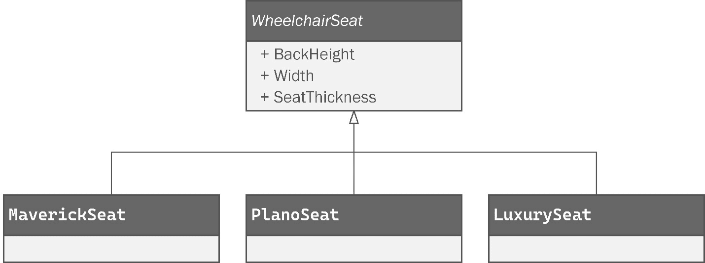

图 6.8：汤姆为 WheelchairSeat 类的设计

这种设计很简单。它由一个名为`WheelchairSeat`的抽象类组成。属性很简单。汤姆将具有无动力座椅的实体类放在图的左侧，而将动力座椅放在右侧。当我们把我们的设计组合成更大的图时，你可以期待使用这种惯例。

## 车架

我们的三款轮椅需要三种非常不同的车架设计。*Plano 轮椅*简单、相对轻便，是一种非常常见的款式。*Maverick*轮椅需要非常轻便，但足够坚固以承受碰撞和事故，这在激烈的竞争中是不可避免的。*德克萨斯坦克*需要像坦克一样坚固。它有重型轨道、大电池和超大的座椅。

汤姆对此进行了思考，并决定现在先保持简单。他本可以深入细节，弄清楚如何表示组成椅子框架的所有挤压铝管、螺栓、接头和铰链。然而，汤姆并不是那种工程师，所以他决定包含一个字段来保存框架的 CAD 文件的文件路径。基蒂和菲比都同意汤姆的看法。您可以在*图 6.9*中查看汤姆的设计。该图显示了一个简单的抽象类，代表轮椅框架。和之前一样，未供电组件位于左侧，而供电类则绘制在右侧：

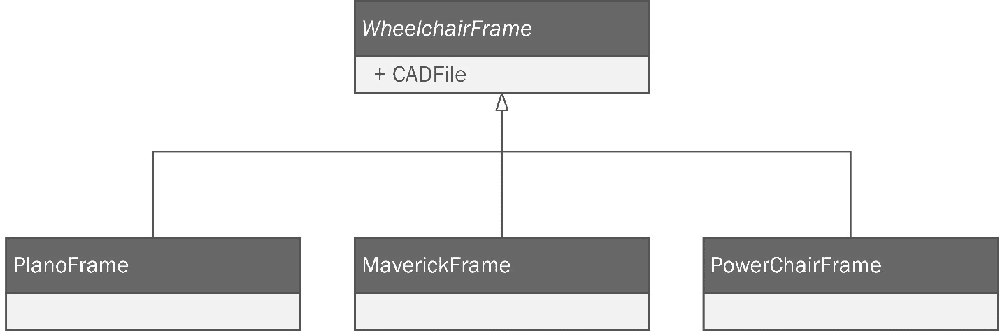

图 6.9：代表轮椅框架的类的设计

## 车轮和万向轮

没有车轮，你真的能有一把轮椅吗？*普兰诺轮椅*和*Maverick*轮椅将使用传统的辐条轮，类似于自行车上使用的轮子。轮椅的标准设计涉及两个大固定轮和一组配置为万向轮的小轮。万向轮可以朝任何方向转动。

在*图 6.10*中，汤姆将他的抽象类命名为`MechanicalWheel`。这个类可以表示车轮和万向轮，但不能表示*德克萨斯坦克*上的坦克式履带。以下图显示了`MechanicalWheel`类的结构以及两个双轮子类。`WheelchairWheel`类代表椅子侧面的较大车轮，而`Caster`类代表轮椅上可以旋转的小轮，提供机动性：

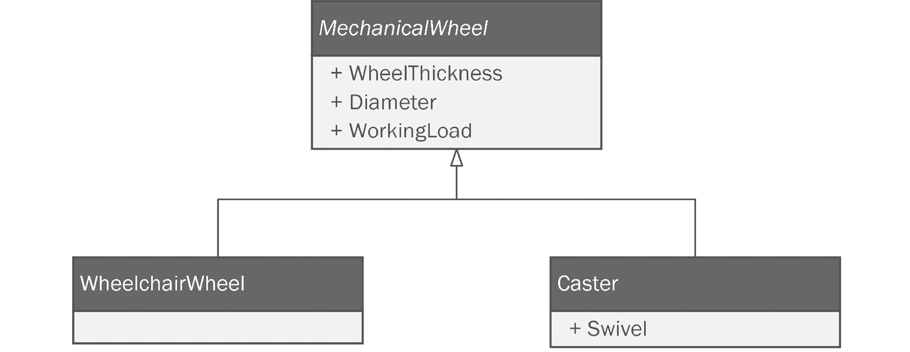

图 6.10：MechanicalWheel 抽象类及其子类

汤姆已经为非电动轮椅建模了所有需要的部分。它们是简单的机械。真正的设计挑战，当然也是最有回报的，在于为电动轮椅创建类设计。汤姆小心翼翼地没有具体模拟*德克萨斯坦克*。*坦克*是一个非常雄心勃勃的项目——很容易因为建造成本高而被取消。此外，*坦克*的非传统设计可能不会吸引广泛的受众。只有时间和一些市场研究才能告诉我们。那么，汤姆的策略应该是创建不特定于*坦克*设计的组件类，而是更常见的电动轮椅。汤姆决定从电机开始。

## 电动椅子的电机

汤姆的电动轮椅仍在使用其原始电机。他十年前就买了这把椅子。这些电机很常见，汤姆对它们非常熟悉。电动轮椅的电机由电池提供的直流电供电。电机需要具有高扭矩和相对较低的速度，并且需要长时间运行。模拟这样的电机并不成问题。汤姆的设计在*图 6.11*中展示。

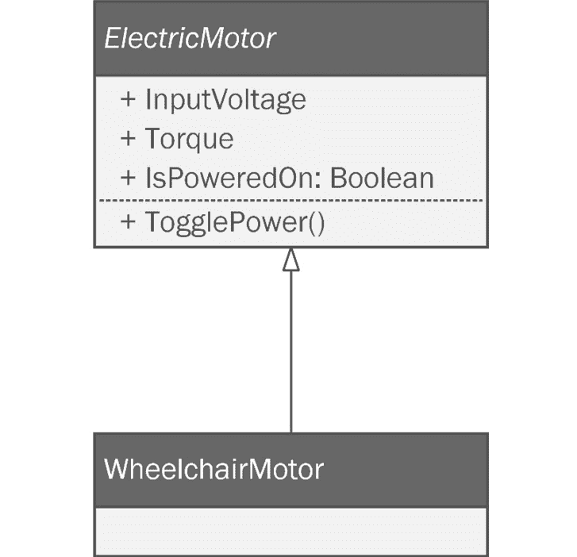

图 6.11：电动轮椅的电机类图

由于电动机是常见和通用的，汤姆决定将其制作为一个抽象类。他添加了一些属性和一个方法来模拟电机的开和关。然后，他添加了一个子类来处理电动轮椅使用的电动机的具体细节。

## 电动轮椅的转向机构

汤姆的轮椅使用一个安装在轮椅左臂上的操纵杆来控制它。操纵杆对任何给定方向上的推力大小都很敏感。您推得越用力，轮椅移动得越快。汤姆看不出有任何特别的原因要重新设计这个几乎无处不在的系统。他的类设计如下所示：

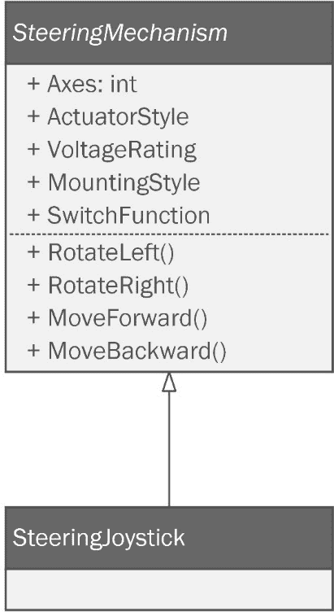

图 6.12：电动轮椅设计的转向机构

汤姆为转向机构选择的属性代表了一类广泛的工业式操纵杆控制系统，这些系统用于从无人机飞行控制到自动化，再到——您猜对了：电动轮椅。

## 电动轮椅的电池

轮椅的电机是电动的，我们需要一个电池来为系统供电。任何具有正确电压和电流的工业级电池都应适用。我们希望电池的寿命尽可能长。我们需要一个足够高的`WheelchairBattery`子类：

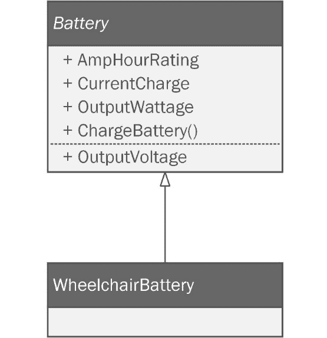

图 6.13：表示电动轮椅电池系统的类图

## 德克萨斯油箱的轨道驱动系统

在这个问题上，汤姆感到有些不知所措，因为他完全没有轨道驱动系统的经验。凯蒂和菲比在年轻时曾在家族的牛场工作过，对轨道驱动系统的工作原理有着不言而喻的理解。三人组队，找到了几家可能满足他们需求的供应商。由于汤姆时间紧迫，他只是简单地查看供应商网站上描述轨道驱动系统的属性。从这些来源中，汤姆得出了您将在以下图中看到的属性集：

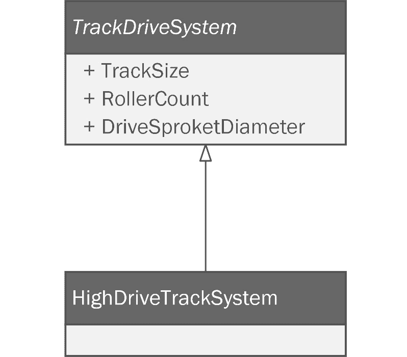

图 6.14：轨道驱动系统

汤姆确信，在他所建模的所有组件中，轨道驱动系统将是会改变和发展的一个。这是菲比会不断构建原型并在此工作的一个。他将其子类命名为`HighDriveTrackSystem`，因为这正是设计的名称。在下面的图中，您将看到我们的*德克萨斯油箱*设计，它配备了一个高驱动系统。轨道是三角形的，有一个大轮子位于轨道设计的高处。将此与图 6.15 中推土机上的标准连续轨道设计进行比较，您将看到差异：

图 6.15：推土机上的连续轨道驱动系统与我们的动力轮椅上的高驱动设计对比

菲比和凯蒂使用高驱动系统设计了椅子，因为它提供了更吸震的悬挂。高驱动系统也较少磨损和故障，因为它们将驱动齿轮隔离开来，使其位于轨道驱动的一个柔性部分。“她会像梦一样驾驶！”菲比带着一个宽大的、露齿的笑容说道。工程原型很快就建成了。最难的部分是让汤姆离开“坦克”，正如我们在这里看到的：

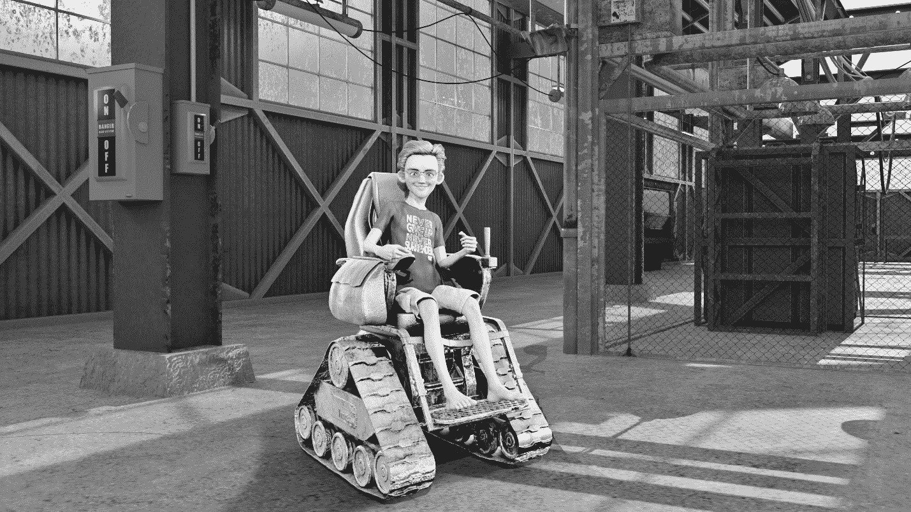

图 6.16：汤姆垄断了德克萨斯坦克原型

最终，“坦克”的电池耗尽了，这时汤姆又回到了工作状态。

# 添加模式

汤姆对自己的第一次尝试感到相当满意。他有了足够的素材来引发关于如何构建项目的严肃讨论。这就是第一次尝试的目标。汤姆快速列出了凯蒂和菲比在自行车项目中使用的所有模式，如下所示：

1.  **创建型模式**:

    1.  Factory pattern

    1.  Abstract Factory pattern

    1.  Factory method

    1.  Builder

    1.  Object pool

    1.  Singleton

1.  **结构型模式**:

    1.  Decorator

    1.  Façade

    1.  Composite

    1.  Bridge

1.  **行为型模式**:

    1.  Command

    1.  Iterator

    1.  Observer

    1.  Strategy

汤姆开始专注于图表，并开始思考每个模式的应用。他一个接一个地寻找机会。其中一些很明显。有些可能并不需要。汤姆的图表目前还没有包括对自行车工厂机器人技术的任何更改。大部分情况下，机器人课程不应该与制造自行车紧密耦合。经过几小时的个人辩论和深思熟虑，汤姆准备与凯蒂和菲比讨论模式。他能够在他们的日历上预订那个晚上的时间。

看看你是否能自己想出创建模式可能适用的情况和地方。记住——这是一个图表，这是头脑风暴。这不是一个有确定正确答案的考试。有时候犯错或不确定是正常的，也是可以接受的。在下一节中，汤姆将展示他打算在项目中使用的所有模式的图表。如果你想尝试找出哪些是最合适的，请在这里暂停并为自己列一个清单。小心“黄金锤”！没有必要，甚至不希望在一个项目中尝试使用你所有的模式。

# 第一次设计会议

汤姆配置了他的电脑显示屏，与会议室里的大 72 英寸 OLED 8K 屏幕共享。灯光调暗了。菲比一如既往地做了爆米花，并递了一圈汽水。当大家都坐得舒服后，汤姆开始他的演讲，讨论基础对象结构。一旦女孩们对基础知识有了了解，汤姆就将讨论转向创建模式。当姐妹们听汤姆讲话时，很明显她们对他非常尊敬。她们欣赏他的能力以及他适应命运所给予他的生活的态度。姐妹们知道大多数人都不太舒服与坐在轮椅上的人互动，尤其是如果他们还有语言障碍。她们知道汤姆希望人们看到真实的他，姐妹们对待汤姆就像对待其他同事一样。当汤姆开始他的演讲时，姐妹们从共同的幻想中惊醒。

“我想使用的第一个模式很简单。当你想要创建相关对象族时，使用抽象工厂模式。你用它来制造不同类型自行车的部件。你有公路自行车和山地自行车的车架类，它们在现实世界中根本不可互换，但它们的抽象结构足够相似，可以遵循公共接口。我们可以在两个地方做同样的事情。首先，我们可以有一个抽象工厂为轮椅生成部件，就像你为自行车做的那样。但我怀疑我们是否可以更进一步，在工厂自动化系统的最高级别使用抽象工厂模式来决定我们是在生成自行车还是轮椅。工厂模式的客户端不关心从工厂得到的对象的结构。因此，制造系统不应该关心它是制造自行车还是轮椅。”

“那是对的，汤姆，”凯蒂说，“但我发现建造者模式更灵活。虽然抽象工厂立即返回生产出的对象，但建造者模式允许你在构建过程中附加额外的步骤。”

“嘿！”汤姆插话道，“如果我们使用建造者，我们可以在构建过程中结合一些其他创建模式。你使用了组合模式来生成成本模型。你还使用了桥接模式来处理自行车的喷漆工作。我认为这对轮椅来说会是个大问题。我在医院和很多孩子一起工作，我知道他们宁愿在轮椅上涂上五彩斑斓的喷漆，也不愿像其他公司那样使用标准的黑色和铬色。建造者也可以生成桥接对象。”

“你难道不能为你的建造者类创建一个单例吗？”凯蒂问道。

菲比坐在桌子的另一端，吃着爆米花。她靠在椅背上，翻了个白眼。凯蒂和汤姆完全进入了极客模式。

“这需要我对设计进行另一次迭代，”汤姆说。他想起了那句古老的谚语，“没有战斗计划能在与敌人首次接触后幸存。”他几乎不把凯蒂和菲比视为他的敌人，但他并不期望他的初步设计图纸会被视为最终或完整的。这是第一次迭代。汤姆说，“我需要重新组织所有组件，以便它们能与组合模式相匹配。我认为这可能会改变很多事情。”时间已经很晚了，所以团队决定休息。

# 第二次迭代

第二天早上，汤姆非常兴奋。他早早地来到实验室，直接开始完善图表。总的来说，他觉得自己可以使用凯蒂和菲比在自行车项目中使用的五种模式，如下所示：

1.  **创建模式**：

    1.  **构建者**：汤姆可以利用这个模式来处理轮椅类所需的复杂对象创建，包括处理组合和桥接实现

    1.  **单例**：汤姆认为构建者类可能被做成单例以节省资源。

1.  **结构模式**：

    1.  **组合**：汤姆将创建一个类似于为自行车创建的成本模型，但这次它将直接集成到轮椅类的结构中，而不是单独创建。

    1.  **桥接**：与自行车一样，汤姆使用桥接来独立地改变油漆工作和轮椅类的复杂性。

1.  **行为模式**：

    1.  **命令**：将使用命令模式将创建轮椅所需的所有细节捆绑成一个单一的对象，然后可以将其发送到接收器类

汤姆安排了与凯蒂和菲比的第二次设计会议，这次会议没有引起太多关注。三人围坐在会议室的显示屏周围，汤姆展示了他的图表。

# 构建者模式

汤姆没有浪费时间深入细节。“我们讨论了使用构建者模式的可能性。我认为它会非常有效，”汤姆说。

他巧妙地用大脚趾在屏幕上移动指针，添加了实现构建者模式所需的类。你可以在这里看到结果：

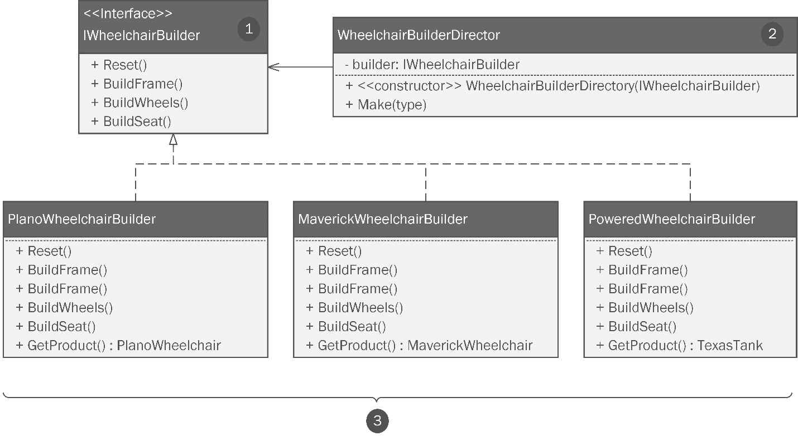

图 6.17：汤姆已经添加了构建者模式所需的结构

我们在*第三章*中详细介绍了模式的各个部分，*用创建模式进行创新*，但让我们快速回顾一下：

1.  构建者由一个接口或抽象类定义。在这里，那将是 `IWheelchairBuilder`。

1.  构建者直接由包含构建者接口私有实例的 `WheelchairBuilderDirector` 类控制。所有工作都由导演完成。

1.  为每个产品定义了构建者的具体实例。在这种情况下，每个轮椅型号都有自己的构建者，考虑到型号之间的固有差异，这为我们提供了很大的灵活性。

“这是一个好的开始，”基蒂说。“我们还讨论了将构建器做成单例的问题。”

“没错！”汤姆说。

# 单例模式

汤姆回答说，“这个没有太多可说的。”汤姆在图中的`WheelchairBuilderDirector`类中做了两个修改。你可以在这里看到这些修改：

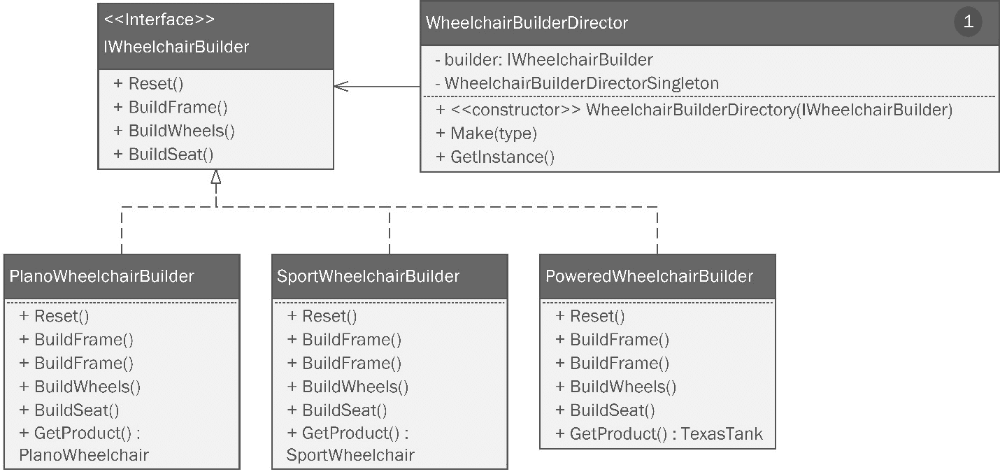

图 6.18：用于轮椅的构建模式的结构已被转换为单例。你可以从图上只有一个数字来判断

“为了使这个构建器成为单例，我只是在内部添加了引用`WheelchairBuilderSingleton`（1）。如果对象已经被实例化，这个引用将持有`WheelchairBuilderDirector`的一个实例。然后，我添加了`GetInstance()`方法。这个方法将检查`WheelchairBuilderSingleton`中是否已经有了一个实例。如果它是空的，该方法将创建一个实例，将其存储在那个私有变量中，并返回该实例。如果那里已经有一个实例，它将返回那个实例。我不确定我们通过将其做成单例能得到什么。通常，单例与对象池结合使用效果最好，用于处理昂贵的实例化，比如数据库连接。我不确定我们这里是否有，但我们可以决定在编写时是否需要。移除它并不是什么大问题。”

女孩们点头表示理解。她们都焦急地等待看看汤姆接下来会如何使用组合模式，这是议程上的下一个项目。

# 组合模式

“我真的很喜欢你在自行车模型中使用组合模式的方式。你能够利用这个模式来计算组件成本和重量以便于运输。但你为了这个目的专门建模了一个特殊结构，”汤姆说。

基蒂回应说，“在建造它的时候，一个单独的结构满足了我们的需求。我们已经有了一些生产代码中的类，我们不想违反 SOLID 原则中的开闭原则。”我们在*第二章*中讨论了 SOLID 原则。

汤姆想要直接在轮椅的结构中构建组合模式。这有点挑战性，因为他并不一定想让组合的结构要求定义轮椅的结构。相反，他真正需要的是一个正常的对象结构，它充当一个组合。他说：“我们可以通过将组合结构直接嵌入到所有我们的对象中来改进你的设计。我们需要将轮椅组装视为一个层次结构。我认为它看起来像这样，”汤姆说着，推着轮椅走到附近的白板前。女孩们在特殊支架上设置了一个白板，这样汤姆就能够得着。他画出了一个层次图，展示了无动力轮椅的部件可能如何建模。一旦画完，凯蒂拿起一支记号笔。“这很好，但动力轮椅的外观会有点不同，”她说着，同时画出了她自己的动力轮椅层次模型的想法。白板看起来是这样的：

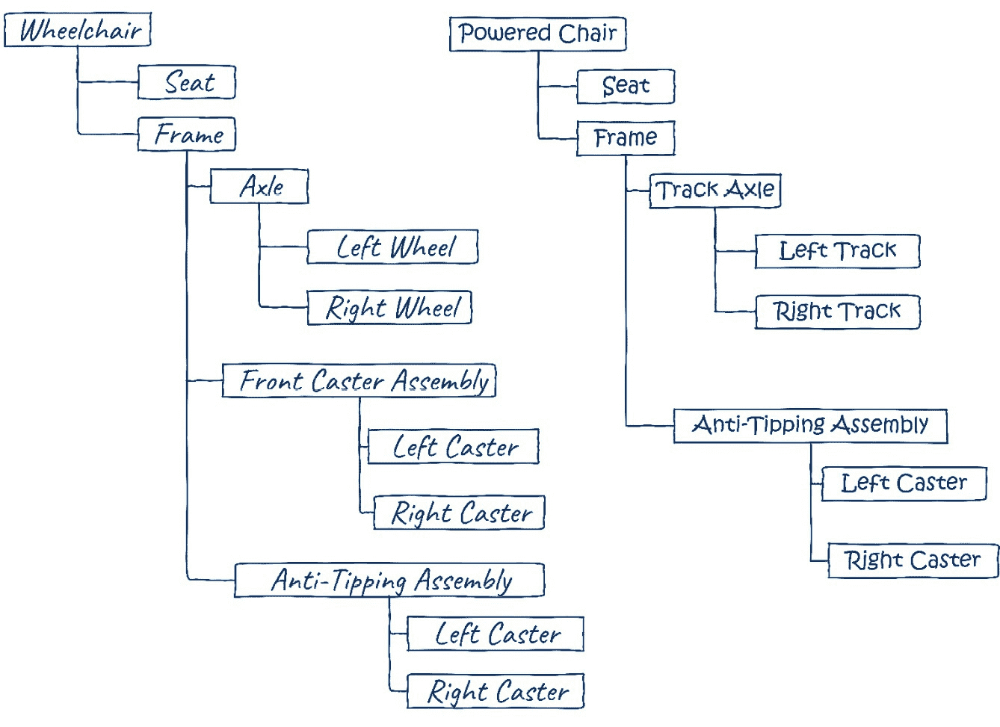

图 6.19：汤姆和凯蒂各自能够绘制一个有动力和无动力的轮椅作为对象层次结构，以使其与组合模式兼容

将小组的注意力转回到电脑显示器上，汤姆继续说：“考虑到这个结构，我们需要彻底审查指定框架构建的类。而不是每个部件作为一个整体构建和组装，机器人需要按顺序组装一系列部件。这样结构化允许会计精确追踪每辆轮椅的重量和成本，直到最小组件。有了追踪重量和成本的能力，销售部门将能够以有竞争力的价格定价椅子，并与保险公司和慈善机构合作，确保这些椅子能够进入需要它们的人的生活，而不会使公司破产。”凯蒂和菲比继续盯着屏幕，几乎不眨眼。

他继续说：“*ExFed*的外包物流团队可以使用重量计算来保证准确的运费报价。在自行车项目中，你构建了一个单独的对象来容纳你的组合结构。”

汤姆在放大到图纸上适当部分时说：“对于这个项目，我会将组合隐藏在正常结构中。”他拖动一个新的类到页面上，并将其命名为`WheelchairComponent`。然后他将其斜体化，并解释了他为什么添加了实现他的组合模式想法所需的成员。你可以在这里看到这个想法：

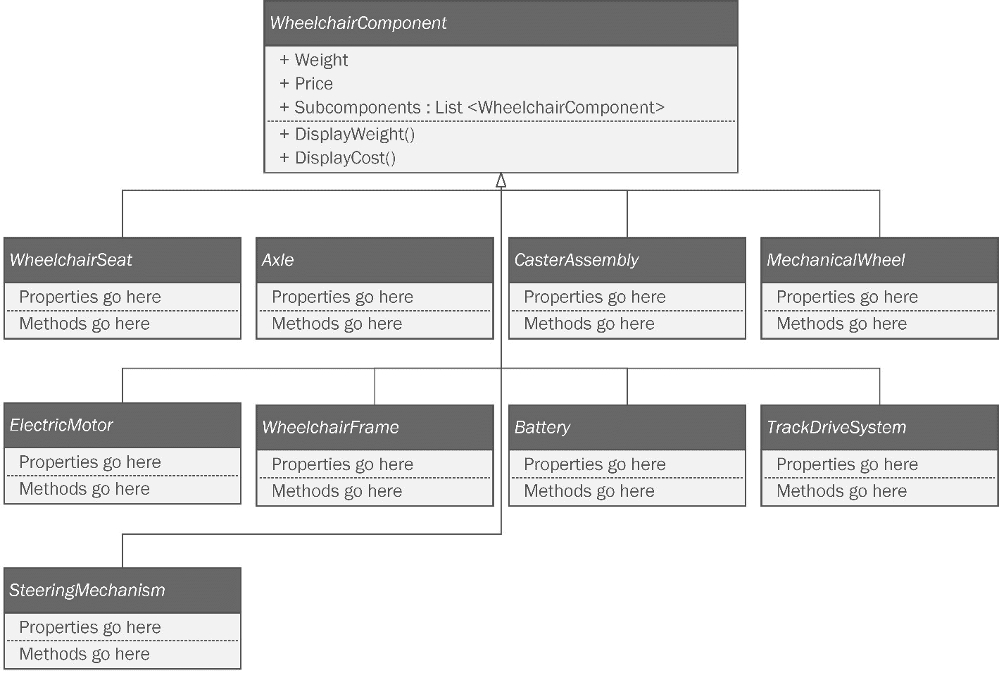

图 6.20：汤姆不得不添加和重构许多类，以便在不一定看起来像组合的情况下使其符合组合模式

“我在这里添加了一个`WheelchairComponent`抽象类。当我需要添加带有实现的方法时，我通常这样做，而不是添加一个接口。在这种情况下，我们将有`DisplayWeight()`和`DisplayCost()`方法，这些方法将递归地处理子组件，以得出重量和成本的总额。然后，我将所有轮椅组件建模为抽象组件，以防我们以后需要替换这些组件的具体版本。”汤姆创建了一个单独的图表来展示这个想法。经验告诉汤姆，他现在正在将这个最佳实践教授给凯蒂和菲比，最好的图表是小的、专注的、简洁的。汤姆没有在图表中展开类，而是在每个抽象类下附加子类，而是制作了一个仅显示座椅组件继承链的图表。你可以在这里看到这个图表：

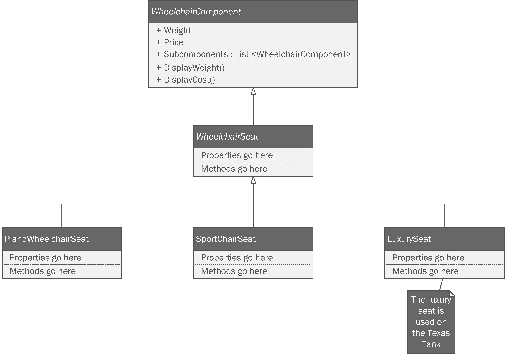

图 6.21：具体的座位对象继承自抽象的 WheelChairSeat 类，该类继承自 WheelchairComponent

汤姆看向菲比。显然，她的脑海中正在转动齿轮。她终于开口说话，说：“我们在这里做的是让所有东西都继承自`WheelchairComponent`。`WheelchairSeat`抽象类存在是为了确保具体的座位对象可以使用 Liskov 替换在组合结构中表示。任何座位都将具有父类的结构。”

“没错，”汤姆说。凯蒂继续她姐姐的想法。“我们可以在任何框架上放置任何座位，同时仍然能够拥有重量和价格。这意味着只要我们按照正确的顺序组装层次结构，”——她边说边指着白板（*图 6.18*）——“我们就能享受到组合模式的优点，同时我们也将拥有一种灵活的方式来组合我们的轮椅。”汤姆点头表示同意。“这样想吧：它就像基本的组合，这可能就是为什么 GoF 将其称为*组合*模式，但它是以不同的方式进行的组合。它同样灵活，但它也是可迭代的，因为组合使用列表来持有部分。”

菲比皱了皱鼻子。“我们应该担心这种结构可能会使我们在轮椅上添加 200 个座位的事实吗？”

“不，”汤姆说。“你可以用封装逻辑来处理这个问题。每个类都可以对其包含的组件列表施加规则。Liskov 替换使结构灵活，这给了你构建任何东西的能力。但你需要通过添加控制组成内容的封装方法来平衡这一点。”这次是凯蒂的脸皱了起来，好像闻到了什么难闻的东西。“这对必须使用这个方法的开发者来说似乎很复杂。他们必须记得按照正确的顺序组装对象。每次他们想要构建轮椅时，都必须查看图表(*图 6.18*)。”

“不，”汤姆说。“还记得我们用来指导对象组装的构建者模式吗？”两个女孩的脸放松了。她们立刻明白了。“这些模式可以一起使用！构建者的工作，它的*存在理由*，是使用一组定义良好的步骤来处理复杂对象的构建。”“我们需要修改我们的构建者类图来适应这个变化，”凯蒂说。菲比看起来很惊讶。“我们不是违反了开闭原则吗？我们已经设计了那个类！”凯蒂翻了个白眼，汤姆则露出了笑容。“不，菲比。那只是一个图表。它不是生产代码！”就在那一刻，菲比完全理解了为什么汤姆在将代码提交之前选择先绘制工作图表。在大师的键盘上，编码变成了一种纪律。我们需要一种方法来放松规则，这样我们至少有机会第一次就设计出正确的设计。

“父类`WheelchairComponent`中包含`Subcomponents`列表，但我正在考虑将其隐藏起来。目前它是公开的，但我的想法是在构建时让构建器将适当的子组件添加到数组中。这意味着我可以在不强迫整个结构符合通用接口的情况下拥有一个可遍历的组件树，这可能是无法实现的，”汤姆说。

“嘿，这真不错！”凯蒂热情地说。“我们能快速处理对构建者模式的更改吗？”凯蒂问道。三人拿出他们在*图 6.16*中创建的图表并开始修改它。几分钟过后，它看起来是这样的：

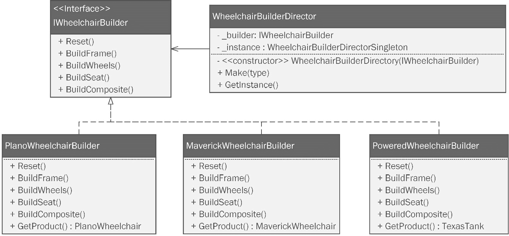

图 6.22：添加了构建复合方法后的构建者模式

“就这样了吗？”菲比问道。“我们之前讨论的所有那些花哨的封装逻辑呢？在图表上在哪里？”菲比追问。“逻辑将是`WheelchairBuilderDirector`类中的`Make`方法。记住，负责组装和返回对象的逻辑是导演类。”

凯蒂和菲比对汤姆的工作表现出热情。他转向下一个模式。

# 桥接模式

“在我们上次会议中，我们讨论了从自行车项目中重用桥接模式的工作。我认为可涂漆的框架将会很受欢迎，因为大多数公司只是制作黑色或灰色的轮椅。这对医院的借用轮椅来说是可以的，但如果你像我一样是终身用户，过一段时间你可能会想要升级。”汤姆微笑着说。他的轮椅框架上有一点红色油漆，但远未达到*升级*的程度。

菲比说：“在我们的自行车中，我们的一位 Kickstarter 支持者设计了我们的第一个定制喷漆工作。也许你应该为轮椅想一个设计。”

汤姆脸红了。“我很荣幸，但说实话，我更愿意带一些医院的孩子来，看看他们是否喜欢一些设计。”凯蒂热情地微笑着。菲比对汤姆的尊重加深了。

改变话题后，汤姆再次专注于他的屏幕。“我没有从自行车项目的实现中改变任何东西，除了添加具体的画家类。”凯蒂和菲比点头，很高兴汤姆将能够重用他们的一些早期工作。“当然，我还向抽象的`Wheelchair`类添加了一个`FramePainter`属性，这样所有的子类都会有它，”汤姆总结道。你可以在这里看到应用于轮椅项目的桥接模式的 UML 图：

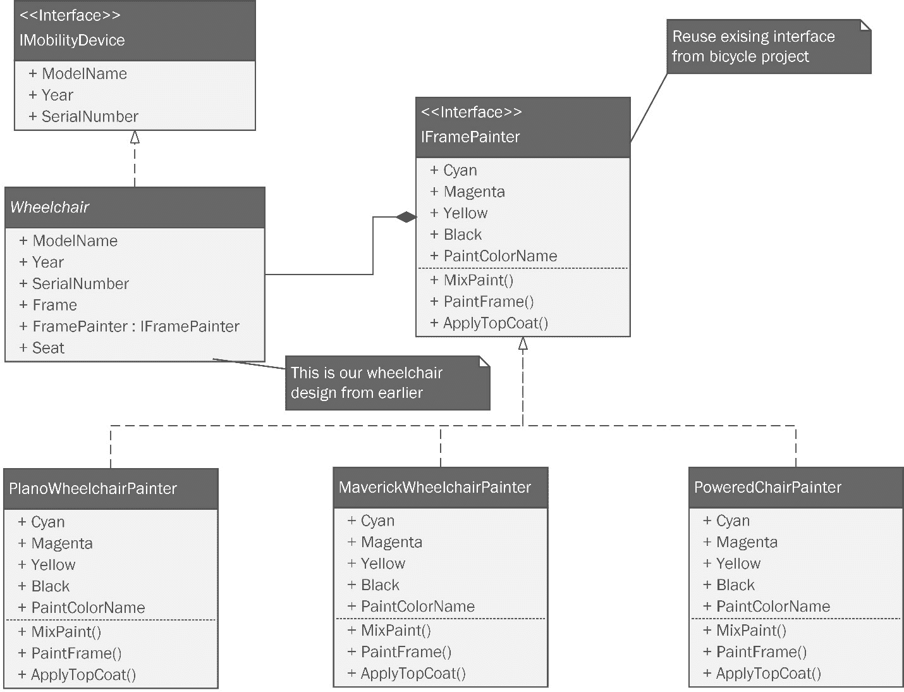

图 6.23：桥接模式除了具体的类外，一般没有变化

“建造类会直接将油漆添加到轮椅对象上吗？”凯蒂问。汤姆说：“很高兴你提醒我。我差点忘了在建造图中添加这一点。”汤姆对我们上次看到的图 6.22 中的建造图进行了快速修改。新版本可以在图 6.24 中看到：

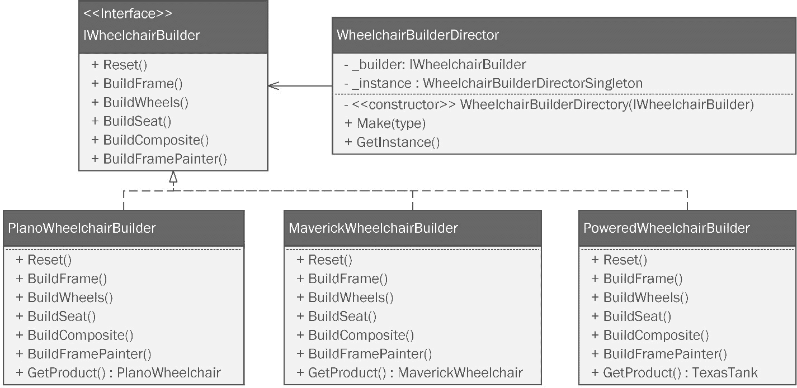

图 6.24：添加了 BuildFramePainter()方法后的 Builder 模式图

接下来是命令模式。

# 命令模式

“*还有最后一个重构我想做。你使用了命令模式来指导制造机器人建造你的自行车。当然，我想使用相同的制造系统。我认为差异可以很容易地处理，"* 汤姆说。

*“好的，"* 菲比好奇地挑起一边眉毛说。*“*你在对我的宝贝们做什么？"*”

汤姆将一些类拖到图中，并排列它们以形成命令模式。一旦他填完了所有内容，他的图看起来就像这样：

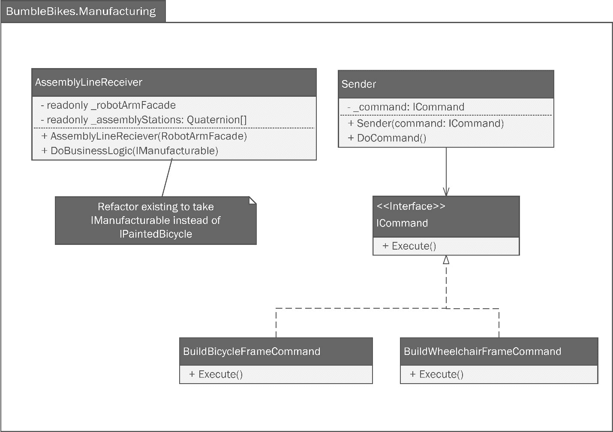

图 6.25：汤姆对命令模式的改动相当小

汤姆说：“*我们需要对* *AssemblyLineReceiver 中的 DoBusinessLogic 方法进行更改*。*您将其设置为只接受一个接口：IPaintableBike 接口。我无法将我的轮椅强行改装成可涂漆的自行车。我们可以将我项目的中央接口从 IMobilityDevice* *更改为 IManufacturable*。”他在说话的同时进行了更改。汤姆继续说：“*这样，接口具有自行车和轮椅等元素的共同点，也许还有你想要制作的任何其他东西*。”当他添加一个新的成员变量到 `IManufacturable` 接口：`ManufacturingStatus` 时，他说完了。这本来是在 `PaintableBicycle` 类中，但到目前为止，汤姆还没有想到把它放在图中。您可以在这里查看修订内容：

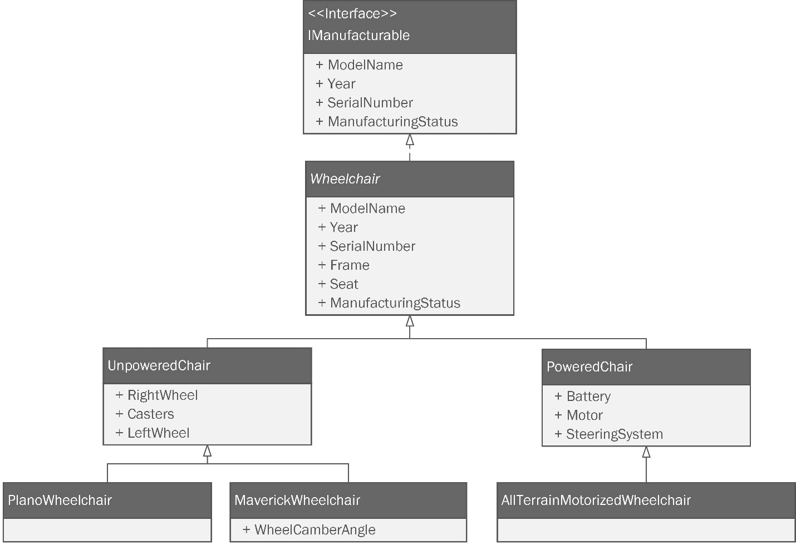

图 6.26：最终更改将中央接口重命名为 IManufacturable。

在这次演示中，菲比第一次站起来。她茫然地 staring for a moment. “我不知道那件事，”她说。在会议的剩余时间里，她没有再说一句话。

基蒂接过了接力棒。“汤姆，这看起来很棒！我看到菲比对你的上次重构有些犹豫，但我们可以克服这一点。让我们立即开始为你的项目设置基础类。”基蒂和汤姆在下午剩余的时间里在 GitHub 上设置了一个仓库，并为新项目配置了一个 **持续集成**（**CI**）构建。在推送了一个微不足道的类并看到它构建后，汤姆为该类添加了一个简单的单元测试。它也通过了。大约在这个时候，三个人意识到已经很晚了，或者很早了，这取决于你的观点。尽管他们并不真的想，但他们不情愿地结束了晚上（或早上）的活动，并决定第二天中午开始工作。

# 摘要

本章介绍了一个设计场景，我们看到了我们新兴自行车公司在勇敢地决定拓展业务并制造轮椅以帮助有需要的人时，业务需求发生了剧烈变化。正如这些事情通常发生的那样，这个变化没有计划，而且发生在不合适的时候。在时间和灵感都紧张的情况下，基蒂和菲比雇佣了汤姆，一位轮椅软件工程师，他在前雇主公司高管崩溃后发现自己被无情地解雇了。

汤姆利用他在软件开发方面的专业知识、个人经验以及作为志愿者帮助最近受伤的患者学习如何在轮椅上生活的经验。他能够为问题带来新的视角，并开始设计一个既适合制造环境，又符合 Bumble Bikes 已经存在的非常实际的成本和资源限制的解决方案。

经过大约一周的分析和设计，使用 UML，汤姆能够规划他的开发工作，为新的轮椅项目的第一个版本做准备。

汤姆在自行车项目上做了一些与女孩们不同的事情。主要的是，他首先使用模式和 UML 进行设计，而不是在寻找模式的过程中尝试。希望这能减少我们需要对代码进行重大更改的情况，这些更改可能会违反我们神圣的 SOLID 原则。汤姆坚信这种做法将节省大量时间和挫折。

汤姆按照以下步骤开发他的设计图表：

1.  在第一次迭代中，他提前设计了所有基本类。他只是画出了类和继承线。

1.  一旦有了类，他就填写了继承和组合线。

1.  他考虑了模式，但没有将它们绘制成图表。相反，他与他的开发团队举行了一次会议，该团队拥有与他在工作中使用的相同模式的经验和洞察力。实际上，他正在使用迭代开发，但用图表代替代码。在尝试完成整个设计项目之前，他从利益相关者那里获得了反馈。

1.  汤姆、菲比和凯蒂作为一个团队进行了第二次迭代，并共同添加了这些模式。

汤姆对性能的最后一个考虑是他没有感到有必要使用他可用的每一个模式。他尽力在可能的地方重用工作。凯蒂和菲比对这一点印象深刻，这比汤姆建议完全重写要强得多，许多开发者在加入新公司时似乎都想要这样做。

在下一章中，我们将跟随汤姆、凯蒂和菲比，看看他们如何编写实现其图表的代码。

# 问题

1.  与仅将所有内容建模为代码相比，绘制项目图表有哪些优点？

1.  我们在什么情况下一定会使用抽象类而不是接口？

1.  汤姆是如何在设计的第二次迭代中利用建造者模式与其他模式协同工作的？

1.  你能想到对汤姆的设计有任何改进的地方吗？

# 进一步阅读

查看本书的配套网站[`csharppatterns.dev`](https://csharppatterns.dev)。
