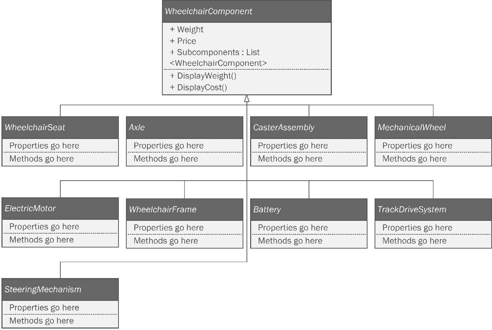
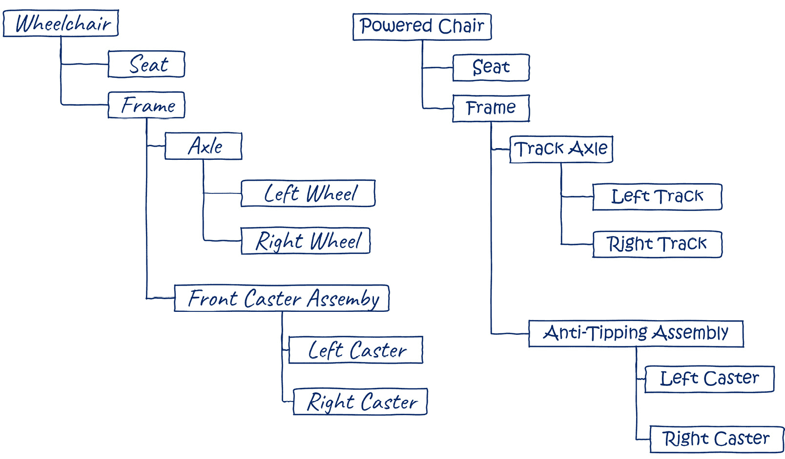
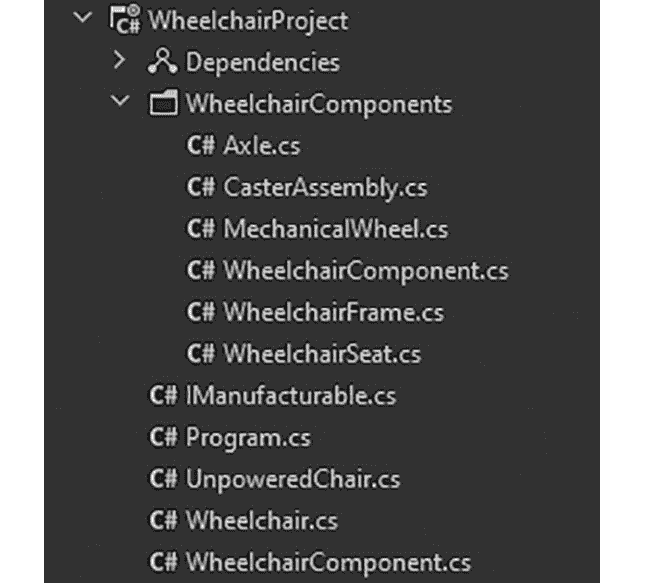
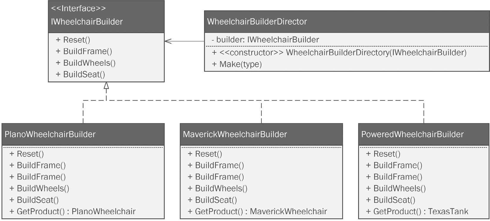
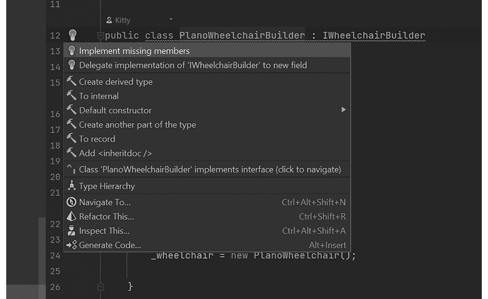
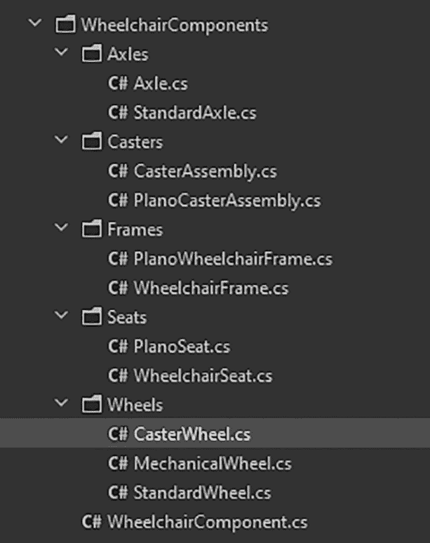

# 第七章：除了打字，别无他物 – 实施轮椅项目

在上一章中，我们学习了创建一套图表作为我们下一个编码项目的规划设计的优点。整个目的就是将设计以可以讨论、争论、思考、社交和修改的格式呈现出来。设计完成后，最后一步是将图表实现为代码。我们的三位软件工程师刚刚完成了一个雄心勃勃的新项目，旨在改变可能数千人生活的质量，这些人将从使用高质量、低成本的轮椅中受益。

我经常把 UML 与乐谱相比较。一个好的 UML 设计可以像音乐作曲家将乐谱交给一个有能力的乐团一样，交给开发者。在音乐中，乐团经常会根据表演者的技能对乐谱进行修改和即兴创作。有时他们这样做是为了使音乐更符合表演者的技能。有时，他们可能需要改变或调整音乐以适应表演本身。古典作曲家约翰·塞巴斯蒂安·巴赫作品丰富。他最受欢迎的作品中包括 *布兰登堡协奏曲*。巴赫在 1721 年汇编了这个系列。在 1968 年，另一位作曲家温迪·卡罗斯将 *布兰登堡协奏曲* 改编成完全由模拟合成器演奏的形式，收录在她的作品 *Switched on Bach* 中。音乐本身并没有太多变化，但实现细节却有所不同。将编程看作是像演奏音乐一样，并不夸张。它需要创造力和即兴发挥。一个创建了良好图表的建筑师可以合理地确信一个有能力的开发团队能够实现这个图表，并在必要时进行一些即兴创作。

在本章中，我们将把汤姆的 UML 设计图表交给开发者进行实现。设计类和实现它们之间有很大的区别。首先，图表故意留下了一些模糊的区域。这样做是为了让开发者对图表不重要的细节做出决定。例如，这本书中有许多图表省略了类细节。看看上一章的 *图 7.1*：


图 7.1：上一章的综合图表留下了许多细节由开发者决定。

这并不是因为架构师懒惰。这样做是因为那些细节并不真正影响设计的结构。想象一下按照蓝图建造一栋房子。蓝图可能会指定墙壁的位置。甚至可能指定要使用的材料，就像我们有时会指定实例变量或返回类型的特定类型一样。然而，一些较小的细节，比如墙壁上要使用什么颜色的油漆，或者屋顶上要使用什么品牌的瓦片，这些都是实现细节。建造者可以独立于蓝图做出这些决定。

在关注**第六章***Chapter 6*的设计，*Step Away from the IDE! Designing with Patterns Before You Code*时，我们将涵盖以下内容：

+   创建一个新的命令行项目。到目前为止，我一直避免涉及 IDE 机制。这里也不会深入探讨。以这种方式开始章节感觉是正确的。如果你是 C#开发的初学者，并且没有注意到书末的*附录 1*，你应该查看一下，因为我展示了你可能不认为是第二本能的一些这些机制。

+   我们将像汤姆一样先添加我们的基础类，但由于我们在设计阶段已经完成了所有组织工作，所以我们实际上不需要两遍系统。

+   我们将实现构建者模式（Builder pattern）。

+   我们将把构建者模式（Builder pattern）的实现转换为单例（Singleton）。

+   我们将实现组合模式（Composite pattern）。

+   我们将实现桥接模式（Bridge pattern）。

+   我们将实现命令模式（Command pattern）。

在整本书中，我假设你知道如何在你的首选**集成开发环境**（**IDE**）中创建新的 C#项目。我通常不会在设置和运行项目的机制上花费任何时间。这一章是一个轻微的例外，因为整章实际上是一个大型项目的例子。如果你需要更多细节，或者你想使用除 Rider 之外的 IDE，并且不确定如何设置项目，请参阅本书的**附录 1***Appendix 1*。如果你决定尝试这些，你需要以下内容：

+   运行 Windows 操作系统的计算机。我使用的是 Windows 10。由于项目是简单的命令行项目，我相当确信这些内容在 Mac 或 Linux 上也能正常工作，但我还没有在这些操作系统上测试过这些项目。

+   一个支持的 IDE，如 Visual Studio、JetBrains Rider 或带有 C#扩展的 Visual Studio Code。我使用的是 Rider 2021.3.3。

+   任何版本的.NET SDK。再次强调，项目足够简单，我们的代码不应该依赖于任何特定版本。我恰好使用的是.NET Core 6 SDK。

你可以在 GitHub 上找到本章的完整项目文件[`github.com/Kpackt/Real-World-Implementation-of-C-Design-Patterns/tree/main/chapter-7`](https://github.com/Kpackt/Real-World-Implementation-of-C-Design-Patterns/tree/main/chapter-7)。

# 正午的裂缝

在前一天晚上一直忙于绘制项目图之后，汤姆、凯蒂和菲比来到了 Bumble Bikes。第二天中午时分，房间里的气氛紧张而充满活力。

凯蒂腋下夹着一个盒子走进来。她订购了一个新的键盘，那种有响亮蓝色点击开关的键盘。她喜欢这些键盘，因为它们让她想起了她父亲的 IBM Model M 键盘。她小时候经常玩它。凯蒂想记住这个项目的灵感来源。

不久前，她和她的妹妹菲比成立了一家成功的自行车制造公司。她们的展望是乐观的，直到她们的父亲被诊断出患有罕见的进行性肌肉萎缩症——皮肤肌炎，并被新近困在轮椅上。凯蒂和菲比的妈妈与他们的医疗保险提供商进行了漫长的法律斗争，因为保险公司拒绝支付他们父亲需要的昂贵轮椅，以应对他的疾病。菲比亲自处理此事，几乎单枪匹马地决定她可以为他们的父亲以及所有需要的人制造轮椅。自然，凯蒂跟随她年轻的妹妹，因为她知道菲比是对的。“*今天是改变世界的一天，*”凯蒂想，“*我们今天要改变世界。*”新的键盘将让她专注于她的父亲以及她仅通过打字就能帮助的所有人。

汤姆穿着他最好的书呆子 T 恤来到实验室；上面印有一幅著名的 XKCD 漫画，描绘两位开发者手持剑在比武，T 恤上的字迹写着汤姆并没有偷懒，他只是在等待代码编译。菲比带着一摞披萨和一瓶汽水到来。中午开始工作的好处是很容易弄到所需的用品。众所周知，程序员不过是一台生物机器，将披萨和咖啡因转化为代码。

这三人准备就绪，菲比关掉了刺眼的顶灯。经过短暂的敏捷会议，他们决定从应用程序的哪个部分开始着手。如果一切顺利，他们几天内就能完成这项工作，这可能是姐妹俩在汤姆的帮助下可能写出的最重要的代码。

# 项目设置

奇蒂、菲比和汤姆挤在奇蒂的新键盘前。他们三人决心使用结对编程。结对编程发生在两个或更多开发者一起工作并且共享一个键盘的情况下。一个人打字，其他人观看。开发者们时不时地交换位置。不打字的开发者负责观看并帮助进行研究。结对编程消除了代码审查的需要，并且显示出显著提高开发者生产力的效果。如果你不熟悉结对编程的实践，可以查看本章“进一步阅读”部分列出的书籍《实用远程结对编程》。汤姆对设计非常熟悉，但奇蒂和菲比打字更快。汤姆用脚打字的能力真正令人惊叹，但他很久以前就接受了打字速度并不是他能为团队带来的价值。奇蒂和菲比有较少的编码经验，但过去几年在各自的大学撰写研究论文，他们的打字速度已经变得相当快。奇蒂决定先拿键盘，而菲比则吃披萨和汽水补充能量。奇蒂打开她最喜欢的集成开发环境（IDE），创建了一个新的**控制台应用程序**项目，如图 7.2 所示。


图 7.2：创建一个新的命令行项目。

如果你使用的是不同的 IDE，并且不确定如何创建命令行项目，可以查看本书的*附录 1*。其中，我涵盖了 Visual Studio、Rider 和 Visual Studio Code 的项目创建机制。我使用 Rider 编写这本书，因为它具有出色的代码清理和格式化工具，这在写书时非常有用。

一旦奇蒂创建了项目，她将 Visio 软件放在另一个显示器上，以便查看项目的 UML 图。她打开的第一个图实际上是他们最后工作的那个图。您可以在图 7.3 中看到它。汤姆对一个称为`IManufacturable`的中心接口进行了修改。这是一个非常好的起点，因为所有其他内容都从这个接口流出来。


图 7.3：`IManufacturable`接口和实现它的类结构，这是一个完美的起点。

奇蒂添加了一个名为`IManufacturable`的新文件，并按照图示输入代码：

```cs
public interface IManufacturable
{
    public string ModelName { get; set; }
    public int Year { get; }
    public string SerialNumber { get; }
    public string BuildStatus { get; set; }
}
```

我们之前在`bicycle`项目中见过这些属性。`Year`和`SerialNumber`属性将由实现类中的构造函数自动设置，因此只需要一个`get`方法。

接下来，奇蒂添加了抽象的`Wheelchair`类：

```cs
public abstract class Wheelchair : IManufacturable
{
```

根据图示，该类被标记为`abstract`。不要忘记在 UML 中，抽象类以斜体显示类标题。在使用某些 UML 建模工具的字体中，这可能很难看到。`Wheelchair`类实现了 Kitty 刚才制作的`IManufacturable`接口。大多数 IDE 可以生成接口指定的缺失成员。Kitty 生成了以下代码。她在类型定义旁边添加了问号，使`BuildStatus`可空：

```cs
    public string ModelName { get; set; }
    public int Year { get; }
    public string SerialNumber { get; }
    public string? BuildStatus { get; set; }
```

构造函数几乎与`bicycle`项目中使用的构造函数相同。由于该类是抽象的，因此将构造函数公开为`protected`是有意义的。在构造函数内部，Kitty 初始化了她能初始化的一切：

```cs
    protected Wheelchair()
    {
        ModelName = string.Empty; 
        SerialNumber = Guid.NewGuid().ToString();
        Year = DateTime.Now.Year; 
    }
}
```

`SerialNumber`属性是一个 GUID。这是一个系统生成的唯一字符串。这使得它非常适合作为序列号。`Year`属性初始化为当前年份。

“我们先等等框架和座椅属性。它们不是原始类型，我们还没有为它们创建类，”Tom 说。

Tom 的设计将轮椅分为两种类型：手动轮椅和电动轮椅。Kitty 接下来添加了`UnpoweredChair`类：

```cs
public abstract class UnpoweredChair : Wheelchair
{

}
```

她没有走得太远。像大多数类图一样，`RightWheel`、`LeftWheel`和`Casters`属性所需的类型没有指定。“*我们需要复合图来指定类型，*”Tom 提醒她。那个特定的图可以在*图 7.4*中看到：



图 7.4：复合结构。

Tom 为复合模式设计的方案是将轮椅的每个部分都由一个名为`WheelchairComponent`的抽象类构成。在我们当前模型中，车轮和脚轮需要定义这个抽象类，我们才能正确地获取类型。Kitty 添加了一个名为`WheelchairComponent`的新类：

```cs
public abstract class WheelchairComponent
{
```

为了使用复合模式，我们需要一些属性。复合模式的目的在于使用树状结构来处理列表。Kitty 和 Phoebe 希望能够递归地遍历他们的轮椅模型实例，以报告每个组件的重量和成本。这些数字可以在任何级别上累加，以确定单个部件或椅子子集的重量和成本。例如，了解组装好的框架的重量和成本可能是有用的。当我们处理自行车时，重量和成本是典型的权衡。较便宜的组件更重。竞争性自行车手愿意支付更多以减少他们的总重量。这样做可以减少长途骑行的时间几秒钟，这可能会赢得比赛。

轮椅的轻量组件与自行车的关注点相同；然而，动机是由不同的目的驱动的。Kitty 和 Phoebe 的父亲患有进行性肌肉疾病。如果他打算使用无动力椅子，他特别需要轻量级的物品。一些轮椅用户有非常强壮的上半身；而另一些人则不那么强壮。轻量材料仍然需要在成本和重量之间取得平衡，而组合模式将帮助工程团队分析和改进轮椅的成本与重量比。

由于这个类是抽象的，其成员将被设置为`protected`，除非有充分的理由不将其设置为`protected`。Kitty 为`Weight`和`Price`属性添加了浮点数：

```cs
    protected float Weight { get; set; }
    protected float Price { get; set; }
```

接下来，Kitty 添加了类的关键部分。组合模式需要一个`Subcomponents`集合。记住，组合中的组件要么是叶子，要么是容器。容器是树中的节点，其中包含其他节点。在设计阶段，Kitty 和 Tom 在白板上绘制了组合的树状结构图。您可以在*图 7.5*中再次看到它，Tom 的设计写在左侧，Kitty 的设计写在右侧。



图 7.5：带动力和无动力的椅子树状结构。

如果您查看无动力椅子的轴，您会看到其中包含组件。轴是一个容器。另一方面，右边的轮子不包含任何其他组件，因此它是一个叶子。

无论它们是容器还是叶子，结构中的所有类都使用相同的基类，该基类包含一个用于存储其他组件的集合。实际上，一切都有可能成为容器，即使它仅仅是一个叶子。Kitty 添加了该集合：

```cs
    protected List<WheelchairComponent> Subcomponents { get; set; }
```

注意：集合类型正是她正在编写的类。这使得组合模式可以迭代。我们将通过要求我们的类型使用这个基类而大量依赖 Liskov 替换原则，但在实际实现 Builder 模式时，我们将提供具体的类。

接下来，Kitty 添加了一个构造函数并初始化了所有属性：

```cs
    protected WheelchairComponent()
    {
        Subcomponents = new List<WheelchairComponent>();
        Weight = 0.0f;
        Price = 0.0f;
    }
```

*图 7.4*中的图表明了一些方法。Kitty 还没有深入到需要担心这些方法的细节。目前，她只是添加了一条抛出`NotImplementedException`的语句，如果任何尝试访问这些方法。这是一个非常常见的占位符：

```cs
    protected void DisplayWeight()
    {
        throw new NotImplementedException();
    }
    protected void DisplayCost()
    {
        throw new NotImplementedException();
    }

}
```

完成这些后，Kitty 可以回到定义`UnpoweredChair`类。她切换到 IDE 中的`UnpoweredChair.cs`文件。这一次，她前进了一小步。她添加了类图(*图 7.3*)中所需的三个属性：

```cs
public abstract class UnpoweredChair : Wheelchair
{
    protected WheelchairComponent RightWheel { get; set; }
    protected WheelchairComponent LeftWheel { get; set; }
    protected WheelchairComponent Casters { get; set; }
}
```

Kitty 的 IDE 在每个属性下方显示了一个黄色波浪线，表明存在问题。她还没有初始化任何一个属性。这不是一个大问题，因为她知道她将使用 Builder 模式来填充这些细节，这些细节将基于正在构建的椅子型号。

就在这时，凯蒂被背后的一声大叫声吓了一跳。“*呸！你那里的代码真臭！*”菲比惊叫道。显然，她刚刚吃了几片披萨和几罐含咖啡因的汽水，准备接受挑战。

“*什么？*”凯蒂尴尬地问道。汤姆插话道，“*我想她生气是因为你为你的类型使用了 WheelchairComponent 基类*。”

“*我以为我们正在做这个*，”凯蒂回答。

“*再看看，姐姐。复合图* *在 WheelchairComponent 类下有更具体的类*，”菲比说。凯蒂站起来，菲比接替了她的位置。

## 轮椅组件

菲比坐下，假装伸脖子并敲打她的指关节。如果这是一部动作电影中的打斗场景，这将是对手感到威胁的提示。相反，光标在 IDE 中无畏地闪烁。“*这是一个很好的地方来填充，因为我对实际组件了解得更多*，”菲比说。她是对的。菲比花了很多小时寻找零件，并在组装自行车时想出如何制作她买不到的东西。在*图 7.4*中，我们可以看到有一组抽象组件，它们都继承自`WheelchairComponent`。`WheelchairComponent`基类为我们提供了在组合模式中使用的`Weight`和`Price`字段，帮助我们迭代计算一组组件的重量和价格。图中列出了九个这样的组件：

+   `WheelchairSeat`

+   `Axle`

+   `CasterAssembly`

+   `MechanicalWheel`

+   `ElectricMotor`

+   `WheelchairFrame`

+   `Battery`

+   `TrackDriveSystem`

+   `SteeringMechanism`

菲比需要为列表上的每一项创建一个类。“*这有很多组件*，”菲比说。“*我们能不能专注于最小可行产品？*”

**最小可行产品（MVP）**是敏捷开发中的一个术语。**敏捷开发**是凯蒂在她的产品开发课程中学到的一种项目管理范式。敏捷方法在软件公司中很受欢迎，因为它们允许你通过关注公司能卖出的最小产品来快速将产品推向市场。然后它使用**迭代开发**来分几个小阶段构建该产品。在这种情况下，我们有两种轮椅设计。*德克萨斯坦克*非常酷，但制作成本也会非常高。三人意识到，通过制作简单的非动力轮椅：*普兰诺轮椅*，他们可以产生巨大的影响。这个椅子越快上市，他们就能帮助更多的人。团队决定只专注于制作这张椅子。这使她的列表缩减到只有这些组件：

+   `WheelchairSeat`

+   `Axle`

+   `CasterAssembly`

+   `MechanicalWheel`

+   `WheelchairFrame`

“*为什么不为这些文件创建一个文件夹呢？* *这样以后找起来会更容易，我们的代码也会稍微整洁一些*，”汤姆建议。一个专注的表情出现在菲比的脸上。她为自己的项目添加了一个名为`WheelchairComponents`的文件夹。

接下来，菲比在文件夹内添加了一个名为`WheelchairSeat`的类。她还添加了列表中的剩余类，目前每个类都是空的。在这个时候，她的项目类似于*图 7.6*：



图 7.6：抽象轮椅组件的文件夹结构。

“*可能有必要将 WheelchairComponent.cs 文件也移动到那个文件夹中，*”汤姆建议。菲比将文件从项目的根文件夹拖动到包含她刚刚创建的其他九个类文件的子文件夹中。

“*嘿，快点打开那个文件。让我们确保 IDE 已经为你更改了命名空间，*”汤姆说。*“有些 IDE 会这样做，而有些则不会，*”他继续说道。菲比在 Rider 中双击了文件。实际上，IDE 并没有更改代码。在 C#中，命名空间就像 Java 中的包。它们的作用是帮助您组织代码，并在复杂的项目中防止名称冲突。汤姆怀疑这个项目不会复杂到需要这样的名称冲突。名称冲突发生在您想要用相同的名称命名两个类时。如果这些类在同一个命名空间中，这在 C#中是不合法的。项目的命名空间通常在您在 IDE 中创建项目时自动创建。

在`WheelchairComponent.cs`文件中更改命名空间对于程序的操作并不关键。由于汤姆和菲比选择将代码组织到文件夹中，通常的做法是将命名空间与文件夹结构相匹配。菲比修改了`WheelchairComponent`类的代码，以反映新的文件夹位置。这是在文件顶部完成的。操作之前的代码如下所示：

```cs
namespace WheelchairProject;
public abstract class WheelchairComponent
{
```

菲比将其更正为以下内容：

```cs
namespace WheelchairProject.WheelchairComponents;
public abstract class WheelchairComponent
{
```

她这样做之后，她的集成开发环境（IDE）立即用红色下划线标记了她的`UnpoweredChair`类，提醒她存在一个语法问题。它使用了`WheelchairComponent`组件，而我们只是更改了命名空间。修复这个错误很容易。我们只需要在文件顶部添加一个`using`语句。然而，现在这样做是没有意义的。菲比打算让这个类使用她刚刚创建的类文件，而不是过于通用的抽象`WheelchairComponent`类，后者不足以代表一个实际组件。

菲比将注意力转回到她刚才创建的`MechanicalWheel`组件。目前，这个类只包含 IDE 添加的样板代码：

```cs
namespace WheelchairProject.WheelchairComponents;
public class MechanicalWheel
{

}
```

菲比开始处理这个问题：

```cs
namespace WheelchairProject.WheelchairComponents;
public abstract class MechanicalWheel : WheelchairComponent
{
    protected float Radius { get; set; }
    protected int SpokeCount { get; set; }
    protected bool IsPneumatic { get; set; }
}
```

菲比为抽象轮子添加了三个属性。“*我们为什么要创建这个抽象类？*”凯蒂问道。凯蒂坐在一边，但小组已经设置了一个显示器，这样无论谁坐在打字之外都能看到所有的动作。菲比回答道：“我们稍后会定义更具体的轮子，但拥有这个抽象的是对未来变化的明智防御。我们不希望我们的无动力椅子类与特定的轮子紧密耦合。相反，几乎任何你能想象到的机械轮都可以作为这个轮子的子类实现。除非我们想出一种全新的轮子类型，所有的轮子都将有一个半径。大多数轮椅轮子都有辐条，但即使你没有，你也可以将辐条数设置为零。最后，大多数轮椅都有某种轮胎。有些是实心的，有些使用空气。使用空气的被称为充气轮胎，类似于典型的自行车轮胎。”

“*我明白了！*”凯蒂大声说道。“*你打算使用这个类以及我们列表中的其他类来定义无动力椅子类的结构。然后你将定义实际使用的具体轮子的类。当构建类构建轮椅对象时，它可以指定具体的类。Liskov 替换原则允许我们用父类替换子类，因此我们的设计保持灵活。”

“*你明白了！*”汤姆说。“*现在我们需要对其他所有组件做同样的事情。*”

我需要在这里打破第四面墙一会儿：我可能被你们称作细节狂热者。我这类人喜欢指出电视剧和电影中的错误。鉴于你在读这本书，我敢肯定你很可能看过电视剧《星际迷航：下一代》。如果你没看过，那么在读完这本书后，你将有一个狂热观看的任务。以下是我在这部剧中注意到的几点。在第一季第 13 集中，机器人数据喝下了加了料的香槟，倒退着走，而在接下来的场景中，他脸朝下。在第一季第 25 集中，里克要求乔治提高星际飞船企业号的航速至 warp 6。乔治回答道：“是，先生，全速前进。”在《星际迷航》中，“warp”指的是相对于光速的对数尺度，而“impulse”指的是亚光速。正如我所说的，这类事情会让我感到烦恼。我意识到，这么说后，我可能会收到大量关于我在这本书中自己不一致性的邮件。关于这一点，我的规则是：只有当你告诉所有你的朋友买这本书，这样你才能在看到我的错误时开心地大笑时，你才能这样做。如果你的所有朋友都买了这本书，我们就能卖出足够的数量来再版，我就能修正所有的连续性错误。当然，在修订过程中，我可能会引入一些新的错误，这样循环就会继续。如果你也这样想，我就没问题。

在这里，我试图避免让你感到乏味，因为要使它如此真实，以至于有数百个类。别忘了，我们的重点是模式。这不是尝试构建一个能够通过机械工程师审查的真正轮椅模型。随着章节的进展，我会做更多类似的事情。将你的注意力集中在对象的结构上，而不是它们的内含物上。对模式重要的部分始终都会存在；其余的只是构成一个好故事。现在我们已经解决了这个问题，让我们快速前进一点。`WheelchairComponents`文件夹中的所有类都将作为子类继承自`WheelchairComponent`的抽象类。其他属性不会影响组合模式或我们程序的任何其他部分。

我们现在将你带回已经进行中的故事。

菲比继续填写组件列表中剩余的类别。我们将按字母顺序进行，只关注在非动力轮椅中需要的组件。第一个类别是轴类。记住，在组件模式中，每个元素要么是容器，要么是叶子。容器包含其他容器和叶子。叶子不能包含任何东西。根据*图 7.5*，`轴`是一个容器，它包含左右两个轮子。

```cs
using WheelchairProject.WheelchairComponents.Wheels;
namespace WheelchairProject.WheelchairComponents.Axles;
public abstract class Axle : WheelchairComponent 
{
```

我将添加两个轮子作为私有字段。

```cs
  private MechanicalWheel _leftWheel;
  private MechanicalWheel _rightWheel;
```

接下来的两个属性定义了轴，它只是一个圆柱体。

```cs
  protected float Radius { get; set; }
  protected float Length { get; set; }
```

接下来，菲比为`_leftWheel`和`_rightWheel`字段添加了访问器方法。首先是左轮。注意`FixComposite()`方法。这个方法实现了汤姆最初的想法，即直接将组合模式嵌入到对象结构中，与凯蒂和菲比在自行车项目中的实现形成对比，后者使用了一个单独的对象图。我们将在稍后创建`FixComposite()`方法。

```cs
  public MechanicalWheel LeftWheel
  {
    get => _leftWheel;
    set
    {
      _leftWheel = value;
      FixComposite();
    }
  }
```

然后是右轮。

```cs
  public MechanicalWheel RightWheel
  {
    get => _rightWheel;
    set
    {
      _rightWheel = value;
      FixComposite();
    }
  }
```

接下来，在汤姆的指导下，菲比创建了一个名为`FixComposite()`的方法。汤姆说：“你需要把它放在抽象组件上。”菲比添加了以下代码：

```cs
  private void FixComposite()
  {
    Subcomponents.Clear();
    Subcomponents.Add(_leftWheel);
    Subcomponents.Add(_rightWheel);
  }
}
```

“我明白你在做什么！”凯蒂从坐在菲比后面的椅子上说。“每个组件管理它内部的子组件。你不需要创建一个单独的对象图，而是让访问器方法在左右轮子改变时重建组合。”

“我们为什么不在*`WheelchairComponent`*基类中放它？”菲比问道。“有两个原因。”汤姆说。“首先，这个方法特定于轴。它包含这两个特定的组件。”菲比打断说，“但我们也可以将其设为抽象的，并在子类中重写它。”

“让我说完，菲比，”汤姆说。他继续说，“第二个原因是 SOLID 原则中的接口隔离原则。只有容器需要这个方法。叶子没有任何子组件，因此不需要在`WheelchairComponent`基类上固定子组件列表。接口隔离原则认为，没有类应该被迫实现它不使用的接口，也不应该依赖于它不需要的方法。如果我们把这个做成基类中的抽象方法，叶子类将不得不实现它。我们添加的任何实现都将是有意为之的，并且会给这些类引入代码异味。”

“现在谁在写有异味的代码，菲比？”凯蒂一边说，一边享受着对妹妹的甜蜜报复。

菲比对妹妹的嘲讽置之不理，继续工作。根据*图 7.5*，她知道这些类需要一个`FixComponent()`方法，因为它们是容器：

+   `Axle`（已编写）

+   `CasterAssembly`

+   `Wheelchair`

+   `WheelchairFrame`

`Wheelchair`是所有轮椅的基类。它需要从`WheelchairComponent`继承，因为我们需要一个顶级容器。菲比对`Wheelchair`类进行了大量修改。当她完成时，它看起来是这样的：

```cs
using WheelchairProject.WheelchairComponents.Frames;
using WheelchairProject.WheelchairComponents.Seats;
```

菲比已经添加了框架和座椅命名空间，这样我们就可以指定进入轮椅的两个组件。她继续在命名空间下方添加`WheelchairComponents`引用。

```cs
namespace WheelchairProject;
using WheelchairComponents;
```

接下来，她将`WheelchairComponent`作为基类添加：

```cs
public abstract class Wheelchair : WheelchairComponent, IManufacturable
{
```

接下来，她添加了座椅和框架的私有字段：

```cs
    private WheelchairSeat _seat;
    private WheelchairFrame _frame;
  public string ModelName { get; set; }
  public int Year { get; }
  public string SerialNumber { get; }
```

然后她像之前一样添加了访问器方法，使用`Axle`类：

```cs
  public WheelchairSeat Seat
  {
    get => _seat;
    set
    {
      _seat = value;
      FixComposite();
    }
  }
  public WheelchairFrame Frame
  {
    get => _frame;
    set
    {
      _frame = value;
      FixComposite();
    }
  }
```

接下来，菲比添加了神奇的`FixComposite()`方法，它清除了子组件列表并添加了`_seat`和`_frame`字段。这个方法是从访问器方法中调用的，所以每次这些更改时，组合都会更新。说实话，由于我们将使用 Builder 模式来创建这些对象，一旦创建对象，可能不会有很多更改的需求，但知道你可以这样做是件好事。

```cs
  private void FixComposite()
  {
    Subcomponents.Clear();
    Subcomponents.Add(_frame);
    Subcomponents.Add(_seat);
  }

```

类的其余部分保持不变。与其覆盖菲比创建的每个类，我鼓励你查看书中示例代码中的`chapter-7`项目。你会在`WheelchairComponents`文件夹中找到大部分内容。

## 完成轮椅基类

“干得好，菲比。剩下要做的就是清理凯蒂的烂摊子了，”汤姆责备道。凯蒂伸出舌头。菲比咯咯地笑，打开了`UnpoweredChair`类。现在她有了所有需要的类型来建模抽象类。她像这样更新了类代码：

```cs
using WheelchairComponents;
```

这里，需要`using`语句，因为我们把`component`类移动到了`WheelchairComponents`命名空间。接下来的几行保持不变：

```cs
public abstract class UnpoweredChair : Wheelchair
{
```

菲比的下一个更改是设置`RightWheel`、`LeftWheel`和`CasterAssembly`属性的正确的类型：

```cs
    protected MechanicalWheel RightWheel { get; set; }
protected MechanicalWheel LeftWheel { get; set; }
    protected CasterAssembly Casters { get; set; }
```

# 完成组合

*“我们很快应该休息一下，”* 菲比说。“*我们已经做了很多工作。我们几乎写完了大部分，如果不是全部的话，* *我们的抽象基类。这些类是我们模式中最重要的部分。我们几乎完成了组合模式。我们只需要添加递归计算每个组件重量和成本的方法。”* 

“*为了做到这一点，”* 汤姆说，“*我们只需要做两个小的调整。打开 WheelchairComponent 类。”* 

菲比编译了。她记得基蒂把`DisplayCost`和`DisplayWeight`方法留到了以后。它们现在的样子如下：

```cs
protected void DisplayWeight()
    {
        throw new NotImplementedException();
    }
    protected void DisplayCost()
    {
        throw new NotImplementedException();
    }
```

菲比添加了实现：

```cs
protected void DisplayWeight()
{
```

与`BicycleComponent`实现一样，首先，我们检查是否有任何子组件。如果没有，我们简单地返回：

```cs
    if (!Subcomponents.Any()) return;
```

如果有，我们打印出名称和重量：

```cs
    foreach (var component in Subcomponents)
    {
        Console.WriteLine(component.GetType().Name + " weighs "        + component.Weight);
```

然后，我们递归地调用`DisplayWeight`方法：

```cs
        component.DisplayWeight();
    }
}
```

我们对`Price`做同样的事情：

```cs
protected void DisplayCost()
{
    if (!Subcomponents.Any()) return;
    foreach (var component in Subcomponents)
    {
        Console.WriteLine(component.GetType().Name + " costs $"         + component.Price + " USD");
        component.DisplayCost();
    }
}
```

菲比瘫坐在椅子上。“*呼！这* *工作量很大，”* 菲比说。“*我知道。我们* *有组合模式的结构，但我们还需要一个 Builder 来填充它，”* 汤姆说。“*是的，”* 基蒂说。“*这个结构很复杂。我们不能像简单组合那样创建一个轮椅对象，然后添加椅子、框架和一些轮子。我们需要一种方法来组装我们在板上之前画出的层次结构（图 7.5）。* 三个人休息了一下，补充了体力。他们知道下一个他们需要制作的模式是 Builder 模式。

# 实现 Builder 模式

基蒂给他们的母亲卡拉琳打了电话，让她过来休息一下，以便从连续不断的医院守候中解脱出来。菲比分享了一些披萨，四个人在任天堂 Switch 上玩了一会儿马里奥赛车，以此来分散他们的注意力。几场比赛后，汤姆、基蒂和菲比准备回去工作了。卡拉琳回到了医院

“*这将是最困难的部分，”* 汤姆说。“*Builder 模式的实现将要做很多工作。它需要组装轮椅对象，组装组合，并最终使用桥接模式处理轮椅的喷漆工作。”*

“我们应该审查我们的图表，”基蒂说。轮到她输入了。她调出了他们绘制的 Builder 模式图表。你可以在*图 7.7*中查看它：



图 7.7：包含所有内容的 Builder 模式设计，包括组合模式和桥接模式元素。

*“我想我会创建一个文件夹来存放所有的 Builder 类和接口。看起来会有几个。”* 基蒂说。“*好主意。”* 汤姆说。基蒂创建了一个名为`Builders`的文件夹。接下来，基蒂将`IWheelchairBuilder`接口添加到了`Builders`文件夹中：

```cs
namespace WheelchairProject.Builders;
```

基蒂实现了 UML 设计中指定的代码：

```cs
public interface IWheelchairBuilder
{
    public void Reset();
    public void BuildFrame();
    public void BuildWheels();
    public void BuildSeat();
    public Wheelchair GetProduct();
}
```

除了接口之外，Builder 模式还需要一个`director`类。也就是说，它需要一个实现接口的抽象构建器，以及一个或多个具体的`builder`子类来构建具体的产品。你可以在*图 7.4*中看到这些。

Kitty 接下来添加了导演类。她决定将其命名为`WheelchairBuilderDirector`：

```cs
namespace WheelchairProject.Builders;
public class WheelchairBuilderDirector
{
```

导演持有任何实现`IWheelchairBuilder`的类的私有实例：

```cs
    private IWheelchairBuilder _builder;
```

Kitty 添加了一个构造函数，指定了实例化时要使用的构建器：

```cs
    public WheelchairBuilderDirector(IWheelchairBuilder     builder)
    {
        _builder = builder;
    }
```

图表中指定的`Build`方法旨在调用`IWheelchairBuilder`中指定的`builder`类的各种方法。记住，导演的职责是有序地调用这些方法。构建对象背后的复杂逻辑在这里由导演类控制：

```cs
    public Wheelchair Build()
    {
       _builder.BuildSeat();
       _builder.BuildFrame();
       _builder.BuildAxleAssembly();
       _builder.BuildCasterAssembly();
```

最后，导演使用`GetProduct`方法返回构建好的对象：

```cs
        return _builder.GetProduct();
    }
}
```

“到目前为止，一切顺利！”Tom 说。“让我们为 Plano 轮椅制作一个具体的构建器。”

Kitty 添加了一个名为`PlanoWheelchairBuilder`的类。它看起来像这样：

```cs
namespace WheelchairProject.Builders;
public class PlanoWheelchairBuilder : IWheelchairBuilder
{
```

这个模式要求我们有一个`private`字段来保存正在构建的`Wheelchair`对象：

```cs
    private PlanoWheelchair _wheelchair;
```

该模式还要求一个`Reset`方法，它本质上重新初始化了`_wheelchair`字段。为了保持类的`Reset`方法，然后在构造函数中调用它，这也是你所需要的。Kitty 更喜欢确保构造函数总是类中的第一个方法，所以它排在第一位：

```cs
    Public PlanoWheelchairBuilder()
    {
        Reset();
    }
```

然后，她添加了`Reset`方法：

```cs
    public void Reset()
    {
        _wheelchair = new PlanoWheelchair();

    }
```

由于这个类实现了`IWheelchairBuilder`接口，我们需要实现剩余的所需方法。大多数 IDE 都会为你生成这些方法。Kitty 使用 Rider，所以她将光标点击到类名行，位于类顶部附近。它下面有一些看起来很生气的红色波浪线，因为她还没有实现接口所需的方法。她按下*Ctrl* + *.*（控制点）并看到生成缺失成员的占位符代码的选项。你可以在*图 7.8*中看到这个样子：



图 7.8：Rider，像大多数 IDE 一样，将为接口所需的任何缺失成员自动生成占位符代码。

生成的代码看起来像这样：

```cs
    public void BuildFrame()
    {
       throw new NotImplementedException();
    }
    public void BuildWheels()
    {
        throw new NotImplementedException();
    }
public void BuildAxleAssembly()
    {
        throw new NotImplementedException();
    }
    public void BuildCasterAssembly()
    {
        throw new NotImplementedException();
    }
    public void BuildSeat()
    {

        throw new NotImplementedException();
    }
    public void BuildComposite()
    {
        throw new NotImplementedException();
    }
    public void BuildFramePainter()
    {
        throw new NotImplementedException();
    }
    public Wheelchair GetProduct()
    {
        return _wheelchair;
    }
}
```

这段代码很长且平淡无奇，但它节省了很多打字！Kitty 只需要填写每个方法的实现。她实际上还做不到这一点。她需要各种抽象轮椅组件类的具体实现，而这些还没有被创建。

## 另一次重构

“这真是大量的占位符代码，”Tom 说。“也许该为轮椅组件添加一些具体的类，以便我们构建一个真正的轮椅了？”

*“好的，”* 基蒂同意了。她开始思考如何构建具体的类。对于每个抽象组件类，至少将有一个具体的组件。假设轮椅项目非常成功，具体的实现列表可能会增长，使得`WheelchairComponents`文件夹非常拥挤。

*“汤姆，我们为什么不多分一点`WheelchairComponents`文件夹呢？随着我们添加具体类，我认为这样做会更容易找到所有东西，”基蒂说。*“好主意，”汤姆回答。

基蒂在`WheelchairComponents`文件夹下添加了一系列文件夹：

+   `Axles`

+   `Casters`

+   `Frames`

+   `Seats`

+   `Wheels`

接下来，她将每个组件的抽象类移动到相应的文件夹中。在每种情况下，她纠正了她移动的类的命名空间。

`Axle`类放在`Axles`文件夹中。命名空间代码应调整为以下内容：

```cs
namespace WheelchairProject.WheelchairComponents.Axles;
```

`Caster Assembly`类放在`Casters`文件夹中。命名空间代码应调整为以下内容：

```cs
namespace WheelchairProject.WheelchairComponents.Casters;
```

`WheelchairFrame`类放在`Frames`文件夹中。命名空间代码应调整为以下内容：

```cs
namespace WheelchairProject.WheelchairComponents.Frames;
```

`WheelchairSeat`类放在`Seats`文件夹中。命名空间代码应调整为以下内容：

```cs
namespace WheelchairProject.WheelchairComponents.Seats;
```

最后，将`MechanicalWheel`类移动到`Wheels`文件夹，并按如下调整其命名空间：

```cs
namespace WheelchairProject.WheelchairComponents.Wheels;
```

当这次重构完成时，代码的文件夹结构看起来像*图 7.6*。

## 添加具体组件类

基蒂的下一项工作是添加每个组件类型的组件类。我们已经为每个组件建立了一个基类和结构。接下来，我们只需添加扩展基类的具体类。

### `Axles`

她从添加一个名为`StandardAxle`的类开始，放在`Axles`文件夹中。*Plano 轮椅*的部件在机械上简单且常见。菲比提供了一个**材料清单**（**BOM**），列出了组件，以及复合模式实现所需的数据。在制造业中，这是一个通常导出到 Excel 电子表格的部件列表。基蒂和汤姆可以简单地参考电子表格来获取在具体类中需要的值。

`StandardAxle`类看起来如下：

```cs
using WheelchairProject.WheelchairComponents.Wheels;
namespace WheelchairProject.WheelchairComponents.Axles;
public class StandardAxle : Axle
{
    public StandardAxle(MechanicalWheel leftWheel, 
    MechanicalWheel rightWheel)
    {
        Price = 4.33f;
        Weight = 0.335f;
        Radius = 0.24f;
        Length = 28.5f;
        LeftWheel = leftWheel;
        RightWheel = rightWheel;
    }
}
```

### 轮子

接下来，基蒂为将在*Plano 轮椅*上使用的铸件添加了一个具体类。她将其命名为`PlanoCasterAssembly`。其内容如下：

```cs
using WheelchairProject.WheelchairComponents.Wheels;
namespace WheelchairProject.WheelchairComponents.Casters;
public class PlanoCasterAssembly : CasterAssembly
{
    public PlanoCasterAssembly(MechanicalWheel wheel)
    {
        LoadCapacity = 300.0f;
        MountingType = "STEM";
        Weight = 0.443f;
        Price = 4.32f;
        Wheel = wheel;
    }   
}
```

### `Frames`

是时候为*Plano 轮椅*的框架添加一个具体类了。它被称为`PlanoWheelchairFrame`：

```cs
namespace WheelchairProject.WheelchairComponents.Frames;
public class PlanoWheelchairFrame : WheelchairFrame
{
    public PlanoWheelchairFrame()
    {
        Price = 75.92f;
        Weight = 16.34f;
    }
}
```

### `Seats`

没有座位的地方，轮椅就不会很有用。基蒂添加了一个她称之为`PlanoSeat`的类：

```cs
namespace WheelchairProject.WheelchairComponents.Seats;
public class PlanoSeat : WheelchairSeat
{
    public PlanoSeat()
    {
        Price = 27.48f;
        Weight = 3.22f;
        Width = 22;
        BackHeight = 30;
        SeatThickness = 2.4f;
    }
}
```

### `Wheels`

对于轮椅的构建来说，除了座位之外，轮子同样重要。这里有两组轮子。轮椅侧面的大型轮子由一个名为`StandardWheel`的类指定：

```cs
namespace WheelchairProject.WheelchairComponents.Wheels;
public class StandardWheel : MechanicalWheel
{
    public StandardWheel()
    {
        Price = 11.34f;
        Weight = 1.3f;
        Radius = 16f;
        IsPneumatic = true;
        SpokeCount = 48;
    }
}
```

我们需要的第二种轮子是较小的一组，它附着在椅子前面的旋转铸件上。基蒂将这些称为`CasterWheel`：

```cs
namespace WheelchairProject.WheelchairComponents.Wheels;
public class CasterWheel : MechanicalWheel
{
    public CasterWheel()
    {
        Price = 5.21f;
        Weight = 0.753f;
        Radius = 6f;
        IsPneumatic = true;
        SpokeCount = 24;
    }
}
```

现在，Kitty 的文件夹结构类似于*图 7.9*：



图 7.9：Kitty 添加所有具体类后的 WheelchairComponents 文件夹。

现在所有`Plano Wheelchair`的具体类都已经就位，我们可以设置 Builder 模式代码来构建一个完整的`Wheelchair`对象。

## 完成 Builder 模式

到目前为止，Kitty 需要完成`PlanoWheelchairBuilder`类。如果你还记得，这是她之前生成所有占位符代码的类。她需要用她新的具体类替换占位符代码。

Kitty 从框架开始，因为框架是轮椅所有其他部分的基石。她修改了 IDE 生成的`BuildFrame`方法中的代码：

```cs
public void BuildFrame()
{
    wheelchair.Frame = new PlanoWheelchairFrame();
}
```

`BuildFrame`方法没有太多内容。它所做的只是实例化`PlanoWheelchairFrame`并设置`_wheelchair`的框架属性。

接下来，Kitty 替换了`BuildAxleAssembly`方法。根据组合模式，`Axle`对象，如`StandardAxle`类，是一个容器。团队在*图 7.5*中指定了这一点。`Axle`包含左右轮子，它们是`StandardWheel`类型。因此，代码看起来是这样的：

```cs
public void BuildAxleAssembly()
{
    var leftWheel = new StandardWheel();
    var rightWheel = new StandardWheel();
    var axle = new StandardAxle(leftWheel, rightWheel);
    _wheelchair.Frame.Axle = axle;
}
```

在这里，我们实例化了两个`StandardWheel`对象，并使用`StandardAxle`构造函数将它们设置到`Axle`中。最后，我们设置了`_wheelchair`的`Axle`，它是`Frame`属性的一个属性。这反映了现实生活，因为轴会被固定在轮椅的框架上，而轮子反过来会被固定在轴上。

在她的脑海中，Kitty 看到的是一个带有两个轮子的轮椅，尴尬地来回摇晃。在主轮安装后，Kitty 决定先做脚轮。她像这样修改了`BuildCasterAssembly`方法：

```cs
public void BuildCasterAssembly()
{
    var planoCasterWheel = new CasterWheel();
    var casterAssembly = new     PlanoCasterAssembly(planoCasterWheel);
    _wheelchair.Frame.LeftCaster = casterAssembly;
    _wheelchair.Frame.RightCaster = casterAssembly;
}
```

`PlanoCasterAssembly`由`CasterWheel`组成，它被传递到`PlanoCasterAssembly`构造函数中。然后，这个组件被安装到框架的左右两侧。在我审查 Kitty 的代码时，我无法判断她是否在这里偷工减料。她在这两侧使用了相同的`PlanoCasterAssembly`实例。我确信这可能是正确的。如果不是，我确信 Phoebe 会让她知道。

我们有四个轮子和一个框架。我们还缺少一个座椅。Kitty 更新了`BuildSeat`方法：

```cs
public void BuildSeat()
{
    _wheelchair.Seat = new PlanoSeat();    
}
```

就像框架一样，这个也很直接。只需实例化`PlanoSeat`对象并将其附加到框架上。Kitty 还需要进行一个简单的更改。`GetProduct`不应该返回`PlanoWheelchair`的实例，而应该返回我们构建的那个：

```cs
public Wheelchair GetProduct()
{
    return _wheelchair;
}
```

“*哇，这真的很酷！*”菲比说。菲比一直在实验室里进进出出，但突然间，她表现出了一种新的兴趣。“*我明白你说的将组合模式复杂性隐藏在构建者内部的意思。任何与对象一起工作的人都可以使用正常的组合，但我们还获得了递归价格和重量函数的好处，*”菲比说。

“*我们还要将其变为单例吗？*”汤姆问。

*“我认为我们应该* *尝试一下，*”凯蒂说。“*写一些测试来查看我们是否从将其变为单例中获得了任何好处，但现在，让我们继续将构建者变为单例*。”

# 添加单例模式

“*标签！我进来了！*”菲比大声说，当她把凯蒂从打字椅上推开后，自己坐到了键盘前。菲比假装敲打她的手指关节，扭动她的脖子。他们已经到了最后阶段，菲比知道这一点。

“*单例很简单，*”汤姆说。“*我记得，*”菲比说。她继续说，“*看起来我只需要更改构建者模式中的导演类。”菲比在`Builders`文件夹中找到了导演类，并在她的 IDE 中打开了它：

```cs
public class WheelchairBuilderDirector
{
    private IWheelchairBuilder _builder;
```

菲比添加了这一行来创建一个用于存储当前实例的字段。她将其标记为可空，因为如果字段是`null`，我们需要创建这个类的新实例并将其放置在`_instance`字段中。这个字段被标记为`static`以确保它在内存中是唯一的：

```cs
    private static WheelchairBuilderDirector? _instance;
```

接下来，菲比将构造函数的访问器改为`private`。直接实例化导演是不可能的。要使用这个类，你必须使用标志性的`GetInstance`方法，她将在下面写：

```cs
    private WheelchairBuilderDirector(IWheelchairBuilder     builder)
    {
        _builder = builder;
    }
```

将构建者导演类转换为最后的步骤是添加一个名为`GetInstance`的公共静态方法。我们仍然需要将`IWheelchairBuilder`参数传递进来，就像我们在原始构造函数中所做的那样。这个方法检查`_instance`字段是否为空。如果是，那么这个方法将调用私有构造函数并将`_instance`字段设置为结果。如果`_instance`字段不为空，`GetInstance`方法将简单地返回它已经拥有的实例：

```cs
    public static WheelchairBuilderDirector? GetInstance(IWheelchairBuilder builder)
    {
        if (_instance == null)
        {
            _instance = new WheelchairBuilderDirector(builder);
        }
        return _instance;
    }
```

类的其余部分保持不变。

“*这并不难，*”菲比说。“*我可以想象，一旦工厂开始生产轮椅和自行车，这个物体在内存方面可能会很昂贵，*”汤姆说。“*我在犹豫，*”菲比回答。“*我不完全确定我们是否需要这个，但我想这不会有什么坏处。只剩下一件事了，那就是我最喜欢的!*”凯蒂边说边从菲比的椅子后面看着。“*你很自豪你的油漆系统，对吧，姐姐？*”菲比问。凯蒂只是笑了笑，坐在她妹妹的后面。

# 使用桥接模式给椅子涂漆

我们需要完成的最后一个模式来完善我们的轮椅项目是桥接模式。记住，桥接模式用于当你有两个相关的复杂类系统时。桥接模式允许你通过组合来连接这些类。它让你能够改变复杂性并独立维护这些复杂的类。Kitty 和 Phoebe 使用这个系统为他们的自行车添加了定制喷漆的能力。但他们是在游戏后期才这样做，为了适应这些变化，他们不得不违反开闭原则。

这次，有了经验，他们可以在实现早期就集成桥接模式来喷漆轮椅。为轮椅指定颜色的能力将成为 Bumble Bikes 的一个大区别，因为大多数制造商只销售黑色和灰色椅子。这对于你当地医院的借用椅子来说是可以的，但对于每天使用轮椅来生活的的人来说，有一点点时尚感是很好的。

Kitty 为自行车创建了一个喷漆系统，使其工作方式与喷墨打印机类似。她设计了一个系统，可以使用青色、品红色、黄色和黑色喷漆混合出任何颜色。这被称为 **CMYK** 颜色模型，它是印刷行业的一个标准。

Tom 在一家当地儿童医院与残疾儿童一起工作，他对轮椅可能最受欢迎的颜色进行了非正式调查。然后他要求孩子们为初始产品发布选择一个颜色。经过一番热烈的讨论，孩子们决定选择一种绿色的色调。有一个和孩子们一起工作的女人，名叫 Judy。大家都喜欢她，她有一双闪亮的绿色眼睛。他们决定通过将颜色命名为 *Green Eyed Judy* 来向她致敬。

Phoebe 开始实现桥接模式。在现实生活中，可能可以重用自行车包中的桥接接口和类。唯一的缺点是，你会在两个产品之间创建一个依赖关系，这两个产品除了都是由同一家公司制造之外，可能没有任何关系。为了这本书的目的，我们只是将创建一套新的类，以便使轮椅项目自给自足。

Phoebe 首先创建了一个名为 `Painters` 的新目录。然后，她添加了一个名为 `IFramePainter` 的接口。这是桥接模式的关键。这个接口定义了一个复杂的类系统，用于指定颜色喷漆系统。这是桥接模式的一侧。

桥接模式的另一侧是轮椅类。我们可以自由地扩展和修改桥接的任一侧，而不会影响另一侧。

`IFramePainter` 接口看起来是这样的：

```cs
namespace WheelchairProject.Painters;
public interface IFramePainter
{
```

接口需要五个属性。`PaintColorName` 允许你为颜色组合命名。剩下的四个属性是 `Cyan`、`Magenta`、`Yellow` 和 `Black` 的值：

```cs
    public string PaintColorName { get; set; }
    public int Cyan { get; set; }
    public int Magenta { get; set; }
    public int Yellow { get; set; }
    public int Black { get; set; }
```

接下来，菲比添加了两个方法的要求。这是为了机器人机械组装和涂漆轮椅的利益。系统需要首先混合油漆颜色，然后应用：

```cs
    public void MixPaint();
    public void PaintFrame();
}
```

下一步我们需要的是一个具体的类来实现这个接口。菲比依然专注于*Plano 轮椅*，因此创建了一个名为`PlanoWheelchairPainter`的类：

```cs
namespace WheelchairProject.Painters;
public class PlanoWheelchairPainter : IFramePainter
{
```

菲比将之前提到的五个属性作为自动属性：

```cs
    public string PaintColorName { get; set; }
    public int Cyan { get; set; }
    public int Magenta { get; set; }
    public int Yellow { get; set; }
    public int Black { get; set; }
```

`MixPaint`方法很复杂，且高度专有。凯蒂和菲比的律师不允许我展示真正的代码。所以，我们只能用一些占位符代码来代替：

```cs
    public void MixPaint()
    {
        Console.WriteLine("Mixing in Cyan: "         + Cyan.ToString() );
        Console.WriteLine("Mixing in Magenta: " + Magenta.                         ToString() );
        Console.WriteLine("Mixing in Yellow: " + Yellow.        ToString() );
        Console.WriteLine("Mixing in Black: " + Black.        ToString() );
        Console.WriteLine("Mixing complete!  The color is: " +         PaintColorName);
    }
```

同样，`PaintFrame`方法引用了一些专有的机器人 API，所以我们再次通过示例保持简单：

```cs
    public void PaintFrame()
    {
        Console.WriteLine("Applying " + PaintColorName);
    }
}
```

下一个我们需要做的更改是将接口通过组合添加到`Wheelchair`类中。菲比打开`Wheelchair`类并添加了一个属性：

```cs
public abstract class Wheelchair : WheelchairComponent, IManufacturable
{
    public IFramePainter FramePainter { get; set; }
```

剩下的唯一一件事就是我们需要将桥接实现添加到构建器中，这样当构建器构建轮椅时，它会在相同的过程中进行涂漆。构建器真正地将一切联系在一起！

第一个更改将是`IWheelchairBuilder`接口。菲比只是添加了一个新的方法定义：

```cs
public interface IWheelchairBuilder
{
    public void Reset();
    public void BuildFrame();
    public void BuildAxleAssembly();
    public void BuildCasterAssembly();
    public void BuildSeat();
```

她在这里添加了定义：

```cs
    public void BuildFramePainter();
```

其余的代码没有变化：

```cs
    public Wheelchair GetProduct();
}
```

接口更新后，菲比突然看到一些红色的波浪线，表示有问题。由于她更改了接口，`PlanoWheelchairBuilder`类是错误的，因为它没有新的方法。菲比打开`PlanoWheelchairBuilder`类并添加了缺失的方法：

```cs
    public void BuildFramePainter()
    {
```

菲比实例化了一个具体的`PlanoWheelchairPainter`类，并使用新的轮椅油漆颜色进行设置：

```cs
        var painter = new PlanoWheelchairPainter
        {
            PaintColorName = "Green-Eyed Judy",
            Cyan = 79,
            Magenta = 22,
            Yellow = 100,
            Black = 8
        };
```

接下来，她在构建器内部设置`_wheelchair`实例的属性。之后，她调用方法来混合油漆颜色并涂漆框架：

```cs
        _wheelchair.FramePainter = painter;
        _wheelchair.FramePainter.MixPaint();
        _wheelchair.FramePainter.PaintFrame();
    }
```

SLAP！

一阵响亮的声音在实验室中回荡，凯蒂和菲比互相击掌。汤姆发出了一阵传统的德克萨斯州“*Yee haw!*”

在接下来的一个星期里，团队将测试、调试和重构代码。如果一切按计划进行，Bumble Bikes 就能将高质量、低成本的轮椅运往世界各地的康复中心和儿科医院。

# 摘要

凯蒂、菲比和汤姆对他们的进展感到非常高兴。毫无疑问，他们将在接下来的几周内继续完善他们的软件，使其产品化。他们之所以能在短时间内完成很多工作，是因为他们先设计后实施，对软件进行了规划。

你可能已经注意到了项目提案和交付内容之间巨大的差距。我们只专注于*Plano 轮椅*，因为团队决定这张椅子代表了最小可行产品。 neither the *Maverick* nor the flagship product, the *Texas Tank*，在这一章中都没有被构建。我把这个留给你作为一个挑战。练习你所学的，并尝试自己实现*Maverick*和电动轮椅的图表。

我们还看到了很多模式之间的相互作用。构建者模式与桥接模式、单例模式和组合模式结合使用。这导致所有复杂性都集中在一个地方处理。当这些模式被引入时，它们是一次性一个一个被提出的。现在我们看到它们就像拼图一样相互契合。

# 问题

1.  将构建者模式的导演类做成单例（Singleton）有什么意义？你同意这个设计决策吗？为什么，或者为什么不？

1.  将组合结构嵌入轮椅的正常对象图中与单独创建对象图相比，有什么优势？就像我们在*第四章*中用自行车项目所做的那样？

1.  你最喜欢的集成开发环境（IDE）中生成接口缺失成员的过程是怎样的？

# 进一步阅读

由 Adrian Bolboacă所著的《*实用远程结对编程*》: [`www.packtpub.com/product/practical-remote-pair-programming/9781800561366`](https://www.packtpub.com/product/practical-remote-pair-programming/9781800561366)

一定要查看这本书的配套网站：[`csharppatterns.dev`](https://csharppatterns.dev)。
