# 第一章：编写诊断分析器

在本章中，我们将介绍以下内容：

+   在 Visual Studio 中创建、调试和执行分析器项目

+   创建一个符号分析器以报告符号声明的问题

+   创建一个语法节点分析器以报告语言语法的问题

+   创建一个语法树分析器以分析源文件并报告语法问题

+   创建一个方法体分析器以分析整个方法并报告问题

+   创建一个分析整个编译并报告问题的编译分析器

+   为分析器项目编写单元测试

+   发布分析器项目的 NuGet 包和 VSIX

# 引言

诊断分析器是 Roslyn C# 编译器和 Visual Studio IDE 的扩展，用于分析用户代码并报告诊断。用户在从 Visual Studio 构建项目后，甚至在命令行构建项目时都会看到这些诊断。当在 Visual Studio IDE 中编辑源代码时，他们也会实时看到诊断。分析器可以报告诊断以强制执行特定的代码样式、提高代码质量和维护性、推荐设计指南，甚至报告无法由核心编译器覆盖的非常特定的问题。本章使 C# 开发者能够编写、调试、测试和发布执行不同类型分析的分析器。

如果您不熟悉 Roslyn 的架构和 API 层，建议在继续阅读本章之前，先阅读本书的序言，以获得对 Roslyn API 的基本了解。

诊断分析器建立在 Roslyn 的 **CodeAnalysis**/**编译器层** API 之上。分析器可以通过注册一个或多个分析器操作来分析特定的代码单元，例如符号、语法节点、代码块、编译等。编译器层在编译感兴趣的代码单元时会对分析器进行回调。分析器可以在代码单元上报告诊断，这些诊断被添加到编译器诊断列表中，并报告给最终用户。

根据执行的分析类型，分析器可以大致分为以下两个类别：

+   **无状态分析器**：通过注册一个或多个分析器操作来报告特定代码单元诊断的分析器：

    +   不需要在分析器操作之间维护任何状态。

    +   与单个分析器操作的执行顺序无关。

例如，一个独立检查每个类声明并报告声明问题的分析器是一个无状态分析器。我们将在本章后面向您展示如何编写无状态符号、语法节点和语法树分析器。

+   **有状态的分析器**：报告特定代码单元诊断信息，但在包含代码单元的上下文中，例如代码块或编译。这些分析器更复杂，需要强大和广泛的分析，因此需要仔细设计以实现高效的分析器执行而不会出现内存泄漏。这些分析器至少需要以下一种状态操作进行分析：

    +   访问包含代码单元的不可变状态对象，例如编译或代码块。例如，访问在编译中定义的某些已知类型。

    +   在包含代码单元上执行分析，其中在包含代码单元的启动操作中定义和初始化可变状态，中间嵌套操作访问和/或更新此状态，以及一个结束操作来报告单个代码单元的诊断。

例如，一个分析器检查编译中的所有类声明，在分析每个类声明时收集和更新公共状态，然后最终，在分析所有声明后，报告有关这些声明的诊断信息，这是一个有状态的分析器。在本章中，我们将向您展示如何编写有状态的方法体和编译分析器。

默认情况下，分析器可以分析并报告项目中源文件的诊断信息。然而，我们也可以编写一个分析器来分析额外的文件，即项目中包含的非源文本文件，并在额外文件中报告诊断信息。非源文件可以是文件，例如 Web.config 文件在 Web 项目中，cshtml 文件在 Razor 项目中，XAML 文件在 WPF 项目中等等。您可以在 [`github.com/dotnet/roslyn/blob/master/docs/analyzers/Using%20Additional%20Files.md`](https://github.com/dotnet/roslyn/blob/master/docs/analyzers/Using%20Additional%20Files.md) 中了解更多关于如何编写和消费额外文件分析器的信息。

# 在 Visual Studio 中创建、调试和执行分析器项目

我们将向您展示如何安装 .NET 编译器平台 SDK，从模板创建分析器项目，然后调试和执行默认分析器。

您在此配方中创建的分析器项目可以用于本章后续配方中添加新的分析器和编写单元测试。

# 准备工作

您需要在您的机器上安装 Visual Studio 2017 才能执行本章中的配方。您可以从 [`www.visualstudio.com/thank-you-downloading-visual-studio/?sku=Community&rel=15`](https://www.visualstudio.com/thank-you-downloading-visual-studio/?sku=Community&rel=15) 安装免费的 Visual Studio 2017 社区版。

# 如何操作...

1.  启动 Visual Studio 并点击 File | New | Project。

1.  在新建项目对话框右上角的文本框中搜索 `Analyzer` 模板，选择下载 .NET 编译器平台 SDK，然后点击 OK：

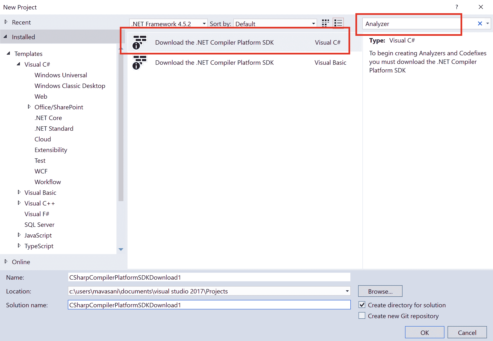

1.  新项目将默认打开 `index.html` 文件。点击下载 .NET 编译器平台 SDK 模板 >> 按钮，以安装分析器 SDK 模板。

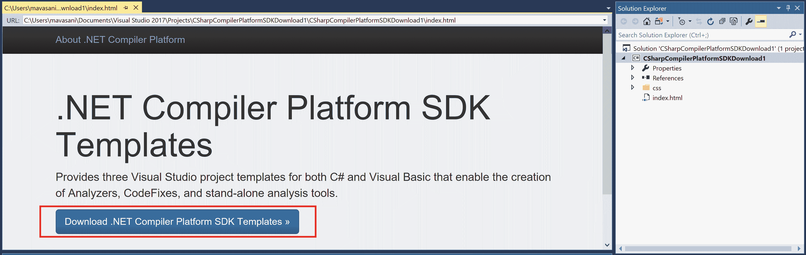

1.  在随后的文件下载对话框中，点击打开。

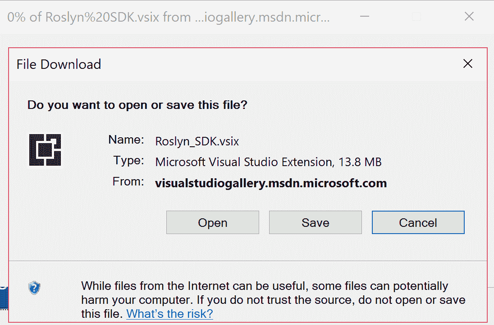

1.  在下一个 VSIX 安装程序对话框中点击安装，在随后的提示中点击结束任务以安装 SDK：

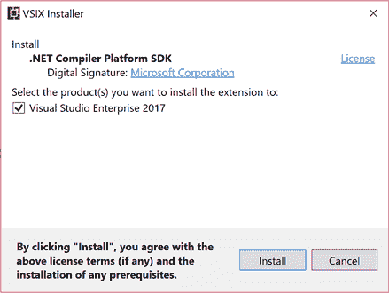

1.  启动一个新的 Visual Studio 实例，然后点击文件 | 新建 | 项目... 以获取新项目对话框。

1.  将项目目标框架组合框更改为 .NET Framework 4.6（或更高版本）。在 Visual C# | 扩展性下，选择具有代码修复功能的分析器（NuGet + VSIX），将项目命名为 `CSharpAnalyzers`，然后点击确定。

***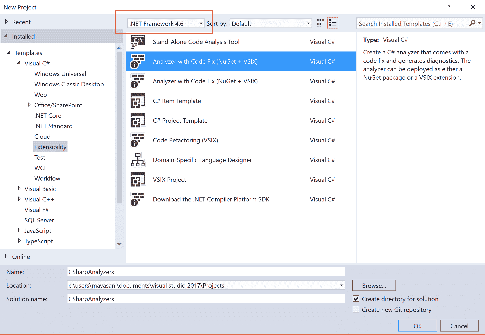***

1.  您现在应该有一个包含 3 个项目的分析器解决方案：`CSharpAnalyzers (Portable)`、`CSharpAnalyzers.Test` 和 `CSharpAnalyzer.Vsix`**：

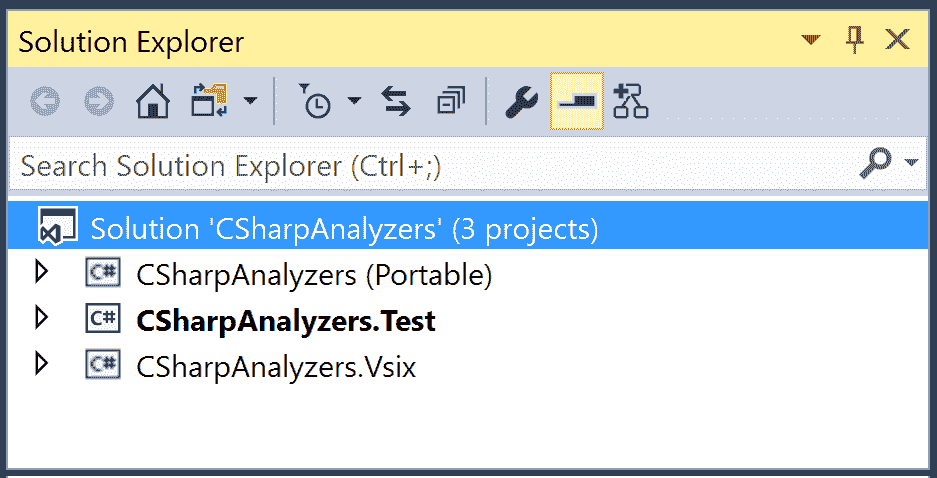

1.  在 `CSharpAnalyzers` 项目中打开源文件 `DiagnosticAnalyzer.cs` 并在 `Initialize` 和 `AnalyzeSymbol` 方法的开始处设置断点（按 *F9*），如图所示：

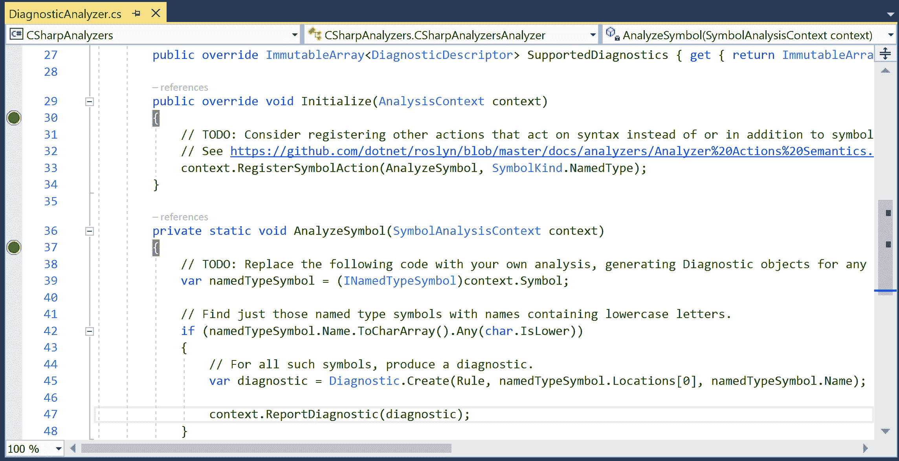

1.  将 `CSharpAnalyzers.Vsix` 设置为启动项目，然后点击 *F5* 构建分析器并启动一个新的 Visual Studio 实例，其中启用了分析器并开始调试。

1.  在新的 Visual Studio 实例中，创建一个新的 C# 类库项目，例如 `ClassLibrary`。

1.  验证我们在第一个 VS 实例的分析器代码中触发了前面的断点。您可以使用 *F10* 单步执行分析器代码或点击 *F5* 继续调试。

1.  我们现在应该在错误列表中看到分析器诊断，并在编辑器中看到一个波浪线：

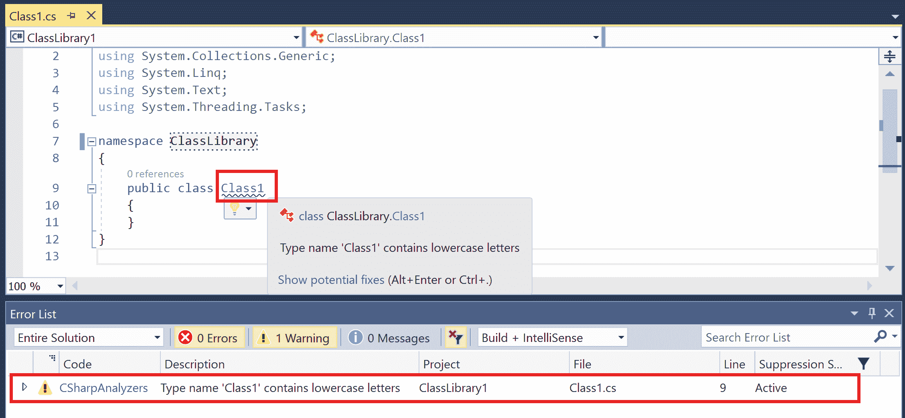

1.  将类的名称从 `Class1` 编辑为 `CLASS1`。

1.  我们应该在 `AnalyzeSymbol` 方法中再次遇到断点。使用 *F5* 继续调试，诊断和波浪线应立即消失，展示了强大的实时和可扩展的分析功能。

# 它是如何工作的...

.NET 编译器平台 SDK 是一个包装项目，它将我们重定向到获取 C# 和 Visual Basic 的分析器 + CodeFix 项目模板。从这些模板创建新项目将创建一个功能齐全的分析器项目，该项目具有默认分析器、单元测试和 VSIX 项目：

+   `CSharpAnalyzers`: 包含默认分析器实现的核心分析器项目，该实现报告所有包含任何小写字母的类型名称的诊断。

+   `CSharpAnalyzers.Test`: 包含一些分析器和代码修复单元测试以及测试辅助工具的分析器单元测试项目。

+   `CSharpAnalyzers.Vsix`: 将分析器打包成 VSIX 的 VSIX 项目。这是解决方案中的启动项目。

点击 *F5* 以启动调试解决方案，构建并部署分析器到 Visual Studio 扩展存储库，然后从这个存储库启动一个新的 Visual Studio 实例。在我们的分析器中，默认情况下为在此 VS 实例中创建的所有 C# 项目启用。

让我们更详细地探讨一下在 `DiagnosticAnalyzers.cs` 中定义的诊断分析器源代码。它包含一个名为 `CSharpAnalyzersAnalyzer` 的类型，该类型继承自 `DiagnosticAnalyzer`。`DiagnosticAnalyzer` 是一个抽象类型，具有以下两个抽象成员：

+   `SupportedDiagnostics` 属性：分析器必须定义一个或多个受支持的诊断描述符。描述符描述了分析器在分析器动作中可以报告的诊断的元数据。它包含诊断 ID、消息格式、标题、描述、诊断文档的超链接等字段。可用于创建和报告诊断：

```cs
private static DiagnosticDescriptor Rule = new DiagnosticDescriptor(DiagnosticId, Title, MessageFormat, Category, DiagnosticSeverity.Warning, isEnabledByDefault: true, description: Description);

public override ImmutableArray<DiagnosticDescriptor> SupportedDiagnostics { get { return ImmutableArray.Create(Rule); } }

```

+   `Initialize` 方法：诊断分析器必须实现 `Initialize` 方法以注册对特定代码实体类型的分析器动作回调，对于默认分析器，这个类型被称为类型符号。初始化方法在分析器生命周期内只被调用一次，以允许分析器初始化和注册动作。

```cs
 public override void Initialize(AnalysisContext context)
 {
  context.RegisterSymbolAction(AnalyzeSymbol, SymbolKind.NamedType);
 }

 private static void AnalyzeSymbol(SymbolAnalysisContext context)
 {
   ...
 }

```

如果你的分析器可以同时处理来自多个线程的动作回调，请在 `Initialize` 方法中调用 `AnalysisContext.EnableConcurrentExecution()`，这使分析器驱动程序能够在具有多个核心的机器上更有效地执行分析器。此外，还应在 `Initialize` 方法中调用 `AnalysisContext.ConfigureGeneratedCodeAnalysis()` 以配置分析器是否想要分析和/或报告生成代码中的诊断。

分析器动作会在用户源代码中感兴趣的每个代码实体上被调用。此外，当用户编辑代码并创建新的编译时，在代码编辑期间，对于新编译中定义的实体，动作回调会持续调用。错误列表确保它只报告活动编译中的诊断。

使用 [`source.roslyn.io`](http://source.roslyn.io) 进行丰富的语义搜索和导航 Roslyn 源代码，该代码在 [`github.com/dotnet/roslyn.git`](https://github.com/dotnet/roslyn.git) 上开源。例如，你可以使用查询 URL [`source.roslyn.io/#q=DiagnosticAnalyzer`](http://source.roslyn.io/#q=DiagnosticAnalyzer) 查看对 `DiagnosticAnalyzer` 的定义和引用。

# 创建符号分析器以报告关于符号声明的相关问题

符号分析器注册动作回调以分析一种或多种符号声明，例如类型、方法、字段、属性、事件等，并报告关于声明的语义问题。

在本节中，我们将创建一个符号分析器，该分析器扩展了编译器诊断 *CS0542*（成员名称不能与其封装类型相同）以报告如果成员名称与任何外部父类型相同，则报告诊断。例如，分析器将在此处报告内部最深层类型 `NestedClass` 的诊断：

```cs
public class NestedClass
{
  public class InnerClass
  {
    public class NestedClass
    {
    }
  }
}

```

# 准备工作

您需要在 Visual Studio 2017 中创建并打开一个分析器项目，例如 `CSharpAnalyzers`。请参阅本章的第一个配方以创建此项目。

# 如何操作...

1.  在解决方案资源管理器中，双击 `CSharpAnalyzers` 项目中的 `Resources.resx` 文件以在资源编辑器中打开资源文件。

1.  将 `AnalyzerDescription`、`AnalyzerMessageFormat` 和 `AnalyzerTitle` 的现有资源字符串替换为新字符串：


1.  将 `Initialize` 方法实现替换为以下内容：

```cs
public override void Initialize(AnalysisContext context)
{
  context.RegisterSymbolAction(symbolContext =>
  {
    var symbolName = symbolContext.Symbol.Name;

    // Skip the immediate containing type, CS0542 already covers this case.
    var outerType = symbolContext.Symbol.ContainingType?.ContainingType;
    while (outerType != null)
    {
      // Check if the current outer type has the same name as the given member.
      if (symbolName.Equals(outerType.Name))
      {
        // For all such symbols, report a diagnostic.
        var diagnostic = Diagnostic.Create(Rule, symbolContext.Symbol.Locations[0], symbolContext.Symbol.Name);
        symbolContext.ReportDiagnostic(diagnostic);
        return;
      }

      outerType = outerType.ContainingType;
    }
  },
  SymbolKind.NamedType,
  SymbolKind.Method,
  SymbolKind.Field,
  SymbolKind.Event,
  SymbolKind.Property);
}

```

1.  点击 *Ctrl* + *F5* 以启动一个新的带有分析器启用的 Visual Studio 实例。

1.  在新的 Visual Studio 实例中，使用以下代码创建一个新的 C# 类库：

```cs
namespace ClassLibrary
{
 public class OuterClass
 {
  public class NestedClass
  {
   public class NestedClass
   {
   }
  }
 }
}

```

1.  验证编译器在错误列表中报告了诊断 *CS0542*：`'NestedClass': member names cannot be the same as their enclosing type`。

1.  将类库代码更改为以下内容：

```cs
namespace ClassLibrary
{
 public class OuterClass
 {
  public class NestedClass
  {
   public class InnerClass
   {
    public class NestedClass
    {
    }
   }
  }
 }
}

```

1.  验证 *CS0542* 诊断不再报告，但错误列表中有我们的分析器诊断：

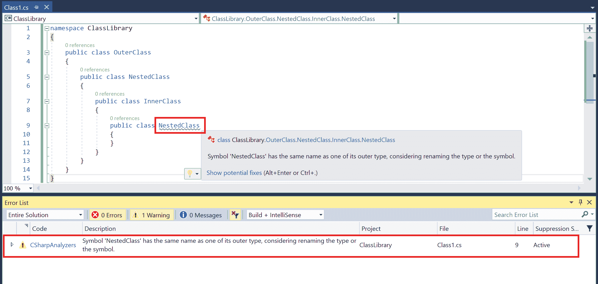

1.  将 `NestedClass` 的内部最深层类型声明替换为字段：`public int NestedClass`，并验证是否报告了相同的分析器诊断。您应该为具有相同名称的其他成员类型（如方法、属性和事件）获得相同的诊断。

# 它是如何工作的...

符号分析器注册一个或多个符号动作回调以分析感兴趣的符号类型。请注意，与注册名为 `AnalyzeSymbol` 的委托方法的默认实现不同，我们注册了一个 lambda 回调。

我们在 `RegisterSymbolAction` 调用中指定了对所有可以具有封装类型的顶级符号类型的兴趣，即类型、方法、字段、属性和事件：

```cs
context.RegisterSymbolAction(symbolContext =>
{
 ...
},
SymbolKind.NamedType,
SymbolKind.Method,
SymbolKind.Field,
SymbolKind.Event,
SymbolKind.Property);

```

分析器驱动程序确保为注册的兴趣类型的所有符号调用注册的 lambda。

分析跳过了直接封装类型，因为 C# 编译器已经报告了错误 *CS0542*，如果成员具有与其封装类型相同的名称。

```cs
// Skip the immediate containing type, CS0542 already covers this case.
var outerType = symbolContext.Symbol.ContainingType?.ContainingType;

```

核心分析通过遍历外部类型，并在符号分析上下文中比较符号的名称与相关外部类型，直到找到匹配项，在这种情况下报告诊断；如果外部类型没有包含类型，则不报告诊断。

```cs
while (outerType != null)
{
 // Check if the current outer type has the same name as the given member.
 if (symbolName.Equals(outerType.Name))
 {
  // For all such symbols, report a diagnostic.
  ...
 }

 outerType = outerType.ContainingType;
}

```

建议符号操作仅分析并报告关于声明的诊断，而不是其中可执行代码。如果您需要分析符号内的可执行代码，应尝试注册本章后面讨论的其他动作类型。

# 还有更多...

**趣闻**：符号分析器的先前实现没有最佳性能。例如，如果您有 *n* 级别的类型嵌套，以及最内层嵌套类型中的 *m* 个字段，我们实现的分析将是 *O(m*n)* 算法复杂度。您能否实现一个替代实现，其中分析可以以更优越的 *O(m + n)* 复杂度实现？

# 参见

我们当前的分析器实现是完全无状态的，因为它不需要依赖于多个符号的分析。我们单独分析每个符号并为其报告诊断。然而，如果您需要进行更复杂的分析，这需要从多个符号中收集状态然后进行全局编译分析，您应该编写一个具有符号和编译动作的有状态编译分析器。这将在本章后面的食谱 *创建一个分析整个编译并报告问题的编译分析器* 中介绍。

# 创建一个语法节点分析器以报告关于语言语法的相关问题

语法节点分析器注册动作回调以分析一种或多种语法节点，例如运算符、标识符、表达式、声明等，并报告关于语法的语义问题。这些分析器通常需要获取正在分析的不同语法节点的语义信息，并使用编译器语义模型 API 获取这些信息。

在本节中，我们将创建一个语法分析器，该分析器分析 `VariableDeclarationSyntax` 节点以进行局部声明，并报告一个诊断建议使用显式类型而不是隐式类型声明，即使用关键字 `var` 定义的变量，例如 `var i = new X();`*.* 如果存在编译器语法错误（隐式类型声明不能定义多个变量），或者赋值右侧有错误类型或特殊 System 类型（如 int、char、string 等），分析器将不会报告诊断。例如，分析器不会标记本例中的局部变量 `local1`、`local2` 和 `local3`，但会标记 `local4`。

```cs
int local1 = 0;
Class1 local2 = new Class1();
var local3 = 0;
var local4 = new Class1();

```

# 准备工作

您需要创建并打开一个分析器项目，例如在 Visual Studio 2017 中创建名为 `CSharpAnalyzers` 的项目。请参考本章的第一个食谱来创建此项目。

# 如何实现...

1.  在解决方案资源管理器中，双击 `CSharpAnalyzers` 项目中的 `Resources.resx` 文件以在资源编辑器中打开资源文件。

1.  将 `AnalyzerDescription`、`AnalyzerMessageFormat` 和 `AnalyzerTitle` 的现有资源字符串替换为新字符串：

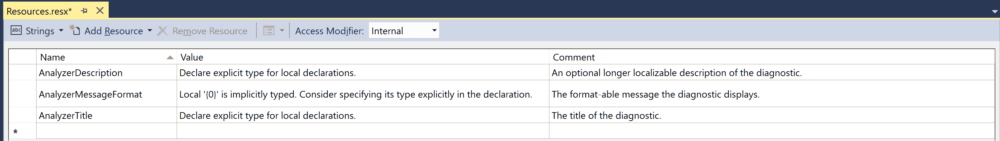

1.  将 `Initialize` 方法实现替换为以下内容：

```cs
public override void Initialize(AnalysisContext context)
{
  context.RegisterSyntaxNodeAction(syntaxNodeContext =>
  {
    // Find implicitly typed variable declarations.
    // Do not flag implicitly typed declarations that declare more than one variables,
    // as the compiler already generates error CS0819 for those cases.
    var declaration = (VariableDeclarationSyntax)syntaxNodeContext.Node;
    if (!declaration.Type.IsVar || declaration.Variables.Count != 1)
    {
      return;
    }

    // Do not flag variable declarations with error type or special System types, such as int, char, string, and so on.
    var typeInfo = syntaxNodeContext.SemanticModel.GetTypeInfo(declaration.Type, syntaxNodeContext.CancellationToken);
    if (typeInfo.Type.TypeKind == TypeKind.Error || typeInfo.Type.SpecialType != SpecialType.None)
    {
      return;
    }

    // Report a diagnostic.
    var variable = declaration.Variables[0];
    var diagnostic = Diagnostic.Create(Rule, variable.GetLocation(), variable.Identifier.ValueText);
    syntaxNodeContext.ReportDiagnostic(diagnostic);
  }, 
  SyntaxKind.VariableDeclaration);
}

```

1.  点击 *Ctrl* + *F5* 以启动一个新的带有分析器的 Visual Studio 实例。

1.  在新的 Visual Studio 实例中，创建一个新的 C# 类库，代码如下：

```cs
namespace ClassLibrary
{
  public class Class1
  {
    public void M(int param1, Class1 param2)
    {
      // Explicitly typed variables - do not flag.
      int local1 = param1;
      Class1 local2 = param2;
    }
  }
}

```

1.  验证分析器诊断未在错误列表中报告显式类型变量。

1.  现在，将以下隐式类型变量声明添加到方法中：

```cs
 // Implicitly typed variable with error type - do not flag.
 var local3 = UndefinedMethod();

 // Implicitly typed variable with special type - do not flag.
 var local4 = param1;

```

1.  验证分析器诊断不会在错误列表中报告具有错误类型或特殊类型的隐式类型变量。

1.  将违反的隐式类型变量声明添加到方法中：

```cs
 // Implicitly typed variable with user defined type - flag.
 var local5 = param2;

```

1.  验证分析器诊断是否报告了此隐式类型变量：

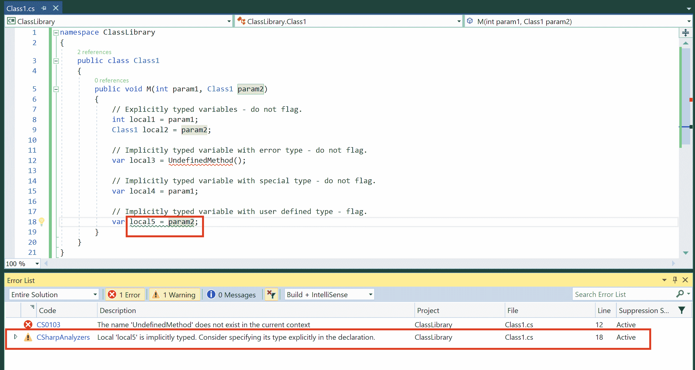

# 它是如何工作的...

语法节点分析器注册一个或多个语法节点动作回调以分析感兴趣的语法类型。我们在`RegisterSyntaxNodeAction`调用中指定了对分析`VariableDeclaration`语法类型的兴趣。

```cs
context.RegisterSyntaxNodeAction(syntaxNodeContext =>
{
...
}, SyntaxKind.VariableDeclaration);

```

分析通过在回调中操作语法节点和从语法节点分析上下文公开的语义模型来工作。我们首先进行语法检查，以验证我们正在操作一个有效的隐式类型声明：

```cs
// Do not flag implicitly typed declarations that declare more than one variables,
// as the compiler already generates error CS0819 for those cases.
var declaration = (VariableDeclarationSyntax)syntaxNodeContext.Node;
if (!declaration.Type.IsVar || declaration.Variables.Count != 1)
{
 return;
}

```

然后，我们使用语义模型 API 执行语义检查，以获取类型声明语法节点的语义类型信息，并验证它不是错误类型或原始系统类型：

```cs
// Do not flag variable declarations with error type or special System types, such as int, char, string, and so on.
var typeInfo = syntaxNodeContext.SemanticModel.GetTypeInfo(declaration.Type, syntaxNodeContext.CancellationToken);
if (typeInfo.Type.TypeKind == TypeKind.Error || typeInfo.Type.SpecialType != SpecialType.None)
{
 return;
}

```

您可以使用公共语义模型 API 在从`SyntaxNodeAnalysisContext`公开的语法节点上执行许多强大的语义操作，有关参考，请参阅[`github.com/dotnet/roslyn/blob/master/src/Compilers/Core/Portable/Compilation/SemanticModel.cs`](https://github.com/dotnet/roslyn/blob/master/src/Compilers/Core/Portable/Compilation/SemanticModel.cs)。

如果语法和语义检查都成功，则我们报告关于推荐显式类型而不是`var`的诊断。

# 创建一个语法树分析器来分析源文件并报告语法问题

语法树分析器注册动作回调以分析源文件的语法/语法，并报告纯语法问题。例如，语句末尾缺少分号是一个语法错误，而将不兼容的类型分配给没有可能类型转换的符号是一个语义错误。

在本节中，我们将编写一个语法树分析器，该分析器分析源文件中的所有语句，并为任何未在块中（即花括号`{}`）封装的语句生成语法警告。例如，以下代码将为`if`语句和`System.Console.WriteLine`调用语句生成警告，但`while`语句不会被标记：

```cs
void Method()
{
 while (...)
  if (...)
   System.Console.WriteLine(value);
}

```

# 准备工作

您需要在 Visual Studio 2017 中创建并打开一个分析器项目，例如`CSharpAnalyzers`。请参阅本章的第一个配方以创建此项目。

# 如何实现...

1.  在解决方案资源管理器中，双击`CSharpAnalyzers`项目中的`Resources.resx`文件以在资源编辑器中打开资源文件。

1.  将`AnalyzerDescription`、`AnalyzerMessageFormat`和`AnalyzerTitle`的现有资源字符串替换为新字符串。


1.  将`Initialize`方法实现替换为以下内容：

```cs
public override void Initialize(AnalysisContext context)
{
   context.RegisterSyntaxTreeAction(syntaxTreeContext =>
   {
     // Iterate through all statements in the tree.
     var root = syntaxTreeContext.Tree.GetRoot(syntaxTreeContext.CancellationToken);
     foreach (var statement in root.DescendantNodes().OfType<StatementSyntax>())
     {
       // Skip analyzing block statements.
       if (statement is BlockSyntax)
       {
         continue;
       }

       // Report issue for all statements that are nested within a statement,
       // but not a block statement.
       if (statement.Parent is StatementSyntax && !(statement.Parent is BlockSyntax))
       {
         var diagnostic = Diagnostic.Create(Rule, statement.GetFirstToken().GetLocation());
         syntaxTreeContext.ReportDiagnostic(diagnostic);
       }
     }
   });
}

```

1.  点击*Ctrl* + *F5*以启动一个新的带有分析器启用的 Visual Studio 实例。

1.  在新的 Visual Studio 实例中，创建一个新的 C#类库，代码如下：

```cs
namespace ClassLibrary
{
  public class Class1
  {
    void Method(bool flag, int value)
    {
      while (flag)
      if (value > 0)
      System.Console.WriteLine(value);
    }
  }
}

```

1.  验证分析器诊断既未报告`Method`方法块，也未报告`while`语句，而是报告了`if`语句和`System.Console.WriteLine`调用语句：

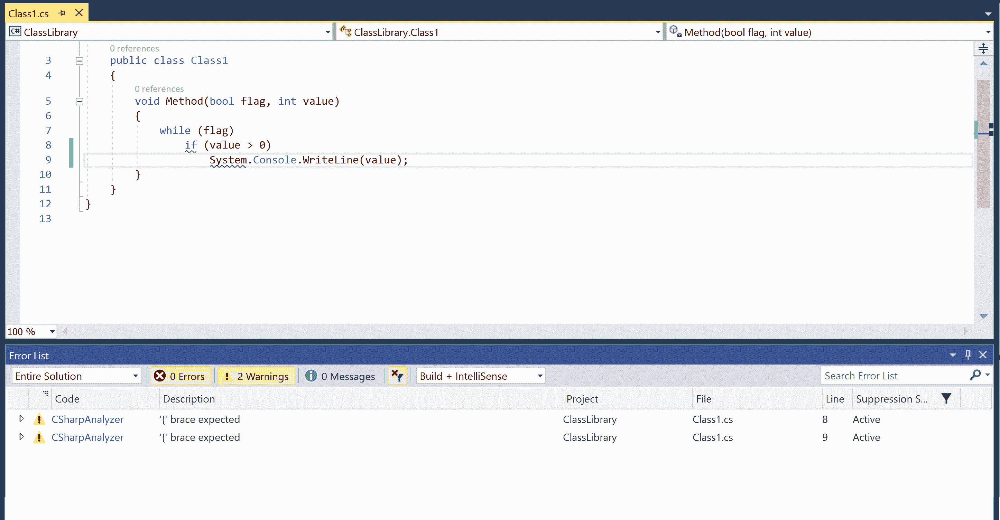

1.  现在，在`System.Console.WriteLine`调用语句周围添加花括号，并验证现在只为`if`语句报告了一个警告：

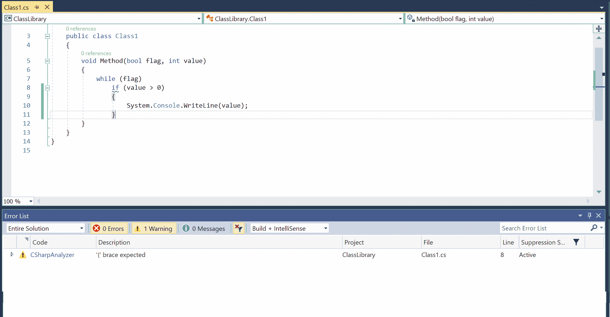

# 它是如何工作的...

语法树分析器注册回调以分析编译中所有源文件的语法。我们的分析是通过获取语法树的根并操作根的所有类型为`StatementSyntax`的子语法节点来工作的。首先，我们注意到一个块语句本身是一个聚合语句，并且根据定义具有花括号，所以我们跳过这些。

```cs
// Skip analyzing block statements.
if (statement is BlockSyntax)
{
  continue;
}

```

我们然后对语句语法的父级进行语法检查。如果语句的父级也是一个语句，但不是一个带有花括号的块，那么我们在语句的第一个语法标记上报告一个诊断，建议使用花括号。

```cs
// Report issue for all statements that are nested within a statement,
// but not a block statement.
if (statement.Parent is StatementSyntax && !(statement.Parent is BlockSyntax))
{
  var diagnostic = Diagnostic.Create(Rule, statement.GetFirstToken().GetLocation());
  syntaxTreeContext.ReportDiagnostic(diagnostic);
}

```

`SyntaxTreeAnalysisContext`提供给语法树操作的语义模型不暴露源文件，因此无法在语法树操作内执行语义分析。

# 创建方法体分析器以分析整个方法和报告问题

状态方法体或代码块分析器注册了需要整个方法体分析来报告关于方法声明或可执行代码问题的操作回调。这些分析器通常需要在分析开始时初始化一些可变状态，这些状态在分析方法体时更新，并且最终状态用于报告诊断。

在本节中，我们将创建一个代码块分析器，标记未使用的方法参数。例如，它不会标记`param1`和`param2`为未使用，但会标记`param3`和`param4`*.*。

```cs
void M(int param1, ref int param2, int param3, params int[] param4)
{
 int local1 = param1;
 param2 = 0;
}

```

# 准备工作

您需要在 Visual Studio 2017 中创建并打开一个分析器项目，例如`CSharpAnalyzers`。请参考本章的第一个配方来创建此项目。

# 如何做...

1.  在解决方案资源管理器中，双击`CSharpAnalyzers`项目中的`Resources.resx`文件以在资源编辑器中打开资源文件。

1.  将`AnalyzerDescription`、`AnalyzerMessageFormat`和`AnalyzerTitle`的现有资源字符串替换为新字符串。

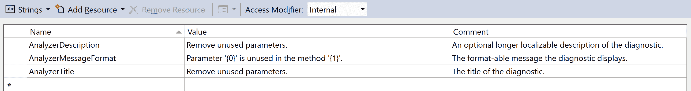

1.  将`Initialize`方法实现替换为来自`CSharpAnalyzers/CSharpAnalyzers/CSharpAnalyzers/DiagnosticAnalyzer.cs/`中名为`Initialize`*.*的方法的代码。

1.  在您的分析器中添加来自 `CSharpAnalyzers/CSharpAnalyzers/CSharpAnalyzers/DiagnosticAnalyzer.cs/` 的私有类 `UnusedParametersAnalyzer`，该类名为 `UnusedParametersAnalyzer`，以执行给定方法的核心理法体分析。

1.  点击 *Ctrl* + *F5* 以启动一个新的带有分析器的 Visual Studio 实例。

1.  在新的 Visual Studio 实例中，创建一个新的 C# 类库，代码如下：

```cs
namespace ClassLibrary
{
  public class Class1
  {
    void M(int param1, ref int param2, int param3, params int[] param4)
    {
      int local1 = param1;
      param2 = 0;
    }
  }
}

```

1.  验证分析器诊断信息对于 `param1` 和 `param2` 没有报告，但对于 `param3` 和 `param4` 有报告：

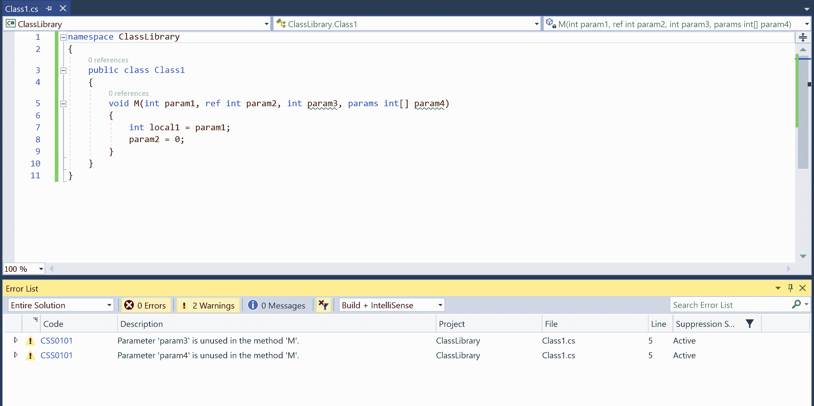

1.  现在，向本地声明语句中添加使用`param3`的代码，删除`param4`，并验证诊断信息是否消失：

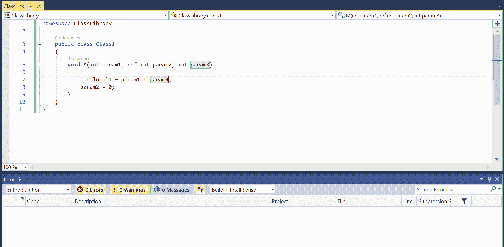

# 它是如何工作的...

代码块分析器注册代码块操作以分析编译中的可执行代码块。您可以注册无状态的 `CodeBlockAction` 或具有嵌套操作的 `CodeBlockStartAction` 以分析代码块内的语法节点。我们的分析器注册了一个 `CodeBlockStartAction` 以执行有状态的分析。

```cs
 context.RegisterCodeBlockStartAction<SyntaxKind>(startCodeBlockContext =>
 {
  ...
 }

```

分析从几个早期的退出检查开始：我们只对分析方法体内部的可执行代码以及至少有一个参数的方法感兴趣。

```cs
  // We only care about method bodies.
  if (startCodeBlockContext.OwningSymbol.Kind != SymbolKind.Method)
  {
    return;
  }

  // We only care about methods with parameters.
  var method = (IMethodSymbol)startCodeBlockContext.OwningSymbol;
  if (method.Parameters.IsEmpty)
  {
    return;
  }

```

我们为每个要分析的方法分配一个新的 `UnusedParametersAnalyzer` 实例。此类构造函数初始化分析中跟踪的可变状态（稍后解释）：

```cs
  // Initialize local mutable state in the start action.
  var analyzer = new UnusedParametersAnalyzer(method);

```

然后，我们在给定方法的给定代码块上下文中注册一个嵌套的语法节点操作，`UnusedParametersAnalyzer.AnalyzeSyntaxNode`，并注册对代码块内 `IdentifierName` 语法节点的分析兴趣：

```cs
// Register an intermediate non-end action that accesses and modifies the state. startCodeBlockContext.RegisterSyntaxNodeAction(analyzer.AnalyzeSyntaxNode, SyntaxKind.IdentifierName);

```

最后，我们在代码块分析结束时注册一个嵌套的 `CodeBlockEndAction` 以在 `UnusedParametersAnalyzer` 实例上执行。

```cs
// Register an end action to report diagnostics based on the final state. startCodeBlockContext.RegisterCodeBlockEndAction(analyzer.CodeBlockEndAction);

```

嵌套的结束操作总是在同一分析上下文中注册的所有嵌套非结束操作执行完毕后保证执行。

让我们现在了解核心 `UnusedParametersAnalyzer` 类型的工作原理，以分析特定的代码块。此分析器定义了可变状态字段以跟踪被认为是未使用的参数（及其名称）：

```cs
  #region Per-CodeBlock mutable state
  private readonly HashSet<IParameterSymbol> _unusedParameters;
  private readonly HashSet<string> _unusedParameterNames;
  #endregion

```

我们在分析器的构造函数中初始化这个可变状态。在分析开始时，我们过滤掉隐式声明的参数和没有源位置的参数——这些永远不会被认为是冗余的。我们将剩余的参数标记为未使用。

```cs
  #region State intialization
  public UnusedParametersAnalyzer(IMethodSymbol method)
  {
    // Initialization: Assume all parameters are unused, except for:
    //  1\. Implicitly declared parameters
    //  2\. Parameters with no locations (example auto-generated parameters for accessors)
    var parameters = method.Parameters.Where(p => !p.IsImplicitlyDeclared && p.Locations.Length > 0);
    _unusedParameters = new HashSet<IParameterSymbol>(parameters);
    _unusedParameterNames = new HashSet<string>(parameters.Select(p => p.Name));
  }
  #endregion

```

`AnalyzeSyntaxNode` 已注册为嵌套的语法节点操作，用于分析代码块内的所有 `IdentifierName` 节点。我们在方法开始时进行一些快速检查，如果 (a) 我们当前分析状态中没有未使用的参数，或者 (b) 标识符名称不匹配任何未使用的参数名称，则退出分析。后者的检查是为了避免尝试计算标识符符号信息的性能损失。

```cs
  #region Intermediate actions
  public void AnalyzeSyntaxNode(SyntaxNodeAnalysisContext context)
  {
    // Check if we have any pending unreferenced parameters.
    if (_unusedParameters.Count == 0)
    {
      return;
    }

    // Syntactic check to avoid invoking GetSymbolInfo for every identifier.
    var identifier = (IdentifierNameSyntax)context.Node;
    if (!_unusedParameterNames.Contains(identifier.Identifier.ValueText))
    {
      return;
    }

```

然后，我们使用语义模型 API 获取标识符名称的语义符号信息，并检查它是否绑定到当前被视为未使用的参数之一。如果是这样，我们从未使用集合中删除此参数（及其名称）。

```cs
    // Mark parameter as used.
    var parmeter = context.SemanticModel.GetSymbolInfo(identifier, context.CancellationToken).Symbol as IParameterSymbol;
    if (parmeter != null && _unusedParameters.Contains(parmeter))
    {
      _unusedParameters.Remove(parmeter);
      _unusedParameterNames.Remove(parmeter.Name);
    }
  }
  #endregion

```

最后，注册的代码块结束操作遍历未使用集合中的所有剩余参数，并将它们标记为未使用参数。

```cs
  #region End action
  public void CodeBlockEndAction(CodeBlockAnalysisContext context)
  {
    // Report diagnostics for unused parameters.
    foreach (var parameter in _unusedParameters)
    {
      var diagnostic = Diagnostic.Create(Rule, parameter.Locations[0], parameter.Name, parameter.ContainingSymbol.Name);
      context.ReportDiagnostic(diagnostic);
    }
  }
 #endregion

```

# 创建一个分析整个编译并报告问题的编译分析器

一个有状态的编译分析器注册了需要编译范围内符号和/或语法分析的回调，以报告有关声明或可执行代码的问题。这些分析器通常需要在分析开始时初始化一些可变状态，该状态在分析编译时更新，并使用最终状态来报告诊断信息。

在本节中，我们将创建一个执行编译范围内分析和报告的分析器。对于以下场景，诊断安全类型不得实现具有不安全方法的接口：

+   假设我们有一个接口，比如 `MyNamespace.ISecureType`，这是一个众所周知的安全接口，即它是表示程序集中所有安全类型的标记*。

+   假设我们有一个方法属性，比如 `MyNamespace.InsecureMethodAttribute`*，它标记了应用此属性的方法为不安全。任何具有此类属性的成员的接口都必须被视为不安全。

+   我们希望报告实现知名安全接口同时也实现任何不安全接口的类型的相关诊断信息。

分析器执行编译范围内的分析以检测此类违规类型，并在编译结束操作中报告它们的诊断信息。

# 准备工作

您需要创建并打开一个分析器项目，例如在 Visual Studio 2017 中创建 `CSharpAnalyzers`。请参阅本章的第一个配方以创建此项目。

# 如何操作...

1.  在解决方案资源管理器中，双击 `CSharpAnalyzers` 项目中的 `Resources.resx` 文件以在资源编辑器中打开资源文件。

1.  将现有的 `AnalyzerDescription`、`AnalyzerMessageFormat` 和 `AnalyzerTitle` 资源字符串替换为新字符串。

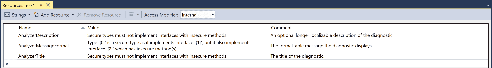

1.  将 `Initialize` 方法实现替换为来自 `CSharpAnalyzers/CSharpAnalyzers/CSharpAnalyzers/DiagnosticAnalyzer.cs/` 方法名为 `Initialize`** 的代码**。

1.  在您的分析器中添加一个名为 `CompilationAnalyzer` 的私有类，来自 `CSharpAnalyzers/CSharpAnalyzers/CSharpAnalyzers/DiagnosticAnalyzer.cs/` 类型，以执行给定方法的核心理法体分析。

1.  点击 *Ctrl* + *F5* 以启动一个新的带有分析器的 Visual Studio 实例。

1.  在新的 Visual Studio 实例中，通过遵循此处提供的步骤启用 C# 项目的完整解决方案分析：[`msdn.microsoft.com/en-us/library/mt709421.aspx`](https://msdn.microsoft.com/en-us/library/mt709421.aspx)

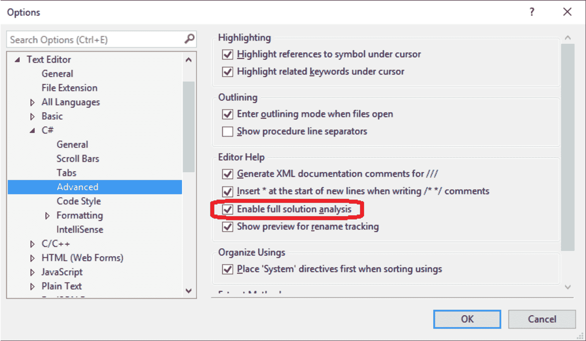

1.  在新的 Visual Studio 实例中，创建一个新的 C# 类库，代码如下：

```cs
namespace MyNamespace
{
  public class InsecureMethodAttribute : System.Attribute { }

  public interface ISecureType { }

  public interface IInsecureInterface
  {
    [InsecureMethodAttribute]
    void F();
  }

  class MyInterfaceImpl1 : IInsecureInterface
  {
    public void F() {}
  }

  class MyInterfaceImpl2 : IInsecureInterface, ISecureType
  {
    public void F() {}
  }

  class MyInterfaceImpl3 : ISecureType
  {
    public void F() {}
  }
}

```

1.  验证分析器诊断信息对于 `MyInterfaceImpl1` 和 `MyInterfaceImpl`*3* 没有报告，但对于 `MyInterfaceImpl2` 有报告：

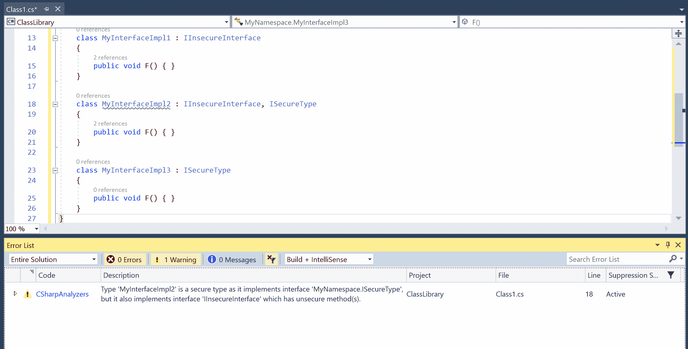

1.  现在，将 `MyInterfaceImpl2` 改为不再实现 `IInsecureInterface` 并验证诊断信息不再报告。

```cs
class MyInterfaceImpl2 : ISecureType
{
  public void F() {}
}

```

# 它是如何工作的...

编译分析器注册编译操作以分析编译中的符号和/或语法节点。您可以注册无状态的 `CompilationAction` 或具有嵌套操作的 `CompilationStartAction` 以分析编译内的符号和/或语法节点。我们的分析器注册了一个 `CompilationStartAction` 来执行有状态分析。

```cs
context.RegisterCompilationStartAction(compilationContext =>
{
 ...
}

```

分析从几个早期退出检查开始：我们只对具有名为 `MyNamespace.ISecureType` 和 `MyNamespace.InsecureMethodAttribute` 的源或元数据类型的编译进行分析。

```cs
 // Check if the attribute type marking insecure methods is defined.
 var insecureMethodAttributeType = compilationContext.Compilation.GetTypeByMetadataName("MyNamespace.InsecureMethodAttribute");
 if (insecureMethodAttributeType == null)
 {
   return;
 }

 // Check if the interface type marking secure types is defined.
 var secureTypeInterfaceType = compilationContext.Compilation.GetTypeByMetadataName("MyNamespace.ISecureType");
 if (secureTypeInterfaceType == null)
 {
   return;
 }

```

我们为要分析的编译分配一个新的 `CompilationAnalyzer` 实例。此类构造函数初始化分析中跟踪的可变和不可变状态（稍后解释）。

```cs
// Initialize state in the start action.
var analyzer = new CompilationAnalyzer(insecureMethodAttributeType, secureTypeInterfaceType);

```

然后，我们在给定的编译开始上下文中注册一个嵌套符号操作，`CompilationAnalyzer.AnalyzeSymbol`，以分析给定的编译中的类型和符号。

```cs
// Register an intermediate non-end action that accesses and modifies the state. compilationContext.RegisterSymbolAction(analyzer.AnalyzeSymbol, SymbolKind.NamedType, SymbolKind.Method);

```

最后，我们在编译分析结束时注册一个嵌套的 `CompilationEndAction` 以在 `CompilationAnalyzer` 实例上执行。

```cs
// Register an end action to report diagnostics based on the final state. compilationContext.RegisterCompilationEndAction(analyzer.CompilationEndAction);

```

嵌套的编译结束操作始终保证在相同分析上下文中注册的所有嵌套非结束操作执行完毕后执行。

现在，让我们了解核心 `CompilationAnalyzer` 类型的运作方式，以便分析特定的编译。此分析器为对应于安全接口和不安全方法属性的类型符号定义了一个不可变状态。它还定义了可变状态字段，以跟踪编译中定义的实现安全接口的类型集合以及编译中定义的具有不安全方法属性的方法集合。

```cs
#region Per-Compilation immutable state
 private readonly INamedTypeSymbol _insecureMethodAttributeType;
 private readonly INamedTypeSymbol _secureTypeInterfaceType;
#endregion

#region Per-Compilation mutable state
 /// <summary>
 /// List of secure types in the compilation implementing secure interface.
 /// </summary>
 private List<INamedTypeSymbol> _secureTypes;

 /// <summary>
 /// Set of insecure interface types in the compilation that have methods with an insecure method attribute.
 /// </summary>
 private HashSet<INamedTypeSymbol> _interfacesWithInsecureMethods; 
#endregion

```

在分析开始时，我们将安全类型和不安全方法接口的集合初始化为空。

```cs
#region State intialization
 public CompilationAnalyzer(INamedTypeSymbol insecureMethodAttributeType, INamedTypeSymbol secureTypeInterfaceType)
{
  _insecureMethodAttributeType = insecureMethodAttributeType;
  _secureTypeInterfaceType = secureTypeInterfaceType;

  _secureTypes = null;
  _interfacesWithInsecureMethods = null;
 }
#endregion

```

`AnalyzeSymbol` 被注册为嵌套符号操作，以分析编译内的所有类型和方法。对于编译中的每个类型声明，我们检查它是否实现了安全接口，如果是，则将其添加到我们的安全类型集合中。对于编译中的每个方法声明，我们检查其包含的类型是否为接口以及方法是否具有不安全方法属性，如果是，则将包含的接口类型添加到我们的具有不安全方法接口类型集合中。

```cs
  #region Intermediate actions
  public void AnalyzeSymbol(SymbolAnalysisContext context)
  {
    switch (context.Symbol.Kind)
    {
      case SymbolKind.NamedType:
      // Check if the symbol implements "_secureTypeInterfaceType".
      var namedType = (INamedTypeSymbol)context.Symbol;
      if (namedType.AllInterfaces.Contains(_secureTypeInterfaceType))
      {
        _secureTypes = _secureTypes ?? new List<INamedTypeSymbol>();
        _secureTypes.Add(namedType);
      }

      break;

      case SymbolKind.Method:
      // Check if this is an interface method with "_insecureMethodAttributeType" attribute.
      var method = (IMethodSymbol)context.Symbol;
      if (method.ContainingType.TypeKind == TypeKind.Interface && method.GetAttributes().Any(a => a.AttributeClass.Equals(_insecureMethodAttributeType)))
      {
        _interfacesWithInsecureMethods = _interfacesWithInsecureMethods ?? new HashSet<INamedTypeSymbol>();
        _interfacesWithInsecureMethods.Add(method.ContainingType);
      }

      break;
    }
  }
  #endregion

```

最后，注册的编译结束操作使用编译分析结束时的最终状态来报告诊断。在此操作中，如果既没有安全类型也没有不安全方法的接口，则分析将提前退出。然后，我们遍历所有安全类型和所有不安全方法的接口，并对每一对进行检查，看安全类型或其任何基类型是否实现了不安全接口。如果是这样，我们在安全类型上报告一个诊断。

```cs
   #region End action
   public void CompilationEndAction(CompilationAnalysisContext context)
   {
     if (_interfacesWithInsecureMethods == null || _secureTypes == null)
     {
       // No violating types.
       return;
     }

     // Report diagnostic for violating named types.
     foreach (var secureType in _secureTypes)
     {
       foreach (var insecureInterface in _interfacesWithInsecureMethods)
       {
         if (secureType.AllInterfaces.Contains(insecureInterface))
         {
           var diagnostic = Diagnostic.Create(Rule, secureType.Locations[0], secureType.Name, "MyNamespace.ISecureType", insecureInterface.Name);
       context.ReportDiagnostic(diagnostic);

           break;
         }
       }
     }
   }
   #endregion

```

# 为分析器项目编写单元测试

在本节中，我们将向您展示如何编写和执行分析器项目的单元测试。

# 准备工作

您需要创建并打开一个分析器项目，例如在 Visual Studio 2017 中创建`CSharpAnalyzers`。请参阅本章的第一个配方以创建此项目。

# 如何做到这一点...

1.  在解决方案资源管理器中打开`CSharpAnalyzers.Test`项目中的`UnitTests.cs`，以查看为模板分析器项目创建的默认单元测试（类型名称不应包含小写字母）。


1.  导航到测试 | 窗口 | 测试窗口以打开测试资源管理器窗口，查看项目中的单元测试。默认分析器项目有两个单元测试：

    +   `TestMethod1`：这个测试了分析器诊断在测试代码上没有触发的场景。

    +   `TestMethod2`：这个测试了分析器诊断在测试代码上确实触发的场景。

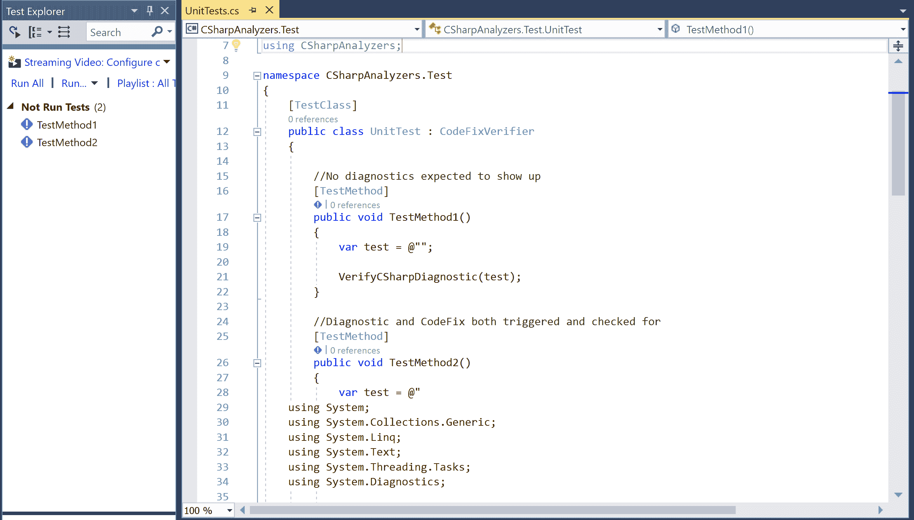

注意，单元测试项目包含对 DiagnosticAnalyzer 和 CodeFixProvider 的单元测试。本章仅处理分析器测试。我们将在本书的后面部分扩展对 CodeFixProvider 的单元测试。

1.  通过在测试资源管理器中右键单击“未运行测试”节点，执行“运行选中测试”上下文菜单命令来运行项目的所有单元测试，并验证测试是否通过。

1.  编辑`TestMethod1`，使测试代码现在有一个小写字母的类型：

```cs
[TestMethod]
public void TestMethod1()
{
  var test = @"class Class1 { }";

  VerifyCSharpDiagnostic(test);
}

```

1.  在编辑器中右键单击`TestMethod1`，执行“运行测试”上下文菜单命令，并验证测试现在由于诊断不匹配断言而失败 - `预期 "0" 实际 "1"`：

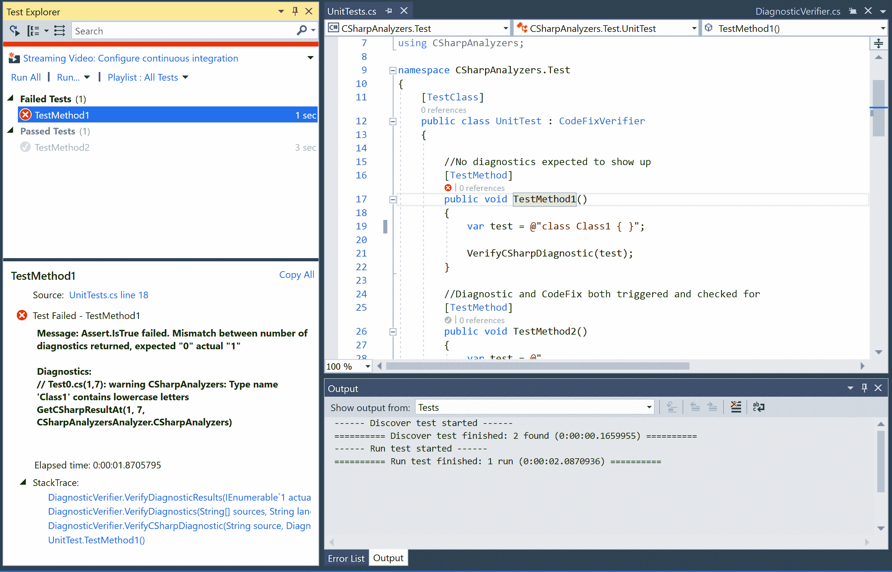

1.  编辑`TestMethod1`以现在添加对新测试代码的预期诊断：

```cs
var expected = new DiagnosticResult
{
  Id = "CSharpAnalyzers",
  Message = String.Format("Type name '{0}' contains lowercase letters", "Class1"),
  Severity = DiagnosticSeverity.Warning,
  Locations = new[] {
    new DiagnosticResultLocation("Test0.cs", 11, 15)
  }
};

VerifyCSharpDiagnostic(test, expected);

```

1.  再次运行单元测试并注意，测试仍然失败，但现在失败是因为诊断报告的位置（列号）不同。

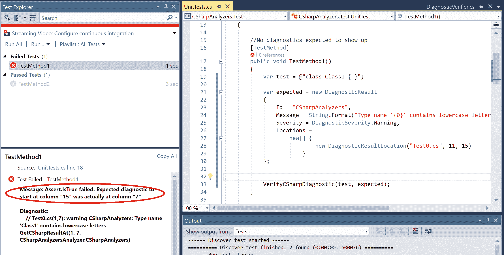

1.  编辑诊断位置以使用正确的预期列号并重新运行测试 - 验证测试现在是否通过。

```cs
new DiagnosticResultLocation("Test0.cs", 11, 7)

```

1.  编辑`TestMethod1`并将测试代码更改为将`Class1`重命名为`CLASS1`：

```cs
var test = @"class CLASS1 { }";

```

1.  再次运行单元测试并验证测试现在由于诊断不匹配断言而失败 - `预期 "1" 实际 "0"`。

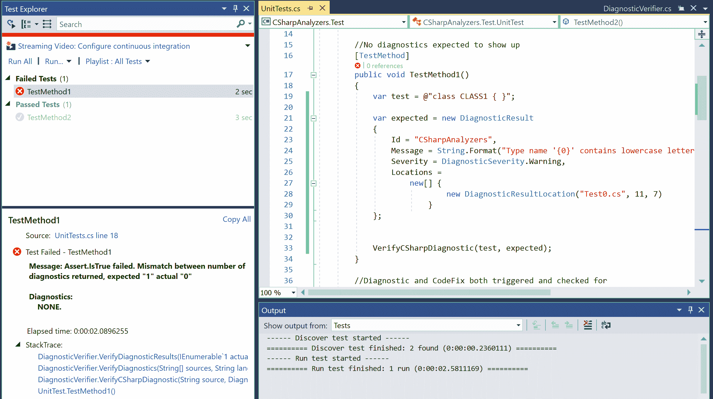

1.  编辑 `TestMethod1` 以删除预期诊断并验证测试通过：

```cs
 var test = @"class CLASS1 { }";

 VerifyCSharpDiagnostic(test);

```

# 它是如何工作的...

分析器单元测试项目允许我们为分析器在不同代码样本上的执行编写单元测试。每个单元测试都带有 `TestMethod` 属性，并定义了示例测试代码、分析器在代码上报告的预期诊断（如果有），以及调用测试辅助方法（此处为 `VerifyCSharpDiagnostic`*，*）以验证诊断。

```cs
//No diagnostics expected to show up
[TestMethod]
public void TestMethod1()
{
  var test = @"";

  VerifyCSharpDiagnostic(test);
}

```

单元测试可以使用 `DiagnosticResult` 类型定义预期诊断，该类型必须指定诊断的 `Id`、`Message`、`Severity` 和 `Locations`：

```cs
var expected = new DiagnosticResult
{
  Id = "CSharpAnalyzers",
  Message = String.Format("Type name '{0}' contains lowercase letters", "Class1"),
  Severity = DiagnosticSeverity.Warning,
  Locations = new[] { new DiagnosticResultLocation("Test0.cs", 11, 15) }
};

VerifyCSharpDiagnostic(test, expected);

```

计算预期诊断的正确行号和列号（例如，(11, 15)）可能有点棘手。通常有效的方法是从默认位置 (0, 0) 开始，执行一次测试，然后查看测试资源管理器窗口中的失败文本以获取预期和实际行号。然后，将测试代码中的预期行号替换为实际行号。重新执行测试并重复此过程以获取正确的列号。

包含所有单元测试的 `UnitTest` 类型还重写了以下方法以返回要测试的 `DiagnosticAnalyzer`（以及可选的 `CodeFixProvider`）：

```cs
 protected override CodeFixProvider GetCSharpCodeFixProvider()
 {
   return new CSharpAnalyzersCodeFixProvider();
 }

 protected override DiagnosticAnalyzer GetCSharpDiagnosticAnalyzer()
 {
   return new CSharpAnalyzersAnalyzer();
 }

```

现在，让我们更详细地介绍单元测试的测试框架辅助工具。分析器单元测试项目包含两个主要的辅助抽象类型，用于编写分析器和代码修复的单元测试：

+   `DiagnosticVerifier`**:** 包含辅助方法以运行 `DiagnosticAnalyzer` 单元测试，这些测试验证给定测试源集的分析器诊断。

+   `CodeFixVerifier`: 包含辅助方法以运行 `DiagnosticAnalyzer` 和 `CodeFixProvider` 单元测试，这些测试在应用代码修复前后验证给定测试源集的分析器诊断。此类型继承自 `DiagnosticVerifier`。

在默认的分析器项目中，`UnitTest` 类型继承自 `CodeFixVerifier`，但也可以改为继承自 `DiagnosticVerifier`*，* 如果你只对编写分析器单元测试感兴趣。我们在这里将只关注 `DiagnosticVerifier`；`CodeFixVerifier` 将在后面的章节中介绍***。***

`DiagnosticVerifier` 类型分为 2 个源文件 `DiagnosticVerifier.cs` 和 `DiagnosticVerifier.Helper.cs`*.*

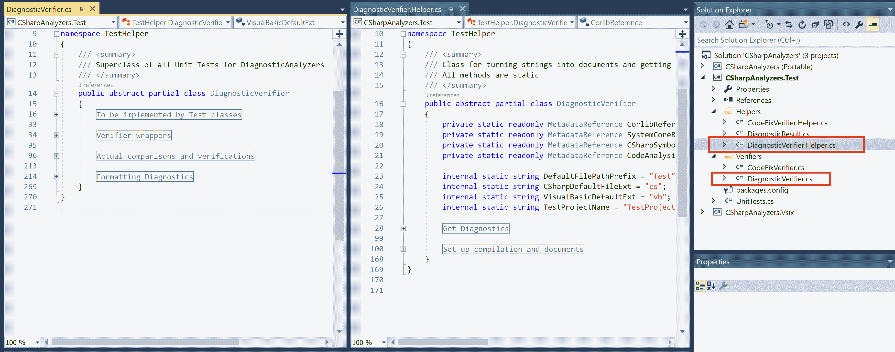

+   `DiagnosticVerifier.Helper.cs` 包含以下核心功能：

    +   提供辅助方法以创建基于给定 C# 或 VisualBasic 源代码的源文件编译（前一个截图中的“设置编译和文档”区域）。

    +   提供辅助方法以调用前面的功能来创建包含给定 C# 或 VisualBasic 源代码的编译，并在编译上执行给定的 `DiagnosticAnalyzer` 以生成分析器诊断，并返回排序后的诊断以进行验证（前一个截图中的“获取诊断”区域）。

+   `DiagnosticVerifier.cs` 包含以下核心功能：

    +   获取要测试的 `DiagnosticAnalyzer` 类型的方法（在前一个截图中的“测试类要实现区域”中实现）。

    +   执行实际的诊断比较和验证以及格式化诊断，以便在单元测试失败时获取实际/预期诊断的字符串表示（前一个截图中的“实际比较和验证区域”和“格式化诊断区域”）。

    +   诊断验证方法 `VerifyCSharpDiagnostic` 和 `VerifyBasicDiagnostic` 可以通过单元测试调用，以验证在给定的 C# 或 Visual Basic 源代码上生成的分析器诊断（前一个截图中的“验证器包装器”部分）。这些方法调用获取诊断辅助工具来创建编译并获取排序后的分析器诊断，然后调用前面的私有辅助工具来比较和验证诊断。

# 参见

Live 单元测试是 *Visual Studio 2017* 企业版中的新功能，它会在您编辑代码时在后台自动运行受影响的单元测试，并在编辑器中实时可视化结果和代码覆盖率。请参阅第六章*，Visual Studio 企业版中的 Live 单元测试*，以启用项目的实时单元测试并可视化在您按照本食谱中的步骤编辑代码后自动执行的单元测试。

# 发布分析器项目的 NuGet 包和 VSIX

我们将向您展示如何配置、构建和发布一个用于在 Visual Studio 2017 中使用 .NET 编译器平台 SDK 创建的分析器项目的 NuGet 包和 VSIX 包。

在我们深入探讨这些主题之前，让我们了解基于 NuGet 的分析器包和基于 VSIX 的分析器包之间的区别。NuGet 和 VSIX 是微软开发平台为打包文件（如程序集、资源、构建目标、工具等）到单个可安装包的两种基本不同的打包方案。

+   NuGet 是一种更通用的打包方案。NuGet 包（`.nupkg` 文件）可以直接在 .NET 项目中引用，并使用 Visual Studio 中的 NuGet 包管理器安装到特定的项目或解决方案。基于分析器模板项目的分析器 NuGet 包被安装为项目文件中的 AnalyzerReferences，然后传递给编译器命令行以在构建期间执行。此外，AnalyzerReferences 在 Visual Studio IDE 中设计时解析，并在代码编辑时执行以生成实时诊断。

+   VSIX 包是一个 `.vsix` 文件，它包含一个或多个 Visual Studio 扩展，以及 Visual Studio 用来分类和安装扩展的元数据。分析器 VSIX 包可以全局安装或安装到特定的扩展分叉中，并针对从 Visual Studio 分叉打开的所有项目/解决方案启用。与 `NuGet` 包不同，它不能专门安装到项目/解决方案中，并且不会与项目源一起移动。

截至 Visual Studio 2017，通过 NuGet 包安装的 `AnalyzerReferences` 分析器在命令行构建和 Visual Studio 中的实时代码编辑期间都会执行。通过 Analyzer VSIX 包安装的分析器仅在 Visual Studio 中的实时代码编辑期间执行，不在项目构建期间执行。因此，只有分析器 NuGet 包可以配置为在持续集成 (CI) 构建系统中执行并中断构建。

# 准备工作

您需要在 Visual Studio 2017 中创建并打开一个分析器项目，例如 `CSharpAnalyzers`。请参阅本章的第一个配方以创建此项目。

# 如何操作...

1.  在 Visual Studio 中通过执行“构建 | 构建解决方案”命令来构建 `CSharpAnalyzers` 解决方案。

1.  在 Windows 资源管理器中打开 `CSharpAnalyzers` 项目的二进制输出文件夹 (`<%SolutionFolder%>\CSharpAnalyzers\bin\debug`)，并验证名为 `CSharpAnalyzers.1.0.X.Y.nupkg` 的分析器 NuGet 包是否已生成在文件夹中。

1.  在解决方案资源管理器中双击 `CSharpAnalyzers` 项目的 `Diagnostic.nuspec` 文件，以查看和配置 nupkg 的属性。

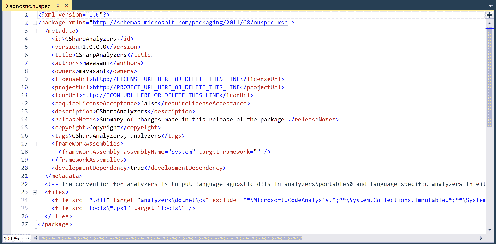

1.  重新构建项目以使用新属性重新生成 nupkg。

1.  按照此处列出的步骤发布 nupkg 为公共或私有包：[`docs.microsoft.com/en-us/nuget/create-packages/publish-a-package`](https://docs.microsoft.com/en-us/nuget/create-packages/publish-a-package)。

1.  在 Windows 资源管理器中打开 `CSharpAnalyzers.Vsix` 项目的二进制输出文件夹 (`<%SolutionFolder%\CSharpAnalyzers.Vsix\bin\debug`)，并验证名为 `CSharpAnalyzers.Vsix.vsix` 的 VSIX 是否存在于文件夹中。

1.  在解决方案资源管理器中双击 `CSharpAnalyzers.Vsix` 项目的 `source.extension.vsixmanifest` 文件，以查看和配置 VSIX 包的属性。

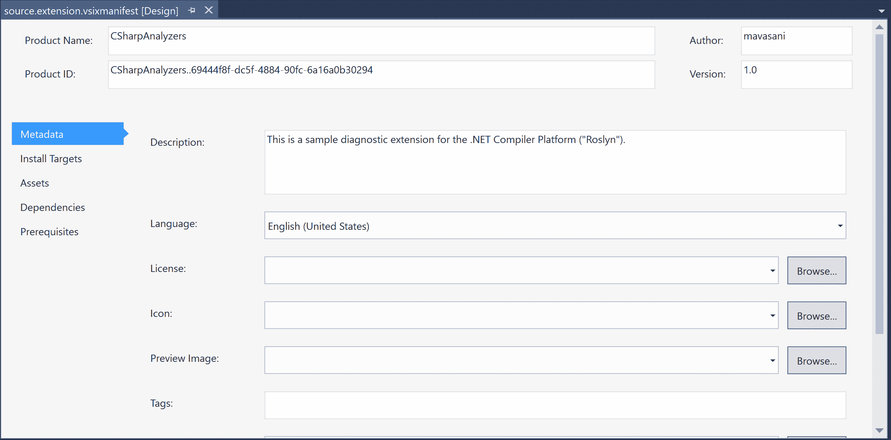

1.  重新构建 VSIX 项目以重新生成 VSIX。

1.  按照此处列出的步骤发布到 Visual Studio 扩展库：[`msdn.microsoft.com/en-us/library/ff728613.aspx`](https://msdn.microsoft.com/en-us/library/ff728613.aspx)。
