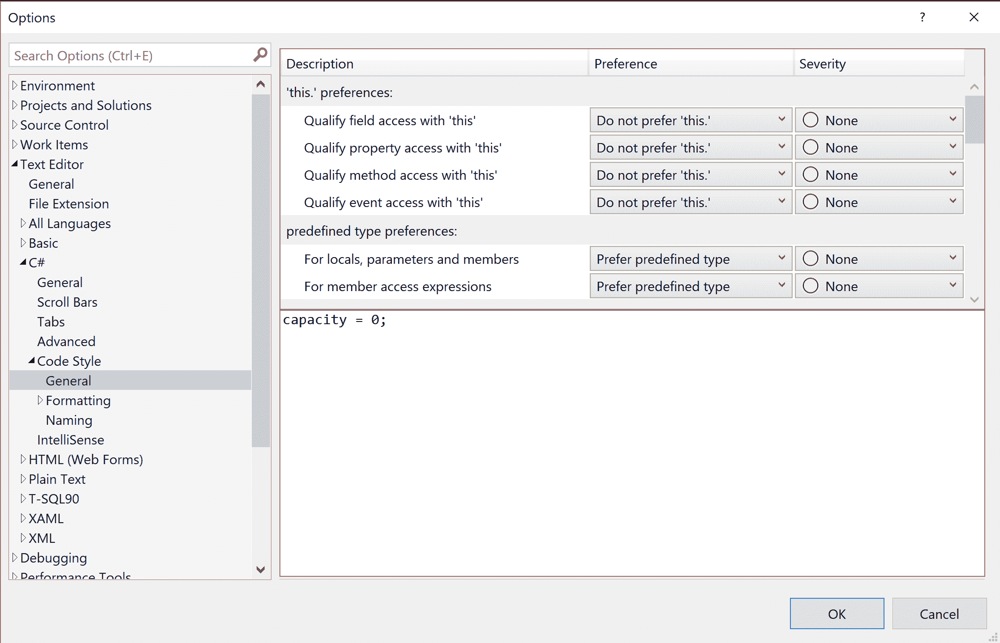
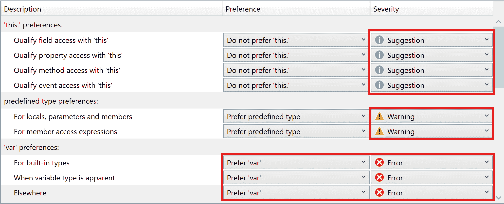
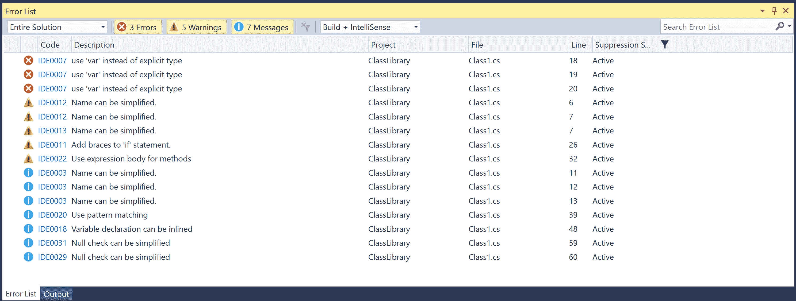
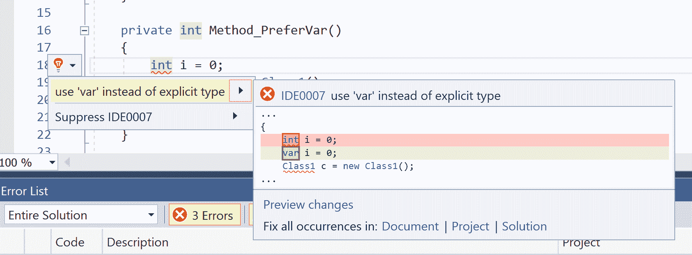
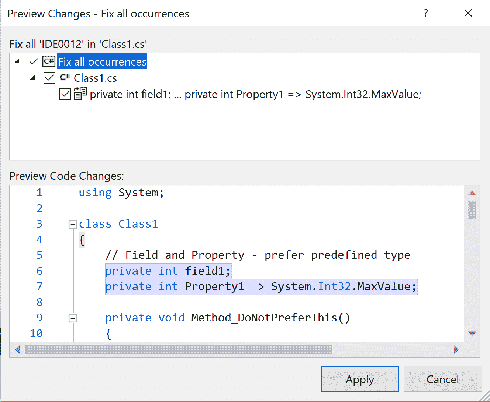
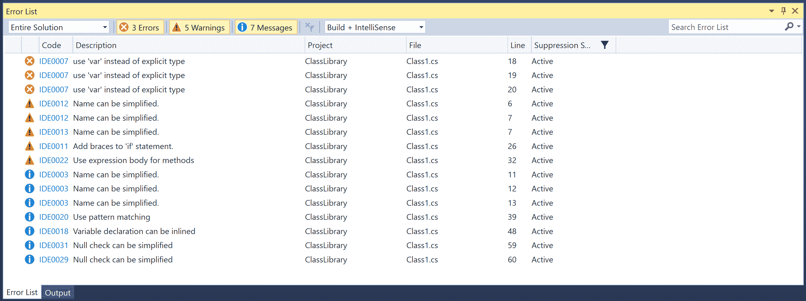
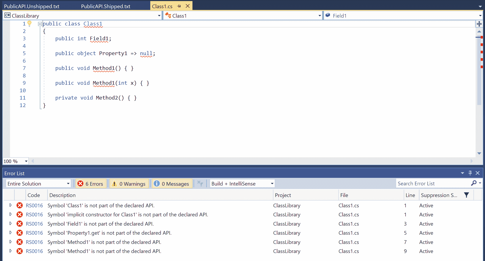
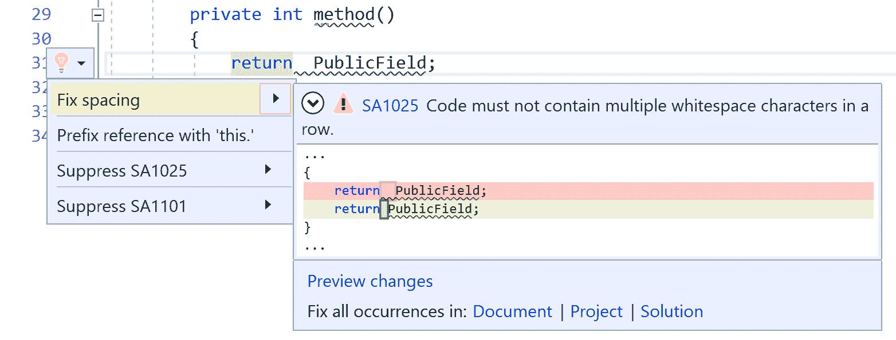
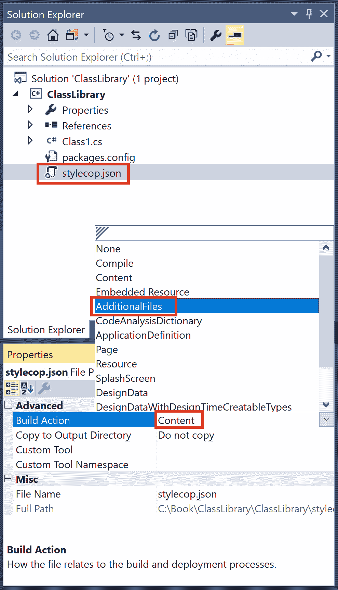

# 第四章：提高 C# 代码库的代码维护性

在本章中，我们将介绍以下内容：

+   配置 Visual Studio 2017 内置的 C# 代码风格规则

+   使用 `.editorconfig` 文件配置代码风格规则

+   使用公共 API 分析器进行 API 表面维护

+   使用第三方 StyleCop 分析器进行代码风格规则

# 简介

在当前开源项目时代，众多来自不同组织和世界各地的不同贡献者，维护任何仓库的一个主要要求是在代码库中强制执行代码风格指南。历史上，这通常通过详尽的文档和代码审查来实现，以捕捉任何违反这些编码指南的行为。然而，这种方法有其缺陷，需要大量的人力和时间来维护文档和执行详尽的代码审查。

利用 Visual Studio 2017 内置的自动代码风格和命名规则，用户可以自定义和配置单个规则的执行级别，并对违规行为提供视觉提示，例如编辑器中的建议或波浪线，以及错误列表中的诊断信息，并设置适当的严重性（错误/警告/信息性消息）。此外，规则还包含一个代码修复功能，可以自动修复文档、项目或解决方案中一个或多个违规实例。在 Visual Studio 2017 的新 EditorConfig 支持下，这些规则配置可以在每个文件夹级别通过 `.editorconfig` 文件进行强制执行和自定义。此外，`.editorconfig` 文件可以与源代码一起提交到仓库，以确保所有为仓库做出贡献的用户都遵守这些规则。

EditorConfig ([`editorconfig.org/`](http://editorconfig.org/)) 是一种开源文件格式，帮助开发者配置和强制执行格式化和代码风格约定，以实现代码库的一致性和可读性。EditorConfig 文件易于提交到源代码控制，并在仓库和项目级别应用。EditorConfig 约定覆盖个人设置中的等效约定，使得代码库的约定优先于单个开发者的约定。

在本章中，我们将向您介绍这些代码风格规则，展示如何在 Visual Studio 2017 IDE 中配置它们，并将这些设置保存到 EditorConfig 文件中。此外，我们还将向您介绍一个非常流行的第三方 Roslyn 分析器，即 PublicAPI 分析器，它允许通过检入到仓库中的附加非源文本文件来跟踪 .NET 程序集的公共 API 表面，并在出现破坏性 API 变更或未在公共 API 文件中记录的新公共 API 添加时提供诊断和代码修复。我们还将指导您如何为 .NET 项目配置 StyleCop 分析器，这是一个流行的第三方代码风格分析器，也是内置 Visual Studio 代码风格规则的替代方案，用于强制执行代码风格。

# 配置 Visual Studio 2017 中内置的 C# 代码风格规则

在本节中，我们将向您介绍 Visual Studio 2017 中内置的重要代码风格规则类别，并展示如何在 Visual Studio 中配置它们。

# 准备中

您需要在您的机器上安装 Visual Studio 2017 才能执行本章中的配方。您可以从 [`www.visualstudio.com/thank-you-downloading-visual-studio/?sku=Community&rel=15`](https://www.visualstudio.com/thank-you-downloading-visual-studio/?sku=Community&rel=15) 安装 Visual Studio 2017 的免费社区版本。

# 如何操作...

1.  启动 Visual Studio，导航到文件 | 新建 | 项目...，创建一个新的 C# 类库项目，并用 `ClassLibrary/Class1.cs` 中的代码替换 `Class1.cs` 中的代码。

1.  点击工具 | 选项以打开工具选项对话框，并导航到 C# 代码风格选项（文本编辑器 | C# | 代码风格 | 一般）：



1.  将 'this.' 预设的严重性更改为建议，预设的类型偏好更改为警告，以及将 'var' 偏好更改为错误。将 'var' 偏好的偏好从“首选显式类型”更改为“首选 'var'”：



1.  将代码块偏好的严重性更改为警告，并将方法偏好更改为首选表达式体：


1.  确保所有剩余的代码风格规则（表达式偏好、变量偏好和 'null' 检查）的严重性均为建议。

1.  在错误列表中验证以下代码风格诊断：



1.  双击第一个 IDE0007 错误并验证是否提供了使用 'var' 而不是显式类型的代码修复的灯泡提示。验证按 *Enter* 键可以修复代码，并将诊断从错误列表中删除。对剩余的 IDE0007 诊断重复此练习：



1.  现在，双击第一个 IDE0012 警告，并验证是否提供了一个用于简化名称 'System.Int32' 的灯泡提示。这次，单击“文档中所有出现的修复”超链接，并验证是否出现了一个预览更改对话框，该对话框使用单个批量修复来修复文档中所有 *IDE0012* 的实例：



1.  对错误列表中剩余的每个诊断应用代码修复，并验证代码现在是否完全干净：

```cs
using System;

class Class1
{
  // Field and Property - prefer predefined type
  private int field1;
  private int Property1 => int.MaxValue;

  private void Method_DoNotPreferThis()
  {
    Console.WriteLine(field1);
    Console.WriteLine(Property1);
    Method_PreferExpressionBody();
  }

  private int Method_PreferVar()
  {
    var i = 0;
    var c = new Class1();
    var c2 = Method_PreferExpressionBody();
    return i;
  }

  private void Method_PreferBraces(bool flag)
  {
    if (flag)
    {
      Console.WriteLine(flag);
    }
  }

  private Class1 Method_PreferExpressionBody() => Method_PreferPatternMatching(null);

  private Class1 Method_PreferPatternMatching(object o)
  {
    if (o is Class1 c)
    {
      return c;
    }

    return new Class1();
  }

  private int Method_PreferInlineVariableDeclaration(string s)
  {
    if (int.TryParse(s, out var i))
    {
      return i;
    }

    return -1;
  }

  private void Method_NullCheckingPreferences(object o)
  {
    var str = o?.ToString();
    var o3 = o ?? new object();
  }
}

```

1.  将以下新方法添加到 `Class1` 中，并验证是否为新增代码中的代码风格违规抛出了 IDE0007（使用 'var' 而不是显式类型）：

```cs
private void Method_New_ViolateVarPreference()
{
  Class1 c = new Class1();
}

```

# 它是如何工作的...

代码风格规则内置在 Visual Studio 2017 中，并分为以下广泛类别：

+   'this.' 偏好

+   预定义类型偏好

+   'var' 偏好

+   代码块偏好

+   表达式偏好

+   变量偏好

+   'null' 检查

每个类别都有一组一个或多个规则，每个规则有两个字段：

+   偏好：一个字符串，用于标识规则的偏好。通常，它有两个可能的值，一个表示规则应该被优先考虑，另一个表示规则不应该被优先考虑。例如，对于 'this.' 偏好规则，可能的值包括：

    +   不偏好 'this.'：这强制标记带有 `'this.'` 前缀的成员访问的代码。

    +   偏好 'this.'：这确保了没有 'this.' 前缀的成员访问的代码会被标记。

+   严重性：一个枚举，用于标识规则的严重性。它有以下可能的值和视觉效果：

    +   错误：规则的违规会在错误列表中产生错误诊断，并在代码编辑器中产生红色波浪线。

    +   警告：规则的违规会在错误列表中产生警告诊断，并在代码编辑器中产生绿色波浪线。

    +   建议：规则的违规会在错误列表中产生信息性消息诊断，并在代码编辑器中违反语法的第一个几个字符下方产生灰色点。

    +   无：规则在编辑器中不受强制，错误列表中没有诊断，编辑器中也没有视觉指示器。

用户可以使用“工具 | 选项”对话框根据其要求配置每个规则的偏好和严重性。关闭并重新打开源文档会导致配置更改生效，违规将在错误列表和视觉指示器（波浪线/点）中报告。每个规则都附带代码修复和 FixAll 支持，以修复文档、项目或解决方案中一个或多个违规的实例。

对于内置代码风格规则报告的诊断仅在 Visual Studio 2017 的实时代码编辑期间生成——它们不会中断构建，也不会在命令行构建期间生成。这种行为在未来版本的 Visual Studio 中可能会改变，也可能不会改变。

# 还有更多...

代码样式规则首选项与用户配置文件设置一起保存，并在同一 Visual Studio 安装的 Visual Studio 会话之间持久化。这意味着在 Visual Studio 中打开的任何项目都将具有相同的代码样式强制执行。然而，在具有不同用户配置文件的不同 Visual Studio 安装或不同机器上打开的相同源将不会具有相同的代码样式强制执行。为了在所有用户之间启用相同的代码样式强制执行，用户需要将代码样式设置持久化到`.editorconfig`文件中，并将其与源文件一起提交到仓库。有关详细信息，请参阅本章中的*使用.editorconfig 文件进行按文件夹配置代码样式规则*配方。

在文本编辑器 | C# | 代码样式 | 命名规则下，考虑探索工具 | 选项...对话框中的命名规则。这些规则允许用户强制执行关于每种不同符号应该如何命名的指南。例如，接口名称应该以大写字母"I"开头，类型名称应该是 Pascal 大小写，等等。

# 使用`.editorconfig`文件配置代码样式规则

在本节中，我们将向您展示如何使用 EditorConfig 文件配置 Visual Studio 2017 内置的代码样式规则，以及如何在不同的文件夹级别覆盖这些设置。这些 EditorConfig 文件可以与源文件一起提交到仓库中，这确保了代码样式设置对所有仓库贡献者都是持久和强制执行的。

# 准备工作

您需要在您的机器上安装 Visual Studio 2017 才能执行本章中的配方。您可以从[`www.visualstudio.com/thank-you-downloading-visual-studio/?sku=Community&rel=15`](https://www.visualstudio.com/thank-you-downloading-visual-studio/?sku=Community&rel=15)安装免费的 Visual Studio 2017 社区版。

从[`vsixgallery.com/extension/1209461d-57f8-46a4-814a-dbe5fecef941/`](http://vsixgallery.com/extension/1209461d-57f8-46a4-814a-dbe5fecef941/)的 Visual Studio 扩展库中安装`EditorConfig Language Service` VSIX，以在 Visual Studio 中获得`.editorconfig`文件的智能感知和自动完成功能。

# 如何操作...

1.  启动 Visual Studio，点击文件 | 新建 | 项目...，创建一个新的 C#类库项目，并用`ClassLibrary/Class1.cs`中的代码替换`Class1.cs`中的代码。

1.  在项目中添加一个名为`.editorconfig`的新文本文件，内容如下：

```cs
# top-most EditorConfig file
root = true

# rules for all .cs files.
[*.cs]

# 'this.' preferences
dotnet_style_qualification_for_field = false:suggestion
dotnet_style_qualification_for_property = false:suggestion
dotnet_style_qualification_for_method = false:suggestion
dotnet_style_qualification_for_event = false:suggestion

# predefined type preferences
dotnet_style_predefined_type_for_locals_parameters_members = true:warning
dotnet_style_predefined_type_for_member_access = true:warning

# 'var' preferences
csharp_style_var_for_built_in_types = true:error
csharp_style_var_when_type_is_apparent = true:error
csharp_style_var_elsewhere = true:error

# code block preferences
csharp_new_line_before_open_brace = all
csharp_style_expression_bodied_methods = true:warning
csharp_style_expression_bodied_constructors = false:warning
csharp_style_expression_bodied_operators = false:warning
csharp_style_expression_bodied_properties = true:warning
csharp_style_expression_bodied_indexers = true:warning
csharp_style_expression_bodied_accessors = true:warning

# expression preferences
dotnet_style_object_initializer = true:suggestion
dotnet_style_collection_initializer = true:suggestion
csharp_style_pattern_matching_over_is_with_cast_check = true:suggestion
csharp_style_pattern_matching_over_as_with_null_check = true:suggestion
dotnet_style_explicit_tuple_names = true:suggestion

# variable preferences
csharp_style_inlined_variable_declaration = true:suggestion

# 'null' checking
csharp_style_throw_expression = true:suggestion
csharp_style_conditional_delegate_call = true:suggestion
dotnet_style_coalesce_expression = true:suggestion
dotnet_style_null_propagation = true:suggestion

```

1.  在错误列表中验证以下代码样式诊断：



1.  双击第一个 IDE0007 错误，并验证是否提供了一个代码修复选项，使用`var`而不是显式类型。验证按*Enter*键可以修复代码，并将诊断从错误列表中删除。对剩余的 IDE0007 诊断重复此练习。

1.  然后，双击第一个 IDE0012 警告，并验证是否提供了一个灯泡图标来简化名称'System.Int32'。这次，点击“在**文档**中修复所有实例”的超链接，并验证是否出现了一个预览更改对话框，该对话框通过单个批量修复解决了文档中所有 IDE0012 的实例。

1.  对错误列表中剩余的每个诊断项应用代码修复，并验证代码现在是否完全干净：

```cs
using System;

class Class1
{
 // Field and Property - prefer predefined type
 private int field1;
 private int Property1 => int.MaxValue;

 private void Method_DoNotPreferThis()
 {
  Console.WriteLine(field1);
  Console.WriteLine(Property1);
  Method_PreferExpressionBody();
 }

 private int Method_PreferVar()
 {
  var i = 0;
  var c = new Class1();
  var c2 = Method_PreferExpressionBody();
  return i;
 }

 private void Method_PreferBraces(bool flag)
 {
  if (flag)
  {
   Console.WriteLine(flag);
  }
 }

 private Class1 Method_PreferExpressionBody() => Method_PreferPatternMatching(null);

 private Class1 Method_PreferPatternMatching(object o)
 {
  if (o is Class1 c)
  {
   return c;
  }

  return new Class1();
 }

 private int Method_PreferInlineVariableDeclaration(string s)
 {
  if (int.TryParse(s, out var i))
  {
   return i;
  }

  return -1;
 }

 private void Method_NullCheckingPreferences(object o)
 {
  var str = o?.ToString();
  var o3 = o ?? new object();
 }
}

```

1.  在项目的根目录中添加一个新文件夹，例如`NewFolder`，并在该文件夹中添加一个新类，例如`Class2.cs`，然后验证 IDE0007（使用`var`代替显式类型）是否因新添加的代码中的代码风格违规而引发。

```cs
private void Method_New_ViolateVarPreference()
{
 Class1 c = new Class1();
}

```

1.  在`NewFolder`中添加一个名为`.editorconfig`的新文本文件，其内容如下：

```cs
# rules for all .cs files in this folder.
[*.cs]

# override 'var' preferences
csharp_style_var_for_built_in_types = false:error
csharp_style_var_when_type_is_apparent = false:error
csharp_style_var_elsewhere = false:error

```

1.  关闭并重新打开`Class2.cs`，并验证 IDE0007 不再被报告。

# 它是如何工作的...

参考本章中食谱的*如何工作...*部分，*配置 Visual Studio 2017 中内置的 C#代码风格规则*，以了解 Visual Studio 2017 中的不同内置代码风格规则，以及与这些规则关联的偏好和严重性设置，以及它们如何映射到编辑器配置条目。例如，考虑以下条目：

```cs
dotnet_style_qualification_for_field = false:suggestion

```

`dotnet_style_qualification_for_field`是规则名称，偏好设置为`false`，严重性设置为`suggestion`。这些规则及其设置在每个文件夹级别强制执行，任何文件夹级别的 EditorConfig 文件都会覆盖祖先目录中 EditorConfig 文件的设置，直到达到根文件路径或找到具有`root=true`的 EditorConfig 文件。我们建议您参考以下文章，以获得对 EditorConfig 和 Visual Studio 2017 中相关支持的详细理解：

+   Editorconfig 文件格式：[`EditorConfig.org/`](http://editorconfig.org/)

+   VS2017 中.NET 代码风格的 Editorconfig 支持：[`blogs.msdn.microsoft.com/dotnet/2016/12/15/code-style-configuration-in-the-vs2017-rc-update/`](https://blogs.msdn.microsoft.com/dotnet/2016/12/15/code-style-configuration-in-the-vs2017-rc-update/)

+   VS2017 中.NET 代码风格的 Editorconfig 参考：[`docs.microsoft.com/en-us/visualstudio/ide/EditorConfig-code-style-settings-reference`](https://docs.microsoft.com/en-us/visualstudio/ide/editorconfig-code-style-settings-reference)

# 使用公共 API 分析器进行 API 表面维护

`DeclarePublicAPIAnalyzer`分析器是在([`github.com/dotnet/roslyn-analyzers`](https://github.com/dotnet/roslyn-analyzers))仓库中开发的流行第三方分析器，并作为 NuGet 包发布在[`www.nuget.org/packages/Roslyn.Diagnostics.Analyzers`](https://www.nuget.org/packages/Roslyn.Diagnostics.Analyzers/)。此分析器通过提供与项目源文件一起存在的可读和可审查的文本文件来帮助跟踪项目的公共表面区域，并提供作为源的 API 文档。例如，考虑以下具有公共和非公共符号的源文件：

```cs
public class Class1
{
  public int Field1;

  public object Property1 => null;

  public void Method1() { }

  public void Method1(int x) { }

  private void Method2() { }
}

```

此类型的附加 API 表面文本文件将如下所示：

```cs
Class1
Class1.Class1() -> void
Class1.Field1 -> int
Class1.Method1() -> void
Class1.Method1(int x) -> void
Class1.Property1.get -> object

```

每个公共符号都有一个条目：类型*Class1*，其构造函数及其成员*Field1, Method1*重载，以及*Property1*获取器。条目包含整个符号签名，包括返回类型和参数。

使用此 NuGet 包，用户可以在任何时间点跟踪已发布和未发布的公共 API 表面，当公共 API 表面发生变化时，获取实时和构建中断诊断，并应用代码修复来更新这些附加文件以匹配本地的 API 更改。当实际的代码更改很大且分散在代码库中时，这允许进行更丰富和更集中的 API 审查，但只需查看单个文件中的核心签名更改即可审查 API 更改。

**DeclarePublicAPIAnalyzer**主要编写用于跟踪位于[`github.com/dotnet/roslyn`](https://github.com/dotnet/roslyn)的 Roslyn 源库的公共 API 表面，并且在所有 Roslyn 贡献者中仍然非常受欢迎。分析器最终被转换为一个通用开源分析器，可以从[NuGet.org](http://NuGet.org)安装到任何.NET 项目中。

在本节中，我们将向您展示如何为 C#项目安装和配置公共 API 分析器，带您了解跟踪公共 API 表面的附加文本文件，向您展示分析器报告的 API 更改诊断，并最终向您展示如何应用代码修复来修复一个或多个这些诊断的实例以更新 API 表面文本文件。

# 准备工作

您需要在您的机器上安装 Visual Studio 2017 以执行本章中的配方。您可以从[`www.visualstudio.com/thank-you-downloading-visual-studio/?sku=Community&rel=15`](https://www.visualstudio.com/thank-you-downloading-visual-studio/?sku=Community&rel=15)安装 Visual Studio 2017 的免费社区版本。

# 如何操作...

1.  启动 Visual Studio，点击文件 | 新建 | 项目...，创建一个新的 C#类库项目，并将`Class1.cs`中的代码替换为`ClassLibrary/Class1.cs`（也在本食谱的*简介*部分中提到）中的代码样本。

1.  安装`Roslyn.Diagnostics.Analyzers` NuGet 包版本*1.2.0-beta2*。有关如何在项目中搜索和安装分析器 NuGet 包的指导，请参阅配方*通过 NuGet 包管理器搜索和安装分析器*，在第二章，*在.NET 项目中使用诊断分析器*。

1.  将*RS0016*和*RS0017*的严重性从警告升级到错误。有关分析器严重性配置的指导，请参阅配方，*在 Visual Studio 解决方案资源管理器中查看和配置分析器*，在第二章，*在.NET 项目中使用诊断分析器*。

1.  将两个新的文本文件`PublicAPI.Shipped.txt`和`PublicAPI.Unshipped.txt`添加到项目中。

1.  在解决方案资源管理器中选择两个文本文件，使用属性窗口将它们的构建操作从内容更改为 AdditionalFiles，并保存项目：


1.  验证编辑器中的波浪线和错误列表中的六个*RS0016*错误（`*x*`不是已声明的 API 的一部分），每个公共符号一个：



1.  将光标移至字段符号`Field1`，并按*Ctrl* + 点号(.)以获取自动修复诊断并将符号添加到未发布的公共 API 文本文件的代码修复：


1.  通过按*Enter*键应用代码修复，并验证条目`Class1.Field1 -> int`已添加到`PublicAPI.Unshipped.txt`，并且`Field1`的诊断和波浪线不再存在。

1.  将光标移至`Class1`的类型声明处，再次按*Ctrl* + 点号以获取代码修复，但这次应用 FixAll 代码修复以批量修复整个文档中的所有 RS0016 实例，并将所有公共符号添加到未发布的公共 API 文本文件中。有关应用 FixAll 代码修复的指导，请参阅配方，*在不同范围内应用批量代码修复（FixAll）：文档、项目和解决方案*，在第三章，*编写 IDE 代码修复、重构和 Intellisense 完成提供者*。

1.  剪切`PublicAPI.Unshipped.txt`中的全部内容，并将其粘贴到`PublicAPI.Shipped.txt`中。

1.  在`Class1.cs`中，尝试通过将已发布的公共符号`Field1`重命名为`Field2`来引入破坏性 API 更改*。

1.  验证`Field2`立即报告*RS0016*，并提供一个代码修复以添加`Field2`的公共 API 条目。应用代码修复将`Field2`添加到公共 API 表面并修复诊断。

1.  构建项目，并验证项目在输出窗口中由于破坏性更改出现以下*RS0017*诊断错误而无法构建：`ClassLibraryPublicAPI.Shipped.txt(3,1,3,21): 错误 RS0017: 符号'Class1.Field1 -> int'是已声明的 API 的一部分，但既不是公共的，也无法找到`。

1.  在第 11 步和第 12 步中撤销更改。

1.  将 `Method2` 改为公共方法，验证它报告了 *RS0016*，并使用代码修复将其 API 条目添加到 `PublicAPI.Unshipped.txt`。

1.  现在，将 `unshipped` 公共符号从 `c` 重命名为 `Method3`*.* 验证 `Method3` 报告了 *RS0016*，并且代码修复将 *Method2* 的公共 API 条目替换为 `Method3` 的条目：


1.  应用代码修复并验证构建是否成功，错误列表中没有诊断信息。

# 它是如何工作的...

`DeclarePublicAPIAnalyzer` 是一个额外的文件分析器，它通过比较编译中声明的公共符号与已发布和未发布的 API 表面文本文件中的公共 API 条目来工作。它为每个符号使用基于其完全限定名称和签名的唯一字符串表示形式，作为其公共 API 条目。它报告任何缺失或多余的公共 API 条目的诊断信息。您可以在 [`github.com/dotnet/roslyn-analyzers/blob/master/src/Roslyn.Diagnostics.Analyzers/Core/DeclarePublicAPIAnalyzer.cs`](https://github.com/dotnet/roslyn-analyzers/blob/master/src/Roslyn.Diagnostics.Analyzers/Core/DeclarePublicAPIAnalyzer.cs) 找到该分析器的实现，以及提供的相应代码修复 [`github.com/dotnet/roslyn-analyzers/blob/master/src/Roslyn.Diagnostics.Analyzers/Core/DeclarePublicAPIFix.cs`](https://github.com/dotnet/roslyn-analyzers/blob/master/src/Roslyn.Diagnostics.Analyzers/Core/DeclarePublicAPIFix.cs)。

# 还有更多...

您可以在 [`github.com/dotnet/roslyn/blob/master/docs/analyzers/Using%20Additional%20Files.md`](https://github.com/dotnet/roslyn/blob/master/docs/analyzers/Using%20Additional%20Files.md) 阅读更多关于如何编写和消费额外的文件分析器，如 DeclarePublicAPIAnalyzer 的信息。

# 使用第三方 StyleCop 分析器进行代码风格规则

在本节中，我们将向您介绍一个流行的第三方分析器包，用于 C# 项目的代码风格规则，即 StyleCop 分析器。我们将介绍如何安装 StyleCop 分析器 NuGet 包，给出 StyleCop 规则类别的示例违规，并展示如何配置和调整单个 StyleCop 规则。

# 准备工作

您需要在您的机器上安装 Visual Studio 2017 才能执行本章中的配方。您可以从 [`www.visualstudio.com/thank-you-downloading-visual-studio/?sku=Community&rel=15`](https://www.visualstudio.com/thank-you-downloading-visual-studio/?sku=Community&rel=15) 安装免费的 Visual Studio 2017 社区版本。

# 如何操作...

1.  启动 Visual Studio，导航到文件 | 新建 | 项目...，创建一个新的 C# 类库项目，并将 `Class1.cs` 中的代码替换为 `ClassLibrary/Class1.cs` 中的代码样本。

1.  安装 `StyleCop.Analyzers` NuGet 包（截至本文撰写时，最新预发布版本为 *1.1.0-beta001*）。有关如何在项目中搜索和安装分析器 NuGet 包的指导，请参阅配方，*通过 NuGet 包管理器搜索和安装分析器*，位于 第二章，*在 .NET 项目中消费诊断分析器*。

1.  验证以下 StyleCop 诊断是否显示在错误列表中：


1.  从命令行或在 Visual Studio 的顶级构建菜单中构建项目，并验证这些诊断是否也来自构建。

1.  双击警告 *SA1025* *代码不得在一行中包含多个空格字符*，验证编辑器中是否提供了灯泡以修复间距违规，并通过按 *Enter* 键应用代码修复来修复它：



1.  然后，双击警告 SA1200 使用指令必须在命名空间声明内出现，并验证它是否在 `using System;` 使用语句上报告，因为它位于命名空间 `Namespace` 之外。

1.  向项目中添加一个名为 `stylecop.json` 的新文件。

1.  在解决方案资源管理器中选择 `stylecop.json`，使用属性窗口将其构建操作从内容更改为 AdditionalFiles，并保存项目：



1.  将以下文本添加到 `stylecop.json` 并验证 *SA1200* 已不再被报告：

```cs
{
  "settings": {
    "orderingRules": {
      "usingDirectivesPlacement": "outsideNamespace"
    }
  }
}

```

1.  将 `using System;` 移入命名空间 `Namespace` 内，并验证 *SA1200* (*使用指令必须出现在命名空间声明之外*) 现在报告了位于命名空间内的使用语句。

# 它是如何工作的...

StypeCop 分析器包含以下类别的样式规则：

+   **间距规则（SA1000-）** ([`github.com/DotNetAnalyzers/StyleCopAnalyzers/blob/master/documentation/SpacingRules.md`](https://github.com/DotNetAnalyzers/StyleCopAnalyzers/blob/master/documentation/SpacingRules.md))：强制执行代码中关键字和符号周围间距要求的规则

+   **可读性规则（SA1100-）** ([`github.com/DotNetAnalyzers/StyleCopAnalyzers/blob/master/documentation/ReadabilityRules.md`](https://github.com/DotNetAnalyzers/StyleCopAnalyzers/blob/master/documentation/ReadabilityRules.md))：确保代码格式良好且可读的规则

+   **排序规则（SA1200-）** ([`github.com/DotNetAnalyzers/StyleCopAnalyzers/blob/master/documentation/OrderingRules.md`](https://github.com/DotNetAnalyzers/StyleCopAnalyzers/blob/master/documentation/OrderingRules.md))：强制执行代码内容标准排序方案的规则

+   **命名规则（SA1300-）** ([`github.com/DotNetAnalyzers/StyleCopAnalyzers/blob/master/documentation/NamingRules.md`](https://github.com/DotNetAnalyzers/StyleCopAnalyzers/blob/master/documentation/NamingRules.md))：强制执行成员、类型和变量的命名要求的规则

+   **可维护性规则（SA1400-）** ([`github.com/DotNetAnalyzers/StyleCopAnalyzers/blob/master/documentation/MaintainabilityRules.md`](https://github.com/DotNetAnalyzers/StyleCopAnalyzers/blob/master/documentation/MaintainabilityRules.md))：提高代码可维护性的规则

+   **布局规则（SA1500-）** ([`github.com/DotNetAnalyzers/StyleCopAnalyzers/blob/master/documentation/LayoutRules.md`](https://github.com/DotNetAnalyzers/StyleCopAnalyzers/blob/master/documentation/LayoutRules.md))：强制执行代码布局和行间距的规则

+   **文档规则（SA1600-）** ([`github.com/DotNetAnalyzers/StyleCopAnalyzers/blob/master/documentation/DocumentationRules.md`](https://github.com/DotNetAnalyzers/StyleCopAnalyzers/blob/master/documentation/DocumentationRules.md))：验证代码文档内容和格式的规则

我们提供的代码示例按类别具有以下 StyleCop 诊断：

+   **间距**：

    +   SA1025（代码不得在一行中包含多个空白字符）

+   **可读性**：

    +   SA1101（使用 this 前缀调用局部变量）

+   **排序**：

    +   SA1200（使用指令必须位于命名空间声明内）

+   **命名**：

    +   SA1300（元素"method"必须以大写字母开头）

    +   SA1303（常量字段名必须以大写字母开头）

+   **可维护性**：

    +   SA1401（字段必须是私有的）

    +   SA1402（文件只能包含一个类型）

+   **布局**：

    +   SA1502（元素不得位于单行）

    +   SA1503（大括号不得省略）

    +   SA1505（开括号后不得跟空白行）

+   **文档**：

    +   SA1600（元素必须进行文档化）

    +   SA1633（文件头缺失或未位于文件顶部）

StyleCop 分析器包还包含针对某些规则的代码修复，以修复违规行为。

StyleCop 分析器可以作为 NuGet 包安装，用于特定的 C#项目/解决方案，或者作为为所有 C#项目启用的 VSIX 扩展。NuGet 包启用构建时的 StyleCop 诊断，因此是推荐安装分析器的方式。

代码风格通常被认为是一个非常主观的问题，因此允许最终用户选择性地启用、抑制或配置个别规则非常重要。

+   StyleCop 规则可以通过代码分析规则集文件启用或抑制（参见第二章的配方，*使用规则集文件和规则集编辑器配置分析器*，在第二章，*在.NET 项目中使用诊断分析器*中参考）。

+   Stylecop 规则可以通过添加到项目中作为额外非源文件的 `stylecop.json` 文件进行配置和调整。例如，考虑排序规则 *SA1200*（使用指令必须在命名空间声明内出现）在 ([`www.nuget.org/packages/StyleCop.Analyzers/`](http://www.nuget.org/packages/StyleCop.Analyzers/))。默认情况下，此规则如果使用指令放置在文件顶部 *外部* 命名空间声明，则会报告违规。然而，此规则可以被配置为其语义相反，并要求使用指令在命名空间声明外部，如果它们在 *内部* 则报告违规，使用以下 `stylecop.json`：

```cs
{
  "settings": {
    "orderingRules": {
      "usingDirectivesPlacement": "outsideNamespace"
    }
  }
}

```

StyleCop 分析器仓库为每个规则类别提供了详细的文档，以及单个样式规则。您可以在 [`github.com/DotNetAnalyzers/StyleCopAnalyzers/tree/master/documentation`](https://github.com/DotNetAnalyzers/StyleCopAnalyzers/tree/master/documentation) 找到这些文档。
