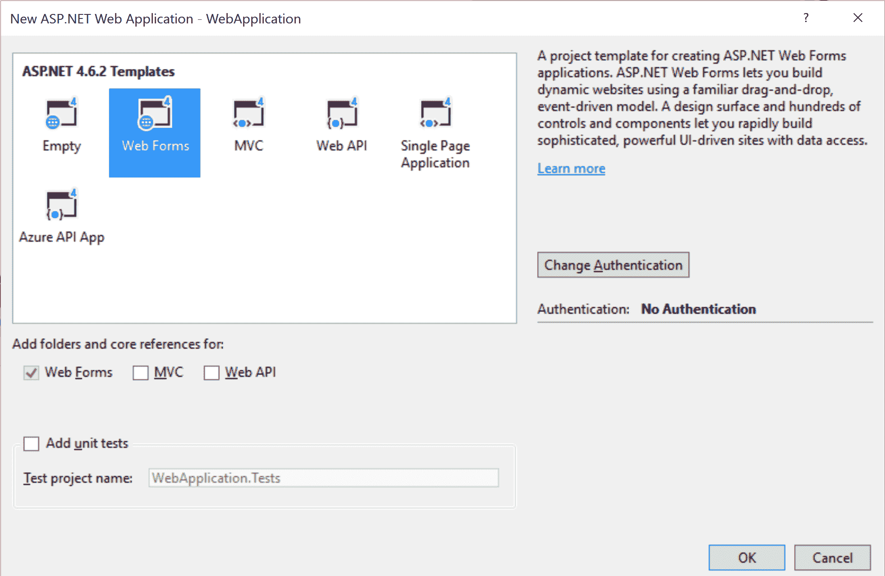
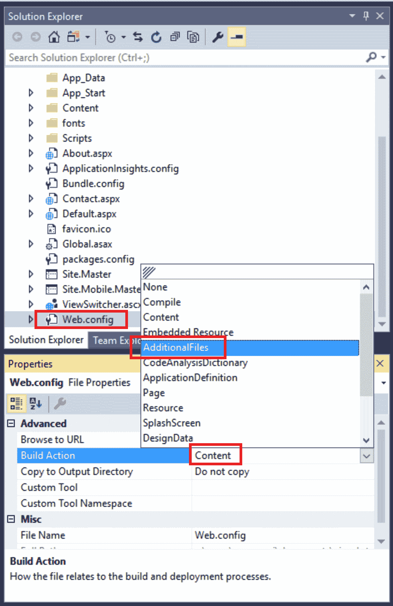
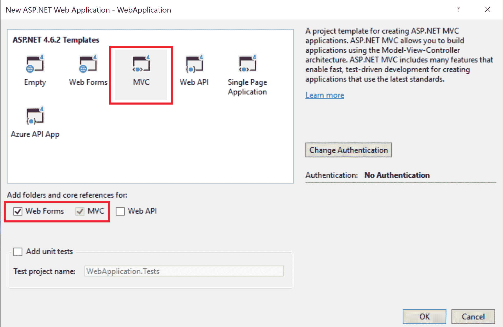
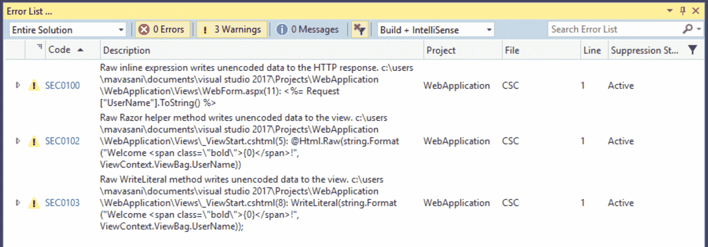
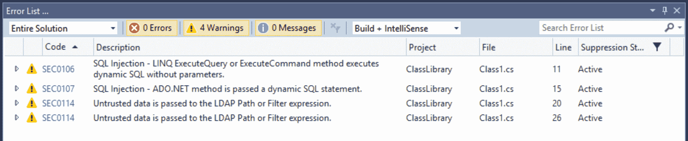
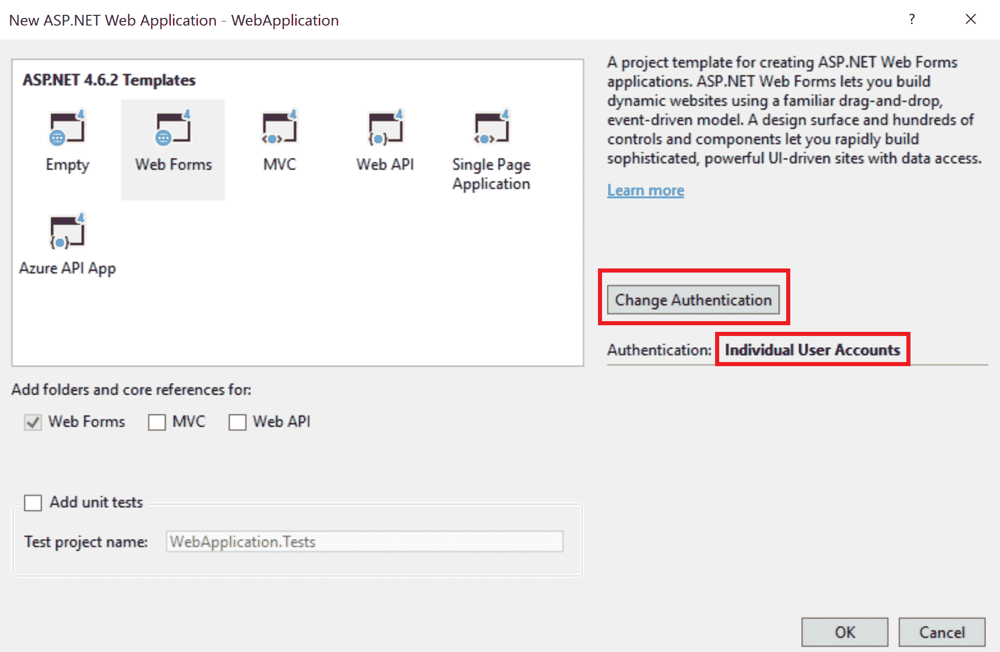
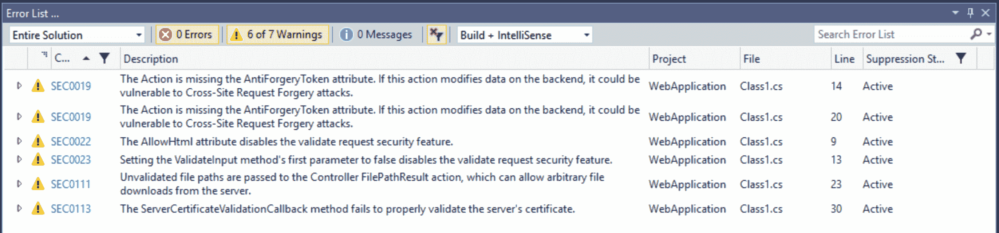
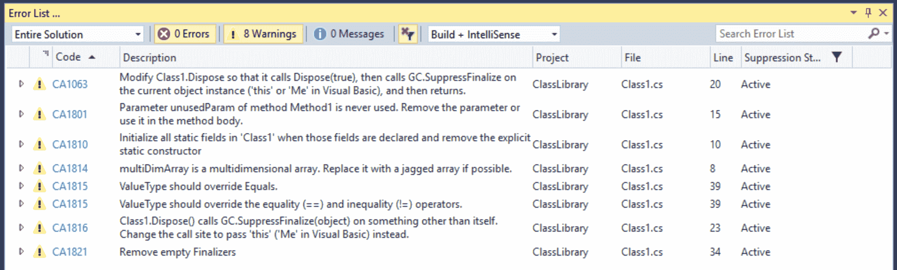
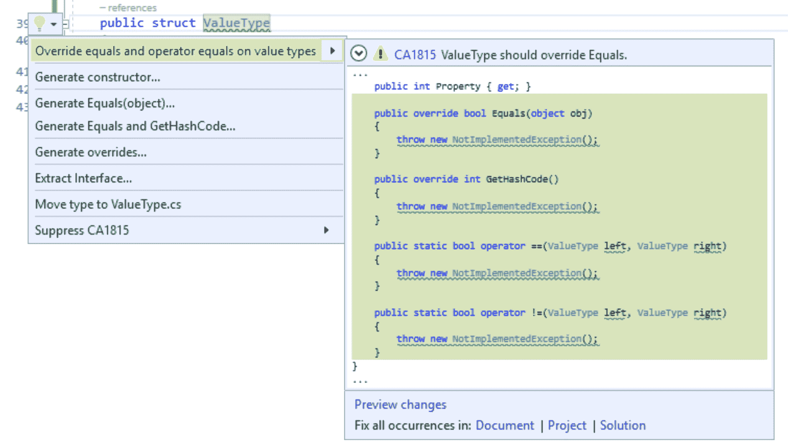

# 第五章：在 C#代码中识别安全漏洞和性能问题

在本章中，我们将涵盖以下食谱：

+   识别 Web 应用程序中的配置相关安全漏洞

+   识别 Web 应用程序中视图标记文件（`.cshtml`、`.aspx`文件）中的跨站脚本漏洞

+   识别可能导致 SQL 和 LDAP 注入攻击的不安全方法调用

+   识别 Web 应用程序中的弱密码保护和管理工作

+   识别外部组件数据弱验证以防止跨站请求伪造和路径篡改等攻击

+   使用 FxCop 分析器识别源代码的性能改进

# 简介

在本章中，我们将涵盖两个非常重要且流行的 Roslyn 分析器类别：安全和性能分析器。

+   **安全**: 考虑到.NET 应用程序的领域极其庞大，每个应用程序都有非常特定的安全漏洞，因此我们拥有特定领域的工具/扩展来捕获这些漏洞至关重要。基于 Roslyn 的安全分析器，如**PUMA**扫描分析器，在编译时捕获这些漏洞并报告诊断。PUMA 扫描分析器规则分为以下广泛类别：

    +   配置 ([`www.pumascan.com/rules.html#overview`](https://www.pumascan.com/rules.html#configuration)): 捕获 ASP.NET Web 配置文件中的漏洞的规则

    +   跨站脚本 ([`www.pumascan.com/rules.html#cross-site-scripting`](https://www.pumascan.com/rules.html#cross-site-scripting)): 捕获跨站脚本（XSS）漏洞的规则

    +   注入 ([`www.pumascan.com/rules.html#injection`](https://www.pumascan.com/rules.html#injection)): 捕获对可能导致 SQL 注入攻击的不安全外部组件方法调用的规则

    +   **密码管理** ([`www.pumascan.com/rules.html#password-management`](https://www.pumascan.com/rules.html#password-management)): 捕获密码管理组件中的漏洞的规则

    +   **验证** ([`www.pumascan.com/rules.html#validation`](https://www.pumascan.com/rules.html#validation)): 捕获外部请求的弱验证和身份验证规则，可能导致对其他用户的恶意攻击

+   **性能**：对于所有应用程序来说，运行时性能都很重要，并且有许多不同的方面。.NET 应用程序的一个重要性能标准是 .NET 编译器生成的 MSIL 或 CIL ([`en.wikipedia.org/wiki/Common_Intermediate_Language`](https://en.wikipedia.org/wiki/Common_Intermediate_Language)) 的质量。MSIL 的质量受用户代码的质量和生成 MSIL 的编译器的质量共同影响。在本章中，我们将向您介绍 FxCop 分析器中的性能规则，这些规则是微软为识别 .NET 应用程序中的性能改进而编写的代码分析规则 (*CAXXXX*)，以生成更有效的 MSIL。这些规则已被移植到 Roslyn 分析器框架，并在 [`github.com/dotnet/roslyn-analyzers`](https://github.com/dotnet/roslyn-analyzers) 上开源。

# 识别 Web 应用程序中的配置相关安全漏洞

ASP.NET 允许您指定影响服务器上所有 Web 应用程序、仅影响单个应用程序、影响单个页面或影响 Web 应用程序中的单个文件夹的配置设置。您可以针对功能（如编译器选项、调试、用户身份验证、错误信息显示、连接字符串等）进行配置设置。配置数据存储在名为 Web.config 的 XML 文件中。

您可以在 [`msdn.microsoft.com/en-us/library/ff400235.aspx`](https://msdn.microsoft.com/en-us/library/ff400235.aspx) 上阅读有关 Web.config 文件中不同类型配置设置的更多详细信息。

在本节中，我们将向您介绍 PUMA 扫描分析器中的规则，以在 ASP.NET Web Forms 项目中捕获 Web 配置中的安全漏洞。

注意，Roslyn 分析器在 .NET 框架项目和 .NET Core 项目上都得到完全支持，因此本章中提到的 PUMA 扫描分析器在 ASP.NET 和 ASP.Net Core Web 项目上都能正常工作。

# 准备工作

您需要在您的机器上安装 Visual Studio 2017 以执行本章中的食谱。您可以从 [`www.visualstudio.com/thank-you-downloading-visual-studio/?sku=Community&rel=15`](https://www.visualstudio.com/thank-you-downloading-visual-studio/?sku=Community&rel=15) 安装 Visual Studio 2017 的免费社区版本。

# 如何操作...

1.  启动 Visual Studio，然后单击文件 | 新建 | 项目... 并使用 Web Forms 模板创建一个新的 Visual C# | Web | ASP.NET Web 应用程序，例如 `WebApplication`：



1.  安装 `Puma.Security.Rules` 分析器 NuGet 包（在撰写本文时，最新稳定版本为 *1.0.4*）。有关如何在项目中搜索和安装分析器 NuGet 包的指导，请参阅第二章，*通过 NuGet 包管理器搜索和安装分析器*的食谱，*在 .NET 项目中消费诊断分析器*。

1.  在解决方案资源管理器中选择 Web.config，并使用属性窗口将其构建操作从内容更改为 AdditionalFiles，然后保存项目：



1.  在编辑器中打开 Web.config，并用以下 XML 替换现有的`system.web` XML 元素。您可以在[`msdn.microsoft.com/en-us/library/dayb112d(v=vs.100).aspx`](https://msdn.microsoft.com/en-us/library/dayb112d(v=vs.100).aspx)上阅读更多关于`system.web` XML 元素的信息。

```cs
<system.web>
  <compilation debug="false" targetFramework="4.6.2" />
  <customErrors mode="Off" defaultRedirect="/home/error"/>
  <httpRuntime enableHeaderChecking="false" enableVersionHeader="true" />
  <httpCookies requireSSL="false" httpOnlyCookies="false"/>
  <pages enableEventValidation="false" enableViewStateMac="false" viewStateEncryptionMode="Never" validateRequest="false" />
  <authentication mode="Forms">
    <forms loginUrl="~/Account/Login.aspx" timeout="900" enableCrossAppRedirects="true" protection="None" />
  </authentication>
</system.web>

```

1.  在 Visual Studio 或命令行中构建项目，并验证您是否从 PUMA 扫描分析器获得了以下*SECXXXX*警告：

```cs
1>CSC : warning SEC0014: Insecure HTTP cookies C:WebApplicationWeb.config(11): <httpCookies requireSSL="false" httpOnlyCookies="false" />
1>CSC : warning SEC0015: Cookies accessible via script. C:WebApplicationWeb.config(11): <httpCookies requireSSL="false" httpOnlyCookies="false" />
1>CSC : warning SEC0003: Forms authentication does not set requireSSL to true. C:WebApplicationWeb.config(14): <forms loginUrl="~/Account/Login.aspx" timeout="900" enableCrossAppRedirects="true" protection="None" />
1>CSC : warning SEC0004: Forms authentication does not set the cookieless attribute to UseCookies. C:WebApplicationWeb.config(14): <forms loginUrl="~/Account/Login.aspx" timeout="900" enableCrossAppRedirects="true" protection="None" />
1>CSC : warning SEC0006: Forms authentication cookie protection attribute is not set to All. C:WebApplicationWeb.config(14): <forms loginUrl="~/Account/Login.aspx" timeout="900" enableCrossAppRedirects="true" protection="None" />
1>CSC : warning SEC0007: Forms authentication timeout value exceeds the policy of 30 minutes. C:WebApplicationWeb.config(14): <forms loginUrl="~/Account/Login.aspx" timeout="900" enableCrossAppRedirects="true" protection="None" />
1>CSC : warning SEC0005: Forms authentication does not set the enableCrossAppRedirects attribute to false. C:WebApplicationWeb.config(14): <forms loginUrl="~/Account/Login.aspx" timeout="900" enableCrossAppRedirects="true" protection="None" />
1>CSC : warning SEC0002: Custom errors are disabled. C:WebApplicationWeb.config(9): <customErrors mode="Off" defaultRedirect="/home/error" />
1>CSC : warning SEC0008: HTTP header checking is disabled. C:WebApplicationWeb.config(10): <httpRuntime enableHeaderChecking="false" enableVersionHeader="true" />
1>CSC : warning SEC0009: The Version HTTP response header is enabled. C:WebApplicationWeb.config(10): <httpRuntime enableHeaderChecking="false" enableVersionHeader="true" />
1>CSC : warning SEC0010: Event validation is disabled. C:WebApplicationWeb.config(12): <pages enableEventValidation="false" enableViewStateMac="false" viewStateEncryptionMode="Never" validateRequest="false" />
1>CSC : warning SEC0012: Validate request is disabled. C:WebApplicationWeb.config(12): <pages enableEventValidation="false" enableViewStateMac="false" viewStateEncryptionMode="Never" validateRequest="false" />
1>CSC : warning SEC0013: Pages ViewStateEncryptionMode disabled. C:WebApplicationWeb.config(12): <pages enableEventValidation="false" enableViewStateMac="false" viewStateEncryptionMode="Never" validateRequest="false" />
1>CSC : warning SEC0011: ViewStateMac is disabled. C:WebApplicationWeb.config(12): <pages enableEventValidation="false" enableViewStateMac="false" viewStateEncryptionMode="Never" validateRequest="false" />

```

1.  将`Web.config`文件中的`system.web` XML 元素替换为以下内容（更改以粗体突出显示）：

```cs
<system.web>
  <compilation debug="false" targetFramework="4.6.2" />
  <customErrors mode="On" defaultRedirect="/home/error"/>
  <httpRuntime enableHeaderChecking="true" enableVersionHeader="false" />
  <httpCookies requireSSL="true" httpOnlyCookies="true"/>
  <pages enableEventValidation="true" enableViewStateMac="true" viewStateEncryptionMode="Always" validateRequest="true" />
  <authentication mode="Forms">
    <forms loginUrl="~/Account/Login.aspx" timeout="15" enableCrossAppRedirects="false" protection="All" requireSSL="true" cookieless="UseCookies" />
  </authentication>
</system.web>

```

1.  再次构建项目并验证它是否编译且没有任何安全警告。

# 它是如何工作的...

PUMA 扫描分析器能够捕捉到 C# ASP.NET 网络项目中的网络配置文件中的安全漏洞。在前面的菜谱中，我们向您展示了 PUMA 扫描分析器捕捉到的不同类型的网络安全漏洞，例如不安全的表单身份验证、http cookies 配置、头部设置等。您可以在[`www.pumascan.com/rules.html#configuration`](https://www.pumascan.com/rules.html#configuration)上阅读 PUMA 扫描分析器识别的所有网络配置相关安全漏洞的详细描述。

这些安全分析器被编写为附加文件分析器，用于分析项目中标记为`AdditionalFiles`项目类型的非源文件。用户必须在他们的项目中将`web.config`文件标记为附加文件，以在构建期间触发安全分析。您可以在[`github.com/dotnet/roslyn/blob/master/docs/analyzers/Using%20Additional%20Files.md`](https://github.com/dotnet/roslyn/blob/master/docs/analyzers/Using%20Additional%20Files.md)上阅读更多关于如何编写和消费附加文件分析器的信息。

# 在网络应用程序的视图标记文件（.cshtml, .aspx 文件）中识别跨站脚本漏洞

**跨站脚本**（**XSS**）是一种通常在 Web 应用程序中发现的计算机安全漏洞。XSS 允许攻击者向其他用户查看的网页中注入客户端脚本。跨站脚本漏洞可能被攻击者用来绕过如同源策略这样的访问控制。截至 2007 年，Symantec 记录的所有安全漏洞中，大约有 84%是由网站上的跨站脚本造成的。其影响可能从微不足道的麻烦到重大的安全风险不等，这取决于受影响网站处理的数据的敏感性以及网站所有者实施的安全缓解措施的性质。

您可以在[`en.wikipedia.org/wiki/Cross-site_scripting`](https://en.wikipedia.org/wiki/Cross-site_scripting)上阅读更多关于跨站脚本的信息。

在本节中，我们将向您介绍 PUMA 扫描分析器中的规则，以捕获可能导致 ASP.NET Web 项目中跨站脚本攻击的安全漏洞。

# 准备工作

您需要在您的机器上安装 Visual Studio 2017 以执行本章中的配方。您可以从 [`www.visualstudio.com/thank-you-downloading-visual-studio/?sku=Community&rel=15`](https://www.visualstudio.com/thank-you-downloading-visual-studio/?sku=Community&rel=15) 安装 Visual Studio 2017 的免费社区版本。

# 如何操作...

1.  启动 Visual Studio，点击“文件”|“新建”|“项目...”并创建一个新的 Visual C# | Web | ASP.NET Web 应用程序，使用 MVC 模板，例如 `WebApplication`：



1.  安装 `Puma.Security.Rules` 分析器 NuGet 包（在撰写本文时，最新稳定版本为 *1.0.4*）。有关如何在项目中搜索和安装分析器 NuGet 包的指导，请参阅第二章 *通过 NuGet 包管理器搜索和安装分析器* 中的配方，*在 .NET 项目中消费诊断分析器*。

1.  打开“视图”| `_ViewStart.cshtml` 文件，并在文件末尾添加以下文本：

```cs
<div>
 @Html.Raw(string.Format("Welcome <span class=\"bold\">{0}</span>!", ViewContext.ViewBag.UserName))

 @{
   WriteLiteral(string.Format("Welcome <span class=\"bold\">{0}</span>!", ViewContext.ViewBag.UserName));
 }
</div>

```

1.  在解决方案资源管理器中选择 `_ViewStart.cshtml`，并使用下面的属性窗口将其构建操作从内容更改为 AdditionalFiles，然后保存项目。

1.  向项目中添加一个新的 Web 表单，例如 `WebForm.aspx`，并将以下带有原始内联表达式的 HTML 标题添加到表单中：

```cs
<div>
 <h2>Welcome <%= Request["UserName"].ToString() %></h2>
</div>

```

1.  在解决方案资源管理器中选择 `WebForm.aspx`，并使用下面的属性窗口将其构建操作从内容更改为 AdditionalFiles，然后保存项目。

1.  在 Visual Studio 或命令行中构建项目，并验证您是否收到来自 PUMA 扫描分析器的以下 *SECXXXX* 警告：



1.  将步骤 3 中添加到 `_ViewStart.cshtml` 的 HTML 分区元素替换为以下内容：

```cs
<div>
 Welcome <span class=\"bold\">@ViewContext.ViewBag.UserName</span>!
</div>

```

1.  将步骤 5 中添加到 `WebForm.aspx` 的 HTML 分区元素替换为以下内容：

```cs
<div>
 <h2>Welcome <%: Request["UserName"].ToString() %></h2>
</div>

```

1.  再次构建项目，并验证它是否编译且没有任何安全警告。

# 它是如何工作的...

PUMA 扫描分析器在 C# ASP.NET Web 项目的视图标记文件（`.cshtml`、`.aspx`、`.ascx`）中捕获跨站脚本安全漏洞。在前面的配方中，我们向您展示了 PUMA 扫描分析器捕获的不同类型的安全漏洞，例如使用原始内联和绑定表达式、原始 razor 辅助程序和原始 `WriteLiteral` 方法将不受信任的数据源写入 HTML 文档的主体，等等。建议在将此类数据写入浏览器之前对其进行 HTML 编码。您可以在 [`www.pumascan.com/rules.html#cross-site-scripting`](https://www.pumascan.com/rules.html#cross-site-scripting) 读取 PUMA 扫描分析器识别的所有跨站脚本相关安全漏洞的详细描述。

这些安全分析器被编写为额外的文件分析器，用于分析项目中标记为`AdditionalFiles`项类型的不源文件。用户必须在他们的项目中将视图标记文件标记为额外文件，以在构建期间触发安全分析。您可以在[`github.com/dotnet/roslyn/blob/master/docs/analyzers/Using%20Additional%20Files.md`](https://github.com/dotnet/roslyn/blob/master/docs/analyzers/Using%20Additional%20Files.md)中了解更多关于如何编写和消费额外文件分析器的信息。

# 识别可能导致 SQL 和 LDAP 注入攻击的不安全方法调用

SQL 注入是一种代码注入技术，用于攻击数据驱动的应用程序，其中恶意 SQL 语句被插入到输入字段中以执行（例如，将数据库内容导出到攻击者）。SQL 注入攻击允许攻击者伪造身份、篡改现有数据、引发诸如取消交易或更改余额的拒绝问题、允许完全披露系统上的所有数据、破坏数据或使其不可用，并成为数据库服务器的管理员。

LDAP 注入是一种用于利用 Web 应用的代码注入技术，可能会泄露敏感用户信息或修改表示在**轻量级目录访问协议**（**LDAP**）数据存储中的信息。LDAP 注入通过操纵传递给内部搜索、添加或修改函数的输入参数来利用应用程序中的安全漏洞。

您可以在[`en.wikipedia.org/wiki/SQL_injection`](https://en.wikipedia.org/wiki/SQL_injection)了解更多关于 SQL 注入的详细信息，以及[`en.wikipedia.org/wiki/LDAP_injection`](https://en.wikipedia.org/wiki/LDAP_injection)了解更多关于 LDAP 注入的详细信息。

在本节中，我们将向您介绍 PUMA 扫描分析器中的规则，以捕获可能导致数据驱动.NET 项目中 SQL 注入和 LDAP 注入攻击的安全漏洞。

# 准备工作

您需要在您的机器上安装 Visual Studio 2017 才能执行本章中的配方。您可以从[`www.visualstudio.com/thank-you-downloading-visual-studio/?sku=Community&rel=15`](https://www.visualstudio.com/thank-you-downloading-visual-studio/?sku=Community&rel=15)安装 Visual Studio 2017 的免费社区版本。

# 如何操作...

1.  启动 Visual Studio，点击文件 | 新建 | 项目...并创建一个新的 Visual C# | 类库，例如`ClassLibrary`。

1.  安装`Puma.Security.Rules`分析器 NuGet 包（在撰写本文时，最新稳定版本为*1.0.4*）。有关如何在项目中搜索和安装分析器 NuGet 包的指导，请参阅第二章中关于*通过 NuGet 包管理器搜索和安装分析器*的配方，*在.NET 项目中消费诊断分析器*。

1.  将以下框架程序集的引用添加到程序集中：`<q>System.Data.Linq.dll</q>` 和 `System.DirectoryServices.dll`。

1.  将 `Class1.cs` 中的默认 `Class1` 实现替换为以下代码：

```cs
using System.Data.Linq;
using System.Data.SqlClient;
using System.DirectoryServices;

public class Class1
{
  private void SQL_Injection(SqlConnection connection, string id)
  {
    using (DataContext context = new DataContext(connection))
    {
      context.ExecuteCommand("SELECT * FROM Items WHERE ID = " + id);
    }

    SqlCommand cmd = new SqlCommand("SELECT * FROM Items WHERE ID = " + id, connection);
    string result = cmd.ExecuteScalar().ToString();
  }

  private void LDAP_Injection(string domain, string userName)
  {
    DirectoryEntry entry = new DirectoryEntry(string.Format("LDAP://DC={0}, DC=COM/", domain));
    DirectorySearcher searcher = new DirectorySearcher(entry)
    {
      SearchScope = SearchScope.Subtree,
      Filter = string.Format("(name={0})", userName)
    };
    SearchResultCollection resultCollection = searcher.FindAll();
  }
}

```

1.  在编辑代码以及调用显式构建时，验证您在错误列表和编辑器中的波浪线中是否获得了以下 *SECXXX* 诊断信息。



1.  通过将 `id` 作为调用 `context.ExecuteCommand` 方法的第二个参数传递来修复在 `SQL_Injection` 方法中报告的 *SEC0106*：`context.ExecuteCommand("SELECT * FROM Items WHERE ID = {0}", id);`

1.  通过使用 `*SqlParameter*` 参数化传递给 `*new*` `SqlCommand(...)` 的查询来修复 *SEC0107*：

```cs
SqlCommand cmd = new SqlCommand("SELECT * FROM Items WHERE ID = @id", connection);
SqlParameter parm = new SqlParameter("@id", id);
cmd.Parameters.Add(parm);

```

1.  通过使用 Web 保护库（也称为 AntiXSS）的 LDAP 编码方法对域和 `userName` 参数进行编码来修复 *SEC0114* 诊断。

    1.  将 NuGet 包引用添加到 AntiXSS 库

    1.  将传递给新 `DirectoryEntry(...)` 的域参数替换为 `Microsoft.Security.Application.Encoder.LdapDistinguishedNameEncode(domain)`

    1.  将初始化器中用于筛选器的 `string.Format` 调用传递给 `userName` 参数替换为 `Microsoft.Security.Application.Encoder.LdapFilterEncode(userName)`

1.  验证错误列表中没有诊断信息，并且项目构建时没有错误或警告。

# 如何工作...

PUMA 扫描分析器可以捕捉数据驱动应用程序源代码中的 SQL 注入和 LDAP 注入安全漏洞。在前面的配方中，我们向您展示了这些分析器捕捉到的不同类型的漏洞，例如将不受信任的数据与 SQL 查询字符串、SQL 命令、LDAP 目录条目路径和筛选器格式连接起来。

通过使用参数化查询（其中不受信任的数据作为显式格式参数传递）可以防止 SQL 注入攻击。

通过使用 LDAP 编码方法对不受信任的数据进行编码可以防止 LDAP 注入攻击。您可以在 [`www.pumascan.com/rules.html#injection`](https://www.pumascan.com/rules.html#injection) 阅读 PUMA 扫描分析器识别的所有 SQL 和 LDAP 注入安全漏洞的详细描述。

# 识别网络应用中的弱密码保护和管理工作

负责密码管理应用程序承担着巨大的风险和责任。用户密码必须具有足够长度/复杂性，安全存储，并保护免受暴力破解和破解尝试。

在本节中，我们将向您介绍 PUMA 扫描分析器中的规则，以捕捉与 ASP.NET 网络项目中弱密码管理相关的漏洞。PUMA 扫描分析器目前支持以下密码管理规则：

+   ASP.NET Identity 弱密码复杂性

+   ASP.NET Identity 缺失密码锁定

您可以在 [`www.pumascan.com/rules.html#password-management`](https://www.pumascan.com/rules.html#password-management) 上阅读有关这些规则的更多详细信息。

# 准备工作

您需要在您的机器上安装 Visual Studio 2017 才能执行本章中的配方。您可以从 [`www.visualstudio.com/thank-you-downloading-visual-studio/?sku=Community&rel=15`](https://www.visualstudio.com/thank-you-downloading-visual-studio/?sku=Community&rel=15) 安装 Visual Studio 2017 的免费社区版本。

# 如何做到这一点...

1.  启动 Visual Studio 并点击 File | New | Project 创建一个新的 Visual C# | Web | ASP.NET Web Application，使用 Web Forms 模板，例如命名为 `WebApplication`。点击 Change Authentication 按钮并将身份验证更改为 Individual User Accounts：



1.  安装 `Puma.Security.Rules` 分析器 NuGet 包（在撰写本文时，最新稳定版本为 *1.0.4*）。有关如何在项目中搜索和安装分析器 NuGet 包的指导，请参阅配方，*通过 NuGet 包管理器搜索和安装分析器*，位于 第二章，*在 .NET 项目中消费诊断分析器*。

1.  构建项目并验证是否从 PUMA 扫描分析器中获得了一堆 *SECXXXX* 诊断，包括一些与密码保护相关的诊断（*SEC0017* 和 *SEC0018*）：

```cs
WebApplicationApp_StartIdentityConfig.cs(50,41,57,14): warning SEC0017: Password validator settings do not meet the requirements - Minimum Length (12), Numeric Character (True), Lowercase Character (True), Uppercase Character (True), Special Character (True)
...
WebApplicationAccountLogin.aspx.cs(36,121,36,126): warning SEC0018: Password lockout is disabled. To protect accounts from brute force attacks, set the shouldLockout parameter to true.

```

1.  打开 `WebApplicationApp_StartIdentityConfig.cs` 并将所需的最小密码长度更改为 `12`：

```cs
// Configure validation logic for passwords
manager.PasswordValidator = new PasswordValidator
{
 RequiredLength = 12,
 RequireNonLetterOrDigit = true,
 RequireDigit = true,
 RequireLowercase = true,
 RequireUppercase = true,
};

```

1.  打开 `WebApplicationAccountLogin.aspx.cs` 并将 `shouldLockout` 参数更改为 `PasswordSignIn` 调用为 true：

```cs
var result = signinManager.PasswordSignIn(Email.Text, Password.Text, RememberMe.Checked, shouldLockout: true);

```

1.  构建项目并验证没有出现 *SEC0017* 和 *SEC0018* 诊断。

# 识别来自外部组件的数据弱验证以防止跨站请求伪造和路径篡改等攻击

在本节中，我们将向您介绍 PUMA 扫描分析器中的规则，以捕获由于输入验证不足可能导致以下类型安全攻击的安全漏洞：

+   **跨站请求伪造** ([`en.wikipedia.org/wiki/Cross-site_request_forgery`](https://en.wikipedia.org/wiki/Cross-site_request_forgery)): 跨站请求伪造，也称为一键攻击或会话劫持，缩写为 CSRF 或 XSRF，是一种恶意利用网站的攻击方式，其中未经授权的命令从应用程序信任的用户那里传输。与利用用户对特定网站的信任的跨站脚本（XSS）不同，CSRF 利用网站对用户浏览器的信任。

+   **路径篡改** ([`en.wikipedia.org/wiki/Directory_traversal_attack`](https://en.wikipedia.org/wiki/Directory_traversal_attack)): 目录遍历（或路径遍历）是通过利用对用户提供的输入文件名的不充分安全验证/清理，使得表示遍历到父目录的字符能够通过文件 API。此攻击的目的是使用受影响的应用程序来获取对文件系统的未授权访问

+   **未经验证的跳转** ([`www.owasp.org/index.php/Unvalidated_Redirects_and_Forwards_Cheat_Sheet`](https://www.owasp.org/index.php/Unvalidated_Redirects_and_Forwards_Cheat_Sheet)): 当一个网络应用程序接受可能导致应用程序将请求重定向到包含在不受信任输入中的 URL 的不受信任输入时，可能发生未经验证的跳转和转发。通过将不受信任的 URL 输入修改为恶意网站，攻击者可能成功发起钓鱼诈骗并窃取用户凭据

# 准备工作

您需要在您的机器上安装 Visual Studio 2017 以执行本章中的配方。您可以从[`www.visualstudio.com/thank-you-downloading-visual-studio/?sku=Community&rel=15`](https://www.visualstudio.com/thank-you-downloading-visual-studio/?sku=Community&rel=15)安装 Visual Studio 2017 的免费社区版本。

# 如何操作...

1.  启动 Visual Studio，点击文件 | 新建 | 项目...并使用 MVC 模板创建一个新的 Visual C# | Web | ASP.NET Web 应用程序，例如`WebApplication`。

1.  安装`Puma.Security.Rules`分析器 NuGet 包（在撰写本文时，最新稳定版本为*1.0.4*）。有关如何在项目中搜索和安装分析器 NuGet 包的指导，请参阅第二章，*在.NET 项目中使用诊断分析器*中的配方，*通过 NuGet 包管理器搜索和安装分析器*。

1.  将新类`Class1`添加到项目中，并用以下代码替换文件内容：

```cs
using System.Configuration;
using System.Net.Http;
using System.Web.Mvc;

namespace WebApplication
{
  public class Class1
  {
    [AllowHtml]
    public string AllowHtmlProperty { get; set; }

    [HttpPost]
    [ValidateInput(false)]
    public ActionResult Missing_AntiForgeryToken()
    {
      return null;
    }

    [HttpPost]
    public FileResult Path_Tampering(string fileName)
    {
      string filePath = ConfigurationManager.AppSettings["DownloadDirectory"].ToString();
      return new FilePathResult(filePath + fileName, "application/octet-stream");
    }

    private void Certificate_Validation_Disabled()
    {
      using (var handler = new WebRequestHandler())
      {
        handler.ServerCertificateValidationCallback += (sender, cert, chain, sslPolicyErrors) => true;
      }
    }
  }
}

```

1.  在编辑代码和调用显式构建时，验证错误列表和编辑器中的波浪线，以获取以下***SECXXX***诊断信息。



1.  通过将`[ValidateAntiForgeryToken]`属性应用于`Missing_AntiForgeryToken`和`Path_Tampering`方法来修复前两个*SEC0019*诊断。

1.  通过删除`AllowHtmlProperty`上的`[AllowHtml]`属性来修复*SEC0022*错误。

1.  通过删除`Missing_AntiForgeryToken`上的`[ValidateInput(false)]`属性来修复*SEC0023*错误。

1.  通过在`Path_Tampering`方法中将`return new FilePathResult(...)`替换为`return new ValidatedFileResult(...)`来修复*SEC01111*错误，并添加以下`ValidatedFileResult`类型。

```cs
private class ValidatedFileResult : FileResult
{
  public ValidatedFileResult(string filePath, string fileName, string contentType)
  : base(contentType)
  {
    // Add validation logic.
  }

  protected override void WriteFile(HttpResponseBase response)
  {
    // Add write logic
  }
}

```

1.  通过删除行`handler.ServerCertificateValidationCallback += (sender, cert, chain, sslPolicyErrors) => true;`来修复*SEC0113*错误。

1.  再次构建项目并验证它是否编译且没有任何安全警告。

您可以在[`www.pumascan.com/rules.html#validation`](https://www.pumascan.com/rules.html#validation)上阅读有关 PUMA 扫描验证规则的更多详细信息。

# 使用 FxCop 分析器识别源代码的性能改进

在本节中，我们将向您介绍一个流行的第三方分析器包，用于 C#项目，即 FxCop 分析器。

我们将向您展示如何安装 FxCop 分析器 NuGet 包，并给出不同性能规则的违规示例，并展示如何使用 NuGet 包中分析器附带代码修复自动修复这些问题。

# 准备工作

您需要在您的机器上安装 Visual Studio 2017 才能执行本章中的配方。您可以从[`www.visualstudio.com/thank-you-downloading-visual-studio/?sku=Community&rel=15`](https://www.visualstudio.com/thank-you-downloading-visual-studio/?sku=Community&rel=15)安装 Visual Studio 2017 的免费社区版本。

# 如何做到这一点...

1.  启动 Visual Studio，点击文件 | 新建 | 项目... 创建一个新的 C#类库项目，并将`Class1.cs`中的代码替换为`ClassLibrary\Class1.cs`中的代码样本。

1.  安装`Microsoft.CodeAnalysis.FxCopAnalyzers` NuGet 包（写作时的最新预发布版本是*1.2.0-beta2*)。有关如何在项目中搜索和安装分析器 NuGet 包的指导，请参阅第二章，*在.NET 项目中使用诊断分析器*中的配方，*通过 NuGet 包管理器搜索和安装分析器*。

1.  通过在解决方案资源管理器中右键单击`ClassLibrary1`来卸载项目文件，然后通过在解决方案资源管理器中右键单击未加载的项目来在 Visual Studio 中打开项目文件进行编辑。

1.  将以下`PropertyGroup`添加到项目中以启用 FxCop 分析器使用的新的 Roslyn `IOperation`功能：

```cs
 <PropertyGroup>
  <Features>IOperation</Features>
 </PropertyGroup>

```

1.  重新加载项目并验证以下 FxCop 诊断显示在错误列表中：



1.  从命令行或 Visual Studio 的顶级构建菜单中构建项目，并验证这些诊断是否也来自构建。

1.  双击警告*CA1815*（ValueType 应该重写 Equals）并验证编辑器中是否提供了灯泡以实现 equals、`GetHashCode`和`==`以及`!=`运算符方法的重写：



1.  通过按*Enter*键应用代码修复来验证是否修复了*CA1815*诊断。请注意，这引入了新的*CAXXXX*诊断，这是由于重写默认实现。

1.  将`Class1.cs`的内容替换为以下代码并验证所有*CAXXXX*诊断都已修复：

```cs
using System;

namespace Namespace
{
  public class Class1: IDisposable
  {
    private static int staticField = 3;
    private int[][] jaggedArray;

    public void Method1(int usedParam)
    {
      Console.WriteLine(usedParam);
    }

    public void Dispose()
    {
      Dispose(true);
      GC.SuppressFinalize(this);
    }

    protected virtual void Dispose(bool disposing)
    {
      if (disposing)
      {
        // Dispose resources.
      }
    }
  }

  public struct ValueType: IEquatable<ValueType>
  {
    public int Property { get; }

    public override bool Equals(object obj)
    {
      return Equals((ValueType)obj);
    }

    public bool Equals(ValueType other)
    {
      return other.Property == Property;
    }

    public override int GetHashCode()
    {
      return Property.GetHashCode();
    }

    public static bool operator ==(ValueType left, ValueType right)
    {
      return left.Property == right.Property;
    }

    public static bool operator !=(ValueType left, ValueType right)
    {
      return left.Property != right.Property;
    }
  }
}

```

# 它是如何工作的...

FxCop 分析器是将最重要的 Microsoft 代码分析规则（CAXXXX）移植而来，这些规则是以 MSIL 为基础的二进制分析。与构建后二进制分析相比，FxCop 分析器在编辑代码时增加了实时分析和诊断的优势，以及丰富的代码修复功能来解决这些问题。

FxCop 包含各种不同类别的规则，例如性能、安全、代码风格、API 设计、可维护性等。在本节所涵盖的示例中，我们关注以下性能规则：

+   *CA1801*（审查未使用参数）([`msdn.microsoft.com/en-us/library/ms182268.aspx`](https://msdn.microsoft.com/en-us/library/ms182268.aspx))：方法签名中包含一个在方法体中未使用的参数。

+   *CA1810*（内联初始化引用类型静态字段）([`msdn.microsoft.com/en-us/library/ms182275.aspx`](https://msdn.microsoft.com/en-us/library/ms182275.aspx))：当一个类型声明了显式的静态构造函数时，即时编译器（JIT）会对类型的每个静态方法和实例构造函数添加检查，以确保静态构造函数之前已被调用。静态构造函数检查可能会降低性能。

+   *CA1814*（优先使用交错数组而非多维数组）([`msdn.microsoft.com/en-us/library/ms182277.aspx`](https://msdn.microsoft.com/en-us/library/ms182277.aspx))：交错数组是一个元素为数组的数组。组成元素的数组可以有不同的大小，这可能导致某些数据集的浪费空间更少。

+   *CA1815*（在值类型上重写等于和运算符等于）([`msdn.microsoft.com/en-us/library/ms182276.aspx`](https://msdn.microsoft.com/en-us/library/ms182276.aspx))：对于值类型，继承的等于实现使用反射库并比较所有字段的值。反射计算成本高昂，并且比较每个字段以检查相等性可能是不必要的。如果你期望用户比较或排序实例，或者将实例用作哈希表键，则你的值类型应该实现等于。

+   *CA1816*（正确调用 `GC.SuppressFinalize`）([`msdn.microsoft.com/en-us/library/ms182269.aspx`](https://msdn.microsoft.com/en-us/library/ms182269.aspx))：实现 `Dispose` 的方法没有调用 `GC.SuppressFinalize`，或者不是 `Dispose` 实现的方法调用了 `GC.SuppressFinalize`，或者方法调用了 `GC.SuppressFinalize` 但传递了其他内容。

+   *CA1821*（移除空终结器）([`msdn.microsoft.com/en-us/library/bb264476.aspx`](https://msdn.microsoft.com/en-us/library/bb264476.aspx))：在可能的情况下，避免使用终结器，因为跟踪对象生命周期的额外性能开销。空终结器会带来额外的开销，但没有任何好处。

您可以在 [`msdn.microsoft.com/en-us/library/ms182260(v=vs.140).aspx`](https://msdn.microsoft.com/en-us/library/ms182260(v=vs.140).aspx) 阅读有关所有 FxCop 性能规则的详细文档。

注意，尽管大多数 Microsoft 代码分析性能规则已移植到 FxCop 分析器包中，但并非所有规则在 NuGet 包中默认启用。您可以通过规则集编辑器查看和配置每个 FxCop 规则的抑制状态和严重性。有关使用规则集编辑器的进一步指导，请参阅第二章 *在 .NET 项目中消费诊断分析器* 中的配方 *使用规则集文件和规则集编辑器配置分析器*，第二章。
