# 第六章：Visual Studio Enterprise 中的实时单元测试

在本章中，我们将涵盖以下食谱：

+   在 Visual Studio 中运行基于 NUnit、XUnit 和 MSTest 框架的单元测试项目的实时单元测试（**LUT**）

+   查看和导航实时单元测试结果

+   理解代码更改的增量实时单元测试执行

+   理解 LUT 的启动/停止/暂停/继续/重启功能，以实现细粒度控制

+   包括和排除实时执行测试的子集

+   使用“工具 | 选项”对话框配置实时单元测试的不同选项

# 简介

本章使开发者能够使用 Visual Studio 2017 Enterprise 版本中基于 Roslyn 的新功能，在后台实现智能实时单元测试执行。以下是从该 ([`blogs.msdn.microsoft.com/visualstudio/2016/11/18/live-unit-testing-visual-studio-2017-rc/`](https://blogs.msdn.microsoft.com/visualstudio/2016/11/18/live-unit-testing-visual-studio-2017-rc/)) Visual Studio 博客文章中摘录的片段和截图，关于 LUT 的功能有很好的概述。

实时单元测试在您编辑代码时自动在后台运行受影响的单元测试，并实时可视化结果和代码覆盖率，在编辑器中实时显示。除了对您更改对现有测试的影响提供反馈外，您还可以立即获得关于您添加的新代码是否已被一个或多个现有测试覆盖的反馈。这将温和地提醒您在修复错误或添加功能时编写单元测试。您将朝着没有代码库测试债务的应许之地迈进！


如文章中所述，任何给定行的三种潜在状态如下：

+   至少被一个失败的测试覆盖的可执行代码行用红色十字标记装饰 ()

+   只被通过测试覆盖的可执行代码行用绿色勾号装饰 ()

+   没有任何测试覆盖的可执行代码行用蓝色破折号装饰 ()

LUT 使用 Roslyn API 分析您的产品和测试代码的快照，并确定需要运行的项目单元测试集合。此外，它还使用 Roslyn API 分析代码的增量更新，以智能地确定需要重新运行先前测试运行中的单元测试子集。这些分析 API 与 Visual Studio IDE 诊断引擎使用的相同，用于增量更新错误列表中的智能感知/实时诊断和编辑器中的波浪线。

一旦确定了要执行的单元测试集，它将在后台安排它们的执行，并在测试完成时，自动显示它们的通过/失败/排除状态，并在测试方法上显示相应的符号。用户可以在任何给定时间开始/停止/暂停/恢复实时测试执行。此外，他们还可以为 LUT 排除/包含测试/文件/项目子集。他们还可以随时暂停/重启/停止 LUT，并为 LUT 配置不同的选项，例如在低电量时自动暂停、测试执行超时等。

# 在 Visual Studio 中运行基于 NUnit、XUnit 和 MSTest 框架的单元测试项目。

在本节中，我们将向您介绍如何为您的单元测试项目启用 LUT，查看和理解测试执行中的实时结果。在 VS2017 中，实时单元测试支持以下单元测试项目的测试项目：

+   **NUnit**：文档位于 [`www.nunit.org/`](https://www.nunit.org/)

+   **XUnit**：文档位于 [`xunit.github.io/`](https://xunit.github.io/)

+   **MSTest**：文档位于 ([`en.wikipedia.org/wiki/MSTest`](https://en.wikipedia.org/wiki/MSTest)) 和 ([`msdn.microsoft.com/en-us/library/ms182489.aspx`](https://msdn.microsoft.com/en-us/library/ms182489.aspx))

我们将介绍基于前面提到的每个测试框架的单元测试项目中的 LUT（Live Unit Testing）。

# 入门

您需要在您的机器上安装 Visual Studio 2017 企业版才能执行此配方。您可以从 [`www.visualstudio.com/thank-you-downloading-visual-studio/?sku=Enterprise&rel=15`](https://www.visualstudio.com/thank-you-downloading-visual-studio/?sku=Enterprise&rel=15) 安装授权的企业版。

# 如何操作

1.  打开 Visual Studio 并创建一个新的 C# 类库项目，例如 `ClassLibrary`，以下为相应的源代码：

```cs
namespace ClassLibrary
{
  public class Class1
  {
    public bool Method1()
    {
      return true;
    }

    public bool Method2()
    {
      return false;
    }

    public bool Method3(Class1 c)
    {
      return c.Method1();
    }

    public bool Method4(Class1 c)
    {
      return c.Method2();
    }
  }
}

```

1.  [NUnit] 将一个 C# 单元测试项目，例如 `NUnitBasedTestProject`，添加到解决方案中，并将 `ClassLibrary` 的引用添加到该项目中。

1.  打开项目的 NuGet 包管理器并卸载现有的 NuGet 包引用 `MSTest.TestAdapter` 和 `MSTest.TestFramework`：

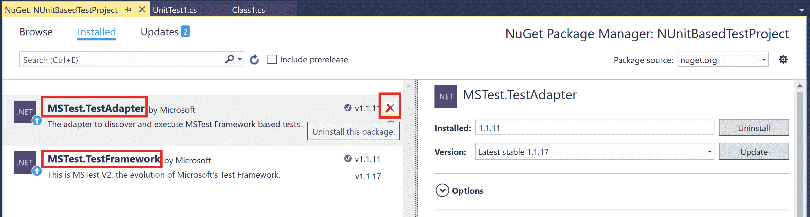

1.  将 NUnit 和 NUnit3TestAdapter 的最新稳定版本添加到项目中。

1.  将文件 `UnitTest1.cs` 中的源代码替换为以下代码：

```cs
using NUnit.Framework;

namespace NUnitBasedTestProject
{
  [TestFixture]
  public class UnitTest1
  {
    [Test]
    public void TestMethod1()
    {
      var c = new ClassLibrary.Class1();
      Assert.True(c.Method1());
    }

    [Test]
    public void TestMethod2()
    {
      var c = new ClassLibrary.Class1();
      Assert.True(c.Method2());
    }
  }
}

```

1.  通过执行 Test | Live Unit Testing | Start 命令开始对项目进行实时单元测试。

1.  等待几秒钟，并注意添加的单元测试在后台执行，`TestMethod1` 按预期通过，`TestMethod2` 失败，相应的绿色和红色符号在编辑器中显示。同时，验证输出窗口切换到实时单元测试视图，并显示带有执行时间戳的测试执行日志：

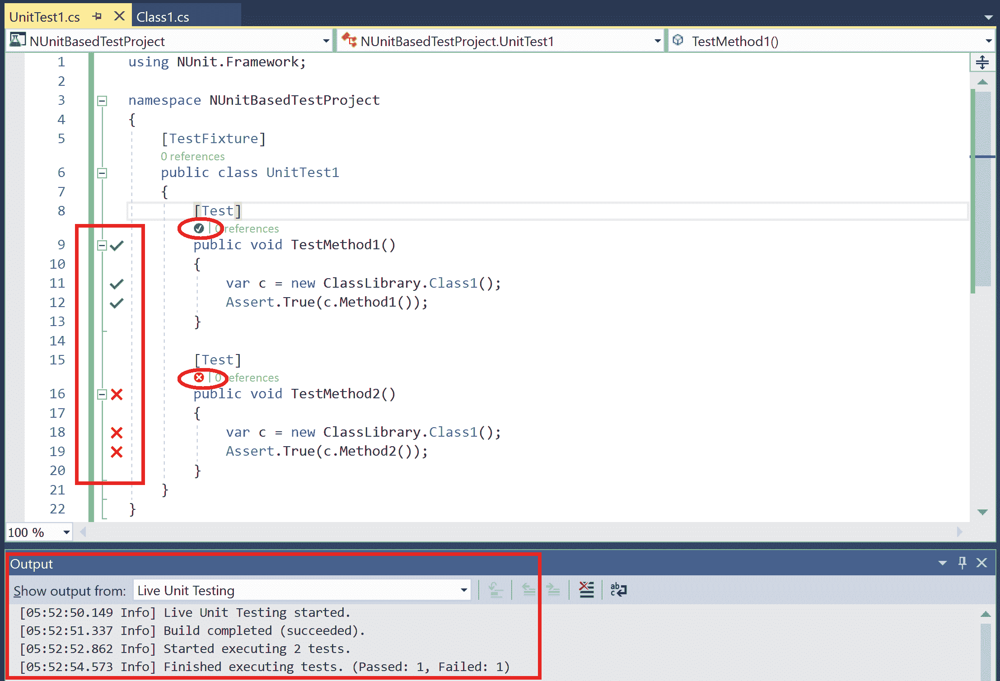

1.  [XUnit] 将 C# 单元测试项目，例如 `XUnitBasedTestProject`，添加到解决方案中，并将 `ClassLibrary` 的引用添加到该项目中。

1.  打开项目的 NuGet 包管理器，并卸载现有的 NuGet 包引用 `MSTest.TestAdapter` 和 `MSTest.TestFramework`。

1.  将 NuGet 包引用添加到 XUnit 和 `xunit.runner.visualstudio` 的最新稳定版本（晚于 *2.2.0*）。

1.  将 `UnitTest1.cs` 文件中的源代码替换为以下源代码：

```cs
using Xunit;

namespace XUnitBasedTestProject
{
  public class UnitTest1
  {
    [Fact]
    public void TestMethod1()
    {
      var c = new ClassLibrary.Class1();
      Assert.True(c.Method1());
    }

    [Fact]
    public void TestMethod2()
    {
      var c = new ClassLibrary.Class1();
      Assert.True(c.Method2());
    }
  }
}

```

1.  等待几秒钟，并注意单元测试在后台执行，`TestMethod1` 通过而 `TestMethod2` 失败。验证这些测试在编辑器中分别显示绿色和红色图标。

1.  [MSTest] 将 C# 单元测试项目，例如 `MSTestBasedTestProject`，添加到解决方案中，并将 `ClassLibrary` 的引用添加到该项目中。

1.  打开项目的 NuGet 包管理器，并将现有的 NuGet 包引用 `MSTest.TestAdapter` 和 `MSTest.TestFramework` 更新到最新稳定版本（晚于 <q>1.1.17</q>）。

1.  将文件 `UnitTest1.cs` 中的源代码替换为以下源代码：

```cs
using Microsoft.VisualStudio.TestTools.UnitTesting;

namespace MSTestBasedTestProject
{
  [TestClass]
  public class UnitTest1
  {
    [TestMethod]
    public void TestMethod1()
    {
      var c = new ClassLibrary.Class1();
      Assert.IsTrue(c.Method1());
    }

    [TestMethod]
    public void TestMethod2()
    {
      var c = new ClassLibrary.Class1();
      Assert.IsTrue(c.Method2());
    }
  }
}

```

1.  等待几秒钟，并注意单元测试在后台执行，`TestMethod1` 通过而 `TestMethod2` 失败。验证这些测试在编辑器中分别显示绿色和红色图标。

1.  在 `ClassLibrary` 项目中打开 `Class1.cs` 文件，并在编辑器中验证每个方法的测试覆盖率以及通过/失败详情。


# 查看和导航实时单元测试结果

在本节中，我们将向您展示如何使用测试资源管理器和 Visual Studio 编辑器中的工具提示查看和导航实时测试执行的结果。

# 入门指南

您需要在您的机器上安装 Visual Studio 2017 企业版才能执行此操作。您可以从 [`www.visualstudio.com/thank-you-downloading-visual-studio/?sku=Enterprise&rel=15`](https://www.visualstudio.com/thank-you-downloading-visual-studio/?sku=Enterprise&rel=15) 安装授权的企业版。

# 如何操作...

1.  打开 Visual Studio 并创建一个新的 C# 类库项目，例如 `ClassLibrary`。

1.  将源文件 `Class1.cs` 中的现有代码替换为附带的示例 `ClassLibrary\Class1.cs` 中的代码。

1.  将 C# 单元测试项目，例如 `UnitTestProject`，添加到解决方案中，并将 `ClassLibrary` 的引用添加到该项目中。

1.  打开项目的 NuGet 包管理器，并将现有的 NuGet 包引用 `MSTest.TestAdapter` 和 `MSTest.TestFramework` 更新到最新稳定版本（晚于 <q>1.1.17</q>）。

1.  将 `UnitTest1.cs` 文件中的源代码替换为附带的示例 `UnitTestProject\UnitTest1.cs` 中的代码。

1.  通过点击 Test | Window | Test Explorer 打开测试资源管理器窗口。

1.  通过执行 Test | Live Unit Testing | Start 命令来为项目启动实时单元测试。

1.  等待几秒钟，并注意添加的单元测试在后台执行，`TestMethod1` 按预期通过，而 `TestMethod2` 失败。

1.  确认测试结果在测试资源管理器中显示，并且在编辑器中有相应的绿色和红色图标：

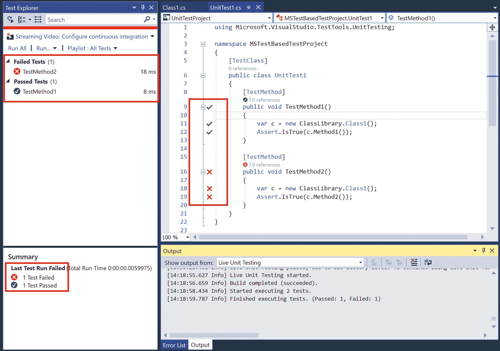

1.  在 `ClassLibrary` 中打开源文件 `Class1.cs` 并点击 `Method1` 顶部的测试指示器，其显示为 `1/1 passing`。验证是否弹出一个包含测试名称和状态的工具栏，`TestMethod1`。

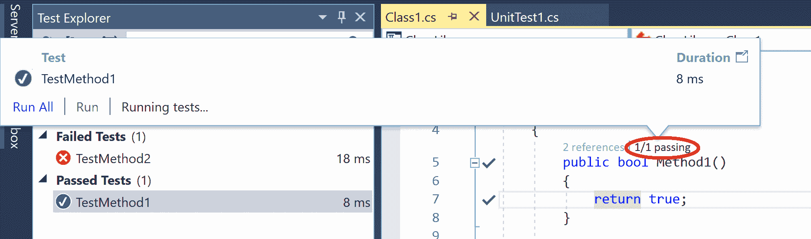

1.  双击工具栏中的方法名称 `TestMethod1` 并确保导航到 `UnitTest1.cs` 中此方法的定义。

1.  切换回 `Class1.cs` 并在 `Method1` 附近的绿色勾号 () 附近悬停，查看该方法被 1 个测试覆盖：

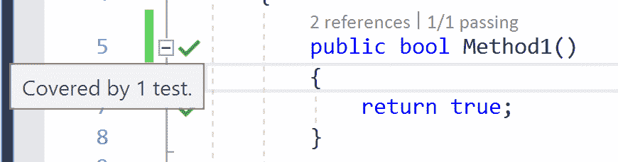

1.  点击勾号 () 以弹出另一个包含方法名称的工具栏，并验证双击它是否可以带您到测试方法定义。

# 理解代码更改的增量实时单元测试执行

在本节中，我们将向您展示如何实时单元测试在配置为运行实时单元测试的解决方案中对测试和产品代码进行更改时增量运行。

# 入门

您需要在您的机器上安装 Visual Studio 2017 企业版才能执行此配方。您可以从 [`www.visualstudio.com/thank-you-downloading-visual-studio/?sku=Enterprise&rel=15.`](https://www.visualstudio.com/thank-you-downloading-visual-studio/?sku=Enterprise&rel=15) 安装授权的企业版。

此外，克隆本章中“查看和导航实时单元测试结果”配方中附加的解决方案 `ClassLibrary.sln`，或者您可以在执行此配方之前手动执行该配方中的步骤。

# 如何操作...

1.  使用两个项目：`ClassLibrary` 和 `UnitTestProject` 打开 `ClassLibrary.sln` 解决方案，并通过导航到测试 | 实时单元测试 | 开始来启动实时单元测试。

1.  将包含以下代码的新源文件 `Class2.cs` 添加到 `ClassLibrary` 项目中：

```cs
namespace ClassLibrary
{
  public class Class2
  {
    public bool Method5()
    {
      return false;
    }

    public bool Method6()
    {
      return true;
    }
  }
}

```

1.  打开输出窗口，将“显示输出从：”组合框切换到实时单元测试，并通过按高亮按钮清除窗口中的所有内容：

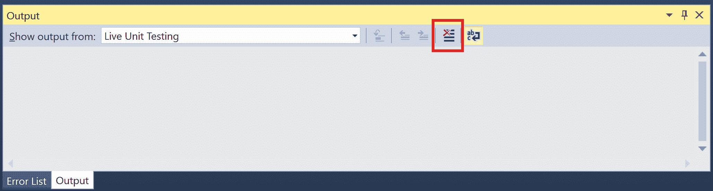

1.  将包含以下代码的新源文件 `UnitTest2.cs` 添加到 `UnitTestProject` 项目中：

```cs
using Microsoft.VisualStudio.TestTools.UnitTesting;

namespace MSTestBasedTestProject
{
  [TestClass]
  public class UnitTest2
  {
    [TestMethod]
    public void TestMethod5()
    {
      var c = new ClassLibrary.Class2();
      Assert.IsTrue(c.Method5());
    }

    [TestMethod]
    public void TestMethod6()
    {
      var c = new ClassLibrary.Class2();
      Assert.IsTrue(c.Method6());
    }
  }
}

```

1.  等待几秒钟，并注意添加的单元测试在后台执行，`TestMethod5` 按预期通过，而 `TestMethod6` 失败。

1.  此外，请注意输出窗口中的文本表示只执行了两个单元测试（新添加的 `TestMethod5` 和 `TestMethod6`）。此外，测试资源管理器显示旧测试 `TestMethod1` 和 `TestMethod2` 为灰色，因为这些测试在我们添加新的测试代码时没有执行：

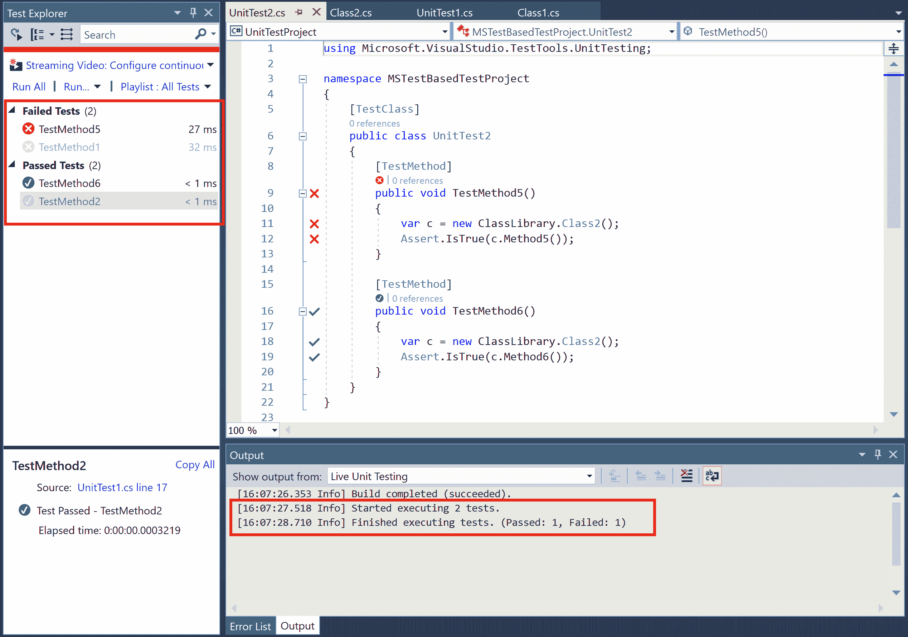

1.  切换回 `ClassLibrary` 项目中的 `Class1.cs` 文件并编辑 `Method1` 以返回 `true`。

1.  等待几秒钟，让测试在后台执行，并查看 `TestMethod1` 现在显示为通过。

1.  注意，在测试资源管理器中，`TestMethod5` 和 `TestMxethod6` 现在已变为灰色，表示它们在上次代码更改后没有执行：

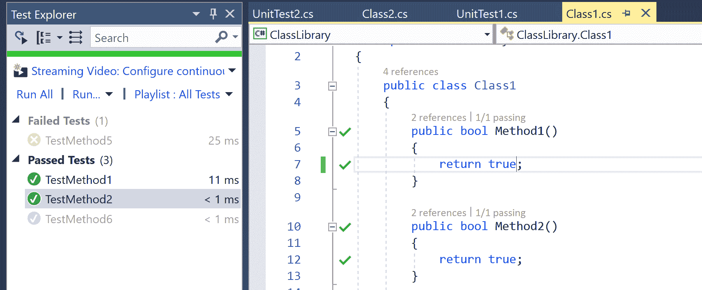

# 工作原理

在本食谱中，我们向您展示了如何设计实时单元测试执行来分析增量产品和测试更改，并且只执行单元测试项目中的测试子集，这些测试可能会受到这些更改的语义影响。如本章引言部分所述，LUT 使用 Roslyn API 分析您先前测试运行中的增量代码更新。这些是与 Visual Studio IDE 诊断引擎用于增量更新错误列表中的智能感知/实时诊断和编辑器中的波浪线相同的分析 API。

在本食谱中，我们从 `ClassLibrary` 项目中的单个类 `Class1`* 和 `UnitTestProject` 中的单个单元测试类 `UnitTest1`* 开始。`UnitTest1` 包含两个方法 `TestMethod1` 和 `TestMethod2`，分别测试 `Class1` 中的 `Method1` 和 `Method2` 方法。我们在 `ClassLibrary` 项目中添加了一个新类 `Class2`，其中包含 `Method5` 和 `Method6` 方法。然后，我们在 `UnitTestProject` 中添加了一个新的单元测试类 `UnitTest2`，包含 `TestMethod5` 和 `TestMethod6` 方法，分别测试 `Method5` 和 `Method6` 方法。在添加这些方法后，LUT 确定类型 `UnitTest1` 中的现有测试不受新添加的 `Class2` 和 `UnitTest2` 的影响，因此没有重新执行它们。随后，当我们编辑 `Class1.Method1` 时，LUT 只重新执行了 `UnitTest1.TestMethod1` 和 `UnitTest1.TestMethod2`，而没有重新执行 `UnitTest2` 中的测试方法。

# 理解启动/停止/暂停/继续/重启功能以对 LUT 进行细粒度控制

在本节中，我们将向您展示如何使用启动、停止、暂停、继续和重启命令在 Visual Studio 中控制实时单元测试执行。

# 入门指南

您需要在您的机器上安装 Visual Studio 2017 企业版才能执行此食谱。您可以从 [`www.visualstudio.com/thank-you-downloading-visual-studio/?sku=Enterprise&rel=15`](https://www.visualstudio.com/thank-you-downloading-visual-studio/?sku=Enterprise&rel=15) 安装授权的企业版。

此外，克隆本章节中附带的解决方案`ClassLibrary.sln`，*查看和导航实时单元测试结果*，在执行此配方之前。或者，您可以在执行此配方之前手动执行该配方中的步骤。

# 如何操作...

1.  打开包含两个项目：`ClassLibrary`和`UnitTestProject`的解决方案`ClassLibrary.sln`，通过点击测试 | 实时单元测试 | 开始来启动实时单元测试。同时，通过点击测试 | 窗口 | 测试资源管理器来打开测试资源管理器窗口。

1.  将`Class1.Method1`改为返回 true 而不是 false。

1.  等待几秒钟，并注意单元测试在后台执行，`TestMethod1`和`TestMethod2`都通过了：

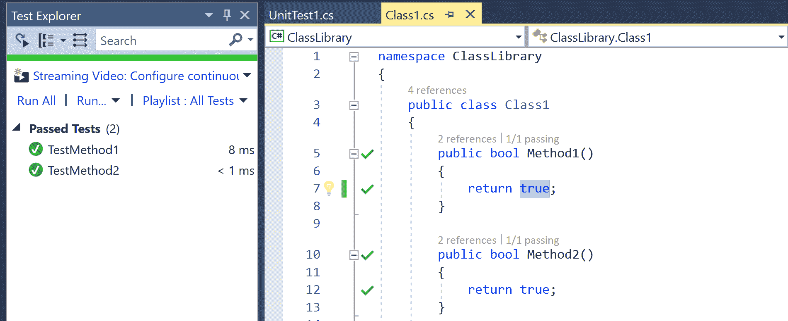

1.  点击测试 | 实时单元测试 | 暂停以暂时暂停 LUT 执行。注意，一旦暂停 LUT，编辑器中的绿色勾选标记()就会消失：


1.  将`Class1.Method1`改为再次返回 false。这应该会导致在重新执行时`TestMethod1`失败，但请注意，测试在测试资源管理器窗口中仍然显示为通过，因为测试不是实时运行的：

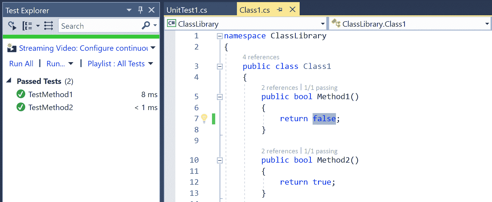

1.  导航到测试 | 实时单元测试 | 继续以恢复 LUT，并注意`TestMethod1`立即执行，现在在测试资源管理器和编辑器的图标中显示为失败：

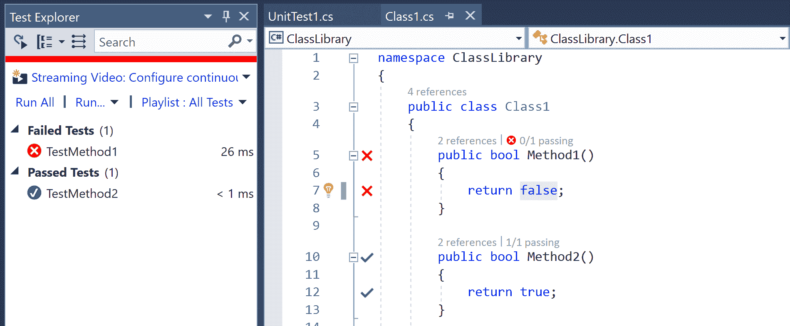

1.  点击测试 | 实时单元测试 | 重新启动，并注意编辑器和测试资源管理器窗口中的所有测试结果都会暂时被清除。

1.  注意输出窗口的实时单元测试面板显示的消息：构建完成（成功），表示项目已重新构建并重新执行了所有测试。

1.  导航到测试 | 实时单元测试 | 停止，并注意编辑器和测试资源管理器窗口中的所有测试结果都会永久清除：

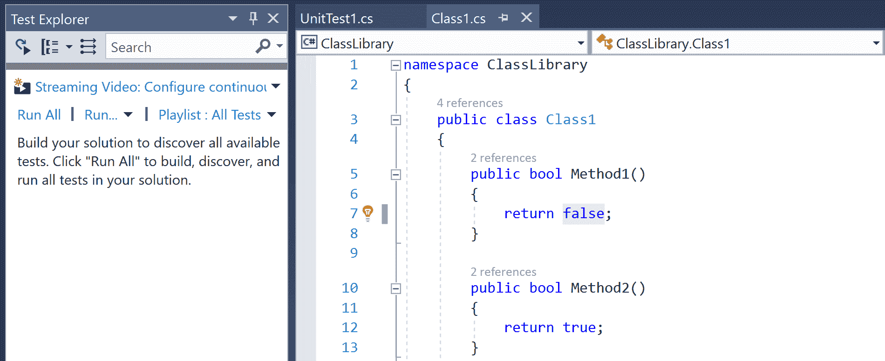

1.  注意输出窗口的实时单元测试面板显示的消息：实时单元测试停止<q>。</q>，确认 LUT 执行已停止。

# 包含和排除实时执行中的子集测试

在本节中，我们将向您展示如何选择性地包含和/或排除实时单元测试执行中的子集测试。这个功能对于提高非常大的解决方案的响应速度非常有帮助，因为在构建整个解决方案然后执行所有单元测试可能会很耗时且资源密集。

# 入门

您需要在您的机器上安装 Visual Studio 2017 企业版才能执行此配方。您可以从[`www.visualstudio.com/thank-you-downloading-visual-studio/?sku=Enterprise&rel=15`](https://www.visualstudio.com/thank-you-downloading-visual-studio/?sku=Enterprise&rel=15)安装授权的企业版。

# 如何操作...

1.  打开 Visual Studio 2017 并创建一个包含 10 个 `ClassLibrary` 项目（例如 `ClassLibrary`、`ClassLibrary1`、...、`ClassLibrary9`）和一个单元测试项目 `UnitTestProject` 的 C# 解决方案：

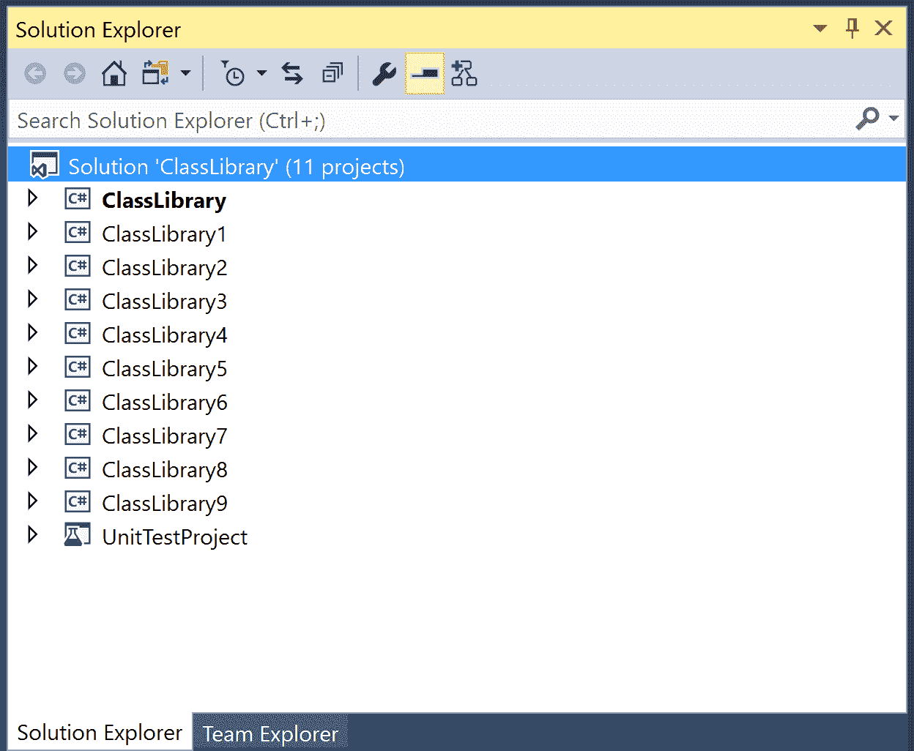

1.  在 `UnitTestProject` 中将项目引用添加到所有类库项目。

1.  在 `UnitTestProject` 中添加一个新的测试类 `UnitTest2` 并将测试方法重命名为 `TestMethod2.`。

1.  导航到 Test | Live Unit Testing | Start 并注意以下对话框提示解决方案很大，如果包含测试子集，则响应速度会提高：

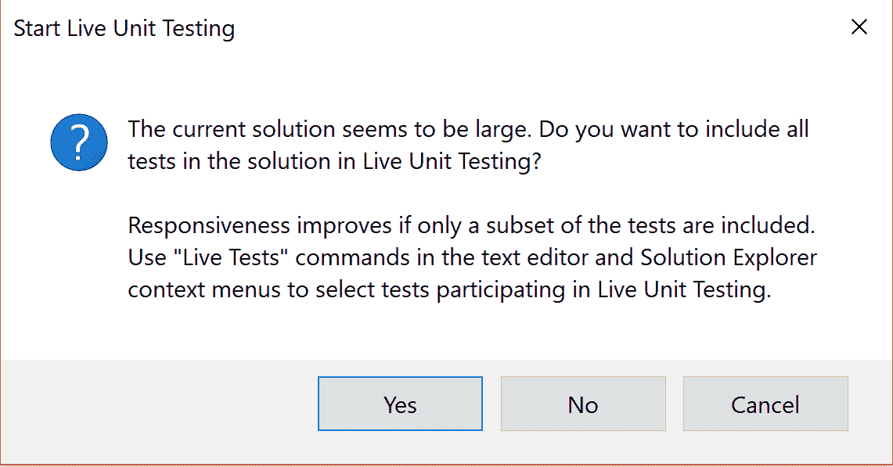

1.  点击 No 以确保没有测试被包含在实时执行中。

1.  验证 `UnitTestProject` 中测试方法前的蓝色破折号 ()，确认已从实时执行中排除单元测试：

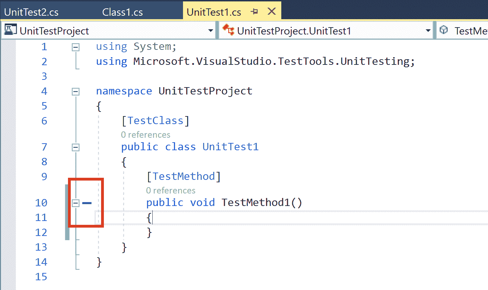

1.  在编辑器中右键单击类 `UnitTest1` 并执行 Live Tests | Include 以包含此类中的单元测试到 LUT 中。

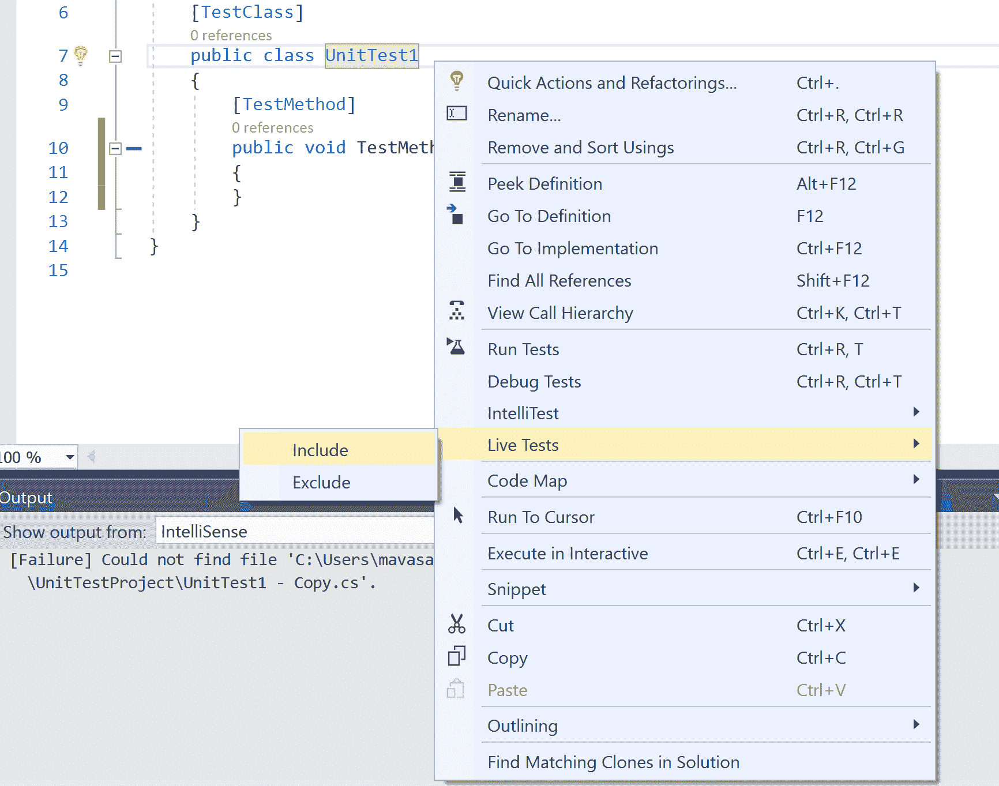

1.  验证 `UnitTest1.TestMethod1` 在 LUT 下立即执行并显示为通过，但 `UnitTest2.TestMethod2` 没有执行。

1.  再次在编辑器中右键单击类 `UnitTest1` 并执行 Live Tests | Exclude 以排除此类中的单元测试到 LUT。

1.  通过按 *Enter* 键编辑方法 `UnitTest1.TestMethod1` 并验证测试现在已从 LUT 中排除，并且测试结果也已从编辑器和测试资源管理器窗口中清除：

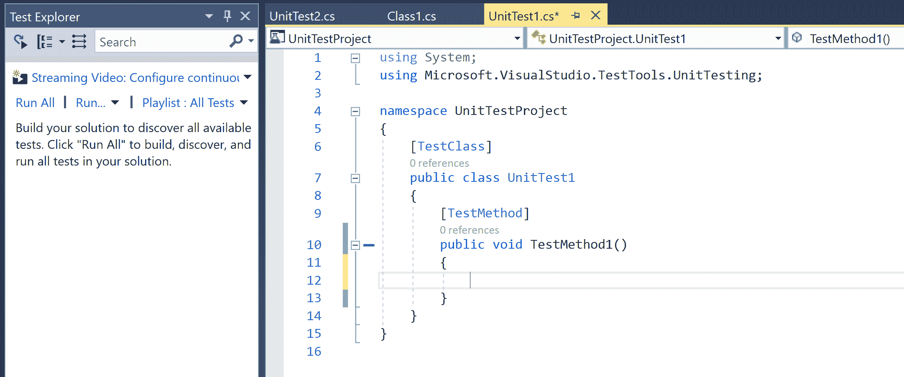

您可以通过在解决方案资源管理器中右键单击项目节点并单击 Live Tests | Include/Exclude 来包含/排除单元测试项目中的所有测试。

# 使用工具选项对话框配置实时单元测试的不同选项

在本节中，我们将向您展示如何配置 LUT 执行选项，例如在解决方案加载时启动 LUT、配置保持 LUT 启用所需的最低电池百分比以节省电池电量，等等。这使用户能够控制何时自动启动/暂停 LUT，并控制日志记录级别以满足他们的需求。

# 入门

您需要在您的机器上安装 Visual Studio 2017 Enterprise 版本才能执行此配方。您可以从 [`www.visualstudio.com/thank-you-downloading-visual-studio/?sku=Enterprise&rel=15`](https://www.visualstudio.com/thank-you-downloading-visual-studio/?sku=Enterprise&rel=15) 安装授权的企业版。

此外，克隆本章中附带的 `ClassLibrary.sln` 解决方案，*查看和导航实时单元测试结果*，然后继续此配方。或者，您可以在继续此配方之前手动执行该配方中的步骤。

# 如何操作...

1.  使用包含两个项目，`ClassLibrary` 和 `UnitTestProject`**，**的解决方案 `ClassLibrary.sln`，并通过导航到测试 | 实时单元测试 | 开始来启动实时单元测试。同时，通过点击测试 | 窗口 | 测试资源管理器来打开测试资源管理器窗口。

1.  点击工具 | 选项，并在搜索栏中搜索 `Live Unit Testing`，然后点击常规选项卡以查看 LUT 配置选项：

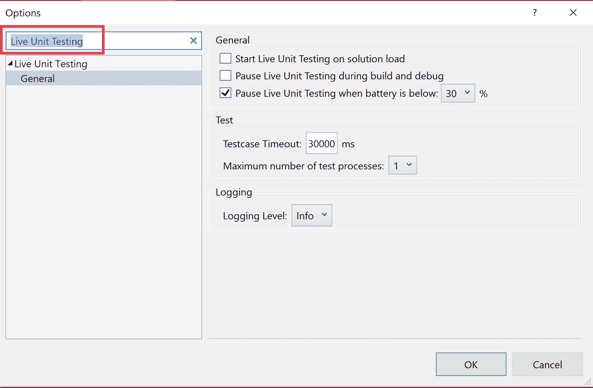

1.  在解决方案加载时检查启动实时单元测试，并在对话框中点击确定。

1.  通过导航到测试 | 实时单元测试 | 停止来停止解决方案的实时单元测试。

1.  关闭并重新打开解决方案，并验证在解决方案加载完成后所有单元测试都会自动执行。

1.  再次使用工具 | 选项打开 LUT 配置选项，并将暂停 LUT 的最低电池百分比从 30% 更改为 100%

1.  从笔记本电脑断开电源线，并验证 LUT 会立即暂停，并且编辑任何测试方法都不会导致测试以 LUT 重新执行。

1.  连接笔记本电脑电源线，并再次验证单元测试；在后台以 LUT 执行。
