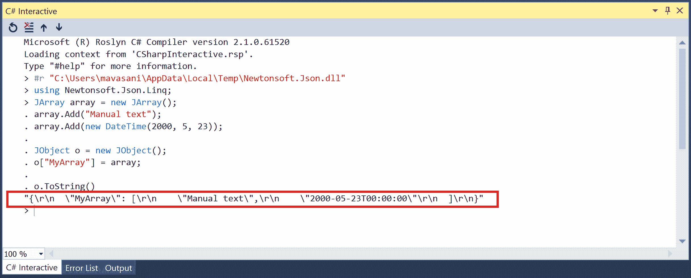
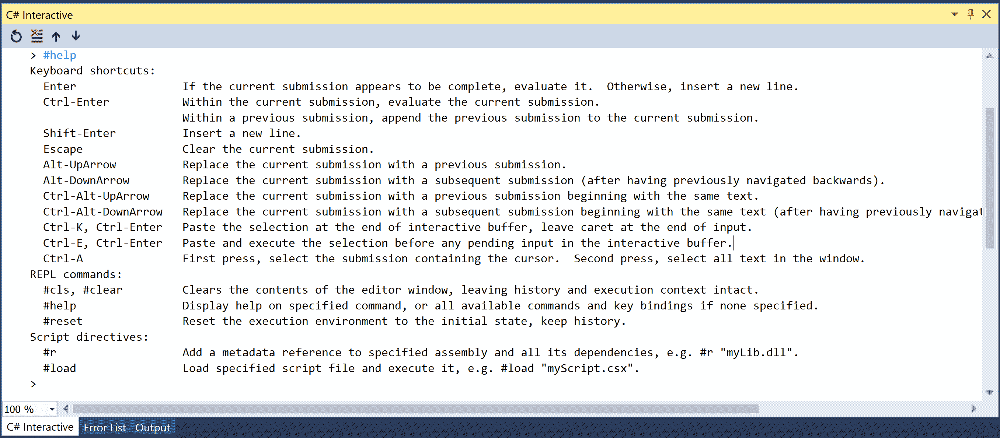
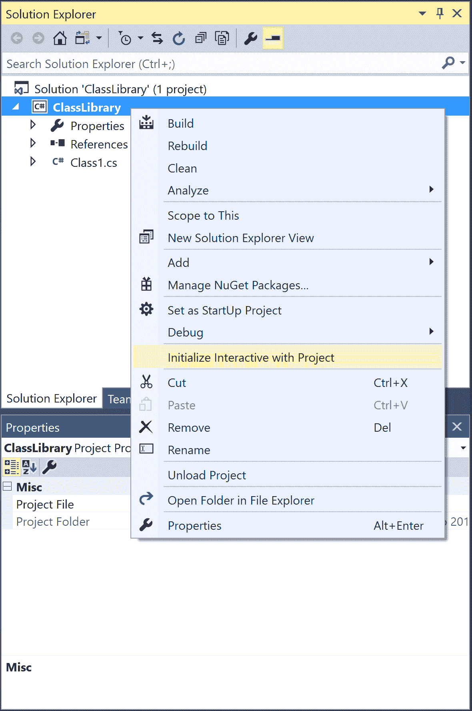
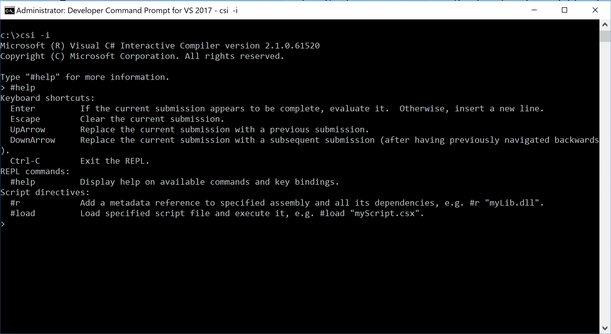

# 第七章：C# 交互式和脚本

在本章中，我们将涵盖以下配方：

+   在 Visual Studio 交互式窗口中编写简单的 C# 脚本并评估它

+   在 C# 交互式窗口中使用脚本指令和 REPL 命令

+   在 C# 交互式窗口中使用键盘快捷键评估和导航脚本会话

+   从现有的 C# 项目初始化 C# 交互式会话

+   使用 `csi.exe` 在 Visual Studio 开发者命令提示符中执行 C# 脚本

+   使用 Roslyn 脚本 API 执行 C# 代码片段

# 简介

本章介绍了基于 Roslyn 编译器 API 的最强大功能/工具之一：**C# 交互式和脚本**。您可以在 [`msdn.microsoft.com/en-us/magazine/mt614271.aspx`](https://msdn.microsoft.com/en-us/magazine/mt614271.aspx) 阅读有关 C# 脚本的概述。以下是前述文章中关于此功能的一个小示例：

C# 脚本是一个用于测试您的 C# 和 .NET 代码片段的工具，无需创建多个单元测试或控制台项目。它提供了一种简单的方法来探索和理解 API，而无需在您的 `%TEMP%` 目录中创建另一个 `CSPROJ` 文件。C# 读取-评估-打印循环 (REPL) 作为 Visual Studio 2015 及以后版本中的交互式窗口以及称为 CSI 的新命令行界面 (CLI) 提供。

这是 Visual Studio 中 C# 交互式窗口的截图：


以下是从 Visual Studio 2017 开发者命令提示符中执行的 C# 交互式命令行界面 (`csi.exe`) 的截图：


# 在 Visual Studio 交互式窗口中编写简单的 C# 脚本并评估它

在本节中，我们将向您介绍 C# 脚本的基础知识，并展示如何使用 Visual Studio 交互式窗口来评估 C# 脚本。

# 入门

您需要在您的机器上安装 Visual Studio 2017 社区版才能执行此配方。您可以从 [`www.visualstudio.com/thank-you-downloading-visual-studio/?sku=Community&rel=15`](https://www.visualstudio.com/thank-you-downloading-visual-studio/?sku=Community&rel=15) 安装免费的社区版。

# 如何操作...

1.  打开 Visual Studio 并通过点击视图 | 其他窗口 | C# 交互式窗口来启动 C# 交互式窗口：


1.  在交互式窗口中输入 `Console.WriteLine("Hello, World!")` 并按 *Enter* 键来评估 C# 表达式。

1.  确认 `Hello, World!` 在交互式窗口中作为结果输出：


1.  现在，输入一个类型为 `List<int>` 的变量声明语句，并使用集合初始化器：`var myList = new List<int> { 3, 2, 7, 4, 9, 0 };` 并按 *Enter* 键。

1.  接下来，输入一个表达式语句，该语句访问先前语句中声明的 `myList` 变量，并使用 linq 表达式过滤列表中的所有偶数：`myList.Where(x => x % 2 == 0)`。

1.  按下 *Enter* 键来评估表达式并验证评估结果输出为一个格式良好的可枚举列表：`Enumerable.WhereListIterator<int> { 2, 4, 0 }`.

1.  输入命令 `$"The current directory is { Environment.CurrentDirectory }."`。这访问当前目录环境变量并验证当前目录输出。

1.  现在，将以下命令输入到交互窗口中，并验证按下 *Enter* 键会导致根据输入的 `await` 表达式出现 10 秒的 UI 延迟：

```cs
> using System.Threading.Tasks;
> await Task.Delay(10000)
>

```

1.  在交互窗口中输入以下类声明并按下 *Enter* 键：

```cs
class C
{
  public void M()
  {
    Console.WriteLine("C.M invoked");
  }
}

```

1.  实例化之前声明的类型 `C` 并通过评估以下语句在实例上调用方法 `M`：`new C().M();`.

1.  验证交互窗口中的输出为：`C.M invoked`。

您可以在附带的文本文件 `InteractiveWindowOutput.txt` 中查看本食谱的整个交互窗口内容。

# 它是如何工作的...

在本食谱中，我们编写了一组简单的 C# 交互脚本命令，以执行在常规 C# 代码中常见的多项操作，但无需声明存根类型/主方法或创建源文件/项目。交互会话期间执行的操作包括：

1.  评估一个输出字符串到控制台的表达式 (`Console.WriteLine(...)`).

1.  声明一个在交互会话期间存在的局部变量，并用集合 `initializer (myList)` 初始化它。

1.  在后续的 linq 语句中访问先前声明的变量并评估结果值 (`myList.Where(...)`).

1.  在 C# 表达式评估中访问环境变量 (`Environment.CurrentDirectory`).

1.  通过使用声明在会话中导入命名空间 (`using System.Threading.Tasks;`).

1.  等待异步表达式 (`await Task.Delay(10000)`).

1.  在交互会话期间声明一个具有方法的 C# 类 (`class C` 和 `method M`)。

1.  在后续语句中实例化先前声明的类并调用方法 (`new C().M()`).

让我们简要回顾一下 C# 交互编译器的实现，它使得在交互模式下执行所有前面的常规 C# 操作成为可能。

`Csi.main` ([`source.roslyn.io/#csi/Csi.cs,14`](http://source.roslyn.io/#csi/Csi.cs,14)) 是 C# 交互编译器的入口点。在编译器初始化后，控制最终会到达 `CommandLineRunner.RunInteractiveLoop` ([`source.roslyn.io/#Microsoft.CodeAnalysis.Scripting/Hosting/CommandLine/CommandLineRunner.cs,7c8c5cedadd34d79`](http://source.roslyn.io/#Microsoft.CodeAnalysis.Scripting/Hosting/CommandLine/CommandLineRunner.cs,7c8c5cedadd34d79))，即 REPL，或读取-评估-打印循环，它读取交互命令并在循环中评估它们，直到用户通过按 *Ctrl* + *C* 退出。

对于每条输入的行，REPL 循环会执行 `ScriptCompiler.ParseSubmission` ([`source.roslyn.io/#Microsoft.CodeAnalysis.Scripting/ScriptCompiler.cs,54b12302e519f660`](http://source.roslyn.io/#Microsoft.CodeAnalysis.Scripting/ScriptCompiler.cs,54b12302e519f660)) 来将给定的源文本解析成一个语法树。如果提交不完整（例如，如果类声明的第一行已经输入），则输出 `.` 并继续等待更多文本以完成提交。否则，它使用当前提交文本连接到先前的提交并运行新的提交，通过调用核心 C# 编译器 API。提交的结果输出到交互窗口。

关于提交如何链接到先前的提交并在交互编译器中执行的更多详细信息超出了本章的范围。您可以通过 ([`source.roslyn.io/#q=RunSubmissionsAsync`](http://source.roslyn.io/#q=RunSubmissionsAsync)) 导航到脚本编译器的代码库以了解其内部工作原理。

# 在 C# 交互窗口中使用脚本指令和 REPL 命令

在本节中，我们将向您介绍 C# 交互脚本中可用的常见指令和 REPL 命令，并展示如何在 Visual Studio 交互窗口中使用它们。

# 入门

您需要在您的机器上安装 Visual Studio 2017 社区版才能执行此菜谱。您可以从 [`www.visualstudio.com/thank-you-downloading-visual-studio/?sku=Community&rel=15`](https://www.visualstudio.com/thank-you-downloading-visual-studio/?sku=Community&rel=15) 安装免费的社区版。

# 如何操作...

1.  打开 Visual Studio 并通过点击视图 | 其他窗口 | C# 交互来启动 C# 交互窗口。

1.  将附带的示例菜谱中的 `Newtonsoft.Json.dll` 复制到您的临时目录 `%TEMP%`。

1.  执行以下 `#r` 指令以将此程序集加载到交互会话中：

```cs
#r "<%YOUR_TEMP_DIRECTORY%>\Newtonsoft.Json.dll"

```

1.  验证您现在可以引用此程序集中的类型以及创建对象和调用方法。例如，将以下代码片段输入到交互窗口中：

```cs
using Newtonsoft.Json.Linq;
JArray array = new JArray();
array.Add("Manual text");
array.Add(new DateTime(2000, 5, 23));

JObject o = new JObject();
o["MyArray"] = array;

o.ToString()

```

1.  验证输出到交互窗口的数组字符串表示：



1.  执行 REPL 命令`#clear`（或`#cls`），并验证这清除了交互窗口中的所有文本。

1.  将附带的示例菜谱中的`MyScript.csx`复制到您的临时目录`%TEMP%`。

1.  执行以下`#load`指令以在交互会话中加载并执行此脚本：

```cs
#load "<%YOUR_TEMP_DIRECTORY%>\MyScript.csx"

```

1.  验证脚本是否执行，并从执行中获得以下输出：


1.  执行`#reset` REPL 命令以重置交互会话。

1.  现在，尝试在交互会话中引用之前重置之前添加的`Newtonsoft.Json`命名空间，并验证您是否得到错误，因为程序集已不再在会话中加载：


1.  最后，执行`#help` REPL 命令以打印交互窗口中可用的键盘快捷键、指令和 REPL 命令的帮助文本：



您可以在附带的文本文件`InteractiveWindowOutput.txt`中查看此菜谱的交互窗口的完整内容。

# 在 C#交互窗口中使用键盘快捷键评估和导航脚本会话

在本节中，我们将向您介绍 C#交互脚本中常见的键盘快捷键，并展示如何在 Visual Studio 交互窗口中使用它们。

如前一道菜谱的最后一步所示，您可以在交互窗口中使用*#help* REPL 命令查看 C#交互窗口中可用的所有键盘快捷键的完整列表。

# 开始使用

您需要在您的机器上安装 Visual Studio 2017 社区版才能执行此菜谱。您可以从[`www.visualstudio.com/thank-you-downloading-visual-studio/?sku=Community&rel=15.`](https://www.visualstudio.com/thank-you-downloading-visual-studio/?sku=Community&rel=15)安装免费的社区版。

# 如何操作...

1.  打开 Visual Studio，通过点击视图|其他窗口|C#交互窗口*.*打开 C#交互窗口。

1.  输入字符串常量`"World!"`并按*Enter*键以评估和输出字符串。

1.  输入`"Hello, "`并将光标移至步骤 2 中的上一个提交，然后按*Ctrl* + *Enter*键将上一个提交的文本附加到当前提交。当前提交的文本应更改为`"Hello, " + "World!"`，按*Enter*键应输出文本`"Hello, World!"`。

1.  输入`@"Hello, World`并按*Shift* + *Enter*键在当前提交中添加新行。在下一行输入`with a new line!"`并按*Enter*键，应输出文本`"Hello, World\r\nwith a new line!"`，如下所示：


1.  输入`Hello`并按*Esc*键；这应该清除当前行的文本。

1.  同时按下 *Alt* + 向上箭头键；这应该将当前提交的文本更改为与上一个提交相同，在我们的例子中，是 `@"Hello, World`

    `. 在新的一行!"`.

1.  按下 *Enter* 键再次输出 `"Hello, World\r\nwith a new line!"`。

1.  按下引号键 *"*. 这应该自动添加另一个引号。按 *Delete* 键删除这个自动添加的引号并添加第二个引号。

1.  现在，同时按下 *Ctrl* + *Alt* + 向上箭头键；这应该将当前提交的文本更改为与之前提交中相同字符的最后一个提交相同，即 *"*. 在我们的例子中，这是提交 `"Hello, " + "World!"`.

1.  按下 *Enter* 键输出 `"Hello, World!"`.

1.  现在，将光标放在会话中的第一个提交上，即步骤 2 中的提交。

1.  同时按下 *Ctrl* + *A* 键以选择第一个提交中的全部文本，即 `"World!"`。然后，同时按下 *Ctrl* + *Enter* 键以将此文本复制到当前提交。

1.  按下 *Enter* 键输出 `"World!"`.

1.  将光标移回之前的提交，并连续两次按下 *Ctrl* + *A* 键以选择交互窗口的全部内容。

您可以在附带的文本文件 `InteractiveWindowOutput.txt` 中查看此菜谱的交互窗口的全部内容。

# 从现有 C# 项目初始化 C# 交互会话

在本节中，我们将向您展示如何从现有的 C# 项目初始化 C# 交互式脚本会话，然后在使用 Visual Studio 交互窗口中的项目类型。

# 入门

您需要在您的机器上安装 Visual Studio 2017 社区版才能执行此菜谱。您可以从 [`www.visualstudio.com/thank-you-downloading-visual-studio/?sku=Community&rel=15.`](https://www.visualstudio.com/thank-you-downloading-visual-studio/?sku=Community&rel=15) 免费安装社区版。

# 如何操作...

1.  打开 Visual Studio 并通过单击“视图”|“其他窗口”|“C# 交互”来启动 C# 交互窗口。

1.  在交互窗口中声明一个局部变量 `int x = 0;` 并按下 *Enter* 键。

1.  执行 `Console.WriteLine(x)` 并验证输出 `0` 以确认变量 `x` 已在当前会话中声明。

1.  创建一个新的 C# 类库项目，例如 `ClassLibrary`。

1.  将以下方法 `M` 添加到创建的项目中的 `Class1` 类型：

```cs
public void M()
{
  Console.WriteLine("Executing ClassLibrary.Class1.M()");
}

```

1.  在解决方案资源管理器中右键单击项目，然后单击“使用项目初始化交互”：



1.  验证项目构建是否开始，以及 C# 交互会话是否已使用项目引用和输出程序集（`ClassLibrary.dll`）重置：


1.  在交互窗口中输入以下文本 `new Class1().M();` 并按下 *Enter* 键以执行提交。

1.  验证 `Executing ClassLibrary.Class1.M()` 作为结果输出，确认交互会话是用 `ClassLibrary` 项目初始化的。

1.  尝试引用在步骤 2 中定义的变量 *x*，即在通过执行 `Console.WriteLine(x);` 初始化项目交互会话之前。

1.  验证这导致以下编译时错误，确认当我们从项目初始化会话时，会话状态已完全重置：

```cs
> Console.WriteLine(x);
(1,19): error CS0103: The name 'x' does not exist in the current context

```

您可以在附带的文本文件 `InteractiveWindowOutput.txt` 中查看此配方的整个交互窗口内容。

# 在 Visual Studio 开发者命令提示符中使用 csi.exe 执行 C# 脚本

在本节中，我们将向您展示如何使用命令行界面执行 C# 脚本及其交互模式。`csi.exe`（CSharp Interactive）是 C# 交互的 CLI 可执行文件，它随 C# 编译器工具集和 Visual Studio 一起提供。

# 入门

您需要在您的机器上安装 Visual Studio 2017 社区版才能执行此配方。您可以从 [`www.visualstudio.com/thank-you-downloading-visual-studio/?sku=Community&rel=15`](https://www.visualstudio.com/thank-you-downloading-visual-studio/?sku=Community&rel=15) 安装免费的社区版。

# 如何操作...

1.  启动 Visual Studio 2017 开发命令提示符并执行命令 `csi.exe` 以启动 C# 交互会话*.*。

1.  在控制台输入 `Console.WriteLine("Hello, World!")` 并按 *Enter* 键以交互模式执行命令：


1.  按 *Ctrl* + *C* 退出交互模式。

1.  创建一个名为 `MyScript.csx` 的脚本文件，包含以下代码以输出脚本参数：

```cs
var t = System.Environment.GetCommandLineArgs();

foreach (var i in t)
{
  System.Console.WriteLine(i);
}

```

1.  使用参数 `1 2 3` 执行脚本并验证以下输出。注意，执行脚本后，我们返回到命令提示符，而不是交互会话：

```cs
c:\>csi MyScript.csx 1 2 3
csi
MyScript.csx
1
2
3

```

1.  现在，在脚本前添加一个额外的 `-i` 参数并执行，验证与之前相同的输出，不过这次我们返回到交互式提示符：

```cs
c:\>csi -i MyScript.csx 1 2 3
csi
-i
MyScript.csx
1
2
3
>

```

1.  执行 `Console.WriteLine(t.Length)` 并验证输出为 `6`，确认在当前交互会话中，脚本中声明的并使用命令行参数初始化的变量 *t* 仍然存在。

1.  按 *Ctrl* + *C* 退出交互模式。

1.  执行 `csi -i` 以以交互模式启动 `csi.exe` 并执行 *#help* 命令以获取可用键盘快捷键、REPL 命令和脚本指令列表：



1.  注意，`csi.exe` 中可用的快捷键、REPL 命令和脚本指令集合是 Visual Studio 交互窗口中相应集合的子集。有关可用的快捷键、命令和指令的详细信息，请参阅本章前面的配方 *在 C# 交互窗口中使用脚本指令和 REPL 命令* 和 *在 C# 交互窗口中使用键盘快捷键评估和导航脚本会话*。

1.  按 *Ctrl* + *C* 退出交互模式。

1.  尝试使用参数执行 `csi.exe`，但不要指定脚本名称，并验证关于缺少源文件的错误 *CS2001*：

```cs
c:\>csi.exe 1
error CS2001: Source file 'c:\1' could not be found.

```

您可以在 [`github.com/dotnet/roslyn/wiki/Interactive-Window#repl`](https://github.com/dotnet/roslyn/wiki/Interactive-Window#repl) 了解有关命令行 REPL 和 `csi.exe` 参数的更多信息。

# 使用 Roslyn 脚本 API 执行 C# 代码片段

在本节中，我们将向您展示如何编写一个使用 Roslyn 脚本 API 执行 C# 代码片段并消费其输出的 C# 控制台应用程序。脚本 API 允许 .NET 应用程序实例化一个 C# 引擎，并针对宿主提供的对象执行代码片段。脚本 API 也可以直接在交互会话中使用。

# 开始使用

您需要在您的机器上安装 Visual Studio 2017 社区版才能执行此配方。您可以从 [`www.visualstudio.com/thank-you-downloading-visual-studio/?sku=Community&rel=15`](https://www.visualstudio.com/thank-you-downloading-visual-studio/?sku=Community&rel=15) 安装免费的社区版。

# 如何操作...

1.  打开 Visual Studio 并创建一个新的以 .NET Framework 4.6 或更高版本为目标的 C# 控制台应用程序，例如 `ConsoleApp`*.*

1.  安装 `Microsoft.CodeAnalysis.CSharp.Scripting` NuGet 包（在撰写本文时，最新稳定版本是 *2.1.0*）。有关如何在项目中搜索和安装 NuGet 包的指导，请参阅第二章 *在 .NET 项目中消费诊断分析器* 中的配方，*通过 NuGet 包管理器搜索和安装分析器*。

1.  将 `Program.cs` 中的源代码替换为附带的代码示例中的源代码 `\ConsoleApp\Program.cs.`

1.  按 *Ctrl* + *F5* 构建并启动不带调试的项目 `.exe`。

1.  验证 `EvaluateSimpleAsync` 评估的第一个输出：*

```cs
Executing EvaluateSimpleAsync...
3

```

1.  按任意键继续执行。

1.  验证 `EvaluateWithReferencesAsync` 评估的第二个输出：

```cs
Executing EvaluateWithReferencesAsync...
<%your_machine_name%>

```

1.  按任意键继续执行。

1.  验证 `EvaluateWithImportsAsync` 评估的第三个输出：

```cs
Executing EvaluateWithImportsAsync...
1.4142135623731

```

1.  按任意键继续执行。

1.  验证 `EvaluateParameterizedScriptInLoopAsync` 评估的最后输出：

```cs
Executing EvaluateParameterizedScriptInLoopAsync...
0
1
4
9
16
25
36
49
64
81
Press any key to continue . . .

```

1.  按任意键退出控制台。

请参阅文章 ([`github.com/dotnet/roslyn/wiki/Scripting-API-Samples`](https://github.com/dotnet/roslyn/wiki/Scripting-API-Samples)) 以获取脚本 API 的更多示例。

# 它是如何工作的...

在这个菜谱中，我们基于 Roslyn 脚本 API 编写了一个 C# 控制台应用程序，以执行各种常见的脚本操作。丰富的脚本 API 为评估、创建和执行具有配置选项的脚本提供了一个强大的对象模型。

让我们逐步分析这个菜谱中的代码，了解我们是如何实现这些操作的：

```cs
public static void Main(string[] args)
{
  EvaluateSimpleAsync().Wait();

  Console.ReadKey();
  EvaluateWithReferencesAsync().Wait();

  Console.ReadKey();
  EvaluateWithImportsAsync().Wait();

  Console.ReadKey();
  EvaluateParameterizedScriptInLoopAsync().Wait();
}

```

`Main` 方法调用单个方法以执行以下操作：

+   `EvaluateSimpleAsync`: 对二进制加法表达式的简单评估

+   `EvaluateWithReferencesAsync`: 一个涉及传递给脚本选项的引用程序集的评估

+   `EvaluateWithImportsAsync`: 一个涉及导入系统命名空间并从该命名空间调用 API 的评估

+   `EvaluateParameterizedScriptInLoopAsync`: 通过参数化脚本并在值循环中调用创建和评估脚本

`EvaluateSimpleAsync` 调用最常用的脚本 API，即 `CSharpScript.EvaluateAsync` ([`source.roslyn.io/#q=CSharpScript.EvaluateAsync`](http://source.roslyn.io/#q=CSharpScript.EvaluateAsync))，并使用一个表达式作为评估该表达式的参数。在我们的例子中，我们将 `1 + 2` 作为参数传递给 `EvaluateAsync`，输出结果 `3`：

```cs
private static async Task EvaluateSimpleAsync()
{
  Console.WriteLine("Executing EvaluateSimpleAsync...");
  object result = await CSharpScript.EvaluateAsync("1 + 2");
  Console.WriteLine(result);
}

```

`EvaluateWithReferencesAsync` 调用相同的 `CSharpScript.EvaluateAsync` API ([`source.roslyn.io/#q=CSharpScript.EvaluateAsync`](http://source.roslyn.io/#q=CSharpScript.EvaluateAsync))，但使用通过脚本选项传递的额外引用程序集，通过 `ScriptOptions.WithReferences` API ([`source.roslyn.io/#q=ScriptOptions.WithReferences`](http://source.roslyn.io/#q=ScriptOptions.WithReferences))。

在我们的例子中，我们传递 `typeof(System.Net.Dns).Assembly` 作为评估 `System.Net.Dns.GetHostName()` 的额外引用，输出机器名：

```cs
private static async Task EvaluateWithReferencesAsync()
{
  Console.WriteLine("Executing EvaluateWithReferencesAsync...");
  var result = await CSharpScript.EvaluateAsync("System.Net.Dns.GetHostName()",
  ScriptOptions.Default.WithReferences(typeof(System.Net.Dns).Assembly));
  Console.WriteLine(result);
}

```

`EvaluateWithImportsAsync` 使用通过脚本选项传递的命名空间导入调用 `CSharpScript.EvaluateAsync` API ([`source.roslyn.io/#q=CSharpScript.EvaluateAsync`](http://source.roslyn.io/#q=CSharpScript.EvaluateAsync))，通过 `ScriptOptions.WithImports` API ([`source.roslyn.io/#q=ScriptOptions.WithImports`](http://source.roslyn.io/#q=ScriptOptions.WithImports))。在我们的例子中，我们将 `System.Math` 作为评估 `Sqrt(2)` 的额外命名空间导入，输出结果 `1.4142135623731`：

```cs
private static async Task EvaluateWithReferencesAsync()
{
  Console.WriteLine("Executing EvaluateWithReferencesAsync...");
  var result = await CSharpScript.EvaluateAsync("System.Net.Dns.GetHostName()",
  ScriptOptions.Default.WithReferences(typeof(System.Net.Dns).Assembly));
  Console.WriteLine(result);
}

```

`EvaluateParameterizedScriptInLoopAsync` 使用 `CSharpScript.Create` API ([`source.roslyn.io/#Microsoft.CodeAnalysis.CSharp.Scripting/CSharpScript.cs,3beb8afb18b9c076`](http://source.roslyn.io/#Microsoft.CodeAnalysis.CSharp.Scripting/CSharpScript.cs,3beb8afb18b9c076)) 创建一个参数化的 C# 脚本，该脚本接受要执行的脚本代码和一个全局类型作为参数：

```cs
private static async Task EvaluateParameterizedScriptInLoopAsync()
{
  Console.WriteLine("Executing EvaluateParameterizedScriptInLoopAsync...");
  var script = CSharpScript.Create<int>("X*Y", globalsType: typeof(Globals));
  script.Compile();
  for (int i = 0; i < 10; i++)
  {
    Console.WriteLine((await script.RunAsync(new Globals { X = i, Y = i })).ReturnValue);
  }
}

```

然后它调用 `Script.Compile` API ([`source.roslyn.io/#q=Script.Compile`](http://source.roslyn.io/#q=Script.Compile)) 来编译脚本。编译后的脚本随后在循环中使用 `Script.RunAsync` API ([`source.roslyn.io/#q=Script.RunAsync`](http://source.roslyn.io/#q=Script.RunAsync)) 执行，循环中使用不同实例的全局类型 Globals，字段 *X* 和 *Y* 的值递增。每次迭代计算表达式 `X * Y` 的结果，在我们的例子中，这只是从零到九的循环中所有数字的平方。
