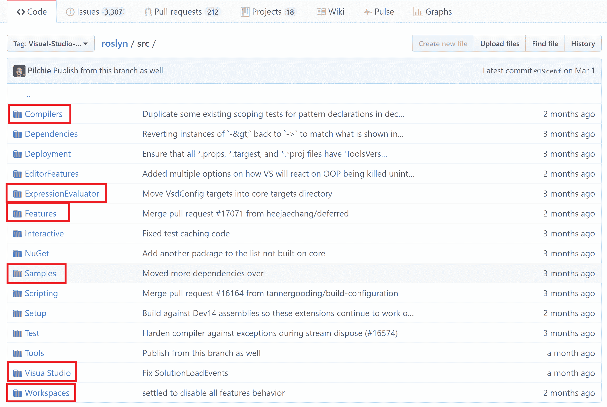
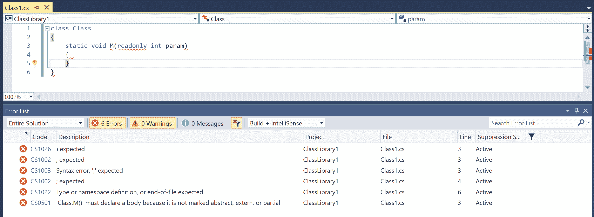
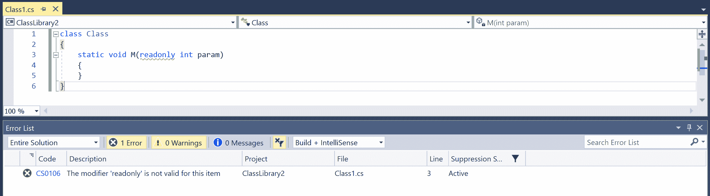
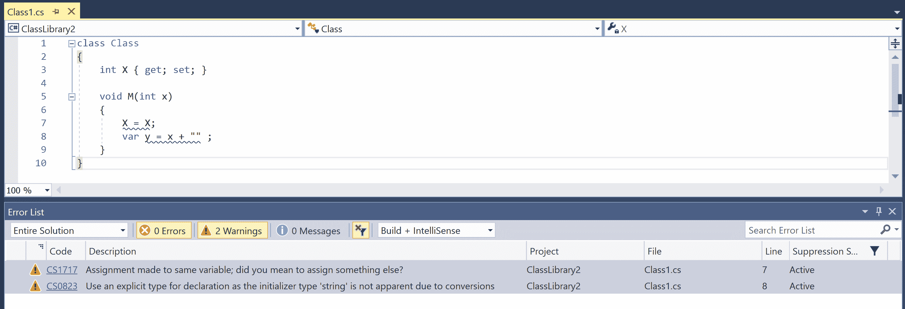
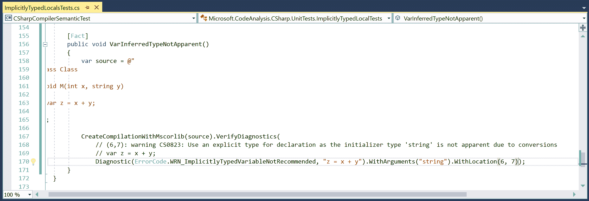
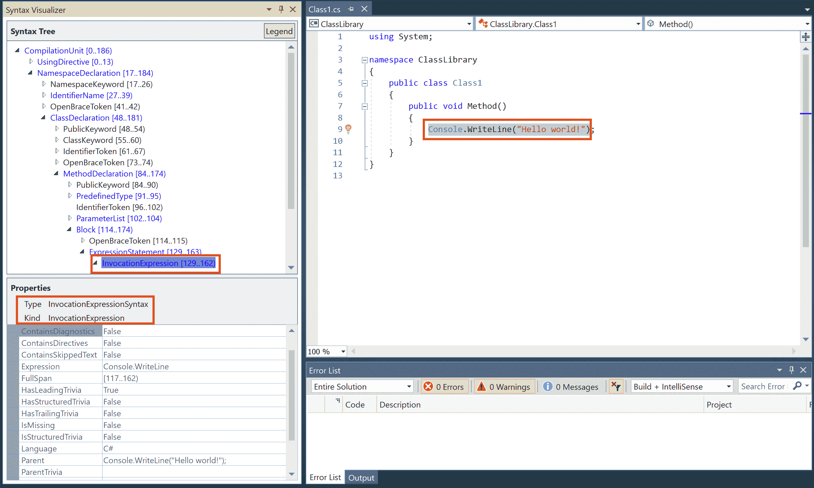
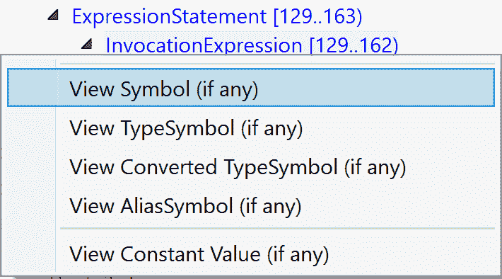
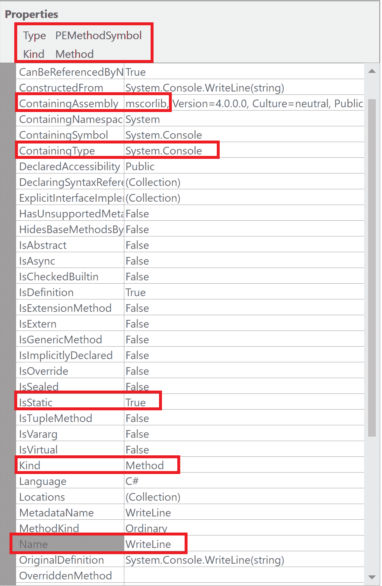
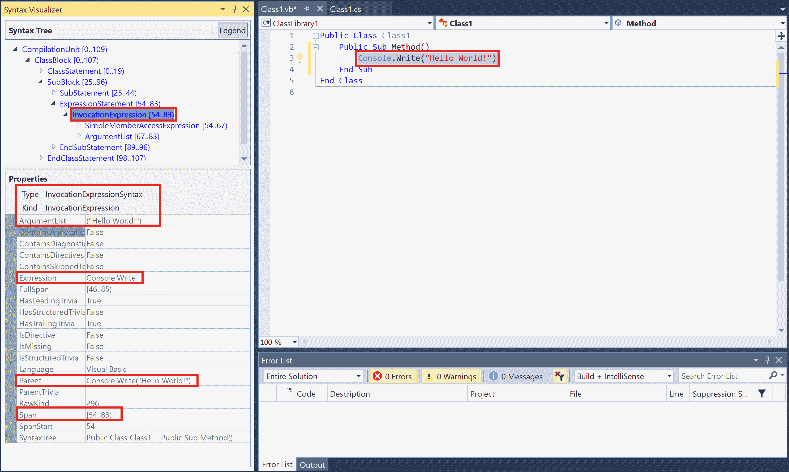

# 向 Roslyn C#编译器开源代码贡献简单功能

在本章中，我们将介绍以下食谱：

+   设置 Roslyn 征募

+   在 C#编译器代码库中实现新的语法错误

+   在 C#编译器代码库中实现新的语义错误

+   为 C#编译器代码库中的新错误编写单元测试

+   使用 Roslyn 语法可视化器查看源文件的 Roslyn 语法标记和节点

+   向 Roslyn Pull request 提交以贡献 C#编译器和 VS IDE 的下一个版本

# 简介

本章使开发者能够向 Roslyn C#编译器添加新功能。

让我们简要地浏览一下 Roslyn 源代码树的不同部分。您可以在 VS2017 分支中快速查看 Roslyn 仓库的最顶层源文件夹：[`github.com/dotnet/roslyn/tree/Visual-Studio-2017/src`](https://github.com/dotnet/roslyn/tree/Visual-Studio-2017/src)

 [](https://github.com/dotnet/roslyn/tree/Visual-Studio-2017/src)

最重要的源文件夹及其对应的组件如下：

+   `Compilers`: 这实现了 Roslyn C#和 VB 编译器以及核心 Microsoft 代码分析层，该层公开了丰富的语言无关 API，用于对源代码进行语法和语义分析。此层的核心概念包括 SyntaxTree（源文件）、SemanticModel（源文件的语义）、Symbol（源中的声明）和 Compilation（源文件和选项的集合）。

+   `Workspaces`**:** 这实现了工作区层及其相应的 API，用于对项目和解决方案进行工作区级别的代码分析和重构。此层对在工作区上运行的宿主操作系统（如 Visual Studio 或命令行工具）完全无关。此层的核心概念包括文档（带有相关语义模型的语法树）、项目（由文档和程序集引用组成的集合，构成编译，并具有配置编译的属性）、解决方案（项目的集合）和工作区级别的选项。

+   `Features`**:** 建立在 Workspaces 层之上的可扩展 IDE 功能，如代码修复、重构、IntelliSense、完成、查找引用、导航到定义、编辑并继续（EnC）、诊断等，都位于此层。此层与 Visual Studio 无关，可以托管在不同的宿主或命令行工具中。

+   `VisualStudio`**:** 在功能和 Workspaces 层之上构建的 Visual Studio 特定组件提供了一个端到端的 C#和 VB IDE 体验。此层的核心概念包括*Visual Studio* *工作区*、项目系统（组件通过填充工作区和启用上述提到的 IDE 功能，在静态程序表示和实时 IDE 表示之间架起桥梁）和语言服务（向项目系统公开的核心语言语义服务）。

+   `ExpressionEvaluator`**:** 用于解析和评估简单表达式以及计算运行时结果的 C# 和 VB 表达式评估器。

+   `Samples`**:** 展示 Roslyn API 使用的示例和教程。您可以在[`github.com/dotnet/roslyn/wiki/Samples-and-Walkthroughs`](https://github.com/dotnet/roslyn/wiki/Samples-and-Walkthroughs)中阅读更多详细信息。

您可以在[`github.com/dotnet/roslyn/wiki/Roslyn%20Overview`](https://github.com/dotnet/roslyn/wiki/Roslyn%20Overview)阅读更多关于 Roslyn 的详细信息。

# 设置 Roslyn 入队

在本节中，我们将向您介绍安装所需工具、加入 Roslyn、构建 Roslyn 编译器源代码以及部署、调试和运行本地构建的编译工具集测试的步骤。

# 入门

您需要在您的机器上安装 Visual Studio 2017 以执行本章中的配方。您可以从[`www.visualstudio.com/thank-you-downloading-visual-studio/?sku=Community&rel=15`](https://www.visualstudio.com/thank-you-downloading-visual-studio/?sku=Community&rel=15)安装免费的 Visual Studio 2017 社区版本。请确保所选的工作负载包括 C#、VB、MSBuild 和 Visual Studio 扩展性。更具体地说，将 .NET 桌面开发工作负载和 Visual Studio 扩展性工具工作负载添加到您的 VS 安装中。[](https://www.visualstudio.com/thank-you-downloading-visual-studio/?sku=Community&rel=15)

# 如何做到这一点...

1.  按照以下步骤在[`desktop.github.com/`](https://desktop.github.com/)安装 GitHub for desktop 并使用您的 GitHub 个人资料登录 GitHub。如果您没有个人资料，您可以在[`github.com/join`](https://github.com/join)创建一个。

1.  从 *Git Shell* 执行以下命令以使用 VS2017 标签加入并恢复 Roslyn 编译器源代码：

    +   git clone https://github.com/dotnet/roslyn c:\Roslyn

    +   cd c:\Roslyn

    +   git checkout tags/Visual-Studio-2017

    +   Restore.cmd

1.  从 VS2017 管理员开发命令提示符构建 Roslyn 编译器子树：`msbuild /m /v:m Compilers.sln`。您也可以使用 `Build.cmd` 或 `msbuild /m /v:m Roslyn.sln` 构建整个 Roslyn 源树。此步骤构建源代码并将本地构建的编译工具集（或整个 Roslyn IDE + 编译工具集）部署到 **RoslynDev** hive。

注意：如果您由于强名称签名失败而遇到构建错误，请从管理员开发命令提示符执行以下命令以禁用强名称验证：`sn -Vr *`，然后执行构建。

1.  在 VS2017 中打开 `Roslyn.sln` 并将 `Compilers\CompilerExtension.csproj` 设置为启动项目。

1.  点击 *Ctrl* + *F5* 将本地构建的编译工具集部署到单独的 Visual Studio hive 并从这个 hive 启动一个新的 Visual Studio 实例（RoslynDev）。

1.  在新的 Visual Studio 实例中，创建一个新的 C# 类库项目。

1.  通过打开“工具”|“选项”|“项目和解决方案”|“构建和运行”|“MSBuild 项目构建输出详细程度”，将 msbuild 输出详细程度从“最小”更改为“正常”。

1.  构建 C#类库项目，并打开输出窗口以确认是否使用了本地构建的`<q>csc.exe</q>`来构建库，并且它是从 Visual Studio RoslynDev 存储库执行的：`C:\USERS\<%USER_NAME%>\APPDATA\LOCAL\MICROSOFT\VISUALSTUDIO\15.0_XXXXXXXXROSLYNDEV\EXTENSIONS\MICROSOFT\ROSLYN COMPILERS\42.42.42.42424\csc.exe`

1.  右键单击`Compilers\CSharpCompilerSemanticTest.csproj`并打开项目属性|调试页面。通过执行 Start external program 文本框中指定的 xunit 控制台 exe 文件，并使用命令行参数文本框中的参数执行 C#编译器语义单元测试：`C:\Users\<%USER_NAME%>\.nuget\packages\xunit.runner.console\<%VERSION%>\tools\xunit.console.x86.exe "<%REPO_ROOT%>\Binaries\Debug\UnitTests\CSharpCompilerSemanticTest\\Roslyn.Compilers.CSharp.Semantic.UnitTests.dll" -html "<%REPO_ROOT%>\Binaries\Debug\UnitTests\CSharpCompilerSemanticTest\\xUnitResults\Roslyn.Compilers.CSharp.Semantic.UnitTests.html" -noshadow`

您可以在[`github.com/dotnet/roslyn/blob/dev16/docs/contributing/Building,%20Debugging,%20and%20Testing%20on%20Windows.md`](https://github.com/dotnet/roslyn/blob/dev16/docs/contributing/Building,%20Debugging,%20and%20Testing%20on%20Windows.md)获取有关注册、构建和测试 Roslyn 源代码的更详细说明。

# 在 C#编译器代码库中实现新的语法错误

本节将使 Roslyn 贡献者能够修改 C#解析器以添加新的语法错误。当在符号声明（如字段、方法、局部变量等）中使用不正确的修饰符时，C#解析器报告诊断*CS0106*（`t*he modifier 'modifier' is not valid for this* item`）([`msdn.microsoft.com/en-us/library/3dd3ha66.aspx`](https://msdn.microsoft.com/en-us/library/3dd3ha66.aspx))。例如，以下错误代码生成了三个*CS0106*实例：

```cs
class Class
{
  // Error CS0106: The modifier 'async' is not valid for this item
  async int field;

  // Error CS0106: The modifier 'readonly' is not valid for this item               
  readonly static void M()         
  {
    // Error CS0106: The modifier 'readonly' is not valid for this item
    readonly int local = 0;        
    System.Console.WriteLine(local);
  }
}

```

然而，如果您声明了一个具有不正确修饰符的参数，例如`readonly int param`，它不会生成*CS0106*错误，而是生成大量与缺失标记、无效标识符等相关的不太有用的语法错误和波浪线。考虑以下示例：

```cs
class Class
{
  static void M(readonly int param)
  {
  }
}

```

这会生成以下错误和波浪线集：



在本节中，我们将修改 C#解析器以实现更好的错误恢复机制，对于此类无效参数修饰符，将报告单个*CS0106*语法错误，这对最终用户更有帮助。

# 入门

您需要确保已安装带有.NET 开发和 VS 扩展性工作负载的 Git 工具、VS2017，并且已使用 VS2017 标签注册和构建了 Roslyn 源代码。有关参考，请参阅本章开头“设置 Roslyn 注册”的配方。

# 如何操作...

1.  在 VS2017 中打开 Roslyn 仓库根目录下的 `Roslyn.sln`。

1.  打开源文件 `<%ROOT%>\src\Compilers\CSharp\Portable\Parser\LanguageParser.cs`。

1.  导航到私有方法 `IsPossibleParameter`（第 4060 行）并将高亮的 `||` 子句添加到默认情况返回语句中：

```cs
default:
  return IsPredefinedType(this.CurrentToken.Kind) || GetModifier(this.CurrentToken) != SyntaxModifier.None;

```

1.  导航到私有方法 `ParseParameterModifiers`（第 4234 行），并将现有的 `while (IsParameterModifier(this.CurrentToken.Kind, allowThisKeyword))` 替换为 `while (true)` 循环，在 while 循环的开始处添加以下 if 语句：

```cs
while (true)
{
  if (!IsParameterModifier(this.CurrentToken.Kind, allowThisKeyword))
  {
    if (GetModifier(this.CurrentToken) != SyntaxModifier.None)
    {
      // Misplaced modifier
      var misplacedModifier = this.EatToken();
      misplacedModifier = this.AddError(misplacedModifier, ErrorCode.ERR_BadMemberFlag, misplacedModifier.Text);
      modifiers.Add(misplacedModifier);
      continue;
    }

    break;
  }
  ...

```

1.  构建解决方案。

1.  将 `VisualStudio\VisualStudioSetup.Next.csproj` 设置为启动项目，然后按 *Ctrl* + *F5* 启动一个新的 VS 实例，并使用本地构建的编译器和 IDE 工具集。

1.  创建一个新的 C# 类库项目，例如 `ClassLibrary`，并添加以下代码：

```cs
class Class
{
  static void M(readonly int param)
  {
  }
}

```

1.  验证错误列表中有一个 *CS0106* 诊断，用于无效的 `readonly` 修饰符，并且编辑器有一个单条波浪线。



1.  构建项目并验证构建输出只有一个 *CS0106* 诊断。

您可以在 [`github.com/mavasani/roslyn/commit/02b7be551b46fa9a8e054c3317bc2ae7957b563c.`](https://github.com/mavasani/roslyn/commit/02b7be551b46fa9a8e054c3317bc2ae7957b563c) 查看在此配方中做出的所有解析器更改。

# 它是如何工作的...

解析、语法分析或句法分析是分析一串符号的过程，这些符号可以是自然语言或计算机语言中的，并符合形式语法的规则。

C# 语言解析器是编译器工具链的第一个阶段，它根据 C# 语言规范解析源文件以生成语法树。解析每个源文件的主要入口点是 `SyntaxFactory.ParseCompilationUnit` ([`source.roslyn.io/#q=SyntaxFactory.ParseCompilationUnit`](http://source.roslyn.io/#q=SyntaxFactory.ParseCompilationUnit))，它将给定的源文本转换为带有语法节点、标记和语法的 `CompilationUnitSyntax`。

使用 [`source.roslyn.io/`](http://source.roslyn.io/) 进行丰富的语义搜索和导航 Roslyn 源代码。请注意，该网站索引的源代码版本对应于 Roslyn 仓库 *master* 分支的最新源代码，可能与 *Visual-Studio-2017* 标签的源代码不同。

`LanguageParser.ParseCompilationUnitCore` ([`source.roslyn.io/#q=LanguageParser.ParseCompilationUnitCore`](http://source.roslyn.io/#q=LanguageParser.ParseCompilationUnitCore)) 是 LanguageParser 的核心方法，它解析最外层的命名空间声明（如果有的话），然后解析命名空间体内的类型和成员声明。它使用 **Lexer** ([`source.roslyn.io/#q=Lexer.cs`](http://source.roslyn.io/#q=Lexer.cs)) 来读取下一个标记，并使用非常复杂的错误恢复机制为错误代码提供有意义的语法错误，这些错误代码包含位置不当或无效的标记。

在本配方中，我们确定了一个参数上无效修饰符的案例，其中 C#编译器没有执行最佳错误恢复，并更改了解析器代码以查找参数上的无效修饰符，并使用*CS0601*诊断解析它们。

在步骤 3 中对`IsPossibleParameter`默认情况返回语句的以下突出更改确保了当我们遇到参数声明修饰符列表中的成员级修饰符（如 readonly、public、private 等）时，不会完全跳过参数列表。相反，我们将修饰符与参数关联。

```cs
default:
 return IsPredefinedType(this.CurrentToken.Kind) || GetModifier(this.CurrentToken) != SyntaxModifier.None;

```

步骤 4 中添加到`ParseParameterModifiers`方法 while 循环中的`If`语句确保我们将有效和无效的修饰符都解析到参数修饰符列表中（与原始代码中仅解析有效修饰符相反），并在无效修饰符上生成适当的*CS0106*语法错误。

# 在 C#编译器代码库中实现新的语义错误

本节将使 Roslyn 贡献者能够对 C#绑定/语义分析阶段进行更改，以添加新的语义诊断。此外，我们还将展示如何扩展在本地重写（降低）阶段报告的现有语义诊断，以涵盖更多情况。

使用`var`关键字进行隐式类型声明的使用是一个非常主观的问题。C#编译器仅在无法推断类型或类型无效的隐式类型声明上报告非主观语义错误。然而，在某些情况下，初始化器的类型是有效的并且可以推断，但由于初始化器表达式的转换而不太明显。例如，考虑以下表达式`var x = 1 + 1.0, var y = "string" + 1`。*x*和*y*的初始化器包含二元表达式的左右两侧的隐式转换，这还可能涉及用户定义的隐式运算符转换，因此，变量的推断类型并不明显。我们将扩展 C#绑定以报告针对此类情况的新警告**CS0823**：`警告 CS0823：使用显式类型进行声明，因为初始化器类型'{0}'由于转换而不明显`。

此外，在本配方中，我们将扩展*CS1717*（对同一变量进行赋值；您是想分配其他内容？）([`docs.microsoft.com/en-us/dotnet/csharp/misc/cs1717`](https://docs.microsoft.com/en-us/dotnet/csharp/misc/cs1717))以报告在自赋值属性访问上的错误。目前，它仅涵盖自赋值字段、局部变量、参数和事件访问。

在这两个更改之后，我们将看到以下新的警告：

```cs
class Class
{
  int X { get; set; }

  void M(int x)
  {
    // Warning CS1717 Assignment made to same variable; did you mean to 
    //assign something else?
    X = X;     

    // Warning CS0823 Use an explicit type for declaration as the 
    //initializer type 'string' is not apparent due to conversions
    var y = x + "" ; 
  }
}

```

# 入门

您需要确保已安装*Git*工具、VS2017 以及.NET 开发，并且已安装 VS 扩展性工作负载，并使用 VS2017 标签登记和构建 Roslyn 源代码。有关参考，请参阅本章开头处的配方*设置 Roslyn 登记*。

# 如何做到这一点...

1.  在 VS2017 中打开 Roslyn 仓库根目录下的`Roslyn.sln`。

1.  打开源文件`<%ROOT%>\src\Compilers\CSharp\Portable\Errors\ErrorCode.cs`，在行 566 处添加以下新的警告 ID：`WRN_ImplicitlyTypedVariableNotRecommended = 823,`

1.  打开 resx 文件`<q><%ROOT%>\src\Compilers\CSharp\Portable\CSharpResources.resx</q>`，为警告消息添加以下新的资源字符串：

```cs
<data name="WRN_ImplicitlyTypedVariableNotRecommended" xml:space="preserve">
  <value>
    Use an explicit type for declaration as the initializer type '{0}' is not apparent due to conversions
  </value>
</data>

<data name="WRN_ImplicitlyTypedVariableNotRecommended_Title" xml:space="preserve">
  <value>
    Use an explicit type for declaration as the initializer type is not apparent due to conversions
  </value>
</data>

```

1.  打开开源文件`<%ROOT%>\src\Compilers\CSharp\Portable\Errors\ErrorFacts.cs`，在方法`GetWarningLevel`的第 320 行添加一个新的 switch case：`ErrorCode.WRN_ImplicitlyTypedVariableNotRecommended:`

1.  打开源文件`<%ROOT%>\src\Compilers\CSharp\Portable\Binder\Binder_Statements.cs`，在方法`BindInferredVariableInitializer`的第 702 行添加以下 if 语句：

```cs
if (expression.Kind == BoundKind.BinaryOperator)
{
  var binaryOperation = (BoundBinaryOperator)expression;
  if (!binaryOperation.Left.GetConversion().IsIdentity || !binaryOperation.Right.GetConversion().IsIdentity)
  {
    // Use an explicit type for declaration as the initializer type '{0}' is 
    //not apparent due to conversions.
    Error(diagnostics, ErrorCode.WRN_ImplicitlyTypedVariableNotRecommended, errorSyntax, expression.Display);
  }
}

```

1.  打开源文件`<%ROOT%>\src\Compilers\CSharp\Portable\Lowering\DiagnosticsPass_Warnings.cs`，在方法`IsSameLocalOrField`的第 204 行添加以下 switch section：

```cs
case BoundKind.PropertyAccess:
  var prop1 = expr1 as BoundPropertyAccess;
  var prop2 = expr2 as BoundPropertyAccess;
  return prop1.PropertySymbol == prop2.PropertySymbol &&
  (prop1.PropertySymbol.IsStatic || IsSameLocalOrField(prop1.ReceiverOpt, prop2.ReceiverOpt));

```

1.  构建解决方案。

1.  将`VisualStudio\VisualStudioSetup.Next.csproj`设置为启动项目，然后按*Ctrl* + *F5*启动一个新的 VS 实例，使用本地构建的编译器和 IDE 工具集。

1.  创建一个新的 C# 类库项目，例如`ClassLibrary`，并添加以下代码：

```cs
class Class
{
  int X { get; set; }

  void M(int x)
  {
    X = X;
    var y = x + "" ;
  }
}

```

1.  验证新的警告*CS0823*和*CS1717*出现在错误列表中，并在编辑器中出现波浪线：



1.  构建项目并验证构建输出也包含新的诊断信息。

您可以在[`github.com/mavasani/roslyn/commit/a155824a41150414966c6f03493b0bb05a45a59e`](https://github.com/mavasani/roslyn/commit/a155824a41150414966c6f03493b0bb05a45a59e)查看为*CS0823*所做的所有源代码更改，以及[`github.com/mavasani/roslyn/commit/9f33d6809202d9b2b7ef5e0fa79df0b56ea46110`](https://github.com/mavasani/roslyn/commit/9f33d6809202d9b2b7ef5e0fa79df0b56ea46110)为*CS1717*所做的更改。

# 它是如何工作的...

语义分析，也称为上下文相关分析，是编译器构建过程中的一个步骤，通常在解析之后，从源代码中收集必要的语义信息。

C# 绑定器是编译器工具链的第二阶段，它操作于由解析器输出的语法树、节点、标记和 trivia，并根据 C# 语言规范分析代码的语义。此阶段生成**绑定树**并报告语义诊断。绑定树本质上是一个具有与树中每个节点相关联的丰富语义信息的抽象语法树。在 CodeAnalysis 层提供的所有语义信息都来自与语法相关的绑定节点。绑定语句和表达式的入口点分别是[Binder.BindStatement](http://source.roslyn.io/#q=Binder.BindStatement)和[Binder.BindExpression](http://source.roslyn.io/#q=Binder.BindExpression)。

使用[`source.roslyn.io/`](http://source.roslyn.io/)进行 Roslyn 源代码的丰富语义搜索和导航。请注意，该网站上索引的源代码版本对应于 Roslyn 仓库的*master*分支的最新源代码，可能与*Visual-Studio-2017*标签的源代码不同。

在本配方中，我们向您展示了如何在绑定器中做出以下更改以添加新的诊断*CS0823*：

1.  将新的错误代码添加到`ErrorCode`枚举中。

1.  为编译器的诊断消息添加新的资源字符串。

1.  当初始化器是一个涉及非明显隐式转换的二进制表达式时，向方法添加一个新的语义诊断以绑定隐式变量初始化器。

C#本地重写或降低是编译器工具链的第三阶段，它将绑定树简化为非常简单的绑定节点。此外，它还执行流分析并报告流分析诊断（如不可达代码）。然后本地重写器的输出被馈送到代码生成器，该生成器为简化的绑定树生成 MSIL。

在本配方中，我们将现有的本地重写诊断传递扩展到报告自我赋值属性访问表达式的*CS1717*。

# 在 C#编译器代码库中为新错误编写单元测试

本节将使您能够向 C#编译器添加单元测试。Roslyn.sln 中有以下一系列单元测试项目：

+   `CSharpCompilerSyntaxTest`：解析和语法错误的单元测试

+   `CSharpCompilerSemanticTest`：语义错误和语义模型 API 的单元测试

+   `CSharpCompilerSymbolTest`：编译器层定义的符号的单元测试

+   `CSharpCommandLineTest`：编译器的命令行选项的单元测试

+   `CSharpCompilerEmitTest`：代码生成阶段的单元测试，用于验证生成的 MSIL

在本节中，我们将为新增的语义错误向`CSharpCompilerSemanticTest`添加单元测试。

# 入门

您需要确保已执行本章中此前的配方，*在 C#编译器代码库中实现新的语义错误*，以向 C#编译器添加新的语义诊断：`警告 CS0823：由于初始化器类型 '{0}' 由于转换而不明显，请使用显式类型进行声明`。

# 如何做到这一点...

1.  在 VS2017 中打开 Roslyn 仓库根目录下的`Roslyn.sln`。

1.  打开源文件`<%ROOT%>\src\Compilers\CSharp\Test\Semantic\Semantics\ImplicitlyTypedLocalsTests.cs`。

1.  将以下新的单元测试添加到源文件中：

```cs
[Fact]
public void VarInferredTypeNotApparent()
{
  var source = @"
  class Class
  {
    void M(int x, string y)
    {
      var z = x + y;
    }
  }";

  CreateCompilationWithMscorlib(source).VerifyDiagnostics();
}

```

1.  构建测试项目，并在命令行控制台中使用从项目的`Debug`属性页复制的命令行执行单元测试，为新增的单元测试添加`-method`开关：

```cs
*<%USERS_FOLDER%>*\.nuget\packages\xunit.runner.console\2.2.0-beta4-build3444\tools\xunit.console.x86.exe "*<%ROOT%>*\Binaries\Debug\UnitTests\CSharpCompilerSemanticTest\Roslyn.Compilers.CSharp.Semantic.UnitTests.dll" -html "C:\roslyn\Binaries\Debug\UnitTests\CSharpCompilerSemanticTest\xUnitResults\Roslyn.Compilers.CSharp.Semantic.UnitTests.html" -noshadow -method Microsoft.CodeAnalysis.CSharp.UnitTests.ImplicitlyTypedLocalTests.VarInferredTypeNotApparent

```

1.  验证单元测试因缺少*CS0823*诊断而失败：

```cs
Expected:
Actual:
 // (6,7): warning CS0823: Use an explicit type for declaration as the initializer type 'string' is not apparent due to conversions
 // var z = x + y;
 Diagnostic(ErrorCode.WRN_ImplicitlyTypedVariableNotRecommended, "z = x + y").WithArguments("string").WithLocation(6, 7)

Diff:
 ++> Diagnostic(ErrorCode.WRN_ImplicitlyTypedVariableNotRecommended, "z = x + y").WithArguments("string").WithLocation(6, 7)

```

1.  将缺失的诊断作为参数添加到我们的单元测试中的`VerifyDiagnostics`调用：



1.  通过重复步骤 4 重新执行单元测试，并验证测试现在是否通过。

如果您遇到 `DirectoryNotFoundException`，请确保测试结果目录存在于机器上：`<%ROOT%>\Binaries\Debug\UnitTests\CSharpCompilerSemanticTest\xUnitResults`。

1.  添加另一个单元测试以验证诊断不会在初始化二进制表达式没有隐式转换的情况下触发：

```cs
[Fact]
public void VarInferredTypeApparent_NoDiagnostic()
{
  var source = @"
  class Class
  {
    void M(int x, string y)
    {
      var z = (string)(x + y);
    }
  }";

  CreateCompilationWithMscorlib(source).VerifyDiagnostics();
}

```

1.  执行新的单元测试并验证它是否通过。

您也可以使用测试资源管理器窗口在 Visual Studio 中执行单元测试，但由于整个解决方案中有数千个单元测试，因此对 `Roslyn.sln` 的测试发现相当慢。因此，您可能需要等待几分钟才能执行第一个单元测试。

# 使用 Roslyn 语法可视化器查看源文件的 Roslyn 语法标记和节点

语法可视化器是一个 Visual Studio 扩展，它简化了对 Roslyn 语法树的检查和探索，并在您使用 .NET 编译器平台 (Roslyn) API 开发自己的应用程序时可以作为调试辅助工具使用。

在本节中，我们将向您展示如何安装和使用 Roslyn 语法可视化器来查看 Visual Studio 中 C# 和 Visual Basic 源代码的语法树、节点和属性。您还可以查看与语法节点关联的语义，例如符号信息、类型信息和表达式的编译时常量值。

# 入门

您需要安装 `.NET Compiler Platform SDK` 来安装 Roslyn 语法可视化器。有关安装 SDK 的说明，请参阅第一章中的配方，“在 Visual Studio 中创建、调试和执行分析器项目”，*编写诊断分析器*。

# 如何操作...

1.  打开 Visual Studio，使用命令“查看 | 其他窗口 | 语法可视化器”启动 Roslyn 语法可视化器，并将其停靠在 Visual Studio 窗口的左侧。

1.  创建一个新的 C# 类库项目，例如 `ClassLibrary`，并将以下方法添加到 `Class1.cs` 中：

```cs
public void Method()
{
  Console.WriteLine("Hello world!");
}

```

1.  选择调用 `Console.WriteLine("Hello world!")` 的代码，并查看语法可视化器的层次树视图：`CompilationUnit` 包含一个 `NamespaceDeclaration`，它包含一个 `ClassDeclaration`，它包含一个具有 `Block` 的 `MethodDeclaration`，其第一个语句是一个 `ExpressionStatement`，该语句包含一个 `InvocationExpression`：



1.  在语法可视化器的 SyntaxTree 面板中右键单击 InvocationExpression 节点，然后单击“查看符号（如果有）”命令。



1.  您可以查看绑定到调用的 PE 元数据符号 `System.Console.WriteLine` 的 `Properties`。



1.  将一个新的 VB 类库项目添加到解决方案中，例如 `ClassLibrary1`，并将以下方法添加到现有类中：

```cs
Public Sub Method()
  Console.Write("Hello World!")
End Sub

```

1.  在编辑器中选择调用表达式 `Console.Write("Hello World!")`，你可以在 Syntax Visualizer 中查看 VB 代码的语法树、节点和属性：



你可以在 [`github.com/dotnet/roslyn/wiki/Syntax%20Visualizer`](https://github.com/dotnet/roslyn/wiki/Syntax%20Visualizer) 阅读关于 Syntax Visualizer 工具的更详细概述。

# 向 Roslyn 提交拉取请求以贡献下一个版本的 C# 编译器和 VS IDE

在本节中，我们将指导你完成发送拉取请求以贡献 Roslyn 编译器和 Visual Studio IDE 下一个版本的步骤。

# 入门

你需要确保你已经安装了 Git 工具，VS2017 带有 .NET 开发和 VS 扩展工作负载，并且已经注册并构建了 Roslyn 源代码。有关参考，请参阅本章开头的配方，*设置 Roslyn 注册*。

# 如何做到这一点...

1.  建议你在 [`github.com/dotnet/roslyn/issues`](https://github.com/dotnet/roslyn/issues) 上为你的计划工作创建一个 Roslyn 问题，并在编码之前与 Roslyn 团队成员讨论，以避免任何不必要的或重复的工作。

1.  在你的本地注册中做出你想要贡献给 Roslyn 代码库的源代码更改。例如，执行本章前面提到的配方，*在 C# 编译器代码库中实现新的语义错误*。

1.  为你的代码更改添加足够的单元测试。例如，执行本章前面提到的配方，*为 C# 编译器代码库中的新错误编写单元测试*。

1.  在仓库根目录下执行 `Test.cmd` 以构建和运行所有测试，以确认你的更改没有出现回归。有关参考，请参阅本章开头的配方，*设置 Roslyn 注册*。

1.  创建一个新的 Git 分支，添加并提交你的更改，然后将它们推送到远程仓库。有关 Git 帮助，请搜索 [`help.github.com/`](https://help.github.com/).

1.  在发送拉取请求之前，请在 [`cla2.dotnetfoundation.org/`](http://cla2.dotnetfoundation.org/) 上签署 .NET **贡献者许可协议**（**CLA**）。

1.  按照以下步骤 [`help.github.com/articles/creating-a-pull-request/`](https://help.github.com/articles/creating-a-pull-request/) 在你的分支上发起一个新的拉取请求。

1.  在拉取请求的描述标签中填写拉取请求模板。你可以在创建拉取请求后编辑此信息。

1.  在创建拉取请求后，添加一条新评论标记编译器或/和 IDE 团队以审查更改：

    +   编译器团队：`@dotnet/roslyn-compiler`

    +   IDE 团队：`@dotnet/roslyn-ide`

1.  根据审阅者的要求进行代码更改，并确保你的分支中没有合并冲突。

1.  在你至少获得两个批准并且所有测试在拉取请求上通过后，你可以请求团队成员合并你的更改。

您可以在[`github.com/dotnet/roslyn/wiki/Contributing-Code`](https://github.com/dotnet/roslyn/wiki/Contributing-Code)阅读关于 Roslyn 仓库贡献代码的指南以获取更多详细信息。
