# 第一章. 设置需求

在本书中，我们将创建一个示例报告应用程序，并且我们需要安装一些工具以准备开始。我们将使用 Microsoft Visual Studio 2012 设计我们的示例报告应用程序，使用 Crystal Reports 设计报告，使用 Microsoft SQL Server 2008 作为数据库引擎，以及使用 Northwind 作为示例数据库。在我们开始之前，我们必须安装所有这些应用程序。

在本章中，我们将涵盖以下主题：

+   安装 Microsoft Visual Studio 2012

+   安装 Crystal Reports

+   安装 Microsoft SQL Server 2008

+   安装 Northwind 数据库

# 安装 Microsoft Visual Studio 2012

由于我们将使用 Microsoft Visual Studio 来创建我们的示例报告应用程序，让我们首先在我们的机器上安装它。

## 获取源代码

可以通过访问以下网址从 Microsoft 网站下载 Microsoft Visual Studio 2012 源代码：

[`www.microsoft.com/visualstudio/eng/downloads#d-express-windows-desktop`](http://www.microsoft.com/visualstudio/eng/downloads#d-express-windows-desktop)

我们将在示例中使用高级版。下载源文件后，提取它，然后双击`vs_premium.exe`文件以开始安装。

## 安装

现在我们已经下载并解压了源文件，让我们将其安装到我们的机器上。

1.  **许可协议**：如以下截图所示，我们可以通过点击**浏览**按钮并选择我们希望安装文件的目录来更改安装目录。勾选**我同意许可条款和条件**复选框以完成安装，然后点击**下一步**按钮。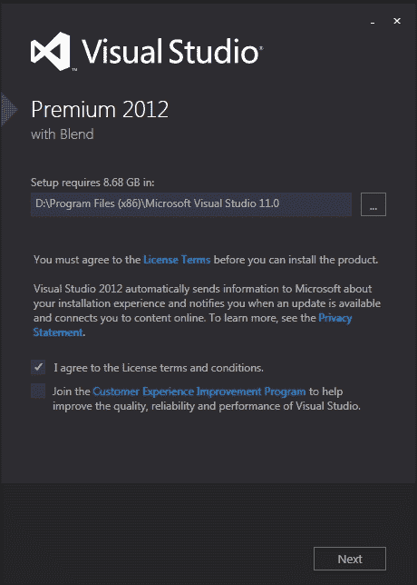

1.  **可选功能**：如以下截图所示，我们可以在 Visual Studio 中自定义安装功能。在我们的报告示例应用程序中，我们需要**Microsoft SQL Server Data Tools**，因此我们可以取消选择所有其他功能。但最好在我们的机器上安装所有功能。选择完功能后，点击**安装**按钮。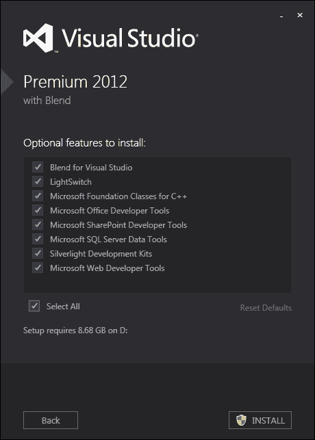

1.  **安装过程**：如以下截图所示，对话框仅显示安装过程的状态。这可能需要几分钟。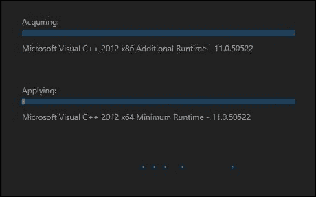

1.  **设置成功**：几分钟后，一个对话框会弹出告诉我们我们已经成功在我们的机器上安装了 Visual Studio。

# 安装适用于 Visual Studio 2012 的 Crystal Reports

现在我们已经完成了 Visual Studio 的安装，让我们安装 Crystal Report。

## 获取源代码

Crystal Reports 源代码可以从以下 SAP 网站下载：[`www.sap.com/index.epx`](http://www.sap.com/index.epx)。

以下是从 Microsoft 网站下载 Crystal Reports 的步骤：

1.  点击以下截图所示的**免费试用**链接：

1.  点击如下截图所示的**SAP Crystal Reports，Microsoft Visual Studio 开发者版本**：获取源代码

1.  点击如下截图所示的**现在下载 SAP Crystal Reports，Microsoft Visual Studio 开发者版本**：获取源代码

1.  如下截图所示，如果您有账户，请点击**立即登录**，如果没有账户，请注册并点击**立即下载**以开始下载。获取源代码

此版本与 Microsoft Visual Studio 2012 兼容。下载源代码后，双击`CRforVS_13_0_5.exe`文件以开始安装。

## 安装

1.  **安装语言**：选择**英语**语言并点击如下截图所示的**确定**按钮：安装

1.  **欢迎**：阅读此对话框中的说明和警告，然后点击如下截图所示的**下一步>**按钮：安装

1.  **许可协议**：仔细阅读许可协议。然后选中**我接受许可协议**复选框，并点击如下截图所示的**下一步**按钮：安装

1.  **确认**：如下截图所示，点击**下一步**按钮开始安装。安装软件到我们的机器上可能需要几分钟时间。安装

1.  **安装成功**：此步骤告诉我们 Crystal Reports 已成功安装，并询问我们是否希望安装 64 位运行时。选中复选框并点击如下截图所示的**完成**按钮：安装

# 安装 Microsoft SQL Server 2008

现在我们来安装 SQL Server 2008。

## 获取源代码

Microsoft SQL Server 2008 源代码可以从 Microsoft 网站下载：

[`www.microsoft.com/en-us/default.aspx`](http://www.microsoft.com/en-us/default.aspx)

以下是将 Microsoft SQL Server 2008 下载的步骤：

1.  在如下截图所示中输入`download sql server 2008 r2 service pack 2`以搜索 SQL Server 2008 r2 服务包 2：获取源代码

1.  选择**下载**并点击第一个结果：获取源代码

1.  点击**下载**：获取源代码

1.  选择与您的 Windows 兼容的 SQL Server 2008 版本。我使用的是 Windows 7，64 位，所以我选择了如下截图所示的`SQLServer200BR2SP2-KB2630458x64-ENU.exe`版本的 SQL Server 2008。点击**下一步**按钮开始下载。获取源代码

1.  下载完成后，我们可以在找到名为`SQLServer2008R2SP2-KB2630458-x64-ENU.exe`的文件；双击下载的文件以开始安装。

## 安装

以下是将 Microsoft SQL Server 2008 安装的步骤：

1.  **SQL Server 安装中心**：如以下截图所示，选择 **Installation**，然后点击 **New SQL Server stand-alone installation or add features to an existing installation** 链接。安装截图

1.  **设置支持规则**：如以下截图所示，Microsoft 在安装过程中检查可能发生的问题，以便在安装过程开始之前修复它们。如果任何检查失败，请点击 **Show details >>** 以找出出错的原因。修复它，然后点击 **Re-run**。如果测试成功完成，请点击 **OK**。安装截图

1.  **产品密钥**：如以下截图所示，我们可以通过选择 **Enter the product key:** 单选按钮并填写产品密钥来输入产品密钥。如果不输入产品密钥而继续，请选择 **Specify a free edition:** 以评估 SQL Server 2008，然后点击 **Next**。安装截图

1.  **许可条款**：阅读条款和条件后，选择 **I accept the license terms** 复选框，然后点击 **Next**。

1.  **设置支持文件**：只需点击 **Next** 即可完成安装。

1.  **设置支持规则**：如以下截图所示，Microsoft 检查在安装 SQL Server 设置支持文件时可能发生的问题。如果有任何问题，我们需要在完成安装之前修复它。如果没有问题，我们可以完成安装并点击 **Next>**。安装截图

1.  **功能选择**：如以下截图所示，我们将选择要在我们的机器上安装哪些功能。对于基本安装，我们只需要安装 **数据库引擎服务** 和 **管理工具 – 基本版**。但始终安装所有功能会更好。选择您希望在机器上安装的功能后，点击 **Next**。安装截图

1.  **实例配置**：如以下截图所示，我们可以选择保留 **默认实例** 名称 **MSSQLSERVER**，或将其更改为任何其他名称。尽管如此，建议您保留默认名称。另一方面，我们可以将安装目录更改为任何具有所需空间的目录。点击 **Next**。安装截图

1.  **磁盘空间需求**：只需点击 **Next** 即可完成安装。

1.  **服务器配置**：如以下截图所示，我们将设置用于运行 SQL Server 的 **服务帐户**。由于我们在自己的机器上安装 SQL Server，我们将使用所有服务的内置网络服务帐户（此帐户不需要密码）。在 **帐户名称** 列中，为所有服务选择 **NT AUTHORITY\NETWORK SERVICE**，然后点击 **Next>**。安装截图

1.  **数据库引擎配置**：如以下截图所示，我们将选择身份验证安全模式。有两种类型的身份验证：

    +   **Windows 身份验证**：当用户通过 Microsoft Windows 用户帐户连接时，SQL 服务器使用 Windows 操作系统的信息验证帐户名称和密码。这是默认的身份验证模式，比混合模式更安全。

    +   **混合模式**：此身份验证模式允许用户通过 Windows 身份验证和 SQL 服务器身份验证连接。通过 Windows 用户帐户连接的用户可以使用由 Windows 验证的信任连接。如果您选择混合模式身份验证，您必须为所有 SQL 服务器登录设置强密码。

1.  选择**混合模式**（**SQL 服务器身份验证和 Windows 身份验证**）并输入密码（让我们假设我们使用`asd123`作为 SQL 服务器密码）。重新输入密码以确认，然后点击**添加当前用户**。完成此操作后，点击**下一步>**。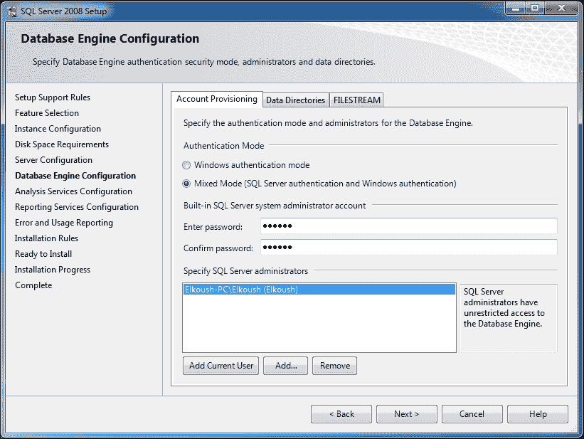

1.  **分析服务配置**：如果我们不在功能选择对话框中选择分析服务，我们将跳过此步骤。点击**添加当前用户**然后点击**下一步**。

1.  **报表服务配置**：如果我们在功能选择对话框中不选择**报表服务配置**，则此步骤将被跳过。保留默认选项并点击**下一步**。

1.  **错误和用法报告**：此步骤询问我们是否希望将错误信息发送给 Microsoft。保留选项选中并点击**下一步**按钮。

1.  **安装规则**：此对话框检查是否有任何进程或其他安装正在运行，这将中断 SQL Server 2008 的安装。如果有任何问题，我们必须在安装之前修复它。如果没有问题，点击**下一步**。

1.  **准备安装**：此步骤显示将在我们的计算机上安装的所有功能。点击**安装**以完成安装。

1.  **安装进度**：SQL 服务器现在将安装在我们的计算机上。安装过程完成后，我们将看到一张表格，显示已安装在我们计算机上的所有功能。

1.  **完整**：我们将看到一个小的对话框告诉我们 Microsoft SQL 服务器安装已成功完成。点击**关闭**以关闭此对话框。然后我们将看到主安装中心。我们可以关闭它。现在您将需要重新启动计算机。

# 在 Microsoft SQL Server 2008 中安装 Northwind 数据库

现在我们已经完成了 Microsoft SQL 服务器的安装，让我们安装 Northwind 数据库。

## 获取源

Northwind 数据库源可以从以下 Microsoft 网站下载：

[`www.microsoft.com/en-us/default.aspx`](http://www.microsoft.com/en-us/default.aspx)

1.  通过输入`下载 Northwind 数据库`如以下截图所示来搜索 Northwind 数据库的下载：

1.  如以下截图所示，点击第一个结果：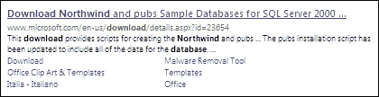

1.  如以下截图所示，点击**下载**以开始下载：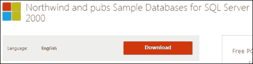

1.  下载完成后，我们将得到一个名为`SQL2000SampleDb.msi`的文件。双击此文件以开始安装。

## 安装

以下是在我们的机器上安装 Northwind 数据库的步骤：

1.  **欢迎对话框**：如以下截图所示，它只是一个欢迎对话框。点击**下一步**按钮。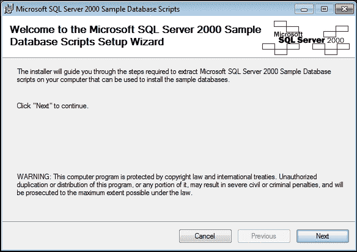

1.  **许可协议**：选择**我同意**单选按钮，并如以下截图所示点击**下一步**：

1.  **选择安装选项**：我们将保留默认设置，如以下截图所示，然后点击**下一步**。

1.  **确认安装**：我们现在可以在我们的机器上安装 Northwind 数据库，并点击**下一步**。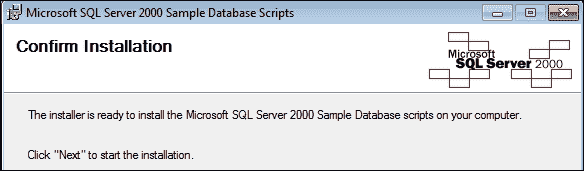

1.  **安装数据库**：如以下截图所示，数据库脚本将安装在我们的本地驱动器上。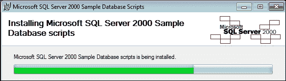

1.  **安装完成**：在脚本安装完成后，我们将在`C:\`中找到一个名为`SQL Server 2000 Sample Databases`的文件夹。我们将使用这些文件之一将 Northwind 数据库安装到 SQL Server 2008 中。

1.  **打开 SQL Server Management Studio**：从**开始**菜单选择**所有程序**，然后选择**Microsoft SQL Servers 2008**，并点击**SQL Server Management Studio**。

1.  **连接到 SQL Server 2008**：如以下截图所示，从**服务器类型**菜单中选择**数据库引擎**，**服务器名称**是**localhost**（或“.”），这代表我们的机器。**身份验证**类型是**SQL Server 身份验证**，与安装过程中选择的相同选项。**登录**名称是`sa`，代表 SQL Server 的默认用户，密码是`asd123`或安装 SQL Server 时输入的密码。填写完所有字段后，点击**连接**。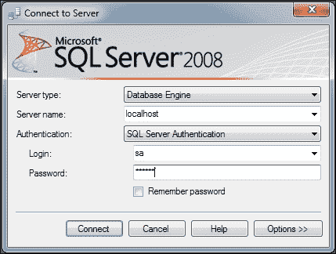

1.  **在 SQL Server 2008 中创建 Northwind 数据库**：打开`C:\SQL Server 2000 Sample Databases`。这是数据库脚本安装的位置。将包含创建我们服务器上 Northwind 数据库所需的所有 SQL 脚本的`filenamedinstnwnd.sql`文件拖动到 SQL Server Management Studio 中。如以下截图所示，点击**执行**按钮来运行脚本。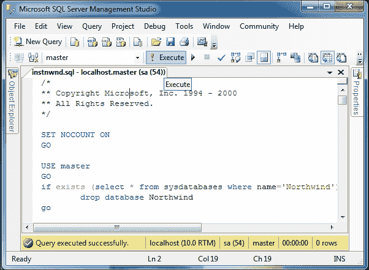

1.  在所有脚本正确执行后，我们将在数据库中看到 Northwind，如以下截图所示：

# 摘要

在本章中，我们学习了如何设置完成我们的示例应用所需的所有工具。在下一章中，我们将从设计我们的应用开始，我们将看到这个应用包含了大多数类型的 Crystal Reports。
