# 第二章 设计示例应用程序

在本章中，我们将学习如何使用 Microsoft Visual Studio 2012。我们将创建我们的应用程序，并通过研究该应用程序的工作原理，我们将学习 Visual Studio 的功能。我们还将设计我们的界面并验证我们的数据。到本章结束时，我们将拥有我们应用程序的最终设计。

在本章中，我们将涵盖以下主题：

+   创建新应用程序

+   向表单添加控件

+   验证表单数据

+   在纸上绘制我们的报告

# 创建新应用程序

我们现在将开始使用我们在上一章中安装的 Microsoft Visual Studio：

1.  从**开始**菜单，选择**所有程序**，然后选择**Microsoft Visual Studio 2012**文件夹，然后选择**Visual Studio 2012**。

1.  由于我们第一次运行 Visual Studio，我们将看到以下截图。我们可以选择默认环境设置。我们还可以在我们的应用程序中更改此设置。我们将使用 C#作为编程语言，因此我们将选择**Visual C# 开发设置**并单击**启动 Visual Studio**按钮。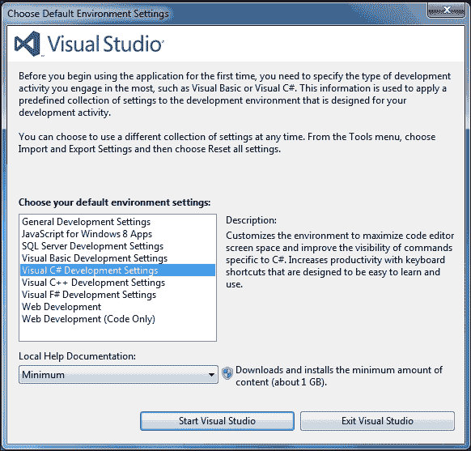

1.  现在，我们将看到 Microsoft Visual Studio 2012 的**起始页**。选择**新建项目**或通过导航到**文件** | **新建** | **项目**来打开它。如图所示：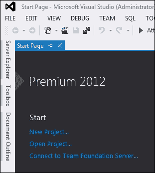

1.  如以下截图所示，我们将选择**Windows**作为应用程序模板。然后我们将选择**Windows 窗体应用程序**作为应用程序类型。让我们将我们的应用程序命名为`Monitor`。选择您想要保存应用程序的位置，然后单击**确定**。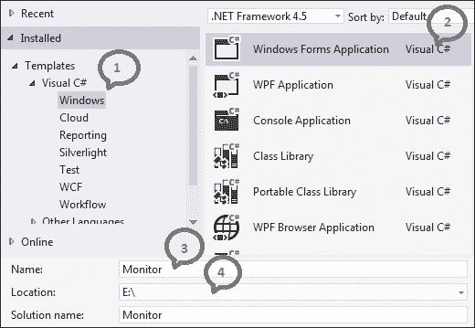

    现在我们将看到以下截图。让我们开始设计我们的应用程序界面。

    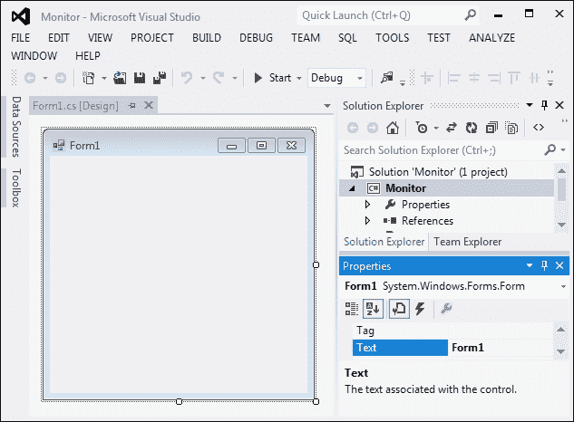

1.  首先右键单击表单，导航到**属性**，如图所示：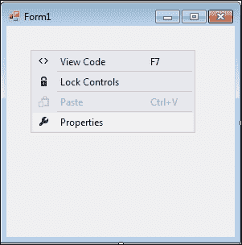

1.  **属性**资源管理器将打开，如图所示。将**文本**属性从**Form1**更改为`monitor`，将**名称**属性更改为`MainForm`，然后将**大小**更改为`322, 563`，因为我们将在表单中添加许多控件。在我完成设计过程后，我发现这是合适的表单大小；您可以根据需要更改表单大小和所有控件的大小，以更好地适应您的应用程序界面。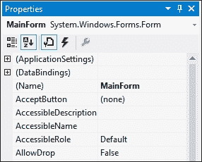

# 向表单添加控件

在这一步中，我们将通过向主表单添加控件来开始设计我们的应用程序界面。

我们将把主表单分为三个主要部分如下：

+   员工

+   产品和订单

+   员工和产品

## 员工

在本节中，我们将看到我们可以以不同的方式搜索我们的员工，并在报告中显示结果的不同方法。

### 开始设计过程

让我们按照以下步骤开始设计应用程序的员工部分：

1.  从**工具箱**资源管理器中，将**分组框**拖放到主窗体。将分组框的**大小**属性更改为`286, 181`，将**位置**属性更改为`12,12`，将**文本**属性更改为员工。

1.  向主窗体添加**标签**。将**文本**属性更改为`ID`，将**位置**属性更改为`12,25`。

1.  向主窗体添加**文本框**，并将**名称**属性更改为`txtEmpId`。将**位置**属性更改为`70, 20`。

1.  向主窗体添加**分组框**。将分组框的**大小**属性更改为`250,103`，将**位置**属性更改为`6, 40`，将**文本**属性更改为`过滤器`。

1.  向主窗体添加**标签**。将**文本**属性更改为`标题`，将**位置**属性更改为`6,21`。

1.  向主窗体添加**组合框**。将**名称**属性更改为`cbEmpTitle`，将**位置**属性更改为`56,17`。

1.  向主窗体添加**标签**。将**文本**属性更改为`城市`，将**位置**属性更改为`6,50`。

1.  向主窗体添加**组合框**。将**名称**属性更改为`cbEmpCity`，将**位置**属性更改为`56,46`。

1.  向主窗体添加**标签**。将**文本**属性更改为`国家`，将**位置**属性更改为`6,76`。

1.  向主窗体添加**组合框**。将**名称**属性更改为`cbEmpCountry`，将**位置**属性更改为`56,72`。

1.  向主窗体添加**按钮**。将**名称**属性更改为`btnEmpAll`，将**位置**属性更改为`6,152`，将**文本**属性更改为`全部`。

1.  向主窗体添加**按钮**。将**名称**属性更改为`btnEmpById`，将**位置**属性更改为`99,152`，将**文本**属性更改为`按 ID`。

1.  向主窗体添加**按钮**。将**名称**属性更改为`btnEmpByFilters`，将**位置**属性更改为`196,152`，将**文本**属性更改为`按过滤器`。

最终的设计将如下截图所示：

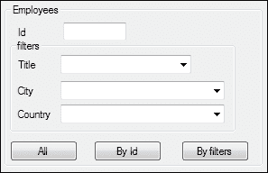

## 产品和订单

在这部分，我们将看到产品和订单之间的关系，以便展示哪些产品的订单量更高。因为我们有很多产品类别和来自不同国家的订单，所以我们通过产品类别和国家来过滤我们的报告。

### 开始你的设计过程

在我们完成员工部分的设计后，让我们开始设计产品和订单部分。

1.  从**工具箱**资源管理器中，将**分组框**拖放到主窗体。将分组框的**大小**属性更改为`284,136`，将**位置**属性更改为`12,204`，将**文本**属性更改为`产品 – 订单`。

1.  向主窗体添加**分组框**。将分组框的**大小**属性更改为`264,77`，将**位置**属性更改为`6,20`，将**文本**属性更改为`过滤器`。

1.  向主窗体添加**标签**，将**文本**属性更改为`类别`，将**位置**属性更改为`6,25`。

1.  向主窗体添加**组合框**。将**名称**属性更改为`cbProductsCategory`，将**位置**属性更改为`61,20`。

1.  在主表单中添加**标签**。将**文本**属性更改为`Country`并将**位置**属性更改为`6,51`。

1.  在主表单中添加**组合框**。将**名称**属性更改为`cbOrdersCountry`并将**位置**属性更改为`61,47`。

1.  在主表单中添加**按钮**。将**名称**属性更改为`btnProductsOrdersByFilters`，将**位置**属性更改为`108,103`，并将**文本**属性更改为`By filters`。

最终设计看起来如下截图所示：

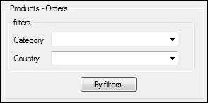

## 员工和订单

在这部分，我们将查看员工和订单之间的关系，以便评估每位员工的表现。在本节中，我们将通过一段时间来筛选数据。

### 开始你的设计过程

在本节中，我们将开始设计应用程序中的最后部分：员工和订单。

1.  从**工具箱**资源管理器中拖放**分组框**到主表单。将分组框的**大小**属性更改为`284,175`，将**位置**属性更改为`14,346`，并将**文本**属性更改为`Employees - Orders`。

1.  在主表单中添加**分组框**。将分组框的**大小**属性更改为**264,77**，将**位置**属性更改为`6,25`，并将**文本**属性更改为`filters`。

1.  在主表单中添加**标签**。将**文本**属性更改为`From`并将**位置**属性更改为`7,29`。

1.  在主表单中添加**日期时间选择器**并将**名称**属性更改为`dtpFrom`。将**位置**属性更改为`41,25`，将**格式**属性更改为`Short`，并将**值**属性更改为`1/1/1996`。

1.  在主表单中添加**标签**。将**文本**属性更改为`To`并将**位置**属性更改为`7,55`。

1.  在主表单中添加**日期时间选择器**。将**名称**属性更改为`dtpTo`，将**位置**属性更改为`41,51`，将**格式**属性更改为`Short`，并将**值**属性更改为`12/30/1996`。

1.  在主表单中添加**按钮**。将**名称**属性更改为`btnBarChart`，将**位置**属性更改为`15,117`，并将**文本**属性更改为`Bar chart`。

1.  在主表单中添加**按钮**并将**名称**属性更改为`btnPieChart`。将**位置**属性更改为`99,117`，并将**文本**属性更改为`Pie chart`。

1.  在主表单中添加**按钮**。将**名称属性**更改为`btnGaugeChart`，将**位置**属性更改为`186, 117`，并将**文本**属性更改为`Gauge chart`。

1.  在主表单中添加**按钮**。将**名称**属性更改为`btnAllInOne`，将**位置**属性更改为`63,144`，并将**文本**属性更改为`All In One`。

最终设计看起来如下截图所示：

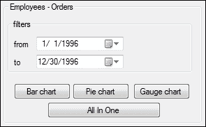

您可以根据需要更改**位置**、**大小**和**文本**属性；但不要更改**名称**属性，因为我们将在下一章的代码中使用它。

# 验证表单数据

当你开始设计你的应用程序时，你需要考虑一些事实，例如性能和图形用户界面（GUI）。你需要遵循的最重要规则之一是易用性。你需要确保用户对你的应用程序感到舒适。减少用户需要输入到你的应用程序中的数据量。因此，在我们的应用程序中，你会发现我们比使用**Textbox**更多地使用**GroupBox**，因为当我们使用**GroupBox**时，选择数据既容易又安全。我们将在下一章中看到如何用对应的数据填充所有 GroupBox 控件。

# 在纸上绘制你的报告

我们的应用程序将保持简单和完整，并设计为一个包含常见报告类型的单表单。所有报告都将在一个包含**Crystal Report Viewer**的另一个表单中显示，正如我们将在下一章中看到的。主表单中的每个按钮都设计用来显示报告。

+   `btnEmpAll` 按钮将显示包含所有员工数据的报告，其外观如下面的截图所示：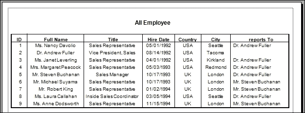

+   `btnEmpById` 按钮将显示包含特定员工数据的报告，其外观如下面的截图所示：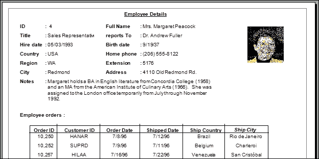

+   `btnEmpByFilters` 按钮将显示包含员工数据的报告，并使用`cbEmpTitle`、`cbEmpCity`和`cbEmpCountry` GroupBoxes 中的数据来过滤这些员工，如下面的截图所示：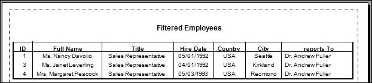

+   `btnProductsOrdersByFilters` 按钮将显示一个交叉表报告，以查看产品与订单之间的关系。我们将使用`cbProductsCategory`和`cbOrdersCountry` GroupBoxes 中的数据来过滤数据，如下面的截图所示：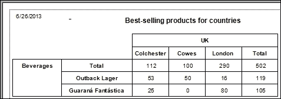

+   `btnBarChart` 按钮将显示一个柱状图表报告，以查看员工与订单之间的关系。我们将使用`dtpFrom`和`dtpTo` DateTimePicker 中的数据来过滤数据，如下面的截图所示：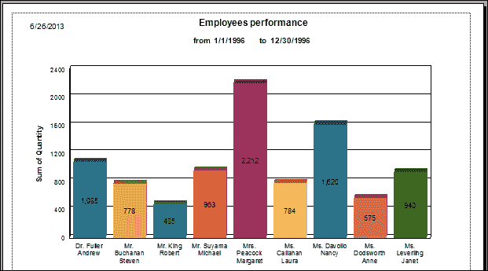

+   `btnPieChart` 按钮将显示一个饼图报告，展示员工与订单之间的关系。我们将使用`dtpFrom`和`dtpTo` DateTimePicker 中的数据来过滤数据，如下面的截图所示。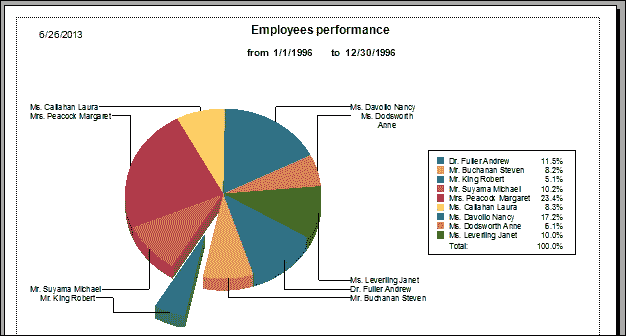

+   `btnGaugeChart` 按钮将显示一个仪表图表报告，展示员工与订单之间的关系。我们将使用`dtpFrom`和`dtpTo` DateTimePicker 中的数据来过滤数据，如下面的截图所示：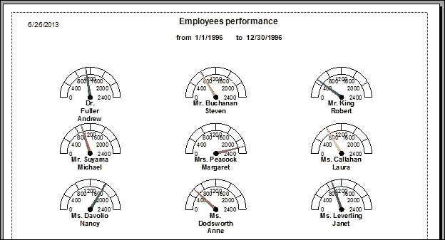

+   `btnAllInOne` 按钮将显示一个类似于以下截图的报告：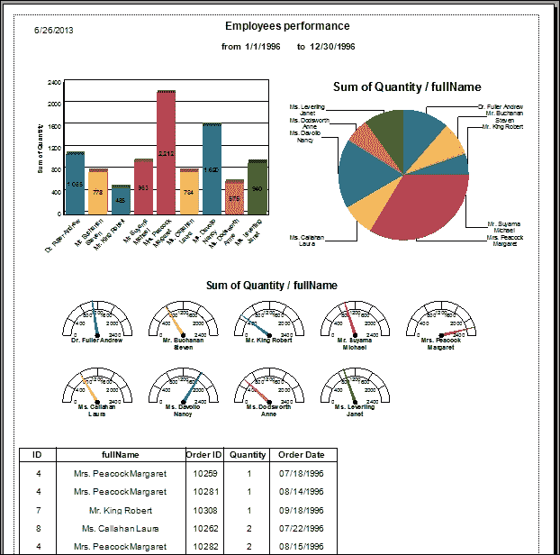

# 摘要

在本章中，我们讨论了应用程序的设计。该应用程序包含大多数 Crystal Reports 类型。在下一章中，我们将开始开发我们的应用程序。我们还将学习在创建报告之前如何选择需要显示的数据。
