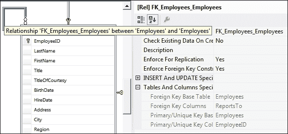

# 第四章 创建第一个报告

在本章中，我们将看到如何创建一个简单的报告并在我们的应用程序中显示这个报告。我们将首先准备报告数据并将这些数据连接到我们的报告。然后我们将制定我们的报告数据并在我们的应用程序中显示生成的报告。

我们将涵盖以下主题：

+   准备报告数据

+   将报告添加到应用程序中

+   使用数据库专家

+   选择报告模板

+   创建报告部分

+   使用线条和框进行操作

+   使用特殊字段

+   将报告添加到表单中

# 准备报告数据

在我们开始将 Crystal Reports 添加到我们的应用程序之前，我们需要了解我们将要显示的数据以及在这个报告中将显示哪些数据。查看以下截图中的报告设计：

## 选择报告数据

正如我们在前面的截图中所看到的，所有报告数据都来自`Employees`表。**SELECT**查询将显示如下截图所示：

当我们将报告数据与通过查询检索到的数据进行比较时，我们会发现两个差异变化：

+   **全名**列：在报告中，**全名**列显示为一个部分，但在数据库中它由三个部分组成（**TitleOfCourtesy**、**FirstName**和**LastName**）。我们可以在`SELECT`查询或报告中解决这个问题。我们可以使用 SQL 查询通过加号（`+`）运算符将这三个字段合并为一个字段，如下截图所示：

+   **直接汇报**列：在报告中，**直接汇报**列显示为姓名，但正如我们在前面的截图中所看到的，它显示为数字。如果我们查看**Employee**表，我们会看到这个表有一个自连接关系，如下截图所示：

我们可以通过两种方式修改查询以显示名称而不是数字：

+   **使用子查询**：我们将更新查询以类似于以下截图：

+   **使用自连接**：我们将更新查询以类似于以下截图：

## 创建一个 TableAdapter

创建 TableAdapter 的步骤如下：

1.  从**解决方案资源管理器**中打开**DataSet1**。

1.  右键点击并导航到**添加** | **表适配器**。

1.  选择您的连接设置并点击**下一步**按钮。

1.  选择**使用 SQL 语句**选项并点击**下一步**按钮。

1.  按照前面的截图编写我们的选择查询，然后点击**下一步**按钮。

1.  在后续屏幕上点击**下一步**按钮，并在最后一个屏幕上点击**完成**按钮。

1.  按照以下截图更改您的适配器名称：

# 将报告添加到应用程序中

在本节中，我们将了解如何将 Crystal Reports 添加到我们的应用程序中，以显示数据库中的所有**员工**数据。

1.  在**解决方案资源管理器**中右键单击我们的应用程序（**监控器**），然后导航到**添加** | **新建项**。您将得到以下截图所示的结果：

1.  从左侧菜单中选择**报表**，然后从右侧选项中选择**Crystal Reports**。将名称更改为`crAllEmployees.rpt`，然后点击**添加**按钮。您将得到以下截图所示的结果：

1.  我们有三种创建报告的选项。从前面的截图中选择**标准**，并使用报告向导创建报告。我们将在后面的章节中解释其他方法。点击**确定**按钮以查看以下截图：

1.  在此步骤中，我们将选择我们之前创建的用于此报告的 TableAdapter。我们将展开**项目数据** | **ADO.NET 数据集** | **Monitor.DataSet1**，选择**Employees** TableAdapter，并将其移动到**选定表**列表中。然后点击**下一步**按钮，如图所示：

1.  在此步骤中，我们将选择需要在报告中显示的字段，我们可以在报告创建后随时添加/删除这些字段。选择所有必需的字段，将它们移动到**要显示的字段**菜单，然后点击**下一步**按钮以查看以下截图：

1.  在此步骤中，我们可以向报告中添加一个分组，但在此报告中我们不需要任何分组。我们将在其他报告中使用分组，并且我们将在创建报告后看到可以添加任何分组。点击**下一步**按钮以查看以下截图：

1.  在此步骤中，我们可以向报告中添加过滤器，但在此报告中我们不需要任何过滤器。我们将在其他报告中使用过滤器，并且可以在报告创建后添加任何过滤器。点击**下一步**按钮以查看以下截图：

1.  在此步骤中，我们将选择报告样式。您可以浏览可用的样式并选择您喜欢的样式。我们将选择**标准**样式并点击**完成**按钮，以查看以下截图：

1.  本报告包含五个主要部分：

    +   **第一部分（报告页眉）**：在此部分插入的任何数据（文本、图像等）将在报告的第一页顶部仅显示一次

    +   **第二部分（页面页眉）**：在此部分插入的任何数据（文本、图像等）将在报告每一页的页眉中显示

    +   **第三部分（详细信息）**：本节显示来自包含多行返回结果的数据源的数据，例如我们示例中的 Microsoft SQL Server。

    +   **第四部分（报告页脚）**：在此节中插入的任何数据（文本、图像等）将在报告最后一页的末尾仅显示一次

    +   **第五部分（页面页脚）**：在此节中插入的任何数据（文本、图像等）将在报告每一页的页脚中显示

1.  我们需要在报告的**报告页眉**部分添加**所有员工**文本作为标题，因此我们将将其添加到**报告页眉**部分：

    1.  右键点击**第二部分（报告页眉）**并导航到**插入** | **文本对象**。

    1.  双击**文本对象**并输入`所有员工`。

    1.  右键点击**文本对象**并选择**格式对象**，导航到**字体**选项卡，将**样式**更改为**粗体**并将**大小**更改为**12**。导航到**段落**选项卡，将**对齐**更改为**居中**并点击**确定**按钮。

    1.  将**文本对象**移动到节区的水平中间。

1.  我们将格式化所有报告对象和字段，就像我们对**所有员工****文本对象**所做的那样，以便报告看起来像以下截图：

# 处理线条和框

在本节中，我们将看到如何使用框和线条来增强我们的报告设计。

1.  右键点击**第二部分（页面标题）**并导航到**插入** | **框**，然后按照以下截图所示绘制一个围绕我们字段的框：

1.  右键点击**第二部分（页面标题）**并导航到**插入** | **线条**，然后绘制如图所示的线条：

1.  在字段之间添加一些线条，如图所示：

# 使用特殊字段

在 Crystal Reports 中，有许多特殊字段我们可以用于我们的报告；在本节中，我们将看到如何使用这些特殊字段。

我们需要在页面页脚中添加页码和总页数以显示页码在总页数中的位置。为此目的的步骤如下：

1.  在我们的报告中右键点击并导航到**字段资源管理器**。

1.  从**字段资源管理器**，打开**特殊字段**节点并将**页码/总页数**拖到**第五部分（页面页脚）**。当运行报告时，**页码/总页数**特殊字段将用页码替换**N**，用总页数替换**M**。请参见以下截图：

# 将报告添加到表单中

在前面的步骤中，我们已经完成了报告设计；下一步是在用户点击**btnEmpAll**按钮时显示此报告。

1.  首先，我们将添加一个表单，我们将使用该表单来显示所有报告；我们将此表单命名为`ReportForm`。

1.  从**工具箱** **|** **报告**，拖放**crystalReportViewer**到**ReportForm**并命名为`crystalReportViewer1`。

1.  双击**btnEmpAll**按钮导航到之前的代码。我们将看到**btnEmpAll**按钮的`click`事件。

1.  在按钮**btnEmpAll**的`click`事件中，输入以下截图所示的代码：

1.  此代码有三个部分：

    +   **准备报告数据**：在前三行代码中，我们通过 TableAdapter（**EmployeesTableAdapter**）填充数据集。

    +   **将数据传递给我们的报告**：在接下来的两行代码中，我们在用数据填充数据集之后将数据集传递给我们的报告。

    +   **在表单中显示报告**：在最后三行代码中，我们将我们的报告传递给**ReportForm**中的**crystalReportViewer1**并打开这个表单来显示我们的报告。

1.  运行我们的应用程序（按*F5*键）并点击**btnEmpAll**按钮（**全部**）来查看我们的报告，如图所示：

# 摘要

在本章中，我们学习了如何创建一个简单的报告并在我们的应用程序中显示这个报告。我们看到了如何将报告连接到数据库以及如何在报告中显示和格式化数据。在下一章中，我们将创建新的报告来学习数据分组和排序。我们还将学习如何使用参数来过滤表数据。
