# 第六章。处理交叉表报表

在本章中，我们将看到 Crystal Reports 中最重要的一种类型：交叉表报表。它是 Crystal Reports 中最强大的工具之一。交叉表报表用于有效地汇总数据，正如我们将在本章中所见。

我们将涵盖以下主题：

+   创建交叉表报表

+   使用交叉表专家自定义交叉表外观

+   进行页面设置

交叉表报表对用户非常有用，因为它以简单的方式汇总了大量信息，从而为用户提供所需的信息。我们可以看到最终报表，如下面的屏幕截图所示：

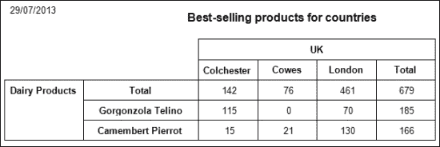

正如我们在前面的屏幕截图中所见，该报表显示了每个城市的订单产品总和。在我们的应用程序中，用户将选择产品类别和国家。报表将显示前面屏幕截图中的结果。

# 创建我们的报表

因此，让我们开始创建我们的报表：

1.  我们在报表中将使用的 SQL 查询如下所示：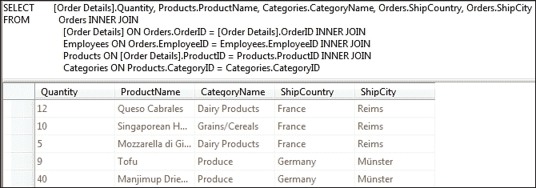

1.  我们将使用此 SQL 查询创建一个新的 TableAdapter，并将其命名为`ProductsOrdersTableAdapter`，如下面的屏幕截图所示：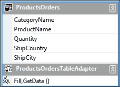

1.  将一个新的水晶报表添加到我们的应用程序中，并将其命名为`crProductsOrders`。正如我们在下面的屏幕截图中所见，我们可以通过选择**使用报表向导**选项，然后选择**交叉表**作为专家，来创建我们的报表，或者我们可以选择**作为空白报表**，然后我们将在报表本身中添加交叉表。我们将选择第二个选项，以便在创建报表后随时添加或修改我们的交叉表，因此我们将选择**作为空白报表**，如下面的屏幕截图所示：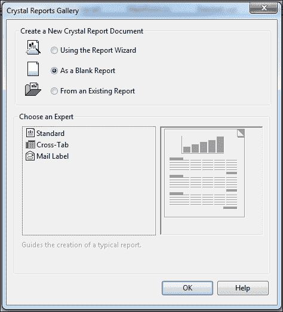

1.  在**字段资源管理器**中的**数据库字段**上右键单击，并选择**数据库专家**，然后出现一个窗口，如下面的屏幕截图所示。如下所示，我们将选择我们的 TableAdapter **ProductsOrders**作为数据源：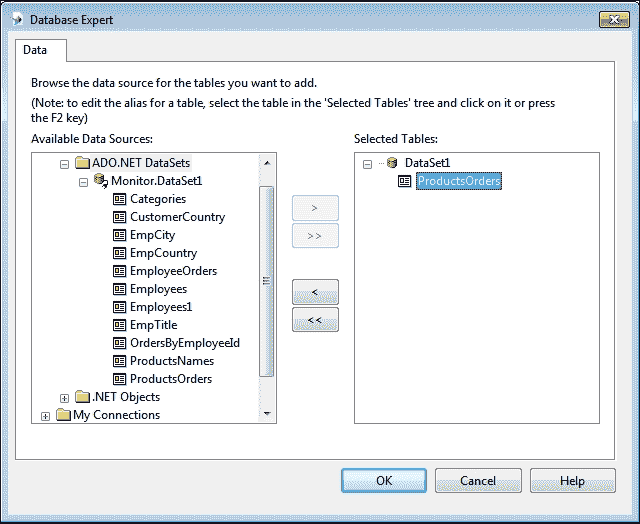

1.  在报表上右键单击，导航到**插入** | **交叉表**，并将其拖到**Section1（报表页眉）**。正如我们在下面的屏幕截图中所见，我们将**ShipCountry**和**ShipCity**添加到**列**列表中，**CategoryName**和**ProductName**添加到**行**列表中，**Quantity**添加到**汇总字段**列表中。从**样式**选项卡中，我们可以选择任何样式，但首选原始样式。我们将在接下来的几个步骤中看到如何使用**自定义样式**选项卡。单击**确定**按钮。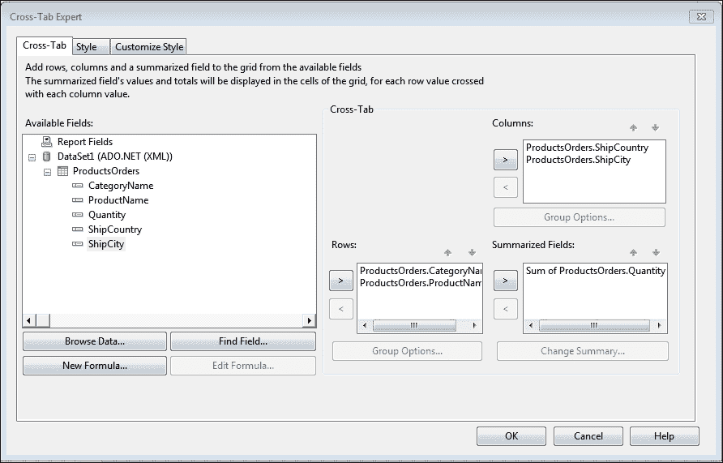

1.  到目前为止，我们的报告显示了所有产品和国家，因此我们将添加两个参数字段来通过产品类别和运输国家筛选报告数据。第一个参数字段是**pmCountry**，第二个是**pmCategory**。请参阅以下截图：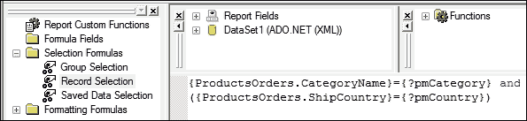

1.  在报告中添加一个文本对象作为报告标题，并在其中输入`畅销产品`。

1.  进入我们应用程序的主表单，双击**btnProductsOrdersByFilters**（**按筛选器**）按钮以导航到代码背后，并编写代码以在我们的应用程序中显示报告，如图所示：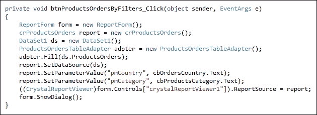

1.  运行应用程序以测试结果。从**类别**列表中选择**乳制品**，从**国家**列表中选择**英国**，如图所示。点击**按筛选器**按钮以显示报告。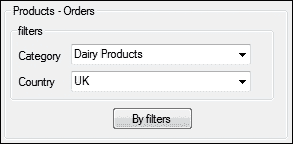

1.  报告将如下截图所示：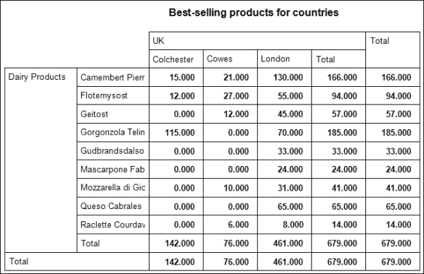

# 自定义交叉表外观

在接下来的几个步骤中，我们将看到如何更新报告以类似于本章开头的设计。

如前一个截图所示，最后两列和最后两行有相同的日期，因此我们将在我们的报告中隐藏最后一列和最后一行。

1.  在交叉表的左上角右键单击，选择**交叉表专家**，然后导航到**自定义样式**选项卡。我们将选择以下截图中所见的**抑制行总计**和**抑制列总计**复选框。点击**确定**按钮。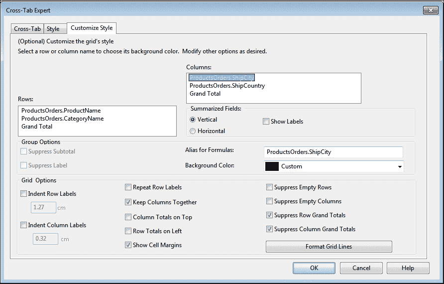

1.  运行应用程序以测试结果。它看起来如下截图所示：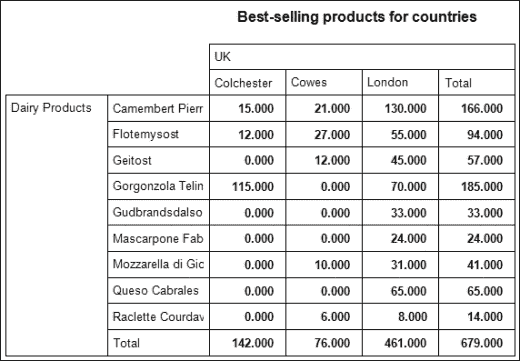

1.  在这个报告中，我们可以看到显示的产品数量比我们在本章开头设计的报告中看到的多。因此，我们需要根据订单数量对产品进行排序。

1.  在本章开头设计的报告中，我们只显示了订单率最高的两个产品，因此报告标题是**各国畅销产品**，而不是所有产品。在下一步中，我们将看到如何控制我们报告中显示的产品数量。

1.  在交叉表的左上角右键单击，选择**分组排序专家**，然后导航到以下截图所示的**ProductsOrders.ProductName**选项卡：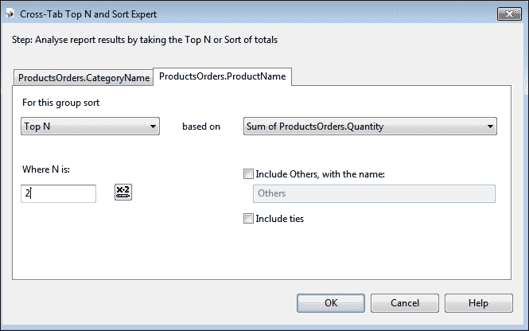

1.  我们将从**为此组排序**列表中选择**Top N**值，并在**N 在哪里**文本框中输入`2`以在交叉表中仅显示两个产品。点击**确定**按钮并运行应用程序以查看以下截图所示的结果：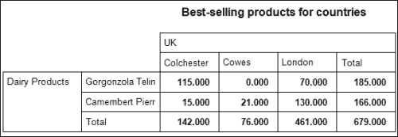

1.  如果我们将这个报告与本章开头设计的报告进行比较，我们会发现它们之间除了文本和数字的格式外没有区别。您可以按照您的需求进行格式化。

1.  在下一步中，我们将看到如何更改网格线的格式和单元格的背景颜色。

1.  右键点击交叉表的左上角，选择**交叉表专家**并导航到**自定义样式**选项卡。正如我们在下面的屏幕截图中所见，我们将选择要更改背景颜色的行或列，并选择要应用的颜色。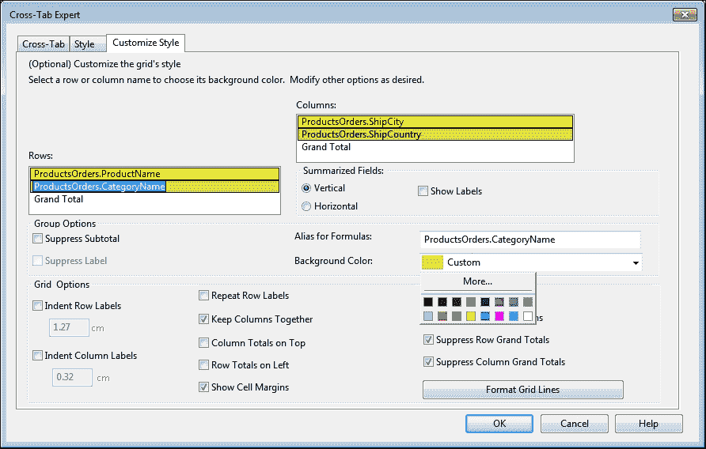

1.  点击**格式化网格线**按钮，将交叉表线条格式化，如图所示。选择线条。线条颜色、样式或宽度可以按需更改。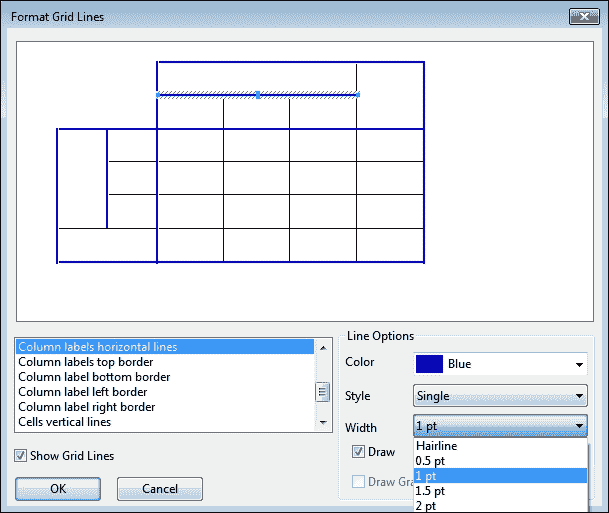

1.  点击**确定**按钮保存更改并运行应用程序以测试新的外观。这如图所示：

1.  如果用户需要向特定国家显示所有类别的产品，并且能够通过产品类别过滤数据，会怎样？

1.  我们将进行一个小改动以应用这个请求：我们将更改报告中的参数条件，如图所示：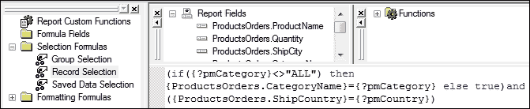

1.  当用户在类别列表中写入字符串`ALL`时，报告将显示所有类别。运行应用程序并测试更改，结果将如图所示：

# 执行页面设置

当我们使用交叉表时，我们需要注意页面大小，因为报告的宽度会动态增长。如果我们尝试通过输入值`USA`来测试交叉表，我们会看到报告被分成两部分，如图所示：

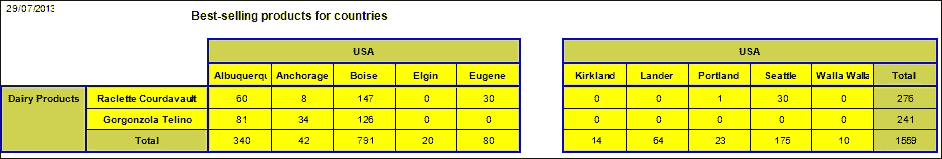

这个问题发生是因为我们的数据库中`USA`值对应的城市有很多，我们的报告设计为以竖排信纸形式显示和打印。我们可以通过右键点击报告并导航到**设计** | **页面设置**来更改基本页面设置。如图所示。页面大小已更改为**A3**，方向为**横幅**。

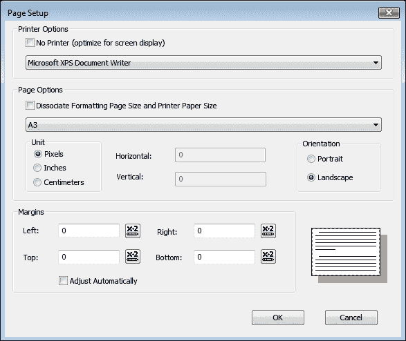

如果我们再次通过输入值`USA`进行测试，结果将类似于以下屏幕截图：

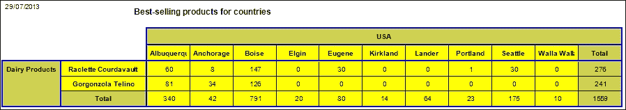

# 摘要

在本章中，我们看到了交叉表有多有用。我们学习了如何创建交叉表报告并使用交叉表专家来控制交叉表的每个部分。在下一章中，我们将看到 Crystal Reports 中的另一个神奇工具；我们将看到如何创建包含图表的报告。
