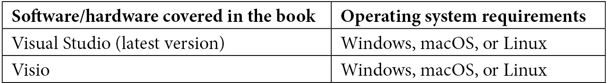

# 前言

在我们快速发展的数字化世界中，由数字化转型驱动，解决方案架构师是具有特定技能集和广泛技术专长的最重要专家，他们能够在业务需求和技术解决方案之间取得平衡。本书的目的是通过实践方法让你对 .NET 解决方案架构有一个广泛的理解，帮助你成为一名有效的解决方案架构师。

本书涵盖了软件开发生命周期（**SDLC**）的原则、.NET 解决方案架构师的职责和成为一名优秀的 .NET 解决方案架构师的条件。随着你阅读章节的深入，你将了解解决方案架构的关键原则以及如何设计解决方案、探索设计层和微服务。

你将通过揭示设计和构建数字解决方案的现代架构模式和技术的学习之旅完成你的学习。

在本书结束时，你将学会如何使用 ASP.NET Core 和 Microsoft Azure 架构你的现代网络解决方案，并准备好使用 Azure DevOps 自动化你的开发生命周期。

# 本书面向的对象

本书面向中级和高级 .NET 开发人员和软件工程师，他们希望提升自己的职业生涯并扩展对解决方案架构和设计原则的知识。寻找构建大型 .NET 解决方案技巧和窍门的初学者或中级解决方案架构师也会发现本书有用。

# 本书涵盖的内容

*第一章*, *软件开发生命周期原理*，帮助你理解软件开发生命周期的概念和原则是规划软件产品的良好起点。本章旨在解释 SDLC 的概念、阶段和方法。

*第二章*, *团队角色与职责*，主要关注典型软件开发团队中的主要角色及其相应的职责。一个软件项目成功的关键因素之一是确保开发团队的关键利益相关者都到位。项目的成功也取决于团队协作的好坏。

*第三章*, *成为一名优秀解决方案架构师的条件是什么？*，更详细地阐述了成为一名优秀解决方案架构师所需具备的个人素质。

*第四章*, *设计解决方案架构*，通过探讨解决方案架构的关键原则和推荐用于设计中到大型解决方案的最流行的**统一建模语言**（**UML**）图来关注解决方案架构实践。

*第五章*, *探索架构设计模式*，讨论了现代架构模式及其示例用例。此外，我们还将解释应采用哪些标准来为我们的软件解决方案选择正确的架构模式。

*第六章*, *架构考虑因素*，探讨了设计质量属性以及如何正确规划缓存、异常处理和部署。

*第七章*, *保护 ASP.NET Web 应用程序*，探讨了在设计解决方案时需要考虑的安全因素，并在此背景下查看最佳实践。

*第八章*, *在解决方案架构中进行测试*，探讨了不同类型的测试，包括单元测试、压力测试和自动化测试。

*第九章*, *使用 ASP.NET Core 和 Azure 构建现代 Web 解决方案*，帮助您学习如何使用 ASP.NET Core 构建跨平台现代 Web 解决方案，以充分利用其功能。在 Azure 中托管使用 ASP.NET Core 构建的应用程序，与传统替代方案相比具有许多竞争优势。ASP.NET Core 优化了现代 Web 应用程序开发实践和云托管场景。

*第十章*, *设计和实现 Microsoft DevOps 解决方案*，帮助您学习如何利用 Azure DevOps 通过现代软件开发实践构建、测试和部署应用程序。此外，我们将了解如何管理源代码控制，并探索使用 Azure Artifacts 的包管理，以及理解持续集成/持续部署实践。

# 为了最大限度地利用这本书

在您开始阅读本书之前，应确保满足以下一些要求：

+   您应该是一个中级或高级的 .NET 开发者。

+   您应该具备一些关于 Microsoft Azure 的基本知识。



# 下载彩色图像

我们还提供了一个包含本书中使用的截图和图表彩色图像的 PDF 文件。您可以从这里下载：[`static.packt-cdn.com/downloads/9781801075626_ColorImages.pdf`](https://static.packt-cdn.com/downloads/9781801075626_ColorImages.pdf)。

# 使用的约定

本书使用了多种文本约定。

`文本中的代码`: 表示文本中的代码单词、数据库表名、文件夹名、文件名、文件扩展名、路径名、虚拟 URL、用户输入和 Twitter 用户名。以下是一个示例："通过在控制器类或非匿名操作中添加 `[Authorize]` 属性，在 MVC 中应用授权相当简单。"

代码块应如下设置：

```cs
[Authorize(Users = "john,tim")]
public IActionResult EditContent() 
{ 
 return View(); 
}
```

任何命令行输入或输出都应如下编写：

```cs
Request URL:http://TheWebsiteUrl/register
Request Method:POST
Status Code:200 OK
firstname:John
```

**粗体**：表示新术语、重要词汇或您在屏幕上看到的词汇。例如，菜单或对话框中的单词会以粗体显示。以下是一个示例：“如图所示，我们首先需要设置应用程序中使用的**域名**。”

小贴士或重要注意事项

看起来是这样的。

# 联系我们

我们欢迎读者的反馈。

**一般反馈**：如果您对本书的任何方面有疑问，请通过电子邮件发送至 [customercare@packtpub.com](https://customercare@packtpub.com)，并在邮件主题中提及书名。

**勘误**：尽管我们已经尽最大努力确保内容的准确性，但错误仍然可能发生。如果您在这本书中发现了错误，我们将不胜感激，如果您能向我们报告，我们将不胜感激。请访问 [www.packtpub.com/support/errata](https://www.packtpub.com/support/errata) 并填写表格。

**盗版**：如果您在互联网上发现我们作品的任何形式的非法副本，我们将不胜感激，如果您能提供位置地址或网站名称，我们将不胜感激。请通过电子邮件发送至 [copyright@packt.com](https://copyright@packt.com) 并附上材料的链接。

**如果您有兴趣成为作者**：如果您在某个领域有专业知识，并且对撰写或参与书籍的编写感兴趣，请访问 [authors.packtpub.com](https://authors.packtpub.com)。

# 分享您的想法

一旦您阅读了《.NET 解决方案架构》，我们很乐意听到您的想法！请点击此处直接进入此书的亚马逊评论页面并分享您的反馈。

您的评论对我们和科技社区都很重要，并将帮助我们确保我们提供高质量的内容。
