# 第一章：*第一章*：软件开发生命周期的原则

在现代数字工作场所，.NET 解决方案架构师在软件开发生命周期中的作用变得越来越关键。拥有能够设计和构建强大且高效解决方案的技术领导者和解决方案创造者，是成功交付产品的关键因素。

本书将突出您作为.NET 专业开发者需要了解的基础知识，以便在这个不断增长和快速变化的领域中成为一名有效的解决方案架构师。

理解软件开发生命周期（SDLC）的概念和原则是规划软件产品的良好起点。本章旨在解释 SDLC 的概念、阶段和现代方法。

在本章中，我们将涵盖以下主题：

+   理解什么是软件开发生命周期（SDLC）

+   探索不同的软件开发生命周期（SDLC）阶段

+   熟悉流行的 SDLC 模型

在本章结束时，您将能够描述软件开发生命周期的阶段，并解释流行的 SDLC 模型之间的区别，例如**Scrum**、**螺旋模型**和**DevOps**。

# 理解软件开发生命周期

在当今的数字世界中，每家公司都希望在一个较短的时间内交付高质量的软件产品，这意味着开发团队的效率和速度是改变游戏规则的因素。为了实现这一目标，公司必须应用一系列定义明确的活动和结构化阶段，这些活动和阶段定义了**软件开发生命周期**，也称为**SDLC**。

软件开发生命周期（SDLC）是一种工作方法和最佳实践的方法论，旨在简化软件开发过程，使其更加高效，确保最终产品在项目预算内按时交付，并且完全符合客户的期望。

软件开发生命周期（SDLC）有不同的变体和模型，例如**瀑布模型**、**螺旋模型**和**敏捷模型**。它们在大多数软件开发组织中都很受欢迎，并且被广泛使用。选择正确的模型主要取决于项目的规模和其他因素。在接下来的几节中，我们将详细探讨这些模型，以帮助您决定哪种模型适合您的团队和项目。

下面是 SDLC 过程中定义的六个阶段：

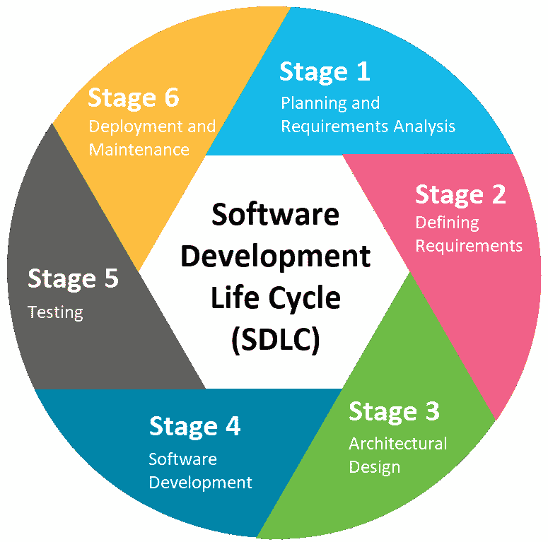

图 1.1：软件开发生命周期的六个阶段

我们刚刚概述了软件开发生命周期及其重要性。在下一节中，我们将探讨软件开发生命周期过程的各个阶段。

# 探索不同的软件开发生命周期（SDLC）阶段

*SDLC 中的主要活动有哪些？* 无论你选择哪种模型来实施你的产品，都存在六个不同的阶段，这些阶段被认为是大多数现有模型中的常见阶段。然而，根据模型的不同，这些阶段可以是顺序执行或并行执行。通过执行这一系列阶段，预期可以避免典型的和昂贵的陷阱，并实现以下目标：

+   成本降低

+   整体质量提升

+   缩短生产时间

+   优秀的客户满意度

让我们探索这些阶段，因为理解它们对于解决方案架构师非常重要，他将参与所有这些阶段。另一方面，了解这些阶段对于组织并促进产品的开发，以及使整个开发过程更加透明也是必要的。我们将在以下各节中了解每个阶段。

## 规划和需求分析

由于需求分析是第一个阶段，它是 SDLC 中最重要和最基本阶段。此阶段从识别客户的利益相关者开始，然后进行多次会议和研讨会，以定义期望并收集需求。

此阶段由业务分析师、项目经理和团队的高级技术成员执行。他们与客户进行会议和研讨会，以收集所有功能和非功能需求，例如构建产品的目的、它将解决的问题、它将如何提高工作效率、它将在功能和服务的哪些方面包含，目标受众或最终用户是谁、识别用户旅程、详细用例和测试用例、硬件要求、备份策略和故障转移流程。

**规划**是创建一个详细但高级的计划的过程，说明每个项目模块或任务如何以及何时开发。目标是确定任务及其依赖关系，以及每个任务的预期输出。这应该与需求分析中定义的客户期望保持一致。

在此阶段之后，团队中的每个人都应该对项目的范围有一个清晰的了解，包括其预算、资源、截止日期，以及可能的风险和质量保证需求。这将与客户共享，以使他们对项目的执行保持一致，并为他们提供更好的透明度。

让我们看看在执行需求分析阶段时通常使用的不同技术和活动：

+   **用例**：这是一种广泛使用的有效技术，用于捕获用户需求。它允许我们识别系统要实现每个功能的可能流程，以及它将如何与最终用户交互。您可能会想知道，“我应该写多少个用例？”这个问题一开始可能听起来很难，但这个简单问题的答案是写下尽可能多的用例，以确保您涵盖了系统应包含的所有可能动作和功能。

    以下是用例的常见部分：

    a. 用例名称

    b. 摘要描述

    c. 参与者

    d. 前置条件

    e. 后置条件

    f. 级别

    g. 利益相关者

+   **业务流程建模符号**（**BPMN**）：这是全球范围内用于创建使用符号和元素描述和记录业务序列的图表。如果您正在实施业务自动化流程或产品包含如审批周期等业务工作流，则建议使用此技术。

    这里是 **Visio** 中 BPMN 图的基本形状：

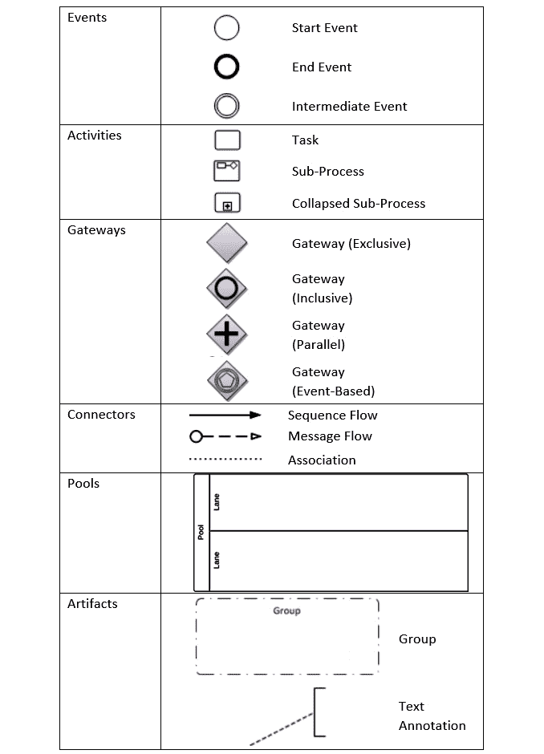

图 1.2：BPMN 图的基本形状

+   **统一建模语言**（**UML**）：UML 用于创建流程图和图表，以可视化和记录软件组件，如类和接口。UML 是一种良好的设计实践，也是创建面向对象软件的非常有用的技术；它帮助软件开发人员对任何复杂的软件架构进行建模和沟通：

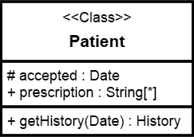

图 1.3：示例类图

+   **流程图技术**：这是另一种用于描述顺序和逻辑流程不同步骤的图形表示方法。在下面的图中，我们有一个示例流程图，用于结账过程。绿色框表示用户在结账并收到确认之前尝试将项目添加到结账购物车时的起点。红色框代表流程的结束；即，其完成：

图 1.4：示例流程图

+   **数据流图**（**DFD**）：一图胜千言。您可以使用 DFD 可视化表示数据在系统中的流程或服务中的流动方式。此图用于识别和描述输入数据及其如何通过系统移动到其存储位置并形成输出数据。以下是一个描述采购订单流程数据流的示例 DFD 图：

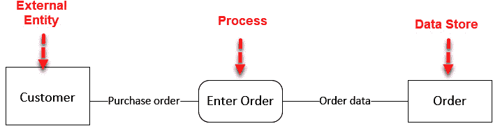

图 1.5：示例数据流图

+   **角色活动图**（**RAD**）：这是对系统中每个可能动作的角色导向表示。它用于轻松描述和可视化参与执行系统中每个流程或服务的不同角色。以下是一个描述自动柜员机交易并展示每个关键角色所完成步骤的样本角色活动图：

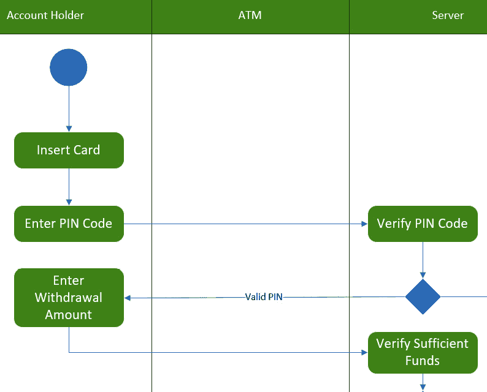

图 1.6：样本角色活动图

+   **甘特图**：这些用于项目管理，以协助规划和调度各种规模的项目。它们提供了任务、交付日期以及每个任务的顺序和依赖关系的视觉表示。

    这使得执行计划对客户来说更加简化和透明。以下是一个表示项目计划的样本甘特图。任务根据特定上下文分组，并通过前驱列、开始日期和结束日期链接：

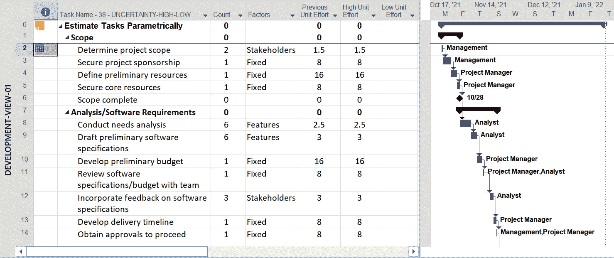

图 1.7：样本甘特图计划

+   **差距分析**：这是一种帮助比较系统当前实际结果与客户在项目早期阶段期望的技术。它有助于指出系统中任何缺失的战略能力或特性。它还应推荐你可以采取的改进方式，以帮助客户实现他们的初始目标。以下是一个可以用于进行差距分析练习的样本模板：

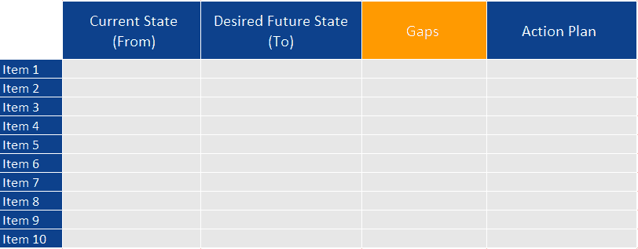

图 1.8：样本差距分析模板

+   **构建原型**：构建一个原型，或一个**最小可行产品**（**MVP**）模型，将使最终用户对产品最终版本的外观有一个概念，一旦所有功能都得到实现。使用这种技术，你可以识别在实际上实施产品时可能遇到的任何可行性挑战。

在执行分析时，考虑将需求分为以下三个类别：

+   **功能需求**：这些代表系统所有详细的功能和特性。它们对于开发团队来说非常重要，以便了解要实现什么，对于客户的利益相关者来说也非常重要，以帮助他们就产品的最终结果达成一致。

+   **操作需求**：这些定义了产品正常运行所需的场景和性能衡量标准，以及相关的需求，以符合客户的期望。这包括以下内容：

    a. 建立关键和期望的用户性能

    b. 定义约束

    c. 建立所需的基础设施

    d. 建立有效性衡量标准

+   **技术需求**：这些描述了必须满足的技术部分，以便轻松且成功地部署产品，并使其按照客户的期望具有良好性能。这包括将要使用的技术、技术架构、硬件、第三方集成、测试和部署计划。

在这个阶段应考虑以下几点：

+   在需求收集阶段的主要挑战之一是，客户的每个利益相关者都从自己的角度看待产品。为了项目的成功，请考虑倾听并捕捉所有用户的观点，并在用户故事或用例中记录下来。这将帮助您确定产品的完整面貌以及它将提供哪些功能。

+   在与客户的第一次会议中，尝试识别不同的利益相关者，并讨论工作范围，以便让所有各方都清楚。之后，您将需要与所有利益相关者会面，收集详细的需求。在这些研讨会中，确保您将所有讨论都保持在设定的范围内。这对于保持需求与业务需求一致，以及避免添加产品从未预期提供的功能非常重要。

到目前为止，我们已经探讨了我们可以用于规划和执行需求分析研讨会不同活动和技术的不同方法，这对于项目的成功至关重要。在下一节中，我们将学习如何记录需求。

## 定义需求

在完成需求分析研讨会之后，下一步是记录之前收集到的所有信息，以定义产品需求。通常，这一活动的输出结果是**软件需求规格说明书**（**SRS**）文档，它包含了在整个项目所有阶段中需要设计和开发的所有详细需求，从项目开始到结束，直到交付所需的产品。这个 SRS 成为将用于开发产品的**需求合同**。它将解决客户的所有业务需求。

一旦 SRS 文档被所有参与项目的各方最终确定并审查，请确保将其发送回关键利益相关者或关键利益相关者的代表，以签署它。签署 SRS 的目的是同意文档中呈现和定义的需求是清晰的，并反映了在分析研讨会中讨论的业务需求。这种由所有参与方表达的形式承诺，在项目生命周期中将发挥关键作用，以确保项目在实施过程中不会出现**范围蔓延**。

重要提示：

在项目管理中，范围蔓延（或需求蔓延）指的是在项目启动后，客户持续要求更改并添加新功能到产品中的情况。结果，项目的范围将持续增长，这将影响交付时间和产品的最终成本。这种情况不应发生，为了防止它，你必须确保所有业务需求（即项目的范围）都非常详细且正确定义，并且客户已正式承诺工作范围。

一个 SRS 文档的基本大纲可能看起来像这样：

1.  引言

    1.1 目的

    1.2 预期受众

    1.3 预期用途

    1.4 范围

    1.5 定义和缩写

1.  总体描述

    2.1 用户需求

    2.2 设计和实现约束

    2.3 假设和依赖关系

1.  系统特性

    3.1 功能性要求

1.  外部接口要求

    4.1 用户界面

    4.2 软件接口

    4.3 硬件接口

1.  非功能性要求

    5.1 性能要求

    5.2 安全要求

    5.3 软件质量属性

随意使用这个大纲并根据您的需求进行修改，但请记住，本文档应描述产品需要实现的功能，以及技术规范。因此，它应该是简单、易于阅读和理解，以便项目利益相关者。在下一节中，我们将了解架构设计阶段。

## 架构设计

*我们将如何构建产品？* 这是一个关键问题，尤其是如果你正在构建一个复杂或大规模的产品，该产品将被广泛用户使用。

为了回答这个问题，我们需要开始**架构设计阶段**，这个阶段包括将前几个阶段中定义和记录的软件规范转换为一个称为**架构设计**的抽象设计规范计划。

这个阶段的开端是审查 SRS 文档，并理解需求中的每一个细节。这将帮助你创建最佳的架构设计，确保你交付高质量的产品。技术团队有责任在**设计规范文档**（**DDS**）中记录他们的设计。本文件的预期受众是设计师、软件开发人员和 QA 测试人员。

本文档的目的是提供一个全面的架构概述，并描绘系统组件的所有技术细节。更具体地说，它应该包括以下内容：

+   系统架构、组件、类及其属性和方法

+   数据库的设计，包括表和字段的定义，以及表之间的关系

+   图形界面设计

+   硬件或软件环境

+   最终用户环境

+   安全要求

+   性能要求和容量限制

本 DDS 由所有关键技术利益相关者进行审查。基于设计模块化、性能、安全性、容量限制、风险、预算和时间限制等因素，选择最佳设计方法来构建产品。

一个 DDS 文档的基本大纲可能看起来像这样：

1.  引言

    1.1 目的

    1.2 范围

    1.3 设计目标

    1.3.1 可维护性

    1.3.2 优化性能

    1.3.3 设计友好

1.  系统概述

    2.1 算法

    2.2 使用的技术

    2.3 架构图

    2.4 数据库设计

1.  设计考虑

    3.1 假设和依赖

    3.2 一般约束

    3.3 目标和指南

    3.4 开发方法

1.  架构策略

    4.1 策略-1 名称或描述

    4.2 策略-2 名称或描述

    4.3 ...

1.  系统架构

    5.1 组件-1 名称或描述

    5.2 组件-2 名称或描述

    5.3 ...

1.  政策和策略

    6.1 政策/策略-1 名称或描述

    6.2 政策/策略-2 名称或描述

    6.3 ...

1.  详细系统设计

    7.1 模块-1 名称或描述

    7.2 模块-2 名称或描述

    7.3 ...

1.  可追溯性

1.  术语表

1.  附录

您可以使用这个大纲来描述您的架构并准备 DDS 文档。您做得越清晰、越详细，在实施和测试阶段对开发者和测试者就越有利。接下来，我们将探讨开发阶段。

## 软件开发

在 SDLC 的这个阶段，软件开发者开始实际开发产品。所使用的技术、编程语言，包括所有技术标准，应与 DDS 文档中同意的内容一致。记住，当设计规范详细且以适当的方式组织时，开发活动可以非常顺利地完成。

## 测试

*我们得到了我们想要的东西吗？* 在将产品推向最终用户之前对其进行测试是必须的。这个阶段与开发阶段同时开始，此时开发者负责测试他们正在开发的内容。在这个时候，这只是基本的测试，并不能说产品已经准备好上线。

因此，一旦特定模块或整个功能集的开发活动完成，就应该进行官方测试周期。在此阶段，应进行多种类型的测试，每个功能都应该彻底测试，并且应将识别出的缺陷报告给开发者以修复。

质量保证团队可以使用 SRS 中记录的测试用例，或者他们可以参考用例来测试产品。建议在开发者发布产品新版本时运行测试用例，直到达到稳定版本。这是为了确保在之前的周期中报告的所有缺陷都已关闭。

## 部署和维护

软件开发者往往将大部分时间投入到产品的设计和开发活动中，这是好的。尽管它很重要，但我从几个项目中了解到这还不够。制定部署和维护的战略计划是产品成功的关键因素。

在这个阶段，重点是使产品对最终用户可用，以便他们可以开始使用它。为此，产品应部署到生产环境。

首先，建议你在测试或预生产环境中部署产品。这就是应该进行**用户验收测试**（**UAT**）的地方。所有问题都将在此环境中解决并部署回来。一旦产品达到一个稳定版本，被客户接受，并且满足之前阶段批准的所有规格，产品就可以转移到生产环境。

重要提示：

用户验收测试是最后的测试环节。由客户执行，以验证软件提供的每个功能是否正常工作，并确认所有要求都已涵盖。这将确保软件的行为与用户期望的完全一致，并且他们可以轻松使用而不会出现任何错误或崩溃。在 UAT 结束时，客户应接受软件或在将软件转移到生产环境之前要求一些改进。

维护阶段在产品在生产环境中完全运行并得到客户确认后立即开始。从客户的角度来看，这是一个关键步骤，因为它确保他们的产品在部署后继续按设计运行。

### 维护类型

软件维护有四种类型：

+   **纠错性维护**：这主要用于纠正在使用系统时观察到的某些错误和故障，或提高系统的性能。

+   **适应性维护**：当客户请求在新的环境中运行软件，如新的硬件或新的操作系统时，可能需要这种维护。有时，客户请求将他们的产品从本地环境迁移到**Azure 云**。此外，它还可以涵盖将产品与第三方软件集成。

+   **完善性维护**：这种维护类型专注于在产品中实现新功能。这些功能可能是客户为了适应新的业务案例而请求的，或者是由已经开始与产品互动并注意到一些可以帮助他们工作并提高整体体验的缺失功能的使用者报告的。

+   **预防性维护**：这通常用于检测和纠正可能导致未来软件故障的错误。它有助于降低目前不显著但可能在未来造成严重问题的风险；例如，假设客户预计在两个月后将有更多的用户开始使用他们的产品，但当前的规格无法容纳这种负载。在这种情况下，提前规划和更新软件环境以服务由新用户引起的负载被认为是预防性维护。

让我们查看以下表格，了解何时以及为什么应该应用这些维护类型：

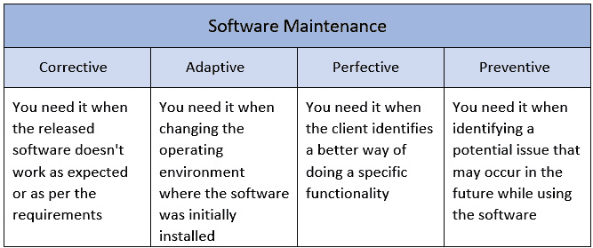

图 1.9：软件维护类型

在下一节中，我们将探讨软件维护与保修之间的区别。

### 维护与保修的比较

人们可能会对维护和保修感到困惑。软件保修是一种正式的法律保证，即产品将按照规格在一定的期限内正常工作。这是在保修期内免费修复系统中的任何错误或故障的承诺。

维护协议是针对长期和持续维护活动（如升级、更新或产品增强）出售给客户的。

我们刚刚解释了 SDLC 的不同阶段，并强调了每个阶段的预期输出。在下一节中，我们将概述流行的 SDLC 模型。

在本节中，我们探讨了 SDLC 的所有阶段，从规划和需求分析到部署和验收。在下一节中，我们将了解最流行的 SDLC 模型。

# 熟悉流行的软件开发生命周期（SDLC）模型

每个产品都需要一个合适的方法来开发它。通常，这个决定是基于多个因素，例如需求是否记录良好，需求是否不模糊，项目是否短小，等等。在本节中，我们将突出一些在软件开发中使用的最流行的模型。

## 瀑布模型

**瀑布模型**是一种直接且顺序化的软件开发方法。在进入下一个阶段之前，应该完成开发周期的每个阶段，并且通常，每个阶段的输出被认为是下一个阶段的输入。

下面是这个模型不同阶段的表示：

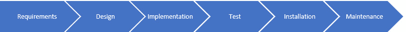

图 1.10：瀑布阶段

瀑布模型的一些优点如下：

+   阶段定义明确且易于理解

+   阶段有良好的文档记录

+   对于需求定义明确的较小项目，效果良好

该模型的一些缺点如下：

+   产品的工作版本将在开发周期的后期阶段交付。

+   对于复杂和持续的项目来说，这不是一个好的模型，因为利益相关者无法在开发过程的早期阶段提供反馈。

+   当需求变更风险较高时，这不是一个好的模型。

## 敏捷模型

**敏捷模型**，例如 Scrum，是最知名的开发方法之一，被许多 IT 组织广泛采用。它也应用于非技术项目。

此模型的方法是将产品分解成周期或迭代。每个迭代大约持续 2-4 周（通常，时间不应过长）。在每个迭代中，开发团队应交付一个完整的软件工作版本。想法是将用例分解成迭代，以便在迭代结束时得到产品的一个功能部分。这样，开发团队就可以产生持续的和增量发布，这些发布已经过良好的测试。

这种方法有助于团队早期识别和解决问题。它还涉及利益相关者在整个开发过程中，以获取他们的反馈。

以下图表是敏捷阶段的快速表示：

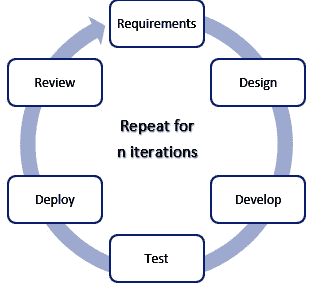

图 1.11：敏捷阶段

## 螺旋模型

**螺旋模型** 是迭代模型和瀑布顺序模型的结合。通常用于大型项目，它为每个迭代的早期阶段的风险处理提供支持。使用此模型，项目通过以下四个阶段：

+   通过收集业务需求来识别目标

+   进行风险评估

+   审查和评估

+   开发和测试

下面是描述螺旋模型的图表：

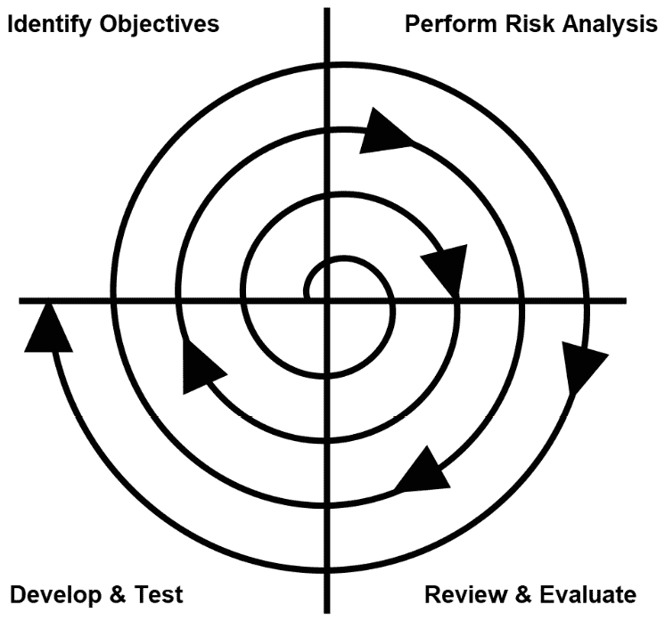

图 1.12：螺旋模型

在每个迭代中，你可以构建新功能和新功能的原型，这些功能将在本次迭代中交付。

这些阶段以 *螺旋* 形式重复，直到整个产品交付，允许进行多轮细化。

螺旋模型的优势如下：

+   此模型提供了风险存在的早期迹象。

+   首先开发关键高风险功能。

+   利益相关者与整个开发生命周期阶段紧密相连。

+   用户可以通过使用原型在早期阶段看到系统运行情况。

+   利益相关者可以尽早并持续地提供反馈。

螺旋模型的缺点如下：

+   此模型成本高昂，不推荐用于大多数情况下风险较低的小型项目。

+   管理过程相对复杂。

+   运行此模型需要风险评估的专业知识。

## DevOps 模型

在 **DevOps 模型** 中，开发人员和运维团队共同工作。你可能想知道，*这究竟意味着什么？*

使用我们之前讨论的传统模型，公司会将资源分割成处理特定责任的团队：

+   开发团队来架构和构建产品。

+   一个操作团队来准备环境和托管产品。

+   一个测试团队来准备测试用例，进行彻底的 QA 测试，并向开发团队汇报。

使用 DevOps 方法，开发团队和操作团队被要求在整个 SDLC 流程的各个阶段紧密合作——作为一个团队。一个成功的 DevOps 模型确保了持续的反馈，加速了部署，改善了开发过程，并自动化了手动流程。

这里展示的是 DevOps 模型中不同步骤的表示：

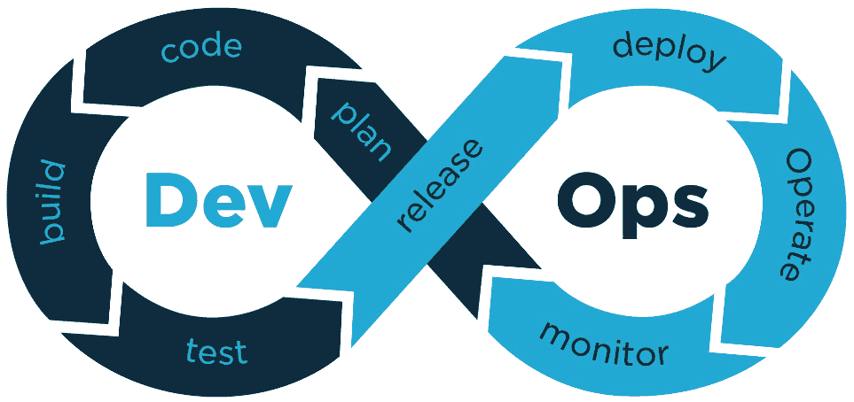

图 1.13：DevOps 模型

DevOps 模型的优势如下：

+   特性快速交付

+   更好地响应问题

+   高效的运营

+   减少瓶颈

+   更好的沟通和协作

+   更高效的团队成员，有更多时间进行创新

DevOps 模型的缺点如下：

+   DevOps 需要文化变革和新的沟通方式，这在传统环境中是一个巨大的挑战。

+   需要升级基础设施以优化流程，这对某些公司来说可能是昂贵的。

+   快速开发可能导致关键的安全漏洞。

现在，让我们学习如何选择正确的模型。

## 选择正确的模型

当选择合适的 SDLC 模型来构建特定产品时，重要的是要记住，每个模型都提供了一种独特的过程，这可能有助于你在开发周期中克服遇到的挑战。没有一个模型适合每个项目或每个客户的需求，这就是为什么你应该了解这些流行的模型，并知道何时应用它们。

选择正确的模型很大程度上取决于项目执行的因素，例如你当前的基础设施、你团队采用的文化以及客户希望如何管理项目。某些项目可能最好采用瀑布方法，而其他项目则可能从敏捷模型的灵活性中受益。

让我们看一下以下表格，它突出了选择产品正确模型时的主要因素：

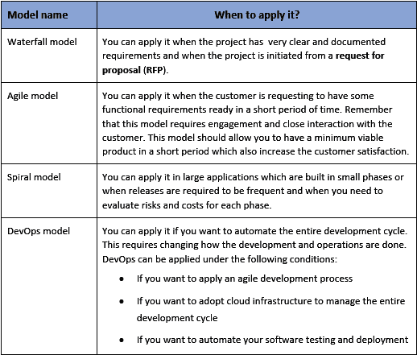

图 1.14：如何选择正确的 SDLC 模型

在本节中，你探索了最流行的 SDLC 模型。每个模型都提供了一种独特的方法，可以帮助你克服你在职业生涯中可能遇到的不同挑战。你还学习了如何为你的产品选择正确的模型。

# 摘要

在本章中，你学习了软件开发生命周期（SDLC）的定义及其重要性，以及它如何帮助组织以高效的方式交付产品。然后，你了解了 SDLC 的不同阶段、最流行的模型，以及它们的优缺点，以及如何为你的团队选择合适的模型。

在下一章中，你将学习不同的团队角色，以及它们的职责，以及它们如何融入 SDLC 流程和团队结构。
