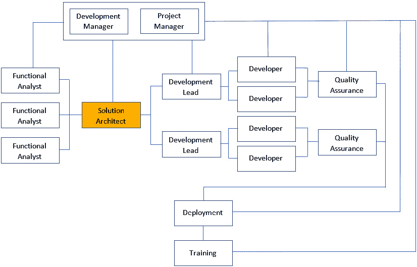

# 第二章：*第二章*：团队角色和职责

在上一章中，我们涵盖了软件开发生命周期的所有基本阶段。现在，让我们了解不同团队角色如何参与这些不同阶段的执行。

员工是组织最重要的资产之一。一个成功的软件项目的关键因素之一是确保开发团队的关键成员都到位。项目的成功也取决于团队如何协作以及沟通效率如何，以便提供最佳结果。本章重点关注典型软件开发团队中的主要角色及其相应的职责。

本章将涵盖以下内容：

+   探索开发团队层级

+   突出组建团队时需要考虑的五个关键属性

在本章结束时，你将了解软件开发团队中的典型层级结构以及每个成员应承担的职责。

# 探索开发团队层级

在许多情况下，客户会好奇为什么我们要分配不同的角色和专长来构建产品。确实，他们期望一个软件工程师的角色就足够了。本章旨在解答这一疑问，并强调每个成员在敏捷开发团队中扮演的特定角色，以便提供最佳性能。

通常，当你开始组建软件开发团队时，选择角色以及每个成员的责任取决于对以下两个问题的回答：

+   *你将开发什么类型的产品？*

+   *将采用哪种工作方法？*

以下图表显示了敏捷软件开发团队的关键职位。你会注意到我们突出显示了解决方案架构师职位；他们在技术和非技术团队之间扮演联络角色。这个人将设计解决方案的架构：

图 2.1：开发团队层级

让我们更深入地探讨团队中的每个角色及其职责。

## 项目经理——项目的教父

**项目经理**（**PM**）是一个有组织、注重细节且对项目估算技术有良好了解的人。项目经理负责了解项目的关键利益相关者，并有效地与他们沟通，以规划、安排时间表、准备预算、执行任务，并确保软件产品的交付和完成。

项目经理（PM）的职责和责任可能包括以下内容：

+   从需求分析到测试和维护的整个项目阶段规划

+   与客户协调确定项目将采用的方法

+   分配所有成功完成项目所需的资源，并确保他们拥有适当的软件工具和硬件环境以实施和测试项目

+   提出项目时间表并安排每个阶段的任务

+   通过分配任务给团队成员并确保他们按时完成，领导并监督项目每个阶段的成功执行

+   激励团队成员提供高质量的输出

+   制定项目预算并向高级管理层提供定期状态报告

+   确保团队成员充分理解需求，制定和传达变更请求，并确保输出与客户期望的一致性

接下来，根据团队层级，我们将检查功能分析师的角色。

## 功能分析师——探险家

**功能分析师**负责确保所有需求都与客户进行了彻底的讨论和分析。完成此操作后，需求将被捕获、正确记录并在任何开发活动开始之前清楚地传达给团队。

他们无论业务流程多么复杂，都发挥着将业务流程转化为技术团队能够开发的逻辑和功能需求的重要作用。他们的角色是弥合商业用户及其期望与开发团队之间的差距，开发团队负责构建产品。

这个角色可能有不同的名称，如需求分析师、系统分析师或商业分析师，但它们都或多或少地处理相同的职责。

功能分析师的一些职责包括以下内容：

+   与客户利益相关者、管理团队和商业用户会面，并收集需求

+   确定要构建的产品的主要目标

+   分析技术和商业需求并记录它们

+   确保需求得到适当的沟通和解释，以便开发团队

+   测试最终产品以验证目标并确保结果符合客户的商业目标和用户的需求

接下来，我们将探讨解决方案架构师的责任。

## 解决方案架构师——变革者

**解决方案架构师**负责领导技术设计和管理针对特定商业需求的解决方案的整体工程方面。

该团队成员应具备平衡的技术和商业技能组合，以便创建解决方案架构。

解决方案架构可能是一个多阶段过程，涉及一系列针对特定受众和商业目标的问题。因此，主要重点是分析和理解业务模型的所有部分，包括在早期阶段定义的所有需求。

然后，他们需要设计一个特定的解决方案，并介绍解决方案的整体技术愿景，该愿景应适合当前环境以及客户的期望。解决方案架构将传达给整个开发团队，然后他们将在设计规范和要求的基础上实施解决方案。

解决方案架构师的一些职责包括以下内容：

+   分析和理解需求，然后提出解决方案的架构设计

+   评估当前的技术和系统，以在要构建的产品和现有系统之间引入集成链接，以满足客户的需求

+   对所有利益相关者保持透明，并告知他们关于当前实施产品中存在的任何技术问题，然后提出解决方案

+   在评估其对最终产品可能产生的影响后做出技术决策

+   记录提出的解决方案，并监控所有请求的更新，以确保它们不会对解决方案的整体设计产生影响

+   推荐适合产品正常运行的正确硬件，并与 IT 专业人员协调，准备必要的环境以构建、测试和托管产品

+   应对常见的项目挑战，例如团队技能、沟通冲突、不明确的需求和不切实际的截止日期

+   提前识别可能的风险，以防止在实施过程中出现任何意外

+   与项目经理和团队领导协调，准备项目时间表和详细进度安排，这将作为估算所需工作的主要输入

+   协调开发人员和团队领导，以解决出现的技术问题

+   通过定期研究现有技术并向开发团队提出改进流程的更改和新技术来指导开发团队

此角色需要深入了解以下领域的专业技术知识和实践经验：

+   业务分析，通过将业务流程转化为功能用例来帮助理解和改进业务流程

+   IT 基础设施，推荐适合产品的正确环境

+   软件架构设计，为产品提出现代解决方案架构

+   云开发，开发和部署解决方案到云，以及在转向云时简化**SDLC**

+   **DevOps**以帮助改进敏捷开发生命周期

接下来，我们将了解开发主管的职责。

## 开发主管——技术达人

**开发主管**负责领导和支持开发人员实施产品的所有技术方面。然而，在开始开发之前，他们将与团队紧密合作，为所需工作提供准确的估计。项目经理将使用此评估来创建项目时间表，并为所有任务提供结构化的分解。

技术负责人应与项目经理有效沟通，提供开发活动的定期进度报告。另一方面，技术负责人还应与解决方案架构师沟通，以便及时以专业的方式解决技术问题、变更或冲突。

技术负责人的主要职责之一是确保与团队成员执行编码标准和最佳实践，并确保它们清晰且易于应用，以便开发的代码在任何时候都可以重用、可读和可扩展。

开发领导的一些职责包括以下内容：

+   管理日常任务和组织团队活动

+   举办技术培训课程，指导团队成员学习新技术和技巧，并确保他们应用统一的标准

+   评估团队绩效并提出改进和目标

+   持续倾听团队成员的反馈和关注点，以解决可能影响团队士气或工作进度的问题或冲突

+   激励团队成员提高他们的分析思维和创造力

+   提议和组织团队建设活动

+   发展团队优势，改进弱点

+   认可团队成就并与管理层协调以奖励成就

接下来，我们将探讨软件开发人员的职业道路。

## 软件开发人员——魔法大师

**软件开发人员**负责正确理解项目早期阶段定义的需求。然后，他们根据与项目经理和客户商定的进度表开始开发模块和功能。任何无法由团队领导澄清的需求模糊性应与功能分析师或解决方案架构师讨论。这对于降低项目风险和确保高质量的可交付成果至关重要，这将导致项目的成功。

软件开发人员有三条职业道路可以选择：

+   **前端开发**：在这种情况下，他们负责交付产品客户端块。通常，他们使用前端编程语言，如**HTML**和**JavaScript**。他们应熟练掌握**jQuery**、**CSS**（**SASS**或**LESS**）以及响应式框架，如 Bootstrap。在现代网络开发中，由于存在 JavaScript 框架，如 Angular、React 和 Vue，前端开发者非常受欢迎，这些框架用于构建单页网络应用程序：

    a. **Angular**：这是一个由 Google 的 Angular 团队开发的开源 JavaScript 框架。

    b. **React**：这是一个由 Facebook 的 React 团队开发的开源 JavaScript 框架。

    c. **Vue**：这是一个由前 Google 的**AngularJS**框架开发者 Evan You 创建的开源 MVVM JavaScript 框架。

+   **后端**：在这种情况下，他们负责开发产品的服务器端功能块，如 Web 服务或 Web API。他们还负责设计和创建数据库，包括所有 SQL 查询和事务。每个后端开发人员应具备的一些主要编程语言和技能包括以下内容：

    a. .NET C# (.NET Framework 和 .NET Core)

    b. ASP.NET MVC 和 Web API

    c. N 层架构

    d. Entity Framework 和 ADO.NET

    e. MSSQL 数据库和查询

    f. Azure Blob 存储空间、Azure 应用服务以及 Azure Functions

    g. 微软 Power Automate

    h. 在 Azure 上部署 Docker 容器

    i. HTML、JavaScript 和 jQuery 的知识

    j. 一个 JS 框架，如 React、Angular 或 Vue

    k. 单元测试

    l. 团队基础服务器或 Git 用于源代码控制和版本管理

    m. Azure DevOps 用于管理源代码或开发周期

+   **全栈**：这个角色是前两个轨道的组合。

软件开发人员的一些职责和责任包括以下内容：

+   根据需求、规范和编码标准研究、设计和实现干净高效的代码

+   与团队领导协调任务和日常日程

+   修复报告的问题，并具有提出解决方案的能力

+   在测试环境和生产环境中部署和测试产品

+   提供专业的代码文档，并支持用户指南文档的准备

+   为提高质量和整体性能，参与代码审查会议。

+   根据需要，向团队领导提供每日或每周的状态报告。

+   与团队领导协调解决任何需要高级专业知识才能解决的问题。

接下来，我们将学习 QA 工程师的责任。

## 质量保证——质量守护者

**QA 工程师**或**软件测试员**负责对产品进行全周期测试，以确保所有需求和用例都已开发，并且产品无缺陷。为了实现这一目标，他们应从需求或用例中创建测试用例。目标是测试产品中的每个单个功能或流程，然后与开发人员协调，提供重现缺陷的步骤。一旦开发人员修复了缺陷，QA 团队应进行另一轮测试以确认修复。

QA 工程师的一些职责包括以下内容：

+   与 IT 专业人员协调，确保在开始产品测试之前测试环境已准备就绪

+   创建测试用例并运行测试计划以测试产品的所有功能

+   识别缺陷并记录所有步骤和细节，以帮助开发人员解决这些缺陷

+   监控性能和生成指标，这将有助于提高产品的效率

+   进行安全测试以识别安全威胁和预防漏洞

到目前为止，我们已经讨论了典型敏捷团队的各个角色及其专业特长。在下一节中，我们将强调在组建团队构建你的产品时需要考虑的某些个性特征和额外事项。

# 强调在组建团队时需要考虑的五个关键属性

建立一个有效且目标明确的团队，具有明确的目标可能会具有挑战性，因为它汇集了不同的文化、态度和沟通技巧。如果你与负责管理团队的资深经理交谈，他们会告诉你，他们面临的最重大问题是与团队为完成所需工作所采用的沟通问题和内部流程相关。这就是为什么在你的流程中拥有一种协议、团队规范、标准或最佳实践，以帮助团队相处并建立有效的人际关系以实现目标很重要的原因。

在以下子节中，我们将逐步介绍在组建软件开发团队时需要考虑的一些关键属性。

## 建立优秀的团队文化

根据技术资格招聘团队成员很重要。然而，你不想招聘一个没有和谐且不能作为一个整体进行沟通的团队，以正确实现你的目标。

通过选择具有化学反应、能够协作、拥有共同愿景并能有效协作的成员来建立一个强大的团队。在评估候选人时，考虑以下个人特质以支持公司文化：

+   具有积极态度

+   是一个团队玩家

+   具有自我激励

+   具有强烈的职业道德

+   注重细节

+   是一名优秀的沟通者

+   是一个自我提升者

+   具有适应性

+   是一个诚实的人

## 建立开发标准和最佳实践

制定规则和标准可以带来良好的结果和更好的代码可维护性。有许多常见的标准你可以应用。然而，保持标准与团队中每个人的相关性、简单性和清晰性很重要。

关于最佳实践，它们是一套已经显示出良好结果或改进过程的方法或技术。因此，建议您分析现有的流程，并根据以往的经验提出最佳实践。

## 为团队配备正确的工具

他们说“你只能像你使用的工具一样好”，因此，为你的团队提供能够帮助提高团队协作并允许团队更有效地完成任务的工具至关重要，这将减少人员流动。

这里有一份必须拥有和推荐的工具列表，这些工具将支持你构建你的.NET 产品：

+   **Visual Studio 和 Visual Studio Code**：这是.NET 解决方案的主要开发 IDE。

+   **Azure DevOps**：这是由**Microsoft**提供的一个在线平台，提供 DevOps 工具以开发、测试和部署软件产品。

+   **Azure Storage Explorer**：这是 Microsoft 提供的一款免费工具，允许用户轻松浏览和管理多个 Azure 云存储账户。

+   **Service Bus Explorer**：这是一个允许用户轻松连接到 Service Bus 命名空间并执行管理和数据操作的工具。

+   **Notepad++**：这是一款免费工具，用作文本和源代码编辑器。它支持多种语言，是常规**记事本**的绝佳替代品。

+   **Postman**：这是一个用于 API 测试的协作工具。

+   **Snagit**：这是一款截图和视频捕获工具（如果您负担不起 Snagit 的许可证，可以使用**Windows Snipping Tool**）。

+   **GitHub Desktop**：这是一个简化您开发流程的开源工具。

+   **PowerShell**：这是 Microsoft 的一个命令行外壳，通过在**PowerShell**中编写脚本并使用 Windows 任务计划程序安排执行触发器来自动化任务。

+   **Fiddler**：这是一个用于检查开发服务器和 Web 服务器之间 HTTP 和 HTTPS 请求的调试工具。

+   **NuGet Package Explorer**：这是一个具有易于使用的 GUI 的开源工具，允许您创建和探索**NuGet**包。

+   **Regex101**：这是一个允许您生成和测试正则表达式语法的工具。

+   **JSFiddle**：这是一个在线 IDE 工具，您可以使用它来测试和展示 HTML、CSS 和 JavaScript 代码片段。

+   **U2U CAML Query Builder**：此工具允许您轻松构建**SharePoint CAML**查询。

接下来，让我们学习如何有效地提高团队内部的沟通。

## 保持持续沟通

关于成功团队运营的一个关键因素是有效的沟通。以下是一些提高团队沟通的建议：

+   鼓励双向反馈并练习积极倾听。

+   团队成员应清楚自己的角色和预期责任。

+   通过引入团队活动来培养团队精神。

+   利用云工具进行协作，并减少可能造成分心的后续会议数量。这将使您能够明智地利用时间。

+   提供培训课程，帮助培养必要的沟通技能。

+   鼓励接受建设性批评。

+   持续评估团队沟通并提出改进建议。

## 帮助开发者专业成长

员工保留非常重要；公司应采取主动措施提高员工满意度，并让他们致力于交付高质量的工作以及推动更多生产力。

追求这一目标的一种方式是为每个团队成员根据其角色和责任制定专业成长计划。

这里有一些有助于团队成员专业成长的建议：

+   确定每位团队成员所需的软技能，并提出他们可以采取的行动来提高。

+   总是给予认可和奖励。

+   定期评估团队成员，而不仅仅是年度审查期间。

+   为每位团队成员设定目标和制定培训计划。

在本节中，我们强调了可能影响您团队有效性的关键属性。

# 摘要

作为解决方案架构师，您的角色是构建和领导一个团队以交付成功的项目；如果您没有良好的团队建设技能，这是无法实现的。本章旨在帮助您团结一个成功的开发团队，该团队由在 SDLC 过程中参与的不同角色组成。

在本章中，您了解了典型软件开发团队中确定的不同角色、他们的职责以及他们如何相互协作以完成任务。接下来，我们强调了在组建团队时需要考虑的一些关键属性，例如团队文化、应用标准和最佳实践、强大的团队沟通以及专业团队成长。

在下一章中，您将快速了解解决方案架构实际上是什么。然后，您将了解解决方案架构师的角色及其相关职责。之后，我们将强调一些关键个性特征，这些特征将支持您成为一名有效的解决方案架构师。
