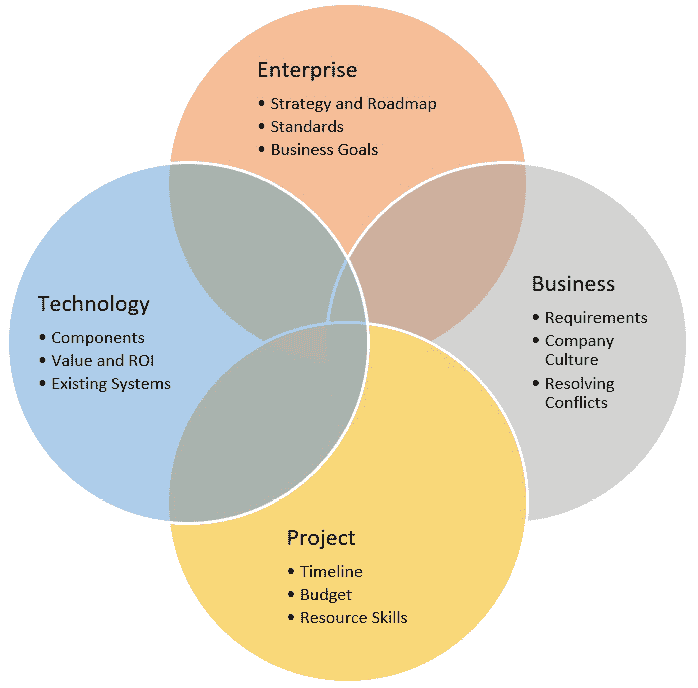
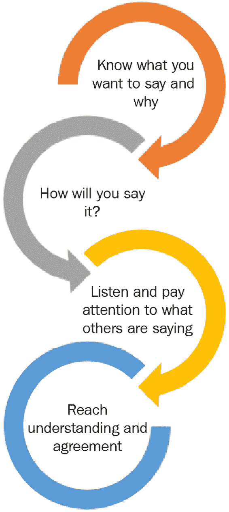
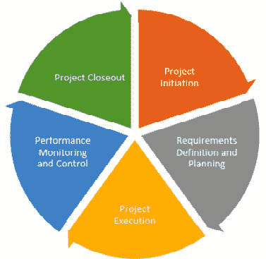
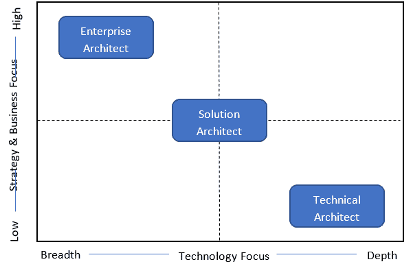
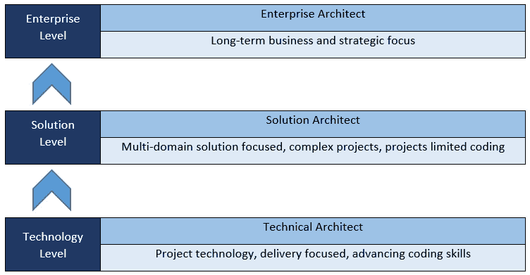

# *第三章*：什么使解决方案架构师有效？

在上一章中，我们强调了软件开发团队中不同角色的重要性。我们还探讨了支持你组建强大且成功的团队的关键属性。*为什么你需要学习这些？* 因为你可能雇佣了最好的候选人，但如果你没有建立适当的文化，如果团队成员不能有效地相互沟通，你可能会失去项目或客户。

在本章中，我们将主要关注解决方案架构师的角色。此外，我们还将详细阐述一系列个性特征，这些特征应该能够帮助你有效地领导当今的数字世界。

在本章中，我们将涵盖以下主题：

+   解决方案架构概述

+   探索每个解决方案架构师都应该具备的基本软技能

+   了解应避免的一些常见陷阱

+   学习企业架构师、技术架构师和解决方案架构师之间的区别

到本章结束时，你将了解什么是解决方案架构。此外，你将了解作为解决方案架构师，你应该具备的核心个性特征，以增强你的架构思维和领导技能。

这些个性特征对于成功至关重要，因为解决方案架构师的角色必须处理许多非技术方面，例如团队建设、与客户谈判、解决冲突、改进业务流程，以及在团队内部营造创新和专业文化的氛围。

# 什么是解决方案架构？

在我们深入探讨解决方案架构师的个性特征之前，首先，让我们了解一下什么是解决方案架构。**解决方案架构**是一系列旨在根据预定义的需求探索和分析业务问题，并为拟议的技术解决方案创建一个与客户目标和需求相匹配的架构设计的活动。

通常，在创建平衡且有效的解决方案及其架构设计时，解决方案架构师应考虑以下四个关键因素及其相关限制：

+   **企业限制**：识别构建产品背后的企业限制和目标。

+   **利益相关者的视角**：理解和分析从业务利益相关者和高级用户收集到的需求。

+   **技术价值**：识别你的解决方案中使用的科技栈和组件的价值，这些应该符合企业战略指南和最佳实践。

+   **项目限制**：解决方案架构师应考虑项目的时间表和预算。

下面是一个总结你在解决方案设计中应考虑的不同限制的示意图：

图 3.1：理想的解决方案应考虑这些约束

**到目前为止，这似乎很简单，对吧？**解决方案架构是设计和管理整个解决方案工程的过程，它通过执行一系列实践来解决业务问题。这应该在开始任何开发活动之前由解决方案架构师完成，我们将在本书的后面部分更详细地探讨这一点。

现在，让我们深入了解一个解决方案架构师应该具备的一些基本个性特征。

# 探索有效架构师的个性特征和技能

在今天这个快速变化和颠覆性的商业世界中，成为一名有效的解决方案架构师既是挑战性的，也是变革性的。

在本节中，我们将探讨一些最重要的个性特征、软技能和品质，这些品质是成为一位高效、实用且以业务价值为导向的解决方案架构师所必需的，他可以在公司内部产生影响。

## 以身作则

解决方案架构师负责**领导**一个解决方案或产品的所有架构活动。他们应该为团队设定正确的方向，推行创新文化，并构建鼓舞人心的愿景。作为解决方案架构师，你应该证明的领导技能之一就是以身作则——**言行一致**。**那么，这究竟意味着什么呢？**让我们设想以下情况：

+   有一些领导者要求人们加班解决问题，但自己却准时下班。

+   有一些管理者要求你减少在改善硬件或招聘新团队成员上的支出，但自己却购买了豪华的办公家具。

+   有一个管理者要求他的团队明智地使用时间以提高生产力，但后来被发现他在工作时间花费大量时间在社交媒体上。

**你听说过这类领导者吗？**

对于伟大的领导者来说，行动比言语更有说服力。没有比看到一位无能的领导者说一套做一套更能迅速扼杀团队热情和动力的了。这可能会非常令人失望，并导致士气低落，这对团队来说可能是毁灭性的。

作为解决方案架构师，你必须知道你对你的团队负有责任。他们密切地关注你的一举一动，因为他们正在寻找指导。你必须激励他们，推动他们取得最佳成果。做到这一点的方法就是做一个好榜样。你的行为必须与你所说的一致。

这里有一些你可以用来以身作则并赢得团队信任的方法：

+   在困难时期，要亲力亲为，承担责任，支持你的团队。不要只是袖手旁观，告诉他们该做什么。

+   总是应用你设定的规则和标准，以便你的团队能够跟随你。

+   同理心是必不可少的；对团队成员的情感要有敏感度。

+   花时间让每个人在团队和整个组织中感到特别和重要。

+   以你希望被对待的方式对待你的团队成员。

+   并非所有团队成员都相似；挑战自己更好地了解他们，接受他们本来的样子，并尊重他们的独特差异。

+   倾听批评，因为有时它可能是建设性的。在这样做的时候，避免表现出防御性。

+   工作场所的人际冲突可能会发生；你无法避免它们。然而，确保你尽快解决它们。

+   永远不要把人当作理所当然。

当你言行一致时，你通过向团队成员展示如何正确做事来领导他们，也就是说，你为他们树立了良好的榜样。这样，你成为一个更有效的领导者。

## 展示出色的沟通技巧

解决方案架构师的关键能力之一是拥有良好的沟通技巧，这对于建立关系至关重要。记住，你的角色要求你与客户协商并解决与团队成员之间的任何冲突。你必须是一个好的倾听者，不仅是为了回应，也是为了正确理解各方的需求。沟通技巧的缺乏可能造成严重的瓶颈。然而，相反，能够有效地沟通是项目成功的关键因素，因此也是解决方案架构师成功的关键因素。

这里有一些你可以用在日常与团队成员互动中的小贴士，以实现有效的沟通：

+   表现出同理心，因为它创造了相互理解和信任。

+   在困难的讨论中给予团队成员赞美，例如说“我认为你所说的很棒”，“我同意你的观点”和“你到目前为止做得很好”，这将提高他们的动力并提升团队的士气。

+   并非所有人都会和你有相同的观点；愿意尊重他人的观点，不要无礼或傲慢。

+   眼神交流很重要，因为它可以提高沟通质量，大多数人认为它是值得信赖的标志。在交谈时尽量看着对方的眼睛。

+   尊重每个人发言的机会，并尽力不要打断。

除了这些建议之外，尝试在如何管理与团队成员或客户的特定对话方面有一个清晰的方向。尽量保持直接；否则，它可能变成一场无用的争论。

下面的图表显示了你可以实施的四个步骤，以实现有效和高效的讨论：

图 3.2：实现高效会议的步骤

*为什么沟通在工作场所很重要？* 让我们来看看：

+   清晰的沟通通过向团队描述你的目标来展示你的领导能力。此外，它使你的工作场所更具协作性和敏捷性。

+   有效的沟通对团队的效率有重大影响，因为它使他们参与重要的技术或非技术决策。

+   它营造了一个积极的工作环境，并改善了与客户和同事的关系。

+   它提高了团队的效率，因此增加了组织的利润。

沟通技巧对于向你的团队和客户传达你的想法和愿景至关重要。记住，最大的沟通技巧是倾听他人，因为这将帮助你理解情况并做出适当的决策。

## 拥有深厚的分析技能

“分析”这个词已经成为每个高级技术职位的热门词汇。*那么，分析技能是什么，为什么它们对你作为解决方案架构师来说是必不可少的呢？*

分析技能指的是你如何调查特定问题或业务流程，通过理解不同元素是如何相互关联的，逻辑和深思熟虑地收集和分析所有相关信息，研究可能的解决方案，然后为该情况提出理想的解决方案。

设计解决方案受多种因素影响；它需要一个注重细节、具备深厚分析技能并能评估各个方面、处理需要分析的任务的个人。

这些是你需要找到解决各种问题和困难或帮助你的团队成员通过提出适当的解决方案来解决他们面临的问题的技能。

你可以通过走出你的舒适区并开始解决复杂问题来发展你的分析技能。以下是一些解决方案架构师应该掌握的核心分析技能：

+   **数据分析**：你必须有能力分析接收到的数据，并识别出支持你决策的模式和趋势。

+   **沟通**：你必须是一个好的沟通者，以便向你的团队解释你的发现，这样客户就可以描述你的建议。

+   **批判性思维**：你必须有能力分析复杂问题并评估你收集到的信息，以形成合理的决策。

+   **创造力**：你应该有能力超越显而易见的解决方案，以找到最佳解决方案。

+   **研究**：你必须更多地了解你试图解决的问题。你可以通过研究相关的在线文章和帖子，了解其他架构师或竞争对手是如何解决特定问题的，这可能会支持你在头脑风暴可能的解决方案。

作为解决方案架构师，你应该具备扎实的分析技能，因为它们将帮助你解决在设计或开发解决方案过程中可能出现的复杂问题。

## 展示出色的项目和资源管理技能

解决方案架构师不直接对这些两个方面负责。然而，他们被期望关注业务成果。因此，他们负责以最有效的方式完成项目，确保以下方面：

+   客户的商业目标正在实现。

+   项目正在给定的时间框架和预算内实施。

+   团队技能和资产得到了适当的分配，并且正在被高效地用于完成项目。

你被期望介入五个主要的项目管理活动：

+   **项目启动**：这是在明确项目目标和范围之后。

+   **需求收集和规划**：这包括制定工作分解结构。

+   **项目执行**：这是基于产生的进度表。

+   **性能监控**：这也包括管理变更请求。

+   **项目收尾**。

这里有一个图形表示这些主要的项目管理活动：

图 3.3：项目管理的五大活动

解决方案架构师在资源管理中扮演着重要的角色，这是项目管理的一个关键部分。它是规划并高效分配资源的过程，以确保在项目最早阶段定义的估计时间内、预算和范围内完成项目。在软件开发中，有两种类型的资源和资产：

+   **无形资产** 包括各种非物理资产，例如员工技能、经验、公司声誉和时间。

+   **有形资产**是物理资产，例如设备、材料和投资。

拥有项目和资源管理技能对于在整个开发过程中提供战略方向至关重要，无论是做出技术决策还是非技术决策。

## 对他人展现耐心

*耐心* 是人类的一种力量。它被认为是一项难以掌握的技能；然而，如果你想成为一名有效的解决方案架构师，你必须有耐心，尤其是在危机期间。对工作中的他人保持耐心是面对困难时保持平静并积极回应同事和客户的能力。

在我们快速变化的世界里，期望任务能够即时完成，延误可能会造成压力。例如，你的客户会希望他们的项目按时交付，或者你的经理会期待你分配给你的团队中某人的报告，而这个人没有按时交付。想想那些不断改变要求的客户，想想那些可能有坏习惯、难以相处或难以理解的同事。所有这些困难的情况都超出了你的控制范围，它们可能会让你瞬间感到沮丧。

对这些人失去耐心可能会使情况复杂化。这可能会损害你的关系，并给你留下不好的印象。

## 协作工作

构建架构设计和交付解决方案是一个团队的努力。一个有效的架构师可以与所有同事（包括那些具有不同技能和专业知识的人）协作，目标只有一个，那就是高效地交付项目并满足客户的目标。

让我们看看以下为什么协作很重要的原因：

+   它帮助你和团队更快地解决问题。

+   它提高了动力，使人们更加团结，这可以提高留存率。

+   它创造了一个学习和发展的环境，因此团队成员可以从彼此那里学习。

+   通过消除限制、促进部门间的透明度以及让团队成员参与项目中的大多数决策，它创造了一个更顺畅的工作环境。

+   它创造了一个充满创造力和创新的工作环境，所有成员都可以分享他们的想法以进行创新。

作为解决方案架构师，协作工作对于你的角色至关重要。这是因为当你与团队协作时，你不仅确保了良好的架构交付，而且在开发结束时还确保了高质量产品的交付。

## 展示影响力和谈判技巧

强大的影响力和谈判技巧对于解决方案架构师解决冲突和发展双赢解决方案至关重要。**谈判**是与客户或团队成员讨论问题并达成双方都满意协议的能力。**影响**是成功谈判的关键部分。它是谈判并说服他人接受你建议的能力。

这里有一些基本的谈判技巧，将支持你成为一个有效的谈判者：

+   将谈判流程与你的短期和长期战略目标保持一致。

+   在开始谈判之前，尝试通过收集关于你要见的人和你要谈判的主题的信息来彻底准备。

+   准备你的**谈判协议的最佳替代方案**（**BATNA**）。以防在当前的谈判中未能达成协议。

+   能够通过区分个人问题和谈判问题来保持理性。这对于看到机会和实现谈判目标非常重要。

+   了解如何通过与具有共同利益并能够影响谈判中其他人的潜在盟友讨论你的想法来建立联盟。

+   与你谈判的人建立信任和声誉。你可以通过尊重、透明和信守承诺来实现这一点。

你将始终处于需要影响你正在设计的解决方案中涉及决策同伴的情况。继续发展你的谈判技巧，建立稳固的关系，解决冲突，达成伟大的交易。

## 拥有广泛的技术专长

要成为真正的创新支柱，解决方案架构师应具备广泛的技术专长，能够就技术建议咨询管理层和工程团队。特别是，他们需要意识到以下几点：

+   软件工程和架构设计

+   信息技术架构、基础设施和云计算开发

+   项目管理和产品管理

+   DevOps 工具和实践

+   业务分析

## 高效地分解问题

大问题难以处理；有时，它会使你感到不知所措。以积极的态度面对问题，通过将其分解为比原始大问题更容易解决的较小问题，让自己和团队更容易应对。

优秀的架构师还可以最大限度地减少问题的发生，并在它们发生之前解决它们。这可以通过进行良好的风险评估和关注细节来实现。

## 实事求是

每个组织都有自己的标准、内部政治、截止日期、预算等等。优秀的架构师应该意识到在项目实施过程中可能遇到的限制。因此，他们应该以实际的方式处理问题，而不是使用不适用于所有情况的理论。他们应该提出现实、及时、务实和高效的解决方案，以适应这些限制。这就是基于业务价值进行架构决策的地方，以优化公司的**投资回报率**（**ROI**）。

到目前为止，我们已经讨论了一些解决方案架构师的基本性格特征和关键技能。在下一节中，我们将突出一些常见的错误，您应该注意避免以防止客户不满和可能影响您项目交付成果的任何关键问题。

# 查看架构师常见的陷阱

太常出现的情况是，错误是通过艰难的方式学到的。在本节中，我们将突出一些可能影响解决方案架构师成果的陷阱：

+   避免过度架构解决方案；例如，通过向解决方案中添加不必要的层和组件，这些组件可以用简单的类代替。过度架构会增加开发活动，并在出现错误时使故障排除复杂化，这将降低客户所寻求的成果。尽量简化您的架构，使其更符合业务需求。

+   考虑编写自定义代码而不是使用现成的和开源的框架或库。例如，假设你需要构建一个响应式网络解决方案；这里，你有两个选择。

    第一个选择是重新发明轮子，自己开发一个响应式框架。这个选项成本较高，因为你需要从头开始开发整个**CSS**和**JavaScript**。第二个选择是使用流行的开源框架，如**Bootstrap**，来构建响应式用户界面，这是一个成本较低的选择。

    *你应该选择哪个选项？* 当然，在这种情况下，最好的选择是使用可靠的开源框架来缩短开发时间，避免如果你开发自己的框架可能会遇到的问题，并利用开源框架提供的强大功能。你需要通过决定哪个选项对你的解决方案是最好的来决定何时编写自己的代码，何时使用开源框架。

+   在规划或设计之前就跳入开发，将使项目的截止日期、预算和目标面临风险。在开始开发之前有一个适当的计划和设计是必须的。它结构化了团队成员的工作，并设定了应与需求相一致的目标。无论你正在处理的项目大小如何，你都应该始终遵循 SDLC 阶段，并采用每个阶段的输出，以便过渡到下一个阶段，直到交付产品。

+   如果不将代码结构化以使其可重用和可扩展，你将在软件的许多位置拥有大量重复的代码，这些代码执行相同的任务。这将增加源代码的大小，并使维护任务复杂化。这是因为代码将变得难以阅读，你可能需要在许多地方修复相同的缺陷。尽量保持你的代码**DRY**（**不要重复自己**），创建组件，使你的软件模块化，并在需要时通过创建抽象类和接口应用**面向对象编程**（**OOP**）。

+   在不关注安全性的情况下开发产品，将导致一个容易受到安全漏洞攻击的软件解决方案。安全攻击可能会损害系统和其关联的数据库，这可能导致停机，你的客户可能会损失金钱。确保你的软件解决方案不再是一个事后考虑，而是一个首要考虑。在设计和发展软件时关注安全性可以帮助你避免恶意软件并防止黑客攻击。

+   避免依赖传统的开发方法来构建软件，而不是应用敏捷软件开发方法。敏捷方法被软件开发公司广泛使用，以便他们可以有效地管理项目。这是一种现代实践，为你的团队和正在开发的解决方案增加了价值。

    敏捷是一种进化过程，通过将来自不同部门的团队成员聚集在一起以交付项目，促进了团队成员之间的高度协作。它提高了团队的生产力，允许在短时间内交付多个成果。此外，它还允许客户通过提供反馈来密切参与每个阶段，从而防止项目结束时出现任何失望。

+   避免不重视代码优化和性能。

+   避免在**用户验收测试**（**UAT**）上投入不足的时间。所有类型的测试都非常重要，以便交付高质量的产品。UAT 是一种由客户执行的测试，用于决定是否满足需求。这是在进入生产/实时环境之前。

    如果没有适当的 UAT 阶段，产品可能会因为许多原因被最终用户拒绝，例如性能不佳、缺少功能以及产品存在缺陷。为了避免这种情况，确保你提前根据与客户达成一致的使用案例准备测试用例。这些测试用例将在 UAT 阶段用于验证每个功能。

+   避免不分配与项目需求相匹配的正确技能集的团队成员。记住，没有合适的团队成员，成功是不可能的。

+   避免由于不切实际的进度表和预算以及项目后期才发现这些问题而导致良好的规划失败。这可能会产生冲突，特别是如果你正在同时处理多个项目。你必须有一个现实的计划，有明确的截止日期和目标；这应该在项目的规划阶段确定。你可以应用敏捷方法来避免这个陷阱。

这些各种陷阱可能会经常发生，可能还会相互关联，这可能会影响你交付成果的质量以及你在客户那里赢得的声誉。我们已经描述了你可能会遇到的一些许多陷阱中的几个。了解这些陷阱将使你做好准备，以便克服它们。作为一名解决方案架构师，你需要不断解决问题，尝试新事物，并帮助将项目与公司愿景和价值观对齐。

在下一节中，我们将探讨企业架构师、技术架构师和解决方案架构师之间的区别。

# 企业架构师与技术架构师与解决方案架构师之间的比较

在信息技术行业中，有三个不同的与架构相关的角色。这些角色在软件开发生命周期中同等重要，不能被任何其他职位所取代：

+   **企业架构师**

+   **技术架构师**

+   **解决方案架构师**

现在，让我们更多地了解这些角色之间的区别：

图 3.4：企业架构师、技术架构师和解决方案架构师之间的区别

**企业架构师**负责与关键利益相关者协作，定义业务目标，并建立整个企业基础设施（如软件和硬件），以满足组织的需要。他们主要专注于实施和管理针对关键和战略业务目标的复杂 IT 解决方案。

同时，**解决方案架构师**在组织内部扮演着实际的角色。他们收集业务需求，然后分析它们，最后将它们转化为一个使用公司标准和技术栈的新软件解决方案。

**技术架构师**主要负责监督解决方案的技术架构和实施中使用的核心技术。他们的主要职责是为开发团队提供技术领导，并决定软件解决方案的每一个技术方面。

以下图表描绘了一个提供数字化转型服务的企业中企业架构栈的结构：

图 3.5：企业架构栈

通过拥有解决方案架构师，公司能够主要创建一个稳固的结构，使公司的愿景和目标与各种技术保持一致。

# 摘要

在本章中，我们提供了关于解决方案架构的快速介绍。然后，我们学习了成为有效的解决方案架构师所需的某些基本个性和软技能。在本章的后面部分，我们强调了在项目开发生命周期中应避免的一些常见陷阱。最后，你了解了企业架构师、技术架构师和解决方案架构师之间的区别。

在下一章中，我们将深入探讨解决方案架构的原则，你将了解七种流行的 UML 图，这些图将帮助你建模你的解决方案架构。
