# *第四章*：设计解决方案架构

在上一章中，我们了解了一些构建你的潜力并成为有效解决方案架构师所需的必要特质和技能。我们还快速概述了什么是解决方案架构。

在本章中，我们将开始更加关注解决方案架构的实践。特别是，我们将探讨解决方案架构的关键原则，并研究在设计中等规模到大型解决方案时推荐使用的流行**统一建模语言**（**UML**）图。

在本章中，我们将涵盖以下主题：

+   探索解决方案架构的关键原则

+   通过具体示例深入研究最常用的 UML 图

+   通过 UML 创建设计架构的过程

到本章结束时，你将丰富你对流行 UML 图的知识和理解，并学会如何在设计中使用它们。此外，你还将了解解决方案架构的关键原则以及它们如何影响你的设计过程。

# 探索解决方案架构的关键原则

架构原则概述了设计、构建和部署成功软件解决方案所需的基本程序和指南。它们旨在影响你的架构方法并提高解决方案的质量属性。

有许多原则我们可以采用在我们的工作方法中准备设计架构。如果我们认为它们将为架构设计增加价值或如果我们认为它们将有效地提高设计过程，我们甚至可以定义我们自己的原则。最重要的是，我们需要确保我们提供理论与实践之间的良好平衡，并采用实用且强大的原则，以推动我们解决方案架构中的商业和技术变革。

通常，我们应该为我们的解决方案架构实践设定 10 到 20 个指导原则。确保你不会有太多的原则。这是因为它们变得难以记忆和难以应用，这将限制我们架构的灵活性。在这种情况下，最好保持它们简单和专注。

有一种标准方式和推荐格式，你可以用来定义架构原则。通常，一个原则分为四个主要部分：

+   **名称**：名称应反映原则的核心价值。它应该是简单且易于记忆的。

+   **描述**：描述是一句明确定义和解释原则的陈述。

+   **理由**：理由是一句强调遵守原则的商业效益的陈述。它也可以解释与其他原则的相关性。

+   **影响**：影响应突出采用此原则所需的技术要求和业务要求。

这些元素旨在支持对每个原则的理解，并证明其在解决方案架构中的应用合理性。

我们所采用的原则应属于特定的类别或领域。根据 **开放集团架构框架**（**TOGAF**），架构原则广泛分为四个领域：

+   **商业原则**：这是一套关注解决方案商业方面的指导方针。

+   **数据原则**：这些定义了管理和结构化数据的标准指导方针。此外，它们还强制执行一系列安全措施，以保护解决方案资产。

+   **应用原则**：这些涉及应用程序的属性，如性能、用户体验以及模块或子系统如何相互交互。

+   **技术原则**：这些详细说明了对于解决方案成功和持续运行所必需的技术指导方针和需求。

    小贴士：

    TOGAF 是一个框架和方法，旨在提供一种高级方法来设计和构建企业信息技术架构。您可以在 [`pubs.opengroup.org/architecture/togaf9-doc/arch/chap20.html`](https://pubs.opengroup.org/architecture/togaf9-doc/arch/chap20.html) 了解 TOGAF 对架构原则的定义。

)

这里有一个突出解决方案架构关键原则的插图。您可以看到，四个领域正在将不同领域的设计指导方针合并在一起，以产生一个灵活、可扩展和可重用的解决方案：

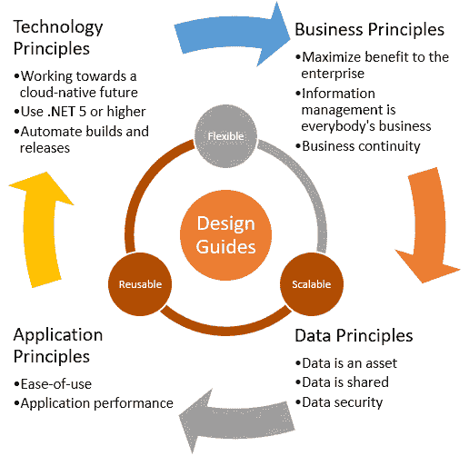

图 4.1：.NET 解决方案架构推荐的关键原则

在接下来的章节中，我们将探讨您真正需要了解的前述原则。我们可以直接采用这些原则，或者根据我们的需求添加、修改和删除一些原则。然而，始终记住，原则的目的是为了使我们所提出的解决方案受益，而不是增加任何障碍或复杂性。

## 商业原则

解决方案架构，包括所有开发成果及其质量，至关重要。然而，我们不应只关注项目计划、进度和结果。记住，你构建解决方案的原因是为了解决商业问题。因此，解决方案架构与商业目标和目标保持一致是必须的。在接下来的章节中，我们将讨论应考虑的三个商业原则。

### 最大化对企业的利益

所有架构和信息管理决策都必须以确保对整个企业带来最大利益的方式进行。例如，解决方案应为企业内的所有实体带来长期价值，而不仅仅是针对一个部门或小团体。这一原则鼓励以自我为中心的高效协作。

### 信息管理是每个人的事

所有关键利益相关者、商业专家和技术团队都负责作为一个委员会协调一致，以定义解决方案的商业目标，并确保它们与企业目标一致。本质上，这个委员会的每个人都负责在自己的部分中构建和管理解决方案。

### 业务连续性

在系统故障的情况下，解决方案架构应确保企业的业务连续性。简单来说，任何类型的系统故障，包括硬件、软件和数据损坏，都不应影响业务活动和运营的连续性。例如，解决方案设计应建议最先进的恢复机制、系统冗余或故障转移备份计划，以在灾难情况下平滑业务功能的运行。关键利益相关者应定义解决方案对企业运营的重要性，并决定应应用哪种故障转移计划以确保业务连续性。

## 数据原则

数据是业务流程的重要组成部分；它是赋予企业利益相关者根据关键指标和绩效指标做出战略决策的有价值资产。在设计构建软件解决方案时，应考虑以下三个数据原则。我们将逐一探讨它们。

### 数据是资产

虽然许多架构师已经知道这个原则，但我们仍然发现数据并没有像应该的那样被高度重视。数据是组织的核心商业资产。因此，解决方案的设计应确保以高安全措施正确存储、管理和检索数据，以更好地保护。

### 数据是共享的

存储在集中式存储库中的准确数据是软件解决方案的支柱，及时访问这些数据对于提高使用该解决方案的决策者的效率非常重要。此外，商业用户需要数据来执行他们的日常职责。因此，你的解决方案设计应允许根据用户的访问权限及时访问数据。

### 数据安全

软件解决方案应确保数据的完整性和机密性。它应保护数据并禁止未经授权的访问或非法处理。有许多数据政策旨在保护数据；我们需要根据我们的目标用户遵守这些政策。例如，如果我们正在构建针对欧洲公民的软件解决方案，那么遵守**通用数据保护条例**（**GDPR**）是必须的。

## 应用程序原则

现代应用程序的指导原则正在演变。它们应该是动态原则；记住，过去适用的原则在今天的架构中不再相关。始终寻求改进您采用的原则，并使其成为一种持续现象。以下是一些真正重要的原则，它们在交付现代和高效应用程序方面产生了影响。

### 易用性

应用程序应易于使用、直观且美观。我们应该拥抱简洁；这是因为应用程序越容易使用，就越有可能被我们的最终用户采用。始终将用户放在首位；他们希望使用能够帮助他们工作并使其在短时间内变得高效的应用程序，而无需花费大量时间学习它，在他们开始从中获得价值之前。

### 优化应用程序速度

我们生活在数字化转型时代；用户正在寻找实时响应的应用程序。因此，应用程序的速度是一个重要的考虑因素，因为它可以影响整个用户体验。

## 技术原则

我们的技术原则应始终遵循最新的技术趋势。现代化公司的技术平台和开发实践非常重要。这将使您能够设计现代的数字解决方案。让我们探讨在任何 .NET 开发团队中应采用的三个原则。我们将在下面列出。

### 致力于云原生未来

云原生应用已被证明是软件的未来。我们试图构建的解决方案可以受益于云中托管的平台、服务和流程。例如，Azure 服务具有高度可扩展性、易于修改和连接性，这使得我们能够通过更少的编码来扩展应用程序的功能。

### 使用 .NET Core (.NET 5 或更高版本)

.NET Core 的最新版本被称为 **.NET 5**。它是一个免费且开源的框架，可用于构建任何类型的应用程序。它是一个跨平台框架，继承了常规 .NET 框架的所有重大优势。.NET Core 的一个关键改进是性能，因此在构建新解决方案时考虑使用此框架。

### 自动化重复的开发任务

准备解决方案的发布可能耗时，尤其是如果您旨在发布多个构建和热修复。您可以规划自动化作业以最小化此类任务中所需的手动干预，利用 DevOps 工具来自动化构建和测试计划。

在本节中，我们学习了在您的解决方案架构中应采用的关键原则。这些原则为解决方案的四个主要方面提供了指导：业务、数据、应用和技术。应用这些原则将使您能够交付一个坚实、可扩展、可重用且易于维护的解决方案。

在下一节中，我们将探讨在设计和软件解决方案时应使用的六个流行 UML 图。

# 学习使用 UML 模型软件架构

UML 是一种标准图形表示法，允许我们可视化软件解决方案的规范和设计架构；这是一种简化我们与解决方案利益相关者沟通架构的方式。UML 的目的是为开发团队和业务分析师提供一个统一的设计建模符号，使他们能够用简化的图表解释复杂的企业流程。此外，它使我们能够构建和可视化不同的软件组件以及它们之间的关系，这定义了整个解决方案的设计架构。

UML 图分为两类：**结构图**和**行为图**。结构图强调系统的静态视图。它们用于可视化软件的不同组件和对象。主要来说，它们描述了系统中包含的内容。

行为图强调系统的动态视图。它们通过描述软件支持的过程和功能来可视化业务规范。主要来说，它们描述了系统中必须发生的事情。

下面的图显示了不同的 UML 图类型：

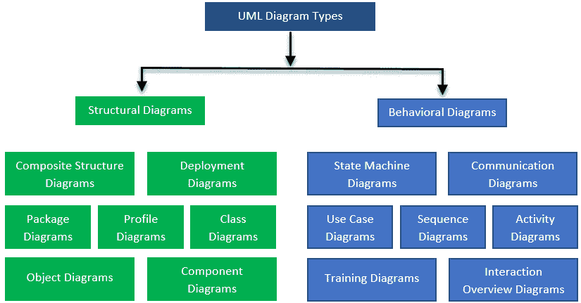

图 4.2：UML 图类型列表

在接下来的章节中，我们将探讨最常用的图。尽管我们可以使用许多不同类型的 UML 图来建模解决方案架构或描述系统功能，但我们将探讨大多数架构师经常使用的流行 UML 图，以记录软件解决方案的不同方面。它们如下列出：

+   组件图

+   类图

+   序列图

+   状态图

+   活动图

+   包图

+   用例图

我们将学习何时使用每个图，并探讨每个图的不同符号和表示法。然后，我们将检查每个图的示例。让我们从学习这些图开始。

## 组件图

UML 组件图用于图形化表示软件系统中的不同模块和组件，包括这些模块之间的关系和交互。模块是一组提供不同功能但被分组到一个业务流程中的类或接口。

### 组件图的好处

组件图可以通过以下方式帮助您：

+   可视化软件系统的整体物理结构

+   描述系统的组件及其相互关系

+   根据共同的服务目标对面向对象的类进行分组

+   模拟系统的 .NET 源代码或数据库

### 组件图的符号和表示法

这里列出了用于绘制组件图的不同形状和符号：

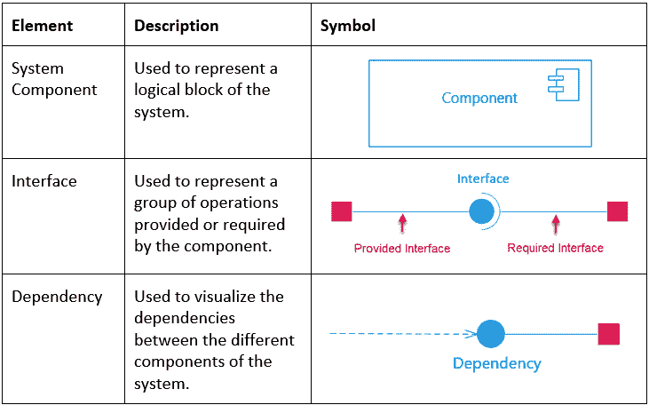

图 4.3：组件图的符号和表示法

### 购物系统的组件图

假设我们想要构建一个简单的在线购物解决方案。我们将使用组件图来描述该系统中的不同组件。

首先，我们需要通过根据其目的对功能需求进行分组来识别这些组件。在这个例子中，我们有三个组件：

+   订单

+   客户账户

+   产品库存

接下来，我们需要识别和可视化这些组件之间的关系。为了下订单，客户应提供必要的输入以完成订单。这就是为什么我们需要使用接口符号将订单与客户关联起来的原因；然后客户应从库存中选择一个或多个产品。这将确保订单与产品完全关联。因此，我们将使用依赖符号将订单与产品关联起来。以下是一个描述三个组件及其交互的组件图示例：

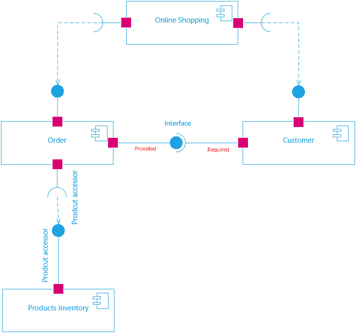

图 4.4：在线购物 UML 组件图

注意，您可以使用组件图来展示源代码中的物理文件。这在进行正向或逆向工程以识别源代码文件集时非常有帮助。此外，您还可以使用组件图来模拟物理数据库。

## 类图

UML 类图用于通过图形化表示类及其属性和操作来描述面向对象系统的结构，包括这些类之间的关系。

### 类图的好处

类图在软件工程师中非常受欢迎。它们非常强大，当你想要描述软件系统内的面向对象类时非常有用。我们可以使用 UML 类图来完成以下任务：

+   使用结构特征（属性）和行为特征（操作）描述系统中的每个类。

+   绘制类之间的关系，例如**抽象**和**关联**。

+   可视化系统的数据模型。

+   从业务角度创建软件的详细模型，这对非技术利益相关者了解系统的总体概述非常有帮助。

+   从类图中生成**C#**源代码。

### 类图的符号和表示

类图简单易读。以下是一个示例类图，以帮助你理解不同的符号：

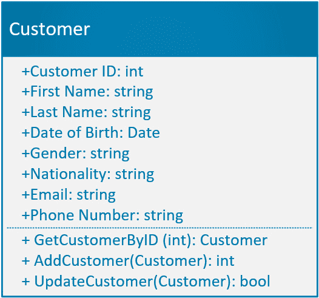

图 4.5：一个示例类图

如你所见，标准的类符号由三个部分组成：

+   上半部分包含类的名称。

+   中间部分包含类的属性/成员及其类型。

+   下半部分包含以列表格式显示的类方法。

有不同的可见性符号用来指示类中包含信息的访问级别：

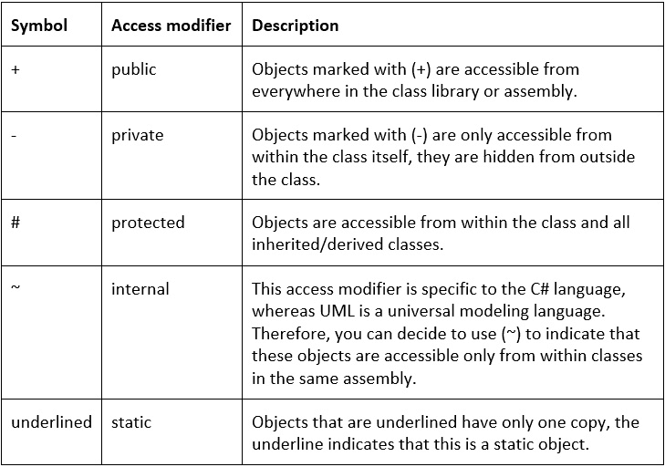

图 4.6：C#访问修饰符及其在 UML 中的符号

我们可以使用基数符号来定义两个类之间关系的类型。例如，一个客户可以有一个或多个订单（即一对多关系），而另一个订单可以有一个客户（即一对一）。以下表格显示了不同的基数符号：

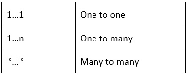

图 4.7：基数类型

类之间存在不同类型的关系。以下表格显示了这些关系的符号：

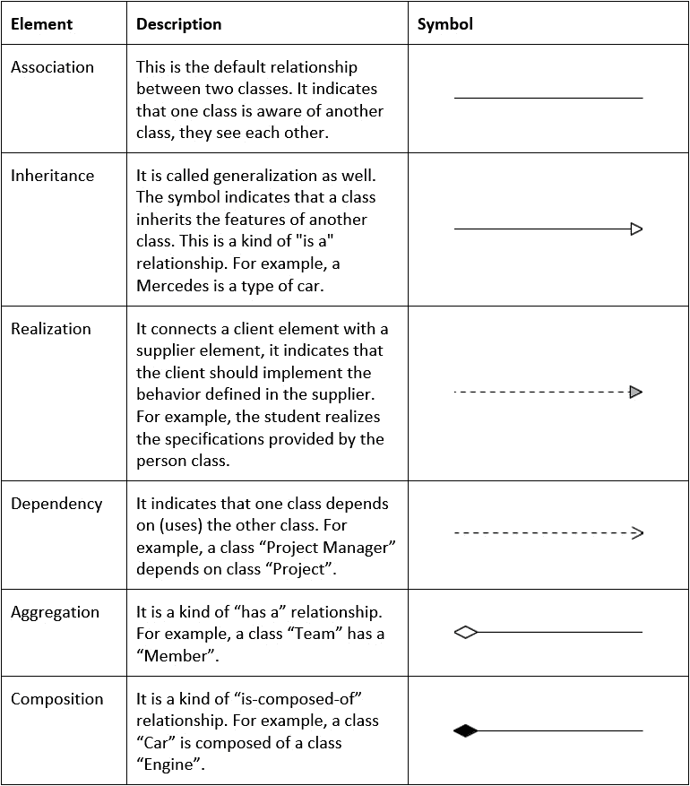

图 4.8：类之间的关系类型

### 在线购物系统的类图

在*在线购物系统的组件图*部分，我们可视化了在线购物系统的组件图。在本节中，我们将展示该系统的类图：

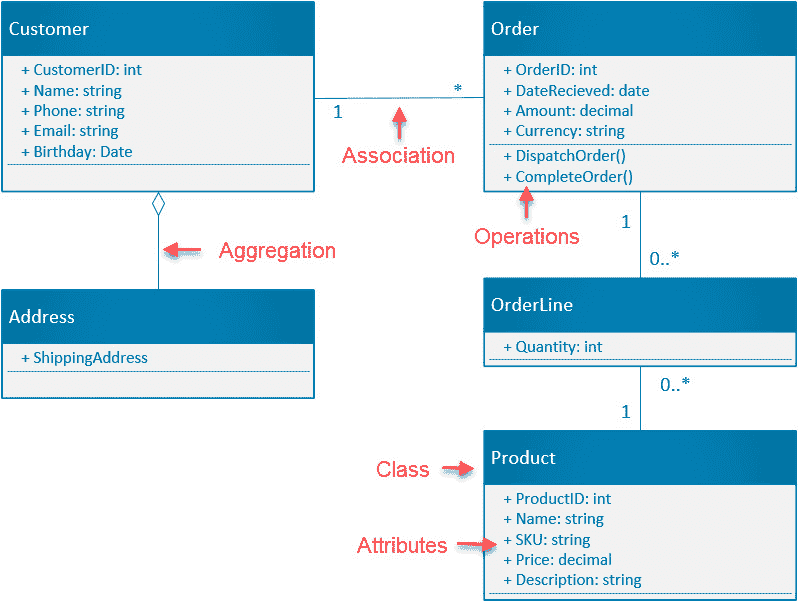

图 4.9：一个在线购物系统的类图

如你所见，每个框代表一个类在标题中。我们应该提供类名，然后列出类的所有属性和方法。类之间的交互通过线条来可视化。我们称之为关系。

类图可以在软件的整个生命周期中使用，从可视化软件的高级概念开始，然后是在创建详细理解规范时，最后是在软件实现过程中。类图是一种基本的建模技术，用于可视化系统中所有的面向对象对象，因此请确保你掌握了它。

## 序列图

时序图用于记录业务或逻辑过程。它展示了在过程执行期间对象之间交换的事件和消息的流程。因为它可以描述软件支持的使用案例或操作，所以被认为是一个交互图。

这种交互操作可以发生在用户与您正在构建的软件之间，或者发生在您的软件与其他系统（如中间件集成）之间，或者发生在同一软件的子模块之间。例如，我们可以使用时序图来解释我们系统中的认证机制，或者说明酒店预订系统的预订流程。

### 时序图的优点

时序图在描述复杂操作或用例时非常有帮助。您只需突出显示涉及的对象、操作步骤的顺序以及从过程开始到完成交换的消息。如果您想执行以下操作，可以使用时序图：

+   解释具有多个步骤的复杂用例。

+   在操作期间建模对象和组件之间的交互。

+   展示您系统与另一个第三方系统之间的集成流程。

### 时序图的符号和符号

以下表格列出了您必须知道的基本符号和符号，以便创建时序图：

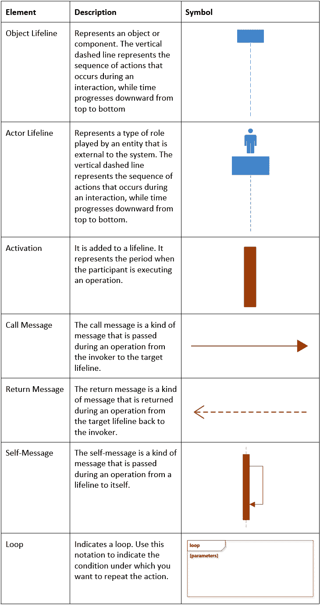

图 4.10：时序图的符号和符号

在下一节中，我们将创建一个时序图。

### 购物车时序图

在以下示例中，我们展示了一个在线购物过程的示例用例的简单时序图。该图包括以下生命线：

+   想要从在线系统中购物的客户。

+   购物车界面，它保存了用户想要购买的项目。

+   订单模块，它处理用户请求并确认支付。

该过程使用以下时序消息进行描述：

+   用户可以向购物车添加产品。

+   用户可以从购物车中移除产品。

+   用户可以调整项目数量。

+   用户可以看到所选项目的总价。

+   用户可以确认订单。

以下图包含一个循环片段，允许用户在确认最终订单之前向购物车添加更多产品或项目：

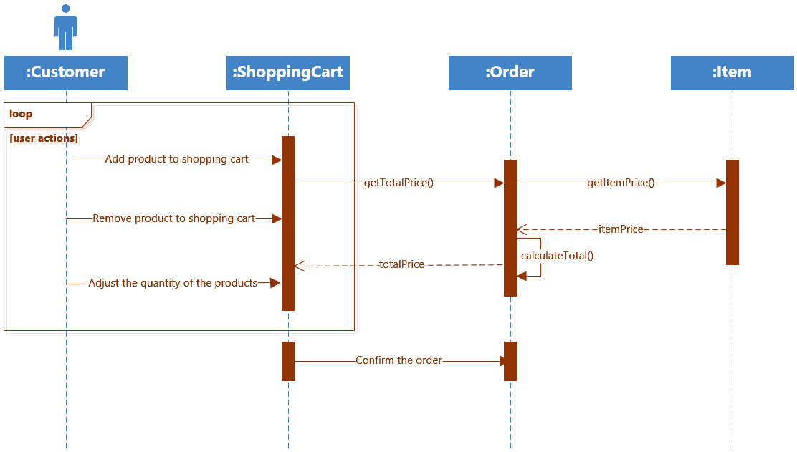

图 4.11：购物车处理时序图

在下一节中，我们将了解状态图。

## 状态图

状态图（或状态机图）通常在您想要描述系统如何表现和响应时很方便。它是状态、转换、事件和活动的组合。它用于模拟特定功能的流程，并显示从一种状态到另一种状态的所有转换。它还可以描述单个对象，并说明该对象如何响应系统中的一系列事件。实体的状态由其属性的值定义，这些值由特定时间发生的特定事件控制。

当您希望模拟接口、类或协作的行为以及由特定事件触发的业务流程时，状态图非常有用。它还有助于通过消除不必要的步骤和识别应添加到流程中以使其更有效的缺失步骤来改进流程。

### 状态图的优点

状态图用于描述事件如何改变过程的行为。我们可以使用状态图来完成以下操作：

+   可视化系统的动态视图。

+   在业务流程场景中模拟状态流。

+   使用对象从一步移动到另一步时的状态来解释事件驱动的过程。

+   展示系统中的交互功能。

### 状态图的符号和记号

下表列出了您必须了解的基本符号和记号，以便创建状态图：

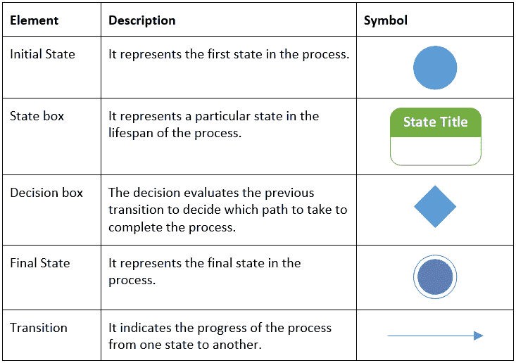

图 4.12：状态图的符号和记号

在下一节中，我们将使用这些符号来绘制状态图，以描述双因素认证过程。

### 双因素认证过程的状态图

在以下图中，我们描述了双因素认证过程的事件以及从一个状态到另一个状态的转换：

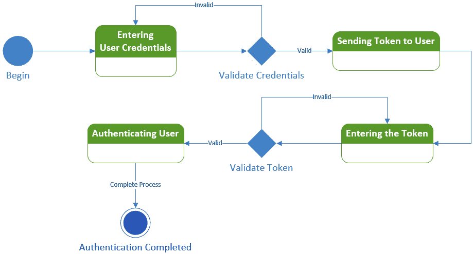

图 4.13：描述认证过程的状图

前面的图显示了用户提供登录凭证后发生的第一事件。然后，系统验证凭证，如果凭证有效，则将认证令牌发送回用户；否则，要求用户再次输入有效凭证。之后，用户应提交令牌供系统验证，系统将决定如果令牌有效则完成登录过程；否则，要求用户重新输入令牌以继续。

## 活动图

UML 中的重要图之一是活动图。在说明系统的动态视图方面，它与状态图类似。活动图是描述系统内对象之间从一项活动到另一项活动的控制流流程图。它主要用于建模业务流程。活动图中描述的活动可以是顺序的也可以是并发的。

### 活动图的优点

活动图是一种有用的流程图，描述了系统中流程执行的活动。活动图可以帮助我们做到以下几点：

+   通过描述所有活动来解释用例场景的步骤。

+   学习特定算法的逻辑。

+   思考并建模业务流程和工作流程。

### 活动图的符号和表示法

在开始创建活动图之前，您必须了解其符号和表示法。以下表格列出了活动图的主要符号：

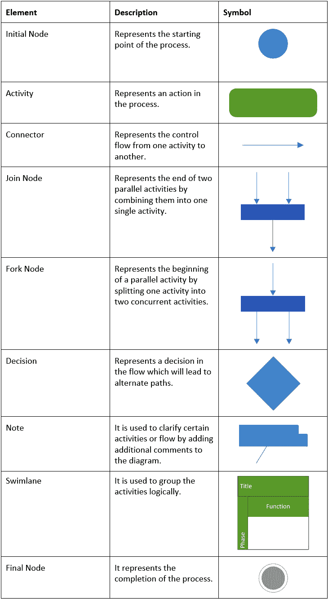

图 4.14：活动图的符号和表示法

在下一节中，我们将查看一个活动图的示例。

### ATM 系统的活动图

在以下示例中，我们使用活动图描述了一个 ATM 系统的基本流程：

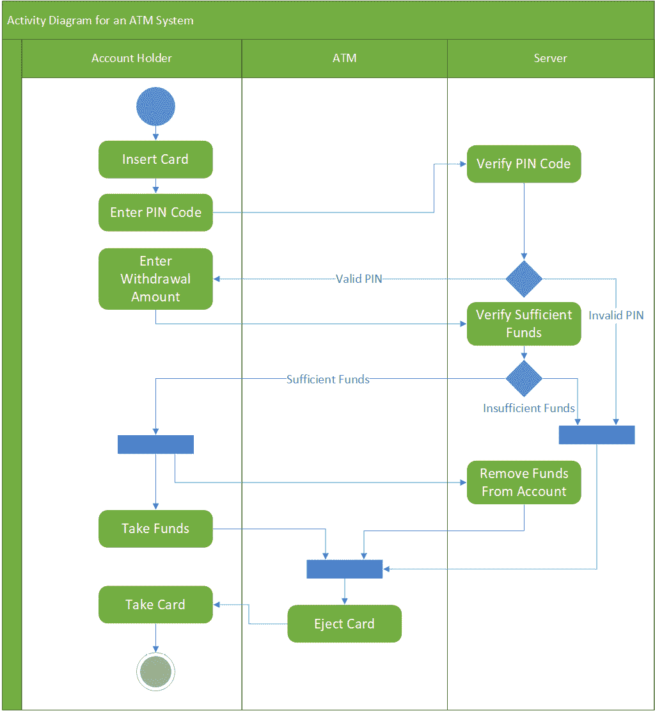

图 4.15：ATM 系统的活动图

如您所见，前面的图描述了 ATM 交易的过程。它从插入卡片并输入 PIN 码开始。最初，服务器将验证 PIN 码。如果有效，则服务器将建议 ATM 允许客户继续操作，输入取款金额并完成交易；否则，卡片将被弹出。

## 包图

使用包图的主要目的是通过可视化各种层及其依赖关系来描述我们系统的整体逻辑架构，其中一层代表一组类。系统中的物理组件根据其在系统中的角色和执行的任务分组到层中。在单个层内创建嵌套层，可以描述主要组件的高级细节。

在定义系统中的主要层之后，我们需要可视化层之间的依赖关系或关系。这将描述层之间正在发生的交互。

### 包图的优点

通过将主要组件统一到层中，包图可以使我们的架构易于理解。我们可以使用包图来帮助我们执行以下任务：

+   解释系统的高级逻辑架构和结构。

+   可视化设计的主要组件或功能单元及其相互依赖关系。

+   识别将您的系统与第三方系统集成可能性的可能性。

+   发现可能导致您的系统无法演变的架构中的差距。

+   在可能影响多个层的主要变更情况下，传达所需的工作量。

+   与开发团队就预期架构达成一致。此图为您提供比较您的架构与开发过程中实施的内容的能力。

### 包图的符号和表示法

以下表格列出了包图的主要符号：

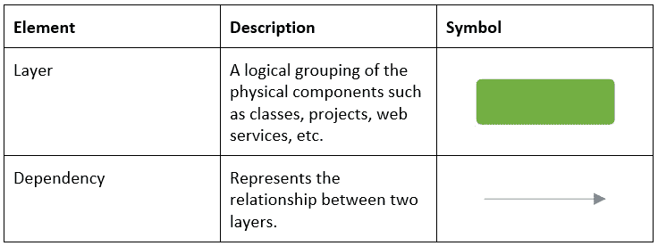

图 4.16：层图的符号和表示法

在下一节中，我们将检查典型 ASP.NET Web 解决方案的包图。

### ASP.NET Web 解决方案的包图

在以下图中，我们使用包图来描述典型 ASP.NET 解决方案的高级架构，而不提及每个包中类和资产的具体细节：

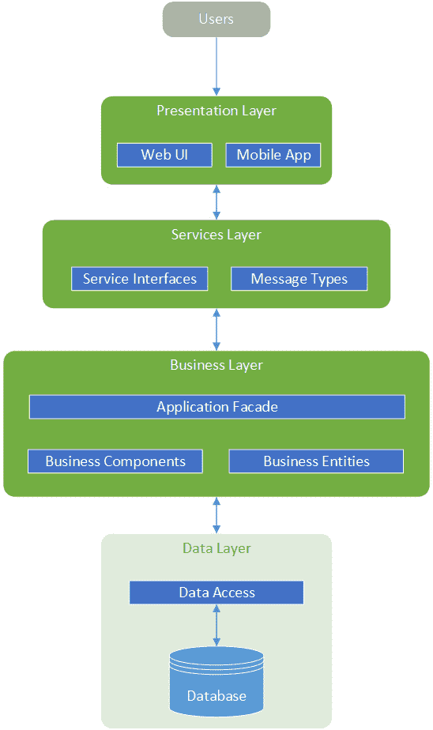

图 4.17：典型 ASP.NET 解决方案的包图

在前面的图中，我们已经表示了 ASP.NET 解决方案的多层架构中的包。**表示层**包括解决方案的用户界面，**服务层**代表一个中间件服务，为 Web 和移动应用提供高级通信服务。**业务层**包含所有业务逻辑和实体。至于**数据层**，这包括访问存储在数据库中的数据的方法。

## 用例图

软件工程中最激动人心的时刻之一，就是您正在设计和开发的产品满足客户需求的那一刻。没有比拥有清晰的用例更好地达到这个目标了。用例对于从客户的角度描述产品至关重要。有两种类型的用例：**文本**和**视觉**。

在*第一章*《软件开发生命周期原理》中，我们学习了文本用例及其准备方法。在本节中，我们将介绍用例的可视化表示。

用例图用于可视化用户需求；更具体地说，它用于可视化系统行为以及用户与系统之间的交互。

### 用例图的好处

用例图是一种简单而有效的技术，可用于可视化用户与系统的交互。它不显示所有详细用户需求，而只显示用例的交互。用例图可以通过以下方式帮助您：

+   阐述用户与软件的交互

+   可视化系统的功能需求和范围

+   显示用例的高级步骤

+   将用户需求与实现相匹配并支持测试用例的生成

### 用例图的符号和表示

用例图的符号简单直接。以下表格列出了用例图的主要符号：

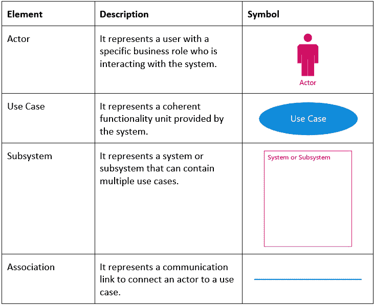

图 4.18：用例图的符号和表示

### 客户与 ATM 之间的用例图

在以下图中，我们创建了一个用例图来描述 ATM 系统支持的主要功能，包括与客户的交互：

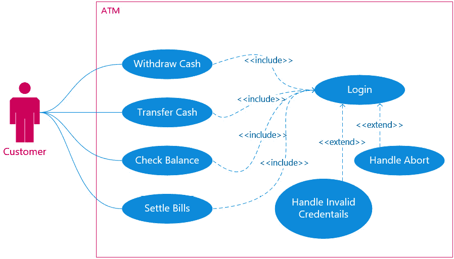

图 4.19：ATM 系统的用例图

在前面的图中，参与者是使用 ATM 系统并尝试进行身份验证以完成交易的客户。彩色椭圆表示系统支持的功能，而线条表示块之间的关联和交互。

在本节中，我们学习了最常用的 UML 图，这些图对于记录解决方案的许多方面至关重要，例如解决方案设计、面向对象的系统结构以及业务和逻辑流程。我们还学习了我们的系统如何行为和响应用户交互，系统对象之间从一项活动到另一项活动的控制流，系统的高级逻辑层及其依赖关系，以及从客户的角度看的需求。

在下一节中，我们将学习如何使用 UML 创建解决方案架构。

# 使用 UML 设计架构

到目前为止，我们已经了解到 UML 图是软件的单个简化表示。我们需要构建各种 UML 图来理解系统的完整方面，并将我们的架构设计传达给利益相关者和不同类型的用户。将这些 UML 图分组到逻辑子集中，将创建系统的特定视图。架构设计是通过五个视图的集合来表示的。这些视图如下：

+   **用例视图**：**用例视图**是所有其他视图的焦点，因为它包括了用户需求，包括所有系统功能。没有这个视图，就无法构建其他视图。

+   **设计视图**：**设计视图**旨在说明在用例视图中定义的功能如何在系统中以类及其关系的形式设计。这个视图主要是由 UML 类图来描述的。

+   **实现视图**：**实现视图**描述了系统的核心组件及其之间的交互。它主要是由 UML 组件图来表示的。

+   **过程视图**：**过程视图**描述了系统支持的流程。它通过汇聚系统的性能、可扩展性和吞吐量来实现这一点。它主要由 UML 类图表示，类似于**设计视图**，但专注于参与流程的活跃类。

+   **部署视图**：**部署视图**通过关注系统拓扑、分布、交付和安装来描述系统的部署。它由 UML 部署图表示。

以下图示展示了五个视图，其中用例视图位于中心，并与所有其他视图相连：

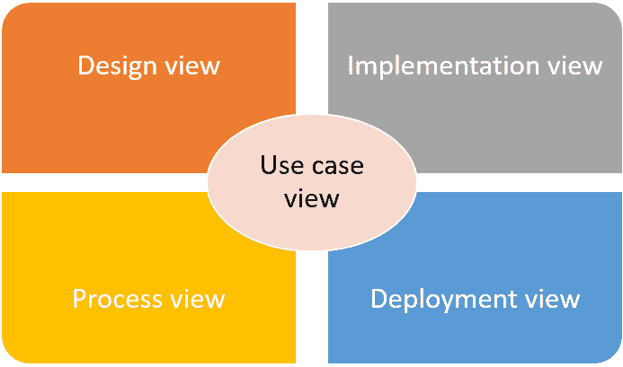

图 4.20：系统架构视图

下表总结了架构视图，以及相关的 UML 图，以帮助理解系统的不同方面：

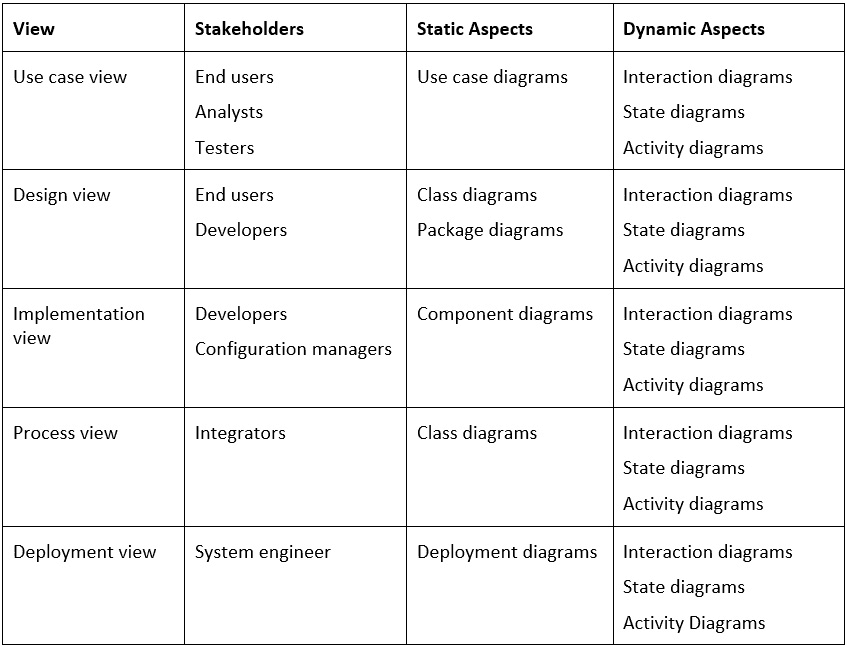

图 4.21：系统架构视图及其相关的 UML 图

解决方案架构师负责创建这些视图及其相关图的第一版，并处理构建解决方案架构的更新。整个解决方案架构被用于影响和指导项目生命周期中的开发活动。

# 摘要

在本章中，我们探讨了设计、构建和部署软件解决方案所需的基本程序和指南的关键原则。此外，我们还学习了必要的 UML 图，并通过实际例子说明了每个图中不同元素及其益处，以及何时使用它们。在本章的后面部分，我们探讨了使用 UML 构建解决方案架构所涉及的过程。

在下一章中，我们将深入探讨核心架构模式。我们将重点关注微服务架构，并学习如何为特定解决方案选择正确的模式。
