# *第五章*：探索架构设计模式

在上一章中，我们学习了解决方案架构的关键原则。我们还探讨了最常用的 UML 图以及何时使用每种图来创建解决方案架构的视图。

在本章中，你将了解你必须知道的顶级架构模式，以构建坚实的软件架构。

在本章中，我们将涵盖以下主题：

+   介绍架构模式

+   探索关键架构模式

+   学习如何为你的产品选择正确的模式

到本章结束时，你将了解架构模式。我们将通过探索顶级架构模式和示例用例来丰富我们的知识。此外，我们还将解释在选择适合我们软件产品的正确架构模式时应关注的准则。

在我们开始学习这些模式之前，首先，让我们了解架构模式实际上是什么。

# 介绍架构模式

架构模式是对我们在不同的商业行业和不同场合可能遇到的一般问题的可重用解决方案架构。它提供了一套预定义的指南和规则，以建立解决方案的底层结构。

重要的是不要混淆 **.NET** 设计模式和架构模式。前者代表了一种组织类的方法，可以使你的源代码更可靠、可扩展且易于维护，这将解决我们系统中特定组件或模块内部的各种问题。相比之下，后者在整个解决方案中具有更广泛的范围，因为它定义了解决方案的高级抽象结构。作为解决方案架构师，你必须了解这两种模式：

+   **设计模式**使用面向对象原则开发类。

+   **架构模式**有助于定义和维护整个系统的整体结构。

下面的图显示了作为解决方案架构师你可能需要做出的不同层次的架构决策：

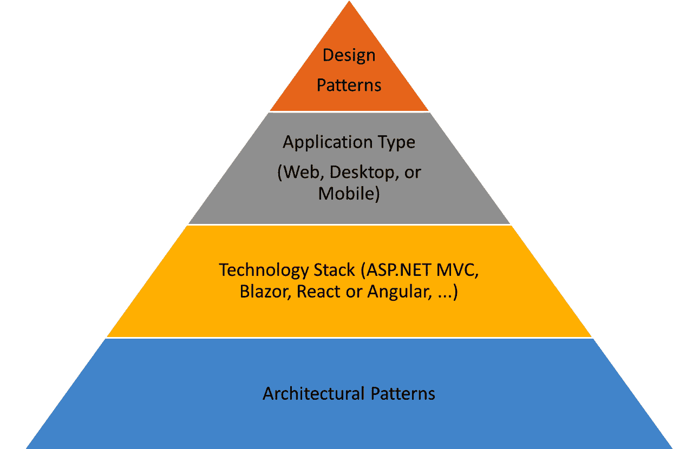

图 5.1：架构决策的各个层次

在前面的图中，你可以看到选择架构模式是你必须最早做出的决定之一。随后，你应该选择将用于构建产品的正确技术栈。之后，你需要决定应用程序的类型以及将帮助你组织代码并使其可重用和可扩展的设计模式。

现在，让我们从了解最流行的架构模式开始。

# 流行的架构模式

在本节中，我们将探讨五种流行的架构模式。我们将解释每种模式的核心理念，然后概述每种架构模式的关键组件。这应该有助于你了解架构模式的有用性，并支持你为提出的解决方案选择正确的模式。让我们从分层架构开始。

## 分层架构

这种架构在大多数建筑师和开发者中广为人知，被称为**n 层架构**。它用于将系统结构化成不同的层，每一层都由一组基于特定上下文分组在同一个组件中的类组成。这些层是水平结构的，以便每一层都可以消费来自它自己或其下多个层的服务。

在大多数情况下，这种架构由三个主要层组成，如下面的图所示：

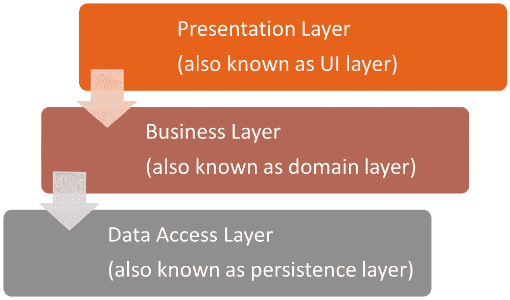

图 5.2：典型的 3 层分层架构

如前图所示，这些是三个主要层：

+   **表示层**：这一层代表负责通过页面、菜单、按钮、链接、报告、表单等方式处理所有用户交互的组件。它包含所有图形设计，并定义了应用程序的外观。它是唯一对最终用户可见的层。

+   **业务层**：这一层包含业务逻辑、业务规则和实体，它们定义了整个解决方案的行为。

+   **数据访问层**：这一层包含负责操作数据库层的代码，这是所有数据存储的地方（例如，**SQL Server**、**Oracle**和**MongoDB**）。

以下截图显示了使用**Razor Web 应用**和**.NET 5**类库在**Visual Studio**中实现的 3 层架构：

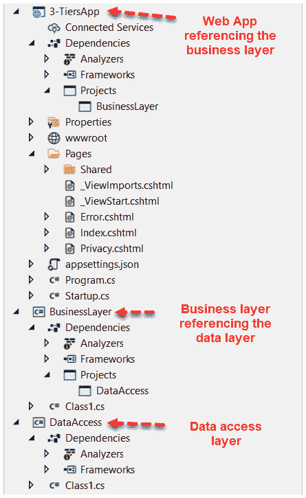

图 5.3：Visual Studio 中的 3 层架构

在前面的示例架构中，**数据访问层**是最低层，不引用任何其他层。它应该包含操作数据库表的**ADO.NET**调用或**EntityFramework**调用。

**业务层**引用**数据访问层**。它应该包含所有业务逻辑和实体；在这里，实体代表映射到数据库表的业务对象。至于**表示层**，这是包含用户界面的**Web 应用**。它引用**业务层**，不允许直接调用**数据访问层**。**Web 应用**可以是 MVC 应用或 Razer 应用，因为可以混合这两种模式来构建解决方案。

在下一节中，我们将更详细地了解表示架构。

## 表示架构

在解决方案的用户界面（**UI**）中，我们可能会遇到的一个主要问题是存在难以维护和扩展的杂乱代码。我们在许多网络表单解决方案中都看到了这种情况。这使得架构展示模式变得极其重要，因为它通过清晰的职责分离和低耦合来组织源代码，从而消除了任何复杂性，并使 UI 代码井然有序且易于管理。

这种架构模式有助于解决主要的 UI 问题，如与 UI 耦合的逻辑、状态管理以及 UI 元素与业务实体之间的同步。

如以下图表所示，有三种类型的展示模式：

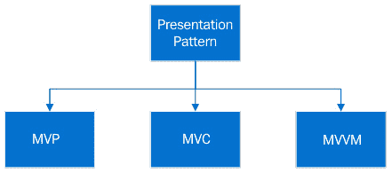

图 5.4：各种展示模式类型

所有这些模式都侧重于将 UI 与逻辑解耦，从而允许有整洁的**HTML**标记。让我们在接下来的部分中探索这三种类型。

### MVC（模型，视图，控制器）

MVC 模式让你完全控制标记。它非常受欢迎，Visual Studio 已将其作为创建新**ASP.NET**项目的默认模板。它将应用程序分为三个主要组件：

+   **模型**：这封装了业务逻辑并包含要在视图中显示的数据。

+   **视图**：这通过 UI 显示内容。

+   **控制器**：这处理用户交互，与模型一起进行数据更新，最后选择一个视图来渲染内容。

以下图表显示了三个主要组件，并说明了哪些组件引用了其他组件：

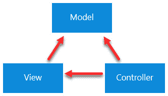

图 5.5：MVC 模式

下面是一个使用**Visual Studio 2019**和**.NET 5**的 MVC 项目模板示例：

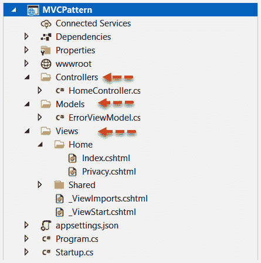

图 5.6：Visual Studio 中的典型 MVC 项目模板

在前面的示例架构中，你可以看到三个组件封装在同一个项目中，但存在于不同的文件夹中。你也可以为每一层创建一个单独的项目，然后配置引用。

### MVP（模型，视图，演示者）

MVP 模式是一种 UI 展示架构，被认为是 MVC 模式的衍生。它将架构分为三个主要组件：

+   **模型**：这包含解决方案的业务逻辑。

+   **视图**：这包含封装数据属性的接口，我们将将其发送到或从 UI 接收。与 MVC 模式相比，它不包括 UI。

+   **演示者**：它从**模型**检索数据并将其绑定回视图。它作为**模型**层和**视图**层之间的中间层。

以下图表说明了 MVP 模式的三个主要组件：

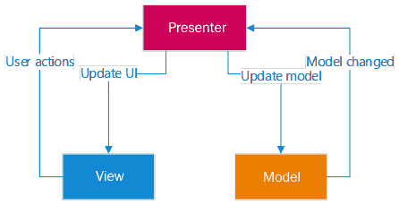

图 5.7：MVP 模式

这里是 Visual Studio 中使用 **Razor Web 应用** 和 **.NET 5** 类库的 MVP 项目模板。检查项目之间的引用，以便了解三个组件之间的关系：

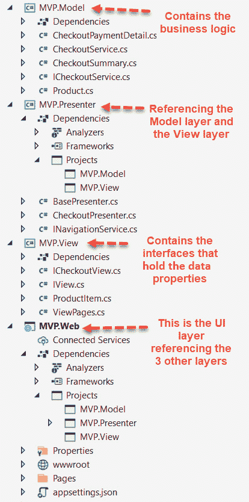

图 5.8：Visual Studio 中的典型 MVP 项目模板

在前面的示例架构中，你可以看到 UI 位于 Web 应用中，它引用了 **模型**、**视图** 和 **演示者** 层。视图层不引用任何其他项目。它包含在演示者层中实现的接口。模型层包含业务实体和业务逻辑；它不引用任何其他项目。至于演示者层，它包含在视图层中定义的接口的实际实现。因为它在它们之间扮演着中间角色，所以它引用模型和视图层。

让我们接下来探索第三种表示架构。

### MVVM（模型、视图、视图模型）

这种架构也被认为是 MVC 模式的扩展。它也包含三个主要组件。它通过提供高可重用性和可伸缩性，结合了 MVC 和 MVP 的最佳优势。这种架构的关键概念是将逻辑从控制器移到 **视图模型**：

+   **模型**：这包含业务规则和模型类。

+   **视图**：这包含 UI。

+   **视图模型**：这是 **视图** 和 **模型** 之间的中间层。

以下图表显示了这三个组件以及它们如何相互交互：

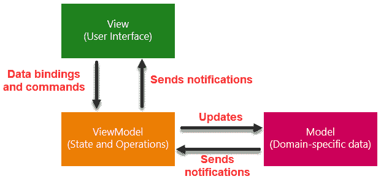

图 5.9：MVVM 模式

注意 `Session`、`ViewBag` 或 `TempData`。

这里是一个使用 **Visual Studio**、**MVC** 和 **.NET 5** 的 MVVM 模式示例项目模板：

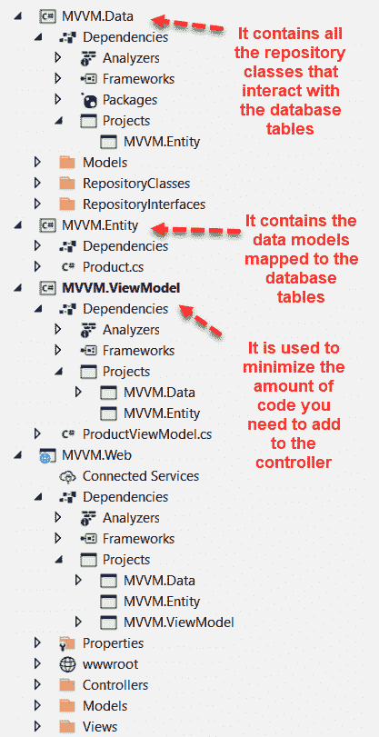

图 5.10：Visual Studio 中的典型 MVVM 项目模板

我们还可以使用 Razor Pages 项目模板，因为它遵循 MVVM 模式。这使得双向数据绑定成为可能，因为模型和控制器代码附加到 Razor 页面，从而允许以关注点分离的方式实现简单的开发体验。

理解这三种表示架构之间的区别非常重要，这样你才知道应该为你的解决方案使用哪种模式。

现在，让我们来了解干净的架构。

## 清洁架构

在 n 层分层架构中，我们了解到一切皆依赖于数据库层，这被视为一个传递依赖。清洁架构被认为是领域中心架构。业务逻辑和应用层是设计的中心。与 n 层架构中业务逻辑依赖于数据访问层的情况不同，清洁架构通过强制基础设施和其他层依赖于应用核心来反转这种依赖关系。

下面的图示展示了可以用来可视化这个架构的典型技术。它使用一系列同心圆，类似于洋葱的环：

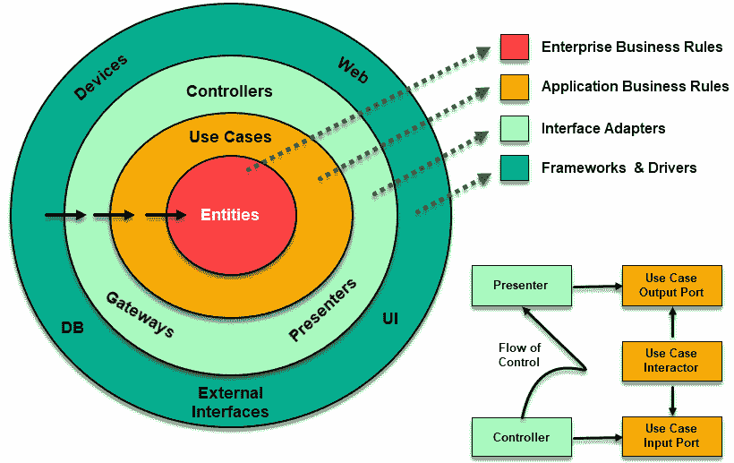

图 5.11：清洁架构洋葱视图

在前面的图中，圆圈代表系统的不同组件，应用核心由实体和用例组成。影响这个架构的关键因素是依赖规则。它强制组件的依赖关系流向中心。内圈中的组件永远不应该依赖于外圈中的任何东西。

因此，如果我们在外圈声明一个函数或类，它不应该在内圈中可见。在图中，你可以看到依赖关系是如何从最外圈流向用例和实体所在的位置的。

让我们探索这个架构的关键组件：

+   实体代表业务规则，如对象和相关方法。

+   用例表示应用的核心，其中实现了系统的所有用例。它管理从实体到实体之间的数据流。这一层不受外部层（如数据库或 UI）可能发生的更改的影响。

+   接口适配器是包含 MVC 组件（如控制器、视图和演示者）的层。在这一层中，它扮演着中间角色，将来自用例和实体的数据转换为适合外部组件（如数据库和控制器）的格式。这一层的模型用作在用例和演示者或视图之间交换数据的数据结构。

+   框架和驱动器代表这个架构的最外层。这一层包含数据库和所有 UI 代码。

下面的图示展示了这个架构的水平视图：

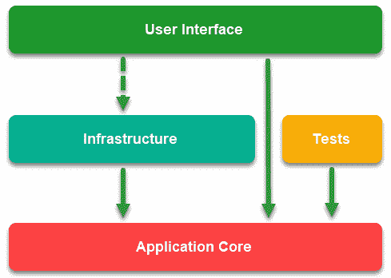

图 5.12：清洁架构水平层视图

在此图中，存在两种类型的依赖关系，它们通过箭头的样式来表示。实线箭头表示编译时依赖，而虚线箭头则代表仅运行时依赖。**用户界面**层处理应用程序核心中定义的接口，但没有直接访问**基础设施**层中的实现。这些接口在运行时通过**依赖注入**绑定到具体的实现。

提示：

依赖注入是一种软件设计模式。这种模式的主要目的是允许你拥有松耦合的代码，支持如整洁架构这样的架构模式，以减少层之间的紧密耦合。它通过使用构建器对象初始化对象，然后在运行时注入这些依赖来替换类之间的硬编码依赖。

下面的截图显示了使用 **Visual Studio**、**.NET 5** 和 **Angular 10** 的整洁架构解决方案模板：

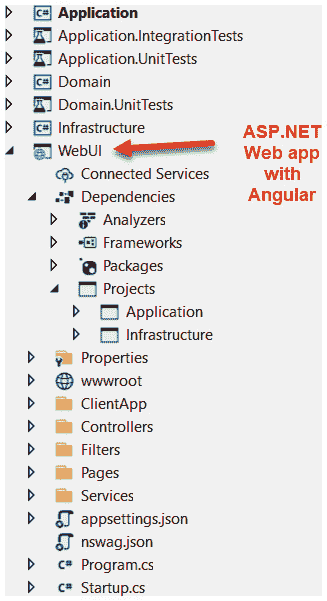

图 5.13：使用整洁架构的典型项目模板

让我们探索这个 .NET 解决方案中的每个项目：

+   最内层是 `Domain` 项目。它不引用任何其他层，如以下截图所示。在右侧，你可以看到一个实体类的示例：

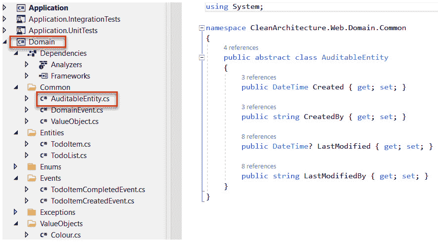

图 5.14：整洁架构中的实体项目

+   接下来，我们有 `Application` 项目。正如你所见，它引用了 `Domain` 项目。它通过定义将在基础设施层中实现接口来包含所有应用程序逻辑：

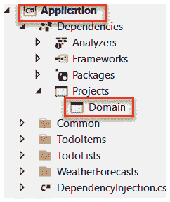

图 5.15：整洁架构中的应用程序项目

+   接下来，我们有 `基础设施` 层，它包含在 `Application` 层中定义的接口的具体实现。根据以下截图，你可以看到它引用了 `Application` 层：

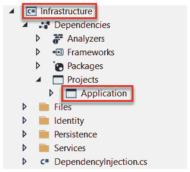

图 5.16：整洁架构中的基础设施项目

+   最外层是 `WebUI`（请参阅 *图 5.13*）。这是一个单页应用程序，它使用 `Application` 层和 `基础设施` 层。

许多 .NET 解决方案模板支持这种架构，你可以在 **GitHub** 或 **NuGet** 上找到它们。你可以从 NuGet 下载其中一个模板，以开始使用整洁架构。以下截图显示了安装我们用来探索此架构的相同模板所需的 NuGet 命令行：

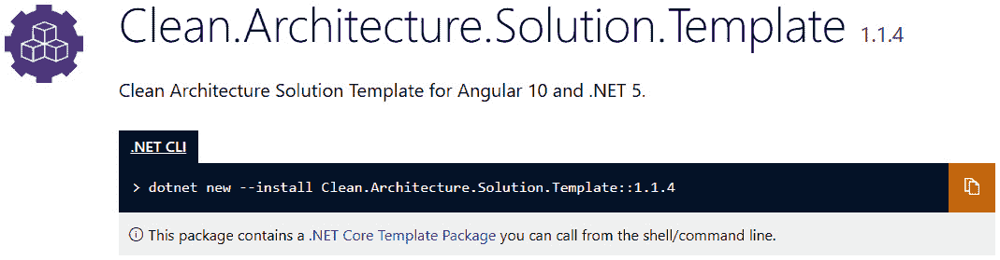

图 5.17：安装干净架构解决方案模板所需的命令行

在本节中，我们学习了干净架构及其主要组件。在下一节中，我们将探讨被认为是现代架构之一的微服务架构。

## 微服务架构

微服务架构允许你将解决方案划分为各种组件。每个组件完全独立于其他组件，并提供了特定的服务。以下图表显示了微服务架构：

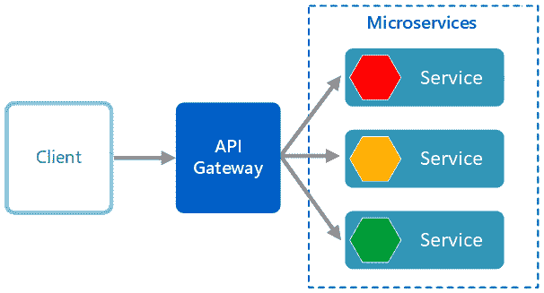

图 5.18：微服务架构风格

根据前面的图表，你可以看到微服务架构由一系列独立的服务组成。每个服务都是自包含的，并且应在业务域内提供单一的业务能力。

让我们考察这种架构模式的特点：

+   **微服务**是小型、自治且松散耦合的服务。每个服务都有自己的代码库，并且可以由一个小型开发团队开发和维护。

+   每个**服务**应该是自包含的，并且单独部署。更新一个服务不需要你重新部署整个解决方案。

+   服务负责拥有自己的数据访问层，因为每个服务都有自己的私有数据库。

+   每个服务的内部实现对其他任何服务都是不可见且不可访问的。服务之间的通信是通过适当的 API 实现的。

+   **客户端**应用无法直接访问服务。通过 API 网关消费这些服务，它将调用转发到适当的服务。

以下截图显示了一个基本的微服务项目：

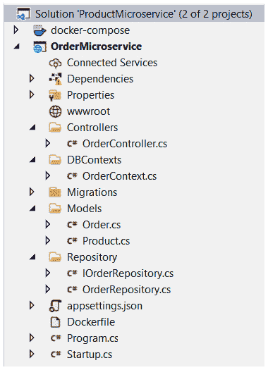

图 5.19：一个示例微服务项目

在前面的截图中，你可以看到一个被电子商务解决方案消费的订单微服务。这个微服务项目的核心组件如下：

+   `Models`：这些是包含映射到数据库字段的属性的数据实体。

+   `OrderContext`：这个类从实体框架 `DBContexts` 派生。它是实体订单和数据库之间的桥梁。

+   `OrderRepository`：这个类包含 CRUD 函数，例如 `GetOrder`、`CreateOrder` 和 `UpdateOrder`。这个类应该实现 `IOrderRepository` 接口。

+   `OrderController`：这是一个从 `ControllerBase` 派生的类。它包含所有的 API RESTful 动作。

+   `Docker`：这是一个容器，它应该通过将所有依赖项捆绑成一个单一单元来简化微服务的部署和测试。它允许你在隔离的环境中运行微服务。

Web API 请求由`OrderController`类处理。控制器将调用存储库中的一个函数，该函数将使用`DBContexts`以及模型与数据库进行通信，以便返回、添加或编辑请求的数据。

在下一节中，我们将探讨面向服务架构。

## 面向服务架构

**面向服务架构**（**SOA**）允许您消费网络中可用的服务。其结构类似于 n 层架构；区别在于表示层不能直接调用业务层，也就是说，它只能通过服务来调用。以下图表显示了分层结构中的 SOA：

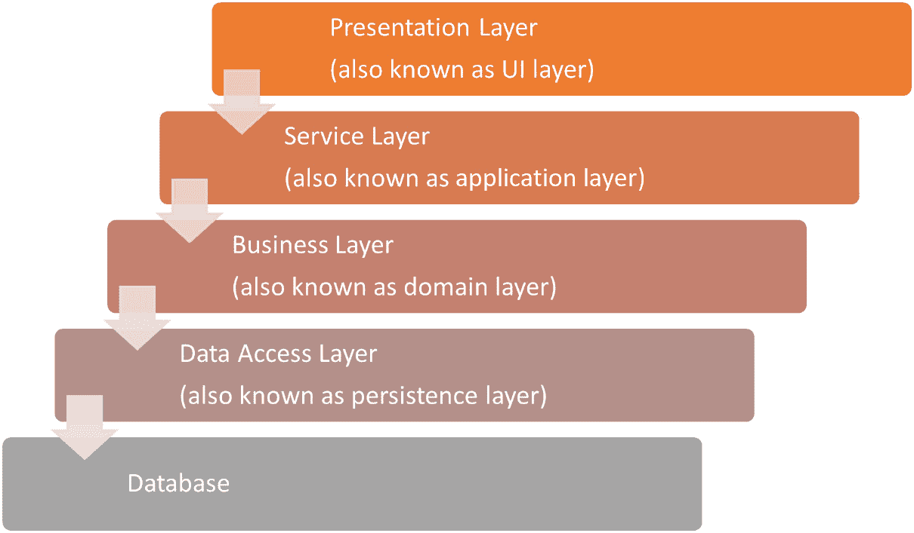

图 5.20：SOA

如您所见，**服务层**是一个位于**表示层**和**业务层**之间的抽象层。有了这一层，**表示层**就不需要直接与**业务层**通信。在这种情况下，您可以更改**业务层**而不会影响**表示层**。

*微服务架构和 SOA 之间的区别是什么？* 好吧，答案是范围。微服务架构是一种基于云的架构；它促进自治服务，这些服务是自包含的，针对应用范围。而 SOA 具有企业范围，每个服务不需要有独立的数据库。它可以处理多个业务能力；微服务则不同，它一次只处理一个单一的业务能力。

这里是一个列表，列出了支持您实现服务的.NET 技术（SOA）：

+   **.NET Web 服务**：这是基于**Web 服务描述语言**（**WSDL**）（也称为**XML Web 服务**）。它是一个包含一组函数的服务层，这些函数使用标准化的 XML 消息系统。

+   **Windows Communication Foundation**（**WCF**）：这是.NET 框架的一部分，用于构建面向服务的解决方案。通过使用 WCF，您可以从一个端点发送任何类型的数据，例如异步消息，到另一个端点。

+   **ASP.NET RESTful Web API**：这也是.NET 框架的一部分。它用于构建可以被任何类型的应用程序（包括 Web 和移动应用程序）消费的 HTTP 服务。

在本节中，我们探讨了可以帮助我们为我们的解决方案创建坚实基础的一些流行的架构模式。采用架构模式至关重要，因为它使我们的平台更具可扩展性，并提高了产品的整体性能。此外，它将防止代码冗余。

在下一节中，我们将探讨另一组您应该了解的架构模式。

# 探索其他架构模式

在本节中，我们将深入探讨一系列额外的架构模式，这些模式将使您能够执行高级可扩展性和系统解耦。我们将逐一研究每种模式，以了解其工作原理。这将帮助我们构建更优化的系统，其中包含可重用模块和有组织的结构，允许进行扩展。

## 服务器端无服务器模式

**无服务器架构**推广云平台和云原生代码。这是一种允许我们在第三方基础设施中托管解决方案的模式。使用这种方法，开发者将不再需要担心管理服务器软件和硬件。此模式允许我们将应用程序拆分为小型且自主的函数，这些函数可以单独触发和扩展。

以下图示说明了单页 Web 应用的无服务器架构：

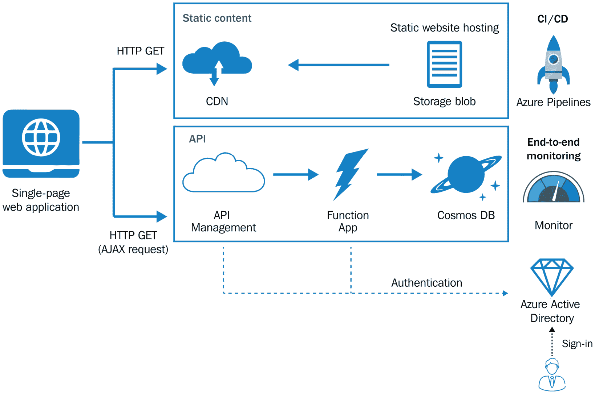

图 5.21：Web 应用的无服务器架构

我们可以使用**Azure**无服务器基础设施来实现此模式。Azure 函数包括以下内容：

+   **CDN**：这代表**内容分发网络**。它缓存内容以获得更好的响应时间。

+   **Azure Blob Storage**：这允许您在**微软**的数据存储平台上存储大量非结构化数据。

+   **Function App**：这是一个事件驱动的模型，它提供了通过 HTTP 请求由客户端触发的自主函数的能力。请求的路由由 API 网关管理，将在下文中描述。

+   **API Management**：这是一个位于函数前面的 API 网关。它允许您将前端应用程序与后端中定位的函数解耦。使用这种 API 管理，我们可以在请求到达后端具体函数之前重写 HTTP URL 并管理请求。Azure API 管理还用于克服以下跨领域关注点：

    a. 缓存 HTTP 响应

    b. 监控和审计日志 HTTP 请求

    c. 启用**跨源请求共享**（**CORS**），允许跨域访问

    d. 强制执行策略，如检查 HTTP 请求并应用调用速率

    e. 通过使用**Auth2.0 授权**与**Azure Active Directory (Azure AD**)强制执行认证机制来保护您的 API

+   **Azure Cosmos DB**：这是 Azure 提供的**NoSQL**数据库服务，用于构建现代应用程序。

+   **Azure AD**：这是常规活动目录的云版本。它用于验证用户。

+   **Azure Monitor**：它收集有关解决方案和资源使用的性能指标。

+   **Azure Pipelines**：这是由 Microsoft Azure 提供的另一项服务。它提供**持续集成**（**CI**）和**持续交付**（**CD**）服务，以自动构建、测试和部署您的代码到任何可访问的目标。

如果您希望实现微服务架构或想要扩展解决方案并从按需付费服务中受益，此模式非常完美。

## 客户端-服务器模式

**客户端-服务器模式**是一种涉及两种类型实体的网络架构：客户端和服务器。它用于有服务器扮演服务提供者角色，而多个客户端扮演服务消费者角色的场景。以下图描述了该架构背后的逻辑：

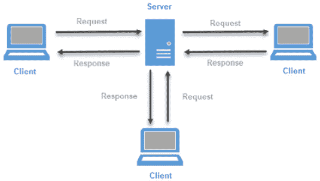

图 5.22：客户端-服务器架构

正如前图所示，**客户端**组件通过 **TCP/IP** 协议向服务器发送 HTTP 请求。请求被处理，服务器连接到数据库 **服务器**，然后向 **客户端** 发送响应。

## 事件驱动模式

**事件驱动架构**是另一种允许我们高度解耦应用程序的模式。它是一组服务的集合。每个服务异步工作，并在其数据更新时发布事件。客户端组件订阅事件以接收或发送更新。

假设我们正在构建一个电子商务解决方案，其中客户在提交订单时使用优惠券代码。系统必须确保同一客户只能使用一次优惠券代码。由于客户信息、订单数量和优惠券代码详情位于不同的数据库中，系统不能简单地验证优惠券代码的使用情况。解决方案是使用事件驱动模式来维护不同服务之间的数据一致性。

以下图显示了 Azure 事件驱动架构：

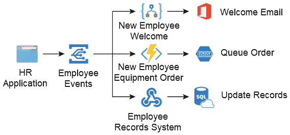

图 5.23：事件驱动架构

在前图中，请注意 **HR 应用程序** 如何订阅 **员工事件**，以及每个事件都有其自己的逻辑和数据库。

## 管道-过滤器模式

**管道-过滤器模式**由将复杂过程分解成一组较小任务组成。这种方法预计将提高我们应用程序的性能，以及每个任务的复用性和可维护性。单个事件触发一系列多个步骤，每个步骤执行特定的任务。以下图显示了使用管道-过滤器架构实现的示例过程：

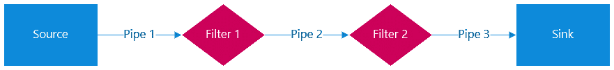

图 5.24：管道-过滤器模式

**Azure Data Factory** 是此模式的良好示例，它允许您在云中创建数据驱动的自动化工作流，用于数据提取、分析和转换以及加载。

在本节中，我们探讨了一系列你应该了解的架构模式。每一种都提供了一种独特的实现方法，并为你的解决方案带来了关键优势。在下一节中，我们将学习如何在设计解决方案时选择正确的架构模式。

# 选择正确的模式

在前面的章节中，我们学习了主要的架构模式。然而，你可能已经注意到，在这一章中我们没有讨论一些模式。实际上，一些模式将在未来介绍。因此，你需要一种方法来分析一个模式，并决定你是否想选择它。你可能会被问到的一个问题是*我们如何为我们的解决方案选择正确的模式？* 让我们深入探讨这个问题。

架构设计是构建稳固和成功系统的基石。然而，在选择适合你解决方案的正确架构时，并没有一种适合所有情况的解决方案。当你想要决定使用哪种架构模式时，应该考虑各种不同的视角。

简而言之，选择架构模式的主要标准基于三个因素：

+   **软件工程师**（将参与项目）：软件工程师应该熟悉你提出的架构。这样，他们可以轻松地导航解决方案结构，并根据需求开始实现新功能。然后，在产品交付的后期，他们应该能够清楚地了解如何修复任何缺陷以及哪些层需要修改。这是团队高效工作并交付成功稳定产品的一个重要因素。

+   **客户**: 从客户的角度来看，他们寻求的是在保持效率的同时，获得高质量的产品。此外，他们还希望确保实施后的架构能够在产品发布后支持额外的功能和修改。他们希望他们的产品具有良好的架构、可扩展性和易于维护。

+   **产品类型**: 注意，仅仅因为某个架构模式广受欢迎或流行，就选择它并不是一个好的做法。不要假设这样做会带来更好的产品。然而，架构模式的选择应该基于你的需求和我们要构建的解决方案类型。这将使你能够交付一个成功的产物。

我们已经探讨了应该影响你选择架构的三个主要因素。此外，这里有一个关键特征列表，当你选择架构模式时你应该考虑：

+   **敏捷性**: 我们应该考虑选择允许高度敏捷的架构，这有助于我们轻松拥抱和实施额外的功能和变更。

+   **部署的便捷性**: 我们选择的架构应该使我们能够轻松部署产品。

+   **可测试性**: 架构应该允许实现高可测试性。

+   **性能**: 这是一个重要的因素。架构应该允许实现高效率。

+   **可扩展性**: 架构必须允许我们扩展我们的系统，这意味着增加其容量。

+   **开发简便性**: 架构应该被开发者所熟知，以确保产品的开发和实施简便。它应该允许开发者在需要时对系统进行故障排除和修复缺陷。

可能导致系统完全失败的主要原因之一是选择了错误的架构模式。这就是为什么选择适合您系统的正确架构模式很重要，因为它将解决你在项目生命周期几个阶段可能遇到的各种问题。

# 摘要

在本章中，我们探讨了在许多解决方案中广泛使用的核心架构模式，以及一些现代模式，如清洁架构和微服务架构。我们还了解了一系列重要的架构模式，这些模式允许你进行系统解耦和可扩展性。最后，在本章中，我们探讨了在选择合适的架构模式时需要考虑的关键因素。

在下一章中，我们将深入探讨核心架构考虑因素，例如设计质量属性以及如何合理规划系统缓存、异常处理和部署。
