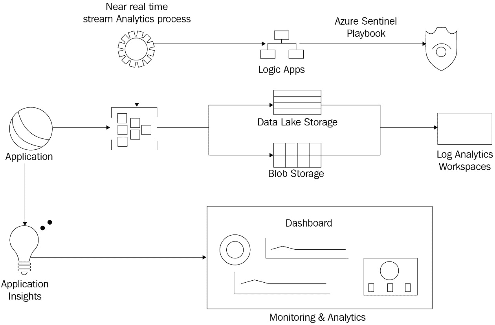

# 第六章：*第六章*：架构考虑事项

在上一章中，我们学习了一系列你必须知道的架构模式，这些模式对于设计和构建一个成功的解决方案至关重要。这些模式是必不可少的，因为它们为开发团队设定了路径，并解决了与解决方案敏捷性、可扩展性和性能相关的客户关注点。在本章的后面部分，我们简要概述了一系列影响你选择正确模式的影响架构特性。

在本章中，我们将深入探讨应考虑的质量因素，例如可重用性、可用性、性能、安全性、开发时间和类似的质量要求。此外，我们还将了解规划异常处理、跟踪和部署的最佳实践。

下面是本章我们将涵盖的主题：

+   探索解决方案架构的设计和运行时质量属性

+   学习如何规划异常处理、跟踪和部署

+   网络应用程序中的缓存

在本章结束时，通过探索设计和运行时质量属性，你将了解到什么使得架构模式最适合你正在构建的产品。我们还将通过学习最佳实践来丰富你的知识，例如实施缓存以提升性能和整体用户体验，记录以在集中位置跟踪报告的错误，以及部署技术。

# 了解质量属性

一个有组织的解决方案架构为你的开发团队设定了正确的路径，并使得维护不同的质量特性变得容易，这将从许多方面进一步提升产品的质量。

在我们开始探索各种质量属性之前，让我们首先了解什么是质量属性。**质量属性**是定义系统质量的一个属性，它是系统的一个可测量或可测试的特征，用于指示所选架构如何满足客户的需求。质量属性有两种类型：可以在设计时测量的属性和可以在运行时或执行期间测量的属性。以下图表展示了我们将在本章中讨论的各种属性及其相应的类型：


图 6.1：软件架构质量属性

让我们在以下章节中探索这些质量属性。

# 探索设计质量属性

对于开发团队来说，产品的业务功能在重要性方面占据首位。我们经常专注于满足客户的职能需求，而在产品发布后，我们可能会注意到一些质量缺陷，例如产品难以维护或扩展。此外，我们可能会遇到性能问题或安全漏洞。在本节中，我们将探讨在软件架构阶段应解决的设计质量属性。

## 可维护性

**可维护性**是关键软件质量属性之一。它指的是架构支持产品行为未来变化的能力，例如引入具有新业务需求的功能或修改现有功能。

维修哲学也影响这一属性的测量，该属性指的是系统在故障后恢复所需的时间。我们的代码耦合度越高，组件开发中过度依赖性越强，产品就越难以维护。随着这一属性的存在，软件工程师开始将关注点分离的概念引入到架构中，例如在微服务架构中得到支持。

提高产品的可维护性可以极大地提升团队的生产力并降低添加新特性的成本。以下是一些提高可维护性的关键技术：

+   选择一种架构，通过低耦合来分离组件的责任，这应在系统中创建定义良好的层并简化系统中的变更。

+   使用接口来最大化系统插件模块的使用，这将允许更多的灵活性和可扩展性。

+   提供详细的文档来解释系统中的面向对象结构。

## 灵活性

**灵活性**指的是架构适应不同用户和系统需求变化的能力，这可能包括硬件变化、软件变化，甚至是业务规则的变化。你投入越少的精力来应对变化，它就越灵活；重新配置和部署系统越容易，它就越灵活。

一个灵活的软件架构能够适应变化，因此让我们检查以下提高灵活性的关键技术：

+   考虑使用业务层来封装业务规则。我们只能在业务规则发生变化时修改这些层。

+   考虑使用可配置的业务工作流引擎，例如**Microsoft Power Automate**。

+   考虑在系统中实现层，以将用户界面与业务逻辑和数据访问功能分离。

+   设计层次结构以保持一致性，并使其松散耦合，以最大化灵活性并促进组件的替换和复用。

## 可复用性

**可重用性**也是软件质量的关键属性之一。它指的是现有组件、类和函数可以被重用来开发新模块、新功能甚至新应用程序的程度。它消除了代码的重复，并最小化了实现新组件所需的时间。

可重用性是一种应该谨慎考虑其给系统带来的益处的应用方法。以下是一些提高可重用性的关键技术：

+   识别组件之间的横切功能，并实现我们可以跨不同组件重用的通用类和函数，以提供验证、日志记录、跟踪、授权和认证等功能。

+   考虑通过 Web 服务或 Web API 公开业务逻辑，以将此逻辑提供给不同的系统或平台，例如 Web 和移动设备。

+   使用可以通过不同组件访问的数据类型和结构。

## 集成性

**集成性**概述了组件通过作为整体系统架构一部分的信息交换而协同工作的方式。它还包括编码标准和命名约定，以及影响组件一致性的其他因素，使得开发者更容易理解代码并维护它。它还衡量了系统与其他系统集成的能力。

应用集成性以改善系统不同组件之间的和谐性有许多优势。以下是一些最大化集成性的关键技术：

+   强制执行预定义并可供开发团队使用的编码标准，并为整个系统架构提供详细的文档。

+   考虑使用 Web 服务或网关层与遗留系统集成。

+   进行代码审查会议，以确保在实施过程中遵守指南。

## 可测试性

**可测试性**是一个质量属性，它表明系统允许我们创建测试用例并执行测试计划以确定系统是否按要求工作的程度。它允许我们以有效的方式识别系统中的故障，并基于预定义的测试用例。

我们应该尽早发现缺陷、性能问题和安全漏洞，因为这比在产品发布时让客户发现它们要便宜得多。让我们了解一些提高可测试性的关键技术：

+   在**Visual Studio**中创建测试用例，然后运行测试计划并检查测试结果。这也适用于**Azure DevOps**。

+   在测试用例中使用模拟对象来构建不同的场景。

+   让我们的架构支持模块化组件，以便进行详细的测试。

+   创建单元测试以测试系统中的每个单个功能。

建议持续提高我们的学习曲线并提升我们的技能，以确保我们能够应用所有这些设计属性。这将导致创建平衡且高度高效的软件解决方案和产品。

在下一节中，我们将探讨运行时质量属性。

# 理解运行时质量属性

运行时质量属性是一组在系统在实际场景中执行期间测量的属性。它们代表了一组有助于测量软件产品性能和安全性以及其他质量约束的功能。

必须评估这些质量属性，以便主动采取行动，确保它们得到适当维护，从而向最终用户提供优质的产品。以下是对每个运行时质量属性的介绍，以及一些关键技术，深入探讨应考虑的改进细节。

## 性能

**性能**是每个客户端最重要的质量属性。它指的是系统在给定约束（如时间、准确性或内存使用）下执行特定功能的响应性。它包括两个指标，即*延迟*，这是对系统中触发的事件做出响应所需的时间，以及*吞吐量*，这是在给定时间框架内可以发生的事件数量。

我们都知道，有些产品由于性能问题而未被使用。因此，让我们了解一些提高性能的关键技术：

+   考虑使用异步调用。

+   使用**数据传输对象**（**DTOs**）来最小化从服务器发送到前端客户端的数据大小。

+   避免比必要的更频繁地检索数据，并在返回数据集合时使用分页。

+   使用性能分析工具，例如**Visual Studio 诊断工具**来识别对性能有重大影响的代码。

+   最小化前端资源，如**JavaScript**和**CSS**文件。

+   考虑使用**Azure** **函数**来处理长时间运行的请求，因为进程外函数有助于最小化 CPU 使用。

+   通过使用 HTTP 压缩来减小 HTTP 响应的大小。

+   总是使用 ASP.NET Core 的最新版本，因为它包含许多改进。

## 安全性

**安全性**是系统的基本组成部分。它指的是任何系统都应受到保护，防止数据泄露和未经授权的访问尝试。确保系统安全始于实施适当的身份验证和授权机制。此外，防止系统资产被未经授权的修改也是必须的。这就是为什么我们应该始终部署编译后的程序集，而不是直接上传.NET 类。

为了保护我们的系统，我们必须深入了解我们想要部署产品的环境，我们需要授予用户什么类型的访问权限，以及他们可以访问什么。重要的是要知道，我们需要应用各种机制来提高保护级别。

我们对潜在威胁了解得越多，采取的行动就越能避免它们，我们就越能保护系统。定期对产品进行安全漏洞测试是防止可能损害客户声誉和损害其品牌信誉的数据泄露的必要措施。让我们检查以下关键技术，这些技术应该有助于我们提高产品的整体安全性：

+   创建一个定期任务来备份数据库和系统资产，并将它们存储在安全的位置，这样在需要时可以快速恢复。

+   测试恢复过程以确保备份能够正常工作。

+   应用稳健的认证和授权流程。

+   永远不要信任用户输入，始终验证数据输入，并使用存储过程来防止**SQL 注入**。

+   永远不要使用字符串连接来创建 SQL 语句。

+   对数据库中保存的密码进行编码。

+   不要在隐藏字段中存储敏感数据。

+   实施审计日志功能以记录系统中的每一个事件。

+   如果系统对客户来说是至关重要的，考虑实施集群服务器架构。

## 可靠性

**可靠性**是指系统在不需要进行维修或修改的情况下，随着时间的推移能够执行所有由用户触发的任务和事件的能力。系统在运营的早期阶段具有较高的可靠性概率。这个概率会随着时间的推移而开始降低。提高系统的可靠性需要我们识别最重要的用户旅程，然后分析它们以检测我们可以改进的区域。这种方法将使我们能够创建关于对用户最重要的服务和功能的指标。

这个质量属性对于系统提供的服务连续性至关重要。以下是一些提高我们系统可靠性的关键技术：

+   跟踪我们系统中使用最频繁的服务性能，以识别性能不佳或故障。

+   审计对 Web API 和 Web 服务的调用。

+   考虑实施故障转移计划。

+   考虑分析客户投诉以排除故障并确定应改进的服务。

## 可用性

**可用性**是一个评估系统用户界面的质量属性。它显示了使用系统的难易程度。如果用户不喜欢设计或者发现很难找到他们想要的东西，他们可能会停止使用该系统。这就是为什么可用性是导致用户采用系统的主要因素之一。构成可用性属性的有五个关键因素：

+   **易学性**：这个因素告诉我们用户第一次看到系统时执行任务有多容易。

+   **效率**：这个因素指定了用户完成主要任务的速度。

+   **记忆性**：这表示在长时间未使用系统后，记住执行主要任务的步骤有多容易。

+   **错误**：这规定了他们在系统中执行操作时遇到的错误数量，以及报告错误或恢复并继续完成任务有多容易。

+   **满意度**：这表明用户对整体设计的满意度。

在系统的最早设计决策中应仔细考虑可用性问题，以避免产品发布时最终用户的失望和挫败感。以下是一些关键技术的列表，以提高可用性：

+   考虑通过强制执行接受的 UI 设计标准来最大化易用性模式。

+   通过应用工作流简化用户交互和多步骤功能。

+   考虑使用异步调用以增加用户交互性，并执行后台任务，避免完整的后端调用。

## 互操作性

**互操作性**是一个质量属性，它评估了我们系统中组件在运行时成功合作执行任务以及高效交换信息的能力。

此外，互操作性是系统的一个属性，它负责系统的操作以及与其他系统的交互。这是一个不能忽视的属性。让我们了解一些关键技术来提高互操作性：

+   考虑使用连接器和 Web 服务来连接第三方系统并交换数据。

+   通过标准 Web 服务或 **REST API** 暴露功能，以与旧系统交换数据。

+   确保我们的架构设计允许组件之间有低耦合，以提高灵活性和可重用性。

在本节中，我们探讨了影响软件产品质量的运行时质量属性。这些属性应该在系统的实现和执行过程中被考虑和解决，以确保向我们的客户提供优质的产品。在下一节中，我们将探讨 ASP.NET Core 中的缓存机制。

# 网络应用程序中的缓存

**缓存**是一种技术，它允许我们在内存中存储频繁使用的数据。我们通常使用缓存来存储这些内容，然后在下一次请求相同内容时从内存中检索，而不是多次查询数据库以获取相同的内容。

缓存对于提高 ASP.NET Core 的性能和产品的整体用户体验至关重要。在 ASP.NET Core 中，有不同技术可以用于缓存数据。以下是这些技术的概述：

+   **内存缓存**：在这种技术中，服务器的内存用于存储数据。

+   **分布式缓存**：当我们的应用程序部署到 Azure 或托管在农场环境中时，使用此技术。缓存分布在参与此农场的服务器上。

让我们学习如何在 ASP.NET Core 中实现缓存。

## 在 ASP.NET Core 中实现缓存

在 ASP.NET Core 中，有两个内置的主要接口，您可以使用它们开始缓存关键任务的 内容：`IMemoryCache` 和 `IDistributedCache`：

+   `IMemoryCache`：这是一个允许我们应用本地内存缓存的接口。

+   `IDistributedCache`：这是一个提供一系列方法来在分布式环境中操作缓存的接口。

#### IMemoryCache 示例

以下代码演示了使用 `IMemoryCache` 来避免多次查询数据库获取相同内容的示例：

```cs
public class NewsService
{
    private const string NewsCacheKey = "news-cache-key";
    private readonly IMemoryCache _cache;
    private readonly IDatabase _db;
    public NewsService(IMemoryCache cache, IDatabase db)
    {
        _cache = cache;
        _db = db;
    }
    public async Task<IEnumerable<NewsItem>> GetNewsList()
    {
        if (_cache.TryGet(NewsCacheKey,            out IEnumerable<NewsItem> news))
        {
            return news;
        }
        news = await _db.getLatestNews<NewsItem>(...);
        _cache.Set(NewsCacheKey, news,            new MemoryCacheEntryOptions
         {
    //sliding expiration force the cache to become         expired after 1 day.
         SlidingExpiration = TimeSpan.FromDays(1)
          });
        return news;
    }
}
```

在这个示例中，我们有一个 `NewsService` 类，其中有一个从数据库获取所有更新的方法。我们不想每次都查询数据库，而是想显示新数据。因此，我们决定使用 `IMemoryCache` 接口来利用其缓存机制。在 `GetNewsList` 方法中，如果可用，我们返回数据的缓存版本；否则，我们查询数据库然后将内容存储在缓存中。

#### IDistributedCache 示例

当应用程序托管在 Web 农场或云服务上时，应使用此接口。此接口不使用服务器的本地内存。此缓存由多个 Web 服务器共享。有各种选项来实现 `IDistributedCache` 接口：

+   我们可以使用 SQL Server 分布式缓存。此缓存将存储在 SQL 表中。为此选项，我们需要添加以下 `Microsoft.Extensions.Caching.SqlServer`。

+   我们可以使用 `Microsoft.Extensions.Caching.StackExchangeRedis`。

下面是一个示例，展示了如何使用 `IDistributedCache` 接口进行缓存：

```cs
public class NewsModel : PageModel
{
    private readonly IDistributedCache _cache;
    public NewsModel(IDistributedCache cache)
    {
        _cache = cache;
    }
    public string CachedNewsTime { get; set; }
    public async Task OnGetAsync()
    {
        CachedNewsTime = "Cached Time Expired";
        var encodedCachedNewsTime =            await _cache.GetAsync("cachedNewsTime");
        if (encodedCachedNewsTime != null)
        {
            CachedNewsTime = Encoding.UTF8.GetString                 (encodedCachedNewsTime);
        }
    }
    public async Task<IActionResult> ResetCachedTime()
    {
        var currentTimeUTC = DateTime.UtcNow.ToString();
        byte[] encodedCurrentNewsTime = Encoding.UTF8             .GetBytes(currentNewsTime);
        var options = new DistributedCacheEntryOptions()           .SetSlidingExpiration(TimeSpan.FromSeconds(60));
        await _cache.SetAsync("cachedNewsTime",            encodedCurrentNewsTime, options);
        return RedirectToPage();
    }
}
```

在这个示例中，我们创建了一个 **Razor** 页面来显示时间和两个异步方法：一个用于获取缓存的时钟，另一个用于重置缓存。

在 `OnGetAsync` 方法中，如果可用，我们获取缓存的时钟。`ResetCachedTime` 方法用于设置缓存对象并定义滑动过期时间为 60 秒，这意味着如果 60 秒内未使用，缓存将被清除。否则，当它被消耗时，缓存的时间范围将再延长 60 秒。

在前面的两个示例中，我们试图解释 `IMemoryCache` 和 `IDistributedCache` 之间的区别以及如何使用它们。您可以在许多 Microsoft 在线论坛中找到有关如何在 ASP.NET Core 中配置和实现缓存的逐步示例。

在下一节中，我们将探讨 ASP.NET Core 中的日志和跟踪机制。

# 日志和跟踪的统一解决方案

.NET 日志提供程序用于将事件消息记录下来，以跟踪应用程序的执行，并在集中位置报告所有代码错误或应用程序异常。跟踪用于跟踪和查看系统单个流程的诊断信息。

日志和跟踪对于 .NET 团队至关重要，因为每次应用程序失败时，我们都会请求信息以排查问题并解决它。日志和跟踪的统一解决方案将为您解答以下问题：

+   *为什么系统未能完成该操作？*

+   *错误是在何时发生的？*

+   *代码中的哪个函数导致了异常？*

+   *函数之间交换的数据的状态是什么？*

对于托管在本地环境中的传统解决方案，日志和跟踪由运行应用程序可执行文件的同一步骤执行。至于使用微服务模式构建的现代云应用程序，每个服务都在特定的进程中运行。在这种情况下，日志和跟踪由每个微服务进程生成。

以下图显示了 Microsoft 推荐的架构，用于使用 Azure 服务实现统一的日志和监控系统：



图 6.2：使用 Azure 服务的统一日志和监控系统

让我们了解前图中展示的主要组件：

+   **事件中心**：这是一个实时数据摄取服务，与所有其他 Azure 服务完全集成。它用于在一个集中式中心记录所有类型的事件。

+   **Azure Monitor**：此工具用于创建操作仪表板，以帮助通知 .NET 团队关于任何问题和关键故障。

+   **应用程序洞察**：这是 Azure Monitor 的一部分，用于监控实时 Azure 服务，检测性能异常，并诊断和跟踪故障。

+   **逻辑应用**：这是一个无服务器云服务，允许您使用用户友好且易于使用的可视化设计器安排和组织自动化工作流。

+   **Blob Storage**：这是一种用于云原生工作负载的云存储，用于存储非结构化数据和二进制文件。

+   **Azure Data Lake Storage**：这是一个提供大数据分析安全存储的云平台。它为开发人员和数据科学家提供了一组存储和分析大数据所需的功能。

+   **Azure Sentinel**：这是一个使用内置 AI 记录和分析安全信息，然后报告任何潜在威胁或异常行为的云平台。

+   **Azure Stream Analytics**：这是一个无服务器云引擎，用于收集和记录实时分析。

到目前为止，我们已经了解了主要组件。现在让我们了解图 6.2 中展示的日志和跟踪机制：

1.  首先，我们的应用程序在 Azure 上托管，从用户界面操作和 Web API 调用中触发事件到 **事件中心** 和 **Application Insights**。

1.  **Application Insights** 查询日志数据，追踪问题，并监控应用程序性能。

1.  **流分析** 平台查询 **事件中心** 中的数据以触发 **Logic Apps** 工作流程并处理标记为关键指示器的事件消息。

1.  然后，一个 **Logic Apps** 定时过程调用 REST 端点并向 .NET 团队发送警报。

1.  **Azure Sentinel** 使用 **Playbooks**，这是一套由 **Azure Logic Apps** 驱动的流程，用于记录安全警报或事件。

1.  所有日志随后将存储在 **Blob 存储** 和 **数据湖存储** 中，以便进行后续分析和故障排除。

在下一节中，我们将讨论在 Azure 中的高级部署步骤。

# 部署和监控规划

在本节中，我们将专注于将您的 ASP.NET 应用程序部署到 **Azure App Service**。这并不意味着其他传统部署选项不再有效，但我们认为，由于 Azure 提供的能力在传统网络托管中不存在，因此未来将现代应用程序托管在云中是趋势。包括 Azure 提供的能力在传统网络托管中不存在。

要将 ASP.NET Core 网络应用程序部署到 Azure，我们需要创建一个新的 Azure App Service 网络应用程序。在创建 App Service 之后，我们将能够使用 **Git** 或 Visual Studio 部署我们的应用程序。要创建 App Service，我们可以使用命令行脚本和 **Azure Cloud Shell**，或者您可以使用 **Azure 门户** 来创建和配置 App Service；两者都易于使用。

小贴士：

您可以参考 Microsoft 文档以获取创建 App Service 的详细步骤。请参阅 [`docs.microsoft.com/en-us/dotnet/architecture/devops-for-aspnet-developers/deploying-to-app-service?view=aspnetcore-5.0`](https://docs.microsoft.com/en-us/dotnet/architecture/devops-for-aspnet-developers/deploying-to-app-service?view=aspnetcore-5.0) 中的 *将应用程序部署到 App Service* 部分。

创建 App Service 后，您可以使用 Visual Studio 发布应用程序。只需右键单击 Visual Studio 项目，然后发布即可。默认情况下，我们的应用程序将被部署到生产环境，我们可以在互联网上浏览它。

*如果您想有一个预发布环境以便在将其移动到生产环境之前测试和批准更改，该怎么办？* 在这种情况下，您可以使用 Azure 部署槽。您可以添加一个新的部署槽，这将允许您在两个部署槽之间交换应用程序资产以及配置设置，通常为预发布和生产。您可以参考 Microsoft 文档来创建预发布部署槽（类似的步骤可以用于创建生产槽）：[`docs.microsoft.com/en-us/azure/app-service/deploy-staging-slots`](https://docs.microsoft.com/en-us/azure/app-service/deploy-staging-slots)。

# 摘要

在本章中，我们探讨了影响我们架构整体质量的设计和运行时质量属性，以及这些属性如何影响我们的产品。理解和应用这些质量属性非常重要。这将使我们的产品具备修复和进化的能力。

接下来，我们学习了缓存对应用程序性能的影响以及如何使用 ASP.NET Core 接口来启用它。在本章的后面部分，我们讨论了现代应用程序中的日志记录和跟踪机制，然后我们探讨了 Azure App Service 的部署能力。

记住，作为解决方案架构师，我们的责任是从整体上获得令人满意的结果，这包括解决方案架构以及以正确的方式进行实施和部署——这正是我们在本章中试图涵盖的内容。

在下一章中，我们将深入探讨安全考虑因素，并突出一些关键技术来确保你的 ASP.NET 网络应用程序的安全。
