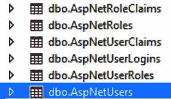
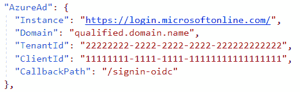
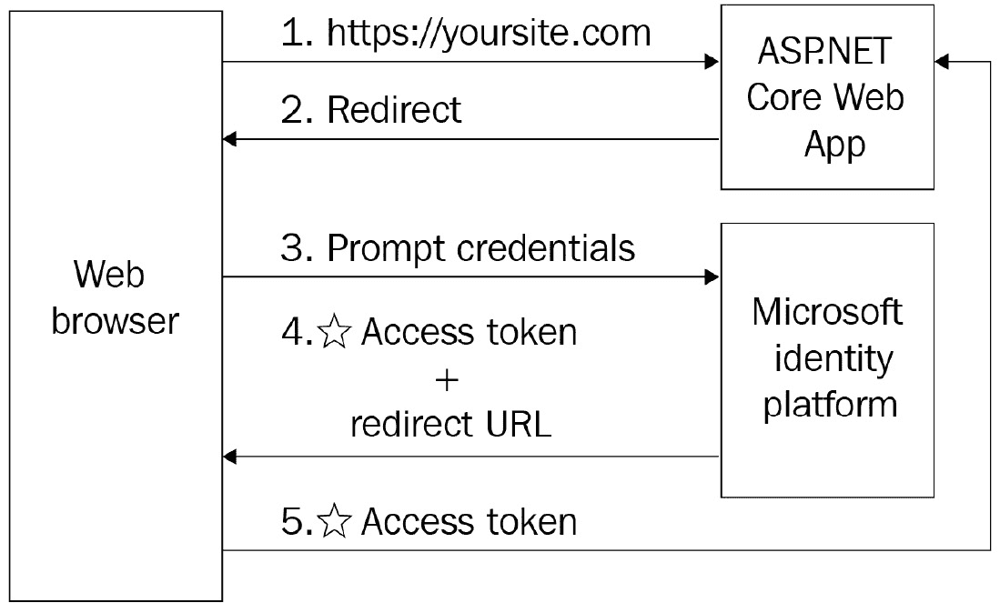
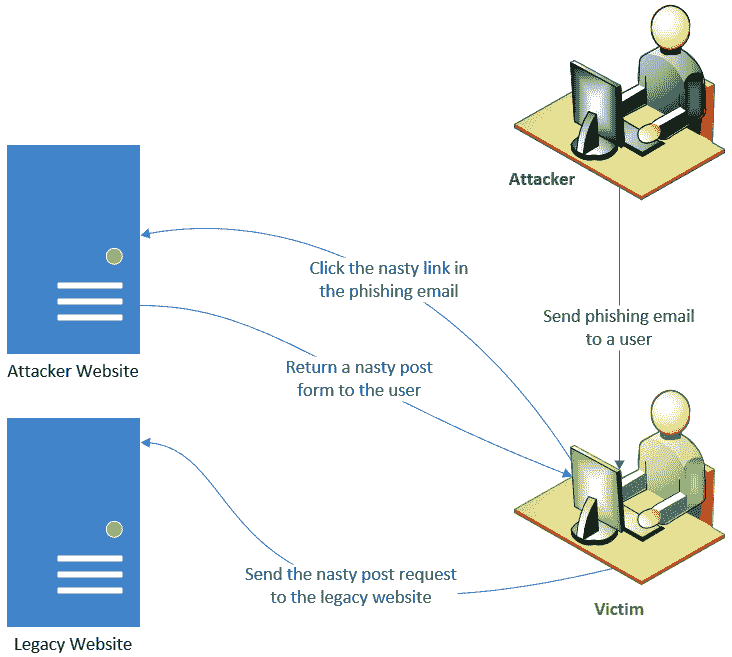
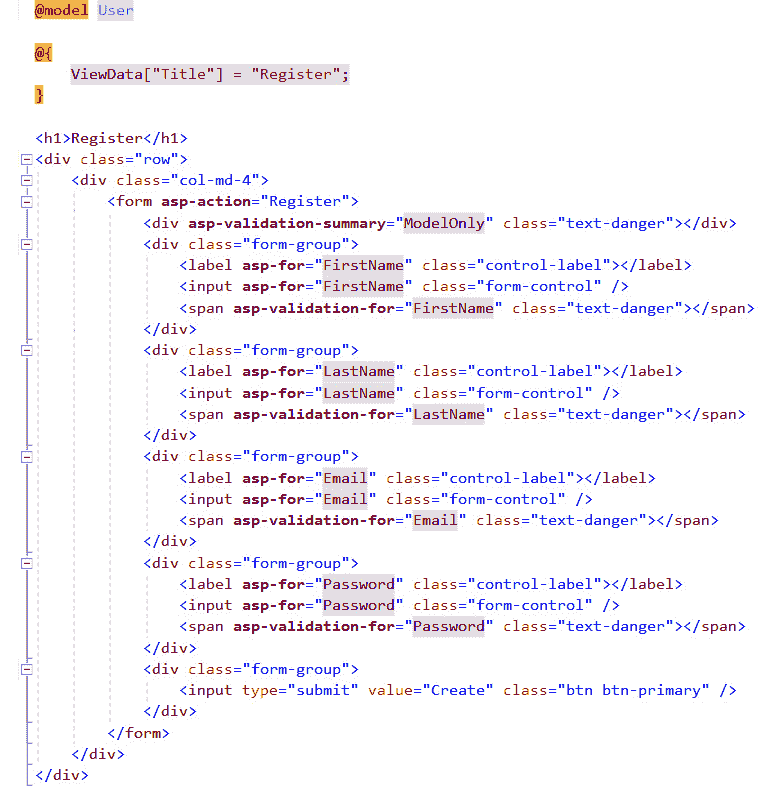

# 第七章：*第七章*：保护 ASP.NET 网络应用程序

在上一章中，我们探讨了在设计实施解决方案架构时应考虑的架构考虑因素。*为什么我们需要学习这些？*因为创建一个创新且稳健的软件解决方案需要我们规划各个方面，并考虑不同的属性来平衡短期和长期的产品目标和优先级。关注属性的质量、日志记录和跟踪，以及适当的部署策略，将有助于你交付一个质量好、可扩展、可维护和安全的优质产品。

对于任何解决方案架构师来说，设计和构建一个炫酷的产品都是一件令人兴奋的事情；然而，如果我们不关注其中涉及的安全风险，这种成就可能会被破坏。安全是任何软件解决方案的组成部分，尤其是**ASP.NET**网络应用程序。从本质上讲，这些应用程序会暴露给大量用户，因此安全不再是奢侈品，而是一个必需品。

**.NET Core**框架提供了一套强大的功能和内置功能，如果我们正确实施和配置，可以保护我们的应用程序。然而，这还不够，因为我们仍然需要应用一系列安全措施并编写安全代码来保护我们的应用程序免受威胁和漏洞。

在本章中，我们将涵盖以下主题：

+   保护 ASP.NET Core 应用程序

+   Web **应用程序编程接口**（**API**）安全建议

+   保护托管在 Azure 上的 Web 应用程序和 API

到本章结束时，我们将探讨一系列安全措施、技巧和窍门，帮助我们构建安全的 ASP.NET 网络应用程序。此外，我们将了解一些保护我们的 RESTful API（其中**REST**代表**REpresentational State Transfer**）的安全建议，以及一些在**Azure**上安全托管解决方案的提示。

最重要的是，本章为我们提供了一个确保解决方案安全的路线图。我们将深入了解如何将安全融入我们的解决方案架构，并看到创建安全软件最重要的因素是什么。

现在，让我们深入了解这些安全措施中的每一个。

# 介绍关键安全实践

在本节中，我们将探讨在构建我们的 ASP.NET 网络应用程序时需要考虑的关键安全措施。以下几节中包含一些**C#**代码示例，我们将使用这些示例来解释我们可能面临的各种安全漏洞。此代码语法基于**ASP.NET Core**和**.NET 5**，即使你有 ASP.NET Web Forms 应用程序，概念也是相同的。

以下是我们将在本节中学习的安全措施列表：

+   认证

+   授权

+   反**跨站脚本**（**XSS**）

+   **跨站请求伪造**（**CSRF**）

+   Cookie 窃取

+   过度发布

+   防止开放重定向攻击

+   阻止暴力破解攻击

+   文件上传保护

+   防止在 ADO.NET 和 Entity Framework（EF）中发生结构化查询语言（SQL）注入攻击

+   一般安全建议

## 身份验证

身份验证是验证试图访问应用程序的用户身份的过程。它从获取用户的凭据开始，然后将其与身份提供者（如**Windows Active Directory**）进行验证，该提供者可以是本地或作为**Microsoft 365**服务的一部分在云端。如果凭据的验证过程成功，则认为用户已通过身份验证。身份验证后，系统应开始授权过程，检查用户的访问级别并决定哪些数据和资源对该用户可访问。如果不了解用户是谁，则无法进行授权。

在 ASP.NET Core 中，有四种不同的身份验证模式，我们必须了解，如下所示：

+   `identity`模块。此模块将自动创建身份验证和授权 SQL 表，以及包括`Register`、`Login`、`LogOut`和`RegisterConfirmation`视图的 UI，这些视图将通过 scaffolding 功能添加到 Visual Studio 中。以下截图显示了在包管理器控制台应用迁移时将创建的 SQL 表：



图 7.1：ASP.NET 身份 SQL 表

通过使用此模式，未经身份验证的用户将被自动重定向到登录页面，在那里他们可以提供他们的登录凭据并将它们提交回服务器。如果身份提供者验证请求，ASP.NET 将颁发一个包含已验证用户 ID 令牌的 cookie，该令牌将被附加到每个请求的请求头中。这意味着所有后续请求都将自动使用存储在此 cookie 中的身份验证令牌进行身份验证。

这里是关于如何配置此身份验证模式的 Microsoft 参考：

[`docs.microsoft.com/en-us/aspnet/core/security/authentication/identity?view=aspnetcore-5.0&tabs=visual-studio`](https://docs.microsoft.com/en-us/aspnet/core/security/authentication/identity?view=aspnetcore-5.0&tabs=visual-studio)

)

+   `appSettings.json`文件；我们可以在注册应用程序后从 Azure Active Directory 获取这些设置：



图 7.2 – appsettings.json 文件中的配置

如前图所示，我们首先需要设置应用程序中使用的`Domain`名称。然后，我们需要设置从 Azure 获取的`TenantId`和`ClientId`。至于`CallbackPath`，这是我们希望在用户成功登录后重定向用户的**统一资源定位符**（URL）。

以下图表显示了使用 Microsoft 身份平台的认证过程：



图 7.3：使用 Microsoft 身份平台的认证过程

如您所见，未经认证的用户将被重定向到 Windows 登录页面，在那里他们被提示提供其凭据。如果凭据有效，则创建访问令牌。之后，用户将被重定向到登录页面或重定向到由身份提供者返回的 **HTTP** 响应中指定的 URL。

这里是关于如何配置 Microsoft 身份平台的一个 Microsoft 参考：

[`docs.microsoft.com/en-us/azure/active-directory/develop/quickstart-v2-aspnet-core-webapp`](https://docs.microsoft.com/en-us/azure/active-directory/develop/quickstart-v2-aspnet-core-webapp

)

+   **Windows**：这也被称为**协商**、**Kerberos**或**新技术局域网管理器**（**NTLM**）认证。这种认证模式最适合在同一个 Windows 域下运行的内部网络环境中的应用程序。它可以配置为在运行 Active Directory 域身份的内部网络上的**Internet Information Services**（**IIS**）或**Kestrel**托管的应用程序。此认证过程依赖于操作系统来获取用户的 ID 并确认认证。

    这里是关于如何配置 Windows 认证的 Microsoft 参考：

    [`docs.microsoft.com/en-us/aspnet/core/security/authentication/windowsauth?view=aspnetcore-5.0&tabs=visual-studio`](https://docs.microsoft.com/en-us/aspnet/core/security/authentication/windowsauth?view=aspnetcore-5.0&tabs=visual-studio

)

+   **None**：当我们选择此模式时，意味着不需要用户身份。这种模式用于两种情况——要么是我们的应用程序是公开的，任何人都可以访问它，要么是我们想构建自己的自定义认证模块。

在我们实施自定义认证过程时，以下是一些需要考虑的提示：

+   强制用户使用复杂密码，并在将其存储在用户表中之前对其进行散列。

+   永远不要在隐藏字段或任何状态管理对象中存储密码。

+   在将密码与请求头和正文一起提交到服务器之前，考虑使用客户端库对密码输入进行加密。在服务器端，当你收到密码时，你需要对其进行解密、散列，然后将其与数据库中散列的密码进行比较。如果它们相等，则认为用户已认证。

+   如果你正在使用会话，确保在注销时清除它们并修改会话 ID，在登录时生成一个新的会话 ID。

+   考虑实施**双因素认证**（**2FA**）。

+   永远不要授予任何用户对我们的 SQL 数据库的 `db_owner` 访问权限，包括用于连接字符串的用户。

## 授权

授权是决定用户 ID 是否应该被授予访问应用程序中特定资源的权限的过程。通常，授权在认证之后立即开始，并且可以给用户授予不同类型的资源授权，如下所示：

+   **URL 授权**：这是为了选择性地授予用户和角色访问应用程序中特定 URL 的权限。

+   **文件授权**：这个过程用于保护应用程序的资产，防止未经授权的用户浏览目录。

+   **UI 授权**：这也被称为**UI 剪裁**。这个过程是为了选择性地允许或拒绝特定用户或角色访问页面的任意部分。如果用户没有访问权限，该部分将从页面上完全移除。

在控制器类或非匿名操作上应用授权 `[Authorize]` 属性是非常容易的。以下是一个例子：

```cs
[Authorize(Users = "john,tim")]
public IActionResult EditContent() 
{ 
 return View(); 
}
```

如果你允许匿名访问控制器类中的一个特定操作，该类顶部有 `[Authorize]` 属性，那么你需要在操作顶部使用 `[AllowAnonymous]`。你可以使用 `[Authorize]` 属性来授予角色访问权限，而不仅仅是用户。

## 抗 XSS

**跨站脚本攻击（XSS**）被认为是网络上的头号安全漏洞，不幸的是，许多网络开发者并不熟悉这种漏洞的风险。XSS 是一种注入攻击，攻击者试图在另一个用户的网络浏览器中执行恶意客户端脚本。

在 XSS 攻击方面有两种情况：第一种被称为**被动注入**，攻击者在输入字段中输入一个有漏洞的脚本，该脚本将被存储在数据库中，并在用户访问页面时显示。第二种被称为**主动注入**，用户将一个有漏洞的脚本输入到输入字段中，该脚本将立即在屏幕上显示。

让我们在接下来的几节中通过一些例子来探讨这两个场景。

### 被动注入

这种类型的 XSS 攻击发生在网页接受未经清洗的文本输入，这些输入可以稍后显示给访问此页面的受害者。假设我们有一个在线博客文章，允许用户发表评论并相互交流。

如果我们指定评论的输入字段接受文本而不进行验证或清洗，那么攻击者将在评论字段中注入一个客户端脚本，该脚本将在用户访问此博客文章时被触发。以下是一个包含恶意输入的评论示例：

```cs
This is a nice post<script>window.alert('This is an unsecure website')</script>
```

在这个例子中，注释中包含**JavaScript**代码，该代码将触发一个带有恶毒信息的警告。这个信息将被存储在注释表中，并且每次用户尝试访问页面时，脚本都会被触发，并将信息显示给最终用户，这非常令人烦恼。

攻击者可以注入 JavaScript 代码来操纵页面的**HTML**代码，例如在这个例子中：

```cs
This is a nice post<script src="img/badscript.js"></script>
```

在前面的例子中，你会注意到攻击者注入了一个客户端库，它可以操纵你页面的 HTML 代码并显示不同的内容。

### 激活注入

这种类型的 XSS 攻击发生在用户输入立即显示在网页上且未在服务器上保存的情况下。假设我们有一个网页，它正在从 URL 的查询字符串中读取元数据，并且当我们访问页面时显示欢迎信息。

在这种情况下，攻击者可以操纵查询字符串并传递以下输入脚本：

```cs
johnsmith\x3cscript\x3e%20alert(\x27XSS attack! weak security\x27)%20\x3c/script\x3e
```

这将在网页上显示`XSS 攻击！弱安全`警告信息。

让我们检查以下建议，以帮助保护你的应用程序免受 XSS 攻击：

+   不要信任任何用户输入，即使用户已经认证。你应该始终验证最终用户提供的输入。此外，你应该在将文本存储在数据库或显示在网页上之前对查询字符串进行编码和转义单引号。

+   确保 URL 查询字符串已编码，并且在使用之前始终验证查询字符串中的值。

+   在将未信任的内容存储在数据库之前，执行内容清理。**HTML 清理**是检查动态内容的过程，仅保留与白名单匹配的标签。

+   你应该始终使用`@Html.Raw`来渲染未信任的内容。

+   你可以在将未信任的数据显示在 HTML 代码之前对其进行编码。这样，你可以确保没有人可以注入带有脚本代码的输入，因为编码机制会将`<`转换为`&lt;`，这将被视为普通文本。

+   确保设置`HttpOnly`标志以保护我们的 cookie 不被客户端代码访问。

## 跨站请求伪造 (CSRF)

**CSRF**（也称为缩写**XSRF**，发音为*sea-surf*或*c-surf*）是一种攻击类型，由恶意网站执行，强制一个受信任但易受攻击的网站在用户仍然认证的情况下执行不希望的操作。

CSRF 攻击是可能的，因为浏览器请求包括封装认证令牌的 cookie。在这种情况下，攻击者利用认证 cookie 欺骗受信任的网站，通过使用受信任网站的认证 cookie 执行恶意请求，而受信任的网站无法区分合法请求和伪造请求。这种类型的攻击也被称为**一键攻击**或**会话骑行**。

执行 CSRF 攻击的最简单方法是通过发送数百万封声称用户赢得了一大笔钱或拉斯维加斯之旅的钓鱼邮件来吸引用户的注意力。通常，邮件中包含一个链接，会将我们带到恶意网站，并且为了领取奖品，恶意网站会要求我们点击一个花哨的按钮。

当然，用户会毫不犹豫地这样做，原因各不相同。其中一个原因是他们不知道点击按钮的风险或后果。一旦点击按钮，恶意网站就会在请求中附加一个认证 cookie，向受信任的网站发送恶意的请求。如果易受攻击的网站没有采取诸如验证传入请求（如本例中所示）之类的预防措施，那么攻击很不幸地将成功。以下是 CSRF 攻击步骤的示意图：



图 7.4：CSRF 攻击步骤

以下是一些应考虑以防止 CSRF 攻击的建议：

+   生成一个用户特定的 CSRF 令牌并将其存储在隐藏字段中。此令牌应与每个请求一起提交，并在所有`POST`、`PUT`和`DELETE`请求上在服务器上进行验证。应在每次请求时重新生成令牌，以防止攻击者模拟此令牌并欺骗服务器端的验证过程。在 MVC 中，我们可以使用以下代码生成一个反伪造令牌：

    ```cs
    @using (Html.BeginForm("Create", "Product"))
    {
    @Html.AntiForgeryToken() 
      //Here we put our form fields along with the submit     button
    }
    ```

    这将输出以下 HTML 代码：

    ```cs
    "__RequestVerificationToken" hidden field is holding the CSRF token. Here is an example, showing us how to force the post action in the controller to validate the token before executing the core functionality of the action:

    ```

    [HttpPost]

    [ValidateAntiForgeryToken]

    public async Task<IActionResult>    Create (ProductViewModel newProduct)

    {

    <!-- 其他动作代码放在这里 -->

    }

    ```cs

    Notice the attribute on top of the action to validate the anti-forgery token. If the token is not valid, the request will be rejected/canceled.
    ```

+   考虑检查传入请求的`referer`头，它应引用受信任站点的同一域名。这将防止或取消来自不同域的请求。

## Cookie 窃取

Cookie 是网站的一个基本组成部分，因为它们通常持有已登录用户的会话详情。**Cookie**是一个在客户端浏览器和服务器之间来回传输的对象。因此，而不是在每次请求时对用户进行身份验证，可以在 cookie 中存储认证令牌或声明，并在登录后使用它来识别用户。没有 cookie，用户需要在每次请求时重新登录。

如果你在应用程序中使用 cookie，确保 cookie 的安全性非常重要。**Cookie 窃取**（也称为**会话劫持**）是一种攻击类型，允许黑客窃取已登录用户的 cookie，然后冒充该用户并代表其发送请求。在这种情况下，服务器被欺骗，因为攻击者发送的请求看起来是真实的，因为它包含有效的认证 cookie。

为了防止 cookie 窃取，我们必须应用以下建议：

+   使用**安全套接字层**（**SSL**）证书，并仅允许**HTTP 安全**（**HTTPS**）请求来加密用户和服务器之间传递的所有请求。

+   考虑在`web.config`文件中应用`secure`和`HttpOnly`标志来保护 cookie，并确保它仅通过 SSL 连接发送。

+   在登录后立即重新生成会话 ID。

+   考虑在注销时清除认证 cookie。

## 过度发布

ASP.NET 中的 **模型绑定** 处理传入请求与 .NET 应用程序模型之间的数据映射。这是一个强大的功能，它通过命名约定简化了用用户输入数据填充模型属性的过程。然而，这可能会通过允许攻击者填充表单中未呈现的一些模型属性而导致另一个安全漏洞。这种攻击被称为 **过度发布** 或 **批量赋值**。

让我们检查以下示例以了解过度发布漏洞。假设我们有一个用户模型，我们正在使用它在我们应用程序中注册新用户：

```cs
public class User
{
    public int ID { get; set; }
    public string FirstName { get; set; }
    public string LastName { get; set; }
    public string Email { get; set; }
    public string Password { get; set; }
    public bool IsAdmin { get; set; }
}
```

这是一个相当简单的用户模型。你会注意到模型中有一个名为 `IsAdmin` 的属性——这个属性用于指定用户在整个应用程序上是否有管理访问级别。**CSHTML** 视图不应包含此属性，因为我们不希望最终用户决定他们的访问级别。视图应该看起来像这样：



图 7.5 – 用户注册示例表单

当表单提交时，它将生成以下 HTTP `POST` 请求：

```cs
Request URL:http://TheWebsiteUrl/register
Request Method:POST
Status Code:200 OK
firstname:John
lastname:miller
email:john@xxx.com
password:encryptedPassword
. . .
```

然而，当使用调试代理服务器工具时，我们可以修改这个 HTTP 请求并包含额外的值和属性。在这种情况下，攻击者会在 `POST` 请求中包含 `IsAdmin:True`。结果，用户将以管理员权限在系统中注册。

*我们如何防止这种攻击？* 好吧，有几个解决方案可以防止这种漏洞，例如以下几种：

+   在 `public IActionResult Register(User model)` 中，我们可以使用 `public IActionResult Register(string firstName, string lastName, string email, string password)`，并在操作的实现中使用传递给操作参数的字段来填充模型。在这种情况下，任何由攻击者添加的额外属性都将被忽略。

+   `RegisterUserViewModel`。在这个新模型中，我们只添加了注册所需的属性，因此操作将变为 `public IActionResult Register(RegisterUserViewModel model)`。我喜欢这个选项，并且通常将其作为常见做法。

+   在方法参数上使用 `BindAttribute` 类，并且只包含（白名单）我们希望允许绑定到模型上的属性。因此，操作应该看起来像这样：`public IActionResult Register(([Bind("FirstName,LastName,Email,Password") User model)]`

作为一种良好的实践，我们不应该直接将数据库实体作为 MVC 视图和操作中的模型使用。

## 防止公开重定向攻击

让我们先了解什么是公开重定向攻击。如果你在 Web 应用程序中有逻辑将用户重定向到查询字符串或通过 HTTP 请求的参数中指定的 URL，这可能会被篡改以将用户重定向到恶意 URL，窃取他们的凭证。

假设攻击者发送了一封包含重定向链接的电子邮件，如下所示：

```cs
http://www.yourtrustedwebsite.com?ReturnUrl=www.fakedomain.com/login
```

通常，一些用户不会查看查询字符串，而其他人甚至不会检查 URL 的第一部分中的域名。当他们点击这个 URL 时，他们会被重定向到由恶意网站提供的登录页面。这个登录页面在外观和感觉上与受信任网站的原始登录页面非常相似。在这种情况下，用户会提供他们的凭据，假设他们正常登录。

然而，攻击者会窃取凭据并将它们重定向到受信任网站的原始登录页面。用户会感觉他们提供了错误的用户名或密码，因此他们会再次提供这些信息并继续他们在受信任网站上想要做的事情。

以这种方式，攻击者窃取了用户凭据，而受害者却从未察觉。这种攻击被称为**开放重定向攻击**。现在，让我们谈谈如何防止它。

当在你的 Web 应用程序中使用此类重定向逻辑时，将所有用户视为不可信。因此，我们需要确保只将重定向到我们应用程序内的本地 URL，或者使用 ASP.NET 中可用的新方法，名为`LocalRedirect`。这用于将重定向到应用程序本身内的本地 URL，这意味着在触发重定向之前会验证 URL，如果 URL 不是本地的，该方法将抛出异常。

此外，还有一个方法来验证一个 URL 是否是本地的——你可以使用`Url.IsLocalUrl(..)`。这个方法会返回一个布尔值来指示 URL 是否是本地的。

## 阻止暴力攻击

在密码学中，**暴力攻击**（也称为**穷举搜索**）涉及攻击者通过彻底尝试所有可能的字母、数字和符号组合来猜测密码，直到发现正确的组合。在许多情况下，攻击者会使用机器人工具执行自动攻击并预测密码。为了防止此类攻击，我们可以采取以下步骤：

+   在达到特定次数的失败登录尝试后锁定用户账户。

+   在登录页面上实施**完全自动化的公钥图灵测试**（**CAPTCHA**）。

+   考虑允许从特定的**互联网协议**（**IP**）地址登录，并限制其他所有 IP 地址的登录。

+   强制使用复杂的密码。

+   考虑启用双因素认证（2FA）。

+   阻止攻击者的 IP 地址，但这并不是一个保证的解决方案，因为攻击者可以更改他们进行攻击的 IP 地址。

+   考虑使用合适的用户名，并避免使用`admin`、`administrator`或任何其他容易被猜到的用户名。

## 文件上传保护

文件上传允许用户在提交表单时上传文件。职业表单是文件上传用法的简单示例，其中用户在申请职位时需要附加简历。攻击者可以利用文件上传并尝试将恶意文件上传到服务器。以下是一些减少使用文件上传成功攻击可能性的安全步骤：

+   禁用存储上传文件的文件夹的执行权限。

+   确保只使用白名单来允许经过批准的文件扩展名。

+   启用客户端验证，在将文件上传到服务器之前检查文件扩展名。

+   检查上传文件的大小，并限制上传超过大小限制的大文件。

+   确保使用 .NET 服务器端代码检查上传文件的标题，以防止上传恶意文件。

+   对文件名进行编码，特别是如果您在 HTML 代码中显示文件名的话。

## 防止 ADO.NET 和 Entity Framework 中的 SQL 注入

**SQL 注入** 是一种漏洞，允许攻击者绕过应用程序中采取的安全措施，直接在应用程序的数据库中执行恶意 SQL 命令。

使用这些 SQL 命令，攻击者可以查询其他用户的数据。他们还可以修改数据，甚至删除某些表或整个数据库，这可能会给客户业务造成重大损失，尤其是如果没有适当的备份流程的话。

此外，他们可以将攻击升级以危害整个 SQL 服务器。SQL 注入攻击是我们可能面临的最危险的攻击之一，因为它影响整个数据库，以及可能托管在同一服务器上的所有数据库。让我们了解如何防止此类攻击，如下所述：

+   通过强制约束、验证数据的类型和格式以及执行清理来检查恶意输入数据。

+   考虑使用参数化 SQL 存储过程进行数据访问，并避免使用与内联 SQL 语句的文本连接。

+   永远不要将管理权限授予在数据访问层中使用的 SQL 用户——读取/写入权限就足够了。

+   避免泄露应用程序中可能发生的数据库错误详情。实际错误应正确记录在集中位置，并且应将最终用户重定向到没有技术详情的自定义错误页面。

+   在 `web.config` 文件中加密 SQL 连接，以保护与数据库的连接安全。

+   SQL 注入漏洞适用于 **NoSQL** 数据库，如 **Azure Cosmos DB** 和 **MongoDB**，因此所有之前的建议也适用于这种情况。

## 一般安全建议

在前面的章节中，我们学习了主要的安全漏洞。在本节中，我们将强调一些安全建议，这些建议将提高解决方案的安全性，如下所述：

+   考虑启用审计跟踪、日志记录和跟踪来监控所有事件和传入请求。

+   通过安装 .NET 补丁始终升级您解决方案中使用的 .NET 版本，以从微软团队发布的安全增强功能中受益。

+   在将密码发送到服务器之前考虑加密，以避免嗅探攻击。

+   常见的安全步骤之一是启用以下响应头：

    a. `Content-Security-Policy`: 这允许我们指定可以加载到网站上的内容源白名单。它有助于防止 XSS，`X-Content-Type-Options`: 这有助于防止 `X-XSS-Protection`: 这启用了 XSS 过滤器。

+   阻止 `X-Frame-Options` 响应头。

+   通过删除以下响应头，防止泄露与托管服务器和 .NET 框架相关的敏感数据：

    a. `Server`: 这个头指定了 Web 服务器版本（IIS 版本）。

    b. `X-Powered-By`: 这个头指示该网站由 ASP.NET 驱动。

    c. `X-AspNet-Version`: 这个头指定了使用的 ASP.NET 版本。

+   避免使用已知存在漏洞的第三方组件和库。

+   考虑定期更新 **NuGet** 包，以利用最新的修复和增强功能。

+   如果您使用 IIS 托管您的应用程序，请确保加密连接字符串，因为它包含可以访问数据库的用户凭据。如果您使用 Azure App Service 托管您的应用程序，请考虑将连接字符串存储在 Azure 应用设置中，而不是 `web.config` 文件中。

在本节中，我们探讨了一系列关键的安全实践，以帮助保护我们的 ASP.NET 网络应用程序免受恶意攻击。一旦应用了这些实践中的每一个，它将为应用程序添加一层安全防护。目标是强调在设计和构建健壮的 Web 解决方案时，解决方案架构师应关注的各个领域。

在下一节中，我们将学习如何通过一系列安全建议来确保 Web API 的安全。

# Web API 安全建议

随着对构建现代网页和移动应用需求的不断增长，Web API 已成为赋予这些应用通信数据访问层功能的关键，同时也需要采取适当的措施来保护 Web API。除了我们在上一节中讨论的安全建议外，以下是一些确保您的 Web API 安全的基本技巧：

+   考虑使用最新的 **传输层安全性**（**TLS**）版本来加密应用程序和服务器之间的通信。

+   认证尝试消费 RESTful API 的用户。

+   通过启用审计日志、跟踪和日志记录来监控所有事件，表现得像跟踪狂。

+   考虑通过应用节流和配额来保护您的 API，例如限制特定时间内的消息数量。这对于根据可用容量控制服务器的带宽非常重要。

+   总是验证**JavaScript 对象表示法**（**JSON**）数据输入，以避免 SQL 注入。

+   在您托管 Web API 的服务器上启用适当的防火墙配置。

+   考虑使用 API 网关，这是一个位于客户端应用程序和 RESTful API 之间的中间件层。这可以帮助您保护、控制和监控 RESTful API 的流量。

+   防止**分布式拒绝服务**攻击（也称为**DDoS**攻击），这种攻击通过并发连接的洪水来发送大量无用的请求，从而耗尽托管服务器的内存和容量。您可以通过启用基于并发请求数量的动态 IP 限制扩展来防止 IIS 中的 DDoS 攻击，该扩展可以阻止来自某些 IP 地址的传入请求。如果应用程序托管在 Azure 上，则我们可以启用**Azure DDoS 保护**。

+   考虑在每次请求中强制执行时间戳，将其添加到请求头中。服务器应验证此时间戳，以确保只接受在特定时间段内的请求。这种方法可以帮助您保护 Web API 免受暴力攻击（在*阻止暴力攻击*部分中解释）和重放攻击，这些攻击允许攻击者恶意完成重复请求。

在本节中，我们讨论了一系列应应用于确保 ASP.NET Web API 安全的建议。

# 保护托管在 Azure 上的 Web 应用程序和 API

在本节中，我们将强调如果您在 Azure 上托管 Web 应用程序或 Web API，应牢记的一些安全建议，如下所述：

+   考虑启用**Azure Defender**以保护您的应用程序服务。

+   总是运行 Azure Defender 中可用的集成漏洞扫描程序，以扩展 SQL 服务器及其存储数据库的保护。

+   您可以通过使用受支持平台、框架和协议的最新版本来保持应用程序服务最新。

+   禁用对 blob 存储的匿名访问以保护上传的文件。如果需要，您可以启用对特定文件夹的匿名访问。

+   强制使用**SSL**/**TLS**协议以提供安全连接。

+   总是使用**安全文件传输协议**（**FTPS**）而不是常规的**FTP**来部署您的文件，如果您不使用 FTP，请禁用 FTP 协议。

+   考虑使用环境变量来存储您的数据库凭据、API 令牌以及任何应用程序设置。

+   考虑使用云**Windows 应用程序防火墙**（**WAF**），这可以帮助保护您的 Web 应用程序免受恶意攻击和常见的 Web 漏洞，例如 SQL 注入和 XSS。

# 摘要

在本章中，我们了解到安全性是 Web 解决方案的一个基本组成部分。我们概述了基本的安全措施和技术，以帮助理解可能的安全漏洞，这将使我们能够保护 ASP.NET Web 应用程序免受恶意攻击。

此外，我们强调了确保我们的 RESTful API 的一些关键指南。在本章的后面部分，我们探讨了确保可以在 Azure 上托管的应用的一些技巧。这些安全实践使我们能够构建既强大又安全的 ASP.NET 应用程序。

除了本章中分享的建议外，我强烈建议您通过阅读微软.NET 团队分享的在线官方文档来不断更新您对 ASP.NET 安全特性的知识。以下是文档的链接：[`docs.microsoft.com/en-us/aspnet/core/security/?view=aspnetcore-5.0`](https://docs.microsoft.com/en-us/aspnet/core/security/?view=aspnetcore-5.0)。

在下一章中，我们将探讨在发布解决方案之前可能需要进行的各种测试类型。
