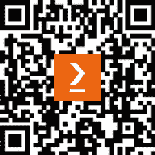

# 前言

本书涵盖了现代基于云和分布式软件架构中最常见的模式和框架。它通过提供实际、真实世界的场景，讨论何时以及如何使用每个模式。

本书还介绍了 DevOps、微服务、Kubernetes、持续集成和云计算等技术流程，以便您能够开发并交付最佳级别的软件解决方案给客户。

本书将帮助您理解客户希望您提供的产品。它将指导您在开发过程中解决可能遇到的最大问题。它还涵盖了在基于云的环境中管理应用程序时需要遵循的“做”和“不做”事项。您将了解不同的架构方法，例如分层架构、洋葱架构、面向服务的架构、微服务、单页应用程序和云架构，并了解如何将它们应用于特定的业务需求。

最后，您将使用 Azure 在远程环境或云中部署代码。

本书中的所有概念都将通过实际、实用的案例研究来解释，其中设计原则在创建安全且稳健的应用程序时起着至关重要的作用。到本书结束时，您将能够开发和交付高度可扩展且安全的企业级应用程序，以满足最终客户的业务需求。

值得一提的是，本书不仅将涵盖软件架构师在开发 C#和.NET Core 解决方案时应遵循的最佳实践，还将讨论您需要掌握的所有环境，以便根据最新趋势（如 Kubernetes、ASP .NET Core 和 Blazor）开发软件产品。

这第四版在代码、细节程度和解释方面都得到了改进，并适应了 C# 12 和.NET 8 带来的新机遇。

此外，我们还添加了大量全新的内容，例如一个专门针对案例研究的章节，以及一个针对 Kubernetes 的.NET 开发的章节，作为案例研究的扩展，因为我们使用案例研究的见解来构建这一章节。

# 本书面向的对象

本书面向希望成为架构师或希望使用.NET 框架构建企业应用的工程师和高级开发者。它也适用于任何希望提高基于.NET 和 C#的企业解决方案相关知识的软件架构师。值得注意的是，需要具备 C#和.NET 的经验。

# 本书涵盖的内容

*第一章*，*理解软件架构的重要性*，解释了软件架构的基础知识。这一章将帮助您培养正确的思维方式来面对客户需求，然后选择正确的工具、模式和框架。

*第二章*，*非功能性需求*，指导您在应用程序开发的重要阶段，即收集和考虑应用程序必须满足的所有约束和目标，例如可伸缩性、可用性、弹性、性能、多线程、互操作性和安全性。

*第三章*，*管理需求*，描述了管理需求、错误和其他有关您应用程序的信息的技术。虽然大多数概念是通用的，但本章重点介绍了 Azure DevOps 和 GitHub 的使用。

*第四章*，*使用 C# 12 的编码最佳实践*，描述了在用 C# 12 开发.NET 8 应用程序时应遵循的最佳实践，包括评估软件质量的指标以及如何借助 Visual Studio 中包含的所有工具来衡量它们。在这里，您还将学习如何使用功能测试自动验证整个应用程序的某个版本是否符合约定的功能规范。

*第五章*，*在 C# 12 中实现代码重用*，描述了在您的.NET 8 应用程序中最大化代码重用模式的最佳实践。它还讨论了代码重构的重要性。

*第六章*，*设计模式和.NET 8 实现*，描述了常见的软件模式，并提供了.NET 8 的示例。在这里，您将了解模式的重要性以及使用它们的最佳实践。

*第七章*，*理解软件解决方案中的不同领域*，描述了现代领域驱动设计软件生产方法论以及相关的模式和架构。在这里，您还将学习如何使用它来应对需要多个知识领域的复杂应用程序，以及如何利用基于云和微服务架构的优势。

*第八章*，*理解 DevOps 原则和 CI/CD*，描述了软件开发和演变的 DevOps 基础。在这里，您将学习如何组织您应用程序的持续集成/持续交付周期，讨论实现这一场景的机会和困难。它还描述了如何自动化整个部署过程，从在源存储库中创建新版本，通过各种测试和审批步骤，到在实际生产环境中部署应用程序。在这里，您将学习如何使用 Azure Pipelines 和 GitHub Actions 来自动化整个部署过程。

*第九章*，*测试您的企业应用程序*，描述了如何测试您的应用程序，包括必须在开发生命周期中包含的各种测试类型以及测试驱动开发方法。在这里，您还将学习如何使用 xUnit 测试.NET Core 应用程序，并了解如何借助测试驱动设计轻松开发和维护满足您规格的代码。

在这里，您还将学习如何使用功能测试自动验证整个应用程序的某个版本是否符合约定的功能规范。

*第十章*，*选择最佳云解决方案*，为你提供了云中可用的工具和资源的广泛概述，特别是关于 Microsoft Azure。在这里，你将了解如何搜索合适的工具和资源，以及如何配置它们以满足你的需求。

*第十一章*，*将微服务架构应用于企业应用程序*，提供了对微服务和 Docker 容器的广泛概述。在这里，你将了解基于微服务的架构如何利用云提供的所有机会，以及如何使用微服务在云中实现灵活性、高吞吐量和可靠性。你还将学习如何使用容器和 Docker 在你的架构中混合不同的技术，以及如何使你的软件平台独立。

*第十二章*，*在云中选择最佳数据存储方案*，描述了云中和 Microsoft Azure 中可用的主要存储引擎。在这里，你将了解如何选择最佳的存储引擎以实现所需的读写并行性，如何配置它们，以及如何从你的 C#代码中与它们交互。

*第十三章*，*使用 C#与数据交互 – Entity Framework Core*，详细解释了你的应用程序如何借助**对象关系映射**（**ORMs**）以及特别是 Entity Framework Core 8.0 的帮助与各种存储引擎进行交互。

*第十四章*，*使用.NET 实现微服务*，描述了如何在实践中使用.NET 实现微服务以及如何设计微服务之间的通信。在这里，你还将了解如何在你.NET 项目中使用 gRPC 通信协议和 RabbitMQ 消息代理。

*第十五章*，*使用.NET 应用服务导向架构*，描述了服务导向架构，它使你能够将应用程序的功能作为 Web 或私有网络上的端点暴露出来，以便用户可以通过各种类型的客户端与之交互。在这里，你将了解如何使用 ASP.NET Core 和 gRPC 实现服务导向架构端点，以及如何使用现有的 OpenAPI 包来自动文档化它们。

*第十六章*，*使用无服务器计算 – Azure Functions*，描述了计算的无服务器模型以及如何在 Azure 云中使用它。在这里，你将了解如何仅在需要运行某些计算时分配云资源，从而只需为实际的计算时间付费。

*第十七章*，*介绍 ASP.NET Core*，详细描述了 ASP.NET Core 框架。在这里，你还将了解如何根据**模型-视图-控制器**（**MVC**）模式实现基于 Web 的应用程序。

*第十八章*，*使用 ASP.NET Core 实现前端微服务*，专注于前端微服务，即那些在应用程序外部与世界交互的微服务。在这里，你将详细了解如何基于 ASP.NET Core 实现前端微服务。

*第十九章*，*客户端框架：Blazor*，介绍了用于实现表示层的各种客户端技术。本章重点介绍了基于浏览器的 Blazor WebAssembly 和基于.NET MAUI 的本地 Blazor，并详细描述了它们。在这里，你将学习如何使用 C#实现单页应用和本地应用。

*第二十章*，*Kubernetes*，描述了 Kubernetes，这是微服务编排的事实标准。在这里，你将在 Kubernetes 上打包和部署微服务应用。你将学习如何与 Azure Kubernetes Service 交互，以及如何使用 Minikube 在你的开发机器上模拟 Kubernetes 集群。

*第二十一章*，*案例研究*，专注于书籍旅行社案例研究，展示了在实现基于微服务的企业应用中，如何将书中学习到的技术和架构模式付诸实践。

*第二十二章*，*案例研究扩展：为 Kubernetes 开发.NET 微服务*，将*第二十一章*，*案例研究*中探索的.NET 微服务的实际实施见解与*第二十章*，*Kubernetes*中介绍的 Kubernetes 基础知识相结合。

*答案*包含了所有章节末尾可以找到的问题的答案。

*附录：人工智能与机器学习*是一个仅在网络上提供的章节，包含人工智能和机器学习的介绍。第一部分总结了基本原理和技术，而第二部分则通过描述 Azure Machine Learning Studio 和基于 ML .NET 的简单示例来将这些原理和技术付诸实践。

您可以通过以下链接阅读附录：[`static.packt-cdn.com/downloads/9781805127659_Appendix.pdf`](https://static.packt-cdn.com/downloads/9781805127659_Appendix.pdf)

# 要充分利用这本书

+   不要忘记安装 Visual Studio Community 2022 或更高版本。

+   如果想要更深入地理解任何章节的内容，请随时跳转到*第二十一章*，*案例研究*中建议的部分。

+   同样，在深入*第二十一章*，*案例研究*的任何部分之前，请先回顾相应建议章节中讨论的理论。

## 下载示例代码文件

本书代码包托管在 GitHub 上，网址为[`github.com/PacktPublishing/Software-Architecture-with-C-Sharp-12-and-.NET-8-4E`](https://github.com/PacktPublishing/Software-Architecture-with-C-Sharp-12-and-.NET-8-4E)。我们还有其他来自我们丰富图书和视频目录的代码包，可在[`github.com/PacktPublishing/`](https://github.com/PacktPublishing/)找到。查看它们吧！

## 下载彩色图像

我们还提供了一份包含本书中使用的截图/图表彩色图像的 PDF 文件。您可以从这里下载：[`packt.link/gbp/9781805127659`](https://packt.link/gbp/9781805127659)。

## 使用的约定

本书使用了多种文本约定。

`CodeInText`：表示文本中的代码单词、数据库表名、文件夹名、文件名、文件扩展名、路径名、虚拟 URL、用户输入和 Twitter 昵称。例如：“将下载的`WebStorm-10*.dmg`磁盘映像文件作为系统中的另一个磁盘挂载。”

代码块应如下设置：

```cs
private static string ParseIntWithTryParse()
{
    string result = string.Empty;
    if (int.TryParse(result, out var value))
        result = value.ToString();
    else
        result = "There is no int value";
    return $"Final result: {result}";
} 
```

当我们希望将您的注意力引到代码块中的特定部分时，相关的行或项目将以粗体显示：

```cs
**private****static** string ParseIntWithException()
{
    string result = string.Empty;
    **try**
    {
        result = Convert.ToInt32(result).ToString();
    }
    **catch** (Exception)
    {
        result = "There is no int value";
    }
    return **$"Final result:** **{result}****"****;** 
```

任何命令行输入或输出都应如下编写：

```cs
sudo cp sample.service /lib/systemd/system
sudo systemctl daemon-reload
sudo systemctl enable sample 
```

**粗体**：表示新术语、重要单词或屏幕上看到的单词。例如，菜单或对话框中的单词在文本中显示如下。例如：“从**管理**面板中选择**系统信息**。”

警告或重要注意事项如下所示。

技巧和窍门如下所示。

# 联系我们

我们始终欢迎读者的反馈。

**一般反馈**：请发送电子邮件至`feedback@packtpub.com`，并在邮件主题中提及书籍标题。如果您对本书的任何方面有疑问，请发送电子邮件至`questions@packtpub.com`。

**勘误表**：尽管我们已经尽最大努力确保内容的准确性，但错误仍然可能发生。如果您在这本书中发现了错误，如果您能向我们报告，我们将不胜感激。请访问[`www.packtpub.com/submit-errata`](http://www.packtpub.com/submit-errata)，搜索这本书，点击**提交勘误**，并填写表格。

**盗版**：如果您在互联网上以任何形式发现我们作品的非法副本，如果您能提供位置地址或网站名称，我们将不胜感激。请通过链接与我们联系`copyright@packtpub.com`。

**如果您有兴趣成为作者**：如果您在某个领域有专业知识，并且您有兴趣撰写或为书籍做出贡献，请访问[`authors.packtpub.com`](http://authors.packtpub.com)。

# 分享您的想法

一旦您阅读了《*软件架构：C# 12 和.NET 88，第四版*》，我们很乐意听听您的想法！请[点击此处直接访问此书的亚马逊评论页面](https://www.packtpub.com/)并分享您的反馈。

您的评论对我们和科技社区都很重要，并将帮助我们确保我们提供高质量的内容。

# 下载此书的免费 PDF 副本

感谢您购买此书！

您喜欢在路上阅读，但无法携带您的印刷书籍到处走？

您的电子书购买是否与您选择的设备不兼容？

别担心，现在每购买一本 Packt 书籍，您都可以免费获得该书的 DRM 免费 PDF 版本。

在任何地方、任何设备上阅读。直接从您最喜欢的技术书籍中搜索、复制和粘贴代码到您的应用程序中。

优惠不会就此停止，您还可以获得独家折扣、时事通讯和每日免费内容的每日电子邮件。

按照以下简单步骤获取好处：

1.  扫描下面的二维码或访问以下链接。



[`packt.link/free-ebook/9781805127659`](https://packt.link/free-ebook/9781805127659)

1.  提交您的购买证明。

1.  就这样！我们将直接将您的免费 PDF 和其他优惠发送到您的电子邮件。
